> **注意：以下的内容均为个人观点。**
>
> **如果你看完后有不同的观点也没关系！请指出，我很乐意去学尝试积极的东西。**

封面：

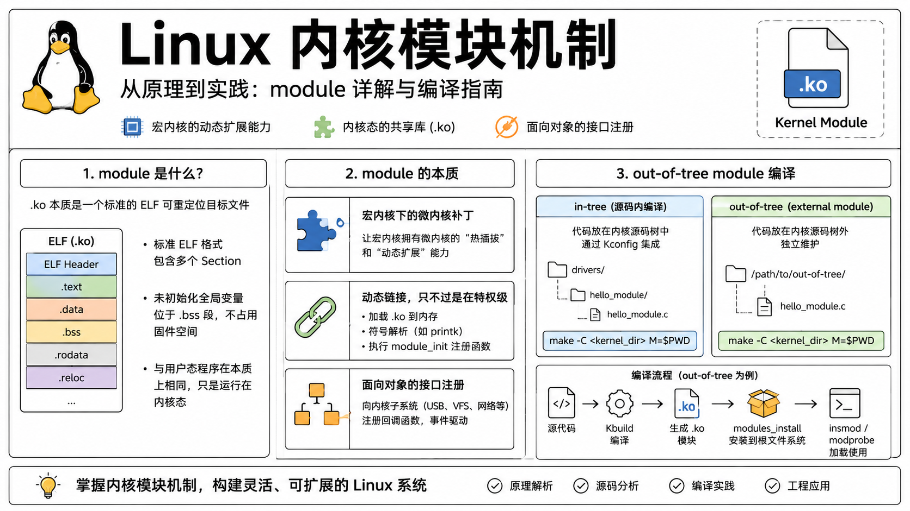

# 1. module 是什么？

> 还是参照博主：[BSP工程师的内核必修课：2.1 内核模块机制](https://mp.weixin.qq.com/s?__biz=MzY5OTE1OTEzMA==&mid=2247485369&idx=1&sn=5297f8e6428e713d146204b54032079a&chksm=f442008cc335899a629dc07a450dd8ef3cd5296b9ad61955516d32e620db8eb0966607760929&scene=178&cur_album_id=4441964449075331074&search_click_id=#rd) 第二章的讲解内容，同时补充自己对一些额外问题的理解，以及一些混乱问题的实践。

## 1.1 module 和 ELF

首先，关于什么是 module，从本质上讲，Linux 的 `.ko` 文件是一个标准的 ELF（Executable and Linkable Format）可重定位目标文件。所以只要是标准的二进制程序文件，它内部就会被严格划分为多个 Section。

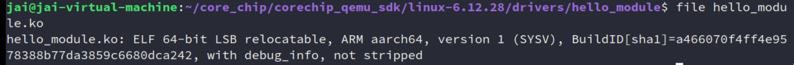

简单理解为和之前平时写 user 的代码没两样，只是说在后面的模块编译、加载、使用等内容有更独特的地方。

这里也可以简单看看这篇文章：[未初始化的全局变量占不占固件空间？](https://mp.weixin.qq.com/s/DAPoV3Zk-xmB1rek8yHbsw)了解这个问题的同时也学习下 ELF。


## 1.2 module 的本质

关于 module，个人认为这就是一个 OS 上的概念：Loadable kernel module，[Wikipedia](https://en.wikipedia.org/wiki/Loadable_kernel_module#Linux)相关定义如下：

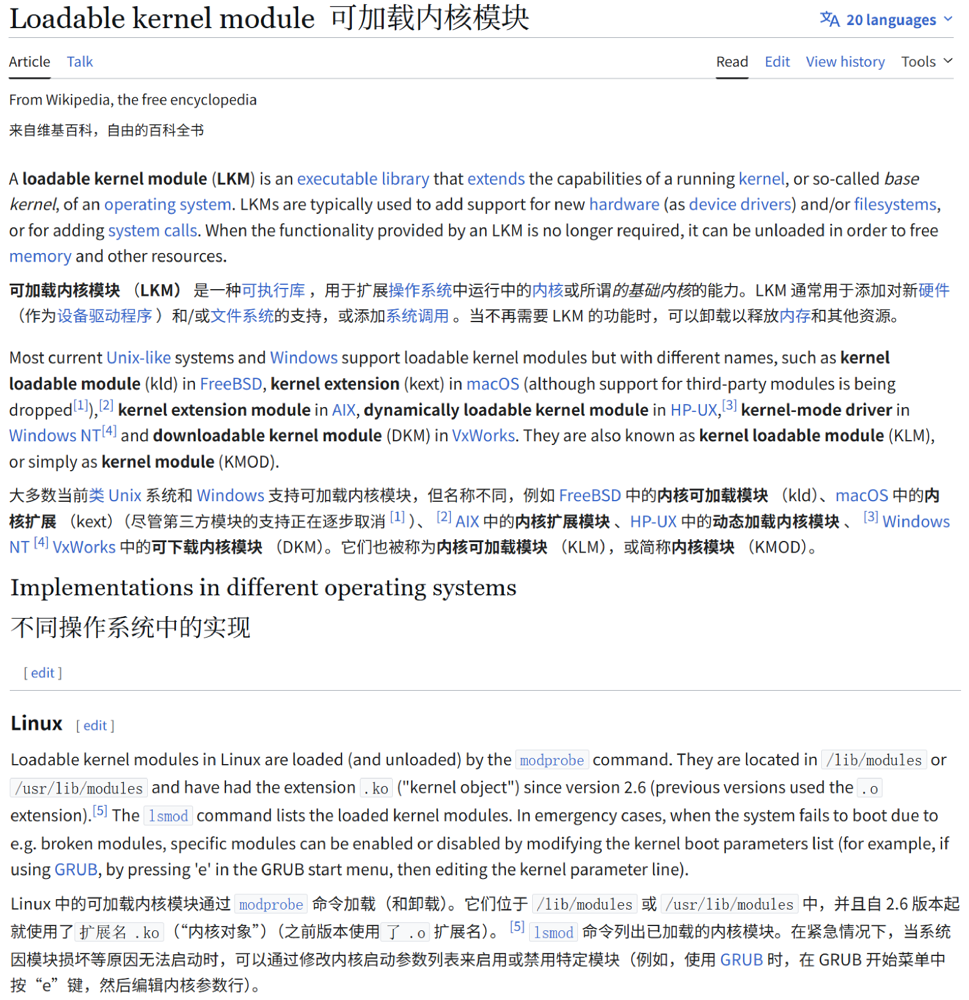

则可以进一步总结为三点的内容：

1. 宏内核下的微内核补丁

    这个问题博主在：[BSP工程师的内核必修课：2.1 内核模块机制](https://mp.weixin.qq.com/s?__biz=MzY5OTE1OTEzMA==&mid=2247485369&idx=1&sn=5297f8e6428e713d146204b54032079a&chksm=f442008cc335899a629dc07a450dd8ef3cd5296b9ad61955516d32e620db8eb0966607760929&scene=178&cur_album_id=4441964449075331074&search_click_id=#rd) 已经讲过。

    模块的本质，就是让宏内核拥有了类似微内核（Microkernel）的“热插拔”和“动态扩展”能力。

    > 本人在 QNX 下也做过一些开发，在这种微内核上写相关的驱动代码的体验，实际上就是在写应用程序。比如说 QNX 经典的 `resmgr`，资源/驱动都是通过这个机制来写的，各个 `resmgr` 之间通过 `IPC` 通信。

2. 动态链接，只不过是在特权级

    我们在用户空间会使用到动态库（`.so`）来加载一些会被公用的程序，内核模块 `.ko` 本质上就是内核态的共享库。

    比如说，当我输入 `insmod`、`modprobe` 的时候，实质是用户态的程序调用了 `finit_module` 系统调用，这做的事情和用户态的动态链接器 `ld.so` 都差不多：

    1. load `.ko` 进内存

    2. 符号解析

        比如调用一个 `printk`，但是 `printk` 是外部定义的，那么内核就会去遍历自己维护的导出符号表（Exported Symbol Table），找到内核镜像中 `printk` 的物理内存地址，然后把这个地址填进自己的模块代码中。

        > 如果要看内核导出了什么符号，可以这么看：
        >
        > ```bash
        > cat /proc/kallsyms  | less
        > 
        > 0000000000000000 A fixed_percpu_data
        > 0000000000000000 A __per_cpu_start
        > 0000000000000000 A cpu_debug_store
        > 0000000000000000 A irq_stack_backing_store
        > 0000000000000000 A entry_stack_storage
        > ...
        > 0000000000000000 A logical_maps
        > 0000000000000000 A cpu_die_map
        > 0000000000000000 A cpu_core_map
        > 0000000000000000 A cpu_sibling_map
        > 0000000000000000 A cpu_info
        > ...
        > ```

    3. 执行模块特定的 `module_init` 注册函数。

3. 面向对象的接口注册

    这个理解也很好懂，模块本身就不能用运行，本质就是一个事件驱动的插件，所以我写任何的模块代码，本质上都是在对 kernel 的几个 subsystem（USB、VFS、网络等等）注册自己的回调函数，通知内核说：如果发生了 X 事件（比如某个 USB 设备插进来了），请调用我的 Y 函数。”


# 2. out-of-tree/external module 编译

> 这部分的内容单纯操作熟悉后其实很简单，但什么 `in-tree / out-of-tree`、源码内编译，比较混乱，因为随着模块的变动、开发时间的推移，他们的描述就会变，所以个人就很讨厌这些描述（自己一直认为：不要看去看定义，看这个东西具体做了做什么），但不讲明白又会影响和他人的沟通。

看到这个的第一想法，要编译一个东西，那就要把它使用到的功能/依赖全都囊括进来，编译模块也是一样的。

所以，所以自然就需要指定内核源码的位置，这是第一步。

其次要考虑的就是 `module` 相关的代码，就比如说是博主写的 `drivers/hello_module`：

```C
// hello_module.c
#include <linux/init.h>      // 包含初始化宏
#include <linux/module.h>    // 最重要的头文件，描述模块信息
#include <linux/kernel.h>    // 提供内核常用宏和函数

// 模块加载函数（初始化函数）
static int __init hello_init(void)
{
    printk(KERN_INFO "Hello, Core&Chip Kernel Module!\n");
    return 0; // 返回0表示加载成功
}

// 模块卸载函数（清理函数）
static void __exit hello_exit(void)
{
    printk(KERN_INFO "Goodbye, Core&Chip Kernel Module!\n");
}

// 指定加载和卸载函数
module_init(hello_init);
module_exit(hello_exit);

MODULE_LICENSE("GPL");               // 指定模块的许可证
MODULE_AUTHOR("shashixiong");            // 指定模块作者
MODULE_DESCRIPTION("A simple Hello World kernel module"); // 描述

```

可以总结为放在两种地方：

1. 代码直接放在内核源码的内部+为这个模块编写对应 `Kconfig`

    这种方式就像博主所写的这一篇所使用的源码内编译：

    [2.2. 源码内编译、运行内核模块保姆级教程](https://mp.weixin.qq.com/s?__biz=MzY5OTE1OTEzMA==&mid=2247485370&idx=1&sn=c637ab28762f7f3dd5e289e99b4a69f1&chksm=f442008fc33589992658801519a7e9dd4613af1c3a732cbf64a2136c7595698ccd31e15c43a2&scene=178&cur_album_id=4441964449075331074&search_click_id=#rd)

    这种方式也是最终模块功能稳定/产品交付时，需要使用的方式，结合源码编译。

    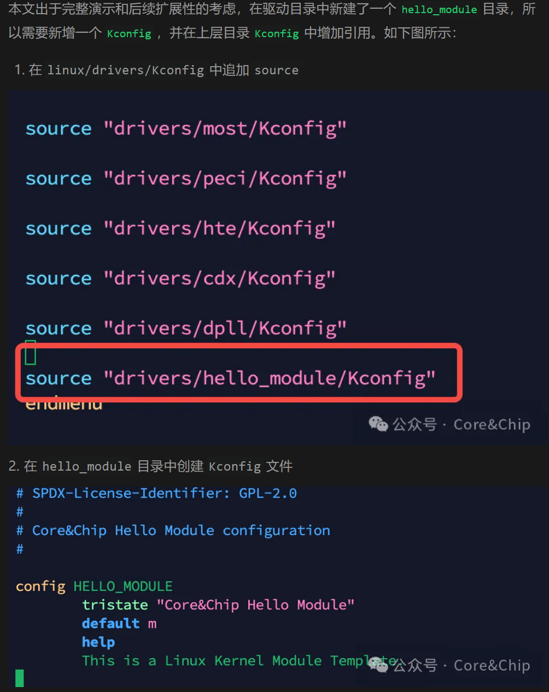

    总结的几种编译方式，实际上对这个话题有影响的，稍后说。

    ```BASH
    # 1. 全部编译
    make -j$(nproc)  # 类似 make all
    
    # 2. 指定模块编译
    # -C：指定内核源码目录
    # M：指定内核模块目录
    make -C <path_to_kernel_dir> M=$PWD
    
    # 要使用modprobe/modinfo，需执行
    make INSTALL_MOD_PATH=/your/target/rootfs modules_install
    ```

2. 代码随便放在一个位置/或者自己维护的仓库下

    比如说笔者也随便写了一个这样的，放在 `.../tmp-test/out-of-tree` 下：

    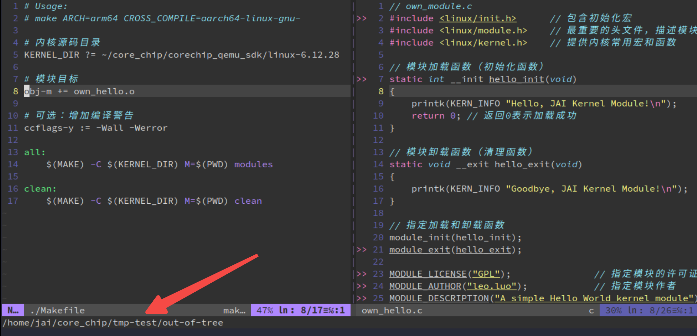

    这种编译，直接执行一条 `make` 即可。

所以无论放在哪里，只要内核源码和自己实现的模块代码能够一起编译就行。

接着再回到文章中所说的 `out-of-tree`，实际上在官方文档中，这个 `out-of-tree` 会被叫为 `external module`，但是这两个词就是等价的，文档中也都混用这些描述（`out-of-tree` 更加口语化吧）^[1]^：

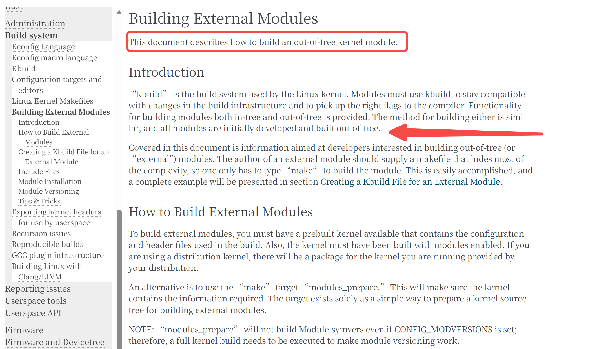

如果还想进一步看内核是怎么处理模块的身份的，怎么知道究竟是什么 `external module` 还是 `in-tree`，最最应该做的不是看什么文章分析，而是自己看内核代码的实现，这才是最根本的依据。具体要看的是 `scripts/mod/` 这里的内容，这部分包含**用于处理和生成内核模块（`.ko` 文件）元数据的宿主机工具（Host tools）**的代码。

而在这里要看模块身份的处理，核心就是 `scripts/mod/modpost.c`，最终的裁决者：

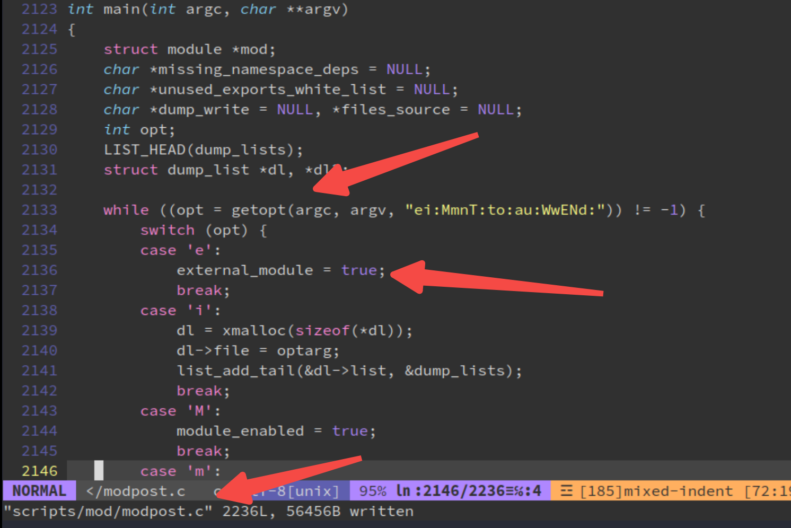

是很常用的 `getopt` 解析命令行参数，也就是说，只要解析到传递给命令  `-e` ，自然就认为是 `external module` 了，也就会对特定的模块打上 `in-tree` 标签了：

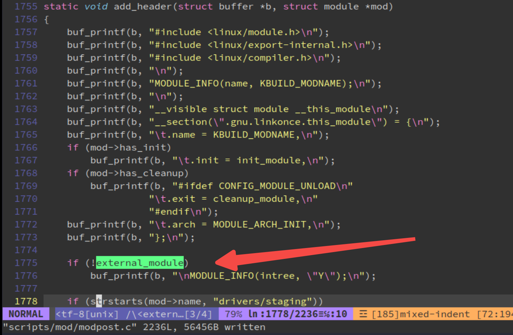

那至于说这个 `-e` 怎么传进入来的？博主也已经分析得很好了，这里也就是整个问题的关键：下放直接引用博主的内容：

---

内核的顶层 `Makefile` 在检查到编译时的 M 非空时，会设置 `KBUILD_EXTMOD` 变量。

```makefile
# Use make M=dir or set the environment variable KBUILD_EXTMOD to specify the
# directory of external module to build. Setting M= takes precedence.
ifeq ("$(origin M)", "command line")
KBUILD_EXTMOD := $(M)
endif
```

内核模块的编译规则在`Makefile.modpost`中，规则中会判断`KBUILD_EXTMOD`变量是否为空，如果是空的话代表是`in-tree objects`。

当不为空则代表是`out-of-tree`,会将我们传进来的`M`作为内核模块路径编译`obj`，并为`modpost-args`添加`-e`选项表示`external`。

```makefile
ifeq ($(KBUILD_EXTMOD),)

# Generate the list of in-tree objects in vmlinux
# ---------------------------------------------------------------------------

...........

else

# set src + obj - they may be used in the modules's Makefile
obj := $(KBUILD_EXTMOD)
src := $(if $(VPATH),$(VPATH)/)$(obj)

............

modpost-args += -e $(addprefix -i , $(KBUILD_EXTRA_SYMBOLS))

endif# ($(KBUILD_EXTMOD),)
```

`Makefile.modpost`会调用并将参数传给`modpost.c`，当有`-e`选项时，会将`external_module`置为`true`，最终导致内核的编译体系不会在`modulename.mod.c中`添加`MODULE_INFO(intree, "Y")`。

也就是说不会给我们自己的驱动打上属于树内的标记。

当然如果想真的看到对比，看 `modulename.mod.c`，这里就放自己实践的图了：

> `modulename.mod.c`是 `Kbuild` 自动生成的中间C源文件，它的主要作用是为模块的最终编译和连接提供元数据（metadata），确保模块能被内核正确识别和加载。

我们来对比看一下会发现正如我们分析的一样，源码内编译的内核模块的元数据中包含了`MODULE_INFO(intree，Y)`，而源码外编译的没有。

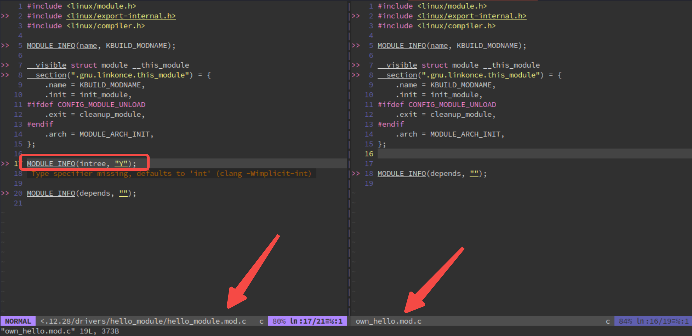

---


此时再简单分类讨论一下：

1. 模块代码已被 `Kbuild` + `Kconfig` 管理（模块的 `Makefile` 能被上一级索引到）

   - 选中编译该模块时，也就是 `obj-y`,，此时内核会把这个模块编译进 `vmlinux` 了，不管什么 `in-tree`、`out-of-tree`，一般都被叫成 `Built-in` 了。
   - 选中该模块，但是 `obj-m`，此时内核会把这个模块编译成 `.ko`，不合进 `vmlinux`，自己使用 `insmod/modprobe` 按需加载。`scripts/mod/modpost.c` 会给它打上 `in-tree` 标签。

   > Gemini 的总结：
   >
   > 既然都内建进 `vmlinux` 骨血里了，自然也就不存在被加载、被查验“身份证（`.modinfo`）”的过程。
   >
   >  `obj-m` 就是拿到了官方颁发的 `intree=Y` “良民证”的独立个体。

2. 模块代码位置在内核源码/自己随机放一个地方/自己维护的仓库

     此时基本也只能使用这种方法来编译：

     ```bash
     # 2. 指定模块编译
     # -C：指定内核源码目录
     # M：指定内核模块目录
     make -C <path_to_kernel_dir> M=$PWD
     ```

     那自然就会被识别为 `out-of-module`，`external module` 了。

所以，看是不是所谓 `out-of-tree / external module`，核心如下：

**在编译时，是否有 `M=` 参数，才是界定内核构建系统把它当成 `in-tree` 还是 `out-of-tre / external module` 的唯一标准。**

也就是说：**不论代码在哪，用了 `M=` 就是 out-of-tree。**

> 当然了，你要是

所以根本就没有必要纠结什么 `in-tree`、`out-tree`。正如这篇回答 [2] 所描述的那样：

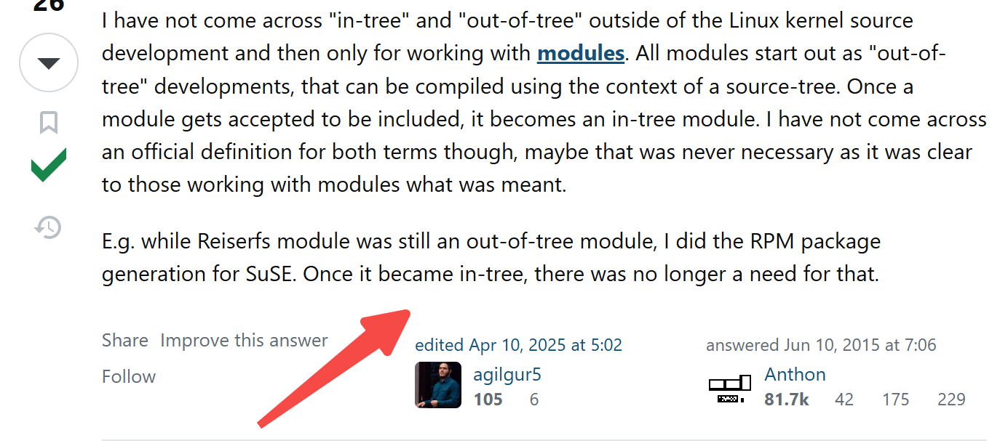

任何模块的开发都是从 `out-of-tree` 开始，一旦开发完成、测试通过，合入内核后，就变成所谓的 `in-tree`了。

而且，在不同的场景中讨论 `in-tree`、`out-of-tree` 本来就是有着不同的含义。所以没有必要记住这些内容，明白自己是在做什么要做什么即可！

这里再附上几次实验的结果：

1. `obj-m` 编译版本，就不看了，博主也有

2. 手动指定单个编译（`new...`）：`make drivers/hello_module/hello_module.ko`：

    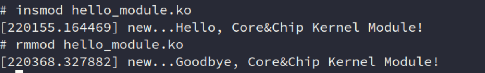

3. 手动使用 `-M` 参数编译：`make -C ~/core_chip/corechip_qemu_sdk/linux-6.12.28  M=~/core_chip/corechip_qemu_sdk/linux-6.12.28/drivers/hello_module/`（一般情况下应该没有人会选择这种吧？）

    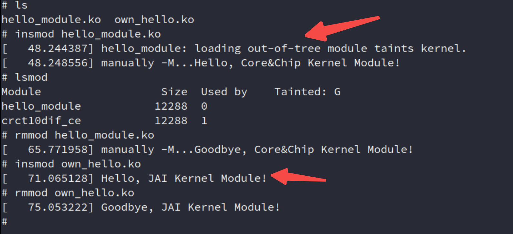

    > 顺便一说，污染警告是“一次性”的 (One-Time Warning)。
    >
    > ```C
    > if (!get_modinfo(info, "intree")) {
    >     /* 划重点：如果当前还没有 OOT 污染标记，才会打印警告 */
    >     if (!test_bit(TAINT_OOT_MODULE, &tainted))
    >         pr_warn("%s: loading out-of-tree module taints kernel.\n", mod->name);
    >     
    >     /* 打上污染标记 */
    >     add_taint_module(mod, TAINT_OOT_MODULE, LOCKDEP_STILL_OK);
    > }
    > ```
    >
    > 内核觉得：“既然系统已经不干净了，开发者肯定知道了，没必要每次加载外部模块都疯狂刷屏报警告。”
    >
    > 同时，`rmmod` 洗不清“污染记录”的，内核的 Taint 标记是全局且不可逆的（除非重启系统）。一旦某个模块触发了污染，这个污点就会一直留在 `/proc/sys/kernel/tainted` 这个全局变量里，直到系统下一次重启（Reboot）。哪怕肇事模块已经被卸载得干干净净，系统依然处于“已污染”状态。

另外，更加重要的是的实践是：

> 加载外来内核模块会被内核标记为内核污染，**但是大多数情况下只是一个标记警告，并不会对我们的内核模块产生什么功能影响**，所以开发中是可以忽略的。
>
> 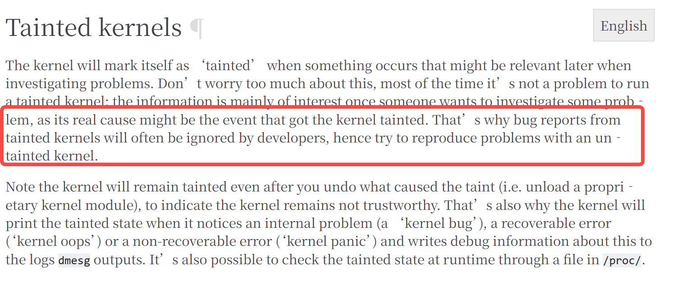
>
> **在测试功能的时候，随便你怎么折腾都行，但是在功能稳定之后，将内核模块进行源码内编译，就不会再有这个警告了。**


# 3. 厂商 SDK 相关实践（AI 回答）

这部分才是一开始在想的问题，由于我又不在行业内还没入职，所以只能问问 LLM。

> 按照自己之前在某车载的Tier-1的 BSP 的实习经历，也就是拿到原厂的 SDK 后，提取出来，自行维护成自己的 SDK 仓库。
>
> 而在进行用户层/微内核的 feature 验证和开发的时候，是直接写好了某个功能后，push 后触发 CICD，编译小包（某个仓库镜像）直接上板测试。
>
> 如果对于模块，没怎么做，只能猜：完成 feature 代码开发后，先单独编译模块，然后放到机器上进行第一次测试；然后功能通了后，进行整包编译后再上板测试；然后通过后再提交到 `Gitlab/Gerrit` 让同事进行 `code review`。 

以下为思考和 prompt：

> 那如果我直接在源码树里加代码，就像上面那样的 `drivers/hello_module`，
>
> 这毕竟是我自己开发维护的，并没有为内核社区所接受，所以本质还是一个自定义的内容，比如是自维护的 `SDK` 或者闭源的驱动。
>
> 那我就想问，原厂最终提供的 `SDK` 以及这些模块/相关代码究竟是以何种方式来做的？因为有些部分代码又不会提交到内核社区的，但是又是自己 `Kbuild` + `Kconfig` 维护的。
>
> 换句话说，各个厂家是如何处理内核社区代码和私有代码之间的关系的？（比如芯片原厂、终端厂商/主机厂）


## 3.1 代码维护+工程迭代

该回答由 Gemini 生成。由于我也没有做过 Android，所以下方回答是否准确并不保证！只适用于学习。

### 流派一：芯片原厂 / 方案商（如 高通、瑞芯微、NXP、联发科）

**核心做法：建立“私有内核树（Vendor Fork）”，直接把代码塞进 `drivers/`。**

- **操作方式：** 这些原厂（也就是你提到的提供 SDK 的厂商）会从 kernel.org 拉取一个长期支持版（LTS，比如 5.10 或 6.1）。然后，他们会在自己公司内部建一个 Git 仓库，直接在 `drivers/soc/`、`drivers/media/` 等目录下大肆修改，添加自己的 `Kconfig` 和 `Makefile`。

- **属性界定：** 对于 Linus Torvalds 维护的“官方主线”来说，这些代码是不存在的；但对于买了这套 SDK 的客户来说，这套代码就是**In-tree（树内）**的。当你用他们提供的 `Makefile` 编译时（你举的第一个例子），它被打上了官方的标签，**不会触发 Out-of-tree 污染（Tainted: O）**。

    > `in-tree` 概念还是不要乱用好了。

- **为什么不提交给社区？**

    1. **代码质量差/耦合度高：** 原厂为了赶产品进度，代码往往写得非常 Hack，根本过不了内核维护者的代码审查（Code Review）。
    2. **商业机密与节奏：** 芯片还没发布，不可能提前把驱动开源到主线去。

- **总结：占山为王，我的 SDK 里我就是主线。**


### 流派二：闭源硬件巨头（最典型：NVIDIA 显卡驱动、部分闭源 Wi-Fi）

**核心做法：发布 Out-of-tree 模块 + 二进制 Blob（黑盒代码）。**

- **操作方式：** NVIDIA 绝不妥协开源自己的核心图形算法。如果他们把代码放进 `drivers/` 并静态编译，根据 GPL 协议，他们必须开源。因此，他们只能采用纯正的 **Out-of-tree (`make M=$PWD`)** 方式。
- **架构设计（Shim 层）：** NVIDIA 会提供一个开源的“胶水层（Shim）”代码。在你安装驱动时，安装程序会调用你本机现有的内核头文件，现场 `make M=...` 编译这个胶水层，将其编译成 `.ko`，并在运行时动态链接 NVIDIA 提供的闭源二进制库（`.o` blob）。由于内核版本千差万别，他们还会使用 **DKMS (Dynamic Kernel Module Support)** 技术，确保你每次升级内核后，驱动都会自动重新 `make M=` 编译一次。
- **如何处理 Taint 污染？**
    - **他们根本不处理，直接摆烂。**
    - 当你加载 NVIDIA 驱动时，内核不仅会报 `Tainted: O` (Out-of-tree)，还会报 `Tainted: P` (Proprietary module has been loaded，加载了专有/非 GPL 模块)。
    - **后果：** 如果你的系统因为这个驱动崩溃（Kernel Panic），Linux 内核社区的开发者看到日志里有 `Tainted: P`，会直接拒绝帮你修 Bug：“你加载了闭源黑盒，我们没法排查，找 NVIDIA 去吧。”但对于普通用户来说，只要显卡能用，谁在乎内核告警呢？


### 流派三：移动生态霸主（Google Android）

**核心做法：GKI (Generic Kernel Image) 强制分离，全面走向 Out-of-tree。**

- **历史背景：** 以前安卓手机厂商（小米、OV等）都采用“流派一”，导致每一款手机都有一个高度定制的内核树，碎片化极其严重，Google 根本没法统一推送内核安全更新。
- **现状（Android 11 之后）：** Google 推出了 GKI 架构。Google 编译一个纯净的、不可修改的核心内核镜像（`boot.img`），直接发给手机厂商。手机厂商和芯片厂商（高通等）开发的驱动，**不允许**再塞进 `drivers/` 里一起编译！
- **操作方式：** 所有的厂商驱动，必须作为 **Vendor Modules（Out-of-tree 模块）** 独立编译，存放在 `/vendor/lib/modules` 下，在启动时动态加载。
- **如何处理 Taint 和 签名？** 既然是 Out-of-tree，按理说加载不了。但由于整个 Android 构建系统是由 Google 或 OEM 控制的，他们在编译这些 Vendor Modules 时，会使用统一的密钥为这些 `.ko` 打上数字签名。内核加载时校验签名通过即可，不再纠结于它是否在树内。


### 总结与对比

| **行业场景**           | **构建方式**        | **是否修改内核源码树** | **是否触发 Taint**          | **GPL 开源义务**  |
| ---------------------- | ------------------- | ---------------------- | --------------------------- | ----------------- |
| **芯片 SDK (BSP)**     | In-tree (内部 Fork) | 是 (直接改 `drivers/`) | 否 (系统认为是亲儿子)       | 理论上需开源代码  |
| **闭源硬件 (NVIDIA)**  | Out-of-tree (DKMS)  | 否 (保持内核纯净)      | **是 (Tainted: P/O)**       | 成功规避 GPL 限制 |
| **现代 Android (GKI)** | Out-of-tree         | 否 (核心镜像锁定)      | 否 (通过厂商签名白名单机制) | 取决于具体实现    |


## 3.2 关于 out-of-tree 对产品安全的影响

> 博主在他的文章中（[BSP工程师的内核必修课：2.2. 源码内编译、运行内核模块保姆级教程](https://mp.weixin.qq.com/s?__biz=MzY5OTE1OTEzMA==&mid=2247485370&idx=1&sn=c637ab28762f7f3dd5e289e99b4a69f1&chksm=f442008fc33589992658801519a7e9dd4613af1c3a732cbf64a2136c7595698ccd31e15c43a2&scene=178&cur_album_id=4441964449075331074&search_click_id=#rd)）中讲到：
>
> “但是最终模块功能稳定或需要交付的时候，还是尽量使用本节介绍的源码内编译的方式，这是正规的方式。
>
> 使用out-of-tree的方式，如果你的团队或客户的工程中，开启了`avb`(Android Verified Boot)或模块签名这些安全机制，会导致out-of-tree的方式**无法正常加载**使用。
>
> 无论你的公司还是业务大小，我们还是要尽量保证自己的流程像个正规军，**Work as a professional~!**“

我觉得可以让 Gemini 补充一些相关的背景知识。

------

### 3.2.1 Linux 内核模块签名机制 (Kernel Module Signing)

为了防止黑客或恶意软件在系统运行时偷偷加载带有后门的 `.ko` 文件（比如 Rootkit），Linux 内核引入了严格的模块签名机制。

- **工作原理：** 当内核在进行全量编译时（In-tree），构建系统会自动生成一对非对称密钥（公钥和私钥）。
    - **公钥**会被硬编码编译进 `vmlinux` 镜像中（放在系统的 Keyring 里）。
    - **私钥**则留在编译服务器上。在 `make modules_install` 阶段，构建系统会使用这个私钥对所有生成的 `.ko` 文件进行密码学签名（将签名附加在 `.ko` 文件的尾部）。
- **加载校验：** 当你使用 `insmod` 加载模块时，内核会提取 `.ko` 尾部的签名，并用自己肚子里的公钥进行解密校验。如果校验通过，允许加载；如果失败（或者根本没签名），内核会直接拒绝，报 `Key was rejected by service` 或 `Required key not available`。
- **Out-of-tree 的死穴：** 如果你是用 `make -M` 在外部单独编译的模块，你通常拿不到生产环境编译服务器上的那把**私钥**。因此，你编译出的 `.ko` 要么没签名，要么是用你本地随机生成的测试私钥签的名。一旦放到开启了强制签名校验（`CONFIG_MODULE_SIG_FORCE=y`）的量产固件上，必定被内核无情拒载。

### 3.2.2 Android 验证启动 (AVB: Android Verified Boot) 与 dm-verity

如果你面对的是 Android 系统的设备，安全门槛会呈指数级上升。AVB 是 Google 强制要求的一套“信任链（Chain of Trust）”机制。

- **信任链条：** 从设备上电开始，`BootROM` 验证 `Bootloader` -> `Bootloader` 验证 `Boot` 镜像（包含内核） -> 内核验证各个系统分区（如 `system`, `vendor`, `vendor_dlkm` 等）。一环扣一环，任何一环的哈希值不对，设备直接变砖或无限重启（进入 dm-verity corruption 模式）。
- **模块通常存放在哪里？** 在现代 Android 架构中，外设驱动（如 Wi-Fi、音频 DSP、传感器等）的 `.ko` 文件通常被打包在单独的只读分区里，比如 `vendor_dlkm.img` (Vendor Dynamically Loadable Kernel Modules)。
- **Out-of-tree 的死穴：** AVB 使用 `dm-verity` 机制在块设备层面保护分区。如果你用 Out-of-tree 编译了一个模块，想通过 `adb push` 强行替换掉设备里原有的 `.ko` 来测试，你会发现分区是只读的。就算你在工程机上通过 `adb disable-verity` 破解了它，在真实的量产机（User 版本）上，这种操作会直接破坏 `vendor_dlkm` 分区的哈希树（Hash Tree）。系统一旦检测到哈希对不上，就会认为系统被篡改，直接拒绝启动或触发 Kernel Panic。

### 3.2.3 GKI (Generic Kernel Image) 的终极绝杀

除了签名和 AVB，这几年 Android 阵营大力推行的 **GKI** 更是把规范化推向了极致。

- 为了解决碎片化，Google 提供统一的、经过签名的 GKI 内核镜像（`boot.img`），各家芯片厂商（SoC 厂商）和手机厂商只能以 `.ko` 的形式提供自己的硬件驱动，并打包进 `vendor_boot` 或 `vendor_dlkm`。
- **严格的 ABI 校验：** GKI 对内核符号的 ABI（Application Binary Interface）有极其严格的哈希校验。在 In-tree 环境下，所有模块随着统一的符号表（Symbol Table）一起编译，保证 ABI 绝对一致。而使用 Out-of-tree 编译时，如果你本地的内核头文件或配置项与设备上实际跑的 GKI 内核有哪怕一个字节的差异，加载时都会报 `Unknown symbol` 或者 ABI 校验失败。

### 3.2.4 商业公司的 CI/CD 交付规范（为什么必须 In-tree）

抛开底层安全机制不谈，从软件工程和持续集成（CI/CD）的角度来说，In-tree 也是唯一的正途：

- **可追溯性与版本控制：** 在大型企业中，你的代码最终是要提交到 Gerrit/GitLab 等代码托管平台进行 Code Review 的。如果你的模块没有对应的 Kconfig 配置，也没有被加进上层的 Makefile，编译服务器（Jenkins 等）在做每日构建（Daily Build）时，根本不知道你这个模块的存在，也就无法打包进最终的 ROM 里。
- **依赖管理：** 复杂的 SoC 驱动往往依赖总线驱动（如 I2C、SPI）、电源管理框架或时钟框架。只有在 In-tree 的统一编译树下，Kbuild 才能正确解析这些依赖关系（`modules.order` 和 `modules.builtin`），确保加载顺序的正确性。

### 3.2.5 总结：你的标准工作流

了解了这些，你在实际工作中的节奏就非常清晰了：

1. **开发与爆破阶段（Out-of-tree / 禁用安全机制）：** 拿到一台刷了 `userdebug` 或 `eng` 固件的工程机。敲入 `adb disable-verity` 关掉 AVB，利用 `make -M` 快速编译单独的 `.ko`，推送到机器上频繁 `rmmod/insmod`，享受极速调试的快感。（只要你不嫌弃 `dmesg` 里的 Taint 警告）。
2. **提交流片与量产阶段（In-tree / 开启所有防御）：** 代码写好后，规规矩矩地修改 `Kconfig` 和 `Makefile`。提交代码到主线，让服务器进行一次完整的 In-tree 编译，自动完成签名、生成正确的哈希树，打包进合法的固件镜像中，最终烧录到开启了 AVB 的量产设备上。


# 4. 相关命令

- **`lsmod`**
    列出当前已加载的所有内核模块（格式化输出自 `/proc/modules`）。
- **`cat /proc/modules`**
    查看已加载模块的原始信息，包含模块名、内存占用、引用计数等。
- **`insmod <module.ko>`**
    手动加载一个内核模块，需指定完整路径，不自动处理依赖。
- **`rmmod <module>`**
    卸载一个已加载的内核模块（模块名不带 `.ko`）。
- **`modprobe <module>`**
    智能加载内核模块，自动解析并加载依赖模块，只需模块名无需路径。
- **`modprobe -r <module>`**
    卸载内核模块并递归卸载不再使用的依赖模块。
- **`modinfo <module.ko>`**
    显示模块的元信息（作者、描述、许可证、参数、签名等）。
- **`dmesg | tail`**
    查看内核环缓冲区最后几条消息，常用于检查模块加载/卸载时的 `printk` 输出。
- **`depmod -a`**
    生成模块依赖关系文件（`modules.dep` 等），通常在更新模块或内核后执行。
- **`cat /proc/sys/kernel/tainted`**
    查看内核“污染”标志位（非零表示存在外部模块、专有模块加载等导致内核受污染）。


**下一篇应该会记录关于 `rootfs` 和分区的一些内容、或者一些模块初始化的内容，因为这里的代码命名有点混乱**


# 参考

[1] Building External Modules：https://www.kernel.org/doc/html/v6.12/kbuild/modules.html

[2] 


