> **注意：以下的内容均为个人观点。**
>
> **如果你看完后有不同的观点也没关系！请指出，我很乐意去学尝试积极的东西。**

封面：


# 1. introduction

> 注意：以下的内容均为个人观点。
>
> 如果你看完后有不同的观点也没关系！请指出，我很乐意去学尝试积极的东西。

在做关于字符设备驱动实验的时候，用到了简单的 `/sys` 操作：

- [3.3. 现代字符设备驱动框架](https://mp.weixin.qq.com/s?__biz=MzY5OTE1OTEzMA==&mid=2247485381&idx=1&sn=42050aac3ddf92b64ec2891d30c4d00f&chksm=f44200f0c33589e6916bbdbaf290f436baa182c67406f8a3fc50c11c53eb8e2128bd4d0b50eb&scene=178&cur_album_id=4441964449075331074&search_click_id=#rd)
- [3.4. 从0开发Linux GPIO BSP驱动](https://mp.weixin.qq.com/s?__biz=MzY5OTE1OTEzMA==&mid=2247485383&idx=1&sn=84457a2dd78060997f3e022947f48b0e&chksm=f44200f2c33589e4bbb28e55a3a3b8a7f9c0f216861ddb834cf7e2628873d6ad6aac9c07a897&scene=178&cur_album_id=4441964449075331074&search_click_id=#rd)

进而思考，自己对于 `/sys` 的了解基本是：“如果要读什么硬件的数据、看一下芯片当前的功耗，去这个目录找就行”，感觉没啥意思。

另外对于 `udev` 的了解也就是类比为 `Windows` 的设备管理器的底层实现，一个负责设备热插拔的后台进程。

而在看了 Neil Brown 两篇十年前关于设备模型的文章^[1,2]^后，感觉到非常 amazing！所以**决定借此机会写部分自己感兴趣的 `/sys`、`udev`、设备模型、电源管理...杂七杂八...**

我不会写什么具体什么的定义，只是直观展示每部分起到的作用+自己感兴趣的内容。

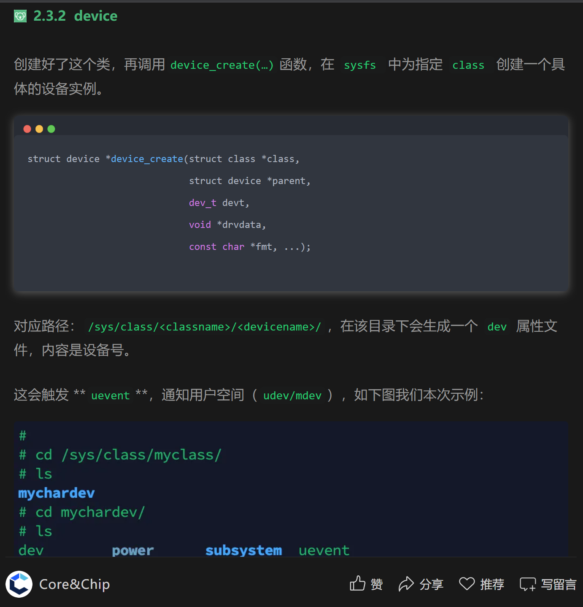

按照大家从小到大的学习习惯，我们总是会想在源码/课本里找到所谓的标准定义：

比如说 `device` 什么是？几乎在各个文档/书籍/公众号资料中描述的定义，几乎就是这样：

“A physical or virtual object which attaches to a (possibly virtual) bus^[3]^ "

（“设备是连接到总线上的物理或虚拟对象”）

这种定义听起来太像课堂上我们学过的什么矩阵是什么、行列式是什么、xxx运动是什么......这种听起来非常好，非常通用的定义我是一直很讨厌的（并不是说他错，我只是想具体一点，想知道这玩意究竟是用来做什么的）......

就拿上面的例子来说，Neil Brown 在十年前就指出这种定义与那零几年提出这个定义的时候的现实不符^[1]^：

> "For example, in the device model, a partition on a hard drive is a "device" much like the hard drive as a whole is. The hard drive as a whole may attach to a "bus", but the partition certainly doesn't: at best it attaches to the whole drive. Also, there are devices that don't attach to anything, let alone a "bus". The devices listed in directories under `/sys/devices/virtual` are not "attached" to anything. That "virtual" directory is not a special bus called "virtual", it is simply a place to put things that don't belong anywhere else."

比如说，硬盘的分区是一个设备，但它显然不挂在某个真实的物理总线上；许多虚拟设备甚至不连接任何东西。正如 Neil 所言，**这些术语并没有绝对的外部含义，它们是由实现它们的代码所定义的，“设备”只是一个承载接口和抽象的载体。**Neil 然后给出 learned lesson^[1]^：

> “This, then, is the lesson of the driver model: the implementation provides functionality, not meaning. The meaning comes from the thoughts of developers and is coherent or disjoint in the same measure that those developers are of one mind, or not.”
>
> 代码实现本身只负责完成具体的功能操作，但它并不自带“意义”——比如为什么要这样设计、它解决什么问题、如何与其他部分协调等。真正的“意义”来自于开发者的理解和意图。如果所有开发者在设计思路、目标、抽象概念上达成一致，那么整个系统的意义就是连贯、统一的；反之，如果开发者想法不一致，系统的意义就会变得支离破碎、相互矛盾。
>
> 也就是说，技术实现只是躯壳，开发者之间的共同理解才是灵魂......进一步强调了沟通的重要性......

其实这样让我想起之前再看蒋炎岩老师的 OS2024 的课的时候的截图^[4]^：


扯远了，回到本文要讲的内容，下文将基于 **QEMU ARM64 Virtual Machine (mach-virt)** 的虚拟主板架构、Linux 6.12.28 做学习验证。（其中设备树描述使用的是 Core&Chip 博主的该仓库中的设备树：https://gitee.com/core-chip_0/corechip_qemu_sdk/blob/master/out/cc_qemu_sdk.dts）

往下看之前，脑海中还是需要有一张 SoC 的大致物理结构图，下图由 Gemini 生成：


有了这张物理拓扑的底图，我们再去理解内核是如何在内存中为其建立映射的，就会轻松很多。


# 2. 探究 `/sys` 目录的真实面貌

要理解设备模型，个人觉得最直观的切入点就是 `/sys` 目录。

在 Linux 系统中，`/sys` 是 `sysfs` 虚拟文件系统的挂载点，具体来说，它主要把将内核中复杂的数据结构关系（主要是树状结构）导出并暴露给用户空间。

底层的 `ramfs` / `kobject` 实现细节，想学习了解，可以看参考[5]，这里不深入了。

简单来说，可以直接 `/sys` 想象成内核态的物理硬件拓扑在用户空间的投影，在这个投影里看到的每一个目录，基本都对应着内核里的一个底层对象。

比如直接在 x86 host 的终端看 `/sys` 的结构，布局如下：

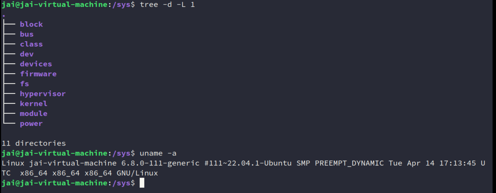

虽然目录很多，但按照本文的目标，梳理设备模型，我们初期只需要看其中最核心的四个目录即可：`devices`、`bus`、`class` 和 `dev`。

实际上它们也并不是完全没关系，它们只是对同一套物理硬件的不同“观察视角”。


## 2.1 `/sys/devices`：物理拓扑（核心）

这个目录可以说是最核心的地方，它直接用一种层级排列的方式展示了整个系统/内核的**设备**，其中也是包含了各种文件，用来检查每个设备的详细信息。

Neil 甚至专门写了一篇这方面的文章^[2]^，标题还就叫”A tour of /sys/devices”，里面举了三个概念来来理解 `/sys/devices` 目录结构。可以简单总结：在看这个 `/sys/devices` 的时候，抓住这三个点，**父设备、设备的属性、命令空间管理（parentage, attributes, and namespace management）**

> 实际上哪怕现在广为使用的 Linux 6.x（正在开发7.x不算），Neil 的几篇文章也一样适用，因为 Linux 设备模型的核心基础（`kobject`、`kset`、`bus`、`class`、`device`、`driver`）在 2.6 时代确立后基本也没有发生过什么根本性的颠覆，后来的版本更多是在此基础上做延伸（比如引入设备树的泛滥支持、电源管理的细化等）


### 2.1.1 Parenthood：硬件连线拓扑

这部分怎么理解呢，“在 Linux 设备模型中，每一个代表实体或抽象事物的设备，大多都有一个“父设备”，但有时候也会遇到像 `workqueue` 这种没有父设备的。

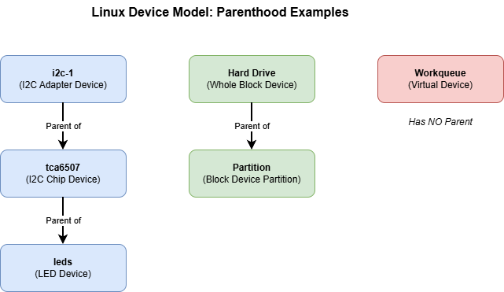

脑海里知道外部的设备(`tca6507`、`leds`)连接到 SoC 内部的 I2C 控制器即可。

当然，这里可以补充一个具体例子来辅助理解这种 `parenthood`，比如以下命令，应该常用：

```BASH
echo 100 > /sys/devices/platform/omap_i2c.2/i2c-2/2-0045/leds/gta04:green:power/brightness  
```

在 Neil 的文章中^[2]^，他用就是这个例子，梳理了整个这个改变亮度的请求，是怎么一步步经过 Class层、Driver层、总线层，最终到达物理内存地址和硬件的，具体我让 Gemini 生成了张图，见下方：

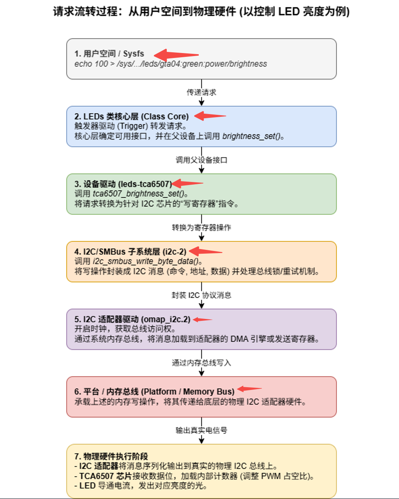

直白点理解：在硬件世界里，大家都是“挂靠”生存的。

比如上面的例子，sensor 挂在 I2C 控制器上，I2C 控制器又挂在系统的主总线上。

仔细看那个命令操作的 `/sys` 和设备对象，如果反过来一层层理解，是不是就是上面这个图标题描述的这样，是不是就是”通过叶子反向所引到根“这个理解？！

在 `/sys/devices` 里，**目录的层级就是硬件的连线，找设备的“父目录”，实际上就是在找“这玩意儿到底插在哪根线上”**。

你敲命令让设备干活，指令就是顺着这个目录树，一层层往上**爹传爹**，最后发给底层总线的。

这也就是 Neil 在 [2] 中所描述的**“Parent as connection point or service provider（连接点/服务提供者）”**了。

除此之外，Neil 还额外描述了两个点：

- Parent as discover（作为发现者）
- Parent as power source（作为电源来源（并非绝对））

这两个点也能说很多东西，比如“discover”这个点：

- 具有发现设备能力的总线（PCIe、USB等）是怎么探测新设备的插入的，对应的子系统的设计是什么样的？
- 没有设备发现能力的总线（I2C、SPI、CAN等）是怎么通过 BIOS/ACPI/Device Tree 配置设备的。

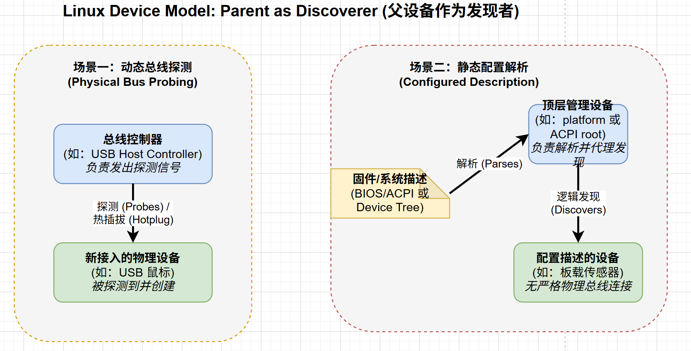

至于说电源管理，电源管理的部分确实是一个大头，因为设备模型的提出的很大一个原因就是电源管理，**所以在阅读 Neil 的文章之前，我的认知就是电源管理应该在设备模型中占主要地位的，设备模型是围绕它来设计的**，而且电源管理无非就是管理静态、运行的功耗：

- 静态的，就是直接 suspend、hibernate，尽可能把多的设备置于最低功耗。
- runtime的，就是看设备在未被使用的时候就进入低功耗状态，具体关电源的顺序就是先关子设备，再关父设备，反之一样的。

但 Neil 在 [2] 中甚至直接点名了这种观点哈哈（也算是和大佬想到一块去了哈哈（反）

> you might expect that power management would be fairly central. The reality is ... more complex.
>
> ...
>
> However power often isn't managed in exactly the same way as device addressing, so the power management system needs a little more control, which it gets by having its own list.
>
> **Runtime power management does make some use of parent/child relationships, but not always. Possibly not even often.**（运行时电源管理确实会在一定程度上利用父/子关系，但并非总是如此。甚至可能不经常这么用）

有一个原因是有些**设备、甚至总线支持的设备**，都不支持 runtime 电源管理的，我起初还是挺惊讶的，但一想到有很多纯软件或虚拟抽象层、一些被专属框架接管的核心硬件、QEMU 测试的等，好像也却是这么个道理：


Neil 也给出了它的指导：（看不懂就借助微信的翻译吧）

> **So while runtime power management can make use of the parent link, it doesn't to a great extent. The parent very often is *not* the source of power, only of addressing and control.**（因此，虽然运行时电源管理可以利用父链路，但利用程度并不高。父链路往往不是电源的来源，而只是用于寻址和控制。）

> Despite the apparent richness of meaning we find in parenthood, the device model doesn't really use it much. As a message passes "up" the hierarchy, it doesn't follow the "`->parent`" links of the device model, but uses references that were provided to each device when it was initialized. The runtime power management code does make direct use of these `->parent` links, but not very much. It could just as easily make use of explicit dependencies, just as it does when there are dependencies that are not reflected in the hierarchy.

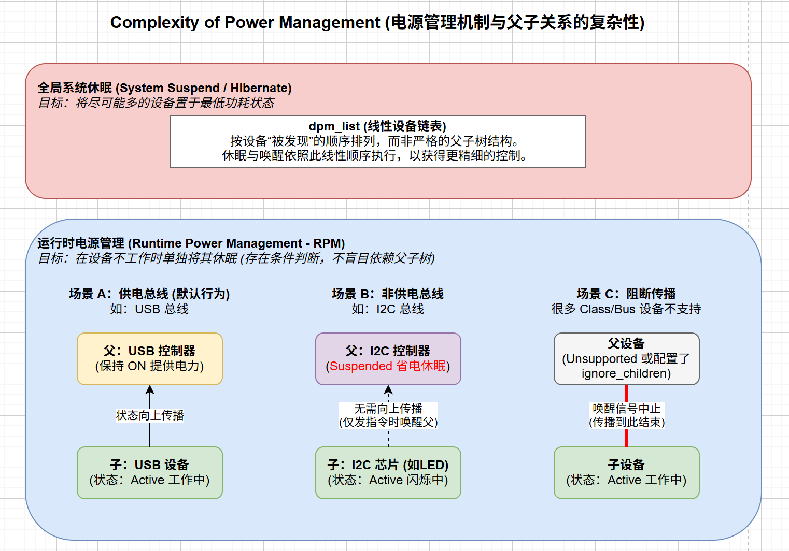

所以，按照自己的理解推断，我是觉得这个 `/sys/devices` ，也就是设备模型树（Parent-Child）应该是不适合做电源管理的。

但因为我没有这方面的经验，所以我问了 Gemini：

1. 控制流不等于电流： 设备树（Device Tree / `sysfs` hierarchy）反映的是总线探测和控制关系（例如 I2C 控制器下面挂了一个温湿度传感器）。但是，I2C 总线并不给传感器供电，传感器通常连在单独的 LDO（低压差线性稳压器）或 PMIC 上。如果严格按照父子关系，传感器不休眠，I2C 控制器就不能休眠，这是极大的能源浪费。
2. 电源域 (Power Domains) 的崛起： 因为父子关系不能准确描述电源拓扑，内核引入了 Generic Power Domain (`genpd`)。设备可能会挂载到特定的电源域中，当域内所有设备都 idle 时，才会真正下电。
3. 默认保守策略： Runtime PM 默认是关闭的（导致状态为 `unsupported`）。驱动开发者必须在 probe 函数中明确调用 `pm_runtime_enable(dev)` 并且实现对应的 `runtime_suspend` / `runtime_resume` 回调。如果不确定设备在低功耗状态下能否可靠唤醒（比如没有配置专属的中断唤醒引脚），开发者宁愿让它保持 Active，以防设备睡死。
4. 绝大部分逻辑设备依然是 `unsupported`，但是针对**耗电大户**，Runtime PM 会被压榨到极致。例如在底层的存储栈中，**UFS 控制器** (`ufshcd`) 或 **eMMC** 的驱动中会密集使用 `pm_runtime_get_sync()` 和 `pm_runtime_put_autosuspend()`。每一次 I/O 请求到来时迅速唤醒 `UniPro` 链路，I/O 队列一空立刻利用 `autosuspend` 机制让硬件进入低功耗状态（如 UFS 的 Hibern8 状态）。这些才是 Runtime PM 真正大显身手的主战场。

得等我有机会可以实践看看，算是一个TODO项吧。

不管上面的内容如何，至少借助” ‘parent’ + 硬件拓扑结构“这个话题，我确实对 `/sys/devices` 有了自己的理解。


### 2.1.2 属性 (Attributes)：设备的细枝末节

> 如果说目录搭建了骨架，那“属性”就是填充细节的血肉。

设备属性就是关于给定设备的一些任意细节，在 `/sys/devices` 内部就表现为很多被称为“属性文件”的小文件。

绝大多数时候，这些属性文件基本都是散落的，直接平铺在**设备的专属目录**底下。但为了不让目录看起来太乱，内核有时候会把一类相关的属性“打包”放到一个单独的子目录里。

**最典型、最普遍的例子就是在每个设备目录下都能看到的 `power` 文件夹**，里面装的全是跟电源状态相关的属性

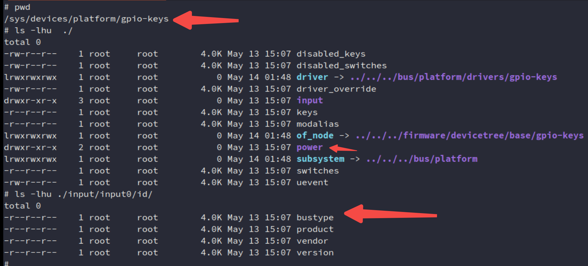

当然了，具体有什么属性，对应设备具体怎么处理，还得看具体代码怎么实现的。

但这里可以有一个认知，**几乎设备目录都会拥有这个 `power` 子目录**，也可以算是一个判断方法吧。


### 2.1.3 命名空间管理 (Namespace management)

这部分我不懂也没啥理解，反正就是不要重名就行，可能有什么高深的地方我不懂，我直接问的 Gemini：

整个 `/sys` 里面成百上千的节点，其实 Linux 并没有一个强制的“中央命名局”来审批谁叫什么名字。大家基本全靠“江湖规矩”和代码 Review 来避免重名，实在撞名了，内核就会打印抱怨。

在同一个设备目录里，经常会挤着来自不同命名空间的名字。抓准这几个避免冲突的核心套路，看目录的时候就不容易晕：

1. **大分类井水不犯河水：** 总线 (`/sys/bus`) 和类 (`/sys/class`) 分属两个独立的命名空间，它们各自管各自的，名字几乎不会重叠。
2. **总线自己定规矩：** 每个总线或类，都会给自家手底下的设备定个“起名格式”。比如 I2C 总线，如果设备代表的是 I2C 适配器本身，就叫 `i2c-%d`；如果是挂在上面的实体芯片，就叫 `%d-%04x`。
3. **系统保留词的“特权隔离”：** 驱动开发自己定义的属性名，绝不能跟总线或系统强加的属性名冲突。内核的做法是“垄断”掉几个特定的词。比如，内核把 `power` 作为一个目录名独占了。 **这个设计非常聪明：** 它相当于划了一块保护区。以后内核想加任何新的电源管理属性（比如 `pm_qos_latency_tolerance_us`），全往 `power` 这个目录里塞就行了。这样既保证了扩展性，又绝不会污染外面设备的命名空间，把名字冲突的风险降到了最低。


### 2.1.4 总结！

关于 `/sys/devices` 的总结，Neil在 [2] 中给出了一些指导（有些我也不知道是否仍然适合用在如今的 Linux 6.x）：

1. 如何一眼识别“设备目录”

    **每一个包含 `uevent` 文件的目录，就代表一个设备。**

    - 可以向 `uevent` 写入命令来触发设备添加/移除等事件（给 `udev` 用）。
    - 也可以读取它来查看该设备的事件上下文信息。
        这是遍历整个树时，用来区分“设备目录”和“非设备目录”的最核心标准。

2. 每个设备目录的标配成员

    在一个设备目录下，你几乎都能看到：

    - **`power/` 目录**：包含电源管理相关属性，每个设备都有。
    - **`subsystem` 符号链接**：指向所属的子系统（位于 `/sys/bus/` 或 `/sys/class/`）。
        *（例外：像 USB 的 endpoint、port 这类内部设备，即使属于 USB 子系统，也可能没有这个链接，也不出现在 `/sys/bus/usb/devices` 中）*
    - **`device` 链接（遗留）**：通常指向最近的一个父设备。
    - **`of_node` 链接（Linux 4.1+）**：如果设备由设备树描述，会指向 `/sys/firmware/devicetree` 中对应的节点。

3. 子目录只有三种可能

    一个设备目录下的子目录，一定属于以下三类之一：

    1. **子设备目录**（如果父设备是 bus 或 class 设备）
        → 识别方法：子目录里也有 `uevent` 文件。
    2. **按 class 名称分组的子设备目录**（仅当父设备是 **bus 设备** 时出现）
        → 例如 `.../i2c-2/2-0045/leds/`，这里 `leds` 目录本身不是设备，其下的目录才是设备（包含 `uevent`）。识别方法：目录名与某个 class 同名，且其子目录才有 `uevent`。
    3. **纯粹的属性分组目录**
        → 里面只有属性文件、链接或更深的子目录，**绝不包含设备目录（没有 `uevent`）**。比如某些驱动把一组属性组织在一个子目录下。

4. 目录结构与 parent 关系的对应规则

    - **有 parent 的设备**：它的目录要么直接挂在 **父设备的设备目录** 下，要么挂在父设备目录下的 **以自己 class 命名的中间分组目录** 下。
    - **没有 parent 的设备**：位置取决于设备类型：
        - **bus 设备**：可以自行决定放在 `/sys/devices/`（根）、`/sys/devices/virtual/` 或 `/sys/devices/system/` 下。
        - **class 设备**：全部强制放在 `/sys/devices/virtual/` 下，并且外面会有一层以 class 名命名的中间目录。
            例如：md RAID 块设备是 `/sys/devices/virtual/block/md0`。


## 2.2 （可跳过）硬件上的 bus 是什么

我想看看硬件和软件上的总线都是什么？

**本节可跳过！**

实际上还是从这个东西被提出是为了解决什么问题的角度理解好了：下面开始讲历史。

我自己是把总线理解成**一个特殊的 I/O 设备**。而 I/O 设备就是一个能与 `cpu core` 交换数据的接口/控制器。

> 对于I/O，自己的理解说就是一根线，一根连接到 `cpu core` 的线，当然这条线可能复杂点，`cpu` 出来的这条线可能会连接到一个控制器，这个控制器就能够连接到外部的各种设备：DDR/UFS/LED...

再本质一点， I/O 设备可以被理解为多个寄存器组合在一起（你外部要造什么设备，就拿这个寄存器往外连接就行），只要给这个寄存器赋予了地址，那 `cpu` 就能够直接使用指令（`in/out/MMIO`）和设备进行交互，这也就是蒋炎岩老师的上课讲到的东西^[7]^：

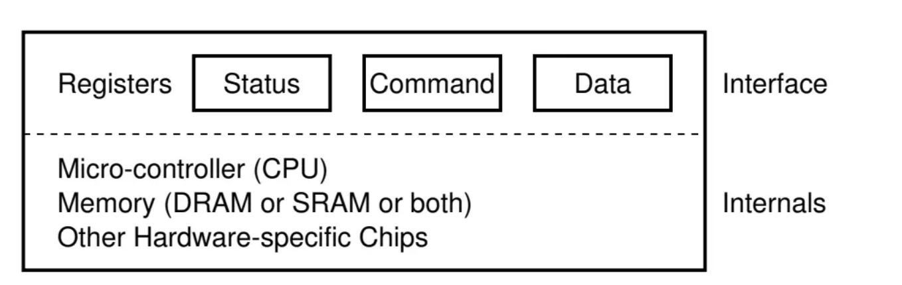

但是，可以想象，以前的设备都是定死的，固定某一个地址就是某一个设备（控制器/寄存器），**这样就过于受到限制了**。我想接入更多 (甚至**未知**) 的 I/O 设备！要是有一天出了新型产品硬件，能不能就直接接入我的计算机系统，而不用改硬件？

总线就干了这么一件事，**`cpu core` 只需连接总线这一个设备，其他的设备都挂在这上面，`cpu` 要访问/读/写对应的设备，总线直接帮我进行转发即可；甚至还能总线挂总线（桥接，USB挂PCIe）。**

可以回想前面看看，总线是有自己的地址空间的、有自己的寄存器的.....总线就是 I/O 设备嘛。

> 这种理解，是不是也是一种“虚拟化“呢？注册与转发？挺有意思，总线做的就是某种意义上的 I/O 设备虚拟。
>
> 突然想了下，总线能不能做 DMA？似乎行？`sudo cat /proc/iomem`

如今的 PCIe 不就是这样？可以实际看看：

> `lspci -tv` 和 `lsusb -tv`: 查看系统中总线上的设备
>
> - 概念简单，实际非常复杂……
>     - 电气特性、burst 传输、中断、Plug and Play

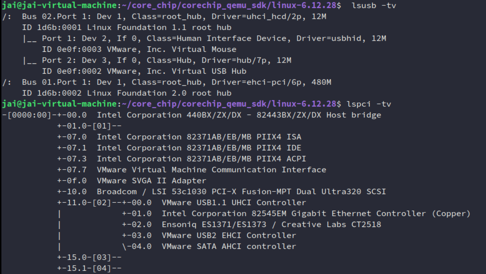


## 2.3 `/sys/bus`：硬件连线与匹配

> `driver` ，一段程序代码，检测/管理控制设备的，不展开，没什么好讲的。

回到主题，软件上的 `bus` 是什么？按照 [3] 中给出的定义：“A device which serves as an attachment point for other devices（一个作为其他设备连接点的装置）”。

> 这个定义其实挺直观的，软件、硬件都对上了

在 Linux 当前的设备模型的软件抽象里，**`/sys/bus` 的核心职责其实是充当“红娘”，它提供的是一种“匹配机制”（Match & Probe）**。

回想一下，在写 `bare-metal` 的时候，关于总线的驱动代码做的都是什么工作？无非就是让硬件具体是怎么在电气或协议层面上连接的（比如 I2C 的仲裁机制、总线重传），但是他是不知道怎么样让具体的设备干活的，所以需要配合一堆独立的“Drivers”来干活。

比如下面的 `stm32` 的 HAL库的I2C 驱动代码 + `I2C-OLED` 的例子：

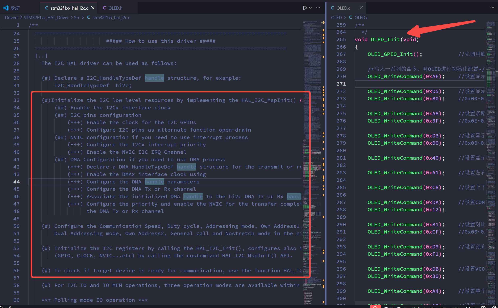

而在 Linux 的软件抽象里也是一样做的也是一样的：`bus`，**本质上就是一套部分实现的代码机制，它的核心使命是配合一堆独立的“Drivers”来干活**。所以在很多文档会这么说：

无论看任何一个具体的总线目录（比如 `/sys/bus/i2c/` 或者 `/sys/bus/amba/`），就看它们下面的这两个文件夹就行：

- **`devices/`**：里面全是指向 `/sys/devices` 的软链接（代表“系统目前**发现**了哪些硬件来登记了”）。
- **`drivers/`**：里面全是系统加载的驱动程序（代表“系统目前**有谁**能干活，把简历投进来了”）。

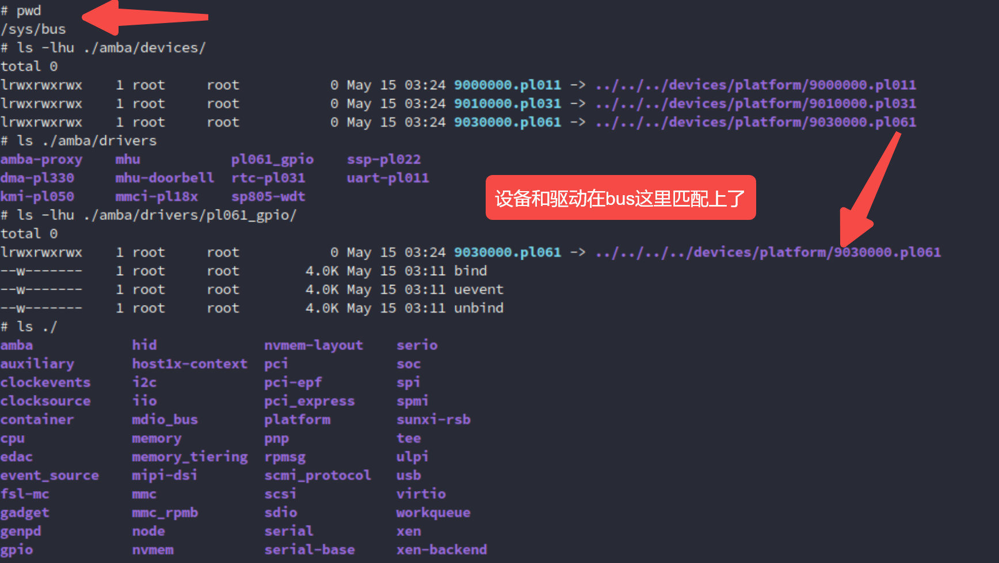

具体来说，每当有一个新设备（Device）通过设备树解析或热插拔注册进来，或者有一个新驱动（Driver）被 `insmod` 加载进来，这个“介绍所”的红娘（也就是总线核心代码里的 `match` 函数）就会疯狂运转。她会拿着设备的档案（比如 DTS 里的 `compatible` 属性）去对比驱动的简历。

一旦匹配上，总线就会安排他们“见面”——也就是调用驱动程序里的 `probe()` 函数。这也是为什么我们写驱动排查“我的 `probe` 为什么没执行”的第一现场，几乎都是会去 `devices/` 和 `drivers/` 目录下查花名册，看看是不是名字写错导致红娘直接拒接了。

> 第三章会具体实操看看流程。


TODO：补充记录：BSP 开发应该怎么做


## 2.4 `/sys/class`：面向应用层的功能抽象

如果说 `devices` 关心的是“设备长什么样、怎么连的”，那么 `class` 关心的则是“这玩意儿能用来干什么”。

`/sys/class/` 提供的是**基于功能分类**的视图，`class` 提供了一个统一的接口，屏蔽了底层硬件的各种差异。

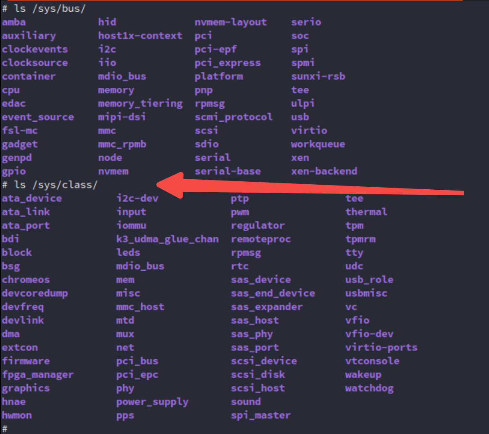

> 比如所有的鼠标、键盘，不管你是通过 USB 连入的，还是通过蓝牙连入的，也不管底层经过了多少级复杂的总线桥接，最终都会在 `/sys/class/input/` 下暴露一个统一的接口。

> 和 `bus` 类似，`/sys/class/` 下的设备同样几乎全是**软链接**，最终指向 `/sys/devices/` 中的实体。

比如说 Gemini 总结了一个例子（**不一定对，有些可能是基于旧代码的，可能新的设备位置不在这里，但理解类似**）：

1. 完整实现，抹平差异： `class` 的目的是屏蔽底层硬件的复杂连线。以 `/sys/class/leds` 为例，无论这个 LED 是通过 SoC 直接引出的 GPIO 控制的，还是挂在 I2C 总线上的 TCA6507 电源管理芯片控制的，在 `class` 层面，它们看起来一模一样。
2. 统一的接口： `class` 对用户空间（或 HAL 层）提供极度统一的 API（通常通过 sysfs 节点，比如 `brightness` 控制亮度）。外界根本不需要知道它挂在什么 `bus` 上，由什么 `driver` 驱动。

简单来说，在用户层，操作这个目录的逻辑就是**找功能，不找硬件**，因为底层已经统一了好了接口。比如，Gemini 直接总结了个表，要什么，直接去里面找就好了：

| 你想控制什么                      | 去哪个 class 目录                                            | 操作哪个属性文件                                             |
| :-------------------------------- | :----------------------------------------------------------- | :----------------------------------------------------------- |
| **屏幕背光亮度**                  | `/sys/class/backlight/` (如 `acpi_video0/`)                  | `brightness` (数值 0~255) `max_brightness` (查看最大值)      |
| **LED 指示灯** (如电源灯、键盘灯) | `/sys/class/leds/` (如 `input5::capslock/`)                  | `brightness` (0=灭, 255=最亮，部分只支持0/1)                 |
| **CPU / GPU 频率** (性能调节)     | `/sys/class/thermal/` (冷却设备) 或 `/sys/devices/system/cpu/` (但部分通过 `cpufreq` 子目录) | 更常见于 `/sys/class/thermal/cooling_deviceX/` 下的 `cur_state` |
| **电池电量百分比**                | `/sys/class/power_supply/` (如 `BAT0/`)                      | `capacity` (0~100) `status` (Charging/Discharging)           |
| **风扇转速**                      | `/sys/class/thermal/` (冷却设备)                             | `fanX_input` 或通过 `hwmon` (但 `hwmon` 也常链接在 `/sys/class/hwmon/`) |
| **音量/麦克风增益**               | `/sys/class/sound/` (如 `card0/controlC0`)                   | 音量不是简单的单一文件，需要通过 `amixer` 或 `alsamixer` 操作，但其底层设备节点也在 `sound` class 下。更直接的“音量”数值控制有时出现在 `/sys/class/audio/` (某些嵌入式平台) |
| **GPIO 电平** (自定义控制)        | `/sys/class/gpio/` (旧接口) 或 `/sys/class/gpiochipX/` 或 `/dev`下 (新 `gpiolib`) | `value` (0/1) —— 需要先 `export` 引脚                        |


## 2.5 为什么不是 `/sys/subsystem` ？

### 2.5.1 对比 `bus` 和 `class` 目录

对于上面的内容，我第一次感觉是非常混乱的，哪怕告诉了我说用户层就去 `/sys/class`，BSP 设备和驱动匹配就去 `/sys/bus`，我依然是觉得有很多重合的地方。还是这张图：


你会发现有各种同名的东西，还有下面的，`devices` 下面甚至也放了个按照 `class` 名字划分的virtual 设备... 

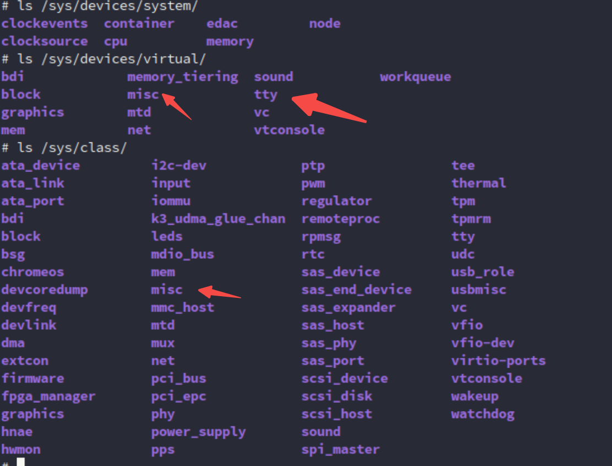

> 非常之混乱！我和 Gemini 对话了好几轮，聊了自己的看法后，我自己总结这就是**在历史问题上雕花，但为了兼容，没办法...**，如果后面人不理解上面的内容，只会越来越混乱。
>
> 加之，再看了 Neil 在 [1] 写的总结，更加深以为然。

回去看看 `/sys/bus` 看看，如果单纯以一个硬件/SoC工程师的视角来看，我会觉得这个目录是被污染了的，这个目录里的内容，可以看着划分（随便分的，别管）：

- 正宗的物理硬件或连接控制器的总线： `amba` (ARM 架构体系绝对的核心)、`i2c`、`pci`、`spi`、`mmc`、`sdio`。这些是实打实的、有电气连线、有控制器的总线。

- 纯粹的软件虚拟框架（卧底）： `workqueue` (工作队列)、`genpd` (Generic Power Domain，通用电源域，SoC 电源管理的核心)、`clockevents` / `clocksource`。它们连一根毛线的物理引脚都没有，完全是内核为了复用 LDM（Linux Device Model）的 `match-probe` 绑定机制，强行把自己注册成了 `bus`。

    > 这里最让人惊讶的就是 `workqueue`，可以直接去看代码：
    >
    > 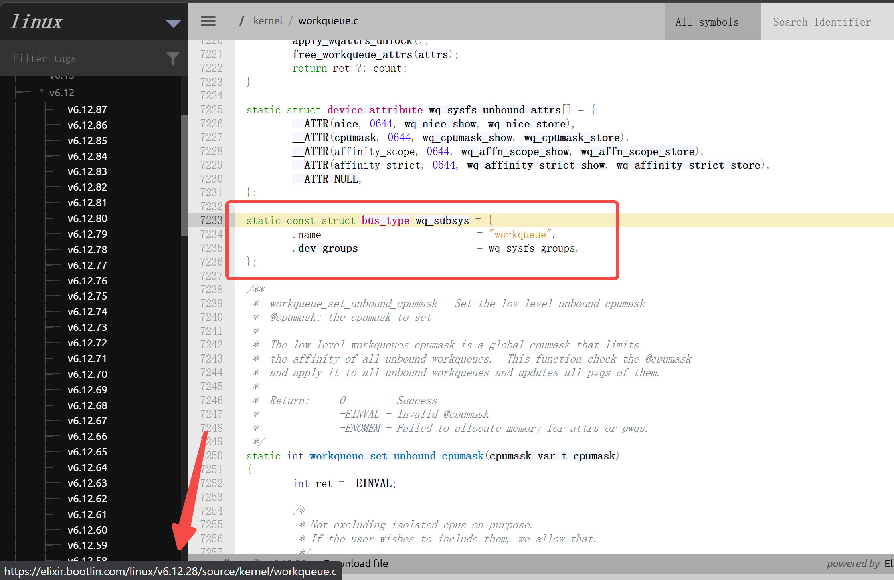

- 通信框架： `rpmsg` (Remote Processor Messaging)、`tee` (Trusted Execution Environment)、非常重要的 platform 总线等等。在现代移动 SoC 中，通常有多个核心（AP, Modem, DSP）。这些节点代表了跨核通信的“虚拟总线”。

此时再去 `/sys/class` 下看，你会发现有很多东西是重合、甚至名字都差不多：

- **Storage：**
    - `/sys/bus/mmc` 负责管理物理卡（匹配卡的类型和底层协议）。
    - `/sys/class/mmc_host` 负责暴露主机控制器的状态给上层。
    - `/sys/class/block` 才是最终呈现给文件系统的抽象块设备。
- **网络/通信：**
    - `/sys/bus/mdio_bus` vs `/sys/class/mdio_bus`。
    - `/sys/bus/rpmsg` vs `/sys/class/rpmsg`。

所以就很迷惑，而 Neil 对它的理解是：

> A "bus" is similar to a "class" in several ways, but it has an important difference. While a class is a complete implementation of the devices that are members of that class, the bus is only a partial implementation. For complete functionality, a bus usually works with a set of "drivers". A bus may implement some devices completely by itself, like a class does. Other devices will require a driver to be attached. The choice of driver can be made by the bus, by the driver (which can be asked if it "matches" a given device), or by a request through `sysfs`.
>
> 也就是 Neil 说的Class 是“功能完备的实现”，Bus 只是“部分实现”。

- Class：它定义了一套功能接口，并且把这个接口的通用实现都做完了。一个设备只要说自己属于某个 class，用户空间就可以立刻通过 class 提供的标准文件来操作它，因为 class 层已经封装好了所有逻辑。
- 而 Bus：它定义了一条通信通道（比如 I2C、USB、PCI），并提供了在这条通道上发现设备、匹配驱动的框架。但 bus 本身并不关心设备具体是什么功能，它只负责把设备和驱动拉在一起，由驱动来提供完整功能。

> Class 是卖“成品家具”的，到手直接能用；Bus 是卖“半成品 + 标准接口”的，需要你装一个驱动模块才能变成成品。

但是还有问题，一个是给用户层用，一个导出硬件视图，这两者并不矛盾啊？！这也是 Neil 的发问^[2]^：When is a bus not a bus？

对此，比如既然 Bus（比如 I2C 总线）和 Class（比如 Input 输入设备）

他的看法是：`bus` 和 `class` 在软件层面上的界限其实是非常模糊的，甚至有些自相矛盾。

1. 伪装成 Class 的 Bus：比如前面说的 `workqueue`，他是直接在内核里注册为一个 `bus`，但它纯粹是软件概念，没有底层硬件，也没有注册任何独立的驱动。它其实干着 `class` 的活！
2. 伪装成 Bus 的 Class： `leds` 这个 `class`，它里面有一个 `trigger`（触发器）机制。你可以把 `[cpu0]` 触发器绑定给 LED，也可以把 `[mmc0]`（读写SD卡）绑定给 LED。这种“动态绑定机制”，不就是 `bus` 匹配 `driver` 的翻版吗？

既然干的活都是“把复杂的物理设备节点提取出来，提供一个抽象的视图”，那在更高维度的面向对象思维里，它们凭什么要分开建两个文件夹？


### 2.5.2 拥抱 `subsystem`

所以 Neil 给出的最终结论：忘掉硬件包袱，拥抱 Subsystem（子系统）

- "The implementation provides functionality, not meaning."（代码实现只提供功能，不提供绝对的物理意义）。

- 在 Linux 设备模型中，不管是 `bus` 还是 `class`，它们本质上都是一种 `Subsystem`（子系统）。

    它们都是为了把具有某种共性的设备放在一起管理。

    如果这群设备需要复杂的驱动匹配机制，当年写代码的内核大佬可能就叫它 `bus`；如果不需要，就叫它 `class`。这完全取决于最初写这块代码的开发者是怎么看待这些硬件的（"in the eye of the beholder"）。

    也就是说，具体是什么bus/class，取决于开发者如何看待，就像上面写 `workqueue` 的代码，肯定是有开发者认识到：`bus` 和 `subsystem` 的概念，而不是 `class`。

但是我上面在和 Gemini 对话的时候，它似乎也一直再为这个规则”辩解“：

> - “为什么还要在“历史烂摊子”上雕花？为了企业级工程的稳定性和向后兼容性。”
> - **当你负责“点亮”一块新板子、写底层 Controller 驱动时：** 请使用你之前“物理连线与匹配机制”的视角。死磕 `/sys/bus/`，把你的设备树（Device Tree）节点、中断、寄存器地址和驱动里的 `probe` 函数对齐。这是硬件工程师和驱动工程师的视角。
> - **当你负责向上层应用提供 API，或者做抽象架构时：** 请使用 Neil Brown 的视角。忘掉它是 I2C 还是 SPI，把它抽象为一个 `/sys/class/` 下的统一模型。这是系统架构师视的角。

我其实是挺无语的。。。（期待有一天重构......或者有机会去看看 Zephyr 是怎么做的）

但没办法，说的好听点就是：“**在庞大且带有历史包袱的系统中，精准地定位问题并提供高可靠的解决方案**。”

但是！自己的理解还是按照 `subsystem` 来！

> Gemini 最后给了我一个总结：
>
> - 当你遇到一个跨核通信失败的 bug，你需要知道去 `/sys/bus/rpmsg/devices/` 下看通道是否建立。
> - 当你遇到一个外设掉电无法唤醒的问题，你需要熟练地操作 `/sys/bus/genpd/` 下的电源域状态。
> - 当你需要给 Android 框架层提供一个背光控制接口，你绝不会让框架层去读写 I2C 寄存器，而是老老实实在 `/sys/class/leds/` 下暴露出标准的属性节点。


### 2.5.3 （可跳过）`workqueue` 和 `sysfs`

我其实在想，这个 `workqueue` 一定要做成 `/sys/bus` 吗？**这是不是想要使用一些 `sysfs` 只能暴露给设备使用的操作呢？**

欸，好像如果想让用户空间控制我这个软件内容，似乎就能够这么做？！

比如什么：绑定 `CPU` 核数、最大并发数之类的。

以前大家玩内核的时候，如果一个软件模块（比如工作队列、网络协议栈）想要把自己的内部状态，暴露给用户空间的开发者查看或修改，通常是去 `/proc` 目录下随便建个文件，或者去 `debugfs` 里乱塞一通。

但是后来发现设备模型（Device Model）这套机制太香了！

只要在软件结构体里塞入一个 `struct device`，然后把你这个子系统注册成一个虚拟的 `bus`（或者叫 subsystem），**瞬间免费获得**以下超能力：

1. 自动生成 `/sys` 层级目录： 内核自动维护父子节点关系，不用手写复杂的目录创建代码。
2. 标准化的属性（Attributes）读写接口： 你只需要定义几个 `show` 和 `store` 的回调函数，内核就能自动帮你生成供用户空间读写的小文件。
3. 生命周期管理： 借助底层的 `kobject` 和引用计数，不用担心内存泄漏或者非法访问。
4. 现成的事件通知： 状态改变了，还能顺便用 `uevent` 给用户空间发个广播。

要这么说，其实能够理解 `workqueue` 的做法了。

```c
// kernel/workqueue.c
// 伪造一个总线，但取名为 wq_subsys
static struct bus_type wq_subsys = {
    .name = "workqueue",
    .dev_groups = wq_sysfs_groups, // <--- 重点！这里挂载了各种你 sysfs 属性文件
};

// ....
static int __init wq_sysfs_init(void)
{
	return subsys_virtual_register(&wq_subsys, wq_sysfs_cpumask_groups);
}
core_initcall(wq_sysfs_init);
```

注意看：

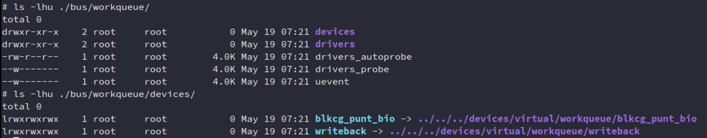

```
blkcg_punt_bio -> ../../../devices/virtual/workqueue/blkcg_punt_bio
```

这里面的 `virtual` 目录是关键。因为工作队列没有真实的物理老爹（没有挂在 I2C 或 PCIe 上），所以内核专门准备了 `/sys/devices/virtual/` 这个“孤儿院”，所有纯软件伪装的设备，全放在这里。

既然它费这么大劲注册成了设备，肯定是为了暴露一些核心参数供用户态操作。直接看：

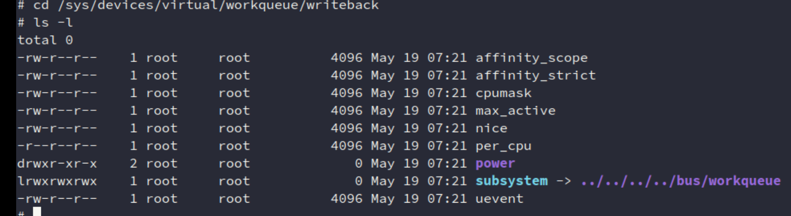

发现里面除了标配的 `power/` 和 `uevent` 之外，多了几个极其硬核的文件：

- **`cpumask`**：你可以 `cat` 看看，它决定了这个工作队列可以在哪些 CPU 核心上运行。如果你想做性能调优，甚至可以 `echo` 修改它，把特定的工作队列绑在特定的大核或小核上！
- **`max_active`**：这个工作队列最大允许同时执行多少个任务。
- **`numa`**：相关的 NUMA 节点调度策略。

所以能够理解，`workqueue` 的开发者就是为了能够通过 `echo` 和 `cat` 这几个文件来调优系统的并发性能，才强行把 `workqueue` 接入了设备模型。


> 一个启发：
>
> 若果我以后负责一个**复杂的纯软件框架**（比如某种内存池管理器、或者是某种自研的调度算法），我希望留给 Android 层或者测试部门一些动态调整参数的接口。
>
> **我就不用去老旧的 `/proc` 下面建文件了**
>
> 直接向内核大佬们学习，直接把抽象的软件对象包上一层 `struct device` 的皮，向内核注册一个虚拟总线（`subsys_virtual_register`），然后把调优参数做成 `device attributes` 挂上去。


Gemini给的指导：

你可能会遇到以下场景，它们全依赖于你对 `/sys` 的理解：

1. **功耗问题排查 (Power Management)：** 手机耗电过快？你需要进入 `/sys/devices/platform/.../power/`，检查这个硬件模块的 `runtime_status` 是否成功进入了 `suspended`（休眠）状态，还是被某个进程死死拉住了（`active`）。
2. **驱动连通性调试 (Driver Binding)：** 硬件工程师焊好了一块新芯片，但系统没反应。你需要看 `/sys/bus/i2c/devices/` 下有没有出现设备节点，看这个节点下的 `driver` 软链接有没有挂载上。如果有设备没驱动，说明 `compatible` 属性没匹配上。
3. **上层接口提供 (Sysfs Attributes)：** 结构工程师需要一个接口来控制手机呼吸灯的亮度或马达的震动强度。你需要写一个底层驱动，在 `/sys/class/leds/.../` 下暴露出一个 `brightness` 文件，让 Android 的 HAL（硬件抽象层）去 `echo` 数值进去。


# 3. 具体例子理解 device 和 driver 匹配过程 

下面通过第一章中所描述 QEMU 板卡中的 `pl011` `uart`、`pl031` GPIO 等部件来梳理过程。先看Gemini的分析吧。


## 3.1 Gemini 分析

### 第一阶段：设备进场 —— 解析 DTS，创建物理拓扑（`/sys/devices` 的诞生）

**【时机】**：内核启动非常早期的阶段（`start_kernel` -> `rest_init` 之前）。此时驱动代码很可能连个影子都还没出现。

**【过程】**：

1. 内核调用 `unflatten_device_tree()` 展开设备树。
2. 随后执行 `of_platform_populate()`，内核会遍历设备树里根节点 `/` 和 `simple-bus` 下的子节点。
3. 当遍历到 `pl011@9000000` 时，内核会为它分配一个 `struct platform_device` 结构体，并将物理地址、中断号等资源塞进去。
4. **触发 `sysfs` 动作**：调用 `device_add()`。此时，内核会在内存文件系统中**真实地创建出目录**：`/sys/devices/platform/9000000.pl011/`。

**【工作实战排查点】**：

- **现象**：如果你发现系统中某个硬件不工作。
- **第一步**：直接去 `/sys/devices/platform/` (或特定的物理总线目录下) 找有没有对应的目录。
- **结论**：如果连这个目录都没有，说明你的**设备树写错了**，或者这个节点被 `status = "disabled"` 屏蔽了。此时去查驱动代码纯属浪费时间，因为“男嘉宾根本没来相亲现场”。
- **注意**：这个目录存在，**只代表设备树解析成功了，不代表驱动加载成功了！**

------

### 第二阶段：驱动进场 —— 代码加载与匹配（`/sys/bus` 视角的建立）

**【时机】**：随着内核继续启动，开始执行各种 `initcall`（针对编译进内核的 Built-in 驱动），或者用户空间的文件系统挂载后执行 `insmod/modprobe`（针对 .ko 模块）。

**【过程】**：

1. PL011 的驱动代码（`drivers/tty/serial/amba-pl011.c`）开始执行它的初始化函数，调用 `amba_driver_register()`（PL011 属于 AMBA 总线，类似 Platform 总线）。UFS 驱动则会调用 `platform_driver_register()`。

2. **触发 `sysfs` 动作**：内核会在 `/sys/bus/platform/drivers/`（或 amba）下创建一个以驱动名字命名的目录，例如 `/sys/bus/amba/drivers/pl011/`。

3. **媒人撮合（The Match）**：总线代码介入。总线会拿出刚才第一阶段创建的所有 Device，和这个刚注册的 Driver 进行比对。

    - **怎么比对？** 就是看 DTS 里的 `compatible = "arm,pl011"` 和驱动代码里 `of_match_table` 写的字符串是不是一模一样！

4. **牵手成功（Bind）**：一旦字符串对上号了，总线就会把他们绑在一起，并**回调驱动代码里的 `probe()` 函数**！

5. **触发 sysfs 动作**：内核为了让你知道他们“结婚了”，会在驱动目录下创建一个软链接指向设备：

    `/sys/bus/amba/drivers/pl011/9000000.pl011 -> ../../../../devices/platform/9000000.pl011`

    同时在设备目录下也会创建一个软链接指向驱动：

    `/sys/devices/platform/9000000.pl011/driver -> ../../../../bus/amba/drivers/pl011`

**【工作实战排查点】**：

- 你想确认某个硬件的驱动有没有挂载成功？
- **命令**：`ls -l /sys/devices/platform/9000000.pl011/driver`
- **结论**：如果有这个 `driver` 软链接，说明 `probe()` 函数已经被触发过了（匹配成功）。如果没有这个软链接，说明：
    1. 驱动根本没被编译进去/没被加载。
    2. DTS 的 `compatible` 和代码里的对不上。
    3. `probe()` 函数执行了，但是在里面 return 了一个错误（比如拿不到时钟、拿不到电源，导致 probe 失败）。

------

### 第三阶段：驱动 Probe 执行 —— 注册逻辑框架（`/sys/class` 的诞生）

这是最关键、也是最容易让人晕的一步。

物理设备（男）和驱动代码（女）结合后，他们要生孩子（**逻辑抽象设备**）了！

**【过程】**：

1. 在 PL011 驱动的 `probe()` 函数里，不仅要配置寄存器，它还必须向内核的 TTY 子系统（框架）注册自己：`uart_add_one_port()`。

2. 在 UFS 驱动的 `probe()` 里，它会向 SCSI 子系统和 Block 子系统注册自己。屏幕驱动会向 DRM 子系统注册自己。

3. **触发 sysfs 动作**：这些子系统（Class）会在 `/sys/devices/platform/9000000.pl011/` 目录的**内部**，创建新的**逻辑设备目录**。

    例如，PL011 会在内部创建 `tty/ttyAMA0/`。UFS 会在内部创建 `host0/target0:0:0/0:0:0:0/block/sda/`。

4. **触发 sysfs Class 动作**：为了方便用户空间的程序（比如 Android）找到这些设备，不用去那深不见底的 `/sys/devices/...` 路径下翻找，内核会在 `/sys/class/` 下创建**软链接**的快捷方式：

    `/sys/class/tty/ttyAMA0 -> ../../devices/platform/9000000.pl011/tty/ttyAMA0`

    `/sys/class/block/sda -> ../../devices/platform/.../ufs/.../block/sda`

------

### 终极解答：它到底在哪里？

总结回答你的疑问：**"最终加载的那个位置是什么？会出现在/sys目录的哪里？bus？class？还是都有？还是说是在最重要的/sys/devices？"**

答案是：**全都有，但它们的本质完全不同！**

| **目录层级**        | **代表的含义**               | **数据实体**                                                 | **实战用途**                                                 |
| ------------------- | ---------------------------- | ------------------------------------------------------------ | ------------------------------------------------------------ |
| **`/sys/devices/`** | **真身（物理拓扑树）**       | **绝对的真实目录**。这里反映了硬件是怎么连在主板上的。       | 查电源状态、查硬件物理资源。所有的起点。                     |
| **`/sys/bus/`**     | **婚姻登记处（匹配关系）**   | 分门别类的**软链接**。分为 `devices` 集合和 `drivers` 集合。 | 查某个驱动到底管控了哪些设备，或者手动解绑/绑定驱动。        |
| **`/sys/class/`**   | **职能部门（逻辑抽象分类）** | 全部是**软链接**。按照功能把设备分类（网卡、声卡、块设备、输入设备）。 | 给 Android HAL 层或用户层程序使用的“稳定入口”。无论底层的物理路径怎么变，找 `/sys/class/input/event0` 永远是对的。 |

### 实战 Debug 指南

如果遇到一个设备“死活不工作”，按照以下顺序敲命令（以 I2C 触摸屏为例）：

1. **男方来了没？（查 DTS 解析设备了没）**

    `ls /sys/bus/i2c/devices/` 看有没有对应的 I2C 地址。

2. **女方来了没？（查 Driver 加载）**

    `ls /sys/bus/i2c/drivers/` 看有没有对应的触摸屏驱动名字。

3. **两人牵手成功没？（查 Binding）**

    `ls /sys/bus/i2c/devices/1-0038/driver` (看软链接是否存在)。

    - **如果不存在**，说明 `probe` 失败了！可能是时钟没打开、GPIO 没申请到。
    - **高级绝招**：查看 `cat /sys/kernel/debug/devices_deferred`。Linux 有个机制叫“推迟 probe (Deferred Probe)”。如果触摸屏 probe 时发现需要的电源调节器（Regulator）还没准备好，它会说“我等会再试”。这个文件里记录了所有想 probe 但是因为依赖没满足而挂起的设备！

4. **牵手成功了，生娃没？（查 Class 逻辑设备）**

    去 `/sys/class/input/` 看看有没有生成 `eventX` 节点。如果有，说明驱动不仅匹配了，而且完整的初始化跑完了！

**手动逼迫他们相亲/离婚（解绑与绑定）：**

在开发调试时，你修改了驱动的寄存器想重启驱动，不需要重启整个板卡/手机。

- 离婚（Unbind）：`echo "1-0038" > /sys/bus/i2c/drivers/goodix_ts/unbind` (此时设备的 driver 软链接消失，资源释放)
- 复婚（Bind）：`echo "1-0038" > /sys/bus/i2c/drivers/goodix_ts/bind` (此时会再次触发驱动的 `probe()` 函数，方便你测试修改后的初始化逻辑)


## 3.2 实践——看启动日志

下面就基于 `introduction` 中基于 QEMU 启动的系统，以及 3.1 所 Gemini 描述的device、bus、class 来做这个实践。

这里接住了几个调试来看到整个控制流/数据流：

- 直接在 `amba` 总线相关的地方加上打印

    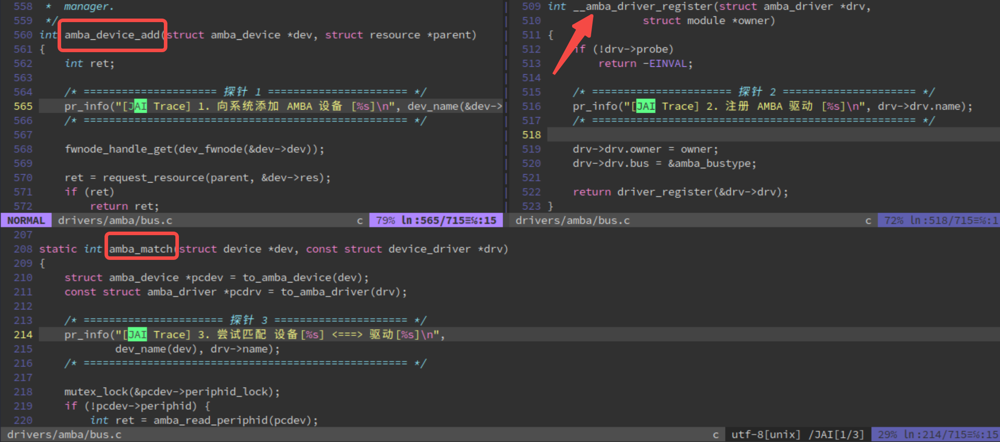

- `dynamic debug`、`ftrace` 来具体看看

    `make menuconfig` 打开下面配置：

    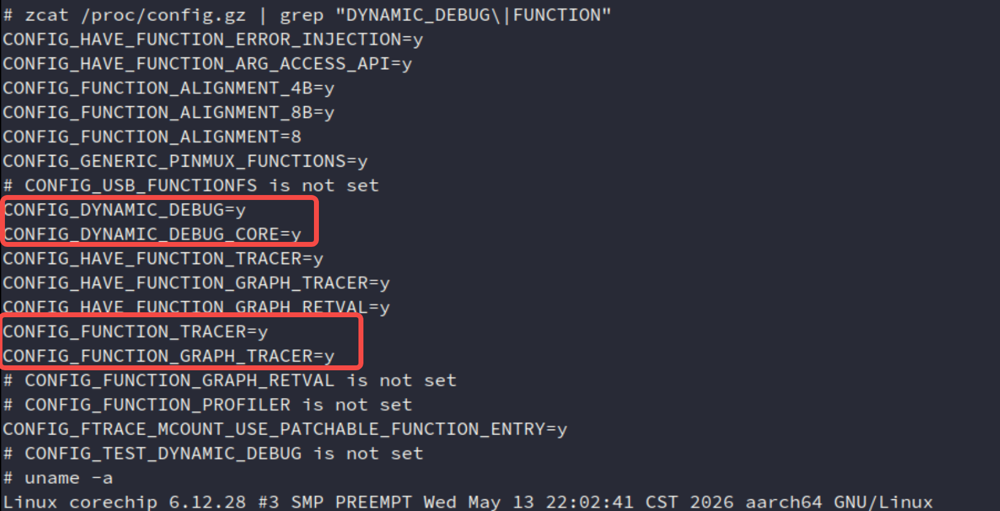

    相关实践代码：

    `ftrace`：

    > 注意：往 `bind/unbind` 下 `echo` 的，就是该设备在对应总线下的唯一标识符，也就是它在 `/sys/bus/<总线名>/devices/` 目录中的名称，比如下面的 `gpio` 控制器对应的 `9030000.pl061`。

    ```bash
    mount -t tracefs tracefs /sys/kernel/tracing
    
    # 进入 ftrace 目录
    cd /sys/kernel/tracing/  # 较老内核可能是 /sys/kernel/debug/tracing/
    
    # 关闭追踪，准备配置
    echo 0 > tracing_on
    
    # 设置追踪器为函数调用图
    echo function_graph > current_tracer
    
    # 设置你要追踪的核心函数（设备模型、设备树、AMBA总线相关）
    # of_platform_populate: 解析设备树并创建设备
    # amba_device_add: 添加 AMBA 设备
    # amba_match: AMBA 总线的 match 函数
    # really_probe: Linux 驱动模型核心 probe 入口
    # pl061_probe: 具体驱动的 probe
    echo of_platform_populate amba_device_add amba_match really_probe pl061_probe > set_ftrace_filter
    
    # 如果你想看更深层次的调用，可以设置追踪深度
    echo 5 > max_graph_depth
    
    # 清空之前的历史 trace
    echo > trace
    
    # 开启追踪
    echo 1 > tracing_on
    
    # 触发要观察的动作（比如重新 bind 设备）
    echo 9030000.pl061 > /sys/bus/amba/drivers/pl061_gpio/bind 
    
    # 关闭追踪并查看结果
    echo 0 > tracing_on
    cat trace
    ```

    `dynamic debug`：

    法一：在启动时追踪（追踪设备树解析和设备创建）

    ```bash
    dyndbg="file drivers/of/platform.c +p; file drivers/base/core.c +p; file drivers/base/dd.c +p; file drivers/amba/bus.c +p"
    ```

    法二：运行时加打印：

    ```bash
    # 挂载 debugfs（如果没挂载的话）
    mount -t debugfs none /sys/kernel/debug
    
    # 开启 drivers/base/dd.c (Driver Core) 中所有的 debug 打印
    echo 'file drivers/base/dd.c +p' > /sys/kernel/debug/dynamic_debug/control
    
    # 开启 AMBA 总线的 debug 打印
    echo 'file drivers/amba/bus.c +p' > /sys/kernel/debug/dynamic_debug/control
    
    # 执行 bind
    ...
    
    # 此时用 dmesg 就能看到丰富的底层交互过程了
    dmesg
    ```

- 对于一些UART 还没初始化好的打印、以及早于Dynamic Debug (`dyndbg`) 初始化的组件打印（比如设备树：`drivers/of/fdt.c` 的）

    直接暴力打开 `DEBUG`

     ```makefile
     # drivers/of/Makefile
     # 让这个目录下的所有 .c 文件在编译时都带上 DEBUG 宏
     ccflags-y += -DDEBUG
     ```

    

经过以上几个手段，然后重新编译出内核，再配合 `qemu` 启动：

```bash
qemu-system-aarch64 \
  -machine virt,virtualization=true,gic-version=3 \
  -nographic \
  -m size=1G \
  -cpu cortex-a72 \
  -smp 2 \
  -kernel out/Image \
  -initrd out/rootfs.cpio \
  -dtb out/cc_qemu_sdk.dtb \
  -fsdev local,id=shareid,path=./share,security_model=none \
  -device virtio-9p-device,fsdev=shareid,mount_tag=share \
  -append 'earlycon ignore_loglevel console=ttyAMA0 rdinit=/linuxrc dyndbg="file drivers/base/dd.c +p; file /drivers/base/core.c +p; file drivers/base/platform.c +p; file drivers/amba/bus.c +p; file drivers/of/fdt.c +p; file drivers/of/platform.c +p; file arch/arm64/kernel/setup.c +p" ftrace=function_graph ftrace_filter="of_platform_populate amba_device_add amba_match really_probe" trace_buf_size=10M'

# 注意！：这里 append 加了一些追踪的文件
```


下面直接实践。


首先的问题就是内核是在什么时候开始解析设备树、创建节点的呢？这里并不多说，网络上文章挺多了，直接问 AI 更快。直接给流程：

```C
# 架构初始化
primary_entry
    ... 
    start_kernel
    
# 内核入口
start_kernel
  setup_arch  
    setup_machine_fdt
    unflatten_device_tree <--------- 扁平设备树解开
    (里面有相关打印：Unflattening device tree:，当然主要是填充 /sys/)
  ...
  arch_call_rest_init
    rest_init
      user_mode_thread
      pid = kernel_thread(kernel_init, NULL, CLONE_FS); 
        kernel_init
          kernel_init_freeable 
            do_basic_setup
              driver_init
                of_core_init
                  kset_create_and_add ( 在 /sys/firmware/ 下创建 "devicetree" 目录)
                  __of_attach_node_sysfs (具体执行者，负责为单个设备树节点创建 sysfs 目录)
                    kobject_add (在父目录下，以确定好的 name 创建一个新目录 (kobject))
                
              do_initcalls
                arch_initcall_sync(of_platform_default_populate_init)
                  ...
                  of_platform_populate <--------- 填充设备树
                    of_platform_bus_create
            		  of_amba_device_create   <--- 创建 amba 设备
                        of_platform_device_create_pdata
                          of_device_add
                            device_add
                              kobject_add
                                ...
                                kobject_add_internal
                                  create_dir
                
                ...
        run_init_process(execute_command) //启动第一个应用进程

```

在脑海中有了大致的执行流程后，就可以开始简单大致流程验证了，就看上面几个关键函数的相关日志。

下面是早期启动日志：

```TXT
[    0.000000] OF: fdt: ** translation for device pl011@9000000 **
[    0.000000] OF: fdt: bus (na=2, ns=2) on 
[    0.000000] OF: fdt: translating address: 00000000 00000009
[    0.000000] OF: fdt: reached root node
[    0.000000] earlycon: pl11 at MMIO 0x0000000009000000 (options '')
[    0.000000] printk: legacy bootconsole [pl11] enabled
...
[    0.000000] OF: fdt:  -> unflatten_device_tree()
[    0.000000] OF: fdt: fixed up name for gpio-keys -> gpio-keys
[    0.000000] OF: fdt: fixed up name for poweroff -> poweroff
[    0.000000] OF: fdt: fixed up name for pl061@9030000 -> pl061
...
[    2.609498] Serial: AMBA PL011 UART driver
[    2.611138] [JAI Trace] 2. 注册 AMBA 驱动 [uart-pl011]

```

再到具体创建 `gpio` 设备过程：

> 这里 `gpio-keys` 和 `pl061` 在之后可能会写，`amba device` 和 `platform device` 还是有点区别。

```TXT
# 填充设备树
[    2.621694] OF: of_platform_populate()
[    2.622801] OF:  starting at: 
...
# 添加 gpio 设备

[    4.506092] OF: create platform device: /gpio-keys
[    4.525893] OF: Creating amba device /pl061@9030000
...
[    4.539539] [JAI Trace] 1. 向系统添加 AMBA 设备 [9030000.pl061] <-- 从设备树提取节点
...
[    4.567411] [JAI Trace] 3. 尝试匹配 设备[9030000.pl061] <===> 驱动[uart-pl011] (每添加一个设备，做一次总线匹配)
...
```

但是上面还没有匹配驱动，所以再看 `pl011`，也就是 `uart`：

```TXT
# 添加 uart 设备
[    4.908518] OF: Creating amba device /pl011@9000000  
...
[    4.921099] [JAI Trace] 1. 向系统添加 AMBA 设备 [9000000.pl011] 
...
[    4.942740] [JAI Trace] 3. 尝试匹配 设备[9000000.pl011] <===> 驱动[uart-pl011]
```

可以看到对应驱动和设备在 `amba` 总线 `match` 上了(就是匹配名字/id)，

也就是 Gemini 说的：

> **怎么比对？** 就是看 DTS 里的 `compatible = "arm,pl011"` 和驱动代码里 `of_match_table` 写的字符串是不是一模一样

接着看 `match` 之后输出的日志：

```
[    4.943859] amba 9000000.pl011: bus: 'amba': __driver_probe_device: matched device with driver uart-pl011
[    4.945651] amba 9000000.pl011: bus: 'amba': really_probe: probing driver uart-pl011 with device
[    4.947166] OF: no dma-ranges found for node()
[    4.948207] uart-pl011 9000000.pl011: device is not dma coherent
[    4.949265] uart-pl011 9000000.pl011: device is not behind an iommu
[    4.950589] OF: of_irq_parse_one: dev=/pl011@9000000, index=0
[    4.952433] OF:  parent=/intc@8000000, intsize=3
[    4.953502] OF:  intspec=0
...(设备树描述的uart的中断配置)
[    4.987462] OF: comparing apb_pclk with uartclk
[    4.988684] OF: comparing apb_pclk with apb_pclk
[    4.990091] uart-pl011 9000000.pl011: >>>> JAI Debug: pl011_probe is strictly running! <<<<
```

最后进入 `probe`，最终 `pl011` `uart` 驱动通过串口核心（serial core）注册到 `tty` 子系统，使硬件设备呈现为 TTY 设备（如 /dev/ttyAMA0）。

这里也就是前面说Gemini说的：

> “物理设备和驱动代码结合后，他们要生孩子（逻辑抽象设备）了！... PL011 会在内部创建 `tty/ttyAMA0/` ... 内核会在 `/sys/class/` 下创建软链接”

```txt
---> [    4.990091] uart-pl011 9000000.pl011: >>>> JAI Debug: pl011_probe is strictly running! <<<<[    5.020506] serial-base 9000000.pl011:0: bus: 'serial-base': __driver_probe_device: matched device with driver ctrl
[    5.022163] serial-base 9000000.pl011:0: bus: 'serial-base': really_probe: probing driver ctrl with device
[    5.025192] ctrl 9000000.pl011:0: driver: 'ctrl': driver_bound: bound to device
[    5.026882] ctrl 9000000.pl011:0: bus: 'serial-base': really_probe: bound device to driver ctrl
[    5.031852] serial-base 9000000.pl011:0.0: bus: 'serial-base': __driver_probe_device: matched device with driver port
[    5.034199] serial-base 9000000.pl011:0.0: bus: 'serial-base': really_probe: probing driver port with device
[    5.036321] port 9000000.pl011:0.0: driver: 'port': driver_bound: bound to device 
[    5.037538] port 9000000.pl011:0.0: bus: 'serial-base': really_probe: bound device to driver port
---> [    5.042669] 9000000.pl011: ttyAMA0 at MMIO 0x9000000 (irq = 14, base_baud = 0) is a PL011 rev1 <-- “生娃”成功！向 TTY 子系统注册了 ttyAMA0
[    5.047195] printk: legacy console [ttyAMA0] enabled
[    5.047195] printk: legacy console [ttyAMA0] enabled
[    5.049269] printk: legacy bootconsole [pl11] disabled
[    5.049269] printk: legacy bootconsole [pl11] disabled
---> [    5.079996] uart-pl011 9000000.pl011: driver: 'uart-pl011': driver_bound: bound to device <-- 彻底绑定完毕 (Bind)
[    5.083181] uart-pl011 9000000.pl011: bus: 'amba': really_probe: bound device to driver uart-pl011
```

> 当然关于什么 `earlycon`、`tty` 的内容也挺有意思的，有空可以写，也可以看这两篇：[8, 9]。

无论怎么样，设备树/系统中描述的其他设备最终也会按照上面类似的过程创建在 `/sys` 下。


## 3.3 实践——运行时 bind/unbind 看看

```BASH
# echo 9030000.pl061 > /sys/bus/amba/drivers/pl061_gpio/unbind 
```

首先 `unbind`，然后看这个目录下有什么内容：

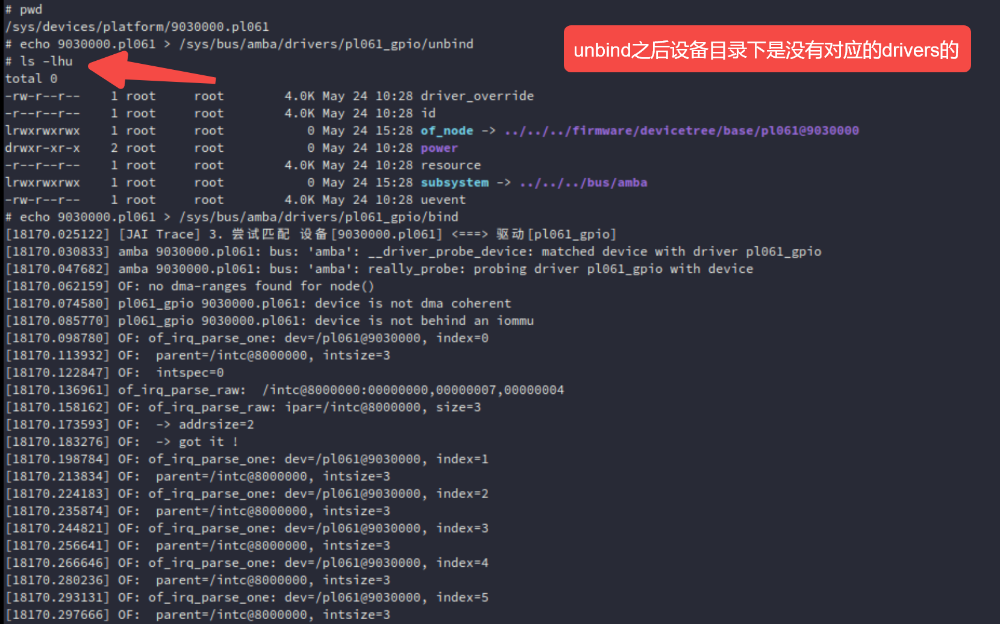

再次 `bind`：

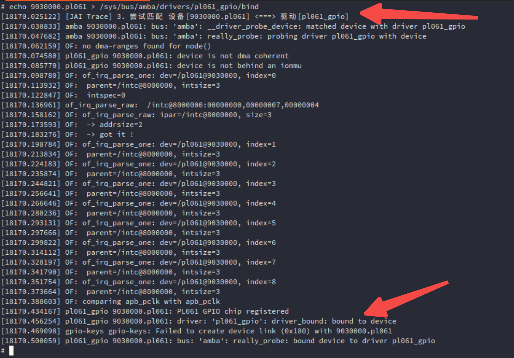

输出各种日志，就是之前在 3.1 中描述过的 `device` 和 `driver` 的在 `amba` 总线上的 `match` 和 `probe` 的行为。

具体来说，就是在这个 `/sys/devices` 目录下（就是设备）和 `amba` 下的注册的 `driver` 匹配起来了。

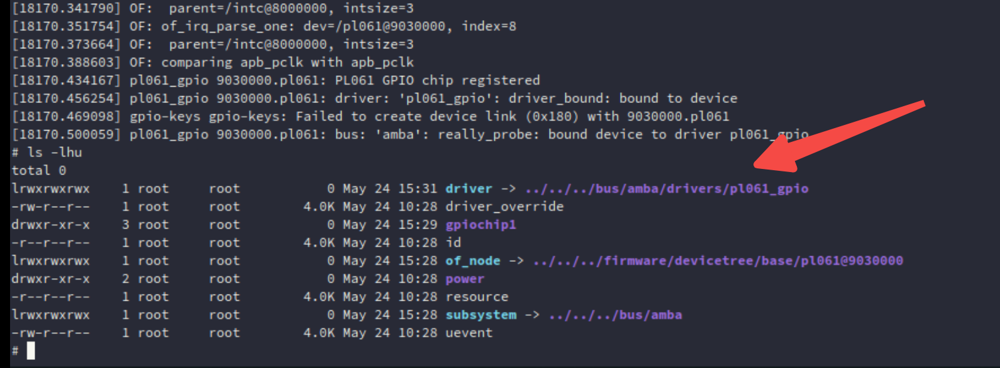

由此回到之前 Gemini 3.1 最后总结的一些技巧：硬件是否正确连接/识别了（设备树）、驱动是否正常加载了（）、设备对应子系统是否绑定成功了（`/sys/class` 或者 `/sys/bus` 是否出现了对应节点）


## 3.4（可跳过）`gpio-keys`

当然，重新 `bind` 后，`gpio` 还有一个报错：

`gpio-keys gpio-keys: Failed to create device link (0x180) with 9030000.pl061`

可以看到，虽然之前的 `PL061` 这个 GPIO 控制器本身注册成功了，但依赖它的 `gpio-keys`（按键子系统）在建立设备链接（Device Link，用于管理电源和挂起唤醒的依赖关系）时失败了。

因为在电源管理中有一个“供应商-消费者”（Supplier-Consumer）的概念：

- **Supplier（供应商）：** `PL061`，它提供 GPIO 管脚。
- **Consumer（消费者）：** `gpio-keys`（虚拟机的电源键/按键），它需要读取 PL061 的某个管脚状态。

所以内核为了防止“消费者还在用，供应商却跑路了”导致内核崩溃的问题，引入了 Device Link 机制。

正常开机时，`PL061` 先 `probe` 成功，然后 `gpio-keys` `probe` 成功，内核给它们建了一个 `Link`。

但是，我上面是手动往 `sysfs` 的 `unbind` 写入 了`PL061` 的，相当于强行“杀死了”供应商，所以 `gpio-keys` 失去了底层依赖，处于半死不活的状态。

而当我再次 `bind` `PL061` 时，`PL061` 重新生成了实例，但旧的 Device Link 状态混乱了，所以报出了 `Failed to create device link` 的警告。

解决方法就是重新绑定 `gpio-keys` 驱动（逼它重新 probe，此时它会发现 PL061 已经在等它了），因为设备树之前就描述好了：

```YAML
gpio-keys {
    compatible = "gpio-keys";

    poweroff {
        gpios = <&gpio0 0x03 0x00>;
        linux,code = <0x74>;
        label = "GPIO Key Poweroff";
    };
};

gpio0: pl061@9030000 {
    phandle = <0x8004>;
    clock-names = "apb_pclk";
    clocks = <&apb_pclk>;
    interrupts = <0x00 0x07 0x04>;
    gpio-controller;
    #gpio-cells = <0x02>;
    compatible = "arm,pl061\0arm,primecell";
    reg = <0x00 0x9030000 0x00 0x1000>;
};

```

然后输入：

```bash
# echo gpio-keys > /sys/bus/platform/drivers/gpio-keys/unbind
# echo gpio-keys > /sys/bus/platform/drivers/gpio-keys/bind
...
[  373.323786] platform gpio-keys: bus: 'platform': really_probe: probing driver gpio-keys with device
[  373.332391] input: gpio-keys as /devices/platform/gpio-keys/input/input1
[  373.335481] gpio-keys gpio-keys: driver: 'gpio-keys': driver_bound: bound to device
```

至于说，`gpio-keys` 是个啥，自己的理解就是，这就是一个软件抽象（所以也才是一个 `platform device`）。

我自己认为这种设计解决了这个问题：**按键码的语义不统一**

在一开始学习写 MCU 或者按键相关的内容的时候，大家一般都会被教学这么写：

```C
// board_a.h
#define BTN_VOL_UP   1
// 应用代码里
if (msg.id == BTN_VOL_UP) { volume_up(); }
# 借助
```

而不要这么写：

```C
if (GPIOA->IDR & BIT0){
	...
}
# 或者
if (HAL_GPIO_ReadPin(GPIOA, GPIO_PIN_0) == GPIO_SET) {
    ....
}
```

说这种设计：应用层所有判断 `BTN_VOL_UP` 的地方理论上不需要改，前提是它只依赖这个宏，而不是魔数。如果宏的名字保持一致，那只要重新包含新板子的头文件，应用代码就可以不变。

**所以我的项目只要维护一张设计得更加优秀的 GPIO/设备资源表就可以了**。

> 这实际上也是Linux设备树的作用，设备树只是让项目更加好维护、内核可以去除更多无关代码、编译的内核镜像更小，但是并没有改变内核设备中 `adapter`（内核中把这个设计叫做总线）的思想。 

平心而论，这种设计真的不好吗？我倒是觉得**并不糟糕，甚至对于其应用场景来说，还合理的。**

我直接在一个基于 MCU 上做开发，直接维护一个 C 语言结构体数组（比如 `struct button_config_t`），里面存着 GPIO 端口、引脚号、有效电平和对应的按键键值（宏定义枚举）。然后写一个通用的轮询任务，遍历这个表，做软件消抖，最后把键值扔进一个消息队列。

我不照样做到了数据与代码解耦？还省了个设备树的负担。

但是问题在哪里？应用层代码真不变吗？我觉得问题就是谁来保证上面这些宏的名字和语义在所有板子/项目之间都是统一的？

- 每一家芯片原厂提供的 BSP，或者每一个公司的中间件团队，都有自己定义的消息结构体和枚举。比如公司 A 定义音量加是 `#define BTN_VOL_UP 0x01`，公司 B 定义是 `enum { KEY_V_PLUS = 10 }`。
- **导致的后果：** 如果你的应用层跑的是一个第三方的图形框架（比如 LVGL）或者一个复杂的音频引擎，每次换一块不同厂家的开发板，你就必须写一层“胶水代码（Porting Layer）”，把 BSP 发出来的自定义宏，翻译成 LVGL 能听懂的输入事件。这就叫“跨平台复用性差”。

所以我的理解就是：**跨项目复用做不到的原因，不是“维护一个 GPIO 表”这个动作本身，而是整个生态缺少一套强制绑定的“标准按键语义”。**

> 当然，早期的 Linux 按键应该也会遇到额外的问题，比如什么不同的按键有自己的字符设备驱动、有自己的消抖、中断、节点等特性。`gpio-keys` 也可以解决这个，但我认为最重要的还是语义统一。

所以这个 `gpio-keys` 强迫了所有人使用 Input 子系统规定的标准键码（linux,code）。

比如之前的：

```yaml
volume_up {
    gpios = <&gpio1 2 GPIO_ACTIVE_LOW>;
    linux,code = <115>;   // KEY_VOLUMEUP
    debounce-interval = <20>;
};
```

这里 `115` 是 Linux 内核头文件里明确定义的 `KEY_VOLUMEUP`，全球所有 Linux 系统都一样。
然后，`gpio-keys` 驱动通过 `input_report_key(dev, KEY_VOLUMEUP, 1)` 上报事件。
应用层直接从 `/dev/input/eventX` 读到的就是一个标准的 `struct input_event`，它的 `code` 字段就是 `115`。

**现在换到任何一块板子，只要我在设备树里把“物理 GPIO”映射到同一个 `linux,code`，应用层一行代码都不需要动。**
无论底层是 SoC 直连 GPIO，还是 I²C 扩展芯片，应用完全无感。

也可以说是一种机制（如何读引脚、如何消抖）与策略（这是个什么引脚、代表什么按键）分离吧。


# 参考

[1] Neil Brown. (2015). A fresh look at the kernel's device model. https://lwn.net/Articles/645810/

[2] Neil Brown. (2015). A tour of /sys/devices. https://lwn.net/Articles/646617/

[3] Corbet. (2003). (Series: Porting device drivers to the 2.6 kernel) Driver porting: Device model overview：https://lwn.net/Articles/31185/

[4] JiangYY. OS2024. 操作系统概述：https://jyywiki.cn/OS/2024/lect1.md

[5] Corbet. (2003). (Series: Porting device drivers to the 2.6 kernel) The zen of kobjects：https://lwn.net/Articles/51437/

[6] Neil Brown. (2010). A critical look at sysfs attribute values：https://lwn.net/Articles/378884/

[7] JiangYY. OS2024. 输入输出设备：https://jyywiki.cn/OS/2024/lect26.md

[8] 终端和 UNIX Shell：https://www.bilibili.com/video/BV1nQXsBuEUz

[9]【技术杂谈】shell和terminal：https://www.bilibili.com/video/BV16A411675V

