> **注意：以下的内容均为个人观点+在学习/实践中得出。**
>
> **如果你看完后有不同的观点也没关系！请指出，我很乐意去尝试积极的东西。**

封面：

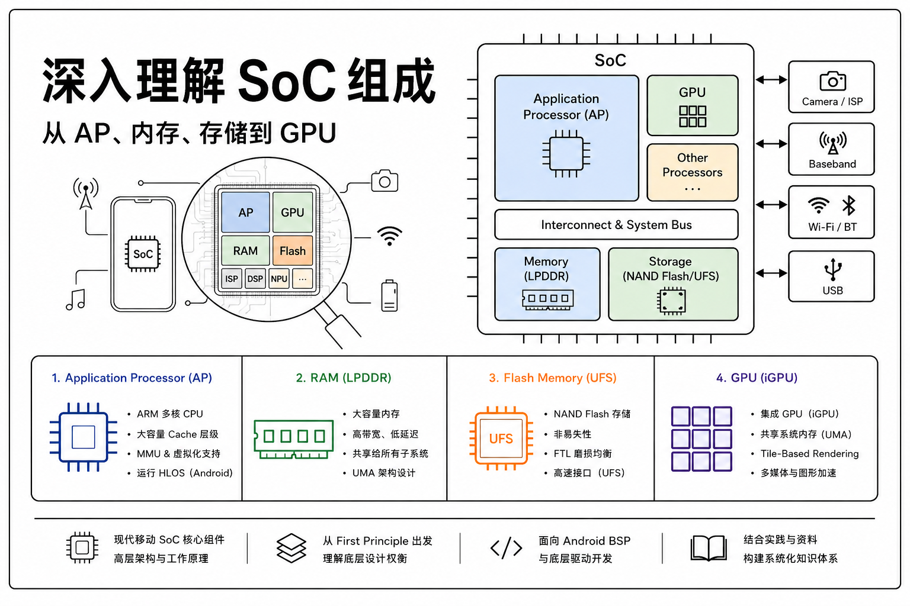

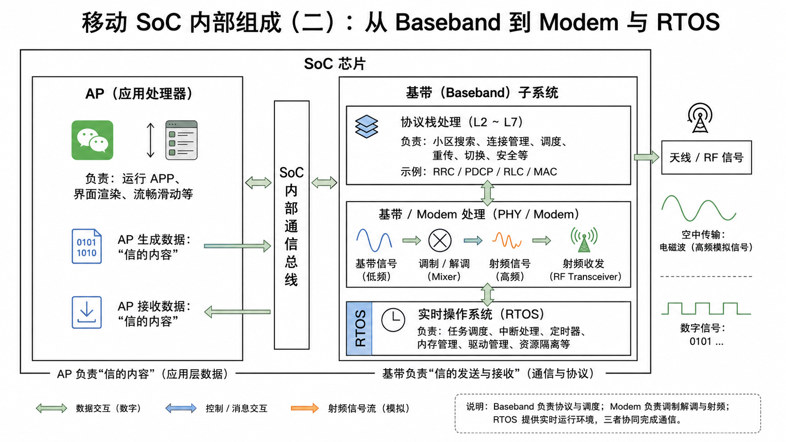

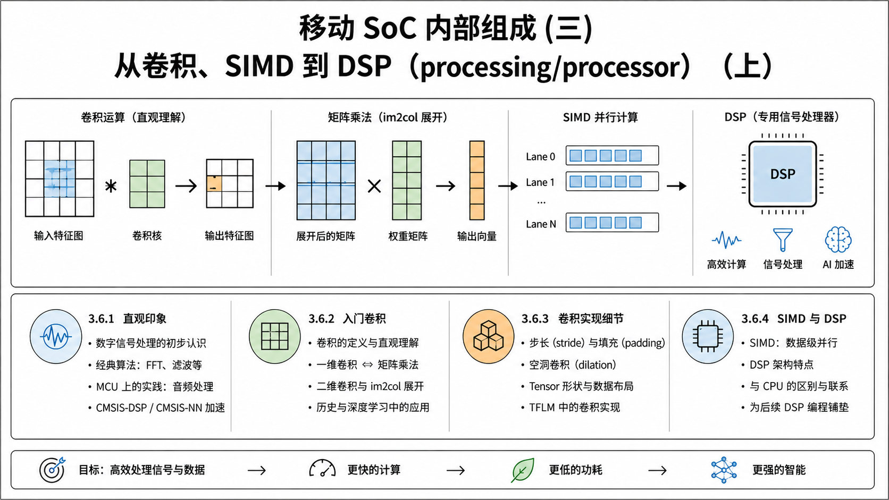

目录：

```
1. introduction
2. SoC high level overview
3. SoC Components
  3.1 Application Processor (AP)
  3.2 RAM
  3.3 Flash Memory
  3.4 Graphics Processing Unit (GPU)
  (本文就完成了上方的，下面的节拆成好几篇发)
  3.5 baseband (Modem) (已写好，下篇发)
  3.6 DSP
  3.7 Camera/ISP
  3.8 DPU
  3.9 Codec processors
  3.10 Sensors and Sensor Hub
  3.11 Bluetooth & WiFi
  3.12 USB
  3.13 Serial ports
  3.14 Secure element
  3.15 Secure Processing Unit (SPU)
  3.16 Neural Processing Unit (NPU)
  3.17 Power Management Unit/ Integrated Circuit
```


> 本文是[移动 SoC 内部组成 (一)：AP、RAM、Flash 与 iGPU](https://mp.weixin.qq.com/s/3AE8czRxd9GGSV-9njE4Iw)的后续章节，写的是基带以及相关的基础，自己经验不多，所以从头学习！

> 前文已完成：
>
> [移动 SoC 内部组成 (一)：AP、RAM、Flash 与 iGPU](https://mp.weixin.qq.com/s/3AE8czRxd9GGSV-9njE4Iw)
>
> [移动 SoC 内部组成 (二)：从 Baseband 到 Modem 与 RTOS](https://mp.weixin.qq.com/s/FmdzdE3-ITCR9SXCB87gyw)
>
> 本文讲述的是 DSP，经验也不多，所以从头学习。


# 1. introduction

临近入职，看到了自己进的组，竟然进了多媒体开发，但是我的岗位不是底软嘛？非常地奇怪，不过对我来说，`it's all the same ~ ~`

另外，自己还在孔夫子旧书网上买了本书：《Android internals::Powe User's View》，四百页左右，全英，非常贵。

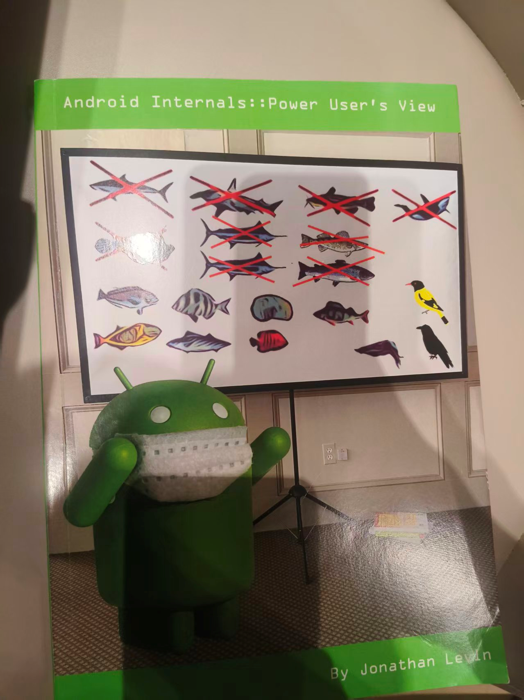

其中包含的内容很多都是 Android BSP 会涉及到的内容（不过比较久了，2021/2022年的，但很多东西都还有用），比如：

`ch7. The Android boot process`：

```
· The Boot ROM/PBL
· Second Stage/eXtensible Boot Loader
    · Qualcomm (SD835+) UEFI Loader
    · Samsung S-BOOT
    · MediaTek Preloader
· The Android Boot Loader
    · Little Kernel (32-bit, ARMv7 and ARMv8 non Qualcomm UEFI)
    · (Generalized) LK execution flow
    · LinuxLoader (Qualcomm UEFI)
· Boot loader locking
...
· The RAM Disk (initramfs)
· The Boot Control HAL
```

` ch2. hardware`：会介绍 SoC 组件、高通、华为、联发科的 SoC

`ch3/ch5`：介绍 Android 的 `storage type` 、`partition`、`storage management`...

甚至还有比较少说的：`ch6. Android System Images & Update`，系统更新、OTA等等。

还有什么 Android 自己的 `power management`、`Zygote` 等等内容。

详细目录见：[1]，整个系列挺长的，有很多卷，我买的这本是只是第一卷。

所以之后的一段时间应该都是会基于这本书写自己的理解、以及一些岔开的话题。

本文主要基于它的第二章 `Hardware`：

```
2.1 The ARM architecture
    Aarch32 and Aarch64
    ARM architecture revisions
2.2 Devices
2.3 System on Chip (SoC) overview
2.4 SoC vendors
    Qualcomm (Snapdragon)
    Samsung (Exynos)
    Huawei (Kirin)
    MediaTek (MTK)
2.5 The Device Tree
2.6 Firmware images
```

不会都覆盖，比如设备树/ `firmware` 应该放以后，本篇以及之后好几篇就看 SoC的组成，或者看看其中的多媒体的部分嘛，刚好到多媒体组了嘛。


# 2. SoC high level overview

> 由于 SoC 往往发展的非常快，且基本都是由 vendor 所定义实现的，所以想要找一本描述 SoC 内部组件，有什么IP、如何互联、寄存器如何组织、中断和内存如何映射的书籍，其实还是比较少的。
>
> 当然，如果你转念一想，这不就是具体的 vendor 所提供的 SoC datasheet吗？只不过是针对各自 vendor 自己的 SoC 罢了。
>
> 所以这里构建一个比较 high-level 的 SoC overview，简单描述现代的 SoC 系统一些关键的组件（当然是对于做 low-level 的人的）

**⚠️继续提醒**：不同 vendor 的 SoC，哪怕是其中起同作用的一类 IP，在各家厂商的实现都是有可能不同的。甚至说某些组件可能经历了从手机主板做到 SoC 里面，或者反过来，都是可能的参考设计（比如说 DRAM、ISP、基带（处理器）等）。所以这里展示的只是一个 high level model。

下面让 AI 画了两张总体的架构图，其中具体以手机的产品为例。

从主板层面看：

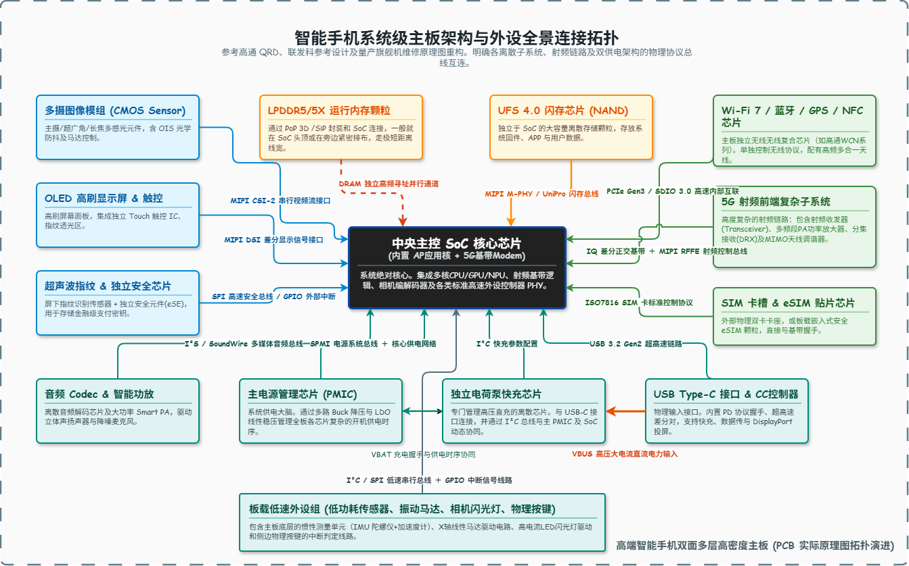

具体到 SoC 系统：

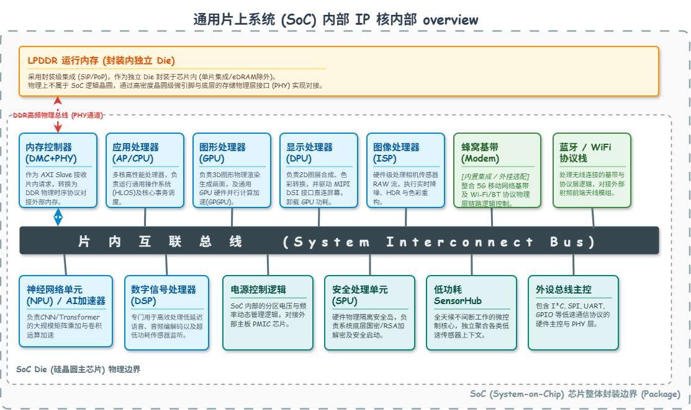

或者可以对比着看具体某一款 SoC，比如下面是高通的 X 系列的^[4]^：

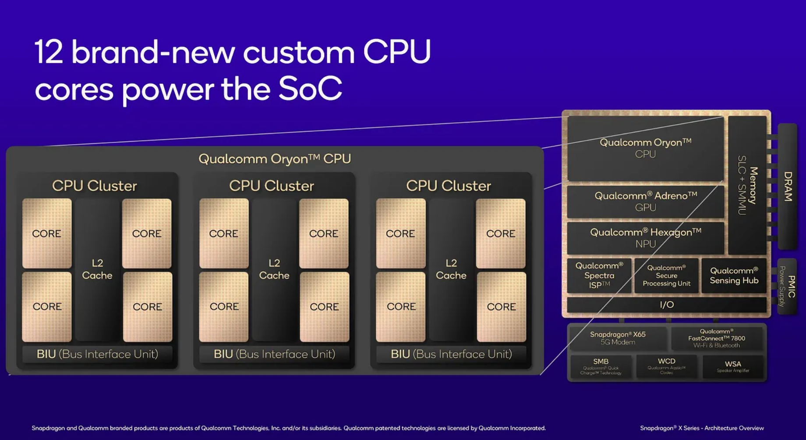 

下图为snapdragon 8 gen5（SM8845）^[5]^：


下面大致看看各个 SoC 中的各个组件，大致结构参考[3]的 `chapter 2`。


# 3. SoC Components

## 3.1 Application Processor (AP)

SoC 中几乎可以说最重要的就是这个 AP，现代的 AP 一般都具有较大容量的 L1/L2/L3 cache，甚至于在到 DRAM 之前还有 SLC（System-Level-Cache），具体怎么做，由各自 vendor 的芯片架构师做 `trade-off`。比如下图^[4]^：

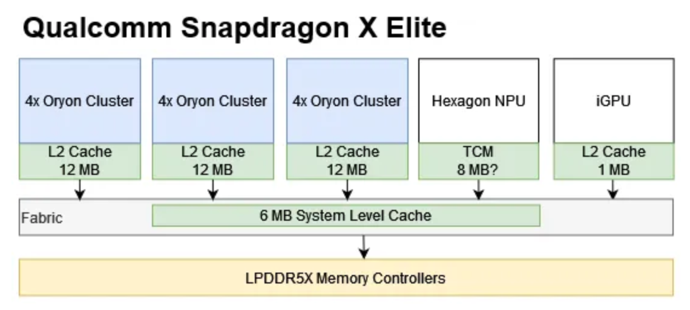

AP 主要负责运行 HLOS（High Level Operating System），因为现代的 OS 基本都会依赖 MMU 提供的能力来做 `virtualization`。

> **详细内容推荐阅读：**
>
> - Arpaci-Dusseau, R. H., & Arpaci-Dusseau, A. C. (2018). ***Operating Systems: Three Easy Pieces***  Arpaci-Dusseau Books. http://www.ostep.org/
> - Andrew S. Tanenbaum, Herbert Bos. ***Modern Operating Systems***, 5th Edition (2023)
>
> **个人认为这两本目前是世界上最好的 OS 书。当然，现在有这么强大的 LLM，结合着用+拓宽视野，知道什么是能做，什么是不能做的就变得越来越重要。**

HLOS 这个词，一般在高通的代码里常常见到，它们的 SDK 似乎很早就在用这个词了。

对于车载的领域，HLOS 通常是 QNX，然后跑 Hyperviosr，上面接着还会再跑一个 Android 作为车机。很多车载厂商的方案都如此，不过 NVidia 似乎是 跑改造后的 Linux。

而对于主要讨论的手机语境，这个 HLOS 即 Android。

目前移动领域， AP 几乎全都是 ARM 多核处理器，要么是通用 Cortex-A/X 变体，要么是厂商定制的扩展核心，这一点稍后会在"SoC 厂商"部分详述。TODO。


## 3.2 RAM

memory（内存）对整个计算机系统来说都非常重要用，自然是越多越好。

一方面大容量的内存让更多的进程能够并发运行，而更高速内存则确保它们以尽可能低的延迟运行。

目前的 memory 也已经从 几十 MB 到 目前手机上的：8GB、12GB、16GB。

不过现在内存/存储涨得有点离谱 + AI 产能压力，这些产品会不会倒退？ 

可用内存量通过 `/proc/meminfo` 伪文件中的 `MemTotal` 行报告，不过由于外设预留了部分内存，该数值有时会比设备标称容量少一些（比如我分配了 4GB）。

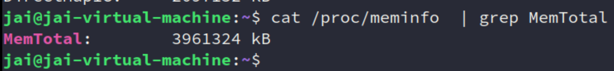

目前移动端采用的几乎都是 LPDDR，现在主流应该是 4-6？更多优质介绍还是留给更专业的人士，而且已经有很多人写的很好了，没有必要再多造（这个系列的都不错）：

- [DDR 探密二：深入剖析 DRAM 芯片的存储原理 - 知乎](https://zhuanlan.zhihu.com/p/663697786)


## 3.3 Flash Memory

由于内存断电丢失数据，所以就需要 `persistence` 的存储。

由于移动端设备强调尺寸和便携性，传统的硬盘显然不适用。故取而代之的是固态存储，通常是 NAND 闪存。

> **为什么呢？下图来自 [6]**

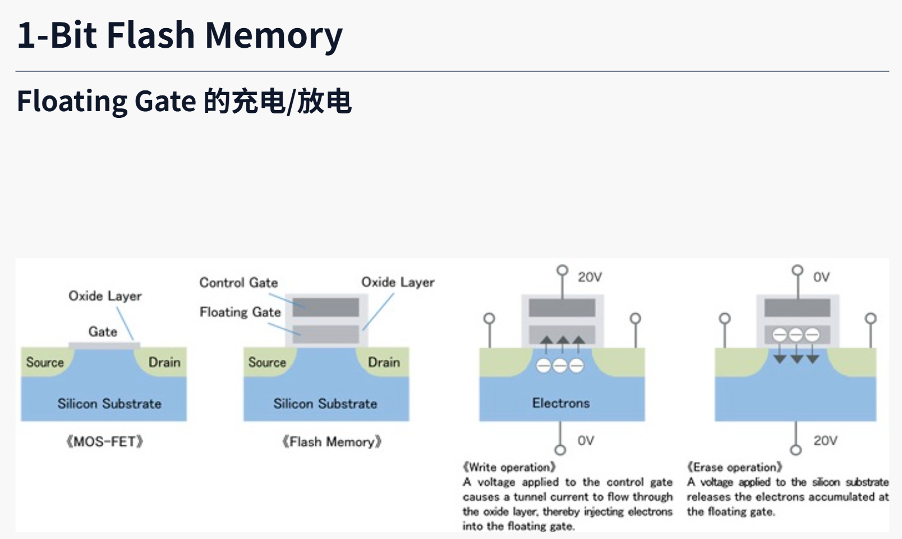

下方描述来自 AI：

1-Bit NAND Flash是一种非易失性存储器，每个存储单元只能存储1位二进制数据（0或1），属于SLC（Single-Level Cell）存储。其核心结构为浮栅晶体管（Floating Gate Transistor），存储单元通过是否存有电子来表示数据状态。

> 它本质上是一个 MOSFET，但多了一个**浮栅**（Floating Gate），被两层二氧化硅（SiO₂）完全包裹。

其工作原理如下：

1. 存储结构：NAND Flash由许多浮栅晶体管串联组成“字线”和“位线”；每个晶体管对应一个存储单元，仅存储1 bit。
2. 编程（写入）：通过在控制门和源漏极施加一定电压，实现电子通过隧穿效应注入浮栅。当浮栅内有电子时，单元状态为“0”；无电子为“1”。
3. 擦除：通过反向电压，使浮栅电子释放。擦除操作以“块”为单位进行。
4. 读取：给控制门施加适当电压，根据浮栅是否有电子，当前存储单元的导通情况（阈值电压高为“0”，低为“1”）即可判断数据。
5. 特点：SLC NAND Flash速度快、寿命长、可靠性高，适用高端存储领域。

总结，1-Bit NAND Flash通过控制浮栅晶体管中电子的有无，实现数据的写入、读取与擦除。

所以这就有一些比较离谱地方了：

- 由于是集成电路，那容量就能变得很大，只要制程够
- 由于是电路（天然并行）：容量越大，速度越快（同代产品下）

当然，上面的优势也是有代价的，就是浮栅晶体管（Floating Gate）放电 (erase) 做不到 100% 放干净

玩过 MCU 的一些外置 flash 芯片的都知道， 闪存 flash 以称为**页（pages）**的逻辑单元运行。哪怕修改单个比特需要刷新整页。这被称为**编程/擦除周期（Program/Erase cycle）**，而页面只能承受有限次数的此类周期——大约在数千次量级。

具体来说，每次 Program/Erase（P/E）都要在氧化层上施加 **15V~20V 的高压**，让电子通过**量子隧穿**（Fowler-Nordheim Tunneling）进出浮栅。

这个高压对氧化层是**物理损伤**：

- 高能电子会打断 SiO₂ 中的化学键
- 产生**界面陷阱**（Interface Traps）和**氧化层陷阱**（Oxide Traps）
- 这些陷阱会**捕获电子**

关键问题就是，Erase 操作后，浮栅里的电子确实被"抽"走了，但氧化层陷阱中**残留的电子**无法被 Erase 清除。这些残留电子会产生一个持续的电场，等效于浮栅里还有电子，所以：

- 放电**数千/数万次**以后，就好像是 “充电” 状态了
- Dead cell; “wear out”

有点害怕，有些文件我们应该写了上千次了，为啥还没挂，还没丢？

答案是：“软件定义磁盘”^[6]^：

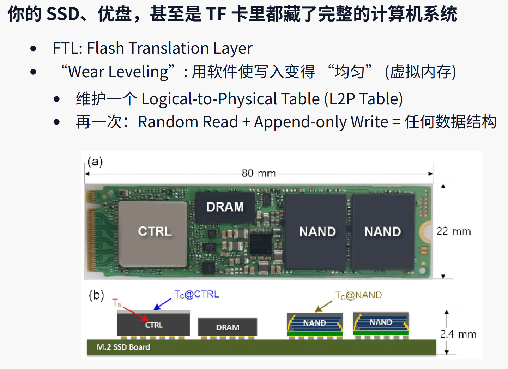

使用 FTL 来对同一逻辑地址的反复写入**每次都重定向到不同的空闲物理页**，旧页仅标记为无效而不立即擦除，从而让写入磨损被均匀分散到整个 NAND 的所有物理页上。（磨损均衡）

做过嵌入式的你，你肯定想到了，这个计算机系统是不是跑的嵌入式系统呢？！几乎就是了，实时性嘛，需要确定性响应来处理 NAND 的时序和 ECC 计算，但又不需要多大的 RAM。

基本就是用什么 ARM 的 Cortex-M0、Cortex-R 系列^[7]^，当然 RISC-V 也很火呀，英睿达就在用^[8]^。**所以，喜欢玩 MCU 的，也可以去做存储厂商的固件开发呀。**

> 可以看看：[SSD科普二十：SSD Firmware，为什么越做越像一套小型操作系统？](https://mp.weixin.qq.com/s?__biz=MzIyNDcyMzAyMA==&mid=2247484389&idx=1&sn=dd3e27d80e065f0b16ce3d20387efd60&chksm=e9c0188f93194e4c369b04278a213db254e1a0177301ea42de70d4d576dd521c2a649334f918&mpshare=1&scene=1&srcid=07054HyBAB4JnOHd9Kjisb2u&sharer_shareinfo=0afc6f79bf2fe612e4d22cab0e963dbb&sharer_shareinfo_first=0afc6f79bf2fe612e4d22cab0e963dbb#rd)

扯多了，回到正题。

目前移动设备使用的主 `persistence` 的存储，一般就是：`eMMC` 和 `UFS`，手机用 `UFS` 更多一点，因为更快嘛（**SCSI 命令队列 + 全双工 + 串行高速物理层**）。

这部分也不展开了，特别专业相关的还是找行业内的人讲解：

- [Linux 6.18 内核：一张 SD 卡的“诞生”全流程源码解读](https://mp.weixin.qq.com/s?__biz=MzU1NjM3MTI0OA==&mid=2247485840&idx=1&sn=ded4f54e3f68cc07fb54497ef037be7f&chksm=fa29cac17f7948ac9de57b45d6323dc4d6aa7e3a94fe370c3af8134c00e1aa68145a45c46950&mpshare=1&scene=1&srcid=0705zZkzvgg7vn6k91xtkZWj&sharer_shareinfo=3bfdf2ae8c8eb3849a0c6cb66ab782f8&sharer_shareinfo_first=3bfdf2ae8c8eb3849a0c6cb66ab782f8#rd)
- What is Universal Flash Storage (UFS)? | Synopsys：https://www.synopsys.com/glossary/what-is-universal-flash-storage.html
- eMMC vs UFS vs SSD: Choosing the Right Storage for Embedded Systems：https://www.kynix.com/Blog/emmc-vs-ufs-vs-ssd-choosing-right-storage-embedded-systems.html


## 3.4 Graphics Processing Unit (GPU)

一般大家对 GPU 的直观印象都是相较于处理器的独立元件，也就是在电脑旁接着用来打游戏的那个。但对于移动端系统来说，往往**”手机里没有‘显卡’**”。（下面基本讨论的都是 ARM 的）

PC 的独显有独立的显存VRAM，通过 PCIe 和会 CPU 通信；而手机 SoC 的 GPU 基本都是 Integrated GPU（`iGPU`），直接做在 die 上，通过内部总线连接内存控制器。

由于移动设备的大小、便携性、功耗等限制，其主板放不下额外显存颗粒，多一套 VRAM 和 PCIe PHY 待机功耗直接爆炸。所以手机 GPU 的"显存"就是系统内存，`dumpsys meminfo` 里的 `Graphics` 内存本质上都是从 LPDDR 里分配的。

`iGPU` 和 CPU、NPU、ISP 共享同一块 LPDDR，大家一般叫 **UMA（Unified Memory Architecture）**。

> **Most embedded GPUs use a Unified Memory Architecture (UMA) where the GPU shares the same physical RAM as the CPU. This differs from desktop systems with dedicated Video RAM (VRAM) connected via a high-speed PCIe bus.^[8]^**

对于这部分的 `iGPU`，网上分享的资料相对比较少，所以我按照自己的理解来写。

`iGPU` 有几种常见的实现，高通使用其自研的 Adreno，而大多数其他厂商选择 ARM 的 Mali 的处理器、苹果自研。

> **⚠️ 这里可以再回到2.1 里看看 骁龙8gen5 的die图，就有印象了！**
>
> TODO

尽管 GPU 和 CPU 共享 RAM 对高性能图形至关重要，但也带来了挺多问题的，直接想到的就是：”带宽竞争“。

PC 独显有 500GB/s 甚至 1TB/s 的专属带宽；手机 LPDDR 虽然快，但是 CPU、GPU、NPU、ISP、Display Controller 一起抢。GPU 渲染一帧 4K 游戏可能吃掉几十 GB/s，内存控制器满负荷运转，这就是手机玩游戏发热掉帧的根本原因——**不只是 GPU 在算，整个内存子系统在被压榨**。

为了在这种"带宽贫困"下生存，移动端的 `iGPU` 进化出了 **Tile-Based Rendering（TBR）**：把屏幕分成小块（Tile），在 **on-chip 的 tile memory**（如 Adreno 的 GMEM）里完成深度测试和颜色混合，最后只把结果写回 DRAM。这样大幅减少了对 LPDDR 的访问。Mali 甚至把 OpenCL 的 local memory 也映射到系统 DRAM——相比桌面 GPU，可以说是"穷人版"方案。同一款游戏在手机和 PC 上画面差异巨大，不只是算力差距，更是**内存架构的代差**。

另外，由于未来可能做多媒体相关，所以我让 AI 总结了下底软/驱动相关的管线怎么走。

> 1. GPU 和 CPU 共享内存，需要地址隔离。驱动分为 **KMD**（内核空间，如 KGSL、mali_kbase，负责硬件初始化、中断、内存页表）和 **UMD**（用户空间共享库，负责 API 翻译）。
> 2. GPU、Camera、Display 之间靠 **DMA-BUF** 共享图像 buffer，用 `fd` 跨进程传递，实现零拷贝。SurfaceFlinger 合成一帧，可能从 Camera 取 buffer、GPU 画 UI、Display Controller 上屏，全程无复制。
> 3. GPU 渲染好的内容不会直接上屏，而是走 **SurfaceFlinger → HWComposer → Display Controller**。HWC 决定哪些 Layer 用 Display Controller 的 **Overlay Plane** 硬件直接显示（省带宽省功耗），哪些必须用 GPU 合成。整条管线由 **VSYNC** 脉冲驱动，**fence** 机制保证 GPU 渲染完成后再被读取，避免画面撕裂。

一些推荐的资料：

> - Arm GPU Training - Episode 1.1: Introduction to mobile systems：https://developer.arm.com/additional-resources/video-tutorials/arm-mali-gpu-training-ep1-1
> - Android/Linux GPU Drivers: Internals and Resources | Lei.Chat()：https://www.lei.chat/posts/android-linux-gpu-drivers-internals-and-resources/


## 3.5 蜂窝通信子系统（Baseband & Modem）

> 在开始之前，不妨先想一个日常场景：每天打开手机，看到"5G"标，给朋友发条微信，或者收到一条银行验证码短信。这些我们习以为常的操作——流量上网、收发短信、接打电话——背后其实都依赖一个（非通信专业接触比较少的，不过哪怕是它们，其相关 RTOS 接触的也不多）子系统，baseband（processor）。

> 我们知道，AP（应用处理器）负责运行微信、渲染界面、让你滑动流畅，但把"0101"变成电磁波发出去、再把空中抓到的电磁波还原成"0101"的，是谁呢？
>
> 这里先给出之前犯的一个不严谨的错误的总结（baseband和modem）（本文之前发过一次，有错误删了重发了）：
>
> - **Baseband（基带）**：一般指低频基带信号，以及处理它的 **Baseband Processor**（基带处理器）。它跑协议栈、RTOS、做数字信号处理。
> - **Modem（调制解调器）**：负责把基带信号"搬"到高频载波上（调制），以及从载波上"搬"回来（解调）。Modem = Modulator + Demodulator。
>
> 在 SoC 中，这两者通常被集成进同一颗芯片（如高通 X70、联发科 M80），所以口语中常混用。但严格来说，**"基带"不等于"调制解调器"**。


下面再从头开始写！

实话说，这部分的内容在我写之前也一直是比较陌生的，因为不像 SoC 中的其他子系统，我或多或少都接触过一点技术细节，但是对于基带、蜂窝通信，我真的是就仅仅是它的用户而已（用流量上网、短信、打电话之类的）。

哪怕在本科期间”上过“《高频电子线路》，我也仅仅知道了这么个概念：**有个东西能把基站的模拟信号变成手机能懂的数字信号。**

> **所以这 `baseband & modem` 这部分就不像前面的内容那样介绍得比较少，会涉及一些 SoC 外的基础知识（对我来说），不想看的可以直接到 3.5.5 看关于 SoC 部分的总结。** 

首先，我们都知道计算机中所有的数据/接口/等等内容（`send(sock, data)`），到最后产生的其实都是：`010101010101...`，比如 Linux kernel 的网络协议栈（`app`、`TCP`、`IP`...）最终肯定都是一串 `bytes`。

那我要怎么让别人的机器知道我发送的是什么数据呢？

有线传输时，网线里可以用 +2.5V 代表 1，-2.5V 代表 0，这是电压信号。

那无线呢？通过空气传输 0 和 1？不现实，空气里没有："电压高 = 1、电压低 = 0"这种概念。

空气里没有导线，有人造的电磁场电磁波呀：`900MHz`、`1800MHz`、`2.6GHz`、`3.5GHz`：

```
长这样：~~~~~~~^^^^^^~~~~~~~
```

根据我们高中就学过的，电磁波有这几个可以动手的地方：

- 幅度（大小）
- 频率（快慢）
- 相位（波形在某个时刻的“位置”）

所以前人的智慧就是**用 0 和 1 去控制一个电磁波的这些特征之一，让这个电磁波“变形”，从而携带信息。**


### 3.5.1 发送无线电波（Baseband Signal 的产生）

所以第一个问题就变成了如何把 `01010101` 变成无线电波？

`0101` 是抽象的比特，得先让它变成一个物理电信号。在基带电路里，举个例子：

- **映射：** 把 1 映射成 +1V，把 0 映射成 -1V（这只是举例，实际可能更复杂，比如 +1/-1/+3/-3 同时代表多个比特），具体就是对相位：比如 1 对应相位 0°，0 对应相位 180°（BPSK）

    > 再或者对于频率，可以LED类比理解：一直亮，但**闪得快**表示 1，**闪得慢**表示 0 → 控制的是"闪烁速度"（频率），FSK

- **成型：** 为了让信号频谱不要太宽、干扰邻居，可以用用滤波器把这些方波修圆滑，变成一种连续变化的波形。

这样我们就得到了一个**低频的、连续的、随时间变化的电压波形**。这，就是 **Baseband Signal（基带信号）**。

> 基带信号的频率从接近 0Hz 开始，最高也就几 MHz 到几十 MHz（取决于数据速率）。它**直接承载着我的 0/1 信息**，就像把“信的内容”写在了电压的高低起伏上（很好的理解）。

此时我就会想，那我要怎么让别的机器知道我传递的信息呢？因为信息已经在电里面了，那我就需要一个东西，把电变成波。天线。


### 3.5.2 天线（Antenna）

按照高中物理学习的内容，物理上有一个根本规律（麦克斯韦方程组的核心）：

- **变化的电场会产生磁场**
- **变化的磁场会产生电场**

如果一个电场和磁场不断互相激发，它们就会像波浪一样，一环推一环地向外传播。这就是**电磁波**。

但普通的电路里，电场和磁场是被束缚住的：

- 导线里的电流产生磁场，磁场的能量就集中在导线周围。
- 导线两端的电压产生电场，电场的能量就集中在正负极之间。

它们没有“跑出去”，只是在原地互相转换（比如在电容和电感里），或者沿着导线流动。

天线要做的事，就是打破这种束缚。它利用了一个关键事实：

**只要电荷有加速度，它就会向外辐射电磁波。**

- 电荷匀速运动 → 产生稳定电流和磁场，能量被束缚。
- 电荷加速/减速（来回振荡）→ 变化的电场产生变化的磁场，这个新产生的磁场又会在稍远一点的地方产生新的电场……能量一层层向外“甩”出去，挣脱了导线的束缚。

天线，就是为电荷提供一个让它高效“来回振荡”的结构。

这样子：通过天线，我们就能发送信息啦！（具体怎么“甩”，当然是失去看经典教材啦）

- **发射时（电 → 波）**：高频电流在天线上来回振荡，把能量“甩”出去，形成能在空中飞行的电磁波。
- **接收时（波 → 电）**：空中的电磁波碰到天线，在天线上感应出微弱的高频电流，回到电路里。

那为什么不直接用天线传播这个基带信号呢？用一个经典的公式：
$$
波长(λ)=\frac{频率(f)}{光速(c)}
$$

- 低频信号（1kHz）波长300公里，四分之一波长天线要75公里 → 手机根本装不下，也谐振不了，几乎发不出去。
- 高频信号（1800MHz）波长16.7厘米，四分之一波长天线只要4厘米 → 轻松塞进手机，完美谐振，高效发射


### 3.5.3 载波（Carrier）原理

所以基带信号不能直接上天线，需要一个高频的信号，带着这个基带信号才能上天线，这个就是载波啦。

> 此时我会问：怎么带？怎么把基带信号“骑”到高频载波上？
>
> 答案是：**乘法运算。基带信号“骑”上载波（调制），在物理上就是基带信号和载波相乘。**

其中的数学原理如下：两个信号。

- **基带信号**：变化缓慢，比如一个低频正弦波
    $$
    \cos(2\pi f_m t)\\
    频率 f_m 很低，比如 1MHz
    $$

- **载波**：一个高频正弦波
    $$
    \cos(2\pi f_c t)\\
    频率 f_cN很高，比如 1800MHz
    $$
    

这两个直接**相乘**：

\[
\cos(2\pi f_m t) \cdot \cos(2\pi f_c t)
\]

三角函数积化和差公式拆开：

\[
= \frac{1}{2} \cos\big(2\pi (f_c + f_m) t\big) + \frac{1}{2} \cos\big(2\pi (f_c - f_m) t\big)
\]

**结果：相乘之后，信号不再是 \( f_m \) 和 \( f_c \) 单独存在，而是变成了两个全新的频率分量——\( f_c + f_m \) 和 \( f_c - f_m \)。**

基带信号 \( f_m \) 本身消失了，它的信息被“搬”到了载波频率 \( f_c \) 的两侧——**上边带**（\( f_c + f_m \)）和**下边带**（\( f_c - f_m \)）。

这就是“骑上去”的数学本质：**基带信号不是像乘客坐车那样原封不动地待在载波上面，而是通过乘法运算，把自己的频率移到了载波频率旁边，变成了一个以载波为中心的高频信号。**

> **其中，具体的物理电路实中，负责做这个乘法运算的器件叫混频器（Mixer）**

其原理一般利用非线性器件（如二极管的平方律特性）。一个理想二极管的电流-电压关系近似为：

\[
i = a_0 + a_1 v + a_2 v^2 + \dots
\]

如果把基带信号 \( v_m \) 和载波信号 \( v_c \) 加在一起输入：

\[
v = v_m + v_c
\]

那么输出电流的平方项：
$$
(v_m + v_c)^2 = v_m^2 + 2v_m v_c + v_c^2
$$
里，就会产生**乘积项**
$$
2v_m v_c
$$
，这正是我们需要的乘法结果。

后面再用一个带通滤波器，只保留 \( f_c + f_m \) 或 \( f_c - f_m \)，就去掉了无用的直流、谐波等其他分量，得到干净的 RF 信号。

> **可能上面比较输出的数学比较多，下面我自己简单梳理一下：**

1. 一个干净的单频正弦波，比如 `1800MHz`（本身就是 `~~~~` 这样平稳的波动，什么信息都没有），这是**Carrier（载波）**

2. 然后，我们用刚才那个基带信号去 **调制** 这个载波。假如用最简单的 BPSK（二进制相移键控）：

    - 基带信号为 +1V 时，让载波正常发射（相位 0°）
    - 基带信号为 -1V 时，让载波倒过来发射（相位 180°，也就是把波形上下颠倒）

    于是这个高频载波就变成了：

    ```TXT
    基带:  1   0   1   1   0
    载波: ~~~~ ~~~~ ~~~~ ~~~~ ~~~~
            翻转？  翻转？
    最终 RF:
           ~~~~~~~~    ~~~~~~~~  ...
    ```

3. 最终结果，得到一个**高频的、相位被基带信号不断翻转的电磁波**。

    此时，它已经包含了你所有 0/1 的信息啦！频率又高达 1800MHz，波长 16.7cm，四分之一天线只要 4cm，轻松塞进手机。

    这个阶段产生的，就是 **RF 信号（射频信号、Radio Frequency signal **。

    我再把它送到天线，做好对应的匹配，天线就能辐射出完全对应的电磁波，这就是我要的“无线电波”啦

> **还有个问题，载波哪里来？这么高频的玩意哪里来？AI！**
>
> 手机和基站里有专门的电路，人为“制造”出来这些高频电磁波段：
>
> 这个电路叫振荡器 (Oscillator)，它就像个精准的电子节拍器，能把直流电变成稳定、高频的交流正弦波。
>
> 更多深入内容看一些教材吧！或者是一些做硬件的同学，应该更有经验才对。


### 3.5.4 可视化

这里使用了下面这个工具来画出 RF。

> **Free Digital Modulation Techniques Visualizer：https://simulations4all.com/simulations/digital-modulation-visualizer**

具体来说，我做的是这样的：

**"0101 的抽象比特，通过 BPSK 调制，变成了 4kHz 载波上的相位翻转波形，在 20dB 信噪比的有噪声信道中传输，接收端完美恢复出了原始比特。"**

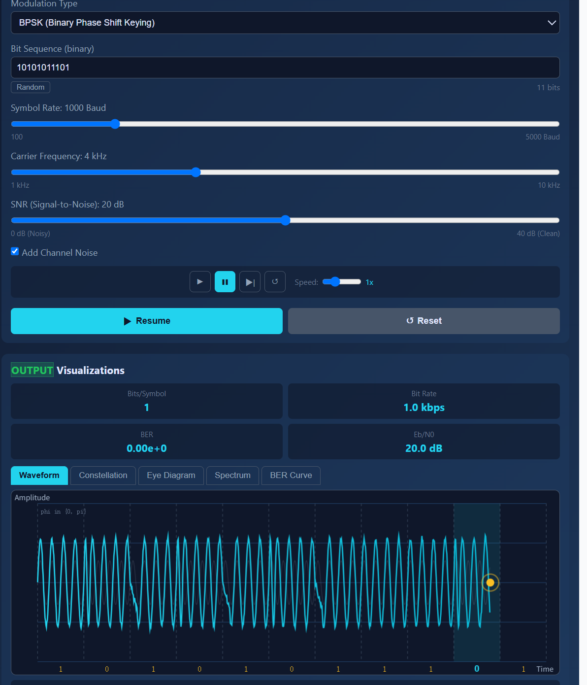

其从 `0101` 到电磁波的完整流水线：

```txt
你的数据 (0101...)
   ↓
基带处理（映射、成型）→ 低频基带信号 (带信息，但飞不远)
   ↓
调制 (把基带绑上高频载波) → 高频 RF 信号 (能飞很远)
   ↓
天线 → 空中电磁波
```

当然，前面讲述的过程是正向发送的基带信号：原始信息信号（基带信号）经过"搬移"到高频载波上，才能通过天线有效辐射出去。这个"搬移"的过程就是 **调制（Modulation）**；接收端"搬回来"就是 **解调（Demodulation）**，加起来就变成：

**Modem = Modulator + Demodulator**。

故简单总结：

- **Baseband Signal**：那几 MHz 的低频波形
- **Baseband Processor**：处理基带信号、跑协议栈的芯片/处理器
- **Modem**：完成调制解调功能、包含射频前端的模块

但是啊，按照我的理解，早期的简单通信中，基带和 Modem 的界限是比较清晰的，但在现代移动 SoC 里，**基带处理器（Baseband Processor）绝不仅仅只干 Modem 的活**。这个我们到 3.5.5 再展开。


### 3.5.5 processor & RTOS

> **前面几小节讲了：怎么把 `0101` 变成电磁波，以及怎么把电磁波里的 `0101` 拿回来。**
>
> **但这部分可以说都还是在物理层（PHY）工作。如果基带只干这个，那不就像一个"ADC + 混频器"？那为什么行业里常说"基带是手机里最复杂的芯片之一"？**
>
> **搜索资料学习！**

这里有一个事实被忽略了：**无线信道是共享的、时变的、不可靠的。** 空气不是专线，是广场。基带不能只负责"把波发出去"，还得回答：

- 附近有哪些基站？哪个信号最好？→ **小区搜索**
- 我想发数据，什么时候开口才不会和别人撞车？→ **MAC 调度 / 随机接入**
- 发出去对方没收到怎么办？→ **HARQ 重传**
- 我在走路，怎么无缝切换到新基站？→ **切换（Handover）**

**所以，"把比特变成波"只是开始。基带还需要回答一系列更上层的问题：**

- 我现在在哪？附近有哪些基站？哪个信号最好？**→ 小区搜索（Cell Search）**
- 我想发数据，但广场上很多人同时在说话，我什么时候开口才不会撞车？**→ 随机接入（Random Access）**
- 我发出去了，但对方没收到，怎么办？**→ 重传（HARQ）**
- 我在走路，原来的基站越来越弱，隔壁基站越来越强，怎么无缝切换？**→ 切换（Handover）**
- ......

所以说，上面这些问题不是"把波发出去"能解决的，它们需要**状态机、调度器、定时器、重传缓冲区**——换句话说，需要**软件**，也就是协议栈啦！（感觉可以放在 OSI 七层模式去理解，这个时候再去看看所谓的 3GPP 是啥或许会更好）

> **所以前面 `3.5.1~3.5.4` 讲的全部内容，其实只落在最下面两层（PHY + RF），属于 modem 的工作。而上面的 MAC、RLC、PDCP、RRC、NAS，都是运行在基带处理器上的软件协议栈**。
>
> 这里推荐一篇文章，感觉还行：原创移动基带安全研究系列之一 概念和系统篇-IoT安全-看雪安全社区｜专业技术交流与安全研究论坛：https://bbs.kanxue.com/thread-254358-1.html

**但这里自己需要理清一个概念：运行这些协议栈的，不是笼统的"Modem"，而是 Baseband Processor（基带处理器）。**

论文 [10] 对 MediaTek Helio X10（MT6795）的基带固件做了完整的逆向分析，可以从中验证一些内容：

> **"MediaTek's baseband firmware consists of two parts: ARM and DSP. The DSP firmware controls the lower layers, including modulation and demodulation of the over-the-air signal. The ARM firmware controls the upper layers, including the processing of the signaling messages and interconnection with the application processor."**

翻译一下：**DSP 干的是 Modem 的活（调制解调），ARM 固件干的是 Baseband Processor 的活（协议栈、信令处理）**。

可以更详细地看 ARM 固件的结构，见下图：

- 最底层：**Nucleus RTOS** 内核 + MediaTek 抽象层
- 驱动层：NVRAM、SIM 卡接口
- Layer 1/2：物理层和数据链路层（部分与 DSP 协作）
- **Layer 3**：RRC（无线资源控制）、MM/EMM（移动性管理）、CC（呼叫控制）、SM/ESM（会话管理）
- **Layer 4（应用层）**：ATCI（AT 命令解释器）、L4C（控制实体）、L4A（适配层）——与 AP 交互

这些 Layer 3/4 的协议栈，**全部运行在 ARM 核心上，由 Nucleus RTOS 调度**，跟 DSP 的 Modem 功能完全是两回事。

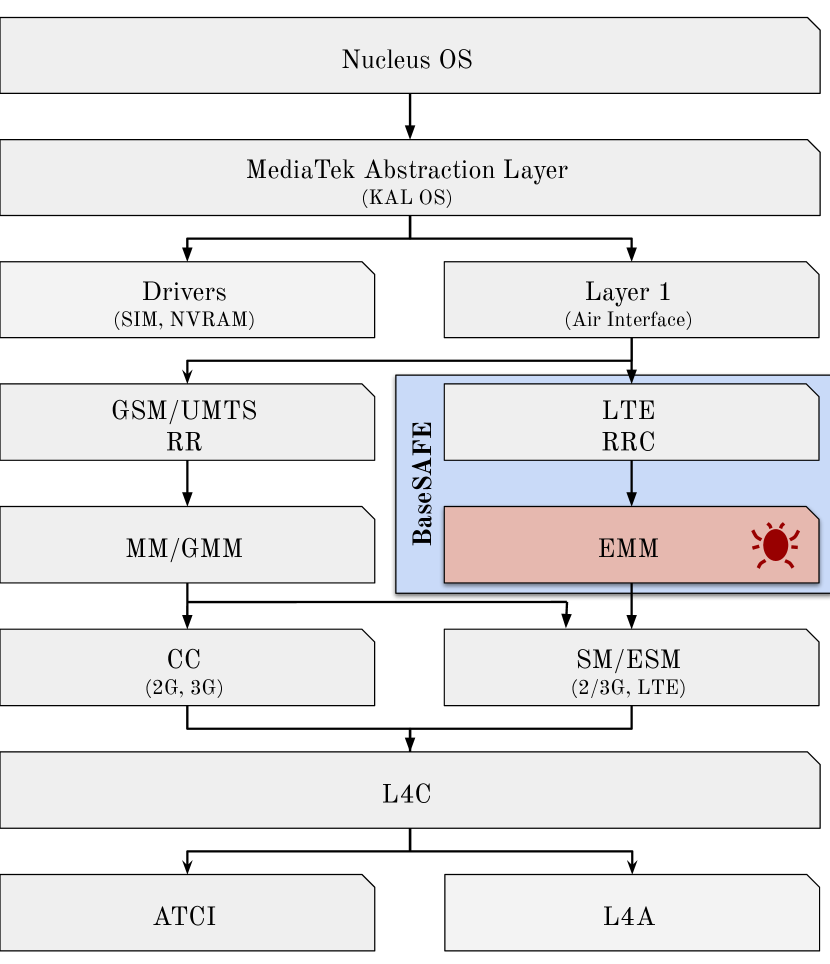

而且不单一篇，另一篇安全研究博客（Comsecuris）也确认了 MTK 的架构（当然这个比较古老，现代设计不一定这样了）^[11]^：

> **According to the MTK documents, the modem system is composed of a DSP and an ARMv7 Cortex-R4 MCU. Both reside within the same chip as the application processor. The DSP implements the physical layer of the cellular baseband stack and is out of the scope for this post (when I talk about the modem or baseband processor I refer to the MCU). The ARMv7 core runs the baseband firmware and implements the different cellular data-link and network layer protocols.**

也就是说，**在行业里，"Modem"这个词有时候指整个基带子系统，但严格来说，跑协议栈的"大脑"是 ARM MCU（Baseband Processor），一般的 DSP（高通那种特别的DSP另说）只是干苦力的。**

总得来说，可以画出一个大致的图：

```TXT
┌─────────────────────────────────────────┐
│         Baseband Processor (SoC)        │
│  ┌─────────────┐    ┌─────────────────┐ │
│  │   Modem     │    │  Protocol Stack │ │
│  │  (DSP核)    │◄──►│   (ARM CPU核)    │ │
│  │             │    │                 │ │
│  │ • 调制/解调  │    │ • RRC/NAS/MAC   │ │
│  │ • FFT/均衡   │    │ • RTOS 调度     │ │
│  │ • 信道编解码 │     │ • 与AP通信(CCCI) │ │
│  │ • MIMO处理   │    │ • 电源管理       │ │
│  └─────────────┘    └─────────────────┘ │
└─────────────────────────────────────────┘
```

**Modem（DSP）只是左边那一小块，Baseband Processor（ARM CPU）才是右边那个跑 RTOS、处理信令、管理整个通信流程的"大脑"。**

当然了，这种"Baseband Processor 负责控制面 + 协议栈，Modem/DSP 负责物理层"的架构是行业通用设计，不是某一家厂商的特殊做法，哪怕是卖通信 IP 的厂商，就比如 Ceva 推出的 eNB-IoT 完整方案中^[12]^，其"Modem"IP 就明确包含了：

- 协议栈软件：MAC、RLC、PDCP、RRC、NAS
- L1 控制与物理层（PHY）
- RTOS 与驱动

也很好理解吧，光有调制解调能力的话，设备根本无法入网通信。

> **这个时候已经很明朗了！，这不又是一个完整的嵌入式计算机系统？就像在 3.3 中的完整的 Flash 产品也是需要“控制芯片”来做 `wear leveling` 呀。**

跑一个 RTOS？没错，上面这种通信协议栈应该要求的是 RTOS 里面常说的“硬实时”，也就是执行流需要有明确的完成时间（Determinism，确定性）。

> 比如基站每毫秒下发的指令，告诉手机"下一毫秒你可以用哪几个资源块发数据"。如果 Baseband Processor 在几毫秒后才响应，那个时隙早就过了，基站已经把资源分给别的手机了。

**所以 Baseband Processor 内部必须有一个确定性响应的实时操作系统（RTOS）。。**

但有个问题，跑在哪里呢？这部分资料可以说比较少。

就看几个厂家吧，我觉得还是得业内人士拿到才知道更多的内部信息（希望有人能交流）。。。

1. Qualcomm

    这部分我竟然是在高通收购的 NUVIA 公司的招聘岗位上找到的^[13]^：

    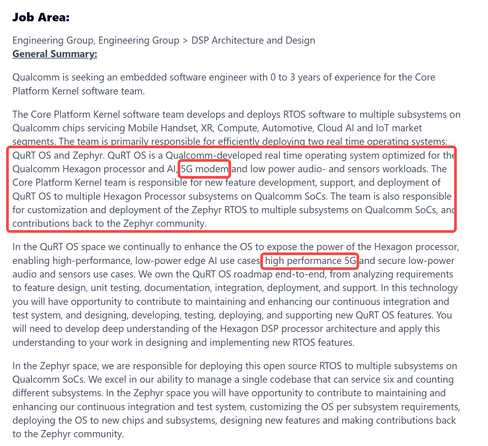

    > **"QuRT OS is a Qualcomm-developed real time operating system optimized for the Qualcomm Hexagon processor and AI, 5G modem and low power audio- and sensors workloads."**
    >
    > “QuRT OS是高通公司开发的实时操作系统，针对高通Hexagon处理器和人工智能、5G调制解调器以及低功耗音频和传感器工作负载进行了优化。”

    也就是说这个RTOS是跑在 Hexagon DSP 这个处理器上的（很特别的”DSP“，高通现在叫 Hexagon NPU，从 DSP 的部分发展过来的），其中 DSP 部分下一节会写。

    **QuRT RTOS**，提供线程、Mutex、Semaphore、Timer、Interrupt、Memory Protection 等典型 RTOS 能力。^[14]^

2. MediaTek

    MTK 的 Modem 子系统处理跑的 RTOS 是 Nucleus RTOS^[15]^。

    其中跑的处理器应该是 **DSP + ARM MCU** 的多核，

    十年前的旧资料显示^[11]^，HTC One M9+（MT6795/Helio X10）用的这些：

    - DSP 负责物理层信号处理，
    - ARMv7 Cortex-R4 MCU 运行基带固件（即 Nucleus RTOS），实现 L2/L3 协议栈。

    现在应该大致不变，只是说用的更新更强的 R 核。

    而且其中很有意思的一个点，AI 搜集资料说的：

    > 对于MTK，其AP（应用处理器）与 MD（Modem）之间通过 **CCCI**（Cross Core Communication Interface）进行通信，Android 内核中的 `eccci`/`ccci` 驱动源码是公开的，这为了解二者交互提供了入口。下图^[11]^

    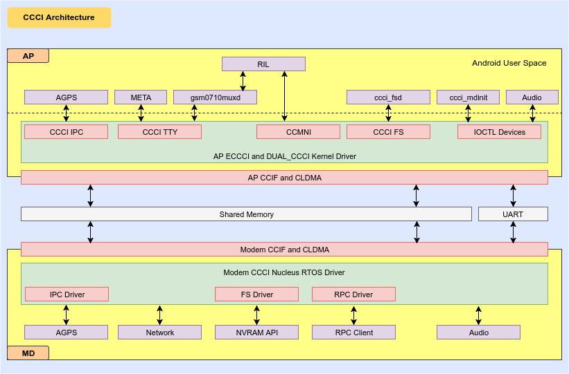

    尽管 MTK 的 Modem 固件是严格保密的，官方不提供公开文档，但是：

    历史上还是曾有大量 MTK 芯片的 datasheet 泄露（比较古老的 SoC 如 MT6595、MT6782 等），还包含 SoC 布局的高层级概述^[11,16]^。

3. Samsung Shannon（基于逆向资料）

    三星自研的基带处理器代号 **Shannon**（用于非美国市场的 Exynos 机型），其运行的 RTOS 被称为 **ShannonOS**。逆向工程社区的分析表明^[17]^，ShannonOS 本质上是对 **Nucleus RTOS**（Mentor Graphics）核心的重新 branding，旧版三星工具链（CMC）甚至能直接识别出原始的 Nucleus 名称。

    对于跑这个 RTOS 的核心，经过逆向：

    - **ARM Cortex-R** 跑 **Nucleus RTOS**（后来 Samsung 自己包装成 ShannonOS），负责控制面：任务调度、RRC、MAC、NAS。
    - **DSP** 负责 PHY 苦力活：Turbo、FFT、均衡、MIMO。

    逆向分析显示，后期（S20 以后）的部分新型号开始引入 **Cortex-A** 核，但整体仍保持 RTOS + 专用基带软件架构^[17]^。

    又是各自公司针对场景提出的自己的方案是啊。。

4. 苹果

    资料较少，hacker努力中。。。

除此之外，有一点可以再说的是，**基带（处理器）的集成 vs 外挂？**

> 见Kimi：https://www.kimi.com/share/19f3c906-1e32-81a5-8000-00005e4a45dd

但无论基带做进 SoC（如骁龙、天玑）还是外挂（如 iPhone、高通），**RTOS 始终运行在基带自己的处理器上**。集成省功耗省面积；外挂让 AP 和基带互不干涉，方便升级。

最后再总结一下吧：

业内把 Baseband Processor 定义为"通信大脑"（communication brain），管理所有无线功能，包括信号处理、**协议管理、调制解调、纠错和加密**，其功能范围远超单纯的 Modem了。

所以，它需要运行自己的 RTOS，拥有独立的 RAM 和固件，与 AP 物理隔离，以确保通信的实时性和可靠性。


## 3.6 Digital Signal Processor/Processing (DSP)

> 可以先去按照自己的想法去 Wikipedia 找相关的描述，或者 LLM 问

### 3.6.1 直观印象

实话说，当我第一次听说 DSP（Processing）时，是在本科上的《数字信号处理》课程，考试考得很差，好像就六七十分？上的什么 FFT、线性时不变、各种滤波器啊，我现在依然不会哈哈哈（虽然才过去一年多......水过去的......），但我依然觉得这部分的内容挺有意思的，用到再学。

所以我当时对 DSP 的第一印象就是那些处理各种信号的算法（应用某些算法，比如什么FFT、IIR 之类的，进一步处理那些由 MCU 采集得到的离散信号 `x(n)`），**也就是 `digital signal processing` 的理解，这部分的算法还是由 CPU 来做的。**

就比如我的本科毕设：做的是 STM32 的音频处理+端侧模型部署（用的 TFLM 框架^[18]^，一个机器学习推理框架）。

其中的音频 MFCC 中的功率谱的初步实现（通常MFCC只使用功率谱，不需要相位，所以直接计算平方和）为：

```c
static void compute_power_spectrum(mfcc_extractor_t *ext) {
#ifdef USE_CMSIS_DSP
    ...
#else
    /* Simple DFT (very slow, only for non-DSP fallback) */
    for (uint16_t k = 0; k < MFCC_NUM_FFT_BINS; k++) {
        float real = 0.0f, imag = 0.0f;
        for (uint16_t n = 0; n < MFCC_FFT_SIZE; n++) {
            float angle = 2.0f * M_PI * k * n / MFCC_FFT_SIZE;
            real += ext->frame_buf[n] * cosf(angle);
            imag -= ext->frame_buf[n] * sinf(angle);
        }
        ext->fft_power_buf[k] = real * real + imag * imag;
    }
#endif
}
```

核心公式和标准的 DFT 公式为^[19]^：

\[
功率谱：P[k] = \bigl| X[k] \bigr|^2 = \left( \sum_{n=0}^{N-1} x[n] \cos\!\Bigl(2\pi \frac{k n}{N}\Bigr) \right)^2 + \left( \sum_{n=0}^{N-1} x[n] \sin\!\Bigl(2\pi \frac{k n}{N}\Bigr) \right)^2
\]

$$
DFT:X[k] = \sum_{n=0}^{N-1} x[n] \, e^{-j 2\pi \frac{k n}{N}}
     = \underbrace{\sum_{n=0}^{N-1} x[n] \cos\theta}_{\text{实部}} \;+\; j \underbrace{\Bigl( -\sum_{n=0}^{N-1} x[n] \sin\theta \Bigr)}_{\text{虚部}}\\
     (其中\theta = \frac{2\pi k n }{N})
$$

就是一个很朴素的 DFT 实现，**时间复杂度 \(O(N^2)\)**，注释也说了它仅用于没有 DSP 加速时的 fallback。

之后为了加速优化，就用了 CMSIS 库^[20]^加速（利用硬件的 FPU、DSP 扩展）：

> **音频（CMSIS-DSP，前端采集、特征提取用的还是浮点数，所以用不了 DSP 加速）**

> **"While Cortex-M4 and Cortex-M7 can be used in DSP applications for both fixed-point and floating-point operations, the DSP extension is optimized for fixed-point applications. Floating-point operations are accelerated using the optional floating-point unit.**"^[21]^
>
> - **DSP extension → 定点优化**
> - **FPU → 浮点加速**

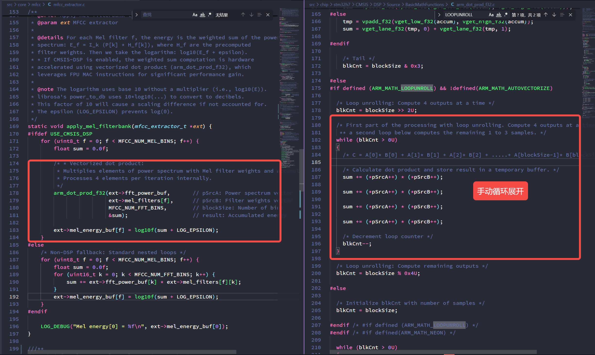

> **端侧模型推理（CMSIS-NN，模型INT8量化后，用的固定点数，再使用 DSP 加速）**

TFLM 框架对于我用到的一些算子（比如卷积、矩阵乘法等），其内部会路由到 CMSIS-NN 针对 Cortex-M7的一些加速实现，比如**卷积操作的算子加速**：

`resolver.AddConv2D(tflite::Register_CONV_2D_INT8());`

> **⚠️不过！本节不会写具体算子内部实现。**


### 3.6.2 入门卷积

但借着这个话题，我们就从卷积（或者说矩阵乘法）开始一步步看看怎么和 DSP 扯上关系。

按照我自己的理解，卷积在数学上定义一般理解为滑动的点积运算（重点理解那个 `flip` ，每乘完一个，输入信号就往前滑动一个，或者 kernel 滑动也行）^[22]^:

> **很推荐看 [22] 这种 `Intuitive Guide` 直觉的文章，讲卷积很好理解的。**
>
> “将 kernel 与输入信号卷积：翻转信号，按照时间推移移动输入信号，并累加与kernel的每次交互。”
>
> 翻译得不太好。。

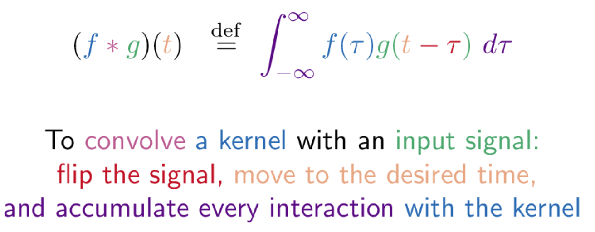

但这是怎么和网络上大家说的矩阵乘法扯上关系呢？想明白两个点就好啦（很天才的想法）：

1. **从连续到离散**：现实中图像和卷积核都是离散的点阵，积分变成求和。

2. **从滑窗到矩阵展开**：把“在图上到处滑动、每次做乘加”这个过程，重新组织成“矩阵的某一行乘以某一列”。

    **一维离散卷积天然等价于一个特定的矩阵乘法。**

具体看这个例子：

1. 离散卷积变成矩阵乘法

    数学上的离散卷积定义是：
    $$
    (f * g)[n] = \sum_{k=-\infty}^{\infty} f[k] \cdot g[n-k]
    $$
    这里 `g[n-k]` 相当于把核翻转，然后在信号 `f` 上滑动，每一步算一次点积。

    然后我们算有效卷积！看图：

    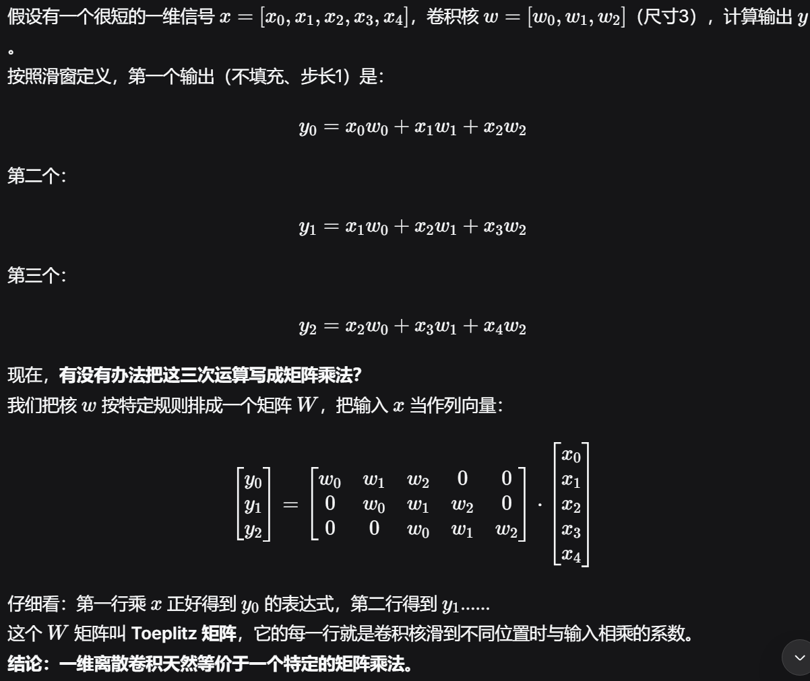

2. 再到二维卷积：`im2col` 魔法！

    由于图像是二维的，我们不能直接套用上面那种一维的 `Toeplitz` 矩阵，但思想完全一样的：**直接把每个滑动窗口的像素拉成一行，把所有窗口堆叠成一个矩阵。这就是著名的`im2col`（Image to Column）啦**

    看下图的例子就好理解（AI 真比我强😂😂）：

    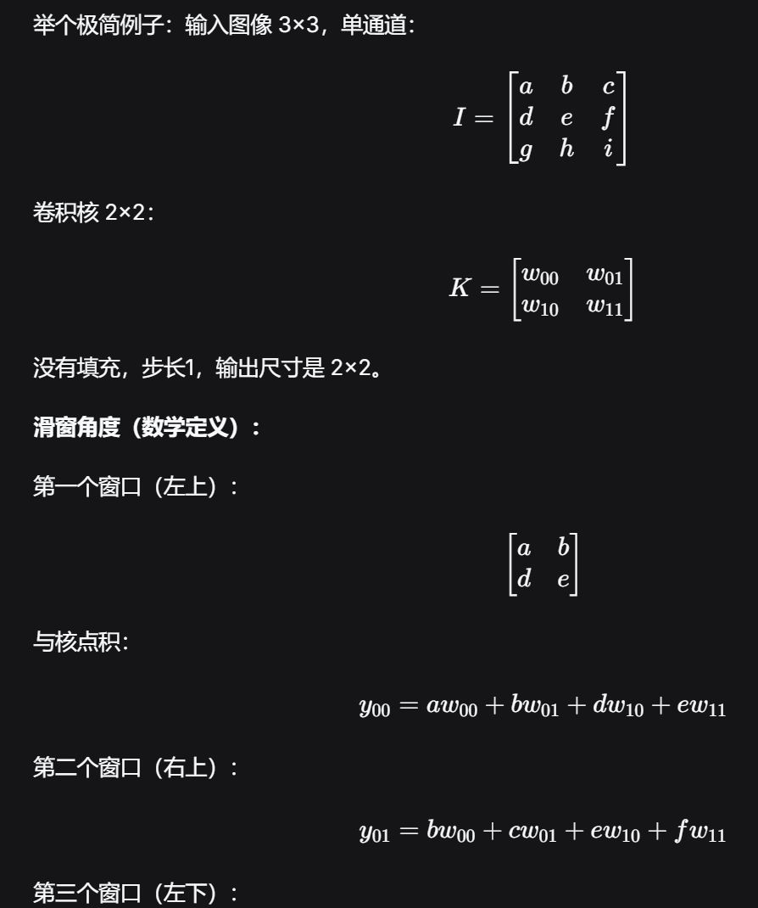

    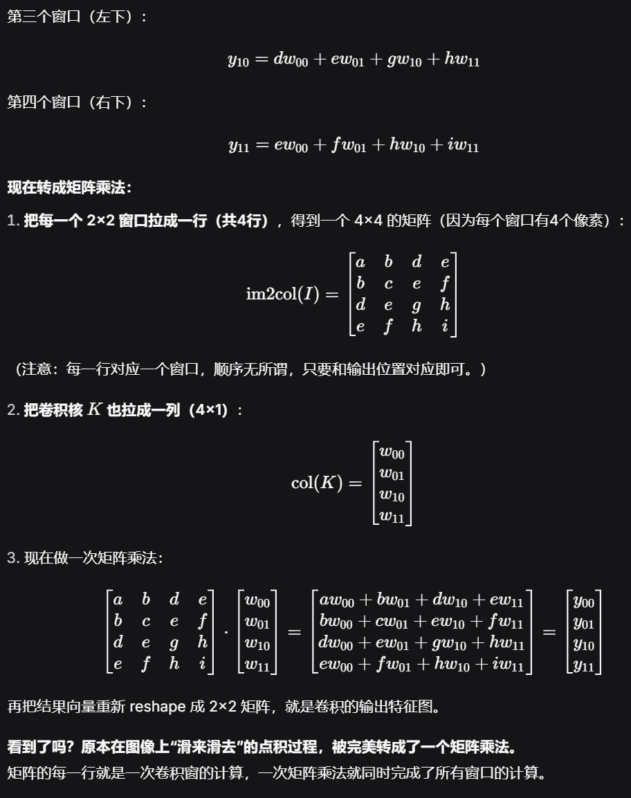

> 按照 AI 给我搜集的资料再看看历史：这种卷积运算通过矩阵乘法实现的方法，其核心思想最早由 **Chellapilla 等人** 于 2006 年提出^[23]^，他们在论文中首次将多通道卷积（MCMK）通过 **im2col（image-to-column）** 变换转化为矩阵乘法，并在 GPU 上实现了显著加速。
>
> 此后，**Yangqing Jia** 在 Caffe 深度学习框架中重新实现了这一方法^[24]^，将卷积层明确分解为 `im2col` 数据重排和 `GEMM`（General Matrix Multiply）两个步骤。

此时我们如果以为二维的卷积的公式梳理一下，那大概就长这样：

数学卷积(1)，一般深度学习中的实现不 flip kernel (2)：
$$
S(i,j)=(I*K)(i,j)=\sum_{m}\sum_{n} I(m,n)K(i-m,j-n)....(1)
$$
$$
S(i,j)=(I*K)(i,j)=\sum_{m}\sum_{n} I(i+m,j+n)K(m,n)....(2)
$$

但是！这还不够！

在实际的推理引擎中，我们还要考虑步长（`stride`）、空洞卷积、`padding` 以及数据在内存中的布局（即 `tensor` 的形状）才能比较准确地定位输入与输出的映射关系。

可以看下面这个视频辅助理解（出处有点找不到了。。。是当时做答辩 PPT 的找的）：

TODO

然后再看 TFLM 框架的默认卷积实现就会有比较直观的感受（比如 INT8 全量化卷积）：

```C
// tflite-micro/tensorflow/lite/micro/kernels/conv.h
namespace tflite {
namespace reference_integer_ops {

// Fixed-point per-channel-quantization convolution reference kernel.
inline void ConvPerChannel(
    const ConvParams& params, const int32_t* output_multiplier,
    const int32_t* output_shift, const RuntimeShape& input_shape,
    const int8_t* input_data, const RuntimeShape& filter_shape,
    const int8_t* filter_data, const RuntimeShape& bias_shape,
    const int32_t* bias_data, const RuntimeShape& output_shape,
    int8_t* output_data) {
  // Get parameters.
  const int32_t input_offset = params.input_offset;  // r = s(q - Z)
  const int stride_width = params.stride_width;
  const int stride_height = params.stride_height;
  const int dilation_width_factor = params.dilation_width_factor;
  const int dilation_height_factor = params.dilation_height_factor;
  const int pad_width = params.padding_values.width;
  const int pad_height = params.padding_values.height;
  const int32_t output_offset = params.output_offset;

 ...
  for (int batch = 0; batch < batches; ++batch) {
    for (int out_y = 0; out_y < output_height; ++out_y) {
      const int in_y_origin = (out_y * stride_height) - pad_height;
      for (int out_x = 0; out_x < output_width; ++out_x) {
        const int in_x_origin = (out_x * stride_width) - pad_width;
        for (int out_channel = 0; out_channel < output_depth; ++out_channel) {
          auto group = out_channel / filters_per_group;
          int32_t acc = 0;
          for (int filter_y = 0; filter_y < filter_height; ++filter_y) {
            const int in_y = in_y_origin + dilation_height_factor * filter_y;
            for (int filter_x = 0; filter_x < filter_width; ++filter_x) {
              const int in_x = in_x_origin + dilation_width_factor * filter_x;

              // Zero padding by omitting the areas outside the image.
              const bool is_point_inside_image =
                  (in_x >= 0) && (in_x < input_width) && (in_y >= 0) &&
                  (in_y < input_height);

			  ....
              for (int in_channel = 0; in_channel < filter_input_depth;
                   ++in_channel) {
                int32_t input_val =
                    input_data[Offset(input_shape, batch, in_y, in_x,
                                      in_channel + group * filter_input_depth)];
                int32_t filter_val = filter_data[Offset(
                    filter_shape, out_channel, filter_y, filter_x, in_channel)];
                acc += filter_val * (input_val + input_offset);
              }
            }
          }

		  ...
          acc = MultiplyByQuantizedMultiplier(
              acc, output_multiplier[out_channel], output_shift[out_channel]);
          acc += output_offset;
		  ...	
          output_data[Offset(output_shape, batch, out_y, out_x, out_channel)] =
              static_cast<int8_t>(acc);
        }
      }
    }
  }
}
....
}  // namespace reference_integer_ops
}  // namespace tflite

```

> 核心就是那七个循环，最外层 Batch，最内层输入通道，核心思想就是**遍历输出张量中的每一个点**，然后独立计算该点的加权和：
>
> - **外层（Batch、输出高、输出宽、输出通道）**：定位“当前要算的是哪个输出值”。例如 `out_y` 和 `out_x` 决定输出特征图的位置，`out_channel` 决定了使用哪一组卷积核。
> - **中层（卷积核高、卷积核宽）**：这两层遍历当前输出点所对应的“滑动窗口”内的像素区域。
> - **内层（输入通道）**：最内层累加当前窗口内所有输入通道的乘积。

当然还有很多细节：分组卷积、padding......

上面也是朴素的**直接滑动卷积**，遍历每个输出点（每次 `int8 * int8` 乘法），用循环逐点乘加。

> **当然不是说上面的代码好写，我觉得对我这种不怎么用C++的，看着就难写...**

到这里，完成回顾了卷积的基本操作，以及怎么和关键的矩阵乘法（就是乘加运算）联系起来。

那 DSP 呢？肯定有爱好者/从业人员早就懂啦！且懂得比我多！那我就简单总结（之后在开始我的流水账，因为我自己还会补充自己额外想知道的内容）：

> DSP 天然适合这种计算模式：
>
> - **大量乘累加（MAC）**：DSP 单周期可执行一次甚至多次乘加，很多还支持单指令多数据（SIMD）。
> - **并行化**：矩阵乘法是最规整的并行计算，DSP 可以同时算多个输出点。
> - **低功耗高效率**：在对能效敏感的嵌入式端，用 DSP 完成卷积的矩阵乘法非常划算


### 3.6.3 指令集并行

实际上前面 3.6.1 和 3.6.2 都是大致的直观感受。下面才回到我们之前的文章风格。

还是那句话：“几十年前的 CPU 不是算得好好的吗？为什么会有 DSP 这种东西？”

从头理解。

首先，这篇文章：[深入理解 OS 的抢占：以 spinlock 后能否 sleep 为例（上）](https://mp.weixin.qq.com/s/mAukEjpcrvul_fHy92cojg)在理论和实际 CPU 流水线两个方面也都写到了 CPU 是个状态机，就是执行一条条的指令，做状态迁移：

```
Fetch → Decode → Execute
...
Fetch → Decode → Execute
```

正常来说，想着实现功能的程序就这样 OK 了，sequential 的程序。

**但是，人们总是会想想要更快的处理器，此时就能够有好几种想法。**

比如：既然 CPU 就是一个只会执行指令的状态机，**那如何让单位时间内 CPU 执行的指令变得更多呢？**

此时可以从底层硬件想想看，处理器不就是一个个逻辑门，一个个 NAND 吗？

既然逻辑门天生就是并行工作的，那如果两条指令：

```asm
ADD x1,x2,x3
MUL x4,x5,x6
```

彼此没有任何的数据依赖，**凭什么 CPU 不能一次性一个时钟周期就执行这两条指令？甚至多条指令？**

这不就是一些做 HPC，或者性能优化或者体系结构的人所熟悉的：**Instruction-level parallelism（指令级并行）**吗？

> **Instruction-level parallelism (ILP) is the parallel or simultaneous execution of a sequence of instructions in a computer program. More specifically, ILP refers to the average number of instructions run per step of this parallel execution.^[25]^**
>
> **指令级并行性指的是在计算机程序中，对一系列指令进行并行或同时执行的过程。更具体地说，指令级并行性指的是在这种并行执行过程中，每一步所执行的指令的平均数量**

而对于二三十年前的 CPU 设计考虑，由于那个时候的制程仍然快速发展，为单位面积上放更多的晶体管提供了基础”预算“，所以设计者们能够发挥自己的想象力，设计出利用 ILP 指令级并行提升速度的东西：

- 流水线 `pipeline`：

    将一条指令的执行切分为多个独立的阶段（如取指、译码、执行），让不同指令的不同阶段在同一个时钟周期内重叠处理。

    原本每周期完成1条指令（CPI=1），重叠后理想状态下**每周期完成1条**（CPI→1），通过提高“吞吐率”而非缩短单条指令时间来实现并行。

- 超标量 `superscalar`：

    通过**“空间复制”**，在CPU内部同时部署多条独立的流水线硬件（多个ALU、多个译码单元）。

    每个时钟周期同时从指令缓存中取回多条指令，并分别派发给不同的空闲流水线。将 CPI 从1进一步压低到**小于1**（例如每周期同时发射4条指令，即CPI=0.25），实现了真正的“多车道”并发。

- 乱序执行 `Out-of-Order Execution, OoO`（我觉得最有意思的是这个！）：

    通过**“动态填坑”**，打破程序原有的僵硬顺序，建立指令“就绪队列”。

    **当某条指令因为等待前序结果或内存数据而停滞时，硬件会绕过它，从后续指令中挑选操作数已经完全就绪（无依赖）的指令，提前送入执行单元！最大限度地填满流水线的每一个“气泡”（空闲时钟），让超标量的多车道时刻保持满载。**

- 寄存器重命名 `Register Renaming`：

    通过**“偷梁换柱”**，用海量的物理寄存器替换程序中有限的逻辑寄存器。

    将原本因复用同一个逻辑寄存器而产生的“写后读”或“写后写”**假依赖（名称依赖）**，映射到不同的物理寄存器上，消除人为阻塞，从而使得乱序执行被“松绑”，能发掘出更多真正无依赖、可并行的指令，是 OoO 的基础。

- 超长指令字 `Very Long Instruction Word, VLIW`：

    通过**“编译预打包”**，将挖掘ILP的负担从硬件（运行时）转移给编译器（编译时）。

    **实现方式**：编译器在编译阶段就静态分析出哪些指令互不依赖，将它们捆绑成一条非常长的指令（包含多个操作码）。CPU拿到后直接**拆包并固定发射**给对应的多个执行单元。最终省去了乱序执行中复杂的硬件调度电路，以极简的硬件控制逻辑实现超标量级别的多发射并行。

- ......

回到前面程序 `Fetch → Decode → Execute` 的 `flow`，可以简单总结上面的应用：

| 阶段             | 顺序性 | 作用                                         |
| :--------------- | :----- | :------------------------------------------- |
| **Fetch/Decode** | 按序   | 维护程序语义，用于分支预测和依赖追踪         |
| **Execute**      | 乱序   | 只要指令的操作数就绪，就发射到功能单元执行   |
| **Commit**       | 按序   | 通过 ROB（Reorder Buffer）按程序顺序提交结果 |

> **如果想更加深入点，推荐资料：**
>
> - **《Computer Architecture: A Quantitative Approach》 — Hennessy & Patterson**
>     - **第 3 章（ILP）、第 4 章（DLP/向量/SIMD）和第 5 章（TLP/多核）**
> - KIMI：https://www.kimi.com/share/19f69330-30f2-868d-8000-00000776cffc

刚好，自己手上有一块 `NanoPC-T4`（**双核 Cortex-A72 大核 + 四核 Cortex-A53 小核的 `big.LITTLE` 架构，A72 乱序/三发射，A53 顺序双发射**），然后借鉴自蒋炎岩老师在 [26] 中使用的程序：

> **程序下载：指令级并行 (ILP)：https://jyywiki.cn/OS/demos/concurrency/cpu-ilp：**
>
> **在树莓派 2 (Cortex-A7, 顺序双发射) 上用内联汇编构造不同数据依赖关系的指令序列（依赖链、独立整数、VFP 浮点、NEON SIMD、整数+浮点混合、独立乘法），通过 `perf stat` 测量每种模式下的 IPC (Instructions Per Cycle)，直观感受处理器如何利用指令级并行提升性能。**

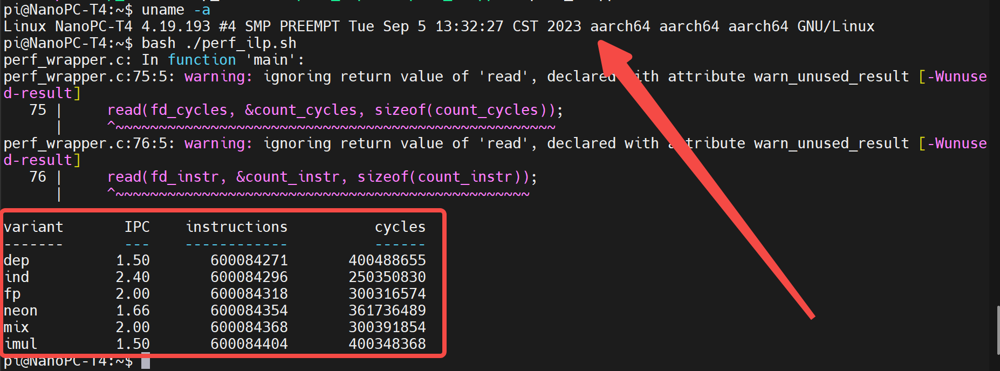

确实如此，`dep` 和 `ind` （指令有依赖/依赖）的 IPC 都快差 1 啦。

但是啊，选择 Instruction-level Parallelism 意味着什么？

CPU 除了真正执行的指令的硬件，为了利用 ILP，就像前面说的，什么OoO、寄存器重命名......这些都额外堆砌了大量的辅助硬件。

这些硬件又不执行指令，就是想让单条指令不被阻塞，尽快跑完。

就像蒋炎岩老师的课件说的^[26]^：

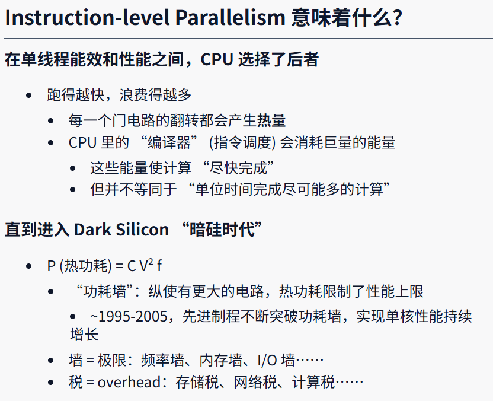

我觉得这里的关键是：**尽快完成" ≠ "单位时间完成尽可能多的计算。**

| 指标                                | 含义                       | OoO 优化了谁？     |
| :---------------------------------- | :------------------------- | :----------------- |
| **Latency（延迟）**                 | 一个任务从启动到结束的时间 | ✅ **主要优化这个** |
| **IPC（每周期指令数）**             | 单线程每周期退休多少条指令 | ✅ 顺便优化了这个   |
| **Throughput/Watt（每瓦特吞吐量）** | 每焦耳能量完成多少有效计算 | ❌ **严重牺牲这个** |

具体看个例子：假设一个任务需要执行 100 条指令。

**方案 A：激进 OoO 大核（如 Cortex-X？我也不清楚数据，我就是让AI举个例子对比）**

- IPC ≈ 2.0（双发射/多发射 + OoO）
- 完成时间：50 个周期
- 但每周期功耗：10W（调度器、ROB、重命名、预测器全开）
- **总能量 = 50 × 10 = 500 焦耳**
- **延迟 = 50 周期**

**方案 B：简单顺序小核（如 Cortex-A53 / 嵌入式核）**

- IPC ≈ 1.0（顺序执行，无 OoO）
- 完成时间：100 个周期
- 每周期功耗：1W（几乎没有调度开销）
- **总能量 = 100 × 1 = 100 焦耳**
- **延迟 = 100 周期**

**方案 C：用省下的功耗换核心数**

- 方案 A 的功耗预算（10W）可以跑 **10 个方案 B 的小核**（各 1W）。
- 10 个小核并行处理 10 个独立任务：
    - 每个任务 100 周期完成
    - 但 10 个任务**同时**完成
    - **吞吐量 = 10 任务 / 100 周期 = 每 10 周期完成 1 个任务**
    - **总能量 = 100 × 10 = 1000 焦耳**（完成 10 个任务）

对比：

- **延迟**：方案 A 胜：50 vs 100 周期
- **单任务能效**：方案 B 胜：100J vs 500J
- **系统总吞吐量**：10 个小核胜：相同功耗下，10 倍任务并行

所以按照我的理解哈，**"单位时间完成尽可能多的计算"指的是 Throughput per Watt，或者说 每焦耳的有效操作数。**比如拿上面的数据，OoO 的 IPC=2 是**用 5 倍功耗换 2 倍速度**。

> **类比理解：**
>
> 我为了让自己写代码不被打断，雇了 10 个秘书：有的预测我下一秒要什么文件（分支预测），有的把文件提前按可能的需求排序（OoO 调度），有的在我改需求时把旧文件藏起来、拿新文件给我（寄存器重命名）。确实写得更快了，但 10 个秘书的工钱（功耗）是实打实的。

终有一天上面这种方法会受到制程的制约的，所以人们有还有别的思路！

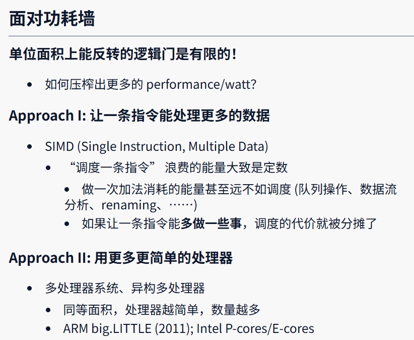

**按照本章的重点，关注的当然是方法一：一条指令能够处理更多的数据！**


### 3.6.4 SIMD

> **DLP（Data-Level Parallelism）**

**`Single Instruction, Multiple Data` (SIMD)：把一个大操作数分成几个小操作数，但是一条指令搞定所有数据^[27]^**：

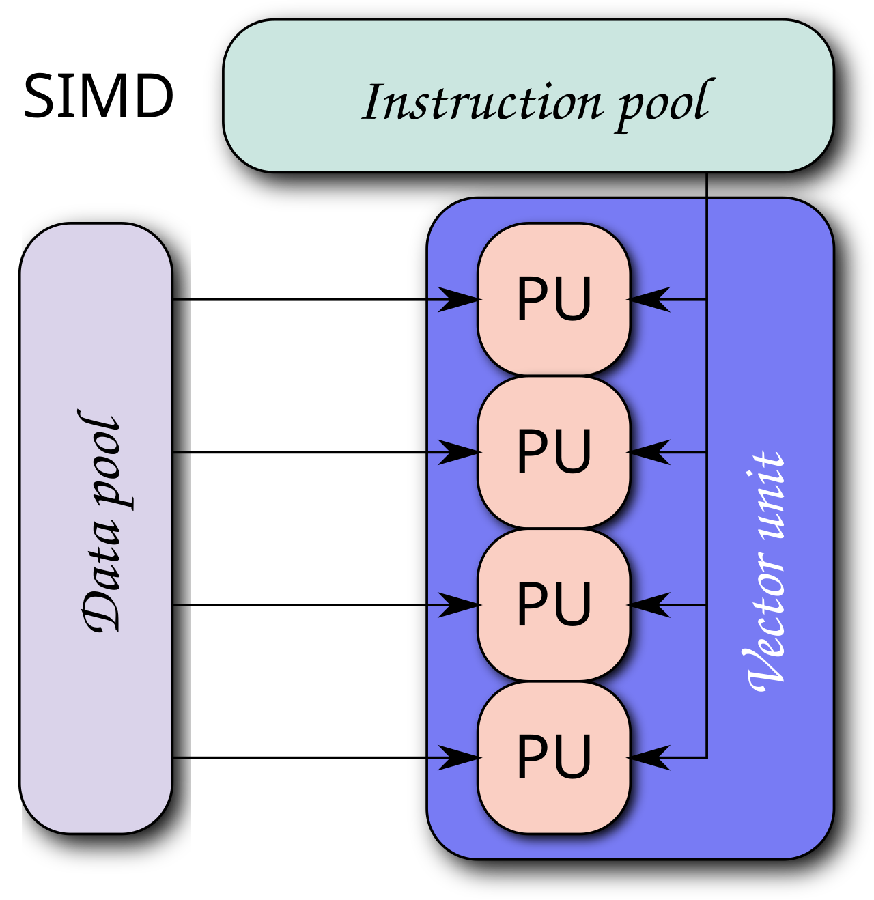

举个例子，就看 3.6.2 的 TFLM 框架其中使用的卷积算子的 CMSIS-NN 实现（CM7）：
```C++
template <>
arm_cmsis_nn_status convolve_wrapper(
    const cmsis_nn_context* ctx, const cmsis_nn_conv_params* conv_params,
    const cmsis_nn_per_channel_quant_params* quant_params,
    const cmsis_nn_dims* input_dims, const int8_t* input,
    const cmsis_nn_dims* filter_dims, const int8_t* filter,
    const cmsis_nn_dims* bias_dims, const int32_t* bias,
    const cmsis_nn_dims* output_dims, int8_t* output, TfLiteType weightsT) {
    ...
    return arm_convolve_wrapper_s8(ctx, conv_params, quant_params, input_dims,
                                   input, filter_dims, filter, bias_dims, bias,
                                   output_dims, output);
}
...
// Eval 最终调用到 arm_convolve_wrapper_s8 
    
TFLMRegistration Register_CONV_2D() {
  return tflite::micro::RegisterOp(Init, Prepare, Eval);
}
```

对于通用的形状，`arm_convolve_wrapper_s8` 内部又调用到 `arm_convolve_s8`，其内部在 Cortex-M7 下的路径又走到：

```C
arm_convolve_s8() {
	...
    ker_a = read_and_pad_reordered(ker_a, &ker_a1, &ker_a2);

    ip_b1 = arm_nn_read_q15x2_ia(&ip_as_col);
    sum = SMLAD(ker_a1, ip_b1, sum);
    ip_b2 = arm_nn_read_q15x2_ia(&ip_as_col);
    sum = SMLAD(ker_a2, ip_b2, sum);
	...
}

```

```C
// CMSIS/NN/Include/Internal/arm_nn_compiler.h

// __smlad is defined by GCC, but results in a performance drop(Tested on Arm GNU Toolchain version 11.x and 12.x)
__STATIC_FORCEINLINE uint32_t SMLAD(uint32_t op1, uint32_t op2, uint32_t op3)
{
    uint32_t result;

    __ASM volatile("smlad %0, %1, %2, %3" : "=r"(result) : "r"(op1), "r"(op2), "r"(op3));
    return (result);
}
```

`result = (op1的低16位 × op2的低16位) + (op1的高16位 × op2的高16位) + op3`

对应到卷积实现中就是： `sum += (ker_a1[0]*ip_b1[0] + ker_a1[1]*ip_b1[1])`

`SMLAD` 就是这样一种 SIMD 指令。一条指令，**两个 16-bit 乘法 + 一次 32-bit 累加**，全搞定。

> **All of the instructions are single-cycle on Cortex-M4 (except hardware divide), and may well be dual-issued in parallel  with other instructions on Cortex-M7, thus further reducing the cycle count for DSP inner loops and other  performance critical code.^[21]^**
>
> 注意是单周期的！

由于我的卷积核和输入特征图的数据恰好是 `int8`/`int16` 这种低位宽类型， `packed` 进 32-bit 寄存器后，用 `SMLAD` 一次处理两个元素，直接让 MAC（乘累加）吞吐量翻倍。

当然，如果没有这种 SIMD 又是什么样的？CMSIS-NN 也有退化版本（也是优化过的）：

```C
  /*
   * @brief C custom defined SMLAD
   */
  __STATIC_FORCEINLINE uint32_t __SMLAD(
  uint32_t x,
  uint32_t y,
  uint32_t sum)
  {
    return ((uint32_t)(((((q31_t)x << 16) >> 16) * (((q31_t)y << 16) >> 16)) +
                       ((((q31_t)x      ) >> 16) * (((q31_t)y      ) >> 16)) +
                       ( ((q31_t)sum    )                                  )   ));
  }

```

对应到指令：

```assembly
; 无 SIMD 实现：等价于 SMLAD  Rd, Ra, Rb, Rn
; 输入: R0 = packed x, R1 = packed y, R2 = accumulator
; 输出: R0 = result

    SXTH    R3, R0          ; R3 = x[15:0]  （符号扩展低半字）
    SXTH    R4, R1          ; R4 = y[15:0]
    MUL     R3, R3, R4      ; R3 = x[15:0] * y[15:0]

    ASRS    R4, R0, #16     ; R4 = x[31:16] （算术右移提取高半字）
    ASRS    R5, R1, #16     ; R5 = y[31:16]
    MUL     R4, R4, R5      ; R4 = x[31:16] * y[31:16]

    ADD     R3, R3, R4      ; R3 = 两个乘积之和
    ADD     R0, R3, R2      ; R0 = R3 + accumulator
```

此时就能看到差距了，没有什么并行性，`SMLAD` 执行完成只需要一个周期，而上面的这些需要多个周期。由此体现了 SIMD 的价值：把"重复做同样的事"从多条指令压缩成 1 条，硬件内部并行执行，**同样的操作，一次喂多份数据**。

此时再回顾对比 3.6.3 的指令级并行，还记得那些利用 ILP 的手段吗？

- **超标量（Superscalar）**：硬件动态发射多条指令到不同功能单元
- **乱序执行（OoO）**：动态调度无关指令填补流水线气泡
- **VLIW**：编译器静态打包多条操作到一条宽指令中

对比 SIMD 的：用**一条指令**，同时对**多组数据**执行**相同的操作**。

所以我认为的是：SIMD 增加的是**数据通道宽度**，不是**指令发射宽度**。

一条 SIMD 指令仍然只算**一条指令**（从 retired instructions 计数角度看），它并没有让处理器在一个 cycle 里退休更多条不同的指令。

当然了，按照我的理解，SIMD 指令应该是可以和其他的什么浮点/整数运算指令一起发射的，利用的还是 ILP 的能力。

> 这里再补充一个关于 IPC 指标，直接 AI 总结吧：
>
> | 度量方式                                                     | SIMD 的影响              | 说明                                                         |
> | :----------------------------------------------------------- | :----------------------- | :----------------------------------------------------------- |
> | **Instructions Per Clock ( retired insts )**                 | **不提高，甚至可能降低** | SIMD 指令本身 latency 较高，且可能阻塞流水线。IPC 按指令条数算，一条 SIMD 指令就是一条。 |
> | **uops Per Clock**                                           | 可能持平或略降           | SIMD 指令通常解码为少量 uops，但执行慢。                     |
> | **FLOPs Per Clock / Operations Per Clock**                   | **显著提高**             | 这是实际关心的"有效工作量"。一条 SIMD 指令背后做了 4x/8x/16x 的标量操作。 |
> | **Application Throughput (e.g., pixels/cycle, samples/cycle)** | **显著提高**             | 这才是 SIMD 的真正价值。                                     |

另外，一些大家常见的 DSP（processor），比如 TI C2000 系列、甚至于在 SoC TD4VH 中的什么 C66x 等等，这些处理器核心大部分利用的是 VLIW（也有一些是哈佛架构），也就是之前说的：”编译器扛下所有“。

总之，这种“让一条指令能处理更多的数据”的方法，确实是在面对功耗墙时，一种不错的解决办法。

> **当然，实际上 SIMD 也没有完全解决问题^[26]^，但也不是本文的重点了**：
>
> 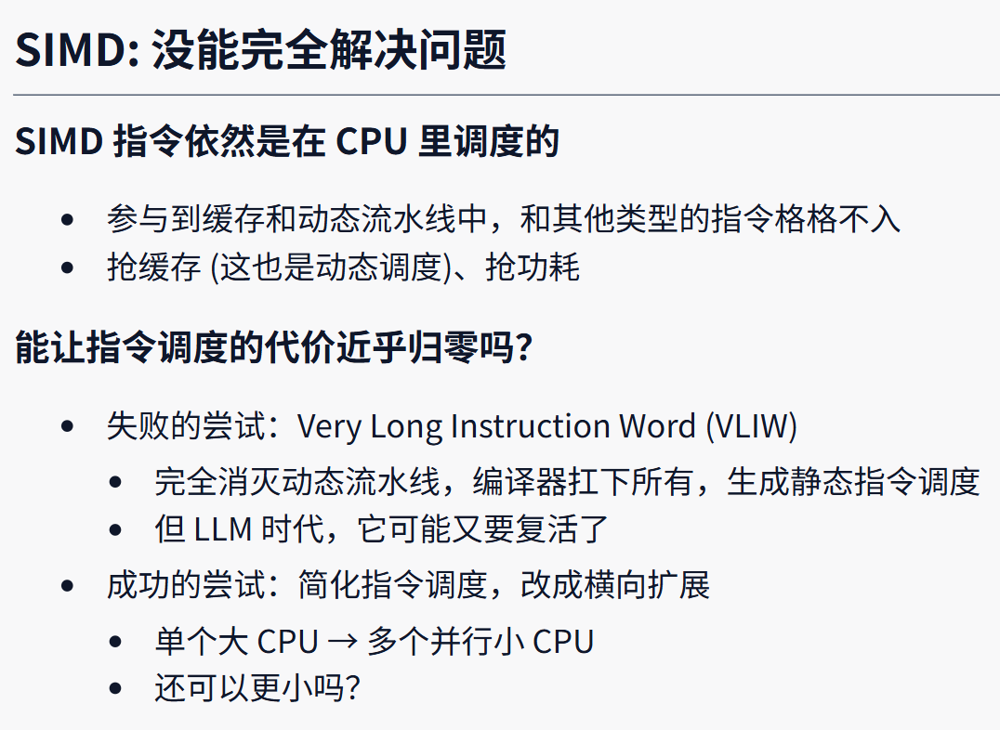


### 3.6.5 DSP（Processor）

目前，我们已经知道了：

```TXT
CPU: 优化 Instruction

SIMD: 优化 Data
```

而且他的本质就是做 MAC（Multiply + Accumulate）。

FFT、FIR 滤波、矩阵乘法、卷积，音频/通信操作，

这些程序 99% 的时间，几乎都在：`acc += a*b`，那为啥还要一个通用 CPU 来做这件事呢？

所以，没理由不能做一个额外的硬件来做这件非常简单的事情。

学过《数字电路》/《集成电路设计》之类的课程的都知道，要实现上面的操作，不就是需要组合逻辑电路构成的乘法器、加法器以及用于存储运算结果的累加器嘛^[28]^。

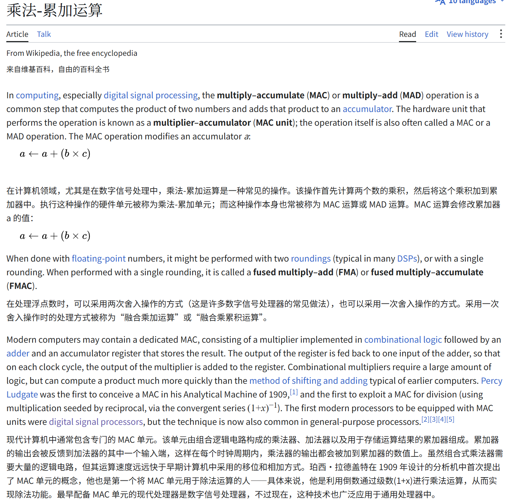

乘法器实现^[29]^：

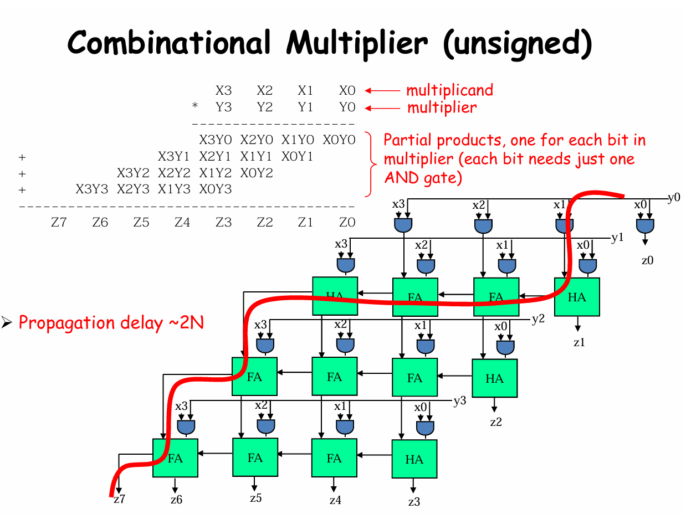

> **当然，单纯做这么个 MAC 是不够的，构不成比较完整的 DSP 的，没有想象的这么简单**
>
> **真正的问题从来不是"能不能做乘法"，而是"能不能让每个时钟周期，乘加器都饱和工作"。**

这里要先岔开一句：前面 3.6.1 和 3.6.4 里反复提到的 **Cortex-M4/M7 的 DSP 扩展**——比如 `SMLAD` 这些指令——**本质上还是指令集扩展，不是独立的处理器**。

> **ARM’s Cortex-M4 and Cortex-M7 processors are Digital Signal Controllers (DSC), providing a blend of traditional  MCU and DSP functionality in a single instruction set working in the same bank of general-purpose 32-bit registers.  The  important feature to note is that the DSP functionality is built right into the ISA, rather than being implemented via a co processor interface. ^[21]^ **

也就是说，对于 Cortex-M4/M7 的，其 DSP 功能是直接**内置在指令集架构（ISA）中**的，而不是通过协处理器接口实现的。换句话说，DSP 扩展还是与通用 CPU（Cortex-M4/M7）紧密结合的，**共用同一组通用寄存器（R0-R12）。**

这就引出了一个很有意思的问题。

你肯定刷到过各种文章/教程跟你说：CPU 是做通用计算的，一些逻辑很简单的计算应该交给别的协处理器来做，把一些 workload offload 到额外的硬件上。

但是，**CPU 的"通用"到底通用在哪里呢？** 那些"逻辑很简单的计算"（怎么才算逻辑简单）为什么放在 CPU 里跑就有点不对劲？

下面是我自己的理解，一步步看。


#### 3.6.5.1 啥是通用？

首先从 first principle 理解，只要程序的指令集具有以下两种能力，那足以模拟任何可计算的过程（也就是大家说的图灵完备）：

- **修改存储状态**（`inc`/`dec`，或者说算术逻辑运算）
- **根据状态改变执行流**（`jne`，条件跳转，**核心**）

这部分就会涉及到可计算理论了（如果你自己写过一个程序模拟器，或者做过南京大学的计算机系统基础实验，实现过 NEMU，你会懂的），可以看下面这个简单了解^[30]^，也不是本文的重点：

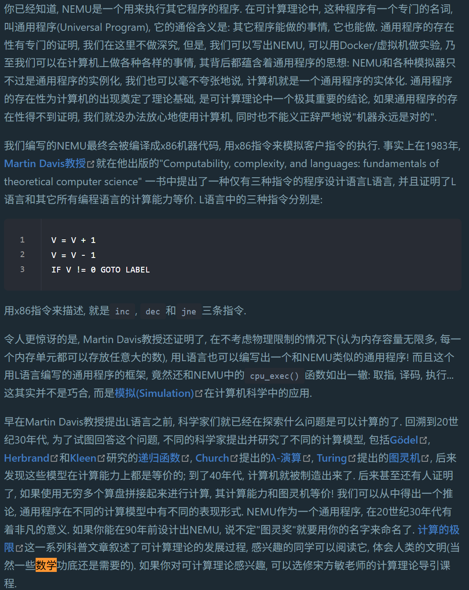

可以这么理解，一个只有 `add` 和 `jne` 的最简陋 CPU，没有任何分支预测、没有乱序执行、没有寄存器重命名，它依然是**完全通用**的——它可以模拟任何图灵机，可以跑任何算法，只是可能慢得没法用。

所以，之前说的什么的“分支预测、OoO、重命名、Cache 层次……”，这些不是"让 CPU 能通用"的机制，而是"让通用程序跑得更快"的优化。（当然，现在讨论 CPU 基本是离不开上面的内容，这里讲的通用更多还是一些理论的东西吧）

回到那个问题：CPU 的"通用"到底通用在哪里？

我的理解是这样的：**因为是状态机，所以有状态迁移，需要有明确的指示告诉这个状态机（CPU），我下一步做什么，哪怕是初始状态，也是提前人为设定好的，换句话说，这个“通用”就通用在我不用做任何的假设。**


#### 3.6.5.2 那 DSP 不通用吗？

看到上面，或许有人会误解说 DSP 做不了“通用”的功能，但实际答案并不是。

DSP 仍然有条件跳转指令，仍然能跑 if-else，仍然能递归（虽然很少这么做），仍然能执行任意算法（只是做相同的事情要比主 CPU 更慢、也可能没有一些常见的外设罢了）。

**简单来说，我理解的 DSP 不是专用加速器，是一个"知道自己主要干什么活"的通用处理器。😁**

举个例子，比如经典的 TI 的 DSP 的 C67x 系列^[31]^：

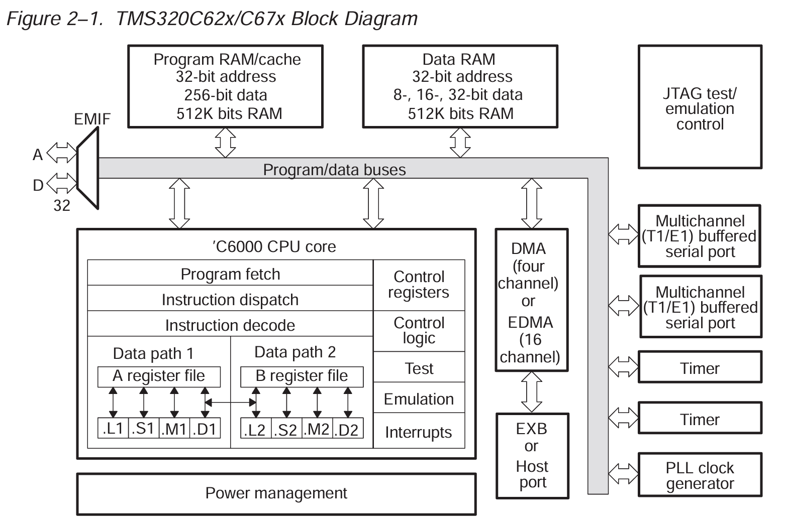

> *"There are two **general-purpose register files** (A and B) in the 'C62x/C67x data paths. Each of these files contains 16 32-bit registers (A0–A15 for file A and B0–B15 for file B). The **general-purpose registers can be used for data or data address pointers**."*^[30]^
>
> **也是通用目的寄存器，这不就和 ARMv7 的几个 R0-R12 一样嘛。**

> *.S 单元明确支持 **"Branches"**、**"32-bit arithmetic operations"**、**"32-bit logical operations"** 和 **"Constant generation"**.*^[30]^

> *"The 'C62x/C67x CPU has **14 interrupts**. These are **reset, the nonmaskable interrupt (NMI), and interrupts 4–15**."*^[30]^
>
> 可屏蔽/不可屏蔽中断、中断向量表、中断返回指针、软件设置/清除中断——这些也不是专用加速器会关心的东西呀，这是完整操作系统所需的通用 CPU 中断架构呀。

那 DSP 和我们说的通用的 CPU 的区别究竟在哪里？

按照我的理解，我的初步认知一：

>  **一个区别是这个处理器是不是真的每时每刻都在产出有效的计算。**

就比如我在 3.6.1 中说的我的毕设的代码，下面是反汇编：

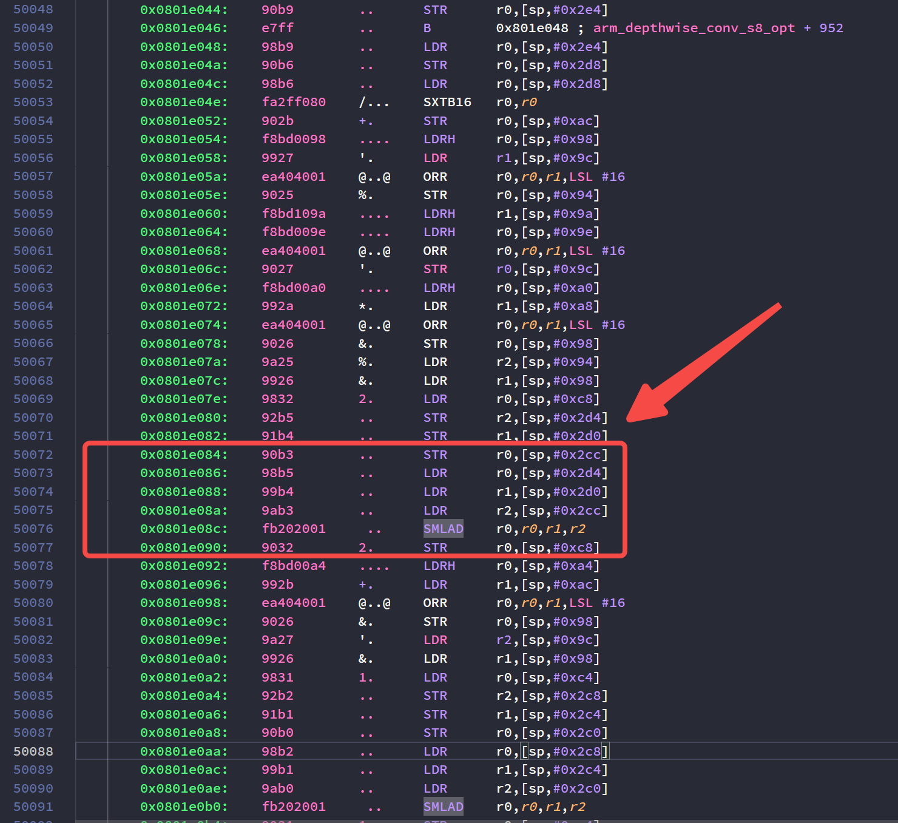

看到了吗，真正干活的就 `SMLAD` 那一条，但为了伺候这一条指令，我们还要做多几条 `LDR`、`STR` 的指令开销。

之前蒋炎岩老师在讲 ILP 时说过，CPU 为了"尽快完成单条指令"堆砌了大量硬件。现在来看其实有点理解了（虽然这里没有明确展示一些硬件的优化）。

再对 DSP 进一步理解：

> 我不应该关注一条指令完成得多快？应该是关注单位功耗下，有多少个时钟周期真正在干 MAC？！

按照初步的认知：其实一个优化良好的 CPU 循环也可以 100% 有效；一个配置不当的 DSP 也会空转。所以我认为的这种"有效计算占比"是结果，不是原因。

真正的本质来自于自己对 “架构对 workload 确定性的假设” 的不理解（来自 LLM 老师的教导）：

1. **通用 CPU 的基本假设是：程序的控制流和数据访问模式在运行前是未知的。**

    我不知道下一条指令是 MAC 还是哈希查找，不知道循环会执行几次，不知道下一次访存会命中哪一行 Cache。所以我必须投资大量晶体管在**运行时动态猜测**上——分支预测猜往哪跳，OoO 猜哪些指令没依赖，寄存器重命名猜需要多少个物理寄存器。这些都是为"不可预测性"支付的保险税。

2. **DSP 的基本假设则相反：我的主要 workload（FIR 滤波、FFT 蝶形、卷积滑动）具有编译期完全可知的确定性。** 循环次数是固定的常量，地址增量是固定的步长，数据依赖关系是静态可分析的，分支方向从不出人意料。既然未来 1000 个周期会发生什么已经完全确定，为什么还要让硬件在运行时重新"发现"这个事实？

就比如这种计算：

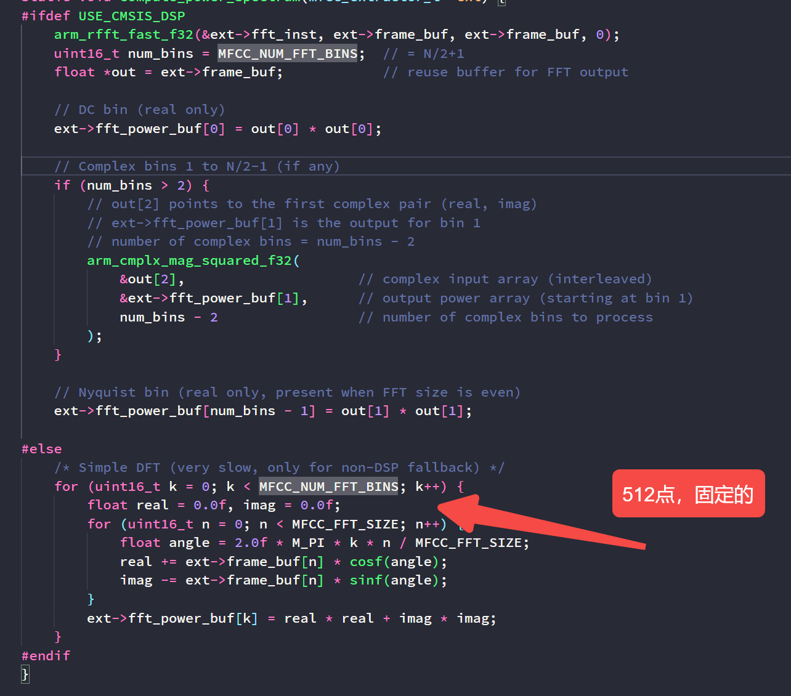

所以，本质是啥？经过我和 LLM 一通瞎描述，最终得出：

> **DSP 的 workload 是高度确定、规律、可预测的，所以它可以提前把"未来会发生的事"硬化到硬件里；而通用 CPU 面对的是不可预测的指令序列，必须在运行时动态猜测**

然后学习了一些专业的名词！

|                      | 通用 CPU                      | DSP                              |
| :------------------- | :---------------------------- | :------------------------------- |
| **对控制流的假设**   | 分支方向未知，需要猜测        | 循环次数固定，分支方向编译期已知 |
| **对数据访问的假设** | 访存模式随机，需要 Cache 猜测 | 地址增量规律，AGU 可直接生成     |
| **硬件策略**         | 运行时动态调度（OoO、预测器） | 编译时静态调度，硬件直接执行     |
| **付出的代价**       | 为"不确定性"支付晶体管/功耗税 | 为"确定性"兑现成零开销硬件       |

"规律、提前制定好的、完全可预测的"：

- **确定性（Deterministic）**：给定输入，执行路径完全确定
- **编译期可知（Compile-time known）**：循环边界、地址模式、分支方向在编译时就确定了
- **静态可分析（Statically analyzable）**：编译器能完全分析出依赖关系和调度方案
- **规则数据流（Regular dataflow）**：数据像流水线一样规律流动，没有随机分支打断

这就是流水线从指令驱动变成数据驱动了嘛？似乎有点理解了呢。

然后就看到了C67x 文档中描述初看比较宏观，但此时又觉得最重要的是文档^[30]^：

> *"**VelociTI is a highly deterministic architecture**, with few restrictions on how or when instructions are fetched, executed, or stored. This architectural flexibility is key to the breakthrough efficiency levels of the 'C6000 compiler."*^[39]^

> *"**Program parallelism is defined at compile time because there is no data dependency checking done in hardware during run time.**"*^[40]^

> DSP 不是「砍掉了通用 CPU 的动态调度能力」，而是**主动选择**用编译时静态调度替代运行时动态调度。因为信号处理 workload 的「高度确定性」让动态调度成为纯粹的能耗负担。这是设计选择，不是能力缺失


#### 3.6.5.3 processor

> 实际上，DSP 的 CPU 内部实现其实还有很多有意思的地方值得研究的！比如：
>
> - 地址单元生成(AGU)：因为一个 MAC 操作如果真的要实现百分百 workload 跑起来，除了ALU做纯粹的 MAC 外，还需要读下一条要执行的指令，此时就又衍生出对哈佛/冯诺依曼架构的探讨啦。
> - `Zero-Overhead Hardware Loop`(零开销硬件循环，扔掉分支预测器)：既然前面都说了一些计算是固定，循环计算的次数是固定的，那用个屁的分支预测？分支指令都不需要，流水线完全不中断。
>
> 受限于篇幅，这里不展开了，可以看下面这两个，都是在搜集的资料：
>
> - https://www.kimi.com/share/19f7fbb9-c332-8ad4-8000-0000d69b6c66
> - https://www.kimi.com/share/19f7fbb5-0162-8291-8000-00002181e2d4

写到这里，简单再回答下最初的问题把。前面我们层层递进：

> - **CPU 优化的是：保留通用程序的控制循环，尽可能快地执行各种各样的程序**（通用性） 
> - **SIMD 优化的是：在通用循环里，让单条指令处理更多的数据**（数据并行） 
> - **DSP 优化的是：把特定运算流（MAC）的控制开销压到零，让数据流过乘加器的速率最大化。**（数据流确定性）

如果把计算系统比作餐厅：

- **CPU** 是全能主厨，什么菜都能做，但每道菜都要看菜谱（取指）、准备食材（译码调度）、决定下一步（分支预测）。
- **SIMD CPU** 是主厨换了一把大锅，一次炒四份同样的菜，但还是要看菜谱、准备食材。
- **DSP** 是麦当劳的薯条机——薯条（数据）进去，油炸（MAC）出来，不需要厨师思考，机器自己循环，且只炸薯条。

所以 DSP 不是"算得快的 CPU"，而是**"围绕 MAC 数据流重新设计的确定性的、高可预测性的...CPU？！对也是 CPU！"**


### 3.6.6 MCU-DSP、独立 DSP 与 NPU

这里收束一下，几种常见的 DSP 形态吧。

- **Cortex-M4/M7 的 DSP 扩展（如 SMLAD）**

    本质还是通用 CPU + SIMD 指令。它解决了"能不能加速 MAC"的问题，但没解决"控制开销"的问题。适合轻量级音频预处理、简单滤波，**是"在通用架构上打补丁"**。

- **独立 DSP Core（如 TI C66x、Cadence HiFi、Qualcomm Hexagon）**

    完整的哈佛架构 + AGU + 硬件循环 + 多 MAC。适合基带处理、专业音频、雷达信号。**是"为 MAC 数据流重新设计的架构"**。

- **NPU**：

    当运算进一步特化到"只有矩阵乘/卷积"时，NPU 比 DSP 更极端——连指令流都简化了，直接硬件数据流。但 DSP 在**非规则信号处理**（自适应滤波、通信均衡、实时编解码）仍有优势，因为这些场景的运算模式不像 CNN 那样完全规整，还需要一定的程序控制灵活性。
    
    当然，这部分留在之后的 NPU 章节的再写。


### 3.6.7 编程


高通的最大特点应该是：不是传统意义上的

是：**似乎没有传统意义上的 Cortex-R 控制核？** 整个基带几乎全部运行在自研的 **Hexagon DSP** （现在似乎叫 **Hexagon NPU了**）上（而且DSP还做了很多别的东西。。）

Hexagon 不是传统意义上的协处理器 DSP——它有 MMU、硬件多线程、分支预测，已经被"通用化"到能直接跑 RTOS 和完整协议栈。（传统的就直接只会算）

> **Qualcomm modem does not use a split CPU/DSP architecture. All processing is done on Hexagon DSP.^[10]^**


[10] Qualcomm Hexagon  DSP: An architecture optimized for mobile multimedia and  communications：https://pdfs.semanticscholar.org/d174/0f7dc5955d460833dd9afac827eaf0185b78.pdf


> 我来帮你从第一性原理梳理这些概念。先搜索一些国外高质量的技术资源，然后我们一起拆解。
>
>
> 你的困惑非常核心，触及了计算机体系结构里**并行性的三个层次**。我们先建立一个清晰的第一性原理框架，再逐个拆解。
>
> ---
>
> ## 一、第一性原理：并行的三个层次（ILP / DLP / TLP）
>
> 现代处理器提速只有三条路，对应三种**不同粒度**的并行：
>
> | 层次    | 名称              | 粒度                     | 硬件机制                       | 软件手段               | 类比                                         |
> | ------- | ----------------- | ------------------------ | ------------------------------ | ---------------------- | -------------------------------------------- |
> | **ILP** | 指令级并行        | 最细（单线程内）         | 流水线、超标量双发射、乱序执行 | 编译器重排、循环展开   | **一个工人手脚并用，同时做多个不相关的动作** |
> | **DLP** | 数据级并行 = SIMD | 中等（单指令操作多数据） | 向量寄存器、宽ALU、MAC阵列     | Intrinsics、向量化编译 | **一个工人拿一把宽铲子，一次铲4块砖**        |
> | **TLP** | 线程级并行        | 最粗（多线程/多核）      | 多核、SMT超线程                | OpenMP、Pthreads、MPI  | **4个工人各拿一把铲子，同时挖4条沟**         |
>
> CMU的体系结构讲义把这个关系讲得很清楚：ILP是在**单个线程内**挖掘无关指令同时执行；TLP则是把任务拆成多个线程扔到不同核上；而SIMD（DLP）是**一条指令同时处理多个数据元素**。
>
> 你的matmul代码里，最内层`C`循环的累加属于**ILP**（如果编译器能重排指令让乘法和加法流水化），但如果你想一次算4个输出通道（`o`循环向量化），那就是**DLP/SIMD**。而如果你用OpenMP把`B`或`T`维度拆给多个核，那就是**TLP**。
>
> ---
>
> ## 二、DSP加速的究竟是什么？从独立DSP到M7 Extension
>
> ### 2.1 独立DSP处理器 vs CPU里的DSP Extension
>
> 独立DSP（如TI C6000、Qualcomm Hexagon）的核心设计哲学是**"数据流吞吐最大化"**：
>
> - **哈佛/改进哈佛结构**：指令和数据总线分离，保证每个周期都能取指令+取数据。
> - **专用MAC单元**：乘加（Multiply-Accumulate）是信号处理的灵魂，DSP有硬连线MAC，一个周期完成。
> - **VLIW或SIMD**：通过宽指令字或向量单元，在单周期内发射多个操作。
>
> 但不管是独立DSP还是Cortex-M7的DSP Extension，它们加速的**本质都是DLP（数据级并行）+ 专用MAC**，而不是TLP（多线程）。
>
> ### 2.2 Cortex-M7的DSP Extension到底是什么？
>
> 这是一个最容易混淆的点。M7的DSP Extension（由`ARM_MATH_DSP`宏控制）**不是**一个独立的核心，而是ARMv7E-M指令集里的**整数SIMD指令子集**：
>
> - `SMLAD`：单周期内做两次16位乘加。
> - `__SXTB16`：带符号扩展的字节重排。
> - 饱和算术指令（`SSAT`/`USAT`）。
>
> ARM官方白皮书明确指出：这些指令操作的是**标准通用寄存器**（R0-R12），在32位寄存器里打包两个16位或四个8位整数进行SIMD运算。它们与FPU（浮点单元）是**完全独立**的两套东西。
>
> **关键结论**：M7的DSP Extension**只加速整数/定点运算**，**不加速浮点**。你的GPT-2 matmul是`float`运算，M7的DSP Extension对它**完全无能为力**。M7的FPU（FPv5）能做单/双精度浮点，但FPU是**标量**的，一次只能算一个`float`，没有浮点SIMD。
>
> 如果你想在ARM MCU上做浮点SIMD，需要：
> - **Helium（MVE）**：Cortex-M55/M85，128位向量寄存器，支持浮点SIMD。
> - **NEON**：Cortex-A系列（手机SoC的大核），也是128位浮点SIMD。
>
> ---
>
> ## 三、ILP vs 多线程：你的误解在哪里？
>
> 你问"ILP和多线程是不是搞混了"，这确实是很多开发者的盲点。
>
> ### 3.1 ILP是"单线程内的并行"
>
> ILP不需要多个线程，不需要OS调度。它是处理器**硬件自动**在单条指令流里找可以同时执行的指令。例如：
>
> ```c
> a = b + c;  // 指令1
> d = e * f;  // 指令2
> g = a + d;  // 指令3（依赖1和2）
> ```
>
> 超标量处理器（如M7的双发射流水线）会在**同一个时钟周期**同时发射指令1和指令2，因为它们没有依赖。这就是ILP。
>
> 软件上你能做的是**循环展开**（Loop Unrolling）和**多累加器**（Multiple Accumulators），人为制造更多无关指令，让处理器有东西可并行。
>
> ### 3.2 多线程（TLP）是"多个指令流的并行"
>
> 多线程需要OS或运行时把任务拆成多个线程，每个线程有自己的PC、寄存器、栈。OpenMP的`#pragma omp parallel for`就是干这个的。
>
> TLP和ILP是**互补但独立**的维度。华盛顿大学的经典SMT论文指出：当单线程ILP不足时（比如内存stall），可以用TLP来填满处理器的功能单元；反之，如果线程数不够，就把所有资源给单线程榨ILP。
>
> ---
>
> ## 四、OpenMP vs SIMD：正交的两种武器
>
> 这是你最核心的类比困惑。OpenMP和SIMD**不是替代关系**，而是**正交叠加**关系。
>
> ### 4.1 OpenMP = TLP（线程级）
>
> OpenMP解决的是"如何把循环迭代分给多个CPU核"。它引入线程创建、同步、调度开销。在嵌入式M7上，OpenMP几乎不适用：
> - M7通常是单核（或双核但非对称），没有多核共享内存的SMP环境。
> - RTOS下线程切换开销大，OpenMP的runtime太重。
> - 缓存一致性、伪共享等问题在资源受限的MCU上更致命。
>
> ### 4.2 SIMD = DLP（数据级）
>
> SIMD解决的是"单个核内如何用一条指令处理多个数据"。它不涉及线程，没有OS开销，只是CPU执行了更宽的指令。
>
> Microsoft C++团队的博客解释得很清楚：`#pragma omp simd`是OpenMP里**专门用于向量化**的指令，但它和`#pragma omp parallel for`完全不同——前者是单线程内的SIMD，后者是多线程并行。
>
> Purdue的讲义用一张图展示了这种关系：向量单元有专门的向量寄存器和功能单元，编译器生成向量指令，硬件控制并不比标量复杂多少，但每周期能完成更多操作。
>
> ### 4.3 两者可以叠加
>
> 在x86服务器上，最优的矩阵乘法通常是：
> ```c
> #pragma omp parallel for  // TLP：把B维度分给10个核
> for (int b = 0; b < B; b++) {
>     #pragma omp simd      // DLP：每个核内用AVX2一次算8个float
>     for (int o = 0; o < OC; o += 8) {
>         // AVX2 FMA
>     }
> }
> ```
>
> 但在Cortex-M7上，**只有ILP可用**（双发射流水线），**DLP的浮点SIMD不可用**，**TLP的OpenMP也不适用**。所以你只能：
> 1. 依赖编译器对浮点循环的自动ILP优化（有限）。
> 2. 如果改用定点（Q15/Q31），调用CMSIS-DSP库，利用M7的整数SIMD（SMLAD等）加速。
>
> ---
>
> ## 五、针对你的matmul代码：M7能做什么？
>
> 你的代码是标准的三层循环`B -> T -> OC`，最内层`C`做点积。
>
> ### 5.1 为什么AI给的浮点SIMD伪代码在M7上跑不了？
>
> AI给的是NEON/Helium风格的伪代码（`float32x4_t`、`vfmaq_n_f32`），这要求处理器有**浮点向量寄存器**。M7没有。M7的FPU只有标量寄存器S0-S31。
>
> ### 5.2 如果硬要在M7上优化这个浮点matmul
>
> 你只能走**ILP + 内存优化**路线：
> - **循环展开**：手动展开`o`循环和`i`循环，暴露更多无关的FMA指令给M7的双发射流水线。
> - **分块（Tiling）**：把`C`维度切小块，让权重和输入能塞进L1 Cache，减少内存stall。
> - **数据重排**：如果权重是`[OC, C]`，考虑重排为`[OC/4, C, 4]`，提高顺序访问性。
>
> 但这些优化**和DSP Extension无关**，纯粹是标量优化。
>
> ### 5.3 如果改用定点，M7的DSP Extension能做什么？
>
> 假设你把`float`换成`q15_t`（Q15定点），那么CMSIS-DSP的`arm_mat_mult_q15`会调用类似这样的核心：
>
> ```c
> // 从权重加载4个int8，打包成两个int32（每个含两个int16）
> ker_a = read_and_pad_reordered(ker_a, &ker_a1, &ker_a2);
> // 加载输入
> ip_b1 = arm_nn_read_q15x2_ia(&ip_as_col);
> // SMLAD：单周期两次16位乘加
> sum = __SMLAD(ker_a1, ip_b1, sum);
> ```
>
> 这就是你贴出的CMSIS-NN代码的本质：**用DLP（SIMD）在单周期内做两次定点乘加**。相比标量实现，吞吐量翻倍。
>
> ---
>
> ## 六、高质量学习资源推荐（国外）
>
> 按主题分类，这些都是我筛选过的非CSDN资源：
>
> **ILP vs TLP 基础**
> - CMU 15-213: Multi-core Architectures（讲义，经典）
> - Hennessy & Patterson体系：The Limitations of ILP and Thread-Level Parallelism（Wei Wang的讲义，覆盖ILP瓶颈和TLP演进）
> - 华盛顿大学/UCSD：Simultaneous Multithreading经典论文（SMT如何动态融合ILP和TLP）
>
> **OpenMP vs SIMD 关系**
> - Purdue ECE563: OpenMP 4 and Vectors（官方课程讲义，图解SIMD构造与OpenMP关系）
> - Microsoft C++ Blog: SIMD Extension to OpenMP in Visual Studio（解释`#pragma omp simd`语义）
> - PMC论文：Exploiting Thread-Level and Instruction-Level Parallelism（实际展示OpenMP+SSE叠加的超线性加速）
>
> **ARM DSP/Helium 架构**
> - ARM White Paper: DSP capabilities of Cortex-M4 and Cortex-M7（官方，讲清DSP指令与FPU边界）
> - ARM Helium Technology eBook（官方，对比Helium vs M7 DSP Extension vs NEON）
> - Modern C++ Programming: Performance Optimization（涵盖DLP/TLP/SIMT概念图）
>
> ---
>
> ## 七、一句话总结
>
> > **DSP加速的是数据级并行（DLP/SIMD），不是指令级并行（ILP），更不是线程级并行（TLP/OpenMP）。**
> >
> > **OpenMP是多线程（TLP），SIMD是向量（DLP），两者正交。**
> >
> > **Cortex-M7的DSP Extension是整数SIMD，不碰浮点。你的GPT-2浮点matmul在M7上只能用标量FPU + ILP优化，想用浮点SIMD请换M55/M85（Helium）或Cortex-A（NEON）。**
>
> 这样梳理后，从独立DSP → M7 DSP Extension → 手机SoC NEON/Helium，本质都是**DLP的硬件实现形式不同**，而OpenMP是**TLP的软件抽象**，两者不在一个维度竞争。


## 3.7 Camera/ISP

当然这里再额外插一个，来自蒋炎岩老师的课程实验 lab`gpt2`^[23]^，`matmul_forward`：

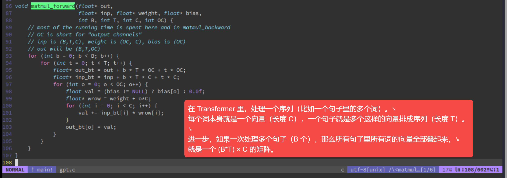

一样的，这种多重循环，可以看到有一些值得优化的地方：

每个词做的内容很简单：乘法，相加，且每一行/一个词的计算只依赖该行/词的输入，和其他行/词无关，很容易能够想到并行加速。（硬件来做，软件多线程来做）


> 你的问题非常精准——MMU 和实时性确实是矛盾体。但 Hexagon 的答案是：**"有 MMU，但关键路径绕过它"**。
>
> ---
>
> ## 一、Hexagon 有 MMU 的铁证（8 个独立来源交叉验证）
>
> | 来源                                | 权威等级 | 关键引述                                                     |
> | ----------------------------------- | -------- | ------------------------------------------------------------ |
> | **Wisconsin 学术论文** (Micro 2014) | A        | *"A **full-featured memory management unit (MMU)** translates virtual to physical addresses"* |
> | **Qualcomm Hexagon SDK**            | 官方     | *"Hexagon DSP uses **two different MMUs**: internal MMU inside DSP + external SMMU"* |
> | **Hot Chips 2023** (Qualcomm 官方)  | 官方     | *"**CPU-like features**: Virtual → Physical translation, security, caching"* |
> | **QEMU Hexagon System Emulation**   | 上游代码 | *"Each hardware thread has an `SSR.ASID` field... **the MMU can resolve this extended virtual address**"* |
> | **Qualcomm 官方博客**               | 官方     | *"compute DSP is engineered to have **a memory management unit (MMU) in L2 cache**"* |
> | **Lauterbach Debugger**             | 专业工具 | 支持 `MMU.TLB` / `MMU.SCAN` 命令，含 ASID 字段               |
> | **Hexagon VM Spec**                 | 官方     | *"Virtual-to-logical address translations... **U,R,W,X permission bits**"* |
> | **Linux Kernel 3.2 集成**           | 内核代码 | *"une unité de gestion mémoire **MMU** et aussi la gestion du multiprocesseur via **SMP**"* |
>
> **结论：Hexagon 有 MMU 是毫无疑问的事实。** 这不是推测，是学术论文、官方文档、调试器、模拟器、内核代码的多源交叉验证。
>
> ---
>
> ## 二、"有 MMU 就很难实时"——这个命题在 Hexagon 上被三个设计打破
>
> ### 打破 1：TCM 完全绕过 MMU
>
> Hexagon 有 **TCM (Tightly Coupled Memory)**——一块直接连接到核心的 SRAM，**不经过 MMU/TLB**：
>
> > "Hexagon on Snapdragon 8 Gen 2 has a **8 MB TCM**... The TCM isn't a cache, it **avoids the overhead of tag checks**... Hexagon doesn't even try to do scatter and gather operations on cacheable memory, and only does them on the TCM." 
>
> TCM 是 **zero wait-state** 内存——访问延迟 1-2 个 cycle，完全确定，和有没有 MMU 无关。
>
> ```
> 关键数据/代码 → TCM → 直接访问（无 MMU，确定性）
> 非关键数据    → L2 Cache → MMU 翻译（允许偶发 miss）
> ```
>
> ### 打破 2：ASID 避免上下文切换刷 TLB
>
> 传统无 ASID 的 MMU：线程切换 → flush TLB → 新线程全是 miss → 延迟爆炸。
>
> Hexagon 每个硬件线程有 `SSR.ASID` 寄存器，TLB 条目带 ASID tag：
>
> ```
> TLB Entry: [VPN | PFN | ASID | Perm]
> 
> Thread A (ASID=0x01): 0x1000→0x5000 ✓
> Thread B (ASID=0x02): 0x1000→0x6000 ✓  ← 同 VPN 不同 ASID，共存！
> ```
>
> 切换线程时**只需改 ASID 寄存器，TLB 不需要 flush**。 这和 x86 PCID、ARM ASID 是同样的技术。
>
> ### 打破 3：工作集预锁定 + 静态布局
>
> DSP 固件的内存布局是**编译时确定**的，QuRT 在任务启动时就把关键页表预装入 TLB。运行时：
> - 页表不变 → TLB 内容不变
> - 大页（1MB/4MB）→ 一个 entry 覆盖更多地址
> - 结果：**运行时 TLB miss 概率趋近于零**
>
> ---
>
> ## 三、延迟数字对比：为什么 Hexagon 能做到实时
>
> | 访问路径                 | 延迟            | 经过 MMU？  | 确定性   | 实时适用   |
> | ------------------------ | --------------- | ----------- | -------- | ---------- |
> | **TCM (本地 SRAM)**      | 1-2 cycles      | ❌ 绕过      | 完全确定 | ✅ 硬实时   |
> | L1 Cache (TLB hit)       | 3-5 cycles      | ✅ TLB hit   | 基本确定 | ✅ 软实时   |
> | L2 Cache (TLB hit)       | 10-20 cycles    | ✅ TLB hit   | 基本确定 | ✅ 软实时   |
> | L1 TLB miss → L2 TLB hit | +5-10 cycles    | ✅ 硬件 walk | 基本确定 | ⚠️ 可接受   |
> | L2 TLB miss → 页表 walk  | +100-300 cycles | ✅ 到 DDR    | 可变     | ❌ 破坏实时 |
> | Page Fault (缺页)        | μs-ms 级        | ✅ OS 介入   | 不可预测 | ❌❌ 致命    |
>
> ---
>
> ## 四、核心设计哲学
>
> > **实时系统的设计原则不是"消除 MMU"，而是"确保关键路径不触发 TLB miss / page fault"。**
>
> Hexagon 的实时工作模式：
> - 🔴 **关键路径**（音频采样、传感器中断）→ TCM，零延迟，无 MMU
> - 🟡 **次关键路径**（AI 推理中间数据）→ L2 Cache，TLB 预锁定，高命中
> - 🟢 **非关键路径**（模型加载、日志）→ DDR，允许偶发 miss
>
> 这和航空电子系统中"分区操作系统在 MPU 上跑硬实时任务"的设计哲学完全一样——**利用硬件隔离能力，但通过软件策略规避其不确定性**。
>
> ---
>
> ## 五、和"无 MMU 的纯 DSP"对比
>
> |                | 传统 DSP (如 TI C5000) | Hexagon (现代)              |
> | -------------- | ---------------------- | --------------------------- |
> | 内存访问       | 物理地址直接访问       | 虚拟地址 → MMU → 物理地址   |
> | 多任务隔离     | ❌ 无（一个固件跑到底） | ✅ PD 保护域 + MMU           |
> | 第三方代码安全 | ❌ 无法隔离             | ✅ Unsigned PD 限制权限      |
> | 动态加载       | ❌ 静态链接             | ✅ 运行时加载 so 到 PD       |
> | 实时确定性     | ✅ 天然确定（无 TLB）   | ✅ **TCM 绕过 + TLB 预锁定** |
> | 内存容量       | 受限（片上 SRAM）      | **GB 级 DDR（MMU 支持）**   |
>
> 高通的选择：**牺牲"纯物理地址的绝对确定性"，换取"虚拟内存的安全隔离 + 大内存支持"**。但通过 TCM + ASID + 预锁定，把实时路径的延迟方差控制在了可接受范围内。
>
> ---
>
> ## 六、回到你的原始问题
>
> > "有 MMU 应该就很难做到实时吧？"
>
> **在通用 CPU（x86 跑 Linux）上，是的。** 因为：
> - 工作集不可预测 → TLB miss 频繁
> - 动态内存分配 → page fault 不可预测
> - 上下文切换 → TLB flush → cold start
>
> **在 Hexagon 上，不是。** 因为：
> - 工作集编译时确定 → TLB 预锁定
> - 关键路径走 TCM → 完全绕过 MMU
> - ASID → 线程切换不刷 TLB
> - 无动态分配 → 无 page fault
>
> 所以 Hexagon 的实时性不是"因为没有 MMU"，而是**"虽然有 MMU，但关键路径不触发它的不可预测行为"**。MMU 在这里的角色是**安全隔离工具**（防止你的 AI 模型崩溃基带固件），而不是**实时性敌人**。


## 3.8 DPU

## 3.9 Codec processors

## 3.10 Sensors and Sensor Hub

## 3.11 Bluetooth & WiFi

## 3.12 USB

## 3.13 Serial ports

## 3.14 Secure element

## 3.15 Secure Processing Unit (SPU)

## 3.16 Neural Processing Unit (NPU)

## 3.17 Power Management Unit/ Integrated Circuit


# 参考

[1] Android Internals::TOC：https://newandroidbook.com/TOC.html

[2] The Relentless Evolution of the Arm Architecture - Arm Newsroom：https://newsroom.arm.com/blog/evolution-of-arm-architecture-evolution-40-years

[3] Levin, Jonathan. *Android Internals::Power User's View*. 2nd ed., Jonathan Levin, 2021.

[4] Inside Qualcomm’s Adreno 530, a Small Mobile iGPU：https://chipsandcheese.com/p/inside-qualcomms-adreno-530-a-small-mobile-igpu

[5] Die Shot 图库 · Kurnal Insights：https://kurnal-insights.com/dieshot/?id=qualcomm-snapdragon-8gen5sm8845

[6] 持久数据的存储：https://jyywiki.cn/OS/2026/lect23.md

[7] Corsair SSD Data Recovery：https://rossmanngroup.com/services/corsair-ssd-data-recovery

[8] Chinese firm unveils RISC-V powered Gen5 SSD controller: fanless design with 14GB/sec+ speeds：https://www.tweaktown.com/news/97060/chinese-firm-unveils-risc-powered-gen5-ssd-controller-fanless-design-with-14gb-sec-speeds/index.html

[9] Embedded Programming :: Vulkan Documentation Project：https://github.khronos.org/Vulkan-Site/guide/latest/embedded_programming.html

[10] BaseSAFE: Security Analysis of MediaTek Baseband Firmware：https://ar5iv.labs.arxiv.org/html/2005.07797

[11] Comsecuris Security Research & Consulting Blog：https://comsecuris.com/blog/posts/path_of_least_resistance/

[12] CEVA Streamlines 5G New Radio Modem Design with PentaG2, the Industry's Most Comprehensive 5G Baseband Platform IP for Mobile Broadband and IoT：https://www.design-reuse-china.com/news/202202146?lang=cn

[13] Embedded Real Time Operating System Software Engineer (QuRT OS, Zephyr)：https://jobs.abven.com/companies/nuvia/jobs/46095942-embedded-real-time-operating-system-software-engineer-qurt-os-zephyr

[14] The role of the realtime operating system in mobile：https://www.qualcomm.com/news/onq/2019/07/role-realtime-operating-system-rtos-mobile?utm_source=chatgpt.com

[15] MediaTek selects Nucleus RTOS for next-generation modem tech：https://news.siemens.com/en-us/siemens-mentor-mediatek-selects-nucleus-rtos-for-next-generation-modem-technology/

[16] MT 6582 Data Sheet Technical Brief：https://www.scribd.com/doc/279070435/Mt-6582-Data-Sheet-Technical-Brief

[17] alexander-pick/shannon_modem_loader: Exynos Modem / Shannon baseband firmware loader for IDA Pro 8.x/9.x：https://github.com/alexander-pick/shannon_modem_loader


[18] tensorflow/tflite-micro: Infrastructure to enable deployment of ML models to low-power resource-constrained embedded targets (including microcontrollers and digital signal processors)：https://github.com/tensorflow/tflite-micro

[19] The DFT Filter Bank：https://ccrma.stanford.edu/~jos/sasp/DFT_Filter_Bank.html

[20] ARM-software/CMSIS_6: CMSIS version 6 (successor of CMSIS_5)：https://github.com/ARM-software/CMSIS_6

[21] DSP_CM4_CM7_2016_rev Nov 17 2016.docx：https://developer.arm.com/cfs-file/__key/communityserver-blogs-components-weblogfiles/00-00-00-21-42/7563.ARM-white-paper-_2D00_-DSP-capabilities-of-Cortex_2D00_M4-and-Cortex_2D00_M7.pdf

[22] Intuitive Guide to Convolution：https://betterexplained.com/articles/intuitive-convolution/

[23] K. Chellapilla, S. Puri, and P. Simard, "High Performance Convolutional Neural Networks for Document Processing," in Proc. 10th Int. Workshop on Frontiers in Handwriting Recognition (IWFHR), 2006.

[24] Y. Jia, E. Shelhamer, J. Donahue, et al., "Caffe: Convolutional Architecture for Fast Feature Embedding," in Proc. 22nd ACM Int. Conf. on Multimedia (MM), 2014, pp. 675-678. 源码: https://github.com/BVLC/caffe/blob/master/src/caffe/layers/im2col_layer.cpp

[25] Instruction-level parallelism - Wikipedia：https://en.wikipedia.org/wiki/Instruction-level_parallelism

[26] CPU、GPU 和 SIMT 编程模型：https://jyywiki.cn/OS/2026/lect20.md

[27] Single instruction, multiple data - Wikipedia：https://en.wikipedia.org/wiki/Single_instruction,_multiple_data


[28] Multiply–accumulate operation - Wikipedia：https://en.wikipedia.org/wiki/Multiply–accumulate_operation

[29] L08_Arithmetic_Multipliers：https://web.mit.edu/6.111/www/f2016/handouts/L08.pdf

[30] 基础设施(2) | 官方文档：https://ysyx.oscc.cc/docs/ics-pa/2.4.html#一键回归测试

[31] TMS320C6000 Technical Brief：https://www.ti.com/lit/ug/spru197d/spru197d.pdf?ts=1784538799477


---

# 2. ARMv8-v9特性

实话说，每一代的更新基本都能够在 arm 的 news、文档都能找到^[2]^。

另外，下面这么多内容不是让我们记的，想到了什么应用场景，再来看看硬件有没有支持；或者像我在研究 `ELF` 的时候就遇到了 `armv8.3` 引入的 `PAC`，所以只要有兴趣就自己去搜集更多的资料研究！这里只是列个大概。


## 2.1 ARMv8 

> **2011 年发布，首次引入 64 位架构**

- **AArch64 执行模式**：全新 64 位指令集，同时兼容 AArch32（32 位）
- **31 个 64 位通用寄存器**（X0-X30），告别 32 位时代的 16 个寄存器限制
- **扩展虚拟地址空间**：64 位虚拟地址，支持更大内存
- **NEON SIMD**：增强多媒体/信号处理向量指令
- **异常模型改进**：4 个异常级别（EL0-EL3），TrustZone 安全扩展
- **默认支持虚拟化**（EL2 Hypervisor）

> 尽管 Armv8-R 也是 Armv8 的组成部分，但通常人们往往还是称其为 Armv8-A。
>
> ARM 于 2012 年 10 月 30 日发布了 Cortex-A53 和 Cortex-A57 处理器核心，而苹果是第一家在消费级产品中采用与 Armv8-A 兼容的处理器架构的公司（iPhone 5S 中的 Apple A7 处理器）。
>
> 而对于现在比较常听说的“大小核”，出现在三星首款采用 Armv8-A 架构的 SoC Exynos 5433，该芯片被用于 Galaxy Note 4 中，其中包含两组各由四个 Cortex-A57 和 Cortex-A53 核心构成的处理器集群；不过，该芯片仅能在 AArch32 模式下运行。 
>
> 以上内容来自Wikipedia^[4]^。


### 2.1.1 ARMv8.1 — 原子与系统扩展

> **第一个重要扩展，面向大型系统**

- **LSE (Large System Extensions)**：原子操作指令（CAS, LDADD, STCLR 等），告别 LL/SC 旧模式，提升多核性能
- **RDM**：高级 SIMD 舍入双乘加/减指令
- **LOR (Limited Ordering Regions)**：大规模系统的内存序优化


### 2.1.2 ARMv8.2 — 浮点与加密增强

> **半精度浮点、安全哈希、数据缓存**

- **FP16 (Half-precision floating point)**：半精度浮点（fhp），AI/ML 推理关键
- **SHA-3 / SHA-512**：新一代加密哈希算法硬件加速
- **SIMD Dot Product**：点积指令，加速神经网络基础运算
- **UAO (User Access Only)**：用户态权限精细化控制
- **TTCNP / XNX**：TLB 共享、Stage 2 执行权限控制优化


### 2.1.3 ARMv8.3 — 指针认证

> **缓解 ROP/JOP 攻击，苹果率先采用**

- **PAC (Pointer Authentication Codes)**：指针认证码，利用密钥对指针签名/验签，防止恶意篡改返回地址
- **复杂数字运算指令**：增强 DSP 能力
- **苹果 A12 / 高通 Cortex-A75 及之后率先支持**

这部分就很有意思了，我竟然在之前学习尝试 `ELF` 的时候，玩到了这个：[backtrace（一）：从底层到本质：理解函数调用与 LR/FP 的设计与思想](https://mp.weixin.qq.com/s/ULNN7Pz7TmwUwRRB9U1HGg)，尽管是使用的 arm 官方的例子^[5]^，但却是拓宽视野收获了很多！


### 2.1.4 ARMv8.4 — 安全与虚拟化深化

> **Secure EL2、TLB 维护、编译器优化**

- **SEL2 (Secure EL2)**：安全世界支持虚拟化，TrustZone 进入虚拟化时代
- **LSE2 / LRCPC2**：原子操作与内存序进一步增强
- **TTL / TLBIRANGE**：TLB 范围失效指令，提升虚拟化性能
- **S2FWB / TTST**：Stage 2 强制写回、小尺寸页表支持
- **FHM (Floating-point Half-precision Multiply)**：半精度浮点乘法


### 2.1.5 ARMv8.5 — 内存安全与分支保护

> **MTE、BTI，Android 13 开始支持**

- **MTE (Memory Tagging Extension)**：内存标签扩展，硬件级检测缓冲区溢出、Use-after-free，消除内存安全漏洞
- **BTI (Branch Target Indicators)**：分支目标指示，防止跳转至非法指令（JOP 攻击缓解）
- **E0PD**：阻止 EL0 访问地址空间上半部分
- **RNG (Random Number Generator)**：硬件真随机数生成器（RNDR/RNDRRS 寄存器）

又是一个安全相关的！


### 2.1.6 ARMv8.6 — AI 与矩阵运算

> **面向端侧 AI 推理优化**

- **GEMM (Generic Matrix Multiply)**：通用矩阵乘法指令，AI 核心运算硬件加速
- **BF16 / I8MM**：Brain Float16 和 8 位整数矩阵乘法，适配低精度推理
- **ECV (Enhanced Counter Virtualization)**：增强计数器虚拟化
- **FGT (Fine Grain Traps)**：系统寄存器细粒度陷入控制


### 2.1.7 ARMv8.7-A — 虚拟化与系统扩展（2021）

- **HAFDBS**：Hypervisor 直接管理 Guest 缓存一致性，减少 VM Exit
- **MPAM**：内存带宽/缓存硬件分区隔离，防 noisy neighbor
- **128-bit Atomics**：`CASPA`/`SWPP` 128 位原子操作，提升 NUMA 并发性能
- **Nested Virtualization 增强**：EL2 直接处理部分 EL1 虚拟化异常，优化 KVM-on-KVM
- **RPRES**：分支预测随机化，缓解 Spectre 侧信道
- **WFE/WFI Timeout**：等待事件/中断带超时，防止多核同步无限阻塞

> **到这里，已经越来越复杂了，而且，armv9 也在这一年发布了。**


### 2.1.8ARMv8.8-A — 系统指令优化（2022）

- **HBC**：条件分支提示，显式标记预测方向，提升 IPC 5~10%
- **MOPS**：`CPY`/`SET` 专用指令替代 `memcpy`/`memset` 循环，加速内核数据搬运
- **NMI**：非屏蔽中断，绕过 `DAIF` 强制抢占，关键实时任务可打断任何状态
- **虚拟化中断路由优化**：降低虚拟中断注入延迟

> **注：HBC、MOPS、NMI 后被移植至 ARMv9.3-A。**


## 2.2 ARMv9 — 下一代计算平台

> **2021 年发布，三大支柱：AI、安全、矢量**

- **SVE2**：可伸缩向量扩展，取代 NEON，128b~2048b 可变宽度，AI/5G/VR 基础指令
- **TME**：事务内存，`TSTART`/`TCOMMIT`/`TCANCEL`，原子事务失败自动回滚
- **CCA/RME**：机密计算，新增 Realm 安全世界，硬件隔离容器
- **MTE**：内存标签，`LDG`/`STG` 4-bit 标签校验，防溢出/Use-after-free
- **BTI**：分支目标识别，标记合法跳转入口，配合 PAC 防 JOP
- **PAC**：指针认证，`PACIA`/`AUTIA` 密钥签名验签，防 ROP

**关注点变成安全+AI了。**


### 2.2.1 ARMv9.2-A — 矩阵与 AI

- **SME**：可伸缩矩阵扩展，矢量外积 + tile 矩阵乘法累加，端侧 AI 推理核心
- **CSS**：计算子系统标准化，优化核心互联与能效


### 2.2.2 ARMv9.3-A — 系统优化

- **NMI**：非屏蔽中断，关键任务强制抢占
- **MOPS**：专用 `memcpy`/`memset` 指令（`CPY`/`SET`），减少循环开销
- **HBC**：条件分支提示，显式标记分支概率，提升预测准确率
- **PAC 增强**：扩展密钥和上下文，提升 ROP 防护


### 2.2.3 ARMv9.4-A — AI 深化与安全

- **SME2**：第二代矩阵扩展，MMA + 稀疏矩阵操作，AI 吞吐量翻倍
- **GCS**：受保护控制栈，独立影子栈校验返回地址，与 PAC 双保险防 ROP
- **VMSA 增强**：更大地址空间，细粒度 Stage 2 内存属性，优化虚拟化 TLB
- **FP8**：`E5M2`/`E4M3` 低精度推理，节省 50% 带宽


## 2.3 arch 对应的手机 SoC core 

在 [4] 中也有表格总结，而且更多，还涉及了更老的版本。

### 2.3.1 高通骁龙（Qualcomm Snapdragon）系列

高通从骁龙 8 Gen 2 开始全面切入 ARMv9，8 Gen 3 和 8 Elite 进入 ARMv9.2，Oryon 自研核也基于 ARMv9.2。

| 芯片型号     | 平台代号  | 商用名                                  | 制程 | CPU 架构                  | ARM 架构版本  | GPU         |
| :----------- | :-------- | :-------------------------------------- | :--- | :------------------------ | :------------ | :---------- |
| SM8850       | Kaanapali | **第二代骁龙 8 至尊版** (8 Elite Gen 2) | 3nm  | Oryon (2+6)               | **ARMv9.2-A** | Adreno 830  |
| SM8750-AC/AB | SUN       | **骁龙 8 至尊版** (8 Elite)             | 3nm  | Oryon (2+6)               | **ARMv9-A**   | Adreno 830  |
| SM8650       | -         | **骁龙 8 Gen 3**                        | 4nm  | 1×X4+3×A720+2×A720+2×A520 | **ARMv9.2-A** | Adreno 750  |
| SM8550       | -         | **骁龙 8 Gen 2**                        | 4nm  | 1×X3+2×A715+2×A710+3×A510 | **ARMv9.0-A** | Adreno 740  |
| SM8475       | -         | 骁龙 8+ Gen 1                           | 4nm  | 1×X2+3×A710+4×A510        | **ARMv9.0-A** | Adreno 730  |
| SM8450       | -         | 骁龙 8 Gen 1                            | 4nm  | 1×X2+3×A710+4×A510        | **ARMv9.0-A** | Adreno 730  |
| SM8350       | -         | 骁龙 888                                | 5nm  | 1×X1+3×A78+4×A55          | **ARMv8.2-A** | Adreno 660  |
| **7 系**     |           |                                         |      |                           |               |             |
| SM7675       | -         | 骁龙 7+ Gen 3                           | 4nm  | 1×X4+4×A720+3×A520        | **ARMv9.2-A** | Adreno 732  |
| SM7475       | -         | 骁龙 7+ Gen 2                           | 4nm  | 1×X2+3×A710+4×A510        | **ARMv9.0-A** | Adreno 725  |
| SM7450       | -         | 骁龙 7 Gen 3                            | 4nm  | 1×A715+3×A715+4×A510      | **ARMv9.0-A** | Adreno 720  |
| SM7350       | -         | 骁龙 7 Gen 2                            | 4nm  | 1×A78+3×A78+4×A55         | **ARMv8.2-A** | Adreno 644  |
| SM6375       | STRAIT    | 骁龙 695                                | 6nm  | 2×A78+6×A55               | **ARMv8.2-A** | Adreno 619  |
| SM6350       | BITRA     | 骁龙 690                                | 8nm  | 2×A77+6×A55               | **ARMv8.2-A** | Adreno 619L |
| **6 系**     |           |                                         |      |                           |               |             |
| SM6650       | -         | 骁龙 6 Gen 3                            | 4nm  | 1×A720+3×A720+4×A520      | **ARMv9.2-A** | Adreno 710  |
| SM6450       | NETRANI   | 骁龙 6 Gen 1                            | 4nm  | 4×A78+4×A55               | **ARMv8.2-A** | Adreno 710  |
| SM6225       | DIVAR     | 骁龙 680                                | 6nm  | 4×A73+4×A53               | **ARMv8.2-A** | Adreno 610  |
| **4 系**     |           |                                         |      |                           |               |             |
| SM4450       | CLARENCE  | 骁龙 4 Gen 2                            | 4nm  | 2×A78+6×A55               | **ARMv8.2-A** | Adreno 613  |
| SM4350       | MANNAR    | 骁龙 480                                | 8nm  | 2×A76+6×A55               | **ARMv8.2-A** | Adreno 619  |


### 2.3.2 联发科天玑（MediaTek Dimensity）系列

联发科是 ARMv9 推进最激进的厂商。天玑 9400 进入 ARMv9.2，**9500 更是首发 ARMv9.3/9.4 级别的 C1 系列核心**，也是目前公开资料中 ARM 版本最高的手机 SoC。

> **突然想到了发哥以前经常被调侃说，只会用公版核心的哈哈哈。**

| 芯片型号                        | 制程      | CPU 架构                             | ARM 架构版本                                         | GPU                  |
| :------------------------------ | :-------- | :----------------------------------- | :--------------------------------------------------- | :------------------- |
| **天玑 9000 系（旗舰）**        |           |                                      |                                                      |                      |
| 天玑 9500                       | 3nm (N3P) | 1×C1-Ultra + 3×C1-Premium + 4×C1-Pro | **ARMv9.3-A** (官方宣称 ARMv9.3，部分资料称 ARMv9.4) | Mali-G1 Ultra MC12   |
| 天玑 9400+                      | 3nm (N3E) | 1×X925 + 3×X4 + 4×A720               | **ARMv9.2-A**                                        | Immortalis-G925 MC12 |
| 天玑 9400                       | 3nm (N3E) | 1×X925 + 3×X4 + 4×A720               | **ARMv9.2-A**                                        | Immortalis-G925 MC12 |
| 天玑 9300+                      | 4nm (N4P) | 4×X4 + 4×A720                        | **ARMv9.2-A**                                        | Immortalis-G720 MC12 |
| 天玑 9300                       | 4nm (N4P) | 4×X4 + 4×A720                        | **ARMv9.2-A**                                        | Immortalis-G720 MC12 |
| 天玑 9200+                      | 4nm       | 1×X3 + 3×A715 + 4×A510               | **ARMv9.0-A**                                        | Immortalis-G715      |
| 天玑 9200                       | 4nm       | 1×X3 + 3×A715 + 4×A510               | **ARMv9.0-A**                                        | Immortalis-G715      |
| **天玑 8000 系（高端/次旗舰）** |           |                                      |                                                      |                      |
| 天玑 8450                       | 4nm       | 1×X4 + 3×A720 + 4×A720               | **ARMv9.2-A**                                        | Immortalis-G720      |
| 天玑 8400                       | 4nm (N4P) | 8×A725                               | **ARMv9.2-A**                                        | Immortalis-G720 MC7  |
| 天玑 8300                       | 4nm       | 1×A715 + 3×A715 + 4×A510             | **ARMv9.0-A**                                        | Mali-G615 MC6        |
| **天玑 7000 系（中端）**        |           |                                      |                                                      |                      |
| 天玑 7400                       | 4nm (N4P) | 4×A715 + 4×A510                      | **ARMv9.0-A**                                        | Mali-G615 MC4        |
| 天玑 7300                       | 4nm       | 4×A78 + 4×A55                        | **ARMv8.2-A**                                        | Mali-G615 MC2        |
| 天玑 7200                       | 4nm       | 2×A715 + 6×A510                      | **ARMv9.0-A**                                        | Mali-G610 MC4        |
| **天玑 6000 系（入门）**        |           |                                      |                                                      |                      |
| 天玑 6300                       | 6nm       | 2×A76 + 6×A55                        | **ARMv8.2-A**                                        | Mali-G57 MC2         |


### 2.3.3 三星 Exynos 系列

三星 Exynos 2500 采用最新 Cortex-X925 + A725 组合，正式进入 ARMv9.2。Exynos 2400 也是 ARMv9.2。

| 芯片型号     | 制程      | CPU 架构                               | ARM 架构版本  | GPU                 |
| :----------- | :-------- | :------------------------------------- | :------------ | :------------------ |
| Exynos 2500  | 3nm (GAA) | 1×X925 + 2×A725 + 5×A725 + 2×A520      | **ARMv9.2-A** | Xclipse 950 (RDNA3) |
| Exynos 2400  | 4nm       | 1×X4 + 2×A720 + 3×A720 + 4×A520        | **ARMv9.2-A** | Xclipse 940 (RDNA3) |
| Exynos 2400e | 4nm       | 1×X4 + 2×A720 + 3×A720 + 4×A520 (降频) | **ARMv9.2-A** | Xclipse 940         |
| Exynos 1580  | 4nm       | 1×A720 + 3×A720 + 4×A520               | **ARMv9.2-A** | Xclipse 540         |


### 2.3.4 苹果 Apple A 系列

苹果 A18 进入 ARMv9.2，**A19 则升级到 ARMv9.4-A**，是目前手机芯片中 ARM 版本最高的之一（与部分天玑 9500 资料持平）。

| 芯片型号      | 制程 | CPU 架构                 | ARM 架构版本  | GPU              |
| :------------ | :--- | :----------------------- | :------------ | :--------------- |
| A19 / A19 Pro | 3nm  | 2×Everest + 4×Sawtooth   | **待定**      | 5 核 Apple GPU   |
| A18 / A18 Pro | 3nm  | 2×Everest + 4×Sawtooth   | **ARMv9.2-A** | 5/6 核 Apple GPU |
| A17 Pro       | 3nm  | 2×Everest + 4×Sawtooth   | **ARMv8.6-A** | 6 核 Apple GPU   |
| A16           | 4nm  | 2×Everest + 4×Sawtooth   | **ARMv8.6-A** | 5 核 Apple GPU   |
| A15           | 5nm  | 2×Avalanche + 4×Blizzard | **ARMv8.6-A** | 5 核 Apple GPU   |


### 2.3.5 谷歌 Google Tensor 系列

Tensor G4 终于追上主流，升级到 ARMv9.2，但 GPU 和 NPU 仍沿用上一代设计。

| 芯片型号  | 制程 | CPU 架构                     | ARM 架构版本  | GPU           |
| :-------- | :--- | :--------------------------- | :------------ | :------------ |
| Tensor G4 | 4nm  | 1×X4 + 3×A720 + 4×A520       | **ARMv9.2-A** | Mali-G715 MC7 |
| Tensor G3 | 4nm  | 1×X3 + 4×A715 + 4×A510       | **ARMv9.0-A** | Mali-G715 MC7 |
| Tensor G2 | 5nm  | 1×X1 + 2×A78 + 2×A78 + 4×A55 | **ARMv8.2-A** | Mali-G710 MC7 |
| Tensor G1 | 5nm  | 2×X1 + 2×A76 + 4×A55         | **ARMv8.2-A** | Mali-G78 MP20 |


# 参考

[4] ARM architecture family：https://en.wikipedia.org/wiki/ARM_architecture_family

[5] Pointer Authentication on Arm | Arm Learning Paths：https://learn.arm.com/learning-paths/servers-and-cloud-computing/pac/pac/