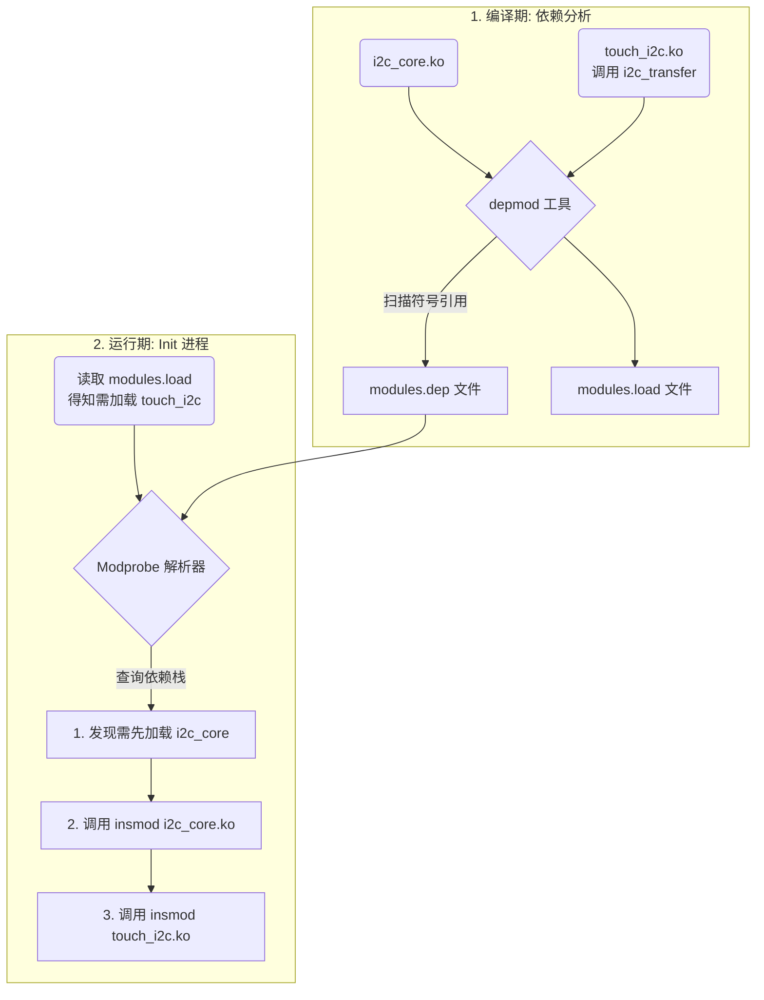

# introduction

可以参考博主的文章：[2.5. 模块间依赖问题与EXPORT_SYMBOL原理](https://mp.weixin.qq.com/s?__biz=MzY5OTE1OTEzMA==&mid=2247485375&idx=1&sn=a99b6553be75ea409b6b3eadf14e5903&chksm=f442008ac335899c66bcd5fae5d501bed264e74b28e5320cd1cc2e9ed6046e68bc4af8dbd4a9&scene=178&cur_album_id=4441964449075331074&search_click_id=#rd)


以下是Gemini生成的解析。

### 一、 深入内核：`modules.dep` 如何理清上百个驱动的“毛线团”

现在我们进入 `vendor_dlkm` 的世界。假设该分区里有 150 个 `.ko` 文件。

一个残酷的现实是：你不能随意写一个 `for` 循环把它们逐个 `insmod`。比如，触摸屏驱动 `touch_i2c.ko` 依赖 I2C 总线驱动 `i2c_core.ko`，如果你先加载 `touch_i2c`，内核会因为找不到 I2C 的相关函数符号（Symbol）而直接报错退出。

Android 的 `init` 进程解决这个问题的核心，分为**编译期**和**运行期**两个阶段。

#### 1. 架构流程：从依赖扫描到顺藤摸瓜



#### 2. 编译期的魔法：`depmod`

当厂商编译完一堆 `.ko` 后，打包进镜像前，编译系统会调用 `depmod` 命令。它会扫描所有 `.ko`，查找 `EXPORT_SYMBOL` 导出的函数，以及未解决的函数引用，最终生成一个像字典一样的 `modules.dep` 文件。

`modules.dep` 的内容非常直白（格式为：`目标模块: 依赖模块1 依赖模块2`）：

```makefile
vendor_dlkm/lib/modules/touch_i2c.ko: vendor_dlkm/lib/modules/i2c_core.ko
vendor_dlkm/lib/modules/i2c_core.ko:
```

#### 3. 运行期的核心：C 语言实现的 Modprobe 逻辑

Android `init` 并没有使用完整的 Linux `modprobe` 二进制程序，而是自己实现了一个精简的 `libmodprobe` 库。

它的核心逻辑是一个深搜（DFS）递归加载过程。以下是剥离了繁杂错误处理后，严格符合规范的底层逻辑重现：

```c
// 核心状态结构体
struct modprobe_context {
    const char *module_dir;
    struct hash_map *dep_map;      // 存放从 modules.dep 解析出的依赖树
    struct hash_map *loaded_map;   // 记录已加载的模块，防止重复加载
};

// 递归加载单个模块及其依赖
int load_module_with_deps(struct modprobe_context *ctx, const char *mod_name) {
    if (hash_map_contains(ctx->loaded_map, mod_name)) {
        return 0; 
    }

    // 查找该模块的依赖列表
    struct string_array *deps = hash_map_get(ctx->dep_map, mod_name);
    
    if (deps != NULL) {
        for (int i = 0; i < deps->count; i++) {
            // 递归调用：先把依赖项加载完
            if (load_module_with_deps(ctx, deps->strings[i]) != 0) {
                return -1; 
            }
        }
    }

    // 所有依赖均已加载（或者没有依赖），真正执行加载系统调用
    int ret = execute_insmod(ctx->module_dir, mod_name);
    if (ret == 0) {
        hash_map_put(ctx->loaded_map, mod_name, "loaded");
    }
    
    return ret;
}

// 主入口：First-Stage Init 调用此处
int load_all_vendor_dlkm_modules(void) {
    struct modprobe_context ctx;
    init_modprobe_context(&ctx, "/vendor_dlkm/lib/modules");
    
    // 解析 modules.dep，构建依赖关系字典
    parse_modules_dep(&ctx, "/vendor_dlkm/lib/modules/modules.dep");
    
    // 读取 modules.load，获取需要启动的清单
    struct string_array *targets = parse_modules_load("/vendor_dlkm/lib/modules/modules.load");
    
    for (int i = 0; i < targets->count; i++) {
        // 对清单上的每个模块，启动顺藤摸瓜加载
        load_module_with_deps(&ctx, targets->strings[i]);
    }
    
    return 0;
}
```

通过这套机制，`init` 进程即使面对乱序的 `modules.load` 清单，也能优雅地根据 `modules.dep` 自动构建栈，确保最底层的总线驱动永远比上层的外设驱动先执行 `insmod`。


