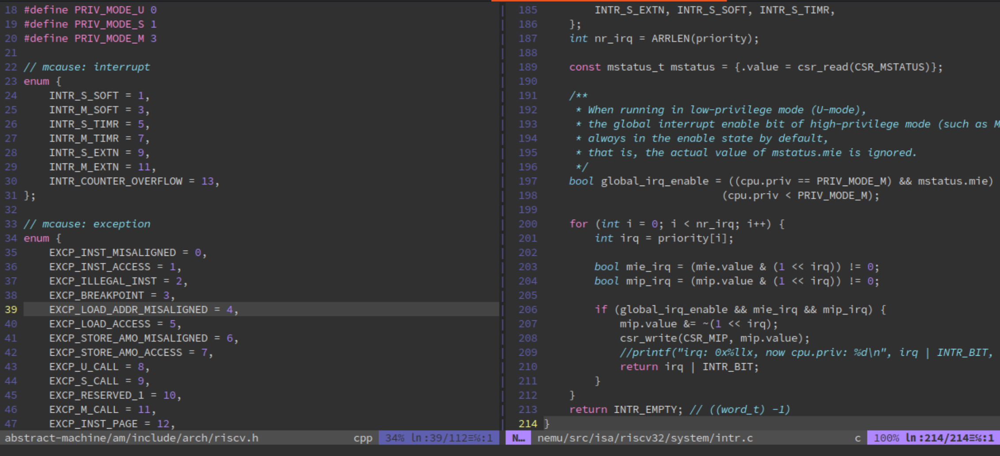
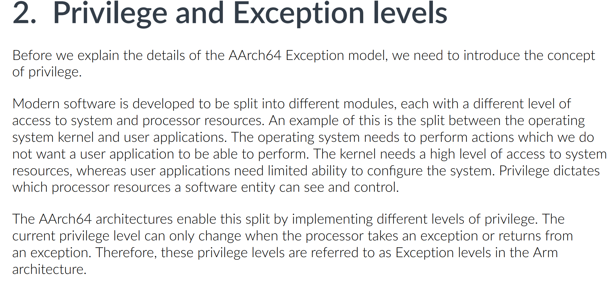
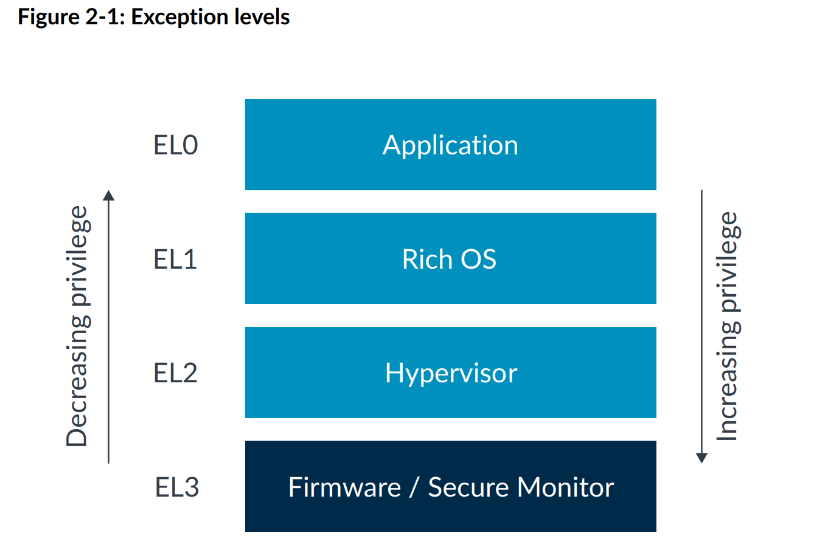
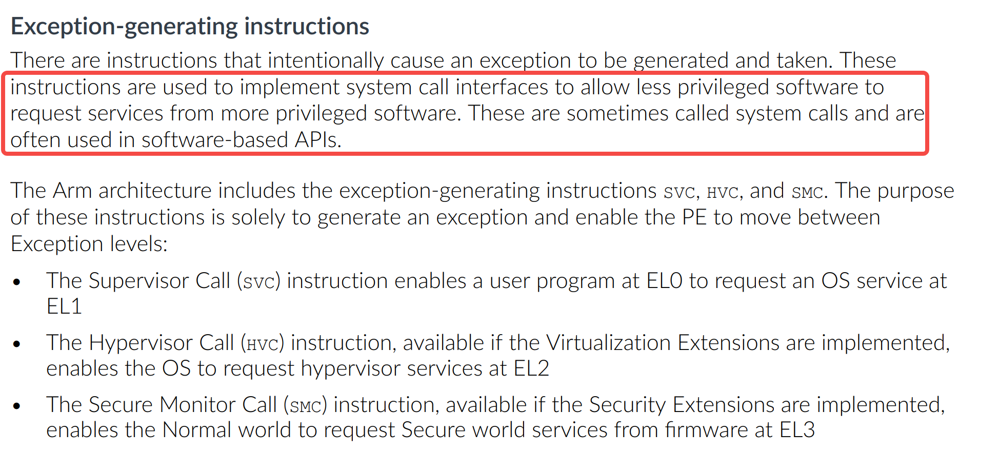

# 1. introduction

> 注意：以下的内容均为个人观点。
>
> 如果你看完后有不同的观点也没关系！请指出，我很乐意去学尝试积极的东西。

最近在看系统调用的内容，因为很久之前做过 NJU PA，写过RISC-V 版 NEMU （模拟器），所以对系统调用、privilege 等内容都是看 RISC-V 的官方文档的比较多（M/S/U、时钟中断、软件中断、外部中断...）：



而之后工作大部分时候应该都是接触 arm64 的内容，所以这里简单看看手册+让 AI 帮我读一下手册，记录一些比较有意思的内容。

这里的关注对象是 aarch64 exception model，其他版本暂时不看。


# 2. Privilege and Exception levels  

## 2.1 basis 



> 现代软件被开发成不同的模块，每个模块对系统和处理器资源的访问权限各不相同。
>
> AArch64架构通过实现不同级别的特权来实现这种划分。当前的特权级别仅在处理器发生异常或从异常返回时才能更改。因此，在Arm架构中，这些特权级别被称为异常级别。

实话说，自己平时看到的资料和认知中都是说：每种 ISA 有自己的特权级划分。

比如：EL0/1/2/3、U/S/M 等等，以前一直理解这就是几个标志位，而硬件能够自动切换这几个标志位，这也就是特权级切换了，而这都是硬件自己做的，在进入异常处理函数之前都不会改变程序的执行流。

但 `doc` 直接指出**这些特权级别就是异常级别**。



所以，**在 AArch64 中，改变当前特权级的唯一合法途径就是“发生异常”或“从异常返回”**，所以应该强调的是我没法手动切换 EL，必须通过异常机制。看些例子：

> - **不能**在正常执行流中通过 MOV / ADD 等指令修改 PSTATE 里的 EL 字段。
> - 要从 EL0 进入 EL1，只能触发同步异常（如 `SVC`）或等待异步异常（如 IRQ）被路由到更高 EL。
> - 要从 EL1 回到 EL0，只能执行 `ERET`（异常返回指令）。
> - 这跟 x86 的 `CPL` 通过 `syscall` / `iret` 改变类似，但 Arm 把“特权级”和“异常处理”彻底绑定成同一个概念。


## 2.2 内核响应 `svc #0` 的流程

在比较久之前，我一听到异常，我想到的都是：缺页、除零、非法指令，但在 arm 里还有这几种异常产生指令（都是同步异常）：



> 它们的目的就是主动从低 EL 跳到高 EL。所以“异常级别”这个名字其实在提醒我：**你想去更高特权级，就要通过异常指令**。
>
> 所以我们常见到的 `svc` 指令，应该理解为是一个“请求服务”的机制，而不是系统调用的专属指令，只是说 Linux 做了一个架构设计决定：在 Linux 中，`svc #0` 被专用为“进入内核执行系统调用“^[2]^。真正的系统调用号（例如 `__NR_read`、`__NR_write`）通过 **通用寄存器 `x8`** 传递，参数通过 `x0`~`x6` 传递。

那看看 Linux 内核怎么响应 `svc #0` 的？AI 给了一个 `svc #0` 到系统调用函数处理的流程，挺常见的了。。。

> 下面以 **用户态执行 `SVC #0`** 为起点，追踪 Linux 内核 AArch64（使用 `SP_EL0`） 的完整处理路径。
>
> 基于 `/arch/arm64/kernel` 下的：`entry.S`、`entry-common.c`、`syscall.c` 分析。


### 2.2.1 硬件层：异常向量表 (`entry.S`)

当 CPU 在 EL0 执行 `SVC #0` 时，触发 **同步异常** (ESR_ELx.EC = 0x15)。
硬件根据当前 EL 和异常类型，跳转到 `VBAR_EL1` 指向的向量表中的对应条目。

```assembly
// arch/arm64/kernel/entry.S

SYM_CODE_START(vectors)
    kernel_ventry   1, t, 64, sync      // EL1t  (不用)
    ...
    kernel_ventry   0, t, 64, sync      // ← EL0 64-bit 同步异常入口
    ...
```

`kernel_ventry` 宏做三件事：

1. 保存异常上下文（分配 `pt_regs` 空间）
2. 检查内核栈溢出（`CONFIG_VMAP_STACK`）
3. 最后跳转到 `el0t_64_sync` 标签（由 `entry_handler` 宏生成）

> 这里看代码可能会对这里面的宏展开的语法不熟悉，问问 AI 就好了。
>
> **这里的 `ht` 参数可能会有点迷惑，在之后的章节会写。**

```assembly
// entry.S 底部
    entry_handler   0, t, 64, sync
```

`entry_handler` 展开为：

```assembly
	.macro entry_handler el:req, ht:req, regsize:req, label:req
SYM_CODE_START_LOCAL(el\el\ht\()_\regsize\()_\label)
	kernel_entry \el, \regsize
	mov	x0, sp
	bl	el\el\ht\()_\regsize\()_\label\()_handler
	.if \el == 0
	b	ret_to_user
	.else
	b	ret_to_kernel
	.endif
SYM_CODE_END(el\el\ht\()_\regsize\()_\label)

# 展开：
SYM_CODE_START_LOCAL(el0t_64_sync)
    kernel_entry 0, 64          // 保存所有寄存器到 pt_regs
    mov x0, sp                  // pt_regs 指针作为第一个参数
    bl  el0t_64_sync_handler    // 调用 C 处理函数（entry-common.c）
    b   ret_to_user             // 异常返回路径
    ...
SYM_CODE_END(el0t_64_sync)
```

`kernel_entry` 完成：
- 保存 x0~x29, lr, sp, pc, pstate 到栈上 `pt_regs` 结构
- 设置 `tsk` (current task)
- 处理 MTE, PAC, SSBD 等特性

---

### 2.2.2 C 入口：`el0t_64_sync_handler` (`entry-common.c`)

```c
// arch/arm64/kernel/entry-common.c

asmlinkage void noinstr el0t_64_sync_handler(struct pt_regs *regs)
{
    unsigned long esr = read_sysreg(esr_el1);

    switch (ESR_ELx_EC(esr)) {
    case ESR_ELx_EC_SVC64:          // 0x15
        el0_svc(regs);
        break;
    case ESR_ELx_EC_DABT_LOW:       // 数据中止
        el0_da(regs, esr);
        break;
    ...
    }
}
```

`ESR_ELx_EC(esr)` 提取异常类型，`SVC64` 表示 64 位 SVC 指令。

---

### 2.2.3 系统调用分发 (`entry-common.c` → `syscall.c`)

```c
// entry-common.c
static void noinstr el0_svc(struct pt_regs *regs)
{
    enter_from_user_mode(regs);                // 退出用户态上下文跟踪
    cortex_a76_erratum_1463225_svc_handler();  // 硬件漏洞补丁
    fpsimd_syscall_enter();                    // 处理 FP/SVE 状态
    local_daif_restore(DAIF_PROCCTX);          // 开 IRQ
    do_el0_svc(regs);                          // ← 核心
    exit_to_user_mode(regs);
    fpsimd_syscall_exit();
}
```

`do_el0_svc` 定义在 `syscall.c`：

```c
// arch/arm64/kernel/syscall.c
void do_el0_svc(struct pt_regs *regs)
{
    el0_svc_common(regs, regs->regs[8], __NR_syscalls, sys_call_table);
}
```

- `regs->regs[8]` 就是用户态传递的 **系统调用号** (x8)
- `__NR_syscalls` 是最大系统调用数
- `sys_call_table` 是系统调用表（函数指针数组）

---

### 2.2.4 通用处理逻辑 `el0_svc_common` (`syscall.c`)

```c
static void el0_svc_common(struct pt_regs *regs, int scno, int sc_nr,
                           const syscall_fn_t syscall_table[])
{
    unsigned long flags = read_thread_flags();

    regs->orig_x0 = regs->regs[0];   // 保存原始 x0（可能被系统调用返回值覆盖）
    regs->syscallno = scno;

    // 如果有 MTE 异步错误，先返回错误码
    if (flags & _TIF_MTE_ASYNC_FAULT) {
        syscall_set_return_value(current, regs, -ERESTARTNOINTR, 0);
        return;
    }

    // 处理 ptrace / 跟踪 / 审计等 _TIF_SYSCALL_WORK 标志
    if (has_syscall_work(flags)) {
        if (scno == NO_SYSCALL)
            syscall_set_return_value(current, regs, -ENOSYS, 0);
        scno = syscall_trace_enter(regs);
        if (scno == NO_SYSCALL)
            goto trace_exit;
    }

    // 真正调用系统调用
    invoke_syscall(regs, scno, sc_nr, syscall_table);

    // 如果不需要退出跟踪则直接返回
    if (!has_syscall_work(flags) && !IS_ENABLED(CONFIG_DEBUG_RSEQ))
        return;

trace_exit:
    syscall_trace_exit(regs);
}
```

`invoke_syscall` 负责查表和调用：

```c
static void invoke_syscall(struct pt_regs *regs, unsigned int scno,
                           unsigned int sc_nr,
                           const syscall_fn_t syscall_table[])
{
    add_random_kstack_offset();          // 随机偏移栈（安全）

    if (scno < sc_nr) {
        syscall_fn_t syscall_fn = syscall_table[array_index_nospec(scno, sc_nr)];
        ret = __invoke_syscall(regs, syscall_fn);
    } else {
        ret = do_ni_syscall(regs, scno); // 未实现系统调用
    }

    syscall_set_return_value(current, regs, 0, ret);
    choose_random_kstack_offset(get_random_u16());
}
```

`__invoke_syscall` 最终执行具体的内核函数（如 `sys_read`, `sys_write`）：

```c
static long __invoke_syscall(struct pt_regs *regs, syscall_fn_t syscall_fn)
{
    return syscall_fn(regs);
}
```

系统调用函数的原型通常是 `long sys_xxx(const struct pt_regs *regs)`，它会从 `regs` 中取出参数（x0, x1, ...）。

---

### 2.2.5 异常返回 (`entry.S`)

系统调用执行完后，`el0_svc_common` 返回到 `el0_svc`，然后 `exit_to_user_mode`，最后 `el0_svc` 返回到 `entry.S` 中的 `ret_to_user` 标签。

```assembly
// entry.S
SYM_CODE_START_LOCAL(ret_to_user)
    ldr x19, [tsk, #TSK_TI_FLAGS]   // 再次检查挂起的工作
    enable_step_tsk x19, x2
#ifdef CONFIG_GCC_PLUGIN_STACKLEAK
    bl stackleak_erase_on_task_stack
#endif
    kernel_exit 0                    // 恢复寄存器并执行 ERET
```

`kernel_exit` 宏：

- 恢复 `sp_el0` (用户栈)
- 恢复 `elr_el1` 和 `spsr_el1`
- 从栈中弹出 x0~x29, lr
- 执行 `eret` 指令回到用户态 `SVC` 下一条指令

---

### 2.2.6 完整调用链（从上到下）

```
用户态: SVC #0
   │
   ▼ 硬件跳转
vectors (entry.S) → kernel_ventry 0, t, 64, sync
   │
   ▼ entry_handler 宏
el0t_64_sync (entry.S)
   │ kernel_entry
   │ bl el0t_64_sync_handler
   ▼
el0t_64_sync_handler (entry-common.c)
   │ ESR_ELx_EC == SVC64 → el0_svc()
   ▼
el0_svc (entry-common.c)
   │ do_el0_svc()
   ▼
do_el0_svc (syscall.c)
   │ el0_svc_common(regs, regs->regs[8], ...)
   ▼
el0_svc_common (syscall.c)
   │ invoke_syscall()
   ▼
invoke_syscall (syscall.c)
   │ syscall_table[scno](regs)
   ▼
具体内核函数 (如 sys_read, fs/open.c 等)
   │ 执行完成，返回值放入 regs->regs[0]
   ▼ 返回到 el0_svc_common
   │ 返回到 el0_svc
   ▼
exit_to_user_mode (entry-common.c) → 返回到 el0t_64_sync
   │ 返回到 ret_to_user (entry.S)
   ▼
ret_to_user (entry.S)
   │ kernel_exit 0
   │ eret
   ▼
用户态：SVC 下一条指令
```

### 总结

| 组件                   | 位置             | 作用                                          |
| ---------------------- | ---------------- | --------------------------------------------- |
| 向量表                 | `entry.S`        | 定义异常入口，按 EL 和类型分流                |
| `kernel_ventry`        | `entry.S`        | 分配 pt_regs 空间，处理栈溢出，跳转到 handler |
| `el0t_64_sync_handler` | `entry-common.c` | 解析 ESR，识别 SVC 异常                       |
| `el0_svc`              | `entry-common.c` | 准备环境，调用 `do_el0_svc`                   |
| `do_el0_svc`           | `syscall.c`      | 读取 x8 作为系统调用号，调用通用处理          |
| `el0_svc_common`       | `syscall.c`      | 处理 ptrace/跟踪，调用 `invoke_syscall`       |
| `invoke_syscall`       | `syscall.c`      | 查表 `sys_call_table`，执行具体 sys_xxx       |
| `ret_to_user`          | `entry.S`        | 恢复现场，`ERET` 返回用户态                   |


> **上面AI只是给了个流程，如果不是专门写部分的，知道上面这些估计也没啥用。**
>
> **但是如果你不那么功利，单纯看看是怎么做的，你会发现其实是有很多细节的，毕竟，国外圈子里技术讨论常常会听到一句话：细节是上帝。**


# 3. bank化

还有一点，**每个特权级/EL不只是“一个数字”，而是一套完整的异常处理环境/寄存器**，例子：

- 当处理器**发生异常**（take an exception）时，会从当前 EL **进入**一个**更高或相同的 EL**（称为 `target EL` 或 `taken to EL`）。
    此时硬件自动使用**目标 EL** 的那一套寄存器：
    - `VBAR_ELx` → 指向该 EL 的向量表基址，用于跳转到对应的异常向量。
    - `ELR_ELx` → 保存异常返回地址（通常是触发异常的指令地址或下一条指令）。
    - `SPSR_ELx` → 保存被打断时的 PSTATE（包括原 EL、条件标志、中断掩码等）。
    - `ESR_ELx` → 记录异常原因（同步异常或 SError）。
    - `FAR_ELx`（如果适用）→ 记录故障地址。
- 当执行**异常返回**（`ERET`）时，也是从当前 EL **回到**一个**更低或相同的 EL**，此时使用的依然是**返回前所在的那个 EL** 的 `ELR_ELx` 和 `SPSR_ELx`（因为它们保存了返回所需的现场）。

这里其实有点理解了 Arm 说“特权级就是异常级别”，**因为 EL 不仅代表权限高低，还直接决定了我使用哪一套异常处理硬件**。


# 4. 寄存器保存

