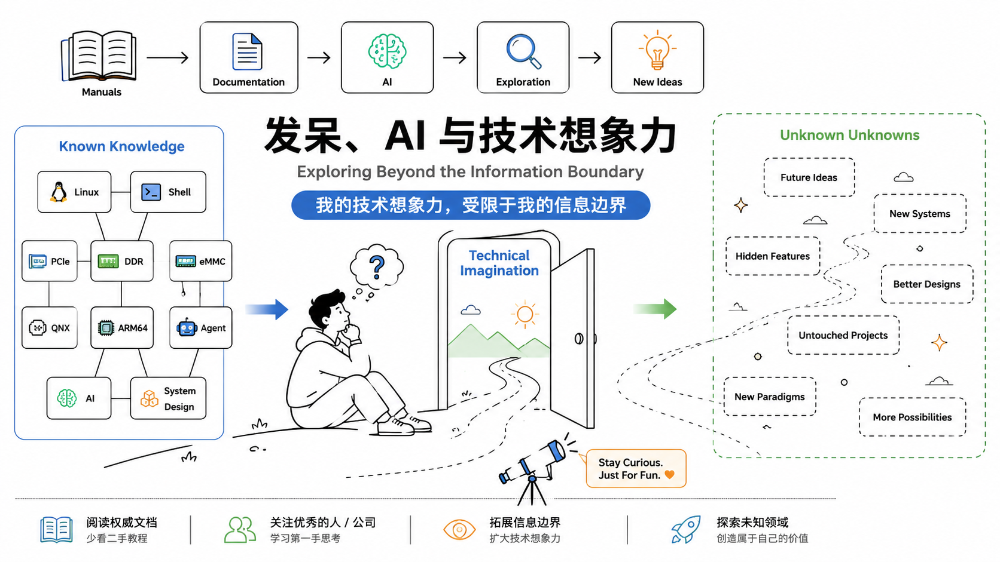
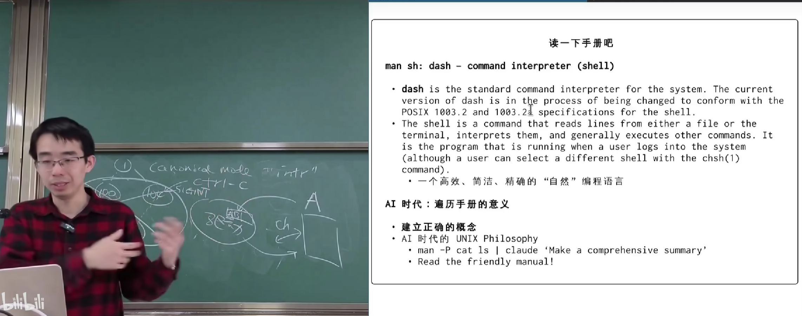
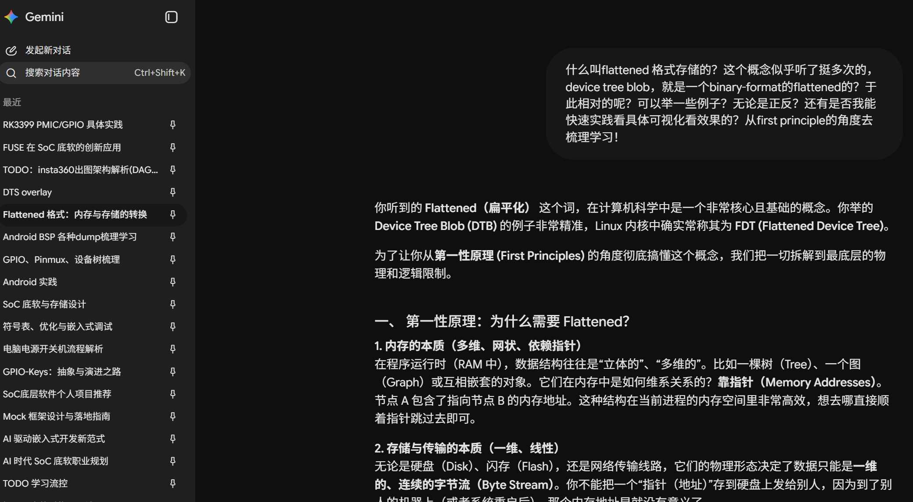
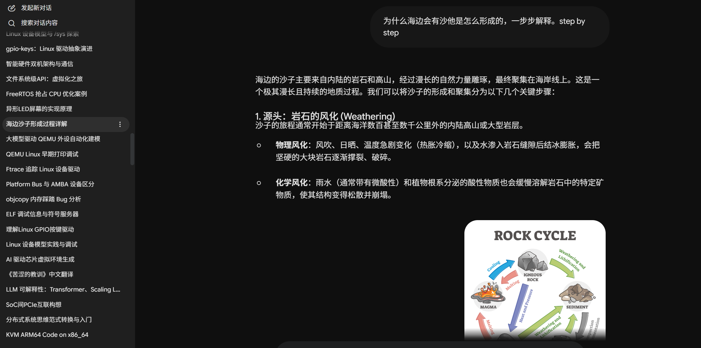
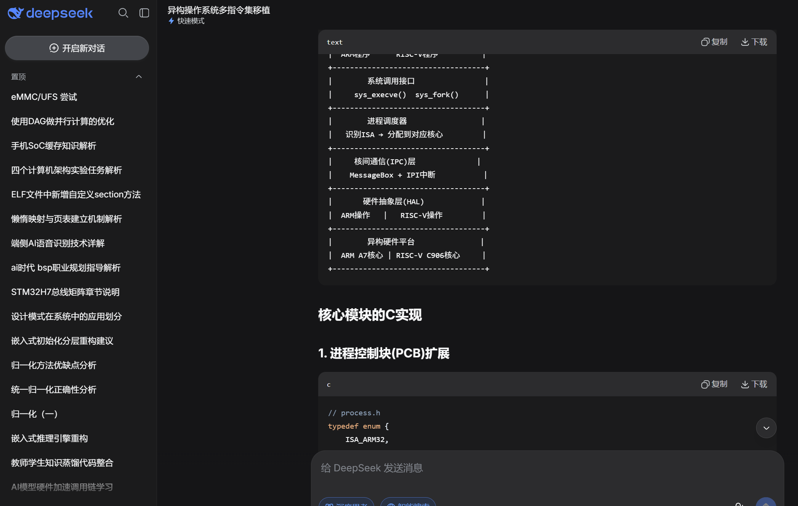
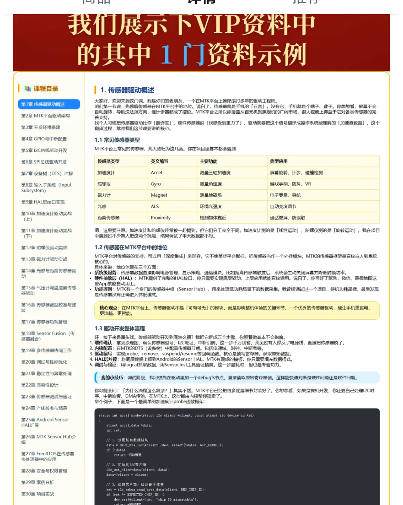
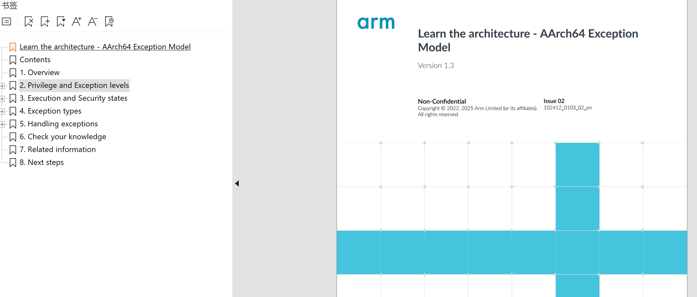
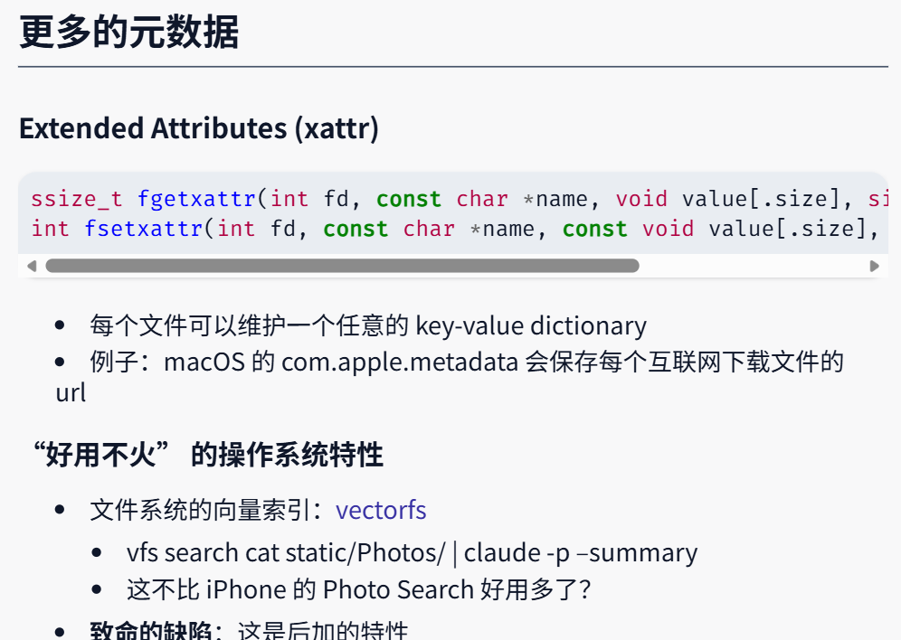

> **注意：以下的内容均为个人观点。**
>
> **如果你看完后有不同的观点也没关系！请指出，我很乐意去学尝试积极的东西。**

封面：

# 1. 发呆

今天啥也不想干，然后就躺着看了下蒋炎岩老师 OS2026 的 `hacking days` 的第二次课：[1]。

技术方面的内容不说，主要是在最后的“鸡汤”让我觉得有启发（因为之前也想过），那就趁此机会写写自己的内心感受吧。

> **强烈建议大家把这个（手册）通过管道给到agent，（在AI的帮助下）阅读了手册，你就能知道什么事情是能干的，什么事情是不能干的。**
>
> **（我觉得）在这个时代的下，你们最需要的就是有一个清晰的概念什么事情是能办到的，因为人没有办法做自己想象不到的东西，而扩展你的想象力的方式就是去看别人想到了什么。**

尽管说我是一个本科毕业，准备入职当牛马的小登，但是我觉得还是需要有点追求的。毕竟读个大学是需要做点自己感兴趣的事情的，而之后哪怕在工作之余，都要有自己的**“事业”**吧（哈哈）。

在看到上面老师这句话的时候（尽管可能不是说给我听的，给南大那些未来做真正研究的同学吧），我其实其实觉得我应该自由点随便玩点些自己想做的东西。

以前之前自己学习东西、收集信息的能力可能并不是那么好，所以久而久之就变成：遇到自己第一眼觉得有意思的东西时候基本都坚持不下来。

但自从 LLM 出来以后，自己遇到啥不会/看到啥有意思的/游戏等等，早期我就会直接直接一股脑地问他，偶尔用点 `prompt` 就疯狂地问它、`Claude Code` 之后就问自己的项目，可以说知识面极速地扩大。

尤其是在去 `zyt` 实习之后，了解到了特别多新东西：PCIe，eMMC，DDR，QNX，自动化测试，平台化，大佬们自己独特的调试方法/hook技巧等等。

因为有了AI，我都想了解看看！就一直在问AI总结学习某个话题。

甚至还有这种问题：

但是渐渐地过了一遍后，发现这些领域就这么大，别人也这么做，别人都能问出来这些东西，甚至有一些聪明人能借 AI 生成相关领域的学习文档，具体看个例子：

加之 `agent` 飞快发展，甚至于解 `bug`、`coredump`，写复杂代码等等内容，agent都能做了。那自己学这些的意义在哪里？

我就渐渐感到空虚，加上实习秋招的结束，自己说是变成了学自己玩的，虽然有时确实学了点有意思的，写了点有用的，但其实大多时候都在装傻充愣。

# 2. 感悟

但很快，在看到蒋炎岩老师的话以及他之前的几个鸡汤后（虽然看了几遍），自己有了不一样的感悟。

**最重要的就是，我为什么要一定要追求这个玩意有没有有意义呢？**我并不想着改变世界呀。

*来源：视频号——一将难求系列纪录片*

我只是想着做那些我第一次看上去觉得有意思好玩的东西呀（或许 `taste` 不好，但我不 `care`）；或许也会被迫去学一些工作中要用的东西然后逐渐变得擅长（但可能我并不喜欢呀）......

另外，玩也好，学也罢，只是自己度过生活的方式罢了，Just For Fun^[2]^

所以至此我基本就也就抛弃掉上面这些杂七杂八的声音了，更加专注自己做的东西，也就回到了老师说的鸡汤。

在 AI 时代，获取知识的成本无限趋近于零，但“知道自己不知道什么”（ `unknown unknows`）似乎就成了最大的瓶颈。

所以这里得出自己的观点：

阅读权威手册/优秀/第一手设计文档、少看二手/三手教程、关注优秀前沿的人/公司在做什么。**你的技术想象力，受限于你的信息边界。** 不知道某个功能的存在，那就永远不可能在设计时用上它。

举个例子，比如**我最近想看 `arm64` 的异常处理**。

那直接去微信公众号、中文互联网上一搜，基本都是各自对于这个概念质量地下的解析，尽管会有人理解的非常透彻，但你愿意在 `shit` 里淘金吗（或许你平时关注了 `taste` 不错的博主，但显然绝大部分人不能做到）？

显然不会，那为什么不去Google、官网、AI 搜搜看呢？（英文不好可以学，工具这么多，不是借口）

再者，就像老师上面举到的例子：

`man -P cat sh | claude 'Make a comprehensive summary`

去探索看看有什么好玩的特性？`sh` 还能这么用：

`diff <(stat -c '%n %y' **) <(sleep 2; date > a.txt; stat -c '%n %y' **)`

再比如 `xattr` ：

再举个我身边的例子，我身边有同学去某家xx相机厂商实习，再和我以及别的公司实习的同学交流了解他们的产品的如何在受限成本的条件下满足性能，应该如何设计架构、相机算法的部署在AMP上的考虑、平台化设计......这又何尝不算上面的优质的信息呢？

加之，前几天整理收藏夹、各软件的稍后再看，做了一波断舍离，又何尝不是这种想法的实践呢。

# 参考

[1] 终端和 UNIX Shell：https://www.bilibili.com/video/BV1nQXsBuEUz

[2] JUST FOR FUN: The Story of an Accidental revolution：Linus Torvald, David Diamond

