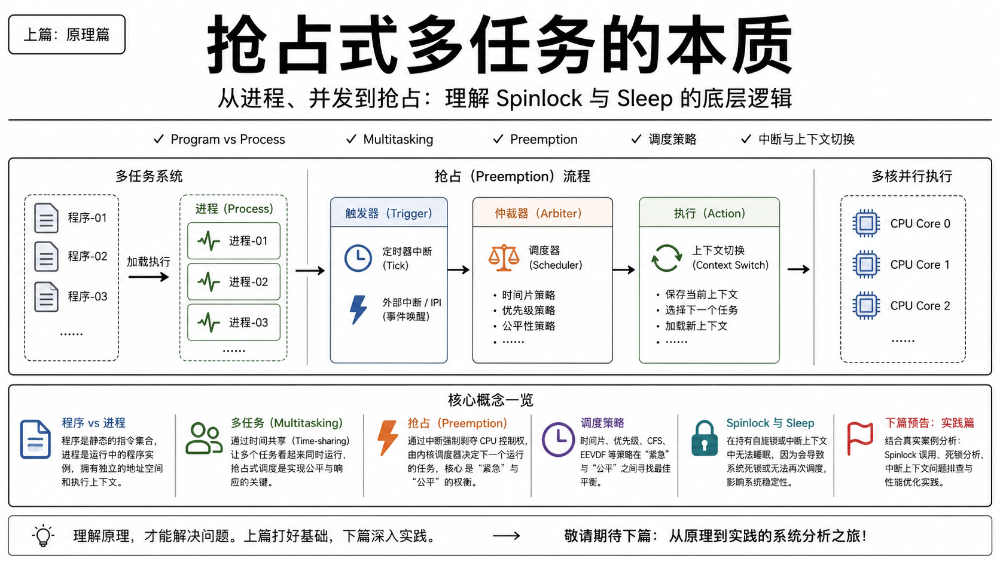
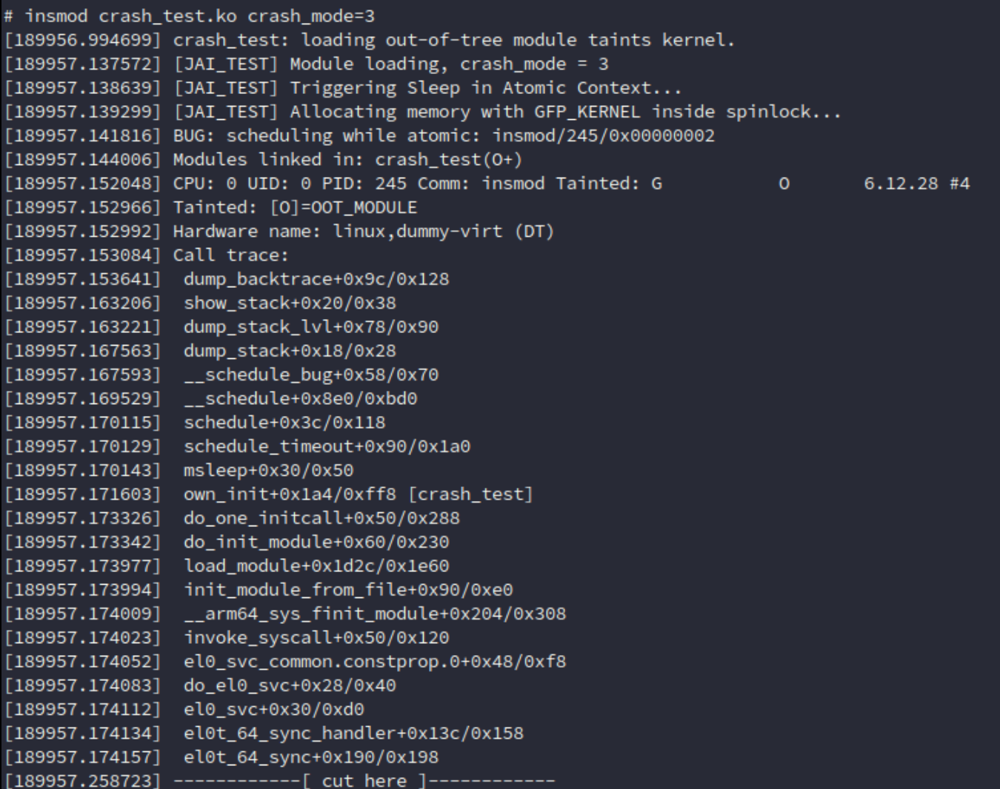
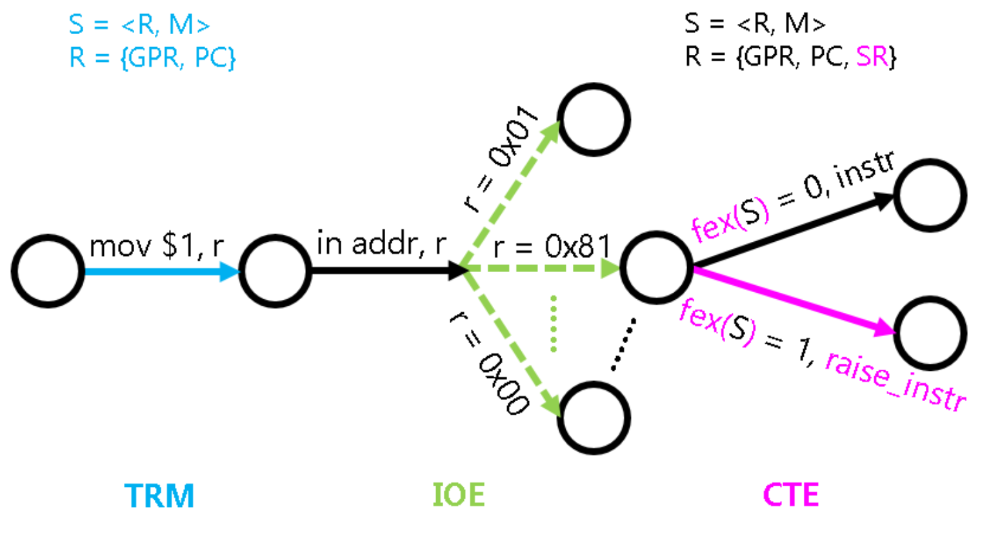
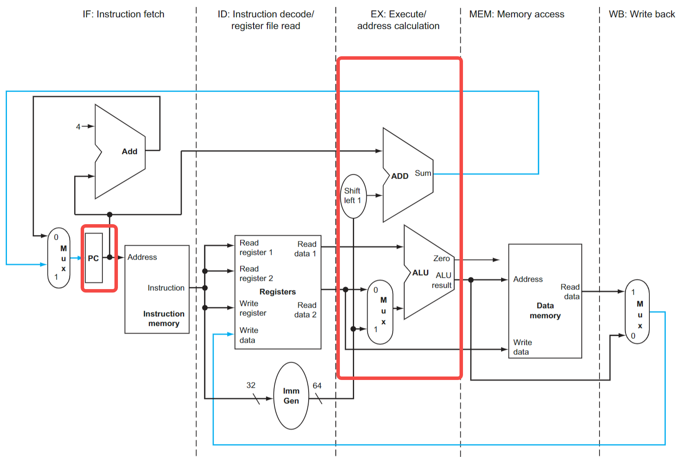
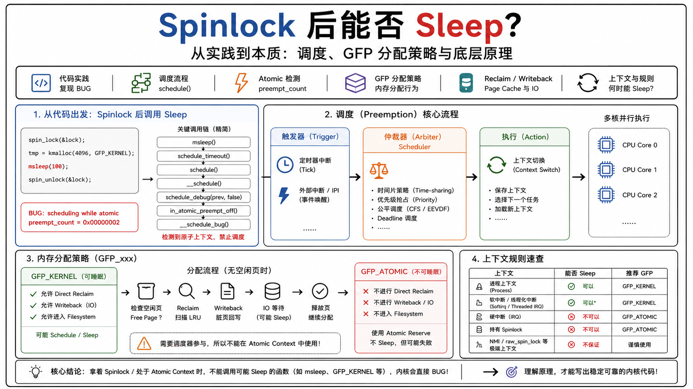
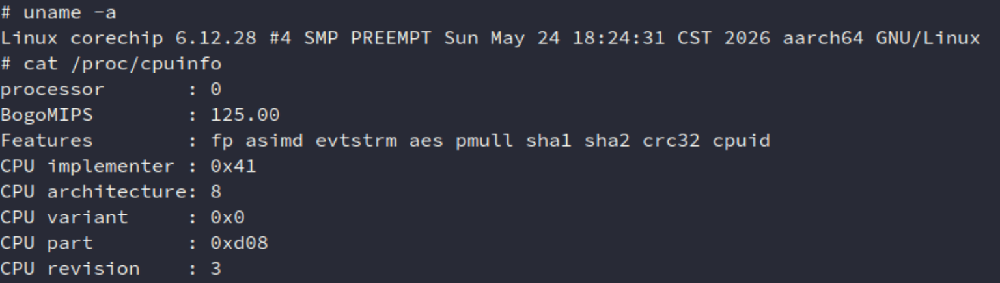
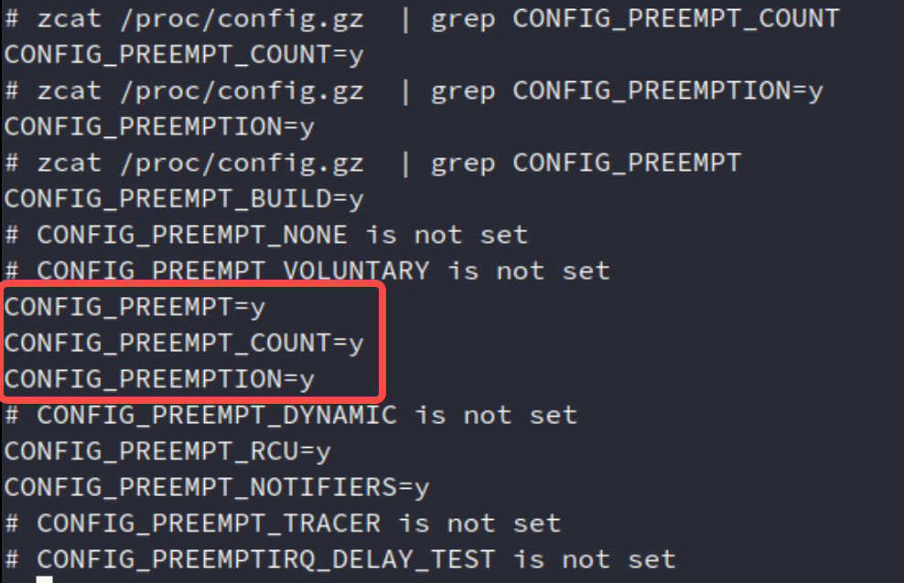
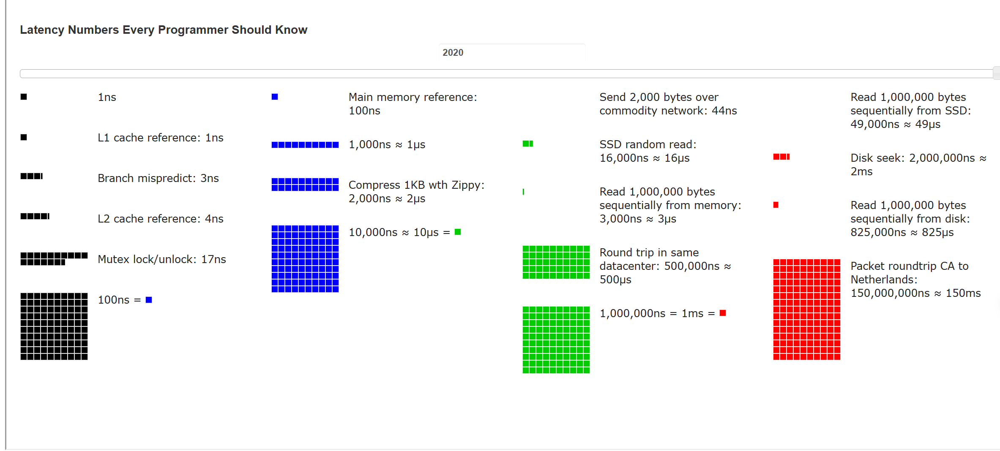

> **注意：以下的内容均为个人观点+在学习/实践中得出。**
>
> **如果你看完后有不同的观点也没关系！请指出，我很乐意去尝试积极的东西。**

封面：



目录：

```TXT
1. introduction
	1.1 program → process（程序 → 进程）
	1.2 multitasking（多任务）
2. preemption（抢占）
    2.1 mental model（心智模型）
    2.2 调度策略
    2.3 总结
3. 并发
	3.1 谁能打断 CPU？
	3.2 bare-metal & RTOS
	3.3 过渡到Linux：关抢占和关抢占区别？
		3.3.1 RTOS
		3.3.2 Linux 关抢占
	3.4 spinlock
	3.5 more
		3.5.1 atomic operation
		3.5.2 barrier
	4. 资料推荐
```


# 1. introduction

> 近期由于毕业搬东西+毕业旅游玩了几天，所以没更新，不过也积累了好几个话题：锁、并发等等，本文就和这部分相关。下面是原 `introduction`。

最近在看到一些师弟买了一些八股文/面经资料回来看/背，回想自己去年秋招的时候，可以说几乎没怎么背过这些问题（遇到问题现场想，现场推，面试官说答错了我就直接问），我不评价八股文如何如何，但我就是很厌恶这个东西。

我一直认为的是：合格的面试官问合格的问题是考察你对 `xxx` 部分了解的多少。但为啥现在似乎变了呢？哦对，国内的环境，你只要人过来干活就行啦，想这么多干嘛！工作而已嘛，早点被 AI 消灭吧！

扯多了，写的原因是自己想验证一个自己之前看到的问题（也就是别人说的八股）：

“为什么 `spinlcok` 后不能 `sleep`？为什么中断处理中不能实现 `sleep`？......类似的问题”，

同时梳理部分几年前自己没有写下的相关基础内容（进程、并发）。




## 1.1 program → process（程序 → 进程）

最基础的：

> **While a computer program is a passive collection of instructions typically stored in a file on disk, a process is the execution of those instructions after being loaded from the disk into memory^[1]^**

> **计算机程序是通常存储在磁盘文件中的一组被动指令集合，而进程则是这些指令从磁盘加载到内存后执行的过程。**

就像下面这个图：

```C
                +---------------------------+ 
			    |         PROGRAM-01         |
                +---------------------------+  
			    |         PROGRAM-02         |
                +---------------------------+  
			    |         PROGRAM-03         |
                +---------------------------+
 			    |         PROGRAM-04         |
                +---------------------------+
			    |         ..........         |
			    |         ..........         |
                +===========================+  
                
```

作为一种 `conceptual model`，程序都是按照顺序规则（`sequential`）放在提前规划好的内存地址空间中属于他们的部分。

只不过现代的 `process`（或者说本来 `process` 被发明出来就是这样，六七十年代应该就有MMU了^[2]^）依赖于MMU给程序执行起来时带了一个 VR 眼镜，认为 SoC（或者说 `cpu + bus`）所提供的整个内存地址空间都是每一个执行实体的（也就是 `Virtualization` 了^[3]^ ）。

还有一个有意思的例子是：进程是动起来的程序。

> **"A process is fundamentally a container that holds all the information needed to run a program... A process is essentially an executing program, including the current values of the program counter, registers, and variables."^[4]^**

> **进程本质上是一个容器，用于存储运行程序所需的所有信息……进程本质上是正在执行的程序，包括程序计数器、寄存器和变量的当前值**


## 1.2 multitasking（多任务）

之后便到了大家常说的多任务处理（`multitasking`）。

每个 `cpu core` 一次只能执行一个进程，但依赖于 OS/MMU 提供的虚拟化能力，每个 `cpu core` 能够在各个 `process` 中来回切换，无需等待每个进程全部执行完毕（所谓的抢占式调度）。而依赖于 `cpu core`飞快的执行速度，我们所感知到的就变成有多个 `cpu core` 在帮我们做事。

> 不像我们人这种只能单线做完一件事情再做下一件事的生物。当然，具体到 `ms/us/ns...` 这种可以说某一时刻的词语，`cpu core`，自然也是只能做一件事情，但如果是 `multi-core`，那天生就是并行，自然实现真正多开、真正多任务，也就像多人做同一个任务。

这种技术，也叫 `time-sharing`：多个任务或用户同时共享计算资源。

类似的，我们常常也会听到要实现多任务/多进程的目标，其底层实现手段往往会依赖 `time-sharing`。

更进一步讨论多任务，如果从任务切换的角度来看，基本可以分为：

- `cooperative multitasking / non-preemptive multitasking`（协同多任务）
- `preemptive multitasking` （抢占多任务）

> 如果从系统设计的角度来分类，往往大家还会说有 RTOS、分时 OS、通用 OS...就像教科书上写的那样，挺混乱的。

对于协同多任务，它的工作方式基于一个约定：用户进程周期性地主动让出 `CPU` 的控制权，从而让其它进程得到运行的机会，而这件事往往需要操作系统提供一个特殊的系统调用：`sys_yield`^[5]^

> e.g. `Linux` 中的 `sched_yield`（系统调用）、 `FreeRTOS` 中的 `taskYIELD`。

但协同多任务不是本文的重点，重点是抢占多任务：`Preemptive`。

简单来说，抢占多任务是基于硬件中断（通常是时钟中断）强行进行上下文切换的：该机制会暂停当前正在执行的进程，然后由调度程序来决定下一个应执行的进程，这样一来，所有进程在任何时候都能获得一定的 CPU 使用时间。

> **对处理器上正在执行的任务进行此类操作，被称为上下文切换。**


# 2. preemption（抢占）

## 2.1 mental model（心智模型）

按照我自己的理解，`preemptive multitasking` 是用来区分：

*那种允许任务被抢占的系统* 与 *那种需要进程或任务在不需要系统资源时主动让出资源的协作式多任务系统*。

也就是 **抢占** 这个动作，`preemption` 这个词意味着：**在别人之前拿过来**。

> - **Pre-**（前缀）：表示“之前”、“在前面”。
> - **-empt-**（词根）：源自拉丁语 *emere*，意为“拿取”、“购买”。
> - **-ion**（名词后缀）：表示行为或状态。

在计算机领域，这个抢占我们一般说的是 `CPU` 控制权的转移，而且是非自愿的转移，别人强行操控；更上层软件一点的就是：当前执行的程序被迫停下来，另外一个程序抢占执行。

综上，我自己总结了一个“状态机转移”来描述上述这个任务（没错，又是这篇写的：[backtrace（一）：从底层到本质：理解函数调用与 LR/FP 的设计与思想](https://mp.weixin.qq.com/s/ULNN7Pz7TmwUwRRB9U1HGg)）：

**触发器（trigger） -> 仲裁器（arbiter） -> 执行（action）**

触发器，很好理解，因为任务不会自动交出执行权，要实现 `preemption` 那就要外部强制介入了，那就是硬件中断来强行剥夺当前执行流。具体用两种：

- **定时器中断：** 系统的心跳，Tick（很常见了，MCU里的 `systick` 记得吧？类似的）

    定时器中断定期强制打断当前任务，把控制权交还给内核。

- **外部设备中断或 IPI（核间中断）：** 网卡收到数据包、`disk` 读取完成等。

    设备会打断当前任务，唤醒等待这些数据的任务。这是实现“基于事件/优先级抢占”的物理基础。

仲裁器，自然就是决定当前任务被抢占后下一步执行什么啦，也就是内核的调度器做的事情了。中断把控制权交给了内核调度器，调度自然是有它的判断策略来选择下一步该做什么，这也就是调度策略了。

最后是执行，如果仲裁器决定需要切换当前执行流了，且是安全的（比如后面会说的：`preempt_count == 0`），那内核就会做上下文切换了（保存当前任务的寄存器状态，加载新任务的寄存器状态，完成抢占）。


## 2.2 调度策略

这里可以具体看看 1.3.1 所说的仲裁器所选择的调度策略。

记住首要目标，调度器是要 `preemption`（抢占），从 `first principle` 看，要看一个事情/程序能不能执行，按照人的思想，无非就是：

事情是否紧急？是否有时间做？若紧急肯定紧急的先，不紧急那就公平来做。

所以核心就两个点：**紧急、公平**

也就分别对应了目前实现主流调度策略的基础：时间片（抢占）、优先级/事件（抢占）。

- 时间片：众生平等，大家都一样

    给每一个在系统中的任务分配好各自的配额（比如1ms），每个任务的配额用完了，自然就会被别的任务抢占执行了。

    触发条件：定时器中断到来，内核检查当前运行任务的配额，用完了就换。

- 优先级/事件：有更紧急的且已经准备的任务（比如着火逃命肯定比你吃饭重要）

    别人的优先级高，自然要等别人做完才行。低优先级任务先做着，更高优先级的来了自然轮到它跑。

    触发条件：外部中断唤醒了一个高优先级任务、当前任务释放了锁，导致高优先级任务就绪。

> 单纯实现时间片以及优先级，其实在现代大型的系统已经比较少了。
>
> 对于时间片，更多时候是平时自己玩、教程之类的会选择，因为这部分讲起来，理解比较容易，就像 NJU 的 PA^[5]^的默认实现（这个 lab 可以说是计算机系统基础国内顶尖的了，涵盖全面，你要是自己改造调度也是可以的）。
>
> 对于优先级，这部分可以说是现代 RTOS 的核心调度方式了（`FreeRTOS`、`QNX`、`Zephyr`好像也是？）、Linux也有（`SCHED_FIFO` 和 `SCHED_RR` 实时调度类）

但是，内核的调度或者说实际实现的调度器没有上面说的这么简单了，最开始就说了调度关键就紧急和公平。这两个可以说“道”，实际内核会综合起来玩各种各样的花活。

> **AI 总结看看（不保证下面的正确性，请自行验证，只是拓宽视野）：**

- CFS：用“时间”的尺度来衡量“优先级”

    在传统的调度器里，时间片和优先级是两套分离的系统（高优先级分的时间片长，低优先级分的时间片短）。

    CFS（完全公平调度器）的核心思想是：**彻底消灭传统意义上的“时间片”和“绝对优先级”，把优先级转换成“时间的流逝速度”。**

    在 CFS 中，优先级（Nice 值）被映射为任务的权重（Weight）。

    任务运行的虚拟时间 $\Delta vruntime$ 与实际物理时间 $\Delta exec\_time$ 的关系如下公式表示：

    
    $$
    \Delta vruntime = \Delta exec\_time \times \frac{weight_{NICE\_0}}{weight_{task}}
    $$
    

    - 如果你的**优先级高**（权重极大），分母变大，你的 $vruntime$ 增长得就极慢。
    - 调度器每次都挑 $vruntime$ 最小的执行。因为你的 $vruntime$ 涨得慢，所以你就会**变相获得更多的物理执行时间**（抢占别人）。

    **结论：** CFS 看起来是“比进度（`vruntime`）”，但底座依然是**时间轮转**，而它的驱动力引擎依然是**优先级**。

- EEVDF：用“时间”动态计算“优先级”

    如果说 CFS 是“优先级决定时间分配”，那么 Deadline 和较新的 EEVDF（最早合格虚拟截止时间优先）算法，就是反过来的：**“时间决定了当下的优先级”。**

    在绝对优先级模型（如 `SCHED_FIFO`）中，优先级是一个静态的数字（比如 99）。但在 Deadline 模型中：

    - 任务的优先级变成了动态的：**距离 Deadline 越近，隐式优先级就越高。**
    - 当一个低优先级任务快要错过死线时，它的“动态优先级”会瞬间飙升，从而抢占当前的运行任务。

    **结论：** 这依然没有跳出这两大支柱，它只是一种**基于时间戳动态生成优先级**的高级抢占策略。


## 2.3 总结

> **说了这么多，其实是给几年前的自己学习的时候一个回答吧（虽然自己早就知道了，但之前没有记录下来的习惯）。**

在我刚学 FreeRTOS 的时候，其实是不能理解时间片这个东西的，说是吧时间切成一片片的，但是“没用过+没人指点/没找到好的资料/脑子笨”，我一直觉得有点不太通顺+做不出啥东西（现在想其实当时就应该无脑做）。加之当时身边人看法基本都是写写应用代码，不用了解。

但直到我完成 NJU PA^[5]^ 后，实现了定时器中断+时间片，也才明白只要把程序运行和时间片结合起来理解就行了。

更加重要的是，当我第一次接触 Linux，我时不时就会结合 FreeRTOS 的优先级抢占的机制去理解，自然也就会想到实时 + Linux 的内容，加上由于时不时就能在网络上刷到各种N手/质量参差不齐的资料，

导致我第一次了解 Linux 的 `preemption`（抢占）的时候，**我默认实时 Linux 是通过它的优先级抢占实现的，就简单认为 Linux 已经做到实时。**

当然现在经过实践之后的理解，也纠正了一些概念了，算是进一步反向理解 `cooperative multitasking` 了吧哈哈。


> ⚠️⚠️⚠️**本文并不会引入过多深入的实时系统的内容，我的文章大致也只包括：**
>
> ```C
> Process
> → Scheduler
> → Context Switch
> → Sleeping
> → Wakeup
> → Spinlock
> ```
>
> 不过 Linux 的实时补丁（`PREEMPT_RT`）（好像 Linux 6.12 已经合入主线了，现在也有很多文章写）
>
> 感兴趣的话直接到本文的最后（参考的前面）或者评论区，去看一些文章吧！


# 3. 并发

要回答我最初的疑问，单凭上面的基础还是不够的。现在补充并发/ `spinlock` 的内容。


## 3.1 谁能打断 CPU？

依然从这篇：[backtrace（一）：从底层到本质：理解函数调用与 LR/FP 的设计与思想](https://mp.weixin.qq.com/s/ULNN7Pz7TmwUwRRB9U1HGg) 说的“程序是个状态机”出发，只不过这会从理论模型^[6]^变成了实际的 `cpu` 内部的 `pipeline`^[7]^。



> S = <R, M>：State = <regs, memory>
>
> R = {GPR, PC, SR}：regs = {general purpose regs, PC, status regs}


CPU一直在做：

````TXT
取指 → 执行 → 取指 → 执行 → 取指 → 执行...
````

严格意义上来说它并不知道什么进程，RTOS/Linux 上下文切换，`schedule` 等。

它只知道要根据 `PC` 去执行，如果说的绝对一点，系统里实际上就一个执行流：PC→PC......

既然一直都是这个执行流，那为什么我们仍会觉得软件层面的 `Task` 会停下来呢？无非就两个：

- 同步（自己主动停）

    `call`、`yield`、`sleep`、`schedule()`...

- 异步（别人强制）

    `interrupt` / `exception`...（这里不区分什么异常/中断的异步/同步实现）

还记得前面说的 **硬件中断** 对于整个系统的抢占的关键性作用嘛？

所以我几乎可以说中断就是打断当前执行流唯一的外部东西，或者我让 AI 说的学术一点：

> **Interrupt/Exception 就是CPU主动停止当前执行流的一种硬件机制。**


就像前面1.3.1说的，目前的OS几乎都依赖硬件中断来调度(就是改变执行流)


## 3.2 bare-metal & RTOS

对于绝大数电子的学生，第一次接触嵌入式几乎都是 MCU 的往往都会写类似的代码：

```c
main(): counter++
ISR:    counter--
```

显然，哪怕是在单核裸机上，这也是会存在并发问题，解决问题也很简单：

```
disable_irq();
counter++;
enable_irq();
```

可以说，在正常的程序状态机执行过程中，中断就是唯一的异步执行流。

所以，关中断 = 没人能打断我 = stop the world，这个 world，就是 `Critical Section` 了。

哪怕加上 RTOS，有task/thread概念后，变成了是多个任务+中断ISR对共享内容做访问。

那那前面的解决措施变了吗？影响因素变成了任务之间的切换（+中断）的并发影响。自然就会问：任务之间如何切换？比如两个任务：TaskA、TaskB：
```c
TaskA
↓
timer-irq (比如cortex-M 的 SysTick)
↓
ISR
↓
Scheduler
↓
Context Switch (TaskB)
```

依然是 1.3.1 说到的定时器中断中做任务的抢占（时间片）。

到这里，我也能得出一个结论：RTOS 的抢占，本质还是中断呀。

哪怕是对于单核的 RTOS：

```c
disable_irq()
↓
Timer ISR 不执行
↓
Scheduler 不执行
↓
Task B 不运行
```

所以：关中断依然可以实现互斥。"RTOS 和裸机其实没本质区别。"


> ⚠️⚠️⚠️**这里还有一个更重要的点**
>
> 这里或许有人会说 OS 内核也能自己主动调用 `schedule()` 呀。
>
> 比如 FreeRTOS 做定时器周期检查是否许哟啊切换任务、`taskYIELD()`。
>
> 这些内容，对于 `armv7` 的 `Cortex-M` 来说，本质上都是一个中断，触发一个 `PendSV`（可悬起系统调用）中断，把切换动作推迟到中断上下文。
>
> 关中断确实能够挡住抢占了。

> 但是还有问题，还有一个 API 是 `vTaskSuspendAll()`：挂起/关闭调度器。
>
> - 如果中断和内核同时访问了共享变量（TCB结构体、内核链表...），单单靠挂起调度器是做不到防范这种并发的。
> - 如果是任务与任务之间的，那单纯靠挂起调度就能防住。
>
> 所以，这个操作不在于防中断，在于用户层的 “延迟切换” 和 “批处理”：**比如在遍历一个大数组的时候，时间片用完或者高优先级任务就绪导致任务切换，改乱了数据。**
>
> 具体细节来说，当我挂起了调度器，但是中断仍然在响应，`PendSV` 依然触发，但调度器内部（一个计数器）阻止了实际的上下文切换，直到调用对应的 `vTaskResumeAll()` 后，系统才会检查是否有 `PendSV` 等待，如果有，才统一执行一次切换。

举个例子：
```C
/* 场景：任务A和ISR同时访问一个全局计数器 */
volatile uint32_t g_counter = 0;

void ISR_Timer(void) {
    g_counter++;  // 中断里直接改
}
void TaskA(void *pv) {
    vTaskSuspendAll();   // 只挂起调度器，中断还在跑
    
    uint32_t temp = g_counter;   // 读取
    temp++;                       // 修改
    g_counter = temp;             // 写回
    
    xTaskResumeAll();    // 如果这期间ISR跑了，g_counter已经被改了
}
```

**问题**：`vTaskSuspendAll()` 只阻止了任务切换，但 `ISR_Timer` 依然会在每个定时周期执行。如果 ISR 在 `temp = g_counter` 和 `g_counter = temp` 之间触发，就会丢失一次递增。

要么就用 `taskENTER_CRITICAL`、`taskEXIT_CRITICAL`。


**最后，注意我上面说的是用户层的“延迟切换”和”批处理“。下面会引出更加重要的内容。**


## 3.3 过渡到Linux：关抢占和关抢占区别？

### 3.3.1 RTOS

如果都了解了上面的内容后，且自己已经有对应的 RTOS 经历，同时如果自己是实现过玩具OS的话（就像NJU PA的默认基础实现），如果不去了解 Linux 内部的实现的话，就会像我之前一样默认：

**关中断 = schedule()不运行**

> 记住这个我当时初学非常困惑的问题（网上讲的乱七八糟的）：关中断和关抢占有啥区别？不是都是为了互斥？一样吧？

没问题！在 `bare-metal` + 不支持内核抢占的 RTOS 上这么说是没问题的。

因为 RTOS 的核心就是 Determinism，确定性，**他们的内核是不支持被其他任务所抢占的（我说的是内核，不是任务与任务之间，中断仍然能打断当前执行流）**。

相信做嵌入式的几乎都听过 RTOS 被称为实时，不是说它执行快，而是准时与可预测性。

> 就比如：
>
> - 如果 RTOS 内核允许在操作链表（比如把任务从挂起队列移到就绪队列）的中途被抢占，那么计算一个任务从触发到实际执行的时间（响应时间）就会变成一场噩梦，因为我无法预测内核会被抢占多少次、抢占多久。（WCET：最坏执行时间）
> - 反之，如果内核在执行这些操作时直接关闭中断或锁死调度器（进入临界区），那么这个操作的时长就是固定的（比如明确只有几十条汇编指令）。这样开发者就能精确算出系统的最坏延迟是多少。

举个 FreeRTOS 的例子：所有对其内核的任务控制块（TCB）链表、就绪队列、事件链表的操作都被严格包裹在 `taskENTER_CRITICAL()` 中。以队列发送为例^[8]^：

```C
// xQueueGenericSend
taskENTER_CRITICAL();
{
    // ....
    /* 如果有任务在等待获取此消息队列 */
    if ( listLIST_IS_EMPTY(&(pxQueue->xTasksWaitingToReceive))==pdFALSE ){
        /* 将任务从阻塞中恢复 —— 修改事件链表！ */
        /* 修改队列内部链表：xTasksWaitingToReceive */
        if ( xTaskRemoveFromEventList(
              &( pxQueue->xTasksWaitingToReceive ) )!=pdFALSE) {
            queueYIELD_IF_USING_PREEMPTION();
        }
    }
    
}
taskEXIT_CRITICAL();
```

`xTaskRemoveFromEventList()` 的源码注释明确写道：

> **"THIS FUNCTION MUST BE CALLED FROM A CRITICAL SECTION."^[8]^**

因为其内部连续执行了：

1. `listGET_OWNER_OF_HEAD_ENTRY()` —— 读链表头
2. `uxListRemove()` —— 修改事件链表指针
3. `prvAddTaskToReadyList()` —— 插入就绪链表

这三步**必须原子地完成**。如果在第2步和第3步之间被中断打断，ISR 里的 `xQueueSendFromISR()` 也去尝试修改同一个链表，那就会导致出现诡异的并发 bug。

> **可以说就是因为自己没有理清内核是否能够抢占，才导致了后面我混淆Linux的关中断、关调度/抢占两个内容，以至于后面看什么 spinlock、atomic context都想通过 RTOS 类比理解...**

总结来说：

> **RTOS（不支持内核抢占的），关中断即是stop the world，实现互斥。**


### 3.3.2 Linux 关抢占

反观 Linux：

Linux 2.4之前都是在追求高吞吐量（希望 CPU 每时每刻都在做有用功），**并不支持内核抢占的，就像上面的RTOS那样，所以在那个时候的 Linux，且是单核，那关中断就是能够实现互斥/stop the world。**

但随着当时 Linux 逐渐占领桌面，考虑到**交互响应**，甚至说“预料”到了未来移动端OS的需求，Linux 在 2.6 引入了内核抢占后，也就是在 `Kconfig` 中看到的 `CONFIG_PREEMPT`，情况发生了变化。

如果内核能够抢占，意味着就不再像之前的 `timer_irq → schedule` 这么简单了。

关中断确实也能挡住部分并发的问题，因为在 `Timer` 的 ISR 中，中断完成后，确实也会有这么一个调度点，但不够，还有很多：

```c
mutex_unlock()
↓
wake_up()
↓
schedule()
```

```c
syscall完成返回用户空间
↓
schedule()
```

甚至是在内核代码中大量放置的显式抢占点 `cond_resched` 。

我还让 AI 总结了一个：

| 抢占点类型            | 描述                           | 说明                                                         |
| :-------------------- | :----------------------------- | :----------------------------------------------------------- |
| **1. 显式抢占点**     | `cond_resched()` 及其同类函数  | 这是开发者在代码中**主动、显式**放置的检查点，用于判断是否需要让出CPU。 |
| **2. 返回用户空间**   | 从系统调用或异常返回用户空间时 | 这是内核在返回用户态前检查并执行调度的时机。                 |
| **3. 返回内核空间**   | 在Tick、IPI或中断退出时        | 这是内核在中断处理完成后，返回被中断的内核代码前检查抢占的时机。 |
| **4. 可抢占区段结束** | 当 `preempt_count()` 归零时    | 这标志着一段通过 `preempt_disable()` 等机制保护的、不可抢占的临界区结束。 |

由此可见，关中断只挡住ISR，并没有挡住主动 `schedule()`。

所以 Linux 把 `IRQ` 和 `preemption` 分离了。

对于"关中断和关抢占为什么不同"自然就明白了，但它们的目标都是为了消除并发。

> - **关中断（`local_irq_disable`）**：为了防止中断上下文（ISR）的并发访问。
> - **关抢占 （`preempt_disable`）**：为了防止进程上下文的并发访问。

中断/进程上下文是什么？这也是一个很用了很多，但是没有明确说明的概念，我这里以这个回答为示范^[9]^，我觉得总结得挺好的：

> - 进程上下文——普通进程和系统调用都在该上下文中执行，该上下文可能会被中断请求打断。
> - 原子/中断上下文——中断处理通常是在这种上下文中进行的，这些中断并不属于某个特定的进程，而是由某个设备发起的（为简化说明，此处不考虑异常）。一旦中断上下文进入休眠状态或放弃对 CPU 的占用，那么它就无法被再唤醒了。因此，这种上下文也被称为“原子上下文”

而这个划分，我觉得可以进一步，就是为了解决内核路径能否睡眠的问题：

- **进程上下文**：可以睡眠（因为有自己的`task_struct`，能保存状态并等待唤醒）。
- **中断上下文**：不能睡眠（因为没有独立的进程实体来“等待”，睡过去就真的“死”了）。

但有几个几个说明：

- 上面定义主要适用于**硬中断（中断上半部）**，**软中断/`tasklet`** 也属于原子/中断上下文（同样不能睡眠），但它们不是在硬件中断信号触发时立刻执行，而是在硬件中断返回后、或内核调度时机（如`ksoftirqd`内核线程）中执行。不过为了简化说明，这个作者这么定义也OK。
- **缺页异常（Page Fault）**通常发生在进程上下文（可以睡眠去交换磁盘数据），也很好说，如果在中断上下文中发生了缺页异常，那将是一场灾难（因为无法睡眠去读盘）。


## 3.4 spinlock

到这里，我才会写所谓的 `spinlcok`，在 2.6 实现内核抢占的一些细节。

当时的开发者对于 `CONFIG_PREMMPT` 的实现，巧妙地复用了当时为 SMP 准备的并发保护机制，那个时候 Linux 内核里已经大量铺设了 `spin_lock()`。

> `spinlock`：自旋锁：
>
> - 如果一段代码被自旋锁保护，意味着它不能被另一个 CPU 核上的代码并发执行
> - 抢占的逻辑：如果一段数据不允许被其他 CPU 并发修改，那它同样不允许被同一个 CPU 上的其他线程抢占修改。

他们做了一个改动：在每一个 `spin_lock` 的实现里，隐含地增加了对 `preempt_count`（抢占计数器）的操作。

只要当前任务没有持有任何自旋锁（`preempt_count == 0`），它在内核态就是绝对安全的，随时可以被高优先级任务踢下 CPU。

而一旦拿了锁，系统就会自动禁止当前核的抢占。

所以也就是会在 `spin_lock`中看到 `preempt_disable(preempt_count++)`：

```C
// include/linux/spinlock.h
static __always_inline void spin_lock(spinlock_t *lock)
{
    raw_spin_lock(&lock->rlock);
}

#define raw_spin_lock(lock)    _raw_spin_lock(lock)
```

```C
// include/linux/spinlock_api_smp.h
#ifdef CONFIG_INLINE_SPIN_LOCK
#define _raw_spin_lock(lock) __raw_spin_lock(lock)
#endif

static inline void __raw_spin_lock(raw_spinlock_t *lock)
{
    preempt_disable();                          // ① 关闭抢占
    spin_acquire(&lock->dep_map, 0, 0, _RET_IP_); // ② lockdep调试（无实际代码）
    LOCK_CONTENDED(lock, do_raw_spin_trylock, do_raw_spin_lock); // ③ 竞争加锁
}
```

当然，还有另一个 API：`spin_lock_irqsave()`，中断、抢占两者都关，同时还保存了中断状态，这个似乎才是更加常用的。这个时候再去看看面试指南总结，不是更明了嘛：

- **进程上下文 & 不确定中断状态**：**必须用 `spin_lock_irqsave()`**（绝大多数驱动场景）。
- **进程上下文 & 明确知道中断全程开启**（如刚进系统调用）：可用 `spin_lock_irq()`（性能微优化，但极不推荐新手用）。
- **中断上下文（ISR）**：此时本地中断本就关着，**只用 `spin_lock()`** 即可（再去关中断会重复操作引发BUG）。


## 3.5 more

### 3.5.1 atomic operation

但是，上面这么做就够了吗？

忘掉前面一节的内容，我们再从中断的角度切入：依然是定时器中断+外部硬件中断。

- 对于时间片的，时间片到了，`ISR` 返回调用 `schedule`，关中断确实没法阻挡了时间片的schedule了。
- 对于在进程以及中断的 handler 中共享变量，关中断也确实挡住了。

但仍然有问题，设想一下：

- 如果是多核的处理器，关中断也只是关闭了当前处理器核心的中断，别的核并发地访问共享内容依然会出问题，所以也就会看到大家说的：使用硬件支持的 `atomic operation`

所以可以说，对于单核+支持内核抢占的系统：需要依赖关中断和关抢占二者来实现互斥/stop the world；在前面的基础上，加上多核后，那就还需要atomic operation的操作来保证SMP上的并发问题。


### 3.5.2 barrier

还有，我们前面默认的假设是：CPU 就是一条条按照程序顺序执行指令。真的嘛？

CPU0：

```c
lock();

x = 1;
y = 1;

unlock();
```

CPU1：

```才
lock();
printf("%d %d\n", x, y);
unlock();
```

一定输出 `1 1`？

CPU/编译器：我为什么一定要按你的顺序？

```C
CPU可能：先发y，后发x

Compiler：先生成y，再生成x

Store Buffer：先看到y，x还没出去

Cache：CPU1先看见y，CPU1还没看见x
```

于是CPU1：x=0，y=1

完全可能呀！我锁不是已经拿到了吗？为什么数据还是乱？

因为我解决的是：**谁执行**的问题；仍然没有解决**数据什么时候真正被别人看见**的问题。

于是 Barrier 出现了，Barrier不是为了互斥，Barrier 是为了 **保证观察顺序（Ordering）。**

可以说是完全不同的问题，或者说是二维平面的不同维的问题。

所以到这里，并发可以说有两个世界：

- Execution

    lock、interrupt、preemption、spinlock

- Memory

    barrier、fence、acquire、release

此时再回到 `spinlock` 的调用，看看这个由 AI 总结的完整调用链：

```C
spin_lock()
  └── queued_spin_lock()
        └── atomic_try_cmpxchg_acquire() 
              └── __lse__cmpxchg_case_acq_32()
                    └── casal w0, w1, [x2]    // ACQUIRE语义（Load-Acquire）
        
        [如果快速路径失败，进入慢速路径]
        
        └── queued_spin_lock_slowpath()
              ├── smp_cond_load_acquire()      // ACQUIRE等待
              │     └── ldar / ldarh           // Load-Acquire指令
              │
              ├── smp_wmb()                    // 写内存屏障
              │     └── dmb ishst              // Data Memory Barrier
              │
              ├── barrier()                    // 编译器屏障
              │
              └── atomic_cond_read_acquire()   // ACQUIRE读取
                    └── ldar                   // Load-Acquire

spin_unlock()
  └── queued_spin_unlock()
        └── smp_store_release(&lock->locked, 0)
              └── stlrh w0, [x1]               // RELEASE语义（Store-Release）

smp_mb__after_spinlock()
  └── smp_mb()
        └── dmb ish                            // 全内存屏障
```

你也能对整体框架有认知了！将来真正遇到 barrier 也能有一点印象。这里涉及的东西太多了，甚至还要讲 memory model 的东西，所以不展开了，也不是重点。


# 4. 资料推荐

自己曾经用AI总结，格式排版也很乱的一篇：[互斥：atomic 之下](https://mp.weixin.qq.com/s/UEFUWLKn5o3psL6q__P7Bg)，不过没啥质量。

优先看：

- Lock types and their rules：https://www.kernel.org/doc/html/latest/locking/locktypes.html?utm_source=chatgpt.com

    官方解释 spinlock、mutex、atomic context、PREEMPT_RT

- Proper Locking Under a Preemptible Kernel: Keeping Kernel Code Preempt-Safe：https://docs.kernel.org/locking/preempt-locking.html

- Linux kernel memory barriers：https://docs.kernel.org/core-api/wrappers/memory-barriers.html

- 《Linux Kernel Development (3rd Edition)》/ 《Understanding the Linux Kernel (3rd Edition)》（比较旧，但还是有用）

- 《Is Parallel Programming Hard, And, If So, What Can You Do About It?》：https://arxiv.org/pdf/1701.00854)

    Linux RCU 的主要作者，本书从硬件缓存讲到 RCU，包含大量 Linux 内核实际案例和 litmus test

- Linux-Kernel Memory Model：https://www.open-std.org/jtc1/sc22/wg21/docs/papers/2018/p0124r6.html


- 实时系列

    - Preemption Model - Linux Kernel Internals：https://kernel-internals.org/sched/preemption/

    - LWM 文章

        | 文章                                                         | 年份      | 内容                           |
        | :----------------------------------------------------------- | :-------- | :----------------------------- |
        | Approaches to Realtime Linux：<br />https://lwn.net/Articles/106010/ | 2004      | 2004年所有实时方案综述         |
        | A Realtime Preemption Overview：<br />https://lwn.net/Articles/146861/ | 2005      | PREEMPT_RT 核心思想            |
        | Priority Inheritance in the Kernel：<br />https://lwn.net/Articles/178253/ | 2006      | 优先级继承协议                 |
        | Moving Interrupts to Threads：<br />https://lwn.net/Articles/302043/ | 2009      | 中断线程化                     |
        | Revisiting the Kernel's Preemption Model：<br />https://lwn.net/Articles/945422/ | 2023（⭐） | 从 none 到 realtime 的所有模式 |
        | The Long Road to Lazy Preemption：<br />https://lwn.net/Articles/994322/ | 2024      | PREEMPT_LAZY 新模式            |


- Other：
    - Memory Models：https://research.swtch.com/mm


# 参考

[1] Process (computing) - Wikipedia：https://en.wikipedia.org/wiki/Process_(computing)

[2] Milestones:The Atlas computer and the Invention of Virtual Memory：https://ieeemilestones.ethw.org/Milestones:The_Atlas_computer_and_the_Invention_of_Virtual_Memory

[3] Arpaci-Dusseau, R. H., & Arpaci-Dusseau, A. C. (2018). *Operating Systems: Three Easy Pieces* (Version 1.01). Arpaci-Dusseau Books. http://www.ostep.org/

[4] — Andrew S. Tanenbaum, Herbert Bos. *Modern Operating Systems*, 5th Edition (2023), P39, P86

[5] 来自外部的声音：https://nju-projectn.github.io/ics-pa-gitbook/ics2025/4.4.html

[6] 穿越时空的旅程：https://nju-projectn.github.io/ics-pa-gitbook/ics2025/3.2.html

[7] Patterson, D. A., & Hennessy, J. L. (2020). *Computer Organization and Design: The Hardware/Software Interface* (RISC-V Edition, 5th ed.). Morgan Kaufmann. P277

[8] FreeRTOS-Kernelhttps://github.com/FreeRTOS/FreeRTOS-Kernel/blob/main/

[9] atomic context and process context/interrupt context：https://stackoverflow.com/questions/47063693/atomic-context-and-process-context-interrupt-context


# TODO

最后，给出上面的内容对 我在OEM 开发的一些建议指导。（驱动、OTA、功耗、性能等等）


既然说是线程调度。调度的是进程还是线程？？

需要梳理清楚，清楚之后，然后进一步去去看看现代的Linux内核是怎么调度的。

为什么会看到preempt？


----


> **注意：以下的内容均为个人观点+在学习/实践中得出。**
>
> **如果你看完后有不同的观点也没关系！请指出，我很乐意去尝试积极的东西。**

封面：

目录：

```TXT
1. introduction
2. 代码走读
	2.1 overview
  	2.2 代码 flow
    	2.2.1 前置
  	2.3 简单总结
3. `kmalloc` 的 `GFP_xxx`
  	3.1 `GFP` 和 `kmalloc`
  	3.2 First Principle：Allocator 为什么可能睡眠？
    	3.2.1 相关基础定义
    	3.2.2 reclaim → sleep？
  	3.3 重新审视 Allocation Policy
  	3.4 为什么 `spinlock` 里不能 `GFP_KERNEL`？
  	3.5 那 GFP_ATOMIC 到底做了什么？
  	3.6 More 拓展
    	3.6.1 `__GFP_NOFS`
    	3.6.2 无敌的 `GFP_ATOMIC` ？
    3.7 总结
4. 企业实践/建议
参考
```


# 1. introduction

前文[深入理解 OS 的抢占：以 spinlock 后能否 sleep为例（上）](https://mp.weixin.qq.com/s/mAukEjpcrvul_fHy92cojg)已经讲了很多基础的内容（没看的建议去看），本文直接实践：`spinlock` 后直接调用 `sleep` 可以嘛？

环境：QEMU + aarch64 + Linux 6.12.28



```BASH
qemu-system-aarch64 \
  -machine virt,virtualization=true,gic-version=3 \
  -nographic \
  -m size=1G \
  -cpu cortex-a72 \
  -smp 2 \
  -kernel out/Image \
  -initrd out/rootfs.cpio \
  -dtb out/cc_qemu_sdk.dtb \
  -fsdev local,id=shareid,path=./share,security_model=none \
  -device virtio-9p-device,fsdev=shareid,mount_tag=share \
  -append "console=ttyAMA0 rdinit=/linuxrc" $@

```


# 2. 代码走读

## 2.1 overview

第一篇如果完全仔细看了，要回答就很简单了，我们只需要把运行日志和代码对应起来，走一遍内核的实际行为即可。

代码位置：https://github.com/JAILuo/wechat-demos/tree/main/tech-scratch/scr-01-spinlock

核心片段：

```C
/* 场景 3：Sleeping while atomic (原子上下文中休眠)
 * 真实场景：在自旋锁或中断上下文中，调用了可能引起休眠的函数（如 msleep, mutex_lock, copy_from_user, 或者 GFP_KERNEL 的 kmalloc）。
 */
static void trigger_sleep_in_atomic(void)
{
    void *tmp_buf;
    pr_info("[JAI_TEST] Triggering Sleep in Atomic Context...\n");
    
    spin_lock(&g_ctx->hw_lock);
    
    pr_info("[JAI_TEST] Allocating memory with GFP_KERNEL inside spinlock...\n");
    tmp_buf = kmalloc(4096, GFP_KERNEL); 
    
    // 所以直接调用休眠导致报错易观察
    msleep(100); 
    
    if (tmp_buf) kfree(tmp_buf);
    spin_unlock(&g_ctx->hw_lock);
}

```

运行日志：


完整的从 `msleep` 一步步往下的函数调用提前列出来，之后再一步步走（有些函数内联，`dump_stack` 看不到）：

```c
msleep(100)                             // kernel/time/timer.c
  └── schedule_timeout(timeout)         // kernel/time/timer.c
        └── schedule()                  // kernel/sched/core.c
                └── preempt_disable()   // preempt_count = 2（spin_lock贡献了1，这里再+1）
                └── __schedule(SM_NONE) // kernel/sched/core.c
                        └── schedule_debug(prev, false)  // preempt = false
                                └── in_atomic_preempt_off()  // 2 != 1 ? YES!
                                        └── __schedule_bug(prev)
                                                └── printk("BUG: scheduling while atomic")
                                                └── preempt_count_set(PREEMPT_DISABLED)
```

关键的 BUG 以及起点：

````txt
[189957.141816] BUG: scheduling while atomic: insmod/245/0x00000002
````

注意这个 `0x00000002`，它就是之前说过 `preempt_count` 的当前值。

第一篇就说过，`spin_lock()` 内部会调用 `preempt_disable()`，也就是把 `preempt_count++`。此时 `preempt_count != 0`，内核应该是会知道我们正处于一个原子上下文中的。

真的是这样吗？别着急下结论，这只是初步认知。

具体还看看代码怎么判断 `atomic` 的，下面是完整的代码 flow。


## 2.2 代码 flow

基于Linux 6.12：https://elixir.bootlin.com/linux/v6.12.28/source/

### 2.2.1 前置

1. `msleep` —— `kernel/time/timer.c`

    ```C
    signed long __sched schedule_timeout_uninterruptible(signed long timeout)
    {
    	__set_current_state(TASK_UNINTERRUPTIBLE);
    	return schedule_timeout(timeout);
    }
    EXPORT_SYMBOL(schedule_timeout_uninterruptible);
    
    /**
     * msleep - sleep safely even with waitqueue interruptions
     * @msecs: Time in milliseconds to sleep for
     */
    void msleep(unsigned int msecs)
    {
    	unsigned long timeout = msecs_to_jiffies(msecs);
    
    	while (timeout)
    		timeout = schedule_timeout_uninterruptible(timeout);
    }
    
    EXPORT_SYMBOL(msleep);
    ```

    `msleep` 内部把当前任务状态设为 `TASK_UNINTERRUPTIBLE`，然后请求调度器挂起自己。

2. `schedule_timeout(timeout)` —— `kernel/time/timer.c`

    ```C
    signed long __sched schedule_timeout(signed long timeout)
    {
        ...
    	timer.task = current;
    	timer_setup_on_stack(&timer.timer, process_timeout, 0);
    	__mod_timer(&timer.timer, expire, MOD_TIMER_NOTPENDING);
        
    	schedule(); 
    	
        del_timer_sync(&timer.timer);
        ...
    }
    ```

    在当前任务的栈上设置一个定时器（超时后才调用 `process_timeout` 回调重新唤醒自己这个任务），调用 `schedule()` 让出 CPU。


### 2.2.2 `schedule` 实体

`schedule()` — `kernel/sched/core.c`

```C
#define SM_NONE			0

static __always_inline void __schedule_loop(int sched_mode)
{
	do {
		preempt_disable();
		__schedule(sched_mode);
		sched_preempt_enable_no_resched();
	} while (need_resched());
}

asmlinkage __visible void __sched schedule(void)
{
	struct task_struct *tsk = current;
#ifdef CONFIG_RT_MUTEXES
	lockdep_assert(!tsk->sched_rt_mutex);
#endif

	if (!task_is_running(tsk))
		sched_submit_work(tsk);
	__schedule_loop(SM_NONE);
	sched_update_worker(tsk);
}

// /include/linux/sched.h
#define task_is_running(task)		(READ_ONCE((task)->__state) == TASK_RUNNING)
```

这个函数有很多有意思的点：

- `task_is_running(tsk)`：看当前任务是否为 `TASK_RUNNING`

    如果不是运行的（比如在 `TASK_INTERRUPTIBLE`、`TASK_UNINTERRUPTIBLE` 等睡眠状态），则执行 `sched_submit_work(tsk)`。进一步区分：

    - **情况 A（自愿睡眠）**：当前任务主动调用 `schedule_timeout()`、`wait_event()` 等，将自己置为睡眠状态后，再调用 `schedule()`。

        此时它可能在睡眠前积累了一些待提交的 Block I/O 请求（存放在“plug”队列中，一种批处理优化）。如果不及时刷新，这些 I/O 请求可能会被挂起很久，导致性能问题甚至死锁。

        `sched_submit_work()` 调用 `blk_flush_plug()` 将积压的 I/O 请求提交给块设备层。

        只在真正要“睡眠”的时候才处理积压的 I/O，避免频繁调度的无谓的刷盘开销。

    - **情况 B（被抢占/被动调度）**：当前任务状态仍为 `TASK_RUNNING`，只是因为时间片用完或被更高优先级任务打断而调用 `schedule()`。此时它很快就会回来继续运行，**不需要**刷新 I/O 请求（刷新了反而破坏批处理的缓存局部性，降低性能）。

    

- `__schedule_loop` 的又一次 `preempt_disable`

    还记得 `spinlock` 里也做了 `preempt_disable` 嘛？可以结合上一篇来想想为什么这么做。

    回到之前总结的 **触发器（Trigger） -> 仲裁器（Arbiter） -> 执行（Action）** 状态机模型来分析，`schedule()` 本身就是“仲裁器”和“执行”的核心主干。

    关抢占的目的，不就是为了放置多个任务之间的抢占嘛，具体一点，不就是防止调度器被调度器自己抢占嘛，即防重入（`re-entrancy`）嘛（不然栈都爆了）

    如果还想不明白，这么看：

    1. **准备阶段：** Task A 的状态被改成了 `TASK_INTERRUPTIBLE`（或者 `TASK_UNINTERRUPTIBLE`），准备从 `Runqueue`就绪队列中摘除。
    2. **Trigger 介入：** 就在这时，突然来了一个定时器中断或者外设中断
    3. **中断上下文：** CPU 强行打断当前的 `schedule()` 流程，去执行 ISR。在这个 ISR 中，刚好唤醒了一个更高优先级的 Task B。ISR 随即将 `need_resched()` 标志位置 1。
    4. **嵌套调度：** ISR 执行完毕，准备返回原来被打断的上下文（即 Task A 的 `schedule()` 中途）。但由于开着内核抢占（`CONFIG_PREEMPT=y`），内核在从中断返回前，会检查 `need_resched()`。发现标志被置位，且当前没关抢占，**内核就会立刻触发一次新的抢占式 `schedule()`。**

    ```C
    Task A 正常执行
      └── schedule()  (第一次，主动让出，还没走完)
            └── [硬件中断打断]
                  └── ISR 唤醒 Task B
                        └── preempt_schedule_irq() 
                              └── schedule() (第二次，被动抢占)
    ```

    还有，如果 `schedule` 里刚好拿到一个锁，在重入不久死锁了嘛。所以关抢占挺好。

    但还有问题，对于 SMP、中断怎么防？

    还是看哪里用了全局/ `per-cpu` 变量呗


`__schedule(int sched_mode)` — `kernel/sched/core.c`

```c
/*
 * __schedule() is the main scheduler function.
 *
 * The main means of driving the scheduler and thus entering this function are:
 *
 *   1. Explicit blocking: mutex, semaphore, waitqueue, etc.
 *
 *   2. TIF_NEED_RESCHED flag is checked on interrupt and userspace return
 *      paths. For example, see arch/x86/entry_64.S.
 *
 *      To drive preemption between tasks, the scheduler sets the flag in timer
 *      interrupt handler sched_tick().
 *
 *   3. Wakeups don't really cause entry into schedule(). They add a
 *      task to the run-queue and that's it.
 *
 *      Now, if the new task added to the run-queue preempts the current
 *      task, then the wakeup sets TIF_NEED_RESCHED and schedule() gets
 *      called on the nearest possible occasion:
 *
 *       - If the kernel is preemptible (CONFIG_PREEMPTION=y):
 *
 *         - in syscall or exception context, at the next outmost
 *           preempt_enable(). (this might be as soon as the wake_up()'s
 *           spin_unlock()!)
 *
 *         - in IRQ context, return from interrupt-handler to
 *           preemptible context
 *
 *       - If the kernel is not preemptible (CONFIG_PREEMPTION is not set)
 *         then at the next:
 *
 *          - cond_resched() call
 *          - explicit schedule() call
 *          - return from syscall or exception to user-space
 *          - return from interrupt-handler to user-space
 *
 * WARNING: must be called with preemption disabled!
 */
static void __sched notrace __schedule(int sched_mode)
{
    struct task_struct *prev, *next;
    bool preempt = sched_mode > SM_NONE;      // SM_NONE = 0, 所以 preempt = false
    ...
    
    cpu = smp_processor_id();
    rq = cpu_rq(cpu);
    prev = rq->curr;

    schedule_debug(prev, preempt);             // schedule_debug(prev, false)
    ...
    local_irq_disable();
    ...
    rq_lock(rq, &rf);
	smp_mb__after_spinlock();
    ...
    	/* Also unlocks the rq: */
		rq = context_switch(rq, prev, next, &rf);
    ...
}
```

- 注释：`WARNING: must be called with preemption disabled!`，正好呼应了外层 `__schedule_loop` 做的 `preempt_disable()`。

- 还有关中断：`local_irq_disable()`，真正开始操作调度队列之前，防止任务和中断之间的并发。

- SMP 并发：使用 `rq_lock`：内部其实就是获取一把 `raw_spin_lock`。

    虽然关了本地中断，但其他 `CPU` 核（比如正在处理网卡中断的 `CPU 1`）可能正好想要唤醒一个任务，并试图把它塞进我们这个核（`CPU 0`）的运行队列里。如果没有这把锁，`CPU 0` 和 `CPU 1` 就会把 `Runqueue` 的链表指针改乱。


**除此之外，还有两个彩蛋**：

- `smp_mb__after_spinlock()`

    内核写了一堆的注释：

    ```
    /*
     * Make sure that signal_pending_state()->signal_pending() below
     * can't be reordered with __set_current_state(TASK_INTERRUPTIBLE)
     * done by the caller to avoid the race with signal_wake_up():
     *
     * __set_current_state(@state)		signal_wake_up()
     * schedule()				  set_tsk_thread_flag(p, TIF_SIGPENDING)
     *					  wake_up_state(p, state)
     *   LOCK rq->lock			    LOCK p->pi_state
     *   smp_mb__after_spinlock()		    smp_mb__after_spinlock()
     *     if (signal_pending_state())	    if (p->state & @state)
     *
     * Also, the membarrier system call requires a full memory barrier
     * after coming from user-space, before storing to rq->curr; this
     * barrier matches a full barrier in the proximity of the membarrier
     * system call exit.
     */
    ```

    这不就是上一篇的 `3.5.2 barrier` 写的：**“CPU/编译器：我为什么一定要按你的顺序？”** 内核在这里显式插入了一个全内存屏障（`Full Memory Barrier`），确保“拿到锁”这个动作和“读取任务状态”的操作绝对不会被 `CPU` 的 `Store Buffer` / `cache` 给乱序重排了。

- `Context Switch`

    ```C
    /* Also unlocks the rq: */
    rq = context_switch(rq, prev, next, &rf);
    ```

    正常我们的思维都是：`lock()` 和 `unlock()` 必须在同一个函数、同一个线程里成对出现。 

    但在调度器里，**A 任务拿了锁，切走之后，可能是由 B 任务来解开这把锁的！** 

    `context_switch` 会把 CPU 的寄存器（包括栈指针）彻底切换到 `next` 任务，当它返回时，当前的执行流已经变成了 `next` 任务。

    所以解锁的动作实际上是隐藏在 `context_switch` 内部的 `finish_task_switch` 里完成的

    > 我大概也有点猜到为什么调试内核死锁这么痛苦了。传统的锁追踪逻辑用在这里不太行。

当然了，上面的不是主线，下面接着走到具体打印出日志的地方。


`schedule_debug(struct task_struct *prev, bool preempt)` — `kernel/sched/core.c`

```C
static inline void schedule_debug(struct task_struct *prev, bool preempt)
{
	...
#ifdef CONFIG_DEBUG_ATOMIC_SLEEP
	if (!preempt && READ_ONCE(prev->__state) && prev->non_block_count) {
		printk(KERN_ERR "BUG: scheduling in a non-blocking section: %s/%d/%i\n",
			prev->comm, prev->pid, prev->non_block_count);
		dump_stack();
		add_taint(TAINT_WARN, LOCKDEP_STILL_OK);
	}
#endif
    // 检查是否在 atomic context 中调用 schedule()
    // 注意：不是 in_atomic()，而是 in_atomic_preempt_off()
	if (unlikely(in_atomic_preempt_off())) {
		__schedule_bug(prev);
		preempt_count_set(PREEMPT_DISABLED);
	}
	rcu_sleep_check();

}
```

看到了关键的打印 `printk` ，但注意那个 `in_atomic_preempt_off`：

```C
// /include/linux/preempt.h

/*
 * Are we running in atomic context?  WARNING: this macro cannot
 * always detect atomic context; in particular, it cannot know about
 * held spinlocks in non-preemptible kernels.  Thus it should not be
 * used in the general case to determine whether sleeping is possible.
 * Do not use in_atomic() in driver code.
 */
#define in_atomic()	(preempt_count() != 0)

/*
 * Check whether we were atomic before we did preempt_disable():
 * (used by the scheduler)
 */
#define in_atomic_preempt_off() (preempt_count() != PREEMPT_DISABLE_OFFSET)
```

```C
#define PREEMPT_SHIFT	0

#define PREEMPT_OFFSET	(1UL << PREEMPT_SHIFT)

/*
 * The preempt_count offset after preempt_disable();
 */
#if defined(CONFIG_PREEMPT_COUNT)
# define PREEMPT_DISABLE_OFFSET	PREEMPT_OFFSET
#else
# define PREEMPT_DISABLE_OFFSET	0
#endif
```



可以看到，`in_atomic_preempt_off` 判断的是 1，因为 `schedule()` 也调用了 `preempt_disable`，给 `preempt_count++` 了。

而且注释也明确说了这是给 `scheduler` 用的，是一个相对检查。

哦，所以之前认为的 `preempt_count != 0` 略微有点误差，知道调度器内部有这回事。

至于 `in_atmoic` 这个宏，给非调度器的用，同时也记得不要在驱动代码中用。

在非抢占内核（`CONFIG_PREEMPT=n`）中：

- `spin_lock()` **不调用** `preempt_disable()`
- `preempt_count` **不会增加**
- 但 `spin_lock()` 仍然禁止抢占（通过关闭内核抢占实现）
- 此时 `in_atomic()` 返回 **false**，但代码实际上在 atomic context 中

所以：这也是注释警告的地方。

```c
if (!in_atomic()) {
    msleep(100);  // 在非抢占内核中，拿着 spinlock 也会进这里，触发 BUG
}
```

> 那驱动中用什么？
>
> - 如果你知道自己在 atomic context，就用 `GFP_ATOMIC`
> - 如果你知道自己在进程上下文，就用 `GFP_KERNEL`
> - 不要运行时检查 `in_atomic()` 来决定行为
>
> 根据代码路径的静态语义来决定，而不是运行时检查。


## 2.3 简单总结

简单过了一遍代码，再凭着基础流程就大致清楚了。

`preempt_count` 在调度器调用的 `in_atomic_preempt_off` 判断：不等于 `PREEMPT_DISABLE_OFFSET(这里是1)` 就是原子上下文了，也就是说明当前任务持有自旋锁或者显式关闭了抢占。这时候如果允许你睡眠、任务切出去，那就意味着：

- 别的任务/中断可能运行在同一把锁上（如果这是 SMP）
- 更致命的是，**你自己可能再也醒不来了**——因为你没有 `task_struct` 来排队等待唤醒（中断上下文），或者你破坏了 `spin_lock` → `spin_unlock` 的配对语义

所以内核直接 `BUG_ON()`：

```txt
[189957.141816] BUG: scheduling while atomic: insmod/245/0x00000002
```

后面的 `call trace` 也清清楚楚：

```C
__schedule_bug          // 检测到非法调度
__schedule
schedule
schedule_timeout
msleep                  // 你的代码
own_init                // 模块入口
```

所以，内核并不判断 `if (holding_spinlock())`，按照调用栈，内核只是发现了当前状态不能调度，所以 `BUG` 了，注意，这里的原因不是调用了 `msleep`，而是调用了 `schedule`。

而`schedule()` 本质就是：当前任务暂停，切换别的任务运行。

因此 `schedule` 成立有一个前提：当前任务可以被挂起。

那什么时候不能被挂起？比如 `spinlcok` 保护的：

```
spin_lock();
...
```

我正在保护共享状态，如果此时：线程A拿锁 → 线程A睡觉；那么：线程B、线程C、线程D 全部可能在：`spin_lock()` 疯狂空转。所以，拿着 `spinlock` 的线程，没有资格 `schedule`

这也就是产生了上一篇说的 `atomic context`。

有时候我就这么理解这个 `atomic context`：**不是不能睡眠，而是不能被调度器挂起**。。。

最后再写写为什么日志没有提 `spinlock`，只有这个 `scheduling while atomic`。

想想看，对于 `scheduler` 来说，它根本不关心，你为什么进入 atomic context

可能是：`spin_lock()`，也可能是：`preempt_disable()`，也可能是：`rcu_read_lock()`

可以这么说，**看系统状态，不看原因**。


> **此时，为什么 `mutex_lock` 为什么能 `sleep`？抢占关了吗？影响 scheduler 了吗？发生在哪个上下文？**


# 3. `kmalloc` 的 `GFP_xxx`

如果看 2.1 的示例代码再仔细一点，虽然没有这方面的报错，但其实还有一个隐藏得更深的问题：`spinlock` 后的 `kmalloc` 的 `GFP_KERNEL` 标志。

其中类似的比如：

> `kmalloc` 调用的几个 `gfp flag` 有什么差异？最常用的 `GFP_KERNEL` 为什么不能配 `sleep`？在中断、进程等代码中会选用什么标志？用了就真的这么做吗？


## 3.1 `GFP` 和 `kmalloc`

前面我们一直在说 `msleep(100)` 导致 `BUG: scheduling while atomic`，代码这里：

```c
spin_lock(&g_ctx->hw_lock);
tmp_buf = kmalloc(4096, GFP_KERNEL);
spin_unlock(&g_ctx->hw_lock);
```

这里有什么问题？`kmalloc`？这里只是申请内存，但是没有 `msleep`，没有影响调度器挂起呀？

但在 Linux 文档中^[1]^的一句话实际上说明了一切：

```TXT
The GFP flags control the behavior of the allocator.
```

注意是 `behavior`。

**不是控制可以分配哪里的内存，而是控制 `allocator` 可以采取哪些行动。**

这才是 `GFP(get free pages)`，这个缩略词的精髓，故这里面能说的东西就很多了。


## 3.2 First Principle：Allocator 为什么可能睡眠？

在展开讲具体的 3.3 Allocation Policy 前，先补充一些断层的知识：

**建立 Linux 的 `page cache` / `reclaim` / `writeback` 整个链条。**

**Allocator → Reclaim → Writeback → Filesystem**

> 实际上， Linux 的 Documentation^[1]^ 也是按照这个思路组织的，而不是先讲 `GFP`。不然直接说 `GFP`，就会觉得：为什么一个 `kmalloc`，怎么突然就和 `IO`、`FS` 扯上关系了。


### 3.2.1 相关基础定义

回到最简单的问题：`buf = kmalloc(4096, GFP_KERNEL);`

`allocator` 第一件事情是什么？不是申请页面/内存，而是：

```
还有没有空闲 Page？
            kmalloc
               │
               ▼
       Free List 还有 Page ?
         │             │
        YES           NO
         │             │
      返回Page      怎么办？
```

如果没有，那 `allocator` 唯一能做的事情就是：**想办法重新创造一个 Free Page。**

Linux 把这个过程称为 `Reclaim`。

当然更加具体的定义^[2]^：

> **The process of freeing the reclaimable physical memory pages and repurposing them is called (surprise!) reclaim.**
>
> **释放那些可以被重新利用的物理内存页并重新分配给其他用途的过程，就叫做“reclaim”**。

什么叫 `reclaimable ... pages`？

> **Depending on the page usage it is treated differently by the Linux memory management. The pages that can be freed at any time, either because they cache the data available elsewhere, for instance, on a hard disk, or because they can be swapped out, again, to the hard disk, are called reclaimable. The most notable categories of the reclaimable pages are page cache and anonymous memory.^[2]^**

> 根据页的使用情况，Linux 内存管理会以不同的方式来处理这些页。那些可以随时被释放的页面，要么是因为它们缓存了存储在硬盘等其他地方的数据，要么是因为它们可以被 `swap` 到硬盘上。这类页面被称为“可回收页面”。其中，最典型的可回收页面就是页面缓存和匿名内存。

什么叫 `page cache`？磁盘的缓存。因为存 page 的磁盘太慢了，所以存一份缓存到内存中。

> `page cache`：
>
> **The physical memory is volatile and the common case for getting data into the memory is to read it from files. Whenever a file is read, the data is put into the page cache to avoid expensive disk access on the subsequent reads. Similarly, when one writes to a file, the data is placed in the page cache and eventually gets into the backing storage device. The written pages are marked as dirty and when Linux decides to reuse them for other purposes, it makes sure to synchronize the file contents on the device with the updated data.^[2]^**

> 物理内存具有易失性，因此，通常情况下，数据都是从文件中读取到内存中的。每当读取某个文件时，数据会被先存储在 page cache 中，从而避免在后续读取时再次访问成本较高的磁盘。同样地，当向文件写入数据时，数据也会先被存储在 page cache 中，之后才会被写入到后备存储设备中。被写入的页面会被标记为“脏页”；当 Linux 决定重新使用这些页面时，它会确保设备上的文件内容与更新后的数据保持一致。

进一步分类：

- **匿名页 (Anonymous Page)**：**没有**任何磁盘文件作为数据来源（后备存储）的内存页。

    其内容在内存中被创建和修改，回收时只能写入**交换分区（swap space）**。

    - **典型例子**：进程的**堆（Heap）** 和**栈（Stack）**、**`mmap` 匿名映射**

- **文件页 (File-backed Page / File Page) / Page Cache**：以磁盘文件的数据作为内容来源的内存页。（`reclaim` 更容易）

    它是磁盘数据在内存中的缓存，回收时可直接**丢弃**（干净页）或**写回**原始文件（脏页）。

    - **典型例子**：**程序的代码段**（可执行文件映射）、通过`mmap`映射的**文件内容**。

    - **关于“Page Cache”**：它是文件页的**集合与管理机制**。

        听起来像是一个额外的东西，这很正常，但在底层的视角下： 

        **所有的文件背景页，其生命周期都是由 Page Cache 机制来管理的。** 

        哪怕是程序的 `main()` 函数所在的物理页，在内核眼中，它不过是“某个 `ELF` 文件在 Page Cache 中的一个被标记为只读且可执行的缓存页”而已。

        在日常语境中，“文件页”与“Page Cache”指代相同的内存，可以混用。

    > 当然还有一个例外哈：`tmpfs`（如 `/dev/shm`）和共享内存（SHMEM）：
    > 它们虽然从技术上讲是“文件页”（有虚拟文件系统 `inode`），但**没有磁盘文件**作为后备。因此，其回收行为和**匿名页**一样，需要**交换（Swap）** 到磁盘。


注意下，这里或许有人会把 `reclaim` 当成应用层调用的 `free()`，也不完全是**。**

- **因为 `kernel` 要不停寻找：哪些 page 是可以被释放的，而 `free()` 是应用层根据明确记录来释放内存。**。
- 更重要的是，具体的释放 `page cache` 非常复杂，就比如你要把一个员工（`page`）开除，必须先让他把手头的工作（脏数据）干完（写回），还要去人事（`inode` 映射树）把他的名字划掉。进人事（加锁）和让他干完活（调用 `writepage`），所以，这个操作需要一些 `filesystem` 的操作，这点还是很重要的。所以最好就不要吧他想象成一个纯内存的 `free()` 操作


### 3.2.2 reclaim → sleep？

回到 `reclaim`，下面以 `page cache` 为例： `cat huge_file` 的大致流程

```txt
SSD → 读取数据 → Page Cache 存 → 用户程序用
```

由于所以后可能还要读，所以文件内容会一直留在内存里，于是：

```
Memory
+----------------+
 Page Cache
 Page Cache
 Page Cache
+----------------+
```

如果现在 `kmalloc` 发现没有 `free page` 了，内核的反应是这些 `cache` 还要不要？不要就：

```TXT
Page Reclaim → 扫描 LRU →  找到旧的 Page Cache → 释放
```

此时 `allocator` 才能继续。

接着才是重点。是不是上面回收的时候**扫描一下就 `free`，然后就结束了？**中间还有 `schedule`，因为很多 `page` 根本不能直接释放呀：`dirty page`。

> 假设你 `vim` 改了一个文件的一个字符，OS 不会立刻将它写回底层 Flash 的，而是先写入 `page cache`，标记为 `dirty`（表示内存里的内容比磁盘上的新）。
>
> 如果 `reclaim` 遇到 `dirty page` 时直接将其释放，文件就永久损坏了。

这也是在VFS^[3]^文档叫 `dirty page` 的原因，因为 `needs writeback`。

所以，流程变成了这样：

```txt
Dirty Page → Writeback → SSD → Clean Page → Free
```

但更具体一点：

```txt
Dirty → Writeback → 等待 IO → IO 完成 → Clean → 释放
```

这里就已经出现等待了，磁盘还是比较慢的^[4,5]^：`SSD 150us / L1 cache 0.5ns`



所以 Linux 一定会做：

```TXT
提交 IO → 当前 Task Sleep → 调度其他 Task
...
IO 完成 → Wakeup → 继续 reclaim
```

所以，关键在于要等待，所以才 `schedule` 了。


## 3.3 重新审视 Allocation Policy

回到正题。依旧假设现在没有 `free page`，`allocator` 能怎么办？

Linux 几种办法：

1. **直接失败**

    直接：`return NULL;`

    最快，没有大家背的什么内存分配的**等待、reclaim、IO、调度...**

    这也就是这个 `GFP` 的内容：`GFP_NOWAIT`。

2. **没有页，但可以等等，让 `kswap daemon` 后台回收，自己不阻塞**

    对应 `GFP`：`__GFP_KSWAPD_RECLAIM`

3. **没有页，自己去 `reclaim`**，Direct Reclaim

    对应 `GFP`：`__GFP_DIRECT_RECLAIM`

4. **如果 `reclaim` 还不够？**

    还能 `Compaction`，移动页面、等待、迁移、`sleep`。

此时再回头看 `GFP_KERNEL`：

```C
#define GFP_KERNEL \
(__GFP_RECLAIM | __GFP_IO | __GFP_FS)
```

- `__GFP_RECLAIM`：这个就是因为 `allocator` 要 `direct reclaim`。

- `__GFP_IO`：这个就是因为因为 `reclaim` 里面可能遇到 `dirty page`。如果不能 IO，那 `dirty page` 永远不能协会，则 `reclaim` 卡死。

- `__GFP_FS`：还记得前面 3.2.1 的最后说的释放 `page cache` 需要进入文件系统操作嘛？问题就在这，由于很多页都属于：`page cache`，要真正释放这些页，需要会进入 `filesystem`，比如：

    ```C
    shrink_page_list()
    ↓
    writeback
    ↓
    filesystem
    ↓
    ext4
    ↓
    f2fs
    ```

    如果这里禁止 FS，很多页根本不能回收的！

**综上：`GFP_KERNEL` = 允许 `reclaim` + 允许 `IO` + 允许进入 `FS`**


## 3.4 为什么 `spinlock` 里不能 `GFP_KERNEL`？

很简单明了：

```TXT
spin_lock() → Atomic Context → kmalloc(GFP_KERNEL)

↓ (注意，是有可能进)

Direct Reclaim → schedule() → BUG
```

这就是 Linux 官方文档一直强调 `GFP_KERNEL may sleep` 的真正原因。

不是 `kmalloc` 会 `sleep`，而是 `allocator` 为了满足你的申请，**允许自己进入 reclaim。**

而 `reclaim` 最终可能调用：`schedule()`。


## 3.5 那 GFP_ATOMIC 到底做了什么？

那如果当前处于中断处理函数或持有 `spinlock`，**又不能进 `reclaim` 等待，但又必须立刻要到内存，`allocator` 还能怎么办？**

```C
/**
 ...
 * %GFP_ATOMIC users can not sleep and need the allocation to succeed. A lower
 * watermark is applied to allow access to "atomic reserves".
 * The current implementation doesn't support NMI and few other strict
 * non-preemptive contexts (e.g. raw_spin_lock). The same applies to %GFP_NOWAIT.
 * ...
 */
#define GFP_ATOMIC	(__GFP_HIGH|__GFP_KSWAPD_RECLAIM)
```

直接使用系统已经预留好的内存（`GFP_ATOMIC`），就Linux 为此维护了一部分**原子保留页（atomic reserves）**。注释：

> **A lower watermark is applied to allow access to "atomic reserves".**

也就是说普通进程：

```txt
Free Page → 低于 Watermark → 停止分配
```

而 `GFP_ATOMIC`：

```
GFP_ATOMIC → 允许突破 Watermark → 使用保留内存
```

这真的是因为这种情况下（中断、`spin_lock`...）真的没机会 `sleep` 呀。

所以内核宁愿把保留内存给你，也不能调用 `schedule()` 呀。

综上：`GFP_ATOMIC` = 不能 `reclaim` + 不能 `sleep` +使用 `emergency reserve`


## 3.6 More 拓展

### 3.6.1 `__GFP_NOFS`

前面 3.3 写的 `__GFP_FS` 很有意思，**但很多时候我们要剥夺 `__GFP_FS` 权限（使用 `GFP_NOFS`）** 

这对于 BSP 工程师来说是个经典的死锁陷阱。因为底层存储设备（如 SSD/UFS）根本不认识 `page`，真正知道“这个 `page` 属于哪个 `inode`，该写到哪个 `block`”的是文件系统。

如果在 ext4 的核心逻辑里（比如正拿着 `inode` 锁）调用了 `kmalloc(GFP_KERNEL)`，触发了内存回收，回收又触发了写回，写回又调回了 ext4。

这就形成了致命的递归调用：`FS → Reclaim → FS → Deadlock`。 

> **注：这也是注释中说的：**
>
> ```C
> /**
>  * ...
>  * %GFP_NOFS will use direct reclaim but will not use any filesystem interfaces.
>  * Please try to avoid using this flag directly and instead use
>  * memalloc_nofs_{save,restore} to mark the whole scope which cannot/shouldn't
>  * recurse into the FS layer with a short explanation why. All allocation
>  * requests will inherit GFP_NOFS implicitly.
>  * ...
>  */
> ```
>
> **推荐使用 `memalloc_nofs_save()` / `restore()` 来标记无文件系统回收的作用域，而不是在单个分配中硬编码 `GFP_NOFS`，这样更容易审计且安全。**

因为我没有写过存储控制器驱动，所以这里让 AI 总结：

1. 致命递归

    假设你在为一块 UFS 存储芯片写 ext4 驱动，在 `ext4_da_write_begin()` 函数中，为了给新数据准备内存，你调用了 `grab_cache_page_write_begin()`。这个函数内部为了分配页结构，会调用 `kmalloc(GFP_KERNEL)`。

    此时的调用栈（Stack）长这样（从上往下看）：

    ```c
    [持有锁] ext4_da_write_begin() 
      -> 持有 inode->i_rwsem (写者锁)
      -> grab_cache_page_write_begin()
        -> pagecache_get_page()
          -> __filemap_get_folio()
            -> kmem_cache_alloc(GFP_KERNEL)   <--- 你在这里分配内存
    ```

    接着，因为内存紧张，`kmalloc(GFP_KERNEL)` 触发了下面这场噩梦：

    ```c
    [触发回收] kmalloc(GFP_KERNEL) 
      -> __alloc_pages()
        -> __alloc_pages_slowpath()
          -> __alloc_pages_direct_reclaim()
            -> try_to_free_pages()
              -> shrink_node()
                -> shrink_list() -> shrink_page_list()  <--- 开始清理 Page Cache
    ```

    现在，`shrink_page_list()` 遍历到了**同一个文件**（你正在写的那个文件）的一页**脏 Page Cache**。它需要写回，于是调用：

    ```吃
    [回调 FS] shrink_page_list()
      -> mapping->a_ops->writepage()  (多态回调)
      -> 实际上是 ext4_writepage()
        -> ext4_io_submit()
          -> ext4_map_blocks() 
            -> 需要查询磁盘映射，试图获取 inode->i_rwsem 锁
    ```

    **死锁现场：**

    - 上层的 `ext4_da_write_begin()` 正抱着 `inode->i_rwsem` 在等内存分配完成。
    - 下层的 `ext4_writepage()` 想把脏页写出去，但它必须拿到**同一把** `inode->i_rwsem` 才能查映射表。

    如果允许 `__GFP_FS`，内核代码的执行流就会变成：

    **A（持锁等内存）→ B（回收等锁）**，两者互不相让，系统直接 Hang 死（软锁死）。

    

2. 为什么用 `GFP_NOFS` 能止血？

    当你把 `kmalloc(GFP_KERNEL)` 改成 `kmalloc(GFP_NOFS)` 时：

    - 在 `__alloc_pages_direct_reclaim()` 的入口处，会检查 `current->flags` 或分配掩码。
    - 因为去掉了 `__GFP_FS`，回收逻辑会**直接跳过**所有需要回写文件系统的 Page Cache（只回收匿名页或可回收的 Slab）。
    - 虽然这导致内存回收效率降低了（因为脏页不参与回收），但**保住了命**——代码不会递归回 ext4 去拿锁，上层顺利拿到内存，释放锁，系统继续运转。


### 3.6.2 无敌的 `GFP_ATOMIC` ？

**`GFP_ATOMIC` 就是无敌的吗？**

很多文章会告诉你“`GFP_ATOMIC` 可以在任何中断和锁里使用”。还是看注释。

`include/linux/gfp_types.h` 里的注释：

> The current implementation doesn't support NMI and few other strict non-preemptive contexts (e.g. raw_spin_lock).

为什么连 `GFP_ATOMIC` 都有不能用的地方？ 

注意：`GFP_ATOMIC` 只是不触发 `reclaim`，但 `allocator` 内部去拿保留内存时，依然是需要获取内部的自旋锁的（`zone->lock`）。

如果在 **NMI（不可屏蔽中断）** 或 **`raw_spin_lock`（绝对不可抢占上下文）** 中调用，`allocator` 去拿内部锁时，就很容易和已经被打断的常规分配过程发生死锁问题。


## 3.7 总结

建议直接去看 `/linux/include/gfp_types.h`、`/linux/include/preempt.h` 等源码/注释/文档（比如参考中的），能收获很多。

同时多问几个不同场景，比如说：

> - 如果使用的是 `PREEMPT_RT` 了呢？上面的几个分析有变化嘛？有什么问题？

最后一张总结图：

```TXT
                 kmalloc()
                     │
        ┌────────────┴────────────┐
        │                         │
   GFP_KERNEL                 GFP_ATOMIC
        │                         │
        ▼                         ▼
 Direct Reclaim?              不允许
        │                         │
        ▼                         ▼
 Writeback?                  尝试普通空闲页
        │                         │
        ▼                         ▼
 Filesystem?                    不足？
        │                         │
        ▼                         ▼
 schedule()             使用 Atomic Reserve(__GFP_HIGH)
        │                         │
        ▼                         ▼
 可睡眠(Process)            不睡眠(Atomic Context)
                                  │
                                  ▼
                     仍可能失败（不是保证成功）
                                  │
                                  ▼
              NMI/raw_spin_lock 等极端上下文官方不保证支持
```


# 4. 企业实践/建议

最后的最后，由于我刚毕业，还没有入职，只能让 GPT 给我列出一些使用的建议！至于好不好用，仁者见仁，智者见智了。


1. 先问：「这段代码运行在哪个 Context？」

    一个 Driver 的 Bug，很多时候第一件事情不是看 API，而是先判断：

    ```c
    Process Context ?
    IRQ Context ?
    Softirq ?
    Workqueue ?
    Threaded IRQ ?
    ```

    因为 Context 几乎决定了一切：

    - 能不能 sleep？
    - 能不能 kmalloc(GFP_KERNEL)？
    - 能不能拿 mutex？
    - 能不能 copy_to_user？
    - 能不能访问 user space？

    很多线上 Bug，本质都不是 API 调错，而是：

    > **Context 判断错了。**

    所以很多资深 BSP 工程师看到一段代码第一句话就是：

    > "这是谁调用的？"

2. 先问：「谁负责等待？」

    OEM 很容易遇到这种代码：

    ```
    send_cmd();
    while (!done);
    ```

    新人可能觉得很简单。

    但是真正的问题是：谁负责等待？

    如果等待期间：

    - 占着 spinlock
    - 关中断
    - 禁止抢占

    整个系统都会受到影响，所以 Linux 的设计一直都是：

    ```
    不能忙等
    ↓
    让 Scheduler 去等待
    ↓
    Wakeup
    ↓
    继续执行
    ```

    真正优秀的 Driver，大多数都是：

    ```
    request
    ↓
    sleep
    ↓
    interrupt
    ↓
    wake up
    ↓
    continue
    ```

    而不是：

    ```
    request
    ↓
    while(...)
    ```

    所以以后看 Driver，不要先看寄存器，先看：

    > **等待是谁负责的。**

3. 沿着调用链思考，而不是 API 思考

    OEM 调试几乎每天都是这样。

    ```
    clk_prepare_enable()
    ↓
    runtime PM
    ↓
    genpd
    ↓
    regulator
    ↓
    I2C
    ↓
    sleep
    ```

    或者：

    ```
    dma_alloc_attrs()
    ↓
    kmalloc()
    ↓
    page allocator
    ↓
    reclaim
    ↓
    schedule()
    ```

    一直往下问：**最终是谁完成了这件事情？**

4. kimi链接

    - OEM建议：https://www.kimi.com/share/19f23917-90d2-8776-8000-000009a17595
    - 学会使用工具：https://www.kimi.com/share/19f2392b-3552-8657-8000-00001930220f


# 参考

[1] Documentation/core-api/memory-allocation.rst：https://www.kernel.org/doc/Documentation/core-api/memory-allocation.rst

[2] Documentation/admin-guide/mm/concepts.rst：https://www.kernel.org/doc/Documentation/admin-guide/mm/concepts.rst

[3] Documentation/filesystems/vfs.rst：https://www.kernel.org/doc/Documentation/filesystems/vfs.rst

[4] Latency Numbers Every Programmer Should Know：https://gist.github.com/jboner/2841832

[5] Numbers Every Programmer Should Know By Year：https://colin-scott.github.io/personal_website/research/interactive_latency.html


> 你问到了一个非常关键的问题：**从"能看懂调用链"到"实际工程中高效追踪调用链"**，这是从学习者到工程师的分水岭。
>
> 对于手机 OEM 底软工程师（BSP/驱动/内核），日常面对的场景通常是：
> - 某个模块挂了，抓到了 ramdump/vmcore，需要快速定位
> - 某个驱动行为异常，需要看函数调用路径
> - 性能问题，需要看某个操作的完整耗时链
> - 不能随意加打印重新烧机（尤其是 bringup 阶段）
>
> 以下是实际工程中分层的、由浅入深的方法：
>
> ---
>
> ## 第一层：死机现场分析（你最常用的场景）
>
> 你日志中的 `BUG: scheduling while atomic` + `dump_stack()` 就是典型的**死机现场**。实际工作中，你往往不是一步步跟代码，而是**逆向从现场倒推**。
>
> ### 1.1 从 ramdump/vmcore 反推调用链
>
> 手机 OEM 最常用的就是 Qualcomm/MediaTek 平台的 ramdump 解析：
>
> ```bash
> # 使用 crash 工具分析 vmcore
> crash vmlinux vmcore
> 
> # 查看当前任务的调用栈
> crash> bt -a                    # 所有 CPU 的 backtrace
> crash> bt <pid>                # 指定 PID 的 backtrace
> crash> task <addr>             # 查看 task_struct
> crash> runq                    # 查看 runqueue
> crash> timer                   # 查看定时器
> crash> ps -k                   # 查看所有内核线程
> ```
>
> **关键认知**：ramdump 里已经包含了完整的 `struct task_struct` 和寄存器现场，调用栈是**自动恢复**的，不需要你手动跟代码。
>
> ### 1.2 从 addr2line/objdump 定位源码
>
> 日志中的 `__schedule_bug+0x58/0x70`，实际工程中这样用：
>
> ```bash
> # 找到 vmlinux 中的符号地址
> aarch64-linux-android-addr2line -e vmlinux -f -C __schedule_bug
> 
> # 或者直接反汇编看上下文
> aarch64-linux-android-objdump -d vmlinux | grep -A 20 "<__schedule_bug>:"
> ```
>
> **这比你看源码快 10 倍**，因为直接定位到编译后的二进制对应的源码行。
>
> ---
>
> ## 第二层：动态追踪（不修改代码，不重新编译）
>
> 这是现代内核工程师最重要的技能。你不需要像学生一样一个个函数点进去看，而是让内核自己告诉你调用链。
>
> ### 2.1 ftrace（最基础，所有 Android 内核都支持）
>
> ```bash
> # 手机端通过 adb 操作 ftrace
> adb shell "echo 0 > /sys/kernel/tracing/tracing_on"
> adb shell "echo function > /sys/kernel/tracing/current_tracer"
> adb shell "echo __schedule msleep schedule_timeout > /sys/kernel/tracing/set_ftrace_filter"
> adb shell "echo 1 > /sys/kernel/tracing/tracing_on"
> 
> # 触发你的模块加载
> adb shell insmod /data/crash_test.ko
> 
> # 抓 trace
> adb shell cat /sys/kernel/tracing/trace > /tmp/trace.txt
> ```
>
> 你会看到类似这样的输出：
>
> ```
> insmod-245    [000] ....   189.957141: msleep <-own_init
> insmod-245    [000] ....   189.957142: schedule_timeout <-msleep
> insmod-245    [000] ....   189.957143: schedule <-schedule_timeout
> insmod-245    [000] ....   189.957144: __schedule <-schedule
> insmod-245    [000] ....   189.957145: __schedule_bug <-__schedule
> ```
>
> **注意**：ftrace 是**非侵入式**的，不需要改代码、不需要重新编译内核。这是实际工程中最常用的手段。
>
> ### 2.2 trace-cmd + kernelshark（可视化）
>
> ```bash
> # 在手机上录制
> adb shell trace-cmd record -p function -l msleep -l schedule -l __schedule -l own_init
> 
> # 拉取到 PC 分析
> adb pull /data/local/tmp/trace.dat .
> trace-cmd report trace.dat | less
> 
> # 或者用 GUI 看时序
> kernelshark trace.dat
> ```
>
> ### 2.3 bpftrace（eBPF，现代方法，Android 较新内核支持）
>
> ```bash
> # 写一个 bpftrace 脚本追踪 msleep 的调用链
> cat > trace_msleep.bt << 'EOF'
> kprobe:msleep {
>     printf("msleep called by %s (%d)\\n", comm, pid);
>     print(kstack);
> }
> kprobe:__schedule_bug {
>     printf("BUG hit! preempt_count=0x%x\\n", 
>            *(u32*)(task_struct + 0x...));  # 偏移需要适配
>     print(kstack);
> }
> EOF
> 
> adb push trace_msleep.bt /data/local/tmp/
> adb shell bpftrace /data/local/tmp/trace_msleep.bt
> ```
>
> **bpftrace 的优势**：可以安全地在内核运行时插入探测点，**生产环境也可以用**（低开销）。
>
> ---
>
> ## 第三层：静态代码分析（日常阅读/开发）
>
> 当你需要理解一个陌生模块的调用关系，而不是追踪一次具体执行时：
>
> ### 3.1 cscope + vim（老牌但高效）
>
> ```bash
> # 在内核源码根目录建立索引
> cscope -Rbqk
> 
> # 然后 vim 里直接跳转
> # Ctrl+] 跳转到定义
> # Ctrl+t 返回
> # :cs find c msleep  找所有调用 msleep 的地方
> ```
>
> ### 3.2 clangd + VSCode（现代推荐）
>
> 配置好 `compile_commands.json` 后，VSCode 可以：
> - 按住 Cmd/Ctrl 点击函数跳转
> - 查看所有引用（Find All References）
> - 查看调用层次（Call Hierarchy）
>
> **对于 OEM 厂商**，通常有完整的 `Android.bp` 或 `Makefile`，可以生成 `compile_commands.json`。
>
> ### 3.3 内核自带的 scripts/tags.sh
>
> ```bash
> # 内核源码根目录
> ./scripts/tags.sh
> 
> # 生成 TAGS（emacs）、tags（vim）、cscope.out
> # 包含所有内核符号，包括汇编
> ```
>
> ---
>
> ## 第四层：主动调试（深度问题）
>
> ### 4.1 GDB + QEMU（本地模拟）
>
> 对于你这种 `BUG: scheduling while atomic` 的问题，如果线上难以复现：
>
> ```bash
> # 用 QEMU 启动内核，带 GDB stub
> qemu-system-aarch64 -kernel Image -append "nokaslr" -S -s ...
> 
> # 另一个窗口 GDB 连接
> aarch64-linux-android-gdb vmlinux
> (gdb) target remote :1234
> (gdb) b __schedule_bug
> (gdb) b own_init
> (gdb) c
> 
> # 当命中 __schedule_bug 时
> (gdb) bt                    # 完整 backtrace
> (gdb) p preempt_count()     # 查看 preempt_count
> (gdb) p current->preempt_count  # 直接看 task_struct
> (gdb) info registers        # 查看 ARM64 寄存器
> ```
>
> **这是理解内核最彻底的方法**，可以单步、可以看变量、可以断点。
>
> ### 4.2 JTAG / Trace32（硬件调试，OEM  bringup 阶段）
>
> 在手机 bringup 阶段，硬件还没稳定，printk 都可能挂，这时候用：
> - **Trace32 (Lauterbach)**：硬件调试器，可以看 ARM64 的 EL1/EL2/EL3 状态
> - **JTAG**：直接连 SoC，看 CPU 寄存器、内存
>
> 这是 OEM 底软工程师的**终极武器**，但成本高、需要硬件配合。
>
> ---
>
> ## 第五层：针对你当前场景的最佳实践
>
> 回到你的 `spinlock + msleep` 问题，实际工程中我会这样操作：
>
> ### 步骤1：先看现场（如果已经死机）
>
> ```bash
> # 如果有 ramdump
> crash vmlinux ramdump
> 
> crash> bt 245                    # 看 PID 245 的调用栈
> crash> p __schedule_bug          # 确认符号地址
> crash> rd -s 0xffff...           # 看 stack 内存
> ```
>
> ### 步骤2：如果可复现，用 ftrace 抓调用链
>
> ```bash
> # 只追踪相关函数，减少开销
> echo __schedule_bug __schedule schedule schedule_timeout msleep own_init \
>      > /sys/kernel/tracing/set_ftrace_filter
> echo function > /sys/kernel/tracing/current_tracer
> echo 1 > /sys/kernel/tracing/tracing_on
> 
> # 触发问题
> insmod crash_test.ko
> 
> # 查看结果
> cat /sys/kernel/tracing/trace
> ```
>
> ### 步骤3：如果还搞不清，加 WARN_ON 定位
>
> ```c
> // 在可疑的代码路径加
> static int __init own_init(void)
> {
>     spin_lock(&g_ctx->hw_lock);
>     
>     WARN_ON(1);                    // 会打印调用栈但继续执行
>     // 或者
>     dump_stack();                  // 直接打印调用栈
>     
>     msleep(100);                   // 这里会触发 BUG
>     
>     spin_unlock(&g_ctx->hw_lock);
> }
> ```
>
> **`WARN_ON(1)` 是内核工程师的 `printf` 调试法**，但不会 panic，适合排查问题。
>
> ---
>
> ## 第六层：建立"调用链直觉"
>
> 最后，资深工程师和新手最大的区别不是工具，而是**脑子里有没有一张地图**。
>
> ### 6.1 分层记忆法
>
> 不要记单个函数，而是记**分层入口**：
>
> | 层级          | 关键函数/文件                                   | 作用               |
> | ------------- | ----------------------------------------------- | ------------------ |
> | 用户态→内核态 | `el0t_64_sync`, `invoke_syscall`                | ARM64 系统调用入口 |
> | 系统调用      | `__arm64_sys_*`, `SYSCALL_DEFINE*`              | 具体系统调用实现   |
> | 模块/驱动框架 | `do_one_initcall`, `platform_driver_register`   | 驱动生命周期       |
> | 核心机制      | `schedule`, `__schedule`, `schedule_debug`      | 调度器             |
> | 时间/定时器   | `msleep`, `schedule_timeout`, `hrtimer`         | 时间子系统         |
> | 锁机制        | `spin_lock`, `raw_spin_lock`, `preempt_disable` | 并发控制           |
>
> 当你看到 `msleep` 的调用栈，脑子里应该立刻反应：
> > "msleep → schedule_timeout → schedule → __schedule → schedule_debug → in_atomic"
>
> 这不是背下来的，而是**看多了 ftrace 和 dump_stack 后的直觉**。
>
> ### 6.2 日常训练方法
>
> 1. **每周看一个 dump_stack**：Android 内核日志里经常有 `WARNING` 或 `BUG`，把 `dump_stack()` 的调用链手动跟一遍，用 `addr2line` 定位源码。
> 2. **用 ftrace 跟一次完整流程**：比如 `open()` 系统调用到 `vfs_open` 的完整链。
> 3. **读一个子系统的核心文件**：比如 `kernel/sched/core.c` 的 `__schedule()`，用 cscope 看所有调用者。
>
> ---
>
> ## 总结：手机 OEM 底软工程师的推荐工具链
>
> | 场景              | 推荐工具                | 学习成本 | 效率             |
> | ----------------- | ----------------------- | -------- | ---------------- |
> | 死机/ramdump 分析 | `crash` + `vmlinux`     | 中       | 极高             |
> | 日常调用链追踪    | `ftrace` / `trace-cmd`  | 低       | 极高             |
> | 生产环境安全追踪  | `bpftrace`              | 中       | 高               |
> | 代码阅读/跳转     | `clangd` + VSCode       | 低       | 高               |
> | 深度调试          | `GDB` + `QEMU`          | 中       | 高               |
> | 硬件 bringup      | `Trace32` / `JTAG`      | 高       | 极高（硬件问题） |
> | 快速定位源码行    | `addr2line` / `objdump` | 极低     | 极高             |
>
> **最核心的建议**：不要一个个函数点源码看调用链，那是学生做法。实际工程中，**用 ftrace 看动态调用链 + 用 crash/addr2line 从现场反推 + 用 clangd 静态跳转**，三管齐下，效率最高。
>
> 你现在对 `preempt_count` 和 `schedule_debug` 的理解已经到位了，下一步就是在实际工作中**用 ftrace 验证一次完整的调用链**，这种"理论+工具"的结合会让你成长很快。


