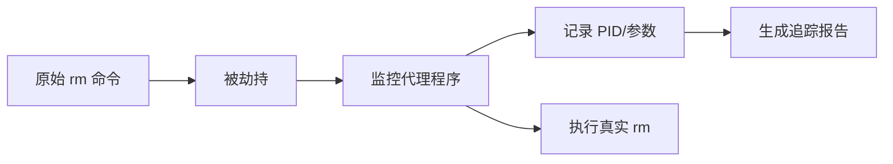
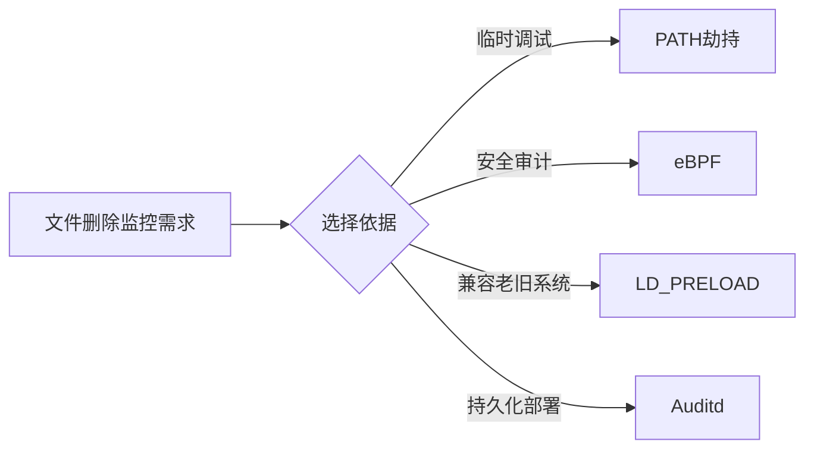

什么是hook，在计算机的各个领域都会听到这个名词，但是国内翻译为钩子，让第一次接触这个概念的人感觉到困惑，所以这里问问什么是 LLM。并配合自己的例子。


## 


## hook in QNX 


在系统编程领域，**Hook（钩子）** 的本质是 **劫持控制流**。针对您使用的 `ln -sP` 方案，其技术本质和实现逻辑如下：



### 一、Hook 的精准定义（以您案例为基准）
| **术语**     | **技术本质**             | **QNX 实现方案**             |
| ------------ | ------------------------ | ---------------------------- |
| **Hook**     | 劫持系统对目标程序的调用 | `ln -sP` 创建硬链接代理      |
| **监控代理** | 伪装成原程序的中转层     | 自研程序替换 `/proc/boot/rm` |
| **劫持点**   | Shell 命令解析阶段       | PATH 查找优先级劫持          |

### 二、QNX 特有的 Hook 流程
1. **创建监控代理**（C程序示例）
```c
// monitor_rm.c
#include <stdio.h>
#include <unistd.h>

int main(int argc, char** argv) {
    FILE *log = fopen("/tmp/rm_hook.log", "a");
    // 记录调用者信息 (关键!)
    fprintf(log, "Caller PID=%d, PPID=%d, Cmd:", getpid(), getppid());
    for(int i=0; i<argc; i++) 
        fprintf(log, " %s", argv[i]);
    fclose(log);
    
    // 执行真实命令
    execv("/proc/boot/real_rm", argv); 
    return 0;
}
```

2. **部署 Hook**（QNX 命令序列）
```bash
# 备份原始命令
mv /proc/boot/rm /proc/boot/real_rm

# 创建监控代理 (关键!)
gcc -o monitor_rm monitor_rm.c
ln -sP /proc/boot/monitor_rm /proc/boot/rm  # QNX魔法在这里
```

3. **触发监控**（当用户执行 `rm` 时）
```bash
$ rm /data/logs/*.log
# 实际执行链：
# shell -> /proc/boot/rm (代理) -> 记录信息 -> /proc/boot/real_rm
```

### 三、技术优势解析
| **特性** | **传统 Hook (LD_PRELOAD)** | **QNX ln -sP 方案** |
| -------- | -------------------------- | ------------------- |
| 劫持阶段 | 运行时动态链接             | 命令查找阶段        |
| 系统影响 | 需注入进程                 | 无进程注入          |
| 隐蔽性   | 易被检测                   | 文件系统级透明替换  |
| 目标范围 | 仅限动态链接程序           | 所有可执行文件      |

有点像之前了解到的动态程序分析；都是attach运行的状态，动态监测每一个状态，只不过这里会进一步改变状态机原本运行的轨迹，也就是 LLM 说到的**劫持控制流**


### 四、简历建议表述

> **动态劫持追踪技术**：
> 利用 QNX 特有的 `ln -sP` 文件系统劫持机制，将系统命令透明替换为监控代理：  
>
> 1. 代理程序捕获调用者 **PID/PPID 及完整命令行参数**  
> 2. 通过 `pidin -f family` 逆向构建进程树  
> 3. 定位到硬件服务库异常触发删除操作  
> **价值**：解决系统初始化阶段日志丢失问题，提升硬件诊断可靠性  

### 五、为什么不是“挂钩”？
中文“挂钩”易误解为 **辅助性连接**，但实际您实现的是：
- **完全劫持**（控制流重定向）
- **透明替换**（文件系统层伪装）
- **信息窃取**（参数/PID提取）

更精准的术语应是：**“系统命令劫持”** 或 **“透明调用链拦截”**，直击技术本质。


## Linux 对比

在 Linux 上实现类似效果需要**组合技术方案**，但无法完全复现 QNX `ln -sP` 的简洁性。以下是 Linux 下的等效方案对比：

```mermaid
graph TD
    A[目标：劫持系统命令调用] --> B{Linux 实现方案}
    B --> C[PATH 环境变量劫持]
    B --> D[动态链接器劫持 (LD_PRELOAD)]
    B --> E[文件系统层劫持 (FUSE/OverlayFS)]
    B --> F[内核模块劫持 (kprobes)]
```

### 一、最接近方案：PATH 环境变量劫持
```bash
# 1. 创建代理脚本
echo '#!/bin/bash
echo "Caller PID=$$ PPID=$PPID Cmd: $0 $@" >> /tmp/hook.log
/bin/real_rm "$@"
' > /usr/local/bin/rm

# 2. 提升路径优先级
export PATH="/usr/local/bin:$PATH"  # 关键：使代理路径优先于 /bin

# 3. 测试效果
rm testfile  # 触发日志记录
```
**特性对比**：
| **能力**     | QNX ln -sP     | Linux PATH 劫持  |
| ------------ | -------------- | ---------------- |
| 透明性       | 全系统生效     | 仅当前Shell生效  |
| 持久性       | 文件系统级永久 | 依赖环境变量     |
| 劫持范围     | 所有用户       | 仅配置PATH的用户 |
| 需要root权限 | 是             | 否               |

---

### 二、进阶方案对比
#### 1. 动态链接器劫持 (LD_PRELOAD)
```c
// hook_rm.c
#define _GNU_SOURCE
#include <dlfcn.h>
#include <stdio.h>

int remove(const char *pathname) {
    FILE *log = fopen("/tmp/hook.log", "a");
    fprintf(log, "PID=%d deleted: %s\n", getpid(), pathname);
    fclose(log);
    
    // 调用原始函数
    int (*real_remove)(const char*) = dlsym(RTLD_NEXT, "remove");
    return real_remove(pathname);
}
```
```bash
# 编译 & 使用
gcc -shared -fPIC -o libhook.so hook_rm.c -ldl
LD_PRELOAD=./libhook.so rm testfile  # 仅劫持动态链接程序
```
**局限**：
- 只对动态链接程序有效
- 无法劫持静态编译的 `busybox rm`

#### 2. eBPF 内核级劫持 (需 Linux 4.17+)
```c
// 使用 bpftrace 追踪 unlink 系统调用
bpftrace -e 'tracepoint:syscalls:sys_enter_unlinkat {
    printf("PID %d deleting: %s\n", pid, str(args->pathname));
}'
```
**优势**：
- 全系统范围监控
- 零修改目标程序
- 可捕获所有文件删除操作

**缺点**：
- 需要 root 权限
- 内核版本限制

---

### 三、生产环境推荐方案


#### 企业级方案：Auditd 子系统
```bash
# 1. 添加监控规则
auditctl -w /var/log/ -p wa -k critical_logs

# 2. 查询日志
ausearch -k critical_logs -i
```
**输出示例**：
```
type=PROCTITLE msg=audit(2023-01-01 12:00:00:000) : proctitle=rm -rf /var/log/app.log
type=PATH msg=... : item=0 name=/var/log/app.log inode=12345 dev=08:01 mode=file 
type=SYSCALL msg=... : pid=6789 uid=0 exe=/bin/rm
```
**核心优势**：
- 原生支持进程树追踪 (`pidin -f family` 等效)
- 完整记录：UID/PID/PPID/命令行/退出码
- 内核级实现，无法被绕过

---

### 四、技术本质总结
| **系统** | **核心机制**    | **技术本质**             |
| -------- | --------------- | ------------------------ |
| QNX      | `ln -sP`        | **文件系统层硬链接劫持** |
| Linux    | PATH/LD_PRELOAD | **运行时环境劫持**       |
| Linux    | eBPF/Auditd     | **内核事件监控**         |

> 因此简历建议表述：  
> **跨平台命令劫持溯源能力**：  
> - QNX端：利用 `ln -sP` 实现**文件系统级透明劫持**，捕获完整进程树  
> - Linux端：通过 **eBPF/Auditd 实现内核级操作监控**，等效定位恶意调用链  
> **价值**：解决系统初始化阶段日志丢失问题，方案具备跨平台迁移能力  


## LD_PRELOAD

