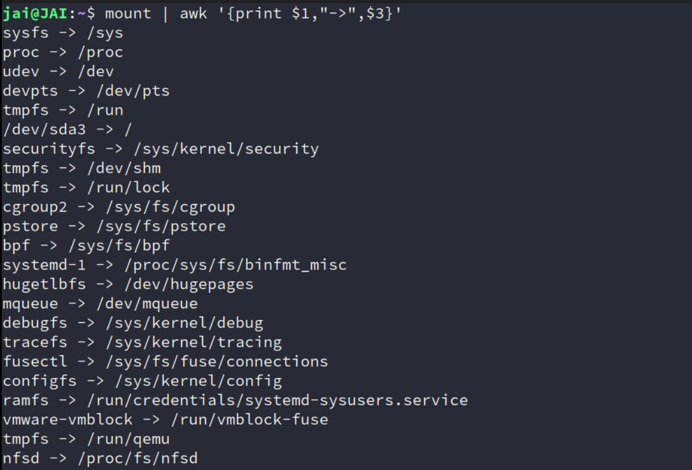

## Introduction

由于一直对文件系统的挂载这一概念迷迷糊糊，所以简单总结，但没想到总结完后一问 DeepSeek，给出了一些很厉害的回答！


## concept

mount 我一开始的理解为：**操作系统** 使我们能够通过 文件系统 来访问 存储设备（磁盘、网络共享、`ramdisk`）中的文件和目录。

但抽象点说，它的本质就是 **将任意存储后端（物理或虚拟）绑定到目录树的逻辑接入点**。

**无论存储后端是物理磁盘、内存、内核数据结构，甚至是网络服务，只要它能以文件系统接口呈现，均可挂载到目录树。**

所以：**挂载 = 建立存储后端与目录的映射关系**

| 角色             | 物理设备挂载示例        | 虚拟文件系统挂载示例                |
| :--------------- | :---------------------- | :---------------------------------- |
| **存储后端**     | `/dev/sda1`（硬盘分区） | `tmpfs`（内存）、`proc`（内核数据） |
| **挂载点**       | `/mnt/disk`（空目录）   | `/proc`（空目录）                   |
| **文件系统类型** | `ext4`、`ntfs`          | `tmpfs`、`proc`                     |
| **数据来源**     | 磁盘扇区                | 内存、内核运行时状态                |

可能还是有点抽象，借助例子来说：

1. **物理设备挂载**（明确对应硬件）

    ```bash
    sudo mount -t ext4 -o async /dev/mmcblk0p1 /mnt/sdcard
    ```

    - **存储后端**：物理存在的 SD 卡控制器 `/dev/mmcblk0p1`

    - **文件系统**：已预先格式化为 `ext4` 的磁盘分区

    - **挂载行为**：将磁盘分区的数据通过 `ext4` 驱动映射到 `/mnt/sdcard` 目录

    - **操作结果**：访问 `/mnt/sdcard` 即访问 SD 卡内容

        可能这个就是我们内心所想的意思，但又不知道怎么表述出来，这个地方就是挂载点了！

        具体描述：将物理设备（如 SD 卡）的分区 `/dev/mmcblk0p1` 挂载到指定的目录 `/mnt/sdcard`，使该分区的数据通过 `ext4` 文件系统可被访问。通过访问 `/mnt/sdcard`，我们就可以直接操作 SD 卡的内容。

2. **虚拟文件系统挂载**（无物理设备）

    ```c
    sudo mount -t tmpfs -o size=512M tmpfs /mnt/ramdisk
    ```

    - **存储后端**：内核动态分配的内存区域（`tmpfs` 驱动管理）
    - **文件系统**：挂载时自动创建内存中的文件系统结构
    - **挂载行为**：将内存区域模拟为块设备并绑定到 `/mnt/ramdisk`
    - **操作结果**：访问该目录即操作内存空间

3. **内核数据挂载**（无存储介质）

    ```bash
    mount -t proc none /proc
    ```

    - **存储后端**：`none`（占位符，实际数据来自内核 `/proc` 子系统）
    - **文件系统**：`proc` 驱动将内核进程信息转换为文件形式
    - **挂载行为**：建立内核数据结构到 `/proc` 的映射
    - **操作结果**：读取 `/proc/cpuinfo` 等文件即读取内核实时数据

具体再对比一下，大概就有印象了！

| 概念               | 物理设备挂载                 | 虚拟文件系统挂载             |
| :----------------- | :--------------------------- | :--------------------------- |
| **存储后端存在性** | 必须存在 `/dev/xxx` 设备节点 | 无需物理设备，由内核驱动提供 |
| **数据持久性**     | 断电保留                     | 内存挂载：数据易失           |
| **挂载参数意义**   | `-t` 指定磁盘上文件系统类型  | `-t` 指定内核驱动类型        |
| **设备参数作用**   | 必须指向真实设备路径         | 可填任意值（如 `none`）      |


**底层逻辑**

1. **挂载点目录**
    - 本质是一个空目录（这里建议新建，否则原有内容会被覆盖隐藏，就像老师上课的例子）
    - 挂载后成为访问存储后端的“入口”（类似门牌号指向具体房间）
2. **文件系统驱动**
    - 物理设备：需对应磁盘分区的实际格式（如 `ext4`）
    - 虚拟文件系统：由内核模块动态生成数据结构（如 `tmpfs`）
3. **设备参数的特殊性**
    - 对虚拟文件系统，设备参数无实际意义（填 `none` 或任意字符串均可）
    - 对物理设备，必须准确指向设备路径（如 `/dev/sda1`）


## More examples

1. **挂载SD卡/eMMC分区**

    ```bash
    # 查看设备识别符（假设SD卡为 /dev/mmcblk0p1）
    lsblk
    # 挂载到 /mnt/sdcard（ext4格式，启用异步写入）
    sudo mount -t ext4 -o async /dev/mmcblk0p1 /mnt/sdcard
    ```

    **底层原理**：

    - 内核通过MMC/SD子系统识别设备，生成`/dev/mmcblk*`节点。
    - `ext4`驱动解析超级块（superblock），建立目录树与物理块的映射。

------

2. **挂载网络文件系统（NFS）**

    ```bash
    # 挂载远程服务器的NFS共享到本地
    sudo mount -t nfs -o vers=4 192.168.1.100:/data /mnt/nfs
    ```

    **网络协议栈流程**：

    1. 客户端通过RPC与NFS服务器协商协议版本。
    2. 服务器导出`/data`目录的句柄（file handle）。
    3. 本地VFS将远程目录透明映射到`/mnt/nfs`。

----

3. **挂载内存文件系统（tmpfs）**

    ```bash
    # 创建高性能临时存储（大小限制为512MB）
    sudo mount -t tmpfs -o size=512M tmpfs /mnt/ramdisk
    ```

    **内核机制**：

    - `tmpfs`利用虚拟内存（VM）子系统，数据存储在RAM+Swap中。
    - 适用于高频读写临时文件（如浏览器缓存）。

------

4. **挂载ISO镜像文件**

    ```bash
    # 使用loop设备挂载ISO镜像
    sudo mount -t iso9660 -o loop ubuntu-22.04.iso /mnt/iso
    ```

    **设备虚拟化**：

    - `loop`设备驱动将文件模拟为块设备，实现镜像内容的透明访问。

------

5. **重新挂载为只读（防止数据损坏）**

    ```bash
    # 运行时切换为只读模式（用于系统维护）
    sudo mount -o remount,ro /
    ```

    **应用场景**：

    - 系统升级时保护根文件系统。
    - 嵌入式设备防止异常断电导致文件系统损坏。

------

6. **挂载OverlayFS（容器基础）**

    ```
    # 联合挂载实现分层文件系统
    mount -t overlay overlay -o lowerdir=/base,upperdir=/changes,workdir=/work /merged
    ```

    **容器技术依赖**：

    - Docker/容器依赖OverlayFS实现镜像层与可写层的合并。


## More practice

### **实验一：观察挂载信息**

```bash
# 查看所有挂载点及其后端
mount | awk '{print $1,"->",$3}'
```



如果对上面的内容还有兴趣，比如，各种 file system 都是什么，继续问问 `DeepSeek` 吧！


### **实验二：挂载点与物理设备解耦**

```bash
# 将同一物理设备挂载到多个目录
sudo mkdir -p /mnt/disk1 /mnt/disk2
sudo mount /dev/sda1 /mnt/disk1
sudo mount /dev/sda1 /mnt/disk2
```

```bash
# 挂载分区，假设时 都是ext4
sudo mount -t ext4 /dev/sda1 /mnt/disk1
sudo mount -t ext4 /dev/sda1 /mnt/disk2

# 验证挂载结果
df -h
```

```bash
# 测试写操作同步
echo "This is a test file" | sudo tee /mnt/disk1/test.txt
ls /mnt/disk2
cat /mnt/disk2/test.txt

# 进一步验证
echo "Modified content" | sudo tee /mnt/disk2/test.txt
```

```bash
# 卸载分区
sudo umount /mnt/disk1
sudo umount /mnt/disk2
```

- 结果：通过 `/mnt/disk1` 和 `/mnt/disk2` 访问相同数据（写操作会同步）


### 实验三：覆盖挂载

```bash
mkdir -p /mnt/test && echo "Original" | sudo tee /mnt/test/file
sudo mount -t tmpfs tmpfs /mnt/test
ls /mnt/test  # 此时看到的是 tmpfs 空内容
sudo umount /mnt/test
ls /mnt/test  # 恢复原有 file 文件
```


## **Underlying implementation and usage** 

按照我的性格，我还是想探究一下 Linux 底层相关的技术。

### **VFS（Virtual File System）抽象层**

- **核心作用**：
    统一各类文件系统接口（ext4、NFS、proc等），提供`open()`、`read()`等标准系统调用。

- **数据结构**：

    ```c
    struct super_block  // 文件系统超级块信息
    struct inode       // 文件元数据（权限、大小等）
    struct dentry      // 目录项缓存（加速路径解析）
    ```


### **挂载表管理**

- **查看当前挂载信息**：

    ```bash
    cat /proc/mounts    # 内核态挂载记录
    mount | column -t   # 用户态格式化输出
    ```

- **持久化配置**：
    通过`/etc/fstab`定义启动时自动挂载项：

    ```bash
    # 示例：开机自动挂载UUID=1234的ext4分区到/data
    UUID=1234 /data ext4 defaults 0 2
    ```


## History

当然，按照习惯，也想简单看看这方面的历史呀。

#### **1. Unix传统（1970s）**

- **原始挂载逻辑**：
    早期Unix系统仅支持本地磁盘挂载，`mount`命令直接操作内核数据结构。
- **设计约束**：
    单用户模式下手动挂载，无自动化管理。

#### **2. Linux革新（1990s-）**

- **动态设备管理**：
    udev守护进程自动创建`/dev`节点，支持热插拔（如USB设备即插即用）。
- **文件系统多样性**：
    支持超过100种文件系统，包括网络（NFS）、虚拟（procfs）、集群（GFS2）等。

#### **3. 现代趋势**

- **命名空间隔离**：
    容器技术通过`mount namespace`实现挂载点隔离（`unshare -m`）。
- **用户态文件系统**：
    FUSE（Filesystem in Userspace）允许非特权用户开发文件系统（如SSHFS）


## Basic Summary

**物理设备挂载**：将磁盘/USB等存储介质的文件系统接入目录树（必须指定设备路径）

- **虚拟文件系统挂载**：通过内核驱动在内存或运行时数据中创建文件系统（无需物理设备）
- **挂载点**：仅仅是数据访问的入口，其内容由挂载的存储后端决定
- **`mount` 命令的核心作用**：建立存储后端（无论物理或虚拟）与目录的映射关系，**与是否创建文件系统无关**（文件系统可能已存在或由内核动态生成）。


## Debug 

### **挂载失败常见原因**

| **错误现象**                     | **排查命令**          | **解决方案**                    |      |
| :------------------------------- | :-------------------- | :------------------------------ | ---- |
| `mount: unknown filesystem type` | `lsmod | grep <类型>` | 加载内核模块（`modprobe ext4`） |      |
| `mount: permission denied`       | `ls -l /dev/sda1`     | 调整权限或使用`sudo`            |      |
| `mount: wrong fs type`           | `blkid /dev/sda1`     | 格式化或指定正确`-t`类型        |      |


### **高级调试工具**

- **跟踪系统调用**：

    ```bash
    strace mount -t ext4 /dev/sda1 /mnt
    ```

    > 又是 `strace`！这个工具真的时很好用！

- **内核调试日志**：

    ```bash
    dmesg | tail -20  # 查看设备识别和挂载错误
    ```


### 成为专家

1. **理解VFS架构**：
    阅读《Linux Kernel Development》中文件系统章节。

2. **动手实验**：

    - 在QEMU虚拟机中添加虚拟磁盘并练习挂载：

        ```bash
        qemu-img create disk.img 1G
        mkfs.ext4 disk.img
        sudo mount -o loop disk.img /mnt
        ```

3. **源码分析**：
    研究Linux内核源码中`fs/namespace.c`（挂载逻辑实现）。

4. **性能调优**：
    对比不同挂载选项（如`noatime` vs `relatime`）对I/O的影响：

    ```bash
    # 使用fio进行基准测试
    fio --name=test --filename=/mnt/testfile --size=1G --rw=randrw
    ```


## Real example from DeepSeek

#### **1. 项目背景**
- **设备类型**：工业控制网关  
- **硬件配置**：  
  - SoC：NXP i.MX8M Plus  
  - 存储：eMMC 32GB（存放Bootloader、内核、根文件系统）  
  - 外部接口：双千兆以太网、RS485、CAN总线  
- **软件架构**：  
  - Bootloader：U-Boot 2022.04  
  - 内核：Linux 5.15 LTS（带实时补丁）  
  - 根文件系统：Yocto构建的只读SquashFS + OverlayFS可写层  
  - 关键服务：Modbus TCP协议栈、OPC UA服务器  

---

#### **2. 问题现象**
- **现场报告**：  
  某批次设备在工厂部署后，约5%的设备启动时出现以下错误：  
  
  ```bash
  [    3.215876] VFS: Cannot open root device "mmcblk2p2" (错误号-19): 未知的块设备
  [    3.223451] 请附加正确的"root="启动选项
  [    3.227912] Kernel panic - not syncing: VFS: Unable to mount root fs on unknown-block(179,2)
  ```
- **故障特征**：  
  - 仅特定产线设备出现  
  - 重启后问题依旧  
  - 无法进入救援模式  

---

#### **3. 企业级排查流程**
##### **阶段1：现场数据采集（Field Data Collection）**
- **收集项目**：  
  ```bash
  # 1. 导出内核启动日志
  dmesg > /mnt/logs/dmesg_failure.log
  
  # 2. 存储设备信息（需拆机连接调试串口）
  mmc extcsd read /dev/mmcblk2 > emmc_extcsd.txt
  lsblk -o NAME,SIZE,FSTYPE,MOUNTPOINT > block_devices.txt
  
  # 3. U-Boot环境变量备份
  fw_printenv > uboot_env.txt
  ```

##### **阶段2：实验室复现与深度分析**
- **硬件检测**：  
  - 使用示波器检测eMMC的CLK/DATA信号完整性  
  - eMMC供电电压测试（标准应为3.3V±5%）  
  - **发现异常**：故障设备eMMC VCCQ电压为1.6V（低于要求的1.8V）  

- **软件分析**：  
  - **文件系统完整性检查**：  
    ```bash
    # 通过JTAG导出eMMC镜像
    dd if=/dev/mmcblk2 of=emmc_dump.img bs=1M
    # 挂载并检查分区
    sudo mount -o loop,offset=$((512*2048)) emmc_dump.img /mnt/emmc
    fsck.ext4 -n /mnt/emmc/rootfs  # 返回"Superblock invalid"错误
    ```
  - **内核驱动调试**：  
    ```bash
    # 启用MMC子系统调试日志
    echo 0xffff > /sys/module/mmc_core/parameters/debug
    dmesg | grep mmc
    # 输出显示多次CMD8超时
    ```

##### **阶段3：根因定位（Root Cause Analysis）**
- **综合结论**：  
  1. **硬件缺陷**：某批次eMMC芯片的VCCQ LDO（低压差稳压器）存在制造偏差，导致电压不稳。  
  2. **软件容错不足**：内核MMC驱动未正确处理电压协商失败，引发文件系统超级块损坏。  

---

#### **4. 企业级解决方案**
##### **硬件层修复**
- **供应链管理**：  
  - 对问题批次eMMC供应商启动8D报告流程  
  - 增加eMMC上电时序测试项（使用ATE自动化测试设备）  

##### **软件层加固**
- **内核驱动增强**：  
  ```c
  // drivers/mmc/core/mmc.c 修改示例
  static int mmc_init_card(...) {
      // 增加电压容限检测
      if (ocr & (RANGE_ERROR | VOLTAGE_ERROR)) {
          pr_warn("MMC voltage negotiation failed, retrying...");
          msleep(100);
          return -ETIMEDOUT;  // 触发U-Boot重试机制
      }
  }
  ```
- **文件系统冗余设计**：  
  - 在eMMC中存储两份Superblock备份：  
    ```bash
    mkfs.ext4 -O sparse_super,^resize_inode -b 4096 -N 4 /dev/mmcblk2p2
    ```

##### **现场应急措施**
- **OTA热修复脚本**：  
  ```bash
  #!/bin/bash
  # 检查Superblock备份并恢复
  backup_superblock="/dev/mmcblk2p2:32768"
  if ! dumpe2fs /dev/mmcblk2p2 | grep "Backup superblock"; then
      e2fsck -b $backup_superblock -y /dev/mmcblk2p2
      reboot
  fi
  ```

---

#### **5. 企业级质量保障体系**
##### **自动化测试流水线**
- **新增测试用例**：  
  | **测试类型**     | **测试工具**    | **验证目标**                   |
  | ---------------- | --------------- | ------------------------------ |
  | 电源扰动测试     | Chroma 33612    | 验证1.8V±10%波动下的eMMC稳定性 |
  | 文件系统异常注入 | fault-inject.ko | 模拟Superblock损坏后的恢复能力 |
  | 长时压力测试     | fio + watchdog  | 72小时连续写入后检查数据完整性 |

##### **运维监控增强**
- **内核实时监控**：  
  ```c
  // 添加eMMC健康状态监控
  static void mmc_health_monitor(struct work_struct *work) {
      struct mmc_host *host = container_of(work, struct mmc_host, monitor_work);
      u32 life_time = mmc_get_speed_class(host);
      if (life_time > WEAR_OUT_THRESHOLD) {
          syslog(LOG_ALERT, "eMMC寿命预警: 已消耗%d%%耐久度", life_time);
      }
  }
  ```

---

#### **6. 经验总结与行业启示**
- **硬件/软件协同设计**：  
  - 嵌入式存储子系统需通过DFMEA（设计失效模式分析）识别单点故障  
  - 关键参数（如电压、时序）应纳入生产端自动化测试  

- **企业级代码规范**：  
  ```python
  # 示例：存储操作必须包含重试和日志
  def write_config(data):
      retries = 3
      while retries > 0:
          try:
              with open("/cfg/settings.json", "w") as f:
                  f.write(data)
                  os.fsync(f.fileno())  # 确保数据落盘
                  break
          except IOError as e:
              logging.error(f"写入配置失败: {e}, 剩余重试次数{retries-1}")
              retries -= 1
              time.sleep(0.5)
  ```

- **成本与可靠性平衡**：  
  
  | **方案**           | **成本** | **可靠性** | **适用场景**     |
  | ------------------ | -------- | ---------- | ---------------- |
  | 单eMMC存储         | 低       | 中         | 消费级设备       |
  | eMMC+SPI NOR双备份 | 中       | 高         | 工业控制器       |
  | eMMC+SSD RAID1     | 高       | 极高       | 数据中心边缘节点 |

---

通过此案例，可深刻理解企业级嵌入式Linux项目中：  
1. **跨团队协作**：硬件工程师、驱动开发者、QA团队需紧密配合  
2. **全生命周期管理**：从设计、生产到现场维护均需系统化方案  
3. **防御性编程**：存储子系统必须预设故障恢复路径  


## Reference

- [Mount (computing) - Wikipedia](https://en.wikipedia.org/wiki/Mount_(computing))
- 《Operating Systems Three Easy Piece》—— (Remzi Arpaci)
