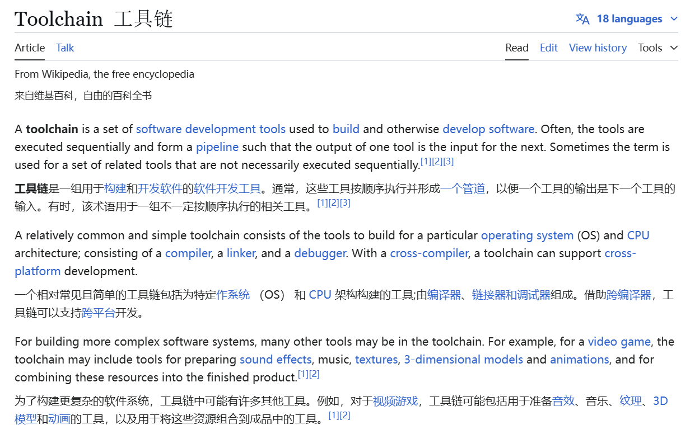
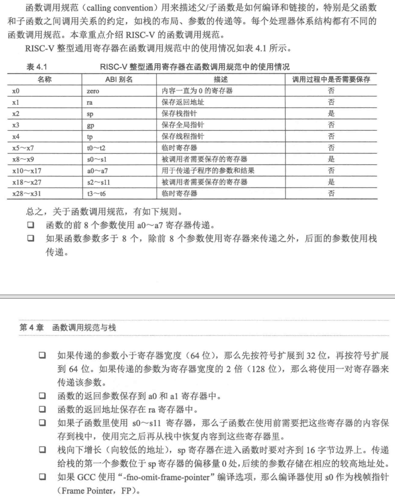

## Introduction

Toolchain 工具链这个词大家应该都听过很多遍了，最常听说的就是，你现在在别的x64的平台上，你要编译别的 ISA 的程序需要交叉编译工具链......

但是好像大家都对这个概念没什么特别的印象？我自己在学的时候对这个东西也是很困惑，这么多种：`arm-linux-gnueabi-gcc`、`riscv64-unknown-elf-gcc`、`riscv64-unknown-linux-gnu-gcc` 等等，选哪个？怎么选？

所以，我这里简单总结一下，因为我的经验还不是很多，所以下面难免会有错误的！


## Toolchain

不知道是什么，那就 [Toolchain - Wikipedia](https://en.wikipedia.org/wiki/Toolchain)



或许对这些概念，很困惑，但我们只需要知道，工具链就是一组软件开发工具集合即可。

特别常见的一种工具链就是为 APP 和 OS 和 CPU 进行构建！我理解的功能**是将源代码转换为目标平台的可执行程序**，核心组件有：

- **编译器（Compiler）**：如 `gcc`，将源代码翻译为目标平台的机器码。
- **链接器（Linker）**：如 `ld`，将多个目标文件合并为可执行文件或库。
- **调试器（Debugger）**：如 `gdb`，用于调试程序。
- **二进制工具（Binutils）**：如 `objdump`、`strip`，处理目标文件和可执行文件。
- **C 标准库（C Library）**：如 `glibc` 或 `newlib`，提供标准函数实现（如 `printf`）。

这里不解释相关编译体系、ISA 的内容，但需要知道**同样的 C 代码要运行在 x86、ARM、RISC-V 上，是需要不同的二进制文件的**，要编译出不同的二进制文件，上面的核心组件也就不同。再回去看到 `arm-xxx-gcc` 和 `riscv64-xxx-gcc`，这个时候就应该有点印象了！


所以，我总结工具链的本质为：**解决代码与硬件/系统环境之间的适配问题**


## cross compiling

### answer from LLM

那交叉编译工具链呢？其实重点就在交叉（cross）上，关注的是跨平台！讲不下去？问问 LLM吧：

在嵌入式开发中，交叉编译工具链是非常重要的一个工具，它主要是为了解决以下问题：

> - 架构不兼容
>
>     **许多嵌入式设备（如单片机、微控制器、专用集成电路等）使用的处理器架构与常见的主机架构（如x86架构的PC）不同。**例如，嵌入式设备可能使用的是ARM、MIPS等架构的处理器。由于不同架构的处理器有不同的指令集和运行环境，因此无法直接在主机上编译出能够在这些嵌入式设备上运行的程序。例如，为ARM架构嵌入式设备开发的应用程序，需要使用针对ARM架构的编译器来生成对应的机器码。
>
> - 资源限制
>
>     **嵌入式设备通常资源有限，不具备运行完整的编译环境的能力。**例如，一个小型的微控制器可能只有几十KB的内存和有限的存储空间，无法安装庞大的操作系统和众多的开发工具。而交叉编译工具链运行在主机上，可以在主机的丰富资源环境下完成代码的编译工作，然后将生成的可执行文件传输到嵌入式设备上运行，这样就避免了在资源有限的嵌入式设备上安装复杂的开发环境。
>
> - 开发效率
>
>     **交叉编译工具链可以在开发主机上快速地进行代码的编译、调试和测试，大大提高了开发效率。**例如，开发人员可以在主机上使用集成开发环境（IDE）编写代码，然后通过交叉编译工具链生成目标代码并下载到嵌入式设备上进行测试和调试，这个过程可以快速迭代，快速发现问题并进行修复，而不需要在嵌入式设备上进行繁琐的编译和调试操作。
>
> - 实践举例
>
>     例如，要为基于ARM架构的树莓派开发一个应用程序。首先需要在安装有Linux操作系统的PC主机上配置好针对ARM架构的交叉编译工具链。然后，开发人员在PC上使用C语言编写代码，通过交叉编译工具链中的arm-linux-gnueabihf-gcc（针对ARM架构的GCC编译器）将其编译成ARM架构的可执行文件。编译完成后，将生成的可执行文件传输到树莓派上运行。在开发过程中，开发人员可以在PC上使用调试器（如gdb）与嵌入式设备进行调试通信，方便地进行断点调试、查看变量值等操作，节省了大量的时间和精力。

AI 其实对于这种事实性的知识点，做得真的是很好的！


### Target Triple

知道了需要这么个概念，那我们先看看现在大家是怎么描述交叉编译工具链的：目标三元组。

`[arch]-[vendor]-[os]-[libc/abi])` 

| 部分         | 含义                           | 常见值示例                  |
| :----------- | :----------------------------- | :-------------------------- |
| **arch**     | 指令集架构（ISA）              | `x86_64`, `arm`, `riscv64`  |
| **vendor**   | 供应商（通常省略或标记为通用） | `unknown`, `none`, `poky`   |
| **os**       | 操作系统及运行时环境           | `linux`, `freebsd`, `none`  |
| **abi/libc** | 应用二进制接口或 C 库类型      | `gnu`, `musl`, `eabi`, `hf` |

一些例子：

```c
|           Target Triple            |    CPU/ISA     | Vendor | Kernel  | C lib |   ABI   |
|------------------------------------|----------------|--------|---------|-------|---------|
| x86_64-linux-gnu                   | x86_64         | -      | Linux   | GNU   | -       |
| arm-cortex_a8-poky-linux-gnueabihf | Cortex A8      | Yocto  | Linux   | GNU   | EABI-HF |
| armeb-unknown-linux-musleabi       | ARM Big Endian | -      | Linux   | musl  | EABI    |
| x86_64-freebsd                     | x86_64         | -      | FreeBSD | -     | -       |
```

以为这些前缀，加上编译器/链接器以及各种`Binutils`，就是常看到的：`triple-gcc`、`triple-objdump`...

但看起来还是知道这些东西区别？`arch`、`vendor` 好理解，关键在于后面的 `os` 和 `abi/libc`，下面具体来说。


### ABI

我觉得以一个 常见的例子来说就好了，不用非得搞一个定义来死磕这个东西是什么。

> ABI 是什么？来自 Wikipedia：
>
> > In [computer software](https://en.wikipedia.org/wiki/Computer_software), an **application binary interface** (**ABI**) is an [interface](https://en.wikipedia.org/wiki/Interface_(computing)) between two binary program modules. Often, one of these modules is a [library](https://en.wikipedia.org/wiki/Library_(computing)) or [operating system](https://en.wikipedia.org/wiki/Operating_system) facility, and the other is a program that is being run by a user.
>
> 即：涉及到机器码层面，两份二进制文件怎么进行交互，而这怎么访问对方的数据内容。

> OSDEV Wiki System V ABI
>
> System V Application Binary Interface (System V ABI) 是一套规范，用于定义符合 X/Open Common Application Environment Specification 和 System V Interface Definition 的系统中的各种技术细节。

> 推荐阅读：[JonathanWakely-What Is An ABI And Why Is It So Complicated.pdf](https://accu.org/conf-docs/PDFs_2015/JonathanWakely-What Is An ABI And Why Is It So Complicated.pdf)

相信大家对于这么些个定义也不是第一次见了，而各个网站说了一堆又十分抽象，做个总结。自己理解的ABI包括最少包括以下内容：

- **Function calling conventions and symbol naming**
- **Representation of data types (size, alignment, floating point format)** 
- **Object file format e.g. ELF, PE/COFF, Mach-O**
- **How programs are loaded, dynamic linking, symbol relocations, thread-local storage**
- **Other: system call、exception**

具体来说我将 ABI 分为三个（配合 System V ABI 举例子）：


#### **generic ABI **

（非arch相关，也理解为 OS 相关）

操作系统作为运行在最底层的软件，向上层提供了各类的基础设施，由于不同操作系统提供的基础设施功能不一样，故需要做出一些规范，提升移植性。具体例子来说（暂且不考虑编程语言）：

- **数据模型/数据表示**：不同操作系统之间或许使用的 data model不同

    比如：**在32位下，Linux和Windows都采用ILP32**，但在**64位下，Linux采用的是LP64，而Windows采用的是LLP64**。

    

    [64-bit computing - Wikipedia](https://en.wikipedia.org/wiki/64-bit_computing#64-bit_data_models)

    [数据模型（LP32 ILP32 LP64 LLP64 ILP64 ](https://www.cnblogs.com/lsgxeva/p/7614856.html)

    [1997_opengroup_64bitprogrammingmodels.pdf](https://wiki.math.ntnu.no/_media/tma4280/2017v/1997_opengroup_64bitprogrammingmodels.pdf)

    > 欸！有点贴近平常学的时候的了，老师直接灌给你的：16/32/64bit的机器上的`int`、`long`、`poniter` 是不同的，但是为啥？咋规定的？还要详细说，肯定是说不完的，但是，之后再看到 ABI，应该就能想起这个例子了！

- **系统调用不一致**

    不同操作系统对系统调用的编码和接口定义不同，导致程序在不同系统上需要重新编写系统调用相关的代码。

    |   功能   | Linux x86_64 调用号 | Windows x86_64 调用号 | FreeBSD x86_64 调用号 |
    | :------: | :-----------------: | :-------------------: | :-------------------: |
    |  写文件  |  `1` (`sys_write`)  |  通过`WriteFile` API  |     `4` (`write`)     |
    | 创建进程 |    `56` (`fork`)    |  通过`CreateProcess`  |     `2` (`fork`)      |
    | 退出进程 |    `60` (`exit`)    |   通过`ExitProcess`   |     `1` (`exit`)      |

    - Linux直接暴露系统调用号（如`sys_write`对应编号1）
    - Windows通过封装API（如`kernel32.dll`的`WriteFile`）隐藏具体调用号
    - FreeBSD的调用号与Linux完全不同，即使功能相同、

    > 能不能再具体一点？再来点例子？

    ```asm
    // Linux直接调用write
    asm("mov $1, %eax\n"  // 系统调用号1
        "mov 1, %edi\n"   // 文件描述符
        "lea msg, %rsi\n" // 缓冲区地址
        "mov 12, %edx\n"  // 字节数
        "syscall");
    
    // Windows必须通过API调用
    HANDLE hFile = CreateFile(...);
    WriteFile(hFile, buffer, 12, NULL, NULL);
    ```

    哦！！这下总该感觉到了吧！

    

- **动态链接库不兼容**

    不同操作系统上的动态链接库格式和加载机制各异，程序无法直接使用其他系统上的库。

    1. **文件格式差异**

        不同操作系统的动态库采用完全不同的二进制格式：

        |    特性    |   Linux (.so)    | Windows (.dll) |   macOS (.dylib)    |
        | :--------: | :--------------: | :------------: | :-----------------: |
        | 文件头标识 | ELF (0x7F 'ELF') |   PE (MZ头)    | Mach-O (0xFEEDFACE) |
        | 符号表结构 |   `.dynsym`节    | `IMAGE_SYMBOL` |     `LC_SYMTAB`     |
        | 重定位机制 |  RELA重定位条目  |  基址重定位表  |   外部重定位命令    |
        |  延迟绑定  | 支持（PLT/GOT）  |       无       |  通过LC_LAZY_LOAD   |

    2. **符号解析机制差异**

        - 动态链接时的符号查找规则截然不同：
    
            | 操作系统 | 符号版本控制  | 默认可见性 |          动态加载API           |
            | :------: | :-----------: | :--------: | :----------------------------: |
            |  Linux   | `.symver`指令 |    隐藏    |        `dlopen`/`dlsym`        |
            | Windows  |      无       | 导出需声明 | `LoadLibrary`/`GetProcAddress` |
            |  macOS   |    弱引用     |    全局    |    `NSLookupSymbolInImage`     |
    
            **Linux符号版本控制示例**：
    
            ```c
            // 定义带版本的符号
            __asm__(".symver foo_v1, foo@VERS_1.0");
            void foo_v1() { /* 实现V1 */ }
            
            __asm__(".symver foo_v2, foo@@VERS_2.0");
            void foo_v2() { /* 实现V2 */ }
        ```
        
        **Windows显式导出要求**：
        
        ```c
            // 需使用__declspec(dllexport)
            __declspec(dllexport) void API_func() {
                // 导出函数实现
            }
        ```
    
        ​    

- **可执行文件格式差异**：

    不同操作系统使用不同的可执行文件格式，如Windows使用PE格式，而Unix-like系统使用ELF格式，导致程序无法跨系统运行。
    
    **ELF与PE对比**：
    
    ```C
    // ELF头结构（Linux）
    typedef struct {
        unsigned char e_ident[16]; // 魔数7F 45 4C 46
        uint16_t e_type;           // ET_DYN = 共享库
        uint32_t e_entry;          // 入口点
        // ... 其他字段
    } Elf64_Ehdr;
    
    // PE头结构（Windows）
    typedef struct _IMAGE_DOS_HEADER {
        uint16_t e_magic;          // MZ
        uint16_t e_cblp;
        // ... 
        uint32_t e_lfanew;         // PE头偏移
    } IMAGE_DOS_HEADER;
    ```
    
    


#### **Processor-Specific ABI**

（arch相关）

操作系统运行在不同体系结构的处理器上，不同体系结构有不同的寄存器及各自的特性。可以理解为 System V generic ABI 作为基类，而不同 ISA 和 arch 有自己的特性，那就由此扩展出更多类。具体配合例子


- **函数调用约定（Calling Convention）**

     1. x86/x64体系

        **System V ABI规范**（Linux/macOS/Unix系OS采用）

        | 参数类型   | 寄存器分配规则                         | 典型汇编示例                    |
        | ---------- | -------------------------------------- | ------------------------------- |
        | 整型参数   | `rdi`、`rsi`、`rdx`、`rcx`、`r8`、`r9` | `mov rdi, 5` 传递第一个整型参数 |
        | 浮点参数   | `xmm0`-`xmm7`                          | `movsd xmm0, [pi]` 传递双精度数 |
        | 栈空间分配 | 调用者维护（caller-cleanup）           | `sub rsp, 32` 分配影子空间      |
        | 返回值     | `rax`/`rdx`（64位）                    | `mov rax, result` 返回计算结果  |

        **Windows x64调用约定差异**：

        ```asm
        ; 传递前4个整型参数：rcx, rdx, r8, r9
        ; 前4个浮点参数：xmm0-xmm3
        mov rcx, 123          ; 第一个整型参数
        movss xmm1, [float_val] ; 第二个浮点参数
        call WinAPI_func
        ```
       
    2. ARM/AArch64体系
    
        **AAPCS标准**（ARM Architecture Procedure Call Standard）
    
        [Calling conventions](https://developer.arm.com/documentation/109246/0100/Toolchains-and-model-support/Calling-conventions)
        
        [Overview of ARM64 ABI conventions | Microsoft Learn](https://learn.microsoft.com/en-us/cpp/build/arm64-windows-abi-conventions?view=msvc-170)
        
        - **ARMv7（32位）特性**：
        
            前4个整型参数：`R0-R3`
        
            浮点参数：`S0-S15`（单精度）或 `D0-D7`（双精度）
        
            栈对齐要求：8字节对齐
        
        - **AArch64（64位）增强**：
        
            ```ASM
            ; 整型参数：X0-X7
            ; 浮点参数：V0-V7
            mov x0, #42          ; 第一个整型参数
            fmov d0, 3.1415      ; 第一个双精度参数
            bl  arm64_func
            ```
        
            
        
    3. RISC-V体系
    
        **动态可配置特性**（通过`-mabi`选项指定）
    
        | ABI类型 | 寄存器使用规则                 | 适用场景       |
        | ------- | ------------------------------ | -------------- |
        | ilp32   | a0-a7传递参数，ra保存返回地址  | 32位嵌入式系统 |
        | lp64    | a0-a7传递参数，浮点使用fa0-fa7 | 64位高性能计算 |
        | ilp32d  | 支持双精度浮点硬件加速         | 带FPU的IoT设备 |
    
        
    
        **RV64G调用示例**：
    
        ```asm
        # 传递参数到a0-a5
        li a0, 100        # 第一个整型参数
        flw fa0, [sp+8]   # 第一个单精度浮点参数
        call riscv_func
        ```
    


- **数据模型**

    | 架构     | 默认数据模型 | 类型长度（位）             | 内存对齐规则             |
    | -------- | ------------ | -------------------------- | ------------------------ |
    | x86_64   | LP64         | int(32), long(64),指针(64) | 自然对齐（最大成员对齐） |
    | ARMv8    | LP64         | 同x86_64                   | 8字节对齐                |
    | RISC-V64 | LP64         | 兼容LP64规范               | 支持非对齐访问指令       |
    | x86      | ILP32        | int(32), long(32),指针(32) | 4字节对齐                |

    ```c
    // 跨平台危险代码示例
    struct Data {
        int id;      // 32位
        long value;  // 32位（ILP32） vs 64位（LP64）
    };
    // ARMv7上sizeof(struct Data)=8字节
    // x86_64上sizeof(struct Data)=16字节
    ```


- **内存布局**

    **RISC-V灵活内存访问**：

    ```asm
    # 支持非对齐加载指令
    lw a0, 0(a1)      # 允许地址非4字节对齐
    # 需要设置MMU的mstatus.UMIE位
    ```

    **ARMv8严格对齐策略**：

    ```asm
    ldr x0, [x1]      # 若x1未8字节对齐则触发Alignment Fault
    ```


- 系统级ABI扩展：向量化

    **x86 AVX-512**：

    ```asm
    ; 使用ZMM寄存器传递512位向量
    vmovdqa64 zmm0, [input_data]
    vpaddd zmm1, zmm0, zmm0
    ```

    **ARM SVE2**（可伸缩向量扩展）：

    ```asm
    ; 向量长度不可知编程
    add z0.s, z1.s, z2.s  // 32位元素加法
    ```


#### **programming language ABI**

这部分就不展开说，网上自行查找资料。


由此，对于 ABI 的概念，或多或少都有些印象，如果还能配合实践一些代码的话（找不到好玩的项目，不如问问神奇的 DeepSeek 吧！）印象就更深了！

再配合看到的一些`abi`：`EABI`、`system V` 的文档，那就更好理解了！


### libc

还有一个概念，那啥叫 libc？

这里我推荐蒋炎岩老师的 OS 课 [C 标准库和实现](https://jyywiki.cn/OS/2024/lect17.md) 已经讲的比较清楚了。

实际就是根据 OS 提供的系统调用再封一层，或者C语言本身的封装的常用的库函数。

#### 计算的封装（与体系结构无关）

> [Freestanding 环境](https://en.cppreference.com/w/cpp/freestanding)下也可以使用的定义

- [stddef.h](https://cplusplus.com/reference/cstddef/) - `size_t`
    - 还有一个有趣的 “offsetof” (Demo; 遍历手册的乐趣)
- [stdint.h](https://cplusplus.com/reference/cstdint/) - `int32_t`, `uint64_t`
- [stdbool.h](https://cplusplus.com/reference/cstdbool/) - `bool`, `true`, `false`
- [float.h](https://cplusplus.com/reference/cfloat/)
- [limits.h](https://cplusplus.com/reference/climits/)
- [stdarg.h](https://cplusplus.com/reference/cstdarg/)
- [inttypes.h](https://cplusplus.com/reference/cinttypes/)
    - 打印 intptr_t 变量 printf 的格式字符串是什么？
- [string.h](https://cplusplus.com/reference/cstring/): 字符串/数组操作
    - memcpy, memmove, strcpy, ...
- [stdlib.h](https://cplusplus.com/reference/cstdlib/): 常用功能
    - rand, abort, atexit, system, atoi, ...
    - 看起来就不像是人用的


#### 系统调用与环境的抽象

最重要的例子就是：**Standard I/O: [stdio.h](https://www.cplusplus.com/reference/cstdio/)**

- `FILE *` 背后其实是一个文件描述符

- 我们可以用 `gdb` 查看具体的 `FILE *`

    - 例如 `stdout`

- 封装了文件描述符上的系统调用 (fseek, fgetpos, ftell, feof, ...)

    这些都是不同的 OS 向上提供的！


#### summary

想想看，自己是不是实现过 `printf` 这个函数？

在嵌入式 bare-metal 中，我们要将字符打印到屏幕/OLED/串口助手上 是怎么做的？重定向？直接操作硬件？

还有在 PA 上，`putchar` 是不是就直接操作我们的模拟器提供的硬件？

那现在，有了 OS 封装硬件操作（`write、read、open...`）

那是不是得用 OS 的了？为了安全！

那不同的 arch 和不同 OS ，对这些操作都有不一样的限制喔，那也就有不一样的封装喔！

针对这些不一样的封装，就有不同的 `libc` 实现了（这个时候，就可以问问 LLM 了！）：

> 以下是几种常见的 C 标准库（libc）的特点、场景及对比：
>
> **glibc**
>
> - **标准和兼容性**：遵循 ISO C 和 POSIX 标准，确保在不同系统和平台上的兼容性和可移植性。
> - **丰富的函数库**：提供大量的函数，包括数学函数、字符串处理函数、时间处理函数、文件 I/O 函数等，满足各种编程需求。
> - **线程安全**：支持多线程环境下的并发操作。
> - **本地化支持**：支持多种语言和文化习惯，能够处理不同语言的字符编码和排序规则。
>
> - **场景**：适用于大多数常见的 Linux 系统级开发任务，是 GNU/Linux 操作系统的重要组成部分，几乎被所有其他的运行库所依赖。
>
> **uClibc**
>
> - **占用空间小**：相比其他标准库，uClibc 具有更小的体积，可以节省系统存储空间的消耗。
> - **运行效率高**：采用了优化的代码和数据结构，能够提高运行效率，降低系统负载。
> - **支持多种处理器体系结构**：可以支持多种不同的处理器体系结构，包括 ARM、MIPS、PowerPC 等。
> - **支持多种编译器**：可以支持多种不同的编译器，包括 GCC、Clang 等。
> - **易于移植**：提供了丰富的 API 接口和工具，可以轻松地进行移植和应用开发。
> - **可定制化**：提供了灵活的选项和配置，可以根据实际需求进行自定义设置，满足不同开发者的需求。
> - **开放源代码**：是一款开源软件，可以免费使用和分发，也可以进行修改和调整。
>
> - **场景**：适用于嵌入式系统和其他有限资源的设备上。
>
> **musl**
>
> - **轻量级**：体积小，占用空间少，适合资源受限的环境。
> - **快速启动**：由于库函数数量相对较少，系统的启动速度更快。
> - **可移植性强**：可以在多种架构上运行，包括 ARM、MIPS 和 x86 等。
> - **安全性高**：提供了更好的安全特性，例如在内存分配等方面有更安全的实现。
>
> - **场景**：适用于嵌入式系统、移动设备和其他对性能有高要求的应用程序，也可以作为 glibc 的替代品在一些特定场景下使用。
>
> **newlib**
>
> - **轻量级**：体积更小，适合在资源受限的环境中运行。
> - **灵活性高**：更新周期相对较短，能够更快地引入新的特性和修复。
> - **遵循标准**：遵循 ISO C 和 POSIX 标准，并提供了一些基本的 C 标准库函数实现。
>
> - **场景**：适用于嵌入式系统、微控制器等资源受限的环境中。
>
> **对比总结**
>
> | 库名称 | 体积大小 | 性能 | 兼容性 | 可配置性 | 安全性 | 更新周期 | 文档支持 |
> | :----: | :------: | :--: | :----: | :------: | :----: | :------: | :------: |
> | glibc  |   较大   | 稳定 |  广泛  |   较弱   |  一般  |   较长   |   丰富   |
> | uClibc |    小    |  高  |  较好  |    强    |  一般  |   较长   |   一般   |
> |  musl  |    小    |  高  |  较好  |    强    |   高   |   较短   |   较少   |
> | newlib |    小    |  高  |  较好  |    强    |  一般  |   较短   |   较少   |
>


所以，C、ABI、OS 这几个话题往往都是会放在一起说的！这个时候再回去看看那些交叉编译工具，是不是就有点理解了？

`riscv64-unknown-linux-gnu-gcc`、`riscv64-buildroot-linux-uclibc-gcc`


> 一些很久之前的笔记，跳过，不想删了
>
> 在 计算机系统基础中，如果是有 OS 的环境，我们知道实际的 `printf` 依赖于 OS 向 lib 提供的系统调用 `write, brk` 等系统调用，而系统调用是 OS 、app/user 之间的接口，为的就是user能够操作一些硬件设备，具体到 `printf` 就是我们的终端。
>
> 但我们也弄过嵌入式，那个时候也用到了`printf`，但是我们做的是串口重定向的操作。
>
> 所以，并不是在有 OS 的环境下才能用 C 库，在 bare-meatal 下我们依旧能够使用，只不过是说我们需要自己做一部分的操作来直接控制硬件，就像 `printf` 和串口重定向；更有甚者，使用直接操作硬件的方式实现I/O操作，而不依赖于标准库中的文件流操作函数，当然工作量稍大，应该没人这么做？
>
> 所以，在裸机环境下，同样也是有他人实现好的 C 运行库：Newlib。它旨在为没有操作系统支持的 bare-metal 环境提供基本的 C 库功能，库中的函数对运行时环境的要求极低，不依赖于操作系统运行，我们不必为了配合 C 库而在 bare-metal 上实现额外的功能。
>
> Newlib 提供了一组“stub”函数，这些函数模拟了系统调用，使得 Newlib 可以在没有操作系统的环境中工作。而 glibc 和 uClibc 都需要依赖于操作系统的底层支持。


## Summary Example

### RISC-V

- **riscv64-unknown-linux-gnu-gcc**：这是一个64位的RISC-V交叉编译工具链，用于编译运行在Linux系统上的应用程序，链接到glibc库。
- **riscv64-unknown-elf-gcc**：这是一个64位的RISC-V交叉编译工具链，用于编译不依赖操作系统的裸机应用程序，链接到newlib库。
- **riscv-none-embed-gcc**：这是为裸机（bare-metal）嵌入式系统而生成的交叉编译工具链，使用newlib或newlib-nano库，能够为嵌入式系统生成更加优化的代码体积。

###  


### ARM

不管是裸机交叉编译工具链**arm-none-eabi**，还是Linux交叉编译工具链**arm-linux-gnueabi**，其实没有本质的区别，工具链都能编译成相应架构的指令、链接生成可执行代码。

> arm-none-eabi默认使用的是**非Linux接口的C库**，适合于裸机开发，无法开发基于Linux的应用程序。
>
> arm-linux-gnueabi默认使用的是**Linux接口的C库**，适合于Linux应用程序开发。

> 通常情况下，我们如果用C语言开发，**如果重新实现C库往往不现实**，需要交叉编译工具链支持标准C库。
>
> 对于arm交叉编译工具链，一般会支持三个最基本的库(静态库为例)：libgcc.a、 libc.a、 libm.a。
>
> SofTool.CN Notes:
> **libgcc.a** ： 在编译gcc时产生，提供平台相关的底层运行库，大多数用于目标处理器的算术运算。如对于arm9，不支持硬件除法，硬件浮点，代码中任何除法、浮点相关操作都应该去链接libgcc.a，由libgcc.a提供除法、浮点操作的软件模拟实现。但对于支持硬件除法、硬件浮点的cortex-a架构cpu，无需libgcc.a提供软实现，编译器直接生成除法或浮点指令，处理速度是软实现远远不及的。
> **libc.a** ： C语言标准函数库
> **libm.a** ： 数学处理库

**用于裸机开发以及用于Linux应用开发的Arm交叉编译工具链实质是一样的，只不过采用库的策略差异。**理论上只要用裸机开发的交叉编译工具链编译一个**基于某个Linux内核头的C库(如: glibc)**，那么就可以实现Linux应用程序的编程。同样，Linux应用开发的交叉编译工具链只要再编译一个**基于裸机开发的C库(如: newlib)**，即可实现标准的裸机编程，与windows下mdk、iar等裸机开发无异。


- **arm-linux-gcc**：这是一个较老的命名方式，用于编译运行在ARM架构上的Linux系统应用程序。它通常链接到glibc库。
- **arm-linux-gnueabi-gcc**：这个编译器用于编译运行在ARM架构上的Linux系统应用程序，适用于任何CPU型号，链接到GNU EABI库。
- **arm-linux-gnueabihf-gcc**：与`arm-linux-gnueabi-gcc`类似，但默认使用hard浮点ABI，适用于有FPU的ARM架构。
- **arm-none-eabi-gcc**：用于编译不依赖操作系统的ARM架构应用程序，通常用于裸机环境，链接 newlib 等。
- **arm-none-linux-gnueabi-gcc**：用于编译运行在ARM架构上的Linux系统应用程序，适用于任何CPU型号，链接到GNU EABI库。


arm-none-eabi-gcc 一般适用用于 Arm Cortex-M/Cortex-R 平台，它使用的是 newlib 库。

arm-linux-gnueabi-gcc 和 aarch64-linux-gnu-gcc 适用于 Arm Cortex-A 系列芯片，前者针对 32 位芯片，后者针对 64 位芯片，它使用的是 glibc 库。可以用来编译 u-boot、linux kernel 以及应用程序。

另外需要补充一点的是，32 位的 Arm 和 64 位的 Arm，它们的指令集是不同的，所以需要使用不同的工具链。当然，Arm64 为了保证前向兼容，提供了一个 32 位的兼容模式，所以我们用 arm-linux-gnueabi-gcc 编译的应用程序也是可以直接在Arm64 的系统上运行的，但是 Linux Kernel 和 U-Boot 就不行，除非你提前把 CPU 切换到 32 位模式。曾经有个项目使用了一颗四核的 Arm64 芯片，但是内存只有64M，为了节省空间，在 CPU 运行到 U-Boot 之前，我们就把它切到了 32 位模式，后面的 U-Boot、Linux Kernel，应用全部都用 32 位编译，加上 Thumb 指令集，节省了不少空间。。[一次搞定 Arm Linux 交叉编译](https://segmentfault.com/a/1190000020955640)


## Principle of cross-compilation (optional)

比较复杂，感觉我也不太想写，直接看！

[A master guide to Linux cross compiling](https://ruvi-d.medium.com/a-master-guide-to-linux-cross-compiling-b894bf909386)

[How to Build a GCC Cross-Compiler](https://preshing.com/20141119/how-to-build-a-gcc-cross-compiler/)

[Anatomy of Cross-Compilation Toolchains](https://www.youtube.com/watch?v=Pbt330zuNPc)

[【技术杂谈】C编译体系](https://www.bilibili.com/video/BV1J14y1D7Sw/?spm_id_from=333.337.search-card.all.click&vd_source=ecc99d78ae961113010161a48a475a35)


## Use & Experience

[A master guide to Linux cross compiling](https://ruvi-d.medium.com/a-master-guide-to-linux-cross-compiling-b894bf909386)

[工具链：一个恐怖的故事。看似... |作者 Ruvinda Dhambarage |中等 --- Toolchains: A horror story. Real world examples of how a seemingly… | by Ruvinda Dhambarage | Medium](https://ruvi-d.medium.com/toolchains-a-horror-story-bef1ef522292)

