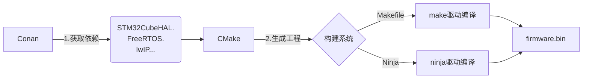

## CMake、Conan、Makefile

在构建系统生态中，CMake、Conan 和 Makefile 属于不同层级的工具，它们解决的问题和定位有显著差异。以下是嵌入式开发者视角的深度解析：

---

### **核心定位对比**
| 工具     | 类别           | 核心功能                                          | 嵌入式领域关键作用                                 |
| -------- | -------------- | ------------------------------------------------- | -------------------------------------------------- |
| Makefile | 底层构建执行器 | 定义源文件编译规则、依赖关系和链接指令            | 直接驱动编译器（gcc/arm-none-eabi）生成固件        |
| CMake    | 构建系统生成器 | 跨平台生成 Makefile/Ninja/VS 等工程文件           | 解决跨平台编译问题（如 Linux/X86 与 ARM 交叉编译） |
| Conan    | 依赖管理工具   | 自动化获取、编译和集成第三方库（HAL 库、RTOS 等） | 管理碎片化的嵌入式 SDK 和硬件依赖                  |

---

### **核心差异详解**
#### 1. **Makefile：构建流程的“汇编语言”**
   • 本质：文本文件（如 `Makefile`），用 `make` 命令解析

   • 嵌入式典型操作：

     ```makefile
     CC = arm-none-eabi-gcc
     TARGET = firmware.elf
     OBJS = startup.o main.o
     
     $(TARGET): $(OBJS)
         $(CC) -o $@ $^ -mcpu=cortex-m4 -T link.ld
     
     %.o: %.c
         $(CC) -c $< -Os -I./Drivers/STM32F4xx_HAL_Driver/Inc
     ```
   • 痛点：需手动编写所有依赖关系，移植到新平台（如换编译器）需重写


#### 2. **CMake：构建系统的“高级语言”**
   • 核心思想：编写声明式的 `CMakeLists.txt`，生成底层构建文件

   • 嵌入式关键能力：

     ```cmake
     cmake_minimum_required(VERSION 3.20)
     project(STM32F4_Firmware C)
     
     # 交叉编译工具链配置
     set(CMAKE_C_COMPILER arm-none-eabi-gcc)
     set(CMAKE_SYSTEM_NAME Generic)  # 裸机目标
     
     # 添加芯片特定文件
     add_library(stm32_hal STATIC 
         Drivers/STM32F4xx_HAL_Driver/Src/stm32f4xx_hal_gpio.c
         Drivers/CMSIS/Device/ST/STM32F4xx/Source/Templates/system_stm32f4xx.c
     )
     
     # 可执行文件生成
     add_executable(firmware.elf 
         main.c 
         startup_stm32f407xx.s  # 汇编启动文件
     )
     target_link_libraries(firmware.elf stm32_hal -T${CMAKE_SOURCE_DIR}/link.ld)
     ```
   • 价值：同一份脚本可在 Windows/Linux/macOS 上生成针对不同硬件的工程


#### 3. **Conan：依赖管理的“生态连接器”**
   • 核心概念：通过 `conanfile.py` 定义依赖，从中央仓库（ConanCenter）或私有仓库获取预编译库

   • 嵌入式典型场景：自动集成芯片厂商库（如 STM32CubeHAL）

     ```python
     from conans import ConanFile, CMake
    
     class FirmwareRecipe(ConanFile):
         settings = "os", "compiler", "arch"  # e.g. arch=armv7ehf
         requires = "stm32cubef4/1.26.1@vendor/stable"  # 预配置的HAL库
         generators = "cmake"  # 为CMake生成依赖配置
         
         def build(self):
             cmake = CMake(self)
             cmake.configure()  # 自动注入HAL库路径
             cmake.build()
     ```
   • 关键优势：

     ◦ 避免手动下载/配置 HAL 库、RTOS 源码（如 FreeRTOS、Zephyr）
    
     ◦ 管理不同芯片型号的 SDK 版本冲突（如 F4 与 F7 的 HAL 库共存）


---

### **嵌入式开发中的协作关系**


#### **典型工作流**
1. 依赖安装：`conan install . --profile=arm-cortex-m4`
2. 生成构建系统：`cmake -G "Unix Makefiles" -DCMAKE_TOOLCHAIN_FILE=arm-gcc.cmake ..`
3. 编译固件：`make -j4`

---

### **为何三者缺一不可？（嵌入式视角）**
1. Makefile 的不可替代性：
   • 直接控制编译器参数（如 `-mcpu=cortex-m55`）、链接脚本（`.ld` 文件）

   • 烧录工具链调用（如 OpenOCD 命令集成到 `make flash`）


2. CMake 的核心价值：
   • 统一管理 X86 测试机与 ARM 目标机的构建

   • 集成静态分析工具（如 `clang-tidy` 检查 MISRA C 规则）


3. Conan 的革命性意义：
   • 解决嵌入式开发的“依赖地狱”：

     ◦ 不同硬件平台（TI/ST/NXP）的 SDK 并存

     ◦ 确保 CI 服务器自动获取正确的库版本

   • 支持交叉编译依赖库（如为 ARM 编译 protobuf）


---

### **替代方案与生态扩展**
| 工具类型   | Makefile 替代   | CMake 替代                  | Conan 替代       |
| ---------- | --------------- | --------------------------- | ---------------- |
| 主流方案   | Ninja（更快速） | Meson, Bazel                | vcpkg, CPM.cmake |
| 嵌入式专用 | Arm Mbed CLI    | Zephyr/ESP-IDF 自带构建系统 | Yocto 的 recipe  |

> 📌 嵌入式现实建议：
> - 资源受限设备：CMake + Makefile（轻量级）
> - 复杂系统（如Linux BSP）：CMake + Ninja + Conan（高性能与高复用）
> - 快节奏原型开发：平台专用构建系统（如STM32CubeIDE自动生成Makefile） + Conan管理核心算法库

三者共同构成了现代嵌入式构建的金三角：Conan 管理依赖 → CMake 组织工程 → Makefile/Ninja 驱动编译链。理解其分层协作逻辑，是构建高效嵌入式CI/CD管道的基础。

