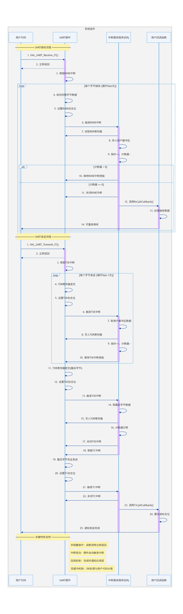

## Introduciton

中断这个概念都说了很多次了。

欸，有个比较有意思的地方，中断是怎么被配置的？？怎么对应到哪个IO口上的？？MCU core或者Soc 内部是怎么做的？

TODO


## ISR要短？

在嵌入式MCU和SoC驱动开发中，要求中断服务程序（ISR）尽量简短的核心原因在于**平衡实时性、系统可靠性和性能开销**。以下是关键点的分层次解析：

---

### 1. **中断屏蔽与优先级抢占的博弈**
   - **中断嵌套的局限性**：  
     即使系统支持中断嵌套，高优先级中断可以抢占低优先级中断，但**同优先级中断通常会被屏蔽**。若ISR执行时间过长，会导致：
     - 同优先级或低优先级的中断无法及时响应，可能丢失关键事件（如传感器数据）。
     - 高优先级中断虽可抢占，但频繁抢占会加剧堆栈压力（需多次保存上下文）。
   - **裸机系统的致命问题**：  
     在无操作系统的场景下，ISR通常全程关闭中断（或仅允许更高优先级中断）。若ISR耗时过长，**所有低优先级中断和主循环任务会被完全冻结**，破坏系统实时性。

---

### 2. **上下文切换开销的误区**
   - **操作系统的上下文切换**：  
     在RTOS中，中断可能触发任务调度（如通过信号量唤醒任务），此时上下文切换的开销确实存在。但**ISR本身的执行时间越长，任务调度延迟越高**，反而得不偿失。
   - **裸机的“伪上下文切换”**：  
     即使没有OS，中断仍需保存/恢复CPU寄存器（硬件自动完成）。若ISR极短（如仅设置标志位），保存/恢复的周期可能小于主循环轮询开销。但对于高频中断（如1MHz的GPIO），**必须通过硬件优化（如DMA）减少中断次数**，而非依赖延长ISR。

---

### 3. **资源竞争与系统可维护性**
   - **共享资源的锁定时长**：  
     ISR与主循环共享的变量或外设若被长时间占用，会增大竞态风险。例如：
     ```c
     // 错误示例：ISR中直接处理复杂逻辑
     void UART_ISR() {
         while (UART_RX_NOT_EMPTY) {
             process_data(UART_READ()); // 耗时操作阻塞其他中断
         }
     }
     ```
     正确做法是ISR仅读取数据到缓冲区，主循环处理实际逻辑。
   - **代码可测试性与调试**：  
     冗长的ISR难以测试和维护，且可能引入不可预测的时序问题（如死锁）。

---

### 4. **性能优化的权衡策略**
   - **高频中断场景的应对**：  
     - **硬件加速**：使用DMA传输数据，将中断频率从“每字节一次”降为“整块数据完成一次”。
     - **中断合并**：配置外设在多个事件后触发中断（如UART接收FIFO满）。
   - **低延迟需求的妥协**：  
     若必须长耗时操作（如实时控制算法），可设计为：
     ```c
     void MotorControl_ISR() {
         read_sensors();
         if (needs_complex_calculation) {
             trigger_low_priority_software_interrupt(); // 交由低优先级ISR或任务处理
         }
     }
     ```

---

### 结论：短中断的实质是“最小化关键路径”
   - **核心原则**：ISR应仅完成**不可延迟的最小操作**（如清除中断标志、读写硬件寄存器、设置事件标志），其余逻辑移交主循环或低优先级任务。
   - **数据对比**：  
     - 假设ISR执行100周期，主循环处理1000周期，中断频率1kHz：  
       - 短ISR：CPU占用率 = (100 + 1000) * 1000 / 1e6 (假设100MHz) = 1.1%。  
       - 长ISR（合并操作）：若ISR直接处理需1100周期，则占用率 = 1100 * 1000 / 1e6 = 1.1%——看似相同，但主循环完全停滞，实时任务无法响应。
   - **最终取舍**：短中断牺牲局部性能，换取系统级实时性和可靠性，这是嵌入式系统的典型设计哲学。


## 进一步

> 也就是说，哪怕在裸机下，没有OS，也会存在并发问题？就是中断和主循环同时访问全局变量？？具体例子来看看这个并发问题？？？
>
> 还有，这个是怎么计算出来的？？
> 假设ISR执行100周期，主循环处理1000周期，中断频率1kHz：
>
> 短ISR：CPU占用率 = (100 + 1000) * 1000 / 1e6 (假设100MHz) = 1.1%。
>
> 长ISR（合并操作）：若ISR直接处理需1100周期，则占用率 = 1100 * 1000 / 1e6 = 1.1%——看似相同，但主循环完全停滞，实时任务无法响应。
> 为什么这个除以这个？
>
> 能够给一个值，来具体看看什么时候应该用到DMA来应对高频中断？具体怎么才算高频中断！？？？每多少时间触发一次？？？这个时间又是怎么算出来的？？
> （等等，我似乎弄混了中断程序时间的长短和中断频率的高低！！！）

### 回答分步解析：

---

### **1. 裸机系统中的并发问题：中断与主循环的竞态条件**
即使在裸机系统中（无OS），**中断和主循环的执行是异步的**，因此共享资源（如全局变量）的访问可能引发竞态条件。以下是一个具体示例：

#### **场景：主循环和中断同时操作全局变量**
```c
volatile uint32_t counter = 0; // 全局计数器

// 主循环中的操作
void main_loop() {
    while (1) {
        counter++; // 主循环不断累加计数器
    }
}

// 定时器中断服务程序（假设每1ms触发一次）
void TIMER_ISR() {
    counter = 0; // 中断中定期清零计数器
}
```

#### **问题分析：**
- **竞态条件**：当主循环正在执行 `counter++`（可能分解为多条汇编指令：读取→修改→写回）时，若中断恰好在此过程中触发并执行 `counter = 0`，会导致最终 `counter` 的值被错误覆盖。
- **实际后果**：假设 `counter++` 的汇编为：
  ```asm
  LDR R0, [counter]  ; 读取counter到寄存器
  ADD R0, R0, #1     ; 加1
  STR R0, [counter]  ; 写回内存
  ```
  若中断在 `LDR` 和 `STR` 之间发生，`counter` 会被清零，主循环的 `ADD` 操作将基于旧值，导致 `counter` 实际值小于预期。

#### **解决方案：**
- **原子操作**：通过关闭中断保护关键代码段：
  ```c
  void main_loop() {
      while (1) {
          __disable_irq();  // 关闭中断
          counter++;
          __enable_irq();   // 重新开启中断
      }
  }
  ```
- **硬件原子指令**：如果MCU支持（如ARM的LDREX/STREX），可直接使用原子操作。

---

### **2. CPU占用率计算解析**
#### **公式解释：**
用户提到的计算中，分母是CPU主频（假设100MHz = 1e8 cycles/sec），分子是**每秒消耗的总CPU周期数**，公式为：
\[
\text{CPU占用率} = \frac{(\text{ISR周期数} + \text{主循环处理周期数}) \times \text{中断频率}}{\text{CPU主频}} \times 100\%
\]

#### **示例验证：**
- **短ISR场景**：
  
  - ISR执行周期：100 cycles
  
  - 主循环处理周期：1000 cycles
  
  - 中断频率：1kHz（每秒1000次）
  
  - CPU主频：100MHz（1e8 cycles/sec）
    $$
    \text{总周期/秒} = (100 + 1000) \times 1000 = 1,100,000 \, \text{cycles}
    $$
  
    $$
    \text{CPU占用率} = \frac{1,100,000}{1e8} \times 100\% = 1.1\%
    $$
  
- **长ISR场景**：
  
  - ISR直接处理所有逻辑：1100 cycles
  
  - 主循环无法执行（被中断阻塞）
    $$
    \text{总周期/秒} = 1100 \times 1000 = 1,100,000 \, \text{cycles}
    $$
  
    $$
    \text{CPU占用率} = \frac{1,100,000}{1e8} \times 100\% = 1.1\% \, (\text{但主循环完全停滞！})
    $$

#### **核心矛盾：**
- **短ISR**：CPU占用率相同，但主循环仍可运行（处理其他任务）。
- **长ISR**：主循环被阻塞，系统失去响应能力，即使CPU占用率相同。

---

### **3. 何时使用DMA应对高频中断？**
#### **高频中断的定义与判断依据**
高频中断的判断需综合考虑 **中断频率** 和 **单次中断处理时间**，目标是避免CPU被中断占用过多周期。具体阈值可通过以下步骤确定：

##### **步骤1：计算单次中断的CPU占用时间**
$$
\text{单次中断占用时间} = \frac{\text{ISR周期数}}{\text{CPU主频}}
$$

例如：
- ISR周期数 = 100 cycles
- CPU主频 = 100MHz → 1 cycle = 10ns
- 单次中断时间 = 100 × 10ns = 1μs

##### **步骤2：计算每秒中断占用的总时间**
$$
\text{总占用时间} = \text{单次中断时间} \times \text{中断频率}
$$

- 若中断频率为1MHz（每秒1e6次）：
  $$
  \text{总占用时间} = 1μs \times 1e6 = 1秒
  $$
  → CPU占用率 = 100%（完全不可行，必须使用DMA）。

##### **步骤3：确定DMA的使用阈值**
- **经验法则**：若中断占用的CPU时间超过总时间的10%~20%，需考虑DMA。

- **数学推导**：
  $$
  假设允许的CPU占用率为 C_{\text{max}}
  $$

  $$
  \text{最大允许中断频率} = \frac{C_{\text{max}} \times \text{CPU主频}}{\text{ISR周期数}}
  $$

  例如：

  - $$
      C_{\text{max}} = 10\%
      $$

  - CPU主频 = 100MHz

  - ISR周期数 = 100 cycles
    $$
    \text{最大中断频率} = \frac{0.1 \times 1e8}{100} = 100,000 \, \text{Hz} = 100\text{kHz}
    $$
    若实际中断频率超过100kHz，必须使用DMA。

#### **DMA的典型应用场景**
- **高速数据传输**：如UART、SPI、I2C接收/发送数据。
- **硬件特性支持**：外设具有DMA请求信号（如FIFO缓冲区满）。
- **示例**：
  - **无DMA**：UART每接收1字节触发一次中断，1Mbps波特率下每秒中断125,000次（假设8N1格式）。
  - **有DMA**：DMA自动接收多个字节，仅在缓冲区满时触发一次中断，中断频率降低至1kHz以下。

---

### **4. 中断处理时间与中断频率的权衡**
#### **高频低耗时 vs 低频高耗时**
- **高频低耗时**（如1MHz中断，每次1 cycle）：
  $$
  \text{CPU占用率} = \frac{1 \times 1e6}{1e8} = 1\% \, (\text{可接受})
  $$
  
- **低频高耗时**（如1kHz中断，每次1000 cycles）：
  $$
  \text{CPU占用率} = \frac{1000 \times 1e3}{1e8} = 1\% \, (\text{可接受，但主循环可能被阻塞})
  $$
  

#### **设计建议**
- **高频中断**：即使单次处理时间短，也需通过DMA或硬件加速减少中断次数。
- **低频中断**：若单次处理时间过长（如 > 总周期的10%），需拆分逻辑，ISR仅标记事件，主循环处理实际任务。

---

### **总结**
- **裸机并发问题**：中断与主循环共享变量需原子操作保护。
- **CPU占用率计算**：关注总周期消耗，而非单一任务的执行时间。
- **DMA使用阈值**：通过中断频率和处理时间计算，通常超过10% CPU占用率时需优化。
- **高频中断定义**：1. 中断频率 > 100kHz；2. 或中断占用CPU时间 > 10%。


## 进一步2

> 有一个问题，中断频率这是怎么算出来的？？？或者说不是算的？？那实际的这个是怎么来的？？
>
> 要是有多个中断，那具体怎么安排处理这个高频中断？？感觉还是挺复杂的？
>
> 那接着，如果使用到了OS，那对于外部的设备，也是需要使用中断的呀，那上面的问题又会变成什么呢？？比如说Linux 的。

### **分步解析与答案：**

---

### **1. 中断频率的来源：硬件决定而非计算**
中断频率**主要由硬件配置或外部事件触发条件决定**，而非通过数学计算得出。以下是常见中断源的频率确定方式：

#### **a. 定时器中断**
- **配置寄存器决定频率**：  
  例如，STM32的定时器通过预分频器（Prescaler）和自动重载值（Auto-Reload Register）计算中断频率：
  $$
  \text{中断频率} = \frac{\text{定时器时钟源}}{\text{(Prescaler + 1)*(AutoReload + 1)}}
  $$
  
  - 假设时钟源为80MHz，Prescaler=79，AutoReload=999：
    $$
    \text{中断频率} = \frac{80\text{MHz}}{(79+1) \times (999+1)} = \frac{80,000,000}{80 \times 1000} = 1\text{kHz}
    $$

#### **b. 外部事件中断**
- **由物理信号触发**：  
  如UART接收数据时，每收到一个字节触发一次中断，中断频率取决于**波特率**：
  $$
  \text{中断频率} = \frac{\text{波特率}}{\text{每帧位数}}
  $$
  
  
  - 波特率115200，8N1格式（每帧10位）：
    $$
    \text{中断频率} = \frac{115200}{10} = 11,520 \, \text{Hz} = 11.52\text{kHz}
    $$
    

#### **c. 传感器中断**
- **由传感器输出信号决定**：  
  如旋转编码器每转一圈产生N个脉冲，中断频率为：
  $$
  \text{中断频率} = \frac{\text{转速（RPM）} \times N}{60}
  $$
  
  - 转速3000 RPM，每转100脉冲：
    $$
    \text{中断频率} = \frac{3000 \times 100}{60} = 5,000 \, \text{Hz} = 5\text{kHz}
    $$
    

---

### **2. 多中断处理策略**
当系统存在多个中断时，需通过**优先级分配、中断合并、硬件优化**等方式管理高频中断。

#### **a. 中断优先级与嵌套**
- **优先级配置**：  
  在MCU中，通过中断控制器（如NVIC）为每个中断分配优先级。高优先级中断可抢占低优先级中断。  
  **示例**：  
  - 高频实时中断（如电机控制PWM）设为最高优先级。
  - 低频非关键中断（如按键检测）设为最低优先级。

- **中断嵌套的风险**：  
  若多个高优先级中断频繁嵌套，可能导致**堆栈溢出**。需限制嵌套深度或使用静态分配的堆栈。

#### **b. 中断合并与批量处理**
- **硬件FIFO与DMA**：  
  例如，UART接收数据时，使用接收FIFO或DMA，将“每字节中断”合并为“缓冲区满中断”，降低中断频率。
  - 原始中断频率：11.52kHz（每字节中断）。
  - 使用16字节FIFO后，中断频率降为：11.52kHz / 16 = 720Hz。

- **软件定时器轮询**：  
  对于低频中断（如温度传感器），可将其转换为定时器中断驱动的轮询，减少中断数量。

#### **c. 高频中断的硬件卸载**
- **专用外设**：
  使用PWM模块生成波形，避免通过中断模拟PWM信号。
- **硬件加速器**：
  如加密、CRC计算等任务交由硬件加速器完成，减少CPU中断负担。

---

### **3. 操作系统（如Linux）中的中断处理**
在OS环境下，中断处理需与内核调度机制协同，引入了新的设计模式和挑战。

#### **a. 上半部（Top Half）与下半部（Bottom Half）**
- **上半部**
  在中断上下文中执行，要求快速完成**关键操作**（如读取寄存器、应答硬件），通常**关闭中断**。
  
  ```c
  // Linux驱动示例：上半部
  irqreturn_t irq_handler(int irq, void *dev_id) {
      struct my_device *dev = dev_id;
      // 1. 读取硬件状态
      dev->status = readl(dev->reg_base + STATUS_REG);
      // 2. 调度下半部
      tasklet_schedule(&dev->bottom_half);
      return IRQ_HANDLED;
  }
  ```
  
- **下半部**：  
  通过**软中断、Tasklet或工作队列**延后处理非实时任务，可休眠和调度。
  ```c
  // Tasklet示例：下半部
  void bottom_half_tasklet(unsigned long data) {
      struct my_device *dev = (struct my_device *)data;
      // 处理数据（可休眠）
      process_data(dev->buffer);
  }
  ```

#### **b. 中断线程化（Threaded IRQs）**
Linux支持将中断处理线程化，减少对实时任务的影响：
- **配置方式**：
  使用 `request_threaded_irq` 注册中断处理函数，分为快速响应和线程化处理两部分。
  
  ```c
  request_threaded_irq(irq, quick_handler, threaded_handler, flags, name, dev);
  ```
  
- **优势**：  
  
  - 线程化部分可调度，避免阻塞其他中断。
  - 支持优先级设置（如实时线程）。

#### **c. 操作系统中的并发问题**
- **用户态与内核态数据共享**：
  需通过 `copy_to_user`/`copy_from_user` 安全传递数据，避免内存越界。
- **内核锁机制**：
  使用自旋锁（`spin_lock`）或互斥锁（`mutex`）保护共享资源，但需注意：
  - **上半部中不能休眠**，只能使用自旋锁。
  - **下半部可休眠**，可使用互斥锁。

#### **d. 实时性挑战**
- **调度延迟**：
  若中断线程优先级低于实时任务，可能导致响应延迟。需设置中断线程为最高实时优先级。
  
  ```bash
  # 设置中断线程优先级（Linux实时策略）
  chrt -f -p 99 <IRQ_thread_PID>
  ```

---

### **总结**
1. **中断频率**由硬件配置或外部事件决定，需通过寄存器、信号特性或物理参数计算。
2. **多中断处理**依赖优先级、硬件优化和任务拆分，高频中断需卸载至DMA或专用外设。
3. **OS中的中断**通过上半部/下半部机制平衡实时性与功能性，但需注意锁和调度策略。


## 中断的一些基础

- 中断嵌套

- 中断延时

- 丢中断

- 缓冲

    > 以HID键盘为例：中断线程化+流缓冲来实现高速IO的响应与IO数据完整性


## basic1

在计算机领域，“中断”这个概念本身**没有参数和返回值**。中断是一种**机制**，是 CPU 响应外部事件（硬件中断）或内部异常/指令（软件中断）而暂停当前执行流，转而执行特定处理程序的过程。

但是，**中断服务程序**（ISR, Interrupt Service Routine）或者说**中断处理函数**，是**可以有参数和返回值**的，但这取决于具体的中断类型、操作系统和编程环境，并且其使用方式与普通函数有显著区别：

1.  **硬件中断处理程序 (ISR):**
    *   **参数：** **通常没有显式的参数传递机制。** CPU 在响应中断时，硬件会自动将关键状态（如程序计数器、标志寄存器等）压入栈中，但这不被视为传递给 ISR 的参数。ISR 需要的信息（如哪个设备引发的中断、中断状态寄存器值）通常通过：
        *   **查询共享数据结构：** 操作系统内核维护的数据结构（如中断向量表、设备状态寄存器）。
        *   **隐式约定：** 某些架构或驱动程序框架可能有约定，将特定寄存器或内存位置用于传递中断源信息。
    *   **返回值：** **通常没有显式的返回值给调用者（即中断机制本身）。** ISR 的主要职责是快速处理事件、清除中断标志、进行必要的数据操作（如将接收到的数据放入缓冲区、更新状态），然后返回。它的“结果”体现在它对系统状态（共享内存、队列、标志位）的修改上。ISR 执行完毕后，CPU 恢复之前被中断的上下文继续执行。
    *   **关键点：** ISR 需要**极其高效**和**可重入**（可能被更高优先级中断打断）。显式的参数传递和返回通常开销过大且复杂，不符合这些要求。

2.  **软件中断 / 系统调用 (通过 `int` 指令或类似机制):**
    *   **参数：** **有明确的参数传递机制。** 用户程序在触发软件中断（如 Linux 的 `int 0x80` 或 `syscall` 指令）之前，会按照操作系统规定的**调用约定**（Calling Convention）将系统调用号（标识要执行哪个服务）和所需的参数放入特定的**寄存器**或**栈**中。
    *   **返回值：** **有明确的返回值机制。** 操作系统内核处理完系统调用后，会按照调用约定将结果（成功/失败、数据、错误码）放入特定的**寄存器**（通常是 EAX/RAX）或**栈**中，供用户程序在中断返回后读取。
    *   **关键点：** 这里的软件中断是**用户态程序主动请求内核服务**的一种方式。参数和返回值的传递遵循清晰定义的 ABI（应用二进制接口），类似于普通函数调用，但跨越了用户态/内核态的边界。

3.  **信号处理程序 (类 Unix 系统中的异步事件通知):**
    *   **参数：** **有一个标准化的参数（信号编号 `signum`）。** 当信号被递送给进程时，操作系统在调用用户注册的信号处理函数时，会传递一个整数参数，表示**是哪个信号**（如 `SIGINT`, `SIGSEGV`）。某些信号（如 `SIGSEGV`, `SIGILL`）可能有额外的上下文信息（通过 `siginfo_t` 结构体和第三个 `ucontext_t` 参数），但这需要特定的设置 (`SA_SIGINFO` 标志)。
    *   **返回值：** **没有显式返回值 (`void`)。** 信号处理函数通过修改全局状态、设置标志位或调用如 `_exit()`、 `longjmp()` 等函数来影响进程行为。
    *   **关键点：** 信号处理函数类似于异步的 ISR，执行时机不确定，需要遵守特定的限制（异步信号安全函数）。

**总结对比：**

| 中断类型/处理程序       | 是否有参数？                 | 是否有返回值？              | 主要目的                               | 参数/返回值传递方式                   |
| :---------------------- | :--------------------------- | :-------------------------- | :------------------------------------- | :------------------------------------ |
| **中断机制本身**        | **❌ 无**                     | **❌ 无**                    | 事件通知，强制切换执行流               | N/A                                   |
| **硬件 ISR**            | **❌ 无显式参数**             | **❌ 无显式返回值**          | 快速响应硬件事件                       | 通过查询寄存器/共享内存获取信息       |
| **软件中断 (系统调用)** | **✅ 有 (系统调用号 + 参数)** | **✅ 有 (结果/错误码)**      | 用户程序请求内核服务                   | 遵循调用约定 (寄存器/栈)              |
| **信号处理程序**        | **✅ 有 (信号编号 `signum`)** | **❌ 无显式返回值 (`void`)** | 处理进程收到的异步事件通知 (如 Ctrl+C) | 操作系统传递信号编号 (可能还有上下文) |

**简单来说：**

*   “中断”这个**事件**本身没有参数和返回值。
*   响应中断而执行的**处理代码（ISR、系统调用处理函数、信号处理函数）** 可以有参数和返回值，但其传递和使用方式**与普通函数调用截然不同**，并且受到严格限制（尤其是硬件 ISR 和信号处理函数）。

如果你在具体的编程或操作系统环境中遇到了“中断”的概念，需要明确是哪种类型的中断，才能确定其处理程序是否有以及如何使用参数和返回值。

 

## STM32 HAL库中断例子

理解 `HAL_UART_Receive_IT()` 和 `HAL_UART_Transmit_IT()` 的关键在于 **非阻塞操作** 和 **中断驱动**。它们不是直接收发数据的函数，而是启动一个由中断驱动的收发过程。让我一步步拆解：

### 1. 核心概念：非阻塞与中断驱动

*   **非阻塞：** 当你调用这些函数时，它们**不会等待**数据传输完成才返回。它们只是告诉UART硬件：“准备好后，开始接收/发送这些数据，完成后用中断通知我”。函数本身会立即返回到你的主程序（或其他代码），让你可以同时做其他事情。
*   **中断驱动：** 数据传输的实际过程（每个字节的发送或接收）是由 **硬件中断** 来管理和推进的。UART硬件在特定事件发生时（比如发送寄存器空了可以放新数据了，或者接收寄存器收到新数据了）会触发中断。中断服务程序会处理这些事件。

### 2. 函数详解

#### `HAL_UART_Receive_IT(UART_HandleTypeDef *huart, uint8_t *pData, uint16_t Size)`

*   **作用：** 启动一个 **非阻塞的接收过程**。
*   **参数：**
    *   `huart`: 指向UART外设句柄的指针（包含配置信息）。
    *   `pData`: 指向 **用户提供的缓冲区** 的指针。接收到的数据将被存放到这里。
    *   `Size`: 你想要接收的 **字节总数**。
*   **内部操作：**
    1.  函数内部会记录你提供的缓冲区地址 (`pData`) 和要接收的总字节数 (`Size`)。
    2.  设置一个内部计数器（通常叫 `RxXferCount`）为 `Size`。
    3.  **关键一步：** 使能UART的 **RXNE (Receive register Not Empty) 中断**。这意味着当UART接收寄存器收到一个字节（不再是空的）时，就会触发中断。
    4.  函数**立即返回** `HAL_OK`（如果参数有效），表示接收过程已启动。此时你的主程序可以继续执行其他任务。
*   **中断触发时机与处理：**
    *   **触发条件：** UART硬件接收到**一个字节**的数据，将其放入接收数据寄存器 (RDR)，并设置 RXNE 标志。
    *   **中断服务程序执行：**
        1.  硬件检测到 RXNE 标志且 RXNE 中断使能，触发 UART 全局中断。
        2.  CPU 跳转到 UART 的 **中断服务程序 (ISR)**，通常是 `USARTx_IRQHandler()`。
        3.  ISR 内部会调用 HAL 库的 `HAL_UART_IRQHandler(&huartX)`。
        4.  `HAL_UART_IRQHandler` 检查中断源。发现是 RXNE 中断，于是：
            *   从 UART 的 RDR 寄存器读取**一个字节**。
            *   将这个字节放入你之前通过 `HAL_UART_Receive_IT` 提供的缓冲区 (`pData`) 的**当前位置**。
            *   递增缓冲区指针 (`pData++`)。
            *   递减内部接收计数器 (`RxXferCount--`)。
            *   检查计数器：如果 `RxXferCount > 0`：
                *   等待下一个字节的到来（RXNE 中断保持使能，过程会重复）。
            *   如果 `RxXferCount == 0`：
                *   **关键一步：** **关闭 RXNE 中断**（因为目标字节数已收到）。
                *   调用 **接收完成回调函数** `HAL_UART_RxCpltCallback(huart)`。
*   **用户需要做什么：**
    *   提供足够大的缓冲区 (`pData`) 来存放 `Size` 个字节。
    *   在代码中 **实现接收完成回调函数** `void HAL_UART_RxCpltCallback(UART_HandleTypeDef *huart)`。这是你知道接收完成并处理数据的地方！在这个函数里，你可以解析收到的数据、置标志位通知主程序、或者启动下一次接收等。
    *   确保全局中断和UART接收中断是使能的（通常在CubeMX生成的初始化代码里已经做了）。

#### `HAL_UART_Transmit_IT(UART_HandleTypeDef *huart, uint8_t *pData, uint16_t Size)`

*   **作用：** 启动一个 **非阻塞的发送过程**。
*   **参数：**
    *   `huart`: 指向UART外设句柄的指针。
    *   `pData`: 指向 **包含待发送数据** 的用户缓冲区的指针。
    *   `Size`: 你想要发送的 **字节总数**。
*   **内部操作：**
    1.  函数内部记录缓冲区地址 (`pData`) 和要发送的总字节数 (`Size`)。
    2.  设置内部发送计数器 (`TxXferCount`) 为 `Size`。
    3.  **关键一步：** 使能UART的 **TXE (Transmit register Empty) 中断**。这意味着当UART发送数据寄存器 (TDR) **空了**（可以放入下一个字节）时，就会触发中断。*(注意：有些UART也可能使用 TC (Transmission Complete) 中断来处理最后一个字节的完成事件，但TXE中断是驱动发送过程的核心)*
    4.  函数**立即返回** `HAL_OK`（如果参数有效），表示发送过程已启动。
*   **中断触发时机与处理：**
    *   **触发条件：** UART硬件将TDR寄存器里的一个字节移入发送移位寄存器，此时TDR**变空**，并设置 TXE 标志。
    *   **中断服务程序执行：**
        1.  硬件检测到 TXE 标志且 TXE 中断使能，触发 UART 全局中断。
        2.  CPU 跳转到 UART 的 ISR (`USARTx_IRQHandler`)。
        3.  ISR 调用 `HAL_UART_IRQHandler(&huartX)`。
        4.  `HAL_UART_IRQHandler` 检查中断源。发现是 TXE 中断，于是：
            *   检查内部发送计数器 (`TxXferCount > 0`？)
            *   如果 `TxXferCount > 0`：
                *   从你之前通过 `HAL_UART_Transmit_IT` 提供的缓冲区 (`pData`) 的**当前位置**取出**一个字节**。
                *   将这个字节写入 UART 的 TDR 寄存器（硬件会自动将其发送出去）。
                *   递增缓冲区指针 (`pData++`)。
                *   递减内部发送计数器 (`TxXferCount--`)。
                *   *(TXE 中断保持使能，当下一个字节导致TDR再次变空时，中断会再次触发，重复此过程)*
            *   如果 `TxXferCount == 0` (所有字节都已放入TDR)：
                *   **关键一步：** **关闭 TXE 中断**（因为没数据要发了）。
                *   **可选但常见：** 使能 **TC (Transmission Complete) 中断**。TC 中断在**最后一个字节**从移位寄存器**完全移出**（包括停止位）时触发。当 TC 中断发生时：
                    *   `HAL_UART_IRQHandler` 检测到 TC 中断。
                    *   关闭 TC 中断。
                    *   调用 **发送完成回调函数** `HAL_UART_TxCpltCallback(huart)`。
*   **用户需要做什么：**
    *   提供包含有效数据的缓冲区 (`pData`)，长度至少为 `Size`。
    *   在代码中 **实现发送完成回调函数** `void HAL_UART_TxCpltCallback(UART_HandleTypeDef *huart)`。这是你知道整个数据块已**物理发送完成**的地方（如果启用了TC中断）。你可以在这里释放缓冲区、启动下一次发送、通知其他任务等。
    *   确保全局中断和UART发送中断(TXE/TC)是使能的。

### 3. 中断触发时机总结

| 函数                   | 启动时使能的中断 | 触发该中断的硬件条件                      | 中断服务程序中的关键动作                                     | 完成时调用的回调函数                     |
| :--------------------- | :--------------- | :---------------------------------------- | :----------------------------------------------------------- | :--------------------------------------- |
| `HAL_UART_Receive_IT`  | **RXNE**         | **接收寄存器非空** (收到一个字节)         | 从RDR读1字节 -> 存入用户缓冲区 -> 计数器减1 -> 若收完则关中断回调 | `HAL_UART_RxCpltCallback`                |
| `HAL_UART_Transmit_IT` | **TXE**          | **发送寄存器变空** (可以放下一个字节了)   | 从用户缓冲区取1字节 -> 写入TDR -> 计数器减1 -> 若发完则关TXE开TC | `HAL_UART_TxCpltCallback` (由TC中断触发) |
|                        | (后续) **TC**    | **发送移位寄存器变空** (最后一个字节发完) | 关TC中断 -> 调用发送完成回调                                 | `HAL_UART_TxCpltCallback`                |

### 4. 何时使用它们？

*   当你需要 **异步操作**，不想让CPU死等UART传输完成时（避免阻塞主循环）。
*   当数据传输需要一定时间（尤其是低速波特率或大数据量），你想让CPU在这段时间处理其他任务时。
*   当你需要 **及时响应** 接收到的数据时（通过RXNE中断和回调）。

### 5. 注意事项

*   **回调函数：** 这是你处理完成事件的核心！**必须在你的用户代码中实现它们**。HAL库提供了弱定义的空函数 `__weak void HAL_UART_xxxCpltCallback(...)`，你需要重写它们。
*   **缓冲区生命周期：** 传递给 `xxx_IT` 函数的缓冲区 (`pData`) 必须在该次传输完成（回调被调用）之前保持有效（通常是全局变量、静态变量或动态分配的内存）。不能在传输过程中释放或覆盖。
*   **中断使能：** 确保在初始化UART时，相应的中断（USART全局中断、RXNE/TXE/TC中断）已经在NVIC（嵌套向量中断控制器）中使能。CubeMX通常会帮你配置好。
*   **重入问题：** 不要在传输/接收尚未完成时（即回调被调用之前）再次调用同一个UART的 `HAL_UART_xxx_IT` 函数来启动新的传输/接收。否则会破坏内部状态（缓冲区指针、计数器）。等待回调完成后再启动下一次。
*   **错误处理：** 同样存在错误回调函数 `HAL_UART_ErrorCallback`，用于处理帧错误、噪声错误、溢出错误等。建议实现它。

### 流程图示意 (以 Receive_IT 为例)

```
+---------------------+      +-----------------------+      +-----------------------+
| Your Main Program   |      | UART Hardware         |      | Interrupt Service    |
|                     |      |                       |      | Routine (ISR) & HAL  |
+----------+----------+      +-----------+-----------+      +-----------+-----------+
           |                             |                            ^ |
           | Call                        |                            | |
           | HAL_UART_Receive_IT(...)    |                            | |
           |---------------------------> |                            | |
           |                             |                            | |
           | (Returns immediately)       | Enable RXNE Interrupt      | |
           | <---------------------------|                            | |
           |                             |                            | |
           | Do other work...            |                            | |
           |                             |                            | |
           |                             | Receive 1 byte -> Set RXNE | |
           |                             |---------------------------> |
           |                             |                            | |
           |                             |                            | Check RXNE Int
           |                             |                            | Read byte from RDR
           |                             |                            | Store byte in *pData
           |                             |                            | pData++, RxXferCount--
           |                             |                            | Is RxXferCount == 0?
           |                             |                            |    | No: Keep RXNE Int on
           |                             |                            |    |     (wait next byte)
           |                             |                            |    |
           |                             |                            |    | Yes: Disable RXNE Int
           |                             |                            |    | Call HAL_UART_RxCpltCallback
           |                             |                            |    |----------------------> (Your Code!)
           |                             |                            | <-------------------------+
           | < - - - - - - - - - - - - - - - - - - - - - - - - - - - - (Callback runs)
           | (Your program is notified)  |                            | |
           |                             |                            | |
```

**简单来说：**

1.  你调用 `Receive_IT` / `Transmit_IT` **启动**过程并**使能中断**。
2.  **硬件**在数据到来(TX空/RX有数据)时**触发中断**。
3.  **中断服务程序** 处理单个字节（存/取），更新指针和计数器。
4.  当**所有字节完成**，中断服务程序**关闭中断**并**调用你的回调函数**通知你。
5.  你的**回调函数**处理完成事件（如处理收到的数据、准备下次发送）。

理解了中断使能、中断触发条件、中断服务程序的动作以及回调函数的角色，就能清晰掌握这两个函数的工作机制了。





