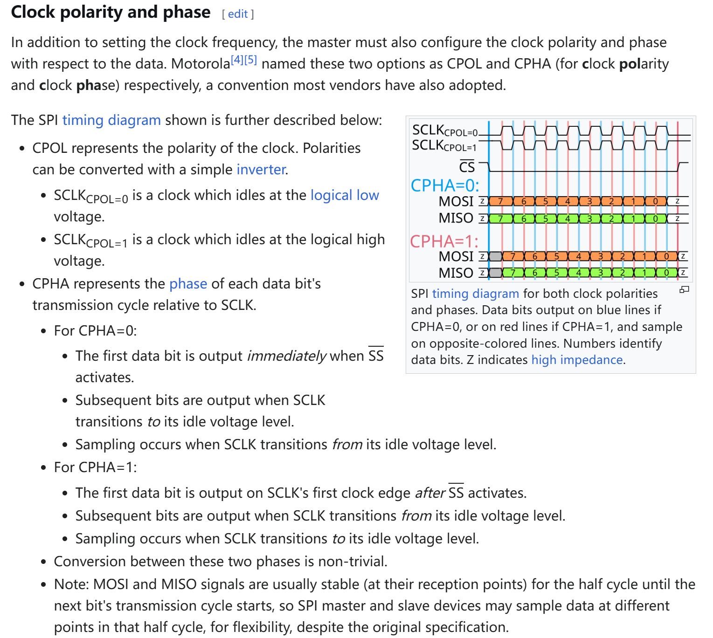

## UART

#### **1.1 核心特性**

- **通信类型**：异步串行通信（无共享时钟）
- **线数**：2 根（TX：发送，RX：接收）
- **拓扑结构**：点对点（1:1 通信）
- **传输方向**：全双工（同时收发）
- **电平标准**：TTL（3.3V/5V）、RS-232（±12V）

#### **1.2 时序特征**

- **帧结构**： 
    **起始位（1bit） + 数据位（5-9bit） + 校验位（可选） + 停止位（1-2bit）** 
    
- **关键参数**：  
    - **波特率（Baud Rate）**：双方需严格一致（如 9600、115200）  
    - **时钟误差容忍度**：通常要求误差 < 3%（依赖数据帧长度）

#### **1.3 硬件层细节**

- **线缆要求**：  
    - 无需时钟线，但需共地（GND）  
    - 长距离需电平转换（如 MAX232 芯片转 RS-232）  
- **冲突检测**：无硬件仲裁机制  
- **典型应用**：  
    - 调试串口（Console）  
    - GPS 模块、蓝牙模块通信  


## I2C

#### **2.1 核心特性**

- **通信类型**：同步半双工（共享时钟）
- **线数**：2 根（SDA：数据线，SCL：时钟线）
- **拓扑结构**：多主多从（总线型，需设备地址）
- **传输速度**：  
    - 标准模式（100 kbps）  
    - 快速模式（400 kbps）  
    - 高速模式（3.4 Mbps）
- **电平标准**：开漏输出（需外接上拉电阻）

#### **2.2 时序特征**

- **帧结构**：  
    **起始条件 + 地址帧（7/10bit） + 读写位 + ACK/NACK + 数据帧 + 停止条件**  

    

- **关键操作**：  

    - **起始条件（Start）**：SCL 高电平时 SDA 从高→低  
    - **停止条件（Stop）**：SCL 高电平时 SDA 从低→高  
    - **ACK/NACK**：第9个时钟周期确认  

#### **2.3 硬件层细节**

- **硬件设计**：  
    - 总线需接上拉电阻（通常 4.7kΩ）  
    - 支持多设备（地址冲突需硬件跳线）  
- **仲裁机制**：基于 SDA 线“线与”特性（低电平优先）  
- **时钟同步**：支持时钟拉伸（Slave 可拉低 SCL）  
- **典型应用**：  
    - 传感器（如 BME280 温湿度传感器）  
    - EEPROM（如 AT24C02）  


## SPI

### **SPI 协议从零详解（超详细保姆级教程）**

----

#### **一、SPI 是什么？**

SPI（Serial Peripheral Interface）是一种**同步、全双工、主从式**的串行通信协议，专门用于短距离高速通信（通常芯片间距离 < 1米）。它的核心特点是：

- **同步**：通信双方共用时钟信号（SCLK）
- **全双工**：可以同时发送和接收数据
- **主从架构**：1个主设备控制总线，多个从设备通过片选信号（CS）连接

类比理解：想象主设备是老师，从设备是学生。老师通过点名（CS信号）选择要提问的学生，然后用统一的铃声（SCLK）控制问答节奏，学生和老师可以同时说话和听讲。

----

#### **二、SPI 的物理连接**

SPI 需要至少 **4 根物理线路**：

| 线名      | 全称                     | 方向                | 作用                                           |
| --------- | ------------------------ | ------------------- | ---------------------------------------------- |
| **SCLK**  | Serial Clock             | 主→从               | 主设备产生的同步时钟信号                       |
| **MOSI**  | Master Out Slave In      | 主→从               | 主设备发送数据，从设备接收数据                 |
| **MISO**  | Master In Slave Out      | 从→主               | 从设备发送数据，主设备接收数据                 |
| **CS/SS** | Chip Select/Slave Select | 主→从（每个从独立） | 主设备通过拉低此线选中特定从设备（类似"点名"） |

**硬件连接示意图**：

```
主设备
┌──────────────┐
│              │     CS1 ───────────────┐
│   SCLK ──────┼───────────SCLK         │
│   MOSI ──────┼───────────MOSI         │
│   MISO ──────┼───────────MISO         │
│              │     CS2 ───────────────┤
└──────────────┘                        │
                                从设备1 从设备2
                                ┌─────┐ ┌─────┐
                                │     │ │     │
                                └─────┘ └─────┘
```

----

#### **三、SPI 时序深度解析**

##### **1. 时钟模式（关键难点！）**



SPI 有 **4 种工作模式**，由两个参数决定：

- **CPOL（Clock Polarity）**：时钟空闲时的电平
    - 0：空闲时 SCLK 为低电平
    - 1：空闲时 SCLK 为高电平
- **CPHA（Clock Phase）**：数据采样时刻
    - 0：在时钟的**第一个边沿**（上升沿或下降沿）采样数据
    - 1：在时钟的**第二个边沿**采样数据

**四种模式对照表**：

| 模式 | CPOL | CPHA | 采样时刻                  | 应用场景     |
| ---- | ---- | ---- | ------------------------- | ------------ |
| 0    | 0    | 0    | 上升沿采样（时钟从低→高） | 大多数传感器 |
| 1    | 0    | 1    | 下降沿采样（时钟从高→低） | 某些存储器   |
| 2    | 1    | 0    | 下降沿采样（时钟从高→低） | 高速 ADC/DAC |
| 3    | 1    | 1    | 上升沿采样（时钟从低→高） | 特殊协议设备 |

**Mode 0 时序图详解**：

```
SCLK   ___     ̄͞ ̄͞ ̄͞ ̄͞ ̄͞ ̄͞ ̄͞ ̄͞     ___ 
       ͞ ¯͞ ¯͞ ¯͞ ¯͞ ¯͞ ¯͞ ¯͞ ¯͞ ¯
       | 1 | 2 | 3 | 4 | 5 | 6 | 7 | 8 |  <- 时钟周期
MOSI   ----[D7]---[D6]---[D5]---[D4]---...
       ___                     ___
MISO   ͞ ¯͞ ¯͞ ¯͞ ¯͞ ¯͞ ¯͞ ¯͞ ¯͞ ¯
```

- 每个时钟周期传输 1 bit 数据（8 个周期传 1 字节）
- 数据在 SCLK 的**上升沿被采样**
- 主从设备在 SCLK 的**下降沿切换数据**

-----

##### **2. 完整通信流程（以 Mode 0 为例）**

1. **片选激活**：主设备拉低目标从设备的 CS 线
2. **时钟启动**：主设备开始产生 SCLK 信号
3. **数据传输**：
    - **主→从**：主设备在 SCLK 下降沿将数据放到 MOSI 线上
    - **从→主**：从设备在 SCLK 下降沿将数据放到 MISO 线上
    - **数据采样**：双方在 SCLK 上升沿读取对方的数据
4. **传输结束**：主设备拉高 CS 线

**关键特点**：

- **全双工优势**：每个时钟周期同时收发 1 bit 数据
- **无地址字段**：完全依赖硬件片选（CS）
- **无确认机制**：假设物理连接可靠

----

#### **四、SPI 的硬件实现细节**

##### **1. 电路设计要点**

- **推挽输出**：SPI 通常采用推挽驱动，无需上拉电阻
- **片选管理**：每个从设备需要独立的 CS 线（N 个从设备需要 N+3 根线）
- **电平匹配**：确保主从设备电压一致（3.3V 与 5V 设备需电平转换）

##### **2. 速度优化技巧**

- **时钟频率**：可达 50MHz+（STM32H7 系列支持 133MHz）
- **DMA 传输**：减少 CPU 参与（适合大数据块传输）
- **双线模式**：关闭 MISO 或 MOSI 实现半双工（节省引脚）

----

#### **五、具体代码**

```cpp
// SPI Mode 0 (CPOL=0, CPHA=0)
SPI_InitTypeDef spi;
spi.Mode = SPI_MODE_MASTER;
spi.Direction = SPI_DIRECTION_2LINES; // 全双工
spi.DataSize = SPI_DATASIZE_8BIT;
spi.CLKPolarity = SPI_POLARITY_LOW;   // CPOL=0
spi.CLKPhase = SPI_PHASE_1EDGE;       // CPHA=0
spi.NSS = SPI_NSS_SOFT;               // 软件控制CS
HAL_SPI_Init(&spi);
```

----

#### **六、SPI 的优缺点**

| **优点**                     | **缺点**                |
| ---------------------------- | ----------------------- |
| 全双工高速传输（理论无限速） | 需要较多物理线路（N+3） |
| 无复杂协议栈（实现简单）     | 无硬件级错误检测        |
| 支持多从设备扩展             | 传输距离短（通常 < 1m） |
| 灵活的时钟模式配置           | 需要严格同步时钟        |

----

#### **七、经典应用场景**

1. **存储器芯片**  
    - Flash 芯片（如 W25Q128）：利用 SPI 高速读取固件
    - SD 卡（SPI 模式）：兼容低引脚数微控制器

2. **显示设备**  
    - OLED 屏幕（SSD1306）：通过 SPI 快速刷新像素
    - TFT 液晶屏：传输图像数据

3. **传感器**  
    - 加速度计（MPU6050）：实时读取运动数据
    - 数字麦克风（MP34DT01）：传输音频流

4. **无线模块**  
    - WiFi 模块（ESP8266）：高速传输网络数据
    - 蓝牙模块（HC-05）：配置参数和传输数据

----

#### **八、学习路线建议**

1. **基础实验**：用 Arduino 控制 SPI Flash 芯片（读写测试）
2. **示波器观测**：捕获 SCLK/MOSI/MISO 波形（理解时序）
3. **协议分析**：使用逻辑分析仪解码 SPI 数据
4. **进阶应用**：实现 DMA 传输优化（如 STM32 CubeMX）
5. **故障排查**：
    - **无响应**：检查 CS 信号是否激活
    - **数据错误**：确认时钟模式是否匹配
    - **信号失真**：缩短线长或降低时钟频率

通过以上系统学习，您将能熟练掌握 SPI 协议的设计与调试！


## UART、I2C、SPI 对比

| **特性**       | **UART**             | **I2C**             | **SPI**                |
| -------------- | -------------------- | ------------------- | ---------------------- |
| **线数**       | 2（TX+RX）           | 2（SDA+SCL）        | 4（SCLK+MOSI+MISO+CS） |
| **传输方向**   | 全双工               | 半双工              | 全双工                 |
| **拓扑结构**   | 点对点               | 总线型（多主多从）  | 星型（一主多从）       |
| **时钟信号**   | 无（异步）           | 同步（SCL）         | 同步（SCLK）           |
| **寻址方式**   | 无（仅点对点）       | 7/10 位设备地址     | 硬件片选（CS）         |
| **速度**       | 低（通常 < 1 Mbps）  | 中（最高 3.4 Mbps） | 高（可达 100+ Mbps）   |
| **硬件复杂度** | 低                   | 中（需上拉电阻）    | 高（多片选线）         |
| **抗干扰能力** | 弱（依赖波特率匹配） | 中（总线电容影响）  | 强（推挽输出）         |
| **典型场景**   | 调试接口、模块间通信 | 传感器、低速设备    | 高速外设、存储器       |


### **选型建议**

- **选择 UART**：  
    - 简单双向通信，无需实时性  
    - 跨平台兼容性要求高（如与 PC 通信）  

- **选择 I2C**：  
    - 多设备共享总线，节省引脚资源  
    - 中低速传感器网络（如温湿度+气压传感器组合）  

- **选择 SPI**：  
    - 高速数据传输（如摄像头图像传输）  
    - 全双工实时控制（如电机驱动+反馈）  


### **高级设计注意事项**

1. **UART 的波特率误差**：  
    - 使用高精度晶振（误差 < 0.1%）  
    - 避免长距离传输（建议 < 1m，或使用 RS-485）  

2. **I2C 的总线电容**：  
    - 总电容需 < 400pF（过长线缆需分段缓冲）  
    - 使用 I2C 电平转换器（如 PCA9306）实现 3.3V/5V 混接  

3. **SPI 的时钟偏移**：  
    - 等长布线（SCLK 与数据线长度差 < 5mm）  
    - 高速模式下使用阻抗匹配（如 50Ω 端接电阻）  

4. **抗干扰设计**：  
    - UART/I2C：使用双绞线 + 屏蔽层  
    - SPI：差分信号（如 SPI 转 LVDS）  

> - **UART**：简单灵活，适合松散耦合的异步通信  
> - **I2C**：引脚高效，适合中低速多设备场景  
> - **SPI**：性能王者，专为高速全双工设计 
>     根据实际需求选择协议，并结合硬件设计与信号完整性优化，可构建稳定可靠的嵌入式通信系统。


