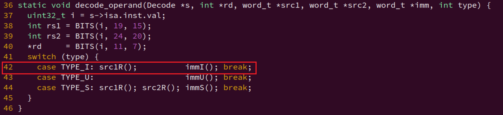

## Linux内核启动流程

这里关注的是 kernel 之后的启动流程。


## 关于上下文切换

配合我的 OS 实现一步步讲解。


理解的核心思想：来中断/异常的时候，我需要保存上下文的状态/寄存器现场，那就需要开辟空间来保存一些内容： OS 或者 am 框架 把一段内存空间初始化成程序（线程/进程）能够运行的上下文，并在中断/异常返回时切换到事先准备的上下文。这就赋予了我们实现 “切换” 的根本机制。

下面讨论更多一些细节。	

首先最简单的，在只有内核空间的的时候，或者说刚开始写的时候，只有内核线程，很自然的，只保存了通用寄存器和一些用到的的胸痛特殊寄存器。 

然后OS现在支持了用户进程，加上处理器应该有内核态和用户态，那保存上下文的的时候，我想到是，那内核应该也和用户空间一样有自己的栈？而不是和用户共用一个栈，因为切换到内核的时候还是会需要保存

所以，我加入了关于内核栈和用户栈的切换（总结内核栈和用户栈切换的逻辑）。

到这里就有点像一个嵌入式操作系统了。

----

但之后，为了学习，我还引入了页表机制，支持虚拟地址和物理地址的转换，那这个时候又会带来了问题：每一个用户进程对应一个内核线程是吗？他们要共用一个页表基址吗？还是说需要一个内核映射？


> 为什么需要内核栈


```C
void protect(AddrSpace *as) {
  PTE *updir = (PTE*)(pgalloc_usr(PGSIZE));                                                                               
  as->ptr = updir;
  as->area = USER_SPACE;
  as->pgsize = PGSIZE;
  // map kernel space
  memcpy(updir, kas.ptr, PGSIZE);
}

```

这是创建用户地址空间的内容。

我还看到这么一段话：

```C
void __am_get_cur_as(Context *c) {
  c->pdir = (vme_enable ? (void *)get_satp() : NULL);
}

void __am_switch(Context *c) {
  if (vme_enable && c->pdir != NULL) {
    set_satp(c->pdir);
  }
}

```

```asm
abstract-machine/am/src/riscv/nemu/trap.S 
#define concat_temp(x, y) x ## y
#define concat(x, y) concat_temp(x, y)
#define MAP(c, f) c(f)

#define PRIV_MODE_U 0
#define PRIV_MODE_S 1
#define PRIV_MODE_M 3

#if __riscv_xlen == 32
#define LOAD  lw
#define STORE sw
#define XLEN  4
#else
#define LOAD  ld
#define STORE sd
#define XLEN  8
#endif

#define REGS_LO16(f) \
      f( 1)       f( 3) f( 4) f( 5) f( 6) f( 7) f( 8) f( 9) \
f(10) f(11) f(12) f(13) f(14) f(15)
#ifndef __riscv_e
#define REGS_HI16(f) \
                                    f(16) f(17) f(18) f(19) \
f(20) f(21) f(22) f(23) f(24) f(25) f(26) f(27) f(28) f(29) \
f(30) f(31)
#define NR_REGS 32
#else
#define REGS_HI16(f)
#define NR_REGS 16
#endif

#define REGS(f) REGS_LO16(f) REGS_HI16(f)

#define PUSH(n) STORE concat(x, n), (n * XLEN)(sp);
#define POP(n)  LOAD  concat(x, n), (n * XLEN)(sp);

#define CONTEXT_SIZE  ((NR_REGS + 3 + 2) * XLEN)
#define OFFSET_SP     ( 2 * XLEN)
#define OFFSET_CAUSE  ((NR_REGS + 0) * XLEN)
#define OFFSET_STATUS ((NR_REGS + 1) * XLEN)
#define OFFSET_EPC    ((NR_REGS + 2) * XLEN)
#define OFFSET_NP     ((NR_REGS + 3) * XLEN)

.align 3
.globl __am_asm_trap
__am_asm_trap:
# switch to kernel stack
  csrrw sp, mscratch, sp   // (1) atomically exchange sp and mscratch
  bnez sp, create_context_space  // (2) take the branch if we trapped from user
  csrrw sp, mscratch, sp   // (3) if we trapped from kernel, restore the original sp
						   // after above 3 inst, sp must be ksp
# notice the conditional statements in assembly.
create_context_space:
  addi sp, sp, -CONTEXT_SIZE
  MAP(REGS, PUSH)
  # 先入栈保存用到的GPR, 也就是进入trap 前的相关寄存器
  # 如果后面save_kernel_context再保存的话，存的就是切换内核栈用到的一些寄存器了。

  # c->np = (ksp == 0) ? KERNEL : USER;
  csrr t0, mscratch
  beqz t0, save_kernel_stack

  csrr t0, mscratch    # exception from user
  li t1, PRIV_MODE_U   # c->np = USER
  j save_kernel_context

save_kernel_stack:
  mv t0, sp			   # exception from kernel
  li t1, PRIV_MODE_M   # c->np = KERNEL
  addi t0, t0, CONTEXT_SIZE

# 我之后要使用这个 sp 和 priv，把它入栈
# 但是又不能影响到要保存的上下文
# 能不能直接用这里的保存的上下文结构里的sp 和 t1？
# 有区别吗？有吧。
# 我切换到内核线程，那这个时候的栈指针应该指向的是内核栈保存的上下文。
# 他里面的各个寄存器应该不一样？
# 要不直接再扩大一下栈空间？
# 不对，一样的，保存之前都进行过同样的操作，应该可以.
# 哦，所以在刚开始保存的时候，就要开栈了。
# 哦，都帮我们写好了这个OFFSET_SP

save_kernel_context:
  # ksp = 0; support re-entry of CTE
  csrw mscratch, zero

  STORE t0, OFFSET_SP(sp) 
  STORE t1, OFFSET_NP(sp)

 csrr t0, mcause
 csrr t1, mstatus
 csrr t2, mepc

 STORE t0, OFFSET_CAUSE(sp)
 STORE t1, OFFSET_STATUS(sp)
 STORE t2, OFFSET_EPC(sp)

  # set mstatus.MPRV to pass difftest
  li a0, (1 << 17)
  or t1, t1, a0
  csrw mstatus, t1

  mv a0, sp
  jal __am_irq_handle
  mv sp, a0

  # c->np != USER
  LOAD t0, OFFSET_NP(sp)
  li t1, PRIV_MODE_U
  bne t0, t1, restore_ksp_ok

  # c->np == USER
  # the value of ksp is the bottom of the kernel stack
  addi t0, sp, CONTEXT_SIZE
  csrw mscratch, t0

restore_ksp_ok:
  LOAD t1, OFFSET_STATUS(sp)
  LOAD t2, OFFSET_EPC(sp)
  csrw mstatus, t1
  csrw mepc, t2

  MAP(REGS, POP)

  # do not forget to restore the sp before entering the CTE
  LOAD sp, OFFSET_SP(sp)
  mret

```

```C
void __am_get_cur_as(Context *c);
void __am_switch(Context *c);

Context* __am_irq_handle(Context *c) {
    __am_get_cur_as(c);

    mcause_t mcause = {.value = c->mcause};
    //printf("mcause: intr: %d code: %d\n", mcause.intr, mcause.code);

    if (user_handler) {
        //printf("in __am_irq_handle,c:%p c->sp:%p\n", c, c->gpr[2]);
        Event ev = {0};
        if (mcause.intr) { // interrupt
            switch (mcause.code) {
            case INTR_M_TIMR:
            case INTR_S_TIMR:
                ev.event = EVENT_IRQ_TIMER; break;
            case INTR_M_EXTN:
            case INTR_S_EXTN:
                ev.event = EVENT_IRQ_IODEV; break;
            case INTR_M_SOFT:
            case INTR_S_SOFT:
                ev.event = EVENT_IRQ_SOFTWARE; break;
            default: ev.event = EVENT_ERROR; break;
            }
        } else { // exception
            switch (mcause.code) {
            case EXCP_U_CALL:
            case EXCP_S_CALL:
            case EXCP_M_CALL:
                if (c->GPR1 == -1) { // YIELD
                    ev.event = EVENT_YIELD;
                } else if (c->GPR1 >= 0 && c->GPR1 <= 19) { 
                    // NR_SYSCALL:20
                    ev.event = EVENT_SYSCALL;
                } else {
                    assert("unknown exception event\n");
                }
            break;
            default: ev.event = EVENT_ERROR; break;
            }
            // Add 4 to the return address of the synchronization exception
            c->mepc += 4;
        }

    c = user_handler(ev, c);
    assert(c != NULL);
  }

  __am_switch(c);
  return c;
}

extern void __am_asm_trap(void);

bool cte_init(Context*(*handler)(Event, Context*)) {
  // initialize exception entry
  asm volatile("csrw mtvec, %0" : : "r"(__am_asm_trap));

  // register event handler
  user_handler = handler;

  return true;
}

Context *kcontext(Area kstack, void (*entry)(void *), void *arg) {
    void *stack_end = kstack.end;
    Context *base = (Context *) ((uint8_t *)stack_end - sizeof(Context));
    // just pass the difftest
    //base->mstatus = 0x1800;
    const mstatus_t mstatus_tmp = {
        .mpie = 1,
        .mie = 0,
        .mpp = PRIV_MODE_M,
    };

    // notice the MPIE will be restored to the MIE in nemu
    //base->mstatus |= (1 << 7); MPIE = 1;
    base->mstatus = mstatus_tmp.value;
    base->pdir = NULL;
    base->np = PRIV_MODE_M;
    base->mepc = (uintptr_t)entry;
    base->gpr[2] = (uintptr_t)kstack.end; // sp
    base->gpr[10] = (uintptr_t)arg; // a0
    return base;
}

Context *ucontext(AddrSpace *as, Area kstack, void *entry) {
    void *stack_end = kstack.end;
    Context *base = (Context *) ((uint8_t *)stack_end - sizeof(Context));
    // just pass the difftest
    //base->mstatus = 0x1800; // MPP bit[12:11] 0b11 = 3
    const mstatus_t mstatus_tmp = {
        .mpie = 1,
        .mie = 0,
        .sum = 1, // read note and manual
        .mxr = 1, // about S-mode, OS will do this, design processor core don't care?
        .mpp = PRIV_MODE_U,
    };
  printf("iset:%d\n", ienabled());
    // notice the MPIE will be restored to the MIE in nemu
    //base->mstatus |= (1 << 7); MPIE = 1;
    base->mstatus = mstatus_tmp.value;
    base->pdir = as->ptr;
    base->np = PRIV_MODE_U;
    base->gpr[2] = (uintptr_t)kstack.end;
    base->mepc = (uintptr_t)entry;
    return base;
}     

```

[RISC-V Linux 上下文切换分析 - 泰晓科技](https://tinylab.org/riscv-context-switch/#:~:text=本文介绍了 RISC-V 架构下 Linux 上下文切换的流程，并着重介绍了 mm_struct 的切换以及寄存器内容的切换 switch_to()，同时带大家了解了,ASID 的设计与实现。 本文主要基于 Linux 5.17 版本代码，讨论在 RISC-V 架构中上下文切换的诸多细节。)


还有可重入的内容。


具体地, 我们希望在CTE恢复进程上下文的时候来切换地址空间. 为此, 我们需要将进程的地址空间描述符指针`as->ptr`加入到上下文中, 框架代码已经实现了这一功能(见`abstract-machine/am/include/arch/$ISA-nemu.h`), 在x86中这一成员为`cr3`, 而在mips32/riscv32中则为`pdir`. 

> 内核映射？
>
> 对于x86和riscv32, 在`protect()`中创建地址空间的时候, 有一处代码用于拷贝内核映射:
>
> ```c
> // map kernel space
> memcpy(updir, kas.ptr, PGSIZE);
> ```
>
> 尝试注释这处代码, 重新编译并运行, 你会看到发生了错误. 请解释为什么会发生这个错误.


为此, 我们需要思考内核线程的调度会对分页机制造成什么样的影响. 内核线程和用户进程最大的不同, 就是它没有用户态的地址空间: 内核线程的代码, 数据和栈都是位于内核的地址空间. 那在启动分页机制之后, 如果`__am_irq_handle()`要返回一个内核线程的现场, 我们是否需要考虑通过`__am_switch()`切换到内核线程的虚拟地址空间呢?

答案是, 不需要. 这是因为AM创建的所有虚拟地址空间都会包含内核映射, 无论在切换之前是位于哪一个虚拟地址空间, 内核线程都可以在这个虚拟地址空间上正确运行. 因此我们只要在`kcontext()`中将上下文的地址空间描述符指针设置为`NULL`, 来进行特殊的标记, 等到将来在`__am_irq_handle()`中调用`__am_switch()`时, 如果发现地址空间描述符指针为`NULL`, 就不进行虚拟地址空间的切换.


为什么分开来叫了，内核线程和用户进程？

是因为内核的地址空间？还是什么原因？


### 前期：


## 调试bug

一切都是状态机

我要看的就是程序的状态，那自然就会引申出如何看？用什么工具？然后用什么指标看（一般就是看状态符不符合要求。。。）


## 存储介质再看启动流程

本文内容对标ARM架构嵌入式系统（如树莓派、i.MX系列）的标准流程。

---

### **一、启动流程阶段分解**
#### **阶段1：BootROM（固化在SoC内部）**
- **加载内容**：  
  - 从**内部Mask ROM**执行初始代码（不可修改）。
  - 加载**外部存储介质（如SPI NOR Flash）**中的第一级Bootloader（如SPL）。

- **核心目的**：  
  - **硬件初始化**：配置SoC的时钟、引脚复用、基本DDR时序。
  - **介质探测**：根据SoC启动引脚电平（Boot Mode），选择从SD卡、eMMC或NOR Flash加载下一阶段代码。
  - **安全验证**：验证SPL的数字签名（Secure Boot场景）。

- **专业设计逻辑**：  
  BootROM固化在硅片中，保证系统上电后**无需外部干预即可找到启动路径**。其代码体积严格受限（通常<64KB），因此只能加载**极小型的引导程序（SPL）**。

---

#### **阶段2：SPL（Secondary Program Loader）**
- **加载内容**：  
  - 从**外部存储（如SD卡、eMMC）**加载完整版Bootloader（如U-Boot）。

- **核心目的**：  
  - **扩展硬件初始化**：完成DDR内存训练、复杂外设（如PCIe/USB）时钟配置。
  - **介质驱动加载**：提供访问eMMC/NAND的驱动程序（BootROM通常仅支持SPI NOR）。
  - **解压与重定位**：若主Bootloader被压缩（如LZMA），SPL负责解压到DDR中。

- **专业设计逻辑**：  
  SPL是BootROM与主Bootloader之间的桥梁。由于BootROM无法直接处理大容量存储（如eMMC），需通过SPL实现**硬件能力扩展**。

---

#### **阶段3：主Bootloader（如U-Boot）**
- **加载内容**：  
  - 从存储介质加载**内核镜像（zImage/uImage）**、**设备树（.dtb）**、**initramfs**到DDR指定地址。

- **核心目的**：  
  - **动态配置**：通过环境变量（`bootcmd`）定义启动参数（如内核命令行参数`console=ttyS0,115200`）。
  - **硬件抽象**：提供统一的存储访问接口（如`fatload mmc 0:1 $kernel_addr_r zImage`）。
  - **安全扩展**：支持内核验签、FIT镜像（Flattened Image Tree）等高级特性。

- **专业设计逻辑**：  
  Bootloader需**平衡灵活性与可靠性**。例如，U-Boot的`bootcmd`允许开发者通过脚本化控制启动流程，而设备树分离硬件描述与内核代码，实现**跨平台兼容性**。

---

#### **阶段4：内核启动（Kernel）**
- **加载内容**：  
  - 从DDR中获取**设备树二进制（DTB）**，解析硬件拓扑。
  - 挂载**根文件系统（rootfs）**（从eMMC/NET/NFS等加载）。

- **核心目的**：  
  - **硬件驱动初始化**：根据DTB信息加载对应驱动（如GPIO、I2C控制器）。
  - **进程管理**：启动第一个用户态进程（`init`或`systemd`）。
  - **资源分配**：建立内存映射、中断路由表。

- **专业设计逻辑**：  
  内核通过DTB实现**硬件描述与代码解耦**，避免为每个板卡定制内核。根文件系统的位置由内核参数（`root=/dev/mmcblk0p2`）指定，分离**系统运行**与**数据存储**逻辑。

---

#### **阶段5：用户空间（User Space）**
- **加载内容**：  
  - 从根文件系统执行`/sbin/init`，加载动态库（如`libc.so`）、配置文件。

- **核心目的**：  
  - **服务管理**：启动守护进程（如SSH、网络服务）。
  - **权限控制**：通过`/etc/fstab`挂载分区，切换非root用户。

- **专业设计逻辑**：  
  用户空间通过**层次化初始化**（如SysV init、systemd）管理服务依赖关系，确保系统从底层硬件到上层应用的完整可控制性。

---

### **二、提升专业性的方法论**
#### **1. 深度掌握工具链**
- **逆向分析工具**：  
  - 使用`objdump`反汇编BootROM代码（需JTAG调试器）：  
    ```bash
    arm-none-eabi-objdump -D -marm bootrom.bin > disassembly.txt
    ```
  - 通过`fdtdump`解析DTB：  
    ```bash
    fdtdump my_board.dtb | less
    ```

- **调试技术**：  
  - U-Boot中通过`md`命令查看内存内容：  
    ```bash
    md 0x80000000 100  # 查看DDR起始地址的256字节
    ```
  - 使用OpenOCD + JTAG单步跟踪SPL执行流程。

---

#### **2. 理解行业标准设计模式**
- **XIP（Execute In Place）**：  
  在NOR Flash上直接运行代码（无需加载到RAM），节省启动时间。需在链接脚本中指定代码段地址：  
  ```ld
  .text : {
      *(.text)
  } > FLASH
  ```

- **Chain of Trust**：  
  安全启动流程示例：  
  
  ```
  BootROM → 验签SPL → SPL验签U-Boot → U-Boot验签Kernel
  ```

---

#### **3. 实战优化技巧**
- **Boot时间优化**：  
  - 测量各阶段耗时：  
    ```bash
    # U-Boot中启用时间戳
    setenv bootargs "... initcall_debug=1"
    dmesg | grep "initcall"
    ```
  - 并行初始化：在设备树中标记`status = "okay"`的设备，内核可异步探测驱动。

- **存储拓扑设计**：  
  | **场景**   | **推荐存储方案**                    |
  | ---------- | ----------------------------------- |
  | 工业控制器 | NOR (Boot) + eMMC (Rootfs)          |
  | 消费电子   | eMMC统一存储（分区隔离Boot/Kernel） |
  | 开发原型机 | SD卡启动 + NFS挂载根文件系统        |

---

#### **4. 学习路径建议**
1. **硬件手册精读**：  
   - 研读SoC的《BootROM Technical Reference Manual》，理解启动引脚配置、时钟树初始化时序。
   
2. **代码解剖**：  
   - 分析U-Boot的`board_init_f`（早期初始化）与`board_init_r`（运行时初始化）区别。

3. **参与开源社区**：  
   - 提交U-Boot驱动补丁（如支持新型eMMC芯片）。
   - 复现并修复Linux内核的Device Tree绑定警告。

---

### **三、终极目标：构建完整知识体系**
- **核心能力矩阵**：  
  | **能力维度** | **具体技能**                      |
  | ------------ | --------------------------------- |
  | 硬件接口层   | 理解eMMC的CMD线协议、DDR训练算法  |
  | 固件层       | 编写U-Boot驱动、定制SPL           |
  | 操作系统层   | 调整内核调度策略、优化DTB覆盖机制 |
  | 安全层       | 实现Secure Boot链、防御固件级攻击 |

通过系统性理解存储介质与启动流程的关联，您将能够设计出**高可靠性、可维护性**的嵌入式系统，并在出现启动故障时快速定位问题层级（如：“DDR未初始化”属于SPL阶段问题，“网卡驱动失败”属于内核阶段问题）。

> 以下是嵌入式系统中存储介质分类及SoC与存储关系的系统性总结，帮助你更专业地理解这一领域的核心概念：
>
> ---
>
> ### **1. 存储介质分类与作用**
> #### **1.1 按存储位置分类**
> | **类型**     | **位置**      | **典型设备**          | **作用**                      | **性能特点**           |
> | ------------ | ------------- | --------------------- | ----------------------------- | ---------------------- |
> | **内部存储** | 集成在SoC内部 | SRAM, Mask ROM        | 存放BootROM代码、安全启动密钥 | 低延迟、小容量（KB级） |
> | **外部存储** | 连接在SoC外部 | DDR SDRAM, eMMC, NAND | 运行系统、存储固件和用户数据  | 大容量（MB~TB级）      |
>
> #### **1.2 按功能分类**
> | **类型**     | **设备示例**           | **启动流程中的作用**                     |
> | ------------ | ---------------------- | ---------------------------------------- |
> | **启动介质** | NOR Flash, SD卡, eMMC  | 存放Bootloader、内核、设备树、根文件系统 |
> | **主内存**   | DDR3/4 SDRAM, LPDDR    | 运行操作系统和应用程序                   |
> | **持久存储** | eMMC, NAND Flash, SD卡 | 存储用户数据和固件镜像                   |
>
> ---
>
> ### **2. SoC内部存储详解**
> #### **2.1 SRAM（静态随机存储器）**
> - **特点**：高速、低延迟、无需刷新，但容量小（通常几十KB~几MB）。
> - **用途**：
>   - BootROM执行时的临时缓存。
>   - CPU一级/二级缓存（部分SoC设计）。
>   - 关键中断服务例程（ISR）的快速执行。
>
> #### **2.2 Mask ROM / OTP（一次性编程存储器）**
> - **特点**：出厂固化代码，不可修改（OTP允许一次写入）。
> - **用途**：
>   - SoC启动的第一阶段代码（BootROM）。
>   - 安全启动密钥、设备唯一ID存储。
>
> ---
>
> ### **3. SoC外部存储详解**
> #### **3.1 主内存（Volatile，易失性）**
> | **设备**      | **特点**                       | **典型容量** |
> | ------------- | ------------------------------ | ------------ |
> | **DDR SDRAM** | 高带宽、动态刷新，需初始化时序 | 128MB~8GB    |
> | **LPDDR**     | 低功耗版本，用于移动设备       | 同DDR        |
>
> #### **3.2 非易失性存储（Non-Volatile）**
> | **设备**       | **接口**        | **典型用途**              | **性能特点**       |
> | -------------- | --------------- | ------------------------- | ------------------ |
> | **NOR Flash**  | SPI, Parallel   | 存储Bootloader（XIP支持） | 随机读取快，写入慢 |
> | **NAND Flash** | eMMC, SD卡, UFS | 存储内核、文件系统        | 高容量，块操作     |
> | **eMMC**       | eMMC协议        | 手机/嵌入式系统主存储     | 集成控制器，易用   |
> | **SD卡**       | SDIO接口        | 开发板临时启动介质        | 可插拔，低成本     |
>
> ---
>
> ### **4. 启动介质选择与对比**
> #### **4.1 常见启动介质**
> | **介质**      | **优点**             | **缺点**               | **典型应用场景**       |
> | ------------- | -------------------- | ---------------------- | ---------------------- |
> | **NOR Flash** | 支持XIP，可靠性高    | 容量小（MB级），成本高 | 工业设备Bootloader存储 |
> | **eMMC**      | 集成控制器，高可靠性 | 焊死不可更换           | 手机、智能硬件主存储   |
> | **SD卡**      | 可插拔，灵活         | 速度慢，易损坏         | 树莓派等开发板启动介质 |
> | **SPI NAND**  | 低成本，大容量       | 需坏块管理，驱动复杂   | 消费电子设备           |
>
> #### **4.2 启动流程中的存储层级**
> 1. **BootROM阶段**：
>    - 从SoC内部Mask ROM执行，加载外部SPI NOR Flash中的Bootloader。
> 2. **Bootloader阶段**：
>    - U-Boot从eMMC/SD卡加载内核（`zImage`）、设备树（`.dtb`）、initramfs。
> 3. **内核阶段**：
>    - 内核解压后运行在DDR内存中，从根文件系统（eMMC/NAND）挂载`/`。
>
> ---
>
> ### **5. 关键问题解答**
> #### **Q1: SoC外接的Flash通常是什么类型？**
> - **答**：根据需求选择：
>   - **NOR Flash**：用于存放Bootloader（支持XIP直接执行）。
>   - **eMMC/NAND**：存放内核、文件系统等大容量数据。
>   - **SD卡**：开发调试时的临时启动介质。
>
> #### **Q2: eMMC和NAND Flash的区别？**
> - **eMMC** = NAND Flash + 内置控制器 + 标准封装，提供通用接口（如MMC协议），无需开发者管理坏块。
> - **原始NAND**：需SoC内置控制器，开发者需实现坏块管理和ECC校验。
>
> #### **Q3: DDR和SRAM的分工？**
> - **SRAM**：用于对延迟敏感的缓存场景（如CPU L1 Cache）。
> - **DDR**：作为主内存运行操作系统和应用程序。
>
> ---
>
> ### **6. 设计建议**
> 1. **启动介质选型**：
>    - 需要可靠性 → 选择eMMC或NOR Flash。
>    - 需要灵活调试 → 使用SD卡。
> 2. **存储拓扑示例**：
>    ```
>    [SoC内部]
>      Mask ROM → 初始化 → 加载SPI NOR中的U-Boot
>    [SoC外部]
>      U-Boot → 从eMMC加载内核/dt → DDR运行 → 挂载eMMC中的根文件系统
>    ```
> 3. **调试技巧**：
>    - 使用`mmc info`（U-Boot命令）查看SD卡/eMMC信息。
>    - 通过`fdt addr <地址>`验证设备树是否正确加载。
>
> ---
>
> 通过理解存储层级和介质特性，你可以更专业地为嵌入式系统设计存储架构，避免资源冲突和性能瓶颈。


## 将编译生成的设备树二进制文件（dtb）与系统镜像绑定

将编译生成的设备树二进制文件（dtb）与系统镜像绑定的过程取决于硬件平台和引导程序（如U-Boot）。以下是详细步骤：

---

### **1. 确认硬件平台和引导方式**
- 常见引导程序：U-Boot、GRUB、树莓派专用引导等。
- 确定dtb文件的存储位置（如SD卡分区、Flash等）。

---

### **2. 部署dtb文件**
#### **通用步骤（以U-Boot为例）**
- **将dtb复制到启动介质**：
  ```bash
  # 示例：将dtb复制到SD卡的第一个分区（FAT格式）
  sudo cp my_board.dtb /mnt/boot/
  ```
- **常见存储路径**：
  - `/boot/` 或 `/boot/dtb/`
  - SD卡/FAT分区的根目录或指定子目录（如树莓派的`/overlays/`）。

---

### **3. 配置引导程序**
#### **U-Boot环境变量配置**
- **设置dtb加载地址和文件名**：
  ```bash
  # 在U-Boot命令行中设置（以ARM为例）
  setenv fdt_addr 0x83000000    # dtb的内存加载地址
  setenv fdtfile my_board.dtb   # dtb文件名
  saveenv                       # 保存配置
  ```
- **启动命令示例**：
  ```bash
  # 加载内核、dtb和根文件系统后启动
  load mmc 0:1 ${kernel_addr} zImage
  load mmc 0:1 ${fdt_addr} ${fdtfile}
  bootz ${kernel_addr} - ${fdt_addr}
  ```

#### **树莓派配置（config.txt）**
- 在SD卡的`config.txt`中指定dtb：
  ```ini
  device_tree=my_board.dtb
  # 或使用覆盖（overlay）
  dtoverlay=my_overlay.dtbo
  ```

---

### **4. 内核与dtb绑定（可选）**
#### **嵌入dtb到内核镜像**
- 编译时直接包含dtb（需内核配置支持）：
  ```bash
  make dtbs && make zImage
  ```

#### **生成复合镜像（如uImage）**
- 使用`mkimage`打包内核和dtb：
  ```bash
  mkimage -A arm -O linux -T kernel -C none -a 0x80008000 -e 0x80008000 \
          -d zImage:my_board.dtb uImage
  ```

---

### **5. 验证启动流程**
- **检查U-Boot加载的地址**：
  ```bash
  # 在U-Boot中手动加载并启动
  fatload mmc 0:1 ${fdt_addr} my_board.dtb
  fdt addr ${fdt_addr}          # 验证dtb解析
  bootz ${kernel_addr} - ${fdt_addr}
  ```
- **内核启动日志**：
  ```bash
  dmesg | grep "Machine model"   # 确认正确加载了dtb
  ```

---

### **6. 常见问题排查**
- **地址冲突**：确保dtb加载地址不与内核或initrd重叠。
- **路径错误**：检查U-Boot中文件路径与实际存储位置是否一致。
- **dtb版本不匹配**：确保dtb与内核版本兼容。

---

### **总结步骤**
1. **编译dtb**：`dtc -I dts -O dtb -o my_board.dtb my_board.dts`
2. **复制到启动介质**：如`/boot/dtb/`或SD卡分区。
3. **配置引导程序**：设置加载地址和启动命令。
4. **启动验证**：通过日志确认dtb生效。

根据具体平台调整细节，参考硬件文档确保兼容性。


## 性能优化的理解


## 针对自己简历的面试题（version1）

### RISC-V 模拟器

#### 如何模拟指令？

> 这里直接借用很久之前的分析

> ### 取指(instruction fetch, IF)
>
> 核心思想为：在内存 `M[pc]` 处取出要执行的指令，所以取值实际上就是访存操作
>
> ```C
> static inline uint32_t inst_fetch(vaddr_t *pc, int len) {
>   uint32_t inst = vaddr_ifetch(*pc, len);
>   (*pc) += len;
>   return inst;
> }
> word_t vaddr_ifetch(vaddr_t addr, int len) {
>     return paddr_read(addr, len);                       
> }
> ```
>
> RISC-V 中绝大数的指令都是32位的（先不考虑压缩指令的设计）
>
> 通过 `Decode` 结构体存 `PC`
>
> ```C
> typedef struct Decode {
>   vaddr_t pc;
>   vaddr_t snpc; // static next pc
>   vaddr_t dnpc; // dynamic next pc
>   ISADecodeInfo isa;
>   IFDEF(CONFIG_ITRACE, char logbuf[128]);
> } Decode;
> // include/cpu/decode.h
> ```
>
> 取得指令，将其存储在 `Decode s->isa.inst.val` 里。 
>
> 之后就是分析这个了。
>
> > 具体地, `exec_once()`接受一个`Decode`类型的结构体指针`s`, 这个结构体用于存放在执行一条指令过程中所需的信息, 包括指令的PC, 下一条指令的PC等. 
> >
> > 还有一些信息是ISA相关的, NEMU用一个结构类型`ISADecodeInfo`来对这些信息进行抽象, 具体的定义在`nemu/src/isa/$ISA/include/isa-def.h`中. 
> >
> > `exec_once()`会先把当前的PC保存到`s`的成员`pc`和`snpc`中, 其中`s->pc`就是当前指令的PC, 而`s->snpc`则是下一条指令的PC, 这里的`snpc`是"static next PC"的意思.
>
> 
>
> ### 译码(instruction decode, ID)
>
> ```C
> static int decode_exec(Decode *s) {
>   int rd = 0;
>   word_t src1 = 0, src2 = 0, imm = 0;
>   s->dnpc = s->snpc;
> 
>   /* 如何匹配相应指令，并执行相应指令 */
> #define INSTPAT_INST(s) ((s)->isa.inst.val)
> #define INSTPAT_MATCH(s, name, type, ... /* execute body */ ) { \
>   decode_operand(s, &rd, &src1, &src2, &imm, concat(TYPE_, type)); \
>   __VA_ARGS__ ; \
> }
> 
>   /* 指令模式匹配和执行 */
>   INSTPAT_START();
>   INSTPAT("??????? ????? ????? ??? ????? 00101 11", auipc  , U, R(rd) = s->pc + imm);
>   INSTPAT("??????? ????? ????? 100 ????? 00000 11", lbu    , I, R(rd) = Mr(src1 + imm, 1));
>   INSTPAT("??????? ????? ????? 000 ????? 01000 11", sb     , S, Mw(src1 + imm, 1, src2));
> 
>   INSTPAT("0000000 00001 00000 000 00000 11100 11", ebreak , N, NEMUTRAP(s->pc, R(10))); // R(10) is $a0
>   INSTPAT("??????? ????? ????? ??? ????? ????? ??", inv    , N, INV(s->pc));
>   INSTPAT_END();
> 
>   R(0) = 0; // reset $zero to 0
> 
>   return 0;	
> }
> 
> ```
>
> 译码操作的目的是得到**指令的操作和操作对象。**
>
> 由 `risc-v` manual 可知，这是由指令的 `opcode` 决定的。
>
> 我们只需要根据指令的编码格式，从取出的指令中识别出相应的`opcode`即可。
>
> > **NEMU使用一种抽象层次更高的译码方式：模式匹配，NEMU可以通过一个模式字符串来指定指令中`opcode`。**
>
> 以下面这条指令为例
>
> ```C
> INSTPAT_START();
> INSTPAT("??????? ????? ????? 100 ????? 00000 11", lbu, I, R(rd) = Mr(src1 + imm, 1));
> INSTPAT_END();
> ```
>
> ```text
> INSTPAT(模式字符串, 指令名称, 指令类型, 指令执行操作);
> ```
>
> > `指令名称`在代码中仅当注释使用, 不参与宏展开;
> >
> > `指令类型`用于后续译码过程; 
> >
> > 而`指令执行操作`则是通过C代码来模拟指令执行的真正行为.
>
> 进一步展开：
>
> ```C
> { const void ** __instpat_end = &&__instpat_end_;
> do {
>   uint64_t key, mask, shift;
>   pattern_decode("??????? ????? ????? 100 ????? 00000 11", 38, &key, &mask, &shift);
>   if ((((uint64_t)s->isa.inst.val >> shift) & mask) == key) {
>     {
>       decode_operand(s, &rd, &src1, &src2, &imm, TYPE_I);
>       R(rd) = Mr(src1 + imm, 1)
>     }
>     goto *(__instpat_end);
>   }
> } while (0);
> // ...
> __instpat_end_: ; }
> ```
>
> > 上述代码中的`&&__instpat_end_`使用了GCC提供的[Labels as Values](https://gcc.gnu.org/onlinedocs/gcc/Labels-as-Values.html)扩展功能, `goto`语句将会跳转到最后的`__instpat_end_`标签. 
> >
> > 此外, `pattern_decode()`函数在`nemu/include/cpu/decode.h`中定义, 它用于将模式字符串转换成3个整型变量.
> >
> > - `pattern_decode()`函数将模式字符串中的`0`和`1`抽取到整型变量`key`中, 
> > - `mask`表示`key`的掩码, 
> > - `shift`表示`opcode`距离最低位的比特数量, 
>
> ```C
> #define macro(i) \
>    if ((i) >= len) goto finish; \
>    else { \
>      char c = str[i]; \
>      if (c != ' ') { \
>        Assert(c == '0' || c == '1' || c == '?', \
>            "invalid character '%c' in pattern string", c); \
>        __key  = (__key  << 1) | (c == '1' ? 1 : 0); \
>        __mask = (__mask << 1) | (c == '?' ? 0 : 1); \
>        __shift = (c == '?' ? __shift + 1 : 0); \
>      } \
>    }
> ```
>
> 这里的 `key` `mask` `shift` 进一步解释：
>
> 这里我们可以进一步记住，这些值通常用于位操作或模式匹配算法中，以后或许会常用。
>
> - `key`：表示一个位模式或密钥，用于匹配或加密数据。
>
>     在上面的内容，它是由字符串中 `'1'` 的位置组成的位串。
>
>     也就是： `'1'->1 '0/?'->0 `
>
> - `mask`：通常用于指定哪些位是重要的或应该被考虑的。（也就是那些 0 和 1，? 不管）
>
>     上面的内容，它由字符串中的 `'1'` 和 `'?'` 的位置组成。
>
>     其中 `'1/0'` 对应掩码位为 `1`，而 `'?'` 对应掩码位为 `0`。
>
> - `shift`：
>
>     表示`opcode`距离最低位的比特数量, 
>
> 举上面例子来说，
>
> ```bash
> key   = 0x4003;
> mask  = 0x707f;
> shift = 0; 
> ```
>
> > 这里有点不理解，什么叫表示 opcode 距离最低位的比特数量, 一直都是0，别的ISA这里可能不是0的意思是吗？
>
> 
>
> 之后进行判断：
>
> ```C
> if ((((uint64_t)s->isa.inst.val >> shift) & mask) == key)
> ```
>
> **检查经过位移和掩码操作后的指令值是否与预期的 `key` 相匹配。**
>
> 如果匹配，说明当前指令符合给定的模式，解码过程将继续执行相应的操作（在这个例子中为：解码操作数并设置寄存器 `rd` 的值）。
>
> 
>
> 知道了指令的具体行为，但是不知道操作对象。(哪个寄存器和立即数多少)
>
> 框架代码通过函数 `decode_operand()`进一步实现。
>
> 根据传入的指令类型 `type` 来进行操作数的译码。
>
> 译码结果将记录到函数参数 `rd`，`src1`， `src2` ，`imm`中，
>
> 分别代表目的操作数的寄存器号码, 两个源操作数和立即数。
>
> > 讲义：
> >
> > 我们会发现, 类似寄存器和立即数这些操作数, 其实是非常常见的操作数类型. 为了进一步实现操作数译码和指令译码的解耦, 我们对这些操作数的译码进行了抽象封装:
> >
> > - **框架代码定义了`src1R()`和`src2R()`两个辅助宏, 用于寄存器的读取结果记录到相应的操作数变量中**
> > - **框架代码还定义了`immI`等辅助宏, 用于从指令中抽取出立即数**
>
> 因此，按照上面的内容，我们分析到这里
>
> 
>
> 
>
> - 进一步分析I 型指令的 `src1、src2、imm` 和 宏 `BIT` `BITMASK` `SEXT`
>
>     ```assembly
>     01 02 c5 03 lbu	a0, 16(t0)
>     // I型指令
>     ```
>
>     `R(rd) = Mr(src1 + imm, 1)` 访存操作，实际看内部的 `src` 和  `imm`
>
>     ```C
>     #define src1R() do { *src1 = R(rs1); } while (0)
>     #define src2R() do { *src2 = R(rs2); } while (0)
>     #define immI() do { *imm = SEXT(BITS(i, 31, 20), 12); } while(0)
>     #define immU() do { *imm = SEXT(BITS(i, 31, 12), 20) << 12; } while(0)
>     #define immS() do { *imm = (SEXT(BITS(i, 31, 25), 7) << 5) | BITS(i, 11, 7); } while(0)
>         
>     static void decode_operand(Decode *s, int *rd, word_t *src1, word_t *src2, word_t *imm, int type) {
>       uint32_t i = s->isa.inst.val;
>       int rs1 = BITS(i, 19, 15);
>       int rs2 = BITS(i, 24, 20);
>       *rd     = BITS(i, 11, 7);
>       switch (type) {
>         case TYPE_I: src1R();          immI(); break;
>         case TYPE_U:                   immU(); break;
>         case TYPE_S: src1R(); src2R(); immS(); break;
>       }
>     }
>         
>     ```
>
>     首先，通过 `BITS` 提取到指令中的15到19位，也就是 `rs1`。 
>
>     看看是宏具体是怎么做的：
>
>     ```C
>     #define BITMASK(bits) ((1ull << (bits)) - 1)
>     #define BITS(x, hi, lo) (((x) >> (lo)) & BITMASK((hi) - (lo) + 1)) // similar to x[hi:lo] in verilog
>     #define SEXT(x, len) ({ struct { int64_t n : len; } __x = { .n = x }; (uint64_t)__x.n; })    
>     ```
>
>     - `BITMASK`
>
>         生成掩码，或者说生成一个二进制数。值为1的位，就是我们要关注的。
>
>         比如说上面的 19 - 15 + 1 = 5，那就是 ((1ull << 5 ) - 1)
>
>         也就是 `0b100000 - 1` 即 `0b0...00011111` 也就是只看 5 位。
>
>     - `BITS`
>
>         接着，将指令右移 `lo` 位，在这里也就是右移15位，
>
>         ??????? ????? ????? 100 ????? 00000 11 变成  
>
>         ??????? ????? ?????，前面补零。
>
>         这个时候，与上 刚开始得到的 `mask` ，即:
>
>         ??????? ????? ?????
>
>         0..................0011111 （ `a & 1 = a`）
>
>         由此得到 `rs1` 的 `5` 位，然后换算成十进制数。
>
>         之后进一步展开，`src1R()` 进一步展开
>
>         也就是访问寄存器的内容了。
>
>     - 最后：宏 `SEXT`
>
>         `#define immI() do { *imm = SEXT(BITS(i, 31, 20), 12); } while(0)`
>
>         这里同上可得，`12` 位，关键在这里：
>
>         ```C
>         // 这样看方便点，
>         #define SEXT(x, len) (
>         { 
>             struct { 
>                 int64_t n : len; 
>             } __x = { .n = x }; 
>             (uint64_t)__x.n;
>         })    
>         ```
>
>         - 它创建一个匿名的结构体变量`__x`，该结构体有一个名为`n`的位域，其长度为`len`位。
>
>             定义一个12位的位域
>
>         - 将值 `x` 赋给 `n`，由于 `n` 是符号位字段，因此 `x`的高位（符号位）将被复制到`__x.n`的所有位上。
>
>             将 `x` 的 `12` 位内容，赋给`n`。
>
>             再符号扩展：eg. `0x800` ---> `0xFFFF....FF800`
>
>         - 最后，将 `__x.n` 强制转换为 `uint64_t` 类型，这将返回符号扩展后的64位值。
>
>             这一步实际上并不会改变 `n` 的位模式，**但会改变它的 ==解释方式== **：从一个有符号的位字段变为一个无符号的整数。
>
>         综上，也就是说这个宏，接受一个指定位数 `len` 的二进制数 `x` ，然后将这个数进行64位的符号扩展，那为什么要 len 呢？要是传进来的 `x` 和 `len` 位数不一样呢？
>
>         > - **灵活性**：`len`参数允许`SEXT`宏处理不同长度的位字段。这意味着宏可以用于不同长度的立即数，提供更大的灵活性。
>         > - **安全性**：通过显式指定位字段的长度，可以避免在提取和符号扩展过程中出现错误。如果`x`的长度与`len`不匹配，那么符号扩展的结果可能不正确，因此`len`参数确保了操作的准确性。
>         > - **兼容性**：RISC-V指令集中可能有不同长度的立即数，`len`参数使得`SEXT`宏可以适用于各种不同长度的立即数，提高了代码的兼容性。
>         >
>         > 废话。不匹配就 ub
>
>     再回到上面的内容，这三个宏在做的事情，就是C语言中模拟RISC-V的这种扩展（Verilog），真是天才啊！nice : )
>
> 
>
> 现在是简单过了一遍指令译码的过程，更多详细的内容还是 RTFSC，之后编写更多的指令，也就轻而易举了。
>
> 
>
> - 补充：关于访问寄存器
>
>     我们访问寄存器通过这个宏：`#define R(i) gpr(i)` ，**`gpr(i) `实际上是通过数组来模拟的寄存器的**。所以我们需要下标来访问到是哪个寄存器，怎么计算出下标的值？
>
>     通过处理位操作的两个 `BITMASK` 和 `BITS` 宏，提取指令二进制表示中 `rs1、rs2、rd` 那几位，即可获取下标，知道是哪个寄存器。
>
>     而又因为 `risc-v` 寄存器是直接通过数字命名，所以使用起来又是非常的方便！
>
>     
>
> 
>
> > 讲义：
> >
> > - `decode_operand`中用到了宏`BITS`和`SEXT`
> >
> >     它们均在`nemu/include/macro.h`中定义, 分别用于位抽取和符号扩展
> >
> > - `decode_operand`会首先统一**对目标操作数进行寄存器操作数的译码,** 
> >
> >     即调用`*rd = BITS(i, 11, 7)`, 不同的指令类型可以视情况使用`rd`
> >
> >     > 即从 `i` 里面提取 7 到 11 位的内容。
> >
> > - 在模式匹配过程的最后有一条`inv`的规则, 
> >
> >     表示"若前面所有的模式匹配规则都无法成功匹配, 则将该指令视为非法指令
>
> 
>
> 
>
> **分析完这一过程，又一次感觉到 `risc-v ` 架构的简洁和优秀。**
>
> opcode 代表指令操作码，imm 代表立即数，funct3 和 funct7 代表指令对应的功能，rs1、rs2 和 rd 则分别代表源寄存器 1、源寄存器 2 以及目标寄存器。
>
> `risc-v` 一条指令提供三个寄存器操作数，不像 x86 一样让源操作数和目的操作数共享一个字段：`MOV 目的操作数，源操作数  `。
>
> 相比 x86 指令，`risc-v` 减少了软件的程序操作。
>
> 还有，源寄存器 `rs1、rs2、rd`，都设计固定在所有 `risc-v` 指令同样的位置上，指令译码简单。
>
> 那，指令在 CPU 流水线中执行时，可以先开始访问寄存器，然后再完成指令解码？看看相关书籍
>
> > 再者，在所有 RISC-V 指令中，源寄存器和目的寄存器始终位于同一字段，这意味着可在指令译码前开始访问寄存器。在许多其他 ISA 中，如 ARM-32 和 MIPS-32，某些字段在一部分指令中作为源操作数，在另一部分指令中又作为目的操作数。为选出正确的字段，不得不在时序本就紧张的译码路径上额外添加逻辑。
> >
> > 《RISC-V 开放架构设计之道》原著：The RISC-V Reader: An Open Architecture Atlas  
>
> 
>
> 
>
> ### 执行(execute, EX)
>
> 译码结束后，代码会执行模式匹配中指定的 **指令执行操作**，部分操作会用到译码的结果，并通过C代码来模拟指令执行的真正行为。
>
> 比如说 `lbu` 指令，我们只需要通过 `R(rd) = M[src1 + imm]` / `R(rd) = Mr(src1 + imm, 1)` 将立即数和源寄存器1的值相加存到目的寄存器中，即完成指令执行。
>
> > 之后 `decode_exec()`函数将会返回`0`, 并一路返回到`exec_once()`函数中. 不过目前代码并没有使用这个返回值, 因此可以忽略它.
>
> 
>
> ### 更新 PC
>
> 这部分直接看讲义即可，了解清楚静态指令和动态指令，只是 NEMU的一种设计。
>
> > 最后是更新PC. 更新PC的操作非常简单, 只需要把`s->dnpc`赋值给`cpu.pc`即可. 我们之前提到了`snpc`和`dnpc`, 现在来说明一下它们的区别.
> >
> > ==**静态指令和动态指令**==
> >
> > 在程序分析领域中, 静态指令是指程序代码中的指令, 动态指令是指程序运行过程中的指令. 例如对于以下指令序列
> >
> > ```text
> > 100: jmp 102
> > 101: add
> > 102: xor
> > ```
> >
> > `jmp`指令的下一条静态指令是`add`指令, 而下一条动态指令则是`xor`指令.
> >
> > 有了静态指令和动态指令这两个概念之后, 我们就可以说明`snpc`和`dnpc`的区别了: 
> >
> > `snpc`是下一条静态指令, 而`dnpc`是下一条动态指令. 
> >
> > - 对于顺序执行的指令, 它们的`snpc`和`dnpc`是一样的; 
> > - 但对于跳转指令, `snpc`和`dnpc`就会有所不同, `dnpc`应该指向跳转目标的指令.
> >
> > **显然, 我们应该使用`s->dnpc`来更新PC, 并且在指令执行的过程中正确地维护`s->dnpc`.**
>
> ```C
>  static void exec_once(Decode *s, vaddr_t pc) { 
>      s->pc = pc;
>      s->snpc = pc;
>      isa_exec_once(s);                          
>      cpu.pc = s->dnpc;
>      //....
> ```
>


#### RV32IMAZIcsr 中的 "Zicsr" 扩展具体用途是什么？你在实现 MMU 虚拟内存管理时，如何设计页表结构（如 Sv32/Sv39）？是否支持缺页异常处理？


- "Zicsr" 是 RISC-V 的 **控制和状态寄存器（CSR）指令扩展**，提供对处理器核心状态和硬件配置的访问能力。其用途包括：
    - 通过 `csrrw`、`csrrs`、`csrrc` 等指令读写 CSR（如 `mstatus`、`mepc`、`satp`），用于配置中断、异常、虚拟内存等核心功能。
    - 支持特权级切换（如从用户态切换到内核态）。
    - 在实现 MMU 时，通过 `satp` CSR 设置页表基址，控制虚拟内存的启用与模式（如 Sv32/Sv39）。


- **如何设计页表结构（如 Sv32/Sv39）？**

    我采用 Sv32，因为这毕竟是 spec 的 RISC-V 32 位虚拟内存方案。

    1. **地址划分**：

        - 虚拟地址分为 **两级页号（VPN[1]/VPN[0]）** 和 **页内偏移（12 位）**。

        - 通过宏定义提取各部分：

            ```
            #define VA_VPN_1(addr) ((addr >> 22) & 0x000003ff) // VPN[1]（高位 10 位）
            #define VA_VPN_0(addr) ((addr >> 12) & 0x000003ff) // VPN[0]（中位 10 位）
            #define VA_OFFSET(addr) (addr & 0x00000fff)        // 页内偏移（低 12 位）
            ```

    2. **页表遍历**：

        - 从 `satp` 寄存器获取根页表基址（`pt_base_reg << 12`）。
        - 第一级页表项（PTE）地址：`pt_dir = pt_dir_base + VA_VPN_1(vaddr) * 4`。
        - 第二级页表项地址：`pte_2_addr = (PTE_PPN(pte_1) << 12) + VA_VPN_0(vaddr) * 4`。
        - 最终物理地址：`(PTE_PPN(pte_2) << 12) | VA_OFFSET(vaddr)`。

    3. **权限检查**：

        - 根据访问类型（取指/读/写）检查 PTE 的 `X`/`R`/`W` 位，若权限不足直接触发断言（如 `Assert(PTE_X(pte_2) != 0)`）。


- **缺页机制**

    


#### 为什么选择不依赖 OpenSBI 和 U-Boot 直接加载内核镜像？请描述从加载设备树到用户态启动的完整流程。

首先，OpenSBI 作为 RISC-V 的监管层（Supervisor Binary Interface）负责硬件抽象和异常处理，U-Boot 作为引导加载程序需要额外的配置和初始化。

我选择的是在模拟器中直接加载内核，可以自主实现硬件初始化（如中断控制器 CLINT/PLIC、MMU 虚拟内存管理），避免依赖外部组件，减少启动层级，提升对系统底层行为的控制力。

其次，我想的是为我们的组员提供一个样例，因为他们都比较常用裸机和 RTOS，比较少用到 multi-stage boot。

而且，我是想探究一下那种直接划分/操作地址之间的感受，我是直接将设备树放在了内存地址空间的结尾地址空间，进一步了解：

- **设备树加载**：将编译后的设备树二进制（DTB）放置到内存固定地址（如 `0x83000000`），供内核启动时解析硬件拓扑（如 CPU 数量、内存布局、外设地址）。
- **内核镜像加载**：将 Linux 内核镜像（如 `Image`）加载到 RISC-V 的入口地址（如 `0x80000000`），模拟器直接跳转至此地址执行。


#### RISC-V Linux 内核启动流程

（基于 Linux 6.8-rc1）

接着上面的思想，总结一些 自己学习 Linux 内核启动流程的内容。

对于硬件（模拟器）、OpenSBI、uboot 先不关注，仅关注kernel流程：

- 汇编 arch 层级：

    主要是 `arch/riscv/kernel/head.S`：

    ```asm
    _start
      j _start_kernel
    
    _start_kernel
      arch init // 关中断
      			// flush 指令 cache
      			// 设置内存保护
      			// 配置 hartid
                // 关浮点检测，挑选一个主hart启动初始化序列
      			// 存储 a0, a1 寄存器: hartid, dts
      clear bss	// 清除BSS
      			// 初始化初始线程的执行环境，设置栈指针、预留异常处理空间
      			// 
      setup_vm	// 构建初始页表
      	fixmap mapping
      	预留的一组固定虚拟地址临时映射物理地址（如设备树、早期控制台）
      	建立多级页表（PGD/PUD/PMD），将 FIXADDR_START 映射到物理页表（fixmap_pte）。
    	后续通过 fix_to_virt(FIX_FDT) 直接访问设备树。
        参考函数：
        create_pgd_mapping(early_pg_dir, FIXADDR_START, fixmap_pgd_next, PGDIR_SIZE, PAGE_TABLE);
    	create_pmd_mapping(fixmap_pmd, FIXADDR_START, (uintptr_t)fixmap_pte, PMD_SIZE, PAGE_TABLE);
        
        trampoline mapping
        临时映射页表
        1. 映射内核虚拟地址到物理地址
    		将内核的虚拟地址（kernel_map.virt_addr，如 0xFFFFFFFF80000000）映射到其物理地址（kernel_map.phys_addr，如 0x80000000）。
    		使用大页（PMD，2MB）进行映射，减少页表项数量。
    	2. 构建临时页表层级
    		通过 create_pgd_mapping、create_p4d_mapping 等函数构建页表层级（PGD → P4D → PUD → PMD）。
    		最终将虚拟地址映射到物理地址，并设置权限（PAGE_KERNEL_EXEC 表示可执行）
        (之后在后续阶段（如 paging_init），内核构建完整的页表（swapper_pg_dir），通过 csrw satp 切换到最终页表，废弃临时映射。
        
        
        early Kernel mapping
        内核粗粒度映射，
        使用大页（如 PMD 或 PUD，2MB/1GB）映射内核，减少页表项数量，提升 TLB 命中率。
        参考函数：
        create_kernel_page_table(early_pg_dir, true);
        
        fixed mapping for fdt
      	fdt(flattened device tree)映射描述硬件信息的结构
      	允许内核通过虚拟地址解析设备树（如 CPU 数量、内存布局）
    
    
      relocate_enable_mmu
         使能MMU，切换到虚拟地址运行
         TODO
    
     soc_early_init
        在 parse_dtb（解析设备树）​之前 执行，早于内存管理和设备驱动初始化。
        ​目的：为 SoC 关键硬件（如时钟、电源管理、复位控制器）提供初始化环境，确保后续流程能正确访问硬件。
    
        ​按设备树兼容性匹配初始化代码
        根据设备树根节点的 compatible 属性，选择匹配的 SoC 专用初始化函数执行。
        ​示例：若设备树中声明 compatible = "ti,am62"，则调用 Texas Instruments AM62 SoC 的初始化代码。
    
        ​规避依赖性问题
        在内存控制器、DDR 初始化之前完成必要硬件配置（如某些 SoC 需要先配置时钟才能访问内存）。
    
      parse_dtb //解析设备树
         early_init_dt_scan
     
     
      start_kernel
    
    ```

    

    比较有意思的是 MMU：

    1. 内存管理没准备好。
    2. 需要分配页表。
    3. 开了MMU后，分配的页表能够用虚拟地址访问，否则访问不了页表无法填充。
    4. 开了MMU后，要能够用虚拟地址访问内核代码，无法无法运行。
    5. 开了MMU后，能够用虚拟地址访问设备树，无法读取内核内存的相关信息。

    

    

    这个博主做过相关的分析：[laumy.tech/1282.html](https://www.laumy.tech/1282.html)

    因为有了基础，所以直接上手看都是能看懂的！！

    

    好。

- C代码

    ```C
    start_kernel
       setup_arch
          setup_bootmem
         paging_init()
       trap_init //异常初始化
       mm_init //kernel 内存初始化
       sched_init //调度初始化
       early_irq_init //irq初始化
       init_IQR
       tick_init
       init_times //timer初始化
       hrtimer_init
       softirq_init
       time_init
       arch_call_rest_init
         rest_init
           user_mode_thread
           pid = kernel_thread(kernel_init, NULL, CLONE_FS); 
             kernel_init
               kernel_init_freeable(); 
                 prepare_namespace
                   mount_root() //挂载根文件系统
             run_init_process(execute_command) //启动第一个应用进程
    
    ```

    

    


#### 异常处理流程

这实际上需要 软硬件一起协同的。

`arch/riscv/kernel/entry.S` 是关于 risc-v trap 入口的实现，trap 的包含异常和中断。trap的中总入口为 handle_exception，主要处理一下事项。

- 保存上下文，主要是将一些寄存器压入栈中。
- 根据 scause 寄存器判断是异常还是中断，如果是中断跳转到do_IRQ运行，如果是异常根据异常的 cause 进分发处理。
- 异常中有一类是系统调用，根据scause查询如果是系统调用根据sys_call_table[]跳转处理。
- 异常如果不是系统调用，就是程序运行中出现的异常，根据 scause 查询 excp_vect_table[] 跳转处理。
- 异常和中断都处理完成之后，最终回到ret_from_exception，这里会根据sstatus的SSP位来判断是用户态陷入的还是内核态陷入，根据内核和用户态的更新tp。
- 最后调用 RESTORE_ALL 恢复上下文，退出trap。


实际上，关于异常（包括中断）处理这个话题是需要 OS、处理器一起配合的。

具体总结为三部分：

- 异常发生时，处理器做的事

    当异常发生时，在默认情况下，所有的异常（包括中断）都在 M 模式下处理。处理器内核能检测到异常的发生，并把异常向量表的入口地址设置到 `PC` 寄存器中。处理器自动完成以下内容：

    - 保存当前 `PC` 值到 `mepc` 寄存器中.
    - 把异常的类型更新到 `mcause` 寄存器。
    - 把发生异常时的虚拟地址更新到 `mtval` 寄存器中。
    - 保存异常发生前的中断状态，即把异常发生前的 `MIE` 字段保存到 `mstatus` 寄存器 `MPIE` 字段中。
    - 保存异常发生前的处理器模式（如 U 模式、S 模式等），即把异常发生前的处理器模式保存到 `mstatus` 寄存器的 `MPP` 字段中。
    - 关闭本地中断，即设里 `mstatus` 寄存器中的 `MIE` 字段为 0 。
    - 设置处理器模式为 M 模式。
    - 跳转到异常向量表，即把 `mtvec` 寄存器的值设置到 PC 寄存器中．

    另外，S 模式处理器异常的流程也是类似的，前提是异常需要委派给 S 模式处理。

- 异常发生时，操作系统做的事

    RISC-V 支持两种异常向量表处理模式（`mtvec`），一种直接跳转、一种异常向量模式。而操作系统系统需要做的事情就是从异常向量表开始。具体内容如下：

    - 保存异常发生时的上下文到栈中，上下文通常包括：所有通用寄存器、部分 M 模式下的寄存器的值。
    - 查询 `mcause` 寄存器中的异常以及中断编号、跳转到合适的异常处理程序中。
    - 异常或者中断处理完成后，挥发保存到栈里的上下文。
    - 执行 `MRET` 指令，返回异常现场。

- 异常返回

    当操作系统的异常处理完成后，执行一条 MRET 指令即可从一场返回，该指令/处理器自动完成下面工作：

    - 恢复设置 `MIE` 字段。把 `mstatus` 寄存器中的 `MPIE` 字段设置到 `mstatus` 寄存器的 `MIE` 字段，恢复触发异常前的中断使能状态，通常相当于使能本地中断。
    - 将处理器模式设置成之前保存到 `MPP` 字段的处理器模式
    - 把 `mepc` 寄存器保存的值设置到 `PC` 寄存器中，即返回异常触发的现场。

特别的，中断处理过程是再关闭中断的情况下进行的，再对中断的行为分析：

- 中断发生时，处理器将 `mstatus` 寄存器中的 `MIE` 字段保存到 `MPIE` 字段，并把 `MIE` 字段清零，相当于关闭本地中断。
- 中断处理完成，操作系统调用 `MRET` 指令，返回中断现场，`mstatus` 寄存器中的 `MPIE` 字段设置到 `MIE` 字段，相当于开中断


#### DiffTest 机制如何实现与 spike 的双向验证？如果模拟器与硬件行为不一致，如何定位问题根源（例如，通过 ftrace 或符号分析）？

一切都是状态机，根据寄存器、内存的值来看是否符合要求，更一般的，可以插入语句改变执行流，看是否和预期。


Difftest（差分测试）的核心思想是通过**同步执行并对比**目标模拟器（如 NEMU）与参考模型（如 Spike/QEMU）的状态，逐指令验证硬件行为的正确性。其实现机制可分为以下关键步骤：

- **动态库加载**：通过 `dlopen` 加载参考模型（如 Spike）的共享库（`.so`），使用 `dlsym` 获取关键函数指针（如 `difftest_memcpy`, `difftest_exec`）。
- **初始化同步**：
    - 调用 `ref_difftest_memcpy` 将目标模拟器的内存镜像（如程序代码、数据）复制到参考模型。
    - 通过 `ref_difftest_regcpy` 同步寄存器状态（如 `pc`、通用寄存器），确保两者初始状态一致

**3. 异常处理与优化**

- **特殊指令跳过**：
    - 使用 `difftest_skip_ref` 和 `difftest_skip_dut` 处理无法直接对比的指令（如随机数生成、外设访问），避免误报。
    - 例如，QEMU 可能合并执行多条指令，需动态调整同步策略。
- **中断/异常同步**：
    - 通过 `ref_difftest_raise_intr` 同步中断信号，确保两者在异常处理流程中行为一致。


#### 你的类 GDB 调试器如何实现单步执行和监视点？是否支持断点条件设置？

关键在于使用是 `sscanf` 和 处理器执行。

**1. 单步执行（si 命令）**

- **核心机制**：

    - **步数控制**：用户输入 `si N` 后，通过 `cmd_si` 函数解析步数 `N`，调用 `cpu_exec(N)` 执行 `N` 条指令。
    - **逐指令执行**：在 `cpu_exec` 函数中，通过循环调用 `exec_once` 逐条执行指令。每条指令执行后更新程序计数器 `cpu.pc`，并触发跟踪和状态检查（如监视点、差分测试）。
    - **调试信息输出**：若步数 `N` 小于 `MAX_INST_TO_PRINT`（默认为 10），开启 `g_print_step` 标志，输出每条指令的汇编信息（通过 `trace_and_difftest` 中的 `ITRACE` 逻辑）。

- **代码关键点**：

    ```
    static int cmd_si(char *args) {
        int step = 1;
        if (args) sscanf(args, "%d", &step);
        cpu_exec((uint64_t)step);  // 执行指定步数
        return 0;
    }
    
    void cpu_exec(uint64_t n) {
        g_print_step = (n < MAX_INST_TO_PRINT);  // 控制调试信息输出
        execute(n);  // 实际执行指令
    }
    ```


**2. 监视点 （watchpoint）**

- **实现原理**：

    - **表达式监控**：用户通过 `w expr` 设置监视点（如 `w *0x80000000`），调试器解析表达式并记录其当前值。
    - **动态检查**：在每条指令执行后（`cpu_exec` 循环末尾），调用 `diff_wp()` 检查所有监视点的值。若值发生变化，触发暂停并提示用户。
    - **数据结构**：通过 `init_wp_pool` 初始化监视点池，使用链表或数组管理多个监视点，支持动态添加（`watch_wp`）和删除（`delete_wp`）。

- **代码关键点**：

    ```
    static int cmd_w(char *args) {
        bool success = true;
        int result = expr(args, &success);  // 解析表达式
        if (success) watch_wp(args, result);  // 添加监视点
        return 0;
    }
    
    void execute(uint64_t n) {
        // ...
        trace_and_difftest(&s, cpu.pc);  // 每次执行后触发检查
        IFDEF(CONFIG_WATCHPOINT, diff_wp());  // 检查监视点
    }
    ```


**3. 断点条件设置**

- **当前支持**：
    - **隐式条件断点**：通过监视点模拟断点。例如，`w pc == 0x80000000` 监视程序计数器（PC）到达目标地址时暂停。
    - **直接条件断点**：**暂不支持**。需扩展解析逻辑以处理形如 `break 0x80000000 if ax==1` 的复杂条件，需在断点触发时额外检查寄存器或内存值。
- **扩展建议**：
    - 添加 `break` 命令，支持地址断点（通过 PC 值匹配）。
    - 结合表达式求值引擎，在断点触发时验证条件表达式（如 `ax == 1`），再决定是否暂停。

---

**4. 断点原理**

- **硬件断点**：

    - **指令替换**：在目标地址插入特殊指令（如 `ebreak`）。当 CPU 执行到该地址时触发异常，调试器捕获异常并暂停执行。
    - **恢复机制**：断点命中后，替换回原指令，单步执行后再重新插入断点（需维护断点列表）。

- **软件断点（模拟器实现）**：

    - **PC 匹配**：在 `cpu_exec` 循环中检查当前 `pc` 是否命中预设的断点地址列表。若命中，暂停执行。

    - **代码示例（伪逻辑）**：

        ```c
        void cpu_exec() {
            for (;n > 0; n--) {
                if (is_breakpoint(cpu.pc)) {  // 检查断点列表
                    pause_execution();
                    break;
                }
                exec_once(&s, cpu.pc);  // 执行指令
            }
        }
        ```


**功能对比**

| **功能**       | **单步执行（si）** | **监视点（w）**            | **断点（需扩展）**      |
| :------------- | :----------------- | :------------------------- | :---------------------- |
| **触发条件**   | 用户指定步数       | 表达式值变化               | PC 到达指定地址         |
| **实现复杂度** | 低（步数控制）     | 中（表达式求值+动态检查）  | 高（地址管理+条件解析） |
| **性能开销**   | 低                 | 高（每条指令后遍历监视点） | 低（仅检查 PC）         |
| **灵活性**     | 逐指令调试         | 支持任意内存/寄存器监控    | 依赖地址或条件表达式    |


#### 在排查 UART 死循环问题时，如何通过符号分析和调用图快速定位问题？能否举例说明？

我的 ftrace 实现。

- **ELF 解析**：通过 `parse_elf` 函数解析 ELF 文件的符号表（`.symtab`），提取函数地址、名称和大小，构建 `ftrace_entry` 数组。
- **函数跟踪**：在 `ftrace_func_call` 和 `ftrace_func_ret` 中记录函数调用与返回事件，生成带缩进的调用层级日志。


然后要获取Linux 的带镜像版的elf文件：vmlinux，我直接将镜像传进去。


通过一番查看，甚至去看了 UART8250 的驱动代码，以为是代码的问题，但显然不可能，

发现是自己的 uart 硬件模拟的有问题，有写寄存器并没有模拟到！

所以重新去看那款经典uart8250/16850的硬件的寄存器设计，每个寄存器表示什么。


### **JAI-OS 操作系统项目**

#### Buddy System 和 Slab 分配器的核心区别是什么？如何设计测试框架验证二者的性能（如碎片率、分配速度）？


测试框架首先是考虑功能是否正确：从单测到集成测试到压测。。。

然后


#### 在多处理器环境下，自旋锁可能导致优先级反转问题。你如何优化锁机制？是否考虑过使用 Ticket Lock 或 MCS Lock？


#### 加载 ELF 程序时，如何处理符号重定位和动态链接？


#### `/proc/dispinfo` 和 `/dev/fb` 的设备接口设计如何抽象？显存映射的具体实现是否依赖 MMU？

- `/proc/dispinfo` 和 `/dev/fb` 被抽象为虚拟文件，通过 VFS 提供统一的读写接口。
- 用户通过文件操作（`open/read/write`）与硬件交互，屏蔽底层差异。


**1. `/proc/dispinfo` 与 `/dev/fb` 的设备接口抽象设计**

这两个设备通过 **虚拟文件系统（VFS）** 抽象为特殊文件，将硬件操作映射到标准文件操作：

- **`/proc/dispinfo`（显示信息接口）**

    - **抽象方式**：作为只读文件，通过 `dispinfo_read` 函数动态生成内容。

    - **实现逻辑**：

        ```c
        size_t dispinfo_read(void *buf, size_t offset, size_t len) {
            AM_GPU_CONFIG_T cfg;
            ioe_read(AM_GPU_CONFIG, &cfg);  // 从硬件获取屏幕分辨率
            sprintf(buf, "WIDTH:%d\nHEIGHT:%d\n", cfg.width, cfg.height);
            return strlen(buf);
        }
        ```

    - **用户访问**：用户通过 `read()` 系统调用获取屏幕分辨率信息，无需感知底层硬件细节。

- **`/dev/fb`（帧缓冲区接口）**

    - **抽象方式**：作为可写文件，通过 `fb_write` 函数直接操作显存。

    - **实现逻辑**：

        ```c
        size_t fb_write(const void *buf, size_t offset, size_t len) {
            int y = offset / screen_w;  // 计算屏幕坐标
            int x = offset % screen_w;
            io_write(AM_GPU_FBDRAW, x, y, buf, len, 1, true);  // 直接写入显存
            return len;
        }
        ```

    - **用户访问**：用户通过 `write()` 系统调用向指定偏移写入像素数据，数据被转发到显存。


**2. 显存映射的具体实现与 MMU 的关系**

显存映射的实现是否依赖 MMU，取决于硬件架构和操作系统的设计：

- **无 MMU 的场景**：
    - **直接物理地址访问**：如当前代码中的实现，显存通过 `io_write` 直接写入物理地址，内核通过系统调用中转数据。
    - **性能代价**：每次写入需陷入内核，适合低频率操作，但对高帧率图形（如游戏）效率较低。
- **有 MMU 的场景**：
    - **用户空间内存映射**：通过 `mmap()` 将显存物理地址映射到用户进程虚拟地址空间，应用程序可直接读写显存。
    - **实现依赖**：
        - MMU 需支持物理地址到虚拟地址的映射。
        - 操作系统需提供 `mmap` 系统调用，并管理映射权限（如只读/可写）。
    - **优势**：避免系统调用开销，提升图形渲染性能。
- **当前代码分析**：
    在提供的实现中，显存操作通过 `io_write` 直接进行，未涉及 `mmap`，因此 **不依赖 MMU**。显存被视为线性缓冲区，用户程序通过文件写入操作间接修改显存内容。


#### 事件驱动（`/dev/events`）的实现是否依赖中断机制？如何保证输入事件的高效捕获与低延迟响应？


### **智能门锁项目**

#### 指纹识别和 NFC 认证任务优先级如何划分？是否遇到过任务饥饿问题？如何通过调度策略解决？


#### 二值信号量与互斥锁在门锁操作中的具体应用场景有何不同？举例说明。


#### I2C 和 SPI 在传感器通信中的选择依据是什么？如何通过互斥锁避免数据竞争？


