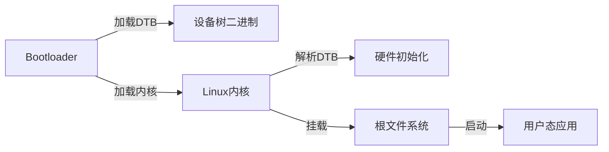

## **中断的概念流程和理解**

流程：保存现场，上下文切换，恢复现场。


我答的重点主要在单核上的并发：在单核裸机环境下，虽然不存在真正的并行执行，但**中断与主程序之间的抢占会导致共享变量的竞态条件**。以下是解决方案的清晰总结：

---

### 🔒 核心解决思路

单核环境下的并发问题源于**中断抢占主程序执行流**（或相反）。要保证互斥，核心是**确保访问共享资源的代码段（临界区）不可被中断打断**。常见方法如下：

---

### 🛠️ 具体方案及代码示例

#### 1. **关闭中断（最常用）**

   - **原理**：在操作共享变量前关闭全局中断，操作完成后立即恢复，防止中断抢占。

   - **实现**：

     ```c
     // 以 ARM Cortex-M 为例：
     void enter_critical(void) {
         __disable_irq();      // 关闭全局中断
         __enable_irq();       // 恢复中断（仅示例，实际需保存状态）
     }
     
     // 使用示例：
     volatile int shared_var = 0;
     
     void update_shared_var(void) {
         __disable_irq();       // 进入临界区
         shared_var++;          // 安全操作共享变量
         __enable_irq();       // 退出临界区
     }
     ```

   - **注意**：需确保临界区极短（微秒级），避免影响中断响应。

#### 2. **原子操作（依赖 CPU 支持）**

   - **原理**：利用 CPU 提供的原子指令（如 LDREX/STREX、CAS），确保读-改-写操作不可分割。

   - **实现**（ARM Cortex-M 原子自增）：

     ```c
     int atomic_inc(int *val) {
         int res;
         do {
             res = __LDREXW(val) + 1;  // 原子加载并修改
         } while (__STREXW(res, val)); // 原子存储，失败则重试
         return res;
     }
     ```

#### 3. **无锁设计（避免共享）**

   - **原理**：通过 FIFO 队列或双缓冲传递数据，减少直接共享变量。

   - **示例**：

     ```c
     #define BUFFER_SIZE 32
     volatile uint8_t buffer[BUFFER_SIZE];
     volatile int head = 0, tail = 0;
     
     // 主程序写入
     void push_data(uint8_t data) {
         buffer[head] = data;
         head = (head + 1) % BUFFER_SIZE;
     }
     
     // ISR 读取
     void ISR() {
         if (tail != head) {
             process_data(buffer[tail]);
             tail = (tail + 1) % BUFFER_SIZE;
         }
     }
     ```

---

### ⚠️ 关键注意事项

1. **volatile 关键字**：防止编译器优化将变量缓存到寄存器，确保每次访问内存。

    ```c
    volatile int shared_var;  // 必须添加！
    ```

2. **临界区长度**：关闭中断的时间必须极短，如执行简单算术或位操作。

3. **嵌套中断处理**：若允许中断嵌套，需在 ISR 内也保护共享资源。

---

### 📊 方案对比

| 方法     | 优点                     | 缺点                     | 适用场景         |
| -------- | ------------------------ | ------------------------ | ---------------- |
| 关闭中断 | 简单可靠，通用性强       | 影响中断响应延迟         | 短临界区操作     |
| 原子操作 | 无锁，不影响中断响应     | 依赖特定 CPU 指令        | 简单读-改-写操作 |
| 无锁设计 | 避免竞争，提高系统稳定性 | 设计复杂度高，内存占用大 | 高频数据传递场景 |

---

### 🌟 总结

在单核裸机系统中，**关闭中断是最直接有效的互斥手段**，但需严格限制临界区长度。结合具体场景选择原子操作或无锁设计，可进一步提升系统效率和可靠性。


## 线程安全

### 🔥 **多核环境下的并发安全挑战与解决方案**  

多核系统的并发问题比单核复杂数个数量级，其核心挑战在于：  

1. **硬件并行性**：多个物理核心**同时执行指令**，对共享资源的访问可能真正并行。  
2. **缓存一致性**：各核心缓存中的共享数据副本需通过协议（如MESI）同步，但仍需软件介入保证可见性。  
3. **内存乱序**：CPU/编译器可能对指令重排，导致意外行为。  

以下为多核裸机系统的专业级解决方案：

---

### 🧠 **多核同步核心原理**  

#### **1. 原子操作与内存序（Memory Order）**  

- **原子性**：确保操作不可分割（如 `atomic_add`）。  
- **可见性**：修改后的值对其他核心立即可见（通过内存屏障强制刷新缓存）。  
- **顺序性**：防止指令重排破坏逻辑（使用 `acquire`/`release` 语义）。  

#### **2. 缓存一致性协议**  

- **MESI协议**：缓存行状态分为 Modified/Exclusive/Shared/Invalid，硬件自动维护一致性。  
- **伪共享（False Sharing）**：不同核心频繁修改同一缓存行的不同变量，导致性能暴跌。需对齐数据结构至缓存行大小（通常64字节）。  

---

### 🛠️ **多核同步方案实现**  

#### **1. 自旋锁（Spinlock）**  

- **原理**：通过原子指令实现忙等待锁，适用于**短期临界区**。  

- **代码实现**（ARMv8汇编+C封装）：  

    ```c  
    // 自旋锁结构体（对齐到缓存行避免伪共享）
    typedef struct {  
        volatile uint32_t lock __attribute__((aligned(64)));  
    } spinlock_t;  
    
    void spinlock_lock(spinlock_t *lock) {  
        while (1) {  
            // 使用LDREX/STREX实现原子CAS  
            if (__LDREXW(&lock->lock) == 0) {    // 检查是否未锁定  
                if (__STREXW(1, &lock->lock) == 0) { // 尝试加锁  
                    __DMB();                     // 内存屏障保证后续操作可见性  
                    break;  
                }  
            }  
            __WFE();                            // 进入低功耗等待状态（ARM指令）  
        }  
    }  
    
    void spinlock_unlock(spinlock_t *lock) {  
        __DMB();                                // 保证临界区操作完成  
        lock->lock = 0;  
        __SEV();                                // 唤醒其他核心（ARM指令）  
    }  
    ```

- **关键优化**：  

    - 使用 `__WFE()`/`__SEV()` 减少忙等待功耗。  
    - 对齐锁结构体到缓存行，避免伪共享。  

---

#### **2. 读写锁（Read-Write Lock）**  

- **原理**：区分读锁（共享）和写锁（独占），提升读多写少场景性能。  

- **实现**（基于原子计数器）：  

    ```c  
    typedef struct {  
        spinlock_t guard;      // 保护内部状态  
        volatile int readers;  
        volatile int writer;   // 0=无写者，1=有写者  
    } rwlock_t;  
    
    void read_lock(rwlock_t *lock) {  
        spinlock_lock(&lock->guard);  
        while (lock->writer) {  // 等待写者释放  
            spinlock_unlock(&lock->guard);  
            spinlock_lock(&lock->guard);  
        }  
        lock->readers++;  
        spinlock_unlock(&lock->guard);  
    }  
    
    void write_lock(rwlock_t *lock) {  
        spinlock_lock(&lock->guard);  
        while (lock->writer || lock->readers > 0) {  
            spinlock_unlock(&lock->guard);  
            spinlock_lock(&lock->guard);  
        }  
        lock->writer = 1;  
        spinlock_unlock(&lock->guard);  
    }  
    ```

---

#### **3. RCU（Read-Copy-Update）**  

- **原理**：读操作无锁，写操作复制数据后原子替换指针，延迟释放旧数据。  
- **适用场景**：读极多写极少（如路由表、配置数据）。  
- **实现步骤**：  
    1. **写者**：  
        - 复制待修改数据生成新版本。  
        - 原子替换全局指针指向新数据。  
        - 延迟释放旧数据（确保所有读者已退出临界区）。  
    2. **读者**：  
        - 直接读取全局指针，无需加锁。  

---

#### **4. 无锁数据结构（Lock-Free Queue）**  

- **原理**：通过CAS原子指令实现无锁队列，避免线程阻塞。  

- **实现**（多生产者多消费者MPMC队列）：  

    ```c  
    typedef struct {  
        volatile uint32_t head;  
        volatile uint32_t tail;  
        void *buffer[QUEUE_SIZE];  
    } lockfree_queue_t;  
    
    bool enqueue(lockfree_queue_t *q, void *item) {  
        uint32_t curr_tail = __atomic_load_n(&q->tail, __ATOMIC_RELAXED);  
        uint32_t next_tail = (curr_tail + 1) % QUEUE_SIZE;  
        if (next_tail == __atomic_load_n(&q->head, __ATOMIC_ACQUIRE)) {  
            return false; // 队列满  
        }  
        q->buffer[curr_tail] = item;  
        __atomic_store_n(&q->tail, next_tail, __ATOMIC_RELEASE);  
        return true;  
    }  
    
    bool dequeue(lockfree_queue_t *q, void **item) {  
        uint32_t curr_head = __atomic_load_n(&q->head, __ATOMIC_RELAXED);  
        if (curr_head == __atomic_load_n(&q->tail, __ATOMIC_ACQUIRE)) {  
            return false; // 队列空  
        }  
        *item = q->buffer[curr_head];  
        __atomic_store_n(&q->head, (curr_head + 1) % QUEUE_SIZE, __ATOMIC_RELEASE);  
        return true;  
    }  
    ```

- **内存序说明**：  

    - `__ATOMIC_ACQUIRE`：保证后续读写不会重排到该操作之前。  
    - `__ATOMIC_RELEASE`：保证之前读写不会重排到该操作之后。  

---

### ⚡ **多核同步性能优化技巧**  

1. **数据局部性设计**：  

    - 每个核心维护独立数据结构（如Per-CPU变量），减少共享冲突。  

    ```c  
    // Per-CPU计数器（ARMv8获取CPU ID）  
    #define get_cpu_id() (__builtin_arm_rsr64("MPIDR_EL1") & 0xFF)  
    uint64_t counters[NR_CPUS] __attribute__((aligned(64)));  
    
    void increment_counter() {  
        counters[get_cpu_id()]++;  
    }  
    ```

2. **分层锁（Hierarchical Locking）**：  

    - 粗粒度锁保护大范围数据，细粒度锁保护子结构，降低锁争用。  

3. **避免锁 convoy 效应**：  

    - 使用 try_lock 而非阻塞锁，失败后执行其他任务。  

---

### 🛑 **多核调试与验证**  

1. **硬件观察点**：  

    - 使用调试器（如JTAG）设置内存监视点，捕获非法访问。  

2. **形式化验证工具**：  

    - 使用SPIN、TLA+等工具对同步协议建模验证。  

3. **压力测试**：  

    - 启动多个核心同时高频操作共享资源，注入随机延迟：  

    ```c  
    void test_spinlock() {  
        spinlock_t lock = {0};  
        parallel_run_on_all_cores(() => {  
            for (int i=0; i<1e6; i++) {  
                spinlock_lock(&lock);  
                shared_data++;  
                spinlock_unlock(&lock);  
                random_delay();  
            }  
        });  
    }  
    ```

---

### 📊 **多核同步方案选型表**  

| **场景**       | **推荐方案**     | **性能** | **复杂度** | **适用核数** |
| -------------- | ---------------- | -------- | ---------- | ------------ |
| 短临界区       | 自旋锁           | ★★★★★    | ★★☆☆☆      | 2-64         |
| 读多写少       | 读写锁/RCU       | ★★★★☆    | ★★★★☆      | 2-1024       |
| 无阻塞数据传递 | 无锁队列         | ★★★★☆    | ★★★★★      | 2-256        |
| 极高频计数器   | Per-CPU变量+汇总 | ★★★★★    | ★★☆☆☆      | 任意         |

---

### ✅ **多核同步黄金法则**  

1. **能不共享就不共享**：通过架构设计（如数据分区）减少共享需求。  
2. **能无锁就不加锁**：优先使用原子操作或无锁数据结构。  
3. **能细粒度就不粗粒度**：减小锁粒度，降低争用概率。  
4. **永远假设代码会被乱序执行**：正确使用内存屏障！  

多核并发编程是软件工程的巅峰挑战之一，需结合硬件特性、算法设计、验证手段三位一体方能构建可靠系统。


## 进程间通信

| 通信方式                             | 定义与描述                                                   | 特点                                             | 优点                             | 缺点                                         | 适用场景                                             |
| :----------------------------------- | :----------------------------------------------------------- | :----------------------------------------------- | :------------------------------- | :------------------------------------------- | :--------------------------------------------------- |
| 管道（Pipe）                         | 一种基于文件描述符的通信机制，用于具有亲缘关系的进程之间。数据在管道中以先进先出（FIFO）的方式传输。 | 半双工通信（默认），只能单向传输；需要亲缘关系。 | 简单易用，系统开销小。           | 通信能力有限，只能在有亲缘关系的进程间使用。 | 父子进程间的简单数据传输，如命令行工具链。           |
| 消息队列（Message Queue）            | 一种基于消息的通信机制，消息被顺序放置在队列中，进程可以向队列发送和接收消息。 | 全双工通信，基于消息的通信。                     | 解耦发送和接收进程，灵活性高。   | 需要系统支持，配置相对复杂。                 | 需要可靠消息传递的场景，如分布式系统中的消息中间件。 |
| 共享内存（Shared Memory）            | 多个进程共享同一块内存区域，进程通过读写共享内存来交换数据。 | 高效，直接内存访问。                             | 通信速度快，适合大数据量传输。   | 同步和互斥问题需要额外处理。                 | 高性能要求的场景，如实时数据处理。                   |
| 信号量（Semaphore）                  | 一种用于进程同步和互斥的机制，通过信号量变量来控制多个进程对资源的访问。 | 用于同步和互斥，不直接用于数据传输。             | 确保资源的正确访问。             | 仅用于控制，不能直接传输数据。               | 多进程访问共享资源时的同步控制。                     |
| 信号（Signal）                       | 一种软件中断机制，用于通知进程发生了异步事件。               | 异步通知，简单快速。                             | 实现简单，适用于简单的异步通知。 | 传输信息量少，处理函数简单。                 | 异步事件通知，如键盘中断、子进程终止通知。           |
| 套接字（Socket）                     | 一种网络通信接口，允许不同主机上的进程之间进行通信。         | 可以跨网络通信，灵活。                           | 通用性强，适用于分布式系统。     | 性能相对较低，配置复杂。                     | 分布式系统、客户端-服务器架构。                      |
| 文件/记录锁定（File/Record Locking） | 通过锁定文件或记录来防止多个进程同时访问同一文件或记录。     | 用于文件共享场景。                               | 防止数据不一致。                 | 性能影响，锁定管理复杂。                     | 多进程访问同一文件的场景。                           |
| 内存映射文件（Memory-Mapped Files）  | 将文件映射到进程的地址空间，多个进程可以通过映射的内存区域共享文件数据。 | 结合文件I/O和共享内存的优点。                    | 高效处理大文件。                 | 复杂度较高，需要管理文件映射。               | 大文件共享和处理，如数据库系统。                     |


​	


## 进程线程区别

**进程、线程区别**

进程和线程是操作系统并发设计的核心概念，主要区别体现在 **资源隔离性、执行粒度、通信机制** 等方面，以下是详细对比：

---

#### **1. 核心定义**

- **进程**： 
    操作系统**资源分配的基本单位**，拥有独立的虚拟地址空间、文件描述符、信号处理器等资源。 
    **示例**：浏览器中每个标签页通常作为独立进程运行，防止单页面崩溃影响整个浏览器。

- **线程**： 
    操作系统**调度的基本单位**，共享进程的资源（如内存、文件），但拥有独立的栈、寄存器和程序计数器。
    **示例**：Web服务器（如Nginx）使用多线程处理并发请求，共享监听端口和缓存数据。

---

#### **2. 关键差异**

| **维度**          | **进程**                                | **线程**                                  |
| ----------------- | --------------------------------------- | ----------------------------------------- |
| **地址空间**      | 独立虚拟地址空间（需切换页表）          | 共享进程地址空间（无需切换页表）          |
| **资源隔离性**    | 完全隔离（内存、文件、CPU时间片等）     | 共享进程资源（内存、文件），隔离栈/寄存器 |
| **创建/切换开销** | 高（复制页表、刷新TLB、内核数据结构）   | 低（仅需分配栈和寄存器上下文）            |
| **通信机制**      | 复杂（管道、共享内存、Socket等IPC机制） | 直接读写共享内存（需同步机制如锁/信号量） |
| **容错性**        | 高（进程崩溃不影响其他进程）            | 低（线程崩溃可能导致整个进程终止）        |
| **系统调用**      | `fork()`, `exec()`, `wait()`            | `pthread_create()`, `clone(CLONE_VM)`     |

---

#### **3. 设计意义与场景**

- **选择进程的场景**：
    - 需要强隔离性（如安全敏感的沙盒环境）。
    - 多任务需独立运行（如同时运行浏览器和编译器）。
        **代价**：上下文切换开销大，通信成本高。

- **选择线程的场景**： 
    - 高并发任务（如数据库连接池、实时数据处理）。 
    - 需要高效共享数据（如GUI应用的事件处理线程）。 
        **风险**：需谨慎处理竞态条件（Race Conditions）和死锁。

---

#### **4. 底层实现（以Linux为例）**

- **进程**：通过`fork()`系统调用创建，内核复制父进程的`task_struct`和`mm_struct`（地址空间描述符），采用**写时复制（Copy-on-Write）** 优化内存复制开销。
- **线程**：通过`clone()`系统调用创建，指定`CLONE_VM`标志共享地址空间，线程的`task_struct`复用进程的`mm_struct`。

```c
// Linux中创建线程的简化逻辑
clone(CLONE_VM | CLONE_FS | CLONE_FILES, stack_ptr, ...);
```

---

#### **5. 高级扩展**

- **协程（Coroutine）**：用户级线程，由程序自行调度（如Go的Goroutine），切换开销极低（纳秒级），适用于百万级并发。
- **容器技术**：现代容器（如Docker）本质是轻量级进程组，通过命名空间（Namespace）和控制组（CGroup）实现资源隔离。

---

### **总结回答（30秒精简版）**  

“进程是资源隔离的单位，拥有独立地址空间，适合需要高安全性的场景；线程是执行调度的单位，共享进程资源，适合高并发任务。进程切换开销大但隔离性强，线程开销小但需处理同步问题。现代系统常混合使用二者，如Chrome用多进程隔离标签页，用多线程加速渲染。”


## 共享内存的原理

**==TODO==**

`mmap` 系统调用，kernel 分配一块内存后，将其映射到不同进程各自独有的进程地址空间。


## Page fault

[RISCV MMU 概述 - 泰晓科技](https://tinylab.org/riscv-mmu/#:~:text=当 D 位为 0 时，对此页面进行写操作会触发 Page Fault (store),Page Fault (对应访问 类型) 异常且将该域置为 1。 该位复位为 0。)

#### **1. Page Fault触发条件**
当CPU访问**虚拟内存地址**时，若发生以下任一情况，将触发Page Fault异常：
- **页面未加载**（Major Fault）：虚拟地址有效，但对应物理页未载入内存（如文件映射页未读取）。
- **权限错误**（Minor Fault）：访问方式（读/写/执行）与页表项权限不匹配（如写只读页）。
- **非法访问**（Segmentation Fault）：虚拟地址无效（如空指针访问）。

---

#### **2. 触发与处理的责任方**
- **硬件触发**：由**CPU的MMU（内存管理单元）**完成：
  
  - 在地址转换过程中，若目标页表项标记为"不存在"（Present位=0）或权限不符，MMU抛出Page Fault异常，通知 CPU。
  - CPU记录错误信息到**`CR2`/`mtval`**（保存触发异常的虚拟地址）和错误代码（指示错误类型）。
  
- **软件处理**：由**操作系统内核的Page Fault Handler**响应：
  
  ```c
  // Linux内核处理流程示例（伪代码）
  void handle_page_fault(struct pt_regs *regs, unsigned long error_code) {
      unsigned long address = read_cr2();  // 获取触发地址
      struct vm_area_struct *vma = find_vma(current->mm, address);
      
      if (!vma) 
          goto invalid_access;            // 地址不在进程地址空间
      if (error_code & PF_PROT)
          goto permission_denied;         // 权限错误
      
      handle_mm_fault(vma, address);      // 分配物理页/调整页表
      return;
      
  invalid_access:
      force_sig(SIGSEGV);                 // 发送段错误信号
  }
  ```

---

#### **3. 典型处理场景**
| **场景**          | **处理动作**             | **示例**                         |
| ----------------- | ------------------------ | -------------------------------- |
| **Major Fault**   | 从磁盘加载页面到物理内存 | 程序首次访问`.text`代码段        |
| **Copy-on-Write** | 复制原页并修改页表项     | `fork()`后子进程写共享内存       |
| **堆栈自动扩展**  | 分配新的物理页并映射     | 栈空间不足时自动增长             |
| **内存映射文件**  | 从文件读取数据填充页面   | `mmap`访问文件内容               |
| **Swap In**       | 从交换分区换入页面       | 物理内存不足后被换出的页重新访问 |

---

#### **4. 性能观测与调试**
- **使用工具观测Page Fault**：
  ```bash
  # 统计进程的Page Fault次数（minflt/s majflt/s）
  pidstat -r -p <PID> 1
  
  # 使用perf跟踪Page Fault事件
  perf record -e page-faults -ag -- sleep 5
  perf script
  ```

- **Python测试脚本触发特定场景**：
  ```python
  # 强制触发Major Fault（文件映射）
  import mmap
  with open("test.bin", "r+b") as f:
      mm = mmap.mmap(f.fileno(), 0)
      mm[0] = b'\xff'  # 第一次访问触发文件页加载
  ```

---

#### **5. 关键设计考量**
1. **延迟敏感**：Major Fault需磁盘I/O，耗时可能达毫秒级，需通过预读（readahead）优化。
2. **内存超载管理**：通过页面置换算法（LRU/Clock）选择牺牲页，避免频繁Swap抖动。
3. **用户态协作**：`mlock()`可锁定关键页面避免换出，`madvise()`提供访问模式提示。

---

#### **6. 对比RTOS的特殊性**
在**实时操作系统（如FreeRTOS）**中：
- 通常**无虚拟内存机制**，Page Fault不存在。
- 内存管理为静态分配或简单分区，确保确定性响应。
- 若需类似功能（如加载外部数据），需手动实现分页逻辑。


## RISC-V 上下文切换

> 主要配合我自己实现的处理器和 OS 实现一步步讲解。

理解的核心思想：来中断/异常的时候，我需要保存上下文的状态/寄存器现场，那就需要开辟空间来保存一些内容： OS 或者 am 框架 把一段内存空间初始化成程序（线程/进程）能够运行的上下文，并在中断/异常返回时切换到事先准备的上下文。这就赋予了我们实现 “切换” 的根本机制。下面讨论更多一些细节。	

首先，最简单从一个程序到多道程序的发展，就是直接将不同的程序放到编好的地址的各个部分，比如：`0x100~0x100` 第一个程序。、、以此类推。

----

在之后，比较简单的的是，最简单的，在只有内核空间的的时候，或者说刚开始写的时候，只有内核线程，很自然的，只保存了通用寄存器和一些用到的的系统特殊寄存器。 

到这里，实际上就是有点类似于 `thread-os`，就是以 thread 为单位，进行任务处理，保存的这些内容是每一个线程自己的状态（register、PC、shared memory）。当然，这个时候的理解是 程序都是运行在内核态的。历史上的这个阶段，其实是没有进程这一概念的。

到这里就有点像一个嵌入式操作系统了？还是说要有用户线程（任务）的才是？

----

然后，添加扩展实现：

- 处理器：添加内核态和用户态

- OS

    - 添加 特权级区分，当然，只是简单做个标志，并没有限制各种指令执行的特权级；

    - 然后添加用户线程的概念，这个时候也只是简单的通过地址来划分内核线程和用户线程（比如 `0x80000000` 以上为内核线程，`0x40000000~0x80000000` 为用户线程的。）

有一些具体的细节和改变：

保存上下文的的时候，那内核应该也和用户线程一样有自己的栈？而不是和用户共用一个栈，因为切换到内核的时候还是会需要保存

所以，我加入了关于内核栈和用户栈的切换（总结内核栈和用户栈切换的逻辑），也只是用简单的寄存器表示处于哪一个特权级，**实现方式**：

- **特权指令**：仅在内核态可执行（如修改页表、I/O操作）。
- **中断/异常处理**：用户态程序触发异常时切换到内核态。

> 这个时候还没有引入MMU与分页机制。
>
> 而这个时候用的表述还是 线程，没有用进程，因为没有通过虚拟内存的机制来保证程序的隔离，只用了 特权级来保护。

----

但之后进一步深入，我还引入了 MMU 和页表机制，支持虚拟地址和物理地址的转换。这个时候又带来了很多问题：

- 要为用户进程实现地址空间的内容
- 内核栈和用户栈的进一步区分，尤其是在上下文切换的时候对于内核栈、用户栈切换。
- 在开启 MMU 的情况下，每个用户进程有自己的页表基地址，内核访问的都是同一片代码，但也需要有页表，这就带来了问题，是在每一次上下


去看了实际系统的实现：

```C
// arch/riscv/include/asm/pgalloc.h
static inline void sync_kernel_mappings(pgd_t *pgd)
{
    memcpy(pgd + USER_PTRS_PER_PGD,
           init_mm.pgd + USER_PTRS_PER_PGD,
           (PTRS_PER_PGD - USER_PTRS_PER_PGD) * sizeof(pgd_t));
}

static inline pgd_t *pgd_alloc(struct mm_struct *mm)
{
    pgd_t *pgd;

    pgd = (pgd_t *)__get_free_page(GFP_KERNEL);
    if (likely(pgd != NULL)) {
        memset(pgd, 0, USER_PTRS_PER_PGD * sizeof(pgd_t));
        /* Copy kernel mappings */
        sync_kernel_mappings(pgd);                                                                                        
    }
    return pgd;
}


// arch/riscv/include/asm/pgtable.h

/* Number of entries in the page global directory */
#define PTRS_PER_PGD    (PAGE_SIZE / sizeof(pgd_t))
/* Number of entries in the page table */
#define PTRS_PER_PTE    (PAGE_SIZE / sizeof(pte_t))

/* Number of PGD entries that a user-mode program can use */
#define USER_PTRS_PER_PGD   (TASK_SIZE / PGDIR_SIZE)  


// arch/riscv/include/asm/pgtable-32.h
/* Size of region mapped by a page global directory */
#define PGDIR_SHIFT     22
#define PGDIR_SIZE      (_AC(1, UL) << PGDIR_SHIFT)                                                                       
#define PGDIR_MASK      (~(PGDIR_SIZE - 1))

// arch/riscv/include/asm/pgtable-64.h
#define PGDIR_SHIFT_L3  30
#define PGDIR_SHIFT_L4  39
#define PGDIR_SHIFT_L5  48
#define PGDIR_SIZE_L3   (_AC(1, UL) << PGDIR_SHIFT_L3)

#define PGDIR_SHIFT     (pgtable_l5_enabled ? PGDIR_SHIFT_L5 : \
        (pgtable_l4_enabled ? PGDIR_SHIFT_L4 : PGDIR_SHIFT_L3))
/* Size of region mapped by a page global directory */
#define PGDIR_SIZE      (_AC(1, UL) << PGDIR_SHIFT)                                                                       
#define PGDIR_MASK      (~(PGDIR_SIZE - 1))

```

页目录一级一共有多少个页表项。管理整个系统虚拟内存，按当前的页表大小，需要多少个页目录项。

> **步骤解析**：
>
> 1. **虚拟地址划分**：
>
>     - RISC-V Sv39 使用 39 位虚拟地址，分为三级页表索引：
>         - **VPN2**（9 位）：索引页全局目录（PGD）。
>         - **VPN1**（9 位）：索引页中间目录（PMD）。
>         - **VPN0**（9 位）：索引页表项（PTE）。
>     - 剩余 12 位为页内偏移。
>
> 2. **内核空间地址范围**：
>
>     - 内核虚拟地址通常从 `0x80000000` 开始，例如 `0x80000000~0xFFFFFFFFFFFFFFFF`。
>
>     - 对于地址 `0x80000000`，其 VPN2 值为：
>
>         复制
>
>         ```
>         VPN2 = (0x80000000 >> 30) & 0x1FF = 256
>         ```
>
>         因此，内核空间的 PGD 条目索引范围为 **256~511**。
>
> 3. **内核页表初始化**：
>
>     - 内核启动时，通过 `paging_init()` 初始化内核页表（`swapper_pg_dir`），将内核代码、设备内存等映射到高半部分虚拟地址。
>     - 用户进程创建时，复制内核 PGD 的高半部分条目到用户页表，确保内核映射共享。

具体可以看看 kernel memory layout 的文档：[Virtual Memory Layout on RISC-V Linux — The Linux Kernel documentation](https://www.kernel.org/doc/html/latest/arch/riscv/vm-layout.html)

>了解到的一些相对前沿资料：
>
>[memory - How are the kernel page tables shared among all processes? - Unix & Linux Stack Exchange](https://unix.stackexchange.com/questions/598171/how-are-the-kernel-page-tables-shared-among-all-processes)


综上：

根据之前的多次回答，我现在总结出我自己实现的RISC-V 的OS的关于页表的目前的机制。我理解的如下：

首先，在只有一个页表寄存器的时候（不像ARM的双页表），在系统刚刚启动的时候，做的是 `vme_init` 的工作，为描述内核页表的结构分配使用空间：`kas.ptr = pgalloc_f(PGSIZE);` 所以这个 `ptr` 指的是内核空间下的页表基地址，是所有程序共享的！

然后，接着为程序内存划分好的的每一部分内存区（zone、或者理解为池？）进行MMU映射；最后将内核的页表基址放到 `satp` 寄存器中：`set_satp(kas.ptr);`。

接着，就是用户进程的内容，既然现在有了MMU的支持，那就要创建、规划进程地址空间了。

- 首先做的就是建立用户进程地址空间 `protect(&pcb->as);`

    这个时候做的就是，为该进程分配描述用户页表的结构的空间： `PTE *updir = (PTE*)(pgalloc_usr(PGSIZE));  as->ptr = updir;`

- 另外，告诉用户进程可以用的范围：`#define USER_SPACE RANGE(0x40000000, 0x80000000)`、然后目前 OS 配置的页表大小：4KB。

- **然后最重要的是，进行内核页表的拷贝！`memcpy(updir, kas.ptr, PGSIZE);`**

    > 这里为什么是这么映射，还真有点意思！！！
    >
    > 还留了一些疑惑！

- 然后就到了实际 load一个程序：计算这个 `elf` 程序要占用多少的 `page`，然后分配，然后就是为这个 `elf` 程序建立 `mmu` 映射：

    ```C
    for (size_t j = 0; j < nr_page; j++) {
        map(&pcb->as,
            (void *)start_addr + PGSIZE * j,
            p_page + PGSIZE * j,
            PTE_R | PTE_W | PTE_X);
    }
    ```

    > 这里比较有意思的是这个映射：
    >
    > 具体来说就是在该进程的地址空间，然后为elf程序的地址建立映射？（这里为什么是这两个地址建立映射？我这里做的都是恒等映射）。


之后就是要为这个用户进程创建用户栈！

```C
ucontext(&pcb->as, kstack, (void(*)())entry);

Context *ucontext(AddrSpace *as, Area kstack, void *entry) {
    void *stack_end = kstack.end;
    Context *base = (Context *) ((uint8_t *)stack_end - sizeof(Context));
    // just pass the difftest
    //base->mstatus = 0x1800; // MPP bit[12:11] 0b11 = 3
    const mstatus_t mstatus_tmp = {
        .mpie = 1,
        .mie = 0,
        .sum = 1, // read note and manual
        .mxr = 1, // about S-mode, OS will do this, design processor core don't care?
        .mpp = PRIV_MODE_U,
    };
    base->mstatus = mstatus_tmp.value;
    base->pdir = as->ptr;
    base->np = PRIV_MODE_U;
    base->gpr[2] = (uintptr_t)kstack.end;
    base->mepc = (uintptr_t)entry;
    return base;
}                
```

这里主要到是`pdir`（page directory），这是用户进程地址空间的页表基地址赋值！（这和前面 `protect(&pcb->as);` 那里联系起来了！

> 一开始的困惑：`memcpy kernel map space`，将 `kas.ptr` 拷贝给 `updir`，那不是覆盖 `pdir`？是不是内核和用户共用一部分？


接着，主要是指定函数参数，这里用栈存好了 `argc`、`argv`、`envp` 的内容，之后传递给 `crt` 调用 `main` 函数的地方，再解析，这里可以不用过于关注。

```C
#define GPRx gpr[10] // a0
pcb->cp->GPRx = (uintptr_t)base_2_app;
```

然后：指定该用户进程的栈指针（`sp/gpr[2]`），为每一个进程不同的用户栈的物理映射到同一物理地址。

```C
pcb->cp->gpr[2] = (uintptr_t)(pcb->as.area.end - (new_user_stack_bottom - space_count));

void *ustack_top_vaddr = pcb->as.area.end - 8 * PGSIZE;
for (int i = 0; i < 8; i++) {
    map(&pcb->as,
        ustack_top_vaddr + (PGSIZE * i),
        new_user_stack_top + (PGSIZE * i), 
        PTE_R | PTE_W);
}
```

这个end是用户地址空间结尾：0x80000000，然后减去本进程的用户地址空间栈底（高地址）和已经占用了一部分栈的内容（space_count）。

> 这里也有一个有意思的地方，也是那个时候有困惑的：映射到同一地址？
>
> > 用户栈映射到 `as.area.end - 8 * PGSIZE` 这里。我的问题不是他映射到哪里的问题，而是好像每创建一个进程的用户栈空间都指向这里？？？这很明显不对呀！ `new_user_stack_top` 这个是有 `page_alloc` 实际分配了8页的起始地址的，但是按照上面的说法，那不是所有的用户进程的用户栈的实际物理地址都映射到这里？
> >
> > 不对！是给每个进程一种错觉，感觉这一块地方都是它的！但这是虚拟地址，实际访问的物理地址（就是那个new_user_stack_top，分配的8个PAGE）是不一样的！！我这理解对不对？因为这是在我自己写的 OS 的，那我想在 Linux中验证，怎么做？有什么test程序吗？
>
> ```c
> // test.c
> #include <stdio.h>
> #include <unistd.h>
> 
> int main() {
>     int stack_var = 42;
>     printf("PID=%d, &stack_var=%p, stack_var=%d\n", getpid(), &stack_var, stack_var);
>     sleep(10);
>     return 0;
> }
> ```
>
> ```bash
> $ gcc test.c -o test
> $ ./test & ./test
> PID=100, &stack_var=0x7ffeeb6d9a5c, stack_var=42
> PID=101, &stack_var=0x7ffeeb6d9a5c, stack_var=42
> ```
>
> 理论猜测是这样：虚拟地址相同，但两个进程的`stack_var`位于不同的物理页，验证了映射隔离性。
>
> 但是实际上由于前几年 meltdown 漏洞，现代的 Linux 会有 ASLR，为了安全！


> 具体地, 我们希望在CTE恢复进程上下文的时候来切换地址空间. 为此, 我们需要将进程的地址空间描述符指针`as->ptr`加入到上下文中, 框架代码已经实现了这一功能(见`abstract-machine/am/include/arch/$ISA-nemu.h`), 在x86中这一成员为`cr3`, 而在mips32/riscv32中则为`pdir`. 
>
> > 内核映射？
> >
> > 对于x86和riscv32, 在`protect()`中创建地址空间的时候, 有一处代码用于拷贝内核映射:
> >
> > ```c
> > // map kernel space
> > memcpy(updir, kas.ptr, PGSIZE);
> > ```
> >
> > 尝试注释这处代码, 重新编译并运行, 你会看到发生了错误. 请解释为什么会发生这个错误.
>
> 
>
> 为此, 我们需要思考内核线程的调度会对分页机制造成什么样的影响. 内核线程和用户进程最大的不同, 就是它没有用户态的地址空间: 内核线程的代码, 数据和栈都是位于内核的地址空间. 那在启动分页机制之后, 如果`__am_irq_handle()`要返回一个内核线程的现场, 我们是否需要考虑通过`__am_switch()`切换到内核线程的虚拟地址空间呢?
>
> 答案是, 不需要. 这是因为AM创建的所有虚拟地址空间都会包含内核映射, 无论在切换之前是位于哪一个虚拟地址空间, 内核线程都可以在这个虚拟地址空间上正确运行. 因此我们只要在`kcontext()`中将上下文的地址空间描述符指针设置为`NULL`, 来进行特殊的标记, 等到将来在`__am_irq_handle()`中调用`__am_switch()`时, 如果发现地址空间描述符指针为`NULL`, 就不进行虚拟地址空间的切换.
>


## 关于 MMU 和 cache


## 从存储介质看启动流程

本文内容对标ARM架构嵌入式系统（如树莓派、i.MX系列）的标准流程。

---

### **一、启动流程阶段分解**

#### **阶段1：BootROM（固化在SoC内部）**

- **加载内容**： 
    - 从**内部Mask ROM**执行初始代码（不可修改）。
    - 加载**外部存储介质（如SPI NOR Flash）**中的第一级Bootloader（如SPL）。

- **核心目的**： 
    - **硬件初始化**：配置SoC的时钟、引脚复用、基本DDR时序。
    - **介质探测**：根据SoC启动引脚电平（Boot Mode），选择从SD卡、eMMC或NOR Flash加载下一阶段代码。
    - **安全验证**：验证SPL的数字签名（Secure Boot场景）。

- **专业设计逻辑**： 
    BootROM固化在硅片中，保证系统上电后**无需外部干预即可找到启动路径**。其代码体积严格受限（通常<64KB），因此只能加载**极小型的引导程序（SPL）**。

---

#### **阶段2：SPL（Secondary Program Loader）**

- **加载内容**：  
    - 从**外部存储（如SD卡、eMMC）**加载完整版Bootloader（如U-Boot）。

- **核心目的**：  
    - **扩展硬件初始化**：完成DDR内存训练、复杂外设（如PCIe/USB）时钟配置。
    - **介质驱动加载**：提供访问eMMC/NAND的驱动程序（BootROM通常仅支持SPI NOR）。
    - **解压与重定位**：若主Bootloader被压缩（如LZMA），SPL负责解压到DDR中。

- **专业设计逻辑**： 
    SPL是BootROM与主Bootloader之间的桥梁。由于BootROM无法直接处理大容量存储（如eMMC），需通过SPL实现**硬件能力扩展**。

---

#### **阶段3：主Bootloader（如U-Boot）**

- **加载内容**：  
    - 从存储介质加载**内核镜像（zImage/uImage）**、**设备树（.dtb）**、**initramfs**到DDR指定地址。

- **核心目的**：  
    - **动态配置**：通过环境变量（`bootcmd`）定义启动参数（如内核命令行参数`console=ttyS0,115200`）。
    - **硬件抽象**：提供统一的存储访问接口（如`fatload mmc 0:1 $kernel_addr_r zImage`）。
    - **安全扩展**：支持内核验签、FIT镜像（Flattened Image Tree）等高级特性。

- **专业设计逻辑**：  
    Bootloader需**平衡灵活性与可靠性**。例如，U-Boot的`bootcmd`允许开发者通过脚本化控制启动流程，而设备树分离硬件描述与内核代码，实现**跨平台兼容性**。

---

#### **阶段4：内核启动（Kernel）**

- **加载内容**：  
    - 从DDR中获取**设备树二进制（DTB）**，解析硬件拓扑。
    - 挂载**根文件系统（rootfs）**（从eMMC/NET/NFS等加载）。

- **核心目的**：  
    - **硬件驱动初始化**：根据DTB信息加载对应驱动（如GPIO、I2C控制器）。
    - **进程管理**：启动第一个用户态进程（`init`或`systemd`）。
    - **资源分配**：建立内存映射、中断路由表。

- **专业设计逻辑**：  
    内核通过DTB实现**硬件描述与代码解耦**，避免为每个板卡定制内核。根文件系统的位置由内核参数（`root=/dev/mmcblk0p2`）指定，分离**系统运行**与**数据存储**逻辑。

---

#### **阶段5：用户空间（User Space）**

- **加载内容**：  
    - 从根文件系统执行`/sbin/init`，加载动态库（如`libc.so`）、配置文件。

- **核心目的**：  
    - **服务管理**：启动守护进程（如SSH、网络服务）。
    - **权限控制**：通过`/etc/fstab`挂载分区，切换非root用户。

- **专业设计逻辑**：  
    用户空间通过**层次化初始化**（如SysV init、systemd）管理服务依赖关系，确保系统从底层硬件到上层应用的完整可控制性。

---

### **二、提升专业性的方法论**

#### **1. 深度掌握工具链**

- **逆向分析工具**：  

    - 使用`objdump`反汇编BootROM代码（需JTAG调试器）：  

        ```bash
        arm-none-eabi-objdump -D -marm bootrom.bin > disassembly.txt
        ```

    - 通过`fdtdump`解析DTB：  

        ```bash
        fdtdump my_board.dtb | less
        ```

- **调试技术**：  

    - U-Boot中通过`md`命令查看内存内容：  

        ```bash
        md 0x80000000 100  # 查看DDR起始地址的256字节
        ```

    - 使用OpenOCD + JTAG单步跟踪SPL执行流程。

---

#### **2. 理解行业标准设计模式**

- **XIP（Execute In Place）**：  
    在NOR Flash上直接运行代码（无需加载到RAM），节省启动时间。需在链接脚本中指定代码段地址：  

    ```ld
    .text : {
        *(.text)
    } > FLASH
    ```

- **Chain of Trust**：  
    安全启动流程示例：  

    ```
    BootROM → 验签SPL → SPL验签U-Boot → U-Boot验签Kernel
    ```

---

#### **3. 实战优化技巧**

- **Boot时间优化**：  

    - 测量各阶段耗时：  

        ```bash
        # U-Boot中启用时间戳
        setenv bootargs "... initcall_debug=1"
        dmesg | grep "initcall"
        ```

    - 并行初始化：在设备树中标记`status = "okay"`的设备，内核可异步探测驱动。

- **存储拓扑设计**：  

    | **场景**   | **推荐存储方案**                    |
    | ---------- | ----------------------------------- |
    | 工业控制器 | NOR (Boot) + eMMC (Rootfs)          |
    | 消费电子   | eMMC统一存储（分区隔离Boot/Kernel） |
    | 开发原型机 | SD卡启动 + NFS挂载根文件系统        |

---

#### **4. 学习路径建议**

1. **硬件手册精读**：  
    - 研读SoC的《BootROM Technical Reference Manual》，理解启动引脚配置、时钟树初始化时序。

2. **代码解剖**：  
    - 分析U-Boot的`board_init_f`（早期初始化）与`board_init_r`（运行时初始化）区别。

3. **参与开源社区**：  
    - 提交U-Boot驱动补丁（如支持新型eMMC芯片）。
    - 复现并修复Linux内核的Device Tree绑定警告。

---

### **三、终极目标：构建完整知识体系**

- **核心能力矩阵**：  

    | **能力维度** | **具体技能**                      |
    | ------------ | --------------------------------- |
    | 硬件接口层   | 理解eMMC的CMD线协议、DDR训练算法  |
    | 固件层       | 编写U-Boot驱动、定制SPL           |
    | 操作系统层   | 调整内核调度策略、优化DTB覆盖机制 |
    | 安全层       | 实现Secure Boot链、防御固件级攻击 |

通过系统性理解存储介质与启动流程的关联，您将能够设计出**高可靠性、可维护性**的嵌入式系统，并在出现启动故障时快速定位问题层级（如：“DDR未初始化”属于SPL阶段问题，“网卡驱动失败”属于内核阶段问题）。

> 以下是嵌入式系统中存储介质分类及SoC与存储关系的系统性总结，帮助你更专业地理解这一领域的核心概念：
>
> ---
>
> ### **1. 存储介质分类与作用**
>
> #### **1.1 按存储位置分类**
>
> | **类型**     | **位置**      | **典型设备**          | **作用**                      | **性能特点**           |
> | ------------ | ------------- | --------------------- | ----------------------------- | ---------------------- |
> | **内部存储** | 集成在SoC内部 | SRAM, Mask ROM        | 存放BootROM代码、安全启动密钥 | 低延迟、小容量（KB级） |
> | **外部存储** | 连接在SoC外部 | DDR SDRAM, eMMC, NAND | 运行系统、存储固件和用户数据  | 大容量（MB~TB级）      |
>
> #### **1.2 按功能分类**
>
> | **类型**     | **设备示例**           | **启动流程中的作用**                     |
> | ------------ | ---------------------- | ---------------------------------------- |
> | **启动介质** | NOR Flash, SD卡, eMMC  | 存放Bootloader、内核、设备树、根文件系统 |
> | **主内存**   | DDR3/4 SDRAM, LPDDR    | 运行操作系统和应用程序                   |
> | **持久存储** | eMMC, NAND Flash, SD卡 | 存储用户数据和固件镜像                   |
>
> ---
>
> ### **2. SoC内部存储详解**
>
> #### **2.1 SRAM（静态随机存储器）**
>
> - **特点**：高速、低延迟、无需刷新，但容量小（通常几十KB~几MB）。
> - **用途**：
>     - BootROM执行时的临时缓存。
>     - CPU一级/二级缓存（部分SoC设计）。
>     - 关键中断服务例程（ISR）的快速执行。
>
> #### **2.2 Mask ROM / OTP（一次性编程存储器）**
>
> - **特点**：出厂固化代码，不可修改（OTP允许一次写入）。
> - **用途**：
>     - SoC启动的第一阶段代码（BootROM）。
>     - 安全启动密钥、设备唯一ID存储。
>
> ---
>
> ### **3. SoC外部存储详解**
>
> #### **3.1 主内存（Volatile，易失性）**
>
> | **设备**      | **特点**                       | **典型容量** |
> | ------------- | ------------------------------ | ------------ |
> | **DDR SDRAM** | 高带宽、动态刷新，需初始化时序 | 128MB~8GB    |
> | **LPDDR**     | 低功耗版本，用于移动设备       | 同DDR        |
>
> #### **3.2 非易失性存储（Non-Volatile）**
>
> | **设备**       | **接口**        | **典型用途**              | **性能特点**       |
> | -------------- | --------------- | ------------------------- | ------------------ |
> | **NOR Flash**  | SPI, Parallel   | 存储Bootloader（XIP支持） | 随机读取快，写入慢 |
> | **NAND Flash** | eMMC, SD卡, UFS | 存储内核、文件系统        | 高容量，块操作     |
> | **eMMC**       | eMMC协议        | 手机/嵌入式系统主存储     | 集成控制器，易用   |
> | **SD卡**       | SDIO接口        | 开发板临时启动介质        | 可插拔，低成本     |
>
> ---
>
> ### **4. 启动介质选择与对比**
>
> #### **4.1 常见启动介质**
>
> | **介质**      | **优点**             | **缺点**               | **典型应用场景**       |
> | ------------- | -------------------- | ---------------------- | ---------------------- |
> | **NOR Flash** | 支持XIP，可靠性高    | 容量小（MB级），成本高 | 工业设备Bootloader存储 |
> | **eMMC**      | 集成控制器，高可靠性 | 焊死不可更换           | 手机、智能硬件主存储   |
> | **SD卡**      | 可插拔，灵活         | 速度慢，易损坏         | 树莓派等开发板启动介质 |
> | **SPI NAND**  | 低成本，大容量       | 需坏块管理，驱动复杂   | 消费电子设备           |
>
> #### **4.2 启动流程中的存储层级**
>
> 1. **BootROM阶段**：
>     - 从SoC内部Mask ROM执行，加载外部SPI NOR Flash中的Bootloader。
> 2. **Bootloader阶段**：
>     - U-Boot从eMMC/SD卡加载内核（`zImage`）、设备树（`.dtb`）、initramfs。
> 3. **内核阶段**：
>     - 内核解压后运行在DDR内存中，从根文件系统（eMMC/NAND）挂载`/`。
>
> ---
>
> ### **5. 关键问题解答**
>
> #### **Q1: SoC外接的Flash通常是什么类型？**
>
> - **答**：根据需求选择：
>     - **NOR Flash**：用于存放Bootloader（支持XIP直接执行）。
>     - **eMMC/NAND**：存放内核、文件系统等大容量数据。
>     - **SD卡**：开发调试时的临时启动介质。
>
> #### **Q2: eMMC和NAND Flash的区别？**
>
> - **eMMC** = NAND Flash + 内置控制器 + 标准封装，提供通用接口（如MMC协议），无需开发者管理坏块。
> - **原始NAND**：需SoC内置控制器，开发者需实现坏块管理和ECC校验。
>
> #### **Q3: DDR和SRAM的分工？**
>
> - **SRAM**：用于对延迟敏感的缓存场景（如CPU L1 Cache）。
> - **DDR**：作为主内存运行操作系统和应用程序。
>
> ---
>
> ### **6. 设计建议**
>
> 1. **启动介质选型**：
>
>     - 需要可靠性 → 选择eMMC或NOR Flash。
>     - 需要灵活调试 → 使用SD卡。
>
> 2. **存储拓扑示例**：
>
>     ```
>     [SoC内部]
>       Mask ROM → 初始化 → 加载SPI NOR中的U-Boot
>     [SoC外部]
>       U-Boot → 从eMMC加载内核/dt → DDR运行 → 挂载eMMC中的根文件系统
>     ```
>
> 3. **调试技巧**：
>
>     - 使用`mmc info`（U-Boot命令）查看SD卡/eMMC信息。
>     - 通过`fdt addr <地址>`验证设备树是否正确加载。
>
> ---
>
> 通过理解存储层级和介质特性，你可以更专业地为嵌入式系统设计存储架构，避免资源冲突和性能瓶颈。


## 将编译生成的设备树二进制文件（dtb）与系统镜像绑定

将编译生成的设备树二进制文件（dtb）与系统镜像绑定的过程取决于硬件平台和引导程序（如U-Boot）。以下是详细步骤：

---

### **1. 确认硬件平台和引导方式**

- 常见引导程序：U-Boot、GRUB、树莓派专用引导等。
- 确定dtb文件的存储位置（如SD卡分区、Flash等）。

---

### **2. 部署dtb文件**

#### **通用步骤（以U-Boot为例）**

- **将dtb复制到启动介质**：

    ```bash
    # 示例：将dtb复制到SD卡的第一个分区（FAT格式）
    sudo cp my_board.dtb /mnt/boot/
    ```

- **常见存储路径**：

    - `/boot/` 或 `/boot/dtb/`
    - SD卡/FAT分区的根目录或指定子目录（如树莓派的`/overlays/`）。

---

### **3. 配置引导程序**

#### **U-Boot环境变量配置**

- **设置dtb加载地址和文件名**：

    ```bash
    # 在U-Boot命令行中设置（以ARM为例）
    setenv fdt_addr 0x83000000    # dtb的内存加载地址
    setenv fdtfile my_board.dtb   # dtb文件名
    saveenv                       # 保存配置
    ```

- **启动命令示例**：

    ```bash
    # 加载内核、dtb和根文件系统后启动
    load mmc 0:1 ${kernel_addr} zImage
    load mmc 0:1 ${fdt_addr} ${fdtfile}
    bootz ${kernel_addr} - ${fdt_addr}
    ```

#### **树莓派配置（config.txt）**

- 在SD卡的`config.txt`中指定dtb：

    ```ini
    device_tree=my_board.dtb
    # 或使用覆盖（overlay）
    dtoverlay=my_overlay.dtbo
    ```

---

### **4. 内核与dtb绑定（可选）**

#### **嵌入dtb到内核镜像**

- 编译时直接包含dtb（需内核配置支持）：

    ```bash
    make dtbs && make zImage
    ```

#### **生成复合镜像（如uImage）**

- 使用`mkimage`打包内核和dtb：

    ```bash
    mkimage -A arm -O linux -T kernel -C none -a 0x80008000 -e 0x80008000 \
            -d zImage:my_board.dtb uImage
    ```

---

### **5. 验证启动流程**

- **检查U-Boot加载的地址**：

    ```bash
    # 在U-Boot中手动加载并启动
    fatload mmc 0:1 ${fdt_addr} my_board.dtb
    fdt addr ${fdt_addr}          # 验证dtb解析
    bootz ${kernel_addr} - ${fdt_addr}
    ```

- **内核启动日志**：

    ```bash
    dmesg | grep "Machine model"   # 确认正确加载了dtb
    ```

---

### **6. 常见问题排查**

- **地址冲突**：确保dtb加载地址不与内核或initrd重叠。
- **路径错误**：检查U-Boot中文件路径与实际存储位置是否一致。
- **dtb版本不匹配**：确保dtb与内核版本兼容。

---

### **总结步骤**

1. **编译dtb**：`dtc -I dts -O dtb -o my_board.dtb my_board.dts`
2. **复制到启动介质**：如`/boot/dtb/`或SD卡分区。
3. **配置引导程序**：设置加载地址和启动命令。
4. **启动验证**：通过日志确认dtb生效。

根据具体平台调整细节，参考硬件文档确保兼容性。


## 文件系统镜像


## DTB 配合 文件系统镜像

在嵌入式Linux系统开发中，文件系统打包和设备树二进制文件（DTB）绑定是两个**独立但紧密协作的关键步骤**，它们共同确保系统从硬件初始化到用户空间服务的完整启动流程。以下是两者的技术关联和差异的深度解析：

---

### **一、核心目标对比**

| **步骤**     | **文件系统打包**          | **DTB绑定**                         |
| ------------ | ------------------------- | ----------------------------------- |
| **目标**     | 构建用户空间运行环境      | 提供硬件描述供内核初始化            |
| **数据内容** | 应用程序、库、配置文件等  | SoC外设寄存器地址、中断号等硬件信息 |
| **存储位置** | 独立分区（如ext4、UBIFS） | Boot分区（FAT）、内核镜像内嵌       |
| **加载阶段** | 内核启动后挂载            | Bootloader加载内核前传递            |

---

### **二、技术流程关联**

#### **1. 系统启动依赖链**



- **关键交互点**：  
    - **DTB位置**：若DTB存储在根文件系统内（如`/boot/`目录），则需确保文件系统打包时包含正确DTB文件。  
    - **内核配置**：若使用`CONFIG_ARM_APPENDED_DTB`将DTB附加到内核镜像，则文件系统打包无需处理DTB。

#### **2. 企业级镜像构建示例**

```bash
# 构建完整烧录镜像（SD卡布局示例）
#!/bin/bash
# 1. 创建分区表
dd if=/dev/zero of=system.img bs=1M count=2048
parted system.img mklabel msdos
parted system.img mkpart primary fat32 1MiB 128MiB   # Boot分区（FAT）
parted system.img mkpart primary ext4 128MiB 100%    # RootFS分区

# 2. 格式化并填充Boot分区
sudo losetup -Pf system.img
sudo mkfs.vfat /dev/loop0p1
sudo mount /dev/loop0p1 /mnt/boot
sudo cp zImage my_board.dtb /mnt/boot/              # DTB部署到Boot分区
sudo umount /mnt/boot

# 3. 构建根文件系统
sudo mkfs.ext4 /dev/loop0p2
sudo mount /dev/loop0p2 /mnt/rootfs
sudo rsync -a rootfs/ /mnt/rootfs/                  # 文件系统打包
sudo umount /mnt/rootfs
sudo losetup -d /dev/loop0
```

---

### **三、设计决策与工程实践**

#### **1. 分离部署 vs 内嵌整合**

| **方案**              | **优点**                   | **缺点**                     | **适用场景**         |
| --------------------- | -------------------------- | ---------------------------- | -------------------- |
| **DTB独立存储**       | 灵活更新DTB无需重编译内核  | 需管理多文件版本兼容性       | 快速迭代的开发阶段   |
| **DTB附加到内核**     | 简化启动流程，避免路径错误 | 内核镜像体积增大             | 量产固件（版本固化） |
| **DTB嵌入根文件系统** | 统一存储管理               | 需内核已挂载文件系统才能读取 | 特殊安全需求场景     |

#### **2. 企业级可靠性设计**

- **双备份策略**：  

    ```bash
    # 在Boot分区存储两份DTB（主用+备用）
    sudo cp my_board.dtb /mnt/boot/
    sudo cp my_board.dtb /mnt/boot/backup.dtb
    ```

    U-Boot脚本增加回退逻辑：

    ```bash
    if fatload mmc 0:1 ${fdt_addr} ${fdtfile}; then
        echo "DTB加载成功";
    else
        echo "回退到备用DTB";
        fatload mmc 0:1 ${fdt_addr} backup.dtb;
    fi
    ```

- **版本绑定校验**：  
    在DTB头部添加CRC32校验码，并在U-Boot中验证：

    ```c
    // DTB编译时注入版本信息
    #define DTB_MAGIC 0xd00dfeed
    struct fdt_header {
        uint32_t magic;             // 必须为DTB_MAGIC
        uint32_t totalsize;         // 包含头部的总大小
        uint32_t off_dt_struct;     // 结构体偏移
        uint32_t off_dt_strings;    // 字符串块偏移
        uint32_t off_mem_rsvmap;    // 内存保留区偏移
        uint32_t version;           // 格式版本
        uint32_t last_comp_version; // 向下兼容版本
        uint32_t boot_cpuid_phys;   // 物理CPU ID
        uint32_t size_dt_strings;   // 字符串块大小
        uint32_t size_dt_struct;    // 结构体大小
        uint32_t crc32;            // 自定义CRC32校验
    };
    ```

---

### **四、高级调试技巧**

#### **1. 动态切换测试**

```bash
# 在U-Boot中临时更换DTB测试（无需重新烧录）
tftp ${fdt_addr} 192.168.1.100:new_board.dtb
bootz ${kernel_addr} - ${fdt_addr}
```

#### **2. 文件系统与DTB交叉验证**

```bash
# 检查文件系统中的DTB是否与Boot分区一致
sudo mount /dev/mmcblk0p2 /mnt
diff /mnt/boot/my_board.dtb /mnt/root/backup.dtb
sha1sum /mnt/boot/my_board.dtb
```

---

### **五、行业演进与未来趋势**

- **设备树与ACPI融合**： 
    ARM服务器领域逐渐采用ACPI表+设备树混合模式（`CONFIG_ARM64_ACPI_PARKING_PROTOCOL`）。

- **安全增强**： 
    使用数字签名同时保护DTB和文件系统（如DM-Verity + DTB签名）。

- **智能化部署**： 
    通过AI模型动态生成优化后的DTB（根据硬件传感器数据调整时钟策略）。

---

### **总结**

文件系统打包与DTB绑定是嵌入式Linux系统的**“血肉”与“骨架”**关系：

- **文件系统**提供用户态服务运行所需的“器官”（应用程序、配置）。
- **DTB**定义硬件“骨骼”结构，确保内核正确驱动外设。

要成为专业开发者，需掌握：

1. **全链路思维**：理解从Bootloader到用户空间的完整数据流。
2. **防御性设计**：为关键组件（DTB、文件系统超级块）添加冗余和校验。
3. **工具链精通**：熟练使用`dtc`、`mkimage`、`dd`等构建工具。

> 建议下一步：在真实硬件上实践破坏性测试（如故意损坏DTB或文件系统），观察系统行为并编写恢复脚本。


## TODO


## TODO


