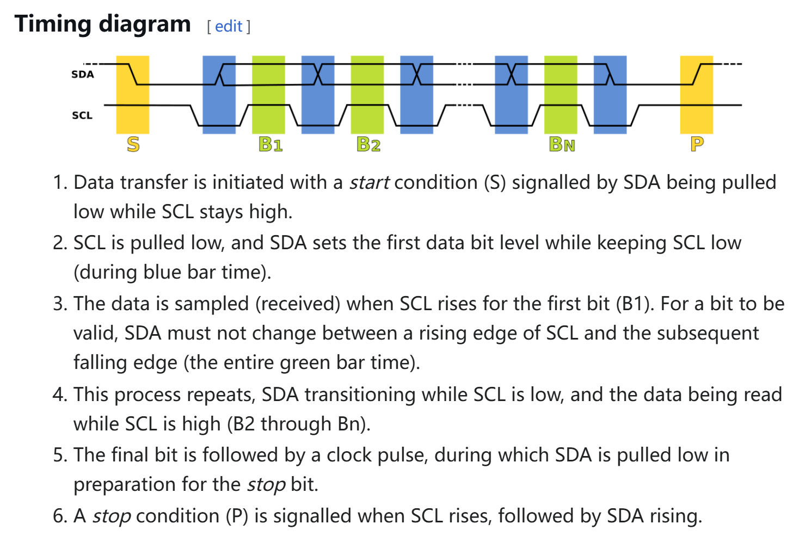
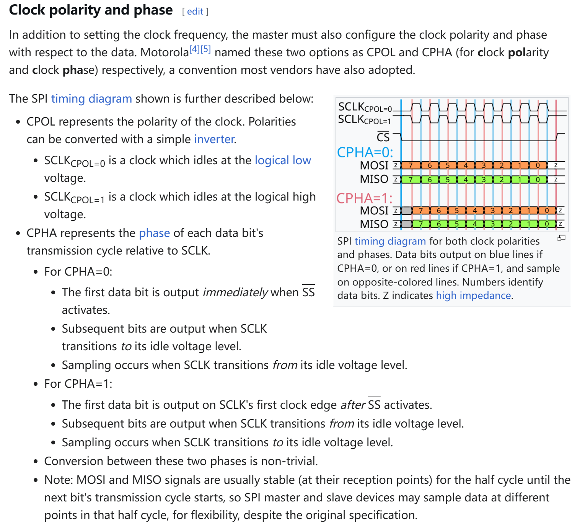

## 笔试

### 算法

- 200以内的素数求和

- 一个投色子游戏，6个人表示6个点，每个人手上10元，投到哪个点，除了这个点的人以外，都要给这个点的人1元，如果下次还是这个人，那就翻倍给1→2→4....如果有人的钱小于等于0，记录为出局，记录第一个出局的。。。


### 选择

- C语言复杂指针

    函数指针、数组指针、混起来考。

    好像收到是一个指向含有10个元素的数组的指针，还有一个函数指针，不记得了。

- 循环链表

    - 知道一个节点，可以向两边遍历？
    - 尾节点的下一个是头节点？
    - 链表遍历的，找节点

- `strlen` 和 `sizeof`

    记得`strlen` 计算字符串的长度，不包括末尾的空字符 `\0`。

    `sizeof` 计算空间大小。

- Linux 文件/目录？

    `chmod`、`chown`？

    什么权限的的 rwx，用户、群组用户、其他？u（user）、g（group）、o（others）

    r：4，w：2，x：1 `bits：0x100、0x010、0x001`

    比如：`drwxrwxr-x`，问问 deepseek

    从左到右：ugo，各占3个bit，第一个d（directory）不看。

- `bootcmd` 的作用？

    不太记得文问的什么了，按自己的来：启动内核、初始化memory controller？传递参数、下载内核到 memory中。。。

- 文件复制的命令

    `cd`、`dd `、`>` 重定向的。


## 视频面试题

> 问对物理内存和虚拟内存地址之间的了解，还有二者之间如何映射的。

自己的回答：

首先对于物理内存，是计算机系统的实际硬件内存（DDR（DRAM）、SRAM），内存芯片，实际用来存储程序和数据。

对于现代的计算机系统来说，物理内存地址空间都是统一编址的，比如从0到4GiB。

另外，计算机系统一般都不会直接访问物理地址的，为了安全和一些多道程序加载（防止各个进程互相影响）的问题，所以会使用虚拟内存地址。

其通过一个映射机制或者说数据结构来将物理地址和虚拟地址联系起来。

现代的 arch 几乎都选择的是 **分页机制**，实际就是 radix tree（基数树），维护一个页表。

但实际这个页表维护的就是一个数学函数 *f(n)* 一个地址映射到另一个地址。

具体怎么实现的，不同 arch 有不同的寄存器，但大同小异。

比如 RISC-V 的 `satp(Supervisor Address Translation and Protection)` 寄存器、x86 的 `cr3` 寄存器 ARM 的 `TTBR0(Translation Table Base Register)` 寄存器。。。

映射到核心机制就在于 MMU，一个硬件模块，做在了 CPU 内部，当然现代的 MMU 为了加速，里面其实还有个叫 TLB`(Translation Lookaside Buffer`) 的寄存器，当成MMU 的缓存，由时间局部性和空间局部性原理，存储常用的页表，就是虚拟内存如何映射到物理内存的。

具体过就是：

1. 虚拟地址拆分为页号（VPN）和页内偏移量（Offset）。

2. 然后MMU通过VPN查找页表，获取对应PFN。

    > 一些细节不展开（自己理解）
    >
    > 1. 页表由多个物理页（称为**页表页**）组成，每个页表页存储固定数量的页表项（PTE）。
    >
    > - **页表页的物理存储与容量**
    >
    >     - **页表页大小**：通常与物理内存页大小一致（如4KB）。
    >     - **页表项大小**：在RISC-V中，每个PTE占用**8字节**。
    >     - **每页表页的PTE数量**：即每个页表页可存储512个PTE。
    >
    > - **多级页表的层级结构**
    >
    >     在RISC-V Sv39中，虚拟地址被划分为三级页号（VPN[2], VPN[1], VPN[0]）和12位页内偏移（Offset）。
    >
    >     - **页表层级**：
    >         - **第一级页表**：由`satp`寄存器指向根页表页，通过VPN[2]索引到第二级页表页的基址。
    >         - **第二级页表**：通过VPN[1]索引到第三级页表页的基址。
    >         - **第三级页表（叶子页表）**：通过VPN[0]索引到最终的PTE，该PTE指向物理页帧号（PFN）。
    >     - **每个层级的页表均为独立的物理页**，因此三级页表可能占用3个物理页（最简情况）。
    >     - **实际场景**：若虚拟地址空间稀疏，高层页表可能共享部分页表页以减少内存占用。
    >
    > ------
    >
    > 2. **页表项（PTE）的结构**
    >
    > 每个PTE包含以下关键字段（以RISC-V为例）：
    >
    > - **物理页帧号（PFN）**：占据高位，指向目标物理页的基址。
    > - **控制位与权限位**：占据低位，包括：
    >     - **Valid**（有效位）：1表示该PTE已映射到物理内存。
    >     - **Read/Write/eXecute**（R/W/X）：权限控制位。
    >     - **User**（U位）：1表示用户态进程可访问。
    >     - **其他标志**：如Accessed（访问位）、Dirty（脏位）等。
    >
    > ----
    >
    > 3. **叶子PTE与非叶子PTE**
    >
    >     - **叶子PTE**：位于最底层（第三级）的PTE，其PFN直接指向物理页帧，**权限位控制该页的访问规则**。
    >     - **非叶子PTE**：位于高层（第一、二级）的PTE，其PFN指向下一级页表页的基址，**权限位通常无效（仅Valid位有意义）。**
    >
    >     **示例**：
    >
    >     - 若第三级PTE的R/W/X位为`R=1, W=0, X=0`，则该页可读但不可写、不可执行。
    >     - 若用户态进程尝试写入该页，MMU会触发权限错误异常（如Store/AMO Access Fault）。

3. PFN + Offset = 物理地址。

3. **缺页处理**：若页表项无效（未加载或权限不足），触发缺页中断，操作系统将数据从磁盘加载到物理内存，更新页表。

另外，现代的进程也是建立在分页机制上的，os 为每个进程提供抽象内存空间，主要是隔离不同的进程、有保护性。具体就是通过页表权限位实现内存隔离（如用户态与内核态隔离），同时支持共享内存（如多个进程共享代码段）。


一些提高性能的设计：

- **零拷贝优化**：写时复制（Copy-on-Write）技术减少内存冗余（如fork进程）。
- **高性能场景**：通过大页（Huge Pages）减少TLB Miss，提升数据库性能。


## 一面技术面

部分 AI 总结。

### 问答

- **进程、线程区别**

    进程和线程是操作系统并发设计的核心概念，主要区别体现在 **资源隔离性、执行粒度、通信机制** 等方面，以下是详细对比：

    ---

    #### **1. 核心定义**
    - **进程**： 
      操作系统**资源分配的基本单位**，拥有独立的虚拟地址空间、文件描述符、信号处理器等资源。 
      **示例**：浏览器中每个标签页通常作为独立进程运行，防止单页面崩溃影响整个浏览器。

    - **线程**： 
      操作系统**调度的基本单位**，共享进程的资源（如内存、文件），但拥有独立的栈、寄存器和程序计数器。
      **示例**：Web服务器（如Nginx）使用多线程处理并发请求，共享监听端口和缓存数据。

    ---

    #### **2. 关键差异**

    | **维度**          | **进程**                                | **线程**                                  |
    | ----------------- | --------------------------------------- | ----------------------------------------- |
    | **地址空间**      | 独立虚拟地址空间（需切换页表）          | 共享进程地址空间（无需切换页表）          |
    | **资源隔离性**    | 完全隔离（内存、文件、CPU时间片等）     | 共享进程资源（内存、文件），隔离栈/寄存器 |
    | **创建/切换开销** | 高（复制页表、刷新TLB、内核数据结构）   | 低（仅需分配栈和寄存器上下文）            |
    | **通信机制**      | 复杂（管道、共享内存、Socket等IPC机制） | 直接读写共享内存（需同步机制如锁/信号量） |
    | **容错性**        | 高（进程崩溃不影响其他进程）            | 低（线程崩溃可能导致整个进程终止）        |
    | **系统调用**      | `fork()`, `exec()`, `wait()`            | `pthread_create()`, `clone(CLONE_VM)`     |

    ---

    #### **3. 设计意义与场景**
    - **选择进程的场景**：
      - 需要强隔离性（如安全敏感的沙盒环境）。
      - 多任务需独立运行（如同时运行浏览器和编译器）。
      **代价**：上下文切换开销大，通信成本高。

    - **选择线程的场景**： 
      - 高并发任务（如数据库连接池、实时数据处理）。 
      - 需要高效共享数据（如GUI应用的事件处理线程）。 
      **风险**：需谨慎处理竞态条件（Race Conditions）和死锁。

    ---

    #### **4. 底层实现（以Linux为例）**
    - **进程**：通过`fork()`系统调用创建，内核复制父进程的`task_struct`和`mm_struct`（地址空间描述符），采用**写时复制（Copy-on-Write）** 优化内存复制开销。
    - **线程**：通过`clone()`系统调用创建，指定`CLONE_VM`标志共享地址空间，线程的`task_struct`复用进程的`mm_struct`。

    ```c
    // Linux中创建线程的简化逻辑
    clone(CLONE_VM | CLONE_FS | CLONE_FILES, stack_ptr, ...);
    ```

    ---

    #### **5. 高级扩展**
    - **协程（Coroutine）**：用户级线程，由程序自行调度（如Go的Goroutine），切换开销极低（纳秒级），适用于百万级并发。
    - **容器技术**：现代容器（如Docker）本质是轻量级进程组，通过命名空间（Namespace）和控制组（CGroup）实现资源隔离。

    ---

    ### **总结回答（30秒精简版）**  
    “进程是资源隔离的单位，拥有独立地址空间，适合需要高安全性的场景；线程是执行调度的单位，共享进程资源，适合高并发任务。进程切换开销大但隔离性强，线程开销小但需处理同步问题。现代系统常混合使用二者，如Chrome用多进程隔离标签页，用多线程加速渲染。”


- **进程间通信**

    | 通信方式                             | 定义与描述                                                   | 特点                                             | 优点                             | 缺点                                         | 适用场景                                             |
    | :----------------------------------- | :----------------------------------------------------------- | :----------------------------------------------- | :------------------------------- | :------------------------------------------- | :--------------------------------------------------- |
    | 管道（Pipe）                         | 一种基于文件描述符的通信机制，用于具有亲缘关系的进程之间。数据在管道中以先进先出（FIFO）的方式传输。 | 半双工通信（默认），只能单向传输；需要亲缘关系。 | 简单易用，系统开销小。           | 通信能力有限，只能在有亲缘关系的进程间使用。 | 父子进程间的简单数据传输，如命令行工具链。           |
    | 消息队列（Message Queue）            | 一种基于消息的通信机制，消息被顺序放置在队列中，进程可以向队列发送和接收消息。 | 全双工通信，基于消息的通信。                     | 解耦发送和接收进程，灵活性高。   | 需要系统支持，配置相对复杂。                 | 需要可靠消息传递的场景，如分布式系统中的消息中间件。 |
    | 共享内存（Shared Memory）            | 多个进程共享同一块内存区域，进程通过读写共享内存来交换数据。 | 高效，直接内存访问。                             | 通信速度快，适合大数据量传输。   | 同步和互斥问题需要额外处理。                 | 高性能要求的场景，如实时数据处理。                   |
    | 信号量（Semaphore）                  | 一种用于进程同步和互斥的机制，通过信号量变量来控制多个进程对资源的访问。 | 用于同步和互斥，不直接用于数据传输。             | 确保资源的正确访问。             | 仅用于控制，不能直接传输数据。               | 多进程访问共享资源时的同步控制。                     |
    | 信号（Signal）                       | 一种软件中断机制，用于通知进程发生了异步事件。               | 异步通知，简单快速。                             | 实现简单，适用于简单的异步通知。 | 传输信息量少，处理函数简单。                 | 异步事件通知，如键盘中断、子进程终止通知。           |
    | 套接字（Socket）                     | 一种网络通信接口，允许不同主机上的进程之间进行通信。         | 可以跨网络通信，灵活。                           | 通用性强，适用于分布式系统。     | 性能相对较低，配置复杂。                     | 分布式系统、客户端-服务器架构。                      |
    | 文件/记录锁定（File/Record Locking） | 通过锁定文件或记录来防止多个进程同时访问同一文件或记录。     | 用于文件共享场景。                               | 防止数据不一致。                 | 性能影响，锁定管理复杂。                     | 多进程访问同一文件的场景。                           |
    | 内存映射文件（Memory-Mapped Files）  | 将文件映射到进程的地址空间，多个进程可以通过映射的内存区域共享文件数据。 | 结合文件I/O和共享内存的优点。                    | 高效处理大文件。                 | 复杂度较高，需要管理文件映射。               | 大文件共享和处理，如数据库系统。                     |


- **中断的概念流程和理解**

    流程：保存现场，上下文切换，恢复现场。（这个不说了之前的笔记有）

    

    

    我答的重点主要在单核上的并发：

    在单核裸机环境下，虽然不存在真正的并行执行，但**中断与主程序之间的抢占会导致共享变量的竞态条件**。以下是解决方案的清晰总结：

    ---

    ### 🔒 核心解决思路
    单核环境下的并发问题源于**中断抢占主程序执行流**（或相反）。要保证互斥，核心是**确保访问共享资源的代码段（临界区）不可被中断打断**。常见方法如下：

    ---

    ### 🛠️ 具体方案及代码示例

    #### 1. **关闭中断（最常用）**
       - **原理**：在操作共享变量前关闭全局中断，操作完成后立即恢复，防止中断抢占。
       - **实现**：
         ```c
         // 以 ARM Cortex-M 为例：
         void enter_critical(void) {
             __disable_irq();      // 关闭全局中断
             __enable_irq();       // 恢复中断（仅示例，实际需保存状态）
         }
         
         // 使用示例：
         volatile int shared_var = 0;
         
         void update_shared_var(void) {
             __disable_irq();       // 进入临界区
             shared_var++;          // 安全操作共享变量
             __enable_irq();       // 退出临界区
         }
         ```
       - **注意**：需确保临界区极短（微秒级），避免影响中断响应。

    #### 2. **原子操作（依赖 CPU 支持）**
       - **原理**：利用 CPU 提供的原子指令（如 LDREX/STREX、CAS），确保读-改-写操作不可分割。
       - **实现**（ARM Cortex-M 原子自增）：
         
         ```c
         int atomic_inc(int *val) {
             int res;
             do {
                 res = __LDREXW(val) + 1;  // 原子加载并修改
             } while (__STREXW(res, val)); // 原子存储，失败则重试
             return res;
         }
         ```

    #### 3. **无锁设计（避免共享）**
       - **原理**：通过 FIFO 队列或双缓冲传递数据，减少直接共享变量。
       - **示例**：
         ```c
         #define BUFFER_SIZE 32
         volatile uint8_t buffer[BUFFER_SIZE];
         volatile int head = 0, tail = 0;
         
         // 主程序写入
         void push_data(uint8_t data) {
             buffer[head] = data;
             head = (head + 1) % BUFFER_SIZE;
         }
         
         // ISR 读取
         void ISR() {
             if (tail != head) {
                 process_data(buffer[tail]);
                 tail = (tail + 1) % BUFFER_SIZE;
             }
         }
         ```

    ---

    ### ⚠️ 关键注意事项
    1. **volatile 关键字**：防止编译器优化将变量缓存到寄存器，确保每次访问内存。
       ```c
       volatile int shared_var;  // 必须添加！
       ```
    2. **临界区长度**：关闭中断的时间必须极短，如执行简单算术或位操作。
    3. **嵌套中断处理**：若允许中断嵌套，需在 ISR 内也保护共享资源。

    ---

    ### 📊 方案对比
    | 方法     | 优点                     | 缺点                     | 适用场景         |
    | -------- | ------------------------ | ------------------------ | ---------------- |
    | 关闭中断 | 简单可靠，通用性强       | 影响中断响应延迟         | 短临界区操作     |
    | 原子操作 | 无锁，不影响中断响应     | 依赖特定 CPU 指令        | 简单读-改-写操作 |
    | 无锁设计 | 避免竞争，提高系统稳定性 | 设计复杂度高，内存占用大 | 高频数据传递场景 |

    ---

    ### 🌟 总结
    在单核裸机系统中，**关闭中断是最直接有效的互斥手段**，但需严格限制临界区长度。结合具体场景选择原子操作或无锁设计，可进一步提升系统效率和可靠性。


- **智能指针简述**

    在C++中，智能指针是用于自动化资源管理（特别是动态内存）的工具，基于**RAII（Resource Acquisition Is Initialization）**原则，确保资源在离开作用域时自动释放，从而避免内存泄漏和资源泄露。

    ---

    ### **1. 智能指针的核心目的**
    • **自动化生命周期管理**：通过对象的析构函数自动释放资源，减少手动`delete`导致的泄漏风险。
    • **所有权语义明确化**：清晰表达资源的所有权归属（独占、共享、无所有权等），增强代码可读性和安全性。
    • **异常安全**：即使在异常抛出时，智能指针仍能正确释放资源，避免传统指针的资源泄漏问题。

    ---

    ### **2. C++标准库中的智能指针类型**

    #### **(1) `std::unique_ptr`**
    • **所有权模型**：独占所有权，同一时间只能有一个`unique_ptr`指向资源，禁止拷贝（允许移动语义转移所有权）。
    • **使用场景**：
      • 管理局部动态对象（替代`auto_ptr`，C++11起更安全）。
      • 作为工厂函数的返回值，明确传递所有权。
    • **示例与特性**：

      ```cpp
      auto ptr = std::make_unique<int>(42); // 优先使用make_unique（C++14起）
      std::unique_ptr<int> ptr2 = std::move(ptr); // 所有权转移
      ```
    • **性能**：几乎无额外开销，与裸指针相当。

    #### **(2) `std::shared_ptr`**
    • **所有权模型**：共享所有权，通过引用计数管理资源，当最后一个`shared_ptr`离开作用域时释放资源。
    • **使用场景**：
      • 多个对象需共享同一资源的所有权。
      • 需要将指针存入容器且无法确定生命周期时。
    • **潜在问题**：
      • **循环引用**：若两个`shared_ptr`互相引用，引用计数无法归零，导致内存泄漏（需结合`weak_ptr`解决）。
    • **示例与优化**：

      ```cpp
      auto ptr = std::make_shared<int>(42); // 一次分配对象和引用计数块（更高效）
      auto ptr2 = ptr; // 引用计数+1
      ```

    #### **(3) `std::weak_ptr`**
    • **所有权模型**：无所有权，作为`shared_ptr`的观察者，不增加引用计数。
    • **使用场景**：
      • 打破`shared_ptr`的循环引用（如双向链表、观察者模式）。
      • 临时检查资源是否存在（通过`lock()`获取临时`shared_ptr`）。
    • **示例**：

      ```cpp
      std::weak_ptr<int> w_ptr = shared_ptr;
      if (auto s_ptr = w_ptr.lock()) { // 安全访问资源
          // 使用s_ptr
      }
      ```

    #### **(4) `std::auto_ptr`（已弃用）**
    • **历史背景**：C++98引入，尝试实现独占所有权，但存在拷贝语义不明确（隐式所有权转移）等问题，C++11起被`unique_ptr`替代。

    ---

    ### **3. 最佳实践与注意事项**
    • **优先选择`unique_ptr`**：默认使用独占所有权，减少引用计数开销和逻辑复杂度。
    • **慎用`shared_ptr`**：仅在明确需要共享所有权时使用，避免无谓的性能损耗。
    • **结合`weak_ptr`解决循环引用**：在设计双向依赖或缓存等场景时预先规避问题。
    • **使用`make_shared`和`make_unique`**：
      • 提升性能（减少内存分配次数）。
      • 保证异常安全（例如，避免因构造函数异常导致泄漏）。
    • **避免裸指针和`delete`**：仅在与遗留代码交互时使用`.get()`或`.release()`，并确保立即传递所有权。

    ---

    ### **4. 示例：循环引用与解决方案**
    ```cpp
    struct Node {
        std::shared_ptr<Node> next;
        std::weak_ptr<Node> prev; // 使用weak_ptr打破循环
    };
    
    auto node1 = std::make_shared<Node>();
    auto node2 = std::make_shared<Node>();
    node1->next = node2;
    node2->prev = node1; // 不会增加node1的引用计数
    ```

    ---

    ### **5. 总结**
    智能指针通过明确的语义和自动化管理，显著提升了C++代码的安全性和可维护性。理解每种指针的所有权模型及适用场景，结合最佳实践，能够有效避免常见陷阱（如泄漏、循环引用），编写出高效可靠的资源管理代码。

    ---

    **这样回答的优势**：
    • 覆盖了核心概念（RAII、所有权模型）、具体类型、使用场景及陷阱。
    • 结合代码示例和性能考量，展现实践经验。
    • 强调最佳实践，体现对高质量代码的追求。
    • 对比新旧特性（如`auto_ptr` vs `unique_ptr`），展示对语言演进的了解。


- **智能指针实现原理**

    智能指针的实现基于RAII原则，通过构造函数和析构函数自动管理资源。以下是C++标准库中主要智能指针的实现原理：

    1. `std::unique_ptr` 的实现原理
        - **数据结构**：内部维护一个指向资源的裸指针。
        - **构造与析构**：
            - 构造函数初始化裸指针，指向动态分配的资源。
            - 析构函数调用`delete`释放资源，避免内存泄漏。
        - **移动语义**：通过移动构造函数和移动赋值运算符转移所有权，允许资源在不同`unique_ptr`间转移，但源指针不再拥有资源。
        - **禁止拷贝**：无拷贝构造函数和拷贝赋值运算符，确保独占所有权。
    2.  `std::shared_ptr` 的实现原理
        - **数据结构**：除维护资源指针外，还维护一个控制块，存储引用计数（共享和弱引用计数）及资源删除函数等信息。
        - **构造与析构**：
            - 构造函数初始化资源指针和控制块，引用计数置为1。
            - 析构函数减少引用计数，计数归零时释放资源。
        - **引用计数**：拷贝构造和赋值运算符增加计数，析构和重置减少计数，实现共享所有权。
        - **自定义删除器**：支持绑定自定义函数或 Lambda 表达式作为删除器，灵活管理资源（如文件句柄、网络连接等）。
    3.  `std::weak_ptr` 的实现原理
        - **数据结构**：内部维护一个指向`shared_ptr`控制块的指针，不增加引用计数。
        - **构造与析构**：
            - 构造函数关联`shared_ptr`的控制块。
            - 析构函数无特殊操作，仅释放内部指针。
        - **`lock()` 方法**：生成临时`shared_ptr`，增加引用计数，安全访问资源；若资源已释放，返回空`shared_ptr`。
        - **作用**：作为观察者，避免循环引用，延迟资源访问，管理缓存数据等。


    > ---
    >
    > ### **1. 核心思想：自动管家**
    > 想象你养了一只宠物狗，每次带它出门都要牵绳，回家后要记得关门，否则它会跑丢。传统指针就像你每次都要手动关门，一旦忘记（忘记`delete`），狗就会跑丢（内存泄漏）。而智能指针就像一个自动管家，只要狗狗进了家门（创建对象），管家就会记住，并在你不需要它时（离开作用域）**自动关门**（释放内存）。
    >
    > ---
    >
    > ### **2. 最简单的智能指针：`unique_ptr`**
    > #### **实现原理**
    > - **结构**：它内部有一个“小盒子”（成员变量）保存原始指针。
    > - **独占性**：这个盒子只能有一个主人，不允许复制（拷贝构造函数被删除）。
    > - **移动**：但你可以把盒子整个“搬”给另一个主人（移动语义）。
    > - **自动清理**：当主人消失（作用域结束）时，管家自动打开盒子，清理里面的指针（调用`delete`）。
    >
    > ```cpp
    > template<typename T>
    > class SimpleUniquePtr {
    > private:
    >     T* raw_ptr; // 小盒子里存着原始指针
    > public:
    >     SimpleUniquePtr(T* ptr) : raw_ptr(ptr) {} // 创建时接管指针
    >     ~SimpleUniquePtr() { delete raw_ptr; }     // 析构时自动释放
    > 
    >     // 禁止拷贝（关键！）
    >     SimpleUniquePtr(const SimpleUniquePtr&) = delete;
    >     SimpleUniquePtr& operator=(const SimpleUniquePtr&) = delete;
    > 
    >     // 允许移动（搬动盒子）
    >     SimpleUniquePtr(SimpleUniquePtr&& other) : raw_ptr(other.raw_ptr) {
    >         other.raw_ptr = nullptr; // 原主人不再拥有指针
    >     }
    > };
    > ```
    >
    > #### **使用示例**
    > ```cpp
    > {
    >     SimpleUniquePtr<int> ptr(new int(42)); // 创建，管家记住指针
    >     // 离开作用域时，自动调用析构函数，delete释放内存
    > }
    > ```
    >
    > ---
    >
    > ### **3. 共享型智能指针：`shared_ptr`**
    > #### **实现原理**
    > - **引用计数**：管家准备了一个“计数器”（引用计数），记录有多少人在使用这个指针。
    > - **共享所有权**：每次复制`shared_ptr`时，计数器+1；每次销毁时，计数器-1。
    > - **自动释放**：当计数器归零时，管家清理指针。
    >
    > ```cpp
    > template<typename T>
    > class SimpleSharedPtr {
    > private:
    >     T* raw_ptr;
    >     int* ref_count; // 引用计数器（指针形式，多个shared_ptr共享）
    > 
    > public:
    >     SimpleSharedPtr(T* ptr) : raw_ptr(ptr), ref_count(new int(1)) {}
    > 
    >     // 拷贝构造函数：计数器+1
    >     SimpleSharedPtr(const SimpleSharedPtr& other) 
    >         : raw_ptr(other.raw_ptr), ref_count(other.ref_count) {
    >         (*ref_count)++;
    >     }
    > 
    >     // 析构函数：计数器-1，归零时释放
    >     ~SimpleSharedPtr() {
    >         (*ref_count)--;
    >         if (*ref_count == 0) {
    >             delete raw_ptr;
    >             delete ref_count;
    >         }
    >     }
    > };
    > ```
    >
    > #### **使用示例**
    > ```cpp
    > {
    >     SimpleSharedPtr<int> ptr1(new int(42)); // 计数器=1
    >     {
    >         SimpleSharedPtr<int> ptr2 = ptr1; // 计数器=2
    >     } // ptr2析构，计数器=1
    > } // ptr1析构，计数器=0，自动释放内存
    > ```
    >
    > ---
    >
    > ### **4. 辅助型智能指针：`weak_ptr`**
    > #### **为什么需要它？**
    > - **循环引用问题**：比如两人互相说“你先挂电话，我再挂”，结果永远挂不断。
    > - **解决方案**：`weak_ptr`像是一个“观察员”，不参与计数，只观察资源是否存在。
    >
    > #### **实现原理**
    > - **不持有计数器**：`weak_ptr`内部保存指针，但不增加引用计数。
    > - **检查有效性**：通过`lock()`方法，可以临时获取一个`shared_ptr`来使用资源（如果资源还存在）。
    >
    > ```cpp
    > template<typename T>
    > class SimpleWeakPtr {
    > private:
    >     T* raw_ptr;
    >     int* ref_count; // 指向shared_ptr的计数器
    > 
    > public:
    >     SimpleWeakPtr(const SimpleSharedPtr<T>& shared) 
    >         : raw_ptr(shared.raw_ptr), ref_count(shared.ref_count) {}
    > 
    >     // 尝试获取临时shared_ptr
    >     SimpleSharedPtr<T> lock() {
    >         if (*ref_count > 0) {
    >             return SimpleSharedPtr<T>(raw_ptr); // 这里需要更复杂的实现
    >         } else {
    >             return nullptr;
    >         }
    >     }
    > };
    > ```
    >
    > ---
    >
    > ### **5. 智能指针的“高效秘诀”**
    > - **`make_shared`和`make_unique`**：直接申请一块大内存，同时存放对象和引用计数，减少内存碎片，提高速度。
    > - **异常安全**：如果使用`new`后再传给智能指针，中间如果发生异常，可能导致内存泄漏。而`make_`系列函数一步到位，杜绝这个问题。
    >
    > ---
    >
    > ### **总结：智能指针如何帮你省心？**
    > - **`unique_ptr`**：独居管家，只服务一个主人，搬家时彻底交接。
    > - **`shared_ptr`**：合租管家，记录所有租客数量，最后一个离开时打扫房间。
    > - **`weak_ptr`**：不租房只敲门，确认有人住才临时访问。
    >
    > 理解了这些，你就掌握了智能指针的核心！实际使用中，99%的情况只需记住：
    > - 默认用`unique_ptr`，简单高效。
    > - 需要共享时用`shared_ptr`，但要小心循环引用。
    > - 遇到循环引用时，用`weak_ptr`破局。


- **指针和引用**

    在C++中，指针（Pointer）和引用（Reference）都是用于间接访问内存对象的机制，但它们在语法、语义和使用场景上有本质区别。

    ---

    ### **1. 本质定义**
    - **指针**：存储内存地址的变量类型（32位系统占4字节，64位占8字节）
    - **引用**：已存在对象的别名（编译器符号表实现，无独立内存空间）

    ---

    ### **2. 核心差异**

    | 特性             | 指针                         | 引用                           |
    | ---------------- | ---------------------------- | ------------------------------ |
    | **空值**         | 可以赋值为`nullptr`          | 必须绑定有效对象（不可为空）   |
    | **重新绑定**     | 可修改指向不同对象           | 初始化后终身绑定固定对象       |
    | **内存占用**     | 独立存储地址的变量           | 编译器实现的语法别名（零开销） |
    | **多级间接访问** | 支持多级指针（`int** p`）    | 仅一级引用                     |
    | **操作方式**     | `->`和`*`操作符访问对象      | 直接使用原对象语法             |
    | **参数传递语义** | 值传递（需解引用修改原对象） | 直接传递原对象别名             |
    | **数组支持**     | 支持指针算术运算             | 不可直接表示引用数组           |
    | **sizeof结果**   | 返回指针大小                 | 返回被引用对象大小             |

    ---

    ### **3. 底层实现对比**
    - **指针**：显式存储目标地址，访问需要显式解引用
      ```cpp
      int x = 10;
      int* p = &x;  // 内存中存储0x7ffd34a2bc1c之类的地址
      ```
    - **引用**：编译器维护的符号映射（汇编级与指针相似，但语法层不同）
      
      ```cpp
      int& r = x;   // r直接映射到x的内存位置
      ```

    ---

    ### **4. 典型使用场景**
    - **指针适用场景**：
      - 动态内存管理（new/delete）
      - 需要重新指向不同对象
      - 处理多态对象（基类指针指向派生类）
      - 需要表示"无对象"的特殊状态（nullptr）

    - **引用适用场景**：
      - 函数参数传递（避免拷贝，强制非空）
      - 运算符重载（如`operator=`）
      - 函数返回值（返回左值）
      - 实现完美转发（forwarding reference）

    ---

    ### **5. 关键代码示例**
    ```cpp
    // 指针特性演示
    int a = 10, b = 20;
    int* p = &a;  // 指向a
    p = &b;       // 合法：改变指向
    *p = 30;      // 修改b的值
    
    // 引用特性演示
    int& r = a;   // r是a的别名
    r = 40;       // 直接修改a的值
    // int& null_ref;  // 编译错误：必须初始化
    // r = b;         // 不是改变引用目标，而是将b的值赋给a
    ```

    ---

    ### **6. 高级注意事项**
    1. **常量限定**：
       - `const int*` vs `int* const`
       - `const int&`可绑定字面量（`const int& r = 5;`合法）

    2. **类型转换**：
       - 指针支持显式类型转换（`reinterpret_cast`等）
       - 引用转换需要`static_cast`显式处理

    3. **模板元编程**：
       - 引用类型会保留类型信息（引用折叠规则）
       - 指针类型在模板推导中视为普通指针类型

    4. **内存安全**：
       - 野指针（dangling pointer）是常见错误类型
       - 悬空引用（dangling reference）同样危险但更难检测

    ---

    ### **7. 设计哲学**
    - **指针**：提供对内存的直接操作能力，体现C++的底层控制特性
    - **引用**：作为更安全的别名机制，支持函数式编程范式

    选择原则：优先使用引用保证安全性，必须需要指针特性时再使用指针。现代C++中，引用在参数传递、返回值等场景已取代大部分指针的传统用法。


- **malloc 和 new区别**

    在C++中，`malloc`（C库函数）和`new`（C++运算符）都是动态内存分配工具，但它们的底层机制、语义和适用场景有本质区别。

    ---

    ### **1. 语言归属与底层机制**
    | **特性**         | `malloc` / `free`  | `new` / `delete`          |
    | ---------------- | ------------------ | ------------------------- |
    | **语言标准**     | C标准库函数        | C++运算符（语言核心特性） |
    | **内存分配方式** | 显式分配原始内存块 | 分配内存并调用构造函数    |
    | **内存释放方式** | 直接释放内存       | 调用析构函数后释放内存    |

    ---

    ### **2. 核心差异**

    #### **2.1 初始化与对象构造**
    - **`malloc`**：
      
      ```cpp
      int* p = (int*)malloc(sizeof(int));  // 分配未初始化的内存
      *p = 10;  // 需要手动初始化
      ```
      - 仅分配原始内存，不执行对象构造
      - 对非POD（Plain Old Data）类型可能引发未定义行为
      
    - **`new`**：
      ```cpp
      int* p = new int(10);        // 分配内存并初始化
      MyClass* obj = new MyClass;  // 调用构造函数
      ```
      - 分配内存后自动调用构造函数
      - 保证类型安全的对象初始化

    #### **2.2 失败处理**
    - **`malloc`**：返回`NULL`（需手动检查）
      ```cpp
      if (p == NULL) { /* 处理错误 */ }
      ```
    - **`new`**：抛出`std::bad_alloc`异常（默认）
      ```cpp
      try {
          int* p = new int[10000000000];
      } catch (const std::bad_alloc& e) {
          // 处理内存不足
      }
      ```
      - 可通过`nothrow`版本返回`nullptr`：
        ```cpp
        int* p = new (std::nothrow) int[100];
        ```

    #### **2.3 内存大小计算**
    - **`malloc`**：需手动计算字节数
      
      ```cpp
      struct Data { int a; double b; };
      Data* p = (Data*)malloc(sizeof(Data));
      ```
    - **`new`**：自动计算类型大小
      ```cpp
      Data* p = new Data;  // 编译器自动计算sizeof(Data)
      ```

    ---

    ### **3. 类型安全性**
    | **特性**     | `malloc`                     | `new`          |
    | ------------ | ---------------------------- | -------------- |
    | **类型转换** | 需要显式强制类型转换         | 自动类型推导   |
    | **类型检查** | 无（可能因类型不匹配导致UB） | 编译时类型检查 |

    ```cpp
    // malloc需要显式转换
    float* p = (float*)malloc(sizeof(float));
    
    // new自动匹配类型
    float* p = new float;
    ```

    ---

    ### **4. 构造/析构函数**
    | **操作**         | `malloc`/`free` | `new`/`delete` |
    | ---------------- | --------------- | -------------- |
    | **构造函数调用** | ❌ 不调用        | ✅ 调用         |
    | **析构函数调用** | ❌ 不调用        | ✅ 调用         |

    **示例：**

    ```cpp
    class MyClass {
    public:
        MyClass() { std::cout << "Constructor\n"; }
        ~MyClass() { std::cout << "Destructor\n"; }
    };
    
    // malloc + free
    MyClass* p1 = (MyClass*)malloc(sizeof(MyClass));  // 无构造
    free(p1);  // 无析构
    
    // new + delete
    MyClass* p2 = new MyClass;  // 调用构造函数
    delete p2;                  // 调用析构函数
    ```

    ---

    ### **5. 重载机制**
    - **`malloc`**：不可重载
    - **`new`**：支持全局或类特定的运算符重载
      ```cpp
      // 全局operator new重载
      void* operator new(size_t size) {
          std::cout << "Allocating " << size << " bytes\n";
          return malloc(size);
      }
      ```

    ---

    ### **6. 内存来源**
    | **分配方式** | `malloc`            | `new`                      |
    | ------------ | ------------------- | -------------------------- |
    | **内存池**   | 从C运行时库的堆分配 | 默认通过`operator new`分配 |
    | **可扩展性** | 固定实现            | 可通过重载改变分配策略     |

    ---

    ### **7. 多态支持**
    - **`malloc`**：无法直接创建多态对象
    - **`new`**：支持多态对象创建
      ```cpp
      class Base { virtual void func() {} };
      class Derived : public Base {};
      
      Base* p = new Derived;  // 正确创建派生类对象
      ```

    ---

    ### **8. 使用场景对比**
    | **场景**         | `malloc`/`free`           | `new`/`delete`   |
    | ---------------- | ------------------------- | ---------------- |
    | **C兼容代码**    | ✅ 必须使用                | ❌ 无法混合使用   |
    | **POD数据类型**  | ✅ 适用                    | ✅ 更安全         |
    | **非POD对象**    | ❌ 危险（不调用构造/析构） | ✅ 必须使用       |
    | **内存池定制**   | ❌ 不可控                  | ✅ 可通过重载定制 |
    | **低层内存操作** | ✅ 直接控制字节            | ❌ 抽象层次高     |

    ---

    ### **9. 关键代码示例**
    ```cpp
    // malloc/free示例
    int* arr1 = (int*)malloc(5 * sizeof(int));
    free(arr1);
    
    // new/delete示例
    int* arr2 = new int[5]{1,2,3,4,5};  // 初始化列表
    delete[] arr2;
    
    // 对象示例
    class Student {
        std::string name;
    public:
        Student(const std::string& n) : name(n) {}
    };
    
    Student* s1 = (Student*)malloc(sizeof(Student));  // 危险！未构造对象
    // s1->name = "Alice";  // 可能崩溃
    
    Student* s2 = new Student("Bob");  // 正确构造
    delete s2;
    ```

    ---

    ### **10. 现代C++演进**
    - **`new`的替代方案**：
      - `std::make_unique` / `std::make_shared`（智能指针）
      - 容器类（`std::vector`等）
    - **`malloc`的现代用法**：
      - 仅在与C库交互时使用（如：`FILE*`操作）
      - 实现自定义内存管理器时作为底层分配器

    ---

    ### **总结选择原则**
    | **情况**                     | **推荐方式**     |
    | ---------------------------- | ---------------- |
    | C++对象（尤其非POD）         | `new`/`delete`   |
    | 需要构造/析构的类            | 必须用`new`      |
    | 原始字节操作（如网络缓冲区） | `malloc`+`free`  |
    | 兼容C代码的接口              | `malloc`+`free`  |
    | 现代C++开发                  | 优先使用智能指针 |


- 野指针和内存泄露

    在C++内存管理中，**野指针（Dangling Pointer）**和**内存泄漏（Memory Leak）**是两类截然不同但都可能导致严重问题的缺陷。以下是专业级的对比分析与解决方案：

    ---

    ### **1. 核心概念对比**
    | **特性**     | 野指针 (Dangling Pointer)    | 内存泄漏 (Memory Leak)            |
    | ------------ | ---------------------------- | --------------------------------- |
    | **本质**     | 指向无效内存地址的指针       | 已分配的内存无法被释放或回收      |
    | **直接危害** | 程序崩溃、数据损坏、安全漏洞 | 程序内存占用持续增长，最终导致OOM |
    | **触发时机** | 访问已释放内存时             | 程序运行期间逐渐积累              |
    | **检测难度** | 高（随机崩溃，难以复现）     | 中（可通过工具监控内存增长）      |

    ---

    ### **2. 产生原因与典型场景**

    #### **2.1 野指针成因**
    1. **释放后未置空**  
       ```cpp
       int* p = new int(10);
       delete p;     // 内存释放
       *p = 20;      // 野指针访问！行为未定义
       ```

    2. **返回局部变量地址**  
       ```cpp
       int* createInt() {
           int x = 5;
           return &x;  // 返回栈内存指针，函数返回后x被销毁
       }
       ```

    3. **多指针共享资源**  
       ```cpp
       int* p1 = new int(10);
       int* p2 = p1;
       delete p1;     // p2现在成为野指针
       ```

    4. **迭代器失效后使用**  
       ```cpp
       std::vector<int> vec{1,2,3};
       auto it = vec.begin();
       vec.push_back(4);  // 可能导致迭代器失效
       *it = 5;           // 野指针行为
       ```

    #### **2.2 内存泄漏成因**
    1. **直接未释放动态内存**  
       ```cpp
       void leak() {
           int* p = new int[100];  // 未调用delete[]
       }
       ```

    2. **异常导致释放代码未执行**  
       ```cpp
       void unsafe() {
           int* p = new int;
           throw std::exception();  // 异常跳过delete
           delete p;
       }
       ```

    3. **循环引用（使用智能指针时）**  
       ```cpp
       class Node {
           std::shared_ptr<Node> next;
       };
       auto n1 = std::make_shared<Node>();
       auto n2 = std::make_shared<Node>();
       n1->next = n2;
       n2->next = n1;  // 循环引用导致无法释放
       ```

    4. **静态对象持有动态资源**  
       ```cpp
       static std::vector<int>* globalVec = new std::vector<int>();  // 程序结束前未释放
       ```

    ---

    ### **3. 危害性对比**
    | **危害类型**   | 野指针                           | 内存泄漏                 |
    | -------------- | -------------------------------- | ------------------------ |
    | **短期影响**   | 随机崩溃、数据覆盖               | 无明显症状               |
    | **长期影响**   | 安全漏洞（如缓冲区溢出攻击）     | 内存耗尽、程序被系统终止 |
    | **调试难度**   | 难以定位（崩溃点非真实错误位置） | 可通过内存分析工具定位   |
    | **平台相关性** | 所有支持指针的语言               | 所有手动内存管理的语言   |

    ---

    ### **4. 代码示例与调试分析**

    #### **4.1 野指针崩溃案例**
    ```cpp
    int main() {
        int* p = new int(10);
        delete p;
        // 未置空指针
        std::cout << *p << std::endl;  // 访问已释放内存（可能输出乱码或崩溃）
        return 0;
    }
    ```
    **调试现象**：在Release模式下可能“正常”输出10（内存未被覆盖），Debug模式下触发访问冲突。

    #### **4.2 内存泄漏增长示例**
    ```cpp
    void leaky_func() {
        static int count = 0;
        int* p = new int[1024];  // 每次调用泄漏4KB
        ++count;
    }
    
    int main() {
        while(true) {
            leaky_func();  // 内存持续增长
        }
    }
    ```
    **监控数据**：任务管理器可见进程内存占用持续上升，直至崩溃。

    ---

    ### **5. 检测与预防方案**

    #### **5.1 野指针防护**
    1. **立即置空策略**  
       ```cpp
       delete p;
       p = nullptr;  // 后续访问会触发段错误而非UB
       ```

    2. **使用智能指针**  
       ```cpp
       std::unique_ptr<int> p(new int(10));  // 自动管理生命周期
       ```

    3. **限制指针作用域**  
       ```cpp
       {
           std::unique_ptr<int> p = std::make_unique<int>(10);
       }  // 离开作用域自动释放
       ```

    4. **静态代码分析工具**  
       - Clang-Tidy (`bugprone-use-after-move`)
       - PVS-Studio (`V774`检测规则)

    #### **5.2 内存泄漏治理**
    1. **RAII原则**  
       ```cpp
       class ResourceHolder {
           int* data;
       public:
           ResourceHolder(size_t size) : data(new int[size]) {}
           ~ResourceHolder() { delete[] data; }
       };
       ```

    2. **智能指针全覆盖**  
       ```cpp
       auto p = std::make_shared<MyObject>();  // 引用计数自动释放
       ```

    3. **异常安全设计**  
       ```cpp
       void safe_func() {
           auto res = std::make_unique<Resource>();
           // 可能抛出异常的操作
           res->do_something();
           // 无需手动释放，unique_ptr保证异常安全
       }
       ```

    4. **检测工具链**  
       - Valgrind Memcheck：  
         `valgrind --leak-check=full ./your_program`
       - AddressSanitizer（ASan）：  
         `g++ -fsanitize=address -g your_code.cpp`

    ---

    ### **6. 现代C++最佳实践**
    1. **禁用裸指针**（项目级规范）
       ```cpp
       // 代码审查禁止出现new/delete
       #define new DELIBERATELY_DISABLED
       ```

    2. **使用容器替代动态数组**  
       ```cpp
       std::vector<int> data(100);  // 自动管理内存
       ```

    3. **循环引用解决方案**  
       ```cpp
       class Node {
           std::weak_ptr<Node> next;  // 打破循环引用
       };
       ```

    4. **内存池定制**  
       ```cpp
       template<typename T>
       class ObjectPool {  // 统一管理对象生命周期
           std::vector<std::unique_ptr<T>> pool;
       };
       ```

    ---

    ### **7. 总结：关键区别与选择**
    | **决策点**      | 野指针                     | 内存泄漏                        |
    | --------------- | -------------------------- | ------------------------------- |
    | **防御核心**    | 生命周期管理 + 指针置空    | 资源所有权清晰化 + RAII         |
    | **调试优先级**  | 高（可能导致即时崩溃）     | 中（需长期运行暴露问题）        |
    | **现代C++方案** | `unique_ptr`/`scope guard` | `make_shared`/容器类            |
    | **架构级防御**  | 静态分析 + 代码规范        | 智能指针全覆盖 + 泄漏检测工具链 |

    **终极原则**：  
    - 通过类型系统（如智能指针）将内存管理问题转化为编译期错误  
    - 使用ASan/Valgrind在CI/CD流水线中强制检测  
    - 遵循C++ Core Guidelines的R规则（资源管理）


- **UART、I2C、SPI 通信协议对比分析**

    ### **1. UART（Universal Asynchronous Receiver/Transmitter）**
    #### **1.1 核心特性**
    - **通信类型**：异步串行通信（无共享时钟）
    - **线数**：2 根（TX：发送，RX：接收）
    - **拓扑结构**：点对点（1:1 通信）
    - **传输方向**：全双工（同时收发）
    - **电平标准**：TTL（3.3V/5V）、RS-232（±12V）

    #### **1.2 时序特征**
    - **帧结构**： 
      **起始位（1bit） + 数据位（5-9bit） + 校验位（可选） + 停止位（1-2bit）** 
      
    - **关键参数**：  
      - **波特率（Baud Rate）**：双方需严格一致（如 9600、115200）  
      - **时钟误差容忍度**：通常要求误差 < 3%（依赖数据帧长度）

    #### **1.3 硬件层细节**
    - **线缆要求**：  
      - 无需时钟线，但需共地（GND）  
      - 长距离需电平转换（如 MAX232 芯片转 RS-232）  
    - **冲突检测**：无硬件仲裁机制  
    - **典型应用**：  
      - 调试串口（Console）  
      - GPS 模块、蓝牙模块通信  

    ---

    ### **2. I2C（Inter-Integrated Circuit）**
    #### **2.1 核心特性**
    - **通信类型**：同步半双工（共享时钟）
    - **线数**：2 根（SDA：数据线，SCL：时钟线）
    - **拓扑结构**：多主多从（总线型，需设备地址）
    - **传输速度**：  
      - 标准模式（100 kbps）  
      - 快速模式（400 kbps）  
      - 高速模式（3.4 Mbps）
    - **电平标准**：开漏输出（需外接上拉电阻）

    #### **2.2 时序特征**
    - **帧结构**：  
      **起始条件 + 地址帧（7/10bit） + 读写位 + ACK/NACK + 数据帧 + 停止条件**  
      
      
      
    - **关键操作**：  
      
      - **起始条件（Start）**：SCL 高电平时 SDA 从高→低  
      - **停止条件（Stop）**：SCL 高电平时 SDA 从低→高  
      - **ACK/NACK**：第9个时钟周期确认  

    #### **2.3 硬件层细节**
    - **硬件设计**：  
      - 总线需接上拉电阻（通常 4.7kΩ）  
      - 支持多设备（地址冲突需硬件跳线）  
    - **仲裁机制**：基于 SDA 线“线与”特性（低电平优先）  
    - **时钟同步**：支持时钟拉伸（Slave 可拉低 SCL）  
    - **典型应用**：  
      - 传感器（如 BME280 温湿度传感器）  
      - EEPROM（如 AT24C02）  

    ---

    ### **3. SPI（Serial Peripheral Interface）**
    #### **3.1 核心特性**
    - **通信类型**：同步全双工（共享时钟）
    - **线数**：4 根（SCLK、MOSI、MISO、CS）  
      - **SCLK**：时钟信号（主设备控制）  
      - **MOSI**：主设备发送，从设备接收  
      - **MISO**：主设备接收，从设备发送  
      - **CS（SS）**：片选信号（每个从设备独立）  
    - **拓扑结构**：一主多从（星型拓扑）  
    - **传输速度**：可达 100+ Mbps（依赖硬件）  
    - **电平标准**：推挽输出（无需上拉电阻）

    #### **3.2 时序特征**
    - **时钟模式**：  
      - **CPOL（时钟极性）**：空闲时 SCLK 电平（0=低，1=高）  
      - **CPHA（时钟相位）**：数据采样边沿（0=第一个边沿，1=第二个边沿）  
      - 组合形成 4 种模式（Mode 0-3） 
      
      
      
    - **数据传输**：  
      
      - 主设备通过 SCLK 边沿触发数据移位  
      - 全双工传输（MOSI 和 MISO 同时工作）

    #### **3.3 硬件层细节**
    - **硬件设计**：  
      - 每个从设备需独立 CS 线（N 个从设备需 N+3 根线）  
      - 短距离通信（通常 < 1m）  
    - **无寻址机制**：通过 CS 信号选择从设备  
    - **高速优化**：支持 DMA 传输（减少 CPU 开销）  
    - **典型应用**：  
      - 高速 ADC/DAC（如 ADS131M08）  
      - 显示屏（如 OLED SSD1306）  
      - Flash 存储器（如 W25Q128）  

    ---

    ### **4. 三协议对比总结**
    | **特性**       | **UART**             | **I2C**             | **SPI**                |
    | -------------- | -------------------- | ------------------- | ---------------------- |
    | **线数**       | 2（TX+RX）           | 2（SDA+SCL）        | 4（SCLK+MOSI+MISO+CS） |
    | **传输方向**   | 全双工               | 半双工              | 全双工                 |
    | **拓扑结构**   | 点对点               | 总线型（多主多从）  | 星型（一主多从）       |
    | **时钟信号**   | 无（异步）           | 同步（SCL）         | 同步（SCLK）           |
    | **寻址方式**   | 无（仅点对点）       | 7/10 位设备地址     | 硬件片选（CS）         |
    | **速度**       | 低（通常 < 1 Mbps）  | 中（最高 3.4 Mbps） | 高（可达 100+ Mbps）   |
    | **硬件复杂度** | 低                   | 中（需上拉电阻）    | 高（多片选线）         |
    | **抗干扰能力** | 弱（依赖波特率匹配） | 中（总线电容影响）  | 强（推挽输出）         |
    | **典型场景**   | 调试接口、模块间通信 | 传感器、低速设备    | 高速外设、存储器       |

    ---

    ### **5. 选型建议**
    - **选择 UART**：  
      - 简单双向通信，无需实时性  
      - 跨平台兼容性要求高（如与 PC 通信）  

    - **选择 I2C**：  
      - 多设备共享总线，节省引脚资源  
      - 中低速传感器网络（如温湿度+气压传感器组合）  

    - **选择 SPI**：  
      - 高速数据传输（如摄像头图像传输）  
      - 全双工实时控制（如电机驱动+反馈）  

    ---

    ### **6. 高级设计注意事项**
    1. **UART 的波特率误差**：  
       - 使用高精度晶振（误差 < 0.1%）  
       - 避免长距离传输（建议 < 1m，或使用 RS-485）  

    2. **I2C 的总线电容**：  
       - 总电容需 < 400pF（过长线缆需分段缓冲）  
       - 使用 I2C 电平转换器（如 PCA9306）实现 3.3V/5V 混接  

    3. **SPI 的时钟偏移**：  
       - 等长布线（SCLK 与数据线长度差 < 5mm）  
       - 高速模式下使用阻抗匹配（如 50Ω 端接电阻）  

    4. **抗干扰设计**：  
       - UART/I2C：使用双绞线 + 屏蔽层  
       - SPI：差分信号（如 SPI 转 LVDS）  

    ---

    ### **7. 代码示例（SPI 模式配置）**
    ```c
    // SPI Mode 0 (CPOL=0, CPHA=0)
    SPI_InitTypeDef spi;
    spi.Mode = SPI_MODE_MASTER;
    spi.Direction = SPI_DIRECTION_2LINES; // 全双工
    spi.DataSize = SPI_DATASIZE_8BIT;
    spi.CLKPolarity = SPI_POLARITY_LOW;   // CPOL=0
    spi.CLKPhase = SPI_PHASE_1EDGE;       // CPHA=0
    spi.NSS = SPI_NSS_SOFT;               // 软件控制CS
    HAL_SPI_Init(&spi);
    ```

    ---

    ### **总结**  
    - **UART**：简单灵活，适合松散耦合的异步通信  
    - **I2C**：引脚高效，适合中低速多设备场景  
    - **SPI**：性能王者，专为高速全双工设计 
    根据实际需求选择协议，并结合硬件设计与信号完整性优化，可构建稳定可靠的嵌入式通信系统。

    -----

    > 补充，SPI 可能比较复杂。快速过一遍：
    >
    > ### **SPI 协议从零详解（超详细保姆级教程）**
    >
    > ----
    >
    > #### **一、SPI 是什么？**
    > SPI（Serial Peripheral Interface）是一种**同步、全双工、主从式**的串行通信协议，专门用于短距离高速通信（通常芯片间距离 < 1米）。它的核心特点是：
    > - **同步**：通信双方共用时钟信号（SCLK）
    > - **全双工**：可以同时发送和接收数据
    > - **主从架构**：1个主设备控制总线，多个从设备通过片选信号（CS）连接
    >
    > 类比理解：想象主设备是老师，从设备是学生。老师通过点名（CS信号）选择要提问的学生，然后用统一的铃声（SCLK）控制问答节奏，学生和老师可以同时说话和听讲。
    >
    > ----
    >
    > #### **二、SPI 的物理连接**
    > SPI 需要至少 **4 根物理线路**：
    > | 线名      | 全称                     | 方向                | 作用                                           |
    > | --------- | ------------------------ | ------------------- | ---------------------------------------------- |
    > | **SCLK**  | Serial Clock             | 主→从               | 主设备产生的同步时钟信号                       |
    > | **MOSI**  | Master Out Slave In      | 主→从               | 主设备发送数据，从设备接收数据                 |
    > | **MISO**  | Master In Slave Out      | 从→主               | 从设备发送数据，主设备接收数据                 |
    > | **CS/SS** | Chip Select/Slave Select | 主→从（每个从独立） | 主设备通过拉低此线选中特定从设备（类似"点名"） |
    >
    > **硬件连接示意图**：
    >
    > ```
    > 主设备
    > ┌──────────────┐
    > │              │     CS1 ───────────────┐
    > │   SCLK ──────┼───────────SCLK         │
    > │   MOSI ──────┼───────────MOSI         │
    > │   MISO ──────┼───────────MISO         │
    > │              │     CS2 ───────────────┤
    > └──────────────┘                        │
    >                                 从设备1 从设备2
    >                                 ┌─────┐ ┌─────┐
    >                                 │     │ │     │
    >                                 └─────┘ └─────┘
    > ```
    >
    > ----
    >
    > #### **三、SPI 时序深度解析**
    > ##### **1. 时钟模式（关键难点！）**
    > SPI 有 **4 种工作模式**，由两个参数决定：
    > - **CPOL（Clock Polarity）**：时钟空闲时的电平
    >   - 0：空闲时 SCLK 为低电平
    >   - 1：空闲时 SCLK 为高电平
    > - **CPHA（Clock Phase）**：数据采样时刻
    >   - 0：在时钟的**第一个边沿**（上升沿或下降沿）采样数据
    >   - 1：在时钟的**第二个边沿**采样数据
    >
    > **四种模式对照表**：
    >
    > | 模式 | CPOL | CPHA | 采样时刻                  | 应用场景     |
    > | ---- | ---- | ---- | ------------------------- | ------------ |
    > | 0    | 0    | 0    | 上升沿采样（时钟从低→高） | 大多数传感器 |
    > | 1    | 0    | 1    | 下降沿采样（时钟从高→低） | 某些存储器   |
    > | 2    | 1    | 0    | 下降沿采样（时钟从高→低） | 高速 ADC/DAC |
    > | 3    | 1    | 1    | 上升沿采样（时钟从低→高） | 特殊协议设备 |
    >
    > **Mode 0 时序图详解**：
    >
    > ```
    > SCLK   ___     ̄͞ ̄͞ ̄͞ ̄͞ ̄͞ ̄͞ ̄͞ ̄͞     ___ 
    >        ͞ ¯͞ ¯͞ ¯͞ ¯͞ ¯͞ ¯͞ ¯͞ ¯͞ ¯
    >        | 1 | 2 | 3 | 4 | 5 | 6 | 7 | 8 |  <- 时钟周期
    > MOSI   ----[D7]---[D6]---[D5]---[D4]---...
    >        ___                     ___
    > MISO   ͞ ¯͞ ¯͞ ¯͞ ¯͞ ¯͞ ¯͞ ¯͞ ¯͞ ¯
    > ```
    > - 每个时钟周期传输 1 bit 数据（8 个周期传 1 字节）
    > - 数据在 SCLK 的**上升沿被采样**
    > - 主从设备在 SCLK 的**下降沿切换数据**
    >
    > -----
    >
    > ##### **2. 完整通信流程（以 Mode 0 为例）**
    > 1. **片选激活**：主设备拉低目标从设备的 CS 线
    > 2. **时钟启动**：主设备开始产生 SCLK 信号
    > 3. **数据传输**：
    >    - **主→从**：主设备在 SCLK 下降沿将数据放到 MOSI 线上
    >    - **从→主**：从设备在 SCLK 下降沿将数据放到 MISO 线上
    >    - **数据采样**：双方在 SCLK 上升沿读取对方的数据
    > 4. **传输结束**：主设备拉高 CS 线
    >
    > **关键特点**：
    > - **全双工优势**：每个时钟周期同时收发 1 bit 数据
    > - **无地址字段**：完全依赖硬件片选（CS）
    > - **无确认机制**：假设物理连接可靠
    >
    > ----
    >
    > #### **四、SPI 的硬件实现细节**
    > ##### **1. 电路设计要点**
    > - **推挽输出**：SPI 通常采用推挽驱动，无需上拉电阻
    > - **片选管理**：每个从设备需要独立的 CS 线（N 个从设备需要 N+3 根线）
    > - **电平匹配**：确保主从设备电压一致（3.3V 与 5V 设备需电平转换）
    >
    > ##### **2. 速度优化技巧**
    > - **时钟频率**：可达 50MHz+（STM32H7 系列支持 133MHz）
    > - **DMA 传输**：减少 CPU 参与（适合大数据块传输）
    > - **双线模式**：关闭 MISO 或 MOSI 实现半双工（节省引脚）
    >
    > ----
    >
    > #### **五、SPI 模式配置实战（以 Arduino 为例）**
    > ```cpp
    > // 配置 SPI 为 Mode 0，频率 1MHz
    > #include <SPI.h>
    > 
    > void setup() {
    >   SPI.beginTransaction(SPISettings(1000000, MSBFIRST, SPI_MODE0));
    >   digitalWrite(SS, LOW);  // 选中从设备
    >   
    >   // 发送数据 0x55 并接收返回数据
    >   byte received = SPI.transfer(0x55); 
    >   
    >   digitalWrite(SS, HIGH);
    >   SPI.endTransaction();
    > }
    > 
    > void loop() {}
    > ```
    > **参数说明**：
    > - `1000000`：SCLK 频率（1MHz）
    > - `MSBFIRST`：数据传输从最高位开始
    > - `SPI_MODE0`：选择模式 0
    >
    > ----
    >
    > #### **六、SPI 的优缺点**
    > | **优点**                     | **缺点**                |
    > | ---------------------------- | ----------------------- |
    > | 全双工高速传输（理论无限速） | 需要较多物理线路（N+3） |
    > | 无复杂协议栈（实现简单）     | 无硬件级错误检测        |
    > | 支持多从设备扩展             | 传输距离短（通常 < 1m） |
    > | 灵活的时钟模式配置           | 需要严格同步时钟        |
    >
    > ----
    >
    > #### **七、经典应用场景**
    > 1. **存储器芯片**  
    >    - Flash 芯片（如 W25Q128）：利用 SPI 高速读取固件
    >    - SD 卡（SPI 模式）：兼容低引脚数微控制器
    >
    > 2. **显示设备**  
    >    - OLED 屏幕（SSD1306）：通过 SPI 快速刷新像素
    >    - TFT 液晶屏：传输图像数据
    >
    > 3. **传感器**  
    >    - 加速度计（MPU6050）：实时读取运动数据
    >    - 数字麦克风（MP34DT01）：传输音频流
    >
    > 4. **无线模块**  
    >    - WiFi 模块（ESP8266）：高速传输网络数据
    >    - 蓝牙模块（HC-05）：配置参数和传输数据
    >
    > ----
    >
    > #### **八、学习路线建议**
    > 1. **基础实验**：用 Arduino 控制 SPI Flash 芯片（读写测试）
    > 2. **示波器观测**：捕获 SCLK/MOSI/MISO 波形（理解时序）
    > 3. **协议分析**：使用逻辑分析仪解码 SPI 数据
    > 4. **进阶应用**：实现 DMA 传输优化（如 STM32 CubeMX）
    > 5. **故障排查**：
    >    - **无响应**：检查 CS 信号是否激活
    >    - **数据错误**：确认时钟模式是否匹配
    >    - **信号失真**：缩短线长或降低时钟频率
    >
    > 通过以上系统学习，您将能熟练掌握 SPI 协议的设计与调试！


- 实现线程安全

    ---

    ### 🔥 **多核环境下的并发安全挑战与解决方案**  
    多核系统的并发问题比单核复杂数个数量级，其核心挑战在于：  
    1. **硬件并行性**：多个物理核心**同时执行指令**，对共享资源的访问可能真正并行。  
    2. **缓存一致性**：各核心缓存中的共享数据副本需通过协议（如MESI）同步，但仍需软件介入保证可见性。  
    3. **内存乱序**：CPU/编译器可能对指令重排，导致意外行为。  

    以下为多核裸机系统的专业级解决方案：

    ---

    ### 🧠 **多核同步核心原理**  
    #### **1. 原子操作与内存序（Memory Order）**  
    - **原子性**：确保操作不可分割（如 `atomic_add`）。  
    - **可见性**：修改后的值对其他核心立即可见（通过内存屏障强制刷新缓存）。  
    - **顺序性**：防止指令重排破坏逻辑（使用 `acquire`/`release` 语义）。  

    #### **2. 缓存一致性协议**  
    - **MESI协议**：缓存行状态分为 Modified/Exclusive/Shared/Invalid，硬件自动维护一致性。  
    - **伪共享（False Sharing）**：不同核心频繁修改同一缓存行的不同变量，导致性能暴跌。需对齐数据结构至缓存行大小（通常64字节）。  

    ---

    ### 🛠️ **多核同步方案实现**  
    #### **1. 自旋锁（Spinlock）**  
    - **原理**：通过原子指令实现忙等待锁，适用于**短期临界区**。  
    - **代码实现**（ARMv8汇编+C封装）：  
      ```c  
      // 自旋锁结构体（对齐到缓存行避免伪共享）
      typedef struct {  
          volatile uint32_t lock __attribute__((aligned(64)));  
      } spinlock_t;  
      
      void spinlock_lock(spinlock_t *lock) {  
          while (1) {  
              // 使用LDREX/STREX实现原子CAS  
              if (__LDREXW(&lock->lock) == 0) {    // 检查是否未锁定  
                  if (__STREXW(1, &lock->lock) == 0) { // 尝试加锁  
                      __DMB();                     // 内存屏障保证后续操作可见性  
                      break;  
                  }  
              }  
              __WFE();                            // 进入低功耗等待状态（ARM指令）  
          }  
      }  
      
      void spinlock_unlock(spinlock_t *lock) {  
          __DMB();                                // 保证临界区操作完成  
          lock->lock = 0;  
          __SEV();                                // 唤醒其他核心（ARM指令）  
      }  
      ```
    - **关键优化**：  
      - 使用 `__WFE()`/`__SEV()` 减少忙等待功耗。  
      - 对齐锁结构体到缓存行，避免伪共享。  

    ---

    #### **2. 读写锁（Read-Write Lock）**  
    - **原理**：区分读锁（共享）和写锁（独占），提升读多写少场景性能。  
    - **实现**（基于原子计数器）：  
      ```c  
      typedef struct {  
          spinlock_t guard;      // 保护内部状态  
          volatile int readers;  
          volatile int writer;   // 0=无写者，1=有写者  
      } rwlock_t;  
      
      void read_lock(rwlock_t *lock) {  
          spinlock_lock(&lock->guard);  
          while (lock->writer) {  // 等待写者释放  
              spinlock_unlock(&lock->guard);  
              spinlock_lock(&lock->guard);  
          }  
          lock->readers++;  
          spinlock_unlock(&lock->guard);  
      }  
      
      void write_lock(rwlock_t *lock) {  
          spinlock_lock(&lock->guard);  
          while (lock->writer || lock->readers > 0) {  
              spinlock_unlock(&lock->guard);  
              spinlock_lock(&lock->guard);  
          }  
          lock->writer = 1;  
          spinlock_unlock(&lock->guard);  
      }  
      ```

    ---

    #### **3. RCU（Read-Copy-Update）**  
    - **原理**：读操作无锁，写操作复制数据后原子替换指针，延迟释放旧数据。  
    - **适用场景**：读极多写极少（如路由表、配置数据）。  
    - **实现步骤**：  
      1. **写者**：  
         - 复制待修改数据生成新版本。  
         - 原子替换全局指针指向新数据。  
         - 延迟释放旧数据（确保所有读者已退出临界区）。  
      2. **读者**：  
         - 直接读取全局指针，无需加锁。  

    ---

    #### **4. 无锁数据结构（Lock-Free Queue）**  
    - **原理**：通过CAS原子指令实现无锁队列，避免线程阻塞。  
    - **实现**（多生产者多消费者MPMC队列）：  
      ```c  
      typedef struct {  
          volatile uint32_t head;  
          volatile uint32_t tail;  
          void *buffer[QUEUE_SIZE];  
      } lockfree_queue_t;  
      
      bool enqueue(lockfree_queue_t *q, void *item) {  
          uint32_t curr_tail = __atomic_load_n(&q->tail, __ATOMIC_RELAXED);  
          uint32_t next_tail = (curr_tail + 1) % QUEUE_SIZE;  
          if (next_tail == __atomic_load_n(&q->head, __ATOMIC_ACQUIRE)) {  
              return false; // 队列满  
          }  
          q->buffer[curr_tail] = item;  
          __atomic_store_n(&q->tail, next_tail, __ATOMIC_RELEASE);  
          return true;  
      }  
      
      bool dequeue(lockfree_queue_t *q, void **item) {  
          uint32_t curr_head = __atomic_load_n(&q->head, __ATOMIC_RELAXED);  
          if (curr_head == __atomic_load_n(&q->tail, __ATOMIC_ACQUIRE)) {  
              return false; // 队列空  
          }  
          *item = q->buffer[curr_head];  
          __atomic_store_n(&q->head, (curr_head + 1) % QUEUE_SIZE, __ATOMIC_RELEASE);  
          return true;  
      }  
      ```
    - **内存序说明**：  
      - `__ATOMIC_ACQUIRE`：保证后续读写不会重排到该操作之前。  
      - `__ATOMIC_RELEASE`：保证之前读写不会重排到该操作之后。  

    ---

    ### ⚡ **多核同步性能优化技巧**  
    1. **数据局部性设计**：  
       - 每个核心维护独立数据结构（如Per-CPU变量），减少共享冲突。  
       ```c  
       // Per-CPU计数器（ARMv8获取CPU ID）  
       #define get_cpu_id() (__builtin_arm_rsr64("MPIDR_EL1") & 0xFF)  
       uint64_t counters[NR_CPUS] __attribute__((aligned(64)));  
       
       void increment_counter() {  
           counters[get_cpu_id()]++;  
       }  
       ```

    2. **分层锁（Hierarchical Locking）**：  
       - 粗粒度锁保护大范围数据，细粒度锁保护子结构，降低锁争用。  

    3. **避免锁 convoy 效应**：  
       - 使用 try_lock 而非阻塞锁，失败后执行其他任务。  

    ---

    ### 🛑 **多核调试与验证**  
    1. **硬件观察点**：  
       - 使用调试器（如JTAG）设置内存监视点，捕获非法访问。  

    2. **形式化验证工具**：  
       - 使用SPIN、TLA+等工具对同步协议建模验证。  

    3. **压力测试**：  
       - 启动多个核心同时高频操作共享资源，注入随机延迟：  
       ```c  
       void test_spinlock() {  
           spinlock_t lock = {0};  
           parallel_run_on_all_cores(() => {  
               for (int i=0; i<1e6; i++) {  
                   spinlock_lock(&lock);  
                   shared_data++;  
                   spinlock_unlock(&lock);  
                   random_delay();  
               }  
           });  
       }  
       ```

    ---

    ### 📊 **多核同步方案选型表**  
    | **场景**       | **推荐方案**     | **性能** | **复杂度** | **适用核数** |
    | -------------- | ---------------- | -------- | ---------- | ------------ |
    | 短临界区       | 自旋锁           | ★★★★★    | ★★☆☆☆      | 2-64         |
    | 读多写少       | 读写锁/RCU       | ★★★★☆    | ★★★★☆      | 2-1024       |
    | 无阻塞数据传递 | 无锁队列         | ★★★★☆    | ★★★★★      | 2-256        |
    | 极高频计数器   | Per-CPU变量+汇总 | ★★★★★    | ★★☆☆☆      | 任意         |

    ---

    ### ✅ **多核同步黄金法则**  
    1. **能不共享就不共享**：通过架构设计（如数据分区）减少共享需求。  
    2. **能无锁就不加锁**：优先使用原子操作或无锁数据结构。  
    3. **能细粒度就不粗粒度**：减小锁粒度，降低争用概率。  
    4. **永远假设代码会被乱序执行**：正确使用内存屏障！  

    多核并发编程是软件工程的巅峰挑战之一，需结合硬件特性、算法设计、验证手段三位一体方能构建可靠系统。

    


### 算法

两字符串计算和：”123“ + “321”  = 444 

一开始的版本：

```C
#include <stdio.h>
#include <stdlib.h>
#include <string.h>

#define MAX_LEN 1000

int main() {
    char str1[MAX_LEN], str2[MAX_LEN];
    long long num1, num2;

    fgets(str1, sizeof(str1), stdin);
    fgets(str2, sizeof(str2), stdin);

    str1[strcspn(str1, "\n")] = '\0';
    str2[strcspn(str2, "\n")] = '\0';

    char *endptr1 = NULL, *endptr2 = NULL;
    num1 = strtoll(str1, &endptr1, 10);
    num2 = strtoll(str2, &endptr2, 10);

    printf("%lld\n", num1 + num2);

    return 0;
}

```

但之后又说，字符串很长怎么办。

直接改成大数：

```C
#include <stdio.h>
#include <string.h>
#include <stdlib.h>

#define MAX_LEN 1000

static void reverse(char *str) {
    int n = strlen(str);
    for (int i = 0; i < n / 2; i++) {
        char temp = str[i];
        str[i] = str[n - i - 1];
        str[n - i - 1] = temp;
    }
}

static char* add_strings(const char *num1, const char *num2) {
    int len1 = strlen(num1);
    int len2 = strlen(num2);
    int max_len = (len1 > len2) ? len1 : len2;

    // 创建可修改的副本并反转
    char *n1 = strdup(num1);
    char *n2 = strdup(num2);
    reverse(n1);
    reverse(n2);

    // 结果缓冲区（多一位用于进位）
    char *result = (char*)malloc(max_len + 2);
    int carry = 0;
    int index = 0;

    for (int i = 0; i < max_len; i++) {
        int digit1 = (i < len1) ? (n1[i] - '0') : 0;
        int digit2 = (i < len2) ? (n2[i] - '0') : 0;
        int sum = digit1 + digit2 + carry;

        carry = sum / 10;
        result[index++] = (sum % 10) + '0';
    }

    // 处理最高位进位
    if (carry > 0) {
        result[index++] = carry + '0';
    }

    result[index] = '\0';
    reverse(result);  // 恢复正确顺序

    free(n1);
    free(n2);
    return result;
}

int main() {
    char num1[MAX_LEN], num2[MAX_LEN];

    // 读取输入（假设无前导空格和非法字符）
    fgets(num1, sizeof(num1), stdin);
    fgets(num2, sizeof(num2), stdin);

    num1[strcspn(num1, "\n")] = '\0';
    num2[strcspn(num2, "\n")] = '\0';

    char *result = add_strings(num1, num2);
    printf("%s\n", result);
    free(result);

    return 0;
}

```

比较简单，AI解析即可。

> ### **大数加法算法详解（字符串实现法）**
>
> ---
>
> #### **一、为什么需要大数加法？**
> 常规的整数类型（如 `int`、`long`）有存储上限：
> - `int` 最大约 21亿（32位）
> - `unsigned long long` 最大约 18艾（64位）
>
> 当处理 **超过 10^100 位** 的数字（如密码学、天体物理计算）时，必须使用字符串模拟手工计算。
>
> ---
>
> #### **二、手工加法原理回顾**
> 以 `123 + 4567` 为例：
> ```
>   0123
> + 4567
> -------
>   4690
> ```
> **手工步骤**：
> 1. 个位对齐（3+7=10，写0进1）
> 2. 十位相加（2+6+1=9）
> 3. 百位相加（1+5=6）
> 4. 千位补4
>
> **核心规律**：
> - **从右向左** 逐位相加
> - **进位** 需要传递到高位
>
> ---
>
> #### **三、算法实现步骤分解**
>
> ##### **步骤 1：字符串反转**
> **为什么反转？**  
> 计算机无法直接从字符串末尾开始处理，反转后：
> - 个位存储在索引0位置
> - 高位索引递增
> ```
> 原数字："123"   → 反转后："321"
> 原数字："4567"  → 反转后："7654"
> ```
>
> **代码实现**：
> ```c
> void reverse(char *str) {
>     int n = strlen(str);
>     for (int i = 0; i < n/2; i++) {
>         char temp = str[i];
>         str[i] = str[n - i - 1];
>         str[n - i - 1] = temp;
>     }
> }
> ```
>
> ---
>
> ##### **步骤 2：逐位相加**
> **核心逻辑**：
> ```c
> for 每一位 i:
>     当前位和 = num1[i] + num2[i] + 进位
>     当前位结果 = 和 % 10
>     新进位 = 和 / 10
> ```
>
> **边界处理**：
>
> - 两数字长度不同时，短的数字高位补0
> - 最高位计算后仍有进位要处理
>
> **代码片段**：
> ```c
> int max_len = max(len1, len2);
> for (int i = 0; i < max_len; i++) {
>     int digit1 = (i < len1) ? num1[i] - '0' : 0;
>     int digit2 = (i < len2) ? num2[i] - '0' : 0;
>     int sum = digit1 + digit2 + carry;
>     
>     carry = sum / 10;
>     result[index++] = (sum % 10) + '0';
> }
> ```
>
> > 这里多解释一点：
> >
> > - 这行代码使用三元运算符。 如果 `i` 小于 `len1`，则 `digit1` 被赋值为 `num1[i] - '0'` 的值；否则， `digit1` 被赋值为 0。
> > - `num1[i]` 访问字符串 `num1` 的第 `i` 个字符。
> > - `'0'` 是字符 '0' 的 ASCII 值。 从字符数字中减去 '0' 可以将其转换为相应的整数值。 例如，`'5' - '0'` 的结果是整数 `5`。
> > - 本质上，如果 `i` 还在 `num1` 的长度范围内，这行代码从 `num1` 中提取第 `i` 位数字，并将其转换为整数。 如果 `i` 超出了 `num1` 的长度范围，则 `digit1` 被赋值为 0，这相当于在较短的数字字符串前补 0。
>
> ---
>
> ##### **步骤 3：处理最高位进位**
> 示例：`999 + 1 = 1000`
> ```c
> if (carry > 0) {
>     result[index++] = carry + '0';
> }
> ```
>
> ---
>
> ##### **步骤 4：反转结果恢复顺序**
> 之前的计算是从低位到高位，最终结果需要反转：
> ```
> 计算结果缓冲区："0001" → 反转后 → "1000"
> ```
>
> ---
>
> #### **四、完整代码注释解析**
> ```c
> #include <stdio.h>
> #include <string.h>
> #include <stdlib.h>
> 
> #define MAX_LEN 1000
> 
> // 反转字符串函数
> static void reverse(char *str) {
>     int n = strlen(str);
>     for (int i = 0; i < n / 2; i++) {
>         char temp = str[i];
>         str[i] = str[n - i - 1];
>         str[n - i - 1] = temp;
>     }
> }
> 
> // 大数加法核心函数
> static char* add_strings(const char *num1, const char *num2) {
>     int len1 = strlen(num1);
>     int len2 = strlen(num2);
>     int max_len = (len1 > len2) ? len1 : len2;
> 
>     // 创建可修改副本并反转
>     char *n1 = strdup(num1);  // 复制num1
>     char *n2 = strdup(num2);  // 复制num2
>     reverse(n1);              // 反转后个位在索引0
>     reverse(n2);
> 
>     // 结果缓冲区：多申请2字节（进位和结束符）
>     char *result = (char*)malloc(max_len + 2);
>     int carry = 0;  // 进位值
>     int index = 0;  // 结果写入位置
> 
>     for (int i = 0; i < max_len; i++) {
>         // 获取当前位的数字，超出长度补0
>         int digit1 = (i < len1) ? (n1[i] - '0') : 0;
>         int digit2 = (i < len2) ? (n2[i] - '0') : 0;
>         int sum = digit1 + digit2 + carry;
> 
>         carry = sum / 10;             // 计算进位
>         result[index++] = (sum % 10) + '0';  // 当前位结果
>     }
> 
>     // 处理最高位进位（如999+1=1000）
>     if (carry > 0) {
>         result[index++] = carry + '0';
>     }
> 
>     result[index] = '\0';  // 字符串结束符
>     reverse(result);        // 反转恢复正确顺序
> 
>     // 释放临时内存
>     free(n1);
>     free(n2);
>     return result;
> }
> 
> int main() {
>     char num1[MAX_LEN], num2[MAX_LEN];
> 
>     // 读取输入（假设输入合法）
>     fgets(num1, sizeof(num1), stdin);
>     fgets(num2, sizeof(num2), stdin);
> 
>     // 去除换行符
>     num1[strcspn(num1, "\n")] = '\0';
>     num2[strcspn(num2, "\n")] = '\0';
> 
>     char *result = add_strings(num1, num2);
>     printf("Result: %s\n", result);
>     free(result);  // 释放结果内存
> 
>     return 0;
> }
> ```
>
> ---
>
> #### **五、关键问题与优化**
>
> ##### **1. 时间复杂度分析**
> - **反转操作**：O(n)
> - **逐位相加**：O(max(m,n))
> - **总体复杂度**：O(n) ，线性时间效率
>
> ##### **2. 内存管理要点**
> - 使用 `strdup()` 复制字符串后必须 `free()`
> - 结果字符串需要手动 `malloc()` 和 `free()`
>
> ##### **3. 边界测试案例**
> | 测试用例         | 预期结果 | 说明             |
> | ---------------- | -------- | ---------------- |
> | "0" + "0"        | "0"      | 零值处理         |
> | "999" + "1"      | "1000"   | 最高位进位       |
> | "123456" + "789" | "124245" | 不同长度数字相加 |
>
> ##### **4. 扩展优化方向**
> - **前导零处理**：结果中去除前导零（如 "000123" → "123"）
> - **负数支持**：增加符号位判断和减法逻辑
> - **性能优化**：预计算长度，避免多次 `strlen()`
>

> ### **大数加法的优化实现方案**
>
> ---
>
> #### **一、替代算法分析**
> 基础的字符串反转法（时间复杂度 O(n)，空间复杂度 O(n)）已是最优理论复杂度，但可通过以下方法优化 **常数因子** 和 **实际内存占用**：
>
> ---
>
> #### **二、优化方案 1：免反转直接计算**
> **核心思想**：直接从字符串末尾开始计算，避免反转操作  
> **优势**：减少两次反转操作的时间，节省临时内存
>
> ```c
> char* add_strings_optimized(const char *num1, const char *num2) {
>     int i = strlen(num1) - 1;
>     int j = strlen(num2) - 1;
>     int max_len = (i > j) ? i+1 : j+1;
>     char *result = malloc(max_len + 2); // +1进位 +1结束符
>     int index = 0;
>     int carry = 0;
> 
>     // 从末位开始逐位相加
>     while (i >= 0 || j >= 0 || carry > 0) {
>         int digit1 = (i >= 0) ? num1[i--] - '0' : 0;
>         int digit2 = (j >= 0) ? num2[j--] - '0' : 0;
>         int sum = digit1 + digit2 + carry;
>         
>         result[index++] = (sum % 10) + '0';
>         carry = sum / 10;
>     }
> 
>     result[index] = '\0';
>     
>     // 反转结果（因为存储顺序是低位在前）
>     for (int k = 0; k < index/2; k++) {
>         char temp = result[k];
>         result[k] = result[index - k - 1];
>         result[index - k - 1] = temp;
>     }
>     
>     return result;
> }
> ```
>
> **性能对比**：  
> | 操作           | 原方案          | 优化方案  |
> | -------------- | --------------- | --------- |
> | 内存分配次数   | 3次 (n1,n2,res) | 1次 (res) |
> | 字符串反转次数 | 3次             | 1次       |
> | 代码行数       | 约 30 行        | 约 20 行  |
>
> ---
>
> #### **三、优化方案 2：预计算长度**
> **核心思想**：提前确定结果最大长度，一次性分配内存  
> **优势**：避免动态数组扩容开销
>
> ```c
> char* add_strings_prealloc(const char *num1, const char *num2) {
>     int len1 = strlen(num1);
>     int len2 = strlen(num2);
>     int max_len = (len1 > len2) ? len1 : len2;
>     
>     // 预分配内存（最大可能长度）
>     char *result = malloc(max_len + 2); // +1进位 +1结束符
>     int carry = 0;
>     int index = max_len + 1; // 从末尾向前填充
>     
>     result[index--] = '\0';
> 
>     for (int i = len1-1, j = len2-1; i >= 0 || j >= 0 || carry > 0; i--, j--) {
>         int digit1 = (i >= 0) ? num1[i] - '0' : 0;
>         int digit2 = (j >= 0) ? num2[j] - '0' : 0;
>         int sum = digit1 + digit2 + carry;
>         
>         carry = sum / 10;
>         result[index--] = (sum % 10) + '0';
>     }
> 
>     // 返回有效起始位置（跳过未使用的预分配空间）
>     return &result[index + 1];
> }
> ```
>
> **内存优化效果**：  
> - 原方案：`2*N + M`（N为输入长度，M为结果长度）  
> - 本方案：`M + 2`（精确控制内存占用）
>
> ---
>
> #### **四、优化方案 3：原地修改（输入可写时）**
> **前提条件**：允许修改输入字符串  
> **优势**：零额外内存分配（极端优化）
>
> ```c
> // 假设 num1 有足够空间存放结果（需提前扩容）
> void add_in_place(char *num1, char *num2) {
>     int len1 = strlen(num1);
>     int len2 = strlen(num2);
>     int max_len = (len1 > len2) ? len1 : len2;
>     int carry = 0;
>     int i = len1 - 1;
>     int j = len2 - 1;
>     int k = max_len;
> 
>     // 从末尾向前计算
>     while (i >= 0 || j >= 0 || carry > 0) {
>         int digit1 = (i >= 0) ? num1[i--] - '0' : 0;
>         int digit2 = (j >= 0) ? num2[j--] - '0' : 0;
>         int sum = digit1 + digit2 + carry;
>         
>         carry = sum / 10;
>         num1[k--] = (sum % 10) + '0';
>     }
> 
>     // 移动结果到起始位置
>     memmove(num1, &num1[k+1], max_len - k);
>     num1[max_len - k] = '\0';
> }
> ```
>
> **适用场景**：  
> - 嵌入式系统（内存严格受限）  
> - 高频调用场景（避免频繁内存分配）
>
> ---
>
> #### **五、复杂度对比与选型建议**
>
> | 方案           | 时间复杂度 | 空间复杂度 | 适用场景             |
> | -------------- | ---------- | ---------- | -------------------- |
> | 基础反转法     | O(n)       | O(2n + m)  | 教学演示、快速实现   |
> | 免反转直接计算 | O(n)       | O(m)       | 通用场景（推荐首选） |
> | 预计算长度     | O(n)       | O(m)       | 精确内存控制         |
> | 原地修改       | O(n)       | O(1)       | 内存极端受限环境     |
>
> **工程实践建议**：  
> 1. **常规开发**：选择 **免反转直接计算**（代码简洁、内存高效）  
> 2. **高频调用**：使用 **预计算长度** + 内存池（避免频繁 malloc）  
> 3. **嵌入式环境**：优先 **原地修改**（需确保输入缓冲区足够大）  
>
> ---
>
> #### **六、终极优化：SIMD 并行计算**
> **原理**：利用 CPU 的 SIMD 指令集（如 AVX-512）并行处理多位  
> **示例代码**（概念演示，需特定硬件支持）：
>
> ```c
> #include <immintrin.h>
> 
> void simd_add(const char *num1, const char *num2, char *result) {
>     // 将字符串转换为向量寄存器
>     __m512i v1 = _mm512_loadu_epi8(num1);
>     __m512i v2 = _mm512_loadu_epi8(num2);
>     
>     // SIMD 并行加法
>     __m512i sum = _mm512_add_epi8(v1, v2);
>     
>     // 处理进位（需要额外算法）
>     // ...
>     
>     _mm512_storeu_epi8(result, sum);
> }
> ```
>
> **性能提升**：  
> - 理论加速比：16 倍（512位寄存器 / 32位系统）  
> - 实现难度：极高（需手动处理跨字节进位链）  
>
> **适用场景**：  
> - 超大规模数值计算（如百万位加法）  
> - 高性能计算专用领域  
>
> ---
>
> ### **总结**  
> 大数加法的优化核心在于 **减少内存操作** 和 **利用硬件特性**。对于大多数应用场景，**免反转直接计算法** 是最佳选择，在保持代码简洁性的同时达到最优性能。特殊场景下可结合 SIMD 或原地修改技术实现极致优化。


