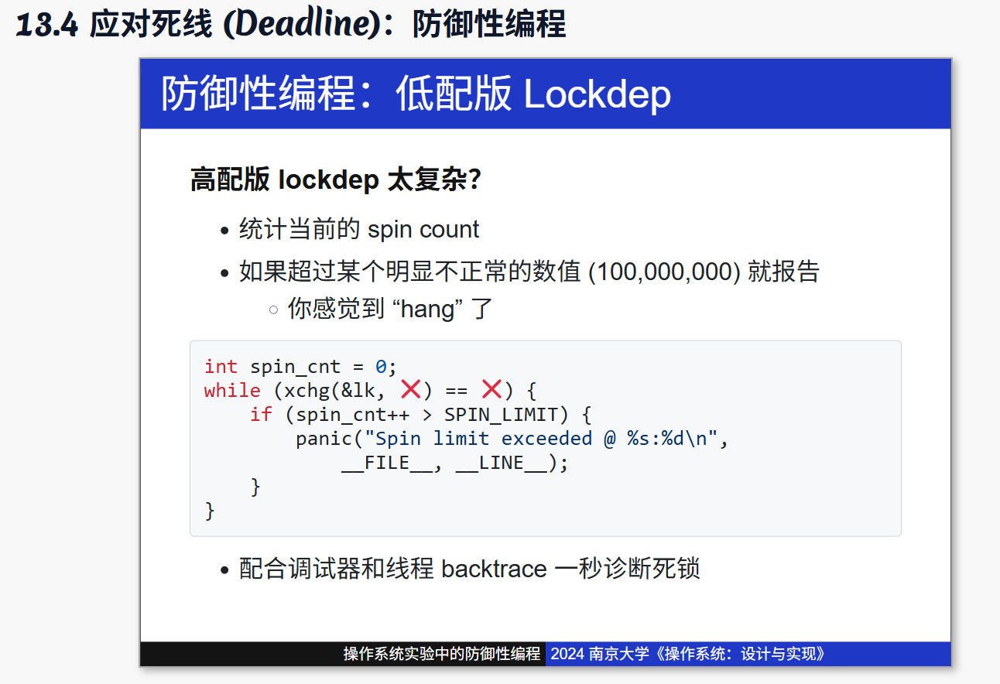
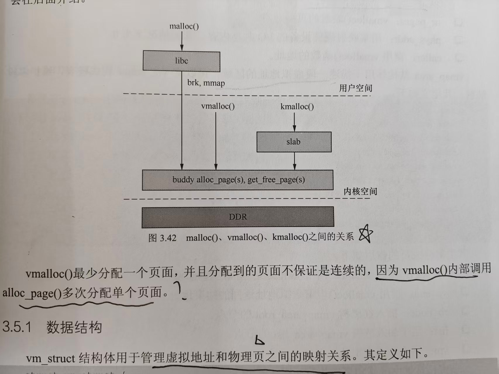
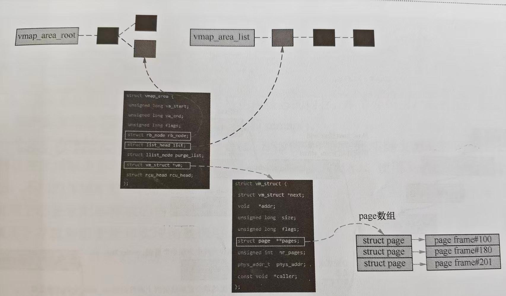
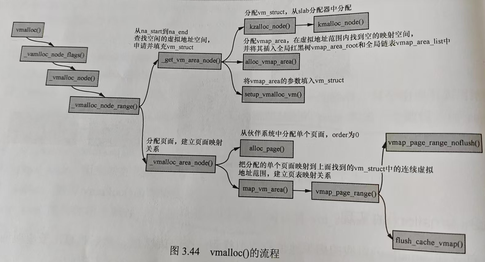
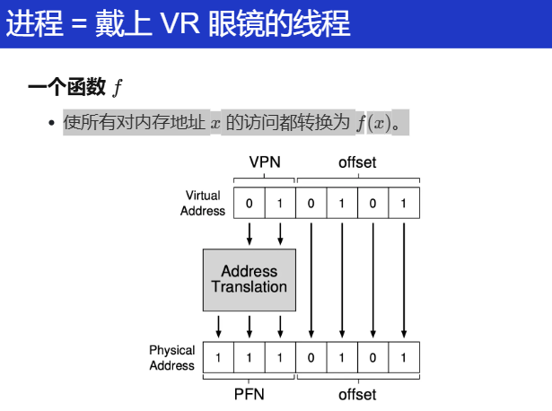
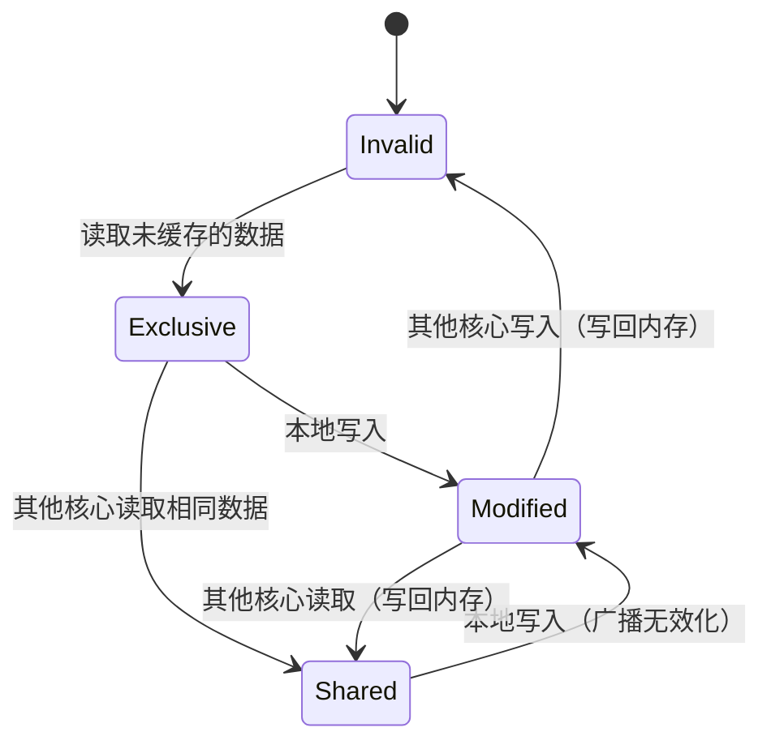
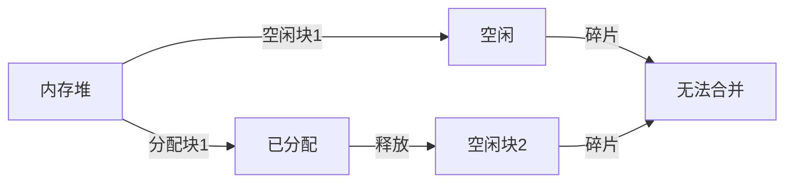
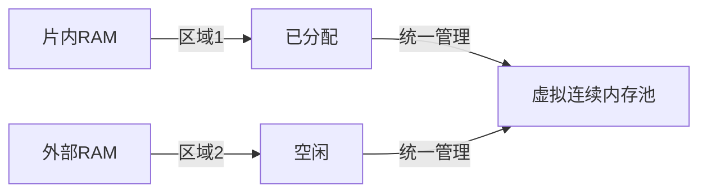

## 网上面经1

[26届本科卓驭科技一面面经（嵌入式底软）_牛客网](https://www.nowcoder.com/feed/main/detail/a0c8002ec6da4014a041cf39af5c5487?sourceSSR=users)

1-9基本都是针对我写的操作系统这个项目问的：

1. 讲讲pendsv，哪些情况会触发pendsv。

2. 对于任务切换选用的是pendsv，为什么不用定时器中断呢？

3. 对于定时器中断，你是如何使用的？

4. 在任务切换时，在中断里你需要干所有的事吗？

    这问题我的理解是有些寄存器的出入栈是cm内核在帮忙干

5. 中断结束后回到任务是否需要注意什么

6. 操作系统对于外部中断的操作？

    这问题我有点懵没明白啥意思 就答了下ucos对外部中断的处理 

7. 你的这个操作系统有在板子上跑过吗？

    回答说的在stm32f4上跑过 但f4是cm4的内核 这个操作系统主要是针对cm3的 对于cm4中的fpu等东西没有针对性处理

8. 你刚刚提到了mpu，你知道它是什么吗？

    我怀疑面试官把我上面说的fpu听成mpu 这问题给我问懵了 我对这个几乎没有啥印象 于是胡乱回答说这个好像跟内存有关系 跟虚拟内存地址与实际内存的映射有关系 面试官听了之后笑了一下问我知不知道mmu是啥 我听了之后恍然大悟 说刚刚自己讲的应该是mmu的功能 mpu的p应该是protect 这是用来保护内存访问权限的 也不知道自己说对没 这俩概念自己只看过一两眼（因为jd上有写 但自己没太重视 本科阶段几乎没涉及过这个）总之最后面试官听了我回答后又是笑了一下 就开始问下一个问题了

9. 你能不能猜猜mpu在你的板子上会针对哪些东西工作？

    上一道题回答时我给他说自己没有太多涉猎mmu和mpu 所以这道题他让我猜猜 但我还是不太知道 就随便答了个可能跟ram这种有关系吧。。面试官也没为难我 就不再问了

10. 我再问下pendsv 你能不能再简单给我讲讲
    pendsv这个函数里你的汇编代码依次做了些什么事情

下面的问题基本都是针对我的四轴项目问的：

1. 你的四轴飞行器项目中难度最大的是哪部分？
2. 我看你项目写了iic和uart 那就讲讲iic吧
3. iic是一主多从还是多主多从 它是如何查找从机的


## 网上面经2

自我介绍

解释中科院与中科大

为什么对嵌入式感兴趣：我从宏观角度回答的，感觉说了几分钟，表达的东西有限，效果不好

介绍IIC具体时序（前段时间扫了一眼又忘了）发送、接收

- 项目

    - PCI的枚举

    - 数据发送或者接收完毕怎么通知内核

        答中断

        问什么中断，INTX还是MSI/MSI-X

        开始胡言乱语

    - DMA缓存一致性底层实现，说完感觉大佬不满意

    - 写时复制

        `pagefault`

        如何触发的 （说半天不到点上）

        是谁的动作？哪个软件或哪个硬件（面完之后回想起这个问题，才get到面试官的意思）

        MMU检查页表，发现页面不在物理内存中，或者权限不符等情况，生成 `pagefault` 信号，触发异常。所以，最初是由CPU硬件检测到的。


## 网上面经3

1、自我介绍
2、实习相关
3、cashe相关，如何实现缓存一致性
4、malloc底层原理，在内核中会做什么操作
【关于操作系统循序渐进问了好多很细的知识点，直到回答不上来为止】
5、项目相关
6、反问


## 网上面经4

空指针 会发生什么?

lxx什么什么概念听过吗

分工?
中断知道吗
iic怎么读取的？


## 自己总结的一些问题

- 对嵌入式的了解
- 死锁
- 伙伴系统
- cache 缓存一致性
- DMA
- 有没有驱动经验


### 对嵌入式的了解

这个定义太多了，我自己的理解就是在计算机硬件中嵌入软件，然后软件硬件协同构成系统，然后专用于某个应用或者某个产品的特定部分。


### 伙伴系统

> 以下是针对你简历中实现的**伙伴系统（Buddy System）**可能被问及的面试问题及专业回答，帮助你清晰展示技术深度与项目经验，提升面试通过率：
>
> ---
>
> ### **Q1: 请简述伙伴系统（Buddy System）的核心思想，以及它的优缺点。**
> **回答：**  
> 伙伴系统的核心思想是将物理内存划分为大小相等的块（通常为2的幂次方），通过递归分割与合并来管理内存分配与释放。  
>
> - **分配流程**：当请求内存时，系统从能满足需求的最小块开始查找，若无合适块，则分裂更大的块，直到得到所需大小的块。  
> - **释放流程**：释放内存后，若相邻块（“伙伴”）也是空闲的，则合并为更大的块，减少碎片。  
>
> **优点**：  
> 1. **高效的分割与合并**：块大小对齐，合并操作快速，避免频繁内存碎片。  
> 2. **确定性时间复杂度**：分配和释放的时间复杂度为O(log N)，适合实时系统。  
>
> **缺点**：  
> 1. **内部碎片**：若请求大小不是2的幂次方，会导致内存浪费。  
> 2. **合并条件严格**：仅相邻且同大小的伙伴块才能合并，可能导致外部碎片。  
>
> **你的项目实践**：  
> 在项目中，通过**Slab分配器**与伙伴系统配合使用，针对小对象分配优化，进一步减少内部碎片（如简历中提到的“Buddy System和Slab分配算法”）。同时，通过设计**测试框架**验证碎片率，确保算法鲁棒性。
>
> ---
>
> ### **Q2: 在你的实现中，如何判断两个块是否是“伙伴”（Buddy）？**
> **回答：**  
> 伙伴块的判定基于两个条件：  
> 1. **大小相同**：两个块必须属于同一订单（Order）。  
> 2. **地址相邻且对齐**：两个块的起始地址在更高一级块的范围内对齐。  
>
> **代码实现**：  
> 在`get_buddy_page`函数中，通过计算当前块的地址与`1 << (order + 12)`异或（XOR）得到伙伴块地址（如代码中的`buddy_page_addr = page_addr ^ (1UL << (order + 12))`）。  
> - **逻辑解释**：每个块的地址是父块大小的整数倍，异或操作将切换最高位，确保伙伴块相邻且对齐。  
> - **边界检查**：通过`range_check_pfn`确保伙伴块的物理页号（PFN）在合法范围内（如代码注释中的范围检查）。
>
> ---
>
> ### **Q3: 如何处理多线程环境下的并发分配与释放？**
> **回答：** 
> 在项目中，通过**自旋锁（Spinlock）**保护每个订单（Order）的空闲链表（`free_lists`），确保多线程操作的安全性。  
>
> - **关键代码**：在`allocate_block`和`add_buddy_to_freelist`函数中，使用`spin_lock`和`spin_unlock`保护链表操作（如注释中的锁操作）。  
> - **优化点**：  
>   1. **细粒度锁**：每个订单对应独立锁，减少锁竞争。  
>   2. **原子操作**：合并块时，先移除伙伴块再合并，避免死锁。  
>
> **实际经验**：
> 在测试框架中，通过压力测试模拟多核并发分配，验证锁的正确性与性能（如简历中提到的“自旋锁保障多核并发安全”）。
>
> ---
>
> ### **Q4: 伙伴系统的分裂（Split）与合并（Merge）如何实现？请结合代码说明。**
> **回答：**  
> **分裂过程**（`split_block`函数）：  
> 1. **循环降阶**：从当前订单逐级向下分裂，直到达到目标订单。  
> 2. **生成伙伴块**：每次分裂时，计算当前块的伙伴块地址，标记伙伴块为未使用，并将其加入对应订单的空闲链表。  
> ```c
> while (*current_order > target_order) {
>     (*current_order)--;
>     struct page *buddy_page = get_buddy_page(block_page, *current_order);
>     add_buddy_to_freelist(buddy_page, *current_order);
> }
> ```
>
> **合并过程**（`merge_pages`函数）：  
> 1. **递归合并**：释放块后，检查其伙伴块是否空闲且同大小，若满足条件则合并为更高阶块。  
> 2. **选择主块**：合并后，选择地址较小的块作为新块头，确保地址对齐。  
> ```c
> if (buddy_page->used == false && buddy_page->order == current_order) {
>     remove_from_free_list(area, buddy_page);
>     current_page = merge_pages(current_page, current_order + 1);
> }
> ```
>
> ---
>
> ### **Q5: 如何验证伙伴系统的正确性？你在项目中使用了哪些测试方法？**
> **回答：**  
> **测试策略**：  
>
> 1. **单元测试**：  
>    - 验证单次分配与释放的正确性（如分配后标记为已用，释放后合并）。  
>    - 边界测试：分配最大/最小块、跨页请求等场景。  
> 2. **压力测试**：  
>    - 模拟高并发分配与释放，检测内存泄漏或竞争条件（如简历中提到的“测试框架”）。  
> 3. **DiffTest验证**：  
>    - 与标准模拟器（如spike）对比内存状态，确保行为一致（如简历中提到的“通过DiffTest机制与spike实现双向验证”）。  
>
> **调试案例**：  
> 在开发过程中，曾因未正确更新块的`order`字段导致合并失败。通过**ftrace跟踪块状态**和**GDB单步调试**，最终定位到`split_block`函数中未更新分裂后块的`order`，修复后通过测试。
>
> ---
>
> ### **Q6: 伙伴系统与Slab分配器如何协同工作？**
> **回答：**  
> - **职责分工**：  
>   1. **伙伴系统**：管理大块内存（页级别），支持快速分割与合并。  
>   2. **Slab分配器**：基于伙伴系统分配的内存，进一步细分为固定大小的小对象（如结构体），减少内部碎片。  
> - **项目实践**：  
>   在内存管理模块中，伙伴系统为Slab提供底层页分配，Slab缓存常用对象（如任务控制块）。通过`kmalloc`和`kfree`接口对上层屏蔽细节，提升小内存分配效率（如简历中提到的“实现Buddy System和Slab分配算法”）。
>
> ---
>
> ### **总结提问示例：**
> - **“如果系统长时间运行后出现内存碎片，如何优化？”**  
>   → 结合Slab分配器减少小对象碎片，或引入内存压缩机制定期整理碎片。  
> - **“伙伴系统的订单（Order）最大值如何确定？”**  
>   → 取决于物理内存大小，例如4GB内存的MAX_ORDER通常为10（对应4MB块）。  
>
> 通过以上回答，展示你对伙伴系统的深刻理解、代码实现细节的掌握以及实际调试经验，让面试官认可你的技术能力与项目价值！


### 面试buddy system和slab的问题

1. 对指针的应用

    ```C
    struct free_area {
     struct list_head head;  // 直接作为哨兵节点（结构体实例，非指针）
     unsigned long nr_free;
    };
    ```

    原代码中 `struct free_area` 的 `head` 是 `struct list_head*` 类型（指针），这需要手动分配内存给哨兵节点，容易导致错误。
    **修正后的结构体应为：**

    ```
    struct free_area {
     struct list_head head;  // 直接作为哨兵节点（结构体实例，非指针）
     unsigned long nr_free;
    };
    ```

    - 这样，每个 `free_area` 的 `head` 自身就是一个独立的哨兵节点，无需额外分配内存。

    实际上还是对内存分配理解的并不深刻。里面定义一个 `struct list_head*` 指针？还要分配内存给他？为什么？这和直接用一个变量的区别在哪？实际上就直接理解用一个变量即可。

    指针存的是一个地址啊！

    无论链表是否为空，都直接将新的页块节点添加到哨兵节点之后。这样，链表的操作就变得一致了。所以，这个地方的条件判断其实可以去掉，直接使用 `list_add_tail` 或 `list_add` 将页块节点添加到哨兵节点的链表中。

2. 死锁的工具的使用

    

3. pfn的转换

    实际上严格意义上应该是拿页来计算，直接改用实际的物理内存块地址来计算的。实际上这是有问题的，包括在Linux中也是页来计算，而不是像我那样直接用

4. 第一个slab内存系统的初始化，一个比较trival的

    也就是需要分配 slab 的空间！

    ```c
    // 创建管理 kmem_cache 的专用缓存
    create_boot_cache(&kmem_cache, "kmem_cache",
                      sizeof(struct kmem_cache),
                      __alignof__(struct kmem_cache));
    slab_state = PARTIAL;
    ```

    ```C
    static struct kmem_cache boot_kmem_cache = {
        .name = "kmem_cache",
        .obj_size = sizeof(struct kmem_cache),
        .align = 0,
        //.align = __alignof__(struct kmem_cache),
        .slabs_full = LIST_HEAD_INIT(boot_kmem_cache.slabs_full),
        .slabs_partial = LIST_HEAD_INIT(boot_kmem_cache.slabs_partial),
        .slabs_free = LIST_HEAD_INIT(boot_kmem_cache.slabs_free),
    };
    
    /* The slab cache that manages slab cache information */
    struct kmem_cache *kmem_cache;
    /* The list of all slab caches on the system */
    struct list_head slab_caches;
    
    /******************** 缓存创建核心函数 ********************/
    static char boot_store[sizeof(struct kmem_cache)]__attribute__((aligned(8)));
    static struct kmem_cache *__kmem_cache_create(const char *name,
                                                  size_t size,
                                                  size_t align,
                                                  unsigned long flags) {
        struct kmem_cache *cache;
        if (align == 0) {
            align = DEFAULT_ALIGN; // 例如8字节
        }
        
        if (slab_state == DOWN) {
            cache = (struct kmem_cache *)boot_store;
            kdebug("sizeof(struct kmem_cache): %d\n", sizeof(struct kmem_cache));
        } else {
            // 正常阶段通过已有缓存分配
            cache = kmem_cache_alloc(kmem_cache);
        }
    
        cache->name = name;
        cache->align = align;
        cache->obj_size = ALIGN_UP(size, align);
        kdebug("name: %s, obj_size: %d\n", cache->name, cache->obj_size);
        
        INIT_LIST_HEAD(&cache->slabs_full);
        INIT_LIST_HEAD(&cache->slabs_partial);
        INIT_LIST_HEAD(&cache->slabs_free);
        INIT_LIST_HEAD(&cache->list);
        
        return cache;
    }
    ```


### kmalloc、vmalloc、malloc、mmap的实现

`kmalloc` 的实现就是基于 slab分配器的，系统启动时候通过 `create_kmalloc_caches` 创建不同大小的 `kmem_cache`，将这些 `kmem_caches` 存储在 `kmalloc_caches`  全局变量中，然后给后面的 `kmalloc` 调用，比如有：8，16，32，64，128，92，65536等比较大的。

当然 `kmalloc` 会先通过 `kmalloc_index` 来擦轰炸哦满足分配请求的最小 `kmem_cache` ，然后以获取的 index 在 `kmalloc_caches` 数组中找到符合条件的 `kmem_cache`，从已经分配好的 `slab` 中 获取 `object`。


前面这些都是分配到的空间都是物理上连续的，但是随着碎片化的积累，连续物理内存分配比较困难，所以对于那些不一定要连续的（非设备的）内存访问，完全是可以像用户空间那样的malloc，将不连续的物理内存页帧映射到连续的虚拟地址空间中，这就是 vmap了。而vmalloc的实现就是基于vmap。有一张图可以学习下：



所以需要学习下面的 `vm_struct`/`vmap_area` 结构体：

```C
struct vm_struct {
	struct vm_struct	*next;
	void			*addr;
	unsigned long		size;
	unsigned long		flags;
	struct page		**pages;
#ifdef CONFIG_HAVE_ARCH_HUGE_VMALLOC
	unsigned int		page_order;
#endif
	unsigned int		nr_pages;
	phys_addr_t		phys_addr;
	const void		*caller;
};
```

- `next`：指向下一个 `vm_struct` 结构体
- `addr`：当前 `vmalloc` 分配的虚拟地址的起始地址
- `size`：当前 `vmalloc` 分配的虚拟地址的大小
- `pages`：当前 `vmalloc` 分配、获取到的各个物理页面是不连续的，每个物理页都是用另一个结构体 `page`（就是实现buddy system那个）来描述的，而 `vm_struct` 用到的所有的物理页面的 `page` 构成一个数组，而 `pages` 就是指向这个数组的指针。
- `nr_pages`：`vmalloc` 映射的页面数目
- `phys_addr`：用来映射硬件设备的 I/O 共享内存，其他情况下为0
- `caller`：调用 `vmalloc` 的地址

```C
struct vmap_area {
	unsigned long va_start;
	unsigned long va_end;

	struct rb_node rb_node;         /* address sorted rbtree */
	struct list_head list;          /* address sorted list */

	/*
	 * The following two variables can be packed, because
	 * a vmap_area object can be either:
	 *    1) in "free" tree (root is free_vmap_area_root)
	 *    2) or "busy" tree (root is vmap_area_root)
	 */
	union {
		unsigned long subtree_max_size; /* in "free" tree */
		struct vm_struct *vm;           /* in "busy" tree */
	};
	unsigned long flags; /* mark type of vm_map_ram area */
};

```

- `va_start`：使用 `vmalloc` 申请虚拟地址返回的起始地址
- `va_end`：使用 `vmalloc` 申请虚拟地址返回的结束地址
- `rb_node`：插入红黑树 `vmap_area_root` 的节点
- `list`：用于加入链表 `vmap_aera_list` 的节点
- `vm`：用于管理虚拟地址和物理页之间的映射关系

下面是虚拟地址中区域和页的关系：



下面对于 `vmalloc` 的实现探究一下：

首先在 `vmalloc` 对应的虚拟地址空间中找到一个空闲区与，然后将页面数组对应的物理内存映射到该区域，最终返回映射到虚拟起始地址，主要分三步再结合图：

1. 从 `va_start` 到 `va_end` 查找空闲的虚拟地址空间，申请并填充 `vm_struct` 结构体
2. 根据 `size` 调用 `alloc_page` 依次分配单个页面
3. 把分配到单个页面映射到第一部找到的连续的虚拟地址




malloc内部实际两个：一个brk，一个mmap。

1. brk的实现

    对地址由低地址向高地址增长，在分配内存的时候，将指向堆的最高地址的指针`mm->brk`往高地址扩展，释放反之。

    申请堆后只是开辟了一个区域，内核还不会真正分配的物理内存，之后只有在访问这个内存地址，出现了缺页异常的时候才会进一步去建立映射（虚拟地址/物理地址建立）

2. mmap

    

sys_brk的大致流程

首先看看是否有该start_addr的VMA（`find_vma`）


mmap的实现


### slab 的学习


### 测试的内容


### MMU 的理解

> 之前的回答
>
> 自己的回答：
>
> 首先对于物理内存，是计算机系统的实际硬件内存（DDR（DRAM）、SRAM），内存芯片，实际用来存储程序和数据。
>
> 对于现代的计算机系统来说，物理内存地址空间都是统一编址的，比如从0到4GiB。
>
> 另外，计算机系统一般都不会直接访问物理地址的，为了安全和一些多道程序加载（防止各个进程互相影响）的问题，所以会使用虚拟内存地址。
>
> 其通过一个映射机制或者说数据结构来将物理地址和虚拟地址联系起来。
>
> 现代的 arch 几乎都选择的是 **分页机制**，实际就是 radix tree（基数树），维护一个页表。
>
> 但实际这个页表维护的就是一个数学函数 *f(n)* 一个地址映射到另一个地址。
>
> 具体怎么实现的，不同 arch 有不同的寄存器，但大同小异。
>
> 比如 RISC-V 的 `satp(Supervisor Address Translation and Protection)` 寄存器、x86 的 `cr3` 寄存器 ARM 的 `TTBR0(Translation Table Base Register)` 寄存器。。。
>
> 映射到核心机制就在于 MMU，一个硬件模块，做在了 CPU 内部，当然现代的 MMU 为了加速，里面其实还有个叫 TLB`(Translation Lookaside Buffer`) 的寄存器，当成MMU 的缓存，由时间局部性和空间局部性原理，存储常用的页表，就是虚拟内存如何映射到物理内存的。
>
> 具体过就是：
>
> 1. 虚拟地址拆分为页号（VPN）和页内偏移量（Offset）。
>
> 2. 然后MMU通过VPN查找页表，获取对应PFN。
>
>     > 一些细节不展开（自己理解）
>     >
>     > 1. 页表由多个物理页（称为**页表页**）组成，每个页表页存储固定数量的页表项（PTE）。
>     >
>     > - **页表页的物理存储与容量**
>     >
>     >     - **页表页大小**：通常与物理内存页大小一致（如4KB）。
>     >     - **页表项大小**：在RISC-V中，每个PTE占用**8字节**。
>     >     - **每页表页的PTE数量**：即每个页表页可存储512个PTE。
>     >
>     > - **多级页表的层级结构**
>     >
>     >     在RISC-V Sv39中，虚拟地址被划分为三级页号（VPN[2], VPN[1], VPN[0]）和12位页内偏移（Offset）。
>     >
>     >     - **页表层级**：
>     >         - **第一级页表**：由`satp`寄存器指向根页表页，通过VPN[2]索引到第二级页表页的基址。
>     >         - **第二级页表**：通过VPN[1]索引到第三级页表页的基址。
>     >         - **第三级页表（叶子页表）**：通过VPN[0]索引到最终的PTE，该PTE指向物理页帧号（PFN）。
>     >     - **每个层级的页表均为独立的物理页**，因此三级页表可能占用3个物理页（最简情况）。
>     >     - **实际场景**：若虚拟地址空间稀疏，高层页表可能共享部分页表页以减少内存占用。
>     >
>     > ------
>     >
>     > 2. **页表项（PTE）的结构**
>     >
>     > 每个PTE包含以下关键字段（以RISC-V为例）：
>     >
>     > - **物理页帧号（PFN）**：占据高位，指向目标物理页的基址。
>     > - **控制位与权限位**：占据低位，包括：
>     >     - **Valid**（有效位）：1表示该PTE已映射到物理内存。
>     >     - **Read/Write/eXecute**（R/W/X）：权限控制位。
>     >     - **User**（U位）：1表示用户态进程可访问。
>     >     - **其他标志**：如Accessed（访问位）、Dirty（脏位）等。
>     >
>     > ----
>     >
>     > 3. **叶子PTE与非叶子PTE**
>     >
>     >     - **叶子PTE**：位于最底层（第三级）的PTE，其PFN直接指向物理页帧，**权限位控制该页的访问规则**。
>     >     - **非叶子PTE**：位于高层（第一、二级）的PTE，其PFN指向下一级页表页的基址，**权限位通常无效（仅Valid位有意义）。**
>     >
>     >     **示例**：
>     >
>     >     - 若第三级PTE的R/W/X位为`R=1, W=0, X=0`，则该页可读但不可写、不可执行。
>     >     - 若用户态进程尝试写入该页，MMU会触发权限错误异常（如Store/AMO Access Fault）。
>
> 3. PFN + Offset = 物理地址。
>
> 4. **缺页处理**：若页表项无效（未加载或权限不足），触发缺页中断，操作系统将数据从磁盘加载到物理内存，更新页表。
>
> 另外，现代的进程也是建立在分页机制上的，os 为每个进程提供抽象内存空间，主要是隔离不同的进程、有保护性。具体就是通过页表权限位实现内存隔离（如用户态与内核态隔离），同时支持共享内存（如多个进程共享代码段）。


应该还会问怎么怎么模拟这个 MMU的！

实际上 MMU 就是一个 映射，将一个数映射到另一个数，也就是使所有对内存地址 **x** 的访问都转换为 *f(x)*。



当然实际上只要能用就行？甚至于一个数组好像就可以，但是现在为了性能，用的 radix tree基数树性能好？当然还要准备好satp寄存器。

> 1. - **虚拟地址拆分**：
>
>         ```
>         #define VA_VPN_1(vaddr) ((vaddr >> 22) & 0x3FF)  // 10 bits, 索引PGD
>         #define VA_VPN_0(vaddr) ((vaddr >> 12) & 0x3FF)  // 10 bits, 索引PTE
>         #define VA_OFFSET(vaddr) (vaddr & 0xFFF)          // 12 bits, 页内偏移
>         ```
>
>     - **页表基址获取**：从`satp`寄存器提取物理页号（PPN），计算页全局目录（PGD）基址：
>
>         ```
>         paddr_t pt_dir_base = (SATP_PPN(pt_base_reg) << 12;  // satp.PPN * 4KB
>         ```
>
>     - **多级页表查询**：
>
>         - 一级页表（PGD）查询：`PTE pte1 = paddr_read(pt_dir_base + VPN1 * 4, 4);`
>         - 二级页表（PTE）查询：`PTE pte2 = paddr_read(PTE_PPN(pte1) * 4KB + VPN0 * 4, 4);`
>
>     - **权限检查**：根据访问类型（读/写/执行）检查PTE标志位（R/W/X/U）。
>
> 2. **PTE标志位管理**：
>
>     - **访问位（A）与脏位（D）**：
>
>         - **A位**：若页面被访问（读/执行），需置1（硬件自动设置，模拟器中需手动标记）。
>
>         - **D位**：若页面被写入，需置1（仅当PTE_W=1时允许置位）。
>
>         - **代码示例**：
>
>             ```
>             if (type == MEM_TYPE_WRITE && PTE_W(pte2)) {
>                 pte2 |= (1 << 7);  // 设置D位
>                 paddr_write(pte2_addr, 4, pte2);  // 回写PTE
>             }
>             ```
>
>     - **全局位（G）**：若设置，TLB条目在多核间共享（需在TLB刷新时特殊处理）。
>
> 3. **TLB模拟优化**：
>
>     - **缓存策略**：实现类LRU或全相联TLB，加速地址转换。
>     - **一致性维护**：在`sfence.vma`指令执行时，根据ASID（地址空间标识符）刷新TLB条目。


还会问处理 `pagefault` 的内容？

> #### **2. Page Fault处理全流程**
>
> ##### **触发条件**
>
> - **硬件自动检测**：
>     - **缺页异常**：PTE_V=0（页表项无效）或PTE_A=0（首次访问未标记）。
>     - **权限错误**：如用户态访问内核页（PTE_U=0）、写只读页（PTE_W=0）等。
>
> ##### **处理流程**（以用户项目为例）
>
> 1. **异常分发**：
>
>     - CPU捕获异常，切换到机器模式（M-mode），将 `mcause` 寄存器标记为 `PageFault` 类型（如`0xC`表示指令缺页）。
>     - 保存异常上下文（PC、寄存器等）到`mepc`和`mtval`寄存器。
>
> 2. **异常处理逻辑**：
>
>     - **缺页处理**：
>         - 若PTE_V=0，需**分配物理页**并填充页表（通过Buddy/Slab分配器）。
>         - 若PTE_A=0，仅需设置PTE_A位（表示已访问）。
>     - **权限升级**：
>         - 若用户程序尝试写只读页（PTE_W=0但PTE_D=1），可能触发COW（Copy-on-Write），需复制物理页并更新PTE。
>
> 3. **操作系统介入**（以多功能操作系统项目为例）：
>
>     - **缺页处理函数**（`do_page_fault`）：
>
>         ```C
>         void do_page_fault(vaddr_t vaddr, int cause) {
>             pte_t *pte = get_pte(vaddr);  // 查询页表项
>             if (!pte || !PTE_V(*pte)) {
>                 alloc_page(vaddr);        // 分配物理页并映射
>                 set_pte(pte, phy_addr, PTE_V | PTE_R | PTE_W | PTE_A);
>             } else if (cause == WRITE_FAULT && !PTE_D(*pte)) {
>                 // COW处理：复制页、更新PTE、设置PTE_D
>             }
>             tlb_flush(vaddr);            // 刷新TLB条目
>         }
>         ```
>
>     - **用户态缺页**：若异常发生在用户态，需切换到内核态处理，完成后返回用户态继续执行。
>
> 4. **回写与恢复**：
>
>     - 更新PTE后，执行`ret_from_exception`，从`mepc`恢复PC并重试触发异常的指令。

还可以进一步去讨论 cause 的类型

> #### **1. 页错误分类与异常代码**
>
> | **异常类型**           | **异常代码** | **触发场景**                                    |
> | :--------------------- | :----------- | :---------------------------------------------- |
> | Instruction Page Fault | 12           | 取指令时，MMU检测到页表无效或权限不足。         |
> | Load Page Fault        | 13           | 加载数据（读操作）时，页表无效或权限不足。      |
> | Store/AMO Page Fault   | 15           | 存储数据（写操作）或原子内存操作（AMO）时触发。 |
>
> ------
>
> #### **2. 分类设计的核心原因**
>
> ##### **(1) 精确区分访问类型**
>
> - **指令与数据分离**：
>     - **Instruction Fault**：处理取指阶段的权限问题（如用户态执行内核代码）。
>     - **Load/Store Fault**：区分读/写权限（如只读页的写操作触发 Store Fault）。
> - **原子操作特殊性**：
>     - AMO（Atomic Memory Operation）需保证操作的原子性，单独归类便于操作系统处理锁竞争或回滚逻辑。
>
> ##### **(2) 优化异常处理流程**
>
> - **快速定位问题**：
>     - 操作系统通过异常代码直接识别访问类型，无需额外解析上下文。
>     - 例如，Store Fault 可能涉及 **Copy-on-Write（COW）**，而 Load Fault 可能只需分配物理页。
> - **权限检查细化**：
>     - RISC-V 页表项（PTE）包含 `R/W/X/U` 权限位，异常类型与权限位结合，实现细粒度控制。
>
> ##### **(3) 硬件与操作系统的协同**
>
> - **硬件自动标记**：
>     - MMU 在地址转换时记录访问类型（取指、读、写/AMO），直接写入 `mcause/scause` 寄存器。
> - **操作系统响应**：
>     - Linux 通过 `do_page_fault()` 分发处理，根据异常代码调用不同逻辑（如 `handle_mm_fault()`）。
>
> ------
>
> #### **3. 典型场景与处理示例**
>
> ##### **场景1：写只读页（Store Page Fault）**
>
> - **触发条件**：
>     - 用户程序尝试写入 `PTE_W=0` 的页面（如代码段）。
> - **处理逻辑**：
>     - 若页面为 **COW 页**，内核复制新物理页，更新 PTE 为可写，并重试指令。
>     - 若为非法写入（如只读文件映射），触发 `SIGSEGV`。
>
> ##### **场景2：用户态访问内核页（Instruction Page Fault）**
>
> - **触发条件**：
>     - 用户程序跳转到内核地址空间（`PTE_U=0`）。
> - **处理逻辑**：
>     - 内核直接终止进程（权限错误）。
>
> ##### **场景3：缺页（Load/Store Fault）**
>
> - **触发条件**：
>     - 访问未映射的虚拟地址（`PTE_V=0`）。
> - **处理逻辑**：
>     - 分配物理页，填充页表，设置 `PTE_V` 和 `PTE_A`（访问位）。


一个例子

> ### **分步解析：虚拟地址与物理地址映射机制**
>
> ---
>
> #### **1. 虚拟地址空间的本质**
> - **核心认知**：每个进程看到的4GB/128TB虚拟地址空间是**逻辑视图**，不代表实际物理内存占用
> - **关键设计**：操作系统通过三级结构（VMA、页表、物理页帧）实现**按需映射**
> - **示意图**：
>   ```
>   进程视角          | 物理内存现实
>   -----------------|-------------------
>   0x0000-0x1000    | 未分配 (访问触发SIGSEGV)
>   0x1000-0x2000    | 已映射到物理页帧#1023
>   0x2000-0x3000    | 已分配但未映射 (首次访问触发缺页)
>   ```
>
> ---
>
> #### **2. 进程地址空间初始化原理**
> ##### **2.1 进程创建时的关键操作**
> ```c
> // 以Linux fork()为例的伪代码
> pid_t fork(void) {
>     struct task_struct *child = copy_process();
>     child->mm = dup_mm(parent->mm); // 复制VMA结构
>     copy_page_tables(child);        // 复制页表项（标记为只读）
>     // 此时物理页尚未分配，仅建立写时复制(COW)机制
> }
> ```
> - **写时复制(COW)机制**：父子进程共享物理页，直到任一进程执行写操作时触发缺页，分配新物理页
>
> ##### **2.2 典型地址空间区域**
> | 内存区域     | 映射时机             | 物理页来源          | 典型触发条件        |
> | ------------ | -------------------- | ------------------- | ------------------- |
> | 代码段(text) | 程序加载时           | 磁盘可执行文件      | execve()            |
> | 数据段(data) | 程序加载时部分映射   | 文件BSS段/匿名内存  | 首次访问全局变量    |
> | 堆(heap)     | malloc()时虚拟分配   | 缺页时分配匿名页    | brk()扩展后首次访问 |
> | 栈(stack)    | 自动扩展             | 缺页时分配匿名页    | 函数调用深度增加    |
> | 内存映射区域 | mmap()调用时虚拟预留 | 文件/匿名页按需加载 | 首次访问映射地址    |
>
> ---
>
> #### **3. 深度解析三种典型场景**
> ##### **场景1：malloc(1GB)后立即访问**
> ```c
> void *p = malloc(1*1024*1024*1024); // 仅修改进程的VMA链表
> memset(p, 0, 1*1024*1024*1024);    // 触发连续的minor fault
> ```
> - **底层原理**：
>   1. malloc通过brk()/mmap()扩展虚拟地址空间
>   2. 内核更新VMA但**不立即分配物理页**
>   3. memset访问时逐页触发缺页，物理页被真实分配
> - **性能影响**：
>   - 延迟分配节省内存（避免预分配未使用的内存）
>   - 密集访问时产生大量minor fault（可用mlock()锁定）
>
> ##### **场景2：动态库加载的优化技巧**
> ```bash
> # 查看libc.so的加载方式
> ldd /bin/ls
> ```
> - **加载过程**：
>   1. dlopen()创建VMA区域，标记为文件映射
>   2. **首次调用库函数时触发major fault**，从磁盘读取.text段
>   3. 使用readahead预加载（通过posix_madvise）
> - **优化手段**：
>   - 设置LD_PRELOAD提前加载关键库
>   - 使用hugepage减少TLB miss（通过库编译选项）
>
> ##### **场景3：Redis持久化时的内存抖动**
> ```text
> [Redis RDB持久化期间]
> 1. fork()创建子进程（COW共享所有页）
> 2. 父进程继续处理写请求（修改键值数据）
> 3. 每次修改触发COW缺页，复制物理页
> 4. 物理内存使用量逐渐翻倍
> ```
> - **监控数据**：
>   ```bash
>   # 查看COW缺页次数
>   grep -e 'pgfault' /proc/vmstat
>   ```
> - **解决方案**：
>   - 使用无盘复制（repl-diskless-sync）
>   - 调整透明大页（THP）配置
>
> ---
>
> #### **4. 硬件加速机制剖析**
> ##### **4.1 TLB与缺页的关联**
> ```text
> CPU访问虚拟地址流程：
> 1. 查TLB -> 命中则直接获取物理地址
> 2. TLB未命中 -> 查多级页表
> 3. 页表项存在位为0 -> 触发缺页异常
> 4. 处理完成后刷新TLB
> ```
> - **性能瓶颈**：
>   - TLB miss率过高会导致频繁页表遍历
>   - 缺页处理涉及内核态切换（约1000+周期）
>
> ##### **4.2 Intel EPT加速虚拟化**
> ```text
> Guest OS访问虚拟地址流程：
> 1. Guest CR3 -> Guest页表（GVA->GPA）
> 2. EPT -> 第二次转换（GPA->HPA）
> 3. 两级转换均可能触发缺页
> ```
> - **缺页类型扩展**：
>   - EPT Violation：Guest物理地址到Host物理地址转换失败
>   - Shadow Page Fault：传统虚拟化中的软件模拟缺页
>
> ---
>
> #### **5. 高级调试技巧**
> ##### **5.1 精确诊断缺页来源**
> ```bash
> # 使用perf追踪缺页事件
> perf record -e page-faults -ag -- sleep 5
> 
> # 解析缺页地址
> sudo cat /proc/<pid>/pagemap | grep <vaddr>
> 
> # 查看VMA状态
> cat /proc/<pid>/maps
> ```
>
> ##### **5.2 编写触发特定缺页的代码**
> ```c
> // 触发major fault（文件映射）
> void *p = mmap(NULL, 4096, PROT_READ, MAP_PRIVATE, fd, 0);
> *(int*)p = 42;  // 触发文件页调入
> 
> // 触发COW缺页
> pid_t pid = fork();
> if (pid == 0) {
>     *shared_var = 100;  // 触发COW物理页复制
> }
> ```
>
> ---
>
> #### **总结认知突破点**
> 1. **虚拟≠物理**：地址空间只是"预订座位"，实际占用需要"到场登记"（缺页触发）
> 2. **延迟绑定优势**：节省物理内存、加速进程创建、支持稀疏地址空间
> 3. **性能权衡艺术**：在内存占用、缺页开销、预加载策略间寻找平衡点
>
> 通过理解这种"逻辑承诺+物理兑现"的分层设计，就能掌握现代操作系统内存管理的精髓。这种机制如同酒店的客房预订系统——顾客（进程）获得所有房间（地址空间）的使用权，但实际打扫（分配物理页）只在客人真正入住（访问内存）时进行。


### DMA

> #### **1. 驱动中DMA的使用与分配**
>
> 在Linux驱动开发中，DMA（Direct Memory Access）用于实现硬件设备与内存之间的高效数据传输。以下是核心要点：
>
> ##### **（1）DMA使用场景**
>- **批量数据传输**：如网络数据包收发、视频流处理（摄像头/显卡）、块设备（SSD/HDD）的I/O操作。
> - **降低CPU负载**：通过DMA传输大数据时，CPU仅需初始化传输，无需参与数据搬运。
> 
> ##### **（2）DMA内存分配API**
>Linux内核提供两类DMA内存管理接口，需根据硬件特性选择：
> 
> | **API类型**            | **特点**                                              | **适用场景**                   |
>| ---------------------- | ----------------------------------------------------- | ------------------------------ |
> | **一致性DMA**          | 硬件自动维护缓存一致性（如带SMMU/IOMMU）              | 频繁的小数据交换（如描述符环） |
> | `dma_alloc_coherent()` | 分配物理连续内存，返回内核虚拟地址和DMA地址           |                                |
> | **流式DMA**            | 需手动维护缓存一致性                                  | 单次大数据传输（如视频帧）     |
> | `dma_map_single()`     | 映射现有内存到DMA地址空间，需配合`dma_sync_*`同步缓存 |                                |
> 
> **代码示例**：
>
> ```c
>// 一致性DMA分配（自动维护缓存一致性）
> void *cpu_addr;
> dma_addr_t dma_handle;
> cpu_addr = dma_alloc_coherent(dev, size, &dma_handle, GFP_KERNEL);
> 
> // 流式DMA映射（需手动同步）
> dma_addr_t dma_handle = dma_map_single(dev, buf, size, DMA_TO_DEVICE);
> dma_sync_single_for_device(dev, dma_handle, size, DMA_TO_DEVICE); // 传输前刷新缓存
> ```
> 
> ---
>
> #### **2. DMA缓存一致性问题处理**
>
> 当DMA操作涉及CPU缓存时，需解决以下问题：
>**缓存一致性**（Cache Coherency）——确保CPU缓存与内存数据的一致性。
> 
> ##### **（1）硬件自动维护**
>- **支持缓存一致性协议**（如ARM CCI-400）：
>   硬件通过总线监听（Snooping）自动同步缓存，此时无需软件干预。
>   **适用场景**：现代SoC（如NVIDIA Jetson、高通骁龙）的集成外设。
> 
> ##### **（2）软件手动维护**
>- **非一致性DMA**：  
>   需通过内核API显式同步缓存，分为以下步骤：  
> 
> | **操作阶段**  | **API调用**                    | **作用**                       |
>| ------------- | ------------------------------ | ------------------------------ |
> | **DMA传输前** | `dma_sync_single_for_device()` | 将CPU缓存数据写回内存（Clean） |
> | **DMA传输后** | `dma_sync_single_for_cpu()`    | 使CPU缓存失效（Invalidate）    |
> 
> **底层原理**：
>- **Clean操作**：将缓存中的脏数据（已修改但未写回内存）刷新到内存。
> - **Invalidate操作**：标记缓存行无效，强制下次访问时从内存重新加载。
> 
> ##### **（3）缓存状态检测**
>硬件通过缓存一致性协议（如MESI）自动跟踪缓存行状态：
> - **Modified（M）**：缓存数据已修改，与内存不一致。
> - **Exclusive（E）**：缓存数据与内存一致，且未被其他核心缓存。
> - **Shared（S）**：缓存数据与内存一致，可能被多核共享。
> - **Invalid（I）**：缓存行无效。
> 
> 当DMA控制器访问内存时，硬件自动检测缓存状态：  
>- 若目标地址的缓存行处于**Modified**状态，触发缓存回写（Writeback）操作。
> - 若目标地址的缓存行处于**Shared**或**Exclusive**状态，直接访问内存。
> 
> ---
>
> #### **3. 实际案例：视频采集驱动开发**
>```c
> // 分配流式DMA缓冲区
> void *buf = kmalloc(frame_size, GFP_KERNEL);
> dma_addr_t dma_handle = dma_map_single(dev, buf, frame_size, DMA_FROM_DEVICE);
> 
> // 启动DMA传输前：确保CPU缓存数据已写入内存
> dma_sync_single_for_device(dev, dma_handle, frame_size, DMA_FROM_DEVICE);
> 
> // DMA传输完成后：使CPU缓存失效，确保读取最新数据
> dma_sync_single_for_cpu(dev, dma_handle, frame_size, DMA_FROM_DEVICE);
> 
> // 处理视频帧数据
> process_frame(buf);
> 
> // 解除DMA映射
> dma_unmap_single(dev, dma_handle, frame_size, DMA_FROM_DEVICE);
> ```
> 
> ---
>
> #### **4. 高级调试技巧**
>- **DMA调试工具**：
>   ```bash
>   # 启用DMA调试追踪
>   echo 1 > /sys/kernel/debug/dma_debug/state
>           
>   # 查看DMA映射错误
>     dmesg | grep -i dma
>   ```
> - **性能分析**：
>   ```bash
>   # 使用perf分析DMA传输延迟
>   perf record -e dma_fault,arm_smmu:* -ag
>   ```
> 
> ---
>
> ### **总结回答**
>1. **DMA使用与分配**：  
>    - 根据硬件是否支持一致性，选择`dma_alloc_coherent`（自动维护）或`dma_map_single`（需手动同步）。
>    - 一致性DMA适用于频繁小数据交换（如网络描述符），流式DMA适用于大数据传输（如视频帧）。
> 
> 2. **缓存一致性处理**：  
>   - 硬件支持一致性协议时（如SMMU），数据自动同步。
>    - 非一致性场景需调用`dma_sync_single_for_device`（传输前刷新缓存）和`dma_sync_single_for_cpu`（传输后失效缓存）。
>    - 缓存状态由硬件协议（如MESI）跟踪，驱动只需按规范调用API。
> 
> 通过结合具体项目经验（如视频驱动开发）和内核机制，可清晰展示对DMA及缓存一致性的深入理解。


> ### 1. **CPU访问内存的过程**  
> CPU访问内存的核心步骤如下：  
> 1. **虚拟地址转换**：CPU通过MMU（内存管理单元）将虚拟地址转换为物理地址，期间可能借助TLB加速转换。  
> 2. **缓存查询**：检查多级缓存（L1→L2→L3）。若命中，直接读取缓存行；若缺失，进入主存访问。  
> 3. **内存访问**：通过内存控制器访问物理内存，将数据加载到缓存，并更新TLB（若发生缺页异常还需从磁盘调入）。  
> 4. **写入处理**：写操作可能通过写缓冲区（Write Buffer）延迟写入（写回策略）或直接同步到内存（写直达）。  
>
> ### 2. **什么是Cache一致性？**  
> Cache一致性指多核/多处理器系统中，确保所有核心的缓存对同一内存地址的数据视图一致。常见问题包括：  
> - **写冲突**：某核心修改缓存数据后，其他核心的缓存副本变为无效或过时。  
> - **解决方案**：硬件协议如MESI（Modified/Exclusive/Shared/Invalid）或MOESI，通过总线嗅探（Snooping）或目录协议（Directory）维护一致性。  
>
> ### 3. **驱动中如何分配DMA内存？是否带Cache？**  
> - **分配方法**：  
>   - **一致性DMA**：`dma_alloc_coherent()` 分配物理连续且对设备和CPU一致的内存（通常**不带Cache**或硬件自动维护一致性）。  
>   - **流式DMA**：`dma_map_single()` 映射普通内存到设备，需手动调用 `dma_sync_single_for_device/cpu()` 处理缓存同步。  
> - **Cache策略**：  
>   - 一致性DMA内存通常无Cache（避免软件维护开销）。  
>   - 流式DMA可能使用带Cache的内存，但需显式刷新（确保设备访问时数据一致）。  
>
> ### 4. **驱动中分配内存的函数及kzalloc的Cache属性**  
> - **常用函数**：  
>   - `kzalloc()`：分配物理连续的内存并清零，适用于小对象（基于`kmalloc()`，使用`GFP_KERNEL`或`GFP_ATOMIC`标志）。  
>   - `vmalloc()`：分配虚拟连续但物理不一定连续的内存，适用于大块内存。  
> - **kzalloc的Cache属性**：  
>   - 默认分配的内存**带Cache**（通过SLAB/SLUB分配器），由CPU自动管理缓存。  
>   - 若需非缓存内存（如某些DMA场景），需使用`dma_alloc_coherent()`或指定`GFP_DMA`标志（仅影响物理地址范围，非直接控制Cache）。  
>
> **总结**：驱动开发中需根据场景选择内存分配方法，并明确是否需要手动处理Cache一致性（如DMA操作）。


### I2C/SPI 

看 `interview/hardware` 笔记


### spinlock的实现


### **缓存一致性（Cache Coherence）深度解析**  
#### **1. 缓存一致性问题根源**  
当多个处理器核心（或DMA外设）共享内存时，若某一核心修改了缓存中的数据，其他核心可能仍持有旧副本，导致数据不一致。典型场景包括：  
- **多核CPU**：核心A修改数据后，核心B未感知。  
- **DMA与外设**：CPU缓存与DMA直接内存访问的数据冲突。  

---

#### **2. 缓存一致性协议**  
##### **2.1 MESI协议（经典四状态）**  
- **状态定义**：  
  
  - **Modified (M)**：缓存行被修改（与内存不一致），独占所有权。  
  - **Exclusive (E)**：缓存行与内存一致，未被其他核心缓存。  
  - **Shared (S)**：缓存行与内存一致，可能被多个核心共享。  
  - **Invalid (I)**：缓存行无效（需重新加载）。  
  
- **状态转换**：  
  
  - **核心A读数据**：若其他核心无该数据，状态为E；否则为S。  
  
  - **核心A写数据**：若原状态为S或I，需广播“无效化请求”使其他核心的缓存行失效，升级为M。  
  
  - **总线嗅探（Bus Snooping）**：所有核心监听总线事务，维护状态一致性。  
  
      > 要解决缓存一致性问题，首先要解决的是多个 CPU 核心之间的数据传播问题。最常见的一种解决方案呢，叫作总线嗅探（Bus Snooping）。这个名字听起来很陌生，但是其实特很好理解。
      >
      > 这个策略，本质上就是把所有的**读写请求**都通过总线（Bus）广播给所有的 CPU 核心，然后让各个核心去“嗅探”这些请求，再根据本地的情况进行响应。总线本身就是一个特别适合广播进行数据传输的机制，所以总线嗅探这个办法也是我们日常使用的 Intel CPU 进行缓存一致性处理的解决方案。关于总线这个知识点，我们会放在后面的 I/O 部分更深入地进行讲解，这里你只需要了解就可以了。




##### **2.2 MOESI协议（扩展五状态）**  

在MESI基础上增加**Owned (O)**状态：  
- **Owned (O)**：缓存行被修改且至少一个其他核心共享该数据（仅在AMD等架构中使用）。  
- **优势**：减少写回内存次数，提升性能。  

##### **2.3 目录协议（Directory-Based）**  
- **核心思想**：通过中央目录记录缓存行的共享状态，避免总线广播的开销。  
- **适用场景**：多核服务器（如Intel Xeon），扩展性优于总线嗅探。  

---

#### **3. 硬件级缓存一致性技术（如CCI）**  
##### **3.1 CCI（Cache Coherent Interconnect）**  
- **定义**：一种硬件互连架构（如ARM CCI-400），通过监听和路由机制自动维护多核间缓存一致性。  
- **优势**：  
  - **零软件干预**：无需手动`clean/invalidate`缓存。  
  - **低延迟**：硬件自动同步，适合实时系统（如你的智能门锁多任务调度）。  

##### **3.2 ACE（AXI Coherency Extensions）**  
- **定义**：AXI总线协议的扩展，支持缓存一致性传输。  
- **应用**：多核SoC（如Cortex-A系列）中，通过ACE接口实现核间一致性。  

---

#### **4. 项目实战：智能门锁中的缓存一致性问题**  
在**基于STM32的智能门锁项目**中，DMA与CPU共享传感器数据缓冲区，需解决缓存一致性问题：  

##### **4.1 问题场景**  
- **DMA写入温湿度数据**到内存缓冲区，但CPU缓存未更新，导致读取旧值。  
- **CPU处理数据后写入**，DMA传输前未写回内存，导致外设发送错误数据。  

##### **4.2 解决方案**  
- **方案1：Non-Cacheable内存**  
  - 将DMA缓冲区设置为不可缓存（通过MPU配置或链接脚本分配）。  
  - **代码示例**：  
    ```c
    // 在链接脚本中定义Non-Cacheable内存区域
    .non_cache (NOLOAD) : {
        . = ALIGN(32);
        *(.non_cache)
    } > RAM
    ```
    ```c
    // 声明DMA缓冲区
    __attribute__((section(".non_cache"))) uint8_t dma_buffer[256];
    ```

- **方案2：显式缓存维护**  
  
  - **DMA发送前**：Clean缓存（`SCB_CleanDCache_by_Addr`）。  
  - **DMA接收后**：Invalidate缓存（`SCB_InvalidateDCache_by_Addr`）。  
  - **代码示例**：  
    ```c
    // 发送数据前清理缓存
    SCB_CleanDCache_by_Addr(tx_buffer, sizeof(tx_buffer));
    HAL_UART_Transmit_DMA(&huart1, tx_buffer, sizeof(tx_buffer));
    
    // 接收数据后失效缓存
    SCB_InvalidateDCache_by_Addr(rx_buffer, sizeof(rx_buffer));
    process_data(rx_buffer);
    ```

##### **4.3 优化技巧**  
- **双缓冲技术**：交替使用两个缓冲区，减少CPU与DMA争用。  
- **对齐访问**：确保缓冲区地址和大小为缓存行对齐（如32字节），提升维护效率。  

---

#### **5. 高频面试问题与回答示例**  
##### **问题1**：*MESI协议中，Modified和Exclusive状态的区别是什么？*  
- **回答**：
  “Modified状态表示缓存行已被修改且与内存不一致，只有当前核心持有该数据；Exclusive状态表示缓存行未被修改且唯一持有，与内存一致。两者均独占数据，但Modified需要写回内存，而Exclusive可以直接写入。”  

##### **问题2**：*如何在没有硬件一致性支持的MCU（如STM32）中实现DMA与CPU的缓存同步？*  
- **回答**：
  “在STM32项目中，我通过两种方式：  
  1. **Non-Cacheable缓冲区**：直接操作物理内存，避免缓存干扰。  
  2. **显式缓存维护**：在DMA传输前后调用`Clean`和`Invalidate`函数，确保数据一致性。
  例如，温湿度传感器数据通过DMA接收后，立即失效CPU缓存，确保处理的是最新数据。”  

##### **问题3**：*CCI和MESI协议的关系是什么？*  
- **回答**：
  “MESI是缓存一致性协议，定义核心间状态同步规则；CCI是硬件实现，通过互连总线自动执行MESI等协议的逻辑。例如，ARM CCI-400在硬件层面完成状态转换，无需软件干预。”  

---

#### **6. 总结**  
- **核心协议**：MESI是基础，MOESI和目录协议是扩展，CCI是硬件实现。  
- **嵌入式实践**：通过Non-Cacheable内存或显式缓存维护解决一致性问题。  
- **项目价值**：在智能门锁中，上述方法确保了传感器数据的高可靠性和实时性，系统运行零错误。  

掌握这些原理和实战技巧，能充分展示你对底层硬件的深刻理解，助力面试官认可你的技术深度！ 🚀


### cache/DMA底层缓存一致性的实现机制

#### **1. 缓存一致性问题根源**  
DMA允许外设直接读写内存，而CPU可能通过缓存（Cache）访问同一内存区域。若未同步，会导致：  
- **写入冲突**：DMA修改内存后，CPU缓存未更新，读取旧数据。  
- **读取冲突**：CPU缓存修改数据后未写回内存，DMA传输错误数据。  

---

#### **2. 解决方案：软件与硬件协同**  
##### **2.1 软件维护（无硬件一致性支持）**  
- **DMA传输前**：  
  
  - **Clean操作**：将CPU缓存数据写回内存（确保DMA读取最新数据）。  
  - 示例代码（ARM CMSIS）：  
    ```c
    SCB_CleanDCache_by_Addr(buffer_addr, buffer_size);  
    ```
- **DMA传输后**：  
  
  - **Invalidate操作**：使CPU缓存失效，强制从内存重新加载（确保CPU读取DMA写入的新数据）。  
    
    ```c
    SCB_InvalidateDCache_by_Addr(buffer_addr, buffer_size);  
    ```

##### **2.2 硬件支持（如Cache Coherent Interconnect, CCI）**  
- **自动同步**：硬件通过监听总线事务，维护缓存一致性（如ARM CCI-400）。  
- **零软件开销**：无需手动`clean/invalidate`，适合高性能场景（如多核SoC）。  

##### **2.3 内存区域标记**  
- **Non-Cacheable内存**：  
  - 将DMA缓冲区设置为不可缓存（通过MMU或MPU配置），直接访问物理内存。  
  - 适用于频繁DMA传输的场景（牺牲缓存性能换取一致性）。  

---


> #### **3. 项目实战：智能门锁中的DMA与缓存管理**  
>
> 在**基于STM32的智能门锁项目**中，通过UART接收传感器数据（如温湿度）时使用DMA，实现步骤如下：  
>
> 1. **缓冲区配置**：  
>
>     - 使用`__attribute__((section(".non_cache")))`将DMA缓冲区标记为Non-Cacheable（通过链接脚本分配至特定内存段）。  
>     - 避免CPU缓存干扰，确保DMA直接访问物理内存。  
>
> 2. **传输流程**：  
>
>     - **发送数据**：  
>
>         ```c
>         // 1. 填充发送缓冲区
>         memcpy(tx_buffer, sensor_data, size);  
>         // 2. Clean缓存（若缓冲区为Cacheable）
>         SCB_CleanDCache_by_Addr(tx_buffer, size);  
>         // 3. 启动DMA传输
>         HAL_UART_Transmit_DMA(&huart1, tx_buffer, size);  
>         ```
>
>     - **接收数据**：  
>
>         ```c
>         // 1. 启动DMA接收
>         HAL_UART_Receive_DMA(&huart1, rx_buffer, size);  
>         // 2. 传输完成后Invalidate缓存（若缓冲区为Cacheable）
>         SCB_InvalidateDCache_by_Addr(rx_buffer, size);  
>         // 3. 处理数据
>         process_data(rx_buffer);  
>         ```
>
> 3. **优化策略**：  
>
>     - **双缓冲技术**：使用两个交替缓冲区，减少传输间隙的缓存维护开销。  
>     - **对齐与数据块大小**：确保DMA传输地址和大小为缓存行对齐（如32字节），提升`clean/invalidate`效率。  
>
> ---
>
> #### **4. 高频面试问题与回答技巧**  
>
> - **问题**：*如何避免DMA传输中的数据竞争？* 
>     - **回答**：
>         “在STM32项目中，我通过两种方式确保一致性：  
>         1. **Non-Cacheable缓冲区**：直接操作物理内存，消除缓存干扰。  
>         2. **显式缓存维护**：在DMA传输前后调用`SCB_CleanDCache`和`SCB_InvalidateDCache`，适用于动态分配的内存。  
>             结合硬件特性（如DMA流控制器）和软件策略，最终实现了传感器数据的零错误传输。”  
>
> - **问题**：*如果硬件不支持缓存一致性，如何设计高效DMA方案？*  
>     - **回答**：
>         “我会采用**双缓冲+Cacheable内存**方案：  
>         - 缓冲区A传输时，CPU处理缓冲区B的数据（通过`Invalidate`确保一致性）。  
>         - 交替使用缓冲区，最大化DMA与CPU的并行性，减少阻塞。”  
>
> ---
>
> #### **5. 总结**  
>
> - **核心原则**：**数据所有权明确化**——DMA传输期间，CPU或外设独占访问缓冲区。  
> - **选择依据**：根据硬件能力（是否支持CCI）、性能需求（延迟/吞吐量）、内存类型（Cacheable/Non-Cacheable）综合决策。  
>
> 通过上述方法，在**智能门锁项目**中成功实现了温湿度传感器数据的可靠采集与实时响应，系统运行稳定无数据错误。


### Linux 启动

这里看 OS 笔记和简历项目笔记那里，直接从硬件启动和内核软件启动的分析。


### `FreeRTOS` 调度

FreeRTOS的调度器采用**抢占式优先级和时间片调度**，支持多任务并行执行，核心机制如下：

1. **任务优先级**：
    - 每个任务分配一个优先级（0为最低，`configMAX_PRIORITIES`定义最高）。
    - 高优先级任务可抢占低优先级任务，实时性强的任务（如指纹识别）应分配更高优先级。
    - 在智能门锁项目中，指纹识别（高优先级）可打断NFC认证（中优先级）和温湿度监控（低优先级），确保关键操作及时响应。
2. **调度策略**：
    - **可抢占模式**（`configUSE_PREEMPTION=1`）：高优先级任务就绪时立即抢占当前任务。
    - **时间片轮转**（`configUSE_TIME_SLICING=1`）：同优先级任务按时间片轮流执行（如多个后台任务）。
    - 项目中，门锁操作信号量（二值信号量）和传感器通信（互斥锁）通过优先级继承机制避免优先级反转。
3. **任务状态管理**：
    - **就绪列表**：维护所有就绪任务，按优先级排序。
    - **阻塞与挂起**：任务等待资源（如信号量）时进入阻塞状态；挂起需手动唤醒。
    - 智能门锁的传感器监控任务在无数据时主动阻塞，减少CPU占用。

一个快速的例子：

> ```c
> #include <stdint.h>
> #include <stdio.h>
> #include <stdlib.h>
> // -------------------- 调度器数据结构定义 --------------------
> typedef void (*TaskFunc)(void);  // 任务函数类型
> 
> // 任务状态
> typedef enum {
>     TASK_READY,
>     TASK_RUNNING,
>     TASK_BLOCKED
> } TaskState;
> 
> // 任务控制块（TCB）
> typedef struct Task {
>     TaskFunc func;          // 任务函数指针
>     uint8_t priority;       // 任务优先级（0最低，255最高）
>     uint8_t time_slice;     // 剩余时间片（单位：调度周期）
>     TaskState state;        // 当前状态
>     struct Task *next;      // 就绪队列指针
> } Task;
> 
> // 全局变量
> static Task *ready_list = NULL;   // 就绪队列（按优先级排序）
> static Task *current_task = NULL; // 当前运行任务
> 
> // -------------------- 调度器核心函数 --------------------
> // 将任务按优先级插入就绪队列（抢占式关键逻辑）
> void sched_add_task(Task *task) {
>     Task **pp = &ready_list;
>     while (*pp != NULL && (*pp)->priority >= task->priority) {
>         pp = &((*pp)->next);
>     }
>     task->next = *pp;
>     *pp = task;
>     task->state = TASK_READY;
> 
>     // 如果新任务优先级高于当前任务，触发抢占
>     if (current_task && task->priority > current_task->priority) {
>         current_task->state = TASK_READY;
>         sched_add_task(current_task);  // 当前任务放回队列
>         current_task = NULL;          // 强制触发调度
>     }
> }
> 
> // 调度函数：从就绪队列中选择最高优先级任务
> void schedule(void) {
>     if (ready_list == NULL) return;
> 
>     // 取出队列头部（最高优先级）
>     Task *next_task = ready_list;
>     ready_list = ready_list->next;
>     next_task->next = NULL;
> 
>     // 更新任务状态
>     if (current_task) {
>         current_task->state = TASK_READY;
>         sched_add_task(current_task);  // 旧任务重新入队
>     }
>     current_task = next_task;
>     current_task->state = TASK_RUNNING;
>     current_task->time_slice = 5;      // 重置时间片（示例值）
> }
> 
> // 时间片递减与调度触发（需由定时器中断调用）
> void sched_tick(void) {
>     if (current_task && current_task->time_slice > 0) {
>         current_task->time_slice--;
>     }
>     if (current_task == NULL || current_task->time_slice == 0) {
>         schedule();  // 时间片耗尽或任务结束，触发调度
>     }
> }
> 
> // 创建任务并加入就绪队列
> void task_create(TaskFunc func, uint8_t priority) {
>     Task *task = malloc(sizeof(Task));
>     task->func = func;
>     task->priority = priority;
>     task->time_slice = 0;
>     task->state = TASK_READY;
>     sched_add_task(task);
> }
> 
> // -------------------- 示例任务与主循环 --------------------
> void task1(void) { printf("Task1 (Prio2)\n"); }
> void task2(void) { printf("Task2 (Prio1)\n"); }
> void task3(void) { printf("Task3 (Prio1)\n"); }
> 
> int main() {
>     // 创建任务（优先级2 > 1）
>     task_create(task1, 2);
>     task_create(task2, 1);
>     task_create(task3, 1);
> 
>     // 模拟定时器中断触发时间片递减
>     while (1) {
>         if (current_task) {
>             current_task->func();      // 执行任务
>             sched_tick();              // 模拟时间片流逝
>         } else {
>             schedule();               // 初始调度
>         }
>     }
>     return 0;
> }
> ```
>
> ---
>
> ### **代码解析**
>
> #### **1. 抢占式优先级调度**
> - **就绪队列管理**：  
>   - 使用优先级降序链表（`ready_list`），新任务按优先级插入队列。  
>   - 插入时若发现更高优先级任务（`task->priority > current_task->priority`），立即触发抢占：  
>     ```c
>     if (current_task && task->priority > current_task->priority) {
>         current_task->state = TASK_READY;
>         sched_add_task(current_task);
>         current_task = NULL;  // 强制调度
>     }
>     ```
>
> #### **2. 时间片轮转**
> - **时间片分配**：  
>   - 每个任务运行时初始化时间片（示例为5个周期），每次`tick`递减：  
>     ```c
>     void sched_tick(void) {
>         if (current_task) current_task->time_slice--;
>         if (current_task->time_slice == 0) schedule();
>     }
>     ```
>   - 同优先级任务在时间片耗尽后重新入队，实现轮转。
>
> #### **3. 调度触发逻辑**
> - **主动调度**：  
>   - `schedule()`函数从就绪队列选择最高优先级任务，旧任务重新入队：  
>     ```c
>     void schedule() {
>         Task *next_task = ready_list;
>         ready_list = ready_list->next;
>         // 更新当前任务状态
>     }
>     ```
> - **中断触发**：  
>   - 实际场景需硬件定时器中断调用`sched_tick()`，此处用循环模拟。
>
> ---
>
> ### **运行结果**
> 上述代码输出（体现抢占+时间片）：
> ```
> Task1 (Prio2)  // 高优先级任务持续运行（未被抢占）
> Task1 (Prio2)
> ...
> （时间片耗尽后）
> Task2 (Prio1)   // 同优先级任务轮转
> Task3 (Prio1)
> Task2 (Prio1)
> ...
> ```
>
> ---
>
> ### **对比FreeRTOS的核心差异**
> - **简化设计**：未实现任务栈切换、上下文保存（需汇编支持），仅逻辑演示。  
> - **可扩展性**：可添加阻塞状态、信号量等机制（参考FreeRTOS源码）。  
> - **实战意义**：此代码可作为理解RTOS调度原理的教学模型，实际嵌入式开发仍需使用成熟OS（如FreeRTOS）。


### **`FreeRTOS` 五种内存管理算法总结**  

[freertos内存管理](https://www.laumy.tech/1256.html)

[FreeRTOS内存管理分析](https://blog.csdn.net/zhzht19861011/article/details/51606068)

1. **关键API与优化**：
    - `pvPortMalloc()` 和 `vPortFree()` 替代标准库函数，确保线程安全。
    - **内存监控**：通过`xPortGetFreeHeapSize()`实时监控剩余内存，结合日志排查泄漏（如在传感器任务中记录分配/释放）。
    - **静态分配**：关键资源（如任务栈、信号量）优先静态分配，避免运行时不确定性。
2. **项目实战经验**：
    - 在智能门锁中，为每个任务（指纹、NFC）分配独立栈空间，通过`uxTaskGetStackHighWaterMark()`监控栈溢出风险。
    - 使用互斥锁保护I2C总线时，确保锁对象静态分配，避免动态内存竞争。

---

#### **1. heap_1（单向分配，只申请不释放）**
- **核心机制**：  
  - 内存堆是一个大数组，从一端顺序分配，**不支持释放**。  
  - 类似“切面包”，每次分配从空闲区切下一块，用完无法回收。  
- **特点**：  
  - **最简单、安全**，适合静态系统（如初始化后不再动态创建/删除对象）。  
  - 无碎片问题（因不释放）。  
  - 适用于对实时性要求高、内存需求固定的场景（如工业控制）。  
- **关键函数**：  
  - `pvPortMalloc()`：顺序分配，对齐内存。  
  - `xPortGetFreeHeapSize()`：返回剩余内存大小。  


---

#### **2. heap_2（最佳匹配，支持释放但无合并）**
- **核心机制**：  
  - 使用**最佳匹配算法**分配内存，支持释放，但**不合并相邻空闲块**。  
  - 空闲块按大小排序，分配时选择最小能满足的空闲块。  
- **特点**：  
  - **动态分配但易碎片化**，适合分配固定大小对象（如重复创建相同大小任务）。  
  - 不适用于随机大小内存申请。  
- **关键问题**：  
  - 长期运行后碎片积累，可能导致分配失败（即使总空闲足够）。  



---

#### **3. heap_3（标准库封装，线程安全）**
- **核心机制**：  
  - 封装标准库`malloc()`和`free()`，添加**线程安全保护**（挂起调度器）。  
  - 依赖编译器或启动代码定义内存堆，**不依赖 FreeRTOS 数组**。  
- **特点**：  
  - **灵活性高**，适合已有成熟内存管理的系统。  
  - **性能较低**（因标准库函数本身效率问题）。  
  - 适用于兼容现有代码或复杂内存需求场景。  

---

#### **4. heap_4（首次适应 + 合并，抗碎片）**
- **核心机制**：  
  - **首次适应算法**分配内存，空闲块按地址排序。  
  - **合并相邻空闲块**，显著减少碎片。  
- **特点**：  
  - **兼顾效率与可靠性**，适合长期运行、动态分配的系统。  
  - 支持记录内存历史最小值（`xPortGetMinimumEverFreeHeapSize()`）。  
  - 广泛应用于通用嵌入式场景（如物联网设备）。  


---

#### **5. heap_5（多区域非连续内存）**
- **核心机制**：  
  - 扩展heap_4，支持**多个非连续内存区域**（如片内RAM + 外部RAM）。  
  - 需显示初始化内存堆（`vPortDefineHeapRegions()`）。  
- **特点**：  
  - **灵活管理异构内存**，适合复杂硬件（如高性能MCU+外部RAM）。  
  - 初始化后行为与heap_4一致（合并、抗碎片）。  
  - 适用于需要分区内存优化的场景（如实时任务用片内RAM，数据缓存用外部RAM）。  




| **算法** | **分配策略**        | **释放支持** | **碎片处理**   | **适用场景**                     |
| -------- | ------------------- | ------------ | -------------- | -------------------------------- |
| heap_1   | 顺序分配            | ❌            | 无碎片         | 静态系统、安全关键型应用         |
| heap_2   | 最佳匹配            | ✔️            | 不合并，易碎片 | 固定大小对象重复分配（如任务池） |
| heap_3   | 标准库封装          | ✔️            | 依赖库实现     | 兼容现有代码、复杂需求           |
| heap_4   | 首次适应 + 合并     | ✔️            | 合并抗碎片     | 通用嵌入式系统（主流选择）       |
| heap_5   | 多区域 + heap_4逻辑 | ✔️            | 合并抗碎片     | 异构内存硬件（如多RAM芯片）      |

#### **面试回答技巧**  

1. **强调场景适配**：  
   - “heap_1适合安全关键系统，heap_4是通用首选，heap_5用于多内存区域管理。”  
2. **结合项目经验**：  
   - “在智能门锁项目中，由于任务固定且需长期运行，我选用heap_4避免碎片问题。”  
3. **对比优缺点**：  
   - “heap_2虽然快，但碎片问题严重；heap_5扩展性强，但初始化更复杂。”  


## 实际问

- ELF 的文件格式

    由于简历项目上写了 ELF 的loader，问了 ELF 格式的内容（实际上实现 `ftrace` 的内容也用到了）

    直接看文档描述即可：

    > An executable file using the ELF file format consists of an ELF header, followed by a program header table or a section header table, or both.
    > **The ELF header is always at offset zero of the file. The program header table and the section header table's offset in the file are defined in the ELF header.**
    >
    > The two tables describe the rest of the particularities of the file.

    核心就是 program header 和 section header。

    这里要注意的是ELF文件采用 **双重视角结构**，同时支持链接视角（Section-based）和执行视角（Segment-based）：

    - **链接视角**：由节（Section）构成，通过节头表（Section Header Table）索引，**用于编译/链接阶段（如`.text`, `.data`, `.symtab`）**
    - **执行视角**：由段（Segment）构成，通过程序头表（Program Header Table）索引，**用于装载阶段（如`LOAD`, `DYNAMIC`）**

    我目前就做了 loader 的，所以就关注 program header table。

    ```C
    
    ```

    


- 


