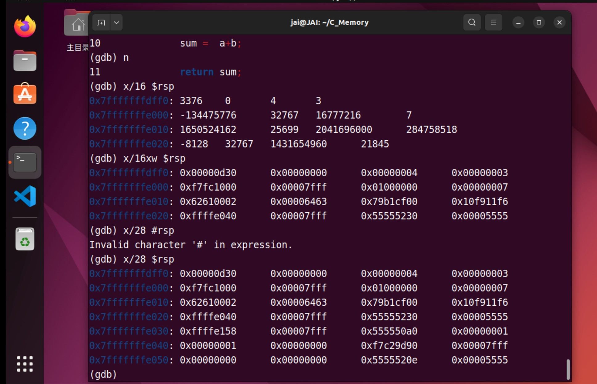
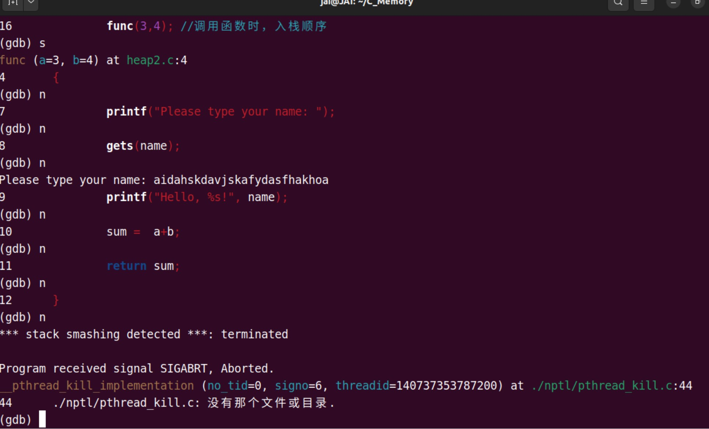
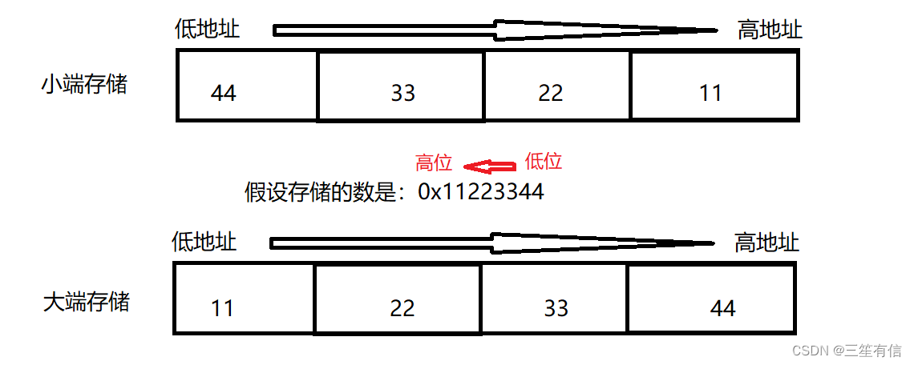
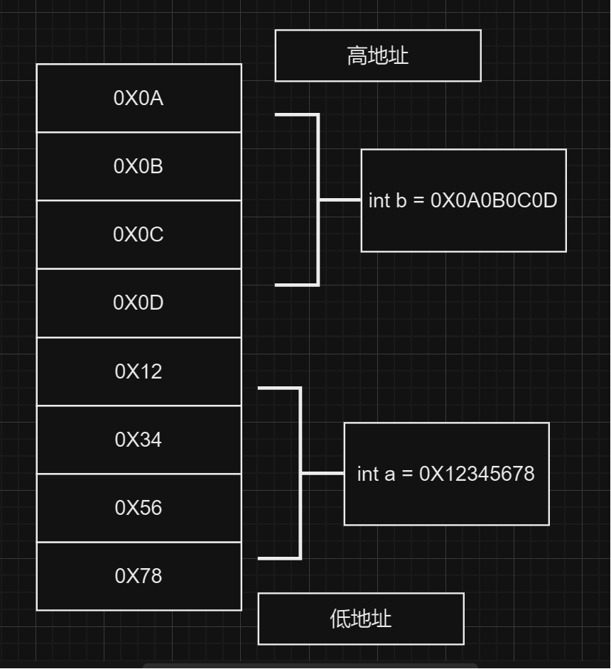

## 总体概述


```C
#include <stdio.h>
#include <stdlib.h>

const int    g_A       = 10;         //常量区 
int          g_B       = 20;         //数据段  
static int   g_C       = 30;         //数据段  
static int   g_D;                    //BSS段  
int          g_E;                    //BSS段  
char        *p1;                     //BSS段  

int main()
{
    int           local_A;            //栈  
    int           local_B;            //栈  
    static int    local_C = 0;        //BSS段(初值为0 等于没初始化，会放在BSS段 )  
    static int    local_D;            //数据段  
      
    char        *p3 = "123456";    	  //123456在代码段，p3在栈上  
  
    p1 = (char *)malloc( 10 );    	  //堆，分配得来得10字节的区域在堆区  
    char *p2 = (char *)malloc( 20 );  //堆上再分配，向上生长
    strcpy( p1, "123456" );        	  //123456{post.content}放在常量区，编译器可能会将它与p3所指向 的"123456"优化成一块  
  
    printf("hight address\n");  
    printf("-------------栈--------------\n");  
    printf( "栈,    局部变量,                           local_A, addr:0x%08x\n", &local_A );  
    printf( "栈,    局部变量,(后进栈地址相对local_A低)  local_B, addr:0x%08x\n", &local_B );  
    printf("-------------堆--------------\n");  
    printf( "堆,    malloc分配内存,             p2,     addr:0x%08x\n", p2 );  
    printf( "堆,    malloc分配内存,             p1,     addr:0x%08x\n", p1 );  
    printf("------------BSS段------------\n");  
    printf( "BSS段, 全局变量,       未初始化    g_E,     addr:0x%08x\n", &g_E, g_E );      
    printf( "BSS段, 静态全局变量,   未初始化,   g_D,     addr:0x%08x\n", &g_D );  
    printf( "BSS段, 静态局部变量,   未初始化,   local_C, addr:0x%08x\n", &local_C);  
    printf( "BSS段, 静态局部变量,   未初始化,   local_D, addr:0x%08x\n", &local_D);  
    printf("-----------数据段------------\n");  
    printf( "数据段,全局变量,       初始化      g_B,     addr:0x%08x\n", &g_B);  
    printf( "数据段,静态全局变量,   初始化,     g_C,     addr:0x%08x\n", &g_C);  
    printf("-----------代码段------------\n");  
    printf( " 常量区                只读const,  g_A,     addr:0x%08x\n\n", &g_A);  
    printf( " 程序代码，可反汇编看 objdump -d a.out \n");
    printf("low address\n");  
	return 0;
}
运行结果:
hight address
-------------栈--------------
栈,    局部变量,                  local_A, addr:0xc8419530
栈,    局部变量,                  local_B, addr:0xc8419534
-------------堆--------------
堆,    malloc分配内存,             p2,     addr:0xe22852c0
堆,    malloc分配内存,             p1,     addr:0xe22852a0
------------BSS段------------
BSS段, 全局变量,       未初始化    g_E,     addr:0xe19c0020
BSS段, 静态全局变量,   未初始化,   g_D,      addr:0xe19c0030
BSS段, 静态局部变量,   未初始化,   local_C,  addr:0xe19c0034
BSS段, 静态局部变量,   未初始化,   local_D,  addr:0xe19c0038
-----------数据段------------
数据段,全局变量,       初始化      g_B,      addr:0xe19c0010
数据段,静态全局变量,    初始化,     g_C, addr:0xe19c0014
-----------代码段------------
常量区                只读const,  g_A,      addr:0xe19be008

 程序代码，可反汇编看 objdump -d a.out 
low address

```

> 在函数调用时，每个局部变量都会被分配到栈上，栈是一种后进先出（LIFO）的数据结构，也就是说后定义的变量会先进栈，先定义的变量会后进栈，所以在这个例子中，local_A先定义，但是后进栈，所以它的地址比local_B的地址高。另外，**编译器可能会对变量的内存布局进行优化，所以实际的地址分配可能不完全按照代码中的顺序进行。**


## 堆的动态申请释放

#### 基本操作


#### 通过函数分配空间

```C
//错:
#include <stdio.h>
#include <stdlib.h>

void getmemory(char *p)
{
   p=(char *) malloc(100); 
   strcpy(p,"hello world");
}

int main( )
{
   char *str=NULL;
   getmemory(str); 
   printf("%s",str);
   free(str);
   return 0;
}


//改:
#include <stdio.h>
#include <stdlib.h>
void getmemory(char **  p)  
{ 

   *p=(char *) malloc(100); //申请空间首地址付给传入的被p指向的指针，即str
   strcpy(*p,"hello world");
}
//p: 指向指针的指针
//*p: p指向的指针(即str)
//**p: 最终malloc分配的空间(str指向的堆空间)

//getmemory传入指针str的地址给p 
//而*p取得是传入参数的地址(也就是str指针变量的地址)
//最后再用**p访问到了*str具体的值

int main( )
{
   char *str=NULL;
   getmemory(&str); //传入指针变量本身的地址
   printf("%s",str);
   free(str);
   return 0;
}
```

当我们在函数中需要修改一个指针的值时，**我们需要传递指针的地址**，而不是直接传递指针本身。

因为C语言中，**函数参数传递是按值传递的，即函数内部对参数的修改不会影响到函数外部的变量。**

在原始代码中，getmemory函数中的参数p是一个指针，当我们将p指针重新赋值为malloc分配的内存地址时，只是修改了函数内部的p指针，并不会修改main函数中的str指针。所以在main函数中打印str时，会输出NULL。

为了解决这个问题，我们需要传递str指针的地址给getmemory函数，这样在函数内部就可以通过修改*p来修改main函数中的str指针。通过传递指针的地址，我们可以实现对指针的间接修改。

所以我们将getmemory函数的参数改为char **p，即传递指针的指针。在函数内部，通过*p来访问和修改str指针指向的内存。这样就能够正确地分配内存并将字符串复制到str指针指向的内存中。

在main函数中，我们传递str指针的地址给getmemory函数，这样在函数内部通过修改*p来修改main函数中的str指针。然后我们可以正确地打印str指针指向的字符串，并在程序结束前释放str指针指向的内存。

通过这样的修改，我们可以实现对指针的间接修改，确保在函数内部对指针的修改能够影响到函数外部的变量。


#### 给已经Free的空间赋值

```c
// 问: 输出结果是什么? 为什么 
#include <stdio.h> #include <stdlib.h> 
void GetMemory(char **p,int num)
{ 
    *p=(char *)malloc(num); 
} 
int main()
{ 
    char *str=NULL; 
    GetMemory(&str,100); 
    strcpy(str,"hello"); 
    free(str); 
    if(str!=NULL) 
    { 
        strcpy(str,"world"); 
    } 
    printf("\n str is %s",str); 
}
```

 答案：输出str is world。

**进程中的内存管理 是由库函数完成，不是由操作系统。** malloc时, 库函数会向操作系统申请空间，并做记录, 但free时, 库函数不会把空间马上还给操作系统, 还能继续访问。 但后面可能这个空间分配给别人。 **所以为避免误操作 free(str) 后 需 str=NULL;**

```C
    free(str);
    str = NULL; // 将指针设置为NULL
```


#### 内存泄漏

> malloc后没有进行free, 系统运行几天后, 不停地申请内存, 最后导致内存崩溃, 
>
> 可能在某个Switch中偶尔申请

###### 未配对释放

 ```c
 char *pt = (char *)malloc(10); //堆上申请空间，未配对free(pt)
 ```


###### 丢失地址

```C
  char *pt= (char *)malloc(10); 	
...
...
...
    //可能中间隔了好多的函数
    pt= (char *)malloc(20); 	//覆盖了指针，导致前面10个空间的地址丢失。
```


###### 未分级释放

```C
#include  <stdio.h>
#include  <stdlib.h>
struct birth
{
   int year;
   int month;
   int day;
};

struct student
{
   char is_male;
   char *name;
   struct birth * bi;
    //int a[1000];
};

int main()
{
   struct student *pt;
   pt= (struct student *)malloc(sizeof(struct student)); //堆上申请空间

   pt->is_male =1;
   pt->name = "wangwei";
   pt->bi = (struct birth *)malloc(sizeof(struct birth)); //堆上申请空间
   pt->bi->year = 2000;
   pt->bi->month = 3;  
   pt->bi->day = 2;  

   printf("%s %d \n",pt->name,pt->bi->day);

   //逐级释放空间，避免内存泄漏
   //pt->name 是字符串常量 不用释放 
   if(pt->bi!=NULL){ 
      free(pt->bi); //先释放子空间
      pt->bi=NULL;
   }
   free(pt); //后释放父空间
   pt =NULL; //避免野指针 (操作已释放的空间)

   return 0;
}	
```

`   struct student *pt;`   

`pt= (struct student *)malloc(sizeof(struct student)); //堆上申请空间`

相比直接`struct student Student_A`(会计算这个结构体的大小, 然后申请了各种局部变量,如a[1000]就很浪费空间)

**使用堆分配,更加节省空间.**

> 在C语言中，内存空间可以分为两种类型：栈空间和堆空间。
>
> 栈空间是由编译器自动分配和管理的内存空间，用于存储局部变量和函数调用的参数、返回值等信息。栈空间的大小和生命周期是在编译时就确定的，不能动态地增加或减少。
>
> 堆空间是由程序员手动分配和释放的内存空间，用于存储动态分配的变量、数组、结构体等数据结构。堆空间的大小和生命周期是在运行时动态确定的，可以根据需要动态增加或减少。
>
> 在上述代码中，使用了malloc函数来动态分配内存空间，这个函数会在堆上分配一块指定大小的内存空间，并返回一个指向该内存空间的指针。因此，通过malloc函数动态分配内存空间就是在堆上分配内存空间。
>
> 而如果直接定义结构体变量，变量的内存空间就会在栈上分配，其大小和生命周期在编译时就已经确定，无法动态调整。因此，如果需要动态管理结构体对象，就需要使用指针来动态分配内存空间，以便在程序运行时动态创建和管理结构体对象。


## GDB调试--以栈溢出为例子

> 栈越界，覆盖别的数据  --> 提升调试能力

```C
//栈: 是一种 先进后出 的数据结构 -> 函数调用返回 
---    ---
  |    |
  | 3  | <-- rsp/esp 栈顶指针(进出栈时它会变化)
  | 2  | 
  | 1  | 
 -----  <-- rbp/ebp 栈底指针
```


#### 函数调用返回


> 入栈顺序: 一般是从函数的下面到上面, 参数从左到右 ( 由栈的特点FILO可知 )
>
> ==**(上面这个图有问题，返回地址和前栈栈底反过来了 )**==
>
> 入栈顺序：1. 返回地址 2. 前栈栈底（rbp） 3. 相关参数
>
> 出栈顺序：1. 相关参数 2. 前栈栈底（rbp） 3. 返回地址

```c
#include <stdio.h>
int func2(int x,int y){
   char name[6];
   int sum; 
   printf("input: "); 
   gets(name); //输入字符过多，name会越界，栈溢出崩溃
   return x+y;
}

int func1(int a){
   int x=1;
   printf(" func1 a=%d\n",a);
   func2(3,4);
   return a+x;
}

int main (int argc,char *argv[]) {
    func1(2);
    printf("main end\n");
    return 0;
} 
```


#### ==（重要）GDB调试==

> 这部分以后用来可以复习GDB的操作,顺便复习栈的存储, 在大脑中建立一张内存的地图	

```C
//测试函数
#include <stdio.h> 
//入栈顺序：是从下到上，从右至左，反向进栈
int func (int a,int b )   //4.b    5.a  (从右至左) 这里编译器优化了好像
{ 
	char name[6]; //3. name[]
	int sum;      //2.sum     从下到上
	printf("Please type your name: "); 
	gets(name); 
	printf("Hello, %s!", name);
	sum =  a+b;
	return sum; 
} 

int main (int argc,char *argv[]) 
{ 
	func(3,4); //调用函数时，入栈顺序
	           //1. 返回地址入栈( 如return 0; ) 
	return 0; 
}      
```

##### 1.  开始调试

```C
$ gcc -g -fno-stack-protector -z execstack  main.c	//编译时 关闭栈保护
$ gdb ./a.out
(gdb) l 1,25   //查看1到25行代码
(gdb) b 15     //断点设在第15行(char name[6]处)
(gdb) r        //全速运行


/*    常用的GDB调试命令
run 或 r：启动程序的执行。
break 或 b：设置断点。通过指定行号或函数名来设置断点，如 break main 或 break 10。
continue 或 c：继续执行程序，直到下一个断点或程序结束。
next 或 n：执行下一行代码，不进入函数调用。
step 或 s：执行下一行代码，并进入函数调用。
print 或 p：打印变量的值。例如 print x。
examine 或者 x : 显示内存信息 显示某地址的内存值 
info 或者 i: 显示内存信息
list 或者 l: 显示源码 
backtrace 或 bt：打印函数调用栈的信息。
info locals：打印当前函数的局部变量。
info breakpoints：显示当前设置的所有断点。
delete：删除指定的断点。例如 delete 1。
watch：设置观察点，当变量的值发生改变时，程序会停下来。
quit 或 q：退出GDB调试。
*/
```


```C
// 看main的栈帧地址 argc = 1, argv = 0x7fffffffe158 对应地址 0x7ffffffe030
```

> 对于函数的参数，一般都是从右到左（argv[] ->argc）入栈的,  也就是右边的先入栈到栈底（也就是高地址）， 但是gdb调试出来的结果又不是这样？argc先入了栈？
>
> 可能是编译器优化的缘故

##### 2. 执行到哪里

```C
(gdb) i reg   //查看寄存器
              //rsp : 栈顶指针(进出栈时它会变化 ),有些cpu里叫esp
              //rbp : 栈底指针
              //rip : 指令指针(下一条 等待执行的 指令地址)
(gdb) x $rip  //查看rip寄存器内容 (知道程序执行到那了)
              // x/16x $rip   查看16个将要执行代码的机器码   
       
(gdb) disas main //反汇编main函数
Dump of assembler code for function main:
   0x000055555555520e <+0>:	endbr64 
   0x0000555555555212 <+4>:	push   %rbp
   0x0000555555555213 <+5>:	mov    %rsp,%rbp
   0x0000555555555216 <+8>:	sub    $0x10,%rsp
   0x000055555555521a <+12>:	mov    %edi,-0x4(%rbp)
   0x000055555555521d <+15>:	mov    %rsi,-0x10(%rbp)
       //func(3,4); 代码的内存位置和反汇编代码
   0x0000555555555221 <+19>:	mov    $0x4,%esi   //func 传参 4
   0x0000555555555226 <+24>:	mov    $0x3,%edi   //func 传参 3
   0x000055555555522b <+29>:	call   0x555555555189 <func>
       											   //跳到函数 func中 
   0x0000555555555230 <+34>:	mov    $0x0,%eax   //调用func后的返回地址
   0x0000555555555235 <+39>:	leave  
   0x0000555555555236 <+40>:	ret    
End of assembler dump.

```

0x7fffffffdb33

##### 3. 栈查看

```c
//进入func函数后

(gdb) bt full  //查看全部的 函数调用栈信息
 #0  main (argc=1, argv=0x7fffffffe158) 
           //argc=1: 参数个数 1    对应 ./a.out
 	   //argv=0x7fffffffe158 参数指针数组起始位置  如 ./a.out  hello  word 时
 	   //argv[0] 对应 ./a.out字符串起始地址  argv[1] 对应 hello 字符串起始地址
	                            
(gdb) x $rbp    //查看栈底
  0x7fffffffdf90:	0x00000000 //main函数的栈低
(gdb) x/28 $rsp //查看栈顶 (进出栈时它会变化 ) 
      //28：查看从栈顶地址开始 连续28个int 内存单元
      // eg.(gdb) x/20xw $rsp  (x:16进制，w:word)
      //入栈:   argv=0x7fffffffe158           字节对齐补0       argc=1
0x7fffffffdff0:	0x00000d30	0x00000000	0x00000004	0x00000003//这一行注意
0x7fffffffe000:	0xf7fc1000	0x00007fff	0x01000000	0x00000101
0x7fffffffe010:	0x00000002	0x00000000	0x078bfbff	0x00000000
0x7fffffffe020:	0xffffe040	0x00007fff	0x55555230	0x00005555//这一行注意
0x7fffffffe030:	0xffffe158	0x00007fff	0x555550a0	0x00000001//这一行注意
0x7fffffffe040:	0x00000001	0x00000000	0xf7c29d90	0x00007fff
0x7fffffffe050:	0x00000000	0x00000000	0x5555520e	0x00005555

```

进入到func函数之后,已经将func返回地址和main函数的栈帧入栈了

先记住一点, 程序不断向下运行, 栈顶指针(rsp)不断递减

所以, 从e030地址到e020地址. e020到e030地址的低地址部分里面存着main函数栈帧(e040).

高地址部分存着返回地址(0x555555555230), 这个地址可以参考2. 中的main函数的反汇编,查看call下面的那条mov指令的地址刚好就是0x555555555230


##### 4.  进一步调试

> 查看覆盖内存
>
> 输入name[6] 

- 未覆盖(输入了abc) 


地址: 0x7fffffffe010存的内容:abcd

- 覆盖


直接无法返回


##### 5. 大脑中建立内存图



> **上图的返回地址和前栈栈底反过来了**

```C
--------4G---------0xFFFFFFFF  高地址
|      -----      | 0xffffffffff601000  
|       内核      |   
|      -----      | 0xffffffffff600000  //内核系统调用 起始地址
|                 |   
========3G=========0xC0000000
|                 |
|-----------------| 0x7ffffffde050  //系统栈的起始地址: 栈是向下生长
|    栈(stack)    |    
|    --------     | 0x7fffffffe040  //main函数的栈底
|   0x00000001    | //argc=1   调用main函数时入栈 
|   0x00000000    | //字节对齐  
|   0x00007fff    | //argv=0x7fffffffe158 指针数组首地址(64位机 8字节 小端)
|   0xffffe158    | 0x7fffffffe030
|    -------      | //当main函数栈进完后，会rbp存入下一地址中，把下一地址存入rbp中，作为新栈的栈底        
|   0x55555230    | //返回地址： 调用func后，返回到main的地址
|   0x00005555    |  
|   0xffffe040    | //func函数的栈底：存储的上一栈的栈底(main函数的栈底 8字节)  
|   0x00007fff    | 0x7fffffffe020
|   0x10f911f6    |
|   0x79b1cf00    | //sum 局部变量(未初始化)入栈  -> 从下到上，从右至左进栈
|   0x00006463    |
|   0x62610002    | 0x7fffffffe010 //name[6]
|   0x00007fff    |
|   0xf7facfc8    | 0x7fffffffe000  //补全
|   0x00000003    |  //实参拷贝到形参 b=4 a=3; 
|   0x00000004	  |                
|-----------------| 0x7ffffffff000 
|                 |
|      .....      |          
|                 |
|-----------------|
|    堆(heap)     |   
-------------------
|    DATA数据段   | 
-------------------
|                 |
|      -----      | 0x555555558000 
|   代码区(只读)   | 
|      -----      | 0x555555554000  //a.out 程序的 起始地址
|                 | 
-------------------0x00000000 低地址	
```


## GDB 实际运用1

```C
/*
当运行  ./a.out abcd 正常
当运行  ./a.out abcdefghijkomk 时 溢出崩溃
尝试用gdb调试分析 栈溢出 的过程
*/
#include <stdio.h>
#include <string.h>

void function2(){
    printf("Execution flow changed\n");
}
void function1(char *str){
    char buffer[5];
    strcpy(buffer,str);
}
void main(int argc,char *argv[]){
   int a=1;
   int b=2;
   int c=3;
    function1(argv[1]);
    printf("%s\n","Executed normally");
}	
```

#### 前置知识

在C语言中，`main`函数是程序的入口点，也是程序开始执行的地方。它接受两个参数：`argc`和`argv`。

- `argc`（argument count）是一个整数，表示命令行参数的数量。它包括程序名称本身作为第一个参数。例如，如果在命令行中运行程序时输入了3个参数，那么`argc`的值将为4。
- `argv`（argument vector）是一个指向字符串数组的指针，其中每个字符串都是一个命令行参数。数组中的第一个元素（`argv[0]`）是程序的名称，后续元素（`argv[1]`、`argv[2]`等）是传递给程序的实际参数。

在Ubuntu下运行程序时，可以通过命令行输入参数。例如，假设你的程序名为`myprogram`，你可以在终端中输入以下命令来运行程序并传递参数：

```
./myprogram arg1 arg2 arg3
```

在这个例子中，`argc`的值将为4，`argv`的值将是一个指向包含`"./myprogram"、"arg1"、"arg2"、"arg3"`的字符串数组的指针。

在代码中，`main`函数的参数`argc`和`argv`被用来接收命令行参数。`argc`用于检查传递给程序的参数数量是否足够，`argv[1]`用于传递给`function1`函数的参数。


#### 分析

> 当运行  ./a.out abcd 正常
> 当运行  ./a.out abcdefghijkomk 时 溢出崩溃
>
> 可以看出, 就是命令行参数的问题.
>
> 数组只有5个空间,但是命令行参数太多了,导致溢出





#### 改进

| 问题               | 描述                                          | 修复方法                                   |
| ------------------ | --------------------------------------------- | ------------------------------------------ |
| 缓冲区溢出         | `function1`中的`strcpy`函数可能导致缓冲区溢出 | 使用`strncpy`函数，并指定目标数组的大小    |
| 缺少命令行参数检查 | `main`函数中没有检查命令行参数的数量          | 添加对`argc`的检查，确保有足够的命令行参数 |

```C
void function1(char *str){
    char buffer[5];
    strncpy(buffer, str, sizeof(buffer)-1);
    buffer[sizeof(buffer)-1] = '\0';
}
//main 函数中:
    if (argc < 2){
        printf("Insufficient command line arguments\n");
        return 1;
    }
```


## GDB 实际运用2

**挑战：用栈溢出漏洞，不知道密码情况下，如何验证通过**

```c
#include <stdio.h>
#include <string.h>
#define PASS_WORD "1234567" 

int verify_password(char * password)
{
    int authentitated;
    char buffer[8];
    authentitated = strcmp(password,PASS_WORD);
    strcpy(buffer,password);
    return authentitated;
}

int main()
{
    int valid_flag = 0;
    char password[1024] = {0};
    while (1)
    {
        printf("please input password:");
        scanf("%s",password);
        valid_f lag = verify_password(password);
        if(valid_flag)
        {
            printf("incorrect password!\r\n");
        }
        else
        {
            printf("Congratulation ! you have passed the verification !\r\n");
        }
    }
    return 0;
}
```

**目前卡住**


## 大小端

> **大端（存储）模式**: 是指数据的**低位**保存在内存的**高地址**中，而数据的高位，保存在内存的低地址中；(读取数据就是从低字节空间开始读)
>
> **小端（存储）模式**: 是指数据的**低位**保存在内存的**低地址**中，而数据的高位,，保存在内存的高地址中。(读取数据就是从高字节空间开始读)
>
> **绝大多数CPU都是小端存储**
>
> 

```C
#include <stdio.h>

int main()
{
	int a = 0x12345678; //(gdb) p/t  a
		            //(gdb) x   &a 查看内存值
	char *b =(unsigned char *)&a;  //通过地址 强转为char型，让指针 指向字节地址
	printf("%x %x %x %x",*(b+3),*(b+2),*(b+1),*b);  
}

12 34 56 78
```


#### 编写函数判断

```C
//方式一: 指针转型
int i = 1;   
unsigned char *pointer;   
pointer = (unsigned char *)&i; //int 强转char型 时 只保留最低位字节的数据。   
// （低） 00 00 00 01（高）  大端序
// 01 00 00 00  小端序
if(*pointer){
   printf("little"); //小端(大部分是小端存储)
}else{
   printf("big");
} 
  
//方式二: 联合体
int checkCPU()
{
  union w
  { 
    int a;
    char b;
  }c;
  c.a = 1;  //联合体的所有成员都从低地址开始存放，
  return (c.b == 1);  //0:大端  1:小端
} 
```


#### 实际题目:

> 指针偏移 + 大小端

```C
#include <stdio.h>
int main()
{
   int a = 0x12345678;
   int b = 0x0A0B0C0D;
                     
   unsigned char *c=( unsigned char *)&a; 
   printf("%x ",*(c+1));
   printf("%x ",*(int*)(c+1));
   return 0;
}	

#include <stdio.h>
int main()
{
   int a = 0x12345678;
   int b = 0x0A0B0C0D;  
   // 局部变量 会顺序分配地址(注意函数局部变量入栈的顺序:从下到上):  
   //(gdb) x &a
   // 0x7fffffffdf78:	0x12345678  
   //(gdb) x &b
   // 0x7fffffffdf7c:	0x0a0b0c0d
   //因是小端 故内存为
   //内存： 高 0x0A0B0C0D 0x12345678  低(下图)                
   unsigned char *c=( unsigned char *)&a; //小端 a 地址指向低字节 78
   printf("%x ",*(c+1)); // 0x56
   printf("%x ",*(int*)(c+1)); //0d123456
    //先进行加1后再进行强转:
    //78 下一个 56 之后转为int型,取四个字节的内容
    //再根据地址的顺序,向上取四个字节的内容 56 34 12 0D
    //最后读出来: 0d123456
   return 0;
}	
```




## 指针偏移

#### 例子1

> 在C语言中，**指针运算是以指针所指向的数据类型的大小为单位进行的**。
>
> 例如，对于一个`int*`类型的指针，指针运算将以`sizeof(int)`的大小为单位进行。对于一个`char*`类型的指针，指针运算将以`sizeof(char)`（即1字节）的大小为单位进行。

```C
//例:指针偏移 + 类型转换
//问：下题输出信息是？
int a[5]={1,2,3,4,5}; 
int *ptr=(int *)(&a+1); 
	//&a:取数组的地址。    
	//&a+1:下一个对象的地址(对象是 数组类型，长度单位 是 4*5,偏移1个数组的大小),
	//指针的偏移: 是以它指向的对象的数据类型的长度为偏移的单位
	//          指针的类型就像人的身份，你是以个人，还是老板的身份
	//          不同的身份，你的贷款额度不一样
	//(int *): 把指向数组类型的地址，强转为指向int型的地址 
	//是先进行了加1,指向下一个对象,之后再转换为int型的地址,让加减可以访问数组的每一个元素,不然就是访问下一个对象了.
	//int 型是4 ，double型是8  数组型是数组长度。	                        
printf("%d,%d",*(a+1),*(ptr-1)); 
	//a: 数组名，是数组首个元素的地址，指向的数据类型是元素的类型 int
	//a+1:  下一元素的地址，即a[1]  (对象是 int类型，长度单位是 4)    
	//*(a+1): a地址偏移1个单位(int 是4)，再取里面内容(int型)      是2
	//ptr: 是指向int型的指针
	//ptr-1: 地址减1个单位(int型是4)
	//*(ptr-1): 取里面内容(int型)                              是5
```

**注意分清 (a+1) 和 (&a+1) **


#### 例子2

> 指针偏移 + 类型转换 +大小端

```C
//问：下面程序，变量a的内存地址为：0x0034fc50  问printf输出值是多少
int main()    
{    
  int a[5] = { 1, 2, 3, 4, 5 };  
  int *p1  = (int*)(&a + 1);    
  int *p2  = (int *)((int)a + 1);    

  printf("0x%x, 0x%x\n", p1[-1], *p2);  
  return 0;    
}  	
```

```C
//解答:
首先分析p1
&a为数组指针，类型是"int (*)[5]"，数组指针是指向数组首元素的地址的指针
&a的内存地址为：0x0034fc50
&a + 1指针加一，向后移动一个元素，这里的元素类型是"int (*)[5]"，其空间大小为20字节，因此//指向了下一个对象了
&a + 1的内存地址为：0x0034fc64（0x0034fc50 + 0x14）
p1的内存地址为：0x0034fc64
p1[-1]数组下标为负数，向前移动一个元素（注：数组越界在编译时与运行时都不会报错，除非操作非法内存）
p1[-1]元素所在的地址为：0x0034fc60
因此，可知p1[-1]的地址为a + 4的地址
p1[-1] == *(a + 4) == 5
   
    
继续分析p2
(int)a的值为0x0034fc50//注意,转换为int类型后,这个地址就变成一个数了,所以加1可以直接加
(int)a + 1等于0x0034fc51
分析内存结构，测试环境字节序为little endian
01 00 00 00 02 00 00 00 03 00 0...
*p2等于0x2000000
//这里还有一点要考虑,在64位机和32机上的结果不一样(下图)
//32机能正常运行,因为指针变量占了4个字节 为:0x(7f)ffffe021
//但是64位机:0x7ffffffe021 进行了强制类型转换后 p2变成4字节的了,
//这个之后又用(int*)把它转回8个字节的指针变量类型, 自动补全为:0xffffffffe021 这段内存是非法的
//由前面的知识可知,这部分,大概处于内核区 
```


## 越界

````C
char s='a';
int *pt;
pt=(int*)&s;
*pt=0x1234;    //访问未知区域(pt指向空间未完全分配，只有1个字节是s的，其它的未知)
               //可gdb调试看看: (gdb) x &s   (gdb) x pt 
printf("%d\n",*pt); //段错误：访问未知区域
````


#### 字符串 ’\0’ 数组越界

```c
char astr[5];
char* pstr = "12345"; //包括末尾的’\0’, 
strcpy( astr, pstr ); //数组越界(pstr 需6个字节空间)	
```


#### 无结尾’\0’ 的strcpy

```C
char string[10], str1[10];
int i;
for(i=0; i<10; i++){ 
	str1[i] = 'a';
}
strcpy(string, str1 ); 
//解答:
//	1. 无结尾字符’\0’， strcpy拷贝不会结束  给3分
//	2. 从str1内存起复制到string内存起所复制的字节数具有不确定性 给7分
//	3. 指出库函数strcpy工作方式的  给10 分
/*
1. 在循环中，数组str1被填充了字符'a'。然而，由于没有在数组末尾添加结尾字符'\0'，所以strcpy函数无法确定复制的结束位置。这可能导致复制的结果不可预测，因为strcpy函数会一直复制直到遇到'\0'为止。这个问题给予3分。

2. 由于没有明确指定复制的长度，复制的字节数具有不确定性。这是因为strcpy函数会一直复制直到遇到源字符串的结尾字符'\0'为止。由于源字符串str1中没有结尾字符，复制的长度可能超过目标字符串string的长度限制，导致内存越界。这个问题给予7分。

3. strcpy函数是一个库函数，用于将一个字符串复制到另一个字符串。它的工作方式是从源字符串的起始位置开始，逐个复制字符直到遇到源字符串的结尾字符'\0'。这个问题给予10分。
*/
```


#### strlen未统计’\0’

```C
char a[5];
char* p = "12345";
if( strlen( p ) <= sizeof(a) ){ //去掉=号，  因strlen的结果未统计’\0’
  strcpy( a, p );
}
```

| 特点     | sizeof                                             | strlen                                                     |
| -------- | -------------------------------------------------- | ---------------------------------------------------------- |
| 返回类型 | size_t                                             | size_t                                                     |
| 参数类型 | 任何类型                                           | 字符串指针                                                 |
| 返回值   | 对象或类型的大小（以字节为单位）                   | 字符串的长度（不包括结尾的'\0'）                           |
| 计算方式 | 在编译时计算对象或类型的大小                       | 在运行时计算字符串的长度                                   |
| 适用范围 | 任何类型的对象或类型                               | 仅适用于以'\0'结尾的字符串                                 |
| 注意事项 | 不会计算指针所指向的对象或类型的动态分配内存的大小 | 不会计算'\0'字符的长度，只返回第一个出现的'\0'之前的字符数 |

总之，`sizeof`和`strlen`都是C语言中常用的运算符和函数，用于计算对象或字符串的大小或长度。它们的主要区别在于计算方式和适用范围，需要根据具体的使用场景选择合适的运算符或函数。


#### 越界拷贝

```C
int main()
{
   char a;
   char *str=&a;
   strcpy(str,"hello");
   printf(str);
   return 0;
}	
//解答:
//  str未分配空间, 越界拷贝，崩溃。
//  应改为 char *str = malloc(6);
```


## 字节对齐

```C
#include <stdio.h>
typedef struct stu
{
   char sex;
   int age;
}stu;
int main(){
  stu s={1,5};
  //问题：如不对齐，长度为5, 取age数据，需要读两次的数据来拼接。
  printf("%d\n",s.age);
  //字节对齐：补空成，类型最大的元素 的整数倍 -> 空间换时间(避免读两次来拼接数据)
  //          sex 补齐3个char 与int想等对齐后，只需读一次 
  printf("%d\n",sizeof(stu));  //8 
  return 0;
}
```

结构体对齐的关键知识点：

1. 对齐原则：结构体的对齐是**按照成员中占用空间最大的数据类型进行对齐**的。通常情况下，对齐的基本单位是字节，即**结构体的起始地址必须是成员中最大数据类型的倍数**。

2. **成员对齐**：**结构体的成员变量按照定义的顺序依次排列在内存中。**每个成员变量的对齐要求是其数据类型的大小。如果一个成员变量的大小不能被当前位置的对齐单位整除，则需要在其后插入适当数量的填充字节，以满足对齐要求。

3. 结构体对齐：结构体的总大小是所有成员变量大小之和，加上填充字节的大小。填充字节的大小取决于前面的成员变量的对齐要求和当前位置的对齐单位。

4. #pragma pack 指令：有些编译器提供了`#pragma pack`指令，可以通过指定对齐单位来修改结构体的对齐方式。这可以用来优化内存占用或与其他系统进行数据交互。

5. 结构体对齐的影响：结构体对齐可以提高内存访问的效率，减少内存碎片和浪费。但是，过度的对齐可能会导致内存浪费，因为填充字节会占用额外的空间。

6. 结构体对齐的可移植性：结构体对齐是与编译器和平台相关的。不同的编译器和平台可能有不同的对齐规则和默认对齐方式。为了确保代码的可移植性，应该遵循标准的对齐规则，并避免依赖于特定的对齐方式。

总之，结构体对齐是为了提高内存访问效率和优化内存占用而进行的一种内存布局方式。了解结构体对齐的知识点可以帮助我们更好地理解和控制结构体在内存中的存储方式。

#### 逐段对齐

```C
typedef struct stu
{
    char sex;
    short num;
    int age;
}stu;	// 1 2补1 + 4 =8

typedef struct stu
{
    char sex;
    int age;
    short num;
}stu;	//1补3 + 4 + 2补2 =12  	
```


#### 带位数指定的 逐段对齐

```c
struct s
{
    int i: 8; //占int型里的8位
    int j: 4; //占int型里的4位
    double b; //8
    int a:3;
}; //4补4 +  8 + 4补4  = 24 逐段对齐 
printf("sizeof(s1)= %d\n", sizeof(s2));
```


#### 带联合体 的对齐

```C
typedef struct stu
{
   int num;       //4
   char name[30]; //30  
   char job;			 //1   
   double sex;		 //8
   union    //只分配最大元素的空间（8）
   {
     int grade;	//4
     double d;		//8   类型最大值
   }gorp;
}stu;  //类型最大值8 ，总长51，补成8的倍数 为56
```

#### 实例

```C
typedef union
{
   long i;
   int k[5];
   char c;
} DATE; 　

struct data
{
   int cat;
   DATE cow;
   double dog;
} too;
　 
DATE max; 

//则语句 printf("%d",sizeof(struct data)+sizeof(max));的执行结果是___,
/*
20+32= 52
typedef union //最大元素空间 为20
{
    long i;   //8
    int k[5]; //4*5=20
    char c;   //1
} DATE; 　

struct data
{
    int cat;  //4
    DATE cow; //20
    double dog; //8
} too;   // 4 +20 +8 = 32 刚好是8的倍数
*/
```

> 带函数指针的结构体大小计算 
>
> 看函数指针前面的返回参数类型就知道这是什么类型的函数指针

```C
typedef struct {
    char *description;
    int (*init)(void *self);
    void (*describe)(void *self);
    void (*destroy)(void *self);
    void *(*move)(void *self, Direction direction);
    int (*attack)(void *self, int damage);
 } Object;
  
 int Object_init(void *self);
 void Object_destroy(void *self);
 void Object_describe(void *self);
 void *Object_move(void *self, Direction direction);
 int Object_attack(void *self, int damage);
 void *Object_new(size_t size, Object proto, char *description);
  
 #define NEW(T, N) Object_new(sizeof(T), T##Proto, N)
 #define _(N) proto.N
 
 #endif
```


## 常用的关键字

### const

```C
const int a; 
int const a;    //都一样，声明a是一个常整型数(a不可更改)
const int *a;   //a是一个指向常整型数的指针(指向的整型数(指向的内容)不可改，但指针(地址)可以)
int * const a;  //a是一个指向整型数的常指针(也就是说，指向的整型数可改，但指针(地址)不可改)
int const * a const;  //a是一个指向常整型数的常指针(都不可改)

const char const *argv; // Declaration of a pointer to constant character data
const char *str = "Hello";
const char const *ptr = str; // Pointer to constant character data
char const *name = "John"; // Another example of a pointer to constant character data

const char * const *argv; // Declaration of a constant pointer to a constant pointer to constant characters
const char *str = "Hello";
const char * const ptr = &str; // Constant pointer to constant character data
char *const *names; // Pointer to constant pointer to characters


注  //声明为const后，编译器会把它，放在常量区，保护起来，只读不可篡改(避免bug 增强健壮性)
   //单独考，没问题，但自己编写程序时常被遗忘， 其根本时，程序的安全意识没建立。
```

#### 例子

```C
int a=248; b=4;
int const c=21;
const int *d=&a;
int *const e=&b;
int const *f const =&a;

请问下列表达式哪些会被编译器禁止？为什么？
*c=32;
d=&b;*d=43;
*e=34;e=&a;
f=0x321f;


*c=32 //禁止: c是整型数，不是指针
*d=43 //禁止: d指向的整型数已const声明是只读
e = &a //禁止: e已const声明是常指针
f=0x321f; //禁止: f 已const声明是常指针
```


#### const 在不同位置的意义

```C
char * const p; //常量指针，p的值（地址）不可以修改
char const * p; //指向常量的指针，指向的常量值不可以改
const char *p； //和char const *p
```


### static

#### 基础知识

- 静态变量(用了static的局部变量)

> 在代码块之外声明的变量, 且存储于静态内存中, 不属于堆栈的内存

- 全局变量

> 在函数外部或者代码块之外声明的变量, 且存储于静态内存中, 不属于堆栈的内存

- 自动变量

> 在代码块之内声明的变量, 存储于堆栈中

- 寄存器变量


#### 静态局部变量

**让局部变量能 持久存在 (改变生存周期)**

```C
#include <stdio.h>

void count()
{
    static int num = 0; //定义静态局部变量 -> 数据持久(改变生存周期)
                        //底层: 从栈区移到全局数据区,实现持久(程序退出时才释放)
                        //思想: 想数据持久存在，又避免全局变量的强耦合问题
    num++;
    printf("%d\n",num);
}

int main(void)
{
    int i=0;
    for (i = 0;i <= 5;i++)
    {
        count();  //能持久保持上一次的值
    }
    return 0;
}
```


#### 静态全局变量

**使变量 外部文件，不可访问 - - -> 避免名字冲突和强耦合**

```c
//---main.c
#include <stdio.h>

void fn();
int num;   //定义 全局变量
//static int num; //定义静态全局变量(限定仅本文件内 可见)
                  //底层: 存储在全局数据区(程序退出时才释放，不像栈和堆)
                  //思想: 避免名字冲突(仅文件内可见),和强耦合(避免全局变量的多文件强耦合)
void main(){
    printf("init num=%d\n",num);  //自动初始化为0
    num =10; 
    printf("main num=%d\n",num);
    fn();
}

//---fn.c
#include <stdio.h>
extern int num; //声明 num 是外部变量 //static int num
void fn()
{
    num++;
    printf("fn n=%d\n",num);
}
//---使用
$ gcc main.c fn.c //当用static时，链接错误(外部文件 不可访问 static 静态全局变量)
$ ./a.out 
```


#### 静态函数

**使函数，外部文件，不可访问 - - ->隐藏 隔离(限定作用域)**

```C
//---main.c
#include <stdio.h>
extern void fn(); //声明 fn 是外部函数
void main(){
    fn();
}
//---fn.c
#include <stdio.h>

//声明为静态函数 -> 隐藏 隔离 保护(外部文件不能访问 改变作用域)                  
//注:在C++中就比较重要，赋予对象，唯一共享的概念
static void fn()  
{
    printf("fn go\n");
}
//---使用
$ gcc main.c fn.c //当用static时，链接错误(外部文件 不可访问 static 静态函数)
$ ./a.out 
```


#### 总结

- 用于函数定义、或者代码块之外的声明变量

> 此时static用于改变其==链接属性==, 将externa改为internal, 但是它们的存储类型和作用域不受影响. 此种方式生命的函数或变量只能在声明它们的源文件中访问

- 用于代码块内部的变量声明

> 此时static修改变量的==存储类型==, 从自动变量改为静态变量, 但是变量的连接类型和作用域不影响. 这种方式声明的变量在程序执行前创建,在整个程序执行期间一直存在.


### volatile

> 声明变量是易变的, 避免被编译器优化

#### 读硬件寄存器时(如某传感器的端口)

```c
//假设某烟雾传感器的 硬件寄存器如下(当又烟雾时报警变为1)
#define GPA1DAT *((volatile unsigned int*)0xE0200084) 

void main(){
 while (1){//反复读取GPA1DAT值，当为1时火灾报警
    if (GPA1DAT) {  //如不加volatile，编译器优化后，变成只读一次，
                    //后面用的是副本数据。一直为0
	fire()      
	break;
     }
 }
}
```


#### 多线程中对共享的变量的修改

```C
volatile  char  bStop  =  0;  //注意：需声明为volatile，线程而才能通过它停止线程1
                          //如不声明，编译器优化后，变成一直读副本数据。
void thread1(){  
  while(!bStop)  {
    //...一直循环做一些事情
  }  
}
void thread2(){  
   //...处理一些事情后。
   bStop =1; //终止线程2  
} 
```


#### 中断中对共享变量的修改

```C
static int i=0; //应加static修饰
int main(void)
{
     ...
     while (1){
	 if (i) { //虽中断中更改了i的值，但因未声明i 是易变的，
		//编译器优化后，导致它读的是副本数据，导致一直循环不退出
	   break;
	 }
    }
}
void interrupt(void)
{
      i=1;  //中断中改变 i的值，但
}
```


#### 思考

1. 思考: 一个参数既可以是const还可以是volatile吗

    > 一个实际的例子是使用 const volatile 修饰的一个**指向硬件寄存器的指针**。在嵌入式系统中，常常需要直接访问硬件寄存器来读取或写入硬件状态。这些寄存器通常是易变的，因为硬件状态可能会随着时间的推移而发生变化。同时，这些寄存器也是只读的，因为我们不能直接修改硬件状态。(对我们来说是只读的, 只能由设备本身自己更改)
    >
    > 例如，假设我们有一个只读的状态寄存器，用于检测某个外部设备的状态。我们可以使用 const volatile 修饰一个指向该寄存器的指针，以确保编译器不会对该指针进行优化，并且我们不能通过该指针修改硬件状态。
    >
    > ```c++
    > const volatile uint32_t* statusRegister = (uint32_t*)0x12345678;
    > ```
    >
    > 在上面的例子中，**statusRegister 是一个指向地址 0x12345678 的只读状态寄存器的指针。**由于使用了 const volatile 修饰，编译器将确保对该指针的任何读取操作都不会被优化，并且我们不能通过该指针修改硬件状态。这样，我们可以安全地读取硬件状态而不会受到编译器的优化干扰。

2. 下面函数有问题:

    ```C
    int square(volatile int *ptr) 
    { 
       return *ptr * *ptr;  
    } 	
    //改：
    int square(volatile int *ptr) 
    { 
       return *ptr * *ptr;  // ptr指向的数据是易变的，前面*ptr和后面的*ptr可能不一样。
    	                // 改为 int  a = *ptr; return a*a; 即可
    } 	
    ```

    


### define


