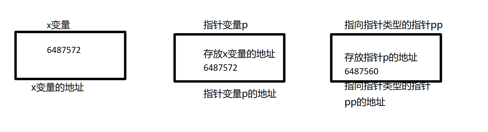

Questions


## return 0和return EXIT_SUCCESS

> ## 在C语言中, main()函数使用return 0结束和使用return EXIT_ SUCCESS结束的区别? 

先说结论, 

**==在main函数中, return (0)、exit(EXIT_SUCCESS) 和 exit(0) *基本上* 是等价的.== **


- **详细区别**

事实上 return 和直接调用 exit 的效果并不完全一样。如果使用 return，则 main 函数的[栈帧](https://www.zhihu.com/search?q=栈帧&search_source=Entity&hybrid_search_source=Entity&hybrid_search_extra={"sourceType"%3A"answer"%2C"sourceId"%3A61321168})将回收并失效。因此，比如说在 main 函数中有类似这样的代码：

```c
int
main(int argc, char **argv, char **envp)
{
    char *p;

    /* ... */
    p = malloc(PAGE_SIZE);
    /* ... */
```

而在 return 前，p没有释放，也没有赋值到某个[静态变量](https://www.zhihu.com/search?q=静态变量&search_source=Entity&hybrid_search_source=Entity&hybrid_search_extra={"sourceType"%3A"answer"%2C"sourceId"%3A61321168})上，则 技术上 这块[内存泄露](https://www.zhihu.com/search?q=内存泄露&search_source=Entity&hybrid_search_source=Entity&hybrid_search_extra={"sourceType"%3A"answer"%2C"sourceId"%3A61321168})了，因为从已知的所有栈帧（注意，return 导致了 main 栈帧的失效）及静态分配的变量无法再到达这块内存。而直接调用 exit() 时，则没有这个问题，因为此时 main() 函数的栈帧仍然是有效的。

不过，**实践中这项细微的差异并没有太大的影响**，因为最终 exit() 会通知[操作系统](https://www.zhihu.com/search?q=操作系统&search_source=Entity&hybrid_search_source=Entity&hybrid_search_extra={"sourceType"%3A"answer"%2C"sourceId"%3A61321168})进程结束，后者会回收属于进程的全部内存页。另一方面，由于 main() 的栈帧已经回收，因此 return 减少了栈空间的需求。

我个人认为，**一般情况下应使用 return() 来结束 main()，但如果 main() 中分配了内存，则应使用 exit() 结束（一般来说，除非是多次分配或者系统的内存空间非常紧张，否则 main()，特别是短命程序如[命令行工具](https://www.zhihu.com/search?q=命令行工具&search_source=Entity&hybrid_search_source=Entity&hybrid_search_extra={"sourceType"%3A"answer"%2C"sourceId"%3A61321168})的 main() 中分配的内存不应使用 free() 释放）。**这样做的理由是因为前面所说的技术性内存泄露可能会给内存泄露检测器或[静态分析](https://www.zhihu.com/search?q=静态分析&search_source=Entity&hybrid_search_source=Entity&hybrid_search_extra={"sourceType"%3A"answer"%2C"sourceId"%3A61321168})工具带来困扰。


## 关于switch case的注意事项


## 关于指针初步使用

#### 基础使用

1. 数组与指针

指针与数组互换, 访问数组中的元素。例如：

```c
int arr[5] = {1, 2, 3, 4, 5};
int *p = arr;  // 定义一个指向 int 类型数组的指针，指向数组的第一个元素
for (int i = 0; i < 5; i++) {
    printf("%d ", *(p+i));  // 通过指针访问数组元素
}
```

在这个例子中，`p` 是一个指向 `int` 类型数组的指针，它被赋值为 `arr`，即数组的首地址。通过 `*(p+i)` 可以访问数组中的元素，其中 `i` 表示元素的下标。

2. 结构体指针

结构体指针是**指向结构体**的指针类型，它可以用来访问结构体中的成员。例如：

```c
struct Person {
    char name[20];
    int age;
};
struct Person p = {"Tom", 20};
struct Person *ptr = &p;  // 定义一个指向结构体 Person 的指针，指向结构体变量 p 的地址
printf("name: %s, age: %d", ptr->name, ptr->age);  // 通过指针访问结构体成员
```

在这个例子中，`ptr` 是一个指向结构体 `Person` 的指针，它被赋值为 `&p`，即结构体变量 `p` 的地址。通过 `ptr->name` 和 `ptr->age` 可以访问结构体中的成员。

3. **指针的指针**

指向指针的指针是指向指针的指针类型，它可以用来访问二级指针指向的变量。例如：

```C
	int x = 10;
	int *p = &x;
	int **pp = &p;
	printf("*** test1 ***\n");
	printf("%d\n",x);
	printf("%d\n",p);
	printf("%d\n",*p);
	printf("%d\n",pp);
	printf("%d\n",*pp);
	printf("%d\n",**pp);
	**pp = 20;  // 修改 x 变量的值为 20
	printf("*** test2 ***\n");
	printf("%d\n",x);
	printf("%d\n",p);
	printf("%d\n",*p);
	printf("%d\n",pp);
	printf("%d\n",*pp);
	printf("%d\n",**pp);
```




在这个例子中，`pp` 是一个指向指针 `p` 的指针，它被赋值为 `&p`，即指向指针 `p` 的地址。通过 `**pp` 可以访问 `p` 指向的变量，即 `x` 变量。最后，通过 `**pp = 20` 可以修改 `x` 变量的值为 20。


#### 基础使用的实际例子


## 指针运算

#### 基础知识

当我们进行指针运算时，实际上是在对指针进行加法或减法运算。指针运算的结果是一个新的指针，它指向原始指针所指向的内存位置的偏移量处。

在C语言中，**指针运算是以指针所指向的数据类型的大小为单位进行的**。例如，对于一个`int*`类型的指针，指针运算将以`sizeof(int)`的大小为单位进行。对于一个`char*`类型的指针，指针运算将以`sizeof(char)`（即1字节）的大小为单位进行。

在指针运算中，加法运算表示向前移动指针，而减法运算表示向后移动指针。例如，对于一个`int*`类型的指针`p`，`p + 1`将指向下一个`int`类型的内存位置，而`p - 1`将指向上一个`int`类型的内存位置。

当我们进行指针运算时，编译器会自动根据指针的类型来计算偏移量。例如，对于一个`int*`类型的指针，编译器将根据`sizeof(int)`来计算偏移量。这使得我们可以以类型安全的方式进行指针运算，而无需手动计算偏移量。

然而，在某些情况下，我们可能需要手动计算偏移量。

例如，在处理数据结构中的字段时，我们可能需要**计算字段相对于结构体起始位置的偏移量**。为了实现这一点，我们可以将指针转换为`char*`类型，并以字节为单位进行指针运算。

例如，假设我们有一个结构体`struct person`，其中包含一个整型字段`age`和一个指向下一个节点的指针`node`。我们想要计算`node`字段相对于结构体起始位置的偏移量，可以使用以下方法：

```c
unsigned int offset = (unsigned int)&((struct person *)0)->node;
```

在这个例子中，我们将一个空指针`(struct person *)0`转换为`struct person*`类型，然后使用`&`运算符获取`node`字段的地址。由于指针运算是以字节为单位进行的，所以我们得到的`offset`就是`node`字段相对于结构体起始位置的偏移量。

然后，我们可以使用这个偏移量将节点指针转换为人指针：

```c
struct person *p = (struct person *)((char *)node - offset);
```

在这个例子中，我们将节点指针`node`转换为`char*`类型，并从指针的值中减去偏移量，得到正确的人指针。


#### 结构体偏移指针例子

``` C
struct node_t {
	struct node_t *next;
};

struct person {
	char *name;
	int age;
	struct node_t node;
};

struct list {
	char *name; /* A班 */
	struct node_t head;
};

int CmpPersonAge(struct node_t *pre, struct node_t *next)
{
	struct person *p;
	struct person *n;
	
	p = (struct person *)((char *)pre - (unsigned int)&((struct person *)0)->node);
	n = (struct person *)((char *)next - (unsigned int)&((struct person *)0)->node);
    
//统一成一个宏： （这里的Container是指包含这个这个结点的结构体）
//#define container_of(ptr, type, member) \
//(type *)((char *)ptr - (unsigned int)&((type *)0)->member)
	
	if (p->age < n->age)
		return -1;
	else
		return 0;
}
```

这里的强制类型转换是为了实现结构体偏移指针计算。逐步解释这个过程。

首先，在C语言中，**指针的加减操作会根据指针所指向的类型进行调整**。例如，如果我们有一个指向`int`类型的指针`p`，那么`p+1`将会将指针移动到下一个`int`类型的位置。

在这个特定的例子中，我们有一个指向节点`struct node_t`的指针`pre`和`next`。**我们想要通过这些指针来访问节点中的人的属性**。但是，我们需要**找到节点指针和人指针之间的偏移量**，以便正确计算出人指针。

为了实现这一点，我们使用了一个技巧。我们创建了一个临时的`struct person`指针，它的值被设置为0。然后，我们使用`&((struct person *)0)->node`**来获取`struct person`结构体中`node`成员相对于`struct person`结构体起始地址的偏移量。**

这个表达式的含义是，将0强制转换为`struct person`指针，然后使用`->`运算符来获取`node`成员的地址。由于0是一个无效的地址，所以我们只关心`node`成员的偏移量。

接下来，我们将节点指针`pre`和`next`转换为`char*`类型，这是因**为指针运算需要以字节为单位进行。**然后，我们从指针的值中减去`struct person`结构体中`node`成员的偏移量，这样就得到了正确的`struct person`指针。

最后，我们将这个指针转换回`struct person`类型，并将其分别赋值给`p`和`n`。

通过这种方式，我们成功地计算出了结点指针和人指针之间的偏移量成功获取了人指针，并且可以使用人指针来访问节点中的人的属性。

希望这个解释能够帮助您理解这个强制类型转换和结构体偏移指针计算的原理和作用。如果您有任何其他问题，请随时提问。


## 关于指针和字符串常量

#### 一、底层内存视角
1. **字符串常量的存储特性**  
   
   - 字符串常量（如`"Hello"`）存储于`.rodata`段（ELF格式）或代码段（其他格式），具有**静态生存期**和**只读属性**  
   - 编译器为其隐式添加`NUL`终止符（`\0`），构成完整C字符串  
   - 内存布局示例：  
     ```
     0x4006a0: 'H' 'e' 'l' 'l' 'o' '\0'  // 典型只读数据段地址
     ```
   
2. **指针的语义本质**  
   - `char *ptr = "Hello";`定义了一个**指向常量的指针变量**  
   - 变量`ptr`存储在栈/数据段，其值为字符串首字符地址  
   - 类型系统允许隐式转换`const char[]`到`char*`（C标准历史遗留问题）

---

#### 二、类型系统与标准规范
1. **C11标准规定（6.4.5）**  
   - 字符串字面量具有静态存储期，其类型为`char[N]`（C++中为`const char[N]`）  
   - 修改字符串字面量的行为引发**未定义行为**（UB）

2. **const限定符的正确用法**  
   - 推荐声明方式：`const char *ptr = "immutable";`  
   - 错误示例分析：  
     ```c
     char *p = "test";
     p[0] = 'T';  // 运行时错误：写入.rodata段触发段错误
     ```

---

#### 三、指针与数组的差异对比
| 特性         | 指针形式 `char *p = "str"`           | 数组形式 `char arr[] = "str"` |
| ------------ | ------------------------------------ | ----------------------------- |
| 存储位置     | 指针变量在栈/数据段，字符串在.rodata | 数组元素在栈/数据段（副本）   |
| 可修改性     | 指针可重新指向，内容不可修改         | 数组不可重新赋值，内容可修改  |
| sizeof返回值 | 返回指针大小（4/8字节）              | 返回数组总长度（包含'\0'）    |
| 内存管理     | 无需释放，生存期至程序结束           | 自动管理（栈）或静态生存期    |
| 类型衰减     | 发生一次衰减（数组→指针）            | 使用时可衰减为指针            |

---

#### 四、高级应用场景
1. **多级指针与字符串表**  
   ```c
   const char *colors[] = {"Red", "Green", "Blue", NULL};
   void print_colors(const char **pptr) {
       while(*pptr) printf("%s\n", *pptr++);
   }
   ```

2. **函数返回值的正确处理**  
   - 合法操作：返回字符串常量指针  
     ```c
     const char* get_error_msg(int code) {
         return (code == 0) ? "Success" : "Unknown Error";
     }
     ```
   - 危险操作：返回局部数组地址（UB）  
     ```c
     char* faulty_func() {
         char local[] = "temporary";
         return local;  // 返回栈内存指针
     }
     ```

---

#### 五、现代C编程最佳实践
1. **防御性编程策略**  
   - 强制使用`const`限定符：`const char *p = "readonly";`  
   - 启用编译器严格模式：`-Wwrite-strings`（GCC）  
   - 静态代码分析工具检测：`clang-tidy`检查不当修改

2. **内存安全替代方案**  
   - 需要可修改字符串时：  
     ```c
     char modifiable[] = "initial value";  // 栈分配
     char *heap_str = strdup("dynamic");   // 堆分配（需free）
     ```
   - 字符串处理函数选择：  
     ```c
     snprintf(buffer, sizeof(buffer), "%s", src);  // 安全格式化
     strncpy(dest, src, dest_size - 1);            // 带长度限制
     ```

---

#### 六、标准演进与跨语言对比
1. **C23标准改进**  
   - 新增`constexpr`支持（部分编译器扩展已实现）  
   - 强化字符串字面量类型为`const char[]`

2. **C++对比**  
   - 严格类型检查：`char* p = "abc";`在C++11后被禁止  
   - 现代C++推荐使用`std::string_view`处理只读字符串

-----

#### 总结

1. **核心结论**  
   
   - 字符串常量具有**不可变性**，通过指针访问时必须保持只读  
   - 指针声明应显式使用`const`限定符以提高安全性  
   - 数组初始化会创建独立副本，具有不同的生存期和可修改性
   
2. **性能权衡**  
   | 方法           | 内存开销 | 访问速度 | 安全性 | 适用场景              |
   | -------------- | -------- | -------- | ------ | --------------------- |
   | 字符串常量指针 | 最低     | 最快     | 低     | 只读消息/常量字符串   |
   | 栈数组         | 中等     | 快       | 高     | 小型可修改字符串      |
   | 堆分配字符串   | 高       | 中等     | 中     | 动态长度/长期存在数据 |

3. **调试技巧**  
   - 使用`gdb`查看内存属性：`info proc mappings`  
   - 检测非法写入：`valgrind --tool=memcheck`  
   - 反汇编验证：`objdump -D -j .rodata`


#### 关于赋值

> 关于不能赋值 字符串常量是一个指向字符数组的常量指针，不能直接赋值给一个字符数组。

因为字符串常量存储在**只读数据段中，是不可修改**的。

而字符数组是可修改的，可以通过修改数组元素来改变其内容。

如果尝试将字符串常量直接赋值给字符数组，会导致编译错误( 因为只读 )。为了将字符串常量复制到字符数组中，可以使用字符串拷贝函数（如strcpy）将字符串常量的内容复制到字符数组中。例如：

```c
char str[10];

str[10] = "hello";  (x)
strcpy(str, "Hello"); (√)
```

这样就将字符串常量"Hello"复制到了字符数组str中。请注意，字符数组的大小要足够大以容纳字符串常量的内容和空字符'\0'


####  补充/判断

```C
char str1[] = "abc";
char str2[] = "abc";	
printf("%d",str1 == str2); //不等: 因 字符串数组 会分配独立的空间

char *str3 = "abc";
char *str4 = "abc";	
printf("%d",str1 == str2); //相等: 因 指向 相同的字符串常量区域

printf("%d\n", sizeof(str1));  //sizeof 要包含结尾字符\0
printf("%d\n", strlen(str1));  //strlen 遇\0 结束， \0不计入长度
printf("%d\n", sizeof(str3));  //指针的大小
printf("%d\n", strlen(str4));  //动态计算指向的字符串 的大小  \0不计入长度
```


## 指针数组和数组指针

> int  (* pa)[3]; //定义数组指针:  其指向的类型是数组(有3个整型数元素)
>                  //替换法(用a 替代*pa ，则pa是指向a数组的指针) 
> int * ap[3]; //定义指针数组: 数组元素的类型是指针(其指向的类型是 int) 
>                //(int *) ap[3];  优先级 从右到左,    

#### 指针数组

**本质上还是定义了一个数组, 但是数组里面元素存放着 char* (指针类型)的元素,即字符串(元素)的地址**

**要访问指针数组中的元素，可以使用下标来访问每个指针，然后再通过该指针来访问其指向的内容**

```c
 char *name[]={"yhai", "yzg", "li ming"};  //注: 仅分配3个指针空间(指向的是字符串常量) //, 二维数组,但又不同
  printf("%s ",name[1]);
  name[1][2]='w';   //段错误: 不能改写，因未分配空间
  printf("%s ",name[1]);   

          name  
          -----     -------- 
  name[0] | & | --> |yhai\0|
          -----     --------  
  name[1] | & | --> |yzg\0|
          -----     -----------    
  name[2] | & | --> |li ming\0|
          -----     -----------   
```

> 补充
>
> - **例子一：**
>
> ```C
>#include <stdio.h>
> 
> int main(int argc, char *argv[])
> {
>     int i = 0;
> 
>     // go through each string in argv
>     // why am I skipping argv[0]?
>     for(i = 1; i < argc; i++) {
>         printf("arg %d: %s\n", i, argv[i]);
>     }
> 
>     // let's make our own array of strings
>     char *states[] = {
>         "California", "Oregon",
>         "Washington", "Texas"
>     };
>     int num_states = 4;
> 
>     argv[1] = states[1];
> 
>     //states[2] = argv[1]  这样子做是可以的
>     //states[2] = (char*) 55;   访问非法内存,段错误
> 
>     for(i = 0; i < num_states; i++) {
>         printf("state %d: %s\n", i, states[i]);
>     }
> 
>     return 0;
> }
> 
> ```
> 
> **将`argv[1]`赋值给`states[2]`时，其实是将`states[2]`指向了`argv[1]`所指向的字符串。**
>
> 在C语言中，**虽然字符串常量通常存储在只读数据段，但指向字符串常量的指针是可以被修改的**。因此，可以将`argv[1]`赋值给`states[2]`，并且程序可以正常运行。
>
> 需要注意的是，虽然可以修改指向字符串常量的指针，但不能修改字符串常量本身。也就是说，可以修改指针的指向(不同的地址)，但不能通过这个指针来修改字符串常量的内容。
>
> 所以，虽然`states`和`argv`中的元素指向的是字符串常量，但仍然可以对指针进行赋值操作。

>- **例子二：**
>
>在**C语言中，字符串是以字符数组的形式存储的，所以`states[1]`存储的是字符串"Oregon"的地址。当你执行`printf("%s\n", states[1]);`时，它会打印出`states[1]`指向的字符串，即"Oregon"。而当你执行`printf("%d\n", *states[1]);`时，它会打印出`states[1]`指向的字符串的第一个字符的ASCII码值，即'O'的ASCII码值为79。**
>
>```C
>#include <stdio.h>
>
>int main(int argc, char *argv[])
>{
>   int i = 0;
>
>   // go through each string in argv
>   // why am I skipping argv[0]?
>   for(i = 1; i < argc; i++) {
>       printf("arg %d: %s\n", i, argv[i]);
>   }
>
>   // let's make our own array of strings
>   char *states[] = {
>       "California", "Oregon",
>       "Washington", "Texas"
>   };
>   int num_states = 4;
>
>   printf("%s\n",states[1]);
>   printf("%d\n",states[1]);
>   printf("%s\n",*states[1]);
>   printf("%d\n",*states[1]);
>
>   for(i = 0; i < num_states; i++) {
>       printf("state %d: %s\n", i, states[i]);
>   }
>
>   return 0;
>}
>
>
>上面是源代码
>下面是调试结果
>Oregon
>-1112182757
>//段错误
>79
>。。
>state 0: California
>state 1: Oregon
>state 2: Washington
>state 3: Texas
>```
>
>`states`是一个指针数组，每个元素都是指向字符串常量的指针。逐个分析`printf`语句：
>
>1. **`printf("%s\n", states[1]);`：这行代码会打印`states[1]`指向的字符串，即"Oregon"。**
>2. **`printf("%d\n", states[1]);`：这行代码会尝试以整数的形式打印`states[1]`的值，即指向字符串"Oregon"的指针，这是不正确的用法，因此这可能导致未定义的行为。**
>3. **`printf("%s\n", *states[1]);`：这行代码会尝试打印`states[1]`指向的字符串的第一个字符，即'O'，但使用`%s`格式控制符来打印单个字符是不正确的，这可能导致段错误。**
>4. **`printf("%d\n", *states[1]);`：这行代码会尝试以整数的形式打印`*states[1]`，即字符串"Oregon"的第一个字符'O'的ASCII码值。**
>
>具体看第三个`printf`的段错误。
>
>`printf("%s\n", *states[1]);`中的`*states[1]`会**解引用**`states[1]`指向的字符串，然后尝试**以字符串**的形式打印解引用后的值。
>
>但是**`states[1]`是一个指针，而`*states[1]`是一个字符（相当于`states[1][0]`，即字符O），非指针，而%s实际上操作的对象是指针, %s自动进行解引用。**

> - **例子三：复习格式化字符串**
>
>     `%s`和`%c`是C语言中用于格式化输出的格式控制符。
>
>     - `%s`用于打印字符串，它会从**内存地址**开始，一直打印直到遇到字符串结束标志`\0`。
>     - `%c`用于打印单个字符，它会打印指定内存地址处的单个字符。
>
>     如果要打印指针变量所指向的内存地址上存储的值，可以使用`*`运算符来解引用指针，或者直接使用`%c`或`%s`来打印出解引用后的值。==注意这个字符串(一级指针/二级指针)是自动解引用的喔==
>
>     例如，如果你有一个指向字符数组的指针`char *str`，你可以使用`printf("%s", str)`来打印出`str`指向的字符串，或者使用`printf("%c", *str)`来打印出`str`指向的字符串的第一个字符。

> - **例子四：关于指针赋值的理解 指针的引用**
>
>     ​	**起因:** 有这么一个需求：使用while循环将argv中的值复制到states。 让这个复制循环不会执行失败，即使argv之中有很多元素也不会全部放进states。
>
>     研究你是否真正复制了这些字符串。答案可能会让你感到意外和困惑。
>
>     ````C
>             char *argv[]
>     	char *states[4];  // 创建一个空的字符串指针数组
>     	// copy values from argv to states
>         i = 0;
>         while(i < argc && i < 4) {
>             states[i] = argv[i];  // 复制argv中的值到states
>             i++;
>         }
>     ````
>     
>     将`states[i]`指向`argv[i]`时，实际上并没有发生字符串的复制操作。
>
>     相反，`states[i]`和`argv[i]`指向的是同一个字符串。因此，如果你修改了`argv[i]`指向的字符串，那么`states[i]`指向的字符串也会发生相应的变化，因为它们**实际上指向同一块内存空间**。  (**有点像之前了解的python的赋值**)
>
>     这是因为在C语言中，使用赋值操作符将指针指向的内容复制到另一个指针时，并不会复制实际的字符串内容，而只是**复制了指针的引用**。因此，原来`states[i]`指向的字符串并没有被丢弃，而是被`argv[i]`指向的字符串所取代。
>
>     如果你想要复制字符串的内容，而不是简单地复制指针的引用，需要使用`strcpy`函数来实现。这样就会真正复制字符串的内容，而不仅仅是复制指针的引用。
>
>     总结: **当你将两个指针变量指向同一处内存地址时，它们就成为了指向同一处内存空间的指针引用。这意味着，当你通过一个指针变量修改了内存空间中的内容时，另一个指针变量也会反映出这些变化。**
>
>     > GPT的回答: 
>         >
>     > **指针引用是指两个或多个指针变量指向同一处内存空间的情况**。在C语言中，指针引用是一种非常常见的现象，因为指针变量通常用于传递内存地址以及在函数之间共享数据。
>     >
>     > 下面是一个简单的例子，展示了指针引用的概念：
>     >
>     > ```c
>     > #include <stdio.h>
>     > 
>     > int main() {
>     >  int a = 10;
>     >  int *p1 = &a;
>     >  int *p2 = p1;
>     > 
>     >  printf("a = %d\n", a); // 输出：a = 10
>     >  printf("*p1 = %d\n", *p1); // 输出：*p1 = 10
>     >  printf("*p2 = %d\n", *p2); // 输出：*p2 = 10
>     > 
>     >  *p1 = 20;
>     >  printf("a = %d\n", a); // 输出：a = 20
>     >  printf("*p1 = %d\n", *p1); // 输出：*p1 = 20
>     >  printf("*p2 = %d\n", *p2); // 输出：*p2 = 20
>     > 
>     >  return 0;
>     > }
>     > ```
>     >
>     > 在这个例子中，我们定义了一个整数变量`a`，并创建了两个指针变量`p1`和`p2`，它们都指向`a`的内存地址。因此，`p1`和`p2`是指针引用。
>     >
>     > 在程序的后面，我们通过`*p1`修改了`a`的值，然后打印出了`a`、`*p1`和`*p2`的值。**由于`p1`和`p2`指向同一处内存空间，因此它们都反映了`a`的新值。**
>     >
>     > 总的来说，**指针引用是指两个或多个指针变量指向同一处内存空间的情况。在C语言中，指针引用是一种非常常见的现象，因为指针变量通常用于传递内存地址以及在函数之间共享数据。**

> - **例子五：指针数组只能存字符串吗?**
>
> > **C语言的指针数组不仅可以用来存储字符串，还可以用来存储任何类型的指针**。指针数组是一个数组，其中的每个元素都是一个指针变量。这些指针变量可以指向不同类型的数据，包括整数、浮点数、结构体、甚至是其他指针数组。
> >
> > 下面是一个简单的例子，展示了指针数组存储不同类型数据的情况：
> >
> > ```c
> > #include <stdio.h>
> > 
> > int main() {
> >  int num1 = 10;
> >  double num2 = 3.14;
> >  char str[] = "Hello, World!";
> > 
> >  int *ptr1 = &num1;
> >  double *ptr2 = &num2;
> >  char *ptr3 = str;
> > 
> >  void *ptrArray[] = {ptr1, ptr2, ptr3};
> > 
> >  printf("%d\n", *(int *)ptrArray[0]); // 输出：10
> >  printf("%f\n", *(double *)ptrArray[1]); // 输出：3.14
> >  printf("%s\n", (char *)ptrArray[2]); // 输出：Hello, World!
> > 
> >  return 0;
> > }
> > ```
> >
> > 在这个例子中，我们定义了一个指针数组`ptrArray`，其中的每个元素都是一个指针变量。这些指针变量分别指向`num1`、`num2`和`str`。然后，我们通过`ptrArray`来访问并输出了这些不同类型的数据。
> >
> > 因此，指针数组不仅可以用来存储字符串，还可以存储任何类型的指针。这使得指针数组成为一个非常灵活的数据结构，可以用于处理各种类型的数据。
> >
> > **只是说我们常用指针数组来存多个字符串**
>
> - **总结**：
>
>     以前对指针的理解：
>
>     - 认为指针是一个普通的变量，存储地址，和其他的int char一样
>
>     现在实际调试过后的，更新认知：
>
>     - 不单单理解成存储地址，将它理解成**指向某一块地址**（pointer）
>      指向某一块地址和这个变量存着某一个地址其实还是有区别的，就比如在使用指针引用变量的时候，本质上不是真正的复制，是在**操作指针所指向的内存地址中的数据**

> - **2024年补充：二重指针存储键值对1**
>
>     **二重指针的用法可以让我们在同一个数组中存储不同类型的数据**
>
>     `void **contents` 是一个指向 `void*` 类型的指针数组。这意味着 `contents` 中的每个元素都是一个指向 `void*` 类型的指针。通过这种方式，我们可以在 `contents` 中存储不同类型的数据，包括指向不同类型的结构体的指针。
>
>     对于存储键值对，使用二重指针的概念来实现。定义一个结构体 `KeyValuePair` 来表示键值对，然后使用 `void **contents` 来存储指向 `KeyValuePair` 结构体的指针。这样就可以在同一个数组中存储不同类型的键值对数据。如下：
>
>     ```c
>     #include <stdio.h>
>     #include <stdlib.h>
>         
>     // 定义键值对结构体
>     typedef struct {
>         char* key;
>         int value;
>     } KeyValuePair;
>         
>     int main() {
>         // 创建一个指向 void* 类型的指针数组
>         void **contents = malloc(2 * sizeof(void*));
>         
>         // 创建并插入键值对
>         KeyValuePair* pair1 = malloc(sizeof(KeyValuePair));
>         pair1->key = "apple";
>         pair1->value = 10;
>         contents[0] = pair1;
>         
>         KeyValuePair* pair2 = malloc(sizeof(KeyValuePair));
>         pair2->key = "banana";
>         pair2->value = 20;
>         contents[1] = pair2;
>         
>         // 读取键值对
>         for (int i = 0; i < 2; i++) {
>             KeyValuePair* pair = (KeyValuePair*)contents[i];
>             printf("Key: %s, Value: %d\n", pair->key, pair->value);
>         }
>         
>         // 释放内存
>         free(pair1);
>         free(pair2);
>         free(contents);
>         
>         return 0;
>     }
>     ```
>
>     **使用 `void **contents` 来存储指向 `KeyValuePair` 结构体的指针**。通过这种方式，我们可以在同一个数组中存储不同类型的键值对数据。
>     


#### 数组指针

**实际上还是定义了一个指针，该指针指向一个数组。**

```C
int  (* pa)[3]; //定义数组指针:  其指向的类型是数组(有3个整型数元素)
                 //替换法(用a 替代*pa ，则pa是指向a数组的指针) 
```

上面的例子中，我们有一个名为`pa`的指针，它指向一个具有3个整数元素的数组。我们可以将`pa`看作是指向数组的指针，而不是指向单个整数的指针。

这里有一个更具体的例子：

```c
int arr[3] = {1, 2, 3};  // 定义一个包含3个整数元素的数组
int (*pa)[3];            // 定义一个指向数组的指针

pa = &arr;               // 将指针pa指向数组arr

printf("%d\n", (*pa)[0]);  // 输出数组的第一个元素，即1
printf("%d\n", (*pa)[1]);  // 输出数组的第二个元素，即2
printf("%d\n", (*pa)[2]);  // 输出数组的第三个元素，即3
```

首先定义了一个包含3个整数元素的数组`arr`。然后，定义了一个指向数组的指针`pa`。通过使用`&`运算符，将`pa`指向数组`arr`的地址。

接下来，我们使用`(*pa)[index]`的语法来访问数组中的元素。注意，我们需要使用括号将`pa`括起来，以确保`(*pa)`被解释为指向数组的指针，而不是指向整数的指针。然后，我们使用索引`index`来访问数组的特定元素, 输出了数组的每个元素，即1、2和3。


## 函数指针

> **存放函数的地址**

#### 回调函数(重要)

- **语法层面**: **将函数名做参数传入，合适时候回调**

- **思想层面(重要)**: 执行时机，由对方决定(你是**提供者**只知道如何处理，但执行的时机，**使用者**才知道。**由使用者来决定什么时候使用我们提供的东西**)

- **类比**: 想吃包子，包子还没好，留下电话号码，做好的时候通知我去吃(事件驱动)
    - 异步：吃包子的 和做包子的 可独立做自己事情
    - 阻塞等待: 吃包子的一直等在哪里，不去做自己事情
- **实际场景**: 要显示一图片，但图片需要从网卡读，但网卡什么有图片只有网卡知道，让它有的时候回调我（**有点类似中断**)

```C
//吃包子
#include <stdio.h>
 
//改进：原始方式使用起来麻烦，用typedef 定义新的函数指针类型，更简洁 还能统一格式: 类型  变量
//调用的时候，就用pFun就行,相当于别的类型名int callback的int
typedef void (*pFun)(int data); 


//函数指针基本格式, void (*pFun)(int data) 
	//void:表示函数的返回类型;int data(...更多参数):函数的参数;
	//*pFun:函数的类型,即同样的参数,同样的返回类型,更重要的同一类的功能

//正确操作：void do_baozi( void (*callback)(int data) )   
	//功能: 向函数do_baozi传入函数: callback的地址.
	
//具体分析:
    //函数指针做参数的方式看起来比较别扭
    //便于理解但是报错语法：void do_baozi( void (*)(int) pt);
    //将参数抽离出来, 参数的类型：void (*)(int) 修饰变量 pt(代表的就是函数)
    //由于C语言语法规定,将pt放到(*)里：void do_baozi (void (*pt)(int))
    //进一步改名：---> void do_baozi( void (*callback)(int data) )

//总结:
    //函数指针本质上就是个指针，指针变量里面存着函数的地址
	//（像别的类型的指针一样(char*)，都存着地址，但这个存的是函数地址）
    //所以在你用的时候 直接用callback即可

void do_baozi(pFun callback)
{
   printf("做好包子了\n"); //执行时机由对方决定
   callback(3); //回调(打电话，通知对方吃)
}
  
void eat1(int data)
{
   printf("吃包子:%d\n",data);  //如何处理我知道
}

int main()
{
   do_baozi(eat1); //函数名作为参数传入（留下电话号码（函数名），即函数指针）
   return 0;
}
```


#### 返回函数指针

- 应用场景: 计算器的不同操作

```C
#include <stdio.h>
typedef int (*opFunc)(int,int); //自定义函数指针 新类型
int add(int a,int b){
    return a+b;
}
int sub(int a,int b){
    return a-b;
}
//功能：通过操作码，选择不同的操作函数
opFunc select(char opcode){ //函数指针 做返回值
    switch(opcode){
        case '+': return add; //返回函数名
        case '-': return sub;
        default:
           printf("no find op name =%c\n",opcode);
           return NULL; //不存在则返回空指针
    }
}
int run(char opcode,int a,int b){
  opFunc  fn=select(opcode); //fn是存放返回的函数地址的指针
  return fn(a,b); //通过函数指针调用函数
}
int main(){
   printf("%d\n",run('+',6,2)); 
   printf("%d\n",run('-',6,2));    
   return 0;
}	
```


#### 函数指针数组

```C
#include <stdio.h>
typedef void (*opFunc)(void);

void power()
{
    printf("开机\n");
}
void volume_up()
{
    printf("音量加\n");
}
void volume_down()
{
    printf("音量减\n");
} 
int main()
{
    // int *control[] = {power, volume_up, volume_down};  //这样子行不行?，
    // //函数名传进来是一个地址，一个地址本身就可以是一个变量（指针）,用int*可以不？
    // //C语言编译器是严格类型检测的，并不运行上述的行为. C语言根据类型有不同的操作，同样是数，但有不一样的意义
    // //由于数组里存的是函数，所以数组类型也应该是存放函数地址的类型，就是函数指针

    opFunc control[] = {power, volume_up, volume_down};
    // void (*control[])(void) = {power, volume_up, volume_down};


    // 先找到函数：power ,再用()执行类似解引用的操作 
    // 再用替换法，将power换成给control[0]
    //这样子使用就和数组指针有点x
    control[0](); 
    control[1]();
    control[2]();
    
    return 0;
}
```

#### 例: 让程序跳转到绝对地址0x100000

> 问：要对绝对地址0x100000赋值，我们可以用     *((unsigned int *)0x100000) = 1234;   //将0x100000转成指针变量了
>
> ​    那么要是想让程序跳转到绝对地址是0x100000去执行，应该怎么做？
>
> PC指针?
>
> 
>
> ```C
> 答案：*((void (*)( ))0x100000 )( );
> 　　1. 首先要将0x100000强制转换成函数指针,即://存放代码块函数开头的地址
> 　　(void (*)())0x100000
> 　　2. 然后再调用它:
> 　　*((void (*)())0x100000)();
> 
> 　　用typedef可以看得更直观些:
> 　　typedef void(*voidFuncPtr)() ;
> 　　*((voidFuncPtr)0x100000)();  
> // 将*((voidFuncPtr)0x100000)看成一个函数名
> ```
>
> 

 

#### 复杂

> 声明一个指向含有10个元素的数组的指针，其中每个元素都是一个函数指针，该函数的返回值是int，参数是int*，下面哪个是对的？
>
> - `(int *p[10])(int*)`
> - `int (*(*p)[10])(int*)`
> - `int [10]*p(int*)`

一步步来，就是数组指针和函数指针。

1. **函数指针**：函数指针的声明方式是`返回类型 (*指针变量名)(参数类型)`。例如，一个指向返回`int`且参数是`int*`的函数的指针可以声明为：`int (*func_ptr)(int*)`。
2. **数组指针**：数组指针是指向一个数组的指针，声明时需要指定数组的大小。例如，一个指向包含10个整数的数组的指针可以声明为：`int (*array_ptr)[10]`。


int (  * (*array)[10] )(int *)


## 变量存储类型和static

### 变量存储类型

- 静态变量

> 在代码块之外声明的变量, 且存储于静态内存中, 不属于栈的内存

- 全局变量

> 在函数外部或者代码块之外声明的变量, 且存储于静态内存中, 不属于堆栈的内存

- 自动变量

> 在代码块之内声明的变量, 存储于栈中

- 寄存器变量


### 静态变量和全局变量的区别

> 静态变量和全局变量==**都存储在静态内存**==中，并且它们的生命周期是持久的，
>
> **==即它们在程序启动时就会被分配内存，并在整个程序运行期间都存在==**。
>
> 区别在于==**作用域和可见性**==：
>
> 1. 全局变量具有全局作用域，即在整个程序中都可见。它们可以在任何函数内部或代码块外部访问。
> 2. 静态变量具有块作用域，即在声明它们的函数内部可见。它们只能在声明它们的函数内部访问，其他函数无法直接访问。
>
> 此外，全局变量可以通过使用`extern`关键字在其他文件中进行声明并访问。而静态变量的作用域限定在声明它们的函数内部，无法在其他文件中直接访问。
>
> 具体举例:
>
> - 全局变量
>
>     ```c
>     #include <stdio.h>
>     
>     int globalVariable = 10; // 全局变量的定义
>     
>     void function1() {
>         printf("Global variable: %d\n", globalVariable); // 在函数内部访问全局变量
>     }
>     
>     int main() {
>         printf("Global variable: %d\n", globalVariable); // 在main函数内部访问全局变量
>         function1();
>         return 0;
>     }
>     //globalVariable是一个全局变量，它在函数外部进行了定义。在main()函数和function1()函数内部，都可以访问和使用这个全局变量。
>     ```
>
> - 静态变量
>
>     ```c
>     #include <stdio.h>
>                     
>     void function1() {
>         static int staticVariable = 10; // 静态变量的定义
>         printf("Static variable: %d\n", staticVariable); // 在函数内部访问静态变量
>         staticVariable++;
>     }
>                     
>     int main() {
>         function1();
>         function1();
>         return 0;
>     }
>     //staticVariable是一个静态变量，它在function1()函数内部进行了定义。每次调用function1()函数时，静态变量的值都会保留，并且可以在函数内部进行修改。
>     //静态变量的可见性仅限于声明它们的函数内部。其他函数无法直接访问和使用静态变量.
>     ```
>
> 所以，虽然静态变量和全局变量在存储方式上相同，但在作用域和可见性上有所区别。


> 补充图解：
>
> C语言
>
> 1. 代码区- 存放程序的执行代码(机器指令）
> 2. 栈区- 由编译器自动分配释放
> 3. 堆区 - 一般由程序员分配释放，若程序员不释放，程序结束时可能由OS回收
> 4. 全局区(静态区)（也就是BSS段和data段）和常量区，全局变量和静态变量的存储是放在一块的，初始化的全局变量和静态变量在一块区域，未初始化的全局变量和未初始化的静态变量在相邻的另一块区域。
>
> 5. 常量区
>
> 
>
> > 拓展：C++中
> >
> > 1. **代码区**，主要是可执行程序，汇编代码或机器指令。
> > 2. **栈区**，就是那些由编译器在需要的时候分配，在不需要的时候自动清楚的变量的存储区。里面的变量通常是局部变量、函数参数等。
> > 3. **堆区(或 自由存储区 )**，**就是那些由new分配的内存块，他们的释放编译器不去管，由我们的应用程序去控制，一般一个new就要对应一个delete。如果程序员没有释放掉，那么在程序结束后，操作系统会自动回收。 **或者**是那些由malloc等分配的内存块，他和堆是十分相似的，不过它是用free来结束自己的生命的。
> > 4. **全局/静态存储区**，全局变量和静态变量被分配到同一块内存中，在以前的C语言中，全局变量又分为初始化的和未初始化的，在C++里面没有这个区分了，他们共同占用同一块内存区。
> > 5. **常量存储区，**这是一块比较特殊的存储区，他们里面存放的是常量，不允许修改（当然，你要通过非正当手段也可以修改）
>
> [c/c++中内存区域划分大总结-阿里云开发者社区 (aliyun.com)](https://developer.aliyun.com/article/496107#:~:text=在c中分为这几个存储区1.代码区- 存放程序的执行代码 (机器指令）2.栈区-,由编译器自动分配释放3.堆区 - 一般由程序员分配释放，若程序员不释放，程序结束时可能由OS回收4.全局区 (静态区)和常量区，全局变量和静态变量的存储是放在一块的，初始化的全局变量和静态变量在一块区域，未初始化的全局变量和未初始化的静态变量在相邻的另一块区域。)


### 关于static的总结

- 用于函数定义、或者代码块之外的声明变量

> 此时static用于改变其==链接属性==, 将externa改为internal, 但是它们的存储类型和作用域不受影响. 此种方式生命的函数或变量只能在声明它们的源文件中访问

- 用于代码块内部的变量声明

> 此时static修改变量的==存储类型==, 从自动变量改为静态变量, 但是变量的连接类型和作用域不影响. 这种方式声明的变量在程序执行前创建,在整个程序执行期间一直存在.

- 若是想访问别的.c文件里面的static变量, 则需要用到指针

    ```c
     //ex22.c
     double *get_ratio()
     {
         static double ratio = 1.0;
         return &ratio;
     }
    
    //ex22_main.c
    double *ratio_ptr = get_ratio();
    log_info("for test ratio:%f",*ratio_ptr);
    *ratio_ptr = 10.0;
    log_info("for test ratio:%f",*ratio_ptr);
    
    ```

    


- **现代C语言static比较少用**

    假设我们有一个简单的C语言项目，其中包含一个名为`counter.c`的源文件，用于实现一个计数器的功能。我们将使用静态变量和静态函数来实现计数器，并尝试说明为什么在现代C语言中，static很少使用，**而且很难与线程使用**。

    首先，我们来看一下使用静态变量和静态函数的代码：

    ```c
    // counter.c
    
    #include <stdio.h>
    
    static int count = 0;
    
    static void incrementCounter() {
        count++;
    }
    
    void printCounter() {
        printf("The counter is: %d\n", count);
    }
    ```

    在这个例子中，我们使用了静态变量`count`和静态函数`incrementCounter`来实现计数器。然后我们在另一个源文件`main.c`中调用这些函数：

    ```c
    // main.c
    
    #include <stdio.h>
    
    extern void printCounter();
    extern void incrementCounter();
    
    int main() {
        incrementCounter();
        printCounter();
        return 0;
    }
    ```

    现在让我们来说明为什么在现代C语言中，static很少使用，而且很难与线程使用：

    1. 可读性和可维护性：使用静态变量和函数会使代码更难以理解和维护。当项目变得更加复杂时，静态变量和函数会导致代码的结构变得混乱，使得代码的维护和修改变得更加困难。

        > 为什么变得混乱了?

    2. 可重用性：使用静态变量和函数会使代码难以重用。如果我们想要在另一个文件中使用相同的计数器功能，我们将无法访问`count`变量或`incrementCounter`函数，因为它们的作用域被限制在`counter.c`文件中。

    3. 线程安全性：使用静态变量和函数会使代码难以实现线程安全。如果我们想要在多个线程中使用计数器，我们将无法确保`count`变量和`incrementCounter`函数在不同线程中的调用是安全的，因为静态变量和函数的状态在不同的线程之间共享。

    因此，为了提高代码的可读性、可维护性和可重用性，并确保线程安全，现代C语言更倾向于使用更安全、更明确的方法来管理变量和函数的作用域和可见性，例如使用命名空间、模块化编程和封装等技术，同时提供了更多的线程安全机制来确保多线程环境下的安全访问。


