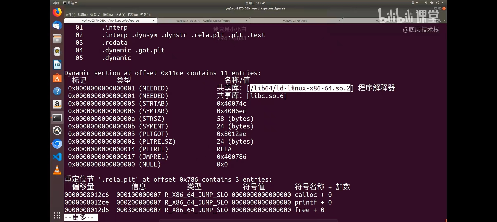

## C语言 `helloworld` 的技术内幕

## C语言全局数据的技术内幕

全局数据的指针地址是常量。
全局变量的指针地址是常量。一旦全局变量在程序启动时被分配内存并初始化，其地址在整个程序执行过程中都不会改变，因此被视为常量。这也意味着全局变量的指针地址是不可更改的，它指向的内存位置是固定的。

在使用全局变量的指针时，需要注意不要尝试修改指针指向的地址，否则可能导致意外的行为或错误。如果需要修改全局变量的值，应该通过指针间接引用的方式进行。

链接器一旦确定后，就是常量啦

程序解释器？这个用来干什么的？C不是编译型语言吗要程序解释器干什么？翻译成二进制码？

## C语言的递归详解

## C语言的动态库和动态连接详解

## Linux上C语言的线程锁的技术内幕

