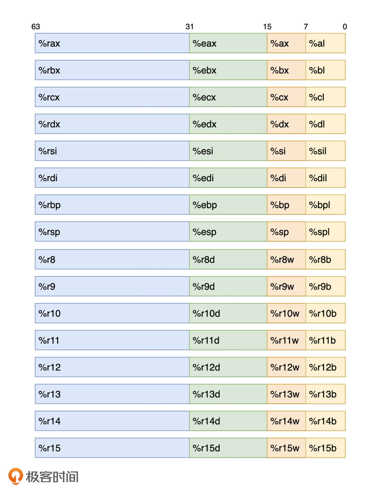
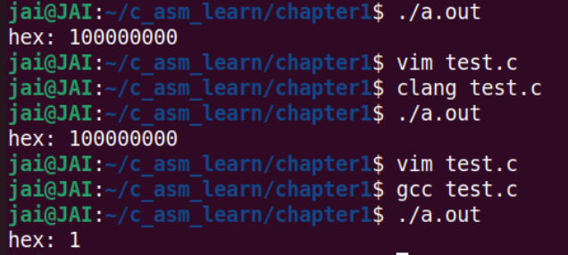
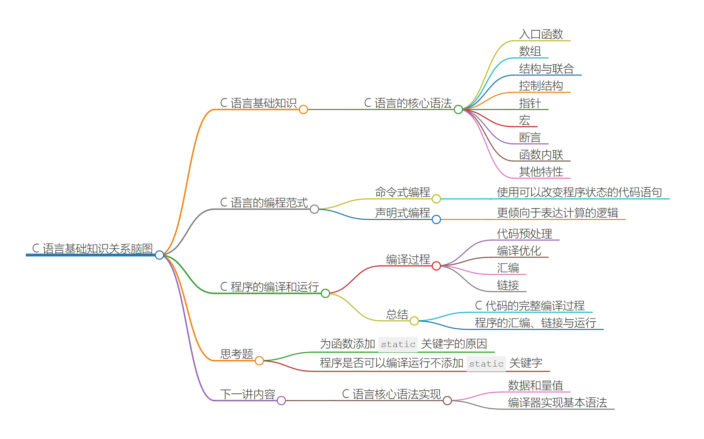

学习代码库：

[Becavalier/geektime-c: The Repo holding all the code snippets related to the C course on Geektime. (github.com)](https://github.com/Becavalier/geektime-c)

## 汇编综述



通过 `ebx`，我们可以访问大小为 32 位的数据，该数据为寄存器 `rbx` 的低 32 位。

接使用 `rbx` 便可访问该寄存器的全部 64 位数据。

使用 `bx` 与 `bl` ，便可相应访问该寄存器的低 16 位与低 8 位数据。


- 练习

    ```c
    #include <stdio.h>
    int main(void)
    {
        register long num asm("rax") = 0x100000000;
        asm("movl $0x1, %eax");
        // printf("hex: %lx\n", num); 
        asm("movw $0x1, %ax"); 
        printf("hex: %lx\n", num);  // 调用printf会影响寄存器的值？
        // printf("dec: %ld\n", num);
        return 0;
    }
    
    
    ```

    用第二条汇编指令已经了解，但是用第一条为什么会输出1呢？不应该是100000001吗？

    > 当某个指令需要重写寄存器的低 16 位或低 8 位数据时，寄存器中其他位上的数据不会被修改。所以`asm("movw $0x1, %ax")` 不会修改 `rax` 的值，这时num输出的值为0x100000001。
    >
    > 而当指令需要重写寄存器低 32 位的数据时，高 32 位的数据会被同时复位，即置零。所以 `asm("movl $0x1, %eax")` 会将 `rax` 的结果置零后再写入1，这时 num 输出的值为0x1。

    > 问题1：对于所有的编译都是这样吗？
    >
    > 
    >
    > 好像并不是？

    > 问题2：printf清空寄存器？
    >
    > `printf` 函数的调用导致的，更多内容我们会在第 `12 讲：标准库：非本地跳转与可变参数是怎样实现的？`中详细介绍。
    >
    > 概括下来是由于 x86-64 ABI 中对可变长参数调用时的规定。在这里，寄存器 `rax` 会用于保存使用到的向量寄存器的个数。

    

- 思考

    ```assembly
    mov eax, 0x1
    inc eax
    sub eax, 10
    xor eax, eax
    add eax, 1
    mul eax
    
    ; 寄存器eax中的值是多少？
    ; 1
    ```

    


作者回复: 这又是一个好问题！其实这里我们在代码中使用的是 AT&T 的写法，是一种默认被编译器广泛支持的内联汇编写法。当然，我们也可以做适当的调整来使用 Intel 写法，比如这样：

```c
Intel写法：
#include <stdio.h>
int main(void) {
  register long num asm("rax") = 0x100000000;
  asm(
    ".intel_syntax noprefix \n\t"
    "mov eax, 1\n\t"    , 右边给左边
    // "mov ax, 1\n\t"
    ".att_syntax"
  );
  printf("%ld\n", n认被编译器广泛支持的内联汇编写法
}

默认杯编译器广泛支持的内联汇编写法AT & T 写法：
asm("movl $0x1, %eax");是将1给eax的，src 跟dst反过来了好像：左边给右边
// AT & T mov指令是左边给右边
// intel 汇编是右边给左边
```

> Intel汇编和AT&T的x86汇编都是针对x86架构的汇编语言，但它们在语法和表示方式上有一些区别：
>
> 1. **语法格式**：
>    - **Intel汇编**：Intel语法是最常见的x86汇编语法，它使用目的操作数在指令后面的形式。例如，`MOV EAX, 1`表示将值1移动到EAX寄存器。
>    - **AT&T汇编**：AT&T语法使用源操作数在指令后面的形式。例如，`movl $1, %eax`表示将值1移动到EAX寄存器。
>
> 2. **寄存器表示**：
>    - **Intel汇编**：寄存器名称通常以字母开头，如EAX、EBX等。
>    - **AT&T汇编**：寄存器名称通常以%符号开头，如`%eax、%ebx`等。
>
> 3. **立即数表示**：
>    - **Intel汇编**：立即数常常直接写明，如`MOV EAX, 123`.
>    - **AT&T汇编**：立即数前面通常加上$符号，如`movl $123, %eax`。
>
> 4. **指令格式**：
>    - 有些指令的操作数顺序在Intel和AT&T语法中是相反的。例如，`ADD EAX, EBX`在Intel语法中表示将EAX和EBX相加，而在AT&T语法中应该是`addl %ebx, %eax`。
>
> 总的来说，Intel汇编和AT&T汇编在语法格式、寄存器表示和立即数表示等方面存在一些差异。程序员在阅读和编写不同格式的汇编代码时需要注意这些区别，以确保正确理解和编写汇编指令。


## 基础知识复习

#### C核心语法

```c
#include <stdlib.h> 
#include <stdio.h>
#include <stdint.h>
#include <assert.h>
#include <stdbool.h>

#define BOOL_TRUE 1  // 定义用到的宏常量与宏函数；
#define BOOL_FALSE 0
#define typename(x) _Generic((x), \
  unsigned short: "unsigned short int", \
  unsigned long: "unsigned long int", \
  default: "unknown")

typedef enum { Host, IP } IP_ADDR_TYPE;  // 定义枚举类型 IP_ADDR_TYPE，用于表示联合中生效的字段；
typedef struct {  // 定义结构 CONN；
  size_t id;
  uint16_t port;
  bool closed;
  IP_ADDR_TYPE addr_type;
  union {
    char host_name[256];
    char ip[24];
  };
} CONN;

inline static const char* findAddr(const CONN* pip) {  // 定义函数 findAddr，用于打印 CONN 对象的信息；
  assert(pip != NULL);  // 运行时断言，判断传入的 CONN 指针是否有效；
  return pip->addr_type == Host ? pip->host_name : pip->ip;
}

int main(int argc, char* argv[]) {  // 入口函数；
  static_assert(sizeof(CONN) <= 0x400, "the size of CONN object exceeds limit.");  // 静态断言，判断 CONN 对象的大小是否符合要求；
  const CONN conns[] = {  // 构造一个数组，包含三个 CONN 对象；
    [2] = { 1, 80, BOOL_TRUE, IP, { .ip = "127.0.0.1" } },
    [0] = { 2, 8080, BOOL_FALSE, IP, { .ip = "192.168.1.1" } },
    { 3, 8088, BOOL_FALSE, Host, { .host_name = "http://localhost/" } }
  }; 	

  for (size_t i = 0; i < (sizeof(conns) / sizeof(CONN)); ++i) {  // 遍历上述 CONN 数组，并打印其中的内容；
    printf(
      "Port: %d\n"
      "Host/Addr: %s\n"
      "Internal type of `id` is: %s\n\n",
      conns[i].port,
      findAddr(&conns[i]),
      typename(conns[i].id)
    );
  }
  return EXIT_SUCCESS; 
}
```


- 数组

    主要是数组的括号列表初始化方式，但我们还使用了指派初始化（为初始化列表中的项设定“指派符”）的方式，来明确指定这些项在数组中的具体位置。

    比如这里第一项对应的 “[2]” ，就表示将该项设置为数组 conns 中的第 3 个元素（索引从 0 开始）。数组定义完毕后，第 44 到第 46 行的代码访问了其内部存放的元素。这里我们直接使用方括号加索引值的语法形式做到了这一点。

- 结构和联合

    在 C 语言中，结构和联合（有时也被称为结构体与联合体）通常用来组织复杂类型的自定义数据。

    在结构中，所有定义字段的对应数据按照内存连续的方向排列；而在联合中，定义的字段同一时间只会有一个“生效”。

    在我们对结构 CONN 对象的初始化过程中，也同样使用了类似数组的括号列表初始化，以及指派初始化。但和前面数组初始化不同的是，这里的指派是针对结构与联合类型内部的成员字段的，因此需要使用 “.” 符号来引用某个具体成员，而非数组所使用的形式。

- 宏

    编译器对 C 源代码的处理过程分为几个阶段，其中，宏是最先被处理的一个部分。在这段代码的开头处，我们通过宏指令 “#include” 引入了程序正常运行需要的一些外部依赖项，这些引入的内容会在程序编译时得到替换。随后，我们又通过 “#define” 指令定义了相应的宏常量与宏函数，而其中的宏函数 `typename` 则使用到了 C11 标准新引入的 `_Generic` 关键字，以用来实现基于宏的泛型。

- 断言

    在这段代码的第 32 行，我们使用了 C11 标准中提供的静态断言能力，来保证结构类型 CONN 的大小不会超过一定的阈值。而在代码的第 27 行，我们还使用了运行时断言来保证传递给函数 `findAddr` 的 CONN 对象指针不为空。

    在 C 代码中，我们通常会使用断言，来对某种需要支持程序正常运行的假设性条件进行检查。而当条件不满足时，则在程序编译或运行时终止，并向用户抛出相应的错误信息。

    C 语言提供静态与动态两种类型的断言，**其中静态断言会在代码编译时进行检查；而动态断言则会在程序运行过程中，执行到该断言语句时再进行检查。**


#### C语言编程范式

抛开语法细节，从总体上来看，C 语言是一种“命令式”编程语言，和它类似的还有 Java、C#、Go 等语言。

命令式编程（Imperative Programming）是这样一种编程范式：使用可以改变程序状态的代码语句，描述程序应该如何运行。

这种方式更关注计算机完成任务所需要执行的具体步骤。下面我们来看一个例子。对于“从一个包含有指定数字的集合中，筛选出大于 7 的所有数字”这个需求，**按照命令式编程的思路，我们需要通过编程语言来告诉计算机具体的执行步骤**。

以 C 语言为例，解决这个需求的步骤可能会是这样：

使用数组，构造一块可以存放这些数字的内存空间；

使用循环控制语句，依次检查内存中的这些数字是否满足要求（即大于 7）；

对于满足要求的数字，将它们拷贝到新的内存空间中，暂存为结果。对应的代码可能如下所示：

```c
#define ARR_LEN 5
int main(void) { 
  int arr[ARR_LEN] = { 1, 5, 10, 9, 0 };
  for (int i = 0; i < ARR_LEN; ++i) {
    if (arr[i] > 7) {
      // save this element somewhere else.
    }
  }
  return 0;
}
```

相对于命令式编程语言，其他语言一般会被归类为“声明式”编程语言。

声明式编程（Declarative Programming）也是一种常见的编程范式。不同的是，**这种范式更倾向于表达计算的逻辑，而非解决问题时计算机需要执行的具体步骤。**

比如说，还是刚才那个需求，在使用声明式编程语言时，对应的解决步骤可能是：

构建一个容器来存放数据；

按照条件对容器数据进行筛选，并将符合条件的数据作为结果返回。

以 JavaScript 为例：

```javascript
let arr = [1, 5, 10, 9, 0]
let result = arr.filter(n => n > 7)
```

> 1. **命令式编程**（Imperative Programming）：
>     - 命令式编程是一种以编写明确的指令序列来描述计算过程的编程范式。程序员需要详细指定每个步骤和操作，控制计算机的执行流程。
>     - 命令式编程关注的是计算机执行的步骤和顺序，以及对状态的操作和变化。
>     - 代表性的命令式编程语言包括C、Java、Python等。
> 2. **声明式编程**（Declarative Programming）：
>     - 声明式编程是一种描述问题的解决方案，而不是描述如何解决问题的编程范式。程序员更多地描述问题的性质和要求，而不是具体实现的步骤。
>     - 声明式编程关注的是问题的本质和结果，而不是具体的执行流程和操作。
>     - 代表性的声明式编程语言包括SQL、HTML、CSS等。
> 3. **函数式编程**（Functional Programming）：
>     - 函数式编程是一种编程范式，其中函数被视为一等公民，函数可以作为参数传递、作为返回值返回，函数之间的组合和操作是编程的核心。
>     - 函数式编程强调纯函数、不可变性和避免副作用，通过函数的组合和应用来解决问题。
>     - 函数式编程有助于减少可变状态和副作用，提高代码的可读性、可维护性和并发性。
>     - 代表性的函数式编程语言包括Haskell、Scala、Clojure等，同时也有一些支持函数式编程风格的特性的语言，如JavaScript和Python。


#### C程序编译和运行





