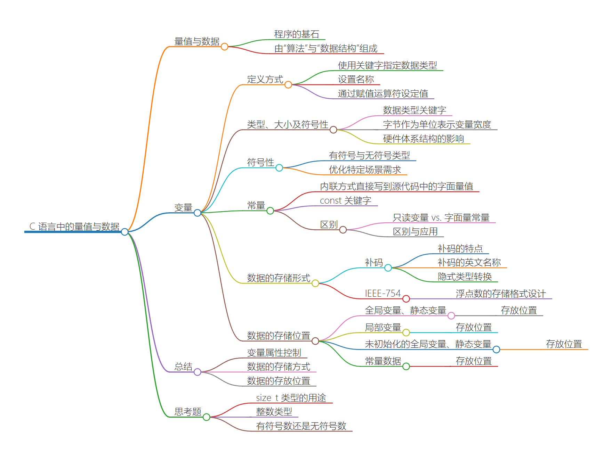
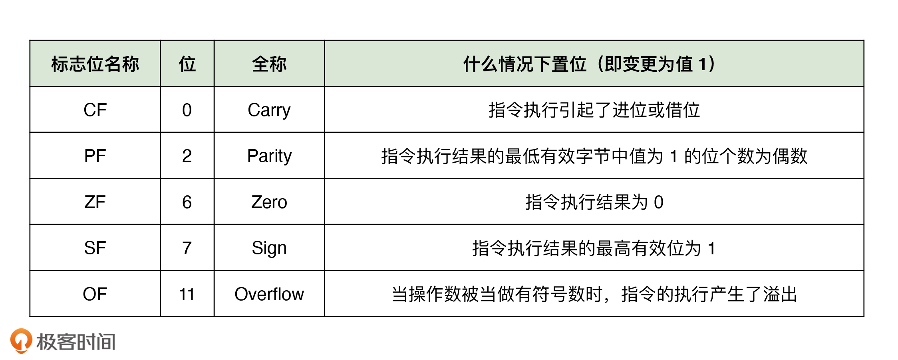
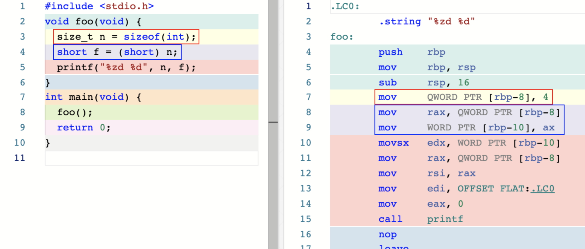
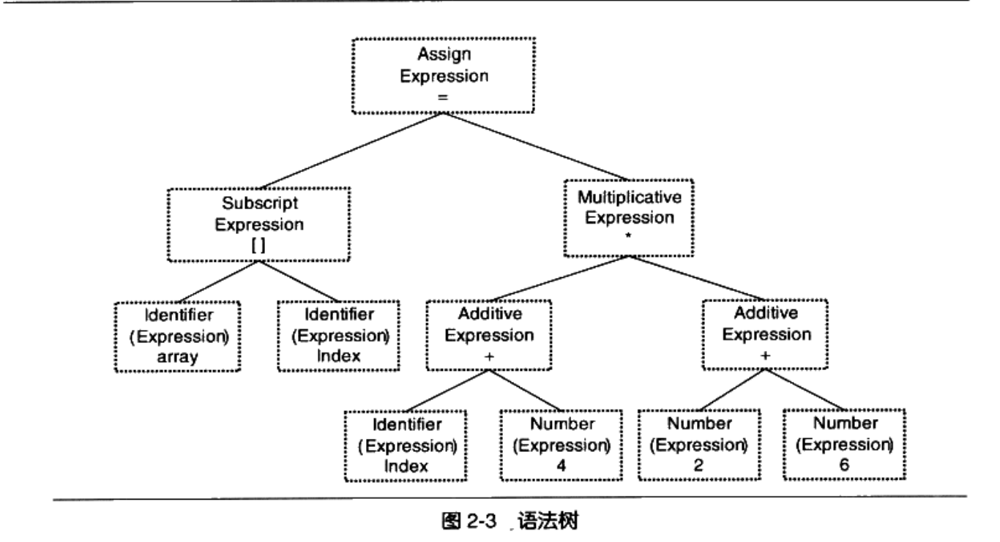
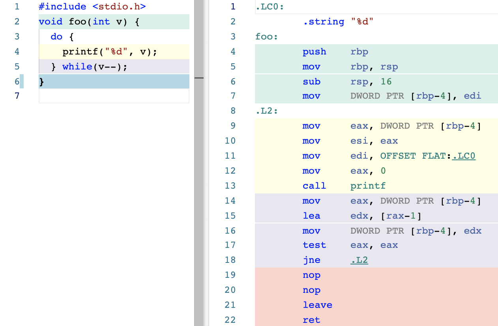
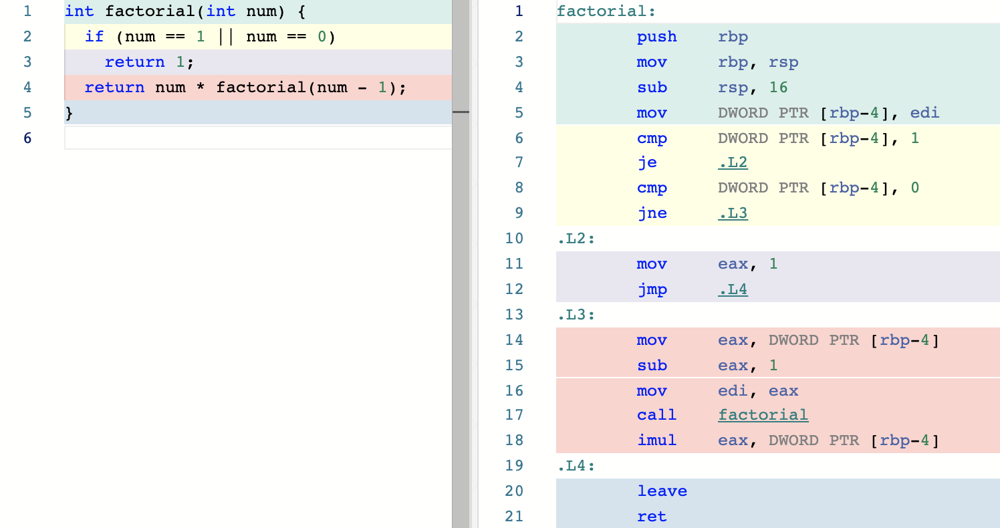
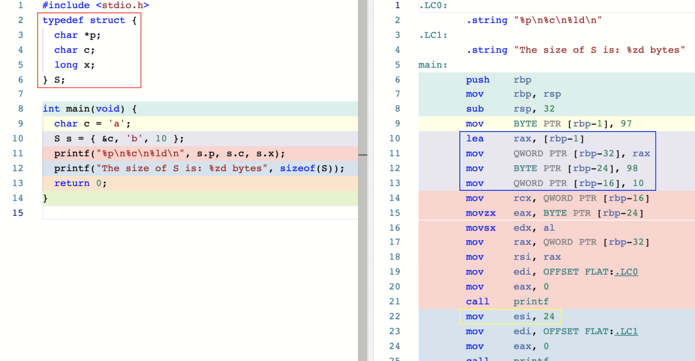
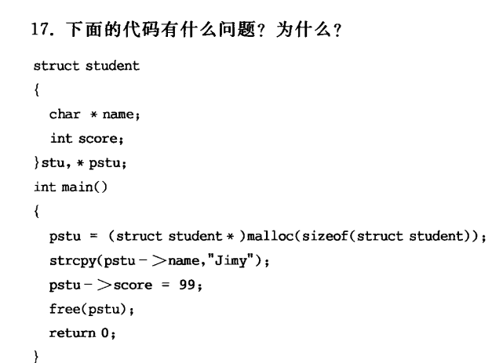

这份笔记：我们将围绕 C 语言的七大类核心语法，深入探寻隐藏在语法背后，程序代码的实际执行细节。

C 标准中详细描述了 C 语言在语法和语义两个层面的基本内容，

但对于实现者，比如编译器来说，如何将这些语法和语义体现在具体的机器指令（汇编代码）上，标准并未给出详细规定。

所以问题来了：在这层抽象背后，**一个 C 程序中的各类语法结构，究竟是如何映射到机器能够识别的不同指令上的**？


## 01｜程序基石：数据与量值是如何被组织的？

一个完整的程序是由“算法”与“数据结构”两部分组成的。

其中，算法代表程序会以怎样的具体逻辑来运行；数据结构代表程序运行过程中涉及数据的具体组织方式。

而在一门编程语言中，数据便是以不同类型“量值”的形式被组织在一起，并交由算法进行处理的。所以我们可以说，数据和量值是程序运行的基石。



#### 变量

量值可以被粗略地分为变量（variable）与常量（constant）。

其中变量是指值可以在整个应用程序的生命周期中被多次改变的量；

而常量则与之相反，在被定义后便无法被再次修改。

作为一种高级语言，C 语言为我们提供了可用于定义常量与变量的语法。

```c
int x = -10;  // 定义一个整型变量；
char y = 'c';  // 定义一个字符变量；
double z = 2.0;  // 定义一个双精度浮点变量；
unsigned int ux = 10;
```


C 语言提供了众多的关键字，可用来指定变量的类型，这些类型均以字节作为单位，来表示变量可容纳数据的最大宽度。

例如，char 类型的数据仅占用 1 个字节，而 long long 类型则至少占用 8 个字节。除了最常见的用于表示数值的类型外，C90 与 C99 标准还提供了 void（空类型）、_ Bool（布尔型）、_Complex（复数类型）等类型关键字，以用于指定其他非数值类型。

当然，**C 语言中变量类型占用的具体字节大小，还与程序运行所在的硬件体系结构紧密相关**，这也是 C 语言与其他高级编程语言有所不同的地方。

> C 语言最初被设计时，高效性就是设计者考虑的一个主要因素。因此 C 标准委员会在考虑语言设计时，会参考来自于底层硬件体系的某些因素。比如，C 标准中规定，int 类型的大小为执行环境架构体系所建议的自然大小。
>
> 所谓自然大小，可以简单理解为：对于该大小的数据，硬件体系能够以最高的效率进行处理。因此，硬件体系不同，对应的自然大小便也不同，这也就意味着同一种 C 变量类型在不同硬件体系上可能会有着不同的大小。
>
> 而对于 Rust 和 Java 这些语言来说，它们的语言标准中直接规定了各类型的具体大小。编译器作为编程语言与硬件体系之间的抽象层，它可以确保上层类型在被编译到机器指令时，不会给程序的实际运行带来可观测的差异。当然，保持完全不变的类型大小的代价是一定的性能开销，只是在大多数情况下，这部分开销并不可观。


#### 常量

在 C 语言中，**通过内联方式直接写到源代码中的字面量值一般被称为“常量”。**

我们在前面提到过常量的一个性质，即“它们被定义后无法被再次修改”。这也就意味着，这些常量数据无法灵活地被开发者操控，它们只能在程序最开始出现的地方发挥作用。比如在前面定义变量的一系列代码中，出现的 “-10”、“2.0” 等数字值便是常量。这些值在被拷贝并赋值给相应的变量后便结束了使命。

这个时候可能有同学想问：用 const 关键字按照与定义变量相同语法定义的量，不也是常量吗？它与字面量常量有什么区别呢？这是一个非常棒的问题。一般来说，我们会按照下面的方式使用 const 关键字：

```c
const int vx = 10;
const int* px = &vx;
```

通常来说，在 C 语言中，使用 const 关键字修饰的变量定义语句，表示对于这些变量，我们无法在后续的程序中修改其对应或指针指向的值。因此，我们更倾向于称它们为“只读变量”，而非常量。

当然，在程序的外在表现上，二者有一点是相同的：**其值在第一次出现时便被确定，且无法在后续程序中被修改。**

只读变量与字面量常量的一个最重要的不同点是，使用 const 修饰的只读变量不具有“常量表达式”的属性，因此无法用来表示定长数组大小，或使用在 case 语句中。

**常量表达式本身会在程序编译时被求值，而只读变量的值只能够在程序实际运行时才被得知。**

**并且，编译器通常不会对只读变量进行内联处理，因此其求值不符合常量表达式的特征。**

```c
// 误用只读变量和常量会导致编译错误，下面这段代码展示了这类错误
#include <stdio.h>
int main(void) {
  const int vx = 10;
  const int vy = 10;
  int arr[vx] = {1, 2, 3};  // [错误1] 使用非常量表达式定义定长数组；
  switch(vy) {
    case vx: {  // [错误2] 非常量表达式应用于 case 语句；
      printf("Value matched!");
      break;
    }
  }
}
```


#### 数据存储形式 - 补码

> 上面，我们介绍了数据在编程语言中的体现方式，这是程序员能够接触到数据的最初位置。随着源代码被编译，数据的实际使用形式开始变得不透明起来。接下来我们就一起看看，在计算机内部，数据是以怎样的形式被存放的。
>
> 对于大多数计算机而言，通常其内部会使用补码（Two’s-complement）的格式来存放有符号整数，使用直接对应的二进制位格式来存放无符号整数，使用 IEEE-754 标准编码格式来存放浮点数，也就是小数。
>
> 实际上，计算机在看待数据时，并不会区分其符号性，而符号性的差异仅体现在计算机指令操作数据时的具体使用方式上。

一个补码所表示的实际数值，由其负权重位的值与正权重位的值求和而来，其中负权重位对应于最高有效位（MSB）的符号位，即该位的二进制值在计算时按负值累加。其余各位一起对应正权重位，即这些位对应的二进制值在计算时按正值累加。那具体该怎样计算呢？我们来看一个简单的例子。

假设我们有一组补码 “1101”，那么应该如何得到它对应的有符号整数值呢？按照顺序，我们首先计算得到该补码对应负权重位的值为 -8，而正权重位的值为 5，因此该补码对应的实际值为 -3（-8+5）。具体计算步骤可以参考下图（图中的 B2T 表示 “Binary to Two’s-complement”，即“二进制转补码”）：


在计算负权重位时，其权重应取负值，正权重位取正值。通过上面的计算过程，你可以清楚地看到，对于一个 4 位补码，它可以表示的最大值与最小值分别是多少。计算最大值时，符号位置 0，其他位均置 1，可以得到能表示的最大值 7。计算最小值时，符号位置 1，其他位均置 0，可以得到最小值 -8。负整数的值可表示范围比正整数多 1 个，这也是所有有符号整数的一个重要特征。

到这里，我们了解了补码的基本计算方式。那我要向你提出一个小问题：补码的英文名称是 Two’s-complement ，可直译为“对数字 2 的补充”，那为什么会叫这个名字呢？

首先，我们来计算一下有符号整数 3 对应的四位补码，可以得到一个二进制序列 “0011”。将该二进制序列与上述 -3 对应的二进制序列相加，通过进位可以得到序列 “10000”，该序列可以表示无符号正整数 16。

**因此，我们可以得到这样一个结论：对于非负数 x，我们可以用 2^w^ − x**来计算 −x 的 w 位表示。

套用在上述的例子中，可以得到“在四位补码的情况下，对于非负数 3，可以用无符号数 13 (即 16−3) 的位模式来表示有符号数 -3 的位模式”这个结论，即两者位模式相同。而补码的英文名称正是对 x、−x 和 2w 三者之间的关系进行的总结。**

我们在前面提到过，==**计算机不会区分数据的符号性，符号性的差异仅由计算机指令如何使用数据而定**==。比如在 C 语言中，当对某类型变量进行强制类型转换时，其底层存储的数据并不会发生实质的变化，而仅是**程序对如何解读这部分数据的方式发生了改变**。比如下面这个例子：

```C
#include <stdio.h>
int main(void) {
  signed char x = -10;
  unsigned char y = (unsigned char)x;
  printf("%d\n", y);  // output: 246.
  return 0;
}
```

程序在进行强制类型转换时，不会影响其底层数据的实际存储方式。

除此之外，在 C 语言中，关于数据使用还有一个值得注意的问题：变量类型的隐式转换（Implicit Type Conversion）。

C 语言作为一种相对而言的“弱类型”语言，其一大特征就是在某些特殊情况下，变量的实际类型会发生隐式转换。

```c
#include <stdio.h>
int main(void) {
  int x = -10;
  unsigned int y = 1;
  if (x < y) {
    printf("x is smaller than y.");
  } else {
    printf("x is bigger than y.");   // this branch is picked!
  }
  return 0;
}
```

在下面这个例子中，定义的两个变量 x 与 y 分别为有符号整数和无符号整数，且变量 x 的值明显小于变量 y，但程序在实际运行时却会进入到 x >= y 的分支中，这就是因为发生了变量类型的隐式转换。

实际上，在上面的代码中，程序逻辑在真正进入到条件语句之前，变量 x 的类型会首先被隐式转换为 unsigned int ，即无符号整型。

而根据数据类型的解释规则，原先存放有 -10 补码的位模式会被解释为一个十分庞大的正整数，而这个数则远远大于 1。

> 1. **整数提升（Integer Promotion）**：
>    
>    - 如果一个操作数的类型是`int`、`unsigned int`或`char`，而另一个操作数的类型是`unsigned int`，则会将`char`或`int`类型的操作数转换为`unsigned int`类型。
>    - 如果一个操作数的类型是`int`，而另一个操作数的类型是`unsigned long`，则会将`int`类型的操作数转换为`unsigned long`类型。
>    
>    ```c
>    char c = 10;
>    unsigned int ui = 20;
>    unsigned int result = c + ui; // char类型的c会被提升为unsigned int类型
>    ```
>    
> 2. **算术转换（Usual Arithmetic Conversion）**：
>    
>    - 当表达式中包含不同类型的操作数时，会根据以下规则将它们转换为同一类型：
>      - 如果一个操作数的类型是`long double`，则另一个操作数会被转换为`long double`。
>      - 如果一个操作数的类型是`double`，则另一个操作数会被转换为`double`。
>      - 如果一个操作数的类型是`float`，则另一个操作数会被转换为`float`。
>      - 如果一个操作数的类型是`unsigned long`，则另一个操作数会被转换为`unsigned long`。
>      - 如果一个操作数的类型是`long`，则另一个操作数会被转换为`long`。
>      - 如果一个操作数的类型是`unsigned int`，则另一个操作数会被转换为`unsigned int`。
>      - 如果一个操作数的类型是`int`，则另一个操作数会被转换为`int`。
>    
>    ```c
>    int i = 10;
>    float f = 3.5;
>    float result = i + f; // int类型的i会被转换为float类型
>    ```
>    
> 3. **整数转换（Integer Conversion）**：
>    
>    - 当不同类型的整数进行运算时，会根据以下规则将它们转换为同一类型：
>      - 如果一个操作数的类型是`unsigned long`，则另一个操作数会被转换为`unsigned long`。
>      - 如果一个操作数的类型是`long`，则另一个操作数会被转换为`long`。
>      - 如果一个操作数的类型是`unsigned int`，则另一个操作数会被转换为`unsigned int`。
>      - 如果一个操作数的类型是`int`，则另一个操作数会被转换为`int`。
>    
>    ```c
>    unsigned int ui = 100;
>    long l = 200;
>    long result = ui + l; // unsigned int类型的ui会被转换为long类型
>    ```
>    
> 4. **其他类型转换**：
>    
>    - 在赋值操作中，如果将一个值赋给一个不同类型的变量，会根据目标变量的类型进行隐式转换
>    
>    ```c
>    int i = 10;
>    double d = 3.14;
>    double result = i + d; // int类型的i会被转换为double类型
>    ```
>


#### 数据存储形式 - IEEE-754

我们上面主要介绍了有符号整数的补码，以及它在和无符号整数交互时的一些特性。而对于浮点数类型，大多数计算机体系会选择使用 IEEE-754 标准，作为其编码格式。

IEEE-754 是一个被众多硬件浮点计算单元（FPU）采用的浮点数标准，这个标准解决了浮点数在硬件实现上的很多问题，使其更具可移植性。

对于 IEEE-754，一个值得介绍的特点是它对浮点数的存储格式设计，使得计算机可以简单地使用对于整数的排序函数，来对浮点数进行排序。举个例子，对于无符号数的二进制序列来说，0010 的值肯定要小于1000 （2 < 8）。这对计算机来说很好判断。而对基于 IEEE-754 编码的 8 位浮点数（4 位阶码位，3 位小数位）二进制序列 0 0001 001 和 0 1110 111 来说，判断其大小也同样十分简单。除去最左侧的符号位外，直接将其余各位当作无符号整数序列值进行比较，所得结果同样适用于对应的浮点数序列。


当然，同整数一样，C 语言在对浮点数进行类型转换时（无论隐式还是显式），也都不会对底层存放的浮点数据进行改动，而只是将对应位序列的解释方式从浮点数改为了其他方式。在 C 语言中，双精度浮点类型 double 具有作为隐式类型转换的最高优先级。当在一个表达式中存在该类型的变量时，计算机会首先将其他参与变量均转换为该类型，然后再进行表达式求值。


#### 思考题

- C 语言中的一个常用类型 size_t 通常被用在哪些地方？它是整数类型吗？是有符号数还是无符号数？欢迎在评论区留下你的答案。

    `size_t` 是 C 语言中定义在 `<stddef.h>` 头文件中的类型，通常用于表示内存大小或对象大小。它通常被用在以下几个方面：

    1. 在处理内存分配和释放时，`size_t` 通常用于表示内存块的大小。
    2. 在处理数组、字符串长度等情况下，`size_t` 通常用于表示对象的大小或长度。

    `size_t` 是无符号整数类型，**它的具体实现取决于编译器和平台**，但通常被定义为 `unsigned int` 或 `unsigned long`。它的无符号性质使得它可以用来表示非负的大小或长度，避免了负数的情况。在实际编程中，使用 `size_t` 可以提高代码的可移植性和安全性。


## 02｜计算单元：运算符是如何工作的？

> C语言中的这些运算符在编译器中怎么实现的


分类：


#### 算数、关系、位、赋值运算符算数

> 算数、关系、位、赋值这四类运算符在经过编译器处理后，一般都可以直接对应到由目标平台上相应机器指令组成的简单计算逻辑。

在下面这段示例代码中，

在 foo 函数的内部使用到了加法运算符 “+”、大于运算符 “>”，以及按位或运算符 “|”。

通过右侧的输出内容，查看默认情况下（即不使用任何编译优化）左侧代码对应的汇编结果。


- 运算（红色框）

    左侧代码中用红色框标注的内容，使用了加法运算符 “+” 的 C 语句。

    在它对应的汇编代码中，前两行代码分别从栈内存中将变量 x 与 y 的值放入到了寄存器 `edx` 与 `eax` 里。

    紧接着，程序通过 add 机器指令计算这两个寄存器中的数字之和。随后，通过 mov 指令，程序将计算得到的结果值从寄存器 `eax` 移动到了局部变量 `arithmetic` 对应的栈内存中。至此，这行 C 代码便执行结束了。

    - 总结

        这行 C 包含了对算数运算符 “+” 和赋值运算符 “=” 的使用过程，略带内存访问

        add 汇编指令直接对应于 C 代码中加法运算符的操作。

        mov 汇编指令则对应于等号赋值运算符的操作。(Intel 汇编)

        > 涉及某个具体内存位置：`DWORD PTR [rbp-8]` 
        >
        > 将寄存器 `rbp` 中的值减去 8 得到的结果作为一个地址，然后在这个地址上读取 / 写入大小为 DWORD 的值。
        >
        > > 在 Intel 体系中，一个 WORD 表示 16 位，一个 DWORD 为 32 位，而一个 QWORD 表示 64 位。

    

- 关系运算符（绿色框）

    绿色框标注的关系运算符大于号 “>” 对应汇编指令 `cmp`。

    这个指令在被执行时，会首先比较变量 x 与 y 值的大小，并根据比较结果，动态调整 CPU 上 FLAGS 寄存器中的相应位。

    > 复习：状态寄存器
    >
    > FLAGS 寄存器是一组用于反映程序当前运行状态的标志寄存器。
    >
    > 
    
    汇编指令 `cmp` 的下一条汇编指令 `setg` 便会通过查看 FLAGS 寄存器中的 ZF 位是否为 0，且 SF 与 OF 位的值是否相等，来决定将寄存器 al 中的值置 1，还是置 0。

    而al寄存器中存放的数字值，便为变量 relational 的最终结果。
    
    举一个简单的例子：假设这里函数 add 在调用时传入的值 x 为 3，y 为 2。那么，当 `cmp` 指令执行时，它首先会在 CPU 内部对这两个操作数进行隐式的减法运算，运算后得到结果 1。而 ZF、SF、OF 在这里都将被复位，而复位则代表着标志位所表示的状态为假。因此，FLAGS 寄存器的状态满足指令 `setg` 的置位条件（ZF=0 且 SF=OF），al 寄存器的值将被置 1。


- 位运算符（蓝色框）

    蓝色框标注的或运算符 “|”。可以很直观地看到，它所对应的汇编指令是 or。


针对上述这几类运算符，值得一提的是，**即便是在开启了最高编译优化等级的情况下，编译器实现上述这些运算符的基本逻辑仍然不变，只不过会相对减少通过栈内存访问函数传入参数的过程，而在某些情况下会选用寄存器传值。**


#### 逻辑运算符

在 C 标准中，逻辑与运算符 “&&” 的语义是：如果它左右两侧的操作数都具有非零值，则产生计算结果值 1。而如果任一操作数为 0，则计算结果为 0。

不仅如此，标准还规定了该运算符在执行模型中的求值规则：如果通过逻辑与运算符左侧第一个操作数的求值结果就能确定表达式的值，就不再需要对第二个操作数进行求值了，这也就是我们常说的“短路与”。汇编实现：


逻辑与运算符并没有可与之直接对应的汇编指令。并且，为了满足“短路”要求，编译器在非优化的实现中通常会使用条件跳转指令，比如 je。je 指令会判断当前 FLAGS 寄存器中的标志位 ZF 是否为 1。若为 1，则会将程序执行直接跳转到给定标签所在地址上的指令			。

上图中右侧输出的汇编代码里，程序会按顺序将位于栈内存中的变量 x 和 y(也就	是`edi` 和`esi`) 的值与数值 0 进行比较。（从左到右一个个比较）

若其中的某个比较结果相等(为0)，程序执行将会直接跳转到标签 “.L2” 的所在位置。在这里，值 0 会被直接放入寄存器 `eax`。而若变量 x 与 y 的值判断均不成立，则值 1 会被放入该寄存器。紧接着，标签 “.L3” 中的指令将接着执行。

到这里，寄存器 `eax` 中的值将会被作为最终结果，赋值给变量 logical。

> Q：标签 “.L3” 中前两条汇编语句的作用是什么？


当然，就逻辑与运算符来说，在使用高编译优化等级时，编译器还可能会采用下面这种方式来实现该运算符。这里，我们看到了新的汇编指令： `test` 、`setne` 和 `movzx` 。

```assembly
test    edi, edi  ; edi --> 变量x --> 判断x是否为0
setne   al
test    esi, esi  ; esi --> 变量y --> 判断y是否为0
setne   sil
movzx   esi, sil
and     esi, eax
```

- `test` 指令的执行方式与 `cmp` 类似，只不过它会**对传入的两个操作数做隐式的“与”操作，而非减法操作**。

    在操作完成后，根据计算结果，指令会相应地修改 FLAGS 寄存器上的 SF、ZF 以及 PF 标志位。

- `setne` 指令则与 `setg` 指令类似，该指令将在 ZF 为 0 时把传入的寄存器置位，否则将其复位。

- `movzx` 指令实际上是 mov 指令的一种变体。

    **这个指令将数据从源位置移动到目标位置后，会同时对目标位置上的数据进行零扩展（Zero Extension）。**

了解了这些，我们就可以来尝试理解**编译器在高优化等级下对逻辑与运算符的实现方式**：

1. 首先，通过 `test` 指令，程序可以判断参数 x 与 y 是否为非零值。若为非零值，则相应的寄存器会被指令 `setne` 置位。在这种情况下，寄存器 `al` 与 `sil` 中便存放有用于表示变量 x 与 y 是否为零的布尔数字值 0 或 1。
2. 接下来，通过数据移动指令，寄存器 `sil` 中的值被移动到寄存器 `esi` 中。
3. 最后的 `and` 指令又会对 x 与 y 的布尔数字值再次进行与操作，得到的最终结果将被存放在目的寄存器，即 `esi` 中。

**上面这种优化实现方式大量减少了对栈内存以及条件跳转指令的使用，使得程序减少了访问内存时产生的延迟，以及由于分支预测失败而导致的 CPU 周期浪费，从而执行性能得到了提升。**

> 可以看到的是，在使用高编译优化等级的情况下，C 标准中逻辑与操作符的“短路”特性并没有体现出来，程序实际上同时对参数 x 与 y 的值进行了判断。而这也正是因为 C 语言的 “as-if” 性质给予了编译器更多的优化空间。
>
> ==**C 标准中规定，除去几种特殊的情况外，在不影响一个程序的外部可观测行为的情况下，**==
>
> ==**编译器可以不遵循 C 标准中对执行模型的规定，而是采用其特定的实现方式，优化程序的性能。**==

> 在非优化版本的实现中，编译器使用了 je 条件跳转指令。
>
> 其实，现代流水线 CPU 通常会采用一种名为 ==**“投机执行” **== 的方式来优化条件跳转指令的执行。
>
> 所谓投机执行，是指 CPU 会通过分析历史的分支执行情况，来推测条件跳转指令将会执行的分支，并提前处理所预测分支上的指令。而等到 CPU 发现之前所预测的分支是错误的时候，它将不得不丢弃这个分支上指令的所有中间处理结果，并将执行流程转移到正确的分支上。很明显，这样就会浪费较多的时钟周期。


#### 成员访问运算符

接下来，让我们继续来看看成员访问运算符。这里我以取地址运算符 “&”、解引用运算符 “*” 为例，来介绍编译器对它们的实现细节。来看下面这段代码：


- **&**

    如上图中红色框对应的 C 代码和汇编代码所示，对于取地址运算符 “&”，实际上它一般会直接对应到名为 `lea` 的汇编指令。

    这个指令的全称为 “Load Effective Address”，顾名思义，它主要用来将操作数作为地址，并将这个地址以值的形式传送到其他位置。

    比如，上面代码中的 `lea` 指令将寄存器 `rbp` 中的值减去 16 后，直接存放到寄存器 `rax` 中，而此时该寄存器中的值就是局部变量 n 在栈上的地址。

- *

    解引用运算符 “*”的行为与取地址运算符完全相反。

    当需要对位于某个地址上的值进行传送时，我们可以直接使用 `mov` 指令。

    1. 上图中，在蓝色框的汇编代码里，第一条 mov 指令将变量 `n_ptr` 的值传送到了寄存器 `rax` 中。\
    2. 随后，**第二条 mov 指令将 `rax` 寄存器中的值作为地址**，并将该地址上的值以 DWORD，即 32 位值（对应 int 类型）的形式传送到 `eax` 寄存器中。
    3. 最后，第三条 mov 指令将此时 `eax` 寄存器中的结果值传送到了变量 m 在栈内存上的存储位置。

- 其他

    至于该类别下的其他运算符，因为它们的**本质都是访问位于某个内存地址上的数据，因此实现方式大同小异**。

    - 实践：->的实现

        ```c
        #include <stdio.h>
        #include <string.h>
        #include <stdlib.h> // 包含动态内存分配所需的头文件
        
        struct person
        {
            char name[100];
            int number;
            int *p;
        };
        
        int main(void)
        {
            struct person *p1;
            int a = 3;
        
            // 分配内存给p1
            p1 = (struct person*)malloc(sizeof(struct person));
        
            strcpy(p1->name, "hello");
            p1->number = 100;
            p1->p = &a;
            printf("%s\n", p1->name);
            printf("%d\n", p1->number);
            printf("%d\n", *(p1->p));
        
            // 释放动态分配的内存
            free(p1);
        
            return 0;
        }
        
        ```

        > ```assembly
        > objdump -S ./a.out:
        > 其中一部分:
        > strcpy(p1->name, "hello");
        >     11f9:	48 8b 45 f0          	mov    -0x10(%rbp),%rax
        >     11fd:	c7 00 68 65 6c 6c    	movl   $0x6c6c6568,(%rax)
        >     1203:	66 c7 40 04 6f 00    	movw   $0x6f,0x4(%rax)
        >     p1->number = 100;
        >     1209:	48 8b 45 f0          	mov    -0x10(%rbp),%rax
        >     120d:	c7 40 64 64 00 00 00 	movl   $0x64,0x64(%rax)
        >     p1->p = &a;
        >     1214:	48 8b 45 f0          	mov    -0x10(%rbp),%rax
        >     1218:	48 8d 55 ec          	lea    -0x14(%rbp),%rdx
        >     121c:	48 89 50 68          	mov    %rdx,0x68(%rax)
        > ```
        >
        > 对于结构体指针`p1`的成员赋值操作，汇编代码中的`mov`指令用于将数据存储到相应的内存位置。具体解释如下：
        >
        > 1. `strcpy(p1->name, "hello");`：
        >    - 在汇编代码中，`movl $0x6c6c6568,(%rax)`将ASCII码表示的字符串"hello"的值存储到`p1->name`的内存位置。
        >    - `movw $0x6f,0x4(%rax)`将字符'o'的ASCII码值存储到`p1->name`的下一个位置，即`p1->name[4]`。
        >
        > 2. `p1->number = 100;`：
        >    - `movl $0x64,0x64(%rax)`将数值100存储到`p1->number`的内存位置。
        >
        > 3. `p1->p = &a;`：
        >    - `lea -0x14(%rbp),%rdx`计算出变量`a`的地址，并将其存储到寄存器`%rdx`中。
        >    - `mov %rdx,0x68(%rax)`将变量`a`的地址存储到`p1->p`的内存位置。
        >
        > 在汇编语言中，结构体的成员是按照顺序依次存储在内存中的，通过偏移量可以访问结构体的各个成员。通过`mov`指令可以将数据存储到指定的内存位置，从而实现对结构体成员的赋值操作。这样，汇编代码中的`mov`指令可以实现C代码中使用`->`操作符访问结构体成员的功能。

    - 补充

        段错误（Segmentation Fault）通常是由以下几种情况引起的：

        1. **访问未分配的内存**：当程序尝试访问未分配的内存地址时，会导致段错误。这可能是因为**指针未初始化、指针越界访问、指针指向的内存已经被释放、未分配内存空间等情况。**

        2. **访问只读内存**：尝试向只读内存地址写入数据也会导致段错误。例如，尝试修改字符串常量的内容就会导致段错误。

        3. **栈溢出**：当程序递归层次过深或者在栈上分配过多的内存时，会导致栈溢出，也可能引起段错误。

        4. **访问空指针**：当程序尝试通过空指针访问内存时，会导致段错误。空指针是指未指向任何有效内存地址的指针。

        5. **非法指令**：在执行过程中遇到非法指令或者试图执行操作系统不允许的操作也会导致段错误。

        6. **内存对齐问题**：某些体系结构要求数据按照特定的字节对齐，如果违反了这些要求，可能会导致段错误。


#### 其他运算符

最后，让我们来看看除了上面那六类运算符之外的其他运算符，这里我主要介绍 `sizeof` 运算符和强制类型转换运算符 “(type) a”。

至于函数调用运算符，由于内容较多，我会在后续的课程再单独为你介绍。我们还是通过一段示例代码，观察它们在默认情况下的汇编实现：



- `sizeof`

    其中，`sizeof` 运算符是一个**编译期运算符**，这意味着编译器仅通过静态分析就能够将给定参数的大小计算出来。

    因此，在最终生成的汇编代码中，我们不会看到 `sizeof` 运算符对应于任何汇编指令。

    相反，运算符在编译过程中得到的计算结果值，将会以字面量值的形式直接“嵌入”到汇编代码中使用(还要看具体硬件平台)。

    从上图中右侧红框内的汇编代码看到，C 代码 `sizeof(int)` 的计算结果 4 直接作为了 `mov` 指令的一个操作数。

- 强制类型转换运算符

    将变量 n 的值类型由原来的 `size_t` 转换为了 `short`。

    你可以从上图中蓝框内的汇编代码里看到，当 mov 指令将变量 n 的值移动到变量 f 所在的内存区域时，它仅移动了这个值从低位开始一个 WORD(即 16 位大小)的部分。

    至于其他类型之间的转换过程，你可以简单理解成 ==**对同一块数据在不同机器指令下的不同“解读”方式。**==，就是只操作寄存器的一部分。
    
    > 【拓展】
    >
    > RISC这种指令集怎么实现上面这种运算符解读的呢？
    >
    > 在ARM和RISC-V这样的RISC（Reduced Instruction Set Computing）架构中，
    >
    > ==**通常会使用加载（load）和存储（store）指令来处理不同数据类型之间的转换。**==
    >
    > ==**这些架构通常采用固定大小的寄存器，不像x86那样有不同大小的寄存器。**==
    >
    > 1. `sizeof`
    >
    >     `sizeof` 这种，同样在编译期间之间算出，之后直接 `mov` 赋值
    >
    > 2. 强制类型转换
    >
    >     对于将`size_t`类型转换为`short`类型的操作，在ARM和RISC-V架构中，**可以通过加载和存储指令来实现**。通常情况下，可以将`size_t`类型的数据加载到寄存器中，然后通过掩码（mask）和移位（shift）等操作来提取所需的低位部分，最后将结果存储到`short`类型的变量中。
    >
    >     > - 在ARM汇编语言中，可以使用 `LDR` 指令加载数据，使用`LSR`（Logical Shift Right）指令进行右移操作，然后使用`STR`指令将结果存储到目标内存位置。
    >     >
    >     > - 类似地，在RISC-V汇编语言中，可以使用`lw`（load word）指令加载数据，使用位操作指令（如`SRL`）进行右移操作，最后使用`sw`（store word）指令将结果存储到目标内存位置。
    >     > - 补充，==**可能由于嵌入式系统的资源有限，会使用flash，这个时候，上面的指令就是对 `flash` 进行操作了**==
    >
    > 总的来说，虽然ARM和RISC-V架构与x86架构在指令集和寄存器结构上有所不同，但仍然可以通过加载、存储和位操作指令来实现不同数据类型之间的转换，包括对`size_t`和`short`类型的转换。


**在高编译优化等级下，上面介绍的成员访问运算符与强制类型转换运算符的实现方式并没有发生本质的变化。**

**而与其他运算符类似的是，编译器会减少对栈内存的使用。同时，基于更强的静态分析能力，编译器甚至可以提前推算出某些变量的取值，并省去在程序运行过程中再进行类型转换的过程，从而进一步提升程序的运行时性能**。


#### 总结

C 语言中的几类不同运算符是如何被编译器实现的。具体总结如下：

1. 通常来说，算数、关系、位、赋值运算符的实现在大多数情况下，都会直接一一对应到特定的汇编指令上；
2. 逻辑运算符的实现方式则有些不同，它会首先借助 `test` 、 `cmp` 等指令，来判断操作数的状态，并在此基础上再进行相应的数值转换过程；
3. 在成员访问运算符中，取地址运算符一般对应于汇编指令 `lea` ，解引用运算符则可直接使用 mov 指令来实现；
4. 对于其他运算符，`sizeof` 运算符会在编译时进行求值，强制类型转换运算符则直接对应于不同指令对同一块数据的不同处理方式。


#### 思考题

- 编译器是通过哪类指令来实现三元运算符 “?:” 的？

    

- 在ARM指令集或者RISC-V指令集架构中怎么实现这一讲的内容呢？

    1. 实验部分

        ```c
        int i = 123;		
        
        		printf("sizeof int: %d\r\n", sizeof(int));
        		printf("sizeof int: %d\r\n", sizeof(short));
        		volatile short test_i = (short)i;
        		
        		for(test_i; test_i >= 0; test_i--)
        		{
        				printf("%d \r\n", test_i);
        		}
        ```

        ```assembly
           145:         int i = 123; 
           146:          
        0x0800212E 247B      MOVS     r4,#0x7B
           154:                 printf("sizeof int: %d\r\n", sizeof(int)); 
        0x0800215A 2104      MOVS     r1,#0x04
        0x0800215C A0FA      ADR      r0,{pc}+0x3EC  ; @0x08002548
        0x0800215E F007FA11  BL.W     0x08009584 __0printf
           155:                 printf("sizeof int: %d\r\n", sizeof(short)); 
        0x08002162 2102      MOVS     r1,#0x02
        0x08002164 A0F8      ADR      r0,{pc}+0x3E4  ; @0x08002548
        0x08002166 F007FA0D  BL.W     0x08009584 __0printf
           156:                 volatile short test_i = (short)i; 
           157:                  
        0x0800216A B220      SXTH     r0,r4
        0x0800216C 9001      STR      r0,[sp,#0x04]
           158:                 for(test_i; test_i >= 0; test_i--) 
           159:                 { 
        0x0800216E F9BD0004  LDRSH    r0,[sp,#0x04]
           158:                 for(test_i; test_i >= 0; test_i--) 
        0x08002172 E009      B        0x08002188
           160:                         printf("%d \r\n", test_i); 
           161:                 } 
           162:                  
           163:  
        0x08002174 F9BD1004  LDRSH    r1,[sp,#0x04]
        0x08002178 A0F8      ADR      r0,{pc}+0x3E4  ; @0x0800255C
        0x0800217A F007FA03  BL.W     0x08009584 __0printf
           158:                 for(test_i; test_i >= 0; test_i--) 
        0x0800217E F8BD0004  LDRH     r0,[sp,#0x04]
        0x08002182 1E40      SUBS     r0,r0,#1
        0x08002184 B200      SXTH     r0,r0
        0x08002186 9001      STR      r0,[sp,#0x04]
           158:                 for(test_i; test_i >= 0; test_i--) 
        0x08002188 F9BD0004  LDRSH    r0,[sp,#0x04]
        0x0800218C 2800      CMP      r0,#0x00
        0x0800218E DAF1      BGE      0x08002174
           164:         } 
        ```

        > 1. 代码解释：
        >
        >     1. `MOVS r4, #0x7B`: 将十进制数123（0x7B）加载到寄存器r4中，即`int i = 123;`。
        >        
        >     2. `MOVS r1, #0x04`: 将整数4加载到寄存器r1中，这对应于`sizeof(int)`。
        >        
        >     3. `BL.W 0x08009584 __0printf`: 调用 `printf` 函数来打印`"sizeof int: %d\r\n"`，其中`%d`将被替换为4。
        >        
        >     4. `MOVS r1, #0x02`: 将整数2加载到寄存器r1中，这对应于`sizeof(short)`。
        >        
        >     5. `BL.W 0x08009584 __0printf`: 调用printf函数来打印`"sizeof short: %d\r\n"`，其中`%d`将被替换为2。
        >        
        >     6. `SXTH r0, r4`: 将r4寄存器中的值（123）符号扩展为16位，并将结果存储回r0中，即将`int i = 123;`强制转换为short。
        >        
        >     7. `STR r0, [sp, #0x04]`: 将r0中的值（123）存储到栈指针（sp）偏移4的位置，即将short类型的值存储在内存中。
        >        
        >     8. `LDRSH r0, [sp, #0x04]`: 从内存中加载一个有符号的16位值到r0中，即加载short类型的值。
        >        
        >     9. `SUBS r0, r0, #1`: 将r0中的值减去1。
        >        
        >     10. `STR r0, [sp, #0x04]`: 将减去1后的值存储回内存中。
        >        
        >     11. `CMP r0, #0x00`: 比较r0中的值是否为0。
        >        
        >     12. `BGE 0x08002174`: 如果r0中的值大于等于0，则跳转到地址0x08002174，即循环继续。
        >
        >     这些指令展示了如何在ARM汇编中实现`sizeof`操作和强制类型转换，以及如何使用循环来递减一个short类型的值并打印出来。
        >
        >     > ADR: 在ARM汇编中，`ADR` 是一个伪指令（pseudo-instruction），用于将一个相对于当前指令地址的偏移量加载到寄存器中。它的作用类似于计算地址，但实际上并不执行内存访问操作。在这里，`ADR r0,{pc}+0x3E0` 计算的是字符串 `"sizeof test: %d\r\n"` 的地址。
        >
        >     > C语言中的 `sizeof` 操作符是在编译时计算数据类型或变量所占的字节数，因此在汇编代码中，直接使用一个立即数来表示 `sizeof(int)` 的大小（通常为4个字节），而不需要在运行时计算。因此，在汇编代码中，直接将 `sizeof(int)` 的大小加载到寄存器中，然后传递给 `printf` 函数进行打印。


## 03｜控制逻辑：表达式和语句是如何协调程序运行的？


#### 表达式

**表达式（expression）是由一系列运算符与操作数（operand）组成的一种语法结构。**

其中，操作数是参与运算符计算的独立单元，也即运算符所操作的对象。

操作数可以是一个简单的字面量值，比如数字 2、字符串 “Hello, world!”；也可以是另一组复杂的表达式。

举个例子：在表达式 (1 + 2) * 3 + 4 / 5 中，乘法运算符 “*” 所对应的两个操作数分别是字面量数值 3，和子表达式 (1 + 2)。通常来说，表达式的求值（evaluation）过程需要依据所涉及运算符的优先级和结合性的不同，而按一定顺序进行。我们一起来看看上面提到的 (1 + 2) * 3 + 4 / 5 这个表达式的计算流程。

1. 首先，需要根据表达式中**运算符优先级**的不同，来决定最先进行哪一部分运算。

    运算符的优先级很好理解，由于乘法运算符 “ * ” 与除法运算符 “/” 的优先级高于加法运算符 “+”，因此在计算整个表达式的值时，需要首先对由这两个运算符组成的子表达式进行求值。

2. 从上一步中“筛选出”的待计算运算符多于 1 个时，我们就需要再判断**运算符的结合性**，来决定优先计算哪一个

    因为乘法运算符和除法运算符均具有左结合性，因此，由左侧乘法运算符构成的子表达式需要被优先求值

    当我们以这个表达式为视角，进行观察时，参与表达式计算的操作数分别为子表达式 (1 + 2)，以及字面量数值 3。这里，我们需要分别对这两部分进行求值，直至乘法运算符 “ * ” 两边的操作数可以直接参与计算为止。

    > 但需要注意的是，C 标准中并==**未规定**==运算符两侧操作数的具体求值顺序，**因此具体方式由编译器选择**。

- 总结：

    对表达式的求值过程，实际上就是**根据运算符的优先级和结合性**，来对表达式和它所包含的子表达式**进行递归求值**的过程。

    > 设计编译器的人根据我们的自然规律和基本数学公里来设计上面运算符的优先级和结合性

    从编译的角度来看，这个过程中所涉及到的操作数的实际求值顺序会在**语法分析阶段**被确定，并体现在源码对应的抽象语法树（AST，Abstract Syntax Tree）上。

    > 

    - 例子：

        ```c
        main.c
        int foo(void) {
          return (1 + 2) * 3 + 4 / 5;
        }
        ```

        借助 Clang 编译器提供的 `-ast-dump` 选项，我们可以编译并打印出这段 C 代码对应的 AST 结构。完整的编译命令如下：

        ```bash
        clang -Xclang -ast-dump -fsyntax-only main.c
        ```

        

        AST 作为用于表示源代码语法结构的一种树形数据结构，语法分析器会将表达式中操作数的整体求值顺序映射到树的结构上。因此，当我们以后序遍历（LRD）的方式遍历这棵树时，便可以直接得到正确的表达式求值顺序。

        > 《程序员的自我修养-链接、装载与库》：
        >
        > `array[index] = (index + 4) * (2 + 6)`
        >
        > 

        1. 对于上面的 AST 来说，由叶子结点组成的子树需要被最先求值，因此我们首先可以得到括号内加法表达式的计算结果 3。

        2. 然后，该结果将作为叶子结点上的操作数，参与乘法运算符的计算，从而得到计算结果 9。
        3. 接下来，除法运算符所在的子表达式经过求值，得到结果 0。
        4. 最后，该值再作为最后一个加法运算符的操作数，与字面量值 9 相加，进而得到整个表达式的最终计算结果 9。

- 表达式提供了这样一种能力：能够让数据同时参与到多个操作符的不同计算过程中。而通过提供对运算符优先级与结合性的规则限制，表达式可以控制整个计算过程的有序进行。


#### 语句

语句（statement）是用来描述程序的基本构建块。

和表达式不同，语句是构成 C 程序的最大粒度单元，在它的内部，可以包含有简单或复杂的表达式结构，但也可以不包含任何内容。

除此之外，语句在执行时不返回任何结果，但可能会产生副作用。

在 C 语言中，语句可以被分为复合语句、表达式语句、选择语句、迭代语句、跳转语句五种类型。

但无论是哪种类型，语句都必须以分号结尾，并按从上到下的顺序依次执行。其中，复合语句是指由花括号 “{}” 标记的一块区域。在这个区域中，我们可以放置声明（declaration）和语句，而最常见的一种复合语句便是函数体。在函数体内部，我们可以定义变量，并通过结合各类其他语句来实现函数的功能。

而表达式语句则是直接由表达式外加一个分号组成的语句，比如函数调用语句或变量赋值语句。当然，表达式语句中的表达式也可以为空，这样就成为了仅由一个 “;” 组成的空语句。在下面这段代码里，我标注出了其中使用到的复合语句与表达式语句。你可以通过它们来加深对这两种语句的理解。

```C
int foo(int x, int y) {  // 复合语句；
  int sum = x + y; // 表达式语句；
  if (sum < 0) {  // 复合语句；
    sum = -sum;  // 表达式语句；
  }
  return sum;
}
```

这两种类型的语句，它们的具体结构依程序设计细节的不同而不同，因此这里我们不再做更多的讨论。相对的，在 C 语言中，选择语句、迭代语句、跳转语句都有着它们相对应的特定语法结构。因此，接下来我们重点看看这几类语句，探究编译器是如何实现它们的。


#### 选择语句

同其他大多数语言类似，在 C 语言中，选择语句主要是指由 if…else 和 switch…case 这两种语法结构组成的语句。它们的使用方式你应该很熟悉，这里就不多讲了。让我们直接通过一个例子，观察编译器在默认情况下是如何实现它们的。首先来看 if…else 语句：

- `if...else`语句：

    如上图所示，在左侧的 C 函数 foo 中，我们使用 if…else 语句构建了一个简单的程序逻辑。

    if 语句会在每一个条件分支中检测函数参数 v 的值，并根据匹配情况返回一个数值。若所有情况都没有命中，则最后的 else 语句生效，直接返回数值 4。相应的，在右侧，我们可以看到这个函数对应的汇编代码。

    在这里，通过红框内的汇编代码可以看到，变量 v 的值被存放在栈内存中地址为 `rbp` 寄存器的值减去 4 的位置上。程序使用多个标签（如 .L2、.L3 等），分别划分不同分支对应的处理逻辑，而分支的判断过程则是由指令 `cmp` 与条件跳转指令 `je` 与 `jne` 共同完成的。

    汇编代码和 C 代码的整体逻辑基本是一一对应的关系。因此，在这种情况下，为了尽量保持程序的执行性能，你可以将命中几率较大的条件语句放在较前的位置上。


- `switch...case` 语句

    

    1. 标注为红色的汇编代码会通过 `cmp` 指令，判断寄存器 `eax` 中的值，即变量 v 的值是否大于 60。若判断成立，则直接将程序跳转到标签 .L2 处，并将数字 4 作为返回值；若条件不成立，程序将继续执行。

    2. 接下来，蓝色部分的代码会基于变量 v 的值，来产生一个用于参与后续运算符的 “token” 值。这个值的生成步骤如下所示：

        1. 将寄存器 `edx` 的值设为 1；
        2. 将寄存器 `ecx` 的值设为变量 v 的值；
        3. 将寄存器 `rdx` 中的值左移 v 位（值被扩展为 64 位）；
        4. 将此时寄存器 `rdx` 中的值移动到 `rax` 中留作待用。

    3. 接下来，通过上图中右侧虚线框内的代码，程序完成了对变量 v 的值的第一次筛选过程。

        1. 如果将其中第一行指令 `movabs` 的立即数操作数 1154047404513689600 以 64 位二进制的形式展开，你会发现其中只有第 50 和 60 位被置位。

        2. 第二行的 and 指令，会将这个超长的立即数与之前根据变量 v 的值进行移位而得来的 token 值进行“与”操作。

            1. 若操作得到的结果不为 0，则表示 token 值的第 50 或 60 位肯定不为 0，即变量 v 的值为 50 或 60。
            2. 否则，变量 v 的值则不符合该 case 语句的筛选条件。

            > 到这里，筛选的基本逻辑相信你已经清楚了。不过，通过“位映射”的方式进行分支筛选，并不能完美地覆盖所有情况。比如，当 case 语句的筛选值过大，无法使用寄存器来进行映射时，默认优化条件下，编译器会将 switch…case 的实现“回退”到与 if…else 类似的方式。也就是说，使用 `cmp` 指令与条件跳转指令来进行分支。

- 优化

    除了上面介绍的 if…else 与 switch…case 语句实现方式外，在高优化等级下，编译器还可能会采用一种名为“**==跳表==**”的方式，来实现这两种条件选择语句。下面是用这种方式修改后的 switch…case 语句实现，你可以先观察下，并思考这种方式的实现思路。

    

    这里我们将 switch…case 语句中分支筛选的“跨度”进行了减小，即将其中的最大分支匹配条件由 60 减小到了 40。跳表是一种用空间换时间的条件匹配策略，让我们通过上图右侧的汇编代码，来了解它的实现过程。

    1. 首先，标注为红色的汇编代码将变量 v 的值减去了选择语句中最小匹配条件的值，这里也就是 10。
    2. 然后，程序通过 `cmp` 与 `ja` 指令，判断变量 v 的值是否超过了选择语句中最大匹配条件与最小匹配条件之间的差值，这里也就是 30。
        1. 若是，则程序直接跳转到标签 .LBB0_3 处，并返回数值 3。
        2. 否则，程序就会使用跳表来寻找变量 v 的值对应的正确分支。
    3. 所谓跳表，即在一段连续内存中存放的，可用于辅助查找正确目标地址的地址信息。
        1. 在上面这个例子中，跳表从标签 .LJTI0_0 处开始。在这段内存中，连续存放了筛选值 10 到 40 区间内，每一个整数值对应的正确分支处理地址。接下来的蓝色代码保存了当跳表第 0 项“命中”时，函数需要返回的值。

    4. 假设在调用函数 foo 时，传入变量 v 的值为 20。虚线框中的 `jmp` 指令在执行时，会根据 v 的值在跳表中找到它所对应的正确分支地址。由于这里 `rdi` 寄存器中的值为 10（20 - 10），因此正确的分支处理地址便是跳表中第十项对应的值。
    5. 这里可以看到，在 .LJTI0_0 标签 +80 字节的位置（.quad 代表 8 字节数据）处，正对应着标签 .LBB0_4 的地址。而该标签的位置，正是变量 v 为值 20 时的正确分支处理地址。


除了上面提到的这些编译器在实现分支语句时使用的常用方式外，根据分支语句的具体情况，编译器还可能会采用某些针对特定形态代码的专用优化。而即使针对最“原始”的 `cmp` 加条件跳转语句组合这种实现方式，**编译器也会根据 C 源代码的情况，适当使用“二分法”等优化策略，来加快条件的筛选过程。**


#### 迭代语句

在 C 语言中，迭代语句主要包含 do…while、for、while 这三种基本语法形式。这些语句除了在执行细节上有些许差异外，其对应的汇编实现思路大同小异。这里我以 do…while 语句为例来讲解，具体代码如下所示：



可以看到，在真正对变量 v 进行条件判断之前，程序已经执行了一次 `printf` 函数，而这便是 do…while 语句相较于其他迭代语句的特点。

迭代过程以 .L2 标签作为每次的起始点，每次迭代都遵循着“先执行循环体，再判断条件”的规则。条件的判断和执行转移流程则分别由指令 `test` 与 `jne` 负责进行。

即使是在高优化等级下，C 语言中的这三种基本迭代语句在机器层面的汇编实现方式也不会有较大的差异，但这也并不意味着你可以随意使用它们。至少对于 do…while 与 while 而言，它们在执行细节上存在着差异，如果不假思索地使用，很可能会给你的程序招致不必要且难以调试的 BUG。


#### 跳转语句

C 语言中的跳转语句主要指那些可以改变程序执行流程的语法结构，它们主要包括以下四种类型：

`break 语句；`

`continue 语句；`

`return 语句；`

`goto 语句`

> 其中，return 语句的执行细节涉及到了函数的调用与返回，因此我会在 04-05 讲中为你详细介绍。

而对于另外三种语句，相信就算不参考实际代码，对于它们的实现“套路”，你也已经心中有数，**因为它们的基本功能均是改变程序的具体执行流程。** 

在 C 代码中，用**于控制程序执行逻辑的大部分语句，其背后都是通过==条件跳转语句==来实现的**。编译器通过代码分析，可以找到程序中可能的“跳入点”与“跳出点”，并在机器指令层面通过 je 等条件跳转指令，来控制程序的执行流程在这些点之间进行转移。

> 在x86-64汇编语言中，条件跳转语句通常基于标志寄存器（Flags Register）的状态来确定是否跳转。
>
> 1. 无条件跳转：
>    - `jmp`：无条件跳转到指定的地址。
> 2. 条件跳转：
>    - `je`（Jump if Equal）：当相等时跳转。
>    - `jne`（Jump if Not Equal）：当不相等时跳转。
>    - `jz`（Jump if Zero）：当为零时跳转。
>    - `jnz`（Jump if Not Zero）：当不为零时跳转。
>    - `js`（Jump if Sign）：当为负时跳转。
>    - `jns`（Jump if Not Sign）：当不为负时跳转。
>    - `jo`（Jump if Overflow）：当溢出时跳转。
>    - `jno`（Jump if No Overflow）：当没有溢出时跳转。
>    - `jl`（Jump if Less）：当小于时跳转（有符号）。
>    - `jge`（Jump if Greater or Equal）：当大于等于时跳转（有符号）。
>    - `jb`（Jump if Below）：当低于时跳转（无符号）。
>    - `jae`（Jump if Above or Equal）：当大于等于时跳转（无符号）。
> 3. 循环跳转：
>    - `loop`：循环跳转，根据计数寄存器的值判断是否继续循环。
>

> ARM/ARM64/RISC-V：
>
> 1. ARM体系结构：
>    - `beq`（Branch if Equal）：当相等时跳转。
>    - `bne`（Branch if Not Equal）：当不相等时跳转。
>    - `bgt`（Branch if Greater Than）：当大于时跳转。
>    - `blt`（Branch if Less Than）：当小于时跳转。
>    - `bge`（Branch if Greater Than or Equal）：当大于等于时跳转。
>    - `ble`（Branch if Less Than or Equal）：当小于等于时跳转。
>
> 2. ARM64体系结构：
>    - `b.eq`（Branch if Equal）：当相等时跳转。
>    - `b.ne`（Branch if Not Equal）：当不相等时跳转。
>    - `b.gt`（Branch if Greater Than）：当大于时跳转。
>    - `b.lt`（Branch if Less Than）：当小于时跳转。
>    - `b.ge`（Branch if Greater Than or Equal）：当大于等于时跳转。
>    - `b.le`（Branch if Less Than or Equal）：当小于等于时跳转。
>
> 3. RISC-V体系结构：
>    - `beq`（Branch if Equal）：当相等时跳转。
>    - `bne`（Branch if Not Equal）：当不相等时跳转。
>    - `blt`（Branch if Less Than）：当小于时跳转。
>    - `bge`（Branch if Greater Than or Equal）：当大于等于时跳转。
>


#### 思考题

- 空语句 `;` 在 C 语言中有哪些使用方式？


## 04｜代码封装（上）：函数是如何被调用的？


这一讲，我们首先来看 C 语言中，编译器实现函数调用时所遵循的一系列规则。这些规则实际影响着函数调用时，在如何传参、如何使用寄存器和栈内存等问题上的处理细节。

```C
#include <stdio.h>
#include <tgmath.h>

typedef struct {
  int x;
  int y;
} Point;

int foo(int x, int y, Point* p, int(handler)(int)) {
  return handler(x + y + p->x + p->y);
}

int handler(int n) {
  return sqrt(n);
}
int main(void) {
  int x = 2;
  int y = 3;
  Point p = { .x = 10, .y = 10 };
  printf("%d", foo(x, y, &p, handler));  // 5.
  return 0;
} 
```

在 C 语言中，函数有两种传递参数的方式，即通过“值”传递和通过“指针”传递。

- 对于值传递的方式，编译器会在函数调用时，将传入函数的参数值进行复制。因此，在这种情况下，调用时传入函数的参数与在函数内部使用的参数是两个不同的实体。
- 使用指针形式传入的参数，因为指针所表示的地址在传入函数前后均不会发生变化，所以如果在函数内部修改指针参数所指向的值，则发生在该值上的变化，在函数调用完成后也将一直存在。


#### C 函数的调用约定

> C 标准中并未规定，语言的各类语法结构应该以怎样的方式来实现。
>
> 但实际上，从编译器的角度来看，每一个函数在被调用时，应该以怎样的方式通过机器指令来实现其调用过程，却存在着相应的事实标准。
>
> 而通常，我们把编译器实现函数调用时所遵循的一系列规则称为函数的 **“调用约定（Calling Convention）”**。

调用约定规定了函数调用时需要关注的一系列问题，比如：**如何将实参传递给被调用函数、如何将返回值从被调用函数中返回、如何管理寄存器，以及如何管理栈内存，等等。**

**调用约定并非 C 语言标准的一部分，因此实际上每个编译器都可以使用自己独有的调用约定，来实现 C 函数的调用过程。**

但相应地，这也会导致另外一个问题：当具有外部链接的函数在多个不同编译单元内被使用，且这些不同编译单元对应的源文件**通过不同的编译器进行编译时，**那么它们各自生成的对象文件可能无法再被整合在一起，并生成最终的可执行文件。

幸运的是，对于 C 语言来说，运行在 x86-64 平台上的编译器基本都会根据所在操作系统的不同，选择使用几种常见的调用约定事实标准。

> 比如，对于 Windows 来说，编译器会采用专有的 Microsoft x64 或 Vector 调用约定。而在 Unix 和类 Unix 系统上，则会使用名为 System V AMD64 ABI（后简称 “`SysV`”）的调用约定。类似地，对于 i386（IA32）、8086 等其他平台，它们也都有着对应的调用约定事实标准。而较为统一的调用约定，也在一定程度上保证了 C 程序在同一平台不同编译器下的最大可移植性。

接下来，让我们看看 `SysV` 调用约定中都规定了哪些重要的实现细节。为了更直观地观察这些内容，让我们先来编写一段简单的 C 代码，并在 x86-64 平台上使用默认优化等级，通过 GCC 编译生成它所对应的汇编代码。具体如下图所示（在后面提到这张图时，我会统一用“图 A”代替）：


在上图中，左侧为 C 代码，右侧为对应的汇编代码，相同颜色的代码块表示源代码与汇编代码之间的对应关系。

在 C 代码中，我们定义了名为 bar 与 foo 的两个函数，并在 foo 中调用了 bar。bar 函数不接收任何参数，调用后直接返回整型值 10。foo 函数共接收 8 个参数，调用后返回其内部整型变量 n 与函数 bar 调用返回值的和。

在 main 函数中，定义有两个整型局部变量 x 与 y，而当函数 foo 被调用时，直接使用这两个局部变量，以及另外的 6 个字面量数字值作为它的参数。

实际上，在 x86-64 的机器指令中，**函数调用是通过 call 指令来完成。**而每一个函数体在执行完毕后，都需要再通过 ret 指令来退出函数的执行，并转移代码执行流程到之前函数调用指令的下一条指令上。如下图代码的整体执行顺序：


#### 参数传递

- 整型和指针类型的实参

    `SysV` 调用约定的第一个规则是：在调用函数时，对于整型和指针类型的实参，需要分别使用寄存器 `rdi、rsi、rdx、rcx、r8、r9`，按函数定义时参数从左到右的顺序进行传值。

    而若一个函数接收的参数超过了 6 个，则余下参数将通过栈内存进行传送。此时，多出来的参数将**按照从右往左（RTL）的顺序被逐个压入栈中**。关于这一点，你可以通过图 A 右侧第 30 到 40 行红框内的汇编代码得到验证：

    这里，函数 foo 在调用前，分别用寄存器 `edi、esi` 存放局部变量 x 与 y 的值，并用寄存器 `edx、ecx、r8d、r9d` 存放字面量值 3、4、5、6（如果你还不了解寄存器 `rdi` 与 `edi` 的关系，可以在课前热身一讲中得到答案）。

    而多出来的另外两个字面量值参数 7 和 8 ，则直接通过 push 指令被放在了栈内存中。你需要注意这里指令操作它们的先后顺序，因为要保证这些参数以从右向左的顺序被放入栈中。另外，由于 x、y 为局部变量，因此最开始它们会被存储在栈内存中。

- 浮点参数

    对于浮点参数，编译器将会使用另外的 `xmm0` 到 `xmm7`，共 8 个寄存器进行存储。对于更宽的值，也可能会使用 `ymm` 与 `zmm` 寄存器来替代 `xmm` 寄存器。而上面提到的 `xmm、ymm、zmm` 寄存器，都是由 x86 指令集架构中名为 AVX（Advanced Vector Extensions）的扩展指令集使用的。这些指令集一般专门用于浮点数计算以及 SIMD 相关的处理过程。


#### 返回值传递

对于函数调用产生的返回值，`SysV` 调用约定也有相应的规则：

- 当函数调用产生整数类型的返回值，且小于等于 64 位时，通过寄存器 rax 进行传递；
- 当大于 64 位，小于等于 128 位时，则使用寄存器 rax 与 rdx 分别存储返回值的低 64 位与高 64 位。

可以参考图 A 右侧第 4、21、47 行蓝框内的代码，来验证这个规则。这三行代码分别处理了函数 bar、foo，以及 main 的返回值。

需要注意的是：

- 对于复合类型（比如结构体）的返回值，编译器可能会直接使用栈内存进行“中转”。

- 对于浮点数类型的返回值，同参数传递类似，编译器会默认使用 xmm0 与 xmm1 寄存器进行存储。而当返回值过大时，则会选择性使用 `ymm` 与 `zmm` 来替代 `xmm` 寄存器。


#### 寄存器使用

`SysV` 调用约定对寄存器的使用也作出了规定：对于寄存器 `rbx、rbp、rsp，以及 r12 到 r15`，若被调用函数需要使用它们，则需要该函数在使用之前将这些寄存器中的值进行暂存，并在函数退出之前恢复它们的值（callee-saved 被调用者保存）。而对于其他寄存器，则根据调用方的需要，自行保存和恢复它们的值（caller-saved 调用者保存）

> 详细：
>
> 1. **Caller-saved (调用者保存)**:
>     - 对于调用者保存的寄存器，调用函数在调用被调用函数之前需要保存这些寄存器的值，以防止被调用函数修改这些寄存器的值导致调用函数出错。调用者在调用被调用函数后需要负责恢复这些寄存器的值。
>     - 通常，caller-saved 寄存器包括 `rax、rcx、rdx、rsi、rdi、r8-r11` 等寄存器。这些寄存器的值在函数调用前后可能会发生变化，因此调用者需要保存和恢复这些寄存器的值。
> 2. **Callee-saved (被调用者保存)**:
>     - 对于被调用者保存的寄存器，被调用函数在使用这些寄存器之前需要保存这些寄存器的值，以便在函数退出时恢复这些寄存器的值，确保调用者的寄存器值不被破坏。
>     - 通常，callee-saved 寄存器包括 `rbx、rbp、rsp，以及 r12-r15` 等寄存器。这些寄存器的值在函数调用过程中应该保持不变，被调用函数需要负责保存和恢复这些寄存器的值。


#### 堆栈清理

==每一个函数在调用结束前，都需要由它自身完成堆栈的清理工作。==比如在图 A 所示的代码中，foo 函数在被调用时，它**在栈内存中分配了对应的空间，**用于存放局部变量 n 的值。而在该函数执行完毕，准备退出前，便需要由它自己将之前在栈上分配的数据清理干净。

--> 而这个任务是可以由 leave 指令来完成的。我会在接下来讲解“栈帧”时，再深入介绍与该指令相关的内容。

除此之外，对于 foo 函数被调用前所传入实参的清理工作，则是由调用函数，也就是这里的 main 函数来完成的。可以看到，当 foo 函数调用结束，程序执行流程返回到之前 call 指令的下一条指令时，**程序通过 add 指令修改了 `rsp` 寄存器的值**。通过这种方式，main 函数对之前放入栈中传递给函数 foo 的实参进行了清理。(注意高地址是栈底)


#### 其他约定

除此之外，`SysV` 调用约定还有下面这几点规定：

- 函数在被 call 指令调用前，需要保证栈顶于 16 字节对齐，也就是栈顶的所在地址值（以字节为单位）是 16 的倍数；
- 从栈顶向上保留 128 字节作为 “Red Zone”；
- 不同于用户函数的调用过程，系统调用（System Call）函数需使用寄存器 `rdi、rsi、rdx、r10、r8、r9` 传递参数。

我们来重点看看第二点：Red Zone 是位于栈顶向上（低地址方向）的一段固定长度的内存段，这块区域通常可以被函数调用栈中的“叶子”函数（即不再调用其他函数的函数）使用。

这样，在需要额外的栈内存时，就能在一定条件下省去先调整栈内存大小的过程。

> 而有关第三点中涉及到的与系统调用相关的内容，在 3.运行篇笔记讲解


#### 保存函数调用信息的栈帧

函数的调用过程伴随着栈内存中数据的不断变化。**从整体上来看，每一个函数在调用时，都会在栈内存中呈现出基本相同的数据布局结构。而通过这种方式划分出来的，对应于每一次函数调用的栈内存数据块，我们一般称它为“栈帧”。** ==**栈帧中存放有与每个函数调用相关的返回地址、实参、局部变量、返回值，以及暂存的寄存器值等信息。**==

在进程的 VAS 中，栈内存是从高地址向低地址逐渐增长的，即栈底位于高地址处，栈顶位于低地址处（这些思考结论都是从虚拟内存的角度来看的）。而当一个函数在执行过程中需要使用更多的栈内存空间时，便需要首先通过某种方式来扩大进程的可用栈内存大小。

通过操作寄存器 `rsp`，我们便可完成这个操作。`rsp` 寄存器又被称为 Stack Pointer，该寄存器中一直存放着当前栈内存顶部（低位地址）的地址。也就是说，`rsp` 寄存器的值决定了进程所能够使用的栈内存大小。因此，**==通过减小该寄存器的值==**，我们便能够扩大进程的可用栈内存空间。如下图：


现在让我们把目光移动到函数 bar 身上，来详细看看，它在通过 call 指令调用后都发生了什么。

1. call 指令执行时，函数执行完毕后的**返回地址**会被首先推入栈中。

    以 bar 函数为例，当该函数被调用时，图 A 中右侧代码第 20 行对应的机器指令地址便会被存放到栈内存中。

    接下来，函数的第一行指令 `push rbp` 会将当前寄存器 `rbp` 的值暂存到栈中，以便在函数执行完毕后恢复该寄存器的值。

    > `rbp` 寄存器又被称为 Frame Pointer，即“栈帧寄存器”。通常情况下，它被用来存储函数调用前的“栈高度”，即寄存器 `rsp` 的旧值，以便用于在函数执行过程中进行栈帧中数据的寻址，**==并在函数退出前把栈中的数据恢复到函数调用前的状态==**。

2. 紧接着，第二句指令 `mov rbp, rsp` 便将存有此刻栈高度的寄存器 `rsp` 的值“备份”到寄存器 `rbp` 中。当函数体的内容（第三条语句）执行完毕后，程序通过 `pop` 指令恢复寄存器 `rbp` 的值，并通过 `ret` 指令将程序的执行转移到函数调用前，存入栈中的那个返回地址上去。
3. 在函数 bar 的执行过程中，由于我们没有在栈上分配任何数据，因此在函数实际执行结束前，也并不需要对栈进行任何清理工作。

> 入栈顺序：1. 返回地址(`push rbp`) 2. 前栈栈底（`mov rbp, rsp`） 3. 相关参数
>
> 出栈顺序：1. 相关参数 2. 前栈栈底（`rbp`） 3. 返回地址


所以你会发现，和 foo 函数与 main 函数相比，bar 函数在 ret 指令之前少执行了一条 leave 指令。

而事实上，这条 leave 指令便会通过**恢复寄存器 `rsp` 的值来“清理”栈上的数据**，并同时恢复寄存器 `rbp` 的值。

进一步观察 main 函数的实现细节，你会发现函数在执行时使用栈的痕迹：

1. 比如汇编代码中的第 29 行，这里通过 sub 指令减小了寄存器 `rsp` 的值，以将当前的可用栈空间扩大 16 个字节。

2. 接着，通过第 30、31 行指令，函数为局部变量 x 和 y 分配相应的栈内存，并将初始值 1 和 2 分别存放到了栈上`rbp-4` 与 `rbp-8` 的位置，每一个占用 4 字节大小。
3. 随后，在代码的第 34、35 行，借助 push 指令，额外的两个 4 字节参数值同样被存放到了栈内存中。此时，main 函数对应的栈帧内容如下图所示：


#### 思考题

- `rsp` 寄存器，栈指针指向栈顶还是栈底

    在汇编语言中，`rsp` 寄存器实际上指向栈顶，而不是栈底。

    - **栈顶**：栈顶是指栈中当前最新的数据元素所在的位置，也就是栈中最后一个被压入的数据元素的位置。
    - **栈底**：栈底是指栈中最底部的位置，通常是栈的起始位置。在向栈中压入数据时，栈底的地址是不会改变的。

    因此，`rsp` 寄存器指向栈顶，当数据被压入栈时，`rsp` 寄存器的值会减小；当数据从栈中弹出时，`rsp` 寄存器的值会增加。这样，`rsp` 寄存器总是指向当前栈顶的位置。

    需要注意的是，在一些特定的架构或操作系统中，栈的生长方向可能不同。例如，在 x86 架构中，栈是向低地址方向生长的，因此栈顶地址会比栈底地址更小。

    

- 在不使用 leave 指令的情况下，你知道应该如何进行栈清理，并恢复寄存器 `rbp 与 rsp` 的值吗？而与它对应的 enter 指令又有什么作用呢？

    手动栈清理：

    ```assembly
    mov rsp, rbp    ; 恢复栈顶
    pop rbp         ; 恢复 rbp 寄存器的值
    add rsp, n      ; 清理栈上的 n 个字节
    ```

    将 `rbp` 寄存器的内容复制到 `rsp` 寄存器中，以释放分配给该过程的所有堆栈空间。然后，从堆栈恢复 `rsp` 寄存器的旧值。

    

    `enter` 跟 `push rbp` 和 `mov rbp, rsp` 等价，在调用函数时，创建堆栈帧。


- 函数调用过程中所需要/产生的数据一般放在哪里？以什么样的形式放的？

    一般放在栈里，栈帧（每个函数调用时，在自己的栈中的数据的分布结构叫做栈帧）


## 05｜代码封装（下）：函数是如何被调用的？


#### 编写不依赖于参数求值顺序的函数

当一个函数被调用时，传递给它的实际参数应该按照怎样的顺序进行求值，这在 C 标准中并没有被明确规定。

因此，对于某些特殊的代码形式，**当运行使用不同编译器编译得到的二进制可执行文件时，可能会得到不同的计算结果。**比如下面这段代码：

```C
#include <stdio.h>
int main(void) {
  int n = 1;
  printf("%d %d %d", n++, n++, n++);
  return 0;
} 
```

- 当使用 Clang 13.0.0 编译器进行编译并运行这段代码时，可以得到输出结果 “1 2 3”。

- 而换成 GCC 11.2 时，则得到了不同的结果 “3 2 1”。

通过查看汇编代码，我们能够看到：Clang 按照从左到右的顺序来依次计算表达式 n++ 的值，而 GCC 则与之相反。

因此，为了保证 C 程序的健壮性及可移植性：

**==不要编写需依赖特定函数参数求值顺序才能够正常运行的代码逻辑。==**


#### 尾递归调用优化

factorial 函数主要用于计算给定数的阶乘。你可以在下面代码的第四行，看到它对自己的调用过程。接下来，我们使用 GCC 在默认优化等级情况下编译这段 C 代码，可以得到如下图所示的汇编代码：



第17行进行递归函数的调用。如果函数递归调用地越来越多，将会导致栈内存中产生的栈帧越来越多，直到栈内存无法再继续增长时，就会导致栈溢出。---> `“Segmentation Fault” 等错误。`

除此之外，每次的函数调用都会进行栈帧的创建和销毁过程，而随着函数调用次数的增加，这部分开销也可能逐渐影响程序的外部可观测性能。

解决：“尾递归调用优化（Tail-Call Optimization）”。

> 尾递归调用优化是指在一定条件下，**编译器可以直接 ==利用跳转指令取代函数调用指令==，来“模拟”函数的调用过程。**
>
> 这样做，便可以省去函数调用栈帧的不断创建和销毁过程；而且，递归函数在整个调用期间都仅在栈内存中维护着一个栈帧，因此只使用了有限的栈内存。
>
> 对于函数体较为小巧，并且可能会进行较多次递归调用的函数，尾递归调用优化可以带来可观的执行效率提升。

尾递归调用的一个重要条件是：**==递归调用语句必须作为函数返回前的最后一条语句==** 。怎样理解这个约束条件呢？我们来看下面这个例子：


这里的 C 代码和上面那段功能完全相同，只不过我们修改了函数 factorial 的实现逻辑，并且在编译时指定了**最高的编译优化等级 “-O3”**。通过查看右侧的汇编代码，你可以发现，编译器并没有进行任何 call 指令的调用过程。而这就是因为它使用了尾递归调用优化。

尾递归调用优化的一个最显著特征，就是编译器会使用跳转指令（如`je、jne、jle`等）来替换函数调用时所使用的 call 指令。

这里函数 factorial 在执行 ret 指令返回前，会判断寄存器 `edi` 的值是否为 0（ZF=1），来决定是跳转到 “.L2” 标签处继续“递归”执行该函数，还是直接返回。当然，由于这里“实现递归”的方式是通过跳转指令而非函数的再次调用，在函数 factorial 执行的整个过程中，栈内存中仅有其对应的一个栈帧（是由调用 factorial 的函数通过 call 指令创建的）。

此时，如果我们尝试违背尾递归优化的重要前提，会有什么结果呢？

来看个例子：在 factorial 函数的第一种实现方式中，**由于函数的前一次调用结果依赖于函数下一次调用的返回值，导致存放在栈帧中的局部变量 num 的值无法被清理**，因此编译器也就无法通过消除历史函数调用栈帧的方式，来模拟函数的递归调用过程。

而这就是尾递归调用优化以“递归调用语句必须作为函数返回前的最后一条语句”为前提条件的原因。在这种情况下，编译器才能够确定函数的返回值没有被上一个栈帧所使用。

但还有一点需要注意：现代编译器具备十分强大的程序执行流分析能力。在很多情况下，它能够直接提取出程序中可以使用循环进行表达的部分，同时避免 call 指令的调用过程。因此，编译器是否采用了尾递归优化，在大多数情况下已经很难直接从程序对应的汇编代码中看出了。而我们能做的，只是根据编译器实现尾递归优化的理论基础，来尽可能地从代码层面优化我们的程序。但实际执行时的效果如何，就要取决于具体编译器的能力了。毕竟，与如今强大的 GCC 与 Clang 等编译器相比，还有很多开源编译器甚至连基本的 C 标准特性都没有完全支持。

尾递归调用优化可以帮助我们减少函数调用栈帧的创建与销毁次数，这个过程涉及到寄存器的保存与恢复、栈内存的分配与释放等。

但需要注意的是，尾递归调用优化的效果在那些函数体本身较小，且递归调用次数较多的函数上体现得更加明显。

**这里我们需要平衡的一点是：函数自身的执行时间与栈帧的创建和销毁时间，二者哪个占比更大。很明显，选择优化对性能影响更大的因素，通常会得到更大的收益。\**


#### 废弃的 K&R 函数声明


沿着在 main 函数内部调用 add 函数的执行链路进行寻找，我们可以轻松地发现问题所在。

在上一讲中我们已经了解过，`SysV` 调用约定会使用寄存器 `rdi、rsi` 来传递用户函数调用时的前两个参数。

而这里在 main 函数对应的汇编代码中，可以看到 add 函数在被调用前，编译器仅通过蓝框内的汇编指令，对传入 add 函数的第一个参数进行了处理，将它存放到了寄存器 `edi` 中。而 add 函数在实际执行时，会通过红框内的指令，同时从寄存器 `edi、esi` 中初始化它所需要的两个参数。因此，此时寄存器 `esi` 中的值是什么，便决定了该函数的最终返回值。而它可能是 0，也有可能是各种随机数。

总的来看，出现问题的原因是编译器并没有强制要求函数声明、函数定义，以及函数调用三者的参数列表必须保持一致。因此，为了杜绝此类问题，ANSI C 标准化之后的 C 语言提出了新的“函数原型”概念，以取代旧时使用的函数声明方式。

```C
#include <stdio.h>
int add(int x, int y);
int main(void) {
  printf("%d", add(1));  // compiling error!
  return 0;
}
int add(int x, int y) {
  return x + y;
}
```


#### 思考题

- 现代 C 语言中还增加了很多有关函数的新特性。比如，C11 中新引入了一个名为 `_Noreturn` 的关键字，可参与函数的定义过程。你可以动手查查它的用处，思考它存在的意义。

    **`_Noreturn` 是 C11 中引入的一个函数声明修饰符，用于告诉编译器某个函数不会返回。这个关键字的存在意义是为了帮助编译器进行更好的优化和错误检查。**

    当声明一个函数为 `_Noreturn` 类型时，编译器会知道这个函数不会返回，因此可以在调用这个函数后面的代码中进行一些优化，比如不需要保存函数返回值，或者不需要分配额外的资源来处理返回值。

    此外，使用`_Noreturn`还可以帮助编译器在函数调用时进行更严格的错误检查。如果编译器发现一个函数被声明为`_Noreturn`类型，但是在调用这个函数后面还有一些代码，就会发出警告，提示可能存在逻辑错误。

    例子：

    ```c
    #include <stdio.h>
    #include <stdlib.h>
    #include <stdnoreturn.h>
    
    _Noreturn void exitWithError() {
        printf("An error occurred. Exiting...\n");
        exit(1);
    }
    
    int main() {
        int num = 10;
    
        if (num > 5) {
            exitWithError();
        }
    
        printf("This line will not be reached.\n");
    
        return 0;
    }
    
    ```

    `exitWithError` 函数被声明为 `_Noreturn` 类型，表示这个函数不会返回。在 `main` 函数调用 `exitWithError` 函数，此时程序会退出并打印错误信息，而后面的 `printf` 语句不会被执行。因为编译器知道 `exitWithError` 函数不会返回，所以可以进行相应的优化。


## 06｜整合数据：枚举、结构与联合是如何实现的？


C 语言为我们提供了高于机器指令的一定抽象能力，这使得我们能够以接近自然语言的方式来构建应用程序。如果说使用 C 语言是用砖块来造房子，那使用其他高抽象粒度编程语言，就是直接以墙面为单位来搭建。很明显，从这个角度来说，C 语言用起来不如其他高级语言方便，但它也同时给予了更细的构建粒度，让我们能够按照自己的想法，灵活自定义墙面的形态。

> 对于这里提到的砖块和墙面，你可以将它们简单理解为编程语言在构建程序时使用的数据类型。比如在 Python 语言中，我们可以使用`集合（set）、字典（dict）`等复杂数据类型。
>
> 而在 Java 语言中，Map 本身又会被细分为` HashMap、LinkedHashMap、EnumMap` 等多种类型，供不同应用场景使用。

为了在保持自身精简的同时也保证足够高的灵活性，C 语言在提供基本数值类型和指针类型的基础上，又为我们提供了结构（struct）、联合（union）与枚举（`enum`）这三种类型。结合使用这些类型，我们就能将小的“砖块”组合起来，从而将它们拼接成为更大的、具有特定功能结构的复杂构建单元。

那编译器是如何在背后实现这三种数据类型的？而在实现上，为了兼顾程序的性能要求，编译器又做了哪些特殊优化？


#### 枚举

表示某类可取值范围有限的抽象概念。下面我们来看一个经典的例子：周一到周五怎么表示


为了便于观察，我直接展示了 C 代码及其对应的汇编代码。可以看到，编译器没有为左侧红框内的枚举类型定义生成任何的机器指令。

实际上，在 C 语言中，每一个自定义枚举类型中的枚举值，都是以 int 类型的方式被存储的，因此，这些枚举值有时也被称为“具名整型”。

你可以从上图右侧蓝框内的汇编代码中看到，当函数 foo 被调用时，传入的枚举值 Mon 正对应于通过 `edi` 寄存器传入的字面量数字 0。也就是说，枚举值 Mon 在底层是由数字值 0 表示的。同样地，在左侧 C 代码的第 11 行，我们也使用了泛型宏来判断枚举值 Mon 的具体类型。你可以尝试运行这段代码，并观察程序的输出结果，以验证我们的结论。

需要注意的是，C 标准直接将枚举值当作整数进行处理的这种方式，可能会导致我们在构建程序时遇到意想不到的问题。比如，对于上述这段 C 代码，函数 foo 在被调用时，实际上允许传入任何可以被隐式转换为 int 类型的值，哪怕这个值来源于另一个枚举类型的变量。因此，让枚举类型有助于组织程序代码的同时并确保它不被乱用，也是我们在构建高质量程序时需要注意的一个问题


#### 结构

在 C 语言中，数组用来将一簇相同类型的数据存放在连续的内存段上。而结构（Struct）实际上与其类似，只不过在结构内部，我们可以存放不同类型的数据。



在上图左侧的 C 代码中，我们定义了一个名为 S 的结构。对于每一个结构 S 的对象，其内部都会连续存放三个类型完全不同的数据值，即一个字符指针、一个字符值、一个长整型数值。在代码的第 10 行，我们通过括号列表初始化的方式，构造了结构 S 的一个对象 s。通过右上方蓝框中的汇编代码，我们可以看到编译器是如何实现对它的初始化的。

**本质上，结构只是对其内部所包含各类数据的一个封装，因此从编译产物的角度来看，只需要把它封装的这些数据连续地存放在内存中即可。**

事实也正是如此，对结构 S 内部三个数据的初始化过程，均是由指令 mov 完成的，这些数据被初始化在栈内存中。

结构中的数据项被初始化在内存中，这毋庸置疑，但它们真的“连续”吗？

为了验证这个问题，我们在左侧 C 代码的第 12 行，通过 `sizeof` 运算符将结构 S 的大小打印了出来。按照结构 S 的定义方式和我们对“连续”一词的理解，它在 x86-64 平台上的大小应该为 17 字节。其中，字符指针 8 字节、字符 1 字节，最后的长整型数值 8 字节。但查看右侧黄框内的汇编代码后，你会发现事实并非如此：每一个结构 S 的对象竟然占用了多达 24 字节的内存。

那这是为什么呢？通过整理对象 s 在初始化时使用的汇编代码，我们可以得到其内部各个成员字段在栈内存中的实际布局情况。经过整理后，可以得到下面这张图：


从左至右，这张图代表着栈内存的增长方向（高地址 -> 低地址）。其中，寄存器 `rsp` 指向栈顶的低地址，而 `rbp` 寄存器则指向栈帧开始处的高地址。

按照汇编代码中的指令，字符指针 p 位于 `[rbp-32]` 处，并占用 8 个字节；字符 c 位于 `[rbp-24]` 处，并占用 1 个字节。而长整型变量 x 则位于 `[rbp-16]` 处，并占用 8 个字节。可以看到，编译器实际上并没有按照严格连续的方式来“摆放”这三个数据值，其中，`[rbp-25]` 到 `[rbp-16]` 中间的 7 个字节并没有存放任何数据。

而编译器这样做的一个重要目的，便是为了“数据对齐”。


- 为什么需要内存数据对齐？

    对于现代计算机而言，当内存中需要被读写的数据，其所在地址，满足自然对齐的时候，CPU通常能够以**最高的效率进行数据操作**。

    有几个问题：

    - Q1:什么叫做“自然对齐”？

        关于自然对齐，指的是**被操作的数据的所在地址该数据大小的整数倍。**

        比如 `x86-64` 架构中，一个 `int` 类型变量，数据大小为四个字节，其值在内存中连续存放，且，最低有效位字节所在的地址为4的整数倍。

        这样子，该变量的值在内存中时对齐的。

    - Q2:为什么自然对齐能以最高效率进行操作？

        实际上与 CPU 和 MMU 等内存读写相关核心硬件发展过程中的诸多限制性因素有关。

        > - 比如，对于某些古老的 Sun SPARC 和 ARM 处理器来说，它们只能访问位于特定地址上的对齐数据，而对于非对齐数据的访问，则会产生异常。
        >
        > - 相反，有些处理器则能够支持对非对齐数据的访问，但由于设计工艺上的限制，对这些数据的访问需要花费更多的时钟周期。

        综上，为了让代码适应不同处理器的“风格”，保证内存中的数据满足自然对齐要求，就成了大多数编译器在生成机器指令时达成的一个默认共识。

        哪怕在如今的现代 x86-64 处理器上，访问非对齐数据所产生的性能损耗在大多数情况下已微不足道。

- 对于非对齐的数据，为什么某些处理器没法正确访问或者速度下降？其内部硬件原理？

    首先关于数据，他是需要从内存中取得数据，然后放到处理器内部的寄存器或者cache （store buffer这里不太记得了，这里再回去看看？） 里面的。那由于不同架构的设计，32/64 位架构对应 32/64 位的寄存器(也有例外)，处理器从内存中一次性取数据，也就是取32/64 位（4 byte /8 byte）的数据。

    - 硬件设计限制

        某些处理器的硬件设计仅允许从特定对齐的内存地址读取数据。如果数据未按照这些处理器要求的对齐方式存储，处理器将无法正确地访问数据，可能会导致硬件异常或错误。

        > 找到了第 1 篇资料：[单片机(MCU)如何才能不死机之对齐访问(Aligned Access) - 知乎](https://zhuanlan.zhihu.com/p/100616219)
        >
        > 找到了第 2 篇资料：[STM32F0非对齐访问引起的硬件错误及其排除 - 电子工程世界](http://news.eeworld.com.cn/mcu/2019/ic-news021343165.html)
        >
        > 找到了第 3 篇资料：[石锤内存访问不支持非对齐是否STM32H7的硬件bug ...](https://www.armbbs.cn/forum.php?mod=viewthread&tid=94562)
        >
        > 找到了第 4 篇资料：[STM32F0非对齐访问引起的硬件错误及其排除 - CSDN博客](https://blog.csdn.net/fxltsbl007/article/details/52694220)
        >
        > 找到了第 5 篇资料：[【STM32】CortexM0单片机中的非对齐访问造成的HardFault](https://blog.csdn.net/qq_22902757/article/details/106474700)
        >
        > 找到了第 6 篇资料：[STM32F7：访问未对齐的内存引起硬件异常的解决方法 ...](https://www.yiboard.com/thread-646-1-1.html)
        >
        > 找到了第 7 篇资料：[STM32F0非对齐访问引起的硬件错误及其排除 - CSDN博客](https://blog.csdn.net/u010671230/article/details/54383740)
        >
        > 找到了第 8 篇资料：[【经验分享】STM32F0非对齐访问引起的硬件错误及其排除 ...](https://shequ.stmicroelectronics.cn/thread-632063-1-1.html)
        >
        > 找到了第 9 篇资料：[单片机的非对齐访问导致硬件错误_单片机字节不对齐段 ...](https://blog.csdn.net/a369000753/article/details/51584034)
        >
        > 找到了第 10 篇资料：[解析STM32结构体对齐原理和设计原则与实现 - STM32团队 ...](https://shequ.stmicroelectronics.cn/thread-641407-1-1.html)
        >
        > 硬件设计限制通常指的是由于处理器或内存系统的架构特点，对数据访问的地址有特定的要求。如果数据未按照这些要求对齐，就可能导致性能下降或硬件异常。以下是一些实际的例子：
        >
        > 1. **ARM Cortex M0 体系结构**：这种体系结构只支持对齐访问（Aligned Access）。对于4字节（Double Word）型的变量，如果起始地址能被4整除，访问是双字对齐的。如果进行非对齐访问，则可能产生严重错误（HardFault）1。
        > 2. **STM32系列微控制器**：在STM32F0系列中，非对齐访问可能导致硬件错误。例如，如果一个4字节的变量起始地址不能被4整除，编译器可能会在该变量前填充额外的字节以确保对齐，避免访问错误478。
        > 3. **Cortex-M7 内核**：STM32H7系列使用Cortex-M7内核，该内核支持非对齐访问，但在特定条件下，如内存空间被配置为Device或Strongly-ordered模式，非对齐访问可能触发 Usage Fault异常3。
        > 4. **指针访问对齐问题**：在使用指针访问内存时，如果指针的类型和所指向的内存地址未对齐，比如一个`uint32_t`指针指向一个非4字节对齐的地址，访问该地址可能会触发硬件异常135。
        > 5. **内存性能影响**：在一些系统中，非对齐访问可能不会触发硬件异常，但会导致性能下降。因为处理器可能需要进行额外的内存访问和处理步骤来获取未对齐的数据6。
        > 6. **特定内存区域的对齐要求**：某些内存区域，如外部SDRAM，可能对访问地址的对齐有严格要求。未对齐的访问可能导致数据损坏或系统不稳定。
        
    - **内存访问效率**
	
      即使处理器能够访问未对齐的数据，也可能需要进行额外的内存访问和处理步骤。
    
      例如，如果一个32位的 `int` 型数据存储在一个奇数地址开始的地方，处理器可能需要从两个不同的内存地址读取两个16位的数据块，然后内部组合这两个字数据以形成完整的32位数据。
      
      这种访问方式不仅增加了内存访问的次数，而且也增加了处理器的工作量，从而降低了效率
      
    - 跨缓存行访问
      
	  现代处理器使用缓存来提高内存访问速度。数据对齐可以减少跨缓存行的访问，因为对齐的数据更有可能存储在同一缓存行中，这样可以减少缓存未命中的可能性，提高访问速度。
      
      网上搜到的这些感觉还是没有仔细地底层地说出为什么，还是得看看国外的。
      
      [实现memcpy()函数及过程总结 - Infinite_feng - 博客园 (cnblogs.com)](https://www.cnblogs.com/chuanfengzhang/p/8447251.html)
      
      [浅谈CPU内存访问要求对齐的原因 – 仰望苍天思寰宇 (yangwang.hk)](https://yangwang.hk/?p=773)
      
      
    


#### 填充字节

让我们再回到之前那个例子。可以看到的是，为了确保对象 s 中所有成员字段在栈内存中都满足自然对齐的要求，编译器会插入额外的“填充字节”，来动态调整结构对象中各个字段对应数据的起始位置。

除此之外，在某些情况下，即使结构对象内各个数据成员都满足自然对齐的要求，额外的填充字节也可能会被添加。比如下面这个例子：

```C
struct Foo {
  char *p;  // 8 bytes.
  char c;  // 1 bytes.
  // (padding): 7 bytes.
};
```

这里可以看到，结构 Foo 中的两个成员字段在默认情况下已经满足自然对齐的要求（假设字符指针 p 的存放起始位置满足 8 字节对齐）。

但实际上，在通过 `sizeof` 运算符对它进行求值时，我们会得到 16 字节大小的结果，而非直观的 9 字节。

之所以会出现这样的现象，就是因为编译器想要保证这一点：当结构对象被连续存放时（比如通过数组），前一个对象的结束位置正好可以满足后一个对象作为起始位置时的自然对齐要求。而这也就要求结构对象本身的大小必须是其内部最大成员大小的整数倍。

因此，编译器会在结构最后一个成员的后面再填充适当字节，以满足这个条件。可以说，在这种情况下的结构对象，已经满足了在不同场景下的自然对齐条件，因此，此时的结构大小也会被作为 `sizeof` 运算符的最终计算结果。


#### 联合

联合与“结构”在语法上的使用方式十分类似，只不过要把对应的语法关键字从 struct 更换为 union 。除此之外，二者还有一个较大的区别，我们可以从“联合”这个名字谈起。顾名思义，“联合”就意味着定义在该结构内的所有数据字段，将会**联合起来共享同一块内存区域**。还是先来看一段代码：


这里，在左侧的 C 代码中，我们使用 “Tagged Union” 的模式对联合进行了封装。

与结构不同，对于每一个单独的联合对象来说，在某一时刻其内部哪一个字段正在生效，我们无从得知。

因此，Tagged Union 的使用方式要求我们为每一个联合设置单独的“标签”，用来明确指出当前联合内部正在生效的字段。在这种情况下，我们便需要将这个标签与联合进行封装，来将它们进行“绑定”。

可以看到，这里在结构 S 内部，枚举类型字段 type 就是用来标记当前匿名联合内部所存放的数据种类的。而在紧接着的匿名联合内部，整型成员 i 与字符成员 c 则共享该联合的内存空间。**这便是 Tagged Union 在 C 语言中的基本使用方式。**

==**一个联合对象的大小同该联合内部定义时所包含最大成员的大小相同**==，因此在上面这个例子中，结构 S 中的匿名联合大小便与联合·定义内整型参数 i 的大小相同。

这个大小在 x86-64 平台上为 4 字节。从图片右侧蓝框内的汇编代码中，我们也可以得到相同的结论。

- 第一行代码将整个结构对象 s 所占用的 8 字节空间全部置零，来为后续的匿名联合对象赋值做准备；

- 第二行代码将枚举类型 CHAR 对应的值 1 赋值给结构对象 s 内的枚举字段 type；

- 第三行代码将字符 “a” 对应的值 97 存放到结构对象 s 内的匿名联合对象中

    > ]指令 mov 在进行数据传送时，在目的地参数中使用了 BYTE，也就是“取出”了联合对象所占用的 4 字节空间中的 1 个字节，将其作为存放**字符数值**的目标内存空间。


> 突然想起：那RISC类指令级怎么指定操作特定几个Byte
>
> > GPT:
> >
> > 在 ARM 架构中，与 x86 架构不同，通常不会使用类似 `BYTE`、`QBYTE`、`DBYTE` 这样的指令后缀来指定操作内存中的特定字节或字。ARM 架构是一种精简指令集计算机（RISC），它的指令集设计更加简洁和统一，不像 x86 那样有各种不同长度的数据类型后缀。
> >
> > 在 ARM 架构中，通常使用 `LDR` 和 `STR` 指令来进行内存加载和存储操作。**这些指令可以根据操作数的大小来决定加载或存储多少个字节。**具体来说，可以通过指定不同的寄存器作为操作数，来指定要加载或存储的数据大小。
> >
> > 例如，如果要加载一个字节（8位），可以使用 `LDRB` 指令；如果要加载一个字（32位），可以使用 `LDR` 指令。类似地，存储操作也有相应的指令，如 `STRB` 和 `STR`。
> >
> > 下面是一个简单的示例，展示如何在 ARM 汇编中使用 `LDRB` 和 `STRB` 指令来加载和存储单个字节：
> >
> > ```assembly
> >     LDRB r0, [r1]   ; 从地址 r1 处加载一个字节到寄存器 r0
> >     STRB r0, [r2]   ; 将寄存器 r0 中的字节存储到地址 r2 处
> > ```
> >
> > 如果要加载或存储更多字节，可以使用 `LDR` 和 `STR` 指令，并根据需要选择合适的寄存器和偏移量来指定操作的字节数。
> >
> > 总之，在 ARM 架构中，通常是通过指令本身和操作数寄存器的选择来确定要加载或存储的字节数，而不是像 x86 那样使用特定的数据类型后缀来指定。
>
> > 或者直接将上面的代码放到ARM上去跑（模拟器或者单片机上）


#### 总结

枚举这种数据类型，用于表示可取值范围有限的抽象实体。

- 枚举类型中的枚举值又被称为“具名整型”，因此在 C 代码中，**它可以直接被当作整数值来使用。**同样地，在编译器生成的代码中，枚举值将被直接替换为对应的整数值。但需要注意的是，我们要在进行 C 编码时保证枚举值和它对应的整数值不被乱用。
- 结构是一种用于**组织异构数据的复合数据类型**。在结构中，所有定义的数据字段在内存中按顺序排列。为了保证结构中各个字段最高效的数据访问速度，编译器在内存中布局这些字段数据时，会保证它们的起始地址满足自然对齐的标准。因此，结构中字段的不同定义顺序将直接影响结构对象的实际内存占用大小，而这也是我们进行程序优化的一个重要切入点。
- 联合是一种特殊的复合数据类型，在其内部定义的所有数据字段将**占用同一块内存空间**。联合对象的实际大小与其内部所定义最大字段的大小相同。默认情况下，我们无法从外部得知一个联合对象中正在“生效”的字段类型，因此 **Tagged Union** 的使用方式便成为主流。将用来标识生效字段的枚举类型与联合进行“打包”，我们就可以在使用联合对象前进行相应的判断和准备，而这也为应用程序的健壮性打下了基础


#### 思考题

```C
struct {
  short a;
  char b;
  char c;
  int* d;
  union {
    double e;
    int f;
  };
};
sizeof的大小是多少？24
```




## 07｜操控资源：指针是如何灵活使用内存的？


#### 基本使用


观察上图中红框与蓝框内的 C 代码与汇编代码，我们来快速复习一下相关内容。

取地址运算符可以用来获取内存中某个数据的所在地址，该过程一般会通过红框内的 lea 指令来实现，而解引用的过程正与此相反。如右侧蓝框内的第二行代码所示，直接通过 mov 指令，我们便可以按照所指向数据类型的固定大小（这里为 DWORD，即 32 位），来与对应内存地址上存放的数据值进行交互。


#### 指针与数组


从上图左侧红框内的 C 代码中可以看到，我们在主函数内定义了一个包含有 4 个整型元素的数组 `arr`。在默认情况下，数组中的元素会以相邻的方式分配在连续的栈内存中。从右侧红框内的汇编代码中，我们可以验证这一点。

紧接着，通过调用名为 sum 的函数，我们可以求得数组内所有元素的累加和。该函数共接收两个参数，第一个为目标数组，第二个为该数组包含的元素个数。这里，我们直接将 `arr` 作为第一个参数传入。而此时，通过 `sizeof` 运算符，我们也能够在编译时得到有关数组 `arr` 的大小信息，并动态计算出数组中元素的个数。

但当数组 `arr` 作为实参被传入函数 sum 后，事情发生了变化。从上图右侧蓝框内的汇编代码中可以看出，函数被调用前，`rdi` 寄存器内存放的是 `rbp-16`，也就是数组 `arr` 首个元素对应地址的值。因此，传递给函数 sum 的第一个参数实际上为一个指向 int 类型的指针，而有关数组 `arr` 的大小和类型的信息在此时已经全部丢失。

对于这种情况，我们一般称其为“数组的退化”，即数组类型退化为指针类型。


#### 其他运算

- 算数

    - 单个指针与另一个整数相加 / 相减；
    - 单个指针自增 / 自减；
    - 两个指针求差。

    指针在进行算数运算后，不能将其指向的、以固定长度字节作为整体的数据值“拆分”。因此，当我们对指针进行加法、减法、递增、递减运算时，编译器实际上是以当前指针所指向值对应的某个固定长度为单位，对指针中存放的地址值进行相应调整的。同样，对于指针之间的求差操作，求得的也并不是两个地址值之间以字节为单位的差，而是用这个差值除以上面提到的固定长度所得到的结果。

    下面，让我们通过一个例子，来看看编译器是如何在背后处理针对指针的算数运算的。这里我介绍的是“单个指针与另一个整数相加”这种场景。由于其他指针算数运算的过程与此基本类似，相信理解了这一种，另外几种你也能融会贯通。

    

    定义了一个名为 `arr` 的，具有 2 行 3 列，共 6 个元素的二维数组。

    从右侧对应的汇编代码中，可以看到这个数组内部的数据是以**地址连续**的方式被存放在栈内存中的。**对于这个存储方式，你可以将其理解为编译器对 C 代码中的多维数组进行的扁平化（flatten）处理。**（还是相当于一个一维数组？这不过套了一层？）

    在接下来的 C 代码中，我们通过指针的方式获取并打印了位于数组 `arr` 中两个不同位置上的值。

    - **蓝框**内的表达式首先对 `arr` 进行了加一操作，然后返回了对这个经过“累加”后的地址进行两次解引用的结果值。
        - 从右侧相应的汇编代码中可以看到，对 `arr` 的加一操作导致 `rax` 寄存器中的值被增加 12。而该寄存器中原先存放有数组中第 1 行第 1 列元素对应的地址值，因此在经过计算后，我们得到了一个指向元素 4 的“二级指针”。
        - 也就是说，对变量 `arr` 进行加一操作，导致指向二维数组首元素的指针，向栈中的高地址方向移动了 12 个字节。
        - 之所以会有这样的变化，**是因为 `arr` 在这里直接指向的数据，实际上是二维数组中每一个包含有 3 个整型元素的一维数组。**而每一个一维数组的大小都为固定的 12 字节。因此，当对 `arr` 进行算数运算时，编译器便会以它所指向的一维数组的大小为单位，来进行地址值上的调整。

    - **黄框**内的第二次数组元素访问，由于 `*arr` 作为一级指针（经过了一次解引用），直接指向的是二维数组内某个一维数组中的整型元素，因此，对它进行加法运算，将会以 4 字节作为单位来进行地址上的调整。

    ```C
    printf("%d\n", *(*(arr + 1) + 1));  // ?---> 5吗？
    ```

    最后，需要注意的是，指针的算数运算在绝大多数情况下都只适用于数组相关的指针。而在其他场景中，即使程序可以正常编译运行，但由于标准中可能并未要求编译器的具体求值规则，因此其行为是未定义的，程序的运行结果无法得到保障。

    > 补充
    >
    > 以下是针对您提到的三种指针运算的例子代码：
    >
    > 1. 单个指针与另一个整数相加 / 相减：
    > ```c
    > int arr[] = {10, 20, 30, 40, 50};
    > int *ptr = arr;  // 指向数组的第一个元素
    > 
    > // 指针加法
    > int index = 2;
    > int *ptr_add = ptr + index;  // 指向第三个元素，即30
    > 
    > // 指针减法
    > int *ptr_sub = ptr + 4;  // 指向数组最后一个元素，即50
    > ```
    >
    > 2. 单个指针自增 / 自减：
    > ```c
    > int value = 100;
    > int *ptr = &value;
    > 
    > // 指针自增
    > ptr++;  // 指向下一个内存地址
    > 
    > // 指针自减
    > ptr--;  // 回到原来的内存地址
    > ```
    >
    > 3. 两个指针求差：
    > ```c
    > int arr[] = {1, 2, 3, 4, 5};
    > int *ptr1 = &arr[1];  // 指向第二个元素，即2
    > int *ptr2 = &arr[4];  // 指向最后一个元素，即5
    > 
    > // 指针求差
    > int diff = ptr2 - ptr1;  // 结果为3，因为两个指针相隔3个元素的距离
    > ```
    >
    > 在这些例子中，我们展示了如何对指针进行算术运算，并说明了指针运算时的一些注意事项。希朿这些例子能帮助您更好地理解指针运算的原理。


- 关系运算

    02 讲中已经介绍了关系运算符的机器指令实现方式。

    在大多数情况下，编译器会配合使用 `cmp` 与 `setg` 等指令来判断关系运算符两侧操作数的大小，并根据判断结果，进行相应的置位与复位操作，最终返回 0 或 1 作为结果。

    而对于指针之间的关系运算来说，其实现方式也是如此。但需要注意一点：虽然在机器指令层面，指针的关系运算实际上是对指针内部所存放的地址值进行的大小判断，但从 C 语法的角度来看，具有实际意义的指针关系运算仅有为数不多的几种情况（[Comparison operators - cppreference.com](https://en.cppreference.com/w/c/language/operator_comparison)）。除此之外，其他使用方式均会产生未定义行为（UB）。


#### 堆内存指针

> 自己在测试struct的.和->时候写的代码，使用指针声明时，需要分配空间！因为指针只是一个变量啊，存储了结构体（混合了多钟类型的数据）的地址，不然segmental fault

在之前介绍的例子中，指针仅引用了位于栈内存中的数据。但实际上，指针还有另一个更重要的作用，那就是给予了我们**灵活操控堆内存中数据的能力**。

- 堆同栈类似，也是位于进程 VAS 中的一段专门用于存放数据的内存空间。栈中的数据随着函数的调用与返回，会被程序自动释放。
- 而堆则有所不同，在堆中进行数据分配，需要借助特定的操作系统调用函数，并且被分配内存中的数据不会随着程序的运行而自动清除。因此，当这些数据不再被程序使用时，便需要显式手动地调用相应的系统函数，来将其释放。

幸运的是，C 标准库中已经为我们封装好了这样的一些函数。借助它们，我们可以方便地申请与释放堆内存，并享受堆分配算法带来的性能保障。

这里我先带你回顾一下这些函数的使用方式，之后在 ==实战篇== 进一步理解内部原理。

```c
#include <stdio.h>
#include <stdlib.h>
#include <string.h>
#define N 5
int main(void) {
  int arr[] = { 1, 2, 3, 4, 5 };  
  // 分配用于存放 N 个整数的堆内存；
  int* p = (int*) malloc(sizeof(int) * N);
  // 将数组 arr 中的元素复制到分配的堆内存中；
  memcpy(p, arr, sizeof(int) * N);  
  for (int i = 0; i < N; ++i) {
    // 通过指针遍历堆空间中的数据；
    printf("%d\n", *(p + i));
  }
  // 释放先前分配的堆空间，让操作系统可以回收内存；
  free(p);  
  return 0;
}
```

看到这里，你可能会有这样的疑问：我平时写的 C 程序只需要临时变量就够用了，这些变量的值会被分配在栈内存中，那我们为什么还需要堆呢？

因为栈上的数据在函数返回时就会被释放，因此我们只能通过不断拷贝的方式保持其“存活”。而全局变量和静态变量的生存期虽然与整个程序保持一致，但也并没有办法在程序的运行过程中动态生成，且缺乏一定表现力。

而堆内存则可以很好地解决这些问题。存放在其内部的数据能够由程序动态地创建，而且可以保持与程序相同的最大生存期。不仅如此，和全局变量、静态变量这两种将值完全暴露给所有程序代码使用的方式相比，使用堆内存可以将数据的使用，限制在其所需要的最小范围内，这无疑加强了程序对内存资源的精细化管理程度。


#### 使用指针的注意事项

借助指针，我们可以灵活地使用程序存放在堆内存与栈内存中的数据，但不当的指针使用方式也可能会导致程序出现难以调试、甚至是难以复现的 BUG。其中，你需要特别注意避免下面这些操作，因为它们会导致程序出现无法预测的未定义行为：

- 解引用未初始化的指针；
- 函数返回指向其内部局部变量的指针；
- 非指向同一数组内元素的两个指针之间的减法操作；
- ……

除此之外，对堆指针进行有效的生命周期管理，也是我们在构建程序时需要注意的问题。由于同一个堆指针可能会在程序的不同函数中被使用，因此就要特别注意：我们应该通过 free 函数及时清理堆内存，以防止内存泄露；同时，又不应该去释放一块已经被释放过的堆内存（重复释放会产生异常）。 


#### 总结

- 在 C 代码中，通过添加特定的 “ * ” 符号，我们可以声明所定义变量为一个指针类型。而与指针有关的两个常用操作符为取地址操作符 “&” 与解引用操作符 “ * ”，它们一般可以通过 lea 指令与 mov 指令来实现。
- 指针和数组之间的关系
- 堆上数据的指针


#### 思考题

- 下面这段代码正常编译吗？

    ```C
    #include <stdio.h>
    int main(void) {
      int arr[] = { 1, 2, 3, 4 };
      printf("%d", arr[3] == 3[arr]); 
      return 0;
    }
    ```

    编译通过，但是可读性差，实际代码中不要使用。

    都表示同样的东西，直接进行判断为1，为什么？

    

    

    > **下标运算符[] 的定义就是用于两个操作数，一个为指针，一个为整数，但并没有定义顺序关系，所以`arr[3]`当然等于 `[3]arr`  这是c语言规范定义的**。
    >
    > `arr` 是数组名，是数组对象的标识符，在这边用于表达式时转为指向首元素的指针，因为 `arr` 是二维数组，所以此时 `arr` 转换为指针后，指向子数组{1,2,3}。`arr+3` 范围超过了 `arr` 数组的范围，地址应该是 `arr的地址值+sizeof(int)×3×3`


## 08｜编译准备：预处理器是怎样处理程序代码的？


#### 预处理进行的步骤

1. 删除源代码中的所有注释；
2. 处理所有宏定义（#define），并进行展开和替换；
3. 处理所有条件预编译指令（如 `#if、#elif`），仅保留符合条件的代码；
4. 处理文件包含预编译指令（#include），将被包含文件的内容插入到该指令的所在位置；
5. 处理其他可以识别的预处理指令（如 #pragma）；
6. 添加其他具有辅助性功能的注释信息。

```C
#pragma GCC warning "Just FYI!"
#include <stdbool.h>
#define PI 3.14
#define SQUARE(x) (x * x)
int main(void) {
#if defined PI
  // Some specific calculations.
  const double area = SQUARE(5) * PI;
  const bool isAreaGT100 = area > 100.0;
#endif
  return 0;
}
```


#### 定义宏函数所使用的技巧

预处理器在进行宏展开和宏替换时，只会对源代码进行简单的文本替换。

在某些情况下，这可能会导致宏函数所表达的计算逻辑与替换后 C 代码的实际计算逻辑产生很大差异。

因此，在编写宏函数时，我们要特别注意函数展开后的逻辑是否正确，**避免由 C 运算符优先级等因素导致的一系列问题**。接下来，就让我们一起看下：当在 C 代码中使用预处理器时，有哪些 tips 可以帮助我们避免这些问题。

技巧一步接一步

- **技巧一：为宏函数的返回值添加括号**

    ```C
    #include <stdio.h>
    #define FOO(x) 1 + x * x
    int main(void) {
      printf("%d", 3 * FOO(2));
      return 0;
    }
    //理想输出15 但是实际为7
    展开 printf("%d", 3 * 1 + 2 * 2);
    ```


- **技巧二：为宏函数的参数添加括号**

    ```C
    #include <stdio.h>
    #define FOO(x) (1 + x * x)
    int main(void) {
      printf("%d", FOO(1 + 2));
      return 0;
    }
    ```

    在这里，我们改变了宏函数 FOO 的使用方式，直接将表达式 1 + 2 作为参数传递给了它。

    由于编译器在处理宏函数时，仅会进行实参在各自位置上的文本替换，传入函数的表达式并不会在函数展开前进行求值。

    因此，经过编译器的预处理后，上述代码中第四行对 `printf` 语句的调用过程会被变更为如下形式：

    ````C
    printf("%d", (1 + 1 + 2 * 1 + 2));
    ````

    

- **技巧三：警惕宏函数导致的多次副作用**

    ```C
    #include <stdio.h>
    #define FOO(x) (1 + (x) * (x))
    int main(void) {
      int i = 1;
      printf("%d", FOO(++i));
      return 0;
    }
    
    展开 printf("%d", (1 + (++i) * (++i)));
    ```

    到这里，我想你已经知道了问题所在：经过宏替换的 C 代码导致多个自增运算符被同时应用在了表达式中，而该运算符对变量 i 的副作用产生了多次。

    因此，在使用宏函数时需要注意，宏函数的“调用”与 C 函数的调用是完全不同的两种方式。

    前者不会产生任何栈帧，而只是对源代码文本进行简单的字符替换。所以，对于替换后产生的新代码，其计算逻辑可能已经发生了变化，而这可能会引起程序计算结果错误，或副作用产生多次等问题。


- **技巧四：定义完备的多语句宏函数**

    到这里，对于定义简单宏函数时可能遇到的一系列问题，相信你都能处理了。

    但当宏函数逐渐变得复杂，函数体内不再只有一条语句时，新的问题又出现了。

    通常情况下，为了与 C 代码的风格保持一致，在调用宏函数时，我们也会习惯性地为每一个调用语句的末尾加上分号。但也正是因为这样，当含有多行语句的宏函数与某些控制语句一起配合使用时，可能会出现意想不到的结果。比如下面这个例子：

    ```C
    #include <stdio.h>
    #define SAY() printf("Hello, "); printf("world!")
    int main(void) {
      int input;
      scanf("%d", &input);  
      if (input > 0)
        SAY();
      return 0;
    }
    ```

    当我们习惯使用 C 代码的执行思维来看待宏函数时，上述代码的执行情况应该是这样的：程序接收用户输入的字符，并将其转换为数字值。若该值大于 0，则宏函数内的两条 `printf` 语句被执行，并输出字符串 “Hello, world!”。否则，程序直接退出。

    但现实的情况却是，无论用户输入何值，字符串 “world!” 都会被打印。而问题就出现在宏函数 SAY 被展开和替换后，原本“封装”在一起的两条 `printf` 语句被拆分开来。其中的第一条语句成为了 if 条件控制语句的执行内容；而第二条语句由于没有大括号的包裹，则直接被“释放”到了 main 函数中，成为了该函数返回前最后一条会被执行的语句。

    改进：

    ```C
    #include <stdio.h>
    #define SAY() \
      do { printf("Hello, "); printf("world!"); } while(0)
    int main(void) {
      int input;
      scanf("%d", &input);  
      if (input > 0)
        SAY();
      return 0;
    }
    ```

    可以看到，通过将 while 关键字中的参数设置为 0，我们可以保证整个迭代语句仅会被执行一次。而 do…while 语句“天生”需要以分号结尾的性质，也正好满足了宏函数替换后的 C 语法格式要求。并且，对于 while(0) 这种特殊的迭代形式，大多数编译器也会通过相应的优化，去掉不必要的循环控制结构，以降低对程序运行时性能的影响。


#### 何时使用预处理器

讲了这么多预处理器的使用技巧，最后还是要提醒你：预处理器是一把“双刃剑”。对它的合理使用，可以让我们的程序具备更强的动态扩展能力；相反，如果任意乱用，就会导致程序源代码的可读性大大降低，甚至引入难以调试的 BUG。

通常，在以下三个场景中，你可以视情况选择是否使用预处理器：

- **定义程序中使用到的魔数**。这里提到的魔数，主要是指那些用于控制程序运行状态、具有特定功能意义的参数。这些参数可以使用预处理器以宏的形式定义，并在程序编译前内联到源代码中使用；
- **基于特定运行环境的条件编译**。我们可以通过特定的宏（比如编译器预定义宏、C 语言内置宏等）来检测当前编译环境的状态，并以此调整程序需要启用的特定功能；
- **封装代码模板**。我们可以通过宏的形式，封装需要重复出现的代码片段，并将它们应用在循环展开等场景中。

当然，真实的使用场景并不局限于这三类。但还是要强调下：在使用预处理器时，保持谨慎小心是必要的。


#### 思考题

- 假如说我掌握了C语言的编译体系（预处理->编译->汇编->链接->装载），那是不是可以比较容易地切换到另一种编译型语言？

    掌握了C语言的编译体系确实会为学习和切换到其他编译型语言奠定一定的基础，因为不同的编译型语言在编译过程中有一些共通的步骤。然而，不同的编程语言可能有不同的语法、语义和特性，因此仍然需要学习新语言的语法和特性。

- C 预处理运算符 “#” 与 “##” 的用法

    在C语言中，预处理器是在编译阶段执行的一种特殊程序，用于在编译之前对源代码进行处理。预处理器提供了一些特殊的运算符和指令，其中包括“#”和“##”运算符。

    1. **# 运算符**：
       - 在宏定义中，# 运算符用于将宏参数转换为字符串常量。
       
       - 例如，以下是一个简单的宏定义：
         ```c
         #define STR(x) #x
         ```
         当使用宏 STR 时，# 运算符会将宏参数 x 转换为字符串常量：
         ```c
         printf("%s", STR(test)); // 输出字符串 "test"
         ```
         
         **==运算符的作用是将宏参数转换为字符串常量，这在一些宏定义中非常有用，可以将参数转换为字符串进行处理。==**
         
         
       
    2. **## 运算符**：
       
       - 在宏定义中，## 运算符用于将两个标识符连接在一起，形成一个新的标识符。
       
       - 例如，以下是一个简单的宏定义：
         ```c
         #define CONCAT(x, y) x##y
         ```
         当使用宏 CONCAT 时，## 运算符会将两个参数连接在一起：
         ```c
         int num = CONCAT(10, 20); // 相当于 int num = 1020;
         ```
         
         **==运算符的作用是将两个标识符连接在一起，可以用于动态生成新的标识符，这在一些复杂的宏定义中非常有用。==**
         
         

- 看起来预处理器似乎是一个独立于编程语言的东西，那为何大多数语言不引入预处理器呢？这样想用宏的人可以用宏，不想用宏的人可以不用，不是更能满足程序员吗？

    作者回复: 就像你说的一样，其实大部分“现代语言”都不希望将预处理器作为语言自身标准的一部分，这意味着你可以用一些第三方提供的预处理能力来对源码进行编译前的处理。

    总的来看，大部分人认为预处理器的过度使用通常会导致项目整体结构的混乱，且不利于代码调试。并且宏作为简单的文本替换也不具备语义上的完备性（宏定义时的形式无法决定其具体使用时产生的效果）。

    因此，从语言的角度来看，大家都更倾向于做编译时优化，尽量让语言本身的特性就可以满足预处理器的使用场景。个人理解哈~


## 总结


