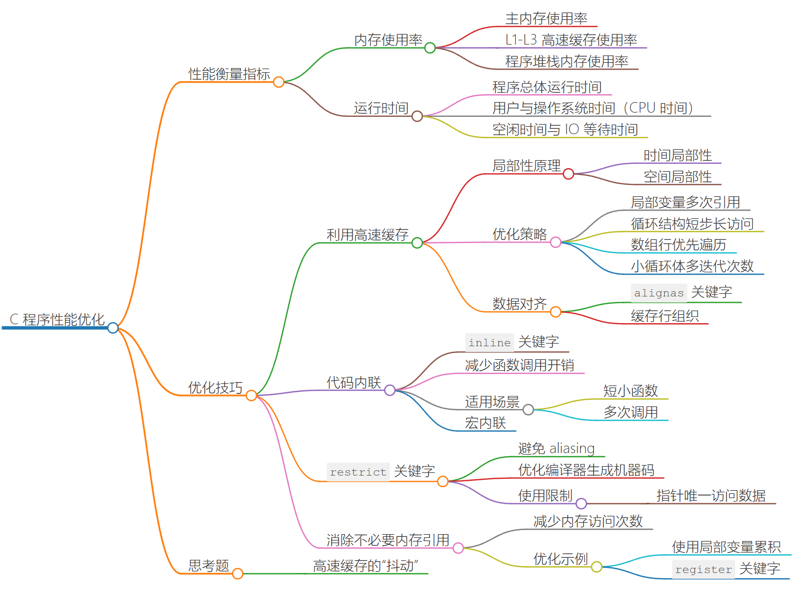

## 1&2｜极致优化：如何实现高性能的 C 程序？





#### 如何衡量程序的运行性能

- 内存性能
- 运行时间

对于具有相同功能的两个程序，在完成相同任务时，哪一个的内存使用率更低，且运行时间更短，则程序的整体性能相对更好。


#### 技巧一：利用高速缓存


#### 技巧二：代码内联


#### 技巧三：restrict关键字


#### 技巧四：消除不必要的内存引用


#### 技巧五：循环展开


#### 技巧六：优先使用条件传送指令


#### 技巧七：使用更高的编译优化等级


#### 技巧八：尾递归优化


## 3｜生产加速：C 项目需要考虑的编码规范有哪些？

这一节可以和天赋好书的《C语言进阶》里的规范一起来讲

[C代码规范-C 语言进阶 (cntofu.com)](https://www.cntofu.com/book/102/book/chapter-0/04.md)


## 4｜生产加速：如何使用自动化测试确保 C 项目质量？


#### 单元测试

顾名思义，单元测试就是对组成程序整体结构的基本单元（也可称为模块）进行功能正确性验证的过程。其目标是，隔离程序的每个部分，并单独验证这些部分能否按照预期正常工作。

对于 C 程序来说，这里的单元通常为程序使用到的各个函数。

既然要对这些基本单元的功能进行测试，那便需要编写一些代码来使用这些单元，并为它们提供多种不同输入，来验证相应的输出或副作用变化是否符合单元的正常功能实现。而为了让目标单元在测试过程中正常运作，我们通常还需要为它准备特定的配套测试环境，比如用于替换真实代码（如外部函数调用）的桩（Stub）代码，以及各类 Mock 资源（如 DB 访问层、外部 API 接口）等。这样做的目的在于，隔离单元需要依赖的外部环境，使测试范围可以尽量集中在单元的内部逻辑上。


#### 集成测试


#### 功能测试


#### 性能测试


#### 测试自动化

什么是“真正”的测试自动化？通常来说，我们谈到的“测试自动化”是指使用脚本或测试框架，以编程的方式代替传统的人工方式，来对软件功能进行测试的过程。

**因此，只要涉及了测试框架、软件或脚本的使用，我们就可以称这样的测试为自动化测试。**

但与之相比更有意义的，是如何进一步地把一些重要的测试环节融入到我们的日常开发和功能迭代中，来让整个 DevOps（即软件开发、质量保证以及系统运维）的过程更加自动化。

通常的做法是，让一些针对软件基础功能的测试（如单元测试、功能测试等）成为每一次生产发布前都必须执行的环节，并指定一定的覆盖率作为通过基准。而这一般要求公司提供针对某一类项目（比如 C 语言项目）的统一发布平台，且支持对它们进行集中的持续编译、测试、部署、发布等一系列操作，并让所有相关流程可以按“管道”的方式依次有序执行。

更多内容：[What is Continuous Integration: Testing, Software & Process Tutorial (cloudbees.com)](https://www.cloudbees.com/continuous-delivery/continuous-integration)


## 5｜生产加速：如何使用结构化编译加速 C 项目构建？


## 6｜实战项目（上）：一个简单的高性能 HTTP Server


#### POSIX 接口实现 TCP Server

`FibServ` 的最核心功能便是对 HTTP 请求的接收与应答，以 HTTP 1.1 标准作为实现要求。

> 如下所示，根据 RFC 7230 对该标准的规定，HTTP 作为一种应用层协议，需要基于以传输层 TCP 协议建立的网络连接来实现。
>
> Although HTTP is independent of the transport protocol, the “http” scheme is specific to TCP-based services because the name delegation process depends on TCP for establishing authority.

> Linux系统中，借助套接字（Socket）接口，我们便能够建立这样的一个连接。这套接口属于 POSIX.1 标准的一部分，因此，它也同时被 Unix 与各种类 Unix 操作系统采用。
>
> 套接字接口的全称一般为“套接字网络进程间通信接口”。从名称上就可以看出，通过这个接口，多个进程之间便可进行在同一网络下，甚至是跨不同网络的通信过程。

通过以下接口，实现核心的网络请求功能

1. socket

    通过 socket 创建套接字

    ```C
    int socket(
      int domain, 
      int type, 
      int protocol);
    ```

    - domain

        指定通信域

    - type

        套接字类型

    - protocol

        使用的协议

2. bind

    通过 bind 将套接字与一个具体地址关联

    ```C
    int bind(
      int sockfd, 
      const struct sockaddr *addr, 
      socklen_t addrlen);
    ```

    > bind 接口使用的地址必须是在程序进程运行所在的计算机上有效的。在 `FibServ` 的实现中，我们将直接使用本机地址 “127.0.0.1”。

    bind 接口在调用时共接收两部分信息，

    - 某个具体 socket 对象对应的文件描述符；

    - 另一部分为与所关联地址相关的数据结构。

3. listen

    将一个 socket 对象变为“被动 socket”，也就是说，该 socket 会在某个地址上持续被动地等待从外部发来的连接请求，而不会自己主动发起连接。

    ```C
    int listen(int sockfd, int backlog);
    ```

    listen 接口共接收两个参数，

    - 第一个参数为某个具体 socket 对象对应的文件描述符；
    - 第二个参数用于控制“暂存队列”的大小。

    当该队列发生溢出时，后续的连接请求将会被直接拒绝（ECONNREFUSED）。

4. accept

    通过 accept 接口，我们可以从被动 socket 对应的暂存队列中依次取出已经到来的连接请求。这里，该接口会为每一个已接受的请求建立一个新的、表示已连接的 socket 对象。

    ```C
    int accept(
      int sockfd, 
      struct sockaddr *restrict addr, 
      socklen_t *restrict addrlen);
    ```

    之后就可以用这个 socket 对象进行各种 IO 操作：read、write。通过读出对应请求的数据，进行相关处理。同时将适当结果返回给客户端。

    > 若在调用 accept 接口时，暂存队列中没有待处理的连接请求，则接口调用者将会进入阻塞状态，直到下一个连接请求的到来。

5. close

    ```C
    int close(int fd);
    ```


#### TCP 之上：http协议

在 HTTP 1.1 中，请求和响应的数据报文是以**纯文本**形式来在客户端和服务器之间传递的。

即：当 `FibServ` 在处理一个 HTTP 请求时，实际上就是处理一堆客户端发过来的字符，只不过这些字符是按照特定格式组织的。

> 至于这些字符的具体内容，你可以通过 read 接口，从已被接受的连接对应的 socket 对象中读取出来。

- 以 `FibServ` 为例的报文格式

    - HTTP请求报文

        ```markdown
        GET /?num=10 HTTP/1.1
        Host: 127.0.0.1:8080
        User-Agent: ApacheBench/2.3
        Accept: */*
        ```

        > 整个报文被分为三部分，即起始行、首部字段，以及主体。
        >
        > - 起始行中包含有与该请求相关的方法（GET）、路径（/?num=10），以及协议与版本（HTTP/1.1）信息。
        >
        > - 首部字段中则包含所有的请求头信息，**这些信息通常用于控制客户端或服务器应该如何处理该请求。**
        > - 对于某些属于特定方法的请求，报文中通常还可能包含有与请求一同发送过来的必要数据，这部分数据则被整理在了报文“最下方”的主体部分中。

    - HTTP响应报文

        结构类似，只是起始行中包含的信息发生了变化

        ```markdown
        HTTP/1.1 200 OK
        Content-type: text/plain
        Content-length: 2
        
        55
        ```

        > 这里的 “200” 和 “OK” 分别表示了该响应的状态码与可读状态信息。(404？)

    - Summary

        - 请求报文的起始行描述了这个请求“希望要做的事情”；
        - 而响应报文的起始行则描述了“这件事做完后的结果状态”。
        - 与之前的请求报文不同，这个响应报文中还包含有主体部分的数据 “55”，而这部分数据便是**从服务器返回的请求结果。**

        > 另外还值得一提的是，标准中规定，起始行和首部的每一行都需要以 CRLF，即“回车符”加“换行符”的形式结尾。而在首部字段与主体之间，则需要以 CRLF 结尾的一行空行进行分割。这是我们在代码中构建 HTTP 报文时需要注意的一点。
        >
        > HTTP 1.1 除了对报文的具体格式做了详细规定外，它还对 TCP 连接控制、缓存管理、认证机制等其他重要功能的实现要求进行了说明。
        >
        > 但考虑到实现成本，在本次实战中，我们仅会对 `FibServ` 收到的 HTTP 请求报文进行适当解析，并返回相应的响应报文。而在其他部分的实现上，可能并没有遵循 HTTP 协议的相关规定（比如默认情况下应使用长连接）。


#### 优化 `FibServ` 

为了尽可能提高 `FibServ` 处理请求时的性能，我们将从几个很容易想到的地方入手，来对程序进行适当的优化。

- 简易线程池

    首先来思考下：如何让程序充分利用多核 CPU 的多个处理单元？多线程？

    > 1. **并行化处理**：利用多线程或多进程并行处理任务，将任务分解成多个子任务，分配给不同的处理单元同时执行，以提高整体处理性能。可以使用线程库（如`pthread`）、进程库（如fork/exec）、并行编程框架（如OpenMP、MPI）等工具来实现并行化处理。
    >
    > 2. **任务调度优化**：合理设计任务调度算法，确保任务在多个处理单元之间均衡分配，避免单个处理单元负载过重或空闲。可以使用操作系统提供的调度器或自定义调度算法来优化任务分配。
    >
    > 3. **数据共享与同步**：在多核CPU中，多个处理单元可能同时访问共享数据，因此需要进行合理的数据共享与同步操作，避免数据竞争和死锁。可以使用互斥锁、条件变量、信号量等机制来实现线程间的数据共享与同步。
    >
    > 4. **优化算法与数据结构**：针对多核CPU的特点，设计和选择适合并行处理的算法和数据结构，减少不必要的同步和通信开销，提高并行处理效率。
    >
    > 5. **利用向量化指令集**：许多现代CPU都支持SIMD（Single Instruction, Multiple Data）指令集，可以同时对多个数据进行操作，提高计算效率。在编写代码时，可以利用向量化指令集（如SSE、AVX等）来优化计算性能。
    >
    > 6. **减少内存访问延迟**：多核CPU中多个处理单元共享内存，频繁的内存访问可能导致内存访问延迟，降低性能。可以通过优化内存访问模式、减少缓存失效等方式来降低内存访问延迟。
    >
    > 通过以上措施，可以更好地利用多核CPU的多个处理单元，提高软件的并行处理能力和性能。

    在 `FibServ` 的实现中，我们将为它构建一个拥有固定 N 个处理线程的简易线程池。

    

    其中，N 可以由用户在运行 `FibServ` 时，通过添加额外的参数 “thread_count” 来指定。每一个线程在运行时，都会通过 accept 接口，独立地从 socket 对应的暂存队列中取出下一个待连接请求，并进行相应处理。即：一个线程一个socket。

    这样可以充分利用多个 CPU 核心，以让它们并行地处理多个请求。


- 尾递归

    针对斐波那契这种常见递归例子，用尾递归来减少递归代替的开销


- 避免忙等待

    这里可以回看之间的同步原语部分的条件变量，很好地解决忙等待

    > From teacher：
    >
    > 为了确保 `FibServ` 能够在请求处理线程异常退出时，仍然保证线程池中的线程数量为 N，这里不使用忙等待的方式持续判断存活的线程数量。相对地，使用条件变量，来让处理线程在退出时，及时通知主线程创建新的处理线程。
    >
    > 而主线程也将在处理线程数量满足要求时，再次进入阻塞状态。
    >
    > 可能性能没提高多少，但对于理解“条件变量”在实际项目中的应用方式，还是有帮助的。


- More optimizations

    用cache？内存缓存、磁盘缓存？

    没想到：用异步IO，非阻塞。更多好像没了解过？

    > 要优化和提升自己编写的简易HTTP服务器的性能，可以考虑以下几个方面的优化策略：
    >
    > 1. **使用异步I/O**：采用异步I/O模型（如`epoll`、`kqueue`等）可以提高服务器的并发处理能力，减少I/O阻塞，提高性能。通过非阻塞I/O和事件驱动模型，可以更高效地处理多个并发连接。
    >
    > 2. **多线程/多进程处理**：使用多线程或多进程处理请求，可以充分利用多核CPU的优势，提高并发处理能力。可以采用线程池或进程池来管理并发请求，避免频繁创建销毁线程/进程的开销。
    >
    > 3. **缓存技术**：使用缓存技术（如内存缓存、磁盘缓存）可以减少对数据库或文件系统的频繁访问，提高数据读取速度。可以使用缓存来存储频繁访问的数据，减少计算和I/O开销。
    >
    > 4. **HTTP连接复用**：通过HTTP连接的复用（如HTTP Keep-Alive机制），可以减少连接建立和关闭的开销，提高性能。保持长连接可以减少TCP连接的建立和断开次数，提高数据传输效率。
    >
    > 5. **优化网络通信**：通过优化网络通信（如TCP参数调优、使用更高效的协议等），可以减少网络延迟和提高数据传输效率。调整TCP参数、使用更快速的传输协议（如HTTP/2）可以提高网络性能。
    >
    > 6. **性能监控与调优**：通过性能监控工具（如top、vmstat等）对服务器性能进行监控，找出性能瓶颈并进行调优。可以优化代码、减少资源占用，提高服务器的性能和稳定性。
    >
    > 7. **安全性优化**：保障服务器的安全性也是提升性能的重要一环。防止DDoS攻击、SQL注入等安全问题可以避免服务器因安全问题而性能下降。
    >
    > 通过以上优化策略，可以提升自己编写的简易HTTP服务器的性能，提高并发处理能力和响应速度。


## 7｜实战项目（下）：一个简单的高性能 HTTP Server


#### Structure

Learn how to use CMake first

