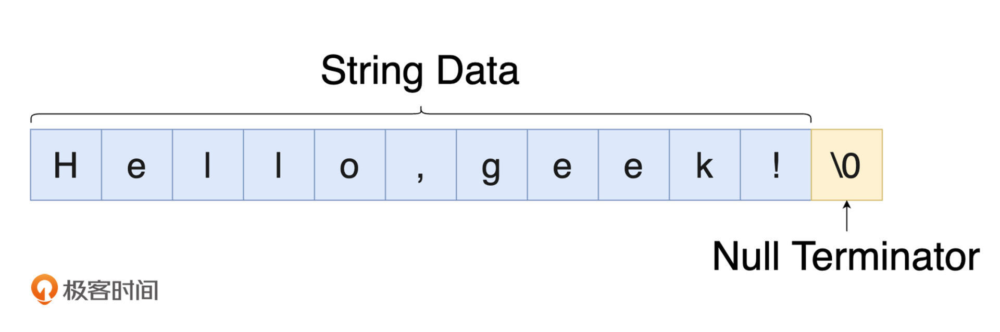
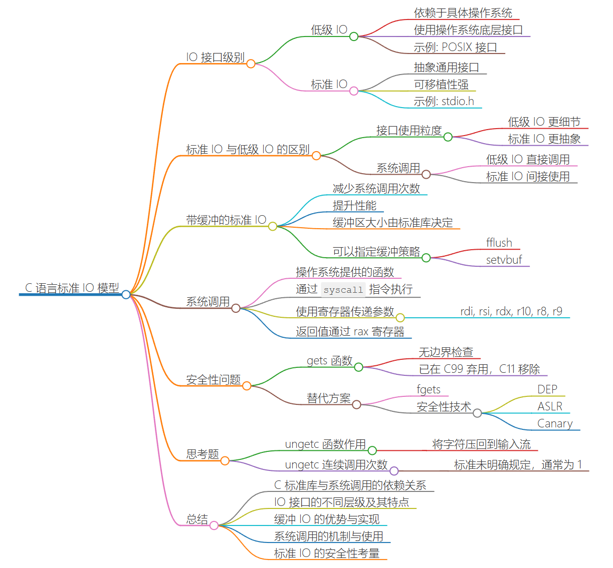

## 0 | 概括


## 1｜标准库：字符、字符串处理与数学计算


#### 字符和字符串

- 字符

    在 C 语言标准中，不同于其他整数类型（比如 int），字符类型 char 并没有被规定默认的符号性，而其具体符号性则是由编译器和所在平台决定的。虽然在大多数情况下，编译器会选择将默认情况下的 char 类型视为有符号整数类型，但考虑到程序的可用性与可移植性，在实际编码中还是建议显式指定出所定义字符变量的符号性。C 标准中之所以这样规定，主要源于其历史原因。比较有代表性的一种说法是：C 语言在设计之初参考了它的“前辈” B 语言。B 语言于 1969 年由 Ken Thompson 在贝尔实验室开发。作为一种无类型语言，它的字符类型仅用于存放字符，而不作数学运算之用。因此，并不需要特别区分符号性。所以在 C 语言中，作者也没有为字符类型规定默认的符号性。

    另外，有关字符类型的另一个重要特征是，C 语言保证 char 类型只占用一个字节大小，因此在使用 `sizeof` 运算符计算该类型大小时，将永远得到结果 1。但事实上，**并不是所有计算机体系都使用 8 位的字节大小。对于某些较为古老的计算机体系，一个字节可能对应大于或小于 8 位。对于某些特殊的业务需求和功能场景，你可以通过访问标准库中定义的常量 CHAR_BIT ，来检查当前体系下一个字符类型所占用的位数，该常量的使用方式如下所示：**

    ```C
    #include <limits.h>
    #include <stdio.h>
    int main(void) {
      printf("char type has %lu byte.\n", sizeof(char));  // ...1.
      printf("char type has %d bits.", CHAR_BIT);  // ...8.
    }
    ```

    不过需要注意的是，自 C89 以来的标准中规定，CHAR_BIT 的值不能小于 8，**因此对于单个字节数小于 8 位的体系架构，该常量并不能反映真实情况。**

    最后介绍一个编码方面的特性。C 语言中的 char 字符类型变量在按照字符类型打印时（比如使用 `printf` 函数，配合 “%c” 占位符），会使用 ASCII 编码来对数字值进行字符映射。这意味着，一个存储有整数 65 的字符类型变量，在将其打印输出时，会在命令行中直接得到字符 “A”。当然，你也需要确保命令行客户端的编码设置为 UTF-8，以与 ASCII 编码相兼容。

    除了 char 类型以外，C 语言还在 C90 和 C11 标准中新增了可用于宽字符的类型，诸如 `wchar_t、char16_t、char32_t` 等。其中，`wchar_t` 类型的大小由具体的编译器实现决定。而 char16_t 和 char32_t 类型，其值则固定占用对应的 16 和 32 位。


- 字符串

    在 C 语言中，我们可以通过下面这两种方式来定义字符串类型的变量，一种是指针形式，另一种是数组形式。当然，这里示例代码中我们定义的是只读字符串：

    ```C
    // read-only string.
    const char strA[] = "Hello, geek!";  
    const char* strB = "Hello" ", geek!";
    ```

    其中，由双引号括起来的部分一般称为“字符串字面量”。**C 标准中规定，连续出现的字符串字面量之间如果仅由空格分隔，则会将它们视为一个整体。所以 `strA` 与 `strB` 这两个字符串的内容是完全一样的。**

    本质上，这两种方式都展示出了字符串在 C 语言中的具体表现形式，即“**带有终止符的字符数组”**。

    关于上述字符串在内存中的布局形式，我们可以用下面这张图来直观地理解一下。可以看到的是，字符串数据被存放在连续的内存段上，且每个字符串数据的最后都以空字符（\0）作为表示结束的终止符。所以我们说，字符串并不是单纯的字符数组，而是带有隐式（定义时会被自动加上）终止符的字符数组。

    
    
    > 虽然通过上面这两种方式都可以定义字符串，**但实际上，不同的定义方式在不同情况下可能会对程序运行产生不同的影响。**这里你可以先思考下：假设我们有如下这段代码，它在运行时会有什么问题吗？如果有，那应该怎样改正？
    >
    > ```C
    > #include <string.h>
    > #include <stdio.h>
    > int main (void) {   
    >   /* get the first token */
    >   const char* token = strtok("Hello, geek!", "geek");
    >   printf("%s", token);
    >   return 0;
    > }
    > ```
    >
    > 上面这段代码在不同平台上运行可能会得到不同的结果。比如在 Linux 上，你可能会得到名为 “Segmentation fault” 的系统错误。如果进一步用 LLDB 进行调试，你会发现错误原因是：“signal SIGSEGV: address access protected”，翻译过来就是访问了受保护的地址。那接下来我们一起看看为什么会这样。
    >
    > 我们在之前的内容中曾提到过，字符串常量一般会被存放在进程 VAS 的 `.rodata Section（下文简称 .rodata）`中，**位于此处的数据一般可以在程序中被多次引用。**
    >
    > 而当数据需要被修改，或以较短生命周期的形式（如局部变量）存在时，其引用的相关数据可能需要从 `.rodata` 中被复制到其他位置。而上述这两种字符串定义方式便对应于这两种情况。

    

    以本小节开头的代码为例，

    - **使用指针形式定义的字符串 `strB` ，实际上直接引用了 `.rodata` 中该字符串的所在位置，即字符指针 `strB` 的值为该位置对应的内存地址。**

    - **使用数组形式定义的字符串 `strA` ，则是将该字符串的数据从 `.rodata` 中复制到了其他地方，`strA` 的值为复制后该字符串第一个字符的所在地址。**

    - 验证：
    
        ```C
        // string.c
        #include <stdio.h>
        int main(void) {
          const char strA[] = "Hello, geek!";
          const char* strB = "Hello, geek!";
          printf("%p\n%p", strA, strB);  
          /**
            Output:
            0x7ffee84d3d0b
            0x4006c8
          */
        }
        ```
        ```bash
            查看当前进程的 VAS 分布情况：
            pgrep string | xargs -I {} cat /proc/{}/maps
        ```
        
        ```BASH
        打印出当前程序 .rodata 的相关情况：
        objdump -s string | grep .rodata -A 10
        ```
        
        
    
    总结一下。使用数组和指针形式定义的字符串，其底层的数据引用方式会有所区别。
    
    1. 其中数组方式会将字符串数据从 `.rodata` 中拷贝到其他位置（比如栈内存），因此修改这些数据不会改变存在于原始 `.rodata` 中的副本。
    2. 而使用常量指针形式定义的数组，该指针会直接引用位于 `.rodata` 中的字符串数据。
    
    因此，我们需要注意的一个问题是：当使用非 const 指针引用字符串时，通过该指针修改字符串的值，可能会影响到其他使用指针形式引用相同字符串的代码位置上的实际字符串值。当然在 C 标准中，这种修改方式本身是一种未定义行为，其产生的具体影响将由编译器和操作系统决定。但大多数情况下，该行为都会产生诸如 “Segmentation fault” 以及 “Bus error” 之类的系统错误。


#### C 标准库中的字符、字符串处理

- **统计字符串长度**

    ```C
    #include <string.h>
    #include <stdio.h>
    int main(void) {
      const char str[10] = "Hi";
      printf("%zu\n", strlen(str));  // 2.
    }
    ```

    这里我们直接使用标准库提供的 `strlen` 函数，该函数不会计入字符串中多余的终止符。

- **拼接字符串**

    ```C
    #include <string.h>
    #include <stdio.h>
    #define STRLEN 14
    int main(void) {
      char strA[STRLEN] = "Hello,";
      char strB[] = " world!";
      strncat(strA, strB, STRLEN - strlen(strA) - 1);
      printf("%s\n", strA); 
    }
    ```

    在这个例子中，我们选择使用 `strncat` 函数来进行字符串拼接。该函数相较于 `strcat` 函数，可以更好地控制被拼接字符串的长度，以防被拼接字符串过长导致的拼接字符串数组溢出。这里需要注意，在计算 `strncat` 函数的第三个参数，也就是被拼接字符串长度这个参数时，需要为字符串最后的终止符预留出 1 个字节的空间。

- **拷贝字符串**

    ```C
    #include <string.h>
    #include <stdio.h>
    int main(void) {
      char strA[] = "aaaaaa";
      char strB[] = "bbbbbbb";
      printf("%s\n", strncpy(strA, strB, strlen(strA)));  // "bbbbbb".
    }
    ```

    拷贝字符串函数 `strncpy` 的用法与 `strncat` 基本相同，我们可以控制其第三个参数，来决定将多少字符拷贝到目的字符串的数组中。

    > 问题：如果把 strncpy 函数中第三个参数使用的 strlen 函数更换成 sizeof，那么程序运行会得到什么结果？为什么？

- **格式化字符串**

    ```C
    #include <stdio.h>
    #define LEN 128
    int main(void) {
      char dest[LEN];
      const char strA[] = "Hello, ";
      sprintf(dest, "%sworld!", strA);
      printf("%s\n", dest);
    }
    ```

    函数 `sprintf` 可用于格式化字符串，其第二个参数的形式与 `printf` 函数的第一个参数一致，只是后者会将内容输出到命令行中，而 **`sprintf` 会将格式化后的字符串保存到通过其第一个参数传入的数组中。**


#### C 标准库中的数学运算

上面我介绍了 C 标准库中与字符和字符串处理相关函数的使用方式，除此之外，C 标准库中还提供了与数学运算有关的工具函数，基本上你都可以通过引入 `math.h 和 stdlib.h` 这两个头文件来使用。注意：**在编译时，你可能需要为链接器指定 “`-lm`” 参数以链接所需的数学库。**

如：绝对值：

```C
#include <math.h>
#include <stdio.h>
int main(void) {
  long double num = -10.1;
  printf("%.1Lf\n", fabsl(num));
}
```

为了减少编码的工作量，我们也可以使用这些函数对应的泛型版本，这样就不需要根据传入的参数来手动选择合适的版本（比如这里的 `fabsl` 函数，它的后缀 “l” 表示 “long”）。比如，对于所有浮点类型的数字值，我们可以直接使用名为 fabs 的宏函数。该宏在展开时，会自动为你匹配对应的类型精确版本。不过，为了使用这些泛型宏，我们需要将原来的头文件 `math.h` 替换为 `tgmath.h`，如下代码所示：

```C
#include <tgmath.h>
#include <stdio.h>
int main(void) {
  long double num = -10.1;
  printf("%.1Lf\n", fabs(num));
}
```

> 泛型宏是什么？
>
> 泛型宏是一种在C语言中使用的宏，可以根据传入的参数类型自动选择合适的实现。

- 具体实现

    关于这些标准库函数的实现方式，如果我们进一步来看，会发现并非所有函数都是按照相应的数学算法来实现计算过程的。这里用一个常见的数学运算“求平方根”举例子：

    通常来说，我们可以使用牛顿迭代法，以软件算法的形式计算一个数的平方根值。但实际上，当我们以 `musl` 这个 C 标准库为例，进一步查看其某版本的实现时，可以看到它在 i386 架构下直接使用了 FPU（浮点运算单元）提供的机器指令 `fsqrt` 来计算平方根的值，而并没有使用软件算法。在某种程度上，这可以极大提升计算性能。如下图所示：

    **因此，为了最大程度地利用硬件带来的计算性能优势，在准备自行编写相应算法时，可以先看看能否直接利用标准库提供的函数来完成你的工作。**


#### 自己总结

C语言作为一门从编译器开发者的视角被发明的语言，它的很多特性都是和硬件平台、体系结构和编译器相关的，所以在讨论各种特性的时候，必须要和主流的编译器、体系结构联系起来。

关于字符和字符串：基本上现在见到的文本都是一个个字符拼接起来的，只是越来越演进，提高效率，有了字符串。

关于编译器对 C 的影响：比如 `char` 的默认符号、`char` 占多少个字节（C标准固定为一个）等等。

还有，C语言中是没有字符串这个概念，本质上是由很多个字符拼接在一起，最后在结尾加一个 `\0` 空字符的字符数组成的，所以 C 的字符串一直都很有问题，开发中应该自己开发一套字符串或者使用开源的良好的 C 字符串库。

[C语言----详解字符串相关的库函数（建议收藏）_c语言字符串库函数-CSDN博客](https://blog.csdn.net/baiyang2001/article/details/120216950)

[每天一点 C / 一个优雅的字符串函数库(Simple Dynamic Strings) - 知乎 (zhihu.com)](https://zhuanlan.zhihu.com/p/208060166)


#### 思考题

- 请了解一下 C 标准库中 `strtok` 函数的实现，并思考是哪一步引起了文中实例的 “Segmentation fault” 错误。然后，如果时间充足，可以尝试实现一个自己的版本，拥有与 `strtok` 函数一样的功能，但是不修改传入的源字符串。

  - 问题复现
  
      ```C
      #include <string.h>
      #include <stdio.h>
      int main (void) {   
      /* get the first token */
      const char* token = strtok("Hello, geek!", "geek");
      printf("%s", token);
      return 0;
      }
      ```
  
      为什么会报segmentation fault？访问了常量区，而常量区一般是不能访问的？改为用字符数组定义就可以？
  
      > 在你的`main`函数中调用`my_strtok`函数时，直接将字符串常量作为参数传递给`my_strtok`函数会导致段错误（segmentation fault）的原因是因为字符串常量存储在只读数据段（`.rodata segment`），是不可修改的。当你尝试在`my_strtok`函数中修改这个字符串常量时，就会导致段错误。
      >
      > 正确的做法是使用字符数组来存储字符串，因为字符数组存储在栈上，可以被修改。当你将字符数组作为参数传递给`my_strtok`函数时，实际上是将字符数组的地址传递给函数，而不是直接传递字符串常量的地址。这样就可以在函数内部修改字符串内容而不会导致段错误。
      >
      > 所以，为了避免段错误，建议在调用`my_strtok`函数时使用字符数组来存储字符串，而不是直接传递字符串常量。
  
      
  
  - **关于 `strtok` 的介绍**
  
      `strtok`是C语言中的一个函数，用于将一个字符串分割成一系列非空的标记（token）。
  
      **参数**：
  
      - `str`：要解析的字符串，在第一次调用`strtok`时传入。
      - `delim`：用来指定分隔标记的字符集合。这些字符将被用来分割`str`中的标记。
  
      **返回值**：
  
      - 每次调用`strtok`函数都会返回一个指向下一个标记的指针，这个标记是一个以空字符结尾的字符串。如果没有找到更多的标记，`strtok`将返回`NULL`。
  
      **工作原理**：
  
      1. 在第一次调用`strtok`时，传入要解析的字符串`str`。
      2. 在后续的调用中，`str`必须传入`NULL`，以便继续解析相同的字符串。
      3. `delim`参数指定用来分割标记的字符集。
      4. 每次调用`strtok`会返回下一个标记，并更新内部指针以指向下一个标记的起始位置。
  
      **注意事项**：
      - 连续的分隔字符会被视为一个分隔符。
      - 字符串开头或结尾的分隔符会被忽略。
      - 返回的标记是非空字符串。
  
      在学习`strtok`函数时，需要注意每次调用`strtok`时传入的参数以及返回值的处理。这个函数在处理字符串分割时非常有用，可以帮助你将一个字符串按照指定的分隔符分割成多个部分。
  
  - **具体实现**
  
      ```C
      #include <string.h>
      #include <stdio.h>
      #include <stdlib.h>
      #include "dbg.h"
       
      static char *my_strtok1(char *str, const char *delim);
      static char *my_strtok2_0(char *str, const char *delim);
      static char *my_strtok2_1(char *str, const char *delim);
      
      int main (void)
      {
         char ch[] = "Hello, geek!";
      
         /* 不对源字符串操作  */
         const char *token2_0 = my_strtok2_0(ch, ",");
         printf("%s\n", token2_0);
         printf("%s\n", ch);
      
         /* 对源字符串操作 */
         /* get the first token */
         const char* token1 = my_strtok1(ch, ",");
         printf("%s\n", token1);
         printf("%s\n", ch);
         
         free((char *)token1);
      
         return 0;
      }
      
      /* Version 2.1 */
      static char *my_strtok2_1(char *str, const char *delim)
      {
          static char *buffer = NULL;
          static char *copy = NULL;
      
          check(str != NULL, "Please pass the nonempty str.");
          copy = strdup(str);  // 复制原始字符串
          check_mem(copy);
      
          buffer = copy;
          check(buffer != NULL, "Buffer is NULL.");
      
          char *token = buffer;
          buffer = strpbrk(buffer, delim);
      
          if(buffer != NULL)
          {
              *buffer = '\0';
              buffer++;  // 指向下一个子字符串的起始位置
          }
      
          free(copy);  // 释放复制的字符串
          return token;
      
      error:
          if(copy) free(copy);
          return NULL;
      }
      
      
      /* 
       * Version 2.0 
       *
       * 这个好像应该没有问题？但是那个result变量内存好没释放？
       * 还有点不太理解最后那个result变量的作用？
       *
       * 懂了，确实是这样的：result变量内存没释放
       * 所以注意：在main函数记得free！
       *
       * */
      
      static char *my_strtok2_0(char *str, const char *delim)
      {
          // 静态变量的初始化必须是编译时常量。
          static char *buffer = NULL;
          static char *copy = NULL;
      
          check(str != NULL, "Please pass the nonempty str.");
          copy = strdup(str);  // 复制原始字符串
          check_mem(copy);
      
          buffer = copy;
          check(buffer != NULL, "Buffer is NULL.");
      
          char *token = buffer;
          buffer = strpbrk(buffer, delim);
      
          if(buffer != NULL)
          {
              *buffer = '\0';
              buffer++;  // 指向下一个子字符串的起始位置
          }
      
          char *result = strdup(token);  // 复制token，避免修改原始字符串
          check_mem(result);
      
          free(copy);  // 释放复制的字符串
          return result;
      
      error:
          if(copy) free(copy);
          if(result) free(result);
          return NULL;
      }
      
      /* Version 1 */
      static char *my_strtok1(char *str, const char *delim)
      {
          static char *buffer = NULL;
      
          check(str != NULL, "Please pass the nonempty str.");
          buffer = str;
          check(buffer != NULL, "Buffer is NULL.");
      
          char *token = buffer;
          // buffer = strchr(buffer, *delim);    // 返回delim第一次出现的位置，赋给buffer
          buffer = strpbrk(buffer, delim);    // 返回delim第一次出现的位置，赋给buffer
          // 二者区别？
      
          if(buffer != NULL)
          {
              *buffer = '\0';
              buffer++;       // 指向下一个子字符串的起始位置
          }
      
          return token;       // 返回当前自字符串的起始位置
      
      error:
          return NULL;
      }
      
      
      /* test
      #include <stdio.h>
      #include <string.h>
      
      int main() {
          char str[] = "aaa;;bbb,";
          char delim[] = ";,";
          char *token;
      
          // 第一次调用strtok时传入要解析的字符串
          token = strtok(str, delim);
      
          // 循环调用strtok获取每个标记
          while (token != NULL) {
              printf("Token: %s\n", token);
              token = strtok(NULL, delim); // 后续调用传入NULL以继续解析相同字符串
          }
      
          return 0;
      }
      */
      
      /*
       * strchr 简单使用
       */
      // int main() {
      //     const char *str = "Hello, world!";
      //     char *ptr = strchr(str, 'o');       // 返回指向o的指针（如果有的话）
      // 
      //     if (ptr != NULL) {
      //         printf("Found 'o' at position: %ld\n", ptr - str);
      //         printf("%s\n", ptr);            // %s从o之后开始解引用。
      //     } else {
      //         printf("Character not found.\n");
      //     }
      // 
      //     return 0;
      //  }
      
      ```
      
      > `strchr` 和`strpbrk` 函数：
      >
      > `strchr`和`strpbrk`这两个函数在功能上有一些区别，虽然在我的代码中得到的效果是一样的，但是它们的用途略有不同：
      >
      > 1. `strchr`函数：
      >    - `strchr`用于在字符串中查找指定字符第一次出现的位置，如果找到则返回该字符的指针，如果没有找到则返回`NULL`。
      >    - 适用于查找单个字符在字符串中的位置。
      >
      > 2. `strpbrk`函数：(多个字符)
      >    - `strpbrk`用于在字符串中查找指定字符集中任一字符第一次出现的位置，如果找到则返回该字符的指针，如果没有找到则返回`NULL`。
      >    - 适用于查找字符集中任一字符在字符串中的位置，可以一次性查找多个字符。
      >
      > 在你的代码中，由于`delim`是一个包含多个分隔符的字符串，所以使用`strpbrk`更适合，因为它可以一次性查找多个字符。而如果`delim`只包含单个字符，使用`strchr`也可以达到相同的效果。
      >
      > 总的来说，选择使用`strchr`还是`strpbrk`取决于你要查找的字符是单个字符还是多个字符。
  


## 2｜标准库：深入理解标准 IO



#### I/O 接口的不同级别

- 标准 I/O （高级 I/O）

    ```C
    #include <stdio.h>
    int main(void) {
      printf("Enter some characters:\n");
      FILE* fp = fopen("./temp.txt", "w+");
      if (fp) {
        char ch;
        while (scanf("%c", &ch)) {
          if (ch == 'z') break;
          putc(ch, fp);
        }
      } else {
        perror("File open failed.");
      }
      fclose(fp);
      return 0;
    }
    ```

- 低级 I/O

    低级 IO 会使用**与具体操作系统相关**的一系列底层接口来提供相应的 IO 能力，如常用于 Unix 与类 Unix 上的 POSIX 接口标准。

    ```C
    #include <unistd.h>
    #include <fcntl.h>
    int main(void) {
      const char str[] = "Enter some characters:\n";
      write(STDOUT_FILENO, str, sizeof(str));
      const int fd = open("./temp.txt", O_RDWR | O_CREAT);
      if (fd > 0) {
        char ch;
        while (read(STDIN_FILENO, &ch, 1)) {
          if (ch == 'z') break;
          write(fd, &ch, sizeof(ch));    
        }
      } else {
        const char errMsg[] = "File open failed.";
        write(STDERR_FILENO, errMsg, sizeof(errMsg));
      }
      close(fd);
      return 0;
    }
    ```

    可以看到，在使用低级 IO 接口进行编程时，我们需要处理与所进行 IO 操作有关的更多细节。

    比如，在调用 write 接口时，你必须要指定不同的文件描述符（File Descriptor），才能够区分所要进行的操作是“向屏幕上输出字符”，还是“向文件内写入数据”。（也就是控制输出流）

    相反，在高级 IO 的实现中，我们并不需要关注这些细节，接口的名称可以直接反映其具体用途。

    两者之所以会在接口使用粒度上存在差异，是由于**“低级 IO 与操作系统实现紧密相关”**。

    > 对于 POSIX 标准来说，其所在系统会将绝大多数的 IO 相关资源，比如文档、目录、键盘、网络套接字，以及标准输入输出等，**以“文件”的形式进行抽象，并使用相对统一的数据结构来表示**。
    >
    > 而在实际编码过程中，每一个可用的 IO 资源都会对应于一个唯一的整型文件描述符值。该值将被作为“单一可信源（The Single Source of Truth）”，供相关接口使用。

    - 【补充】：带缓冲的标准 I/O

        > 与低级 IO 相比，标准 IO 会为我们提供带缓冲的输入与输出操作。

        实际上，使用低级 IO 接口实现的程序，会在用户每次输入新内容到标准输入流中时，同时更新文件 “temp.txt” 中的内容。

        使用标准 IO 接口实现的程序，仅会在用户输入的内容达到一定数量或程序退出前，再更新文件中的内容。而在此之前，这些内容将会被存放到缓冲区中。

        ```C
        // ...
        char buf[1024];
        setvbuf(fp, buf, _IOFBF, 5);
        // ...
        ```

- **用于低级 IO 接口的操作系统调用**

    实际上，你可以简单地将系统调用当作是由操作系统提供的一系列函数。只是相较于程序员在 C 源代码中自定义的“用户函数”来说，系统调用函数的使用方式有所不同。

    与调用用户函数所使用的 call 指令不同，在 x86-64 平台上，我们需要通过名为 `syscall` 的指令来执行一个系统调用函数。

    操作系统会为每一个系统调用函数分配一个唯一的整型 ID，这个 ID 将会作为标识符，参与到系统调用函数的调用过程中。比如在 x86-64 平台上的 Linux 操作系统中，open 系统调用对应的 ID 值为 2，你会在接下来的例子中看到它的实际用法。

    同用户函数类似的是，系统调用函数在被调用时，也需要通过相应的寄存器来实现参数传递的过程。而正如我在第 05 讲 中提到的那样，`SysV` 调用约定中规定，系统调用将会使用寄存器 `rdi、rsi、rdx、r10、r8、r9` 来进行实参的传递。当然，除此之外，`rax` 寄存器将专门用于存放系统调用对应的 ID，并接收系统调用完成后的返回值。

    ```C
    #include <unistd.h>
    #include <fcntl.h>
    int main(void) {
      const char str[] = "Enter some characters:\n";
      write(STDOUT_FILENO, str, sizeof(str));
      const char* fileName = "./temp.txt";
      // Call to `open` starts:
      // const int fd = open("./temp.txt", O_RDWR | O_CREAT);
      volatile int fd;
      asm("mov $2, %%rax\n\t"
          "mov %0, %%rdi\n\t"
          "mov $66, %%rsi\n\t"  // 2 | 64 -> 66;
          "syscall\n\t"
          "mov %%rax, %1\n\t"
           : "=m" (fileName)
           : "m" (fd));
      // Call ended.
      if (fd > 0) {
        char ch;
        while (read(STDIN_FILENO, &ch, 1)) {
          if (ch == 'z') break;
          write(fd, &ch, sizeof(ch));
        }
      } else {
        const char errMsg[] = "File open failed.";
        write(STDERR_FILENO, errMsg, sizeof(errMsg));
      }
      close(fd);
      return 0;
    }
    ```


标准 IO 接口在实现时，会直接使用所在平台提供的低级 IO 接口。

而低级 IO 接口在每次调用时，都会通过系统调用来完成相应的 IO 操作。

系统调用的过程涉及到进程在用户模式与内核模式之间的转换，其成本较高。


#### 自己总结

标准 I/O --> 低级 I/O --> 系统调用


#### 思考题

- `ungetc` 函数有什么作用呢？对同一个流，它最多可以被连续调用多少次呢？

    `ungetc` 函数用于将一个字符推回到流中，使得下一次读取字符时可以读取到该字符。它的原型如下：

    ```c
    int ungetc(int c, FILE *stream);
    ```

    其中，`c` 是要推回的字符，`stream` 是要操作的流。

    `ungetc` 函数最多可以被连续调用 `1` 次，即只能将一个字符推回到流中。如果尝试多次调用 `ungetc` 推回多个字符，可能会导致未定义的行为。


## 3｜标准库：非本地跳转与可变参数是怎样实现的？


但实际上，这种以函数为单位的“顺序”执行流并不能完全满足 C 语言在使用时的所有应用场景。

因此，C 标准从 C90 开始，便为我们提供了名为 “`setjmp.h`” 的标准库头文件。通过使用该头文件提供的两个接口 `setjmp` 与 `longjmp`，我们能够在函数调用过程中，实现对执行流的跨函数作用域转变。

而对于上述这种函数执行流程上的变化，我们一般称它为“非本地跳转（Non-local Jump）”。

#### 非本地跳转

先介绍一下本地跳转，


我们之所以称这种通过 `goto` 语句实现的程序执行流变化为本地跳转，是因为在**这种方式下的执行流程转移仅能够发生在当前程序运行所在的某个具体函数中。**

相对地，程序无法做到从某个函数体的执行中途，直接将其执行流转移到其他函数的内部。“跨函数”的调用仅能够通过常规的 call 与 ret 指令来实现。但是，非本地跳转却可以打破这个限制。也就是跨函数跳转。


- `setjmp` 与 `longjmp` 函数

    


## 4｜标准库：你需要了解的 C 并发编程基础知识有哪些？


在**构建高性能应用**时，并发编程是我们经常采用的一种技巧。它通过在程序的运行进程内提供可控制粒度更细的“线程”，从而将程序的整体功能拆分为更小的独立任务单元，并以此来进一步利用多核 CPU 的运算资源。

对于 C11 标准之前的 C 语言来说，想要构建多线程应用，**只能依赖于所在平台上的专有接口，**比如 Unix 与类 Unix 平台上广泛使用的 POSIX 模型，以及后起之秀 OpenMP 模型等。这些模型提供的编程接口，以及所支持平台都有很大的不同。因此，对于那时的 C 语言来说，想要编写**高可移植性的多线程应用，仍需要花费很大功夫**。

而自 C11 标准后，C 语言为我们专门提供了一套通用的并发编程接口，你可以通过标准库头文件 `threads.h` 与 `stdatomic.h` 来使用它们。

- `threads.h` 中包含有与线程控制、互斥量、条件变量，以及线程本地存储相关的接口；
- `stdatomic.h` 中则包含有与原子操作相关的接口。这些接口提供了多种不同方式，可用来避免多线程应用在运行过程中可能遇到的各类线程同步问题。

C11 标准的发布，理论上使构建可移植的多线程 C 应用成为可能，但现实情况却并非这样理想。各类 C 标准库对 C11 中并发编程接口的支持程度不同，比如 Glibc（GNU C 标准库）在其 2018 年中旬发布的 2.28 版本中，才将相关接口进行了较为完整的实现。这就导致了 C11 标准中的这些重要特性，至今（2022 年初）仍然没有得到较为广泛的应用。

因此，接下来我将用两讲的篇幅，为你从零介绍有关并发编程的一些基础知识，以及 C11 并发编程相关接口的基本使用方式。


#### 进程和线程

操作系统会为每一个运行中的程序创建一个相应的进程，以作为它的运行实例。而进程中则包含与该程序有关的一系列运行时信息，比如 VAS、进程 ID、处理器上下文（如通用目的寄存器与指令寄存器中的值）、进程状态，以及操作系统分配给该进程的相关资源等。这些信息被统一存放在内核提供的，名为“**进程控制块（PCB）**”的数据结构中。

**而相较于进程，线程则为程序提供了更细粒度的运行单元。对于大多数传统操作系统实现来说，在默认情况下，每一个进程内部都会存在至少一个线程。其中，进程负责划分不同程序所享有资源的边界；而线程则在共享程序运行资源的情况下，负责程序某个子任务的具体执行过程。**


同进程类似，每一个线程所具有的不同状态信息被保存在内核中名为“**线程控制块（TCB）**”的数据结构中。其中包含有与特定线程运行紧密相关的处理器上下文、线程 ID、所属进程，以及状态信息，等等。可以看到的是，PCB 与 TCB 两者内部所包含的内容会有一定重合。这是由于在某些操作系统上，单进程（单线程）应用的运行可能会直接使用 PCB，来同时保存程序的资源描述信息与执行状态信息。而当运行多线程应用时，才会配合使用 PCB 与 TCB。这里，你可以通过下图来直观地对比进程与线程之间的区别和联系。当然，具体的实现方式并不唯一。


#### 线程的基本控制

```C
#include <stdio.h>
#include <threads.h>

int run(void *arg)
{
    thrd_t id = thrd_current();     // 返回该函数运行所在线程的标识符；
    printf((const char*)arg, id);
    return thrd_success;
}

int main(void)
{
#ifndef __STDC_NO_THREADS__
    thrd_t thread;
    int result;

    // 创建一个线程
    thrd_create(&thread, run, "Hello C11 thread with id: %lu.\n");
    if(thrd_join(thread, &result) == thrd_success)
    {
        // 等待其他线程退出；
        printf("Thread returns %d at the end.\n", result);
    }
#endif
    return 0;
}

```


随着多线程应用的功能变得逐渐复杂，共享变量可能会被多个线程同时访问。并且，不同线程可能会以不同的先后顺序，来执行程序中的同一段代码。除此之外，现代 CPU 采用的特殊指令处理方式，使得程序的实际执行流程与对应的汇编代码可能也不完全一致。而上述这三个因素，都确实会在某些情况下影响多线程应用的正常执行。

下面，我们就来了解一下与上述这三种情况相对应的三个概念，即：**数据竞争、竞态条件，以及指令重排**。


#### 数据竞争

从定义上来讲，数据竞争（Data Race）是指在一个多线程环境中，有两个及以上的线程**在同一时间对同一块内存中的数据进行了非原子操作，且其中至少有一个是写操作**。在这种情况下，该数据值的最终状态可能与程序语义上希望表达的计算结果不一致。来看下面这个例子：

```C
#include <stdio.h>
#include <threads.h>

#define THREAD_COUNT 20
#define THREAD_LOOP 100000000

long counter = 0;

int run(void *arg)
{
    int i = 0;
    for(i = 0; i < THREAD_LOOP; i++)
    {
        counter++;
    }
    printf("Thread %d terminates. \n", *((int *) arg));
    return thrd_success;
}


int main(void)
{
#ifndef __STDC_NO_THREADS__
    int ids[THREAD_COUNT];      // 用于存放线程序号的数组
    thrd_t threads[THREAD_COUNT];
    int i = 0;

    for(i = 0; i < THREAD_COUNT; i++)
    {
        ids[i] = i + 1;
        thrd_create(&threads[i], run, ids + i); // 创建 THREAD_COUNT 个线程
    }

    for(i = 0; i < THREAD_COUNT; i++)
    {
        thrd_join(threads[i], NULL); // 让当前线程等待其他线程执行完毕
    }

    printf("Counter value is %ld.\n", counter);

#endif
    return 0;
}

```

在这段代码中，我们在 main 函数内创建了 20 个线程（由宏常量 THREAD_COUNT 指定），并让这些线程同时对全局变量 counter 进行值递增操作。由于 counter 的初始值被设置为 0，因此，如果代码按照我们的预期执行，20 个线程分别对该全局变量递增 1 亿次，程序在退出前打印的 counter 变量值应该为 20 亿。但实际情况可能并非如此。

在非优化情况下编译并多次运行这段代码，你会发现程序打印出的 counter 变量值并不稳定。在某些情况下，这个值是准确的，而某些情况下却小于这个数字。

这个问题便是由于多线程模型下的数据竞争引起的。对于上面这个例子来说，编译器可能会将 run 函数内的 counter 变量自增语句，编译为如下所示的几条机器指令的组合：

```C
mov eax, DWORD PTR counter[rip]
add eax, 1
mov DWORD PTR counter[rip], eax
```

在这种情况下，当多个线程在 CPU 的调度下交错运行时，便可能会发生这样一种情况：某个线程刚刚执行完上述代码的第一条指令，将变量 counter 的值暂存在了寄存器 `rax` 中。此时，操作系统开始调度线程，将当前线程挂起，并开始执行另一个线程的代码。

新的线程在执行递增时，由于需要再次从 counter 所在的原内存地址中读入数据，因此，该值与上一个线程读取到的数据是相同的。而这便会导致这两个线程在递增后得到的结果值也完全相同，两个线程对 counter 变量的两次递增过程仅使得它的原值增加了 1。

不仅如此，哪怕编译器在优化情况下，可以将上述递增语句实现为仅一条汇编指令，数据竞争的问题仍可能会存在。

比如，编译器将该递增操作实现为机器指令 add DWORD PTR counter[rip], 1（这里使用 RIP-relative 寻址）。现代 x86-64 处理器在处理这条 CISC 风格的机器指令时，可能会将其拆分为对应的三种不同“微指令（`uOp`）”：LOAD、ADD、STORE。其中，

1. LOAD 指令会首先从给定内存地址处读出当前的数据值；

2. ADD 指令则会根据用户传入的立即数参数，来计算出更新后的数据值；
3. 最后，STORE 指令会将这个结果数据值更新到对应的内存中。

同之前多条机器指令的实现类似，这些微指令在操作系统的线程调度下，也可能存在着交替执行的过程，因此也有着产生数据竞争的风险。


#### 竞态条件

竞态条件（Race Condition）是指由于程序中某些事件的发生时机与顺序不一致，从而影响程序运行正确性的一种缺陷。在某些情况下，数据竞争的存在可能会导致竞态条件的出现，但两者的出现实际上并没有太多联系（有部分人认为数据竞争是竞态条件的一种，但也有人持反对意见）。

不同于数据竞争的是，对程序中竞态条件的判断可能是非常困难的。竞态条件并没有可以精确到具体操作和行为上的定义，因此，它是否产生完全取决于程序的具体设计，以及是否存在可能影响程序运行的外部非确定性变化。

比如，我们来看下面这段仅含有竞态条件，但并没有数据竞争的示例代码：

```C
#include <threads.h>
#include <stdio.h>
#include <stdatomic.h>
#include <stdlib.h>
#include <time.h>

#define THREAD_COUNT 10

atomic_int accountA = 100000000;
atomic_int accountB = 0;

int run(void *arg)
{
    int _amount = *((int *)arg);
    while (1)
    {
        if(accountA < _amount)
            return thrd_error;

        atomic_fetch_add(&accountB, _amount);   // 将金额累加到转入账户
        atomic_fetch_sub(&accountA, _amount);   // 将金额从转出账户中扣除
    }
    return thrd_success;
}

int main(void)
{
#if !defined(__STDC_NO_THREADS__) && !defined(__STDC_NO_ATOMICS__)
    thrd_t threads[THREAD_COUNT];
    srand(time(NULL));

    int i = 0;

    for(i = 0; i < THREAD_COUNT; i++)
    {
        int amount = rand() % 50;   // 为每一个线程生成一个随机转移金额
        thrd_create(&threads[i], run, &amount);
    }

    for(i = 0; i < THREAD_COUNT; i++)
    {
        thrd_join(threads[i], NULL);
    }

    printf("A: %d.\nB: %d.\n",accountA, accountB);

#endif
    return 0;
}

```

> 在这段代码中，我们以简化的方式实现了一个基本的金融场景，即账户 A 向账户 B 进行多次转账，且每次转账的金额都并不固定。在 main 函数里，我们通过**创建多个线程**的方式来模拟两个账户之间分批、多次的财产转移过程。其中，每个线程会使用不同的固定份额来进行转账过程，而随机数 amount 便表示了这个额度。
>
> 线程开始运行后，在代码第 10 行的 run 函数内，我们通过一个线程本地变量 _amount 来存放传入的、当前线程需要使用的固定份额。接下来，在一个无限循环中，线程会通过以下三个步骤，来完成两个账户之间的转账过程：
>
> 1. 判断账户 A 的剩余资金是否足够进行转账。若否，则直接退出；
> 2. 将转账的金额累加到账户 B 中；
> 3. 将转账的金额从账户 A 中扣除。
>
> 而当所有线程都退出时，则表示当前账户 A 中的剩余金额，无法再满足任何一个线程以它的固定金额为单位进行转账。最后，通过 `printf` 函数，我们将两个账户内的剩余资金打印了出来。按照我们对程序的理解，此时，两个账户中的金额应该都大于 0，且两者之和为 1 亿。

```BASH
A: -38.
B: 100000038.
```

可以看到，账户 A 的剩余金额变为了负数，程序运行出现了异常。如果仔细分析上述代码的执行逻辑，你会发现**多个线程在对账户变量进行修改时，虽然没有数据竞争，但程序的不恰当设计导致其存在着竞态条件。**

当多个线程在同时执行 run 函数内的逻辑时，操作系统中的任务调度器可能会在任意时刻暂停某个线程的执行，转而去运行另一个线程。

因此，便可能出现这样一种情况：某个线程以原子形式，执行了代码的 `atomic_fetch_add`，将金额累加到账户 B。而此时，调度器将执行流程转移给另一个线程。**该线程在上一个线程还没有完成对账户 A 的扣减操作前，便直接使用未同步的值参与了下一次的转账操作。**

（有点像数据竞争？）

因此，在这种情况下，程序的正确性实际上依赖于各个线程之间，按照一定顺序的执行过程。那么，应该如何修复这个程序呢？**下一讲**

> 有点像 《深入理解计算机组成原理》里的解决缓存一致性的笔记？需要保证**事务的串行化**，只不过这里的竞态条件是软件层面的，总线嗅探（MESI）偏计算机体系结构硬件层面的？这里解决它，用一下互斥锁、信号量、条件变量来搞定？
>
> 


#### 指令重排

现代编译器和处理器通常会采用名为“指令重排”（乱序执行的一种）的技术来进一步提升程序的运行效率。

这种技术会在尽量不影响程序可观测执行结果的情况下，对生成的机器指令，或它们的实际执行顺序进行适当的重新排序。

- 对于编译器来说，其表象是源代码中语句的出现顺序，与对应汇编代码的实现顺序不一致。
- 对于处理器来说，则是程序在真正执行时产生副作用的顺序（比如变量赋值），与汇编代码中指令的出现顺序不一致。

**对多线程应用来说，即使编译器可以从静态分析的视角，来确保汇编指令的重排不影响程序的可观测执行结果，但当多个线程被调度到不同的物理 CPU 上执行时，不同 CPU 之间一般无法共享对应线程指令在执行时的重排信息。**

因此，当线程之间存在数据依赖关系时，程序的运行时正确性可能会受到影响。比如，我们来看下面这个例子：

```C
#include <stdio.h>
#include <threads.h>
#include <stdatomic.h>

#if !defined(__STDC_NO_ATOMICS__)
    atomic_int x = 0, y = 0;
#endif

int run(void *arg)
{
    x = 10;
    y = 20;     // ！变量 y 的值可能被优先更新！
}

int observe(void *arg)
{
    while(y != 20);     // 忙等待
    printf("%d", x);    // 只在 x 被更新后打印
}

int main(void)
{
#if !defined (__STDC_NO_THREADS__)
    thrd_t threadA, threadB;

    thrd_create(&threadA, run, NULL);
    thrd_create(&threadB, observe, NULL);
    thrd_join(threadA, NULL);
    thrd_join(threadB, NULL);

#endif
    return 0;
}

```

但由于指令重排的存在，run 函数在程序实际执行时，其内部对变量 x 与 y 的值变更过程，可能与我们在 C 代码中观察到的顺序并不一致。在某些情况下，变量 y 的值可能会被优先更新。而如果此时 observe 线程被重新调度，则 `printf` 语句便会打印出并非我们所期望的值。（这种情况很难遇到，但是有？）

为此，C 语言为我们提供了相应的被称为“内存顺序（Memory Order）”的一系列枚举值。通过配合特定的库函数一起使用，我们能够明确规定编译器及处理器应该如何对某段代码的指令重排进行约束。下一讲


#### 思考题

- 对于PCB我一直有一个疑惑，在我的理解中这个概念是操作系统统一的一个抽象概念，同时据我所知Linux中存在两个进程相关的结构：`thread_info`和`task_struct`，那么PCB和这两个结构有没有对应关系呢？至于TCB是我今天第一次听到的一个概念，同样的这个概念与前面提到的两个Linux结构有对应关系吗？

    作者回复: 是的，其实 PCB 与 TCB 就是针对进程和线程的两个不同的抽象概念，具体实现是可以多种多样的。简单来讲，Linux 在实现中没有为进程和线程单独设置用于存放相关信息的数据结构，而是统一使用 task_struct 存储通用的任务信息，使用 thread_info 存放平台相关的信息。区分是不是线程就看不同 task_struct 对象之间有没有共享资源。即你可以认为在 Linux 中只有进程（PCB），没有独立的线程（TCB）。而相较于 Windows 和 Sun Solaris 等明确区分进程与线程的操作系统实现，Linux 的实现相对更加优雅。

    ​																				— 参考自《Linux Kernel Development 3rd Edition》，基于 2.6 版本内核。


- 什么类型的应用更适合使用多线程技术来提升其运行时性能？查找资料

    


## 5｜标准库：如何使用互斥量等技术协调线程运行？

C 语言为并发编程提供的几大利器：互斥量、原子操作、条件变量，以及线程本地变量。


#### 互斥量

为了解决数据竞争，有锁这么一个东西。（好比现在有一个共享的东西（共享资源），谁先到先得，你先到了肯定不给别人用，所以你给这个东西放到了一个保险柜，上了锁）

这里的互斥量就是一个锁。

> 每个线程在访问某个共享资源前，需要先对互斥量进行加锁操作。
>
> 此时，其他任何想要再对互斥量进行加锁的线程都会被阻塞，直至当前线程释放该锁。
>
> 锁被释放后，所有之前被阻塞的线程都开始继续运行，并再次重复之前的步骤，开始“争夺”可以对互斥量进行加锁的名额。

> **在 C 语言中，我们可以通过头文件 `threads.h` 提供的，以 “`mtx_”` 为前缀的相关接口来使用互斥量的能力。**

基本使用：

1. 初始化互斥量：`mtx_init()`
2. 加锁：`mtx_lock()`
3. 解锁：`mtx_unlock()`
4. 销毁互斥量：`mtx_destroy()`

改进上一节的数据竞争代码：

```c
#include <stdio.h>
#include <threads.h>

#define THREAD_COUNT 20
#define THREAD_LOOP 100000000

long counter = 0;
mtx_t mutex;

int run(void *arg)
{
    int i = 0;
    for(i = 0; i < THREAD_LOOP; i++)
    {
        mtx_lock(&mutex);
        counter++;
        mtx_unlock(&mutex);
    }
    printf("Thread %d terminates. \n", *((int *) arg));
    return thrd_success;
}


int main(void)
{
#ifndef __STDC_NO_THREADS__
    int ids[THREAD_COUNT];      // 用于存放线程序号的数组
    thrd_t threads[THREAD_COUNT];
    mtx_init(&mutex, mtx_plain);
    int i = 0;

    for(i = 0; i < THREAD_COUNT; i++)
    {
        ids[i] = i + 1;
        thrd_create(&threads[i], run, ids + i); // 创建 THREAD_COUNT 个线程
    }

    for(i = 0; i < THREAD_COUNT; i++)
    {
        thrd_join(threads[i], NULL); // 让当前线程等待其他线程执行完毕
    }

    printf("Counter value is %ld.\n", counter);
    mtx_destroy(&mutex);
#endif
    return 0;
}

```

 语言中，互斥量可以被分为三种类型：`mtx_plain、mtx_recursive 与 mtx_timed`。

- `mtx_plain`

    `mtx_plain` 为最简单类型的互斥量，我们可以对它进行基本的加锁和解锁，但不能将其用在需要“重复加锁”的场景（比如函数的递归调用）中。这是因为，即使当前线程拥有该锁，对同一个 `mtx_plain` 互斥量的再次加锁也会导致该线程被阻塞。而此时，**便会产生死锁的问题，即当前线程等待自己解锁后才能够再次进行加锁，而想要解锁，则需要让线程先加锁以完成当前功能的执行。**

- `mtx_recursive`

    相反，`mtx_recursive` 类型的互斥量也被称为“可重入互斥量（Reentrant Mutex）”，顾名思义，它可以被用在需要重复加锁的场景中。该类型互斥量可以被同一个线程重复锁定多次，而不会阻塞线程。但相应地，对它的完全解锁也需要执行对应多次的 `mtx_unlock`。

- `mtx_timed`

    而最后一种是 `mtx_timed` 类型的互斥量，它具有特殊的“超时属性”。这意味着，通过配合使用 `mtx_timedlock` 函数，我们可以实现“带超时限制的互斥量加锁”，即线程在尝试给对应互斥量加锁时，只会以阻塞的方式等待一定时间。若超过给定时间后仍未给互斥量成功上锁，则线程继续执行。

其他函数：


#### 原子操作

原子是化学反应中不可被继续分割的基本微粒，（历史遗留问题）顾名思义，“原子操作”的意思就是操作本身无法再被划分为更细的步骤。

在多个不同线程中对共享资源进行原子操作时，编译器和 CPU 将会保证这些操作的正确执行，即同一时刻只会有一个线程在进行这些操作。而只有在该线程将整个操作全部执行完毕后，其他线程才可以继续执行同样的操作。

同样，改进数据竞争的代码：

```c
#include <stdio.h>
#include <threads.h>
#include <stdatomic.h>

#define THREAD_COUNT 20
#define THREAD_LOOP 100000000

#if !defined (__STDC_NO_ATOMICS__)
// 关键字用法
_Atomic long counter = 0;   // 定义一个原子类型全局变量，用来记录线程的累加值
// C标准库提供的宏
// atomic_long counter = 0;
#endif

int run(void *arg)
{
    int i = 0;
    for(i = 0; i < THREAD_LOOP; i++)
    {
        atomic_fetch_add_explicit(&counter, 1, memory_order_relaxed);   // 使用原子加法操作
    }
    printf("Thread %d terminates. \n", *((int *) arg));
    return thrd_success;
}

int main(void)
{
#if !defined (__STDC_NO_THREADS__) || defined(__STDC_NO_ATOMICS__)
    int ids[THREAD_COUNT];      // 用于存放线程序号的数组
    thrd_t threads[THREAD_COUNT];
    int i = 0;

    for(i = 0; i < THREAD_COUNT; i++)
    {
        ids[i] = i + 1;
        thrd_create(&threads[i], run, ids + i); // 创建 THREAD_COUNT 个线程
    }

    for(i = 0; i < THREAD_COUNT; i++)
    {
        thrd_join(threads[i], NULL); // 让当前线程等待其他线程执行完毕
    }

    printf("Counter value is %ld.\n", counter);
#endif
    return 0;
}
```

> ```C
> #if !defined (__STDC_NO_ATOMICS__)
> ...
> #endif
>     // 如果没有定义这个宏，那表示可用，注意这个宏里面的NO（双重否定）
> ```

关于 `atomic_fetch_add_explicit`：原子累加操作，使得线程进行数据累加时独占整个变量。

除此之外，通过该函数的第三个参数，我们还可以指定当前操作需要满足的内存顺序。


另外，上一讲中由于编译器和处理器可能会采用**指令重排**来优化程序的运行效率，因此，当在多核 CPU 上运行存在线程间数据依赖的多线程应用时，程序的正确性可能会出现问题。


这里，通过指定各个原子操作的**具体内存顺序**，改进上一讲的指令重排：

```C
#include <stdio.h>
#include <threads.h>
#include <stdatomic.h>

#if !defined(__STDC_NO_ATOMICS__)
    atomic_int x = 0, y = 0;
#endif

/* 通过指定各个原子操作的具体内存顺序 */
int run(void *arg)
{
    atomic_store_explicit(&x, 10, memory_order_relaxed);
    atomic_store_explicit(&y, 20, memory_order_release);
}

int observe(void *arg)
{
    while(atomic_load_explicit(&y, memory_order_acquire) != 20);
    printf("%d", atomic_load_explicit(&x, memory_order_relaxed)); 
}

int main(void)
{
#if !defined (__STDC_NO_THREADS__)
    thrd_t threadA, threadB;

    thrd_create(&threadA, run, NULL);
    thrd_create(&threadB, observe, NULL);
    thrd_join(threadA, NULL);
    thrd_join(threadB, NULL);

#endif
    return 0;
}

```

可以看到，我们修改了线程 run 和 observe 中对原子类型变量 x 和 y 的读写操作。

- 函数 `atomic_load_explicit` 用来 ==读取== 某个原子类型变量的值；

- 函数 `atomic_store_explicit` 用来 ==修改== 原子类型的变量。

除此之外，这两个函数都支持通过它们的最后一个参数，来指定相应操作需要遵循的内存顺序。在这段修改后的代码中，一共使用到了三种不同的内存顺序（对应三个枚举值）：


- 对于 run 线程

    为了保证变量 x 的修改过程一定先于 y，对 y 写入要求 `memory_order_release`， 一定要完成之前所有的写操作才能执行这条操作。

- 对于 observe 线程

    为了防止处理器提前将变量 x 的值放入缓存，通过 `memory_order_acquire`，来保证对变量 y 进行的读操作一定会比对变量 x 的读操作先发生。

    也就是在执行`atomic_load_explicit(&y, memory_order_acquire)`之后，必须确保在执行`atomic_load_explicit(&x, memory_order_relaxed)`之前，先从内存中读取最新的`y`的值，而不是使用之前的缓存值。

    
    
- 

- 补充：内存顺序参数

    [memory_order - cppreference.com](https://en.cppreference.com/w/c/atomic/memory_order)

    ```C
    enum memory_order {
        memory_order_relaxed,
        memory_order_consume,
        memory_order_acquire,
        memory_order_release,
        memory_order_acq_rel,
        memory_order_seq_cst
    };
    ```


总的来看，C11 通过 `stdatomic.h` 头文件为我们提供了大量可用于原子操作的相关类型、宏，以及函数。

相较于使用互斥量，原子操作可以让我们更加清晰和方便地抽象并行代码，而不需要频繁进行加锁与释放锁的操作。

不仅如此，从执行性能角度，原子操作的执行通常直接依赖于 CPU 提供的相应的原子机器指令，比如在 x86-64 平台上，`atomic_fetch_add_explicit` 函数对应的 lock add 指令。

**而使用互斥量则需要让线程阻塞，还要频繁进行上下文切换。因此与之相比，原子操作的性能通常会更好。**

总结相关原子操作的函数：


#### 条件变量

作为一种常用的线程同步机制。

> 线程同步：某个线程的执行依赖于另一个线程对数据进行的处理。(如上面的 `observe` 忙等待 `run` y 的值变为20，才执行后面的值）
>
> 忙等待是一种下策，太浪费CPU资源了，有个更好的办法，条件变量。

```C
#include <stdio.h>
#include <threads.h>
#include <unistd.h>

mtx_t mutex;
cnd_t cond;     // 条件变量
int done = 0;

void progressBar(int seconds)
{
    static int i;
    for (i = 0; i < seconds; i++) {
        printf("[");
        static int j;
        for (j = 0; j <= i; j++) {
            printf("#");
        }
        for (j = i+1; j < seconds; j++) {
            printf(" ");
        }
        printf("] %d/%d seconds\r", i+1, seconds);
        fflush(stdout);
        sleep(1);
    }
    printf("\n");
}

int run(void *arg)
{
    mtx_lock(&mutex);
    printf("------------------\n");
    printf("Thread run begin:\n");
    progressBar(10);
    done = 1;
    printf("The thread run ends.\n");
    printf("------------------\n");
    cnd_signal(&cond);      //通知等待中的线程
    mtx_unlock(&mutex);

    return thrd_success;
}

int main(void)
{
#ifndef __STDC_NO_THREADS__
    mtx_init(&mutex, mtx_plain);
    cnd_init(&cond);
    thrd_t thread;
    
    thrd_create(&thread, run, NULL);
    mtx_lock(&mutex);

    while(done == 0)
    {
        cnd_wait(&cond, &mutex);    // 让当前线程进入等待队列
    }

    mtx_unlock(&mutex);
    printf("The value of done is %d.\n", done);

    mtx_destroy(&mutex);
    cnd_destroy(&cond);

#endif
    return 0;
}

```

> 刚刚使用自己在里面写的一个sleep实现以及使用了线程创建使用的void *参数为什么报`segmentation fault？应该时创建函数的参数传入错误，应该直接用一个变量的。


> 为什么while那里不用if？
>
> 


> **在并发编程中，条件变量是一个十分强大的武器。通过它，我们可以进一步实现监视器（Monitor）、管程等工具和同步原语。而且，它也可以很好地解决经典的生产者 - 消费者问题。**
>
> 如果你对这部分内容感兴趣，可以参考《C++ Concurrency in Action》和《现代操作系统》等书，来进行更加深入的学习。虽然它们并不会专门介绍基于 C 语言的并发编程，但其中的很多概念，甚至 C++ 接口，与 C 语言都是类似和相通的。


- 相关函数

    


#### 线程本地变量

除了可以共享存在于进程内的全局变量外，线程还可以拥有属于它自己的线程本地变量（TLS）。

顾名思义，线程本地变量的值仅能够在某个具体线程的生存期内可用。变量的实际存储空间会在线程开始时分配，线程结束时回收。线程不会对这些变量的读写操作产生数据竞争。我们来看一个例子：

```C
#include <stdio.h>
#include <threads.h>
#include <stdatomic.h>

#define THREAD_COUNT 10
#define THREAD_LOOP 10000

_Thread_local int counter = 0;      // 定义线程本地变量

int run(void *arg)
{
    int i = 0;

    for(i = 0; i < THREAD_LOOP; ++i)
    {
        counter += 1;   // 更新当前线程所属的 counter 变量值
    }
    return counter;
}

int main(int argc, char *argv[])
{
    thrd_t threads[THREAD_COUNT];
    int sum = 0, result = 0;
    int i = 0;

    for (i = 0; i < THREAD_COUNT; ++i)
    {
        thrd_create(&threads[i], run, NULL);
    }

    for (i = 0; i < THREAD_COUNT; ++i)
    {
        thrd_join(threads[i], &result);
        sum += result;
    }

    printf("The value of count is %d.\n", sum);

    return 0;

```

我们使用 _Thread_local 关键字（也可以使用宏 thread_local），将全局变量 counter 标记为线程本地变量。这意味着，每个线程都会在创建时生成仅属于当前线程的变量 counter。因此，当本线程在对 counter 变量进行累加时，便不会受到其他线程的影响。而当线程退出时，通过代码的 thrd_join**，我们得以在 main 线程中将每个结束线程返回的，各自的 counter 值再进行统一累加**，从而得到最后的计算结果。你可以通过下图来直观地理解这个过程。


> 内部原理：
>
> 1. 当使用 `_Thread_local` 关键字声明一个变量时，编译器会为每个线程创建一个独立的副本。这个副本只能被当前线程访问，其他线程无法直接访问到这个副本。
> 2. 当线程创建时，会为该线程分配一个独立的存储空间，用于存储线程本地变量的副本。这样，每个线程都有自己的一份独立的变量副本。
> 3. 当线程访问线程本地变量时，实际上是访问该线程自己的变量副本，而不是全局变量的实际值。因此，每个线程对线程本地变量的修改不会影响其他线程的同名变量。
>
> > **在多线程编程中，每个线程的线程本地变量（如上面代码中的 `counter` 变量）通常会存储在线程的线程控制块（Thread Control Block, TCB）中，而不是直接存储在寄存器或栈中**。线程控制块是操作系统维护的数据结构，用于存储线程的上下文信息，包括线程的状态、寄存器状态、栈指针等信息。
> >
> > 当线程被创建时，操作系统会为该线程分配线程控制块，并在其中分配存储线程本地变量的空间。每个线程的线程本地变量都会被存储在自己的线程控制块中，这样可以确保每个线程访问的变量都是独立的，不会受到其他线程的影响。
> >
> > 当线程执行时，线程的线程控制块会被加载到寄存器中，以便处理器能够访问线程的上下文信息。线程本地变量的值也会从线程控制块中加载到寄存器或者缓存中，以便线程可以快速访问自己的变量副本。
> >
> > 总的来说，线程本地变量通常存储在线程控制块中，而不是直接存储在寄存器或栈中。处理器会根据需要将线程控制块加载到寄存器中，并访问其中存储的线程本地变量。这样可以确保每个线程都有自己独立的变量副本，保证线程之间的数据隔离。
>
> > 最终在主线程中将各个线程的线程控制块（TCB）中存储的 `counter` 数据进行累加，得到最终的计算结果。
> >
> > 当主线程调用 `thrd_join` 函数等待每个线程执行完毕时，**可以通过传递参数的方式获取每个线程的返回值，也就是各个线程的 `counter` 值。然后在主线程中将这些 `counter` 值进行累加，得到最终的计算结果。**


线程本地变量为我们提供了另一种可以避免数据竞争的方式。**除此之外，它也可以被用来存储线程独有的一些信息，比如 errno 的值。**

我们在上面代码中使用的是以关键字来定义线程本地变量的方式，除此之外，标准库还提供了一系列的函数，可以实现同样的目的。但不同之处在于，通过 `tss_create` 等函数来创建线程本地变量时，还可以为其指定对应的析构函数。这样，当线程退出时，便可以确保相应的线程本地资源（比如堆内存）能够以正确的方式被清理。相关函数如下：


#### 总结

- **互斥量**

    本质上是一个锁，通过加锁解锁的方式来限制多个线程的执行，让他们能够有序地使用共享资源。

    C 语言锁的类型：

    1. `mtx_plain`：基本类型
    2. `mtx_recursive`：用在需要重复加锁的场景中
    3. `mtx_timed`：互斥量具有超时属性。与 mtx_timedlock 结合使用，让线程在给互斥量加锁时，只尝试有限的一段时间。

- **原子操作及其内存顺序**

    不可分割地一次性完成整个操作

    指定原子操作需要满足的内存顺序，用来控制编译器和处理器在对原子操作进行优化时的行为，以确保多线程程序的正确性。

    原子操作的实现通常依赖于所在平台的特殊机器指令，而 C 标准库则通过直接提供常用同步原语的方式，帮我们屏蔽了这些细节。

- **条件变量**

    提供了线程间通知的能力，某个线程完成某件事情后，通知别的线程继续做别的。**从而让具有数据依赖关系的线程以一种更加高效的方式进行同步。除此之外，条件变量还可被用于实现==监视器、管程等更多复杂的同步机制。==**

- **线程本地变量**

    `_Thread_loacl`。为全局变量添加 `_Thread_local` 关键字。这样仅在线程创建时，才生成仅属于当前线程的本地同名变量。 因此，当前线程对该变量的修改便不会被其他线程影响。

    解决数据竞争，和锁类似。但更简洁。


#### 思考题【重要】【多】

- **原子操作是多核才有的吗？单核有吗？或者说单核处理器为什么会出现并发的情况？**

    >  ==**单核单线程中为什么会有并发呢？只有一种情况：中断吗？**==

    原子操作并不仅仅是多核处理器中才存在的概念，它在单核处理器中同样很重要。

    原子操作是指在执行过程中不会被中断或者干扰的操作，**要么完全执行成功，要么完全不执行，不会出现部分执行的情况。**

    **在单核处理器中，原子操作可以通过关闭中断来实现**。关闭中断可以确保在执行关键代码段时不会被中断，从而保证了这段代码的原子性。（阻止并发）。在这种情况下，即使是单核处理器，也需要考虑并发操作和原子性，以避免出现竞态条件和数据不一致性的问题。

    在多核处理器中，原子操作更加复杂，因为多个核心之间可能同时访问和修改共享数据。**因此，多核处理器中的原子操作通常需要使用硬件支持或者特殊的同步机制来确保操作的原子性和正确性。**


- **内存顺序、内存屏障是什么？**

    > 以原子操作指定内存顺序解决指令重排的代码为例
    >
    > ```C
    > /* 通过指定各个原子操作的具体内存顺序 */
    > int run(void *arg)
    > {
    >     atomic_store_explicit(&x, 10, memory_order_relaxed);
    >     atomic_store_explicit(&y, 20, memory_order_release);
    > }
    > 
    > int observe(void *arg)
    > {
    >     while(atomic_load_explicit(&y, memory_order_acquire) != 20);
    >     printf("%d", atomic_load_explicit(&x, memory_order_relaxed)); 
    > }
    > ```

    > **处理器在执行原子操作时，会根据指定的内存顺序来生成相应的内存屏障指令，以确保内存操作的顺序符合预期。**
    >
    > **内存屏障指令会告诉处理器在何时需要刷新缓存、何时需要等待其他处理器的操作完成等。**
    >
    > **具体来说，`memory_order_acquire`会生成一个读取屏障，确保在该屏障之前的读操作不会被重排序到该屏障之后。这样可以保证观察线程在读取`y`后，不会提前读取缓存中的旧值，而是等待写入`y`的操作完成。**
    >
    > > 或许有些难以想象这个执行顺序造成的影响，举几个例子：
    > >
    > > 1. 某些CPU的特定功能寄存器就有明确的设置顺序。
    > > 2. 手动挡的车，要先踩离合，再换挡，不然可能损坏变速箱。

    > [老笨一分钟给你讲透内存屏障_哔哩哔哩_bilibili](https://www.bilibili.com/video/BV1Hh4y1H7Qe/?spm_id_from=333.337.search-card.all.click&vd_source=ecc99d78ae961113010161a48a475a35)
    >
    > 理解了内存乱序/乱序执行/指令重排，也就理解了为什么会有内存屏障。
    >
    > 
    >
    > 
    >
    > **关键：在保证程序员写的代码符合预期执行顺序的前提下，处理器内部执行的每一条 `load`、`store` 等指令不一定和程序员写的代码一一对应。**
    >
    > 如上图，访存子系统支持内存乱序，最终效果一样，但是效果更好。
    >
    > 
    >
    > **经典多核并发的问题(如最开始例子)，产生竞争访问的问题，为了解决错误的指令乱序带来的后果，微架构给程序员留了接口，这个接口就是内存屏障。**
    >
    > > ..... （下面问题再开一个part）
    > >
    > > （很多坑：[CPU眼里的：内存屏障 | memory barrier | 乱序执行_哔哩哔哩_bilibili](https://www.bilibili.com/video/BV16C4y1e7aP/?spm_id_from=333.337.search-card.all.click&vd_source=ecc99d78ae961113010161a48a475a35)）
    > >
    > > 比如出现问题，单核中指令重排也会出现吗？那有没有可能是缓存的问题？
    > >
    > > 编译器的指令优化重排或者取消和处理器的乱序执行，这两个东西，有什么关系？
    > >
    > > 
    >
    > 
    >
    > 最后，再回到刚开始，引出这个内存屏障就是为了解决一下指令重排带来的后果，约束指令的执行顺序，确保程序的正确性和一致性。

 


- **x86-64 指令集中的 mfence、lfence 与 sfence 指令，它们具体有什么作用呢？（这个问题，跳回去，什么是内存屏障？从内存顺序那里开始）**

    在x86-64指令集中，mfence、lfence和sfence是内存屏障指令，用于控制内存访问的顺序和可见性。`又是内存屏障？`

    1. **mfence**（Memory Fence）指令：确保在mfence指令之前的所有内存访问操作都在mfence指令之前完成，且在mfence指令之后的内存访问操作都在mfence指令之后执行。mfence指令会强制CPU将所有存储器和加载操作按照程序的顺序执行，防止乱序执行带来的问题。

    2. **lfence**（Load Fence）指令：确保在lfence指令之前的所有加载操作都在lfence指令之前完成，且在lfence指令之后的加载操作都在lfence指令之后执行。lfence指令通常用于确保加载操作的顺序性，防止加载操作乱序执行。

    3. **sfence**（Store Fence）指令：确保在sfence指令之前的所有存储器操作都在sfence指令之前完成，且在sfence指令之后的存储器操作都在sfence指令之后执行。sfence指令通常用于确保存储操作的顺序性，防止存储操作乱序执行。

    这些内存屏障指令在多线程编程和并发编程中非常重要，可以帮助程序员控制内存访问的顺序和可见性，确保数据的一致性和正确性。通过合理地使用mfence、lfence和sfence指令，可以避免由于内存乱序执行而引起的问题，提高程序的性能和可靠性。


- **有没有考虑过自己实现一下上面所说的同步原语或者开关中断？**

    可以的。《操作系统实战45讲》可以自己实现一下：

    1. 原子操作

        ```C
        //定义一个原子类型
        typedef struct s_ATOMIC{
            volatile s32_t a_count; //在变量前加上volatile，是为了禁止编译器优化，使其每次都从内存中加载变量
        }atomic_t;
        //原子读
        static inline s32_t atomic_read(const atomic_t *v)
        {        
                //x86平台取地址处是原子
                return (*(volatile u32_t*)&(v)->a_count);
        }
        //原子写
        static inline void atomic_write(atomic_t *v, int i)
        {
                //x86平台把一个值写入一个地址处也是原子的 
                v->a_count = i;
        }
        //原子加上一个整数
        static inline void atomic_add(int i, atomic_t *v)
        {
                __asm__ __volatile__("lock;" "addl %1,%0"
                             : "+m" (v->a_count)
                             : "ir" (i));
        }
        //原子减去一个整数
        static inline void atomic_sub(int i, atomic_t *v)
        {
                __asm__ __volatile__("lock;" "subl %1,%0"
                             : "+m" (v->a_count)
                             : "ir" (i));
        }
        //原子加1
        static inline void atomic_inc(atomic_t *v)
        {
                __asm__ __volatile__("lock;" "incl %0"
                               : "+m" (v->a_count));
        }
        //原子减1
        static inline void atomic_dec(atomic_t *v)
        {
               __asm__ __volatile__("lock;" "decl %0"
                             : "+m" (v->a_count));
        }
        
        ```

    2. 开关中断

        ```C
        //关闭中断
        void hal_cli()
        {
            __asm__ __volatile__("cli": : :"memory");
        }
        //开启中断
        void hal_sti()
        {
            __asm__ __volatile__("sti": : :"memory");
        }
        //使用场景
        void foo()
        {
            hal_cli();
            //操作数据……
            hal_sti();
        }
        void bar()
        {
            hal_cli();
            //操作数据……
            hal_sti();
        }
        ```

    3. 自旋锁

        ```C
        //自旋锁结构
        typedef struct
        {
             volatile u32_t lock;//volatile可以防止编译器优化，保证其它代码始终从内存加载lock变量的值 
        } spinlock_t;
        //锁初始化函数
        static inline void x86_spin_lock_init(spinlock_t * lock)
        {
             lock->lock = 0;//锁值初始化为0是未加锁状态
        }
        //加锁函数
        static inline void x86_spin_lock(spinlock_t * lock)
        {
            __asm__ __volatile__ (
            "1: \n"
            "lock; xchg  %0, %1 \n"//把值为1的寄存器和lock内存中的值进行交换
            "cmpl   $0, %0 \n" //用0和交换回来的值进行比较
            "jnz    2f \n"  //不等于0则跳转后面2标号处运行
            "jmp 3f \n"     //若等于0则跳转后面3标号处返回
            "2:         \n" 
            "cmpl   $0, %1  \n"//用0和lock内存中的值进行比较
            "jne    2b      \n"//若不等于0则跳转到前面2标号处运行继续比较  
            "jmp    1b      \n"//若等于0则跳转到前面1标号处运行，交换并加锁
            "3:  \n"     :
            : "r"(1), "m"(*lock));
        }
        //解锁函数
        static inline void x86_spin_unlock(spinlock_t * lock)
        {
            __asm__ __volatile__(
            "movl   $0, %0\n"//解锁把lock内存中的值设为0就行
            :
            : "m"(*lock));
        }
        ```

    4. 信号量

        ```C
        #define SEM_FLG_MUTEX 0
        #define SEM_FLG_MULTI 1
        #define SEM_MUTEX_ONE_LOCK 1
        #define SEM_MULTI_LOCK 0
        //等待链数据结构，用于挂载等待代码执行流（线程）的结构，里面有用于挂载代码执行流的链表和计数器变量，这里我们先不深入研究这个数据结构。
        typedef struct s_KWLST
        {   
            spinlock_t wl_lock;
            uint_t   wl_tdnr;
            list_h_t wl_list;
        }kwlst_t;
        //信号量数据结构
        typedef struct s_SEM
        {
            spinlock_t sem_lock;//维护sem_t自身数据的自旋锁
            uint_t sem_flg;//信号量相关的标志
            sint_t sem_count;//信号量计数值
            kwlst_t sem_waitlst;//用于挂载等待代码执行流（线程）结构
        }sem_t;
        
        //获取信号量
        void krlsem_down(sem_t* sem)
        {
            cpuflg_t cpufg;
        start_step:    
            krlspinlock_cli(&sem->sem_lock,&cpufg);
            if(sem->sem_count<1)
            {//如果信号量值小于1,则让代码执行流（线程）睡眠
                krlwlst_wait(&sem->sem_waitlst);
                krlspinunlock_sti(&sem->sem_lock,&cpufg);
                krlschedul();//切换代码执行流，下次恢复执行时依然从下一行开始执行，所以要goto开始处重新获取信号量
                goto start_step; 
            }
            sem->sem_count--;//信号量值减1,表示成功获取信号量
            krlspinunlock_sti(&sem->sem_lock,&cpufg);
            return;
        }
        //释放信号量
        void krlsem_up(sem_t* sem)
        {
            cpuflg_t cpufg;
            krlspinlock_cli(&sem->sem_lock,&cpufg);
            sem->sem_count++;//释放信号量
            if(sem->sem_count<1)
            {//如果小于1,则说数据结构出错了，挂起系统
                krlspinunlock_sti(&sem->sem_lock,&cpufg);
                hal_sysdie("sem up err");
            }
            //唤醒该信号量上所有等待的代码执行流（线程）
            krlwlst_allup(&sem->sem_waitlst);
            krlspinunlock_sti(&sem->sem_lock,&cpufg);
            krlsched_set_schedflgs();
            return;
        }
        ```

    更多详细地看《操作系统实战45讲》

    


#### 思考题中的一些问题

编译器的指令优化重排和处理器的乱序执行之间的关系：

1. **编译器的指令优化重排**：编译器在将高级语言代码转换为机器代码时，会进行指令优化和重排。这些优化包括循环展开、常量折叠、死代码消除等。编译器的优化重排是在不改变程序语义的前提下，重新安排指令的顺序以提高性能。
2. **处理器的乱序执行**：处理器的乱序执行是在硬件层面上，CPU根据指令之间的依赖关系，重新安排执行顺序以提高效率。处理器的乱序执行不依赖于编译器的优化，它是CPU硬件设计的一部分。

两者的关系：

- **目标一致性**：编译器的指令优化重排和处理器的乱序执行都旨在提高程序的执行效率，它们的目标是一致的。
- **优化层次**：编译器的优化是在软件层面上，它关注的是源代码到机器代码的转换过程。处理器的乱序执行是在硬件层面上，它关注的是指令的执行过程。
- **相互独立**：编译器的优化和处理器的乱序执行是两个相对独立的过程。编译器无法控制处理器的乱序执行，反之亦然。
- **相互影响**：尽管它们是独立的，但它们也会相互影响。编译器的优化可能会影响处理器乱序执行的效果，反之亦然。例如，如果编译器对代码进行了过度的优化，可能会破坏指令之间的依赖关系，从而影响乱序执行的效果。
- **协作**：为了达到最佳的性能，编译器优化和处理器乱序执行需要相互协作。例如，编译器可以通过插入内存屏障等指令来指导处理器的乱序执行，确保程序的正确性。

总的来说，编译器的指令优化重排和处理器的乱序执行都是为了提高程序的执行效率，它们在不同的层次上工作，相互独立但又相互影响。理解它们之间的关系对于编写高效的并行程序非常重要。


## 5.2 补充 | 锁的相关实现有哪些？

互斥锁？自旋锁？原子操作？RCU？


## 6｜标准库：信号与操作系统软中断有什么关系？


  #### 信号

操作系统提供的一种用来传递特定消息的机制。

操作系统可以将程序运行过程中发生的各类特殊情况转发给程序，并按照其指定的逻辑进行处理。每一种具体的信号都有它对应的名称，这些名称以 “SIG” 作为前缀。比如，当程序访问非法内存时，便会产生名为 SIGSEGV 的信号。而除零异常则对应着名为 SIGFPE 的信号。


#### 信号和软中断

中断，指的是CPU需要暂停当然执行的任务，保存当前状态，转而去执行特定的中断服务程序（ISR），响应外部环境的变化，执行完成后，大多数情况下，CPU恢复中断前暂停的任务。

> 中断触发分两种：硬件中断和软件中断（硬中断与软中断）。
>
> - 硬中断
>
>     与计算机硬件特定状态相关的中断过程，由硬件直接触发。
>
>     - eg
>
>         键盘、磁盘完成IO的相关操作。
>
>         当磁盘完成了某次由用户程序指定的 IO 操作后，便会通过硬件中断的方式来通知 CPU 这一消息，并让 CPU 进行后续的处理。在这个过程中，便存在着 CPU 执行流程从应用程序的某行机器指令，到磁盘中断处理程序代码的转移。
>
> - 软中断
>
>     由计算机软件，通过 `int` 等机器指令引起的CPU执行流程的临时转移。
>
>     - eg
>
>         系统调用
>
>         早期的 i386 架构中，用户程序需要通过指令 `int 0x80` 才能够借由软件中断从用户态进入到内核态，并使用内核提供的系统调用函数。同样地，在这个过程中也存在着 CPU 从用户代码到内核代码的执行流程转移。

信号本质上是一种软中断。当特定的事件发生的时候（比如“除零”），操作系统将对应的信号值（即对应的 SIGFPE）发送给相关程序。通常情况下，如果应用程序并未设置自定义的信号处理程序，则操作系统将会执行默认信号处理程序中的逻辑（自动终止）。

（整个信号处理的过程中，也存在着 CPU 从用户程序到信号处理程序的执行流程转移。）


#### C语言中与信号交互

```C
#include <signal.h>
#include <stdio.h>
#include <stdlib.h>

void sigHandler(int sig)
{
    printf("Signal %d catched!\n",sig);
    exit(sig);
}

int main(void)
{
    signal(SIGFPE, sigHandler);
    int x = 10;
    int y = 0;

    printf("%d\n", x / y);

    return 0;
}

```

- signal函数

    

    1. 第一个参数：6种不同类型信号

        

    2. 第二个参数：回调函数形如 `void (* handler) (int)`

    信号具体处理流程：

    1. CPU 执行除法指令 idiv；
    2. 发现除零异常，CPU 暂停当前程序运行，保存当前上下文，并将控制权转交给操作系统；
    3. 操作系统将信号 SIGFPE 发送给出错的程序；
    4. 操作系统根据情况执行相应的信号处理程序（函数）；
    5. 信号处理程序执行完毕后，若程序未退出，则将程序执行恢复到之前的中断点（即 CPU 会重新执行 idiv 指令）。

    

    

    - 更多信号处理方式：

    

```C
#include <signal.h>
#include <stdio.h>
int main(void) {
  signal(SIGTERM, SIG_IGN);  // 忽略信号 SIGTERM；
  raise(SIGTERM);  // 向当前程序发送 SIGTERM 信号；
  printf("Reachable!\n");  // Reachable code!
  return 0;
}
```

这里，在代码的第 5 行，我们还使用了由标准库提供的 raise 函数。**该函数可以让我们在代码中直接向当前程序发送指定的信号**。

在上面的代码中，我们为信号 SIGTERM 设置了 SIG_IGN 作为它的处理方式，因此，当执行到 raise 函数后，虽然它向程序发送了 SIGTERM 信号，但程序却不会被立即终止。相反，它将继续执行第 6 行的 printf 函数，然后以正常方式退出。

可以看到，操作系统对信号处理函数的调用，可能会发生在整个应用程序运行过程中的任意时刻。而在某些情况下，这可能会给程序的实际执行带来影响。接下来，让我们进一步看看这个过程是如何影响程序运行的：可重入函数。

 

#### 可重入函数

试想这样一种情况：某一时刻，CPU 还在正常执行 main 函数内函数 A 的代码，而由于某些外部原因，程序在此刻收到了某个信号，操作系统便暂停当前程序运行，并将执行流程调度至对应的信号处理函数。而在这个信号处理函数中，函数 A 又被再次调用。当信号处理完毕后，执行流返回了之前的“中断点”，并继续处理 main 函数内，函数 A 中还未被执行到的指令。

那么，在这种情况下，信号处理函数中对函数 A 的再次调用，会不会影响之前还未调用完成的函数 A 的执行状态呢？让我们来看下面这段“模拟”代码：

```C
#include <stdio.h>
#include <signal.h>
#include <string.h>

#define BUF_SIZE 16  // 全局静态数组大小；
#define FORMAT_NUM_(N) " $"#N
#define FORMAT_NUM(N) FORMAT_NUM_(N)

#define RAISE_EXP_false_ASM()
// 调用 raise 函数向当前程序发送信号；
#define RAISE_EXP_true_ASM() \
  "movl    $4, %%edi\n\t" \
  "call    raise\n\t"

// 内联汇编实现；
#define INLINE_ASM(ID, HAS_EXP) \
  "mov     %0, %%r8\n\t" /* 复制传入的字符串数据到全局静态数组 */ \
  "testq   %%rsi, %%rsi\n\t" \
  "je      .L1" #ID "\n\t" \
  "xorl    %%eax, %%eax\n\t" \
  ".L3" #ID ":\n\t" \
  "movzbl  (%%rdi,%%rax), %%ecx\n\t" \
  "movb    %%cl, (%%r8,%%rax)\n\t" \
  "addq    $1, %%rax\n\t" \
  "cmpq    %%rsi, %%rax\n\t" \
  "jne     .L3" #ID "\n\t" \
  ".L1" #ID ":\n\t" \
  RAISE_EXP_##HAS_EXP##_ASM() /* 选择性调用 raise 函数 */ \
  "mov     $1, %%rax\n\t" \
  "mov     $1, %%rdi\n\t" \
  "mov     %0, %%rsi\n\t" \
  "mov" FORMAT_NUM(BUF_SIZE) ", %%rdx\n\t" \
  "syscall\n\t"  /* 触发系统调用，打印内容 */
  
static char buf[BUF_SIZE];  // 用于保存字符的全局静态数组；

void print_with_exp(const char* str, size_t len) {  // 会引起信号中断的版本；
  asm(INLINE_ASM(a, true) :: "g" (buf));
}
void print_normal(const char* str, size_t len) {  // 正常的版本；
  asm(INLINE_ASM(b, false) :: "g" (buf));
}
void sigHandler(int sig) {
  const char* str = "Hello";
  print_normal(str, strlen(str));
}
int main(void) {
  signal(SIGILL, sigHandler);
  const char* str = ", world!";
  print_with_exp(str, strlen(str));
  return 0;
}
```

1. 在 main 函数中，我们首先通过 signal 函数，为信号 SIGILL 注册了一个自定义信号处理函数。
2. 接下来，我们调用了名为 print_with_exp 的函数，并传入了内容为 “Hello” 的字符串 str，以及相应的长度信息。函数在调用后会打印出这个字符串的完整内容。
3. 这里，借助函数 print_with_exp，我们将会模拟上面提到的，位于 main 函数中的函数 A 的执行流程。

但与真实案例稍有不同的是，为了模拟操作系统向程序随机发送信号的过程，这里我们选择直接在函数 print_with_exp 中，通过调用 raise 函数的方式来做到这一点。当然，你可能会说“这并不随机”，但在现实案例中，类似的情况却可能发生。

为了从更加细微的角度，直观地观察信号处理函数的调用对“函数重入”的影响，这里我们选择直接用内联汇编的方式来实现 print_with_exp 函数。相应地，名为 print_normal 的函数，其功能与 print_with_exp 相同，只是在这个函数中，我们不会调用 raise 函数。你可以简单地将这两个函数视为功能完全一致的 “print” 函数。

为了方便组织代码，以将相同功能的实现部分进行抽离，我们通过宏的方式“封装”了这两个函数的内联汇编内容。位于代码第 13 行的宏函数 INLINE_ASM，将会根据传入参数的不同，来选择性地生成不同的汇编代码。


在这两个函数的汇编实现中，我们首先会将由第一个参数传入的字符串内容，根据第二个参数传入的长度信息逐字符复制到程序中的全局静态数组 buf 中。然后，通过相应的系统调用，再将该数组中的内容输出到终端。只是对于 print_with_exp 函数来说，在此之前，我们会通过调用 raise 函数将信号 SIGILL 发送给当前程序。你可以参考代码中的注释来了解这部分实现。


到这里，按照我们的理解，程序正常运行后，应该会按顺序进行两次输出（对应两次系统调用），并完整打印字符串 “Hello, world!”。其中，前半段由首先调用完成的信号处理函数 sigHandler 中的 print_normal 函数输出；后半段由 main 函数内的 print_with_exp 函数输出。

程序运行后，你会发现实际的输出内容是 “Hellold!Hellold!”。并非预期的”hello，world！“为什么？

仔细查看代码可以看到，函数 print_with_exp 在调用时，存入全局静态数组 buf 中的字符串内容 “, world!”，会被信号处理代码中 print_normal 函数调用时存入的字符串 “Hello”，覆盖了一部分。而当执行流再次退回到 print_with_exp 函数中继续执行时，由于此时数组 buf 中的内容已经发生改变，因此便打印出了错误的结果。你可以参考下图，来理解上述程序的执行流程。


> - 对于这种一旦在执行中途被临时打断，在此刻再次调用就可能影响前一次调用正常执行的函数，我们一般称之为“不可重入函数”。
>
> - 相反，不受中途打断和重新调用影响的函数，便被称为“可重入函数”。
> - 在信号处理程序中，==“尽量使用可重入函数”便是我们需要遵守的首要规则==。**虽然大多数情况下，在信号处理代码中对它们的调用都可以正常工作，但从程序健壮性的角度来看，却并不推荐这样做。**
>
> 实际上，包括 printf、exit，以及 malloc 在内的众多常用 C 标准库函数，它们都并非可重入函数。因此，我们能够在信号处理代码中进行的操作也并不多。而为了进一步简化信号处理模型，C 标准库为我们提供了一个名为 sig_atomic_t 的整数类型，该类型可以保证，即使存在可能由于中断导致的执行流程转移，对该类型变量的读写过程也都是原子的（注意，不要与并发编程中的原子类型混淆，标准中仅规定了 sig_atomic_t 类型在异步信号处理场景下的原子性）。
>
> ```c
> #include <signal.h>
> #include <stdio.h>
> #include <unistd.h>
> #include <stdlib.h>
> volatile sig_atomic_t sig = 0;
> void sigHandler(int signal) {
>   sig = signal;
> }
> int main(void) {
>   signal(SIGINT, sigHandler);
>   int counter = 0;  // 计数器变量；
>   while(1) {
>     switch (sig) {  // 信号筛选与处理；
>       case SIGINT: {
>         printf("SignalValue: %d", sig);
>         /* 异常处理的主要逻辑 */
>          // ... 
>          // ...
>          // ...
>         exit(SIGINT);
>       }
>     }
>     if (counter == 5) raise(SIGINT);	//默认退出程序
>     printf("Counter: %d\n", counter++);
>     sleep(1);
>   }
>   return 0;
> }
> ```
>
> 在 main 函数中，我们使用死循环来表示一个常驻程序（比如 HTTP 服务器）的执行状态。
>
> 1. 在代码的第 10 行，通过 signal 函数，我们为信号 SIGINT 注册了相应的处理函数 sigHandler。在该函数内部，sig_atomic_t 类型变量 sig 的值被更新为收到的信号值。
> 2. 回到主函数，在代码的第 13~19 行，我们在主循环每次迭代的开头处，通过检测变量 sig 的值，来判断当前程序是否收到信号，并作出相应处理。
> 3. 第 18 行，当 counter 变量的值被递增到 5 时，raise 函数向当前程序发送了信号 SIGINT，从而模拟了程序收到信号，发生软中断时的场景。


#### 多线程应用的信号处理

对于单线程应用，我们已经可以很好地在程序中与信号进行交互。但遗憾的是，C 语言并没有对并发编程中的信号处理做任何规范上的约束和建议。这意味着，在多线程应用中使用 signal 和 raise 函数，可能会产生未定义行为。这些函数会如何影响程序执行，则取决于不同 C 标准库在具体操作系统上的实现。

所以，如果你对程序的可移植性及健壮性有要求，那么请不要在多线程应用中使用信号处理。**作为替代，你可以==考虑通过宏的方式==来区分程序运行所在的不同操作系统，然后分别使用 POSIX、Win32 等 API ，来以不同方式实现多线程模式下的信号处理过程。**


#### 思考题

- 关于IPC和并发编程里面的一些概念区分

    **IPC（Inter-Process Communication，进程间通信）** 是指在操作系统中，不同进程之间进行数据交换和通信的机制。常见的 IPC 方法包括管道、消息队列、共享内存和信号量等。IPC 的作用是实现进程之间的数据传输和协作，从而实现多个进程之间的协同工作。

    **并发编程** 是指多个任务（可以是进程或线程）在同一时间段内执行，通过合理的调度和资源分配来提高系统的效率和性能。并发编程需要考虑同步、互斥、死锁等问题，以确保多个任务之间的正确协作和数据一致性。

    一些概念和使用区分如下：

    1. **IPC 和并发编程的关系**：
       - IPC 是实现并发编程的重要手段之一，通过 IPC 可以实现不同任务之间的数据传输和通信，从而协同完成某项任务。
       - 并发编程涉及到多个任务之间的协作和调度，而 IPC 则提供了实现这种协作和通信的机制。

    2. **常见的 IPC 方法**：
       - 管道（Pipe）：用于实现父子进程间的通信。
       - 消息队列（Message Queue）：用于实现不同进程间的异步通信。
       - 共享内存（Shared Memory）：用于实现多个进程之间共享数据。
       - 信号量（Semaphore）：用于控制对共享资源的访问。

    3. **并发编程的概念**：
       - 同步（Synchronization）：控制多个任务之间的执行顺序和互斥访问共享资源。
       - 互斥（Mutual Exclusion）：确保同一时间只有一个任务可以访问共享资源，以避免数据竞争。
       - 死锁（Deadlock）：多个任务因互相等待对方释放资源而无法继续执行的状态。

    在编程时，需要根据具体的需求和场景选择合适的 IPC 方法和并发编程技术，以确保程序的正确性、高效性和可靠性。同时，需要注意处理并发编程中可能出现的同步和互斥问题，避免死锁等情况的发生。


## 7｜标准库：日期、时间与实用函数

## 8｜标准库：断言、错误处理与对齐


#### 错误处理


#### 自定义数据对齐

这里，如何在 C 语言中为数据指定自定义的对齐方式。默认情况下，编译器会采用自然对齐，来约束数据在内存中的起始位置。

但实际上，我们使用 C11 提供的关键字 _Alignas ，来根据自身需求为数据指定特殊的对齐要求。

并且，头文件 stdalign.h 还为我们提供了与其对应的宏 alignas，可以简化关键字的使用过程。来看下面这段代码：

```C
#include <stdio.h>
#include <stdalign.h>

int main(void)
{
#if __alignas_is_defined == 1 && __alignof_is_defined == 1
    alignas(1024) int n = 1;
    printf("The alignment of n is %zu\n", alignof(n));  // "The alignment of n is 1024"
    printf("The address of n is: %p\n", &n);    // "The address of n is: 0x7ffe80658c00".

#endif
    return 0;
}

```

这里，在代码的第 6 行，我们首先通过验证宏常量 __ alignas_is_defined 与 __alignof_is_defined 的值是否为 1，来判断当前编译环境是否支持 alignas 与 alignof 这两个宏。

紧接着，在代码第 7 行，通过在变量 n 的定义中添加 alignas(1024) 标识符，**我们可以限定，变量 n 的值被存放在内存中时，其起始地址必须为 1024 的倍数**。而在接下来代码的第 8~9 行，我们分别通过使用 alignof 宏函数和直接查看地址这两种方式，来验证我们对变量 n 指定的对齐方式是否生效。

同 alignas 类似的是，宏函数 alignof 在展开后也会直接对应于 C11 新引入的运算符关键字 _Alignof，而该关键字可用于查看指定变量需要满足的对齐方式。并且，通过打印变量 n 的地址，你会发现，这个例子中结尾处的三位 16 进制数字 “c00”，也表示该地址已经在 1024 的边界上对齐。

**表面上看，alignas 只是用来修改数据在内存中的对齐方式的。但实际上，合理地运用这个功能，我们还可以优化程序在某些情况下的运行时性能。在下一讲中，我会为你详细介绍这些内容。**


