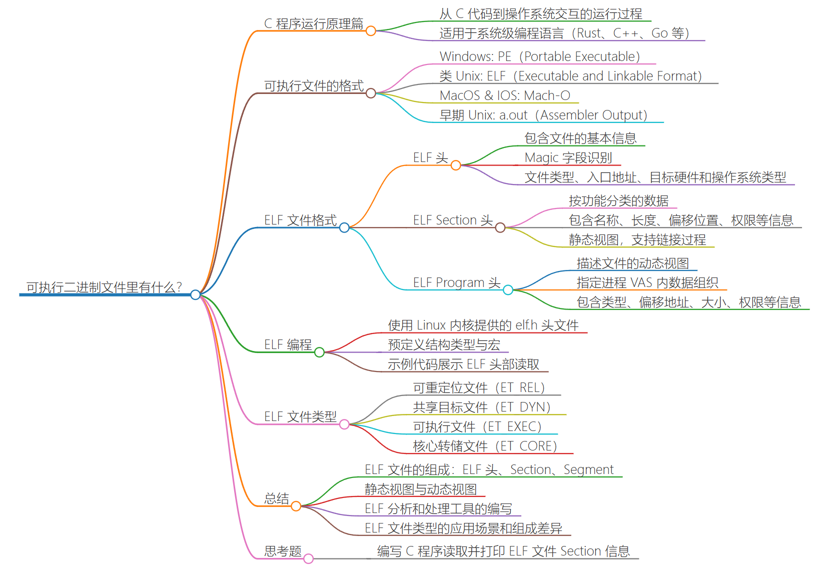
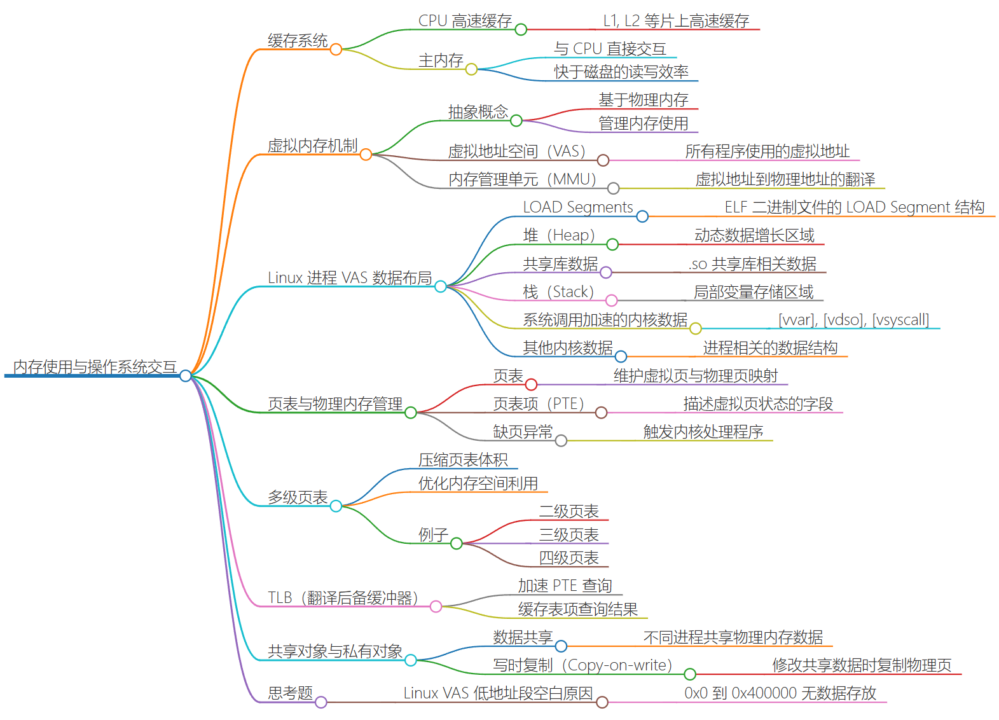
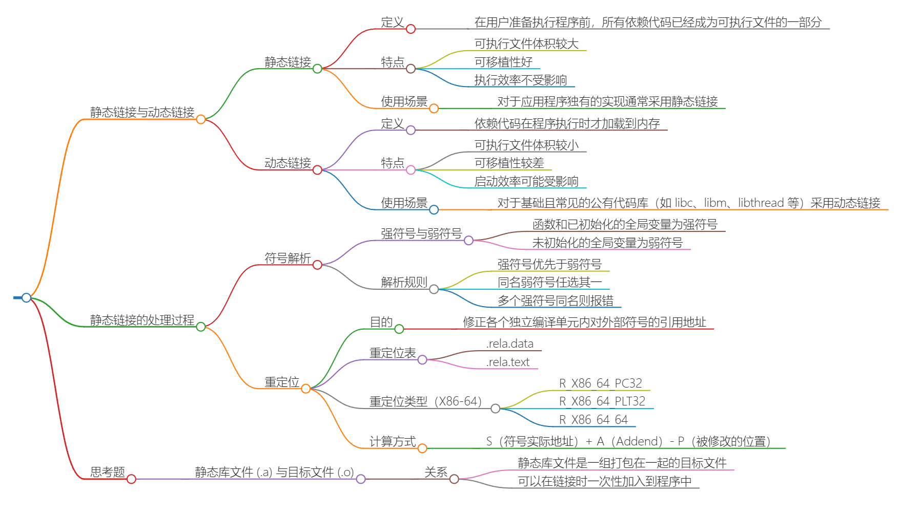
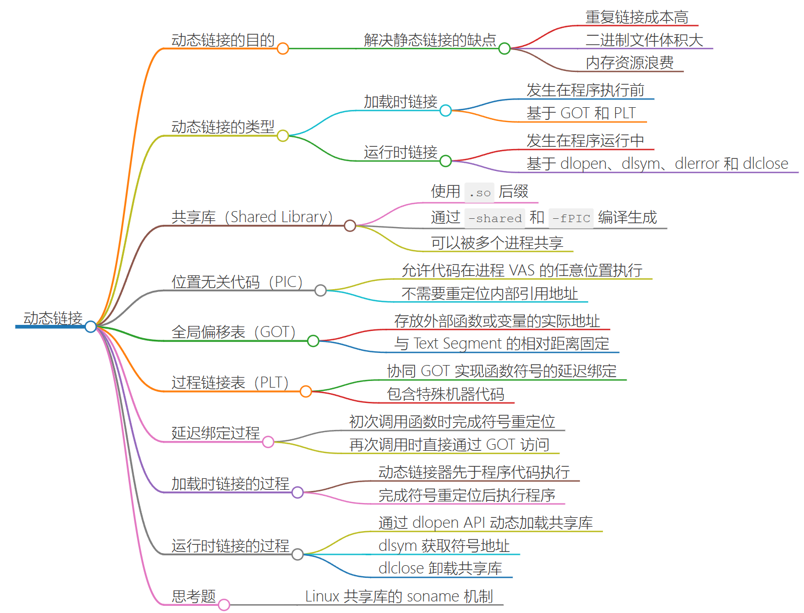
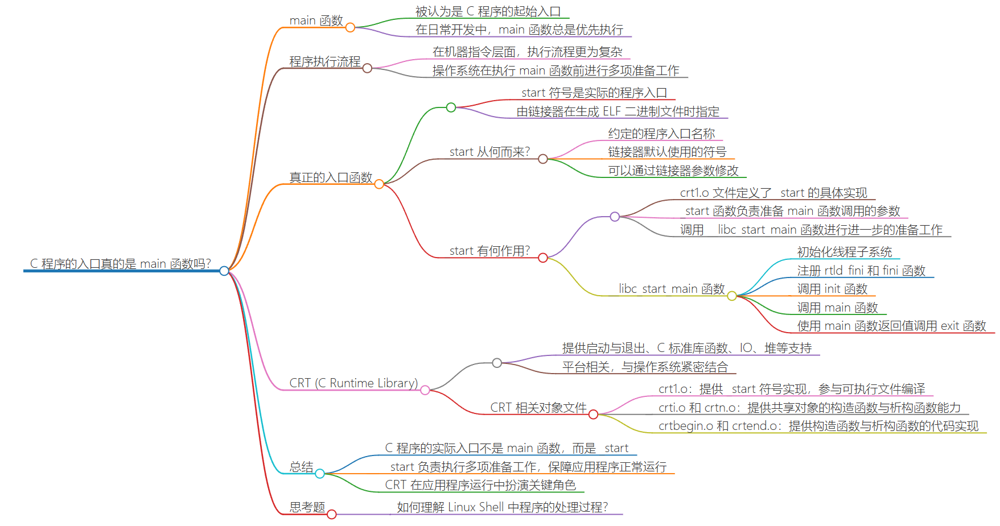
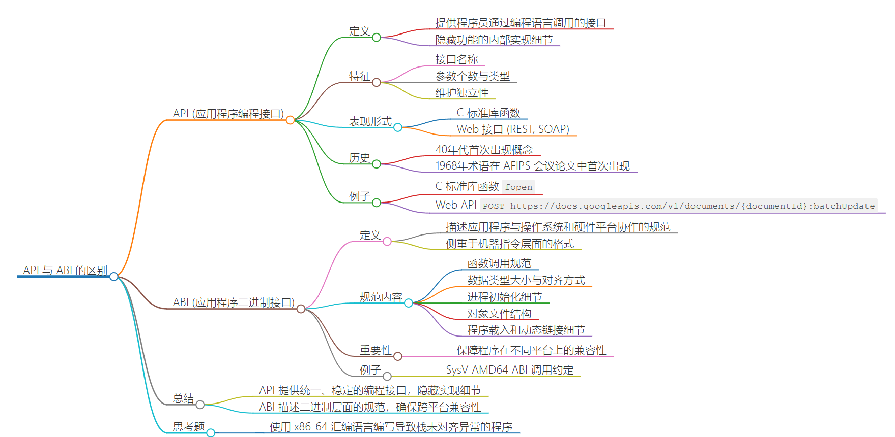
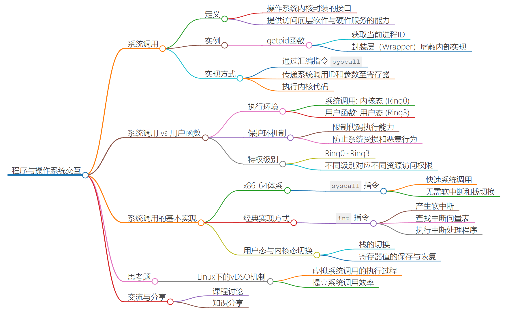

## 1｜可执行二进制文件里有什么？

## 2｜进程是如何使用操作系统内存的？

## 3｜编译器在链接程序时发生了什么？

> 编译器：
>
> 1. 词法分析：提取出每一个单词字符
> 2. 语法分析：这些token想表达什么意思
> 3. 语义分析：语法树是否合理
> 4. 生成中间代码：根据语法树生成中间代码
> 5. 中间代码优化
> 6. 代码生成

## 4｜程序可以在运行时进行链接吗？

## 5｜C 程序的入口真的是 main 函数吗？

#### 思考题

如何理解 Linux Shell 中程序的处理过程？可以自己写一个？看看资料？

[【技术杂谈】shell和terminal_哔哩哔哩_bilibili](https://www.bilibili.com/video/BV16A411675V/?spm_id_from=333.337.search-card.all.click)

## 6｜ABI 与 API 究竟有什么区别？

## 7｜程序如何与操作系统交互？

