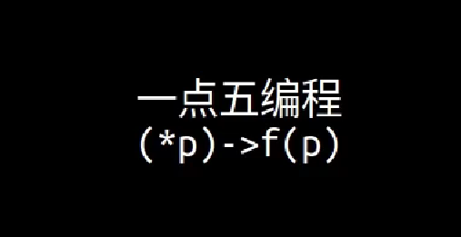

## OPF Programming

[OPF Programming (opf-programming.github.io)](https://opf-programming.github.io/index.html)




- 一

    模块化编程：学习使用struct的本质

    [C结构体的本质 - 写程序讲解_哔哩哔哩_bilibili](https://www.bilibili.com/video/BV1Nc411q7g6/?spm_id_from=333.999.0.0&vd_source=ecc99d78ae961113010161a48a475a35)

    

- 点五
    - 函数指针的核心用法

        [一点五编程的核心技巧 - 函数指针的正确用法_哔哩哔哩_bilibili](https://www.bilibili.com/video/BV1zp4y1o7Qo/?spm_id_from=333.999.0.0&vd_source=ecc99d78ae961113010161a48a475a35)

    - 识别模式

        [C语言指针高级用法 入门课 - 识别模式_哔哩哔哩_bilibili](https://www.bilibili.com/video/BV1DN4y1z71q/?spm_id_from=333.999.0.0&vd_source=ecc99d78ae961113010161a48a475a35)

        [闭包，Lambda表达式，和函数指针的区别 - 写JS和C程序解释_哔哩哔哩_bilibili](https://www.bilibili.com/video/BV16T4y1s7Ts/?spm_id_from=333.999.0.0&vd_source=ecc99d78ae961113010161a48a475a35)


## Function pointer & Polymorphism

#### Implementation

```c
//printer.h
#ifndef _PRINTER_H
#define _PRINTER_H

typedef void (*printer_print_fn)(void *printer, const char *str);

struct printer_i {
    printer_print_fn print;
};

#endif

```

```c
// color_printer.c

struct color_printer {
    const struct printer_i *interface;
    int enable_color;
    const char *color_command;
    char *buf;
};

void color_printer_print(struct color_printer *self, const char *str);

static const struct printer_i printer_interface = {
    .print = (printer_print_fn)color_printer_print,
};

struct color_printer *color_printer_new(const char *color_command) {
    struct color_printer *self;

    self = malloc(sizeof(struct color_printer));
    assert(self != NULL);

    self->interface = &printer_interface;
    self->color_command = color_command == NULL ? "\033[31;40m" : color_command;
    self->enable_color = 1;

    self->buf = malloc(100);
    assert(self->buf != NULL);

    return self;
}

void color_printer_cleanup(struct color_printer *self) {
    free(self->buf);
    free(self);
}

void color_printer_print(struct color_printer *self, const char *str) {
    if (self->enable_color) {
        printf("%s%s\033[0m", self->color_command, str);
    } else {
        printf("%s", str);
    }
}

void color_printer_disable_color(struct color_printer *self) {
    self->enable_color = 0;
}

```

```c
//plain_printer.c
struct plain_printer {
    const struct printer_i *interface;
    const char *prefix;
};

void plain_printer_print(struct plain_printer *self, const char *str);

static const struct printer_i printer_interface = {
    .print = (printer_print_fn)plain_printer_print,
};

struct plain_printer *plain_printer_new(const char *prefix) {
    struct plain_printer *self;

    self = malloc(sizeof(struct plain_printer));
    assert(self != NULL);

    self->interface = &printer_interface;
    self->prefix = prefix;

    return self;
}

void plain_printer_cleanup(struct plain_printer *self) {
    free(self);
}

void plain_printer_print(struct plain_printer *self, const char *str) {
    printf("%s%s", self->prefix, str);
}

```

```c
//main.c
#include <stdio.h>
#include <stdlib.h>
#include "printer.h"
#include "color_printer.h"
#include "plain_printer.h"

int main(int argc, char *argv[]) {
    struct plain_printer *p1;
    struct plain_printer *p2;

    struct color_printer *p3;
    struct color_printer *p4;

    struct printer_i **p;

    printf("\n\n");
    p1 = plain_printer_new(">>> ");
    p2 = plain_printer_new("~~~ ");
    p3 = color_printer_new("\033[31;47m");  //前景是红色，背景是白色
    p4 = color_printer_new("\033[30;42m");  //前景是黑色，毕竟是绿色


    p = (struct printer_i **)p1;
    (*p)->print(p, "hello from p1.");
    
    p = (struct printer_i **)p2;
    (*p)->print(p, "hello from p2.");

    p = (struct printer_i **)p3;
    (*p)->print(p, "hello from p3.");
 
    p = (struct printer_i **)p4;
    (*p)->print(p, "hello from p4.");
 
    color_printer_disable_color(p4);

    (*p)->print(p, "hello from p4.");


    printf("\n\n");

    plain_printer_cleanup(p1);
    plain_printer_cleanup(p2);
    color_printer_cleanup(p3);
    color_printer_cleanup(p4);

    return 0;
}
```


#### Recognize patterns

**关键：/* 指向struct的指针可以转换为指向struct的第一个成员的的指针 */**


- **Q1：为什么要用struct printer_i 二重指针？这个二重指针的含义是什么？**

    首先这个 `print` 指针，指向的要么是 `plain_printer_print`，要么是 `color_printer_print`。

    以 `plain_printer_print` 为例，它的第一个参数是 struct plain_printer * ，

    **==由于 struct plain_printer 的第一个字段（offset为0的地方）是一个 struct printer_i *==** ,所以 `struct plain_printer *` 可以看做一个  `struct printer_i **` 。 

    同理 `struct color_printer *` 也可以看做一个  `struct printer_i **` 。	

    用同一个类型把不同结构体统一起来了，这就是这个做法巧妙的地方。

- **Q2：为什么不能用p1->interface->print(p1, "hello from p1")，这样子写有什么好处呢？还有为什么要搞一个struct_i装指针函数，直接在color/plain的结构体里创建不好吗？**

    1. 对于某一个函数，它的参数同时能支持传入 `color_printer` 和 `plain_printer`，这个时候二重指针的价值就凸显出来了。
    
        也就有点像多态了，**“不同的对象对同一个消息做出不同的响应”**。
    
    2. 假如：只定义一个结构体
    
        ```c
        struct count_normal
        {
            int count;
            int add;
            void (*count_add)(struct count_normal *P);
        };
        
        void app(struct count_normal **c);
        ```
    
        那以后如果定义了两个不同的结构体（不同的对象：猫/狗），你就会发现，不知道 app 的参数应该给什么类型了。 
    
        这里之所以有 `counter_i`，就是为了**做一层抽象**，
    
        不管你结构体怎么定义的，有哪些方法，只要我最终能够通过 `(*p)->fn(p)` 来使用，那么你就能把它传给 app 函数。


- **Supplement: 多态(Polymorphism)**

    > 多态是面向对象编程中的一个重要概念，它允许不同的对象对同一个消息做出不同的响应。简而言之，多态性允许同一个函数名或方法名在不同的对象实例上表现出不同的行为。
    >
    > 在面向对象的编程语言中，多态性通常通过继承和重写来实现。当子类重写父类的方法时，可以根据具体的对象类型来调用相应的方法。
    >
    > 举个比较生动的例子来解释多态性：假设有一个动物类，它有一个方法叫做“发出声音”。然后有两个子类，一个是狗类，一个是猫类，它们分别重写了“发出声音”的方法。当我们对一个狗对象和一个猫对象调用“发出声音”方法时，由于多态性的存在，狗对象会发出“汪汪”的声音，而猫对象会发出“喵喵”的声音，尽管它们调用的是同一个方法。
    >
    > 在C语言中，由于其较为底层的特性，没有直接的类和对象的概念，因此实现多态性需要通过函数指针或者结构体指针来模拟。下面是一个简单的例子：
    >
    > ```c
    > #include <stdio.h>
    > 
    > // 定义动物结构体
    > typedef struct {
    >     void (*makeSound)(); // 函数指针，模拟发出声音的方法
    > } Animal;
    > 
    > // 狗的发出声音方法
    > void dogSound() {
    >     printf("汪汪\n");
    > }
    > 
    > // 猫的发出声音方法
    > void catSound() {
    >     printf("喵喵\n");
    > }
    > 
    > int main() {
    >     Animal dog;
    >     dog.makeSound = &dogSound; // 将发出声音的方法指向狗的发出声音方法
    >     Animal cat;
    >     cat.makeSound = &catSound; // 将发出声音的方法指向猫的发出声音方法
    > 
    >     // 通过调用相同的方法名，实现不同的行为
    >     dog.makeSound(); // 输出：汪汪
    >     cat.makeSound(); // 输出：喵喵
    > 
    >     return 0;
    > }
    > ```
    >


## Closure

```c
#include <stdio.h>

typedef int(*increase_fn)(void *counter);

struct counter_i
{
    increase_fn increase;
};


/*
 * normal counter 
 *
 */
/* 指向struct的指针可以转换为指向struct的第一个成员的的指针 */
struct normal_counter
{
    const struct counter_i *interface;
    int count;
};

int normal_counter_increase(struct normal_counter *self);

static struct counter_i normal_counter_interface = {
    .increase = (increase_fn)normal_counter_increase,
};

void normal_counter_init(struct normal_counter *self)
{
    self->count = 0;
    self->interface = &normal_counter_interface;
}

int normal_counter_increase(struct normal_counter *self)
{
    return self->count++;
}


/*
 * skip counter
 */
struct skip_counter
{
    const struct counter_i *interface;
    int count;
};

int skip_counter_increase(struct skip_counter *self);

static struct counter_i skip_counter_interface = {
    .increase = (increase_fn)skip_counter_increase,
};

void skip_counter_init(struct skip_counter *self)
{
    self->count = 0;
    self->interface = &skip_counter_interface;
}

int skip_counter_increase(struct skip_counter *self)
{
    int r;
    r = self->count;
    self->count += 2;
    return r;
}


void app(struct counter_i **c, const char *prefix)
{
    int i = 0, r;
    for(i = 0; i < 2; i++)
    {
		r = (*c)->increase(c);
		printf("%s is now %d\n", prefix, r);
    }
}


int main(int argc, char **argv)
{
    struct normal_counter counter0;
    struct normal_counter counter1;
    struct skip_counter counter2;

    normal_counter_init(&counter0);
    normal_counter_init(&counter1);
    skip_counter_init(&counter2);

    app((struct counter_i **)&counter0, "0");
    app((struct counter_i **)&counter1, "1");
    app((struct counter_i **)&counter2, "2");

    return 0;
}

```

内容其实和上面函数指针那部分的内容很像！


#### 补充资料

找到了 12 篇资料作为参考：

正在尝试为您在互联网搜索相关资料...

开始获取资料...

找到了第 1 篇资料：[GitHub Top 10 + C 语言开源项目（2021版） - 知乎](https://zhuanlan.zhihu.com/p/408121090)

找到了第 2 篇资料：[详解嵌入式C语言的函数指针与回调函数 - 知乎](https://zhuanlan.zhihu.com/p/448364800)

找到了第 3 篇资料：[ClosuresKit：强大的Swift闭包工具库-CSDN博客](https://blog.csdn.net/gitblog_00090/article/details/137495062)

找到了第 4 篇资料：[结构体指针，C语言结构体指针详解](https://c.biancheng.net/view/246.html)

找到了第 5 篇资料：[【每日精选时刻】EdgeOne与HAI的梦幻联动；Go语言学习 ...](https://cloud.tencent.com/developer/article/2407982)

找到了第 6 篇资料：[C开源项目排行榜, GitHub上最受欢迎的C项目推荐 | GitHub ...](https://www.github-zh.com/top/C)

找到了第 7 篇资料：[C语言与数学库接口：使用GSL、BLAS/LAPACK进行数值 ...](https://blog.csdn.net/weixin_56154577/article/details/137631028)

找到了第 8 篇资料：[C语言中闭包的探究及比较 - 阿里云开发者社区](https://developer.aliyun.com/article/17772)

找到了第 9 篇资料：[结构体数组与指针与函数及应用案例_结构体指针函数-CSDN博客](https://blog.csdn.net/qq_60055052/article/details/122730273)

找到了第 10 篇资料：[C语言函数指针（结构体函数指针） - CSDN博客](https://blog.csdn.net/Dontla/article/details/118546584)

找到了第 11 篇资料：[C语言结构体中的函数指针 - wuyudong - 博客园](https://www.cnblogs.com/wuyudong/p/function-pointer-in-c-struct.html)

找到了第 12 篇资料：[C语言中结构体在函数中的应用_c语言结构体用于函数-CSDN博客](https://blog.csdn.net/lpp1989/article/details/7616068)

一共找到 12 篇资料，正在阅读...

找到了 12 篇资料作为参考：

在软件开发中，使用结构体指针和函数指针的结合可以带来很多实际的好处，它们可以解决一些特定的问题，并在许多大型开源项目中得到应用。以下是一些具体的例子和应用场景：

1. **回调机制**2: 回调函数是C语言中的一个重要概念，它允许将一个函数作为参数传递给另一个函数。这种做法在需要动态决定执行哪个函数时非常有用。例如，在事件驱动的编程中，当某个事件发生时，系统可能需要执行多个不同的处理函数，这些函数可以通过函数指针作为回调传递给事件处理系统。这种方式在很多大型项目中都有应用，如操作系统的驱动程序开发、网络编程中的异步I/O处理等。
2. **策略模式**11: 在设计模式中，策略模式是一种常见的使用结构体指针和函数指针的模式。它允许在运行时选择算法的行为。例如，你可以定义一个操作的结构体，其中包含一个函数指针，指向执行特定操作的函数。这样，你可以创建多个不同的策略，每个策略都有自己实现的操作函数。在大型项目中，这种模式可以用于实现可插拔的组件，如图形渲染引擎中的渲染策略、文本编辑器中的不同排序算法等。
3. **模块化和扩展性**2: 通过使用结构体指针和函数指针，可以增加代码的模块化和扩展性。例如，在一个大型的软件系统中，可能需要根据不同的配置选择不同的处理流程。通过定义一个处理流程的结构体，其中包含函数指针，可以在不修改原有代码的情况下，通过更换函数指针来改变处理流程。这种方式在很多开源项目中都有应用，如Linux内核中的模块化驱动程序、大型游戏引擎中的游戏逻辑模块等。
4. **代码复用**8: 结构体指针和函数指针的结合也可以用于代码复用。例如，你可以定义一个通用的数据结构，其中包含函数指针，用于处理数据。然后，根据不同的需求，实现不同的处理函数。这样，同一个数据结构可以用于多种不同的场景，而无需重复编写相同的代码。在开源项目中，这种用法常见于库的API设计，如著名的数学库GSL7，它提供了一套通用的数学函数，并通过清晰的接口和函数指针的使用，使得科学计算变得更加简单。

以上例子展示了结构体指针和函数指针在实际项目中的应用意义和解决问题的能力。通过这些技术，开发者可以编写出更加灵活、可扩展和可维护的代码。
