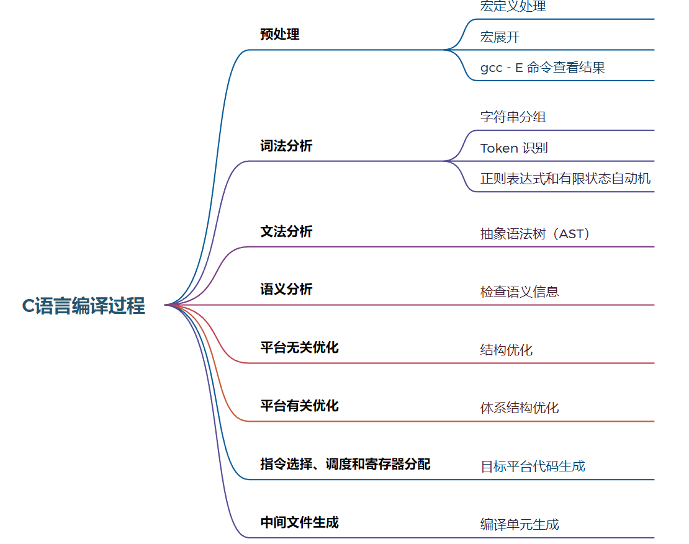
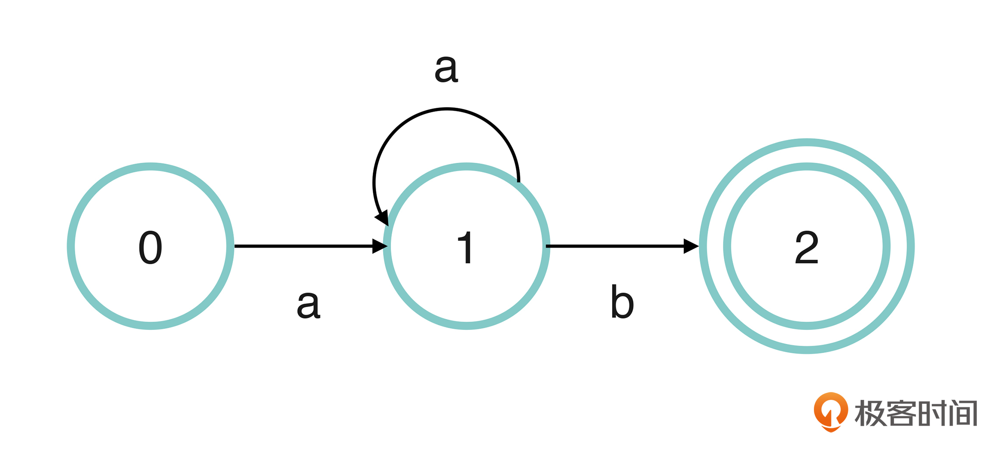
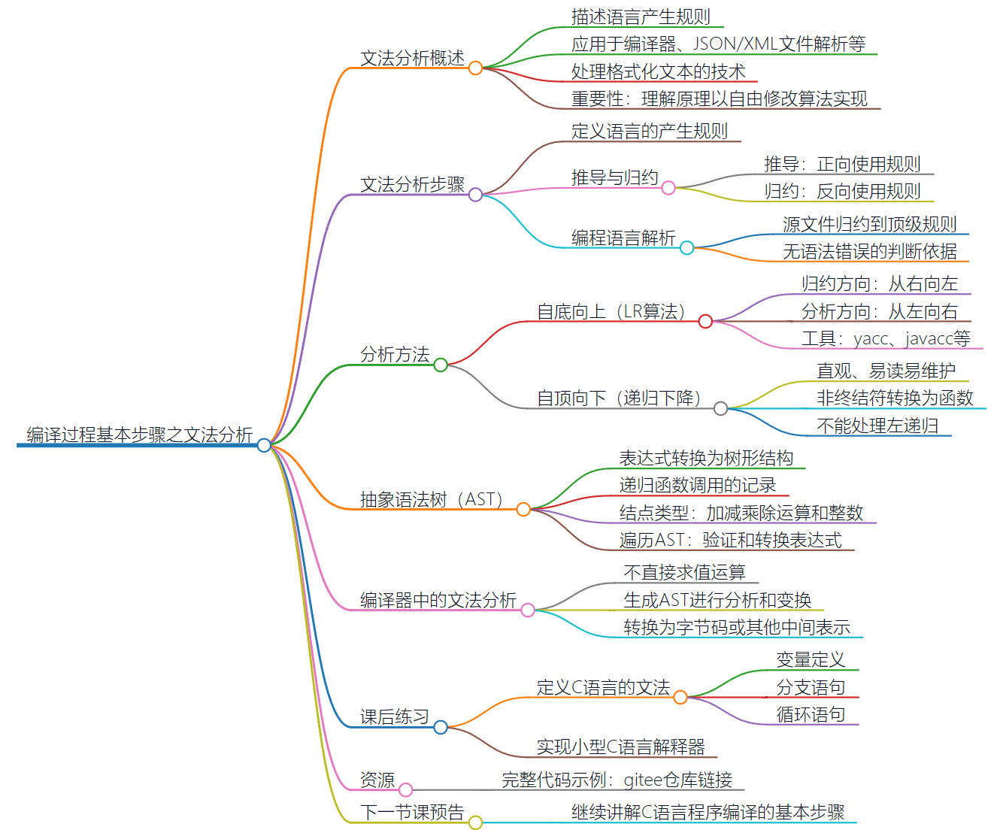
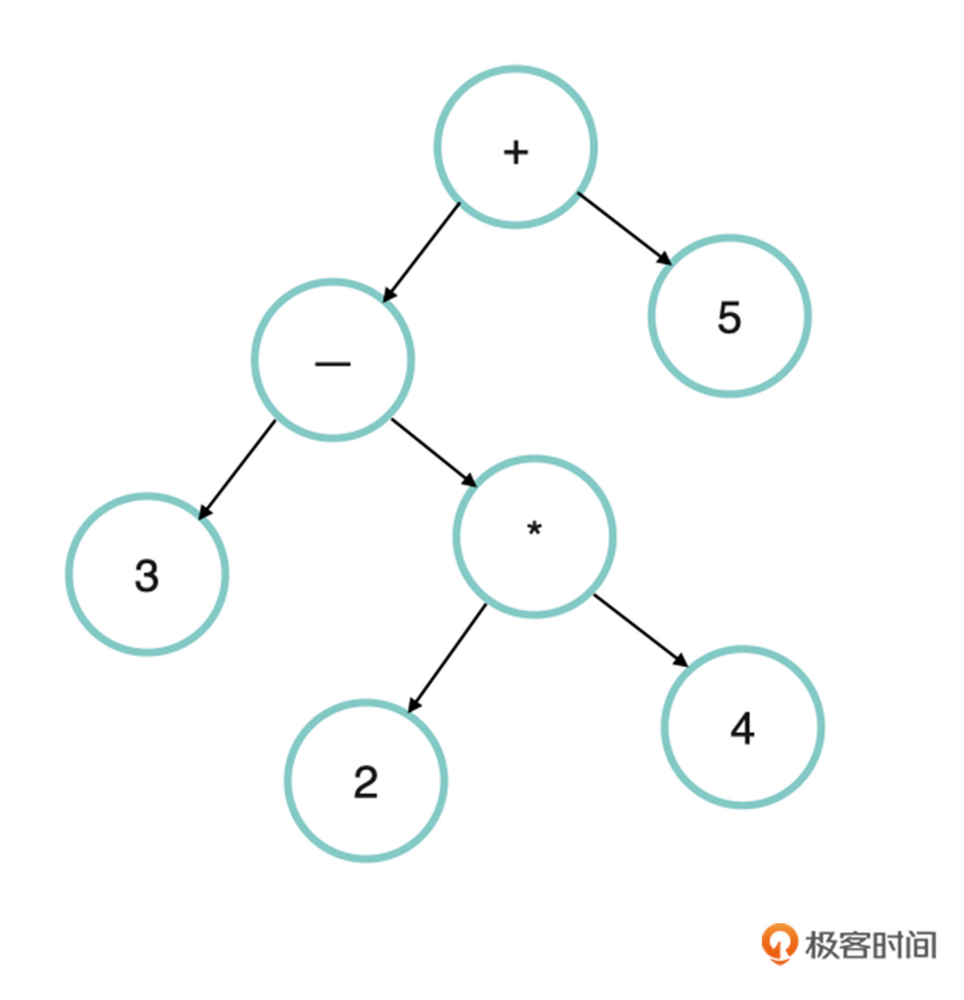

## 宏观体系

[【技术杂谈】C编译体系_哔哩哔哩_bilibili](https://www.bilibili.com/video/BV1J14y1D7Sw/?spm_id_from=333.999.0.0&vd_source=ecc99d78ae961113010161a48a475a35)

#### 常用编译选项和编译各个流程

熟练常用参数吗，知道怎么使用即可，不常见的会查文档


#### 多文件和第三方库

- C软件包结构
- apt


#### C运行时库 跨平台和交叉编译

- <arch>-<OS>-<libc>
- 加拿大编译


## C语言编译过程

编译主要可以分为以下几个步骤：

1. **预处理**：主要是处理宏定义，将宏定义展开，这一步所使用的技术一般只涉及字符串替换；

编译器流程

2. 编译器前端

    1. **词法分析**：将文本转成 token 序列；
    2. **文法分析**，将 token 序列转成抽象语法树；

    3. **语义分析**：文法只能检查局部的信息，有一些语义信息需要在这一步检查，例如非 void 的函数漏写 return 语句；

    > 后面 2词法分析 和 3文法分析 项目实现一个小型 C 语言编译器前端。它将源代码翻译成了 AST，而且支持了变量定义和赋值，if 语句和 while 语句。

3. 中端

    负责优化生成的中间表示形式

    1. **平台无关优化**：与具体的平台（体系结构）无关的结构优化，往往与语义相关；
    2. **平台相关优化**：与具体的体系结构相关的优化，例如考虑平台的缓存和流水线设计而做出的优化；

4. 后端

    将中间表示翻译成目标平台的机器码，并生成相应平台的可执行程序
    
    1. **指令选择**：调度和寄存器分配，主要是**将优化后的中间表示形式转换为后端为目标平台生成代码**；
        1. 机器代码、汇编代码
    2. **中间文件生成**：编译过程结束，一个编译单元会生成一个中间文件。

> 对于中端和后端，实现一个简单基于栈的字节码和虚拟机




## 1. 预处理

```C
#include <stdio.h>

#ifdef USE_MACRO
#define square(x) (x)*(x)
#else
inline int square(int x) {
    return x * x;
}
#endif

int main() {
    int a = 3;
    int b = square(++a);
    printf("%d\n", b);
    return 0;
}
```

```C
// 练习：
#include <stdio.h>

#define TYPE_Apple 1
#define TYPE_Pear  2

struct Fruit {
    int _type;
    char* _name;
};

#define DECLARE(x) \
struct Fruit x = {      \
    TYPE_##x,           \
    #x,                 \
};

DECLARE(Apple)
DECLARE(Pear)

int main() {
    printf("%d, %s\n", Apple._type, Apple._name);
    printf("%d, %s\n", Pear._type, Pear._name);
    return 0;
}
```


## 2. 词法分析

词法分析用于将每一行代码中的字符进行分组，有意义的分到一组，每个组就是一个词。**词法分析主要在于：词法分析器**

例如，`double PI = 3.1415926` 

> 人们在理解它的时候是先把它分成了这四个小组：（“double”，类型声明）、（“PI”，变量名）、（“=”，赋值操作符）、（“3.1415926”，浮点立即数）。

词法分析通过一个叫Token的东西来分组。我们这里把 Token 称为词法单元，代表一个词的意思。

> Token 这个术语在计算机学科中经常出现，在不同的场景中代表不同的含义。例如在网络中，它被翻译成“令牌”，在客户端和服务端通信的场景中，token 又被作为授权验证的加速手段。

词法分析的主要手段：

- 正则表达式

- 有限状态自动机（主要讲这个）

    > 有限状态自动机由一个有限的内部状态集合和一组控制规则组成，
    >
    > 这些规则是用来控制在当前状态下可以接受什么输入，以及接受这些输入以后应转向什么状态

> 
>
> 在这张图片中，状态 0 是自动机的初始状态，从状态 0 出发的箭头号标上了字母 a，表示这个状态可以接受字母 a，进入状态 1 。
>
> 从状态 1 出发的箭头有两条，分别是指回自己的箭头 a，和指向状态 2 的箭头 b。也就是说，状态 1 接受字母 a，仍然回到了状态 1，这就意味着自动机可以在状态 1 的情况下，接受无穷多个字母 a。而箭头 b 则意味着状态 1 还可以接受字母 b，变成状态 2。
>
> 状态 2 是比较特殊的一个状态，我们使用两个圈来绘制它，这代表它是一个终态。如果自动机进入到终态以后，就表示自动机完成了一次匹配。
>
> 实际上，这个自动机代表了这样一种模式：“a+b”，其中的加号表示，至少包含一个 a，并且以 b 结尾的字符串。
>
> 例如`“aab” “ab”`，都符合“a+b”这个模式。这里你可以自己练习一下，当输入是这两个字符的时候，自动机的状态是如何变化的。

如何通过代码实现一个自动机？我们可以使用一个整型变量 state 来代表自动机的状态，然后根据输入，不断地改变这个变量。

> 之前蓝桥杯写的那个按键功能：就是状态机


#### 词法分析器

1. 先创建代码所需的数据结构：

2. 实现创建 Token 和 销毁 Token 函数

3. 实现 next_token：从字符串中分割单词，每次调用一个 next_token 就生成一个 token：

4. main函数测试：

    根据下面代码的分布，大概也可以对应上面过程的四步：

    ```C
    #include <stdio.h>
    #include <stdlib.h>
    #include <string.h>
    
    enum State{
        STATE_INIT,     /* 有限状态自动机的初始化 */
        STATE_VAR,      /* 接受字符的状态 */
    };
    
    enum TokenType{
        TT_VAR,
        TT_INTEGER,
        TT_STRING,
    };
    
    union TokenValue{
        char *_str;
        int _int;
    };
    
    struct Token{
        enum TokenType _type;
        union TokenValue _value;
    };
    
    enum State state =  STATE_INIT;
    char *cur;
    
    struct Token *create_token(enum TokenType tt, char *begin, char *cur){
        struct Token *nt = (struct Token*)malloc(sizeof(struct Token));
        nt->_type = tt;
    
        /* 这里只需要对变量进行处理，等号、分号等符号只需要类型就够了。*/
        if (tt == TT_VAR) {
            nt->_value._str = (char *)malloc(cur - begin + 1);
            strncpy(nt->_value._str, begin, cur - begin);
            nt->_value ._str[cur-begin] = 0;
        }
    
        return nt;
    }
    
    void destroy_token(struct Token *t){
        /* token 是变量的的时候才需要free，和上面malloc一样 */
        if (t->_type == TT_VAR) {
            free(t->_value._str);
            t->_value._str = NULL;
        }
    
        free(t);
    }
    
    /* Version0.1 */
    /* 典型的自动机实现 */
    /* 优化一下，使用Tagged Union? */
    struct Token * next_token(void) {
        state = STATE_INIT;
        char *begin = 0;
    
        while (*cur) {
            char c = *cur;
            if (state == STATE_INIT) {
                /* 在初态下，遇到空格、换行、制表等都可以跳过 */
                if (c == ' ' || c == '\n' || c == '\t') {
                    cur++;
                    continue;
                }
                
                /* 遇到字符就认为是一个变量的开始。（C语言变量只能有字母和下划线开头） */
                if ((c <= 'z' && c >= 'a') || 
                    (c <= 'Z' && c >= 'A') || c == '_') {
                    begin = cur;
                    state = STATE_VAR;
                    cur++;
                }
            } else if (state == STATE_VAR) {
                /* 当前状态机处于分析变量的阶段，所以可以继续接受字母和数字 */
                if ((c <= 'z' && c >= 'a') || 
                    (c <= 'Z' && c >= 'A') || 
                    (c <= '9' && c >= '0') || c == '_') {
                    cur++;
                } else {
                    /* 变量分析完成 */
                    return create_token(TT_VAR, begin, cur);
                }
            }
    
        }
    
        return NULL;
    }
    
    int main(int argc, char **argv){
        cur = "init val1 = 1;";
    
        struct Token *t = next_token();
        printf("%d, %s\n", t->_type, t->_value._str);
        destroy_token(t);
    
        t = next_token();
        printf("%d, %s\n", t->_type, t->_value._str);
        destroy_token(t);
    
        return  0;
    }
    
    ```

    

5. 进一步完善

    上面的代码只实现了对于变量的赋值。进一步改进：实现对等号的判断、对整数、对分号的判断：

    自己的版本：

    ```C
    #include <stdio.h>
    #include <stdlib.h>
    #include <string.h>
    
    enum State{
        STATE_INIT,     /* 状态机初始化 */
        STATE_VAR,      /* 变量 */
        STATE_EQU,      /* 等号 */
        STATE_NUM,      /* 整数 */
    };
    
    enum TokenType{
        TT_VAR,
        TT_INTEGER,
        TT_STRING,
        TT_ASSIGN,
    };
    
    union TokenValue{
        char *_str;
        int _int;
    };
    
    struct Token{
        enum TokenType _type;
        union TokenValue _value;
    };
    
    enum State state =  STATE_INIT;
    char *cur;
    
    struct Token *create_token(enum TokenType tt, char *begin, char *cur){
        struct Token *nt = (struct Token*)malloc(sizeof(struct Token));
        nt->_type = tt;
    
        /* 这里只需要对变量进行处理，等号、分号等符号只需要类型就够了。*/
        if (tt == TT_VAR) {
            nt->_value._str = (char *)malloc(cur - begin + 1);
            strncpy(nt->_value._str, begin, cur - begin);
            nt->_value ._str[cur-begin] = 0;
        } else if (tt == TT_INTEGER) {
            
            int sum = 0;
            for (char *p = begin; p < cur; p++) {
               sum *= 10;
               sum += (*p - '0');
            }
            nt->_value._int = sum; 
            
           //  nt->_value._int = atoi(begin);
        } else if (tt == TT_ASSIGN) {
            nt->_value._str = (char *)malloc(cur - begin + 1);
            strncpy(nt->_value._str, begin, cur - begin);
            nt->_value ._str[cur-begin] = 0;
        } 
    
        return nt;
    }
    
    void destroy_token(struct Token *t){
        /* token 是变量的的时候才需要free，和上面malloc一样 */
        if (t->_type == TT_VAR) {
            free(t->_value._str);
            t->_value._str = NULL;
        }
    
        free(t);
    }
    
    struct Token * next_token(void) {
        state = STATE_INIT;
        char *begin = 0;
    
        while (*cur) {
            char c = *cur;
            if (state == STATE_INIT) {
                /* 在初态下，遇到空格、换行、制表等都可以跳过 */
                if (c == ' ' || c == '\n' || c == '\t') {
                    cur++;
                    continue;
                }
                
                /* 遇到字符就认为是一个变量的开始。（C语言变量只能有字母和下划线开头） */
                if ((c <= 'z' && c >= 'a') || 
                    (c <= 'Z' && c >= 'A') || c == '_') {
                    begin = cur;
                    state = STATE_VAR;
                    cur++;
                } else if (c == '=') {
                    /* 初始状态就遇到等号，无法判断是赋值操作还是等于
                     * 进一步--> 看后面的一个字符才知道。
                     * 后面那个是' = '才是等于符号
                     */
                    begin = cur;
                    state = STATE_EQU;
                    cur++;
                }
    
                if (c <= '9' && c >= '0') {
                    begin = cur;
                    state = STATE_NUM;
                    cur++;
                }
    
            } else if (state == STATE_VAR) {
                /* 当前状态机处于分析变量的阶段，所以可以继续接受字母和数字 */
                if ((c <= 'z' && c >= 'a') || 
                    (c <= 'Z' && c >= 'A') || 
                    (c <= '9' && c >= '0') || c == '_') {
                    cur++;
                } else {
                    /* 变量分析完成 */
                    return create_token(TT_VAR, begin, cur);
                }
    
            } else if (state == STATE_EQU) {
                if (c == '=' ) {
                    /* 先不处理 */
                } else {
                    return create_token(TT_ASSIGN ,begin, cur);
                }
            } else if (state == STATE_NUM) {
                if (c <= '9' && c >= '0') {
                    cur++;
                }else {
                    return create_token(TT_INTEGER, begin, cur);
                }
            } 
    
        }
    
        return NULL;
    }
    
    
    /* 
     * Version0.1 
     * 只实现了简单的变量处理
     *
     */
    /* 典型的自动机实现 */
    /* 优化一下，使用Tagged Union? */
    #ifdef Token_Version1
    struct Token * next_token(void) {
        /* 每次进来（每次分析一个Token）都是一个状态机的运作。 */
        state = STATE_INIT;
        char *begin = 0;
    
        while (*cur) {
            char c = *cur;
            if (state == STATE_INIT) {
                /* 在初态下，遇到空格、换行、制表等都可以跳过 */
                if (c == ' ' || c == '\n' || c == '\t') {
                    cur++;
                    continue;
                }
                
                /* 遇到字符就认为是一个变量的开始。（C语言变量只能有字母和下划线开头） */
                if ((c <= 'z' && c >= 'a') || 
                    (c <= 'Z' && c >= 'A') || c == '_') {
                    begin = cur;
                    state = STATE_VAR;
                    cur++;
                }
            } else if (state == STATE_VAR) {
                /* 当前状态机处于分析变量的阶段，所以可以继续接受字母和数字 */
                if ((c <= 'z' && c >= 'a') || 
                    (c <= 'Z' && c >= 'A') || 
                    (c <= '9' && c >= '0') || c == '_') {
                    cur++;
                } else {
                    /* 变量分析完成 */
                    return create_token(TT_VAR, begin, cur);
                }
            }
    
        }
    
        return NULL;
    }
    #endif
    
    int main(int argc, char **argv){
        cur = "init val1 1224 = ;";
    
        //    strncpy(cur, "init val1 1224 = ;", 20);
    
        struct Token *t = next_token();
        printf("%d, %s\n", t->_type, t->_value._str);
        destroy_token(t);
    
        t = next_token();
        printf("%d, %s\n", t->_type, t->_value._str);
        destroy_token(t);
    
        t = next_token();
        printf("%d, %d\n", t->_type, t->_value._int);
        destroy_token(t);
    
        t = next_token();
        printf("%d, %s\n", t->_type, t->_value._str);
        destroy_token(t);
        return  0;
    }
    
    ```

    


## 3. 文法分析（语法分析）



文法分析技术不只用于编译器中，在 JSON 文件解析、XML 文件解析等场景中也被广泛地使用，它其实是一种处理格式化文本的技术。

所以这节课，你要掌握的不仅是文法分析的具体技术，==**更重要的是要理解它处理格式化文本的原理**==。

只有深刻地理解了原理，我们才能做到在具体的场景中，根据需要自由地修改算法的实现。

> 总结：
>
> 文法是一套语言产生的规则，根据文法规则来判断源文件是否符合文法的过程就是文法分析。
>
> 文法分析的方法主要分为两种，分别是自顶向下和自底向上的分析方法。其中，自底向上主要采用归约的办法，将终结符归约成顶级的非终结符，**多数自动化工具( `yacc`、`javacc` )**都是采用了这种方法。而自顶向下的分析方法则比较简单明了，更符合人的直观思维。自顶向下的分析方法简单地将非终结符转换成函数，把或结构转换成 if 语句，把多项结构转换成 while 语句。所以这种分析方法是不能处理左递归的，但是所有的左递归文法都可以按一定的模式转换成右递归的。
>
> 在编译器里，文法分析并不是直接对源文件进行求值运算的，而是会生成抽象语法树。它本质上是一棵树，我们可以通过遍历这棵树，对它进行各种变换，比如转换成字节码，或者其他的中间表示，等等。这些内容我将会在下节课进行讲解。


#### 简单理解

- 主谓宾

    S（Subject）、P（Predicate）、O（Object）

- 终结符和非终结符

    ```text
    S → Tom∣Mary
    P → play∣eat
    O → basketball∣apple
    ```

    主语 S 可以继续推导，但 Tom 或者 Mary 则不能再继续推导下去了。这样，人们就把可以推导下去的符号称为非终结符，例如 Sent、S 都是非终结符，P 和 O 当然也是非终结符；同时把不可以继续推导的符号称为终结符，例如 Mary 和 Tom。


实际上，我们听懂一个句子就是下面这个过程，只不过是我们从小到大一直习惯了，一瞬间就明白。

- 归约

    抽象到最上层？

- 推导

    由最上层抽象逐渐到实际的？

比如一个句子中有：主谓宾，我打篮球

最上层的抽象是主谓宾，下层是具体到句子中的 “我” 和 “打” 和 “篮球”


> 将源代码归约到顶级规则的手段，是一种自底向上的分析手段，它使用文法规则的时候是从右向左进行归约的。人们称这种分析方式为 LR 算法，其中的 L 代表源文件的分析方向是从左向右的，而 R 则代表规则的使用方向是从右向左的，或者说自底向上的。
>
> 很多自动化文法分析工具，例如 `yacc`、`javacc` 等，都是基于 LR 算法来进行文法分析的。这些工具为开发新的语言提供了便利。
>
> 但实际上，近二十年来新出现的编程语言却越来越喜欢使用另外一种自顶向下的分析方法，它也叫作递归下降的分析方式。自顶向下的分析方法具有简洁直观的优点，代码易读易维护，深受编译器开发人员的喜爱。所以这节课，我就重点介绍递归下降的自顶向下的分析方法。


- 下面主要学习递归下降的自顶向下的分析方法

    > 自顶向下的分析方法，其特点是**从顶层规则的最左侧的符号开始**，尝试不断地使用文法中的各种规则，对输入字符串进行匹配。
    >
    > 具体做法是将非终结符实现为函数，在函数中对终结符进行匹配。
    >
    > 用表达式求值的程序来进行说明，一个表达式的文法规则可以这样定义：
    >
    > ```text
    > expr → term([+∣−]term)∗
    > term → factor([∗∣/])factor)∗
    > factor → NUM∣(expr)
    > ```
    >
    > 顶级规则是 expr，这条规则代表表达式的定义，一个表达式可以是多项式的一个项或者多个项的和或者差。
    >
    > 第二条规则是项的规则，一个项可以是一个因子，或者多个因子的积或者商。这条规则保证了乘除法的优先级高于加减法。
    >
    > 第三条规则是因子的规则，它可以是一个整数，或者是用括号括起来的表达式。这就定义了括号的优先级是最高的。
    >
    > > 表达式：expression
    > >
    > > 项：term
    > >
    > > 因子：factor
    
    
    
    
    
    

#### 具体实现过程

1. 扩展词法分析器

    支持小括号、加减符号、乘除符号。

    ```C
    #include <stdio.h>
    #include <stdlib.h>
    #include <string.h>
    
    enum State{
        STATE_INIT,     /* 状态机初始化 */
        STATE_VAR,      /* 变量 */
        STATE_EQU,      /* 等号 */
        STATE_NUM,      /* 整数 */
    };
    
    enum TokenType{
        TT_VAR,
        TT_INTEGER,     
        TT_STRING,
        TT_ASSIGN,
    
        TT_SEMICON,
        TT_LEFT_PAR,
        TT_RIGHT_PARL,
        
        TT_ADD,
        TT_SUB,
        TT_MUL,
        TT_DIV,
    };
    
    union TokenValue{
        char *_str;
        int _int;
    };
    
    struct Token{
        enum TokenType _type;
        union TokenValue _value;
    };
    
    enum State state =  STATE_INIT;
    char *cur;
    
    struct Token *create_token(enum TokenType tt, char *begin, char *cur){
        struct Token *nt = (struct Token*)malloc(sizeof(struct Token));
        nt->_type = tt;
    
        /* 这里只需要对变量进行处理，等号、分号等符号只需要类型就够了。*/
        if (tt == TT_VAR) {
            nt->_value._str = (char *)malloc(cur - begin + 1);
            strncpy(nt->_value._str, begin, cur - begin);
            nt->_value ._str[cur-begin] = 0;
        } else if (tt == TT_INTEGER) {
            
            int sum = 0;
            for (char *p = begin; p < cur; p++) {
               sum *= 10;
               sum += (*p - '0');
            }
            nt->_value._int = sum; 
            
           //  nt->_value._int = atoi(begin);
        } else if (tt == TT_ASSIGN) {
            nt->_value._str = (char *)malloc(cur - begin + 1);
            strncpy(nt->_value._str, begin, cur - begin);
            nt->_value ._str[cur-begin] = 0;
        } 
    
        return nt;
    }
    
    void destroy_token(struct Token *t){
        /* token 是变量的的时候才需要free，和上面malloc一样 */
        if (t->_type == TT_VAR) {
            free(t->_value._str);
            t->_value._str = NULL;
        }
    
        free(t);
    }
    
    void log_token(struct Token* t) {
        printf("%d", t->_type);
        
        if (t->_type == TT_VAR) {
            printf(", %s\n", t->_value._str);
        }
        else if (t->_type == TT_INTEGER) {
            printf(", %d\n", t->_value._int);
        }
        else {
            printf("\n");
        }
    }
    
    char is_alpha(char c) {
         return (c <= 'Z' && c >= 'A') || (c <= 'z' && c >= 'a') || c == '_';
    }
    
    char is_num(char c) {
        return c <= '9' && c >= '0';
    }
    
    struct Token * next_token(void) {
        state = STATE_INIT;
        char *begin = 0;
    
        while (*cur) {
            char c = *cur;
            if (state == STATE_INIT) {
                /* 在初态下，遇到空格、换行、制表等都可以跳过 */
                if (c == ' ' || c == '\n' || c == '\t') {
                    cur++;
                    continue;
                }
                
                /* 遇到字符就认为是一个变量的开始。（C语言变量只能有字母和下划线开头） */
                if (is_alpha(c)) {
                    begin = cur;
                    state = STATE_VAR;
                    cur++;
                } else if (c == '=') {
                    /* 初始状态就遇到等号，无法判断是赋值操作还是等于
                     * 进一步--> 看后面的一个字符才知道。
                     * 后面那个是' = '才是等于符号
                     */
                    begin = cur;
                    state = STATE_EQU;
                    cur++;
                } else if (is_num(c)) {
                    begin = cur;
                    state = STATE_NUM;
                    cur++;
                } else if (c == ';') {
                    begin = cur;
                    cur++;
                    return create_token(TT_SEMICON, begin, cur);
                } else if (c == '+') {
                    begin = cur;
                    cur++;
                    return create_token(TT_ADD, begin, cur);
                } else if (c == '-') {
                    begin = cur;
                    cur++;
                    return create_token(TT_SUB, begin, cur);
                } else if (c == '*') {
                    begin = cur;
                    cur++;
                    return create_token(TT_MUL, begin, cur);
                } else if (c == '/') {
                    begin = cur;
                    cur++;
                    return create_token(TT_DIV, begin, cur);
                } else if (c == '(') {
                    begin = cur;
                    cur++;
                    return create_token(TT_LEFT_PAR, begin, cur);
                } else if (c == ')') {
                    begin = cur;
                    cur++;
                    return create_token(TT_RIGHT_PARL, begin, cur);
                } 
    
            } else if (state == STATE_VAR) {
                /* 当前状态机处于分析变量的阶段，所以可以继续接受字母和数字 */
                if (is_alpha(c) || is_num(c)) {
                    cur++;
                } else {
                    /* 变量分析完成 */
                    return create_token(TT_VAR, begin, cur);
                }
    
            } else if (state == STATE_EQU) {
                if (c == '=' ) {
                    /* 先不处理 */
                } else {
                    return create_token(TT_ASSIGN ,begin, cur);
                }
            } else if (state == STATE_NUM) {
                
                if (is_num(c)) {
                    cur++;
                } else {
                    return create_token(TT_INTEGER, begin, cur);
                }
            } 
    
        }
    
        return NULL;
    }
    
    int main(int argc, char **argv){
        cur = "3 - 2 * 4 + (3 + 5) / 2";
    
        //    strncpy(cur, "init val1 1224 = ;", 20);
    
        struct Token *t = next_token();
        printf("%d, %d\n", t->_type, t->_value._int);
        destroy_token(t);
    
        t = next_token();
        printf("%d, %s\n", t->_type, t->_value._str);
        destroy_token(t);
    
        t = next_token();
        printf("%d, %d\n", t->_type, t->_value._int);
        destroy_token(t);
    
        t = next_token();
        printf("%d, %s\n", t->_type, t->_value._str);
        destroy_token(t);
    
        t = next_token();
        printf("%d, %d\n", t->_type, t->_value._int);
        destroy_token(t);
    
        t = next_token();
        printf("%d, %s\n", t->_type, t->_value._str);
        destroy_token(t);
    
        t = next_token();
        printf("%d, %s\n", t->_type, t->_value._str);
        destroy_token(t);
    
        
        return  0;
    }
    
    ```

    简单优化。

2. 定义文法分析器

    将非终结符翻译成函数。表达式的文法里有三个非终结符，分别是 expr、term 和 factor，所以我们就定义三个函数，代码如下：
    
    ```C
    #include "lexer.h"
    #include <stdio.h>
    
    struct Token* t = NULL;
    
    
    int term();
    int factor();
    
    int match(enum TokenType tt) {
        if (t->_type != tt) {
            printf("Parse Error, expected %d, but got %d\n", tt, t->_type);
            return 0;
        }
        t = next_token();
    
        return 1;
    }
    
    
    /* 表达式规则的文法解析过程 */
    int expr() {
        int a = 0, b = 0;
        a = term();
    
        while (t->_type == TT_ADD || t->_type == TT_SUB) {
            if (t->_type == TT_ADD) {
                t = next_token();
                b = term();
                a += b;
            } else if (t->_type == TT_SUB) {
                t = next_token();
                b = term();
                a -= b;
            }
        }
        
        return a;
    }
    
    /* 每一项的文法分析 */
    int term() {
        int a = 0, b = 0;
        a = factor();
    
        while (t->_type == TT_MUL || t->_type == TT_DIV) {
            if (t->_type == TT_MUL) {
                t = next_token();
                b = term();
                a *= b;
            } else if (t->_type == TT_DIV) {
                t = next_token();
                b = term();
                a /= b;
            }
            
        }
    
        return a;
    }
    
    int factor() {
        if (t->_type == TT_INTEGER) {
            int a = t->_value._int;
            t = next_token();
            return a;
        } else if (t->_type == TT_LEFT_PAR) {
            t = next_token();
            int a = expr();
            if (!match(TT_RIGHT_PAR)) {
                return 0;
            } else {
                return a;
            }
        } else {
            printf("Parse error\n");
            return 0 ;
        }
    }
    
    ```
    
    > ```
    > expr → term([+∣−]term)∗
    > term → factor([∗∣/])factor)∗
    > factor → NUM∣(expr)
    > ```
    >
    > 【思想】：
    >
    > 其中，函数 expr 对应 expr 规则，函数 term 对应 term 规则，而函数 factor 对应 factor 规则。
    >
    > 在对应的时候，或结构（中括号和竖线表示或）就会被翻译成 if…else 语句，而有零个或者多个（用 * 表示）就会被翻译成 while 语句。这种对应规则是非常简明的，只要你仔细对照体会，就能明白为什么人们更喜欢自顶向下的分析方法。只要能写出文法规则，那么翻译成代码的过程就非常直接。
    
    
    
    这里带有很多什么规则、左递归、右递归、表达式文法，有点懵逼。
    
    上面在做文法分析的过程中直接把表达式的值求出来了，但实际上，编译器并不会在文法分析阶段就对程序进行运算，而是会把程序先翻译成一种叫作抽象语法树（Abstract Syntax Tree, AST）的树形结构，然后再对这个树形结构做分析和变换，进而翻译成机器指令。接下来，我们就看一下抽象语法树的相关知识。

3. 抽象语法树

    > 先补充一些递归和树和栈的知识：
    >
    > 让我们一步步来理解树、栈和递归之间的联系：
    >
    > 1. **树**
    >
    >     **树**是一种非线性数据结构，由节点和边组成，具有层级关系。树的每个节点可以有零个或多个子节点，其中一个节点被称为根节点，没有子节点的节点称为叶节点。
    >
    > 2. **栈**
    >
    >     **栈**是一种线性数据结构，具有“后进先出”的特点。栈的操作包括压栈（push）和弹栈（pop），只能在栈顶进行操作。
    >
    > 3. **递归**
    >
    >     **递归**是一种解决问题的方法，通过调用自身来解决更小规模的同类问题。递归函数在执行过程中会形成一颗递归树，每次递归调用都会在栈中压入一个新的帧。
    >
    > 4. **树和递归**
    >
    >     **递归调用的函数本质上是一颗树**：每次递归调用都会创建一个新的函数调用帧，形成一颗递归树。
    >
    >     树的根节点对应初始的函数调用，每个子节点对应一个递归调用，直到达到递归结束条件。如下斐波那契的例子：
    >
    >     ```text
    >     def fibonacci(n):
    >         if n <= 1:
    >             return n
    >         else:
    >             return fibonacci(n-1) + fibonacci(n-2)
    >     
    >     # 计算斐波那契数列的第5项
    >     result = fibonacci(5)
    >     
    >                     fibonacci(5)
    >                  /                \
    >         fibonacci(4)              fibonacci(3)
    >          /         \              /         \
    >     fibonacci(3) fibonacci(2) fibonacci(2) fibonacci(1)
    >       /         \
    >     fibonacci(2) fibonacci(1)
    >     ```
    >
    >     另外：树的**遍历操作（如前序、中序、后序遍历）通常使用递归实现。**每次递归调用处理一个节点，然后递归地处理其子节点。
    >
    > 5. **栈和递归**
    >
    >     递归的特点，我理解起来就是存储某些数据，后面又以逆序恢复这些数据。这和栈 FILO 的特点非常像，所以编译器里用栈来实现处理递归也很正常：
    >
    >     > 编译器在处理递归调用时，会使用栈来保存每个函数调用的状态。每次进行递归调用时，会将当前函数的参数、局部变量、返回地址和前栈栈底等信息压入栈中，然后执行新的函数调用。当递归调用结束时，会从栈中弹出保存的状态，恢复到上一次函数调用的状态，继续执行代码。
    >
    > 6. 树与栈
    >
    >     - 在**非递归的树遍历算法**中，如中序遍历，通常会使用栈来跟踪当前的遍历状态。这是一种迭代方法，它模拟了递归过程中调用栈的行为。
    >
    > 7. **编译器实现中的递归和栈**
    >
    >     - 在编译器中，递归下降解析器（Recursive Descent Parser）使用递归来解析语法树。每个递归调用对应于对语法规则的一次尝试。
    >     - 编译过程中的符号表管理也会用到栈。符号表可以看作是一个栈，其中包含了当前作用域中的变量和函数声明。当进入一个新的作用域时，会将新的符号表压入栈中；当退出作用域时，会弹出栈顶的符号表。
    >
    > 8. **综合理解**
    >
    >     在递归调用过程中，每次函数调用都会在栈中创建一个新的帧，形成一颗递归树的结构。编译器实现中通常使用栈来保存函数调用的状态，确保递归调用能够正确执行。因此，树、栈和递归之间存在着密切的联系，通过深入理解它们之间的关系，可以更好地理解和应用这些概念。
    >
    >     要解析语法树，那就需要需要递归来帮忙，需要递归来帮忙，那就需要栈帮忙实现。
    >
    >     递归的计算机底层实现用栈来做，即调用栈来存储每个递归调用的状态；之后，借助递归来解析由词法分析生成的语法树。
    >
    >     再由上到下理解析：
    >
    >     1. 编译器的语法分析阶段（解析AST），递归下降解析器使用递归来匹配输入代码的语法结构。每个递归调用尝试匹配一个语法规则。
    >     2. 递归下降解析器的每次递归调用都会产生一个栈帧，这些栈帧在调用栈中按顺序保存。

    > 看《大话数据结构》第4章4.9栈的应用----四则运算表达式
    >
    > 补充关于前缀、中缀、后缀表达式的基础内容

    对于表达式“3 - 2 * 4 + 5”，它的抽象语法树如下图所示：

    

    1. 定义AST的结点,，从上图中可知，一个表达式中包含了加减乘除运算的结点和代表整数的结点：

        ```C
        // ast.h
        enum NodeType {
            NT_INT,
        
            NT_ADD,
            NT_SUB,
            NT_MUL,
            NT_DIV
        };
        
        typedef struct {
            enum NodeType ntype;
        } Node;
        
        typedef struct {
            Node parent;
            int value;
        } IntNode;
        
        typedef struct {
            Node parent;
            Node* left;
            Node* right;
        } BinOpNode;
        ```

    2. 定义创建结点函数

        ```C
        Node* create_int(int v) {
            IntNode* in = (IntNode*)malloc(sizeof(IntNode));
            in->value = v;
            in->parent.ntype = NT_INT;
            return (Node*) in;
        }
        
        Node* create_binop(enum TokenType tt, Node* left, Node* right) {
            BinOpNode* node = (BinOpNode*) malloc(sizeof(BinOpNode));
            node->left = left;
            node->right = right;
            if (tt == TT_ADD) {
                node->parent.ntype = NT_ADD;
            }
            else if (tt == TT_SUB) {
                node->parent.ntype = NT_SUB;
            }
            else if (tt == TT_DIV) {
                node->parent.ntype = NT_DIV;
            }
            else if (tt == TT_MUL) {
                node->parent.ntype = NT_MUL;
            }
        
            return (Node*) node;
        }
        ```

    3. 将文法分析的过程从直接计算值改成创建抽象语法树结点：

        ```C
        /* 表达式对应的函数 */
        Node* expr() {
            Node* a = NULL, *b = NULL;
            a = term();
        
            while (t->_type == TT_ADD || t->_type == TT_SUB) {
                if (t->_type == TT_ADD) {
                    t = next_token();
                    b = term();
                    /* 这里不再是直接计算，而是生成一个语法树结点 */
                    a = create_binop(TT_ADD, a, b);
                }
                else if (t->_type == TT_SUB) {
                    t = next_token();
                    b = term();
                    a = create_binop(TT_SUB, a, b);
                }
            }
        
            return a;
        }
        
        /* 项的规则 */
        Node* term() {
            Node* a = NULL, *b = NULL;
            a = factor();
        
            while (t->_type == TT_MUL || t->_type == TT_DIV) {
                if (t->_type == TT_MUL) {
                    t = next_token();
                    b = factor();
                    a = create_binop(TT_MUL, a, b);
                }
                else if (t->_type == TT_DIV) {
                    t = next_token();
                    b = factor();
                    a = create_binop(TT_DIV, a, b);
                }
            }
        
            return a;
        }
        
        /* 因子的规则 */
        Node* factor() {
            if (t->_type == TT_INTEGER) {
                /* 创建一个代表整型的语法树结点 */
                Node* a = create_int(t->_value._int);
                t = next_token();
                return a;
            }
            else if (t->_type == TT_LEFT_PAR) {
                t = next_token();
                Node* a = expr();
                if (!match(TT_RIGHT_PAR))
                    return NULL;
                else
                    return a;
            }
            else {
                printf("Parse Error\n");
                return NULL;
            }
        }
        ```

    4. 用二叉树遍历验证

        ```C
        void post_order(Node* root) {
            if (root->ntype == NT_INT) {
                printf("%d ", ((IntNode*)root)->value);
            }
            else {
                BinOpNode* binop = (BinOpNode*)root;
                post_order(binop->left);
                post_order(binop->right);
        
                enum NodeType tt = root->ntype;
                if (tt == NT_ADD) {
                    printf("+ ");
                }
                else if (tt == NT_SUB) {
                    printf("- ");
                }
                else if (tt == NT_DIV) {
                    printf("/ ");
                }
                else if (tt == NT_MUL) {
                    printf("* ");
                }
            }
        }
        ```

        

    

    

    

    最后：

    运行这个程序，成功把中缀表达式转成了后缀表达式输出。其关键也就在 **将中缀表达式变成了后缀表达式**

    后缀表达式也叫作逆波兰序表达式。如果上述代码不使用后序遍历，而是使用前序遍历，程序的输出就是前缀表达式，你可以自己尝试一下。

    更进一步，如果我们在对这个抽象语法树进行遍历的时候，同时进行求值和计算，这个过程就叫作解释执行。不同于编译执行，解释执行往往没有经过比较好的优化，所以它的执行效率往往比较低。


## 4. 基于栈的字节码和虚拟机

这节课应该继续介绍中端和后端。但是中端优化和后端代码生成这两个话题都涉及很多内容，展开来讲的话，往往需要一整本书的篇幅。为了帮你通过有限的篇幅快速理解编译器的结构，这节课我会介绍一种最简单的执行模型：基于栈的字节码和虚拟机。


## 多文件和第三方库

- C软件包结构
- apt


## C运行时库 跨平台和交叉编译

- <arch>-<OS>-<libc>
- 加拿大编译


