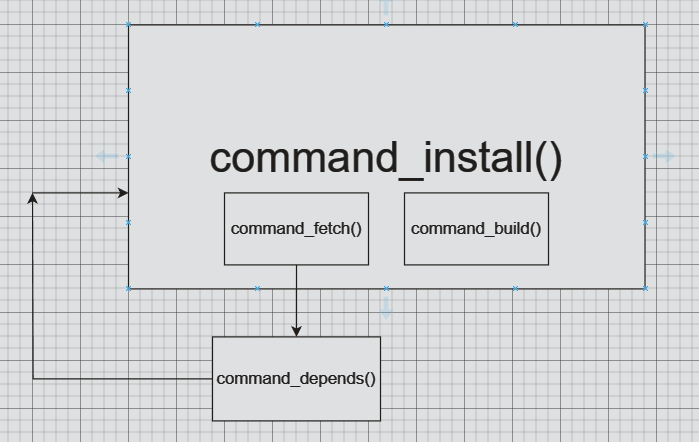

## Brief description
​	Apache Portable Runtime (APR) project is a sub-project of the Apache Software Foundation, providing a cross-platform library to support the development of Apache HTTP Server and other related projects.
​	The goal of APR is to offer a universal, portable programming interface that allows developers to easily **write cross-platform applications.**

####  Features and Usage of APR:

1. Cross-platform:
APR offers a cross-platform API,
enabling developers to write code with the same functionality on
different operating systems without worrying about
platform-specific details.
2. Low-level functionality support:
APR encapsulates many low-level functionalities such as memory management,
file operations, network operations, making it easier for
developers to access these functionalities.
3. Thread support:
APR provides a thread library, allowing developers to use multithreading
in their applications for concurrent processing.
4. Memory pool:
APR provides a memory pool mechanism for more efficient memory allocation
and deallocation, avoiding memory leaks and fragmentation.
5. Network programming:
APR offers network programming-related functionalities like socket operations,
network address handling, facilitating the development
of network applications.
6. File operations:
APR provides file operation functionalities such as file read/write,
file attribute operations, making it convenient for developing file
handling applications.


## Some header files in devpkg

#### APR

- `#include "apr_errno.h"`
- `#include "apr_pools.h"`
- `#include "apr_thread_proc.h"`
- `#include <apr_errno.h>`
- `#include <apr_file_io.h>`


#### bstrlib

- `#include "bstrlib.h"`


#### variant function

- `#include <stdarg.h>`


## Functions in APR library
>Some functions and marcos from the Apache Portable Runtime (APR) library are used in the devpkg.
>Make simple introduction

####  db.c
1. `apr_pool_t *p = NULL;`
   
   - **Purpose**: Declare a pointer to the APR memory pool.
   - **Features**: A memory pool is a mechanism in APR for allocating and managing memory, which can improve the efficiency and management of memory allocation.
   
   
   
2. `apr_pool_initialize();`
   - **Purpose**: Initialize the memory pool system in the APR library.
   - **Function**: This function needs to be called for initialization before using the APR memory pool.
   
   
   
3. `apr_pool_create(&p, NULL);`
   
   - **Purpose**: Create a new APR memory pool.
   - **Feature**: Used to create a new memory pool that can be used to allocate memory and manage resources.
   
   
   
4. `apr_status_t rc = apr_dir_make_recursive(DB_DIR, APR_UREAD | APR_UWRITE | APR_UEXECUTE | APR_GREAD | APR_GWRITE | APR_GEXECUTE, p);`
   - **Purpose**: Create a directory recursively.
   - **Function**: Create directories with specified permissions, including read, write, and execute permissions for users and groups.
   
   
   
5. `apr_status_t`
   
   - **Function**: The return type of the function in the APR library, which indicates the status of the function execution result.


#### shell.c

1. `apr_procattr_create();`
   
    ```c
    /**
     * Create and initialize a new procattr variable
     * @param new_attr The newly created procattr. 
     * @param cont The pool to use
     */
    APR_DECLARE(apr_status_t) apr_procattr_create(apr_procattr_t **new_attr,
                                                      apr_pool_t *cont);
    ```
    
    - **Purpose**: Prepare the environment for launching a new child process. 
    
        The function initializes a structure to specify the attributes of the child process, such as the starting directory, input/output streams, etc.


2. `apr_procattr_io_set();`

    ```c
    /**
     * Determine if any of stdin, stdout, or stderr should be linked to pipes 
     * when starting a child process.
     * @param attr The procattr we care about. 
     * @param in Should stdin be a pipe back to the parent?
     * @param out Should stdout be a pipe back to the parent?
     * @param err Should stderr be a pipe back to the parent?
     * @note If APR_NO_PIPE, there will be no special channel, the child
     * inherits the parent's corresponding stdio stream.  If APR_NO_FILE is 
     * specified, that corresponding stream is closed in the child (and will
     * be INVALID_HANDLE_VALUE when inspected on Win32). This can have ugly 
     * side effects, as the next file opened in the child on Unix will fall
     * into the stdio stream fd slot!
     */
    APR_DECLARE(apr_status_t) apr_procattr_io_set(apr_procattr_t *attr, 
                                                 apr_int32_t in, apr_int32_t out,
                                                 apr_int32_t err);
    ```

    - **Purpose**: This function is used to set the handling of the standard input, output, and error streams of the child process. By controlling these pipe connections, inter-process communication and redirection can be achieved.


3. `apr_procattr_dir_set:`

    ```c
    /**
     * Set which directory the child process should start executing in.
     * @param attr The procattr we care about. 
     * @param dir Which dir to start in.  By default, this is the same dir as
     *            the parent currently resides in, when the createprocess call
     *            is made.                            
     */
    APR_DECLARE(apr_status_t) apr_procattr_dir_set(apr_procattr_t *attr,
    												const char *dir);
    ```

    - **Purpose**: This function specifies the starting directory of the child process. When the child process is launched, it will switch to the specified directory to execute subsequent operations.


4. `apr_procattr_cmdtype_set:`

    ```c
        /**
     * Set what type of command the child process will call.
     * @param attr The procattr we care about. 
     * @param cmd The type of command.  One of:
     * <PRE>
     *            APR_SHELLCMD     --  Anything that the shell can handle
     *            APR_PROGRAM      --  Executable program   (default) 
     *            APR_PROGRAM_ENV  --  Executable program, copy environment
     *            APR_PROGRAM_PATH --  Executable program on PATH, copy env
     * </PRE>
     */
    APR_DECLARE(apr_status_t) apr_procattr_cmdtype_set(apr_procattr_t *attr,
                                                      apr_cmdtype_e cmd);
    ```

    - **Purpose**: By setting the command type, you can specify the type of command the child process will execute, such as executable program, shell command, etc.


5. `apr_proc_create:`

    ```c
    /**
     * Create a new process and execute a new program within that process.
     * @param new_proc The resulting process handle.
     * @param progname The program to run 
     * @param args the arguments to pass to the new program.  The first 
     *             one should be the program name.
     * @param env The new environment table for the new process.  This 
     *            should be a list of NULL-terminated strings. This argument
     *            is ignored for APR_PROGRAM_ENV, APR_PROGRAM_PATH, and                                                                                               
     *            APR_SHELLCMD_ENV types of commands.
     * @param attr the procattr we should use to determine how to create the new
     *         process
     * @param pool The pool to use.
     * @note This function returns without waiting for the new process to terminate;
     * use apr_proc_wait for that.
     */
    APR_DECLARE(apr_status_t) apr_proc_create(apr_proc_t *new_proc,
                                              const char *progname,
                                              const char * const *args,
                                              const char * const *env,
                                              apr_procattr_t *attr,
                                              apr_pool_t *pool);
    ```

    - **Purpose**: This function actually creates a new process based on the current process and executes the specified program within it. It uses the previously set `apr_procattr_t` structure to determine the attributes of the new process.

> **==Some thoughts while coding==**
>
> The answer from GPT：
>
> The function `Shell_run` initializes many attributes of the new process before creating the process for several reasons:
>
> 1. **Granular Control**: By setting attributes before creating the process, the function can have granular control over various aspects of the new process, such as I/O settings, root directory, command type, etc. This allows for customization and fine-tuning of the process's behavior and environment.
> 2. **Error Handling**: Setting attributes individually allows for better error handling. If any attribute setting fails, the function can catch the error and handle it appropriately. This approach helps in ensuring that the process creation is successful and provides detailed error messages in case of failures.
> 3. **Modularity and Readability**: Initializing attributes separately makes the code modular and easier to read and maintain. Each step in the process is clearly defined and can be easily understood, making the code more organized and structured.
>
> Regarding passing all related information when using `apr_proc_create` directly, it is a matter of design choice and flexibility. By setting attributes individually, the function can have more control over each aspect of the process creation. This approach also allows for better error checking and handling at each step.


6. `apr_proc_wait:`

    ```c
    /**
     * Wait for a child process to die
     * @param proc The process handle that corresponds to the desired child process 
     * @param exitcode The returned exit status of the child, if a child process 
     *                 dies, or the signal that caused the child to die.
     *                 On platforms that don't support obtaining this information, 
     *                 the status parameter will be returned as APR_ENOTIMPL.
     * @param exitwhy Why the child died, the bitwise or of:
     * <PRE>
     *            APR_PROC_EXIT         -- process terminated normally
     *            APR_PROC_SIGNAL       -- process was killed by a signal
     *            APR_PROC_SIGNAL_CORE  -- process was killed by a signal, and
     *                                     generated a core dump.
     * </PRE>
     * @param waithow How should we wait.  One of:
     * <PRE>
     *            APR_WAIT   -- block until the child process dies.
     *            APR_NOWAIT -- return immediately regardless of if the 
     *                          child is dead or not.
     * </PRE>
     * @remark The child's status is in the return code to this process.  It is one of:
     * <PRE>
     *            APR_CHILD_DONE     -- child is no longer running.
     *            APR_CHILD_NOTDONE  -- child is still running.
     * </PRE>
     */
    APR_DECLARE(apr_status_t) apr_proc_wait(apr_proc_t *proc,
                                            int *exitcode, apr_exit_why_e *exitwhy,
                                            apr_wait_how_e waithow);
    ```

    - **Purpose**: This function waits for the specified child process to exit and retrieves its exit status and exit reason. This function can be used to achieve inter-process synchronization and handle the exit status of child processes.


7. `apr_procattr_t *attr`:

    - **Type**: Pointer to the `apr_procattr_t` structure.

    - **Purpose**: This variable is used to store attributes for process creation.

        In the Apache Portable Runtime (APR) library, the `apr_procattr_t` structure is used to set and control the attributes of a new process, such as environment variables, file descriptors, signal handling, etc. 

        By configuring the `apr_procattr_t` structure, the behavior and execution environment of the new process can be influenced.

        

8. `apr_status_t rv`:

    - **Type**: `apr_status_t`, typically used to represent the return value of a function.

    - **Purpose**: This variable is used to store the return value of a function call. 

        In the APR library, most function return types are `apr_status_t`, which indicates the result of the function execution, such as success, failure, error codes, etc. 

        Programmers can use the value of `rv` to determine the success of a function call and perform subsequent handling as needed.


9. `apr_proc_t newproc`:

    - **Type**: `apr_proc_t` structure.

    - **Purpose**: This variable represents the newly created process. 

        After calling a function to create a process, the `newproc` variable can be used to access information about the new process, such as the process ID, input/output streams, etc. 

        The `apr_proc_t` structure typically contains basic attributes and status information of the process.


- `apr_procattr_t *attr` is used to set attributes for the new process.
- `apr_status_t rv` is used to store the return value of function calls for error handling.
- `apr_proc_t newproc` represents the newly created process and provides access to its related information.


10. `Some basic marcos`

    The use of macro definitions such as `APR_SUCCESS`, `APR_CHILD_DONE`, `APR_WAIT`, `APR_PROC_EXIT` helps in handling different states and events during process-related operations. 


#### commands.c


## The use of bstrlib


## The use of variant function 

> The most commonly used macros are 
>
> `va_list`, `va_start`, `va_arg`, and `va_end`.


#### Introduce 

1. `va_list`: A type defined in the `stdarg.h` header that is used to declare a list of arguments.

2. `va_start`: A macro that initializes a `va_list` object to point to the first variadic argument in the function call. It takes two arguments: the `va_list` object and the last named parameter before the variadic arguments.

3. `va_arg`: A macro that retrieves the next argument from the variable argument list. It takes two arguments: the `va_list `object and the type of the next argument to retrieve. It returns the value of the argument and advances the `va_list `object to the next argument.

4. `va_end`: A macro that cleans up the `va_list` object after all arguments have been processed. It should always be called after processing all variadic arguments.

​    

#### The order of using

1. Declare a `va_list` object.
2. Initialize the `va_list` object using `va_start` with the last named parameter before the variadic arguments.
3. Use `va_arg` to retrieve and process each argument in the list, advancing the `va_list` object each time.
4. Repeat step 3 until all variadic arguments have been processed.
5. Clean up the `va_list` object using `va_end`.

- simple example

    ```c
    #include <stdio.h>
    #include <stdarg.h>
    
    void print_values(int count, ...) {
        va_list args;
        va_start(args, count); // Initialize va_list
    
        for (int i = 0; i < count; i++) {
            int value = va_arg(args, int); // Retrieve argument
            printf("%d ", value);
        }
    
        va_end(args); // Clean up va_list
    }
    
    int main() {
        print_values(3, 10, 20, 30);
        return 0;
    }
    ```


**==Then you can analyse the `shell_exec()` step by step==**


## Analysis of shell.c

```c
/* 
 * @brief Execute a shell command with variable arguments.
 * @param template: The Shell struct containing the template command to run.
 * @param ...: Variable arguments to be substituted into the template command.
 * Returns: 0 if the command was executed successfully, -1 if there was an error.
 * 
 * @Note 
 * Remember to end the variable argument list with a NULL value.
 */
int Shell_exec(Shell template, ...)
{
	apr_pool_t *p = NULL;
	int rc = -1;
	apr_status_t rv = APR_SUCCESS;
	va_list argp;
	const char *key = NULL;	
	const char *arg = NULL;
	int i = 0;

	rv = apr_pool_create(&p, NULL);
	check(rv == APR_SUCCESS, "Failed to create pool.");

	va_start(argp, template);

	for(key = va_arg(argp, const char *);
		key != NULL;
		key = va_arg(argp, const char *))
	{
		arg = va_arg(argp, const char *);

		for(i = 0; template.args[i] != NULL; i++)
		{
			if(strcmp(template.args[i], key) == 0)
			{
				template.args[i] = arg;
				break;
			}
		}

	}

	rc = Shell_run(p, &template);
	check(rc == 0, "the command '%s' was executed unsuccessfully", template.args);
	apr_pool_destroy(p);
	va_end(argp);
	return rc;

error:
	if(p)
	{
		apr_pool_destroy(p);
	}
	return rc;
}

```

```c
typedef struct Shell
{
    const char *dir;		// The directory in which the command will be executed
    const char *exe;		// The executable command

    apr_procattr_t *attr;	// The attribute of the process
    apr_proc_t proc;		// The process information 
    apr_exit_why_e exit_why;// The reason for process exit
    int exit_code;			// The exit code of the process

    const char *args[MAX_COMMAND_ARGS];// The arguments for the commmand
} Shell;

```

Let's clarify the concept of key-value pairs in the context of the `Shell_exec` function and the `Shell` structure with a real example involving a shell command:

1. **Key-Value Pairs**:
   - In the `Shell_exec` function:
     - **Key**: The `key` variable (`const char *key`) that you define in the function. This key is used to identify which argument in the `template.args` array needs to be replaced.
     - **Value**: The `argp` variable (`const char *arg = NULL;`) that you provide as the new argument associated with the key. This value will replace the existing argument in the `template.args` array.

   - In the `Shell` structure:
     - **Key-Value Pair**: The `*args[]` array stored in the `Shell` structure:
       - **Key**: The index of each element in the `*args[]` array can be considered as the key. For example, `args[0]` can be seen as the key for the first argument, `args[1]` for the second argument, and so on.
       - **Value**: The value associated with each key/index in the `*args[]` array is the actual argument for the shell command.

2. **Real Example**:
   - Let's consider a real shell command like `ls`, which lists files and directories in the current directory.
   - If we have a `Shell` structure with `args` array storing the arguments for the command:
     - `args[0]` could be the key for the command itself (`ls` in this case).
     - Other elements in the `args` array (`args[1]`, `args[2]`, etc.) could be keys for additional arguments like `-l` for a detailed list or `-a` to show hidden files.
  
3. **Replacement Process**:
   - When a key (index) in the `template.args` array matches the current key (provided by `key`), the corresponding value (argument) in the `template.args` array is replaced with the new argument (`argp`) associated with that key.

In summary, in the context of shell commands and the `Shell` structure, the keys are represented by the indices of the `*args[]` array, and the values are the actual arguments for the command. When using key-value pairs in `Shell_exec`, the key helps identify which argument to replace with a new value.

I hope this explanation helps clarify the concept. If you have any more questions or need further clarification, feel free to ask!


## Analysis of commands.c

#### Functions（example: Installing a Package）

Let's walk through an example to illustrate the process of fetching, building, and installing a software package using the functions and commands in the `command.c` file:

1. **Fetch**:
   - Suppose we want to install a package named "example_package" from a URL.
   - `Command_install` is called with the URL as a parameter.
   - `Command_fetch` is invoked to fetch the package:
     - It determines the file type (e.g., TAR.GZ) and fetches the package.
     - If a DEPENDS file is found, it recursively processes dependencies using `Command_depends`.
2. **Build**:
   - After fetching, `Command_build` is called:
     - It checks the existence of the build directory.
     - Runs configure script, make script, and install script to build the package.
     - Updates the package in the database.
3. **Install**:
   - `Command_install` continues the installation process:
     - Checks if the package is already installed.
     - If not installed, it fetches the package using `Command_fetch`.
     - Calls `Command_build` to configure, build, and install the package.
4. **Commands**:
   - Various shell scripts are executed within the functions:
     - `CONFIGURE_SH`: Run the configuration script.
     - `MAKE_SH`: Run the make script.
     - `INSTALL_SH`: Run the install script.
     - `CLEANUP_SH`: Perform cleanup tasks after each step.




#### Summary:

- **Functions**:
  - `Command_fetch`: Handles fetching files and processing dependencies.
  - `Command_build`: Checks build directory, configures, builds, and installs the package.
  - `Command_install`: Manages the installation process, including fetching and building.
  - `Command_depends`: Recursively processes dependencies.

- **Commands**:
  - `Shell_exec`: Executes shell commands within the C program.
  - Shell scripts (`CONFIGURE_SH`, `MAKE_SH`, `INSTALL_SH`, `CLEANUP_SH`) perform specific tasks during the installation process.

- **Workflow**:
  - Fetching retrieves the package and dependencies.
  - Building configures and compiles the package.
  - Installing places the built software on the system.
  - Commands and functions work together to automate the installation process.

By following these steps and utilizing the commands and functions in `command.c`, the installation of software packages can be streamlined and automated, ensuring a smooth installation process with proper handling of dependencies.


