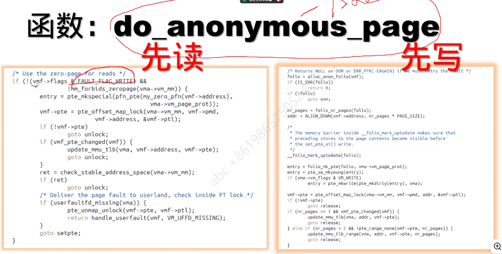
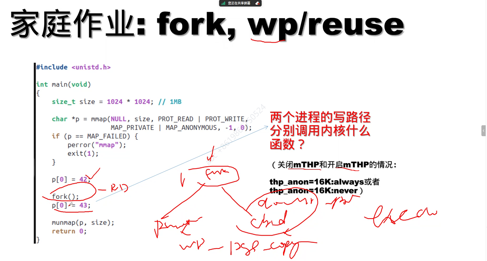

# 匿名页的page fault流程

wp：write_protect

搞明白这几个do_anonymous_page、do_wp_page、wp_page_reuse

1. 研究用户的出发点去研究内核！而不是单纯从内核的角度去做！

2. 善用qemu去做各种验证！

    还有，一个通过匹配a.out去学习，使用a.out调试法！

研究看看，开关mTHP的两种情况下，加调试打印：

去梳理清楚page fault的流程是什么样的，配合代码走，脑子里清洗知道这是怎么走的，配合实际环境验证。

> 工具，top。
>
> 能够找到工具

找到问题瓶颈？需要监测。去看实际的workload，瓶颈在哪里，看看现状。。

内存问题非常严肃？？

无数个公司都在卷。。

看看他们在做什么。。Google

