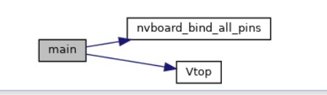
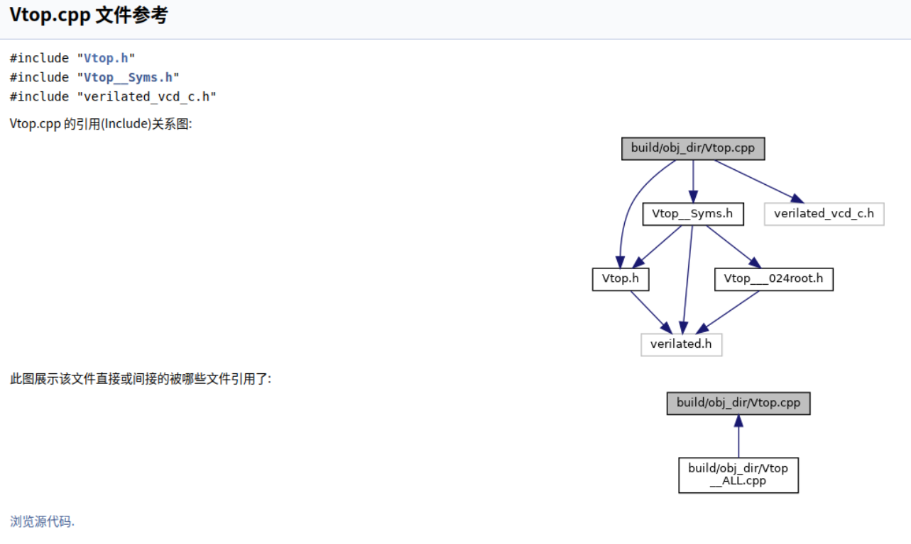
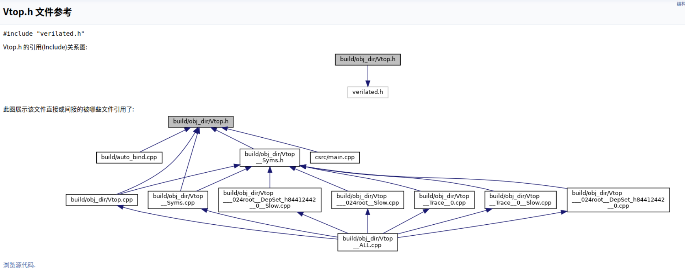
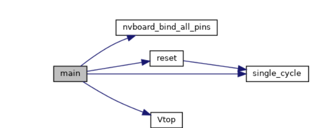
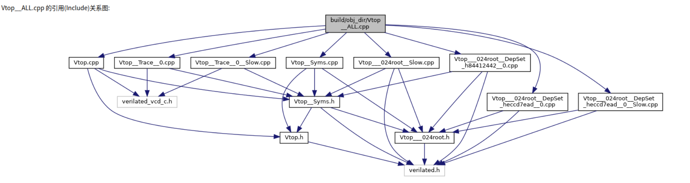

## verilator 配置

- 注意软硬件协同

    硬件板卡  <--> 软件diamagnetic

在实现流水灯的时候，了解清楚每一层在做什么：

## 整体流程

如果一开始没有接触过相关的**软硬件协同**的流程，对于这部分的学习可能会有点懵，所以我自己做一个总结流程梳理。

- **双控开关：理解RTL仿真的行为**

    > 阅读verilator编译出的C++代码, 然后结合verilog代码, 尝试理解仿真器进行仿真的时候都发生了什么.

    感觉比较复杂~~。C++基本不太会。。
    
    借助 doxywizard 和 GPT 大概知道一点。
    
    
    
    
    
    
    
    > Verilator 是一个开源的 Verilog 仿真器，它可以将 Verilog 代码转换成 C++ 代码，以实现快速的仿真。你提供的 C++ 代码是 Verilator 根据你的 Verilog 代码生成的模型实现文件。下面是对这些代码的简要解释，以及它们在仿真过程中的作用：
    >
    > 1. **头文件包含**：
    >    - `Vtop.h`：包含 Verilog 模块 `top` 的类定义。
    >    - `Vtop__Syms.h`：包含符号表的定义，这是 Verilator 用于存储信号值的数据结构。
    >    - `verilated_vcd_c.h`：包含 VCD（Value Change Dump）文件处理的头文件，用于波形输出。
    >
    > 2. **构造函数**：
    >    - `Vtop::Vtop()`：构造函数，初始化 Verilator 模型，创建符号表对象，并注册模型到 Verilator 上下文中。
    >
    > 3. **析构函数**：
    >    - `Vtop::~Vtop()`：析构函数，释放符号表对象。
    >
    > 4. **仿真步骤函数**：
    >    - `Vtop::eval_step()`：这是仿真的核心函数，每次调用都会执行仿真的一步。它首先检查是否需要进行初始化操作，然后调用 `Vtop___024root___eval` 函数来执行模型的仿真逻辑。
    >
    > 5. **调试和断言**：
    >    - `Vtop___024root___eval_debug_assertions()`：在调试模式下，这个函数用于执行断言检查。
    >
    > 6. **事件和定时**：
    >    - `Vtop::eventsPending()` 和 `Vtop::nextTimeSlot()`：这些函数用于处理事件驱动的仿真，但在你的代码中它们被简化了，因为没有使用 Verilog 的时序控制语句。
    >
    > 7. **最终块调用**：
    >    - `Vtop___024root___eval_final()`：在仿真结束时调用，用于执行 Verilog 中的 `final` 块。
    >
    > 8. **追踪配置**：
    >    - `Vtop::trace()` 和相关函数：这些函数用于配置和初始化 VCD 追踪，允许你观察仿真过程中信号的变化。
    >
    > 9. **Verilog 代码**：
    >    - 你的 Verilog 代码定义了一个顶层模块 `top` 和一个辅助模块 `x_or`。`top` 模块包含了一系列的输入输出端口，并通过实例化 `x_or` 模块来实现逻辑功能。
    >
    > 在仿真过程中，Verilator 会执行以下步骤：
    >
    > - 初始化：构造函数中进行模型和符号表的初始化。
    > - 仿真循环：在 `eval_step()` 中，每次循环都会根据当前的输入信号值来更新输出信号，并执行 Verilog 代码中的逻辑。
    > - 信号追踪：如果启用了 VCD 追踪，仿真过程中信号的变化会被记录下来，供后续分析使用。
    > - 清理：在仿真结束时，调用析构函数释放资源。
    >
    > 理解这些代码和仿真过程对于调试和优化你的硬件设计是非常有帮助的。如果你有具体的问题或需要进一步的解释，请随时提问。
    
    但是我目前还没找到怎么在构造函数的地方打断点，没学过C++。。先留坑，

### 硬件设计流程

[从电路设计的角度入门VerilogHDL_哔哩哔哩](https://www.bilibili.com/video/BV1PS4y1s7XW/)

### 软硬件协同流程

1. **编写Verilog代码**

    创建描述硬件行为的Verilog模块。（light、top 元件模块）

2. **使用Verilator生成C++模型**

    通过Verilator将Verilog代码转换成C++模型，这样使得我们不实际烧写到FPGA上也能进程快速的测试和验证。

3. **编写C++激励文件**

    创建C++程序，用于模拟硬件操作环境和提供测试激励。

4. **生成引脚绑定代码**

    使用NVBoard提供的脚本生成引脚绑定代码。

5. **编译Verilog代码到NVBoard支持的格式**

    将Verilog代码编译为FPGA可执行的格式，并将NVBoard库文件加入到项目中。

6. **在NVBoard上加载和运行硬件--运行仿真**

    执行C++激励文件，加载NVBoard，进行硬件仿真。

7. **仿真测试**

    - 如果使用Verilator生成的C++模型，你可以在C++环境中进行快速仿真，观察硬件逻辑是否按预期工作，并通过VCD文件记录仿真过程中的信号变化。
    - 如果在NVBoard上运行，你可以通过NVBoard提供的界面与虚拟硬件交互，例如，使用拨码开关作为输入，观察LED灯的变化或VGA显示器的输出。

    根据仿真和测试的结果，不断修改Verilog。

9. **最终验证**

    在NVBoard上完成所有测试。

- **NVBoard 与 C++激励文件 与 verilator编译出的C++模型 协同**

    因为我编译出来的verilator是跑在nvboard上的，所以，怎么将verilator的仿真结果和虚拟硬件板卡联系起来？

    1. 将Verilog模块用到的引脚绑定到NVboard上`nvboard_bind_pin()`；再在我的激励文件中调用 `nvboard_init()` 函数来**初始化NVBoard，设置仿真所需的虚拟硬件环境**。
    2. 然后，在仿真循环中，确保每次更新Verilog模块的信号后，激励代码都调用 `nvboard_update()` 函数来同步NVBoard上的组件状态。由此，NVBoard上的显示和输入设备即可反映Verilog模块的最新状态。

    对于C++激励模型：我们在NVBoard上运行硬件时，C++激励文件模拟输入信号，NVBoard显示输出信号，模拟用户交互。

    > 例如，通过C++代码模拟拨码开关的状态变化，观察这些变化如何影响LED灯的状态
    >
    > 实际上我们看到 .v元件代码里的输入输出信号可以不绑定板子引脚，可以直接留空或者让C++代码管理，就比如rst，clk，就是直接通过代码赋值的。
    >
    > 但是为什么不将rst绑定到某个按键上呢？应该是可以的，可以尝试一下，看看 README.md 或者源码

    

- **流水灯：理解RTL仿真的行为(2)**

    > 阅读verilator编译出的C++代码, 然后结合verilog代码, 尝试理解仿真器是如何对**时序逻辑电路**进行仿真的.

    
    
    这里也可以看到时序逻辑电路和之前的双控开关的激励文件不太一样，C++
    
    

> add 图像相关
>
> > 在计算机设备上加载到图片是怎么形成的？
> > 本质是像素，字节序列，但是是怎么有这种现实世界中的色彩的图呢？怎么生成这种像素的？
> > 难道要我用 SDL 上用相关的 API 手动画图？显然不可能？需要了解一下怎么生成这种图的？
> > 网上搜集相关资料
>
> 在计算机设备上加载图片的过程可以分为几个步骤，涉及不同的技术和组件。首先，操作系统会根据图片文件的扩展名识别文件类型，然后使用相应的解码器来解析图片数据。图片文件通常包括图片数据本身和元数据，如大小、颜色深度、分辨率等，这些信息对于正确显示图片至关重要。解码器将压缩的图片数据转换成像素数据，这个过程称为解码。例如，JPEG格式使用有损压缩，而PNG格式使用无损压缩。
>
> 像素数据随后被送入图形处理单元（GPU），GPU根据像素数据绘制出图片的每个像素点，这个过程称为渲染。计算机还会考虑显示器的大小和分辨率，以确保图片能够正确显示在屏幕上。
>
> 除了传统的图片加载和显示过程，还有现代的图像生成技术，如使用人工智能算法从头开始创建图像。深度学习技术，特别是生成对抗网络（GAN）和变分自编码器（VAE），在图像生成领域得到了广泛应用。这些技术可以用于艺术创作、游戏开发、虚拟现实等多个领域，允许用户通过文本提示或数学模型生成具有艺术和创造性的图像。
>
> 另外，还有一些在线工具和应用程序，如Stable Diffusion和Pixel-Art.ai，它们利用AI技术简化图像生成过程，允许用户输入描述性文本提示或使用内置的像素艺术工作室来创建和编辑图像。这些工具不仅提供了一种新颖的图像创作方式，也使得没有专业图形设计技能的用户也能轻松制作出高质量的图像作品。
>
> 在开发领域，例如使用SDL（Simple DirectMedia Layer）这样的库，可以通过API如SDL_IMAGE来导入不同格式的图片，然后通过SDL_Surface和SDL_Texture等对象在应用程序中显示这些图片。这为开发者提供了一种在应用程序中加载和渲染图片的方法。
>
> 总的来说，计算机加载图片的过程是一个涉及文件识别、数据读取、解码和渲染的复杂过程，而现代图像生成技术则为用户提供了更多创造性的图像创作方法。

