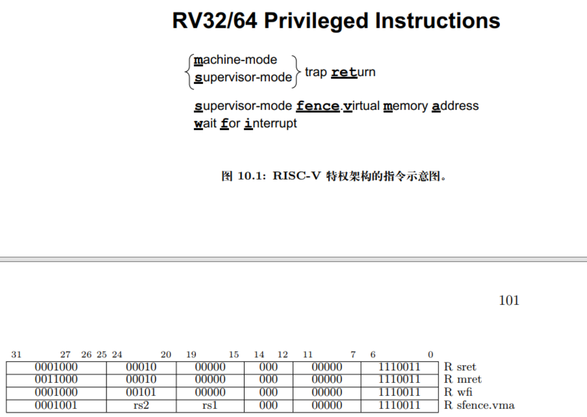
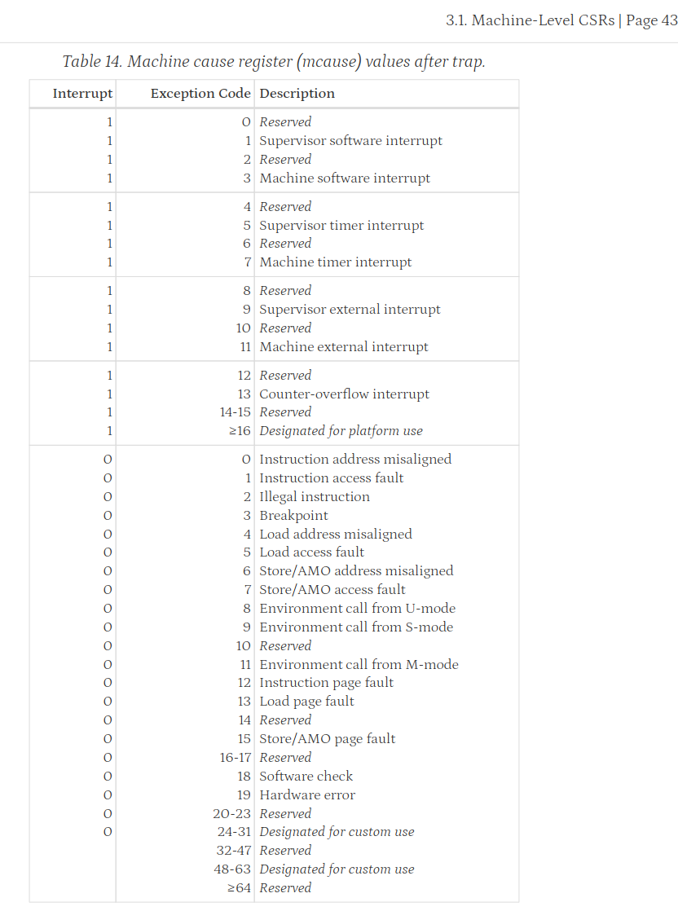
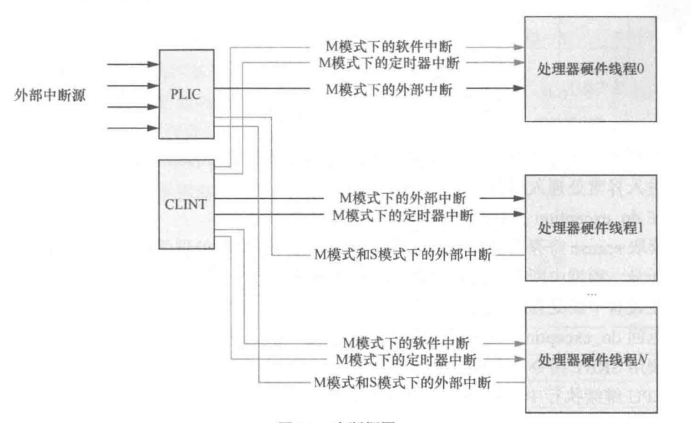
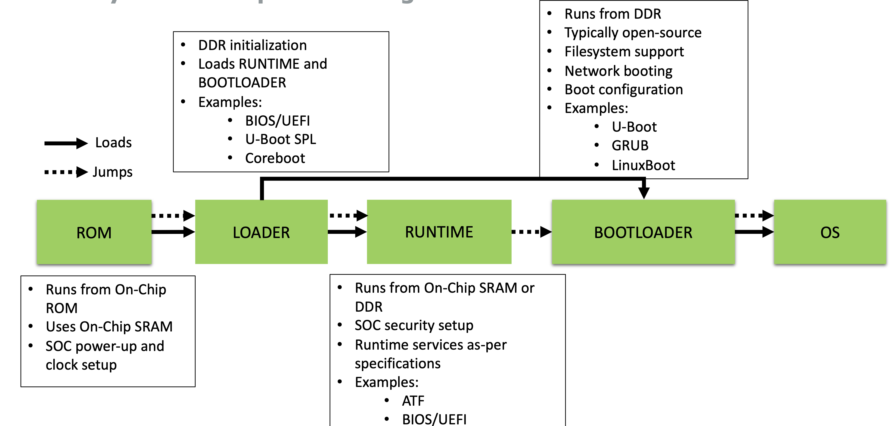
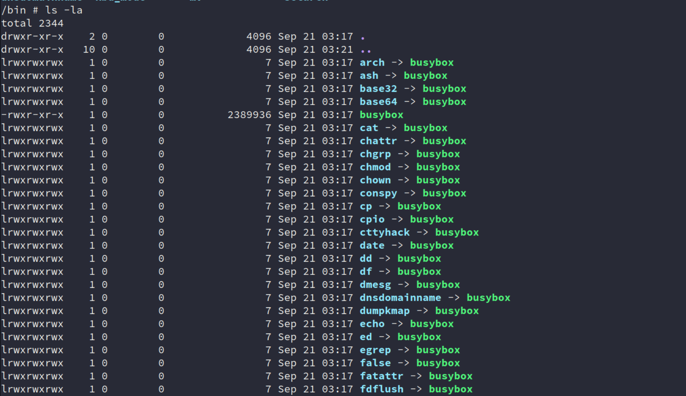
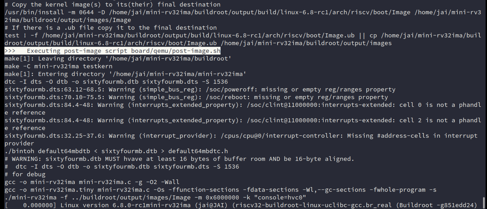
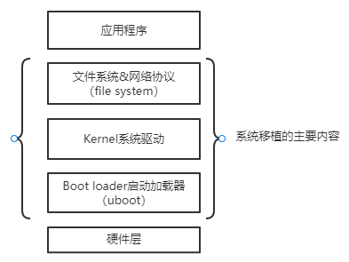

## Task

分为两部分：

- 处理器
    - RV32IMA 扩展
    - Zicsr 扩展
    - 时钟中断
    - 相关设备
- Linux移植


## 处理器

### ~~RV32I、M、A 扩展~~


```bash
test list [56 item(s)]: amoadd_w amoand_w amomaxu_w amomax_w amominu_w 
	amomin_w amoor_w amoswap_w amoxor_w lrsc 
	addi add andi and auipc beq bge bgeu blt bltu bne jalr jal 
	lb lbu lh lhu lui lw ori or sb sh simple slli 
	sll slti sltiu slt sltu srai sra srli 
	srl sub sw xori xor div divu mulh mulhsu mulhu mul rem remu
[      amoadd_w] PASS
[      amoand_w] PASS
[     amomaxu_w] PASS
[      amomax_w] PASS
[     amominu_w] PASS
[      amomin_w] PASS
[       amoor_w] PASS
[     amoswap_w] ***FAIL***
[      amoxor_w] PASS
[          lrsc] PASS
[          addi] PASS
[           add] PASS
[          andi] PASS
[           and] PASS
[         auipc] PASS
[           beq] PASS
[           bge] PASS
[          bgeu] PASS
[           blt] PASS
[          bltu] PASS
[           bne] PASS
[          jalr] PASS
[           jal] PASS
[            lb] PASS
[           lbu] PASS
[            lh] PASS
[           lhu] PASS
[           lui] PASS
[            lw] PASS
[           ori] PASS
[            or] PASS
[            sb] PASS
[            sh] PASS
[        simple] PASS
[          slli] PASS
[           sll] PASS
[          slti] PASS
[         sltiu] PASS
[           slt] PASS
[          sltu] PASS
[          srai] PASS
[           sra] PASS
[          srli] PASS
[           srl] PASS
[           sub] PASS
[            sw] PASS
[          xori] PASS
[           xor] PASS
[           div] PASS
[          divu] PASS
[          mulh] PASS
[        mulhsu] PASS
[         mulhu] PASS
[           mul] PASS
[           rem] PASS
[          remu] PASS

```


### 实现 `Zicsr` 扩展

#### basic instructions




[第六期"一生一芯"课程主页 | 官方文档](https://ysyx.oscc.cc/docs/)

#### CSR

各个 CSR 改为用 bitfield 实现

各个特权级

- mcause 

    

    再在 nemu 里添加一些枚举值即可。

    > 如果 etrace 再加功能一点，可以用 X-Macro 来弄弄？
    >
    > 不行，比较麻烦，算了，直接枚举值自己查类型

- mstatus

    同上，但记得更改 mret、ecall 相关内容。

    这里再看看手册中的相关介绍。

    [chapter1_riscv.md · 华中科技大学操作系统团队/pke-doc - Gitee.com](https://gitee.com/hustos/pke-doc/blob/master/chapter1_riscv.md#13-)

    可以看看相关 mstatus 各个位表示的含义，不过处理器这部分，我们只需提供好硬件实现即可，这些位应该是OS、ABI 那方面要做的。


[RISC-V Non-MMU Linux (1): 从内核到应用跑通一遍 - 泰晓科技 (tinylab.org)](https://tinylab.org/riscv-non-mmu-linux-part1/)

[RISC-V Non-MMU Linux (2): 从 M/S/U 到 M/U 的层级转变 - 泰晓科技 (tinylab.org)](https://tinylab.org/riscv-non-mmu-linux-part2/)

[从零开始，徒手写一个 RISC-V 模拟器（3）—— CSR 与特权级 ISA - 泰晓科技 (tinylab.org)](https://tinylab.org/tinyemu-csr-and-privileged-isa/)


### 中断相关内容

实际上，对于移植，主要就是实现 **时钟中断**，剩余的 软件中断、外部中断可以实现为空。


- 基础概念

    在种类上，RISC-V 将中断（interrupt）主要分为了三种：

    - software interrupt（软件中断）

        软件中断通常用于处理器内核之间的通信，即处理器间中断（Inter-Processor Interrupt, IPI），也称核间中断。

    - timer interrupt（定时器中断）

        定时器中断为来自定时器的中断，通常用于操作系统的**时钟中断**，即用于产生系统的tick。

        > RISC-V 体系结构规定处理器必须有一个定时器，通常为 `mtime` 。 

    - external interrupt（外部中断）

        外部中断指的是来自处理器外部设备的中断（串口等）。

        一般来说，为了支持更多的外部中断源，处理器往往都会使用中断控制器来管理外部中断。

        如，RISC-V 使用平台级别的中断控制器来（Platform-Level Interrupt Controller，PLIC） 仲裁和派发外部中断。

    > 当然，还有调试中断（用于硬件调试）、计数器溢出中断，这里不展开讨论。

    在 RISC-V 中，如果再按照中断功能来划分的话，可分为如下两类：

    - local interrupt（本地中断）

        本地中断为处理器私有的中断，有固定优先级，可直接发送给本地处理器 hart。所以，本地中断无需经过中断控制器的仲裁和查询，能够有效地缩短中断延时。

        本地中断一般由处理器内核本地中断器（Core-Local Interrupt, CLINT）产生。

        **具体包括：软件中断和定时器中断。**

    - global interrupt（全局中断）

        通常指的就是外部中断了。通过 PLIC 的路由，送到合适的处理器内核。

    

    这一点和 ARM 接不太一样，arm多核下，定时器中断、核间中断和外设中断都是统一由中断控制器管理的。

    应该能联想到 ARM Cortex-M 的NVIC 和 Cortex-A 系列的 GIC 。

    

    

    - 参考资料

        - 《RISC-V体系结构编程与实践》第 9 章 ——奔跑吧Linux社区 

        - [详解RISC v中断 - LightningStar - 博客园 (cnblogs.com)](https://www.cnblogs.com/harrypotterjackson/p/17548837.html#_label3)

            比较杂乱，但是内容还挺多，看不下去手册可以看这块别人总结的。

        - [RISCV基础开发（三） | 南京养鸡二厂 (databusworld.cn)](http://www.databusworld.cn/10468.html)

        - [[RFC PATCH v4 00/10\] Linux RISC-V ACLINT Support - Anup Patel (kernel.org)](https://lore.kernel.org/lkml/20211007123632.697666-1-anup.patel@wdc.com/)
    
        - [plic-spec (github.com)](https://github.com/riscv/riscv-plic-spec/blob/master/riscv-plic.adoc#interrupt-notifications)
    
        

#### CLINT 

软件中断和时钟中断，其中时钟中断是最关键的，OS 需要 Timer 来实现任务的切换，这一部分的内容其实在 PA4 已经做的差不多了：`alarm`、`timer` 。


#### 外部中断


### 相关设备

#### UART

>起初的bug
>
>在设备树（Device Tree）中，这段代码定义了一个名为 `chosen` 的节点，它用于指定系统启动时的一些参数和配置。具体来说，这里的 `bootargs` 属性包含了内核启动时需要的一些参数。
>
>- `earlycon=uart8250,mmio,0xa00003f8,8 console=ttyS0`：这部分是内核启动参数。
>
>  - `earlycon`：指定了早期控制台（early console）的配置。早期控制台是在内核完全启动之前，用于输出调试信息的控制台。这里指定了使用 `uart8250` 串口控制器，`mmio` 表示内存映射输入输出（Memory-Mapped I/O）方式，`0xa00003f8` 是串口的物理地址，`8` 是串口的IRQ号。
>  
>  - `console=ttyS0`：指定了内核启动后的标准控制台设备。这里指定的是 `ttyS0`，即第一个串口设备。
>
>简而言之，这段代码告诉内核在启动时使用指定的串口作为早期控制台和标准控制台，以便在系统启动过程中输出调试信息。这对于调试系统启动过程非常有用，尤其是在没有图形界面的嵌入式系统中。

自己没有改，导致一直访存错误（0x10000000 + 3）


相关寄存器没有实现，导致死循环


- 参考资料
    - [Differences Between vmlinux, vmlinuz, vmlinux.bin, zimage, and bzimage | Baeldung on Linux](https://www.baeldung.com/linux/kernel-images)
    - [ByteRunner.com | TECHNICAL DATA ON 16550](http://www.byterunner.com/16550.html)
    - [RISC-V from Scratch 4](https://dingfen.github.io/2020/08/01/2020-8-1-riscv-from-scratch-4/#UART-细节)
    - 


#### 按键

1. `KEY_QUEUE_LEN` 宏定义：
   - 定义了键盘事件队列的长度为1024，这意味着队列可以存储1024个键盘事件。

2. `key_queue` 数组：
   - 这是一个静态数组，用于存储键盘事件。它的大小由`KEY_QUEUE_LEN`定义。

3. `key_f` 和 `key_r` 变量：
   - `key_f`（front）是队列的头部索引，表示下一个要被处理的事件。
   - `key_r`（rear）是队列的尾部索引，表示下一个要被添加到队列中的事件的位置。

4. `key_enqueue` 函数：
   - 这个函数用于将一个新的键盘事件（`am_scancode`）添加到队列中。
   - 它将事件存储在`key_r`索引的位置，并将`key_r`递增，如果达到队列末尾则回到开头（通过取模运算实现）。
   - 然后，它检查队列是否已满（即`key_r`是否等于`key_f`），如果是，则断言失败，表示队列溢出。

5. `key_dequeue` 函数：
   - 这个函数用于从队列中取出一个键盘事件。
   - 如果队列不为空（即`key_f`不等于`key_r`），它将`key_f`索引处的事件取出，并将`key_f`递增，如果达到队列末尾则回到开头。
   - 如果队列为空，则返回`NEMU_KEY_NONE`，表示没有事件可取。

6. `send_key` 函数：
   - 这个函数用于处理键盘事件。
   - 它首先检查虚拟机状态是否为运行中（`NEMU_RUNNING`），并且扫描码（`scancode`）在键位映射表（`keymap`）中有对应的事件。
   - 如果条件满足，它将扫描码转换为内部使用的扫描码（`am_scancode`），并根据按键是否被按下（`is_keydown`）来设置`KEYDOWN_MASK`。
   - 最后，它调用`key_enqueue`函数将事件添加到队列中。

这个键盘逻辑的核心是使用一个循环队列来存储键盘事件，这样可以有效地处理事件，避免丢失，并且可以按顺序处理事件。队列的使用允许程序在事件产生时快速地将它们存储起来，然后在需要的时候逐个处理，这对于多任务环境或者需要处理大量异步事件的程序来说是非常有用的。


#### 定时器

> 当时在做 PA 的时候，对这个部分其实也是迷迷糊糊的，我有个 timer 就拿来计时？知道后来学到 分时多任务后，才知道抢占多任务的核心原理就是时钟中断，那时候再回来看相关 alarm 和 timer 代码，大概也能清楚一些基本的原理，也就是**通过信号和定时器来实现周期性的回调函数调用**，通过 `setitimer` 调用，定时器被设置为每隔一定时间（由 `TIMER_HZ` 决定）触发一次，每次触发都会执行所有注册的回调函数。**这也是一种在操作系统或模拟器中实现周期性任务的常见方法。**

这里再简单回顾一些内容，关于 timer、alarm、clock 的一些区别，这里不太区别很细节的概念，主要是为理解。

> 想象一下，你正在做一个蛋糕，你需要计时。
>
> 1. **Counter（计数器）**：
>     - 就像你在做蛋糕时用来数鸡蛋的计数器。每次你敲开一个鸡蛋，你就在计数器上加一。计数器可以由任何事件触发，比如敲鸡蛋、倒面粉等，它只是简单地计数，不一定与时间有关。
> 2. **Clock（时钟）**：
>     - 时钟就像你厨房里的挂钟，它以固定的速度“滴答”走着，每“滴答”一次就代表过去了一定的时间（比如一秒）。时钟是计数器的一种，但它是被一个规律的事件（比如秒针的移动）驱动的，用来测量时间。
> 3. **Alarm（闹钟）**：
>     - 闹钟是设置在特定时间点提醒你的设备。你可以把它想象成你设置在蛋糕烤好时响起的计时器。它连接到一个计数器（在这个例子中，就是时钟），并在计数器达到你设置的值时发出提醒。闹钟可以是一次性的，也可以是周期性的（比如每10分钟提醒一次）。
> 4. **Timer（计时器）**：
>     - 计时器其实和闹钟类似，但它是连接到时钟上的。在你做蛋糕的例子中，计时器就是你用来测量蛋糕烘烤时间的设备。它依赖于时钟的“滴答”来工作，可以是一次性的也可以是周期性的。
>
> 总结一下：
>
> - **Counter**：只是计数，可以由任何事件触发。
> - **Clock**：一种特殊的计数器，由规律的事件（如时间的流逝）驱动。
> - **Alarm**：基于计数器的值来触发事件，可以是一次性或周期性的。
> - **Timer**：一种特殊的闹钟，它连接到时钟上，用来测量时间。
>
> 在计算机系统中，这些概念被用来管理时间相关的功能，比如任务调度、性能监控等。
>
> > - A Counter maintains a monotonically increasing counter that is driven by some source of ticks. 
> > - A Clock is a counter driven by a regular source of ticks (i.e. it counts time). Clocks have a ***resolution*** associated with them. A default system Clock is driven by the periodic interrupt described above, and tracks real-time. Other interrupt sources may drive other Counters that may or may not track real-time at different resolutions. Some Counters may be driven by aperiodic events and thus have no relation to real-time at all.
> > - An Alarm is attached to a Counter and provides a mechanism for generating single-shot or periodic events based on the counter's value. 
> > - A Timer is simply an Alarm that is attached to a Clock.


#### PLIC


### DiffTest

[dlopen Linux 动态库失败原因与解决办法总结_dl库找不到 linux-CSDN博客](https://blog.csdn.net/xy010902100449/article/details/48036609)

[Better understanding Linux secondary dependencies solving with examples](https://www.kaizou.org/2015/01/linux-libraries.html)

[linux - dlopen 失败：无法打开共享对象文件：没有这样的文件或目录_Stack Overflow中文网](https://stackoverflow.org.cn/questions/12851184)


## Linux 系统移植

### Some questions

- `openSBI` 是什么？和 `uboot` 的关系？

- 终端、TTY、串口是什么？

- `buildroot` 和 `busybox` 是什么？为什么常常听到这两个混在一起？

- Linux 启动流程

- Linker script 的使用

    


[QEMU 启动方式分析（1）：QEMU 及 RISC-V 启动流程简介 - 泰晓科技 (tinylab.org)](https://tinylab.org/introduction-to-qemu-and-riscv-upstream-boot-flow/)

[在 QEMU 上运行 RISC-V 32 位版本的 Linux - 知乎 (zhihu.com)](https://zhuanlan.zhihu.com/p/342188138)

[【99%环境搭建系列】xv6-riscv内核调试教程 - Hexo (2017zhangyuxuan.github.io)](https://2017zhangyuxuan.github.io/2022/03/19/2022-03/2022-03-19 环境搭建系列-xv6内核调试教程/) xv6 课程


### 快速上手体验

先在 QEMU 上从零构建一遍 Linux 系统，快速上手使用看看

[在 QEMU 上运行 RISC-V 64 位版本的 Linux - 知乎 (zhihu.com)](https://zhuanlan.zhihu.com/p/258394849)

这里的流程还是挺详细的了，最后可以直接看到效果，最终运行命令：

```bash
qemu-system-riscv64 -M virt -m 256M -nographic \
	-kernel linux/linux-5.15.167/arch/riscv/boot/Image \
	-drive file=rootfs.img,format=raw,id=hd0 \
	-device virtio-blk-device,drive=hd0 -append "root=/dev/vda rw console=ttyS0"
```

> 1. `qemu-system-riscv64`：
>    - 这是QEMU的命令行工具，用于模拟RISC-V架构的系统。
>
>    > **回想 OS 课的笔记，关于 `qemu-system-riscv64` 和 `qemu-riscv64` 之间区别？**
>
> 2. `-M virt`：
>
>    - 指定QEMU使用的机器模型为`virt`，即虚拟化环境。
>
> 3. `-m 256M`：
>
>    - 分配256MB的内存给虚拟机。
>
> 4. `-nographic`：
>    
>    - 指定不使用图形界面，即在没有图形显示的情况下运行虚拟机。
>    
> 5. `-kernel linux/linux-5.15.167/arch/riscv/boot/Image`：
>    - 指定要加载的内核映像文件路径，这里是RISC-V架构的Linux内核。
>
> 6. `-drive file=rootfs.img,format=raw,id=hd0`：
>    - 创建一个虚拟的硬盘驱动器，并指定其文件名为`rootfs.img`，格式为原始（raw），并分配一个ID为`hd0`。
>
> 7. `-device virtio-blk-device,drive=hd0`：
>    - 添加一个virtio块设备，这个设备会使用之前创建的`hd0`驱动器。
>
> 8. `-append "root=/dev/vda rw console=ttyS0"`：
>    - 指定内核启动参数。这里指定了根文件系统的位置为`/dev/vda`（通常是虚拟机的第一个硬盘设备），启动时为读写模式（`rw`），并且将控制台输出重定向到`ttyS0`（通常是虚拟机的串行端口）。
>
> 总结来说，这条命令是在QEMU中启动一个RISC-V架构的虚拟机，使用256MB内存，不显示图形界面，加载指定的内核映像，并挂载一个名为`rootfs.img`的根文件系统，同时指定了一些内核启动参数。


> 这里也有一篇相关的
>
> [教你在QEMU上运行RISC-V Linux-阿里云开发者社区 (aliyun.com)](https://developer.aliyun.com/article/1323996)
>
> Linux 下生成的镜像：`arch/riscv/boot`
>
> buildroot 生成的相关镜像：`output/images`
>
> OpenSBI 生成的相关镜像：`build/platform/generic/firmware/`
>


### 启动流程

[Table of Contents - HackMD](https://hackmd.io/@0xff07/linux-boot/%2F%400xff07%2Flinux-boot-toc#Linux-Booting-References)

**这篇专栏收录了 Linux booting 各种相关的内容，总结了 Linux 在 x86-64、Arm64、RISC-V上的 boot process。可以看看里面的相关内容。**



每一步怎么做的，把bootROM放到哪里，然后loader哪里？


[Linux 系统的编译、镜像制作、以及烧录的概述 - 白菜没我白 - 博客园 (cnblogs.com)](https://www.cnblogs.com/xingboy/p/14858853.html)

[1- Linux系统移植前期准备概述 - 白菜没我白 - 博客园 (cnblogs.com)](https://www.cnblogs.com/xingboy/p/15610630.html)

[Linux内核在RISC-V架构下的构建与启动 - crab2313's blog](https://crab2313.github.io/post/riscv-build-and-boot/)


### 交叉编译工具链

介绍一些背景知识。

[A master guide to Linux cross compiling | by Ruvinda Dhambarage | Medium](https://ruvi-d.medium.com/a-master-guide-to-linux-cross-compiling-b894bf909386)

[How a toolchain is constructed (crosstool-ng.github.io)](https://crosstool-ng.github.io/docs/toolchain-construction/)


- 使用别人打包好的

    [Cross-compilation toolchains for Linux - Home (bootlin.com)](https://toolchains.bootlin.com/)

    直接在这里下载即可。

    下载完成后，解压放到系统下的某个位置，然后将交叉编译工具链的路径导入到系统环境变量。

    在 `/etc/profile` 写入：

    `export PATH=$PATH:/usr/local/riscv64/riscv64-lp64d--glibc--stable-2024.05-1/bin`

    > 当然，放在用户下的也可以：`~/.bashrc`
    >
    > `export PATH=/opt/riscv/gcc/bin:$PATH`


### Linker Script

主要参考：

- 《RISC-V 体系结编程与实践》第 6 章
- 官方文档 [Top (LD) (sourceware.org)](https://sourceware.org/binutils/docs/ld/index.html)
- [Linker Scripts语法解析 - HiDark - 博客园 (cnblogs.com)](https://www.cnblogs.com/HiDark/p/18166817)


- 一些概念上的区分

    在阅读《RISC-V 体系结编程与实践》第 6 章 的时候，遇到了 链接地址、加载地址、运行地址（虚拟地址）这三个概念，在只谈到装载地址和运行地址时，这两个概念还是比较好理解的，但是引入了链接地址后，我对一些概念出现了混乱。故记录一下。

    首先，对于刚开始的加载地址和运行地址其实从字面上也很好理解，

    - 加载地址：加载地址是操作系统加载程序到内存时的实际地址。

        在启动时，加载程序（如引导加载程序）会将内核映像加载到这个地址。

        在脚本中，`_start`符号被设置为`LOAD_OFFSET`，这意味着程序的入口点（通常是第一个执行的代码）被定位在装载地址。


> 实际存储设备映射到存储空间！


[downloads.ti.com/docs/esd/SPRU513/load-and-run-addresses-slau1317366.html](https://downloads.ti.com/docs/esd/SPRU513/load-and-run-addresses-slau1317366.html)


### OpenSBI

[OpenSBI - HackMD](https://hackmd.io/@0xff07/linux-boot/%2F%400xff07%2FryREmHYih)

[opensbi入门 - LightningStar - 博客园 (cnblogs.com)](https://www.cnblogs.com/harrypotterjackson/p/17558399.html)


### U-Boot


### busybox、buildroot、yocto

- **busybox**

    

    实际上在做 PA4 的时候，就遇到了 busybox 。当时我们写的 NTerm 没有多少 Shell 工具可以运行，busybox 正是用来解决这个问题的，它是一个精简版 Shell 工具的集合，包含了大部分常用命令的功能。（也就是平时在 Linux 中使用命令行的经历）

    Busybox 中包含很多小工具，通过 `make menuconfig` 来打开一个配置菜单来查看它们。

    Busybox 会把其中的 Shell 工具链接成一个 ELF 可执行文件，而不是像 Ubuntu/Debian 等发行版中的 Shell 工具那样的 独立的 ELF 可执行文件。Busybox的 `main()` 函数会根据传入的参数来调用相应工具的功能：

    ```C
    if (strcmp(argv[1], "cat") == 0) return cat_main(argc, argv);
    else if (strcmp(argv[1], "ls") == 0) return ls_main(argc, argv);
    else if (strcmp(argv[1], "wc") == 0) return wc_main(argc, argv);
    // ......
    ```

    那上图那些 `xxx -> busybox` 符号链接，软链接是怎么回事？

    > kimi 的回答：
    >
    > **在 Linux 系统中，`busybox` 是一个集成了多达数百个最常用的 Unix 工具和命令的软件**。它提供了轻量级的 shell 环境，通常用于嵌入式系统或者需要最小化系统环境的场景。由于 `busybox` 包含了很多工具，但是每个工具都是作为 `busybox` 的一个单独功能来实现的，所以当你在 `/bin` 目录下看到类似 `arch -> busybox` 这样的链接时，这意味着 `arch` 命令实际上是 `busybox` 的一个符号链接。
    >
    > **这些符号链接（symbolic links），通常简称为 symlinks，是一种特殊的文件类型，它们指向另一个文件或目录。在这个例子中，当你执行 `arch` 命令时，实际上是在执行 `busybox` 并调用它的 `arch` 功能。**
    >
    > 这种设计允许 `busybox` 通过单个可执行文件来提供多种命令，从而节省空间并简化系统。当你查看 `/bin` 目录下的这些链接时，你会看到许多常用的命令，如 `cp`、`grep`、`hostname` 等，它们都指向 `busybox`，表明这些命令都是由 `busybox` 实现的。
    >
    > 例如，当你执行 `cp` 命令时，实际上是执行了 `busybox cp`。`busybox` 会根据提供的参数和选项来确定应该执行哪个具体的命令功能。这种设计使得 `busybox` 非常灵活且占用空间小。

    


[buildroot使用介绍 - ArnoldLu - 博客园 (cnblogs.com)](https://www.cnblogs.com/arnoldlu/p/9553995.html)


buildroot 网站 [Buildroot - Making Embedded Linux Easy](https://buildroot.org/download.html?spm=a2c6h.12873639.article-detail.9.5dda1bfbH3cvM2)


### 设备树

主要借助下面的内容来学习：

[【一文秒懂】Linux设备树详解 | Donge Blog](https://uniondong.github.io/docs/linux/linux_driver_develop_basic/一文秒懂linux设备树详解/)

devicetree-specification-v0.4

[Device Tree Usage - eLinux.org](https://elinux.org/Device_Tree_Usage#chosen_Node)


[linux设备驱动(20)设备树详解4-kernel解析dts - Action_er - 博客园](https://www.cnblogs.com/xinghuo123/p/12977093.html)


> 其他问题
>
> 设备树和 ACPI 的关系？


### Linux kernel

[如何编译安装Linux内核 - LightningStar - 博客园 (cnblogs.com)](https://www.cnblogs.com/harrypotterjackson/p/11846222.html)

这里我想到的第一个问题就是什么叫镜像？


### RISC-V Arch 相关

[RISC-V architecture — The Linux Kernel documentation](https://www.kernel.org/doc/html/v6.11/arch/riscv/index.html)

[kernel.org/doc/Documentation/nommu-mmap.txt](https://www.kernel.org/doc/Documentation/nommu-mmap.txt)

[riscv架构移植 · book for nxos (book-os.com)](http://www.book-os.com/doc/nxos/programing-manual/port/riscv/riscv.html)


### kernel

[RISC-V归档 - Laumy的技术栈](https://www.laumy.tech/category/risc-v)

上面这个专题讲到了相关的 RISC-V Linux kernel 的启动流程，主要是 OS 的启动流程，OpenSBI、U-Boot不涉及。


[Linux内核在RISC-V架构下的构建与启动 - crab2313's blog](https://crab2313.github.io/post/riscv-build-and-boot/)


#### 部分 kernel 代码学习

- `linux/arch/riscv/include/asm/asm.h`

    这段代码是Linux内核中针对RISC-V架构的汇编语言头文件，它定义了一些宏和指令，用于在RISC-V处理器上进行底层的内存操作和寄存器管理。这些宏和指令通常用于内核的汇编代码中，以实现对硬件的直接控制。下面是对这段代码的总结：

    1. **宏定义**：
       - `__ASM_STR(x)`：这个宏用于在汇编语言中直接插入字符串`x`。如果处于汇编模式（`__ASSEMBLY__`定义了），则直接使用`x`；否则，将其转换为字符串。

    2. **寄存器选择**：
       - `__REG_SEL(a, b)`：这个宏根据`__riscv_xlen`的值选择寄存器操作。`__riscv_xlen`定义了RISC-V架构的字长，可以是32位或64位。`__REG_SEL`根据这个值选择`a`或`b`。

    3. **寄存器操作宏**：
       - `REG_L`和`REG_S`：这两个宏分别用于从内存加载（Load）和存储（Store）数据到寄存器。它们根据`__riscv_xlen`的值选择使用32位还是64位的指令。
       - `REG_SC`：原子存储并交换操作，用于多处理器同步。
       - `REG_AMOSWAP_AQ`：原子交换操作，带有内存屏障。

    4. **指针和整数大小**：
       - `RISCV_PTR`、`RISCV_SZPTR`、`RISCV_LGPTR`：这些宏定义了指针的大小和对齐方式。
       - `RISCV_INT`、`RISCV_SZINT`、`RISCV_LGINT`：定义了整数的大小和对齐方式。
       - `RISCV_SHORT`、`RISCV_SZSHORT`、`RISCV_LGSHORT`：定义了短整型的大小和对齐方式。

    5. **汇编宏**：
       - `nops`：定义了一个宏，用于生成指定数量的NOP（无操作）指令，通常用于填充或延迟执行。
       - `save_from_x6_to_x31`和`restore_from_x6_to_x31`：这两个宏用于保存和恢复寄存器x6到x31的值，通常在函数调用或中断处理中使用，以保存现场和恢复现场。

    **REG_S**宏的作用是将一个寄存器的值存储到内存中。在这段代码中，`REG_S`根据RISC-V的字长（32位或64位）选择使用`sw`（store word，存储字）或`sd`（store double word，存储双字）指令。这个宏在内核中用于实现函数调用、中断处理等场景下的寄存器保存和恢复操作。


#### 启动相关的ABI设置

[RISC-V内核启动要求和限制 — The Linux Kernel documentation](https://www.kernel.org/doc/html/v6.11-rc5/translations/zh_CN/arch/riscv/boot.html)


### rootfs

一个问题就是什么叫 rootfs？


### nommu-linux

在移植Linux之前，先尝试学习 `mini-rv32ima` 这个项目，然后仿照它，将 `nommu-linux` 移植到 NEMU 上。




#### 如何加载 image 和设备树


### 一些启动上的问题


#### 参考资料


TODO: 添加自己微信聊天的相关笔记

[Linux下1号进程的前世(kernel_init)今生(init进程)----Linux进程的管理与调度（六） - yooooooo - 博客园](https://www.cnblogs.com/linhaostudy/p/9641439.html)

感觉似乎得基于某一版的 Linux kernel 来分析，不然国内的分析好像都是 4.x 的版本，没有比较新的。


卡在某处bug：

[initcall 机制 · Linux ­Insides­](https://xinqiu.gitbooks.io/linux-insides-cn/content/Concepts/linux-cpu-3.html)


内核镜像，为了用ftrace，了解 vmlinux，用于调试

[Differences Between vmlinux, vmlinuz, vmlinux.bin, zimage, and bzimage | Baeldung on Linux](https://www.baeldung.com/linux/kernel-images)


现在进入了 idle 任务：

[一文搞懂linux cpu idle - 知乎](https://zhuanlan.zhihu.com/p/548268554)

但实际上好像是UART的问题。


进一步，关于 bootconsole、console 的区别？

再进一步 TTY、 /dev/tty、/dev/ttyS0、/dev/console、uart等差异？

韦东山老师的视频区别！！！讲的真的很好！！

[Linux Serial Console — The Linux Kernel documentation](https://www.kernel.org/doc/html/v5.6/admin-guide/serial-console.html)

[解密 TTY 设备](https://taoshu.in/tty.html)

再补充：[深入解析Linux内核Console框架及虚拟UART控制台的实现-CSDN博客](https://blog.csdn.net/caiji0169/article/details/144226525)

还有一个回答也挺好的：

[c - Difference between a serial driver and a tty driver - Stack Overflow](https://stackoverflow.com/questions/67672191/difference-between-a-serial-driver-and-a-tty-driver)


进一步了解 ramdisk、initramfs、initrd....

> [embedded - Initrd, Ramdisk, Initramfs, uclinux - Stack Overflow](https://stackoverflow.com/questions/15444917/initrd-ramdisk-initramfs-uclinux)
>
> [linux - The difference between initrd and initramfs - Stack Overflow](https://stackoverflow.com/questions/10603104/the-difference-between-initrd-and-initramfs)
>
> [boot - Why is the root filesystem is loaded into a ramdisk? - Stack Overflow](https://stackoverflow.com/questions/4192736/why-is-the-root-filesystem-is-loaded-into-a-ramdisk)
>
> [12.3. Booting with the Initial Ramdisk](https://www.novell.com/documentation/suse91/suselinux-adminguide/html/ch12s03.html)

简单理解，将内存中的一部分当成磁盘来使用：这样的磁盘有一个专门的名字：ramdisk。这种磁盘不像真正的磁盘，他是掉电丢失的。

initrd、initramfs：用户空间早期的文件系统，让我们可以运行一个位于内存的比较小的文件系统。

> 借此总结：
>
> 从 Linux 启动的角度来总结，initrd（initial RAM disk）和 initramfs 是两种用于早期阶段用户空间根文件系统（rootfs）的技术，它们允许系统在内存中运行一个最小化的文件系统。
>
> 1. **initrd**：
>    - initrd 是一个由引导加载程序（如 GRUB 或 LILO）加载的初始 RAM 磁盘映像，它被挂载为根文件系统，允许系统在只有最小驱动集合的情况下启动。
>    - 它的主要目的是在系统启动的两个阶段中，首先只加载内核中编译的最小驱动集合，然后从 initrd 中加载额外的模块。
>    - initrd 通常包含必要的驱动程序，特别是磁盘控制器的驱动，以便在实际的根文件系统被挂载之前加载这些驱动。
>    - initrd 是使用 cpio 格式存储文件的，并且可以在构建内核时通过 usr/Kconfig 进行配置。
>
> 2. **initramfs**：
>    - initramfs 是 initrd 的一个更早期阶段的文件系统，它被集成在内核中（由内核配置控制）。
>    - initramfs 的工作方式相对简单直接，启动时加载内核和 initramfs 到内存执行，内核初始化后，切换到用户态执行 initramfs 中的程序/脚本，加载所需的驱动模块和必要配置，然后加载 rootfs 切换到真正的 rootfs 上去执行后续的 init 过程。
>    - 从 Linux 内核 2.6 开始，initrd 文件格式由原来的文件系统镜像文件转变成了 cpio 格式，内核对这两种格式的处理有着明显的不同。
>
> 3. **ramfs 和 tmpfs**：
>    - ramfs 是一种在内存中创建的虚拟文件系统，它使用内存而不是磁盘来存储文件数据，这使得访问速度非常快。
>    - tmpfs 是 ramfs 的增强版，也是一种基于内存的文件系统，通常用于实现 initrd。
>    - 新版本的内核中，initrd 通常使用 tmpfs 而不是 ramfs 来实现。
>
> 4. **启动过程**：
>    - 在使用 initrd 的系统中，引导加载程序会加载内核和 initrd 到内存中，内核将 initrd 转换为一个“正常”的 RAM 磁盘，并释放 initrd 使用的内存。
>    - 然后，如果根设备不是 `/dev/ram0`，内核会挂载根设备，如果是 `/dev/ram0`，则 initrd 映像被挂载为根。
>    - 接着执行 `/sbin/init`，这是 init 进程的开始，它会挂载“真正的”根文件系统，并使用 `pivot_root` 系统调用将根文件系统放到根目录下。
>    - 最后，initrd 文件系统被移除，系统继续在新的根文件系统上执行。
>
> 这些技术允许 Linux 系统在启动时有一个灵活的根文件系统，特别是在需要从网络或外部存储介质加载根文件系统时非常有用。

[BusyBox 构建并启动 RISC-V Linux 内核 | 夜云泊](https://lifeislife.cn/posts/busybox-构建并启动-risc-v-linux-内核/)


关于Linux kernel 的启动流程到 init 之后 --> 运行的文件系统。

[Linux启动分析——init进程与app启动(init进程源码分析)_本文通过简要分析init进程源码,梳理其处理流程,重点关注init进程如何启动应用程序-CSDN博客](https://blog.csdn.net/u014426028/article/details/108143827)


突然想到可以看看 qemu 和 opensbi 关于 uart8250和 ns16550的实现？

[qemu虚拟化-设备模拟详解_qemu中uart数据-CSDN博客](https://blog.csdn.net/qq_16054639/article/details/112532327)！

[opensbi/lib/utils/serial/uart8250.c at master · riscv-software-src/opensbi](https://github.com/riscv-software-src/opensbi/blob/master/lib/utils/serial/uart8250.c)


学习 QEMU的设计：

[菜鸡读QEMU源码 - From_Zero - 博客园](https://www.cnblogs.com/from-zero/p/12383652.html)

[lishuhuakai/qemu_reading: qemu源码的阅读笔记](https://github.com/lishuhuakai/qemu_reading/tree/main)

[QEMU 源码分析-外设模拟（以 GPIO 为例） | 夜云泊](https://lifeislife.cn/posts/qemu源码分析-外设模拟以gpio为例/)


补充更多 UART的学习

[UART 16550的使用_uart16550-CSDN博客](https://blog.csdn.net/qq_45226456/article/details/142097210)

[ns16550串口驱动-CSDN博客](https://blog.csdn.net/u013691997/article/details/23591087)

[The NS16550A: UART Design and Applications Considerations](https://www.pe2bz.philpem.me.uk/Parts-Active/IC-Analog/- AN-National/AN-491.pdf)


关于设备树的：

进一步看看文档，尤其是那个 compatible，区分 ns16550、8250、ns16850、ns16550a

为什么设备树里写这个就行？那个就不行？kernel 怎么解析的？具体看UART的驱动实现？

[Device Tree Usage - eLinux.org](https://elinux.org/Device_Tree_Usage#Basic_Data_Format)


进一步学习 hvc

[linux - Debian VM doesn’t boot on QEMU with "console=hvc0" kernel parameter - Unix & Linux Stack Exchange](https://unix.stackexchange.com/questions/751827/debian-vm-doesn-t-boot-on-qemu-with-console-hvc0-kernel-parameter)


下一步技术：

开始学习 hypervisor 吧！！

[基于Qemu ARM64搭建XEN Hypervisor运行环境 | 嵌入式分区实时系统](http://www.prtos.org/xen_on_arm64_and_qemu/)

[blog.csdn.net/jingyu_1/article/details/137539089?spm=1001.2014.3001.5502](https://blog.csdn.net/jingyu_1/article/details/137539089?spm=1001.2014.3001.5502)

应该买一块开发板以及？


深入学习一些硬件架构？

MMU、TLB、cache、异常处理、trustzone、bus、SIMD...


### Other: QEMU + OpenSBI + ...  学习RISC-V

[RISC-V - 随笔分类 - ArnoldLu - 博客园](https://www.cnblogs.com/arnoldlu/category/2405953.html)


### 参考文章



[1- Linux系统移植前期准备概述 - 白菜没我白 - 博客园 (cnblogs.com)](https://www.cnblogs.com/xingboy/p/15610630.html)

[嵌入式Linux系统移植原理与方法总结_怎么更换嵌入式板子的linux系统-CSDN博客](https://blog.csdn.net/m0_66324986/article/details/133238073)

[【文章翻译】将Linux移植到新的处理器架构（1）——基础篇 - 尹天宇的博客 | Jack's Blog (yintianyu.github.io)](https://yintianyu.github.io/2019/01/29/porting-linux-1/)

[Porting Linux to a new architecture LWN.net\]](https://lwn.net/Articles/597351/)


