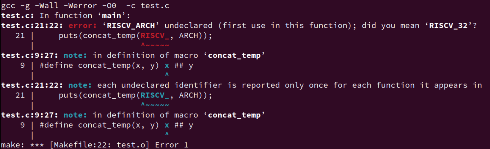

## Introduction

关于宏，实际上就不得不谈到预处理器。

> [Preprocessor - cppreference.com](https://en.cppreference.com/w/c/preprocessor)
>
> The preprocessor has the source file translation capabilities:
>
> - **[conditionally](https://en.cppreference.com/w/c/preprocessor/conditional)** compile of parts of source file (controlled by directive , , , , , `#elifdef`, `#elifndef`(since C23) and ). `#if``#ifdef``#ifndef``#else``#elif``#endif`
> - **[replace](https://en.cppreference.com/w/c/preprocessor/replace)** text macros while possibly concatenating or quoting identifiers (controlled by directives and , and operators and `#define`、`#undef`、`#`、`##`)
> - **[include](https://en.cppreference.com/w/c/preprocessor/include)** other files (controlled by directive `#include` and checked with __has_include(since C23))
> - cause an **[error](https://en.cppreference.com/w/c/preprocessor/error)** or **[warning](https://en.cppreference.com/w/c/preprocessor/error)**(since C23) (controlled by directive or `#warning` respectively(since C23)`#error`)
>
> The following aspects of the preprocessor can be controlled:
>
> - **[implementation defined](https://en.cppreference.com/w/c/preprocessor/impl)** behavior (controlled by directive and operator `_Pragma`(since C99)`#pragma`)
> - **[file name and line information](https://en.cppreference.com/w/c/preprocessor/line)** available to the preprocessor (controlled by directives `#line`)

这里我只是总结些我在做 PA 时遇到的一些宏，所以，我仅关注 replace 这一功能。


### Basic usage

下面直接由 `kimi` 生成。

> C语言中的宏是一种预处理器功能，它允许你在编译之前进行文本替换。宏的基本使用包括以下几个方面：
>
> 1. **定义常量**： 使用宏定义来创建常量可以提高代码的可读性和可维护性。例如：
>
>     ```
>      #define PI 3.14159
>     ```
>
> 2. **代码复用**： 宏可以用来定义代码片段，以避免在程序中重复编写相同的代码。例如：
>
>     ```
>      #define SQUARE(x) ((x)*(x))
>     ```
>
> 3. **条件编译**： 宏可以用于条件编译，使得在编译时可以根据特定的条件包含或排除代码段。例如：
>
>     ```
>      #define DEBUG 1
>      #ifdef DEBUG
>      printf("Debugging information: variable value = %d\n", variable);
>      #endif
>     ```
>
> 4. **字符串化和标记粘贴**： 宏提供了字符串化（`#`）和标记粘贴（`##`）操作符，用于特殊的文本处理。
>
>     - 字符串化操作符将宏参数转换为字符串：
>
>         ```
>          #define LOG(msg) printf("Message: %s\n", #msg)
>         ```
>
>     - 标记粘贴操作符用于连接两个符号或宏参数：
>
>         ```
>          #define UNIQUE_NAME(x) x##_unique
>          int UNIQUE_NAME(my_var);
>         ```
>
> 5. **多行宏**： 当宏定义跨越多行时，需要使用反斜杠（`\`）来继续行。例如：
>
>     ```
>      #define INIT_ARRAY(arr, size) { \
>          int i; \
>          for (i = 0; i < size; i++) { \
>              arr[i] = 0; \
>          } \
>      }
>     ```
>
> 6. **宏与函数的区别**： 宏没有类型检查，不占用运行时资源，且在编译时展开。而函数调用有类型检查，占用栈空间，且在运行时调用。
>
> 7. **宏的副作用**： 由于宏是简单的文本替换，可能会导致一些不期望的副作用，尤其是当宏参数是表达式时。例如：
>
>     ```
>      #define SQUARE_AND_ADD(x) (x * x + x)
>      int a = 10;
>      int result = SQUARE_AND_ADD(a++);
>      // 这里 a 会被增加三次，而不是预期的一次
>     ```
>
> 8. **宏的可见性**： 宏在定义它们的文件中是全局可见的，除非它们被定义在 `#ifndef` 保护块中，以防止头文件的重复包含。
>
> 9. **取消宏定义**： 可以使用 `#undef` 来取消宏的定义。例如：
>
>     ```
>      #undef PI
>     ```
>
> 10. **宏的限制**： 宏不能访问局部变量，它们只能用于全局可见的符号。此外，宏没有作用域的概念，它们的作用域是整个文件。
>
> 使用宏时应该谨慎，因为不当的使用可能会导致代码难以理解和维护。在可能的情况下，可以考虑使用内联函数（C99 引入）作为宏的替代，因为内联函数提供了类型检查和更清晰的调试信息。

实际上，配合[Macros (The C Preprocessor) (gnu.org)](https://gcc.gnu.org/onlinedocs/cpp/Macros.html) 手册大概即可弄得一些基本的使用和概念了。

有了一定的编程经验和 LLM 的帮助，应该是可以对宏基本上手使用。另一方面，无论是在教材还是各大交流平台上，总有人说宏会导致各种各样的问题，不要乱用。由于本人经验还是很有限，所以目前仅记录一些比较多人用且前人总结好的一些功能。

本文笔记 记录的是 GNU C preprocessor。


## C Macro Summary

### Preprocessor process

宏作为预处理语句的一部分，我还是想总结了一些关于预处理器进行预处理的一些流程。原本我以为的流程很简单（ `include`、展开、替换），但查阅手册和标准后才发现预处理器原来不只有做这些事情。另一方面也是为了整个笔记的完整性吧，稍微有点强迫症。

实际上这部分的内容我觉得对于大部分人员都是不用了解的（除非你是写 preprocessor 的），唯一需要关注的是 `Preprocessing Language` 中宏展开的那部分。


#### 1. Initial processing

1. 将输入文件读入到内存中并划分行

    这里不同的系统有不同约定来表示行尾，目前不深入了解。

2. 如果启用了三字符序列（trigraphs），它们会被替换为对应的单个字符(选) 

    trigraphs 都是以 `??` 开头的。总共有 9 个 trigraphs：

    ```C
    Trigraph:       ??(  ??)  ??<  ??>  ??=  ??/  ??'  ??!  ??-
    Replacement:      [    ]    {    }    #    \    ^    |    ~
    ```

3. 连续行合并为长行

    如果在代码中有使用反斜杠 `\` 来跨行的话，预处理器会将多行合并为一个长行。eg：

    ```C
    #define FORMAT_STRACE "syscall: %s sys_num: %d(d)\n" \
                          "        reg: a0: 0x%x  a1: 0x%x  a2: 0x%x\n" \
                          "        ret: 0x%x\n"   
    ```

4. 所有注释替换为单个空格

    无论是块注释 `/*   */` 还是 行注释 `//`

    

#### 2. Tokenization

完成第一步的文本转换后，输入文件将会被转换为 token 序列，这个 token 和编译器中的词法分析单元很类似，只是有一些小不同，我们目前不深入理解。我们只关注重要的特点。

- 空白分隔 token

    ```C
    #define foo() bar
    foo()baz
         → bar baz
    not
         → barbaz
    ```

- 化为 token 的过程中，预处理器会尽可能地将字符序列解释为尽可能大的 token。

    如： `a+++++b` 会被解释为 `a++ ++ +b`，而不是被解释为 `a ++ + ++ b`，哪怕后面这个可能才是对的。（别这么写代码）

- 拆分为 token 后，各个 token 序列的边界就不会再变了，除非用 `##` 来串连 token。

- 编译器不会再重新 token 化预处理器的输出，每个预处理器部分的 token 直接为编译器词法分析的词法单元。

- 预处理的 token 分为五类：标识符、预处理数字、字符串字面量、标点符号和其他。

    详细看：[Tokenization (The C Preprocessor) (gnu.org)](https://gcc.gnu.org/onlinedocs/cpp/Tokenization.html)

    - ***identifier*** 标识符：这个和 C 语言的标识符定义一致
    - ***preprocessing number*** 预处理数字：包含 C 所有的整数和浮点数，另外还包括一些特别的内容，
    - ***String literals*** 字符串字面量：“hello world!”
    - **character-constant** 字符常量：就是'a', '\n' 
    - ***punctuator*** 标点符号 + - -> ：同 C/C++
    - 除了上边所列情况以外的所有非空白字符


#### 3. **The Preprocessing Language**

完成 token 化之后，token 序列就会被传递给编译器的 parser。

但是如果我们还用了预处理语言的话，那在这之前的最后一步就是将其**转化**为对应的源文件代码，**实际上，这一步骤才是大多数人认为预处理器做的事情。**

预处理语言以 `#` 开始，主要包含：指令、扩展的宏。

- `#include` 头文件，其主要作用就是文本替换，但实际上你可以 `include` 各种各样的内容进去，不单单是 `.h`。

- 条件编译：`#if` `#elif`

- 宏

    Macro expansion. You can define ***macros***, which are abbreviations for arbitrary fragments of C code. The preprocessor will replace the macros with their definitions throughout the program. Some macros are automatically defined for you.

所以，我们常玩的宏滥用、黑魔法就是这一部分的内容，而我们之后关注的也就是这部分内容：***Macro expansion***


### `#` and `##` 

我这里通过一些运算符的实例来引入关于宏展开的内容。

**这里只看常用的功能，更多具体的限制和规则，自行查看标准。**

#### # 字符串化操作符（Stringizing）

运算符 # 在宏中会将**实参**直接转化为字符串常量。

```C
// macro stringizing
#define str_temp(x) #x
//#define str(x) str_temp(x)

puts(str_temp(abcde1234));
result: puts("abcde1234");

```

>  这里为什么要包一层，明明一层就能搞定的事情？


#### ## 标记粘贴操作符（token-pasting） ##

> 预处理器在处理 `##` 操作符时，会将前后的标记合并为一个新的标记，但这要求这两个标记能够形成一个有效的C语言标识符。

对于这个操作符在生成复杂的宏定义时非常有用，但是我们目前最常用的就是拼接功能，所以我也更习惯叫拼接符。

```c
// macro concatenation
#define concat_temp(x, y) x ## y
//#define concat(x, y) concat_temp(x, y)

#define RISCV_32 "test-RISCV32"
#define RISCV_64 "test-RISCV64"
    
puts(concat_temp(RISCV_, 32));
puts(concat_temp(RISCV_, 64));
result: 
puts("test-RISCV32");
puts("test-RISCV64");

```

> 又包一层？


#### # 和 ## 特殊情况

上面使用的这两个操作符，常常会将功能再包一层，再对外给出接口。但是明明一层就能做的事，为什么还要再包一层？

我们具体看几个例子：

```c
#define concat_temp(x, y) x ## y
//#define concat(x, y) concat_temp(x, y)

#define RISCV_32 "test-RISCV32"
//#define RISCV_ARCH "no"                                                                                                
#define ARCH 32

puts(concat_temp(RISCV_, ARCH));
puts(concat_temp(RISCV_, 32));
```

如上场景和要求，我们通过 `Makefile` 定义了一些关于ARCH 的宏，我们想要得到效果是 `RISCV_32`，即输出 `test-RISCV32`。

但是实际展开却是 RISCV_ARCH，并没有达到我们想要的效果。



这个时候我们再改一改：

```C
// macro concatenation
#define concat_temp(x, y) x ## y
#define concat(x, y) concat_temp(x, y)

#define RISCV_32 "test-RISCV32"
//#define RISCV_ARCH "no"

#define ARCH 32
int main(void) { 
    puts(concat(RISCV_, ARCH));
    puts(concat_temp(RISCV_, 64));               
    return 0;
}
```

没有报错，正常输出。

实际上，`#` 和 `##` 运算符在接收到参数后立刻将其变为字符串，如果参数还是一个宏，那这个宏并不会展开，而是直接将其转化为字符串，如图 error。

所以问题在于传入的参数宏 `ARCH` 没有替换展开（传入宏的实参只是被当作一个符号，并不会被识别成变量、别的宏等内容展开）。

为了解决这一问题，多加一层中间转换宏 (`concat`)，**这一层宏的作用就在于把所有宏的参数在这里全部替换，这样在实际功能宏 (`concat_temp`) 中就能得到正确的宏参数。**

但是这一解决措施好像并没有说中它内部的原理？预处理器究竟是怎么扫描这个宏的？以什么方式？需要知道它的具体算法是什么吗？


### Macro expansion

> 前面对于预处理器的各个阶段，如果不是专门做这方面的内容，简单了解即可，甚至于说直接看第四步这里就可以了。宏展开才是重点。

#### Introduction

A ***macro*** is a fragment of code which has been given a name. Whenever the name is used, it is replaced by the contents of the macro. 

There are two kinds of macros. They differ mostly in what they look like when they are used. ***Object-like*** macros resemble data objects when used, ***function-like*** macros resemble function calls.

```c
#define <identifier> <replacement token list> new line                   // object-like macro
#define <identifier>(<parameter list(identifier list)>) <replacement token list> new line // function-like macro, note parameters
```

我们主要关注 func-like 宏的展开顺序，obj-like 宏的也是类似，只是少了更多的规则。

下面是在 Wikipedia 上给出的顺序；

> **Order of expansion**
>
> ***Function-like*** macro expansion occurs in the following stages:
>
> 1. Stringification operations are replaced with the textual representation of their argument's replacement list (without performing expansion).
> 2. Parameters are replaced with their replacement list (without performing expansion).
> 3. Concatenation operations are replaced with the concatenated result of the two operands (without expanding the resulting token).
> 4. Tokens originating from parameters are expanded.
> 5. The resulting tokens are substituted as normal.
>
> This may produce surprising results:
>
> ```c
> #define HE HI
> #define LLO _THERE
> #define HELLO "HI THERE"
> 
> #define CAT(a,b) a##b
> #define XCAT(a,b) CAT(a,b)
> #define CALL(fn) fn(HE,LLO)
> 
> CAT(HE, LLO) // "HI THERE", because concatenation occurs before normal expansion
> XCAT(HE, LLO) // HI_THERE, because the tokens originating from parameters ("HE" and "LLO") are expanded first
> CALL(CAT) // "HI THERE", because this evaluates to CAT(a,b)
> ```


> 这里有些概念需要区分：参数替换、token 展开、宏展开，我在学习的时候有时会弄混。
>
> 这里以具体的例子来说明更好。
>
> ```C
> #define ADD(x, y) x + y
> ```
>
> 调用这个宏：
>
> ```C
> ADD(a + b, c * d)
> ```
>
> 具体过程：
>
> 1. **宏名展开**：
>
>     `ADD` 被展开为 `x + y`。
>
> 2. **参数替换**：
>
>     - `x` 被替换为 `a + b`。
>     - `y` 被替换为 `c * d`。
>
> 3. **完全展开**：
>
>     `(a + b) + (c * d)`
>
> 4. **总结**：
>
>     - **宏名展开**是预处理器将宏名替换为宏定义的过程。
>     - **参数替换**是预处理器将宏定义中的参数替换为宏调用中的具体值或表达式的过程。


这里实在是难写，还是直接看看网上的内容：

先总结宏展开基本注意点。

- 宏的参数先展开
- 参数替换后重新扫描
- 蓝色集合中不展开
- 遇到 `#`、`##`  不展开（想要展开再添一层）
- 最后的括号检查
- 在展开的过程中，如果 replacement list 中出现了 被展开宏，那么该被展开宏不会被展开。
- 更进一步的，在展开的过程中，任何嵌套的展开过程中出现了被展开宏，该被展开宏也不会被展开。


### 递归与宏

> 后来更新：
>
> 写完的时候发现，在 ysyx 的分享会上，有人分享过类似的内容，更加深入且有理论分析，入门了解之后，看看这部分视频。
>
> [第六期双周分享会10月29日 分享](https://www.bilibili.com/video/BV1S84y1X7HF/?spm_id_from=333.999.0.0&vd_source=ecc99d78ae961113010161a48a475a35) 35:01 宏与预处理器
>
> [第六期双周分享会10月15日 NEMU分享](https://www.bilibili.com/video/BV1pB4y1f79q/?spm_id_from=333.999.0.0&vd_source=ecc99d78ae961113010161a48a475a35)1:00:10 “宏”的奇技淫巧

还是先启动吧，这个事情先放一放。


### 变参宏（Variadic Macros）

C99 允许在宏中定义可变长度的参数列表。

其语法类似于变参函数的语法：

- 定义变参宏时，在参数列表的最后使用三个点 `...` 来表示这个宏可以接受可变数量的参数。

- 对应的，可以使用 `__VA_ARGS__` 来引用所有传递给宏的参数 `...`。`__VA_ARGS__` 会将所有传递的参数视为一个整体。

- When the macro is invoked, all the tokens in its argument list after the last named argument (this macro has none), including any commas, become the ***variable argument*.** 

    This sequence of tokens replaces the identifier `__VA_ARGS__` in the macro body wherever it appears.

examples：

1. Simple version

    ```C
    eprintf ("%s:%d: ", input_file, lineno)
         →  fprintf (stderr, "%s:%d: ", input_file, lineno)
    ```

2. More complicated

    ```C
    #define PRINT_MESSAGES(...) printf("Messages: " __VA_ARGS__ "\n")
    PRINT_MESSAGES("Hello, ");
    	 → printf("Messages: " "Hello, " "\n");
    ```

    ```C
    #define eprintf(format, ...) fprintf (stderr, format, __VA_ARGS__)
    
    int a = 10;
    eprintf("new: %d\n", a);
    	 → fprintf(stderr, "new: %d\n", a);
    ```
    
    ```C
    #define eprintf(args...) fprintf (stderr, args)
    ```
    
    > 注意，使用第三种格式：命名参数 + ... ，在同一个宏种就不能再使用 `__VA_ARGS__` 宏及相关扩展。


#### `__VA_ARGS__` 的 bug

上面的 `__VA_ARGS__` 存在一些问题：

> 来自 `gcc` 手册：
>
> This formulation(上面的 `eprintf` ) looks more descriptive, but historically it was less flexible: **you had to supply at least one argument after the format string.** 
>
> In standard C, you could not omit the comma separating the named argument from the variable arguments. (Note that this restriction has been lifted in C++20, and never existed in GNU C; see below.)

也就是在格式字符串 `format` 至少提供一个参数，否则将会出错。

```c
eprintf("success!\n", );
     → fprintf(stderr, "success!\n", );
```

这个问题在 C++20 已经修复了，并且 GNU C++ 对这个问题还有一些扩展。

首先：在GNU CPP以及从C++20开始的C++中，允许完全省略变量参数

``` C
eprintf ("success!\n")
     → fprintf(stderr, "success!\n", )
```

其次，C++20引入了 `__VA_OPT__` 函数宏。该宏只能用于变参宏的定义中：

- 只有当可变参数 `...` 至少接收了一个参数时，`__VA_OPT__()` 展开为其参数的内容；
- 否则该宏展开为空。所以，`eprintf` 改为：

```C
#define eprintf(format, ...) \
  fprintf (stderr, format __VA_OPT__(,) __VA_ARGS__)
```

另外，`__VA_OPT__` 也可以在 GNU C 和 GNU 预处理器 使用，而且，`__VA_OPT__` 也已经被 C23 接收使用。

实际上，有一些编译器针对这个问题也做了一些处理，如GCC。
这也就是经常在一些格式化字符串和变参宏配合使用的地方常常看到的：通过在逗号 `,` 和 `__VA_ARGS__` 中使用 `##` 预处理运算符。

```C
#define eprintf(format, ...) fprintf (stderr, format, ##__VA_ARGS__)
```

使用 `eprintf` 宏时省略变量参数（传入空），则 `##` 前的逗号将被删除。如果传递空参数，则不会发生这种情况，如果“##”前面的标记不是逗号，则不会发生这种情况。


### Generic（C11）

#### Introduction

> C11 引入了泛型的概念，**允许编写与类型无关的函数和结构体**，使代码更加灵活和可重用。如果使用过别的更高级的编程语言的话（如 C++ 的模板），对这个概念应该比较熟悉。
>
> C11 引入的泛型主要包括 _Generic 关键字、类型泛化的复合字面量、静态断言（ `_Static_assert`）。

笔记主要总结 _Generic 关键字的内容。


#### 关键字 _Generic

> C 标准委员会引入 `_Generic` 关键字的目的、以及 `_Generic` 最广泛的作用之一 就是**通过选择不同的函数指针，将 `_Generic` 用于泛型宏接口。**

> `_Generic` 关键字本身并不具备宏的特征，但其可以方便地用于宏扩展。

`_Generic` 关键字允许编写**基于类型**的编译时决策。

它根据给定表达式的类型，从提供的选项中选择一个表达式进行编译。

```C
_Generic (controlling expression,
          type1: expression1,
          ... ,
          typeN: expressionN
          default: expression)
```

- `type` 是要检查的表达式。
- `type1`, `type2`, ... 是类型名称。
- `exprssion1`, `expression2`, ... 是与每种类型相关联的表达式。
- `default` 是其他所有类型都不匹配时使用的默认表达式。

注意：

- `_Generic` 很像 `switch case`，但是 `_Generic` 的表达式判断仅用于对 `controlling expression` 的类型进行判断。
- **另外，`_Generic` 关键字虽然配合宏使用，但是它并不在预处理阶段展开它的结果，而是在编译阶段进行类型判断的。**


这里总结两个例子，主要都是实现泛型编程的。

1. 函数重载

    ```C
    static inline double min( double a, double b) {
        printf("default.\n");
        return a < b ? a : b;
    }
    
    static inline long double minl ( long double a, long double b) {
        printf("minl.\n");
        return a < b ? a : b;
    }
    
    static inline float minf ( float a, float b) {
        printf("minf.\n");
        return a < b ? a : b;
    }
    
    /**
    ** @brief Type - generic minimum for floating - point values
    **/
    # define min(A, B) \
        _Generic ((A)+(B), \
        float : minf , \
        long double : minl , \
        default : min)((A), (B))
    
    int main() {
        float a1 = 2.1;
        float a2 = 123.21;
        //long double a2 = 123.21;
    
        if (min(a1, a2) == a1) {
            printf("dsfsdf\n");
        }
        
        return 0;
    }
    
    ```

    如上例子，我们实现了最小值（两个数）的泛型接口。

    这样做的好处：对于三元运算符 `a ? b : c` 究竟要做出哪个选择，那就要看运行时 `a` 的值是多少，并且每次运行 `a` 的值可能都会不同。而使用 `_Generic` 基于类型来判断的话 就让三元运算符的选择推前到了编译阶段。这样编译器也就能根据相应的类型结果来做出对应的优化。

    另一方面，使用上述的接口，我们可以实现为变量选择合适的类型，这样就不会出现 明明使用 int 就够了，但还用 long 的情况。

    > ```c
    > define min(A, B) \
    >  _Generic ((A)+(B), \
    >  float : minf , \
    >  long double : minl , \
    >  default : min)((A), (B))
    > ```
    >
    > 对于上面的 宏名字 min 和 默认的函数名 min 同名，这样子不会导致预处理器无限展开吗？
    >
    > 这里需要明白一点：预处理器并不会扩展自引用宏，防止无限展开。
    >
    > 书上的例子：
    >
    > Also for the above example, a keen observer might notice that the name of the macro `cbrt` is the same as the default function `cbrt` and wonder why that doesn’t cause an infinite preprocessor macro expansion loop. It doesn’t because the preprocessor will *not* expand a macro that references itself. Hence, if the resulting expression of `_Generic` is `cbrt`, that will *not* be expanded again.
    >
    > 
    
2. 类型自动匹配

    > 网上的例子

    ```C
    #include<stdio.h>
    #define GET_TYPENAME(var) _Generic((var), \
        int:"int",\
        char:"char", \
        float:"float", \
        double:"double", \
        char *:"char *",   \
        default: "other type")
    
    #define GET_FORMAT(signal) _Generic((signal),\
                                        int:"%d\n", \
                                        char:"%c\n", \
                                        char *:"%s\n",\
                                        default:"%f\n")
    int main(int argc, char** argv ) {
        int x1;
        int* x2;
        char x3[20] = "hello world!";
        x1 = 666666;
        
        // 范例1
        printf(GET_FORMAT(x1), x1);
        printf(GET_FORMAT(x3), x3);
    
        // 范例2
        printf("type: x1 = %s\n", GET_TYPENAME(x1));
        printf("type: x2 = %s\n", GET_TYPENAME(x2));
        printf("type: x3 = %s\n", GET_TYPENAME(x3));
    
        // 范例3
        // 泛型中的值会不会发生改变？
        // 答案：不会
        int k = 1;
        GET_TYPENAME(k++);
        GET_TYPENAME(++k);
        GET_TYPENAME(k*=2);
        GET_TYPENAME(k=4);
        printf("k = %d\n", k);
        return 0;
    }
    ```

    ```C
    #include <stdio.h>
    #include <string.h>
    #include <math.h>
    #include <stdlib.h>
    
    #define PI 3.14
    
    #define BUFSIZE 256
    #define PTR_TYPE(X) _Generic((X),\
        int: "%d", float : "%f", double: "%f", \
        char: "%c", char*: "%s", void *: "%p", default: "%p")
    #define printv(var) do {                                                     \
        char __print_buf[BUFSIZE], __format_buf[BUFSIZE] = "val of " #var ": ";  \
        sprintf(__print_buf, strcat(__format_buf, PTR_TYPE(var)), var);          \
        puts(__print_buf);                                                       \
    } while(0)
    
    int main() {
        int num = 10;
        double sin10 = sin(PI / 9);
        char ch = '6';
        char* greeting = "Hello";
        void* data = malloc(num);
    
        printv(num);        // val of num: 10
        printv(sin10);      // val of sin10: 0.342020
        printv(ch);         // val of ch: 6
        printv(greeting);   // val of greeting: Hello
        printv(data);       // val of data: 00000000009B2430
    
        free(data);
        return 0;
    }
    ```


3. 模拟模板

    [【C】利用 _Generic 重载 参数数目不同的函数 - realHarvey - 博客园 (cnblogs.com)](https://www.cnblogs.com/realHarvey/p/16636010.html)


虽然说能借助宏模拟泛型，但是这样子 debug 是不是会比较困难？而且本质上这并没有减少代码量。如果遇到更加复杂的代码，这样做起来应该很复杂繁琐？看看他人的最佳实践/例子？

> 数组类型转为 `void*`，能比较任何类型的数组了，这怎么用上面的 `_Generic` 呢？
>
> ```C
>  qsort(void *Base,                                      // 数组地址
>        size_t NumOfElements,                            // 元素数量
>        size_t SizeOfElements,                           // 元素大小
>        int (*PtFuncCompare)(const void *, const void *) // 比较函数
>  );
> ```
>
> ```C
> #include <stdio.h>
> #include <stdlib.h>
> 
> // 定义比较函数
> int compare_int(const void *a, const void *b) {
>  const int *ia = (const int *)a;
>  const int *ib = (const int *)b;
>  return *ia - *ib;
> }
> 
> int compare_float(const void *a, const void *b) {
>  const float *fa = (const float *)a;
>  const float *fb = (const float *)b;
>  return *fa < *fb ? -1 : (*fa > *fb);
> }
> 
> // 定义一个泛型比较宏
> #define compare(A, B) _Generic((A), \
>  int*: compare_int, \
>  float*: compare_float, \
>  default: ((void)(A), (void)(B), 0))((A), (B))
> 
> int main() {
>  int intArray[] = {3, 1, 4, 1, 5};
>  float floatArray[] = {2.1f, 3.1f, 1.1f, 4.1f};
> 
>  qsort(intArray, sizeof(intArray) / sizeof(intArray[0]), sizeof(intArray[0]), compare);
>  qsort(floatArray, sizeof(floatArray) / sizeof(floatArray[0]), sizeof(floatArray[0]), compare);
> 
>  // 打印排序后的数组
>  for (size_t i = 0; i < sizeof(intArray) / sizeof(intArray[0]); i++) {
>      printf("%d ", intArray[i]);
>  }
>  printf("\n");
> 
>  for (size_t i = 0; i < sizeof(floatArray) / sizeof(floatArray[0]); i++) {
>      printf("%f ", floatArray[i]);
>  }
>  printf("\n");
> 
>  return 0;
> }
> ```


more example：

[_Generic in C - DEV Community](https://dev.to/pauljlucas/generic-in-c-i48)


### X-Macro

#### introduction

做 AM keyboard 部分的时候遇到一些看起来比较厉害的宏技巧，生成了大量的键盘枚举值。了解后发现是一种叫 X macro 的技巧。

> **X macros** are an idiomatic usage of [programming language](https://en.wikipedia.org/wiki/Programming_language) [macros](https://en.wikipedia.org/wiki/Macro_(computer_science)) for generating list-like structures of data or code. They are most useful when at least some of the lists cannot be composed by indexing, such as [compile time](https://en.wikipedia.org/wiki/Compile_time). They provide reliable maintenance of parallel lists whose corresponding items must be declared or executed in the same order.
>
> Examples of such lists particularly **include initialization of arrays**, **in concert with declarations of enumeration constants and function prototypes**; generation of statement sequences and switch arms; etc.
>
> Usage of X macros dates back to the 1960s.[[1\]](https://en.wikipedia.org/wiki/X_macro#cite_note-1) It remains useful in modern-day [C](https://en.wikipedia.org/wiki/C_(programming_language)) and [C++](https://en.wikipedia.org/wiki/C%2B%2B) programming languages, but remains relatively unknown.[[2\]](https://en.wikipedia.org/wiki/X_macro#cite_note-2) [[3\]](https://en.wikipedia.org/wiki/X_macro#cite_note-3)
>
> [X macro - Wikipedia](https://en.wikipedia.org/wiki/X_macro)

如果没有学习过python等高级语言的话，第一次听到列表状结构时可能会有点懵。"列表状结构的数据和代码"（list-like structures of data or code）是指那些以**列表形式组织**的数据结构或代码块，它们需要以一定对顺序被声明或执行，这个结构通常包含一系列元素，这些元素可以是数据项、代码指令或其他任何可以序列化的内容。

> 这里可以直接看python的内容：
>
> 创建一个列表，只要把逗号分隔的不同的数据项使用方括号括起来即可：
>
> ```python
> list1 = ['physics', 'chemistry', 1997, 2000]
> list2 = [1, 2, 3, 4, 5 ]
> list3 = ["a", "b", "c", "d"]
> ```
>
> Python列表支持随机访问，即可以直接通过索引访问任何元素。

对于 X-Macro 的应用组成，可以分为两部分：

1. The definition of the list's elements.
2. Expansion(s) of the list to generate fragments of declarations or statements.

> The list is defined by a macro or header file (named, `LIST`) which generates no code by itself, but merely consists of a sequence of invocations of a macro (classically named "`X`") with the elements' data. Each expansion of `LIST` is preceded by a definition of `X` with the syntax for a list element. The invocation of `LIST` expands `X` for each element in the list.

这里直接以一些实际例子来看看上面的组成。

1. 初始化数组

    **数据项**：数组中的每个元素值。

    **代码指令**：定义数组和初始化数组的操作。

    ```c
    c#define COLORS \
        X(RED, "red"), \
        X(GREEN, "green"), \
        X(BLUE, "blue")
    
    #define X(value, str) { #value, str }
    
    typedef struct {
        const char *name;
        const char *color;
    } Color;
    
    Color colors[] = {
        COLORS
    };
    ```

    - `RED`, `GREEN`, `BLUE` 是数据项，它们是枚举值。
    - `"red"`, `"green"`, `"blue"` 也是数据项，它们是字符串。
    - `X(RED, "red")`, `X(GREEN, "green")`, `X(BLUE, "blue")` 是代码指令，它们定义了数组的初始化。

2. 定义枚举常量和函数原型

    **数据项**：枚举常量的值。

    **代码指令**：定义枚举和函数原型的操作。

    ```c
    // 定义枚举常量
    #define COMMANDS(_) \
        _(OPEN, open_file), \
        _(CLOSE, close_file), \
        _(READ, read_file), \
        _(COUNT, NULL) // 添加一个计数项，用于数组大小
    
    // 定义枚举类型
    #define X(cmd, func) cmd
    enum Command { COMMANDS(X) };
    
    // 定义函数原型
    void open_file(void);
    void close_file(void);
    void read_file(void);
    
    // 定义函数指针数组
    #define Y(cmd, func) func
    void (*command_functions[])(void) = {
        COMMANDS(Y)
    };
    ```

    在这个例子中：

    - `OPEN`, `CLOSE`, `READ` 是数据项，它们是枚举值。
    - `open_file`, `close_file`, `read_file` 是代码指令，它们是函数原型。

3. 生成代码块

    **数据项**：代码块中的具体操作或值。

    **代码指令**：生成代码块的操作。

    ```C
    c#define CALCULATIONS \
        X(1, add, 5), \
        X(2, subtract, 3), \
        X(3, multiply, 2)
    
    #define X(id, operation, value) void operation_##id(int *result) { *result operation value; }
    
    X(1, add, 5)
    X(2, subtract, 3)
    X(3, multiply, 2)
    ```

    在这个例子中：

    - `1`, `2`, `3` 是数据项，它们是函数的标识符。
    - `add`, `subtract`, `multiply` 是代码指令，它们是操作的名称。
    - `5`, `3`, `2` 是数据项，它们是操作的参数。


初步印象之后，再来看看 PA2 实现的键盘列表：

```C
#define AM_KEYS(_) \
    _(ESCAPE) _(F1) _(F2) _(F3) _(F4) _(F5) _(F6) _(F7) _(F8) _(F9) _(F10) _(F11) _(F12) \
    _(GRAVE) _(1) _(2) _(3) _(4) _(5) _(6) _(7) _(8) _(9) _(0) _(MINUS) _(EQUALS) _(BACKSPACE) \
    _(TAB) _(Q) _(W) _(E) _(R) _(T) _(Y) _(U) _(I) _(O) _(P) _(LEFTBRACKET) _(RIGHTBRACKET) _(BACKSLASH) \
    _(CAPSLOCK) _(A) _(S) _(D) _(F) _(G) _(H) _(J) _(K) _(L) _(SEMICOLON) _(APOSTROPHE) _(RETURN) \
    _(LSHIFT) _(Z) _(X) _(C) _(V) _(B) _(N) _(M) _(COMMA) _(PERIOD) _(SLASH) _(RSHIFT) \
    _(LCTRL) _(APPLICATION) _(LALT) _(SPACE) _(RALT) _(RCTRL) \
    _(UP) _(DOWN) _(LEFT) _(RIGHT) _(INSERT) _(DELETE) _(HOME) _(END) _(PAGEUP) _(PAGEDOWN)

#define AM_KEY_NAMES(key) AM_KEY_##key,
enum {
    AM_KEY_NONE = 0,
    AM_KEYS(AM_KEY_NAMES)
};
```

1. **`AM_KEYS` 宏**：**按键列表**
    - 定义一个长列表的键盘按键名。每个按键名都是通过传递给宏的参数 `_` 来生成的。这个参数是一个占位符，用于在宏展开时被替换。
2. **`AM_KEY_NAMES` 宏**：**按键名宏**
    - 这个宏用于生成每个按键名对应的枚举值。它使用标记粘贴操作符（`##`）将 `AM_KEY_` 前缀和按键名连接起来。
3. **枚举定义**：
    - 使用 `AM_KEYS` 宏和 `AM_KEY_NAMES` 宏来定义一个枚举类型，其中包含所有键盘按键的枚举值。

展开：

```C
enum {
    AM_KEY_NONE = 0,
    AM_KEY_ESCAPE, AM_KEY_F1, AM_KEY_F2, AM_KEY_F3, AM_KEY_F4, AM_KEY_F5, AM_KEY_F6, AM_KEY_F7, AM_KEY_F8, AM_KEY_F9, AM_KEY_F10, AM_KEY_F11, AM_KEY_F12, AM_KEY_GRAVE, AM_KEY_1, AM_KEY_2, AM_KEY_3, AM_KEY_4, AM_KEY_5, AM_KEY_6, AM_KEY_7, AM_KEY_8, AM_KEY_9, AM_KEY_0, AM_KEY_MINUS, AM_KEY_EQUALS, AM_KEY_BACKSPACE, AM_KEY_TAB, AM_KEY_Q, AM_KEY_W, AM_KEY_E, AM_KEY_R, AM_KEY_T, AM_KEY_Y, AM_KEY_U, AM_KEY_I, AM_KEY_O, AM_KEY_P, AM_KEY_LEFTBRACKET, AM_KEY_RIGHTBRACKET, AM_KEY_BACKSLASH, AM_KEY_CAPSLOCK, AM_KEY_A, AM_KEY_S, AM_KEY_D, AM_KEY_F, AM_KEY_G, AM_KEY_H, AM_KEY_J, AM_KEY_K, AM_KEY_L, AM_KEY_SEMICOLON, AM_KEY_APOSTROPHE, AM_KEY_RETURN, AM_KEY_LSHIFT, AM_KEY_Z, AM_KEY_X, AM_KEY_C, AM_KEY_V, AM_KEY_B, AM_KEY_N, AM_KEY_M, AM_KEY_COMMA, AM_KEY_PERIOD, AM_KEY_SLASH, AM_KEY_RSHIFT, AM_KEY_LCTRL, AM_KEY_APPLICATION, AM_KEY_LALT, AM_KEY_SPACE, AM_KEY_RALT, AM_KEY_RCTRL, AM_KEY_UP, AM_KEY_DOWN, AM_KEY_LEFT, AM_KEY_RIGHT, AM_KEY_INSERT, AM_KEY_DELETE, AM_KEY_HOME, AM_KEY_END, AM_KEY_PAGEUP, AM_KEY_PAGEDOWN,
};
```

#### application

我在写 strace 的时候也使用了这种技巧

```C
const char *syscall_name[] = {
    SYSCALLS(SYSCALL_STRINGS_NAMES)
};
// src/syscall.c

// use X macro like AM KEY(abstract-machine/am/include/amdev.h)
#define SYSCALLS(_) \
    _(exit),       \
    _(yield),      \
    _(open),       \
    _(read),       \
    _(write),      \
    _(kill),       \
    _(getpid),     \
    _(close),      \
    _(lseek),      \
    _(brk),        \
    _(fstat),      \
    _(time),       \
    _(signal),     \
    _(execve),     \
    _(fork),       \
    _(link),       \
    _(unlink),     \
    _(wait),       \
    _(times),      \
    _(gettimeofday) \
    
#define SYSCALL_NAMES(name) SYS_##name
#define SYSCALL_STRINGS_NAMES(name) [SYS_##name] = #name

enum {
    SYSCALLS(SYSCALL_NAMES)
};

#endif

//src/syscall.h
```

个人认为这种宏技巧非常强大，通过简单的宏定义我们就能生成大量的枚举值、函数声明、完成数组初始化。这样感觉可维护性高点，相对不容易出错。


### 打印颜色配合宏


### 宏模拟函数式编程


### 预定义宏

[Predefined Macros (The C Preprocessor) (gnu.org)](https://gcc.gnu.org/onlinedocs/cpp/Predefined-Macros.html)


### 其他复杂宏

PA 中有挺多例子的，这里就看看 `navy-apps/libs/libos/src/syscall.c` 的寄存器选择宏。

```C
// helper macros
#define _concat(x, y) x ## y
#define concat(x, y) _concat(x, y)
#define _args(n, list) concat(_arg, n) list
#define _arg0(a0, ...) a0
#define _arg1(a0, a1, ...) a1
#define _arg2(a0, a1, a2, ...) a2
#define _arg3(a0, a1, a2, a3, ...) a3
#define _arg4(a0, a1, a2, a3, a4, ...) a4
#define _arg5(a0, a1, a2, a3, a4, a5, ...) a5

// extract an argument from the macro array
#define SYSCALL  _args(0, ARGS_ARRAY)
#define GPR1 _args(1, ARGS_ARRAY)
#define GPR2 _args(2, ARGS_ARRAY)
#define GPR3 _args(3, ARGS_ARRAY)
#define GPR4 _args(4, ARGS_ARRAY)
#define GPRx _args(5, ARGS_ARRAY)

# define ARGS_ARRAY ("ecall", "a7", "a0", "a1", "a2", "a0")

intptr_t _syscall_(intptr_t type, intptr_t a0, intptr_t a1, intptr_t a2) {
  register intptr_t _gpr1 asm (GPR1) = type;
  register intptr_t _gpr2 asm (GPR2) = a0;
  register intptr_t _gpr3 asm (GPR3) = a1;
  register intptr_t _gpr4 asm (GPR4) = a2;
  register intptr_t ret asm (GPRx);
  asm volatile (SYSCALL : "=r" (ret) : "r"(_gpr1), "r"(_gpr2), "r"(_gpr3), "r"(_gpr4));
  return ret;
}

```

手动展开了解即可，充分利用宏展开中**空格**的内容。

```C
int main(int argc, char **argv) {
    GPR1;
    _args(1, ARGS_ARRAY);  
    _args(1,("ecall", "a7", "a0", "a1", "a2", "a0")); 
    concat(_arg, 1) ("ecall", "a7", "a0", "a1", "a2", "a0");
    _concat(_arg, 1) ("ecall", "a7", "a0", "a1", "a2", "a0");
    _arg1 ("ecall", "a7", "a0", "a1", "a2", "a0");
    
    "a7"
    return 0;
}
```


## Macro Pitfalls

[Macro Pitfalls (The C Preprocessor) (gnu.org)](https://gcc.gnu.org/onlinedocs/cpp/Macro-Pitfalls.html)

手册总结的这部分还是挺好的，再配合网上的一些最佳实践合理的使用宏即可。


## 一些比较好用的宏

1. 数组元素个数
2. 位操作
2. 内存对齐宏
2. 打印颜色
2. 选择宏/IF宏
2. 调试宏：


```C
// macro stringizing
#define str_temp(x) #x
#define str(x) str_temp(x)

// strlen() for string constant
#define STRLEN(CONST_STR) (sizeof(CONST_STR) - 1)

// calculate the length of an array
#define ARRLEN(arr) (int)(sizeof(arr) / sizeof(arr[0]))

// macro concatenation
#define concat_temp(x, y) x ## y
#define concat(x, y) concat_temp(x, y)
#define concat3(x, y, z) concat(concat(x, y), z)
#define concat4(x, y, z, w) concat3(concat(x, y), z, w)
#define concat5(x, y, z, v, w) concat4(concat(x, y), z, v, w)

// macro testing
// See https://stackoverflow.com/questions/26099745/test-if-preprocessor-symbol-is-defined-inside-macro
#define CHOOSE2nd(a, b, ...) b
#define MUX_WITH_COMMA(contain_comma, a, b) CHOOSE2nd(contain_comma a, b)
#define MUX_MACRO_PROPERTY(p, macro, a, b) MUX_WITH_COMMA(concat(p, macro), a, b)
// define placeholders for some property
#define __P_DEF_0  X,
#define __P_DEF_1  X,
#define __P_ONE_1  X,
#define __P_ZERO_0 X,
// define some selection functions based on the properties of BOOLEAN macro
#define MUXDEF(macro, X, Y)  MUX_MACRO_PROPERTY(__P_DEF_, macro, X, Y)
#define MUXNDEF(macro, X, Y) MUX_MACRO_PROPERTY(__P_DEF_, macro, Y, X)
#define MUXONE(macro, X, Y)  MUX_MACRO_PROPERTY(__P_ONE_, macro, X, Y)
#define MUXZERO(macro, X, Y) MUX_MACRO_PROPERTY(__P_ZERO_,macro, X, Y)

// test if a boolean macro is defined
#define ISDEF(macro) MUXDEF(macro, 1, 0)
// test if a boolean macro is undefined
#define ISNDEF(macro) MUXNDEF(macro, 1, 0)
// test if a boolean macro is defined to 1
#define ISONE(macro) MUXONE(macro, 1, 0)
// test if a boolean macro is defined to 0
#define ISZERO(macro) MUXZERO(macro, 1, 0)
// test if a macro of ANY type is defined
// NOTE1: it ONLY works inside a function, since it calls `strcmp()`
// NOTE2: macros defined to themselves (#define A A) will get wrong results
#define isdef(macro) (strcmp("" #macro, "" str(macro)) != 0)

// simplification for conditional compilation
#define __IGNORE(...)
#define __KEEP(...) __VA_ARGS__
// keep the code if a boolean macro is defined
#define IFDEF(macro, ...) MUXDEF(macro, __KEEP, __IGNORE)(__VA_ARGS__)
// keep the code if a boolean macro is undefined
#define IFNDEF(macro, ...) MUXNDEF(macro, __KEEP, __IGNORE)(__VA_ARGS__)
// keep the code if a boolean macro is defined to 1
#define IFONE(macro, ...) MUXONE(macro, __KEEP, __IGNORE)(__VA_ARGS__)
// keep the code if a boolean macro is defined to 0
#define IFZERO(macro, ...) MUXZERO(macro, __KEEP, __IGNORE)(__VA_ARGS__)

// functional-programming-like macro (X-macro)
// apply the function `f` to each element in the container `c`
// NOTE1: `c` should be defined as a list like:
//   f(a0) f(a1) f(a2) ...
// NOTE2: each element in the container can be a tuple
#define MAP(c, f) c(f)

#define BITMASK(bits) ((1ull << (bits)) - 1)
#define BITS(x, hi, lo) (((x) >> (lo)) & BITMASK((hi) - (lo) + 1)) // similar to x[hi:lo] in verilog
#define SEXT(x, len) ({ struct { int64_t n : len; } __x = { .n = x }; (uint64_t)__x.n; })

#define ROUNDUP(a, sz)   ((((uintptr_t)a) + (sz) - 1) & ~((sz) - 1))
#define ROUNDDOWN(a, sz) ((((uintptr_t)a)) & ~((sz) - 1))

#define PG_ALIGN __attribute((aligned(4096)))

#if !defined(likely)
#define likely(cond)   __builtin_expect(cond, 1)
#define unlikely(cond) __builtin_expect(cond, 0)
#endif

// for AM IOE
#define io_read(reg) \
  ({ reg##_T __io_param; \
    ioe_read(reg, &__io_param); \
    __io_param; })

#define io_write(reg, ...) \
  ({ reg##_T __io_param = (reg##_T) { __VA_ARGS__ }; \
    ioe_write(reg, &__io_param); })

#endif

```

```C
#define Log(format, ...) \
    _Log(ANSI_FMT("[%s:%d %s] " format, ANSI_FG_BLUE) "\n", \
        __FILE__, __LINE__, __func__, ## __VA_ARGS__)

#define Assert(cond, format, ...) \
  do { \
    if (!(cond)) { \
      MUXDEF(CONFIG_TARGET_AM, printf(ANSI_FMT(format, ANSI_FG_RED) "\n", ## __VA_ARGS__), \
        (fflush(stdout), fprintf(stderr, ANSI_FMT(format, ANSI_FG_RED) "\n", ##  __VA_ARGS__))); \
      IFNDEF(CONFIG_TARGET_AM, extern FILE* log_fp; fflush(log_fp)); \
      extern void assert_fail_msg(); \
      assert_fail_msg(); \
      assert(cond); \
    } \
  } while (0)

#define panic(format, ...) Assert(0, format, ## __VA_ARGS__)

#define TODO() panic("please implement me")


#endif

```


```C
例如，以下代码使用这些预定义宏，定义了一个用于提示错误信息的宏，当这个宏被调用时会输出一条详细的错误信息：

#if __STDC_VERSION__ >= 199900L
    #define ERROR(message)                            \
        fprintf(stderr, "%s:%d:(in %s) error: %s \n", \
                __FILE__, __LINE__, __func__, message)
#else
    #define ERROR(message)                     \
        fprintf(stderr, "%s:%d: error: %s \n", \
                __FILE__, __LINE__, message)
#endif
这个宏可以这样使用：

if (node == NULL)
    ERROR("find NULL expression");
    // .\macro.c:53:(in main) error: find NULL expression
```


## 参考资料

[Preprocessor - cppreference.com](https://en.cppreference.com/w/c/preprocessor)

[Macros (The C Preprocessor) (gnu.org)](https://gcc.gnu.org/onlinedocs/cpp/Macros.html)

《C99 Standard》

[X macro - Wikipedia](https://en.wikipedia.org/wiki/X_macro)

[Macro Expansion (The GNU C Preprocessor Internals)](https://gcc.gnu.org/onlinedocs/cppinternals/Macro-Expansion.html#Macro-expansion-overview)

[The Macro Expansion Process (boost.org)](https://www.boost.org/doc/libs/1_40_0/libs/wave/doc/macro_expansion_process.html)

[Top (The GNU C Preprocessor Internals)](https://gcc.gnu.org/onlinedocs/cppinternals/index.html#SEC_Contents)

[Painted blue - Wikipedia](https://en.wikipedia.org/wiki/Painted_blue)


[C语言宏（macro）小技巧 - NOSAE - 博客园 (cnblogs.com)](https://www.cnblogs.com/nosae/p/17471808.html)

[C语言宏定义、宏函数、内置宏与常用宏_vc6.0 宏函数-CSDN博客](https://blog.csdn.net/Apollon_krj/article/details/82911180)

