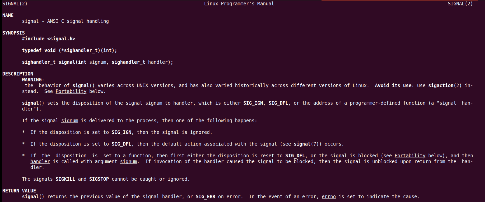

## 概述

- ==**task PA1.1: 实现单步执行, 打印寄存器状态, 扫描内存**==
- ==**task PA1.2: 实现算术表达式求值**==
- ==**task PA1.3: 实现所有要求, 提交完整的实验报告**==


​	

## ISA

大部分课本上都会有类似"ISA是软件和硬件之间的接口"这种诠释, 但对于还不了解软件和硬件之间如何协同工作的你来说, "接口"这个词还是太抽象了.

为了理解ISA, 我们可以用现实生活中的例子来比喻: 螺钉和螺母是生活中两种常见的物品, 它们一般需要配对来使用. 给定一个螺钉, 那就要找到一个符合相同尺寸规范的螺母才能配合使用, 反之亦然.

在计算机世界中也是类似的: 不同架构的计算机(或者说硬件)好比不同尺寸的螺钉, 不同架构的程序(或者说软件)就相当于是不同尺寸的螺母, 如果一个程序要在特定架构的计算机上运行, 那么这个程序和计算机就必须是符合同一套规范才行.

**因此, ==ISA的本质就是类似这样的规范==. 所以ISA的存在形式既不是硬件电路, 也不是软件代码, 而是一本规范手册.**

> 新视角：约定好的规范，像法律一样？

和螺钉螺母的生产过程类似, 计算机硬件是按照ISA规范手册构造出来的, 而程序也是按照ISA规范手册编写(或生成)出来的, 至于ISA规范里面都有哪些内容, 我们应该如何构造一个符合规范的计算机, 程序应该如何遵守这些规范来在计算机上运行, 回答这些问题正是做PA的一个目标.


## TRM

### 最简单的计算机

为了执行程序, 首先要解决的第一个问题, 就是要把程序放在哪里. 显然, 我们不希望自己创造的计算机只能执行小程序. 因此, 我们需要一个足够大容量的部件, 来放下各种各样的程序, 这个部件就是存储器. **于是, 先驱创造了存储器, 并把程序放在存储器中, 等待着CPU去执行.**

等等, CPU是谁? 你也许很早就听说过它了, 不过现在还是让我们来重新介绍一下它吧. CPU是先驱最伟大的创造, 从它的中文名字"中央处理器"就看得出它被赋予了至高无上的荣耀: CPU是负责处理数据的核心电路单元, 也就是说, 程序的执行全靠它了. 但只有存储器的计算机还是不能进行计算. 自然地, CPU需要肩负起计算的重任, 先驱为CPU创造了运算器, 这样就可以对数据进行各种处理了. **如果觉得运算器太复杂, 那就先来考虑一个加法器吧.**

先驱发现, 有时候程序需要对同一个数据进行连续的处理. 例如要计算`1+2+...+100`, 就要对部分和`sum`进行累加, 如果每完成一次累加都需要把它写回存储器, 然后又把它从存储器中读出来继续加, 这样就太不方便了. 同时天下也没有免费的午餐, **存储器的大容量也是需要付出相应的代价的, 那就是速度慢,** 这是先驱也无法违背的材料特性规律. **于是先驱为CPU创造了寄存器, 可以让CPU把正在处理中的数据暂时存放在其中.**

寄存器的速度很快, 但容量却很小, 和存储器的特性正好互补, 它们之间也许会交织出新的故事呢, 不过目前我们还是顺其自然吧.


- **==思考题==**

    > 计算机可以没有寄存器吗? (建议二周目思考)
    >
    > 如果没有寄存器, 计算机还可以工作吗? 如果可以, 这会对硬件提供的编程模型有什么影响呢?
    >
    > 就算你是二周目来思考这个问题, 你也有可能是第一次听到"编程模型"这个概念. 
    >
    > 不过如果一周目的时候你已经仔细地阅读过ISA手册, 你会记得确实有这么个概念. 所以, 如果想知道什么是编程模型, RTFM吧.

    1. 能不能工作

        我觉得是可以的。为什么要提出寄存器，看看上面的历史，先驱为了提高一下计算机处理运行的速度，不想从容量大但是速度慢的存储器中，来回地存取数据，能不能有一个速度快，存放中间结果的地方，要用我就去这里存，从而创造了寄存器。

        如果没有寄存器，那就得不断地从存储器中取数据，运算，放数据...

        可以是可以做，但是很慢欸...

        回想冯诺依曼架构的组成部分，运算器、控制器、存储、输入输出。

        有说存储器里还有个寄存器吗？没有吧？（这个还真不知道，要不回去看看冯诺依曼的历史手稿）

        > 相关资料：
        >
        > [冯诺依曼结构 - 维基百科，自由的百科全书 (wikipedia.org)](https://zh.wikipedia.org/wiki/冯诺伊曼结构)
        >
        > "在使用Mark I和ENIAC的过程中，他意识到了存储程序的重要性，从而提出了存储程序逻辑架构。"

        继续，假如没有，我们要造的计算机就从存储器里面取要执行的指令，也将各种运算结果放到存储器里，这样子，那就得好好规划存储器的区域了，不然数据和指令搞错了怎么办？

    2. 编程模型

        好的，既然能工作了，那编程模型又是什么？ISA手册中有？

        看 riscv manual Ⅰ和GPT
        
        
        
        > 编程模型（Programming model）是指一种描述计算机程序运行方式的抽象概念。它定义了程序员与计算机系统之间的交互方式，包括如何表示数据、如何组织代码、如何控制程序的执行流程等。
        >
        > 编程模型通常包含一组规则，用于指导程序员创建程序，并定义了程序员需要使用的特定编程语言、API、库和工具集。编程模型的设计可以极大地影响程序的可维护性、可扩展性和可重用性。
        >
        > 常见的编程模型包括面向过程编程（Procedural Programming）、面向对象编程（Object-Oriented Programming）、函数式编程（Functional Programming）、事件驱动编程（Event-Driven Programming）等。每种编程模型都有其独特的特点，可以根据不同的需求选择合适的编程模型来进行编程。
        
        > 在计算机体系结构中，"编程模型"（Programming Model）是指程序员在编写程序时所依赖的抽象概念和行为规范。它定义了程序如何与计算机硬件交互，包括指令集、寄存器使用、内存访问、I/O操作以及异常和中断处理等。编程模型是硬件架构与软件之间的桥梁，为程序员提供了一个相对简化和一致的接口来编写软件。
        >
        > 以下是一些常见的编程模型组成部分的例子：
        >
        > 1. **指令集的复杂性**：
        >     - **CISC（复杂指令集计算机）**：如x86架构，提供了丰富的指令集，包括复杂操作和多种寻址模式。
        >     - **RISC（精简指令集计算机）**：如ARM和RISC-V，指令集相对简单，易于硬件实现，强调指令的快速执行。
        > 2. **寄存器的数量和用途**：
        >     - 通用寄存器：用于存储数据和中间计算结果。
        >     - 专用寄存器：如程序计数器（PC）、堆栈指针（SP）等，具有特定用途。
        > 3. **内存管理和I/O访问方式**：
        >     - 内存模型：如冯·诺依曼模型和哈佛模型，决定了指令和数据的存储方式。
        >     - 内存访问指令：如加载（load）和存储（store）指令，用于数据的读取和写入。
        > 4. **异常和中断处理机制**：
        >     - 异常：硬件或软件触发的事件，如除零错误、非法指令等。
        >     - 中断：外部或内部事件触发的中断请求，如I/O完成、定时器到期等。
        > 5. **其他特性**：
        >     - 寻址模式：如直接寻址、间接寻址、基址加偏移量寻址等。
        >     - 条件执行：根据特定的条件执行或跳过指令。
        >     - 流水线：指令执行的流水线化，提高指令吞吐率。
        >
        > ### 举例说明
        >
        > - **x86架构**：典型的CISC架构，具有丰富的指令集和多种寻址模式。x86的编程模型支持多种数据类型和复杂的内存访问指令。
        > - **ARM架构**：一种广泛使用的RISC架构，具有较少的指令和寄存器，但强调指令的快速执行和低功耗。ARM提供了多种内存管理和I/O访问机制。
        > - **MIPS架构**：另一种RISC架构，以其简单和一致的指令集而闻名。MIPS的编程模型包括通用寄存器、程序计数器和堆栈指针等。
        > - **RISC-V架构**：一个开源的RISC指令集架构，设计简洁，易于教学和研究。RISC-V的编程模型包括用户模式和特权模式，支持异常和中断处理。
        >
        > ### 总结
        >
        > 编程模型是理解特定ISA（指令集架构）的基础，它定义了程序员如何与硬件交互。不同的ISA有不同的编程模型，这些模型反映了架构的设计哲学和目标应用场景。了解编程模型有助于程序员编写更有效、更可移植的代码。
        
        好像都没有明确说明或者定义 programming model 到底是个什么？而且不同领域对这个词的定义也不同。只能从手册里的涉及到的内容推测一些。**所以可以推断出这个所谓的编程模型应该是和各种 ISA 所规定的访存操作乃至如何与硬件交互有关的东西，而不是什么面向对象、函数式（应该叫编程范式）**。比如说不同ISA下，RISC和CISC的差异，寄存器的数量，如何内存管理等等，这些内容。
        
        再回到题目问的问题，没有寄存器，对于编程模型的影响。
        
        没有了寄存器，CPU就得一直从存储器中取得数据和指令，那也就没有必要什么 `load` 和 `store` 指令，直接分为 读存储，写存储就行了，这样子 weak 了硬件设计？（不清楚？），但是复杂化了编程模型，程序员需要考虑更加的问题。
        
        > 1. 假如没有了寄存器，那PC也没有了，那我们怎么处理控制流的管理，这样子分支和跳转操作将更加复杂。。。每次都要去内存中读取下一条指令的地址。
        > 2. 更慢的指令执行速度
        > 3. 内存访问次数增加 --> 慢
        > 4. 增加数据开销
        > 5. 程序员需要考虑数据在内存中的布局和访问模式，增加了编程的复杂性。
        > 6. 。。。


**计算机本质上做的事情：**

> ```C
> while (1) {
>   从PC指示的存储器位置取出指令;
>   执行指令;
>   更新PC;
> }
> ```
>
> 这样, 我们就有了一个足够简单的计算机了. 我们只要将一段指令序列放置在存储器中, 然后让PC指向第一条指令, 计算机就会自动执行这一段指令序列, 永不停止.
>
> 例如, 下面的指令序列可以计算`1+2+...+100`, 其中`r1`和`r2`是两个寄存器, 还有一个隐含的程序计数器`PC`, 它的初值是`0`. 为了帮助大家理解, 我们把指令的语义翻译成C代码放在右侧, 其中每一行C代码前都添加了一个语句标号:
>
> ```text
> // PC: instruction    | // label: statement
> 0: mov  r1, 0         |  pc0: r1 = 0;
> 1: mov  r2, 0         |  pc1: r2 = 0;
> 2: addi r2, r2, 1     |  pc2: r2 = r2 + 1;
> 3: add  r1, r1, r2    |  pc3: r1 = r1 + r2;
> 4: blt  r2, 100, 2    |  pc4: if (r2 < 100) goto pc2;   // branch if less than
> 5: jmp 5              |  pc5: goto pc5;
> ```
>
> 计算机执行以上的指令序列, 最后会在`PC=5`处的指令陷入死循环, 此时计算已经结束, `1+2+...+100`的结果会存放在寄存器`r1`中.

为了表达对图灵的敬仰, 我们也把上面这个最简单的计算机称为"图灵机"(Turing Machine, TRM). 或许你已经听说过"图灵机"这个作为计算模型时的概念, 不过在这里我们只强调作为一个最简单的真实计算机需要满足哪些条件:

- 结构上, TRM有存储器, 有PC, 有寄存器, 有加法器
- 工作方式上, TRM不断地重复以下过程: 从PC指示的存储器位置取出指令, 执行指令, 然后更新PC

咦? 存储器, 计数器, 寄存器, 加法器, 这些不都是数字电路课上学习过的部件吗? 也许你会觉得难以置信, 但先驱说, 你正在面对着的那台无所不能的计算机, 就是由数字电路组成的! 不过, 我们在程序设计课上写的程序是C代码. 但如果计算机真的是个只能懂0和1的巨大数字电路, 这个冷冰冰的电路又是如何理解凝结了人类智慧结晶的C代码的呢? 先驱说, 计算机诞生的那些年还没有C语言, 大家都是直接编写对人类来说晦涩难懂的机器指令, 那是他所见过的最早的对电子计算机的编程方式了. 后来人们发明了高级语言和编译器, 能把我们写的高级语言代码进行各种处理, 最后生成功能等价的, CPU能理解的指令. CPU执行这些指令, 就相当于是执行了我们写的代码. 今天的计算机本质上还是"存储程序"这种天然愚钝的工作方式, 是经过了无数计算机科学家们的努力, 我们今天才可以轻松地使用计算机.


## 程序是个状态机

> ICS课本的1.1.3小节中介绍了一个很简单的计算机. 这个计算机有4个8位的寄存器, 一个4位PC, 以及一段16字节的内存(也就是存储器), 那么这个计算机可以表示比特总数为`B = 4*8 + 4 + 16*8 = 164`, 因此这个计算机总共可以有`N = 2^B = 2^164`种不同的状态. 假设这个在这个计算机中, 所有指令的行为都是确定的, 那么给定`N`个状态中的任意一个, 其转移之后的新状态也是唯一确定的. 一般来说`N`非常大, 下图展示了`N=50`时某计算机的状态转移图.


给定一个程序，放到计算机的内存里面，在 N 多个状态中指定一个状态，即为初始状态，程序运行的过程就是

从这个初始状态开始 --> 每执行完一条指令 --> 进行一次确定的状态转移。

也就是说, 程序也可以看成一个状态机！这个状态机是上文提到的大状态机(状态数量为`N`)的子集.

> example：
>
> ```C
> 8->1->32->31->32->31->...
> ```
>
> ```assembly
> // PC: instruction    | // label: statement
> 0: addi r1, r2, 2     |  pc0: r1 = r2 + 2;
> 1: subi r2, r1, 1     |  pc1: r2 = r1 - 1;
> 2: nop                |  pc2: ;  // no operation
> 3: jmp 2              |  pc3: goto pc2;
> ```

> 从状态机视角理解程序运行：
>
> 以`1+2+...+100`的指令序列为例, 尝试画出这个程序的状态机.
>
> 这个程序比较简单, 需要更新的状态只包括`PC`和`r1`, `r2`这两个寄存器, 因此我们用一个三元组`(PC, r1, r2)`就可以表示程序的所有状态, 而无需画出内存的具体状态. 
>
> 初始状态是`(0, x, x)`, 此处的`x`表示未初始化. 程序`PC=0`处的指令是`mov r1, 0`, 执行完之后`PC`会指向下一条指令, 因此下一个状态是`(1, 0, x)`. 如此类推, 我们可以画出执行前3条指令的状态转移过程:
>
> ```markdown
> (0, x, x) -> (1, 0, x) -> (2, 0, 0) -> (3, 0, 1)....
> ```
>
> 请你尝试继续画出这个状态机, 其中程序中的循环只需要画出前两次循环和最后两次循环即可.

有点怪？PC的顺序

pc, r1, r2

```assembly
mov r1,0
mov r2,0
add r2, 1
add r1, r2
jmp 3
...
```

(0, x, x) -> (1, 0, x) -> (2, 0, 0) -> (3, 0, 1) -> (4, 1, 1) -> (2, 1, 1) -> (3, 1, 2) -> (4, 3, 2) 

-> (2, 3, 2) ->(3, 3, 3) ->(4, 6, 3) ....-->... (2, 4851, 98) -> (3, 4851, 99) -> (4, 4950, 99) 

-> (2, 4950, 99) -> (3, 4950, 100) -> (4, 5050, 100) -> (5, 5050, 100)->...


x86：


RISC-V：


这种视角和汇编对应起来很像啊！


> 我们其实可以从两个互补的视角来看待同一个程序:
>
> - 一个是以==**代码(或指令序列)为表现形式的静态视角**==, 大家经常说的"写程序"/"看代码", 其实说的都是这个静态视角. 这个视角的一个好处是描述精简, 分支, 循环和函数调用的组合使得我们可以通过少量代码实现出很复杂的功能. 但这也可能会使得我们对程序行为的理解造成困难.
> - 另一个是以==**状态机的状态转移为运行效果的动态视角**== , 它直接刻画了"程序在计算机上运行"的本质. 但这一视角的状态数量非常巨大, 程序代码中的所有循环和函数调用都以指令的粒度被完全展开, 使得我们难以掌握程序的整体语义. 但对于程序的局部行为, 尤其是从静态视角来看难以理解的行为, 状态机视角可以让我们**清楚地了解相应的细节**.

>  程序的状态机视角有什么好处?
>
> 有一些程序看上去很简单, 但行为却不那么直观, 比如递归. 要很好地理解递归程序在计算机上如何运行, 从状态机视角来看程序行为才是最有效的做法, 因为这一视角可以帮助你**理清每一条指令究竟如何修改计算机的状态, 从而实现宏观上的递归语义**. 
>
> > ICS理论课的第三章会专门分析其中的细节

>  "程序在计算机上运行"的微观视角: 程序是个状态机 
>
> "程序是个状态机"这一视角对ICS和PA来说都是非常重要的, 因为"理解程序如何在计算机上运行"就是ICS和PA的根本目标. 至于这个问题的宏观视角, 我们将会在PA的中期来介绍.
>
> 目的：**==养成从状态机的视角来理解程序行为的意识。==**

一大堆数字逻辑电路组合在一起，时序 + 组合，构成了计算机这个巨无霸。


- 偶尔看到：

    [(94 封私信 / 80 条消息) 什么才算是真正的编程能力？](https://www.zhihu.com/question/31034164/answer/1597364876)


## RTFSC

#### NEMU 结构

- CPU
- memory
- monitor
- 设备 device （PA2介绍）

> Monitor(监视器)模块是为了方便地监控客户计算机的运行状态而引入的. 它除了负责与GNU/Linux进行交互(例如读入客户程序)之外, 还带有调试器的功能, 为NEMU的调试提供了方便的途径. 
>
> 从概念上来说, monitor并不属于一个计算机的必要组成部分, 但对NEMU来说, 它是必要的基础设施. 如果缺少monitor模块, 对NEMU的调试将会变得十分困难.


#### 框架代码

```bash
ysyx-workbench
├── abstract-machine   # 抽象计算机
├── am-kernels         # 基于抽象计算机开发的应用程序
├── fceux-am           # 红白机模拟器
├── init.sh            # 初始化脚本
├── Makefile           # 用于工程打包提交
├── nemu               # NEMU
└── README.md
```

```bash
nemu
├── configs                    # 预先提供的一些配置文件
├── include                    # 存放全局使用的头文件
│   ├── common.h               # 公用的头文件
│   ├── config                 # 配置系统生成的头文件, 用于维护配置选项更新的时间戳
│   ├── cpu
│   │   ├── cpu.h
│   │   ├── decode.h           # 译码相关
│   │   ├── difftest.h
│   │   └── ifetch.h           # 取指相关
│   ├── debug.h                # 一些方便调试用的宏
│   ├── device                 # 设备相关
│   ├── difftest-def.h
│   ├── generated
│   │   └── autoconf.h         # 配置系统生成的头文件, 用于根据配置信息定义相关的宏
│   ├── isa.h                  # ISA相关
│   ├── macro.h                # 一些方便的宏定义
│   ├── memory                 # 访问内存相关
│   └── utils.h
├── Kconfig                    # 配置信息管理的规则
├── Makefile                   # Makefile构建脚本
├── README.md
├── resource                   # 一些辅助资源
├── scripts                    # Makefile构建脚本
│   ├── build.mk
│   ├── config.mk
│   ├── git.mk                 # git版本控制相关
│   └── native.mk
├── src                        # 源文件
│   ├── cpu
│   │   └── cpu-exec.c         # 指令执行的主循环
│   ├── device                 # 设备相关
│   ├── engine
│   │   └── interpreter        # 解释器的实现
│   ├── filelist.mk
│   ├── isa                    # ISA相关的实现
│   │   ├── mips32
│   │   ├── riscv32
│   │   ├── riscv64
│   │   └── x86
│   ├── memory                 # 内存访问的实现
│   ├── monitor
│   │   ├── monitor.c		   # 
│   │   └── sdb                # 简易调试器
│   │       ├── expr.c         # 表达式求值的实现
│   │       ├── sdb.c          # 简易调试器的命令处理
│   │       └── watchpoint.c   # 监视点的实现
│   ├── nemu-main.c            # 你知道的...
│   └── utils                  # 一些公共的功能
│       ├── log.c              # 日志文件相关
│       ├── rand.c
│       ├── state.c
│       └── timer.c
└── tools                      # 一些工具
    ├── fixdep                 # 依赖修复, 配合配置系统进行使用
    ├── gen-expr
    ├── kconfig                # 配置系统
    ├── kvm-diff
    ├── qemu-diff
    └── spike-diff
```

> 为了支持不同的ISA, 框架代码把NEMU分成两部分: 
>
> - **ISA无关的基本框架**
> - **ISA相关的具体实现**. 
>
> NEMU把ISA相关的代码专门放在 `nemu/src/isa/` 目录下, 并通过 `nemu/include/isa.h` 提供ISA相关API的声明. 这样以后, `nemu/src/isa/ `之外的其它代码就展示了NEMU的基本框架. 这样做有两点好处:
>
> - 有助于我们认识不同ISA的共同点: 无论是哪种ISA的客户计算机, 它们都具有相同的基本框架
>
> - 体现抽象的思想: 框架代码将ISA之间的差异抽象成API, 基本框架会调用这些API, 从而无需关心ISA的具体细节. 如果你将来打算选择一个不同的ISA来进行二周目的攻略, 你就能明显体会到抽象的好处了: 基本框架的代码完全不用修改!
>
>     [NEMU ISA相关的API说明文档 | 官方文档 (oscc.cc)](https://ysyx.oscc.cc/docs/ics-pa/nemu-isa-api.html)


#### 配置系统和项目构建

> 在一个有一定规模的项目中, 可配置选项的数量可能会非常多, 而且配置选项之间可能会存在关联, 比如打开配置选项A之后, 配置选项B就必须是某个值. 
>
> 直接让开发者去管理这些配置选项是很容易出错的, 比如修改选项A之后, 可能会忘记修改和选项A有关联的选项B. 
>
> 配置系统的出现则是为了解决这个问题.


##### 配置系统kconfig

```bash
nemu/tools/kconfig
```

> 开发者可以使用这套语言来编写"配置描述文件". 在"配置描述文件"中, 开发者可以描述:
>
> - 配置选项的属性, 包括类型, 默认值等
> - 不同配置选项之间的关系
> - 配置选项的层次关系


目前仅关注配置系统生成的：

- `nemu/include/generated/autoconf.h`, 阅读C代码时使用
- `nemu/include/config/auto.conf`, 阅读Makefile时使用


##### 项目构建和Makefile

```makefile
# Sanity check
ifeq ($(wildcard $(NEMU_HOME)/src/nemu-main.c),)
  $(error NEMU_HOME=$(NEMU_HOME) is not a NEMU repo)
endif

# Include variables and rules generated by menuconfig
-include $(NEMU_HOME)/include/config/auto.conf
-include $(NEMU_HOME)/include/config/auto.conf.cmd

remove_quote = $(patsubst "%",%,$(1))

# Extract variabls from menuconfig
GUEST_ISA ?= $(call remove_quote,$(CONFIG_ISA))
ENGINE ?= $(call remove_quote,$(CONFIG_ENGINE))
NAME    = $(GUEST_ISA)-nemu-$(ENGINE)

# Include all filelist.mk to merge file lists
FILELIST_MK = $(shell find -L ./src -name "filelist.mk")
include $(FILELIST_MK)

# Filter out directories and files in blacklist to obtain the final set of source files
DIRS-BLACKLIST-y += $(DIRS-BLACKLIST)
SRCS-BLACKLIST-y += $(SRCS-BLACKLIST) $(shell find -L $(DIRS-BLACKLIST-y) -name "*.c")
SRCS-y += $(shell find -L $(DIRS-y) -name "*.c")
SRCS = $(filter-out $(SRCS-BLACKLIST-y),$(SRCS-y))

# Extract compiler and options from menuconfig
CC = $(call remove_quote,$(CONFIG_CC))
CFLAGS_BUILD += $(call remove_quote,$(CONFIG_CC_OPT))
CFLAGS_BUILD += $(if $(CONFIG_CC_LTO),-flto,)
CFLAGS_BUILD += $(if $(CONFIG_CC_DEBUG),-Og -ggdb3,)
CFLAGS_BUILD += $(if $(CONFIG_CC_ASAN),-fsanitize=address,)
CFLAGS_TRACE += -DITRACE_COND=$(if $(CONFIG_ITRACE_COND),$(call remove_quote,$(CONFIG_ITRACE_COND)),true)
CFLAGS  += $(CFLAGS_BUILD) $(CFLAGS_TRACE) -D__GUEST_ISA__=$(GUEST_ISA)

# Linker configuration options
LDFLAGS += $(CFLAGS_BUILD)

# Include rules for menuconfig
include $(NEMU_HOME)/scripts/config.mk

# Target Architecture and Build Rules
ifdef CONFIG_TARGET_AM
include $(AM_HOME)/Makefile
LINKAGE += $(ARCHIVES)
else
# Include rules to build NEMU
include $(NEMU_HOME)/scripts/native.mk
endif

```

> Makefile 框架：自动化NEMU的模拟器构建过程。
>
> 1. 首先检查必要的配置和文件是否存在。
>     1. Sanity check
>     2. Include variables and rules generated by menuconfig
>     3. Extract variabls from menuconfig
> 2. 再根据用户配置选项来最终确定编译目标、源文件、编译选项。
>     1. Include all filelist.mk to merge file lists
>     2. Filter out directories and files in blacklist to obtain the final set of source files
>     3. Extract compiler and options from menuconfig
>     4. Linker configuration options
>     5. Include rules for menuconfig
>     6. Target Architecture and Build Rules


- 与配置系统关联

    通过包含`nemu/include/config/auto.conf`, 与kconfig生成的变量进行关联. 

    因此在通过menuconfig更新配置选项后, Makefile的行为可能也会有所变化.

    

- 文件列表 (filelist)

    通过文件列表(filelist)决定最终参与编译的源文件. 

    在`nemu/src`及其子目录下存在一些名为`filelist.mk`的文件, 它们会根据menuconfig的配置对如下4个变量进行维护:

    - `SRCS-y` - 参与编译的源文件的候选集合
    - `SRCS-BLACKLIST-y` - 不参与编译的源文件的黑名单集合
    - `DIRS-y` - 参与编译的目录集合, 该目录下的所有文件都会被加入到`SRCS-y`中
    - `DIRS-BLACKLIST-y` - 不参与编译的目录集合, 该目录下的所有文件都会被加入到`SRCS-BLACKLIST-y`中

    Makefile会包含项目中的所有`filelist.mk`文件, 对上述4个变量的追加定义进行汇总, 最终会过滤出在`SRCS-y`中但不在`SRCS-BLACKLIST-y`中的源文件, 来作为最终参与编译的源文件的集合.

    > More：
    >
    > 上述4个变量还可以与menuconfig的配置结果中的布尔选项进行关联, 
    >
    > 例如`DIRS-BLACKLIST-$(CONFIG_TARGET_AM) += src/monitor/sdb`, 
    >
    > - 当我们在menuconfig中选择了`TARGET_AM`相关的布尔选项时, kconfig最终会在`nemu/include/config/auto.conf`中生成形如`CONFIG_TARGET_AM=y`的代码, 对变量进行展开后将会得到`DIRS-BLACKLIST-y += src/monitor/sdb`; 
    >
    > - 当我们在menuconfig中未选择`TARGET_AM`相关的布尔选项时, kconfig将会生成形如`CONFIG_TARGET_AM=n`的代码, 或者未对`CONFIG_TARGET_AM`进行定义, 此时将会得到`DIRS-BLACKLIST-n += src/monitor/sdb`, 或者`DIRS-BLACKLIST- += src/monitor/sdb`, 这两种情况都不会影响`DIRS-BLACKLIST-y`的值, 从而实现了如下效果:
    >
    > ```text
    > 在menuconfig中选中TARGET_AM时, nemu/src/monitor/sdb目录下的所有文件都不会参与编译.
    > ```


- 编译和链接

    Makefile的编译规则在`nemu/scripts/build.mk`中定义:

    ```makefile
    $(OBJ_DIR)/%.o: %.c
      @echo + CC $<
      @mkdir -p $(dir $@)
      @$(CC) $(CFLAGS) -c -o $@ $<
      $(call call_fixdep, $(@:.o=.d), $@)
    ```

    > `call_fixdep`的调用用于生成更合理的依赖关系, 目前我们主要关注编译的命令, 因此可以先忽略`call_fixdep`.
    >
    > 我们可以先查看`make`过程中都运行了哪些命令, 然后反过来理解`$(CFLAGS)`等变量的值. 
    >
    > 为此, 我们可以键入`make -nB`, 它会让`make`程序以"只输出命令但不执行"的方式强制构建目标. 

    **Tips：也是一个查看学习大型项目Makefile的好方法：只输出命令但不运行 `make -nB`**

    


#### 准备第一个客户程序

就像世界上第一个程序是怎么让他装载计算机上运行起来的？手动装载啊！

> 【拓展】：
>
> BIOS和计算机启动
>
> 我们知道内存是一种RAM, 是一种易失性的存储介质, 这意味着计算机刚启动的时候, 内存中的数据都是无意义的; 而BIOS是固化在ROM/Flash中的, 它们都是非易失性的存储介质, BIOS中的内容不会因为断电而丢失.
>
> 因此在真实的计算机系统中, 计算机启动后首先会把控制权交给BIOS, BIOS经过一系列初始化工作之后, 再从磁盘中将有意义的程序读入内存中执行. 对这个过程的模拟需要了解很多超出本课程范围的细节, 
>
> ==**我们在PA中做了简化: 采取约定的方式让CPU直接从约定的内存位置开始执行.**==
>
> 【剧透】：
>
> 你使用windows的时候, 开机过程一般都会播放相应的开机动画, 然后不知道怎么就进入登录画面了, 这显然不能满足CSer的求知欲. 事实上, 在GNU/Linux中, 你可以很容易得知操作系统在背后做了些什么**. 键入`sudo dmesg`, 就可以输出操作系统的启动日志, 操作系统的行为一览无余.**
>
> 不过, 目前你的知识可能还无法理解其中的奥秘. 但你无需为此感到沮丧, 在PA的中后期, 你将会在NEMU上运行一个小型操作系统Nanos-lite. 虽然和GNU/Linux相比, Nanos-lite可以说是沧海一粟, 但你将会完全明白操作系统启动过程中的一些关键步骤, 操作系统的大门也将会为你敞开.

我们的客户程序一开始并不在客户计算机上，所以我们需要手动地将客户程序读入到客户计算机中。**----> 交给 `monitor` 负责：RTFSC**

1. 搞懂 `init_monitor()` 

    ```C
    void init_monitor(int argc, char *argv[]) {
      /* Perform some global initialization. */
    
      /* Parse arguments. */
      parse_args(argc, argv);
    
      /* Set random seed. */
      init_rand();
    
      /* Open the log file. */
      init_log(log_file);
    
      /* Initialize memory. */
      init_mem();
    
      /* Initialize devices. */
      IFDEF(CONFIG_DEVICE, init_device());
    
      /* Perform ISA dependent initialization. */
      init_isa();
    
      /* Load the image to memory. This will overwrite the built-in image. */
      long img_size = load_img();
    
      /* Initialize differential testing. */
      init_difftest(diff_so_file, img_size, difftest_port);
    
      /* Initialize the simple debugger. */
      init_sdb();
    
    #ifndef CONFIG_ISA_loongarch32r
      IFDEF(CONFIG_ITRACE, init_disasm(
        MUXDEF(CONFIG_ISA_x86,     "i686",
        MUXDEF(CONFIG_ISA_mips32,  "mipsel",
        MUXDEF(CONFIG_ISA_riscv,
          MUXDEF(CONFIG_RV64,      "riscv64",
                                   "riscv32"),
                                   "bad"))) "-pc-linux-gnu"
      ));
    #endif
    
      /* Display welcome message. */
      welcome();
    }
    
    ```

    > 为什么这个函数里面的代码都是函数调用，按道理讲，把相应的函数体在`init_monitor()`中展开也不影响代码的正确性. 相比之下, 在这里使用函数有什么好处呢？
    >
    > 1. **模块化**：每个函数调用代表一个模块化的组件，这使得代码更加清晰和易于管理。每个函数可以独立于其他函数进行测试、调试和维护。
    >
    > 2. **可重用性**：通过将代码封装在函数中，可以重用这些函数，减少重复代码，提高代码的可维护性。
    >
    > 3. **可读性**：函数调用提供了一种更高层次的抽象，使得阅读者可以快速理解代码的流程，而不必深入了解每个函数的具体实现细节。
    >
    > 4. **灵活性**：如果需要更改某个功能的具体实现，只需要修改相应的函数，而不需要修改调用该函数的所有地方。
    >
    > 5. **易于扩展**：当需要添加新功能时，可以简单地添加新的函数，并在`init_monitor()`中添加一个调用，而不需要重构整个初始化流程。
    >
    > 6. **条件编译**：使用`IFDEF`和`MUXDEF`这样的预处理器指令可以方便地进行条件编译，这在处理不同配置和平台时非常有用。
    >
    > 7. **错误隔离**：如果某个函数中出现错误，它不会影响到其他函数的执行，这有助于定位和解决问题。
    >
    > 8. **性能优化**：在某些情况下，可以对单独的函数进行性能优化，而不影响其他部分。
    >
    > 9. **接口标准化**：函数提供了一种标准化的接口，使得其他开发者可以更容易地理解和使用这些功能。
    >
    > 10. **维护历史记录**：函数调用的形式有助于维护代码的历史记录，因为每个函数的变更都可以独立跟踪。
    >
    > 在`init_monitor()`中，每个函数调用都代表了一个特定的初始化步骤，这样做的好处是使得整个初始化过程更加结构化和易于管理。如果将所有函数体直接展开在`init_monitor()`中，虽然理论上不会影响代码的正确性，但会导致代码变得难以阅读和维护，同时也失去了上述提到的许多好处。
    
    1. parse_args()
    
        ```C
          static int parse_args(int argc, char *argv[]) {
            const struct option table[] = {
              {"batch"    , no_argument      , NULL, 'b'},
              {"log"      , required_argument, NULL, 'l'},
              {"diff"     , required_argument, NULL, 'd'},
              {"port"     , required_argument, NULL, 'p'},
              {"help"     , no_argument      , NULL, 'h'},
              {0          , 0                , NULL,  0 },
            };
            int o;
            while ( (o = getopt_long(argc, argv, "-bhl:d:p:", table, NULL)) != -1) {
              switch (o) {
                case 'b': sdb_set_batch_mode(); break;
                case 'p': sscanf(optarg, "%d", &difftest_port); break;
                case 'l': log_file = optarg; break;
                case 'd': diff_so_file = optarg; break;
                case 1: img_file = optarg; return 0;
                default:
                  printf("Usage: %s [OPTION...] IMAGE [args]\n\n", argv[0]);
                  printf("\t-b,--batch              run with batch mode\n");
                  printf("\t-l,--log=FILE           output log to FILE\n");
                  printf("\t-d,--diff=REF_SO        run DiffTest with reference REF_SO\n");                                                                
                  printf("\t-p,--port=PORT          run DiffTest with port PORT\n");
                  printf("\n");
                  exit(0);
              }
            }
            return 0;
          }
        
        ```
    
        原来命令行解析参数可以这么写，主要用到这个 `getopt_long` 函数，专门用来解析参数
    
        
    
        
    
        

        

        

        原来奇怪的 `struct option` 在这个头文件里面
    
        
    
    2. init_rand()
    
        > src/utils/timer.c 
    
        ```C
        // 随机数种子
        void init_rand() {
            srand(get_time_internal());
        }    
        ```
    
        

    3. init_log()

        > src/utils/log.c 
        >
        > 初始日志
    
        ```C
        void init_log(const char *log_file) {                                                                                                            
          log_fp = stdout;
          if (log_file != NULL) {
            FILE *fp = fopen(log_file, "w");
            Assert(fp, "Can not open '%s'", log_file);
            log_fp = fp;
          }
          Log("Log is written to %s", log_file ? log_file : "stdout");
        }
        
        ```
    
        
    
    4. init_mem()
    
        > src/memory/paddr.c 
        >
        > 初始内存
        
        ```c
        void init_mem() {
        #if   defined(CONFIG_PMEM_MALLOC)
          pmem = malloc(CONFIG_MSIZE);
          assert(pmem);
        #endif
          IFDEF(CONFIG_MEM_RANDOM, memset(pmem, rand(), CONFIG_MSIZE));
          Log("physical memory area [" FMT_PADDR ", " FMT_PADDR "]", PMEM_LEFT, PMEM_RIGHT);
        }
                    
        ```
    
        > include/config/auto.conf   
        
        ```C
        #
        # Automatically generated file; DO NOT EDIT.
        # NEMU Configuration Menu
        #
        CONFIG_DIFFTEST_REF_NAME="none"
        CONFIG_ENGINE="interpreter"
        CONFIG_PC_RESET_OFFSET=0
        CONFIG_TARGET_NATIVE_ELF=y
        CONFIG_MSIZE=0x8000000   
            /* 0x8000000 Byte= 128MB*/
        CONFIG_CC_O2=y
        CONFIG_MODE_SYSTEM=y
        CONFIG_MEM_RANDOM=y
        CONFIG_ITRACE=y
        CONFIG_ISA_riscv=y
        CONFIG_TRACE_END=10000
        CONFIG_MBASE=0x80000000
        CONFIG_TIMER_GETTIMEOFDAY=y
        CONFIG_ENGINE_INTERPRETER=y
        CONFIG_CC_OPT="-O2"
        CONFIG_RT_CHECK=y
        CONFIG_ITRACE_COND="true"
        CONFIG_CC="gcc"
        CONFIG_DIFFTEST_REF_PATH="none"
        CONFIG_TRACE_START=0
        CONFIG_CC_GCC=y
        CONFIG_TRACE=y
        CONFIG_ISA="riscv32"
        CONFIG_PMEM_GARRAY=y
        
        ```
    
    
    
    
    
    4. `init_isa()`  
    
         ```C
         static void restart() {
           /* Set the initial program counter. */
           cpu.pc = RESET_VECTOR;
         
           /* The zero register is always 0. */
           cpu.gpr[0] = 0;
         }
         
         void init_isa() {
           /* Load built-in image. */
           memcpy(guest_to_host(RESET_VECTOR), img, sizeof(img));
         
           /* Initialize this virtual computer system. */
           restart();
         }  
         ```
        
        1. 将客户内置的程序读到内存中 （BIOS）
    
            > 1. 客户程序是什么? 我们知道, 程序是由指令构成的, 而不同ISA的指令也各不相同(想象一下用不同的语言来表达"你好"的意思), 因而程序本身肯定是ISA相关的. 因此, 我们把内置客户程序放在`nemu/src/isa/$ISA/init.c`中. 内置客户程序的行为非常简单, 它只包含少数几条指令, 甚至算不上在做一些有意义的事情.
            >
            > 2. 内存是什么? 我们可以把内存看作一段连续的存储空间, 而内存又是字节编址的(即一个内存位置存放一个字节的数据), 
            >
            >     ==**在C语言中我们就很自然地使用一个`uint8_t`类型的数组来对内存进行模拟.**== 
            >
            >     ==**NEMU默认为客户计算机提供128MB的物理内存(见`nemu/src/memory/paddr.c`中定义的`pmem`),**==
            >
            > 3. 需要将客户程序读入到内存的什么位置? 为了让客户计算机的CPU可以执行客户程序, 因此我们需要一种方式让客户计算机的CPU知道客户程序的位置. 我们采取一种最简单的方式: 约定. 
            >
            >     **具体地, 我们让monitor直接把客户程序读入到一个固定的内存位置`RESET_VECTOR`. `RESET_VECTOR`的值在`nemu/include/memory/paddr.h`中定义.**
        
            直接理解成内存是一个超大型的一维数组，数组下标就是地址。C语言中好像没有二维数组的这个概念，还是一维更好理解。
    
        
    
        2. 初始化寄存器 ---> restart()
    
            > `init_isa()`的第二项任务是初始化寄存器, 这是通过`restart()`函数来实现的. 
            >
            > 在CPU中, 寄存器是一个结构化特征较强的存储部件, 在C语言中我们就很自然地使用相应的结构体来描述CPU的寄存器结构. 
            >
            > 不同ISA的寄存器结构也各不相同, 为此我们把寄存器结构体`CPU_state`的定义放在`nemu/src/isa/$ISA/include/isa-def.h`中, 并在`nemu/src/cpu/cpu-exec.c`中定义一个全局变量`cpu`. 
            >
            > 初始化寄存器的一个重要工作就是设置`cpu.pc`的初值, 我们需要将它设置成刚才加载客户程序的内存位置, 这样就可以让CPU从我们约定的内存位置开始执行客户程序了. 对于mips32和riscv32, 它们的0号寄存器总是存放`0`, 因此我们也需要对其进行初始化.
        
            > 【拓】
            >
            > x86的物理内存是从0开始编址的, 但对于一些ISA来说却不是这样, 例如mips32和riscv32的物理地址均从`0x80000000`开始. 
            >
            > 因此对于mips32和riscv32, 其`CONFIG_MBASE`将会被定义成`0x80000000`. 将来CPU访问内存时, 我们会将CPU将要访问的内存地址映射到`pmem`中的相应偏移位置, 这是通过`nemu/src/memory/paddr.c`中的`guest_to_host()`函数实现的. 
            >
            > 例如如果mips32的CPU打算访问内存地址`0x80000000`, 我们会让它最终访问`pmem[0]`, 从而可以正确访问客户程序的第一条指令. 这种机制有一个专门的名字, 叫 ==**地址映射**== , 在后续的PA中我们还会再遇到它.
        
            > Monitor 读入客户程序并对寄存器进行初始化后，这时的内存布局如下：
            >
            > ```text
            > pmem:
            > 
            > CONFIG_MBASE      RESET_VECTOR
            >    |                 |
            >    v                 v
            >    -----------------------------------------------
            >    |                 |                  |
            >    |                 |    guest prog    |
            >    |                 |                  |
            >    -----------------------------------------------
            >                      ^
            >                      |
            >                     pc
            > ```
            >
            > ```C
            > #define PMEM_LEFT  ((paddr_t)CONFIG_MBASE)
            > #define PMEM_RIGHT ((paddr_t)CONFIG_MBASE + CONFIG_MSIZE - 1)
            > #define RESET_VECTOR (PMEM_LEFT + CONFIG_PC_RESET_OFFSET)
            > ```
        
            
    
            怎么理解寄存器是一个结构化特征较强的存储部件？怎么理解下面的定义？
    
            CPU_state究竟是什么样的？为什么我在vim中的ctags跳转中找不到？究竟定义在什么地方？这些宏究竟怎么使用？

            ```C
            // isa-def.h
            
            typedef struct {
               word_t gpr[MUXDEF(CONFIG_RVE, 16, 32)];
               vaddr_t pc;
             } MUXDEF(CONFIG_RV64, riscv64_CPU_state, riscv32_CPU_state);
             
             // decode
             typedef struct {
               union {
                 uint32_t val;
               } inst;
             } MUXDEF(CONFIG_RV64, riscv64_ISADecodeInfo, riscv32_ISADecodeInfo);
            
            ```
        
            - 首先，为什么说寄存器是一个结构化特征较强的存储部件？
    
            - 这些用到的宏，究竟有什么用？
    
                ```C
                // nemu/include/macro.h 
                
                // macro concatenation
                #define concat_temp(x, y) x ## y
                #define concat(x, y) concat_temp(x, y)
                #define concat3(x, y, z) concat(concat(x, y), z)                                                                                                   
                #define concat4(x, y, z, w) concat3(concat(x, y), z, w)
                #define concat5(x, y, z, v, w) concat4(concat(x, y), z, v, w)
                
                    
                /* macro testing */
                // See https://stackoverflow.com/questions/26099745/test-if-preprocessor-symbol-is-defined-inside-macro
                #define CHOOSE2nd(a, b, ...) b
                #define MUX_WITH_COMMA(contain_comma, a, b) CHOOSE2nd(contain_comma a, b)
                #define MUX_MACRO_PROPERTY(p, macro, a, b) MUX_WITH_COMMA(concat(p, macro), a, b)
                // define placeholders for some property
                #define __P_DEF_0  X,
                #define __P_DEF_1  X,
                #define __P_ONE_1  X,
                #define __P_ZERO_0 X,
                // define some selection functions based on the properties of BOOLEAN macro
                #define MUXDEF(macro, X, Y)  MUX_MACRO_PROPERTY(__P_DEF_, macro, X, Y)
                #define MUXNDEF(macro, X, Y) MUX_MACRO_PROPERTY(__P_DEF_, macro, Y, X)
                #define MUXONE(macro, X, Y)  MUX_MACRO_PROPERTY(__P_ONE_, macro, X, Y)
                #define MUXZERO(macro, X, Y) MUX_MACRO_PROPERTY(__P_ZERO_,macro, X, Y)
                ```
                
            > 上面这些条件编译宏：
                >
                > 1. **选择宏** (`CHOOSE2nd`, `MUX_WITH_COMMA`, `MUX_MACRO_PROPERTY`):
                >     - 这些宏用于基于条件选择两个值中的一个。
                > 2. **测试宏属性** (`MUXDEF`, `MUXNDEF`, `MUXONE`, `MUXZERO`):
                >     - 这些宏用于根据另一个宏的属性选择一个值。
                >
                > 具体来看：
                >
                > `MUXDEF(macro, X, Y)` 这个宏的作用是：
                >
                > - 如果 `macro` 被定义了，那么它会选择 `X`。
                > - 如果 `macro` 没有被定义，那么它会选择 `Y`。
            
            结合宏定义和实际结构体定义：我们可以简单分析 `isa-def.h` 的第一个 `struct` 的内容：
                
            - 如果 `CONFIG_RV64` 被定义，那么这个 `typedef` 将会是 `riscv64_ISADecodeInfo` 类型。
                - 如果 `CONFIG_RV64` 没有被定义，那么这个 `typedef` 将会是 `riscv32_ISADecodeInfo` 类型。
                
                
                
            
            为了知道定义了哪个类型，我们需要查看编译时的配置或者查看 `CONFIG_RV64` 宏的定义：
                
            - 如果 `CONFIG_RV64` 被定义为 1 或者是一个非零值，那么会选择与 64 位相关的类型；
              
            - 如果没有定义或者定义为 0，那么会选择与 32 位相关的类型。
              
                > 再次复习：
                    >
                    > ##：连接两个符号形成新的符号
                    >
                    > #：转化为字符串。
        
            
            
        - 其次，为什么找不到这个定义呢？
          
            我个人认为是因为这个项目太大了，然后自己的知识有很匮乏，很多东西都一知半解，所以先不要怕，慢慢地看代码（注意：`Makefile` 也是代码）
            
            所以我们一步步分析：
            
            1. 通过第二步，我们知道我们定义了是rv64还是rv32，那我们继续找
            
                > 在`nemu/src/cpu/cpu-exec.c`中定义了一个全局变量`cpu`.
            
                
            
                看样子和 `cpu.h` 有关，find命令看看？
            
                
            
                找到了，看样子就是这个宏了！很熟悉！拼接宏！
            
                但是怎么理解呢？又出现了一些莫名其妙的东西，__ GUSEST_ISA __ ?
            
                仔细看注释，被定义在CFLAGS里了喔，
            
                回去看 `nemu/Makefile` 
            
                又有一些奇怪的 `Makefile` 用法了，继续复习看看？
            
                
            
                
        
        通过这些，大概明白__ GUSEST_ISA __ 是怎么来的了吧，简单总结下：
        
        1. 首先 `CONFIG_ISA` 是 `menuconfig` 中生成的配置文件，在 `auto.conf` 中找找看。
        2. 之后通过 `$(call remove_quote,$(CONFIG_ISA))` 调用 `remove_quote` 函数，传入 `CONFIG_ISA` 的值。如果 `CONFIG_ISA` 的值被引号包围，`remove_quote` 函数将去除这些引号。
        3. 再通过 `GUEST_ISA ?= ...`  设置 `GUEST_ISA` 变量
        4. 最终，`GUEST_ISA` 被用于编译标志 `-D__GUEST_ISA__=$(GUEST_ISA)`，这会定义一个宏 `__GUEST_ISA__`，其值等于 `GUEST_ISA` 的值。这个宏可以在代码中被用来根据 `GUEST_ISA` 的值来执行不同的编译时行为。
        5. 之后回到 `include/isa/h` 中 ，大概能理解 `CPU_state` 怎么来的了，那也就理解了关于寄存器的相关架构选择（通过各种魔法宏）
        6. 这样最后我们也完成了关于寄存器的相关初始化，初步明白这个内容
    
    
    
    
    
    
    
    
    
    1. `load_img()`
    
        > 这个函数会将一个有意义的客户程序从[镜像文件](https://en.wikipedia.org/wiki/Disk_image)读入到内存, 覆盖刚才的内置客户程序. 
        >
        > 这个镜像文件是运行NEMU的一个可选参数, 在运行NEMU的命令中指定. 如果运行NEMU的时候没有给出这个参数, NEMU将会运行内置客户程序
        


2. 直接开始

    ```bash
    make run
    ```


3. 自行解决

    运行NEMU之后你应该能看到相应的欢迎信息, 以及你选择的ISA. 请务必确认输出的ISA信息与你选择的ISA一致. 不过你会看到如下的错误信息:

    ```text
    [src/monitor/monitor.c:20 welcome] Exercise: Please remove me in the source code and compile NEMU again.
    riscv32-nemu-interpreter: src/monitor/monitor.c:21: welcome: Assertion `0' failed.
    ```


#### 运行第一个客户程序

运行之后：

函数执行流程：

`main()` --> `engine_start()` --> `sdb_mainloop()` --> `cmd_c()` --> `cpu_exec()` --> `execute()` --> `cpu_once()` 

--> `isa_exec_once()`

> `cpu_once()`：**这个函数的功能就是我们在上一小节中介绍的内容: 让CPU执行当前PC指向的一条指令, 然后更新PC.**


 

##### 关于 `nemu` 退出

> 由于刚才我们运行NEMU的时候并未给出客户程序的镜像文件, 此时NEMU将会运行上文提到的内置客户程序. NEMU将不断执行指令, 直到遇到以下情况之一, 才会退出指令执行的循环:
>
> - 达到要求的循环次数.
>
> - 客户程序执行了 `nemu_trap` 指令. 
>
>     这是一条虚构的特殊指令, 它是为了在NEMU中让客户程序指示执行的结束而加入的, NEMU在ISA手册中选择了一些用于调试的指令, 并将 `nemu_trap` 的特殊含义赋予它们. 例如在riscv32的手册中, NEMU选择了 `ebreak` 
>
>     指令来充当 `nemu_trap`。
>
>     为了表示客户程序是否成功结束, `nemu_trap` 指令还会接收一个表示结束状态的参数. 
>
>     当客户程序执行了这条指令之后, NEMU将会根据这个结束状态参数来设置NEMU的结束状态, 并根据不同的状态输出不同的结束信息, 主要包括：
>
>     - `HIT GOOD TRAP` - 客户程序正确地结束执行
>     - `HIT BAD TRAP` - 客户程序错误地结束执行
>     - `ABORT` - 客户程序意外终止, 并未结束执行
>
> 当你看到NEMU输出类似以下的内容时(不同ISA的pc输出值会有所不同):
>
> ```text
> nemu: HIT GOOD TRAP at pc = 0x8000000c
> ```
>
> 说明客户程序已经成功地结束运行. NEMU会在`cpu_exec()`函数的最后打印执行的指令数目和花费的时间, 并计算出指令执行的频率. 但由于内置客户程序太小, 执行很快就结束了, 目前无法计算出有意义的频率, 将来运行一些复杂的程序时, 此处输出的频率可以用于粗略地衡量NEMU的性能.
>
> 退出`cpu_exec()`之后, NEMU将返回到`sdb_mainloop()`, 等待用户输入命令. 但为了再次运行程序, 你需要键入`q`退出NEMU, 然后重新运行. 


- **重要的东西**

    1. 三个重要的调试宏

        `nemu/include/debug.h` 中定义

        - `Log()`是`printf()`的升级版, 专门用来输出调试信息, 同时还会输出使用`Log()`所在的源文件, 行号和函数. 当输出的调试信息过多的时候, 可以很方便地定位到代码中的相关位置
        - `Assert()`是`assert()`的升级版, 当测试条件为假时, 在assertion fail之前可以输出一些信息
        - `panic()`用于输出信息并结束程序, 相当于无条件的assertion fail

    2. 内存模拟

        - 通过在`nemu/src/memory/paddr.c`中定义的大数组`pmem`来模拟. 
        - 在客户程序运行的过程中, 总是使用`vaddr_read()`和`vaddr_write()` (在`nemu/src/memory/vaddr.c`中定义)来访问模拟的内存. vaddr, paddr分别代表虚拟地址和物理地址. 这些概念在将来才会用到, 目前不必深究, 但从现在开始保持接口的一致性可以在将来避免一些不必要的麻烦.


- 添加GDB调试选项

    menuconfig 选项里自己找

    ```text
    Build Options
      [*] Enable debug information
    ```


- test

     优美地退出

    为了测试大家是否已经理解框架代码, 我们给大家设置一个练习: 如果在运行NEMU之后直接键入`q`退出, 你会发现终端输出了一些错误信息. 请分析这个错误信息是什么原因造成的, 然后尝试在NEMU中修复它.

    

    我是更改了这里，在输入q时，直接将nemu的状态改为退出了，然后解决的。

    我首先看到`sdb` 的主循环里用的一些函数指针，知道退出命令直接返回-1，而别的命令是返回0。

    

    再回到 `main` 函数直接到看怎么退出的：

    

    所以我知道了，如果我直接退出的话，

    一是NEMU状态还是停止的，不可能到NEMU_END，

    另外一种，我又没有直接将将NEMU的状态改为QUIT，

    所以了解一下状态，大概就知道怎么改了：

    

    但是说还有 `halt_pc` 和 `halt_ret` ，这个又是什么？关于程序退出时候的pc值。
    
    那这个ret？查了一下，说的是退出时侯的状态码，哦记起来了，好像一般shell会有退出码这个东西：[linux - Shell揭秘——程序退出状态码 - 个人文章 - SegmentFault 思否](https://segmentfault.com/a/1190000042672566)
    
    所以说，我一开始这么做还是有点问题，还需要看看他这个状态码。
    
    > 在类 Unix 系统中，状态码这个值通常用于表示程序退出的状态。
    >
    > - **`0` 通常表示成功退出。**
    > - **非 `0` 值表示有错误或异常退出。**
    >
    > > GPT:
    > >
    > > 退出状态码（通常由程序的返回值或特定的环境变量表示）在许多操作系统中是一个重要的机制，用于指示程序退出的原因和状态。在类 Unix 系统中，这个状态码对于脚本、调试和日志记录尤为重要。以下是退出状态码的一些用途：
    > >
    > > 1. **指示成功或错误**:
    > >    - 退出状态码通常用于区分程序是成功执行完毕还是因为错误而终止。在许多系统中，返回值为 `0` 通常表示成功，非 `0` 值表示有错误发生。
    > >
    > > 2. **提供错误类型信息**:
    > >    - 不同的非零退出状态码可以表示不同类型的错误或异常情况，如 `1` 可能表示一般错误，`126` 表示命令不可执行，`127` 表示命令未找到等。
    > >
    > > 3. **脚本和自动化**:
    > >    - 在编写脚本时，退出状态码可以用来控制流程，例如，只有当一个命令成功执行（返回 `0`）时，脚本才会继续执行下一个命令。
    > >
    > > 4. **调试辅助**:
    > >    - 如果程序崩溃或因错误而退出，退出状态码可以帮助开发者快速识别问题所在。
    > >
    > > 5. **符合约定**:
    > >    - 使用退出状态码是遵循 POSIX 标准和许多其他系统约定的一种做法，这有助于程序与系统和用户期望的行为保持一致。
    > >
    > > 在开源项目中，使用退出状态码是一种常见的做法，因为它提供了一种标准化的方式来报告程序的执行结果。许多开源项目遵循这些约定，以确保它们的工具和应用程序能够在多种环境中可靠地工作。
    > >
    > > 至于 `halt_ret`，它可能是特定于 NEMU 模拟器的实现，用于记录模拟器停止时的状态。在模拟器的上下文中，`halt_ret` 可能用于记录模拟程序的退出状态，或者模拟程序执行的某些特定行为。
    > >
    > > 即使您不显式设置 `halt_ret`，许多系统也会为程序提供一个默认的退出状态码。然而，为了提供更丰富的错误处理和调试信息，显式设置退出状态码是一种良好的编程实践。
    > >
    > > 总的来说，使用退出状态码并不是一个简单的习惯，而是一种在软件开发中广泛采用的约定，它有助于提高程序的可维护性和可用性。
    
    
    
    至于说为什么直接报了这个错误：
    
    
    
    因为C语言的 `main` 函数返回值用来表示程序的执行状态：
    
    - 当 main 函数返回0时，表示程序正常执行结束，没有发生错误。这通常被视为程序成功执行的标志，因为操作系统会将0作为程序的退出状态码，表示程序正常退出。
    - 当 main 函数返回非0值（通常是1）时，表示程序执行过程中发生了某种错误或异常情况。这种情况下，非0的返回值通常被用来表示程序的错误状态，以便让调用程序或操作系统知道程序执行过程中出现了问题。
    
    和上面类似了
    
    


#### 再次理解框架代码

- 存储器

    `nemu/src/memory/paddr.c`中定义的超大 uint8_t 的一维数组

- PC和通用寄存器

    `nemu/src/isa/$ISA/include/isa-def.h`中的结构体中定义

- 加法器

    在... 嗯, 这部分框架代码有点复杂, 不过它并不影响我们对TRM的理解, 我们还是在PA2里面再介绍它吧

- TRM的工作方式

    通过`cpu_exec()`和`exec_once()`体现

> 你需要结合上述文字理解NEMU的框架代码.
>
> 如果你不知道"怎么才算是看懂了框架代码", 你可以先尝试进行后面的任务. 如果发现不知道如何下手, 再回来仔细阅读这一页面. 
>
> **==理解框架代码是一个螺旋上升的过程, 不同的阶段有不同的重点.==** 
>
> **==不必因为看不懂某些细节而感到沮丧, 更不要试图一次把所有代码全部看明白.==**


#### 怎么理解 RTFSC ---> 怎么阅读大型的源码

> RTFSC != 盯着代码看
>
> 你很可能是第一次接触到这么多源文件的项目, 看代码的时候可能会感到很迷茫: 不知道函数的定义在哪个文件, 不理解函数的功能是什么, 不清楚某段代码的行为具体如何... 同时你也很可能沿用以前看代码最原始的方式: 用眼睛看. 你坚持看了一段时间, 发现还是没什么收获, 于是你开始感到沮丧...
>
> 对于只有一两个源文件, 代码只有几百行的项目, 直接RTFSC还是有效果的. 但如果源文件更多, 代码量更大, 你很快就会发现这种做法效率很低, 这是因为人脑的短期记忆能力是很有限的, 即使是静态的代码也无法完全记得住, 更何况程序的动态行为是一个巨大的状态机, 你的大脑在一段时间内只能模拟出这个状态机很小的一部分.
>
> 有没有工具能够帮你模拟这个巨大的状态机呢? 这时我们在PA0里面提到的一个工具就派上用场了, 它就是GDB. 在GDB中, 我们可以通过单步执行的方式让程序一次执行一条指令, 相当于让状态机一次只前进一步, 这样我们就可以观察程序任意时刻的状态了! 而且状态机前进的轨迹就是程序执行的真实顺序, 于是你就可以一边运行程序一边理解程序的行为了. **这对于一些指针相关的代码有着不错的效果, 尤其是函数指针, 因为你从静态代码上很可能看不出来程序运行的时候这个指针会指向哪个函数.**
>
> GDB还自带一个叫TUI的简单界面. 在一个高度较高的窗口中运行GDB后, 输入`layout split`就可以切换到TUI, 这样你就可以同时从源代码和指令的角度来观察程序的行为了. 不过为了看到源代码, 你还需要在编译NEMU时添加GDB调试信息, 具体操作见下面的提示框. 如果你想了解TUI的更多内容, STFW.
>
> 为了帮助你更高效地RTFSC, 你最好通过RTFM和STFW多认识GDB的一些命令和操作, 比如:
>
> - 单步执行进入你感兴趣的函数
> - 单步执行跳过你不感兴趣的函数(例如库函数)
> - 运行到函数末尾
> - 打印变量或寄存器的值
> - 扫描内存
> - 查看调用栈
> - 设置断点
> - 设置监视点
>
> 如果你之前没有使用过GDB, 然后在PA0中又跳过了GDB相关的内容, 现在你就要吃偷懒的亏了.


## 基础设施：建议调试器

在monitor中实现一个具有如下功能的简易调试器 (相关部分的代码在`nemu/src/monitor/sdb/`目录下), 如果你不清楚命令的格式和功能, 请参考如下表格:

| 命令         | 格式          | 使用举例           | 说明                                                         |
| ------------ | ------------- | ------------------ | ------------------------------------------------------------ |
| 帮助(1)      | `help`        | `help`             | 打印命令的帮助信息                                           |
| 继续运行(1)  | `c`           | `c`                | 继续运行被暂停的程序                                         |
| 退出(1)      | `q`           | `q`                | 退出NEMU                                                     |
| 单步执行     | `si [N]`      | `si 10`            | 让程序单步执行`N`条指令后暂停执行, 当`N`没有给出时, 缺省为`1` |
| 打印程序状态 | `info SUBCMD` | `info r`  `info w` | 打印寄存器状态 打印监视点信息                                |
| 扫描内存(2)  | `x N EXPR`    | `x 10 $esp`        | 求出表达式`EXPR`的值, 将结果作为起始内存 地址, 以十六进制形式输出连续的`N`个4字节 |
| 表达式求值   | `p EXPR`      | `p $eax + 1`       | 求出表达式`EXPR`的值, `EXPR`支持的 运算请见[调试中的表达式求值](https://ysyx.oscc.cc/docs/ics-pa/1.6.html)小节 |
| 设置监视点   | `w EXPR`      | `w *0x2000`        | 当表达式`EXPR`的值发生变化时, 暂停程序执行                   |
| 删除监视点   | `d N`         | `d 2`              | 删除序号为`N`的监视点                                        |

备注:

- (1) 命令已实现
- (2) 与GDB相比, 我们在这里做了简化, 更改了命令的格式


> 思考题如何测试字符串处理函数?
>
> 你可能会抑制不住编码的冲动: 与其RTFM, 还不如自己写. 如果真是这样, 你可以考虑一下, 你会如何测试自己编写的字符串处理函数?
>
> 如果你愿意RTFM, 也不妨思考一下这个问题, 因为你会在PA2中遇到类似的问题.


#### 单步执行

关于指令名字的判断已经在 `sdb_mainloop` 就已经完成了！别犯迷糊了！

还是有点不太理解这个框架代码到底是干什么的，`cpu_exec(uint64_t n)` 就是执行代码的函数，传进去的参数就是要执行的执行，有点迷糊了一开始。


理解一下关于指针数组


我 `*regs[0]` 实际上访问了字符串的第一个元素，换算成ASIC码即可知道。但是为什么之后码一直都是同样的几个数值？

好像真的都是开头那个字符的结果？

还有，就算我第三个是对的：`gpr(i)`，但是为什么结果输出全都是0？

我现在寄存器里面什么都没存，都是初始值？


`args[0]` 指的是输入命令后的参数，再开始计数的


#### 打印寄存器


#### 扫描内存


分析字符串示例的时候： `x 10 0x80000000` 又搞混了args[0]，还是有点问题，那个 `x` 在 `sdb` 的主循环就已经判断完成了，传进去的是 10之后的了。

通过打印第一个字符看看是什么问题，发现打印了1，就是传进去了10


直接用指针，会有问题喔。这里应该有一个类型提升？

不对，应该没有，char型本质上应该还是一个整型，所以应该用的是他的ASIC码表判断的。

没错，通过直接打印，输出了49次 刚好是字符1的ASIC码值。

所以加个 `atoi` 用来转换成数值


> 关于 `strtoul` 使用
>
> 在调用 `strtoul`、`strtoull` 或其他相关函数（如 `strtol`、`strtoull` 等）时传递 `NULL` 作为 `endptr` 参数，这些函数的行为会略有不同：
>
> 1. **`strtoul` 和 `strtoull`**:
>    - 如果您传递 `NULL` 作为 `endptr` 参数，函数仍将尝试转换字符串，但您将无法知道字符转换结束后的剩余字符串内容。这意味着您无法检查输入字符串中转换后的字符是否有效，也无法区分不同的错误情况。
>
> 2. **`strtol` 和 `strtol`**:
>    - 同样，如果您不提供 `endptr`，您将无法获取有关转换后剩余字符串的信息。
>
> 在处理字符串转换时，`endptr` 参数非常有用，因为它允许您检查转换过程：
>
> - **成功转换**: 如果转换成功，`endptr` 将指向字符串中第一个未被转换的字符。
> - **无效输入**: 如果输入字符串以非数字字符开始，`endptr` 将指向原始字符串的开始位置，函数将返回 0。
> - **空字符串或空字符**: 如果输入字符串为空或只包含空字符，`endptr` 也会指向字符串的开始位置。
>
> 通过检查 `endptr`，您可以区分上述情况并相应地处理错误。如果不使用 `endptr`，您将失去这种能力，这可能导致您的程序无法正确处理所有可能的错误情况。
>
> **示例**:
>
> ```c
> char *endptr;
> long int value = strtol(input_string, &endptr, 10);
> 
> if (endptr == input_string) {
>     // 没有消化任何字符，可能是空字符串或无效输入
> } else if (*endptr != '\0') {
>     // 转换后还有剩余字符，可能是格式不正确或需要进一步处理
> } else {
>     // 成功转换了整个字符串
> }
> ```
>
> 在您的情况下，如果您在调用 `strtoul` 或 `strtoull` 时传递 `NULL` 作为 `endptr`，您将无法检查 `next` 字符串是否只包含有效的十六进制数字，也无法知道是否有剩余字符。这可能会导致您的程序在处理错误的输入字符串时出现问题。因此，推荐使用 `endptr` 参数来增强错误检查和处理能力。


> ```c
>#include <stdio.h>
> #include <stdlib.h>
> #include <string.h>
>#include <ctype.h>
> 
> // 假设 vaddr_read 是一个已定义的函数，用于读取内存地址的值
>word_t vaddr_read(vaddr_t addr, int size);
> 
> 
>
> typedef unsigned long long word_t; // 假设 word_t 是 unsigned long long 的别名
> typedef unsigned long vaddr_t;     // 假设 vaddr_t 是 unsigned long 的别名
>
> static int cmd_x(char *args) {
>    if (args == NULL) {
>         printf("Please pass argument.\n");
>         return 0;
>     }
> 
>     int num = 1; // 默认值
>     unsigned long long test_expr = 0; // 用于存储地址的变量
> 
>     char *str = strdup(args);
>     if (str == NULL) {
>         printf("memory allocate error\n");
>         return 0;
>     }
> 
>     char *token = strtok(str, " ");
>     if (token != NULL) {
>         if (is_hex(token)) {
>             test_expr = strtoull(token, NULL, 16);
>         } else {
>             num = atoi(token);
>             token = strtok(NULL, " ");
>             if (token == NULL || !is_hex(token)) {
>                 printf("please pass the correct hex address.\n");
>                 free(str);
>                 return 0;
>             }
>             test_expr = strtoull(token, NULL, 16);
>         }
>     } else {
>         printf("No arguments provided.\n");
>         free(str);
>         return 0;
>     }
> 
>     free(str);
> 
>     for (int i = 0; i < num; i++) {
>         result = vaddr_read((vaddr_t)(test_expr + i * 4), 4);
>         printf("0x%08x: 0x%08x\n", test_expr + i * 4, result);
>     }
> 
>     return 0;
> }
> ```
> 
> ### 同样功能的函数总结
> 
> - **`atoi`**: 将字符串转换为 `int` 类型。
> - **`atol`**: 将字符串转换为 `long` 类型。
> - **`atoll`**: 将字符串转换为 `long long` 类型。
> - **`strtol`**: 将字符串转换为 `long` 类型，并允许指定基数。
> - **`strtoll`**: 将字符串转换为 `long long` 类型，并允许指定基数。
> - **`strtoul`**: 将字符串转换为 `unsigned long` 类型，并允许指定基数。
> - **`strtoull`**: 将字符串转换为 `unsigned long long` 类型，并允许指定基数。
> 
> 这些函数都可用于字符串到数值的转换，选择哪个函数取决于您需要的数值类型和基数。在处理大数值或十六进制数值时，`strtoull` 是一个非常好的选择，因为它提供了足够的范围并且允许您指定十六进制基数。


#### more

```C
#ifndef __CPU_DECODE_H__
#define __CPU_DECODE_H__

#include <isa.h>

typedef struct Decode {
  vaddr_t pc;
  vaddr_t snpc; // static next pc
  vaddr_t dnpc; // dynamic next pc
  ISADecodeInfo isa;
  IFDEF(CONFIG_ITRACE, char logbuf[128]);
} Decode;


// --- pattern matching mechanism ---
__attribute__((always_inline))
static inline void pattern_decode(const char *str, int len,
    uint64_t *key, uint64_t *mask, uint64_t *shift) {
  uint64_t __key = 0, __mask = 0, __shift = 0;
#define macro(i) \
  if ((i) >= len) goto finish; \
  else { \
    char c = str[i]; \
    if (c != ' ') { \
      Assert(c == '0' || c == '1' || c == '?', \
          "invalid character '%c' in pattern string", c); \
      __key  = (__key  << 1) | (c == '1' ? 1 : 0); \
      __mask = (__mask << 1) | (c == '?' ? 0 : 1); \
      __shift = (c == '?' ? __shift + 1 : 0); \
    } \
  }

#define macro2(i)  macro(i);   macro((i) + 1)
#define macro4(i)  macro2(i);  macro2((i) + 2)
#define macro8(i)  macro4(i);  macro4((i) + 4)
#define macro16(i) macro8(i);  macro8((i) + 8)
#define macro32(i) macro16(i); macro16((i) + 16)
#define macro64(i) macro32(i); macro32((i) + 32)
  macro64(0);
  panic("pattern too long");
#undef macro
finish:
  *key = __key >> __shift;
  *mask = __mask >> __shift;
  *shift = __shift;
}

__attribute__((always_inline))
static inline void pattern_decode_hex(const char *str, int len,
    uint64_t *key, uint64_t *mask, uint64_t *shift) {
  uint64_t __key = 0, __mask = 0, __shift = 0;
#define macro(i) \
  if ((i) >= len) goto finish; \
  else { \
    char c = str[i]; \
    if (c != ' ') { \
      Assert((c >= '0' && c <= '9') || (c >= 'a' && c <= 'f') || c == '?', \
          "invalid character '%c' in pattern string", c); \
      __key  = (__key  << 4) | (c == '?' ? 0 : (c >= '0' && c <= '9') ? c - '0' : c - 'a' + 10); \
      __mask = (__mask << 4) | (c == '?' ? 0 : 0xf); \
      __shift = (c == '?' ? __shift + 4 : 0); \
    } \
  }

  macro16(0);
  panic("pattern too long");
#undef macro
finish:
  *key = __key >> __shift;
  *mask = __mask >> __shift;
  *shift = __shift;
}


// --- pattern matching wrappers for decode ---
#define INSTPAT(pattern, ...) do { \
  uint64_t key, mask, shift; \
  pattern_decode(pattern, STRLEN(pattern), &key, &mask, &shift); \
  if ((((uint64_t)INSTPAT_INST(s) >> shift) & mask) == key) { \
    INSTPAT_MATCH(s, ##__VA_ARGS__); \
    goto *(__instpat_end); \
  } \
} while (0)

#define INSTPAT_START(name) { const void ** __instpat_end = &&concat(__instpat_end_, name);
#define INSTPAT_END(name)   concat(__instpat_end_, name): ; }

#endif

// include/cpu/decode.h
```

```C
#include "local-include/reg.h"
#include <cpu/cpu.h>
#include <cpu/ifetch.h>
#include <cpu/decode.h>

#define R(i) gpr(i)
#define Mr vaddr_read
#define Mw vaddr_write

enum {
  TYPE_I, TYPE_U, TYPE_S,
  TYPE_N, // none
};

#define src1R() do { *src1 = R(rs1); } while (0)
#define src2R() do { *src2 = R(rs2); } while (0)
#define immI() do { *imm = SEXT(BITS(i, 31, 20), 12); } while(0)
#define immU() do { *imm = SEXT(BITS(i, 31, 12), 20) << 12; } while(0)
#define immS() do { *imm = (SEXT(BITS(i, 31, 25), 7) << 5) | BITS(i, 11, 7); } while(0)

static void decode_operand(Decode *s, int *rd, word_t *src1, word_t *src2, word_t *imm, int type) {
  uint32_t i = s->isa.inst.val;
  int rs1 = BITS(i, 19, 15);
  int rs2 = BITS(i, 24, 20);
  *rd     = BITS(i, 11, 7);
  switch (type) {
    case TYPE_I: src1R();          immI(); break;
    case TYPE_U:                   immU(); break;
    case TYPE_S: src1R(); src2R(); immS(); break;
  }
}

static int decode_exec(Decode *s) {
  int rd = 0;
  word_t src1 = 0, src2 = 0, imm = 0;
  s->dnpc = s->snpc;

#define INSTPAT_INST(s) ((s)->isa.inst.val)
#define INSTPAT_MATCH(s, name, type, ... /* execute body */ ) { \
  decode_operand(s, &rd, &src1, &src2, &imm, concat(TYPE_, type)); \
  __VA_ARGS__ ; \
}

  INSTPAT_START();
  INSTPAT("??????? ????? ????? ??? ????? 00101 11", auipc  , U, R(rd) = s->pc + imm);
  INSTPAT("??????? ????? ????? 100 ????? 00000 11", lbu    , I, R(rd) = Mr(src1 + imm, 1));
  INSTPAT("??????? ????? ????? 000 ????? 01000 11", sb     , S, Mw(src1 + imm, 1, src2));

  INSTPAT("0000000 00001 00000 000 00000 11100 11", ebreak , N, NEMUTRAP(s->pc, R(10))); // R(10) is $a0
  INSTPAT("??????? ????? ????? ??? ????? ????? ??", inv    , N, INV(s->pc));
  INSTPAT_END();

  R(0) = 0; // reset $zero to 0

  return 0;
}

int isa_exec_once(Decode *s) {
  s->isa.inst.val = inst_fetch(&s->snpc, 4);
  return decode_exec(s);
}

//risv64/inst.c
```

关于RISC-V指令解码和执行。与模式匹配的头文件紧密相关

> `inst.c` 的模式匹配机制与之前提供的头文件中定义的 `pattern_decode` 和 `pattern_decode_hex` 函数配合使用，以解析和匹配指令的二进制表示。
>
> 每个 `INSTPAT` 调用**都定义了一个特定的指令模式**，这些模式与RISC-V指令集中的指令格式相对应。
>
> 当一条指令与某个模式匹配时，相应的指令执行逻辑将被触发。
>
> > 原来这就是C语言怎么模拟指令集？直接一位位地模拟？


```C
ic void exec_once(Decode *s, vaddr_t pc) {
  s->pc = pc;
  s->snpc = pc;
  isa_exec_once(s);
  cpu.pc = s->dnpc;
#ifdef CONFIG_ITRACE
  char *p = s->logbuf;
  p += snprintf(p, sizeof(s->logbuf), FMT_WORD ":", s->pc);
  int ilen = s->snpc - s->pc;
  int i;
  uint8_t *inst = (uint8_t *)&s->isa.inst.val;
  for (i = ilen - 1; i >= 0; i --) {
    p += snprintf(p, 4, " %02x", inst[i]);
  }
  int ilen_max = MUXDEF(CONFIG_ISA_x86, 8, 4);
  int space_len = ilen_max - ilen;
  if (space_len < 0) space_len = 0;
  space_len = space_len * 3 + 1;
  memset(p, ' ', space_len);
  p += space_len;

#ifndef CONFIG_ISA_loongarch32r
  void disassemble(char *str, int size, uint64_t pc, uint8_t *code, int nbyte);
  disassemble(p, s->logbuf + sizeof(s->logbuf) - p,
      MUXDEF(CONFIG_ISA_x86, s->snpc, s->pc), (uint8_t *)&s->isa.inst.val, ilen);
#else
  p[0] = '\0'; // the upstream llvm does not support loongarch32r
#endif
#endif
}

```

这里打印的呀。

什么坑？？怎么没发现？


## 表达式求值

简化版：数学表达式求值

任务：

1. 识别表达式中的 `token` 单元
2. 根据表达式的归纳定义进行递归求值


#### 词法分析

> "词法分析"这个词看上去很高端, 说白了就是做上面的第1件事情, "识别出表达式中的单元". 这里的"单元"是指有独立含义的子串, 它们正式的称呼叫token. 具体地说, 我们需要在上述表达式中识别出`5`, `+`, `4`, `*`, `3`, `/`, `2`, `-`, `1`这些token. 你可能会觉得这是一件很简单的事情, 但考虑以下的表达式:
>
> ```text
> "0x80100000+   ($a0 +5)*4 - *(  $t1 + 8) + number"
> ```
>
> 它包含更多的功能, 例如十六进制整数(`0x80100000`), 小括号, 访问寄存器(`$a0`), 指针解引用(第二个`*`), 访问变量(`number`). 事实上, 这种复杂的表达式在调试过程中经常用到, 而且你需要在空格数目不固定(0个或多个)的情况下仍然能正确识别出其中的token. 当然你仍然可以手动进行处理(如果你喜欢挑战性的工作的话), 一种更方便快捷的做法是使用正则表达式. 正则表达式可以很方便地匹配出一些复杂的pattern, 是程序员必须掌握的内容. 如果你从来没有接触过正则表达式, 请查阅相关资料. 在实验中, 你只需要了解正则表达式的一些基本知识就可以了(例如元字符).
>
> **学习简单对正则表达式**


##### 简单 POSIX 正则表达式

学习POSIX的正则。`PCRE` 不看。

> ```C
> NAME
>     regcomp, regexec, regerror, regfree - POSIX regex functions
> 
> SYNOPSIS
>     #include <regex.h>
> 
>     int regcomp(regex_t *preg, const char *regex, int cflags);
> 
>     int regexec(const regex_t *preg, const char *string, size_t nmatch,
>                 regmatch_t pmatch[], int eflags);
> 
>     size_t regerror(int errcode, const regex_t *preg, char *errbuf,
>                     size_t errbuf_size);
> 
>     void regfree(regex_t *preg);
> 
> static regex_t re[NR_REGEX] = {};
> 
> /* Rules are used for many times.
>  * Therefore we compile them only once before any usage.
>  */
> void init_regex() {
>   int i;
>   char error_msg[128];
>   int ret;
> 
>   for (i = 0; i < NR_REGEX; i ++) {
>     ret = regcomp(&re[i], rules[i].regex, REG_EXTENDED);
>     if (ret != 0) {
>       regerror(ret, &re[i], error_msg, 128);
>       panic("regex compilation failed: %s\n%s", error_msg, rules[i].regex);
>     }
>   }
> }
> ```
>
> POSIX正则表达式函数如上，这些函数用于编译、匹配和处理正则表达式。正则表达式是一种强大的文本处理工具，用于搜索、替换符合某个模式的字符串。
>
> ### POSIX正则表达式函数介绍：
>
> 1. **regcomp** - 编译正则表达式：
>    - 函数原型：`int regcomp(regex_t *preg, const char *regex, int cflags);`
>    - 作用：将字符串形式的正则表达式`regex`编译成内部形式，以便后续使用。编译后的正则表达式存储在`regex_t`结构中。
>    - 参数：
>      - `preg`：指向`regex_t`结构的指针，用于存储编译后的正则表达式。
>      - `regex`：指向包含正则表达式的字符串的指针。
>      - `cflags`：编译标志，可以是0或由`REG_`前缀定义的常量（如`REG_EXTENDED`表示使用扩展正则表达式语法）。
>
> 2. **regexec** - 执行正则表达式匹配：
>    - 函数原型：`int regexec(const regex_t *preg, const char *string, size_t nmatch, regmatch_t pmatch[], int eflags);`
>    - 作用：使用编译后的正则表达式`preg`在字符串`string`上执行搜索。
>    - 参数：
>      - `preg`：指向编译后的正则表达式的`regex_t`结构的指针。
>      - `string`：要搜索的字符串。
>      - `nmatch`：数组`pmatch`的大小，表示可以存储的匹配结果的数量。
>      - `pmatch`：数组，用于存储匹配结果。
>      - `eflags`：执行标志，可以是0或由`REG_`前缀定义的常量。
>
> 3. **regerror** - 获取错误信息：
>    - 函数原型：`size_t regerror(int errcode, const regex_t *preg, char *errbuf, size_t errbuf_size);`
>    - 作用：根据错误代码`errcode`，将错误信息复制到`errbuf`中。
>    - 参数：
>      - `errcode`：错误代码。
>      - `preg`：指向编译后的正则表达式的`regex_t`结构的指针。
>      - `errbuf`：用于存储错误信息的缓冲区。
>      - `errbuf_size`：缓冲区的大小。
>
> 4. **regfree** - 释放正则表达式：
>    - 函数原型：`void regfree(regex_t *preg);`
>    - 作用：释放与`preg`关联的内存资源。
>
> ### 示例代码解析：
>
> 在您提供的代码示例中，定义了一个名为`re`的`regex_t`数组，用于存储编译后的正则表达式。`init_regex`函数的目的是初始化这个数组：
>
> 1. 循环遍历`re`数组的每个元素。
> 2. 对于每个元素，使用`regcomp`编译一个正则表达式。正则表达式字符串存储在`rules[i].regex`中，这里假设`rules`是一个包含正则表达式字符串数组的结构。
> 3. 如果`regcomp`返回非零值，表示编译失败。此时，使用`regerror`获取错误信息，并使用`panic`函数（这里未提供`panic`的实现，但通常它用于输出错误信息并终止程序）输出错误信息和失败的正则表达式。
>
> 这段代码的目的是预先编译所有可能使用的正则表达式规则，以便在实际使用时可以直接进行匹配，从而提高效率。
>
> 正则表达式在文本处理、数据提取、模式匹配等场景中非常有用。例如，在网络编程中，可以用它来解析HTTP请求或配置文件；在文本编辑器中，可以用它来查找和替换文本。

> 正则表达式（Regular Expression）是一种用于字符串搜索和操作的强大工具，它使用单个字符串来描述、匹配一系列符合某个句法规则的字符串。正则表达式广泛应用在数据验证、文本处理和网络爬虫中。下面是一些基本的正则表达式语法和示例：
>
> ### 基本字符
>
> - **字面量字符**：直接表示要匹配的字符，如 `a`, `b`, `123`, `hello`。
>
> ### 特殊字符
>
> - **.**：匹配除换行符以外的任意单个字符。
> - **\\**：转义字符，用于匹配那些否则有特殊意义的字符，如 `.`, `*`, `?`, `+`, `()`, `[]`, `^`, `$`, `\` 和 `|`。
> - **[]**：字符集，匹配方括号内的任意一个字符，如 `[abc]` 可以匹配 `a`, `b`, 或 `c`。
> - **[^]**：否定字符集，匹配不在方括号内的任意一个字符，如 `[^abc]` 匹配除了 `a`, `b`, `c` 之外的任意字符。
>
> ### 量词
>
> - *****：匹配前面的字符或子表达式零次或多次，如 `a*` 匹配零个或多个 `a`。
> - **+**：匹配前面的字符或子表达式一次或多次，如 `a+` 匹配至少一个 `a`。
> - **?**：匹配前面的字符或子表达式零次或一次，如 `a?` 匹配零个或一个 `a`。
> - **{n}**：恰好n次，如 `[0-9]{3}` 匹配三位数。
> - **{n,}**：至少n次，如 `[0-9]{2,}` 匹配至少两位数。
> - **{n,m}**：介于n到m次之间，如 `[0-9]{1,3}` 匹配1到3位数字。
>
> ### 位置
>
> - **^**：匹配字符串的开始。
> - **$**：匹配字符串的结束。
>
> ### 组合
>
> - **|**：逻辑或，匹配左边或右边的表达式，如 `cat|dog` 匹配 `cat` 或 `dog`。
>
> ### 例子
>
> - **匹配空格**：`\s` 或 `[ \t\n]`，其中 `\s` 是一个常用的正则表达式，用于匹配任何空白字符（包括空格、制表符、换行符）。
> - **匹配加号**：`\+`，因为 `+` 在正则表达式中是一个量词，所以要使用反斜线 `\` 进行转义。
> - **匹配减号**：`-`，不需要转义，因为 `-` 只有在字符集 `[...]` 内部和连字符 `^` 后面时才需要转义。
> - **匹配乘号**：`\*`，因为 `*` 是一个量词，所以需要转义。
> - **匹配除号**：`/`，不需要转义，因为 `/` 在正则表达式中没有特殊含义，除非它用于表示开始和结束的分隔符。
>
> ### 应用示例
>
> - **匹配一个简单的数学表达式**：`([0-9]+(\.[0-9]+)?([eE][+-]?[0-9]+)?)(\+|-|/|\*)([0-9]+(\.[0-9]+)?([eE][+-]?[0-9]+)?))`
> - **匹配一个电子邮件地址**：`[a-zA-Z0-9._%+-]+@[a-zA-Z0-9.-]+\.[a-zA-Z]{2,}`
> - **匹配一个URL**：`(https?://)?(www\.)?[a-zA-Z0-9-]+(\.[a-zA-Z0-9-]+)+(/[a-zA-Z0-9_/.-]*)*`
>
> 正则表达式是一个复杂且强大的工具，学习它的语法需要实践和时间。上述只是一些基础的介绍，更深入的学习和使用可能需要参考更详细的文档和教程。


- 实现算术表达式的内容：
    - 十进制整数
    - `+`, `-`, `*`, `/`
    - `(`, `)`
    - 空格串(一个或多个空格)


> 你需要做的是将识别出的token信息记录下来(一个例外是空格串), 我们使用`Token`结构体来记录token的信息:
>
> ```C
> typedef struct token {
>   int type;
>   char str[32];
> } Token;
> ```


> ```C
>     /* hexadecimal number */                                                                                 
>     {"0[xX][0-9a-fA-F]+", TK_HEX, true, handler_hex},                                                        
>     // numbers (确保是+号，表示一个或多个数字)
>     {"[0-9]+", TK_NUM, true, handler_num},
>     // register name (确保在数字之后，这样数字不会被当作单词匹配)                                            
>     {"\\$\\w+|\\w+", TK_REG_NAME, true, handler_reg}, // 有不是$开头的                                       
>                         
>     /* comparison operators */
>     {"!=", TK_NEQ, false, handler_neq},
>     {"==", TK_EQ}, false, handler_eq,
> 
>     /* logical operator */
>     {"&&", TK_LOGICAL_AND, false, handler_logical_and},
> 
>     {"\\+", TK_ADD, false, handler_add},    // plus
>     {"-", TK_SUB, false, handler_sub},      // sub and neg
>     {"\\*", TK_MUL, false, handler_mul},    // mul and deref. 
>     {"/", TK_DIV, false, handler_div},
> 
>     //      好像我下面这么写不行？
>     //    {"\\d", TK_NUM},                                                                                   
>     //    {"\\w", TK_WORD},
> ```
>
> 为什么下面这个不行？


#### 递归求值

把待求值表达式中的token都成功识别出来之后, 接下来我们就可以进行求值了. 需要注意的是, 我们现在是在对tokens数组进行处理, 为了方便叙述, 我们称它为"token表达式". 

例如待求值表达式

```text
"4 +3*(2- 1)"
```

的 token 表达式：

```text
+-----+-----+-----+-----+-----+-----+-----+-----+-----+
| NUM | '+' | NUM | '*' | '(' | NUM | '-' | NUM | ')' |
| "4" |     | "3" |     |     | "2" |     | "1" |     |
+-----+-----+-----+-----+-----+-----+-----+-----+-----+
```


**真有点搞不懂这个BNF是拿来干啥呢的**


               /* 2024.04.30 晚上
                 * 现在的bug：1. 空格识别 2. 子表达式的括号匹配
                 * 已解决：1. 不把空格放到tokens里
                 *         2. gdb出来发现自己写的判断括号算法有问题
                 *            改用网上的双指针算法，不会，留着待会学
                 * 现在出现新问题：4 +3*(2- 1) 错误退出了。
                 * 2024.05.01 下午1点：
                 * 1. 关于tokens的下标问题，第一次写了p，应该是i
                 * 2. gdb发现是在到括号里面的减号的时候和最开始的那个+优先级相同，
                 *    导致直接判断op的时候，判断为那个减号了。
                 *    所以我在优先级判断那里再加一个标志位，
                 *    判断出了除括号外的最低的优先级。
                 * 又有问题：(12-3)*(4-2) 这个又判断不出来了，
                 *          这是什么？所以应该是优先级判断有点问题，
                 *          最低优先级是不是得把() 也得判断上，
                 *
                 */


目前卡在了运算符优先级的这里

```C
#include <bits/types/timer_t.h>
#include <isa.h>

/* We use the POSIX regex functions to process regular expressions.
 * Type 'man regex' for more information about POSIX regex functions.
 */
#include <regex.h>
#include <stdio.h>
#include <string.h>
#include <stdbool.h>
#include <stdlib.h>
#include <limits.h>
#include <assert.h>

#ifdef  new
enum {
    TK_NOTYPE = 256,
    TK_EQ,

    TK_ADD,
    TK_SUB,
    TK_MUL,
    TK_DIV,

    TK_RIGHT_PAR,
    TK_LEFT_PAR,

    TK_NUM,
    TK_WORD,

  /* TODO: Add more token types */
};

static struct rule {
  const char *regex;
  int token_type;
} rules[] = {

  /* TODO: Add more rules.
   * Pay attention to the precedence level of different rules.
   */

    {"\\(", TK_LEFT_PAR},
    {"\\)", TK_RIGHT_PAR},

    // numbers (确保是+号，表示一个或多个数字)
    {"[0-9]+", TK_NUM},
    // words (确保在数字之后，这样数字不会被当作单词匹配)
    {"[A-Za-z_][A-Za-z0-9_]*", TK_WORD},

    {" +", TK_NOTYPE},      // spaces
    {"==", TK_EQ},          // equal
    
    {"\\+", TK_ADD},        // plus
    {"-", TK_SUB},
    {"\\*", TK_MUL},
    {"/", TK_DIV},

    
//      好像我下面这么写不行？    
//    {"\\d", TK_NUM},
//    {"\\w", TK_WORD},
};
#endif
enum {
    TK_NOTYPE = 256,
    NUM = 1,
    RESGISTER = 2,
    HEX = 3,
    EQ = 4,
    NOTEQ = 5,
    OR = 6,
    AND = 7,
    ZUO = 8,
    YOU = 9,
    LEQ = 10,
    YINYONG = 11,
    POINT, NEG
};
static struct rule {
    const char *regex;
    int token_type;
} rules[] = {

    /* TODO: Add more rules.
     * Pay attention to the precedence level of different rules.
     */

    {" +", TK_NOTYPE},    // spaces
    {"\\+", '+'},         // plus
    {"\\-", '-'},         // sub
    {"\\*", '*'},         // mul
    {"\\/", '/'},         // div

    {"\\(", ZUO},
    {"\\)", YOU},
    /*
     * Inset the '(' and ')' on the [0-9] bottom case Bug.
     */

    {"\\<\\=", LEQ},            // TODO
    {"\\=\\=", EQ},        // equal
    {"\\!\\=", NOTEQ},

    {"\\|\\|", OR},       // Opetor
    {"\\&\\&", AND},
    {"\\!", '!'},

    //{"\\$[a-z]*", RESGISTER},
    {"\\$[a-zA-Z]*[0-9]*", RESGISTER},
    {"0[xX][0-9a-fA-F]+", HEX},
    {"[0-9]*", NUM},

};
#define max(a, b) ((a) > (b) ? (a) : (b))
#define NR_REGEX ARRLEN(rules)

static regex_t re[NR_REGEX] = {};

/* Rules are used for many times.
 * Therefore we compile them only once before any usage.
 */
void init_regex() {
  int i;
  char error_msg[128];
  int ret;

  for (i = 0; i < NR_REGEX; i ++) {
    ret = regcomp(&re[i], rules[i].regex, REG_EXTENDED);
    if (ret != 0) {
      regerror(ret, &re[i], error_msg, 128);
      panic("regex compilation failed: %s\n%s", error_msg, rules[i].regex);
    }
  }
}

typedef struct token {
  int type;
  char str[32];
  int num_value;
} Token;

static Token tokens[32] __attribute__((used)) = {};
static int nr_token __attribute__((used))  = 0;

#ifdef new
static bool make_token(char *e) {
  int position = 0;
  int i;
  regmatch_t pmatch;

  nr_token = 0;

  while (e[position] != '\0') {
    /* Try all rules one by one. */
    for (i = 0; i < NR_REGEX; i++) {
      if (regexec(&re[i], e + position, 1, &pmatch, 0) == 0 && pmatch.rm_so == 0) {
        char *substr_start = e + position;
        int substr_len = pmatch.rm_eo;

        Log("match rules[%d] = \"%s\" at position %d with len %d: %.*s",
            i, rules[i].regex, position, substr_len, substr_len, substr_start);

        position += substr_len;

        /* TODO: Now a new token is recognized with rules[i]. Add codes
         * to record the token in the array `tokens'. For certain types
         * of tokens, some extra actions should be performed.
         */

        switch (rules[i].token_type) {
            case TK_NOTYPE:
                /* 直接跳过空格 */
                break;

            case TK_ADD:
                // tokens[i] = {.type = TK_ADD};
                tokens[nr_token++].type = TK_ADD;
                break;

            case TK_SUB:
                tokens[nr_token++].type = TK_SUB;
                break;

            case TK_MUL:
                tokens[nr_token++].type = TK_MUL;
                break;

            case TK_DIV:
                tokens[nr_token++].type = TK_DIV;
                break;

            case TK_NUM: // 比如说传进来一个数字 1234, 不能只判断1, 后面就没了。
                tokens[nr_token].type = TK_NUM;
                // 怎么判断一直到数字？直接在这个 token 的 substr_len 即可.
                if (substr_len > sizeof(tokens[nr_token].str) - 1) {
                    substr_len = sizeof(tokens[nr_token].str) - 1;
                }
                    
                strncpy(tokens[nr_token].str, substr_start, substr_len);
                tokens[nr_token].str[substr_len] = '\0';
                //tokens[token_index].num_value = atoi(substr_start);
                nr_token++;
                break;

            case TK_WORD:
                tokens[nr_token++].type = TK_WORD;
                break;

            case TK_RIGHT_PAR:
                tokens[nr_token++].type = TK_RIGHT_PAR;
                break;

            case TK_LEFT_PAR:
                tokens[nr_token++].type = TK_LEFT_PAR;

                break;
            default:
                printf("No rules were mathced with %s\n", substr_start);
        }

        break;
      }
    }

    if (i == NR_REGEX) {
      printf("no match at position %d\n%s\n%*.s^\n", position, e, position, "");
      return false;
    }

  }

  return true;
}
/*
static bool check_parentheses(int p, int q) {
    int parentheses = 0;

    if (tokens[p].type != TK_LEFT_PAR || tokens[p].type != TK_RIGHT_PAR) {
        return false;
    }

    for (int i = p; i <= q; i++) {
        if (tokens[i].str[0] == '(' ) {
            parentheses++;
        }
        if (tokens[i].str[0] == ')' ) {
            parentheses--;
        }
        if (parentheses < 0) {
            return false;
        }
    }
    return parentheses == 0;
}
*/

bool check_parentheses(int p, int q)
{
    if(tokens[p].type != TK_LEFT_PAR || tokens[q].type != TK_RIGHT_PAR) {
        return false;
    }

    int l = p , r = q;
    while(l < r)
    {
        if(tokens[l].type == '('){
            if(tokens[r].type == ')')
            {
                l ++ , r --;
                continue;
            }

            else
                r --;
        }
        else if(tokens[l].type == ')')
            return false;
        else l ++;
    }
    return true;
}


int get_priority(int op_type) {
    switch (op_type) {
        case TK_ADD:
        case TK_SUB:
            return 1;
        case TK_MUL:
        case TK_DIV:
            return 2;
        default:
            return 0; // Default priority for non-operators
    }
}

/* 
 * 在token表达式中指示一个子表达式, 
 * 使用两个整数 p 和 q 来指示这个子表达式的开始位置和结束位置. 
 */
int eval(int p, int q) {
    int op_type;
    if (p > q) {
    /* Bad expression */
        printf("error_eval, index error.\n");
        return -1;
    } else if (p == q) {
    /* Single token.
     * For now this token should be a number.
     * Return the value of the number.
     */
        if (tokens[p].type != TK_NUM) {
            printf("error_eval, expect number but got %d\n", tokens[p].type);
            return -1;
        }

        return tokens[p].num_value;
    } else if (check_parentheses(p, q) == true) {
    /* The expression is surrounded by a matched pair of parentheses.
     * If that is the case, just throw away the parentheses.
     */
        return eval(p + 1, q - 1);
    } else {
        int op = -1;
        int par_right = 0;
        int min_priority = INT_MAX;

        for (int i = p; i <= q; i++) {

            // 判断主运算符加减乘除的运算优先级
            // 在表达式括号内的不是主运算符 
            if (tokens[i].type >= TK_ADD && tokens[i].type <= TK_DIV) {
                int priority = get_priority(tokens[i].type);
                if (priority <= min_priority  ) {
                    min_priority = priority;
                    op = i;
                    op_type = tokens[i].type;
                }
            }

            if (tokens[i].type == TK_LEFT_PAR) {
                par_right = i;
                while (tokens[par_right].type != TK_RIGHT_PAR) {
                    /* 跳过括号内的表达式，直到遇到对应的右括号 */
                    par_right++;
                }

                // 我判断出了这个子表达式的括号，是不是也要计算？
                if(check_parentheses(i, par_right) == false) {
                    printf("parentheses in sub expression was not matched.\n");
                    return -1;
                } else {
                    int result = eval(i, par_right);
                    tokens[i].type = TK_NUM;
                    tokens[i].str[0] = '\0';
                    tokens[i].num_value = result;
                    for (int j = i + 1; j <= par_right; j++) {
                        tokens[j].type = TK_NOTYPE;
                        tokens[j].str[0] = '\0';
                        tokens[j].num_value = 0;
                    }
                } 
            }

        }

        if (op == -1) {
            printf("No operator found.\n");
            return -1;
        }

        int val1 = eval(p, op -1);
        int val2 = eval(op + 1, q);

        // op = the position of 主运算符 in the token expression;
        // 下面是最底层括号内的运算：

        switch (op_type) {
            case TK_ADD: 
                return val1 + val2;
                break;
            case TK_SUB: /* ... */
                return val1 - val2;
                break;
            case TK_MUL: /* ... */
                return val1 *val2;
                break;
            case TK_DIV:
                if (val2 == 0) {
                    printf("error:division not 0.\n");
                    return -1;
                }
                return val1 / val2;
                break;
            //case 4:
            //    return val1 == val2;
            //case 5:
            //    return val1 != val2;
            //case 6:
            //    return val1 || val2;
            //case 7:
            //    return val1 && val2;
            default: assert(0);
        }
    }
}
#endif

static bool make_token(char *e) {
    int position = 0;
    int i;
    regmatch_t pmatch;

    nr_token = 0;

    while (e[position] != '\0') {
        /* Try all rules one by one. */
        for (i = 0; i < NR_REGEX; i ++) {
            if (regexec(&re[i], e + position, 1, &pmatch, 0) == 0 && pmatch.rm_so == 0) {
                //      char *substr_start = e + position;
                int substr_len = pmatch.rm_eo;
                /*
                   Log("match rules[%d] = \"%s\" at position %d with len %d: %.*s",
                   i, rules[i].regex, position, substr_len, substr_len, substr_start);
                   */

                position += substr_len;

                /* TODO: Now a new token is recognized with rules[i]. Add codes
                 * to record the token in the array `tokens'. For certain types
                 * of tokens, some extra actions should be performed.
                 */
                Token tmp_token;
                switch (rules[i].token_type) {
                    case '+':
                        tmp_token.type = '+';
                        tokens[nr_token ++] = tmp_token;
                        break;
                    case '-':
                        tmp_token.type = '-';
                        tokens[nr_token ++] = tmp_token;
                        break;
                    case '*':
                        tmp_token.type = '*';
                        tokens[nr_token ++] = tmp_token;
                        break;
                    case '/':
                        tmp_token.type = '/';
                        tokens[nr_token ++] = tmp_token;
                        break;
                    case 256:
                        break;
                    case '!':
                        tmp_token.type = '!';
                        tokens[nr_token ++] = tmp_token;
                        break;
                    case 9:
                        tmp_token.type = ')';
                        tokens[nr_token ++] = tmp_token;
                        break;
                    case 8:
                        tmp_token.type = '(';
                        tokens[nr_token ++] = tmp_token;
                        break;

                        // Special
                    case 1: // num
                        tokens[nr_token].type = 1;
                        strncpy(tokens[nr_token].str, &e[position - substr_len], substr_len);
                        nr_token ++;
                        break;
                    case 2: // regex
                        tokens[nr_token].type = 2;
                        strncpy(tokens[nr_token].str, &e[position - substr_len], substr_len);
                        nr_token ++;
                        break;
                    case 3: // HEX
                        tokens[nr_token].type = 3;
                        strncpy(tokens[nr_token].str, &e[position - substr_len], substr_len);
                        nr_token ++;
                        break;
                    case 4:
                        tokens[nr_token].type = 4;
                        strcpy(tokens[nr_token].str, "==");
                        nr_token++;
                        break;
                    case 5:
                        tokens[nr_token].type = 5;
                        strcpy(tokens[nr_token].str, "!=");
                        nr_token++;case 6:
                        tokens[nr_token].type = 6;
                        strcpy(tokens[nr_token].str, "||");
                        nr_token++;
                        break;
                    case 7:
                        tokens[nr_token].type = 7;
                        strcpy(tokens[nr_token].str, "&&");
                        nr_token++;
                        break;
                    case 10:
                        tokens[nr_token].type = 10;
                        strcpy(tokens[nr_token].str, "<=");
                        nr_token ++;
                        break;
                    default:
                        printf("i = %d and No rules is com.\n", i);
                        break;
                }
                //int  len = nr_token;
                break;
            }
        }

        if (i == NR_REGEX) {
            printf("no match at position %d\n%s\n%*.s^\n", position, e, position, "");
            return false;
        }
    }

    return true;
}

bool check_parentheses(int p, int q)
{
    if(tokens[p].type != '('  || tokens[q].type != ')')
        return false;
    int l = p , r = q;
    while(l < r)
    {
        if(tokens[l].type == '('){
            if(tokens[r].type == ')')
            {
                l ++ , r --;
                continue;
            }

            else
                r --;
        }
        else if(tokens[l].type == ')')
            return false;
        else l ++;
    }
    return true;
}
uint32_t eval(int p, int q) {
    if (p > q) {
        /* Bad expression */
        assert(0);
        return -1;
    }
    else if (p == q) {
        /* Single token.
         * For now this token should be a number.
         * Return the value of the number.
         */
        return atoi(tokens[p].str);
    }
    else if (check_parentheses(p, q) == true) {
        /* The expression is surrounded by a matched pair of parentheses.
         * If that is the case, just throw away the parentheses.
         */
        // printf("check p = %d, q = %d\n",p + 1 , q - 1);
        return eval(p + 1, q - 1);
    }
    /* else if(check_parentheses(p, q) == false){
       printf("Unique\n");
       return -1;
       }
       */
    else {
        int op = -1; // op = the position of 主运算符 in the token expression;
        bool flag = false;
        for(int i = p ; i <= q ; i ++)
        {
            if(tokens[i].type == '(')
            {
                while(tokens[i].type != ')')
                    i ++;
            }
            if(!flag && tokens[i].type == 6){
                flag = true;
                op = max(op,i);
            }

            if(!flag && tokens[i].type == 7 ){
				flag = true;
                op = max(op,i);
            }

            if(!flag && tokens[i].type == 5){
                flag = true;
                op = max(op,i);
            }

            if(!flag && tokens[i].type == 4){
                flag = true;
                op = max(op,i);
            }
            if(!flag && tokens[i].type == 10){
                flag = true;
                op = max(op, i);
            }
            if(!flag && (tokens[i].type == '+' || tokens[i].type == '-')){
                flag = true;
                op = max(op, i);
            }
            if(!flag && (tokens[i].type == '*' || tokens[i].type == '/') ){
                op = max(op, i);
            }
        }
        //      printf("op position is %d\n", op);
        // if register return $register
        int  op_type = tokens[op].type;

        // 递归处理剩余的部分
        uint32_t  val1 = eval(p, op - 1);
        uint32_t  val2 = eval(op + 1, q);
        //      printf("val1 = %d, val2 = %d \n", val1, val2);

        switch (op_type) {
            case '+':
                return val1 + val2;
            case '-':
                return val1 - val2;
            case '*':
                return val1 * val2;
            case '/':
                return val1 / val2;
            case 4:
                return val1 == val2;
            case 5:
                return val1 != val2;
            case 6:
                return val1 || val2;
            case 7:
                return val1 && val2;
            default:
                printf("No Op type.");
                assert(0);
        }
    }
}


word_t expr(char *e, bool *success) {
  if (!make_token(e)) {
    *success = false;
    return 0;
  }
/*
  // 确保使用strtol转换字符串为数字
  for (int i = 0; i < nr_token; ++i) {
      if (tokens[i].type == TK_NUM) {
          tokens[i].num_value = atoi(tokens[i].str);
      }
  }
  */

  /* TODO: Insert codes to evaluate the expression. */
  int result = (word_t)eval(0, nr_token - 1);
  if (result == -1) {
    *success = false;
  }

  return result;
}

```

有想法？

- 如果当前标记是左括号 `'('`，则使用 `while` 循环跳过括号内的所有标记，直到遇到右括号 `')'`。这样做是因为括号内的表达式应该被视为一个整体，并且在这个阶段不需要进一步解析。

解决：

```C
       for (int i = p; i <= q; i++) {
            if (tokens[i].type == TK_LEFT_PAR) {
                while (tokens[i].type != TK_RIGHT_PAR) {
                    /* 跳过括号内的表达式，直到遇到对应的右括号 */
                    i++;
                }
                continue;
            }

            // 判断主运算符加减乘除的运算优先级
            // 在表达式括号内的不是主运算符 
            if (tokens[i].type >= TK_ADD && tokens[i].type <= TK_DIV) {
                int priority = get_priority(tokens[i].type);
                // 我这样子写是不是有点问题？
                // 要不分开来写？
                // 先判断了+-
                // 有个问题
                // 我一开始那样子写 priority > max_priority
                // 只有在找到比之前找到优先级更高的运算符才会更新op、
                // 这样子，op就一直都在那个最高优先级的位置了。
                // 所以，我要改的应该是在每一个优先级都要进行判断
                if (priority <= min_priority  ) {
                    min_priority = priority;
                    op = i;
                }
            }
            // 现在我就改成功了？那关键的一步应该是跳过（）
        }
        op_type = tokens[op].type;

```


现在需要实现识别负数:

>实现带有负数的算术表达式的求值 (选做)
>
>在上述实现中, 我们并没有考虑负数的问题, 例如
>
>```text
>"1 + -1"
>"--1"    /* 我们不实现自减运算, 这里应该解释成 -(-1) = 1 */
>```
>
>它们会被判定为不合法的表达式. 为了实现负数的功能, 你需要考虑两个问题:
>
>- 负号和减号都是`-`, 如何区分它们?
>- 负号是个单目运算符, 分裂的时候需要注意什么?
>
>你可以选择不实现负数的功能, 但你很快就要面临类似的问题了.
>

**又是那个关键的地方：识别token的时候，用的是 `nr_token`，而不是 `i`，`i` 是正则表达式规则的下标！**

任务：

1. 现在实现 `p -1+2`

2. 实现运算符号混合

3. 实现--1类型的

```C
/*
 * Version1
 *
 */

    int begin_neg = 0;
    // 使用atoi转换字符串为数字
    for (int i = 0; i < nr_token; ++i) {
        // 正负数处理
        if (tokens[i].type == TK_NUM) { // 正常正数
            tokens[i].num_value = atoi(tokens[i].str);
        } else if (tokens[i].type == TK_NEG
            && (i == 0 && tokens[i + 1].type == TK_NUM)) // 开头负号：-1+2  
        { 
            begin_neg++;
            tokens[i + 1].num_value = -atoi(tokens[i + 1].str);
            i++; 
        } else if (tokens[i].type == TK_SUB // 连续负号：2--1
                   && tokens[i + 1].type == TK_NEG)
        {
            tokens[i].type = TK_ADD;

            if (i + 2 < nr_token && tokens[i + 2].type == TK_NUM) {
                tokens[i + 2].num_value = atoi(tokens[i + 2].str);
            }

            // 从 i + 2 开始，将所有元素向前移动一个位置
            for(int j = i + 2; j < nr_token; j++) {
                tokens[j - 1] = tokens[j];
            }
            memset(&tokens[i + 2], 0, sizeof(tokens[i + 2]));
            
            nr_token--;
            i += 2;
        } else if (tokens[i].type == TK_ADD // 正负号：2+-1 (单目运算符)
                   && tokens[i + 1].type == TK_NEG) 
        {
            tokens[i + 2].num_value = -atoi(tokens[i + 2].str);

            // 从 i + 2 开始，将所有元素向前移动一个位置
            for(int j = i + 2; j < nr_token; j++) {
                tokens[j - 1] = tokens[j];
            }
            memset(&tokens[i + 2], 0, sizeof(tokens[i + 2]));
            nr_token--;
            i++;
        }
    }

```

```c
/*
 * Version1.1
 * 简单优化过
 */
 
 void is_Negative() {
    for (int i = 0; i < nr_token ;i++) {
        if (tokens[i].type == TK_SUB) {
            if ((i == 0) 
                || (tokens[i - 1].type != TK_NUM && tokens[i + 1].type == TK_NUM))
            {
                tokens[i].type = TK_NEG;
            }
        }
    }
}

/*
 * 从start往后不包括(start)的内容，都往前移动count个单位
 
 */
void shift_left(int start, int count) {
    for (int j = start; j < nr_token; ++j) {      
        tokens[j - count] = tokens[j];
    }
    memset(&tokens[start], 0, sizeof(tokens[start]));
    nr_token-=count;
}

word_t expr(char *e, bool *success) {
    if (!make_token(e)) {
        *success = false;
        return 0;
    }
    is_Negative();

    int begin_neg = 0;
    // 使用atoi转换字符串为数字
    for (int i = 0; i < nr_token; ++i) {
        // 正负数处理
        if (tokens[i].type == TK_NUM) { // 正常正数
            tokens[i].num_value = atoi(tokens[i].str);
        } else if (tokens[i].type == TK_NEG
            && (i == 0 && tokens[i + 1].type == TK_NUM)) // 开头负号：-1+2  
        { 
            begin_neg++;
            tokens[i + 1].num_value = -atoi(tokens[i + 1].str);
            i++; 
        } else if (tokens[i].type == TK_SUB // 连续负号：2--1
                   && tokens[i + 1].type == TK_NEG)
        {
            tokens[i].type = TK_ADD;
            
            //我这里还判断i + 2 < nr_token是不是有点多此一举？
            // 后面这个条件应该对的，要知道他是数字
            if (i + 2 < nr_token && tokens[i + 2].type == TK_NUM) {
                tokens[i + 2].num_value = atoi(tokens[i + 2].str);
            }
            shift_left(i + 2, 1);
            i += 2;
        } else if (tokens[i].type == TK_ADD // 正负号：2+-1 (单目运算符)
                   && tokens[i + 1].type == TK_NEG) 
        {
            tokens[i + 2].num_value = -atoi(tokens[i + 2].str);
            shift_left(i + 2, 1);
            i++;
        }
    }

```

> 我在想能不能用宏等高级方法来提升可读性、性能，变得更优雅？
>
> > 还有变量的类型？
> >
> > 在C语言中，你可以使用以下格式字符来打印`uint32_t`和`uint64_t`类型的变量：
> >
> > - 对于`uint32_t`，你可以使用`PRIu32`格式字符，定义在`inttypes.h`头文件中。
> > - 对于`uint64_t`，你可以使用`PRIu64`格式字符，同样也定义在`inttypes.h`头文件中。
> >
> > 下面是一个简单的示例代码：
> >
> > ```c
> > #include <stdio.h>
> > #include <inttypes.h>
> > 
> > int main() {
> >     uint32_t num32 = 42;
> >     uint64_t num64 = 123456789012345;
> > 
> >     printf("uint32_t: %" PRIu32 "\n", num32);
> >     printf("uint64_t: %" PRIu64 "\n", num64);
> > 
> >     return 0;
> > }
> > ```
>
> 


另外，这个好像不太行，3+4*-1也不对？

我想可以先判断后面一个的字符是不是负号，再回过头去看前面的是什么负号，

负号：2--1

正号：2+-1

乘号：2*-1

除号：2/-1

再改一版：

```C
/**
 * 处理连续的负号和开头的负号。
 *
 * @note 处理连续的负号和开头的负号
 * @note i + 2 出现这么多次?
 * @note eg. 2--1 :第一个减号为i
 */
int handle_neg(int i, bool *neg_flag) {
    if (tokens[i].type == TK_NEG // 开头负号：-1+2
               && (i == 0 && tokens[ + 1].type == TK_NUM)) {
        *neg_flag = true;

        tokens[i + 1].num_value = -atoi(tokens[i + 1].str);
        i++;
    } else if (tokens[i + 1].type == TK_NEG
               && tokens[i + 2].type == TK_NUM) {
        switch (tokens[i].type) {
            // 还是有问题，要是有嵌套括号怎么办呢？
            case TK_ADD:
                tokens[i + 2].num_value = -atoi(tokens[i + 2].str);
                shift_left(i + 2, 1);
                i++;
                break;
            
            case TK_SUB:
                tokens[i].type = TK_ADD;

                tokens[i + 2].num_value = atoi(tokens[i + 2].str);
                shift_left(i + 2, 1);
                i += 2;
                break;

            case TK_MUL:
                tokens[i].type = TK_MUL;

                tokens[i + 2].num_value = -atoi(tokens[i + 2].str);
                shift_left(i + 2, 1);
                i++;
                break;
        
            case TK_DIV:
                tokens[i].type = TK_DIV;

                tokens[i + 2].num_value = -atoi(tokens[i + 2].str);
                shift_left(i + 2, 1);
                i++;
                break;
        }
    }
    return i;
}

/**
 * 将字符串表达式中的数字转换为数值，
 * 
 * @return 返回一个布尔值，指示表达式是否以负号开头
 */
bool string_2_num(void) {
    bool neg_flag = false;
    // 使用atoi? 还是strtoul? 转换字符串为数字
    for (int i = 0; i < nr_token; ++i) {
        // 正常正数
        if (tokens[i].type == TK_NUM) {
            tokens[i].num_value = atoi(tokens[i].str);
        }
        // 负数处理
        i = handle_neg(i, &neg_flag);
    }
    return neg_flag;
}

word_t expr(char *e, bool *success) {
  if (!make_token(e)) {
    *success = false;
    return 0;
  }
  is_neg();

  bool neg_begin = string_2_num();
  /* TODO: Insert codes to evaluate the expression. */
  int result = neg_begin ? eval(1, nr_token - 1) : eval(0, nr_token - 1);
  // 赋值范围问题，隐式转换，等会解决
  // 上面的避免使用atoi，也是一个好习惯，因为会整数溢出

  if (result == -1) {
    *success = false;
    return 0;
  }

  return result;
}
```


修改：

```C
/**
 * 从start往后的内容，都往前移动count个单位
 * 为新元素腾出空间，保持数组内容的连续性
 */
void shift_left(int start, int count) {
  for (int j = start; j < nr_token; ++j) {
    tokens[j - count] = tokens[j];
  }
  // 为什么要覆盖这个？我不是要覆盖最后一个吗？
  //memset(&tokens[start + count], 0, sizeof(tokens[start + count]));
  memset(&tokens[nr_token], 0, sizeof(tokens[nr_token]));
  nr_token -= count;
}

/**
 * 处理连续的负号和开头的负号。
 *
 * @note 处理连续的负号和开头的负号
 * @note i + 2 出现这么多次?
 * @note eg. 2--1 :第一个减号为i
 */
int handle_neg(int i) {
    if (tokens[i].type == TK_NEG // 开头负号：-1+2
               && (i == 0 && tokens[i + 1].type == TK_NUM)) {
        tokens[i + 1].num_value = -atoi(tokens[i + 1].str);
        shift_left(i + 1 , 1);
        i++;
    } else if (tokens[i + 1].type == TK_NEG
               && tokens[i + 2].type == TK_NUM) {
        switch (tokens[i].type) {
            // 还是有问题，要是有嵌套括号怎么办呢？
            // 还有，要是输入--1,应该输出1才对。
            // 那上面也改成移动吧
            // 那这样子neg_flag也不用了
            case TK_ADD:
                tokens[i + 2].num_value = -atoi(tokens[i + 2].str);
                shift_left(i + 2, 1);
                i++;
                break;
            
            case TK_SUB:
                tokens[i].type = TK_ADD;

                tokens[i + 2].num_value = atoi(tokens[i + 2].str);
                shift_left(i + 2, 1);
                i += 2;
                break;

            case TK_MUL:
                tokens[i].type = TK_MUL;

                tokens[i + 2].num_value = -atoi(tokens[i + 2].str);
                shift_left(i + 2, 1);
                i++;
                break;
        
            case TK_DIV:
                tokens[i].type = TK_DIV;

                tokens[i + 2].num_value = -atoi(tokens[i + 2].str);
                shift_left(i + 2, 1);
                i++;
                break;
        }
    }
    return i;
}

```


改进括号算法：

```C
1. 寻找主运算符
/*
int find_main_operator(int p, int q, int *min_priority) {
  int op = -1; // 主运算符的位置
  Stack *stack = Stack_create();
  
  for (int i = p; i <= q; i++) {
    if (tokens[i].type == TK_LEFT_PAR) {
        Stack_push(stack, &tokens[i].type);
    } else if (tokens[i].type == TK_RIGHT_PAR) {
        if (Stack_count(stack) > 0) {
            Stack_pop(stack);
        } else {
            // 如果栈为空，说明右括号没有匹配的左括号
            printf("Error: Unmatched right parenthesis\n");
            return -1;
        }
    }

    if (tokens[i].type == TK_NOTYPE) {
      continue;
    }

    // 判断主运算符加减乘除的运算优先级
    if (tokens[i].type >= TK_ADD && tokens[i].type <= TK_DIV) {
      int priority = get_priority(tokens[i].type);
      // 更新最小优先级和主运算符位置
      if (priority <= *min_priority) {
        *min_priority = priority;
        op = i;
      }
    }

  }

  // 检查栈是否为空，确保所有括号都已匹配
  if (Stack_count(stack) != 0) {
      printf("Error: Unmatched left parenthesis\n");
      return -1;
  }

  Stack_destroy(stack);
  return op;
}
*/
int find_main_operator(int p, int q, int *min_priority) {
    int op = -1; // 主运算符的位置
    int in_parens = 0; // 标记是否在括号内
    Stack *stack = Stack_create(); // 创建栈
    for (int i = p; i <= q; i++) {
        if (tokens[i].type == TK_LEFT_PAR) {
            // 遇到左括号，压入栈中，并标记进入括号
            Stack_push(stack, &tokens[i].type);
            in_parens++;
        } else if (tokens[i].type == TK_RIGHT_PAR) {
            // 遇到右括号，从栈中弹出左括号，并标记退出括号
            if (Stack_count(stack) > 0) {
                Stack_pop(stack);
                in_parens--;
            } else {
                // 如果栈为空，说明右括号没有匹配的左括号
                printf("Error: Unmatched right parenthesis\n");
                Stack_destroy(stack);
                return -1;
            }
        } else if (tokens[i].type == TK_NOTYPE) {
            continue;
        } else if (tokens[i].type >= TK_ADD && tokens[i].type <= TK_DIV) {
            // 只有在不在括号内时，才检查运算符
            if (in_parens == 0) {
                int priority = get_priority(tokens[i].type);
                if (priority < *min_priority) {
                    *min_priority = priority;
                    op = i;
                }
            }
        }
    }
    // 检查栈是否为空，确保所有括号都已匹配
    if (Stack_count(stack) != 0) {
        printf("Error: Unmatched left parenthesis\n");
        Stack_destroy(stack);
        return -1;
    }
    // 销毁栈
    Stack_destroy(stack);
    return op;
}


2. 括号匹配
/*
 *version1.0
 */
/*
bool check_parentheses(int p, int q) {
  if (!(tokens[p].type == TK_LEFT_PAR && tokens[q].type == TK_RIGHT_PAR )) 
  {
      return false;
  }
  // (70)-(52) 不行

  int l = p, r = q;
  while (l < r) {
    if (tokens[l].type == '(') {
      if (tokens[r].type == ')') {
        l++, r--;
        continue;
      }

      else
        r--;
    } else if (tokens[l].type == ')')
      return false;
    else
      l++;
  }
  return true;
}
*/

/**
 * version2
 * (70)-(52) 不行
 *
 * 思考：既然已经过了第一部分的检查,
 *       那我直接从 p + 1 开始判断到 q -1
 *       这样子不就直接跳过了吗?
 */
bool check_parentheses(int p, int q) {
    if (tokens[p].type != TK_LEFT_PAR || tokens[q].type != TK_RIGHT_PAR) {
        return false;
    }

    Stack *stack = Stack_create();
    for (int i = p + 1; i < q; i++) {
        if (tokens[i].type == TK_LEFT_PAR) {
            Stack_push(stack, &tokens[i].type);
        } else if (tokens[i].type == TK_RIGHT_PAR) {
            if (Stack_count(stack) == 0) {
                Stack_destroy(stack);
                return false;
            }
            Stack_pop(stack); 
        }
    }

    // 栈非空，有未匹配的左括号
    if (Stack_count(stack) != 0) {
        Stack_destroy(stack);
        return false;
    }

    Stack_destroy(stack);
    return true;
}


```


我改了好几版了，但是还是不太会用git来版本控制？我写了很多版代码，怎么使用呢？

能不能具体使用例子来看看？比如说我写了5版，那我每写完一版我都上交一次？还是什么？


函数改宏:

> 将`shift_left`函数转换为宏定义可以提高代码的简洁性，尤其是在该函数体较小且使用频繁的情况下。然而，使用宏也有一些潜在的缺点，比如可能会使得调试更加困难，并且如果宏的使用不当，还可能导致意外的副作用。
>
> 在决定是否将`shift_left`转换为宏之前，让我们先看看这个函数：
>
> ```c
> void shift_left(int start, int count) {
>     for (int j = start; j < nr_token; ++j) {
>         tokens[j - count] = tokens[j];
>     }
>     memset(&tokens[nr_token - 1], 0, sizeof(tokens[nr_token - 1]));
>     nr_token -= count;
> }
> ```
>
> 这个函数的作用是将`tokens`数组从`start`索引开始的元素向前移动`count`个位置，并减少`nr_token`的值。这个函数不依赖于任何外部状态，也没有复杂的控制流，因此它是一个将宏转换的好候选。
>
> 如果决定将其转换为宏，可以这样写：
>
> ```c
> #define SHIFT_LEFT(start, count) \
>     do { \
>         for (int j = (start); j < nr_token; ++j) { \
>             tokens[j - (count)] = tokens[j]; \
>         } \
>         memset(&tokens[nr_token - 1], 0, sizeof(tokens[nr_token - 1])); \
>         nr_token -= (count); \
>     } while (0)
> ```
>
> 使用宏的好处包括：
>
> 1. **避免函数调用**：宏在预处理阶段展开，因此没有函数调用的开销。
> 2. **代码简洁**：在多个地方使用时，宏可以减少重复代码。
>
> 潜在的缺点包括：
>
> 1. **调试难度**：宏在调试时可能更难跟踪，因为它们在预处理阶段就已经展开。
> 2. **作用域问题**：宏不具有函数那样的局部变量作用域，可能会引入变量名冲突。
> 3. **错误处理**：宏不能像函数那样直接返回错误代码或异常。
>
> 在实际使用宏时，要注意避免这些潜在问题。如果决定使用宏，确保宏的名称足够明确，以减少与其他代码的命名冲突。
>
> 最后，无论是否使用宏，都要确保`shift_left`函数（或宏）的正确性，特别是在处理数组边界和内存操作时。


##### 关于负号进一步

> 1. **我只是保证了出现2+-1形如这种的，要是出现多个负号，就很有问题了。**
> 2. **除此之外，我没有更加深入地考虑过负号作为单目运算符这一点的内容。**
> 3. **后面还要添加十六进制数的负号补充？值得考虑。**
>

留坑，之后要修改。

```C
 * 处理连续的负号和开头的负号。
 *
 * @note 处理连续的负号和开头的负号
 * @note i + 2 出现这么多次?
 * @note eg. 2--1 :第一个减号为i
 *
 * TODO: 要改，我这样有点相当于穷举了，没有考虑到他单目运算符的特点了
 *       不过没关系，先把功能实现了。
 */
int handle_neg(int i) {
    if (tokens[0].type == TK_NEG // 开头负号：-1+2
               && (tokens[i + 1].type == TK_NUM))
    {
        int num_value = 0;
        if (sscanf(tokens[i + 1].str, "%d", &num_value) != 1) {
            fprintf(stderr, "Error converting string to number: %s\n", tokens[i + 1].str);
            exit(EXIT_FAILURE);
        }
        tokens[i + 1].num_value = -num_value;
        shift_left(i + 1 , 1);
        i++;
    }else if (tokens[0].type == TK_NEG 
              && tokens[1].type == TK_NEG) { // 2+ (-1)
        int num_value = 0;
        // 我这么处理应该也是有很大问题的，要是出现连续的负号
        if (sscanf(tokens[i + 2].str, "%d", &num_value) != 1) {
            fprintf(stderr, "Error converting string to number: %s\n", tokens[i + 2].str);
            exit(EXIT_FAILURE);
        }
        tokens[i + 2].num_value = -num_value;
        tokens[i] = tokens[i + 2];
        memset(&tokens[1], 0, sizeof(tokens[1]));
        memset(&tokens[2], 0, sizeof(tokens[2])); 
        nr_token-=2;
        i += 2;
    } else if (tokens[i + 1].type == TK_NEG
               && tokens[i + 2].type == TK_NUM) {
        int num_value = 0;
        switch (tokens[i].type) { 
            case TK_LEFT_PAR: //这里的逻辑怎么实现？
                if (sscanf(tokens[i + 2].str, "%d", &num_value) != 1) {
                    fprintf(stderr, "Error converting string to number: %s\n", tokens[i + 2].str);
                    exit(EXIT_FAILURE);
                }
                tokens[i + 2].num_value = -num_value;
                shift_left(i + 2, 1);
                i++;
                break;
            case TK_RIGHT_PAR: //这里的逻辑怎么实现？
                tokens[i + 1].type = TK_ADD;
                if (sscanf(tokens[i + 2].str, "%d", &num_value) != 1) {
                    fprintf(stderr, "Error converting string to number: %s\n", tokens[i + 2].str);
                    exit(EXIT_FAILURE);
                }
                tokens[i + 2].num_value = -num_value;
                i+=2;
                break;

            case TK_ADD:
                if (sscanf(tokens[i + 2].str, "%d", &num_value) != 1) {
                    fprintf(stderr, "Error converting string to number: %s\n", tokens[i + 2].str);
                    exit(EXIT_FAILURE);
                }
                tokens[i + 2].num_value = -num_value;
                shift_left(i + 2, 1);
                i++;
                break;
            
            case TK_SUB:
                tokens[i].type = TK_ADD;
                if (sscanf(tokens[i + 2].str, "%d", &num_value) != 1) {
                    fprintf(stderr, "Error converting string to number: %s\n", tokens[i + 2].str);
                    exit(EXIT_FAILURE);
                }
                tokens[i + 2].num_value = num_value; 
                shift_left(i + 2, 1);
                i += 2;
                break;

            case TK_MUL:
                tokens[i].type = TK_MUL;
                if (sscanf(tokens[i + 2].str, "%d", &num_value) != 1) {
                    fprintf(stderr, "Error converting string to number: %s\n", tokens[i + 2].str);
                    exit(EXIT_FAILURE);
                }
                tokens[i + 2].num_value = -num_value;
                shift_left(i + 2, 1);
                i++;
                break;
        
            case TK_DIV:
                tokens[i].type = TK_DIV;
                if (sscanf(tokens[i + 2].str, "%d", &num_value) != 1) {
                    fprintf(stderr, "Error converting string to number: %s\n", tokens[i + 2].str);
                    exit(EXIT_FAILURE);
                }
                tokens[i + 2].num_value = -num_value;
                shift_left(i + 2, 1);
                i++;
                break;
        }
    }
    return i;
}

```

该重构这托shit了

```C
/**
 * Use unary operator, direct 1 -> -1
 */
int handle_neg(int i) {
    bool isUnary = (i == 0 || tokens[i - 1].type != TK_NUM);

    if (isUnary && tokens[i + 1].type == TK_NUM) {
        // Unary operator
        int num_value = 0;
        if (sscanf(tokens[i + 1].str, "%d", &num_value) != 1) {
            fprintf(stderr, "Error converting string to number: %s\n", tokens[i + 1].str);
            exit(EXIT_FAILURE);
        }
        tokens[i + 1].num_value = -num_value;
        shift_left(i + 1, 1);
        i++;
        return i;
    } 
    // Binary operator
    return i;
}

```


​     


##### 用函数指针？

```C
static inline int op_add(int a, int b) {
    return a + b;
}

static inline int op_sub(int a, int b) {
    return a - b;
}

static inline int op_mul(int a, int b) {
    return a * b;
}

static int op_div(int a, int b) {
    if (b == 0) {
        fprintf(stderr, "Error: Division by zero.\n");
        exit(EXIT_FAILURE);
    }
    return a / b;
}

static inline int op_eq(int a, int b) {
    return a == b;
}

static inline int op_neq(int a, int b) {
    return a != b;
}

static inline int op_logical_and(int a, int b) {
    return a && b;
}


typedef int (*BinaryOperation)(int, int);
/**
 * 下面这个函数顺序和token类型顺序一致?
 * 有必要用函数指针？
 */
BinaryOperation operations[] = {
    op_add, 
    op_sub,
    op_mul,
    op_div,
    op_eq,
    op_neq,
    op_logical_and,
    // 指针解引用不涉及数值计算
};

int compute(int op_type, int val1, int val2) {
    if (op_type < TK_ADD || op_type > TK_OR) {
        fprintf(stderr, "Invalid operation type: %d\n", op_type);
        exit(EXIT_FAILURE);
    }

    BinaryOperation op = operations[op_type];
    if (op == NULL) {
        fprintf(stderr, "Operation not supported: %d\n", op_type);
        exit(EXIT_FAILURE);
    }
    return op(val1, val2);
}

```

关于上面的各种计算，我需要用函数指针？还是直接简洁点，switch case里就行？

```C
int compute(int op_type, int val1, int val2) {
    switch (op_type) {
        case TK_ADD: return val1 + val2;
        case TK_SUB: return val1 - val2;
        case TK_MUL: return val1 * val2;
        case TK_DIV:
            if (val2 == 0) {
                fprintf(stderr, "Error: Division by zero.\n");
                exit(EXIT_FAILURE);
            }
            return val1 / val2;
        case TK_EQ: return val1 == val2;
        case TK_NEQ: return val1 != val2;
        case TK_LOGICAL_AND: return val1 && val2;
        // ... 其他运算符
        default:
            fprintf(stderr, "Invalid operation type: %d\n", op_type);
            exit(EXIT_FAILURE);
    }
}
```

先用这个简洁的吧。我也不需要这么多功能？


##### 关于类型溢出

> 好好总结？


```
(-1)/2 0
(uint32_t) (1-2)/2 = 
```


#### test your code

> - 进行的都是无符号运算
> - 数据宽度都是32bit
> - 溢出后不处理


- `system` 和 `popen` 函数

    > 在C语言中，`system` 和 `popen` 是两个用于执行操作系统命令的标准库函数。
    >
    > ### system 函数
    >
    > `system` 函数允许你在C程序中执行一个shell命令。它的原型定义在 `<cstdlib>` 头文件中：
    >
    > ```c
    > int system(const char *command);
    > ```
    >
    > - **参数**: `command` 是一个指向以空字符结尾的字符串，它包含了要执行的命令。
    > - **返回值**:
    >   - 如果命令成功执行，返回一个非负整数。
    >   - 如果命令执行失败或者 `system` 函数未被执行，返回一个负整数。
    >
    > ### popen 函数
    >
    > `popen` 函数用于执行一个命令并打开一个进程管道，允许你的程序与该命令的输入或输出进行交互。它的原型定义在 `<cstdio>` 头文件中：
    >
    > ```c
    > FILE *popen(const char *command, const char *type);
    > ```
    >
    > - **参数**:
    >   - `command` 是一个指向以空字符结尾的字符串，它包含了要执行的命令。
    >   - `type` 指定了管道的类型，可以是以下两个字符串之一：
    >     - `"r"`：代表管道用于读，即命令的输出会发送给你的程序。
    >     - `"w"`：代表管道用于写，即你可以发送输入到命令。
    > - **返回值**:
    >   - 如果成功打开管道，返回一个 `FILE` 指针，可以像使用任何其他文件流一样使用它。
    >   - 如果打开管道失败，返回 `NULL`。
    >
    > ### 示例
    >
    > 使用 `system` 函数执行命令：
    >
    > ```c
    > #include <cstdlib>
    > 
    > int main() {
    >     int status = system("ls -l");
    >     if (status == -1) {
    >         perror("System command failed");
    >     }
    >     return 0;
    > }
    > ```
    >
    > 使用 `popen` 函数执行命令并读取输出：
    >
    > ```c
    > #include <cstdio>
    > #include <cstring>
    > 
    > int main() {
    >     FILE *fp;
    >     char buffer[128];
    > 
    >     fp = popen("ls -l", "r");
    >     if (fp == NULL) {
    >         perror("popen");
    >         return 1;
    >     }
    > 
    >     while (fgets(buffer, 128, fp) != NULL) {
    >         printf("%s", buffer);
    >     }
    > 
    >     if (pclose(fp) == -1) {
    >         perror("pclose");
    >         return 1;
    >     }
    > 
    >     return 0;
    > }
    > ```
    >
    > ### 注意事项
    >
    > - `system` 和 `popen` 函数执行的命令依赖于系统的shell环境。
    > - 使用这些函数可能会带来安全风险，特别是当执行的命令包含或由不可信的输入构成时，因为它们可能会被恶意利用来执行任意命令。
    > - `popen` 打开的管道应该在完成读写操作后使用 `pclose` 函数关闭。
    > - 这些函数的行为可能因操作系统而异，特别是在命令的语法和可用性方面。
    >
    > 在编写系统级程序时，应该谨慎使用这些函数，并始终对用户输入进行验证和清理，以避免安全漏洞。


总是不记得 `sprintf` 和 `snprintf` 这种函数之类的用法

>  `sprintf` 和 `snprintf` 都是C语言标准库中的函数，用于将格式化的数据写入字符串。它们非常相似，但是有一些关键的区别，这些区别涉及到安全性和功能性。
>
> ### sprintf 函数
>
> **功能**：
> 将格式化的数据写入一个字符串。
>
> **原型**：
> ```c
> int sprintf(char *str, const char *format, ...);
> ```
>
> - `str`：指向要写入的字符串的指针。
> - `format`：格式化字符串，它告诉 `sprintf` 如何解释后续参数并将它们转换为字符串形式。
> - `...`：可变参数列表，包含要格式化的数据。
>
> **返回值**：写入字符的数量，不包括最后的空字符 `\0`。
>
> **安全性**：不安全。如果目标字符串 `str` 不够大，可能会发生缓冲区溢出。
>
> ### snprintf 函数
>
> **功能**：
> 类似于 `sprintf`，但是允许你指定目标字符串的最大长度，这有助于防止缓冲区溢出。
>
> **原型**：
> ```c
> int snprintf(char *str, size_t size, const char *format, ...);
> ```
>
> - `str`：指向要写入的字符串的指针。
> - `size`：目标字符串的最大字节数，包括最后的空字符 `\0`。
> - `format` 和 `...`：与 `sprintf` 相同。
>
> **返回值**：写入的字符数量（不包括最后的空字符 `\0`），如果输出被截断（即，如果 `size` 是太小而无法包含所有字符），则返回一个大于或等于 `size` 的值。
>
> **安全性**：更安全。`size` 参数确保了即使源字符串太长，也不会超出目标字符串的边界。
>
> ### 使用示例
>
> #### sprintf 的使用
>
> ```c
> char buffer[100];
> sprintf(buffer, "The value is: %d", 42);
> ```
>
> 这段代码会将字符串 "The value is: 42" 写入 `buffer`。
>
> #### snprintf 的使用
>
> ```c
> char buffer[100];
> snprintf(buffer, sizeof(buffer), "The value is: %d", 42);
> ```
>
> 这段代码与上面的 `sprintf` 示例相同，但是通过指定 `sizeof(buffer)` 来避免缓冲区溢出。
>
> ### 如何记住
>
> - 当你不需要考虑缓冲区大小，并且确定目标字符串足够大时，可以使用 `sprintf`。
> - 当你想避免缓冲区溢出的风险时，总是使用 `snprintf`。
> - 记住 `snprintf` 的第二个参数 `size` 是整个目标缓冲区的大小，而不是剩余空间的大小。
>
> 在编写安全、可靠的代码时，优先使用 `snprintf` 是一个好习惯。


- 除零的确切行为

    


#### 优化token的实现

> 保留意见，不太想

```C
num {
  TK_NOTYPE = 256,

  TK_ADD = 0,
  TK_SUB = 1,
  TK_MUL = 2,
  TK_DIV = 3,
  TK_EQ = 4,
  TK_NEQ = 5,
  TK_LOGICAL_AND = 6,

  TK_RIGHT_PAR = 7,
  TK_LEFT_PAR = 8,

  TK_NEG = 9,

  /* TODO: merge thr TK_NUM and TK_HEX*/
  TK_NUM = 10,
  TK_HEX = 11,
  TK_REG_NAME = 12,

  TK_DEREF = 13,
  /* TODO: Add more token types */
};

static struct rule {
  const char *regex;
  int token_type;
  bool require_data;
  void (*handler) (char *, int);
} rules[] = {

    /* TODO: Add more rules.
     * Pay attention to the precedence level of different rules.
     */

    // 如何安排这些规则的顺序，是个问题
    // 运算符的顺序和和这个规则顺序应该不太一样。
    {" +", TK_NOTYPE, false, NULL}, // spaces

    {"\\(", TK_LEFT_PAR, false, handler_left_par},
    {"\\)", TK_RIGHT_PAR, false, handler_right_par},

    /**
     * 这里的规则优先级是不是也是需要注意下的? 
     * 如果TK_NUM在前面，会导致0x被截断？
     * 那这样不会也导致NUM的优先级地域HEX？
     * 要不统一使用NUM，之后再区分是HEX还是DEC？
     */
    /* hexadecimal number */
    {"0[xX][0-9a-fA-F]+", TK_HEX, true, handler_hex},
    // numbers (确保是+号，表示一个或多个数字)
    {"[0-9]+", TK_NUM, true, handler_num},
    // register name (确保在数字之后，这样数字不会被当作单词匹配)
    {"\\$\\w+|\\w+", TK_REG_NAME, true, handler_reg}, // 有不是$开头的

    /* comparison operators */
    {"!=", TK_NEQ, false, handler_neq},
    {"==", TK_EQ}, false, handler_eq,

    /* logical operator */
    {"&&", TK_LOGICAL_AND, false, handler_logical_and},

    {"\\+", TK_ADD, false, handler_add},    
    {"-", TK_SUB, false, handler_sub},      // sub and neg
    {"\\*", TK_MUL, false, handler_mul},    // mul and deref. 
    {"/", TK_DIV, false, handler_div},

};

#define NR_REGEX ARRLEN(rules)

static regex_t re[NR_REGEX] = {};

static int add_token(char *substr_start, int substr_len, int i);
void string_2_num(int p, int q);

/* Rules are used for many times.
 * Therefore we compile them only once before any usage.
 */
void init_regex() {
  int i;
  char error_msg[128];
  int ret;

  for (i = 0; i < NR_REGEX; i++) {
    ret = regcomp(&re[i], rules[i].regex, REG_EXTENDED);
    if (ret != 0) {
      regerror(ret, &re[i], error_msg, 128);
      panic("regex compilation failed: %s\n%s", error_msg, rules[i].regex);
    }
  }
}
typedef struct token {
  int type;
  char str[128];
  word_t num_value;
} Token;

static Token tokens[128] __attribute__((used)) = {};
static int nr_token __attribute__((used)) = 0;

static bool make_token(char *e) {
  int position = 0;
  int i;
  regmatch_t pmatch;

  nr_token = 0;

  while (e[position] != '\0') {
    /* Try all rules one by one. */
    for (i = 0; i < NR_REGEX; i++) {
      if (regexec(&re[i], e + position, 1, &pmatch, 0) == 0 &&
          pmatch.rm_so == 0) {
        char *substr_start = e + position;
        int substr_len = pmatch.rm_eo;

        Log("match rules[%d] = \"%s\" at position %d with len %d: %.*s", i,
            rules[i].regex, position, substr_len, substr_len, substr_start);

        position += substr_len;

        /* TODO: Now a new token is recognized with rules[i]. Add codes
         * to record the token in the array `tokens'. For certain types
         * of tokens, some extra actions should be performed.
         */

        i = add_token(substr_start, substr_len, i);
        break;
      }
    }

    if (i == NR_REGEX) {
      printf("no match at position %d\n%s\n%*.s^\n", position, e, position, "");
      return false;
    }
  }

  return true;
}

static inline void handler_add(char *substr_start, int substr_len) {
    tokens[nr_token++].type = TK_ADD;
}
static inline void handler_sub(char *substr_start, int substr_len) {
    tokens[nr_token++].type = TK_SUB;
}
static inline void handler_mul(char *substr_start, int substr_len) {
    tokens[nr_token++].type = TK_MUL;
}
static inline void handler_div(char *substr_start, int substr_len) {
    tokens[nr_token++].type = TK_DIV;
}
static void handler_num(char *substr_start, int substr_len) {
    tokens[nr_token].type = TK_NUM;
    // 怎么判断一直到数字？直接在这个 token 的 substr_len 即可.
    if (substr_len > sizeof(tokens[nr_token].str) - 1) {
        substr_len = sizeof(tokens[nr_token].str) - 1;
    }

    strncpy(tokens[nr_token].str, substr_start, substr_len);
    tokens[nr_token].str[substr_len] = '\0';
    nr_token++;
}

static inline void handler_right_par(char *substr_start, int substr_len) {
    tokens[nr_token++].type = TK_RIGHT_PAR;
}
static inline void handler_left_par(char *substr_start, int substr_len) {
    tokens[nr_token++].type = TK_LEFT_PAR;
}
static void handler_hex(char *substr_start, int substr_len) {
    tokens[nr_token].type = TK_HEX;
    char *hex_start = substr_start + 2;
    int hex_len = substr_len - 2;
    if (hex_len > sizeof(tokens[nr_token].str) - 1) {
        hex_len = sizeof(tokens[nr_token].str) - 1;
    }
    strncpy(tokens[nr_token].str, hex_start, hex_len);
    tokens[nr_token].str[hex_len] = '\0';
    nr_token++;

}
static void handler_reg(char *substr_start, int substr_len) {
    tokens[nr_token].type = TK_REG_NAME;
    strncpy(tokens[nr_token].str, substr_start, substr_len);
    tokens[nr_token].str[substr_len] = '\0';
    nr_token++;
}
static inline void handler_eq(char *substr_start, int substr_len) {
    tokens[nr_token++].type = TK_EQ;
}
static inline void handler_neq(char *substr_start, int substr_len) {
    tokens[nr_token++].type = TK_NEQ;
}
static inline void handler_logical_and(char *substr_start, int substr_len) {
    tokens[nr_token++].type = TK_LOGICAL_AND;
}


static int add_token(char *substr_start, int substr_len, int i) {
    if (rules[i].handler != NULL && rules[i].require_data) {
        rules[i].handler(substr_start, substr_len); 
    } else if (rules[i].handler != NULL) {
        rules[i].handler(NULL, 0);
    }
    return i;
}

```

有些tokne就只用记录类型，有少数就要用token的str和num_value

可以优化。

```C
#define NEEDS_STRING(type) ((type) == TK_NUM || (type) == TK_REG_NAME || /* 其他需要字符串的token类型 */)

// 在add_token函数中使用宏
int add_token(char *substr_start, int substr_len, int i) {
    tokens[nr_token].type = rules[i].token_type;
    tokens[nr_token].num_value = 0; // 初始化数值

    if (NEEDS_STRING(rules[i].token_type)) {
        // 如果token类型需要字符串，则复制它
        if (substr_len > sizeof(tokens[nr_token].str) - 1) {
            substr_len = sizeof(tokens[nr_token].str) - 1;
        }
        strncpy(tokens[nr_token].str, substr_start, substr_len);
        tokens[nr_token].str[substr_len] = '\0';
    }

    nr_token++;
    return i;
}
```


## 监视点

#### 补充表达式

运算符优先级

[C Operator Precedence - cppreference.com](https://en.cppreference.com/w/c/language/operator_precedence)


#### 实现监视点


池的数据结构，这是什么？

> `wp_pool` 的数据结构，它是一个数组，用于实现一个简单的对象池（也称为内存池）。对象池是一种内存管理技术，用于高效地分配和释放一组固定数量的对象。在您的示例中，`wp_pool` 是一个包含 `NR_WP` 个 `WP` 结构体的数组，每个结构体代表一个监视点。
>
> 这个池通过两个链表 `head` 和 `free_` 来管理：
>
> - `head`：指向正在使用的监视点链表的头，表示已经被分配并正在被程序使用的监视点结构体。
>
> - `free_`：指向空闲监视点链表的头，表示当前未使用且可以被分配的监视点结构体。
>
> 当需要一个新的监视点时，可以从 `free_` 链表中获取一个空闲的结构体，并将其添加到 `head` 链表中。当监视点不再需要时，可以从 `head` 链表中移除并返回到 `free_` 链表中，从而实现复用。
>
> 使用对象池的好处包括：
>
> - **提高性能**：减少动态内存分配和释放的开销，因为对象池预先分配了一定数量的对象。
>
> - **避免内存碎片**：由于内存是预先分配的，这有助于减少内存碎片化。
>
> - **固定数量的内存使用**：对象池限制了最大内存使用量，有助于避免内存泄漏。


> ==**复习**==
>
> 框架代码中定义`wp_pool`等变量的时候使用了关键字`static`, `static`在此处的含义是什么? 为什么要在此处使用它?
>
> 关键字 `static` 在 C 语言中有多个含义，具体取决于它在代码中的位置。在您提供的代码片段中：
>
> ```c
> static WP wp_pool[NR_WP] = {};
> static WP *head = NULL, *free_ = NULL;
> ```
>
> `static` 关键字用于声明全局变量 `wp_pool`、`head` 和 `free_` 为静态变量。这里的 "静态" 意味着这些变量的生命周期是整个程序的运行时间，但是它们的可见性限制在定义它们的源文件内。也就是说，其他源文件无法直接访问这些变量，除非通过函数参数、返回值或指针传递。
>
> 使用 `static` 的原因可能包括：
>
> 1. **封装**：限制变量的可见性，使得其他源文件不能直接访问这些变量，从而隐藏实现细节，防止外部直接修改。
> 2. **避免命名冲突**：在大型项目中，不同源文件可能会有相同名称的变量。使用 `static` 可以避免这些全局变量在程序的其他部分发生命名冲突。
> 3. **资源管理**：在您的示例中，`wp_pool` 是一个静态分配的数组，用于存储监视点（Watchpoint）结构体的池。使用静态分配意味着这些结构体在程序开始运行时就已经分配了内存，并且它们的生命周期与程序一致。
>


- 当用户给出一个待监视表达式时, 你需要通过`new_wp()`申请一个空闲的监视点结构, 并将表达式记录下来. 

- 然后在`trace_and_difftest()`函数(在`nemu/src/cpu/cpu-exec.c`中定义)的最后扫描所有的监视点, 每当`cpu_exec()`的循环执行完一条指令, 都会调用一次`trace_and_difftest()`函数. 

    在扫描监视点的过程中, 你需要对监视点的相应表达式进行求值(你之前已经实现表达式求值的功能了), 并比较它们的值有没有发生变化, 若发生了变化, 程序就因触发了监视点而暂停下来, 你需要将`nemu_state.state`变量设置为`NEMU_STOP`来达到暂停的效果. 

    最后输出一句话提示用户触发了监视点, 并返回到`sdb_mainloop()`循环中等待用户的命令.

- 使用`info w`命令来打印使用中的监视点信息, 至于要打印什么, 你可以参考GDB中`info watchpoints`的运行结果.

- 使用`d`命令来删除监视点, 你只需要释放相应的监视点结构即可.


格式：


触发之后继续运行，应该直到这个变量被优化。


删除之后应该在序号之后继续添加，比如删除了2监视的i变量，之后再次监视i，是从5开始。

还有，排序顺序从低到高。


关于实现的选择：

> 使用头插法和尾插法（在你的情况下，实际上是在正在使用的链表中插入或删除节点）各有优劣，这取决于你的具体应用场景和性能要求。下面是两种方法的优劣对比：
>
> ### 头插法（在链表头部插入节点）
>
> **优点**：
> 1. **快速插入**：新节点总是被插入到链表的头部，这使得插入操作非常快速，因为只需要修改两个指针（新节点的`next`和链表的头指针）。
> 2. **无需遍历**：分配和释放节点时不需要遍历链表，可以直接在头部操作。
>
> **缺点**：
> 1. **顺序问题**：频繁的插入和删除操作可能导致链表的元素顺序与它们被分配的顺序相反，这在某些需要保持特定顺序的应用中可能是个问题。
> 2. **内存局部性**：由于链表的元素可能会被分散到内存的不同位置，这可能会降低内存访问的局部性，影响性能。
>
> ### 尾插法（在链表尾部插入节点）
>
> **优点**：
> 1. **顺序保持**：如果节点的分配和释放遵循特定的顺序（如先进先出，FIFO），尾插法可以保持这个顺序。
> 2. **内存局部性**：新分配的节点更有可能与链表的其他节点在内存中位置接近，这可以提高内存访问的局部性。
>
> **缺点**：
> 1. **插入速度**：插入新节点到链表尾部可能需要遍历整个链表，这在链表较长时会影响性能。
> 2. **复杂度**：释放节点时可能需要在链表中找到特定的节点并更新前一个节点的指针，这增加了操作的复杂度。
>
> ### 池结构的考虑
>
> 在你提供的代码中，使用了池（pool）来管理一组固定数量的监视点（watchpoints）。这种设计通常用于优化内存分配，减少内存碎片，并提高分配和释放操作的速度。在这种结构中，头插法和尾插法的选择主要取决于以下几点：
>
> - **分配和释放的频率**：如果频繁进行分配和释放，头插法可能更优，因为它提供了更快的插入速度。
> - **顺序的重要性**：如果监视点的使用顺序对程序逻辑很重要，那么可能需要考虑保持这个顺序。
> - **内存访问模式**：如果程序能够从内存局部性中受益，那么尾插法可能更优。
>
> ### 结论
>
> 在你的情况下，如果监视点的分配和释放操作非常频繁，并且顺序不是关键因素，那么头插法可能是更好的选择，因为它可以提供更快的分配和释放速度。然而，如果你需要保持监视点的特定顺序，或者你的程序能够从更好的内存局部性中受益，那么尾插法可能更适合。
>
> 最后，实际选择哪种方法应该基于你的具体需求和性能测试的结果。在实际应用中，可能需要对两种方法都进行测试，以确定哪种方法在你的特定场景下表现更好。


基本实现功能，修bug。


> **==复习==**
>
> 关于 `strlen` 和 `sizeof` 的进一步区别
>
> - `strlen`
>
>     一个标准库函数，用于计算一个以空字符（'\0'）结尾的字符串长度。不包括空字符
>
>     ```C
>     #include <stdio.h>
>     #include <string.h>
>     
>     int main() {
>         char str[] = "Hello, World!";
>         printf("Length of str: %zu\n", strlen(str));
>         return 0;
>     }
>     ```
>
>     ```
>     Length of str: 13
>     ```
>
> - `sizeof`
>
>     一个运算符，用于计算对象、数组、类型所占的总字节数（以字节为单位）
>
>     ```C
>     int arr[10];
>     printf("Size of arr: %zu\n", sizeof(arr));
>                                                                                                         
>     int i;
>     printf("Size of int: %zu\n", sizeof(i));
>                                                                                                         
>     char *ptr = "Hello, World!";
>     printf("Size of ptr: %zu\n", sizeof(ptr));
>     ```
>
>     ```
>     40 4 8
>     ```


#### 调试工具与原理

> - Fault: 实现错误的代码, 例如`if (p = NULL)`
> - Error: 程序执行时不符合预期的状态, 例如`p`被错误地赋值成`NULL`
> - Failure: 能直接观测到的错误, 例如程序触发了段错误
>
> 调试其实就是从观测到的failure一步一步回溯寻找fault的过程, 找到了fault之后, 我们就很快知道应该如何修改错误的代码了. 但从上面的例子也可以看出, 调试之所以不容易, 恰恰是因为:
>
> - fault不一定马上触发error
> - 触发了error也不一定马上转变成可观测的failure
> - error会像滚雪球一般越积越多, 当我们观测到failure的时候, 其实已经距离fault非常遥远了
>
> 理解了这些原因之后, 我们就可以制定相应的策略了:
>
> - 尽可能把fault转变成error. 


>  你会如何测试你的监视点实现?
>
> 我们没有提供监视点相关的测试, 思考一下, 你会如何测试?
>
> 当然, 对于实验来说, 将来边用边测也是一种说得过去的方法, 就看你对自己代码的信心了.

GPT


**有用的操作**

> - 尽早观测到error的存在. 
>
>     观测到error的时机直接决定了调试的难度: 如果等到触发failure的时候才发现error的存在, 调试就会比较困难; 
>
>     但如果能在error刚刚触发的时候就观测到它, 调试难度也就大大降低了. 事实上, 你已经见识过一些有用的工具了:
>
>     - `-Wall`, `-Werror`: 在编译时刻把潜在的fault直接转变成failure. 
>
>         这种工具的作用很有限, 只能寻找一些在编译时刻也觉得可疑的fault, 例如`if (p = NULL)`. 不过随着编译器版本的增强, 编译器也能发现代码中的一些[未定义行为在新窗口中打开](https://en.wikipedia.org/wiki/Undefined_behavior). 这些都是免费的午餐, 不吃就真的白白浪费了.
>
>         > -Wall：开启所有警告，可以避免编译器自动适应一些看不见的错误。
>         >
>         > -Werror：将警告作为错误
>
>     - `assert()`: 在运行时刻把error直接转变成failure.
>
>         `assert()`是一个很简单却又非常强大的工具, 只要在代码中定义好程序应该满足的特征, 就一定能在运行时刻将不满足这些特征的error拦截下来. 例如链表的实现, 我们只需要在代码中插入一些很简单的`assert()`(例如指针解引用时不为空), 就能够几乎告别段错误. 但是, 编写这些`assert()`其实需要我们对程序的行为有一定的了解, 同时在程序特征不易表达的时候, `assert()`的作用也较为有限.
>
>     - `printf()`: 通过输出的方式观察潜在的error.
>
>         这是用于回溯fault时最常用的工具, 用于观测程序中的变量是否进入了错误的状态. 在NEMU中我们提供了输出更多调试信息的宏`Log()`, 它实际上封装了`printf()`的功能. 但由于`printf()`需要根据输出的结果人工判断是否正确, 在便利程度上相对于`assert()`的自动判断就逊色了不少.
>     
>     - GDB: 随时随地观测程序的任何状态.
>     
>         3调试器是最强大的工具, 但你需要在程序行为的茫茫大海中观测那些可疑的状态, 因此使用起来的代价也是最大的.


##### 进一步防御性编程

- **多使用assert()**

- [练习27：创造性和防御性编程-笨办法学C(Learn C The Hard Way) (cntofu.com)](https://www.cntofu.com/book/25/ex27.md)

-  **sanitizer - 一种底层的assert**

    > 段错误一般是由于非法访存造成的, 一种简单的想法是, 如果我们能在每一次访存之前都用`assert()`检查一下地址是否越界, 就可以在段错误发生之前捕捉到error了!
    >
    > 虽然我们只需要重点关注指针和数组的访问, 但这样的代码在项目中有很多, 如果要我们手动在这些访问之前添加`assert()`, 就太麻烦了. 
    >
    > 事实上, 最适合做这件事情的是编译器, 因为它能知道指针和数组的访问都在哪里. 
    >
    > 而让编译器支持这个功能的是一个叫`Address Sanitizer`的工具, 它可以自动地在指针和数组的访问之前插入用来检查是否越界的代码. GCC提供了一个`-fsanitize=address`的编译选项来启用它. menuconfig已经为大家准备好相应选项了, 你只需要打开它:
    >
    > ```text
    > Build Options
    >   [*] Enable address sanitizer
    > ```
    >
    > 然后清除编译结果并重新编译即可.
    >
    > 你可以尝试故意触发一个段错误, 然后阅读一下Address Sanitizer的报错信息. 
    >
    > **不过你可能会发现程序的性能有所下降, 这是因为对每一次访存进行检查会带来额外的性能开销. 但作为一个可以帮助你诊断bug的工具, 付出这一点代价还是很值得的, 而且你还是可以在无需调试的时候将其关闭.**
    >
    > > ==**这些工具都会影响性能的。所以在实际生产环境中一般不用是吗？**==
    >
    > 事实上, 除了地址越界的错误之外, Address Sanitizer还能检查use-after-free的错误 (即"释放从堆区申请的空间后仍然继续使用"的错误), 你知道它是如何实现这一功能的吗?

- summary

    - 总是使用`-Wall`和`-Werror`
    - 尽可能多地在代码中插入`assert()`
    - 调试时先启用sanitizer
    - `assert()`无法捕捉到error时, 通过`printf()`输出可疑的变量, 期望能观测到error
    - `printf()`不易观测error时, 通过GDB理解程序的精确行为


#### 断点

> 断点的功能是让程序暂停下来, 从而方便查看程序某一时刻的状态. 事实上, 我们可以很容易地用监视点来模拟断点的功能:
>
> ```text
> w $pc == ADDR
> ```
>
> 其中`ADDR`为设置断点的地址. 这样程序执行到`ADDR`的位置时就会暂停下来.


## 如何阅读手册


## 必答题

> 你需要在实验报告中回答下列问题:
>
> - 程序是个状态机 画出计算`1+2+...+100`的程序的状态机, 具体请参考[这里](https://ysyx.oscc.cc/docs/ics-pa/1.2.html#从状态机视角理解程序运行).
>
> - 理解基础设施 我们通过一些简单的计算来体会简易调试器的作用. 首先作以下假设:
>
>     - 假设你需要编译500次NEMU才能完成PA.
>     - 假设这500次编译当中, 有90%的次数是用于调试.
>     - 假设你没有实现简易调试器, 只能通过GDB对运行在NEMU上的客户程序进行调试. 在每一次调试中, 由于GDB不能直接观测客户程序, 你需要花费30秒的时间来从GDB中获取并分析一个信息.
>     - 假设你需要获取并分析20个信息才能排除一个bug.
>
>     那么这个学期下来, 你将会在调试上花费多少时间?
>
>     由于简易调试器可以直接观测客户程序, 假设通过简易调试器只需要花费10秒的时间从中获取并分析相同的信息. 那么这个学期下来, 简易调试器可以帮助你节省多少调试的时间?
>
>     事实上, 这些数字也许还是有点乐观, 例如就算使用GDB来直接调试客户程序, 这些数字假设你能通过10分钟的时间排除一个bug. 如果实际上你需要在调试过程中获取并分析更多的信息, 简易调试器这一基础设施能带来的好处就更大.
>
> - RTFM 理解了科学查阅手册的方法之后, 请你尝试在你选择的ISA手册中查阅以下问题所在的位置, 把需要阅读的范围写到你的实验报告里面:
>
>     - x86
>         - EFLAGS寄存器中的CF位是什么意思?
>         - ModR/M字节是什么?
>         - mov指令的具体格式是怎么样的?
>     - mips32
>         - mips32有哪几种指令格式?
>         - CP0寄存器是什么?
>         - 若除法指令的除数为0, 结果会怎样?
>     - riscv32
>         - riscv32有哪几种指令格式?
>         - LUI指令的行为是什么?
>         - mstatus寄存器的结构是怎么样的?
>
> - shell命令 完成PA1的内容之后, `nemu/`目录下的所有.c和.h和文件总共有多少行代码? 你是使用什么命令得到这个结果的? 和框架代码相比, 你在PA1中编写了多少行代码? (Hint: 目前`pa0`分支中记录的正好是做PA1之前的状态, 思考一下应该如何回到"过去"?) 你可以把这条命令写入`Makefile`中, 随着实验进度的推进, 你可以很方便地统计工程的代码行数, 例如敲入`make count`就会自动运行统计代码行数的命令. 再来个难一点的, 除去空行之外, `nemu/`目录下的所有`.c`和`.h`文件总共有多少行代码?
>
> - RTFM 打开`nemu/scripters/build.mk`文件, 你会在`CFLAGS`变量中看到gcc的一些编译选项. 请解释gcc中的`-Wall`和`-Werror`有什么作用? 为什么要使用`-Wall`和`-Werror`?


- 1

    前面

- 2

    500*0.9 = 450 次调试

    30s 一个信息，20个信息修一个bug     600s 10min修一个bug

    假如有100个bug 100 * 10 =1000min  = 16h 40min

    有了简易调试器

    10s  * 20 = 200s 修一个bug 

    100bug   100 *200 = 20000s = 5.5h。。。修完 差别还是超级大的。(

- 3

    - riscv32有哪几种指令格式?

        

    - LUI指令的行为是什么?

        

        RISC-V 指令集架构中的 `lui` 和 `auipc` 指令如下：

        1. `lui` 指令（Load Upper Immediate）用于将一个 20 位的立即数加载到寄存器的高 20 位，低 12 位被设置为 0。这个指令通常用于生成一个 32 位的地址，**可以与其他指令（如 `addi` 或 `ori`）结合使用来形成完整的 32 位立即数。**

            > 因为 `addi` 带了12位的立即数

        2. `auipc` 指令（Add Upper Immediate to PC）将程序计数器（PC）的当前值与一个 20 位的立即数相加，并将结果放置在目标寄存器中。这个指令通常用于生成 PC 相对的地址，它将立即数左移 12 位后加到 PC 上，以此来创建一个指向程序内其他位置的地址。

        这些指令在 RISC-V 架构中用于地址计算和跳转，是构造复杂控制流结构的基础。

        > 关于 RISC-V 指令集的手册，可以参考以下资源：
        >
        > 1. RISC-V 指令集架构的官方文档，可以在 RISC-V 基金会的官方网站找到：[RISC-V Foundation](https://www.riscv.org/)
        > 2. 由 Andrew Waterman, Yunsup Lee, David Patterson, Krste Asanović 等人编写的 RISC-V 用户级指令集体系结构文档，这是描述 RISC-V 用户级体系结构的权威文档。文档可以在 UC Berkeley 的技术报告中找到，或者在一些技术社区网站上搜索相关资源。
        > 3. GitHub 上也有 RISC-V 指令集手册的中文翻译版本，由中国科学院大学的刘畅等人完成，可以在以下链接找到：[RISC-V ISA Manual CN](https://github.com/isrc-cas/riscv-isa-manual-cn)
        >
        > 此外，还有一些在线资源和书籍提供了关于 RISC-V 指令集的详细信息，可以作为参考：
        >
        > - [RISC-V 指令集手册（卷一）的 GitBook 页面](https://fmrt.gitbooks.io/riscv-spec-v2-cn/content/introduction/index.html)，这里提供了 RISC-V ISA 的概述和其他相关信息。
        > - [RISC-V 指令集手册的官方 PDF 版本](https://knowledge.fpga-china.com/uploads/20210930/101f15469f946e18d34a9f97664f1f7b.pdf)，这是由 RISC-V 社区维护的手册。
        >

    - mstatus寄存器的结构是怎么样的?

        

        `mstatus` 寄存器表示M模式下的处理器状态。

        

        

    

- 4

    ```bash
    find ./ -name "*.c" -o -name "*.h" | xargs cat | wc l 
    ```

    首先用 `find` 在文件系统中搜索文件，通过 `-name`  `-o` 指定 搜索方式；
    
    >  `-o` ：表示 或者
    
    然后将搜索结果通过管道 `|`  传递给 `xargs` ；
    
    > `xargs` 是一个命令行工具，用于将标准输入（stdin）数据转换成命令行参数。
    
    然后 `xargs` 之前输入进来的文件作为参数传递给 `cat` 命令；
    
    然后 `cat` 将多个文件拼接起来，形成单一输出流；
    
    然后再通过管道传递给 `wc -l`
    
    > - `wc` 是一个命令行工具，用于计算字数、行数、字符数等。
    > - `-l` 是 `wc` 的一个选项，用于计算行数。
    
    
    
    现在还要过滤空格：
    
    用grep？这个我记得好像是用于搜索文本文件并显示匹配的行？
    
    > 1. **find**：
    >    - 用途：用于在文件系统中搜索文件。可以根据文件名、大小、权限、所有者、创建日期等多种属性来查找文件。
    >    - 特点：`find` 命令是文件搜索工具，**不直接用于文本内容的搜索或处理。**
    >
    > 2. **grep**：
    >    - 用途：**用于搜索文本文件内容中匹配特定模式的行。**
    >    - 特点：`grep` 是一个强大的文本搜索工具，**可以根据正则表达式搜索文本内容**，并且可以递归地搜索目录中的文件。
    >
    > 3. **sed**（Stream Editor）：
    >    - 用途：**用于对文本进行过滤和替换**。
    >    - 特点：`sed` 可以执行基本的文本处理任务，如删除、替换、插入文本行等。它使用正则表达式来匹配文本。
    >
    > 4. **awk**：
    >    - 用途：是一个强大的文本分析工具，用于处理结构化文本数据。
    >    - 特点：`awk` 特别适合处理列数据，如CSV文件。它支持复杂的文本模式匹配和文本操作。
    >
    > 5. **sort**：
    >    - 用途：用于对文本文件中的行进行排序。
    >    - 特点：`sort` 可以将文本文件的行排序，支持数字和字典顺序排序，也可以根据文件中的特定字段进行排序。
    >
    > 6. **uniq**：
    >    - 用途：用于过滤文件中的重复行。
    >    - 特点：`uniq` 通常与 `sort` 命令一起使用，用于从排序后的文件中删除重复的行。
    >
    > 7. **cut**：
    >    - 用途：用于从每行文本中提取部分文本。
    >    - 特点：`cut` 可以根据指定的字段或字符位置来提取文本。
    >
    > 8. **tr**：
    >    - 用途：用于删除、压缩或转换文件中的字符。
    >    - 特点：`tr` 可以用于简单的字符替换任务。
    >
    > 9. **diff**：
    >    - 用途：用于比较两个文件的差异。
    >    - 特点：`diff` 可以显示两个文件内容的不同之处，常用于版本控制。
    >
    > 10. **tail** 和 **head**：
    >     - 用途：`tail` 用于显示文件的最后几行，而 `head` 用于显示文件的前几行。
    >     - 特点：这些命令通常用于快速查看文件内容。
    >
    > 这些工具可以单独使用，也可以通过管道（`|`）组合使用，以实现更复杂的文本处理任务。例如，你可以使用 `grep` 来搜索文本，然后将结果通过管道传递给 `sort` 进行排序，再传递给 `uniq` 来删除重复行。这种组合使用是Linux命令行的强大之处。
    
    用 `grep` 匹配正则表达式过滤空行，那能不能将上面的查找 `.c .h` 的功能先封装成一个功能。
    
    GPT：
    
    
    
    
    
    
    
    
    
    综上，写入 Makefile 里：
    
    ```bash
    find $(NEMU_HOME) -name "*.c" -o -name "*.h" | xargs grep -v -e '^$$' | wc -l
    ```
    
    
    
    
    
    
    
    
    
    
    


## 思考题

#### 思考题一

> 一个程序从哪里开始执行呢?

感觉是个跨度很大的问题。

- 从系统一点的角度来看：

    我自己的理解，一般来说，我们写代码时，都默认程序 `main` 函数开始执行，但是这只是对于一个上层程序员或者说初学者来说是这样的。但实际上，程序在执行之前做了很多的准备，比如编译器为你做好了将高级语言翻译成汇编代码的工作（各种词法分析，语法分析，语义分析等等），简单分配了几个段（不记得是在哪个阶段分配段的名字了），粗略程序的地址（链接器再合并真实的？）；汇编器根据特定的硬件平台和指令集，翻译成你的特定机器能看懂的机器语言，生成目标文件；之后链接文件将目标文件和你所用到的库文件进行链接，解析符号，生成可执行文件；之后装载到内存中，变成指令和数据，CPU执行。 

    所以我感觉不能直接说从 `main` 函数就开始执行，也不能直接给个答案，程序的背后还有很多东西。

    如果说还是觉得不够底层，那我想可能还得从 bootloader、BIOS、UEFI、机器上电开始，从启动代码开始一步步向上打通。

    如果硬要说从哪里开始，从 `_start` 段开始说比较好？
    
- 再回到上层一点，具体来看看在 `Linux` 上  `main` 函数是怎么和 `entry` 扯上关系的呢？ 

  我想还是拿一个例子分析比较好，比如说 `hello world`

  

  可以看到程序入口是 0x1060
  
  这里是哪里？去符号表看看？
  
  
  
    诶，`.text` 段，就是存放要执行代码的地方，也正常，那旁边的 `_start` 是什么？
  
    再 `objdump -d a.out ` 看看：
  
  
  
    关于这个代码段 -> `_start` 段的反汇编，简单读一下我们应该能得到一些信息：
  
    > 1. 清零栈基址寄存器。
    >
    > 2. 将数据寄存器 `%rdx` 的值移动到 `%r9` 寄存器。
    >
    > 3. 从栈中弹出值到 `%rsi` 寄存器。
    >
    >     >  `%rsi` 通常用于存储参数和返回值。
    >
    > 4. 将栈指针 `%rsp` 的值移动到 `%rdx` 寄存器。
    >
    > 5. 将栈指针 `%rsp` 与 `0xfffffffffffffff0` 进行 `AND` 操作，确保栈指针是 16 字节对齐的。
    >
    >     >  为什么要对齐？之前别的分析过，取数据正确，硬件设计要求，性能要求。。。。
    >
    > 6. 将 `%rax` 寄存器的值压入栈。
    >
    >     > `rax` 寄存器常常存函数参数，那这里应该是 `main` 函数的参数是吧？不太对，这么快就进入 `main` 函数了？显然是错的，应该不是 `main` 函数的参数，那究竟是什么参数？留坑？
    >
    > 7. 将栈指针 `%rsp` 压入栈。
    >
    >     >  后来补充：这两个 `push` 操作为 `__libc_start_main` 函数准备了它的参数。
    >
    > 8. 将 `%r8d` 寄存器的值置为0。
    >
    > 9. 将 `%ecx` 寄存器的值置为0。
    >
    > 10. 将 `%rip` 寄存器加上偏移量 `0xca` 的地址加载到 `%rdi` 寄存器。
    >
    >     > 关于 `lea` 指令
    >     >
    >     > 
    >     >
    >     > 
    >     >
    >     > 哦！将 `main` 函数的地址存到 `%rdi` 寄存器中。
    >
    > 11. 调用这个0x2f53(%rip)位置的函数
    >
    >     > 按图的意思，是调用 `__glibc_start_main` 函数？由 `glibc` 提供的？
    >
    > 12. 指令用于使 CPU 进入停止状态。
    >
    >     如果 `__libc_start_main` 返回，这将停止程序的执行。
    >
    > 13. 一组无操作（NOP）指令，用于填充空间，避免指令对齐问题。
    >
    >     后面的几个 `00` 是填充字节。
  
    从 `_start` 开始，之后程序就从这个入口继续走。不应该之后到 `main` 函数了吗？为什么只是存了个函数地址？
  
    为什么这里汇编代码显示调用 `__glibc_start_main`函数？
  
    那现在该了解一些关于 `_glibc_start_main` 函数的内容。
  
    这个 `__libc_start_main` 又是什么？这个过程怎么开始分析？
  
    > 好像有人做了这方面的内容咧 ：(
    >
    > [Linux中誰來呼叫C語言中的main? - My code works, I don’t know why. (wen00072.github.io)](https://wen00072.github.io/blog/2015/02/14/main-linux-whos-going-to-call-in-c-language/)
  
    
  
    
  
    > `__libc_start_main` 函数是 POSIX C 标准库中的一个内部函数，它不是用户程序的一部分，而是 C 运行时启动代码的一部分，通常由系统 C 库（如 GNU C Library，也称为 glibc）提供。
    >
    > 这个函数在 C 程序的 `main` 函数执行之前被调用，用于初始化程序，包括设置程序的环境、解析命令行参数等。
    >
    > `__libc_start_main` 函数的原型通常如下所示：
    >
    > ```c
    > int __libc_start_main(int (*main)(void), int argc, char **argv, void (*init)(void), void (*fini)(void), void (*rtld_fini)(void));
    > ```
    >
    > 参数解释：
    >
    > - `main`：**指向程序 `main` 函数的指针。
    >
    >     > **所以，就是由它去调用 `main` 函数？**
    >
    > - `argc`：命令行参数的数量（包括程序名）。
    >
    >     > 这样我才知道调的哪个程序的main函数是吧
    >
    > - `argv`：指向命令行参数数组的指针。
    >
    > - `init`：指向程序初始化函数的指针，可以是 `main` 函数之前的初始化代码。
    >
    > - `fini`：指向程序终止函数的指针，可以是 `main` 函数之后的清理代码。
    >
    >     > 这个 `init` 和 `fini` 函数指针。
    >     >
    >     > C/C++，它这两个初始化函数，应该是通常用于C程序的全局对象构造器(`constructor`)和全局对象析构器(`destructor`)。
    >     >
    >     > `main` 函数之前应该要构造全局对象，之后要销毁全局对象。
    >     >
    >     > 这些函数应该是编译器自动生成的。
    >     >
    >     > > From GPT:
    >     > >
    >     > > 在 C 程序中，如果没有使用全局构造器或析构器，`init` 和 `fini` 通常设置为 `NULL`。而在 C++ 程序中，链接器会从编译器生成的特殊段（如 `.init` 和 `.fini`）中提取这些函数的地址，并填充到这些参数中。
    >     > >
    >     > > `__libc_start_main` 函数的实现会确保在调用 `main` 函数之前执行 `init` 函数（如果有的话），并在 `main` 函数返回之后执行 `fini` 函数（如果有的话）。这是 C/C++ 程序生命周期管理的一部分，确保程序的全局状态在开始和结束时得到正确的处理。
    >
    >     - `rtld_fini`：在动态链接程序中，指向动态链接器的终止函数的指针。
    >
  
  所以，这个 `__libc_start_main` 应该是C库的内容了
  
  怎么看哪里用了呢？
  
    
  
  回想开始我们说的那几个步骤，编译源文件后，编译器生成几个目标文件(一般为 .o )，然后链接器将目标文件和C库的其他目标文件链接起来，创建可执行文件。那我是不是可以看看链接器的内容？ld / gcc？
  
  假如我要链接器输出相关信息怎么做？GPT？`gcc -v hello.c`
  
  一堆乱七八糟的：
  
  
   
  
  但是我好像是要看C库的内容欸？我想要知道库哪里有 `entry`、`_start`、 `__glibc_start_main` 等等东西诶？
  
  先在 `/usr/lib` 里找到所有的.o .ao文件， 然后，用 `nm` 工具列出目标文件中定义和引用的内容，之后再 `grep` 过滤一下？找到 `_start`？
  
  思路应该没错？交给GPT
  
  我要看库文件的：
  
  
  
  哦！现在知道了，关于这个`_start` 部分是在这些 `CRT(C Runtime library)` 中的！
  
  > 再补充GPT：
  >
  > 在 Linux 系统中，运行时库（如 GNU C Library，glibc）提供了程序执行所需的各种标准库函数和启动代码。`_start` 是程序的入口点，它通常是由运行时库的一部分，特别是在 C 语言程序中，`_start` 符号经常定义在库的启动对象文件中，如 `crt1.o`、`Scrt1.o`、`crtbegin.o` 等。
  >
  > 从您提供的命令输出中，我们可以看到多个不同的 `.a` 归档文件（静态库）和它们包含的目标文件（`.o`），这些目标文件中定义了 `_start` 符号。这些文件是：
  >
  > - `libcoregrind-amd64-linux.a`：这是 Valgrind 工具的一部分，它是一个内存调试和内存泄漏检测工具。这里显示了两个 `_start` 符号，表明 Valgrind 的启动代码支持两种不同的启动方式。
  > - `libcoregrind-x86-linux.a`：同样是 Valgrind 的一部分，针对不同的架构。
  > - `Scrtl.0`、`crtl.0`、`rcrt1.0`、`grcrt1.0`、`gcrt1.0`：这些可能是特定于某个应用程序或库的自定义启动文件，它们也包含了 `_start` 符号。
  >
  > 分析这些输出，我们可以得出以下结论：
  >
  > 1. `_start` 符号是程序的入口点，它在多个不同的库中定义，这表明不同的库可能为不同的架构或不同的使用场景提供了定制的启动代码。
  >
  > 2. `_start` 符号前的 `T` 表示它是一个全局符号，即它可以在其他文件中被引用。
  >
  > 3. 地址 `0000000000000000` 表示这些符号在它们各自目标文件的开始位置。这通常是因为链接器在处理这些特殊的启动目标文件时，会将它们放在程序的最低地址处。
  >
  > 4. 一些 `_start` 符号后面跟着 `_in_C_linux`，这可能表示这些是 C 语言环境下的 Linux 系统专用的入口点。
  >
  > 5. 这些文件的存在表明，运行时库不仅提供了标准的输入输出和数学函数等，还提供了程序启动时所需的底层支持。
  >
  > 要进一步分析这些文件，您可以使用 `nm` 和 `objdump` 工具来查看这些目标文件中的符号定义和反汇编代码。例如：
  >
  > ```bash
  > nm -A /usr/lib/x86_64-linux-gnu/valgrind/libcoregrind-amd64-linux.a
  > objdump -d /usr/lib/x86_64-linux-gnu/valgrind/libcoregrind-amd64-linux.a
  > ```
  >
  
  再由之前的博客知道：
  
  通过下面这个命令，查看链接器是怎么找到并使用 `__libc_start_main` 函数。
  
  
  
    > `__libc_start_main` 是 C 语言程序在 Linux 系统上使用 GNU C Library（glibc）时的一个**特殊函数**。
    >
    > 这个函数是程序启动过程中的关键部分，它负责完成程序的初始化工作，并最终调用用户的 `main` 函数。
    >
    > 在 C 程序的可执行文件中，通常不会直接调用 `__libc_start_main`，而是由系统提供的启动代码（通常在链接时从 C 库中链接进来）来调用。
    >
    > 这个启动代码设置了程序的初始执行环境，包括栈、环境变量等，然后跳转到 `__libc_start_main`。
    >
    > `__libc_start_main` 函数的主要任务包括：
    >
    > 1. **初始化**：进行一些必要的初始化工作，比如设置全局变量、初始化 C 库函数等。
    >
    > 2. **解析参数**：解析命令行参数和环境变量，并将它们存储在 `main` 函数可以访问的全局变量中。
    >
    > 3. **调用 `main` 函数**：一旦初始化完成，`__libc_start_main` 会调用程序的 `main` 函数。
    >
    > 4. **退出处理**：当 `main` 函数返回后，`__libc_start_main` 会执行一些清理工作，比如关闭打开的文件描述符，然后调用 `exit` 函数来终止程序。
    >
    > 在您提供的命令输出中，`LD_DEBUG=all` 是一个环境变量，用于启用链接器的详细调试输出。通过这个输出，您可以看到链接器在解析和搜索符号时的行为。
    >
    > - `symbol=__libc_start_main; lookup in file=./a.out[0]`
    >
    >     表示链接器在程序 `a.out` 中查找 `__libc_start_main` 符号。
    >
    > - `lookup in file=/lib/arm-linux-gnueabi/libc.so.6 [0]` 
    >
    >     表示链接器在 `libc.so.6` 库文件中查找 `__libc_start_main` 符号。
    >
    > - `binding file ./a.[0] to /lib/arm-linux-gnueabi/libc.so.6 [0]: normal symbol  __ libc_start_main [GLIBC_2.4] `  
    >
    >     表示 `a.out` 程序与 `libc.so.6` 库绑定，并且找到了 `__libc_start_main` 符号，这是一个正常的符号，属于 GNU C Library 版本 2.4。
    >
    > 这个输出说明了 `a.out` 程序在运行时，链接器是如何找到并使用 `__libc_start_main` 函数的。这也展示了 C 程序的启动过程是如何依赖于 C 库提供的 `__libc_start_main` 函数的。
  
    
  
    
  
    所以，弄了一堆乱七八糟的，总结一下`_start` 和 `__libc_start_main` 的关系。
  
    - `_start`
    - 作为程序的入口点，由系统链接器再程序的可执行文件中指定。
        - 由 `objdump` 的分析，_start 由汇编语言写，定义在C库的启动对象文件中。（`crt1.o`？还进一步了解关于运行时库函的内容？）
        - 查找资料后，知道 _start 的 主要职责是设置程序的初始环境：栈、PC？
        
    - `__libc_start_main`
    - GNU C Library（`glibc`）中定义的一个函数，负责进行更多的程序初始化工作。
      - 它接收一个指向 `main` 函数的指针和其他参数，然后设置  `argv` 和 `argc`（传递给 `main` 函数的命令行参数）。
      - 负责在 `main` 函数执行前后调用静态对象的构造和析构函数。
      - 一旦 `main` 函数执行完毕，`__libc_start_main` 会进行清理工作，比如关闭文件描述符，并最终调用 `exit` 函数来终止程序。
    - 二者关系
      
      - `_start` 是程序执行的起点，它首先被系统调用。
      - `_start` 的一个关键任务是定位并调用 `__libc_start_main`。
      - `__libc_start_main` 执行程序初始化，然后调用 `main` 函数，最后在 `main` 函数返回后负责程序的清理和退出。
  
  
  
  
  我再简单总结一句话，当一个程序被加载到内存中并准备执行的时候，系统会寻找 _start 符号作为程序的的入口点。 `_start` 一般还是比较简短的。他只做最基本的初始化工作，然后立即将控制权转交给`__libc_start_main`。
  
  `__libc_start_main` 完成了剩余的初始化任务，并最终调用 `main` 函数，开始执行程序的主体部分。
  
  
  
  
  
  - 查资料过程中：
  
      - 通过 nm 命令看看 可执行文件的符号信息、相关 _start 的内容？
  
          
  
      - ` ld --verbose | grep ENTRY`
  
          输出 `ENTRY(_start)`
  
      - 链接器脚本 Linker Script
  
          链接器脚本（Linker Script）是一个特殊的文件，它包含了一系列的指令，用于控制链接器（Linker）如何将多个目标文件（Object Files，通常是 `.o` 文件）和库文件（Library Files）链接成最终的可执行文件（Executable File）或者库文件。链接器脚本可以由程序员自定义编写，也可以由编译器根据默认设置自动生成。
  
          链接器脚本的主要作用包括：
  
          1. **定义内存布局**：指定程序的内存布局，包括代码段（.text）、数据段（.data）、BSS段（.bss）和其他段的位置和大小。
  
          2. **定义符号**：可以定义或重定义（override）全局符号的值，例如程序的入口点（如 `_start`）。
  
          3. **分配段空间**：为不同的段（section）分配空间，指定段的权限（读写、执行等）。
  
          4. **重定位**：控制链接器如何进行地址重定位（Relocation）。
  
          5. **搜索和链接库**：指定链接器搜索库文件的路径，以及需要链接的库文件。
  
          6. **输出文件**：定义输出文件的格式和名称。
  
          7. **初始化和终止代码**：可以指定初始化和终止代码，这些代码在程序启动和退出时执行。
  
          8. **内存分配**：可以为静态分配的内存设置特定的内存区域。
  
          链接器脚本通常使用一种类似于汇编语言的语法编写，但具体语法可能会根据不同的链接器有所差异。例如，GNU 链接器（GNU Linker，`ld`）使用的链接器脚本语法与 MIPS 链接器或 ARM 链接器的语法不同。
  
          下面是一个简单的链接器脚本示例，展示了如何定义内存布局和设置程序入口点：
  
          ```ld
          ENTRY(_start)  /* 设置程序的入口点为 _start */
          SECTIONS {
            . = SIZEOF_HEADERS;  /* 从文件头后面开始分配段 */
          
            .text : {
              *(.text)           /* 所有目标文件的 .text 段 */
            }
          
            .data : {
              *(.data)
            }
          
            .bss : {
              *(.bss)
            }
          
            /* 其他段的定义 */
          }
          ```
  
          要使用自定义的链接器脚本，可以在链接命令中通过 `-T` 选项指定脚本文件的路径：
  
          ```bash
          ld -T mylinkerscript.ld -o my_program my_object.o
          ```
  
          这里 `mylinkerscript.ld` 是你的链接器脚本文件，`my_program` 是最终生成的可执行文件，而 `my_object.o` 是链接过程中需要用到的目标文件。
  
      - 各种查找 又是find grep 的内容，应该好好学习这些查找命令了，好好用GPT。
  


- 关于到第二个角度，我好像又回到底层上了，能不能就从操作系统层面来看看 main 函数是怎么被调用的？比如说 `shell` 程序怎么接受我输入的可执行文件，然后执行....到第二个角度

    

    `main` 函数在上层可以作为程序的入口，但是 `main` 函数也是被其他程序调用到。

    我们一般通过 `shell` 输入我们代码生成的可执行文件（make自动构建工具也是最终在 shell 里输入的），之后，`shell` 会 `clone` 一个子进程，执行
    
    ```C
    execve("./a.out",char * const argv[], char * const envp[]) 
    ```

    
    
    `execve` 加载可执行文件。

    从 `a.out` 的入口开始执行（也就是上面的_start)，`_start()` 调用 `__libc_start_main()`。STFW后，发现 别人的博客有代码验证：`__libc_start_main()` 中有一行

    ```C
    int result = main(argc, argv, __environ MAIN_AUXVEC_PARAM);
    ```

    从这里进入 `main()` 函数，`main()` 函数的返回值会存在 `result` 中，`__libc_start_main()` 会直接 `exit(result)` ，从而 `main` 函数的返回值会被父进程捕捉到。
    
    执行完 `./a.out` 后用 `echo $>` 指令可以打印 main() 函数的返回值。
    
    之后交给 `__libc_start_main()` 处理一些内容，如检查 `atexit()` 是否有注册的退出服务函数等等。
    
    差不多得了。
    
    再详细点，就得继续补充操作系统的内容，感觉也没必要，可以停了。


好了，以上就是自己做 PA1 思考题的时候无聊查着玩玩发现，还是有挺多的东西的，但是我还是没有怎么深入去查看 `__libc_start_main` 的源码，也没有仔细去分析过流程 ，而且，快探索完的时候，发现网上也还是有很多人做过相关的解释文章，质量应该比我的要高不少，这篇就当成自己对于这个问题的探索回答，并且简单入个门吧，更加深入的请参考别处文章。

比如：

- [Linux x86 Program Start Up (dbp-consulting.com)](http://dbp-consulting.com/tutorials/debugging/linuxProgramStartup.html)
- [Linux X86 程序启动 - main函数是如何被执行的 - 知乎 (zhihu.com)](https://zhuanlan.zhihu.com/p/658734980)
- [Principles：main函数执行前后的流程 | Pwn进你的心 (ywhkkx.github.io)](https://ywhkkx.github.io/2022/09/04/Principles：main函数执行前后的流程/)
- [libc-start.c - csu/libc-start.c - Glibc source code (glibc-2.39.9000) - Bootlin](https://elixir.bootlin.com/glibc/latest/source/csu/libc-start.c)
- [从创建进程到进入main函数，发生了什么？ - 知乎 (zhihu.com)](https://zhuanlan.zhihu.com/p/272174191)
- ......


#### 思考题二

> - 究竟要执行多久?
>
>     在`cmd_c()`函数中, 调用`cpu_exec()`的时候传入了参数`-1`, 你知道这是什么意思吗?
>
> - 潜在的威胁 (建议二周目思考)
>
>     "调用`cpu_exec()`的时候传入了参数`-1`", 这一做法属于未定义行为吗? 请查阅C99手册确认你的想法.


**==Q1:==**

  -1 变量升级？整数提升？

在C语言中，将 `-1` 传递给 `uint64_t` 类型的参数 `n` 会导致一个整数提升（integer promotion），即将 `-1` 从 `int` 类型转换为 `unsigned int` 或更大的整数类型。整数提升的规则是将有符号整数转换为其无符号的等价类型，这通常通过将有符号整数的位表示直接解释为无符号整数来实现。

对于 `int` 类型（通常是32位的），`-1` 的二进制表示是所有位都是1。当这个值被提升到 `uint64_t`（64位无符号整数）时，它将保持相同的二进制位模式，但被解释为一个非常大的无符号整数，即 `UINT64_MAX`，这是2的64次方减1。

因此，如果将 `-1` 传递给 `uint64_t n`：

```c
uint64_t n = -1;
```

`n` 的值将是：

```c
18446744073709551615  // UINT64_MAX
```

则  `for` 循环将从 `UINT64_MAX` 开始计数，而不是从 `-1` 开始。循环将执行 `UINT64_MAX` 次，这是一个非常大的数字，实际上可以认为是无限循环，因为程序几乎不可能执行这么多次。

**==Q2：==**

关于未定义行为，C标准确实规定了整数类型的范围，尝试将一个值赋给一个类型，如果该值不在该类型的表示范围内，则为未定义行为。但是，由于整数提升规则，`-1` 被提升为一个无符号整数，并且这个转换是定义良好的。您传递的 `-1` 并没有直接成为 `uint64_t` 类型的值，而是首先被提升为 `unsigned int` 或 `unsigned long`（取决于平台和 `-1` 的初始类型），然后再提升到 `uint64_t`。

C99标准中关于整数提升的描述可以在以下部分找到：

- **C99**: 6.3.1.3 "Integer constants" 中提到了无符号整数常量的表示。
- **C99**: 6.5 "Expressions" 中的 "Integer promotions" 小节描述了整数提升的规则。

在C99标准中，并没有直接说明将 `int` 类型的 `-1` 赋值给 `uint64_t` 类型的行为，因为标准假定类型转换总是在值的合法范围内进行。但是，由于整数提升的存在，该操作是被允许的，并且结果是定义的。


#### 思考题三

> 退出`cpu_exec()`之后, NEMU将返回到`sdb_mainloop()`, 等待用户输入命令. 但为了再次运行程序, 你需要键入`q`退出NEMU, 然后重新运行.
>
>  **==谁来指示程序的结束?==**
>
> 在程序设计课上老师告诉你, 当程序执行到`main()`函数返回处的时候, 程序就退出了, 你对此深信不疑. 但你是否怀疑过, 凭什么程序执行到`main()`函数的返回处就结束了? 如果有人告诉你, 程序设计课上老师的说法是错的, 你有办法来证明/反驳吗? 如果你对此感兴趣, 请在互联网上搜索相关内容.

> 有始有终 (建议二周目思考) （对应 **==思考题一==**）
>
> 对于GNU/Linux上的一个程序, 怎么样才算开始? 怎么样才算是结束? 对于在NEMU中运行的程序, 问题的答案又是什么呢?
>
> 与此相关的问题还有: NEMU中为什么要有`nemu_trap`? 为什么要有monitor?


就我之前的知识，我只知道 UNIX 中 main函数结束后，程序的结束状态是通过操作系统提供的 `exit()` 系统调用来执行的（或者main函数隐式调用）；还有关于CTRL+C 这种中断，也会终止程序的执行。

> 操作系统在程序结束时会进行资源清理，包括释放分配给该程序的内存、关闭文件描述符、保存程序的退出状态等。

操作系统中的进程管理和资源管理机制？操作系统具体怎么做的呢？具体通过什么清理？`atexit()` ？

是否有什么特定的函数和汇编指令来做这些事情？具体是什么？

[atexit、exit、return、abort_main函数退出前不关闭文件是不是会有资源泄露](https://blog.csdn.net/jinchaoh/article/details/50340743)

[NEMU/NPC 的 Ctrl+C 退出 - 张承译 - 一生一芯双周分享会](https://www.bilibili.com/video/BV1XM4m1Z7K4/?spm_id_from=333.999.0.0&vd_source=ecc99d78ae961113010161a48a475a35)


通过 `int atexit(void (*function)(void));` 函数注册main函数结束之后需要执行的东西：传进去一个函数指针，就是执行的内容。

> **`atexit()`函数**：允许程序员注册在程序正常终止时执行的函数。这些函数按照注册的逆序执行。这是用于执行自定义清理工作的一种机制。

具体例子：

```C
#include <stdio.h>
#include <stdlib.h>

void cleanup(void) {
    printf("Cleanup function called.\n");
}

int main(void) {
    atexit(cleanup); // 注册清理函数
    printf("Program is running.\n");
    return 0; // 这将隐式调用 exit()，触发 atexit() 注册的函数
}
```

return 0 之后调用 `exit()` ，然后再调用通过之前 `atexit()` 注册的 `cleanup` 函数

1. 程序开始

    我觉得之前总结的已经可以了，可以再参考 [底层技术栈，C语言的技术内幕](https://www.bilibili.com/cheese/play/ss5741?csource=common_myclass_purchasedlecture_null&spm_id_from=333.874.selfDef.mine_paid_list)


#### 关于编译器

>  从表达式求值窥探编译器
>
> 你在程序设计课上已经知道, 编译是一个将高级语言转换成机器语言的过程. 但你是否曾经想过, 机器是怎么读懂你的代码的? 回想你实现表达式求值的过程, 你是否有什么新的体会?
>
> 事实上, 词法分析也是编译器编译源代码的第一个步骤, 编译器也需要从你的源代码中识别出token, 这个功能也可以通过正则表达式来完成, 只不过token的类型更多, 更复杂而已. 这也解释了你为什么可以在源代码中插入任意数量的空白字符(包括空格, tab, 换行), 而不会影响程序的语义; 你也可以将所有源代码写到一行里面, 编译仍然能够通过.
>
> 一个和词法分析相关的有趣的应用是语法高亮. 在程序设计课上, 你可能完全没有想过可以自己写一个语法高亮的程序. 事实是, 这些看似这么神奇的东西, 其实也没那么复杂, 你现在确实有能力来实现它: 把源代码看作一个字符串输入到语法高亮程序中, 在循环中识别出一个token之后, 根据token类型用不同的颜色将它的内容重新输出一遍就可以了. 如果你打算将高亮的代码输出到终端里, 你可以使用[ANSI转义码的颜色功能](http://en.wikipedia.org/wiki/ANSI_escape_code#Colors).
>
> 在表达式求值的递归求值过程中, 逻辑上其实做了两件事情: 第一件事是根据token来分析表达式的结构(属于BNF中的哪一种情况), 第二件事才是求值. 它们在编译器中也有对应的过程: 语法分析就好比分析表达式的结构, 只不过编译器分析的是程序的结构, 例如哪些是函数, 哪些是语句等等. 当然程序的结构要比表达式的结构更复杂, 因此编译器一般会使用一种标准的框架来分析程序的结构, 理解这种框架需要更多的知识, 这里就不展开叙述了. 另外如果你有兴趣, 可以看看C语言语法的BNF.
>
> 和表达式最后的求值相对的, 在编译器中就是代码生成. ICS理论课会有专门的章节来讲解C代码和汇编指令的关系, 即使你不了解代码具体是怎么生成的, 你仍然可以理解它们之间的关系. 这是因为C代码天生就和汇编代码有密切的联系, 高水平C程序员的思维甚至可以在C代码和汇编代码之间相互转换. 如果要深究代码生成的过程, 你也不难猜到是用递归实现的: 例如要生成一个函数的代码, 就先生成其中每一条语句的代码, 然后通过某种方式将它们连接起来.
>
> 我们通过表达式求值的实现来窥探编译器的组成, 是为了落实一个道理: 学习汽车制造专业不仅仅是为了学习开汽车, 是要学习发动机怎么设计. 我们也强烈推荐你在将来修读"编译原理"课程, 深入学习"如何设计发动机".


#### 思考题四

>  为什么要使用无符号类型? (建议二周目思考)
>
> 我们在表达式求值中约定, 所有运算都是无符号运算. 你知道为什么要这样约定吗? 如果进行有符号运算, 有可能会发生什么问题?

防止溢出？

符号错误？


#### 思考题五

>  除0的确切行为
>
>  如果生成的表达式有除0行为, 你编写的表达式生成器的行为又会怎么样呢?

软中断 信号

> signal函数
>
> 
>
> 1. 第一个参数：6种不同类型信号
>
>     
>
> 2. 第二个参数：回调函数形如 `void (* handler) (int)`
>
> 信号具体处理流程：
>
> 1. CPU 执行除法指令 idiv；
> 2. 发现除零异常，CPU 暂停当前程序运行，保存当前上下文，并将控制权转交给操作系统；
> 3. 操作系统将信号 SIGFPE 发送给出错的程序；
> 4. 操作系统根据情况执行相应的信号处理程序（函数）；
> 5. 信号处理程序执行完毕后，若程序未退出，则将程序执行恢复到之前的中断点（即 CPU 会重新执行 idiv 指令）。


直接看 `popen` 的返回值就知道执行是否成功。


网上了解到的：直接在编译器层面搞定：

> **在开启较高级编译优化的情况下,常量表达式的计算将会是编译期行为，**
>
> 因此最终编译器会得到一个 `expr/0` 的表达式,就会报 `warning`
>
> 所以只需要修改编译的命令,加上 `-O2 -Wall -Werror` 就可以让编译器在编译期就得到表达式的值，并
> 且把 `warning` 变成 `error`，然后根据GCC的返回值是否为 0 就可以判断是否存在除 0 行为了，如果存在
> error就直接再生成一个


#### 思考题六

> 如何提高断点的效率 (建议二周目思考)
>
> 如果你在运行稍大一些的程序(如microbench)的时候使用断点, 你会发现设置断点之后会明显地降低NEMU执行程序的效率. 思考一下这是为什么? 有什么方法解决这个问题吗?


#### 思考题七

> 调试器设置断点的工作方式和上述通过监视点来模拟断点的方法大相径庭. 事实上, 断点的工作原理, 竟然是三十六计之中的"偷龙转凤"! 
>
> 如果你想揭开这一神秘的面纱, 你可以阅读[How debuggers work](http://eli.thegreenplace.net/2011/01/27/how-debuggers-work-part-2-breakpoints). 了解断点的工作原理之后, 可以尝试思考下面的两个问题.
>
> > **一点也不能长?**
> >
> > x86的`int3`指令不带任何操作数, 操作码为1个字节, 因此指令的长度是1个字节. 这是必须的吗? 假设有一种x86体系结构的变种my-x86, 除了`int3`指令的长度变成了2个字节之外, 其余指令和x86相同. 在my-x86中, 上述文章中的断点机制还可以正常工作吗? 为什么?
>
> > **随心所欲的断点**
> >
> > 如果把断点设置在指令的非首字节(中间或末尾), 会发生什么? 你可以在GDB中尝试一下, 然后思考并解释其中的缘由.


#### 思考题吧

> sanitizer - 一种底层的assert
>
> 段错误一般是由于非法访存造成的, 一种简单的想法是, 如果我们能在每一次访存之前都用`assert()`检查一下地址是否越界, 就可以在段错误发生之前捕捉到error了!
>
> 虽然我们只需要重点关注指针和数组的访问, 但这样的代码在项目中有很多, 如果要我们手动在这些访问之前添加`assert()`, 就太麻烦了. 事实上, 最适合做这件事情的是编译器, 因为它能知道指针和数组的访问都在哪里. 而让编译器支持这个功能的是一个叫`Address Sanitizer`的工具, 它可以自动地在指针和数组的访问之前插入用来检查是否越界的代码. GCC提供了一个`-fsanitize=address`的编译选项来启用它. menuconfig已经为大家准备好相应选项了, 你只需要打开它:
>
> ```text
> Build Options
>   [*] Enable address sanitizer
> ```
>
> 然后清除编译结果并重新编译即可.
>
> 你可以尝试故意触发一个段错误, 然后阅读一下Address Sanitizer的报错信息. 不过你可能会发现程序的性能有所下降, 这是因为对每一次访存进行检查会带来额外的性能开销. 但作为一个可以帮助你诊断bug的工具, 付出这一点代价还是很值得的, 而且你还是可以在无需调试的时候将其关闭.
>
> 事实上, 除了地址越界的错误之外, Address Sanitizer还能检查use-after-free的错误 (即"释放从堆区申请的空间后仍然继续使用"的错误), 你知道它是如何实现这一功能的吗?
>
> 
>
>  让Address Sanitizer输出更精确的出错位置
>
> 如果在添加GDB调试信息的情况下打开Address Sanitizer, 其报错信息还会指出发生错误的具体代码位置, 为问题的定位提供便利.
>
>  更多的sanitizer
>
> 事实上, GCC还支持更多的sanitizer, 它们可以检查各种不同的错误, 你可以在`man gcc`中查阅`-fsanitize`相关的选项. 如果你的程序在各种sanitizer开启的情况下仍然能正确工作, 就说明你的程序还是有一定质量的.


#### 思考题九

 NEMU的前世今生

你已经对NEMU的工作方式有所了解了. 事实上在NEMU诞生之前, NEMU曾经有一段时间并不叫NEMU, 而是叫NDB(NJU Debugger), 后来由于某种原因才改名为NEMU. 如果你想知道这一段史前的秘密, 你首先需要了解这样一个问题: 模拟器(Emulator)和调试器(Debugger)有什么不同? 更具体地, 和NEMU相比, GDB到底是如何调试程序的


## 关于 Makefile 的组织结构


1. **主构建系统 (Makefile)**

    - **Sanity Check**: 检查NEMU仓库的根目录。

    - **Include Configuration**

        : 包含由menuconfig生成的变量和规则。

        - `auto.conf`: 自动配置文件。
        - `auto.conf.cmd`: 命令配置文件。

    - **Variable Extraction**

        : 从menuconfig提取变量。

        - `GUEST_ISA`: 客户ISA。
        - `ENGINE`: 引擎。
        - `NAME`: 构建的二进制文件名。

    - **Filelist Inclusion**

        : 包含所有 `filelist.mk` 文件以合并文件列表。

        - `FILELIST_MK`: 搜索`src`目录下的`filelist.mk`文件。

    - **Source Files Filtering**

        : 过滤源文件，排除黑名单中的目录和文件。

        - `DIRS-BLACKLIST-y`: 黑名单中的目录。
        - `SRCS-BLACKLIST-y`: 黑名单中的源文件。
        - `SRCS-y`: 包含的源文件。
        - `SRCS`: 最终的源文件列表。

    - Compiler and Options

        : 提取编译器和选项。

        - `CC`: 编译器。
        - `CFLAGS_BUILD`: 构建相关的编译选项。
        - `CFLAGS_TRACE`: 跟踪相关的编译选项。
        - `CFLAGS`: 总编译选项。
        - `LDFLAGS`: 链接选项。

    - **Include Menuconfig Rules**: 包含menuconfig的规则。

    - **Conditional Inclusion**

        : 根据配置条件包含不同的Makefile。

        - `CONFIG_TARGET_AM`: 如果定义，则包含`AM_HOME`的Makefile。
        - 否则，包含NEMU的`native.mk`。

2. **构建配置和工具配置 (config.mk)**

    - 包含 Kconfig 相关的规则和工具配置。
    - 提供辅助函数和警告信息。

3. **原生规则配置 native.mk)**

    - 定义编译和链接的通用规则。
    - 包括预处理输出目录和文件的定义。

4. **构建工具和辅助工具 build.mk**

    - 定义编译和链接的通用规则。
    - 包括预处理输出目录和文件的定义。


