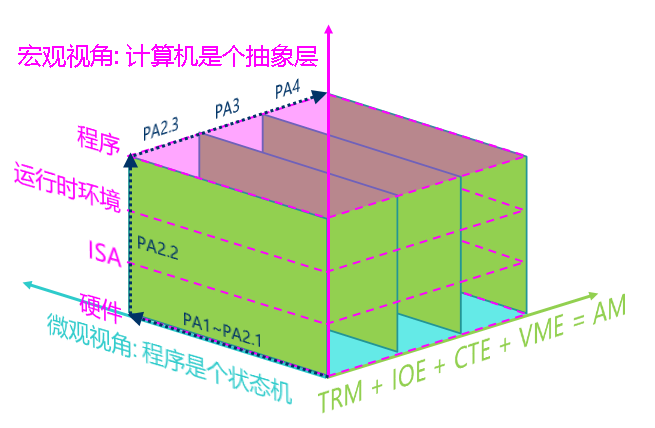

## 概述 - 简单复杂的机器: 冯诺依曼计算机系统

- ==**task PA2.1: 实现更多的指令, 在NEMU中运行大部分`cpu-tests`**==
- ==**task PA2.2: 实现klib和基础设施**==
- ==**task PA2.3: 运行FCEUX, 提交完整的实验报告**==

再配合实际的讲解？比如 Linux 中是怎么做这些内容的。


## 不停计算的机器

### 指令周期

在PA1中, 我们已经见识到最简单的计算机TRM的工作方式:

```c
while (1) {
  从PC指示的存储器位置取出指令;
  执行指令; 
  更新PC;
}
```

接下来我们就来谈谈这个过程, 也就是, CPU究竟是怎么执行一条指令的. 对于大部分指令来说, 执行它们都可以抽象成取指-译码-执行的[指令周期](http://en.wikipedia.org/wiki/Instruction_cycle). 


### YEMU

这个计算机有4个8位的寄存器, 一个4位PC, 以及一段16字节的内存. 它支持R型和M型两种指令格式, 4条指令. 其指令手册如下:

```txt
                                                     4  2  0
            |                        |        | +----+--+--+
mov   rt,rs | R[rt] <- R[rs]         | R-type | |0000|rt|rs|
            |                        |        | +----+--+--+
            |                        |        | +----+--+--+
add   rt,rs | R[rt] <- R[rs] + R[rt] | R-type | |0001|rt|rs|
            |                        |        | +----+--+--+
            |                        |        | +----+--+--+
load  addr  | R[0] <- M[addr]        | M-type | |1110| addr|
            |                        |        | +----+--+--+
            |                        |        | +----+--+--+
store addr  | M[addr] <- R[0]        | M-type | |1111| addr|
            |                        |        | +----+--+--+
```

```C
#include <stdint.h>
#include <stdio.h>

#define NREG 4
#define NMEM 16

// 定义指令格式
typedef union {
  struct { uint8_t rs : 2, rt : 2, op : 4; } rtype;
  struct { uint8_t addr : 4      , op : 4; } mtype;
  uint8_t inst;
} inst_t;

#define DECODE_R(inst) uint8_t rt = (inst).rtype.rt, rs = (inst).rtype.rs
#define DECODE_M(inst) uint8_t addr = (inst).mtype.addr

uint8_t pc = 0;       // PC, C语言中没有4位的数据类型, 我们采用8位类型来表示
uint8_t R[NREG] = {}; // 寄存器
uint8_t M[NMEM] = {   // 内存, 其中包含一个计算z = x + y的程序
  0b11100110,  // load  6#     | R[0] <- M[y]
  0b00000100,  // mov   r1, r0 | R[1] <- R[0]
  0b11100101,  // load  5#     | R[0] <- M[x]
  0b00010001,  // add   r0, r1 | R[0] <- R[0] + R[1]
  0b11110111,  // store 7#     | M[z] <- R[0]
  0b00010000,  // x = 16
  0b00100001,  // y = 33
  0b00000000,  // z = 0
};

int halt = 0; // 结束标志

// 执行一条指令
void exec_once() {
  inst_t this;
  this.inst = M[pc]; // 取指
  switch (this.rtype.op) {
  //  操作码译码       操作数译码           执行
    case 0b0000: { DECODE_R(this); R[rt]   = R[rs];   break; }
    case 0b0001: { DECODE_R(this); R[rt]  += R[rs];   break; }
    case 0b1110: { DECODE_M(this); R[0]    = M[addr]; break; }
    case 0b1111: { DECODE_M(this); M[addr] = R[0];    break; }
    default:
      printf("Invalid instruction with opcode = %x, halting...\n", this.rtype.op);
      halt = 1;
      break;
  }
  pc ++; // 更新PC
}

int main() {
  while (1) {
    exec_once();
    if (halt) break;
  }
  printf("The result of 16 + 33 is %d\n", M[7]);
  return 0;
}
```


- **==思考题==**

    > 理解YEMU如何执行程序
    >
    > YEMU可以看成是一个简化版的NEMU, 它们的原理是相通的, 因此你需要理解YEMU是如何执行程序的. 具体地, 你需要
    >
    > - 画出在YEMU上执行的加法程序的状态机
    > - 通过RTFSC理解YEMU如何执行一条指令
    >
    > 思考一下, 以上两者有什么联系?

    1. 画出在YEMU上执行的加法程序的状态机

        > 现在我们就可以通过状态机的视角来解释"程序在计算机上运行"的本质了:
        >
        > 给定一个程序, 把它放到计算机的内存中, 就相当于在状态数量为`N`的状态转移图中指定了一个初始状态, 程序运行的过程就是从这个初始状态开始, 每执行完一条指令, 就会进行一次确定的状态转移. 

        从这个初始状态开始 --> 每执行完一条指令 --> 进行一次确定的状态转移。

        要表示的有，PC，r0，r1，M[7]，halt

        (3, 16, 33, 0, 0) -> (3, 49, 33, 0, 0) -> (4, 49, 33, 0, 0) -> (4, 49, 33, 49, 0) -> (5, 49, 33, 49, 1)

    2. 通过RTFSC理解YEMU如何执行一条指令

        1. 取指

            在内存 `M[pc]` 处取出要执行的指令

        2. 译码

            根据 `op` 解析指令的功能

        3. 执行

            `switch` 代码块中，的执行内容

        4. 更新PC

            pc++


## RTFM

### RTFSC(2)

简单过一遍：


下面以一条指令为例，整理其在 `NEMU` 中的执行流程。

```bash
si
0x80000008: 01 02 c5 03 lbu	a0, 16(t0)
```


主要分析函数：`exec_once()`

```C
static void exec_once(Decode *s, vaddr_t pc) {
  s->pc = pc;
  s->snpc = pc;
  isa_exec_once(s);
  cpu.pc = s->dnpc;
#ifdef CONFIG_ITRACE
  char *p = s->logbuf;
  p += snprintf(p, sizeof(s->logbuf), FMT_WORD ":", s->pc);
  int ilen = s->snpc - s->pc;
  int i;
  uint8_t *inst = (uint8_t *)&s->isa.inst.val;
  for (i = ilen - 1; i >= 0; i --) {
    p += snprintf(p, 4, " %02x", inst[i]);
  }
  int ilen_max = MUXDEF(CONFIG_ISA_x86, 8, 4);
  int space_len = ilen_max - ilen;
  if (space_len < 0) space_len = 0;
  space_len = space_len * 3 + 1;
  memset(p, ' ', space_len);
  p += space_len;

#ifndef CONFIG_ISA_loongarch32r
  void disassemble(char *str, int size, uint64_t pc, uint8_t *code, int nbyte);
  disassemble(p, s->logbuf + sizeof(s->logbuf) - p,
      MUXDEF(CONFIG_ISA_x86, s->snpc, s->pc), (uint8_t *)&s->isa.inst.val, ilen);
#else
  p[0] = '\0'; // the upstream llvm does not support loongarch32r
#endif
#endif
}

```

```C
int isa_exec_once(Decode *s) {
   s->isa.inst.val = inst_fetch(&s->snpc, 4);
   return decode_exec(s);
 }        
```


#### 取指(instruction fetch, IF)

通过函数：

```C
static inline uint32_t inst_fetch(vaddr_t *pc, int len) {
  uint32_t inst = vaddr_ifetch(*pc, len);
  (*pc) += len;
  return inst;
}
word_t vaddr_ifetch(vaddr_t addr, int len) {
    return paddr_read(addr, len);                       
}
```

指令长度在RISC-V中都是固定的，RV32，4个 Byte

通过 `Decode` 结构体存 `PC`

```C
typedef struct Decode {
  vaddr_t pc;
  vaddr_t snpc; // static next pc
  vaddr_t dnpc; // dynamic next pc
  ISADecodeInfo isa;
  IFDEF(CONFIG_ITRACE, char logbuf[128]);
} Decode;
 NORMAL  include/cpu/decode.h 
```

由此可知，取指，实际上就是访存操作。

取得指令，将其存储在 `Decode s->isa.inst.val` 里。 

之后就是分析这个了。

> 具体地, `exec_once()`接受一个`Decode`类型的结构体指针`s`, 这个结构体用于存放在执行一条指令过程中所需的信息, 包括指令的PC, 下一条指令的PC等. 
>
> 还有一些信息是ISA相关的, NEMU用一个结构类型`ISADecodeInfo`来对这些信息进行抽象, 具体的定义在`nemu/src/isa/$ISA/include/isa-def.h`中. 
>
> `exec_once()`会先把当前的PC保存到`s`的成员`pc`和`snpc`中, 其中`s->pc`就是当前指令的PC, 而`s->snpc`则是下一条指令的PC, 这里的`snpc`是"static next PC"的意思.


#### 译码(instruction decode, ID)

```C
static int decode_exec(Decode *s) {
  int rd = 0;
  word_t src1 = 0, src2 = 0, imm = 0;
  s->dnpc = s->snpc;

  /* 如何匹配相应指令，并执行相应指令 */
#define INSTPAT_INST(s) ((s)->isa.inst.val)
#define INSTPAT_MATCH(s, name, type, ... /* execute body */ ) { \
  decode_operand(s, &rd, &src1, &src2, &imm, concat(TYPE_, type)); \
  __VA_ARGS__ ; \
}

  /* 指令模式匹配和执行 */
  INSTPAT_START();
  INSTPAT("??????? ????? ????? ??? ????? 00101 11", auipc  , U, R(rd) = s->pc + imm);
  INSTPAT("??????? ????? ????? 100 ????? 00000 11", lbu    , I, R(rd) = Mr(src1 + imm, 1));
  INSTPAT("??????? ????? ????? 000 ????? 01000 11", sb     , S, Mw(src1 + imm, 1, src2));

  INSTPAT("0000000 00001 00000 000 00000 11100 11", ebreak , N, NEMUTRAP(s->pc, R(10))); // R(10) is $a0
  INSTPAT("??????? ????? ????? ??? ????? ????? ??", inv    , N, INV(s->pc));
  INSTPAT_END();

  R(0) = 0; // reset $zero to 0

  return 0;	
}

```

译码操作的目的是得到指令的操作和操作对象。

由 `risc-v` 手册可知，这是由指令的 `opcode` 决定的。

我们只需要根据指令的编码格式，从取出的指令中识别出相应的`opcode`即可。

> 和YEMU相比, NEMU使用一种抽象层次更高的译码方式: 模式匹配,
>
> NEMU可以通过一个模式字符串来指定指令中`opcode`。

要解析这条指令：

```C
INSTPAT_START();
INSTPAT("??????? ????? ????? 100 ????? 00000 11", lbu, I, R(rd) = Mr(src1 + imm, 1));
INSTPAT_END();
```

```text
INSTPAT(模式字符串, 指令名称, 指令类型, 指令执行操作);
```

> `指令名称`在代码中仅当注释使用, 不参与宏展开;
>
> `指令类型`用于后续译码过程; 
>
> 而`指令执行操作`则是通过C代码来模拟指令执行的真正行为.

进一步展开：

```C
{ const void ** __instpat_end = &&__instpat_end_;
do {
  uint64_t key, mask, shift;
  pattern_decode("??????? ????? ????? 100 ????? 00000 11", 38, &key, &mask, &shift);
  if ((((uint64_t)s->isa.inst.val >> shift) & mask) == key) {
    {
      decode_operand(s, &rd, &src1, &src2, &imm, TYPE_I);
      R(rd) = Mr(src1 + imm, 1)
    }
    goto *(__instpat_end);
  }
} while (0);
// ...
__instpat_end_: ; }
```

> 上述代码中的`&&__instpat_end_`使用了GCC提供的[标签地址在新窗口中打开](https://gcc.gnu.org/onlinedocs/gcc/Labels-as-Values.html)扩展功能, `goto`语句将会跳转到最后的`__instpat_end_`标签. 
>
> 此外, `pattern_decode()`函数在`nemu/include/cpu/decode.h`中定义, 它用于将模式字符串转换成3个整型变量.
>
> `pattern_decode()`函数将模式字符串中的`0`和`1`抽取到整型变量`key`中, 
>
> `mask`表示`key`的掩码, 
>
> 而`shift`则表示`opcode`距离最低位的比特数量, 

```C
#define macro(i) \
   if ((i) >= len) goto finish; \
   else { \
     char c = str[i]; \
     if (c != ' ') { \
       Assert(c == '0' || c == '1' || c == '?', \
           "invalid character '%c' in pattern string", c); \
       __key  = (__key  << 1) | (c == '1' ? 1 : 0); \
       __mask = (__mask << 1) | (c == '?' ? 0 : 1); \
       __shift = (c == '?' ? __shift + 1 : 0); \
     } \
   }
//....具体看代码
```

这里的 `key` `mask` `shift` 进一步解释：

这里我们可以进一步记住，这些值通常用于位操作或模式匹配算法中，以后或许会常用。

- `key`：表示一个位模式或密钥，用于匹配或加密数据。

    在上面的内容，它是由字符串中 `'1'` 的位置组成的位串。

    也就是： `'1'->1 '0/?'->0 `

- `mask`：通常用于指定哪些位是重要的或应该被考虑的。（也就是那些 0 和 1，? 不管）

    上面的内容，它由字符串中的 `'1'` 和 `'?'` 的位置组成。

    其中 `'1/0'` 对应掩码位为 `1`，而 `'?'` 对应掩码位为 `0`。

- `shift`：

    表示`opcode`距离最低位的比特数量, 

举上面例子来说，

```bash
key   = 0x4003;
mask  = 0x707f;
shift = 0; 
```

> 这里有点不理解，什么叫表示 opcode 距离最低位的比特数量, 一直都是0，别的ISA这里可能不是0的意思是吗？


之后进行判断：

```C
if ((((uint64_t)s->isa.inst.val >> shift) & mask) == key) {
```

**检查经过位移和掩码操作后的指令值是否与预期的 `key` 相匹配。**

如果匹配，说明当前指令符合给定的模式，解码过程将继续执行相应的操作（在这个例子中是解码操作数并设置寄存器 `rd` 的值）。


现在通过之前的我们知道了指令的具体行为，但是不知道操作对象。(哪个寄存器和立即数多少)

框架代码通过函数 `decode_operand()`进一步实现。

根据传入的指令类型 `type` 来进行操作数的译码。

译码结果将记录到函数参数 `rd`，`src1`， `src2` ，`imm`中，

分别代表目的操作数的寄存器号码, 两个源操作数和立即数。

> 讲义：
>
> 我们会发现, 类似寄存器和立即数这些操作数, 其实是非常常见的操作数类型. 为了进一步实现操作数译码和指令译码的解耦, 我们对这些操作数的译码进行了抽象封装:
>
> - **框架代码定义了`src1R()`和`src2R()`两个辅助宏, 用于寄存器的读取结果记录到相应的操作数变量中**
> - **框架代码还定义了`immI`等辅助宏, 用于从指令中抽取出立即数**

所以，按照上面的内容，我们得到：


> 从这里大概也知道之后要做什么了。添加指令。


- 进一步指令分析 `src1、src2、imm` 和 宏 `BIT` `BITMASK` `SEXT`

    ```assembly
    01 02 c5 03 lbu	a0, 16(t0)
    // I型指令
    ```

    `R(rd) = Mr(src1 + imm, 1)` 访存操作，实际看内部的 `src` 和  `imm`

    ```C
    #define src1R() do { *src1 = R(rs1); } while (0)
    #define src2R() do { *src2 = R(rs2); } while (0)
    #define immI() do { *imm = SEXT(BITS(i, 31, 20), 12); } while(0)
    #define immU() do { *imm = SEXT(BITS(i, 31, 12), 20) << 12; } while(0)
    #define immS() do { *imm = (SEXT(BITS(i, 31, 25), 7) << 5) | BITS(i, 11, 7); } while(0)
    
    static void decode_operand(Decode *s, int *rd, word_t *src1, word_t *src2, word_t *imm, int type) {
      uint32_t i = s->isa.inst.val;
      int rs1 = BITS(i, 19, 15);
      int rs2 = BITS(i, 24, 20);
      *rd     = BITS(i, 11, 7);
      switch (type) {
        case TYPE_I: src1R();          immI(); break;
        case TYPE_U:                   immU(); break;
        case TYPE_S: src1R(); src2R(); immS(); break;
      }
    }
    
    ```

    首先，通过 `BITS` 提取到指令中的15到19位，也就是 `rs1`。  `rs2`、`rd` 同理可得。

    看看是宏具体是怎么做的：

    ```C
    #define BITMASK(bits) ((1ull << (bits)) - 1)
    #define BITS(x, hi, lo) (((x) >> (lo)) & BITMASK((hi) - (lo) + 1)) // similar to x[hi:lo] in verilog
    #define SEXT(x, len) ({ struct { int64_t n : len; } __x = { .n = x }; (uint64_t)__x.n; })    
    ```

    - `BITMASK`

        生成掩码，或者说生成一个二进制数。值为1的位，就是我们要关注的。

        比如说上面的 19 - 15 + 1 = 5，那就是 ((1ull << 5 ) - 1)

        也就是 `0b100000 - 1` 即 `0b0...00011111` 也就是只看 5 位。

    - `BITS`

        接着，将指令右移 `lo` 位，在这里也就是右移15位，

        ??????? ????? ????? 100 ????? 00000 11 变成 

        ??????? ????? ?????，前面补零。

        这个时候，与上刚开始得到的 `mask` ，即:

        ??????? ????? ?????

        0..................0011111， `a & 1 = a`。

        由此得到 `rs1` 的 `5` 位，然后换算成十进制数。

        之后进一步展开，`src1R()` 进一步展开

        也就是访问寄存器的内容了。

    - 最后：宏 `SEXT`

        `#define immI() do { *imm = SEXT(BITS(i, 31, 20), 12); } while(0)`

        这里同上可得，`12` 位，关键在这里：

        ```C
        // 这样看方便点，
        #define SEXT(x, len) (
        { 
            struct { 
                int64_t n : len; 
            } __x = { .n = x }; 
            (uint64_t)__x.n;
        })    
        ```

        - 它创建一个匿名的结构体变量`__x`，该结构体有一个名为`n`的位域，其长度为`len`位。

            定义一个12位的位域

        - 将值 `x` 赋给 `n`，由于 `n` 是符号位字段，因此 `x`的高位（符号位）将被复制到`__x.n`的所有位上。

            将 `x` 的 `12` 位内容，赋给`n`。

            再符号扩展：eg. `0x800` ---> `0xFFFF....FF800`

        - 最后，将 `__x.n` 强制转换为 `uint64_t` 类型，这将返回符号扩展后的64位值。

            这一步实际上并不会改变 `n` 的位模式，**但会改变它的 ==解释方式== **：从一个有符号的位字段变为一个无符号的整数。

        综上，也就是说这个宏，接受一个指定位数 `len` 的二进制数 `x` ，然后将这个数进行64位的符号扩展，那为什么要 len 呢？要是传进来的 `x` 和 `len` 位数不一样呢？

        > - **灵活性**：`len`参数允许`SEXT`宏处理不同长度的位字段。这意味着宏可以用于不同长度的立即数，提供更大的灵活性。
        > - **安全性**：通过显式指定位字段的长度，可以避免在提取和符号扩展过程中出现错误。如果`x`的长度与`len`不匹配，那么符号扩展的结果可能不正确，因此`len`参数确保了操作的准确性。
        > - **兼容性**：RISC-V指令集中可能有不同长度的立即数，`len`参数使得`SEXT`宏可以适用于各种不同长度的立即数，提高了代码的兼容性。
        >
        > GPT的感觉废话。不匹配就 ub
        


再回到上面的内容，这个宏在做的事情，就是C语言中怎么模拟RISC-V的这种扩展（Verilog），真是天才啊！nice : )

现在我们算是搞明白了具体的译码过程。

之后编写更多的指令，也就轻而易举了。


- 补充一些，关于访问寄存器

    我们访问寄存器通过这个宏：`#define R(i) gpr(i)` ，`gpr(i) `实际上是通过数组来模拟的寄存器的。所以我们需要下标来访问到是哪个寄存器，怎么计算出下标的值？

    通过处理位操作的两个 `BITMASK` 和 `BITS` 宏，提取指令二进制表示中 `rs1、rs2、rd` 那几位，即可获取下标，知道是哪个寄存器。这是由于 `risc-v` 寄存器是直接通过数字命名。

    


> 讲义：
>
> - `decode_operand`中用到了宏`BITS`和`SEXT`
>
>     它们均在`nemu/include/macro.h`中定义, 分别用于位抽取和符号扩展
>
> - `decode_operand`会首先统一**对目标操作数进行寄存器操作数的译码,** 
>
>     即调用`*rd = BITS(i, 11, 7)`, 不同的指令类型可以视情况使用`rd`
>
>     > 即从 `i` 里面提取 7 到 11 位的内容。
>    
> - 在模式匹配过程的最后有一条`inv`的规则, 
> 
>     表示"若前面所有的模式匹配规则都无法成功匹配, 则将该指令视为非法指令


**分析完这一过程，又一次感觉到 `risc-v ` 架构的简洁和优秀。**

opcode 代表指令操作码，imm 代表立即数，funct3 和 funct7 代表指令对应的功能，rs1、rs2 和 rd 则分别代表源寄存器 1、源寄存器 2 以及目标寄存器。

`risc-v` 的一个指令提供三个寄存器操作数，不像 x86 一样让源操作数和目的操作数共享一个字段：`MOV 目的操作数，源操作数  `，相比 x86 指令，`risc-v` 减少了软件的程序操作。

还有，源寄存器 `rs1、rs2、rd`，都设计固定在所有 `risc-v` 指令同样的位置上，指令译码相对简单。

那，指令在 CPU 流水线中执行时，可以先开始访问寄存器，然后再完成指令解码？


- ==**思考题**==	

    >  立即数背后的故事(1)
    >
    >  框架代码通过`inst_fetch()`函数进行取指, 别看这里就这么一行代码, 其实背后隐藏着针对[字节序](http://en.wikipedia.org/wiki/Endianness)的慎重考虑. 
    >
    >  大部分同学的主机都是x86小端机, 当你使用高级语言或者汇编语言写了一个32位常数`0x1234`的时候, 在生成的二进制代码中, 这个常数对应的字节序列如下(假设这个常数在内存中的起始地址是x):
    >
    >  ```text
    >  x   x+1  x+2  x+3
    >  +----+----+----+----+
    >  | 34 | 12 | 00 | 00 |
    >  +----+----+----+----+
    >  ```
    >
    >  而大多数PC机都是小端架构(我们相信没有同学会使用IBM大型机来做PA), 当NEMU运行的时候,
    >
    >  ```c
    >  imm = inst_fetch(pc, 4);
    >  ```
    >
    >  这行代码会将`34 12 00 00`这个字节序列原封不动地从内存读入`imm`变量中, 主机的CPU会按照小端方式来解释这一字节序列, 于是会得到`0x1234`, 符合我们的预期结果.
    >
    >  Motorola 68k系列的处理器都是大端架构的. 现在问题来了, 考虑以下两种情况:
    >
    >  - 假设我们需要将NEMU运行在Motorola 68k的机器上(把NEMU的源代码编译成Motorola 68k的机器码)
    >  - 假设我们需要把Motorola 68k作为一个新的ISA加入到NEMU中
    >
    >  在这两种情况下, 你需要注意些什么问题? 为什么会产生这些问题? 怎么解决它们?
    >
    >  事实上不仅仅是立即数的访问, **长度大于1字节的内存访问都需要考虑类似的问题**. 我们在这里把问题统一抛出来, 以后就不再单独讨论了.

    1. 将NEMU运行在Motorola 68k 上

        NEMU运行在我的主机上时，我的主机按照小端序列连续读取内存中4个byte的内容进变量，而运行在Motorola 68k 上会按照大端方式来读取这4个字节，所以每次涉及到访存和立即数都得自己手动地转换大小端。

        > 具体：
        >
        > ```C
        > uint32_t little2big(uint32_t value) {
        >     return ((value & 0x000000FF) << 24) |
        >            ((value & 0x0000FF00) <<  8) |
        >            ((value & 0x00FF0000) >>  8) |
        >            ((value & 0xFF000000) >> 24); 
        > }
        > 
        > bool is_little_endian(void) {
        >     int i = 1;
        >     unsigned char *c = (unsigned char *)&i;
        >     return *c ? true : false;
        > }
        > 
        > int main(void) {
        >     uint32_t test = 0x12345678;
        >     char *first = (char *)&test;
        >     printf("low--%x %x %x %x--high\n",
        >            *first, *(first + 1), *(first + 2), *(first + 3));
        > 
        >     test = little2big(test);
        >     first = (char *)&test;
        >     printf("low--%x %x %x %x--high\n",
        >            *first, *(first + 1), *(first + 2), *(first + 3));
        >     return 0;
        > }
        > ```

    2. 把Motorola 68k作为一个新的ISA加入到NEMU中

        包括指令译码、执行（大小端的处理）。

        ```C
        uint32_t little2big_new(uint8_t *ptr) {
            return (uint32_t)((ptr[0] << 24) | (ptr[1] << 16) | (ptr[2] << 8) | (ptr[3]));
        }
        ```

        

        

    

    >  立即数背后的故事(2)
    >
    >  mips32和riscv32的指令长度只有32位, 因此它们不能像x86那样, 把C代码中的32位常数直接编码到一条指令中. 思考一下, mips32和riscv32应该如何解决这个问题

    [206-MIPS指令简介 - 第二讲 指令系统体系结构 | Coursera](https://www.coursera.org/lecture/jisuanji-zucheng/206-mipszhi-ling-jian-jie-N2eRK)

    **看之前笔记。**印象中MIPS是立即数左移的，然后进行拼接。

    

    

    ​	

- **增加预处理结果显示**

    我这里直接照抄 `OBJ` 的写法

    ```makefile
    //...前面代码
    OBJS = $(SRCS:%.c=$(OBJ_DIR)/%.o) $(CXXSRC:%.cc=$(OBJ_DIR)/%.o)
    INTERMEDIATES = $(SRCS:%.c=$(PREPROCESS_DIR)/%.i) $(CXXSRC:%.cc=$(PREPROCESS_DIR)/%.i)
    
    preprocess: $(INTERMEDIATES)
    
    $(PREPROCESS_DIR)/%.i: %.c
    	@echo + CC $<
    	@mkdir -p $(dir $@)
    	@$(CC) $(CFLAGS) -E -o $@ $<
    
    $(PREPROCESS_DIR)/%.i: %.cc
    	@echo + CXX $<
    	@mkdir -p $(dir $@)
    	@$(CXX) $(CFLAGS) -E -o $@ $<
    //...后面代码
    // script/build.mk
    ```

    另外复习一些 `Makefile` 知识：

    1. 关于 `|` 是什么？

        [我的自用 Makefile 模板介绍_哔哩哔哩_bilibili](https://www.bilibili.com/video/BV1RZ421m76P/?spm_id_from=333.999.0.0&vd_source=ecc99d78ae961113010161a48a475a35)

        > 在Makefile中，`|` 符号后面的内容被称为“强制目标”（forcing targets）。当强制目标发生变化时，`|` 符号之前的规则将被重新执行，即使规则本身的依赖项没有改变。
        >
        > 在你提供的Makefile片段中：
        >
        > ```makefile
        > $(PREPROCESS_DIR)/%.i: %.c | $(PRE_C)
        > 	@echo + CC $<
        > 	@mkdir -p $(dir $@)
        > 	@$(CC) $(CFLAGS) -E -o $@ $<
        > ```
        >
        > 这里的 `| $(PRE_C)` 表示，如果 `$(PRE_C)` 代表的文件或目标发生变化，那么即使 `%.c` 没有变化，也会触发 `$(PREPROCESS_DIR)/%.i` 的规则执行。这通常用于以下情况：
        >
        > 1. **命令变更**：如果你的构建系统需要在某些条件或配置文件变更时重新运行命令，即使实际的源文件没有变化，也可以使用强制目标来确保命令被执行。
        >
        > 2. **环境变更**：当编译环境（如编译器版本、编译选项等）发生变化时，你可能希望重新生成所有中间文件，即使源代码没有改变。
        >
        > 3. **依赖关系**：如果生成 `.i` 文件的过程依赖于某些特定的脚本或配置文件（在这个例子中是 `$(PRE_C)`），你可以使用 `|` 来确保这些变更能够触发重新生成。
        >
        > 简而言之，`| $(PRE_C)` 表示如果 `$(PRE_C)` 所代表的文件发生了变化，那么所有依赖于这个强制目标的 `.i` 文件都将被重新生成，不管它们的源 `.c` 文件是否被修改过。这是一种确保依赖于特定环境或配置的构建过程能够正确更新的方法。

        有点混乱？

        再看看

        >  | 和 @ 知识
        >
        >  - `|` 强制命令（Forcing Command）
        >
        >      `$(OBJ_DIR)/%.o: %.c | $(PREPROCESS_DIR) preprocess`
        >
        >      `|` 在 Makefile 中用作强制命令，它告诉 make 引擎，如果强制命令后面列出的任何一个目标在修改时间上晚于第一个非强制命令的目标，那么就执行非强制命令来重新构建目标。也就是说，确保 | 后面的内容在目标之后运行。
        >
        >      在这个例子中：
        >
        >      - `$(PREPROCESS_DIR) preprocess`：这是强制命令部分，意味着如果 `$(PREPROCESS_DIR)` 目录或 `preprocess` 目标在任何 `.o` 文件之前被修改，那么就会执行 `.o` 文件的生成命令。
        >
        >      ### 具体解释
        >
        >      - 如果 `$(PREPROCESS_DIR)` 目录不存在或 `preprocess` 目标需要重新执行（例如，预处理文件被删除或更新了），则执行编译命令 `$(CC) $(CFLAGS) -c -o $@ $^` 来生成 `.o` 文件。
        >      - `$^` 是一个自动变量，它代表所有的依赖项（在这个例子中是 `%.c` 模式匹配的 `.c` 文件）。
        >
        >  - 在指令的开头加个 @
        >
        >      表示make的时候，在终端不显示出来该条命令。

    2. 关于替换

        ```makefile
        SOURCES=$(wildcard src/**/*.c src/*.c)                      
        OBJECTS=$(patsubst %.c,%.o,$(SOURCES))             
          
        TEST_SRC=$(wildcard tests/*_tests.c)
        TESTS=$(patsubst %.c,%,$(TEST_SRC)) 
        ```


继续看指令。


#### 执行(execute, EX)

译码结束后，代码会执行模式匹配中指定的 **指令执行操作**，部分操作会用到译码的结果，并通过C代码来模拟指令执行的真正行为。

比如说 `lbu` 指令，我们只需要通过 `R(rd) = M[src1 + imm]` / `R(rd) = Mr(src1 + imm, 1)` 将立即数和源寄存器1的值相加存到目的寄存器中，即完成指令执行。

> 之后 `decode_exec()`函数将会返回`0`, 并一路返回到`exec_once()`函数中. 不过目前代码并没有使用这个返回值, 因此可以忽略它.


#### 更新 PC

这部分直接看讲义即可，了解清楚了静态指令和动态指令。

> 最后是更新PC. 更新PC的操作非常简单, 只需要把`s->dnpc`赋值给`cpu.pc`即可. 我们之前提到了`snpc`和`dnpc`, 现在来说明一下它们的区别.
>
>  ==**静态指令和动态指令**==
>
> 在程序分析领域中, 静态指令是指程序代码中的指令, 动态指令是指程序运行过程中的指令. 例如对于以下指令序列
>
> ```text
> 100: jmp 102
> 101: add
> 102: xor
> ```
>
> `jmp`指令的下一条静态指令是`add`指令, 而下一条动态指令则是`xor`指令.
>
> 有了静态指令和动态指令这两个概念之后, 我们就可以说明`snpc`和`dnpc`的区别了: 
>
> `snpc`是下一条静态指令, 而`dnpc`是下一条动态指令. 
>
> - 对于顺序执行的指令, 它们的`snpc`和`dnpc`是一样的; 
> - 但对于跳转指令, `snpc`和`dnpc`就会有所不同, `dnpc`应该指向跳转目标的指令.
>
> 显然, 我们应该使用`s->dnpc`来更新PC, 并且在指令执行的过程中正确地维护`s->dnpc`.

```C
 static void exec_once(Decode *s, vaddr_t pc) { 
     s->pc = pc;
     s->snpc = pc;
     isa_exec_once(s);                          
     cpu.pc = s->dnpc;
     //....
```


### 结构化程序设计

挺重要的。不断地学习，改进....

实现代码解耦，提高可维护性。。。

找出共同特征。

> 一种好的做法是把译码, 执行和操作数宽度的相关代码分离开来, 实现解耦, 也就是在程序设计课上提到的结构化程序设计. 
>
> 在框架代码中, 实现译码和执行之间的解耦的是通过 `INSTPAT` 定义的模式匹配规则, 这样我们就可以分别编写译码和执行的内容, 
>
> 然后来进行组合了: 这样的设计可以很容易实现执行行为相同但译码方式不同的多条指令. 
>
> 对于x86, 实现操作数宽度和译码, 执行这两者之间的解耦的是`ISADecodeInfo`结构体中的`width`成员, 它们记录了操作数宽度, 译码和执行的过程中会根据它们进行不同的操作, 通过同一份译码和执行的代码实现不同操作数宽度的功能.

这里可能我开始感受不到，应该要配合一些高级 代码技巧和软件工程进一步了解。


- **Task**

    > **除了`nemu/src/device`和`nemu/src/isa/$ISA/system`之外, NEMU的其它代码你都已经有能力理解了. 因此不要觉得讲义中没有提到的文件就不需要看, 尝试尽可能地理解每一处细节吧! 在你遇到bug的时候, 这些细节就会成为帮助你调试的线索.**


- `src/engine`

    一些相关的初始化配置文件
    
- `src/utils/`

    一些工具代码：

    `disasm.cc` 

    - 这是一个C++源文件，用于实现汇编器和反汇编器的功能。
    - 它包含了初始化反汇编器的函数`init_disasm`，该函数设置目标平台并创建必要的LLVM组件。
    - 还有一个`disassemble`函数，用于将机器码反汇编成人类可读的指令。

    `filelist.mk`

    - 它检查配置宏`CONFIG_ITRACE`和`CONFIG_IQUEUE`是否定义，并据此设置编译源文件和编译选项。

    `log.c`   

    - 这个C源文件提供了日志记录的功能。
    - 它包含了初始化日志文件的函数`init_log`，以及检查是否应该记录日志的函数`log_enable`。
    - 日志系统可以根据配置输出到标准输出或文件。

    `state.c` 

    - 这个C源文件管理NEMU模拟器的状态。
    - 它定义了一个`NEMUState`结构体，用于跟踪模拟器的状态（例如停止、运行、退出）。
    - 还包含了一个函数`is_exit_status_bad`，用于检查模拟器的退出状态是否表示错误

    `timer.c`

    - 这个C源文件提供了时间相关的功能。
    - 它包含了获取当前时间的函数`get_time`，该函数基于不同的配置使用不同的时间源。
    - 还有一个`init_rand`函数，用于初始化随机数生成器，通常使用当前时间作为种子。


### 运行第一个 C 程序  (⭐)

```bash
make ARCH=$ISA-nemu ALL=dummy run
```

> 为了方便叙述, 讲义将用`$ISA`来表示你选择的ISA, 例如对于`nemu/src/isa/$ISA/reg.c`, 若你选择的是x86, 它将表示`nemu/src/isa/x86/reg.c`; 若你选择的是riscv32, 它将表示`nemu/src/isa/riscv32/reg.c`. 
>
> **==除非讲义明确说明, 否则`$ISA`总是表示你选择的ISA, 而不是`$ISA`这四个字符.==**


要实现哪些指令才能让`dummy`在NEMU中运行起来呢? 

答案就在其反汇编结果 (`am-kernels/tests/cpu-tests/build/dummy-$ISA-nemu.txt`) 中: 你只需实现那些目前还没实现的指令就可以了. 

框架代码引入的模式匹配规则, 对在NEMU中实现客户指令提供了很大的便利, 为了实现一条新指令, 你只需要在`nemu/src/isa/$ISA/inst.c`中添加正确的模式匹配规则即可.


- **==思考题==**

    为什么执行了未实现指令会出现上述报错信息

    RTFSC, 理解执行未实现指令的时候, NEMU具体会怎么做.

    ```text
    (nemu) si
    invalid opcode(PC = 0x80000000):
    	13 04 00 00 17 91 00 00 ...
    	00000413 00009117...
    There are two cases which will trigger this unexpected exception:
    1. The instruction at PC = 0x80000000 is not implemented.
    2. Something is implemented incorrectly.
    Find this PC(0x80000000) in the disassembling result to distinguish which case it is.
    
    If it is the first case, see
           _                         __  __                         _ 
          (_)                       |  \/  |                       | |
      _ __ _ ___  ___ ________   __ | \  / | __ _ _ __  _   _  __ _| |
     | '__| / __|/ __|______\ \ / / | |\/| |/ _` | '_ \| | | |/ _` | |
     | |  | \__ \ (__        \ V /  | |  | | (_| | | | | |_| | (_| | |
     |_|  |_|___/\___|        \_/   |_|  |_|\__,_|_| |_|\__,_|\__,_|_|
    
    for more details.
    
    If it is the second case, remember:
    * The machine is always right!
    * Every line of untested code is always wrong!
    
    0x80000000: 00 00 04 13 addi	s0, zero, 0
    [src/cpu/cpu-exec.c:123 cpu_exec] nemu: ABORT at pc = 0x80000000
    [src/cpu/cpu-exec.c:91 statistic] host time spent = 3,292 us
    [src/cpu/cpu-exec.c:92 statistic] total guest instructions = 1
    [src/cpu/cpu-exec.c:93 statistic] simulation frequency = 303 inst/s
    
    ```

    经过前面的指令分析，大概也知道了为什么会出现上面的内容了，直接看代码就行。

    ```C
    // src/isa/riscv64/inst.c
    INSTPAT("??????? ????? ????? ??? ????? ????? ??", inv    , N, INV(s->pc));
    
    // include/cpu/cpu.h
    #define INV(thispc) invalid_inst(thispc)
    
    // src/engine/interpreter/hostcall.c
    void set_nemu_state(int state, vaddr_t pc, int halt_ret) {
      difftest_skip_ref();
      nemu_state.state = state;
      nemu_state.halt_pc = pc;
      nemu_state.halt_ret = halt_ret;
    }
    
    __attribute__((noinline))
    void invalid_inst(vaddr_t thispc) {
      uint32_t temp[2];
      vaddr_t pc = thispc;
      temp[0] = inst_fetch(&pc, 4);
      temp[1] = inst_fetch(&pc, 4);
    
      uint8_t *p = (uint8_t *)temp;
      printf("invalid opcode(PC = " FMT_WORD "):\n"
          "\t%02x %02x %02x %02x %02x %02x %02x %02x ...\n"
          "\t%08x %08x...\n",
          thispc, p[0], p[1], p[2], p[3], p[4], p[5], p[6], p[7], temp[0], temp[1]);
    
      printf("There are two cases which will trigger this unexpected exception:\n"
          "1. The instruction at PC = " FMT_WORD " is not implemented.\n"
          "2. Something is implemented incorrectly.\n", thispc);
      printf("Find this PC(" FMT_WORD ") in the disassembling result to distinguish which case it is.\n\n", thispc);
      printf(ANSI_FMT("If it is the first case, see\n%s\nfor more details.\n\n"
            "If it is the second case, remember:\n"
            "* The machine is always right!\n"
            "* Every line of untested code is always wrong!\n\n", ANSI_FG_RED), isa_logo);
    
      set_nemu_state(NEMU_ABORT, thispc, -1);
    }
    
    ```


**接下来要做的就是完善更多的指令了，查看反汇编知道要实现哪些**

```bash
/home/jai/ysyx-workbench/am-kernels/tests/cpu-tests/build/dummy-riscv32-nemu.elf:     file format elf32-littleriscv


Disassembly of section .text:

80000000 <_start>:
80000000:	00000413          	li	s0,0
80000004:	00009117          	auipc	sp,0x9
80000008:	ffc10113          	addi	sp,sp,-4 # 80009000 <_end>
8000000c:	00c000ef          	jal	ra,80000018 <_trm_init>

80000010 <main>:
80000010:	00000513          	li	a0,0
80000014:	00008067          	ret

80000018 <_trm_init>:
80000018:	ff010113          	addi	sp,sp,-16
8000001c:	00000517          	auipc	a0,0x0
80000020:	01c50513          	addi	a0,a0,28 # 80000038 <_etext>
80000024:	00112623          	sw	ra,12(sp)
80000028:	fe9ff0ef          	jal	ra,80000010 <main>
8000002c:	00050513          	mv	a0,a0
80000030:	00100073          	ebreak
80000034:	0000006f          	j	80000034 <_trm_init+0x1c>

```
>  提醒：
>
>  交叉编译工具链
>
>  如果你选择的ISA不是x86, 在查看客户程序的二进制信息(如`objdump`, `readelf`等)时, 需要使用相应的交叉编译版本, 如`mips-linux-gnu-objdump`, `riscv64-linux-gnu-readelf`等. 
>
>  特别地, 如果你选择的ISA是riscv32, 也可以使用riscv64为前缀的交叉编译工具链.


需要注意的是 `li	s0,0` 、`ret` 都是是一条伪指令。

> 在RISC-V汇编语言中，指令可以分为两类：普通指令和伪指令。
>
> ### 普通指令
> 普通指令是RISC-V指令集架构中定义的指令，它们直接由处理器执行。这些指令包括：
>
> - 加载和存储指令（如`lw`, `sw`）
> - 算术指令（如`add`, `sub`）
> - 逻辑指令（如`and`, `or`）
> - 分支指令（如`beq`, `bne`）
> - 控制指令（如`jal`, `jalr`）
>
> 普通指令是硬件直接执行的，它们对应于RISC-V处理器的硬件操作。
>
> ### 伪指令
> 伪指令不是RISC-V指令集的一部分，而是由汇编器在编译过程中处理的特殊指令。它们用于简化汇编程序的编写，提供一些方便的功能，但最终会被汇编器转换成一个或多个普通指令。常见的伪指令包括：
>
> - `.text`：指示汇编器接下来的指令是程序的文本部分。
> - `.data`：指示汇编器接下来的指令是数据部分。
> - `.globl`：声明一个全局符号。
> - `.align`：对齐指令，用于确保数据或指令在内存中的对齐。
> - `.word`：定义一个或多个32位的字。
> - `.byte`：定义一个字节的数据。
> - `nop`：无操作，通常用作占位符或延迟。
>
> 伪指令的主要作用是提供给程序员一种更直观和方便的方式来编写汇编代码，它们在编译过程中被转换成实际的机器指令。
>
> ### 区别
> - **执行层面**：**==普通指令由处理器执行，而伪指令由汇编器处理。==**
> - **目的**：普通指令用于实现具体的操作，伪指令用于简化编程和提供编译时的控制。
> - **转换**：伪指令在编译时会被转换成一个或多个普通指令。
> - **可见性**：普通指令在最终的机器代码中可见，伪指令则不会。
>


具体来说，`li` 的十六进制/二进制实现为：

```bash
80000000: 00000413            li  s0,0
0000 0000 0000 0000 0000 0100 0001 0011
```

这里查表对应到 `addi` 指令上，由此可以得出一个结论，右边反汇编出来的只是为了方便阅读，真正实现对应的指令操作还得是看左边的内容。


**==这里记录一下 `jal` 指令，J 型指令实现其立即数的一些问题。==**

1. 不太理解其中 `jal` 的立即数为什么要两字节对齐(左移 1 位)
2. 实现 `immJ` 遇到一些困惑。 
3. 为什么 `jalr` 的第一位需要取反？

[RISC-V指令集讲解（5）条件和无条件跳转指令 - 知乎 (zhihu.com)](https://zhuanlan.zhihu.com/p/394860078)

- Q1

    `jal` 作为 `RV32I` 中唯一的 J 型指令。

    具体指令格式：`jal rd，offset`  `x[rd] = pc+4; pc += sext(offset)`

    

    这条指令把下一条指令(PC + 4) 装载到 `rd` 中，然后 PC += 符号扩展后的偏移值。（符号扩展之前已经了解）

    

    > 可以看到偏移量是2字节对齐的(offset [20:1])，虽然RV32I中所有的指令地址都是4字节对齐的，但是JAL还可能被用于兼容C扩展指令集，所以就默认offset bit 0为0(即2字节对齐)。

    这里也大概有思路，回想起之前的看为什么需要字节对齐的内容中想到的非对齐存储器访问异常。

    在RV32I中，**所有指令都是4字节对齐的**，并且需对齐到32位存储器地址的边界上，不然会导致非对齐存储器访问异常。

    > 先了解一下 C 扩展
    >
    > 
    >
    > **C扩展**（Compressed Instruction Extension）：它允许使用16位的指令来实现与32位指令相同的功能，从而减少程序的代码大小，提高代码密度。这对于嵌入式系统等对内存空间有限制的应用场景非常有用。**C扩展并不是特定于C语言的扩展，而是对指令集的一种压缩技术。**

    RV 的 C 扩展能与其它所有标准扩展兼容。C 扩展允许 16 位指令可以自由地和 32 位指令混合执行，并运行 32 位指令可以在任何 16 位边界开始。

    回到上面的问题， `jal` 指令的立即数部分设计为 2 字节对齐，是为了确保当使用C扩展指令集时，即使在16位的指令空间内，也能保持正确的跳转地址对齐。这是因为C扩展指令集中的跳转指令可能需要在较小的地址范围内进行跳转，而2字节对齐可以提供相对更大的跳转范围。

    > 其他原因：
    >
    > 此外，2字节对齐的设计也有助于简化硬件实现。由于RISC-V的JAL指令需要将20位的立即数左移一位后与当前的程序计数器（PC）相加来计算跳转目标地址，如果立即数是2字节对齐的，那么在左移操作后，可以直接得到一个偶数，从而避免了对齐错误。
    >
    > 参考资料：[RISC-V 指令集介绍（二） - 知乎 (zhihu.com)](https://zhuanlan.zhihu.com/p/675480397)

- Q2

    这里大概也明白为什么各种指令类型的立即数移位了。

    拼位置。
    
    ```C
    #define immI() do { *imm = SEXT(BITS(i, 31, 20), 12); } while(0)
    #define immU() do { *imm = SEXT(BITS(i, 31, 12), 20) << 12; } while(0)
    #define immS() do { *imm = (SEXT(BITS(i, 31, 25), 7) << 5) | BITS(i, 11, 7); } while(0)
    ```

    - **U型指令通过 `BITS` 得到 20 位的立即数后，左移12位得到32位立即数，如果为RV64I，则符号扩展得到 64 位。**

        这类指令包含：PC 相对寻址 `auipc` 和 `lui`。

        对于 `auipc rd, imm`
    
        这条指令把 imm 左移 12 位，并带**符号扩展**至 32/64 位立即数，**再加上当前 PC 值**，然后存储到 rd 寄存器中。
    
        因为左移12位得到的结果表示的是地址的高20位部分，低12位均为0，
    
        **故此指令只能寻址到与 4KB 对齐的地址。**
    
        **但再配合jalr指令的12位立即数，程序就能将执行流程转移到任何32位pc相对地址**
    
        **配合load/store、addi等指令的12立即数，程序就能访问任何32位PC相对地址的数据。**
    
        故此条指令的寻址范围可达 PC ± 2GB （2^32^ = 4GB）
    
        ```
        ------------------------------------
        |        |<------PC------>|        |
        ------------------------------------
        0..... PC-2GB...........PC+2GB......0XFFFFF...FFF
        ```
    
        而对于 `lui rd, imm`，它仅把立即数结果左移12位放到 rd 中，不做其他相关的。
    
        
    
    - S型指令通过 `BITS` 得到 7位 + 5 位的立即数。
    
    其实对我们来说，首要目的就是能拼接起来编程一个32位数即可。
    
- Q3

    ```C
    INSTPAT("??????? ????? ????? 000 ????? 11001 11", jalr   , I, volatile word_t t = s->pc + 4, s->dnpc = (src1 + imm) & ~(word_t)1), R(rd) = t;
    ```

    取反为了进行地址对齐处理。确保地址是偶数（因为 RISC-V 是偶数对齐的指令集）。

    > 使用按位取反操作符`~`和按位与操作`&`来确保结果地址是偶数。
    >
    > `~(word_t)1`会生成一个所有位都是1除了最低位是0的数（因为`word_t`是无符号类型以`~1`会得到全部位都是1的数，除了最低位是0）。

    如果 `src1` 的值加上 `imm` 后得到的地址不是偶数，那么`s->dnpc`将指向一个奇数地址，这违反了RISC-V指令对齐的要求。

    因为 `jalr` 是 `I` 型指令，没有我自己/框架增加的左移操作保证生成的立即数加上PC值为偶数，所以需要我手动写好 `jalr` 保持 `imm[0] = 0` 的行为。

    总结：如果是 `I` `U` `S` `J` `B` 型指令，那不用自己进行立即数的对齐？
    
    
    
    如果是 `J` 型 和 `B` 型和 `U ` 型那就不用了。
    
- 另外想的：

    you may forget add sext for your instruction if you don't add sext by macro to extend your imm.	

综上，补充实现 `immJ`：

```c
#define immJ()  do { \
	SEXT( \
	(BITS(i, 31, 31) << 19) | \
	(BITS(i, 19, 12) << 11) | \
	BITS(i, 12, 12) | \
	(BITS(i, 30, 21))) << 1, 21)  \
}while(0)
```


**==留坑==**

老是在说对齐对齐，什么是对齐？对齐用来干什么？具体的应用案例？


- **一些错误**：

    ```C
    这个可以：s->dnpc = (src1 + imm) & ~(word_t)1;     R(rd) = s->pc + 4);
    这个不行：s->dnpc = (R(src1) + imm) & ~(word_t)1;     R(rd) = s->pc + 4);
    ```

    这里忘记了：src1是用宏的了。


### 运行更多的程序

> 讲义：
>
> 未测试代码永远是错的, 你需要更多的测试用例来测试你的NEMU. 我们在`am-kernels/tests/cpu-tests/`目录下准备了一些简单的测试用例. 在该目录下执行
>
> ```bash
> make ARCH=$ISA-nemu ALL=xxx run
> ```
>
> 其中`xxx`为测试用例的名称(不包含`.c`后缀).
>
> 上述`make run`的命令最终会启动NEMU, 并运行相应的客户程序. 如果你需要使用GDB来调试NEMU运行客户程序的情况, 可以执行以下命令:
>
> ```bash
> make ARCH=$ISA-nemu ALL=xxx gdb
> ```


> 除了 `string` 和 `hello-str` 还需要实现额外的内容才能运行(具体在后续小节介绍), 目前可以先使用其它测试用例进行测试.


- ==**思考题**==

    > 指令名对照
    >
    > AT&T格式反汇编结果中的少量指令, 与手册中列出的指令名称不符, 如x86的`cltd`, mips32和riscv32则有不少伪指令(pseudo instruction). 除了STFW之外, 你有办法在手册中找到对应的指令吗? 如果有的话, 为什么这个办法是有效的呢?
    
    在汇编语言中，伪指令（Pseudo-instruction）是汇编器提供的，它们在汇编时会被转换成一个或多个实际的机器指令。伪指令使得汇编语言程序更加易读和易于编写，但它们并不是CPU实际执行的指令。不同架构的汇编语言可能有不同的伪指令集。
    
    对于您提到的几种指令和架构：
    
    1. **x86的`cltd`**：这是AT&T语法中的一个指令，它代表“Convert Long to Doubleword”。在Intel语法中，这个指令被称为`cwde`（Convert Word to Extended）。`cltd`将一个32位的长整型（`long`）扩展到64位的双倍长整型（`long long`或`doubleword`）。在手册中，这个指令通常对应于实际的机器指令，比如`cwde`。
    
    2. **MIPS32的伪指令**：MIPS架构中有许多伪指令，例如`li`（Load Immediate），它用于将立即数加载到寄存器中。在MIPS的汇编器中，`li`可能被转换成一个或多个实际的指令，如`addiu`（Add Immediate Unsigned），如果立即数适合单条指令的话。
    
    3. **RISC-V的伪指令**：RISC-V同样有伪指令，它们被设计为提供更简洁的汇编语言编程方式。例如，`li`在RISC-V中也是用来加载立即数到寄存器。RISC-V的汇编器会将`li`转换成合适的RISC-V机器指令，如`addi`（Add Immediate）。
    
    要找到手册中的对应指令，您可以：
    
    - 查看汇编器文档：汇编器的文档通常会列出它支持的所有伪指令以及它们对应的实际机器指令。
    - 查阅架构的官方手册：官方的架构手册会详细列出所有有效的机器指令和它们的编码。
    - 使用反汇编工具：将伪指令对应的汇编代码反汇编，查看生成的实际机器指令。
    
    为什么这个办法有效？
    
    - 汇编器的一致性：大多数汇编器遵循一定的规则来转换伪指令，这意味着一旦您了解了这些规则，就可以预测伪指令如何被转换。
    - 架构手册的完整性：架构手册提供了所有指令的详细描述，包括它们的操作和编码，这是理解伪指令如何工作的基石。
    - 工具的辅助：反汇编工具可以直接显示伪指令对应的实际机器指令，为程序员提供了直观的参考。
    
    例如，如果您想知道RISC-V中`li`伪指令如何工作，您可以查阅RISC-V的官方手册，找到`addi`指令的描述，或者使用RISC-V的汇编器和反汇编器来观察`li`如何被转换。
    
    
    
    


- **==思考题==**（可选）

    > mips32的分支延迟槽
    >
    > 为了提升处理器的性能, mips使用了一种叫[分支延迟槽在新窗口中打开](https://en.wikipedia.org/wiki/Delay_slot)的技术. 采用这种技术之后, 程序的执行顺序会发生一些改变: 我们把紧跟在跳转指令(包括有条件和无条件)之后的静态指令称为延迟槽, 那么程序在执行完跳转指令后, 会先执行延迟槽中的指令, 再执行位于跳转目标的指令. 例如
    >
    > ```text
    > 100: beq 200
    > 101: add
    > 102: xor
    > ...
    > 200: sub
    > 201: j   102
    > 202: slt
    > ```
    >
    > 若`beq`指令的执行结果为跳转, 则相应的动态指令流为`100 -> 101 -> 200`; 若`beq`指令的执行结果为不跳转, 则相应的动态指令流为`100 -> 101 -> 102`; 而对于`j`指令, 相应的动态指令流为`201 -> 202 -> 102`.
    >
    > 你一定会对这种反直觉的技术如何提升处理器性能而感到疑惑. 不过这需要你先了解一些微结构的知识, 例如[处理器流水线在新窗口中打开](http://en.wikipedia.org/wiki/Classic_RISC_pipeline), 但这已经超出了ICS的课程范围了, 所以我们也不详细解释了, 感兴趣的话可以STFW.
    >
    > 但我们可以知道, 延迟槽技术需要软硬件协同才能正确工作: mips手册中描述了这一约定, 处理器设计者按照这一约定设计处理器, 而编译器开发者则会让编译器负责在延迟槽中放置一条有意义的指令, 使得无论是否跳转, 按照这一约定的执行顺序都能得到正确的执行结果.
    >
    > 如果你是编译器开发者, 你将会如何寻找合适的指令放到延迟槽中呢?
    >
    >  mips32-NEMU的分支延迟槽
    >
    > 既然mips有这样的约定, 而编译器也已经遵循这一约定, 那么对于mips32编译器生成的程序, 我们也应该遵循这一约定来解释其语义. 这意味着, mips32-NEMU作为一个模拟的mips32 CPU, 也需要实现分支延迟槽技术, 才能正确地支撑mips32程序的运行.
    >
    > 事实上, gcc为mips32程序的生成提供了一个`-fno-delayed-branch`的编译选项, 让mips32程序中的延迟槽中都放置`nop`指令. 这样以后, 执行跳转指令之后, 接下来就可以直接执行跳转目标的指令了, 因为延迟槽中都是`nop`指令, 就算不执行它, 也不会影响程序的正确性.
    >
    > 我们已经在编译mips32程序的命令中添加了这一编译选项, 于是我们在实现mips32-NEMU的时候就可以进行简化, 无需实现分支延迟槽了.
    >
    > 对PA来说, 去掉延迟槽还有其它的好处, 我们会在后续内容中进行讨论.

    了解一下。


### 一些记录

- 实现 `src1 + src2`写成了 `src1+ src1`

- `andi, I, R(rd) = src1 & imm` 这种指令，看清楚，是 `src1 & imm` 不是 `src1 & src2` 

- 特别注意下同时有符号扩展和零扩展的指令，比如说 `slt、sltu`、`bge、bgeu` 等等

    看清目标数需不需要扩展符号。

- **RV32M: 实现 `mulh` 的问题** **==重要==**

    > 推荐阅读：
    >
    > [Multiplication Examples Using the Fixed-Point Representation - Technical Articles (allaboutcircuits.com)](https://www.allaboutcircuits.com/technical-articles/multiplication-examples-using-the-fixed-point-representation/)
    >
    > 讲得很不错。

    补码乘法计算

    ```assembly
    MULH  (Multiply High)
    
    mulh rd, rs1, rs2
    
    x[rd] = (x[rs1] * x[rs2]) ≫XLEN
    
    把寄存器 x[rs2]与寄存器 x[rs1]相乘，x[rs1] x[rs2]都视为二进制补码(都为有符号数)，将乘积的高位(左32位)写入x[rd]。
    
    //二进制补码(2的补码)：(计算机中负数的表示方式)
    第一步，每一个二进制位都取反值，0变成1，1变成0。
    第二步，将上一步的得到的值加1
    ```

    **将 x[rs2] 与 x[rs1] 视为补码并相乘 意味着两个操作数都被视为有符号整数（补码形式），即使它们实际上是无符号整数。**

    具体过程：

    1. 将源操作数视为有符号整数进行相乘。
    2. 将乘积的高位部分提取出来。
    3. 将提取出来的高位部分赋值给目标寄存器。

    > 补码是一种用于表示有符号整数的二进制编码方式，其中最高位（符号位）为0表示正数，为1表示负数。

- 注意左移右移的顺序。

    `sra` `srl`。。。。

- 关于除法/取余的边界值处理

    

    返回全1: `0xffffffff`


- **==留坑==**

    再开了address sanitizer后，时有时无地报一些段错误致命错误，等我有空回来看看。


## 程序，运行时环境与AM

### 运行时环境

从直觉上来看, 让仅仅只会"计算"的TRM来支撑一个功能齐全的操作系统的运行还是不太现实的. 这给我们的感觉就是, 计算机也有一定的"功能强弱"之分, 计算机越"强大", 就能跑越复杂的程序. 换句话说, 程序的运行其实是对计算机的功能有需求的. 在你运行Hello World程序时, 你敲入一条命令(或者点击一下鼠标), 程序就成功运行了, 但这背后其实隐藏着操作系统开发者和库函数开发者的无数汗水. 一个事实是, 应用程序的运行都需要[运行时环境](http://en.wikipedia.org/wiki/Runtime_system)的支持, 包括加载, 销毁程序, 以及提供程序运行时的各种动态链接库(你经常使用的库函数就是运行时环境提供的)等. 为了让客户程序在NEMU中运行, 现在轮到你来提供相应的运行时环境的支持了.

根据KISS法则, 我们先来考虑最简单的运行时环境是什么样的. 换句话说, 为了运行最简单的程序, 我们需要提供什么呢? 其实答案已经在PA1中了: 只要把程序放在正确的内存位置, 然后让PC指向第一条指令, 计算机就会自动执行这个程序, 永不停止.

不过, 虽然计算机可以永不停止地执行指令, 但一般的程序都是会结束的, 所以运行时环境需要向程序提供一种结束运行的方法. 聪明的你已经能想到, 我们在PA1中提到的那条人工添加的`nemu_trap`指令, 就是让程序来结束运行的.

所以, 只要有内存, 有结束运行的方式, 加上实现正确的指令, 就可以支撑最简单程序的运行了. 而这, 也可以算是最简单的运行时环境了.


### 将运行时环境封装成库

运行时环境的一种普遍的存在方式: 库. 

通过库, 运行程序所需要的公共要素被抽象成API, 不同的架构只需要实现这些API, 也就相当于实现了支撑程序运行的运行时环境, 这提升了程序开发的效率: 需要的时候只要调用这些API, 就能使用运行时环境提供的相应功能.

- **==思考题==**

    > 这又能怎么样呢
    >
    > 思考一下, 这样的抽象还会带来哪些好处呢? 你很快就会体会到这些好处了.

    硬件(不同架构的CPU)为 everything（包括操作系统）提供运行时环境。

    将来我要换别的架构过来，那不是很方便？但是会有性能损耗

    
    
    


### AM - 裸机(bare-metal)运行时环境  (⭐)

**区分 平台和架构**

框架通过 "ISA-平台" 的二元组来表示一个架构, 例如`mips32-nemu`. 

- **平台**：指的是AM实现的运行平台，例如NEMU平台，它是一个模拟器平台，允许AM在不同的硬件或软件环境中运行。
- **架构**：指的是AM模拟的处理器架构，如MIPS32、RISC-V 32位和64位、x86等。每种架构都有其特定的实现和头文件定义。

不同的操作系统（Linux/Windows/RTOS...）-> 运行在不同的指令集架构（risc-v32/64 x86 arm mips...）上 -> 指令集架构依托于物理硬件/模拟器/虚拟机


**核心功能**

- 抽象

    把实现复杂功能的需求都收集起来, 将它们抽象成统一的API提供给程序, 这样我们就得到了一个可以支撑各种程序运行在各种架构上的库了.

    具体地, 每个架构都按照它们的特性实现这组API; 应用程序只需要直接调用这组API即可, 无需关心自己将来运行在哪个架构上. 由于这组统一抽象的API代表了程序运行对计算机的需求, 所以我们把这组API称为抽象计算机.

- 模块化

    ```text
    AM = TRM + IOE + CTE + VME + MPE
    ```

    - TRM(Turing Machine) - 图灵机, 最简单的运行时环境, 为程序提供基本的计算能力
    - IOE(I/O Extension) - 输入输出扩展, 为程序提供输出输入的能力
    - CTE(Context Extension) - 上下文扩展, 为程序提供上下文管理的能力
    - VME(Virtual Memory Extension) - 虚存扩展, 为程序提供虚存管理的能力
    - MPE(Multi-Processor Extension) - 多处理器扩展, 为程序提供多处理器通信的能力 (MPE超出了ICS课程的范围, 在PA中不会涉及)

    > 感觉这几个模块有点像冯诺依曼架构，好像就是那么回事。


结合自己抄抄写写画画。


- **==思考题==**

    > 为什么要有AM? (建议二周目思考)
    >
    > 操作系统也有自己的运行时环境. AM和操作系统提供的运行时环境有什么不同呢? 为什么会有这些不同?

    

    先想想AM做了什么，最主要的功能个人认为是抽象，而且是更低层次的直接对硬件的抽象。

    传统实现是，OS（HAL层）直接管理硬件资源，OS通常针对的是特定的硬件架构，这里更加强调的是对硬件的专属性。（如直接读写内存、直接操作外设）

    > 这具体一点理解，可以想成x86-64的CPU、loongarch的CPU、ARM的CPU等；还有只能运行在某种架构下的不同厂家的内存条、鼠标、键盘、硬盘等等？
    
    比如说 PC 端的 CPU 绝大部分为x64的，那这个 OS 的相关实现就只适配于这种x64指令集，要是换到ARM的，那这个 OS 肯定就跑不起来了，肯定一堆错误了。
    
    > 为什么一堆错误？
    >
    > 二者最根本的**编程模型**就不同，指令集的复杂性、寄存器的数量和用途、内存管理和I/O访问方式、以及异常和中断处理机制等等方面都不同。按以前来说，ARM的编程模型更加注重能效和简洁，而x86-64则提供了更多的指令和灵活性，现代究竟做了什么优化改进不讨论。
    
    而新加入的一层 AM 就更加强调了通用性。它屏蔽了各个指令集架构（CPU）的区别，将 ARM、x86-64等指令集同意抽象成了一层的API，上层的程序（包括OS）只需要直接调用这组API即可, 无需关心自己将来运行在哪个架构上，或者说欺骗了OS。
    
    所以，这里进一步划分出层次图：
    
    ```txt
    +----------------+    应用程序编写和运行的地方
    |   应用程序层     |   利用AM提供的API
    +----------------+
            |
            | 调用AM的API
            |
    +----------------+    抽象层，提供统一的运行时环境
    |   抽象机器层    |    AM = TRM + IOE + CTE + VME + MPE
    +----------------+
            |
            | 提供物理计算资源
            |
    +----------------+    
    |      ISA       | RISC-V、x86-64、ARM、MIPS...
    +----------------+
    +----------------+    物理硬件设备
    |     硬件层       |
    +----------------+
    ```
    
    再回到运行时环境，AM进行了一层抽象之后，开始为上层也就是软件程序，提供它们运行背后的支持。
    
    这里再举个例子说明 AM 这层抽象是怎么提供运行时环境的，比如说 x86-64、ARM和 risc-v 的退出指令的差异（裸机中，没有操作系统进行抽象）：
    
    - x86
    
        `int 0x80` / `syscall`
    
    - ARM
    
        - **Bare-metal退出**：在没有操作系统的裸机（bare-metal）环境中，退出程序可能涉及到直接将控制权交还给启动程序或重置处理器。
    
    - RISC-V
    
        - **`ecall`或`ebreak`指令**：在调试或测试环境中，`ecall`（用于RISC-V的系统调用）或`ebreak`（用于触发调试异常）指令可以被用于退出程序或触发调试器。
    
    > 这里可能举退出的例子不太好，因为操作系统已经封了一层，Linux下的 ARM和x86 都是提供系统 exit 退出，可能举裸机的例子更能体会到差异性。
    
    再回想一下 AM 做了什么，AM 功能之一，对各个指令集架构进行了抽象。
    
    即，AM 的运行时环境可以让操作系统更好地利用已有的硬件功能，可以做到架构和OS的解耦。 
    
    > 也可以从 I/O 的角度理解看看：
    >
    > - x86-64架构中的I/O操作：
    >     1. **端口映射I/O**：在x86-64架构中，可以通过特定的指令如`IN`和`OUT`来访问I/O端口。这些指令使用端口号来与外围设备进行通信26。
    >     2. **内存映射I/O**：x86-64架构支持将I/O设备映射到内存地址空间中，这样可以通过读写这些内存地址来与设备通信。这种方式下，I/O操作看起来像是对普通内存的访问27。
    >     3. **I/O指令**：x86-64架构提供了专门的I/O指令，如`MOV`指令可以用于端口映射I/O操作，而内存映射I/O则使用普通的内存访问指令26。
    > - ARM架构中的I/O操作：
    >     1. **存储器映射I/O**：ARM架构通常使用存储器映射I/O方式，将I/O端口地址作为特殊的存储器地址。与x86-64不同，ARM架构中的I/O单元通常被标识为非Cacheable（非缓存）和非Bufferable（非缓冲）29。
    >     2. **协处理器和外设**：ARM架构可能包含特定的I/O协处理器或外设，这些在x86-64中可能不存在。这些协处理器或外设可以通过特定的指令集进行访问和控制29。
    >     3. **直接存储器访问(DMA)**：ARM架构支持DMA，允许在不需要CPU介入的情况下，将数据块传输到存储器的缓冲区。这在I/O数据流量较大时，可以显著提高系统性能29。
    >
    > 不同的 ISA 的 I/O 操作 -->系统调用 --> 低级 I/O --> 标准 I/O
    >
    > （虽然不是AM, 但是思想一致）
    
    而操作系统所提供的运行时环境呢，抽象层次更高，可以看看上面的 I/O 的系统调用等等。
    
    这一层可以说是对 AM 运行时环境的进一步封装。
    
    如果你是玩过嵌入式，那你也肯定常常听说过裸机和上OS这些概念。
    
    > - 裸机是指在没有操作系统的情况下，直接在硬件上运行程序的系统。在裸机系统中，应用程序直接与硬件交互，没有操作系统作为中介。
    > - 与裸机相对，“上操作系统”是指在嵌入式设备上运行一个操作系统。操作系统提供了一系列的服务和管理功能，使得应用程序能够更容易地开发和运行。
    
    在没有AM的时候，直接从裸机到上系统这个过程，OS kernel 的HAL也是直接管理硬件资源，但是呢，这里的OS承担的任务更加多，比如管理进程和线程、内存管理、系统调用、设备驱动、用户界面、安全性处理等。它上面这些任务，相当于也是在为更加上层的应用程序提供背后的支持（也就是 OS 的提供的运行时环境了），即OS屏蔽了硬件，让 User 可以直接调用API了。
    
    所以我可以大概总结出一下：AM 和 OS 运行时环境差异在于抽象层次的不同和面向对象的不同。AM有点像嵌入式里常说的裸机，但是 AM 重点在于抽象这一最重要的特性，直接与硬件交互的同时还增强了移植性；而OS运行时环境，虽然也会承担一些抽象硬件管理硬件资源的责任，但是更主要的任务是为上层的应用程序提供API接口。
    
    > 这里还可以追溯一下 AM 的历史八卦，实际上是当时 jyy 和 yzh 老师集成南大的各个计算机系统实验做出的一个想法：自己写个CPU（组成原理lab） ，上面跑自制 OS（OSlab），上面跑自制编译器的程序（编译原理lab），这个程序可以是 NEMU 模拟器，上面又可以跑 OS...（递归）
    >
    > 但是因为各个实验使用的指令集架构不一样（x86、MIPS），所以，想出了 AM 这一招集成，来屏蔽各个指令集架构的差异，之后进一步扩展。
    >
    > 这也进一步体现了抽象这一思想。（开玩笑~）
    
    所以，这里也勉强回答了这个问题吧？但还是感觉有些不太对的地方，这里再留个坑，以后可能会有新的想法。
    
    [Runtime system - Wikipedia](https://en.wikipedia.org/wiki/Runtime_system)
    
    
    
    new：ABI 和上面的内容是否有关系？


Linux 加一个用AM实现的arch，那是不是说，我每一个人都可以创建自己的架构？不过这样意义不大应该。

好好理解上面的话，理解AM的真正含义。

让rtt 跑在am上，这样无论什么架构，都可以了。


还有 nemu 平台这一点，它是一款模拟器，模拟各种指令集架构的行为，所以也就相当于各种硬件了，然后，我们把 am 跑在 nemu上，那rtt（OS）跑在am上，这就完成了一项big任务了。

（补充泰晓科技的模拟器和仿真器文章）

假如说要添加 nemu 对 Loongarch的支持，那只需要loongarch实现指令集相关行为，然后在 AM 上就可以移植各种东西了。


### RTFSC(3) (⭐)

构建 am 的框架


链接脚本告诉我们从_start 开始，然后跳到 _trm_init()，然后再调用main()，main之后调halt()

这里面查找东西的时候，可以锻炼一下自己的命令行工具的使用能力。

#### am 整体框架

```txt
abstract-machine
├── am                                  # AM相关
│   ├── include
│   │   ├── amdev.h
│   │   ├── am.h
│   │   └── arch                        # 架构相关的头文件定义
│   ├── Makefile
│   └── src
│       ├── mips
│       │   ├── mips32.h
│       │   └── nemu                    # mips32-nemu相关的实现
│       ├── native
│       ├── platform
│       │   └── nemu                    # 以NEMU为平台的AM实现
│       │       ├── include
│       │       │   └── nemu.h
│       │       ├── ioe                 # IOE
│       │       │   ├── audio.c
│       │       │   ├── disk.c
│       │       │   ├── gpu.c
│       │       │   ├── input.c
│       │       │   ├── ioe.c
│       │       │   └── timer.c
│       │       ├── mpe.c               # MPE, 当前为空
│       │       └── trm.c               # TRM
│       ├── riscv
│       │   ├── nemu                    # riscv32(64)相关的实现
│       │   │   ├── cte.c               # CTE
│       │   │   ├── start.S             # 程序入口
│       │   │   ├── trap.S
│       │   │   └── vme.c               # VME
│       │   └── riscv.h
│       └── x86
│           ├── nemu                    # x86-nemu相关的实现
│           └── x86.h
├── klib                                # 常用函数库
├── Makefile                            # 公用的Makefile规则
└── scripts                             # 构建/运行二进制文件/镜像的Makefile
    ├── isa
    │   ├── mips32.mk
    │   ├── riscv32.mk
    │   ├── riscv64.mk
    │   └── x86.mk
    ├── linker.ld                       # 链接脚本
    ├── mips32-nemu.mk
    ├── native.mk
    ├── platform
    │   └── nemu.mk
    ├── riscv32-nemu.mk
    ├── riscv64-nemu.mk
    └── x86-nemu.mk
```

1. **am**: 核心目录，包含不同架构的抽象机器实现。
    - **include**: AM的头文件。
        - **amdev.h**, **am.h**: AM设备和AM本身的声明文件。
        - **arch**: 存放架构相关的头文件定义。
    - **Makefile**: 用于构建AM的Makefile。
    - **src**: AM的具体实现代码。
        - **native**: 宿主机上运行的AM实现。
        - **platform**: 不同平台的AM实现。
            - **nemu**: 以NEMU模拟器为平台的AM实现。
                - **include**: NEMU平台专用的头文件，如**nemu.h**。
                - **ioe**: 输入/输出执行环境相关代码，如**audio.c**, **disk.c**等。
                - **mpe.c**: 多处理器环境的实现，当前为空。
                - **trm.c**:  图灵机，最简单的运行时环境，仅需少量 API 即可支撑程序运行。
            - 其他平台: QEMU、SPIM、虚拟机、FPGA、嵌入式系统...
        - **mips**: MIPS架构相关的AM实现。
            - **mips32.h**: MIPS32架构的头文件。
            - **nemu**: 与MIPS32-nemu模拟器相关的实现。
        - **riscv**: RISC-V架构相关的AM实现。
            - **nemu**: RISCV32(64)-nemu模拟器相关的实现。
                - **cte.c**: 上下文切换相关代码。
                - **start.S**: 程序入口文件。
                - **trap.S**: 陷阱处理代码。
                - **vme.c**: 虚拟内存相关的代码。
            - **riscv.h**: RISC-V架构的头文件。
        - **x86**: x86架构相关的AM实现。
            - **nemu**: x86-nemu模拟器相关的实现。
            - **x86.h**: x86架构的头文件。
        - ...更多架构（loongarch、摩托罗拉...）的 AM 实现
    
2. **klib**: 存放一些架构无关的常用的库函数, 方便应用程序的开发

3. **Makefile**: 公用的 Makefile 规则，可能包含了构建AM时会用到的通用指令。

4. **scripts**: 存放构建和运行二进制文件或镜像的Makefile脚本。
    - **isa**: 存放不同指令集架构（ISA）的Makefile，如**mips32.mk**, **riscv32.mk**等。
    
    - **linker.ld**: 链接脚本，用于确定程序的内存布局。
    
    - **mips32-nemu.mk**, **riscv32-nemu.mk**, **x86-nemu.mk**: 分别针对MIPS32, RISC-V 32位和x86架构的nemu模拟器的Makefile。
    
        > 还有：riscv32e-npc.mk、spike.mk、x86-qemu.mk、x86_64-qemu.mk
    
    - **platform**: 平台相关的构建脚本。
      
        - **nemu.mk**: 针对NEMU平台的构建脚本。
        - 未来更多平台构建脚本，qemu.mk、FPGA、npc.mk...
        
    - **native.mk**: 针对原生平台的构建脚本。

整体上看，AM 框架设计得挺优秀、模块化，每种架构和平台都有其对应的目录和文件。

这样的设计让 AM 可以轻松地扩展到新的架构或平台上。


#### 相关 Makefile 

里面一些常见的函数：

appprefix、addsuffix、basename


在看这些Makefile的时候有几个问题：

- 不同目录下的这些Makefile怎么建立起联系呢？
- 不同目录下有几个名字相同的mk，怎么区别和联系起来？

>  分析之前还是先理清 ISA-平台 这一二元组：
>
> - **架构/ISA**：指的是AM模拟的处理器架构，如MIPS32、RISC-V 32位和64位、x86等。
>
> - **平台**：指的是AM实现的运行平台，例如 nemu，native（宿主机、GNU/Linux）、qemu、FPGA、裸机等平台。
>
> 即不同指令集架构（risc-v x86 arm mips...）的 CPU / 机器运行在不同的 OS 或者裸机上。


这里以riscv32-nemu为例子分析。

1. 列出相关的 `makefile`

    ```makefile
    find . -type f -name "*.mk" -o -name "Makefile" | sort 
    ./am/Makefile
    ./am/src/x86/qemu/boot/Makefile
    ./klib/Makefile
    ./Makefile
    ./scripts/isa/loongarch32r.mk
    ./scripts/isa/mips32.mk
    ./scripts/isa/riscv.mk
    ./scripts/isa/x86_64.mk
    ./scripts/isa/x86.mk
    ./scripts/loongarch32r-nemu.mk
    ./scripts/mips32-nemu.mk
    ./scripts/native.mk
    ./scripts/platform/nemu.mk
    ./scripts/platform/npc.mk
    ./scripts/platform/qemu.mk
    ./scripts/riscv32e-nemu.mk
    ./scripts/riscv32e-npc.mk
    ./scripts/riscv32-nemu.mk
    ./scripts/riscv64-nemu.mk
    ./scripts/spike.mk
    ./scripts/x86_64-qemu.mk
    ./scripts/x86-nemu.mk
    ./scripts/x86-qemu.mk
    ```

    挑出相关的。

    ```bash
    ./Makefile
    ./am/Makefile
    ./klib/Makefile
    ./scripts/isa/riscv.mk
    ./scripts/platform/nemu.mk
    ./scripts/riscv32-nemu.mk
    ```

    这里可以猜测一下上面的内容，既然 AM 要屏蔽 ISA 和平台的差异，那自动化构建工具需要做哪些功夫呢。（想到了交叉编译咧）

    特定 ISA 根据**自身架构的特点**和**编译器标志**、**优化选项**和**汇编器指令**等内容需要一个 .mk；

    特定平台有各自的规定的链接脚本，定义各自的内存入口和别的链接时配置需要一个 .mk；

    综合两者的 AM 实现（不同的 trm+ioe+cte+vme）也需要一个 .mk；

    再加上本身构建 AM 就需要一些 .mk。试试看。

2. 各层构建

    - **顶层Makefile (`./Makefile`)**:
        - 这个Makefile是构建系统的入口点。
        - 它定义了基本的设置和检查，比如设置默认目标、检查环境变量`$AM_HOME`和`$ARCH`，以及提取指令集架构（`ISA`）和平台（`PLATFORM`）。
        - 设置编译标志、编译器、链接器和其他工具。
        - 定义了编译规则，用于从源文件生成对象文件，以及将这些对象文件链接成最终的二进制映像。

    - **架构特定的Makefile (`./scripts/isa/riscv.mk`)**:
        - 为RISC-V架构提供特定的编译标志和设置。
        - 定义了交叉编译器前缀、通用编译标志、汇编标志和链接标志。
        - 允许覆盖在顶层Makefile中定义的`ARCH_H`变量。

    - **平台特定的Makefile (`./scripts/platform/nemu.mk`)**:
        - 为NEMU平台提供特定的源文件列表和编译标志。
        - 包括链接器脚本的路径和链接标志，以及NEMU模拟器的特定标志。

    - **特定架构和平台组合的Makefile (`./scripts/riscv32-nemu.mk`)**:
        - 包含架构和平台特定的Makefile。
        - 添加特定于RISC-V 32位架构的编译标志，如`-march=rv32im_zicsr`和`-mabi=ilp32`。
        - 指定了RISC-V架构的源文件，包括入口点`start.S`，上下文切换`cte.c`，陷阱处理`trap.S`和虚拟内存扩展`vme.c`。

3. 总体构建过程

    1. **环境设置**：用户设置`AM_HOME`环境变量指向AM的根目录，并设置`ARCH`环境变量为`riscv32-nemu`。
    2. **调用顶层Makefile**：用户在命令行中运行 `make ARCH=riscv32-nemu`。
    3. **包含特定Makefile**：顶层Makefile包含`./scripts/riscv32-nemu.mk`，它进一步包含`./scripts/isa/riscv.mk`和`./scripts/platform/nemu.mk`。
    4. **设置编译标志**：根据包含的Makefile，设置编译标志，如优化级别、架构特定的编译标志和链接标志。
    5. **定义源文件和目标**：定义源文件列表（`AM_SRCS`）和构建目标（如`IMAGE`和`ARCHIVE`）。
    6. **编译源文件**：编译器根据规则编译每个源文件，生成对象文件（`.o`）。
    7. **链接二进制映像**：链接器将所有对象文件和库文件链接在一起，生成最终的ELF二进制文件（`IMAGE.elf`）。
    8. **生成二进制文件**：使用`objcopy`工具将ELF文件转换为二进制格式，以便在NEMU模拟器上运行。
    9. **运行和调试**：提供`run`和`gdb`目标，用于在NEMU上运行程序和调试。


所以，再回去看看这个必做题：

>  通过批处理模式运行NEMU
>
> 我们知道, 大部分同学很可能会这么想: 反正我不阅读Makefile, 老师助教也不知道, 总觉得不看也无所谓.
>
> 所以在这里我们加一道必做题: 我们之前启动NEMU的时候, 每次都需要手动键入`c`才能运行客户程序. 
>
> 但如果不是为了使用NEMU中的sdb, 我们其实可以节省`c`的键入. **NEMU**中实现了一个批处理模式, 可以在启动NEMU之后直接运行客户程序. 请你阅读NEMU的代码并合适地修改Makefile, 使得通过AM的Makefile可以默认启动批处理模式的NEMU.
>
> 你现在仍然可以跳过这道必做题, 但很快你就会感到不那么方便了.

既然是和NEMU相关的，看am就没啥用了吧，只是在编译构建NEMU的时候，需要在平台相关的.mk加一些编译flag了吧：(`./scripts/platform/nemu.mk`)。

回去看看nemu的参数，

```C
static int parse_args(int argc, char *argv[]) {
  const struct option table[] = {
    {"batch"    , no_argument      , NULL, 'b'},
    {"log"      , required_argument, NULL, 'l'},
    {"diff"     , required_argument, NULL, 'd'},
    {"port"     , required_argument, NULL, 'p'},
    {"help"     , no_argument      , NULL, 'h'},
    {0          , 0                , NULL,  0 },
  };
  int o;
  while ( (o = getopt_long(argc, argv, "-bhl:d:p:", table, NULL)) != -1) {
    switch (o) {
      case 'b': sdb_set_batch_mode(); break;
      case 'p': sscanf(optarg, "%d", &difftest_port); break;
      case 'l': log_file = optarg; break;
      case 'd': diff_so_file = optarg; break;
      case 1: img_file = optarg; return 0;
      default:
        printf("Usage: %s [OPTION...] IMAGE [args]\n\n", argv[0]);
        printf("\t-b,--batch              run with batch mode\n");
        printf("\t-l,--log=FILE           output log to FILE\n");
        printf("\t-d,--diff=REF_SO        run DiffTest with reference REF_SO\n");
        printf("\t-p,--port=PORT          run DiffTest with port PORT\n");
        printf("\n");
        exit(0);
    }
  }
  return 0;
}

```

还真给我轻而易举地找到了。。

加个-b：	

````makefile
 14 NEMUFLAGS += -l $(shell dirname $(IMAGE).elf)/nemu-log.txt
 15 NEMUFLAGS += -b
````


#### am-kernels 

一些相关的测试，未来也可以自己写一些呢。


### 实现常用的库函数

> 实现字符串处理函数
>
> 根据需要实现`abstract-machine/klib/src/string.c`中列出的字符串处理函数, 让`cpu-tests`中的测试用例`string`可以成功运行. 关于这些库函数的具体行为, 请务必RTFM.

```C
int printf(const char *fmt, ...) {
  panic("Not implemented");
}

int vsprintf(char *out, const char *fmt, va_list ap) {
  panic("Not implemented");
}

int sprintf(char *out, const char *fmt, ...) {
  panic("Not implemented");
}

int snprintf(char *out, size_t n, const char *fmt, ...) {
  panic("Not implemented");
}

int vsnprintf(char *out, size_t n, const char *fmt, va_list ap) {
  panic("Not implemented");
}

//stdio.c
```

```C
void *malloc(size_t size) {
  // On native, malloc() will be called during initializaion of C runtime.
  // Therefore do not call panic() here, else it will yield a dead recursion:
  //   panic() -> putchar() -> (glibc) -> malloc() -> panic()
#if !(defined(__ISA_NATIVE__) && defined(__NATIVE_USE_KLIB__))
  panic("Not implemented");
#endif
  return NULL;
}
//stdlib.c
```

```C
size_t strlen(const char *s) {
  panic("Not implemented");
}

char *strcpy(char *dst, const char *src) {
  panic("Not implemented");
}

char *strncpy(char *dst, const char *src, size_t n) {
  panic("Not implemented");
}

char *strcat(char *dst, const char *src) {
  panic("Not implemented");
}
	
int strcmp(const char *s1, const char *s2) {
  panic("Not implemented");
}

int strncmp(const char *s1, const char *s2, size_t n) {
  panic("Not implemented");
}

void *memset(void *s, int c, size_t n) {
  panic("Not implemented");
}

void *memmove(void *dst, const void *src, size_t n) {
  panic("Not implemented");
}

void *memcpy(void *out, const void *in, size_t n) {
  panic("Not implemented");
}

int memcmp(const void *s1, const void *s2, size_t n) {
  panic("Not implemented");
}
//string.c
```


`cpu_tests/string.c`

- int strcmp(const char *s1, const char *s2)

    

- char *strcat(char *dst, const char *src) 

    

    

    注意字符串拼接之后得到s1+s2，但是返回的是s1的地址。

- char *strcpy(char *dst, const char *src)

    

    注意正确返回 dest 的起始地址。

    注意包括终止符。

- int memcmp(const void *s1, const void *s2, size_t n)

    

- void *memset(void *s, int c, size_t n) 

    

- void *memcpy(void *out, const void *in, size_t n)

    

    这就是未定义行为是吗？

    > 未定义行为其实就在你身边. 比如野指针的解引用, 会发生什么完全无法预料. 还有你经常使用的`memcpy()`, 如果源区间和目的区间有重叠时, 它的行为会怎么样? 如果你从来没有思考过这个问题, 你应该去`man`一下, 然后思考一下为什么会这样. 
    >
    > 还有一种有人欢喜有人愁的现象是基于未定义行为的编译优化: 既然源代码的行为是未定义的, 编译器基于此进行各种奇葩优化当然也不算违反约定. [apsys12.pdf (washington.edu)](https://homes.cs.washington.edu/~akcheung/papers/apsys12.pdf) 这篇文章列举了一些让你大开眼界的花式编译优化例子, 看完之后你就会刷新对程序行为的理解了

纠正一些之前的概念：

> 我对指针的用法有些迷惑：
>
> ```C
> 63 void *memset(void *s, int c, size_t n) {
> 64     unsigned char *p = (unsigned char *)s;
> 65     
> 66     for (size_t i = 0; i < n; i++) {
> 67         p[i] = (unsigned char)c;
> 68     }
> 69     return s;
> 70 }
> ```
>
> 这个函数，为什么需要64行的赋值呢？
>
> 既然赋值了，那不应该指向的是同一片空间吗？还是说只是存着刚开始的时候的地址？
> 这个指针是指向还是存地址？
>
> 这种理解方式我一直很迷惑，感觉两种都可以，但是有时候又不行。又比如说下面这种：
>
> ```C
> char *strcpy(char *dst, const char *src) {
>  VALIDATE_PTR(dst);
>  VALIDATE_PTR(src);
>  char *start = dst;
>  while ((*dst++ = *src++) != '\0');
>  return start;
> }
> ```
>
> 再比如这种，这种情况就是我说的地址，而不是向前面几个一样，好像存地址一样，保存开头的位置？
>
> ```C
> char *strncpy(char *dst, const char *src, size_t n) {
>  VALIDATE_PTR(dst);
>  VALIDATE_PTR(src);
>  size_t i = 0;
>  for (i = 0; i < n && src[i] != '\0'; i++) {
>      dst[i] = src[i];
>  }
>  for (; i < n; i++) {
>      dst[i] = '\0';
>  }
>  return dst;
> }
> ```

- 指针和地址

    - **指针**：指针是一个变量，它存储了另一个变量的内存地址。通过指针，可以间接访问和操作它所指向的内存中的数据。

    - **地址**：地址是内存中某个特定位置的标识。每个变量在内存中都有一个唯一的地址。

- 指针赋值

将一个指针赋值给另一个指针时，这两个指针会指向相同的内存地址。这意味着它们都指向同一片空间，并且可以通过它们来访问和修改相同的数据。

所以我上面的两个角度是不冲突的。比如说最初的例子的 `memset` 函数：

```c
unsigned char *p = (unsigned char *)s;
...
return s;
```

两个指针变量确实是存的相关变量的内存地址，进行了变量赋值之后，它们确实是指向的同一片空间。因为 **==在这个时候==**，这两个变量存的东西是一致的，指向的地方一样。

但是之后我们对其中一个指针变量进行相关加减操作的之后，二者就**不是**指向同一块区域了（上面的p，p之后进行相关赋值），而指针 s 依然存着传进来的字符串的首地址。

所以两种角度理解都是没问题的。

> GPT 举的例子：
>
> 假设有一个书店（内存空间），书店有一个固定的地址（内存地址）。你和小明都有一本地址簿（指针变量），上面记录了书店的地址。
>
> 1. **初始状态**：你和小明的地址簿都记录了书店的原始地址。在内存中，这个地址指向了书店的一系列书籍（字符串的字符序列）。
> 2. **书店搬迁**：书店决定搬迁到一个新的地址，但这个搬迁过程有点特殊。它不是完全搬走，而是在原有书籍的前面增加了一些新的书架（在字符串前面填充了一些字符）。书店还保留了一个秘密通道（原始指针 `s`），可以直接回到书店的原始位置。
> 3. **地址簿更新**：你的地址簿自动更新了，现在指向了新的书架位置（指针 `p` 指向了新的内存地址，即填充后的字符串起始位置）。但小明的地址簿没有更新，仍然指向书店的原始位置。
> 4. **寻找书店结尾**：即使书店增加了新的书架，小明的地址簿仍然可以帮助他找到书店的结尾。因为书店搬迁时保留了秘密通道，小明可以通过这个通道，从原始位置开始，一直走到书店的最后，即使书店的前面已经增加了新的书架。
> 5. **结束**：小明使用他的地址簿找到了书店的结尾，而你则通过更新后的地址簿找到了新的书架位置。尽管两个地址簿最终指向了不同的“位置”，但它们都可以正确地完成任务。


- **==思考题==**

    > 关于 memcmp 和 strcmp，strcpy/strncpy和memcpy 之类的关于字符串和内存相关的函数有什么区别？两者都带有cmp、cpy等的功能？

    以 *cpy 为例：

    - `strcpy`：
        - 功能：将一个字符串复制到另一个字符串中。
        - 参数：需要两个 `char*` 类型的字符串地址，源字符串和目标字符串。
        - 特点：复制操作会一直进行到源字符串的终止字符 `\0`，不安全，可能导致缓冲区溢出。
    - `strncpy`：
        - 功能：将一个字符串的前 `n` 个字符复制到另一个字符串中。
        - 参数：需要三个参数，目标字符串、源字符串和要复制的字符数 `size_t`。
        - 特点：最多复制 `n` 个字符，如果源字符串短于 `n`，则剩余部分填充 `\0`；如果源字符串长于 `n`，则只复制前 `n` 个字符。
    - `memcpy`：
        - 功能：将一块内存中的内容复制到另一块内存中。
        - 参数：需要三个参数，目标内存地址、源内存地址和要复制的字节数 `size_t`。
        - 特点：可以复制任意类型的数据，不仅限于字符串，**且复制时不检查终止字符**。如果内存区域重叠，行为未定义。

    - `strcpy` 遇到空字符串 '\0' 复制操作停止。
    - `strncpy` 复制指定数量的字符，结尾是否含有 '\0' ，看情况。
    - `memcpy` 复制指定内存字节，主要区别是**不限于字符串**，且有UB。

    cmp：

    同理也是：`memcmp` 比较指定内存块的任意类型的数据，不仅限于字符串，比较时不包括空字符串 '\0'

    `strcmp` ：比较是基于字符的，遇到字符串终止符 `\0` 停止比较。

    最后进一步举例：

    > ```C
    > if（strcmp（aAbsC ylNumHigh， bAbsCylNumHigh） <=0 && strcmp（aAbsCylN umLow，bAbsCylNu mLow）<=0 && strcmp（aSecNum， .bSecNum）< 0）
    > ```
    >
    > 或
    >
    > ```C
    > if（memcmp（aAbsC ylNumHigh， bAbsCylNumHigh， 2）<=0 && memcmp（aAbsCylN umLow，bAbsCylNu mLow，2）<=0 && memcmp（aSecNum， .bSecNum，2）<0 ）
    > ```

    `strcmp` 一直比较，直到遇到终止字符，

    `memcmp` 将比较给定大小端内存块，

    [difference between memcmp and strcmp.... - C / C++ (bytes.com)](https://bytes.com/topic/c/546612-difference-between-memcmp-strcmp)

    [String/Array Comparison (The GNU C Library)](https://www.gnu.org/software/libc/manual/html_node/String_002fArray-Comparison.html)


`hello-str` :

- int sprintf(char *out, const char *fmt, ...)

    这里实现出了点小问题，忘记考虑反转字符串的问题了。

    ```C
    int itoa(int n, char *out, int base) {
        if (n < 0) {
            *out++ = '-';
             n = -n;
    	}
        int len = 0;
        do {
            int digit = n % base;
            *out++ = (digit < 10) ? '0' + digit : 'a' + (digit - 10);
            len++;
        } while ((n /= base) > 0);
        *out = '\0';
        return len;
        }
    ```

    改动后：

    ``` C
    void reverse(char *start, int len) {
        if (start && len > 0) {
            char *end = start + len - 1;
            while (start < end) {
                char temp = *start;
                *start = *end;
                *end = temp;
    
                start++;
                end--;
            }
        }
    }
    
    int itoa(int n, char *out, int base) { 
        assert(out);
        int len = 0;
        bool is_neg = false;
        if (is_neg) {
            n = -n;
        }
        do {
            int digit = n % base;
            *out++ = (digit < 10) ? '0' + digit : 'a' + (digit - 10);
            len++;
        } while ((n /= base) > 0);
    
        if (is_neg) {
            *out = '-';
            len++;
        }
        *out = '\0';
        reverse(out - len, len);
    
        return len;
    }
    
    ```


- **==思考题==**

    >  stdarg是如何实现的?
    >
    > `stdarg.h`中包含一些获取函数调用参数的宏, 它们可以看做是调用约定中关于参数传递方式的抽象. 不同ISA的ABI规范会定义不同的函数参数传递方式, 如果让你来实现这些宏, 你会如何实现?

    


### 重新认识计算机: 计算机是个抽象层

实际：

|   TRM    |    计算    |     内存申请     |   结束运行    |      打印信息       |
| :------: | :--------: | :--------------: | :-----------: | :-----------------: |
| 运行环境 |     -      | malloc()/free()  |       -       |      printf()       |
|  AM API  |     -      |       heap       |    halt()     |       putch()       |
| ISA接口  |    指令    | 物理内存地址空间 | nemu_trap指令 |       I/O方式       |
| 硬件模块 |   处理器   |     物理内存     |    Monitor    |        串口         |
| 电路实现 | cpu_exec() |      pmem[]      |  nemu_state   | serial_io_handler() |


> **==重要思想==**
>
> "程序在计算机上运行"的宏观视角: 计算机是个抽象层
>
> 在之前的PA中, 我们一直都在强调"程序是个状态机"这个微观视角, 让大家站在底层来理解这个状态机是如何工作的. 现在我们终于有机会向高层远眺, 来理解计算机是如何把底层的功能经过层层抽象, 最终支撑程序的运行.
>
> 每一层抽象都有它存在的理由:
>
> - 概念相同的一个硬件模块有着不同的实现方式, 比如处理器既可以通过NEMU中简单的解释方式来实现, 也可以通过类似QEMU中高性能的二进制翻译方式来实现, 甚至可以通过verilog等硬件描述语言来实现一个真实的处理器.
> - ISA是硬件向软件提供的可以操作硬件的接口
> - AM的API对不同ISA(如x86/mips32/riscv32)的接口进行了抽象, 为上层的程序屏蔽ISA相关的细节
> - 运行时环境可以通过对AM的API进行进一步的封装, 向程序提供更方便的功能
>
> 这些抽象都是为了方便我们在各种各样的计算机系统中编写运行五花八门的程序, 你将要在PA3中运行的仙剑奇侠传, 也都是通过层层抽象分解成最基本的硬件操作, 最后以状态机的方式来运行.


> 任务宏观：
>
> PA究竟在做什么?
>
> 到此为止, 我们已经将PA中最重要的两个关于"程序在计算机上运行"的视角介绍完了:
>
> - 微观视角: 程序是个状态机
> - 宏观视角: 计算机是个抽象层
>
> PA剩下的内容就是借鉴AM的启发, 按照计算机发展史的顺序给计算机硬件添加各种新特性, 并强化运行时环境的功能, 最后运行各种更复杂的程序. PA会把添加新特性的过程作为案例, 让大家不断地从这两个视角来理解"程序如何在计算机上运行". 具体地, 在PA2的最后, 我们会添加IOE来实现一个冯诺依曼计算机系统; 在PA3中, 我们会添加CTE, 来支持批处理系统的运行; 在最后的PA4中, 我们会添加VME, 来运行一个简单又酷炫的分时多任务系统.
>
> 我们在这里给出PA的一个全局概念图(图中的"运行时环境"包含了AM, klib, 甚至是OS和libc), 这个图的三维坐标轴总结了PA中3个最重要的结论, 也向大家展示了PA构建计算机系统的全过程. 大家在做实验的时候也可以多多思考: 我现在写的代码究竟位于哪一个抽象层? 代码的具体行为究竟是什么?




## 基础设施(2)

### bug诊断的利器 - 踪迹

#### itrace 和 mtrace

- 实现 iringbuf 时关于 sprintf 函数用到不熟练。

    


- itrace（使用 `disassemble` 函数的一些问题）：输出反汇编相关内容，在 buf 后追加反汇编指令。

    `disassemble` 函数是直接将 内容复制到你传进来的str的，所以，应该用指针继续追加内容。


- 添加kconfig的时候，已经默认添加prefix: CONFIG_


- 熟悉几个格式

    ```C
    // ----------- mtrace -----------
     void display_pread(paddr_t addr, int len) {
         // load
         printf("pread addr: " FMT_PADDR " len = %d\n", addr, len);
     }
     
     void display_pwrite(paddr_t addr, int len, word_t data) {
         // store
         printf("pwrite addr: " FMT_PADDR " len = %d, data = " FMT_WORD "\n", addr, len, data);           
     }
     
    
    // common.h
    #if CONFIG_MBASE + CONFIG_MSIZE > 0x100000000ul
    #define PMEM64 1
    #endif
    
    typedef MUXDEF(CONFIG_ISA64, uint64_t, uint32_t) word_t;
    typedef MUXDEF(CONFIG_ISA64, int64_t, int32_t)  sword_t;
    #define FMT_WORD MUXDEF(CONFIG_ISA64, "0x%016" PRIx64, "0x%08" PRIx32)
    
    typedef word_t vaddr_t;
    typedef MUXDEF(PMEM64, uint64_t, uint32_t) paddr_t;
    #define FMT_PADDR MUXDEF(PMEM64, "0x%016" PRIx64, "0x%08" PRIx32)
    typedef uint16_t ioaddr_t;
    
    #include <debug.h>
    
    #endif                    
    ```

    

- 添加mtrace的差距：

    ```bash
    [src/cpu/cpu-exec.c:125 cpu_exec] nemu: HIT GOOD TRAP at pc = 0x8000012c
    [src/cpu/cpu-exec.c:92 statistic] host time spent = 84,984 us
    [src/cpu/cpu-exec.c:93 statistic] total guest instructions = 13,277
    [src/cpu/cpu-exec.c:94 statistic] simulation frequency = 156,229 inst/s
    没加
    
    [src/cpu/cpu-exec.c:125 cpu_exec] nemu: HIT GOOD TRAP at pc = 0x8000012c
    [src/cpu/cpu-exec.c:92 statistic] host time spent = 402,670 us
    [src/cpu/cpu-exec.c:93 statistic] total guest instructions = 13,277
    [src/cpu/cpu-exec.c:94 statistic] simulation frequency = 32,972 inst/s
    加了
    ```

    

- 遇到问题，开了 sanitizer 去测试之前的 cpu-test反而不过了。

    有些代码有时能过，有时不能过。

    哪里写的有问题咧

    使用gdb和 sanitizer 显示更多信息，但是这个构建系统有点不方便？

    **==怎么感觉是个大坑，留着==**


####  ELF 符号表相关知识

- **==思考题==**

    > 我们在`am-kernels/tests/cpu-tests/tests/add.c`中定义了宏`NR_DATA`, 同时也在`add()`函数中定义了局部变量`c`和形参`a`, `b`, 但你会发现在符号表中找不到和它们对应的表项, 为什么会这样? 思考一下, 什么才算是一个符号(symbol)?
    
    GPT:
    
    > 符号（Symbol）在编程和计算机科学中通常指的是程序代码中的标识符，比如变量名、常量名、宏定义、函数名等。这些标识符在编译过程中被用来识别和访问程序中的不同元素。符号表（Symbol Table）是一种数据结构，用于存储这些符号及其相关信息，比如数据类型、作用域、内存地址等。
    >
    > 在编译过程中，编译器会创建符号表以帮助管理和访问程序中的符号。但是，并非所有的标识符都会被包含在符号表中。根据[^8^]和[^9^]的解释，符号表通常包含以下类型的符号：
    >
    > 1. **全局符号（Global Symbols）**：在模块内部定义且能被其他模块引用的符号。这包括非静态的C函数和全局变量。
    >
    > 2. **外部符号（External Symbols）**：由其他模块定义并被当前模块引用的全局符号。
    >
    > 3. **局部符号（Local Symbols）**：仅由当前模块定义和引用的本地符号。这通常包括在模块内部定义的静态函数和全局变量。
    >
    > 回到题目，关于是否管理符号的一些问题：
    >
    > - **宏定义（Macro Definitions）**：宏通常在预处理阶段展开，它们不是程序的运行时实体，因此不会在符号表中拥有条目。宏`NR_DATA`在编译时会被替换为相应的值，所以它不会出现在最终的符号表中。
    > - **局部变量（Local Variables）**：**局部变量是在栈上分配的，它们的生命周期仅限于函数调用期间。接器不关心那些分配在栈中的临时性局部变量，因此它们也不会出现在符号表中。**
    > - **形参（Parameters）**：函数的形参在很多情况下也被视为局部变量，它们的存储位置和生命周期与局部变量相同，因此在某些情况下，形参同样不会出现在符号表中。
    >
    > > 参考 CSAPP 第七章。
    >
    > 符号表中的条目**主要用于那些在程序的多个部分需要引用的实体，比如全局变量和函数，它们需要在程序的不同部分被识别和访问**。**==符号表是编译器和链接器用来解析标识符和确定它们地址的重要工具。==**
    >
    > 举个例子，如果你有一个全局变量`int globalVar;`和一个函数`int add(int a, int b) { ... }`，这两个都可能会在符号表中拥有条目。全局变量`globalVar`可以在程序的多个地方被访问，而函数`add`可以被程序的其他部分调用。这些符号的条目将包含它们的类型、作用域和内存地址等信息。


```txt
   String and symbol tables
       String table sections hold null-terminated character sequences, commonly called  strings.   The
       object  file uses these strings to represent symbol and section names.  One references a string
       as an index into the string table section.  The first byte, which is index zero, is defined  to
       hold a null byte ('\0').  Similarly, a string table's last byte is defined to hold a null byte,
       ensuring null termination for all strings.

       An object file's symbol table holds information needed to locate and relocate a program's  sym‐
       bolic definitions and references.  A symbol table index is a subscript into this array.

           typedef struct {
               uint32_t      st_name;
               Elf32_Addr    st_value;
               uint32_t      st_size;
               unsigned char st_info;
               unsigned char st_other;
               uint16_t      st_shndx;
           } Elf32_Sym;

```


#### ftrace (⭐)

 要实现ftrace, 我们只需要关心**函数调用**和**返回相关**的指令就可以了


> RISC-V架构中，函数调用和返回相关的指令主要包括以下几种：
>
> 1. **JAL (Jump and Link)**：无条件跳转指令。这条指令用于实现函数调用。它会将下一条指令的地址保存到指定的寄存器（通常用于保存返回地址），然后将程序计数器（PC）跳转到指定的地址。格式为 `JAL rd, address`，其中`rd`是目标寄存器，`address`是要跳转的目标地址。在函数调用中，通常将返回地址保存在寄存器`ra`（return address）中。
> 2. **JALR (Jump and Link Register)**：基于寄存器的无条件跳转指令。这条指令允许你基于一个寄存器的值进行跳转，并将返回地址保存到指定的寄存器。格式为 `JALR rd, rs1, offset`，其中`rd`是目标寄存器，`rs1`是基准寄存器，`offset`是偏移量。这条指令常用于通过函数指针进行调用[^12^][^14^]。
> 3. **RET (Return)**：返回指令。在RISC-V中，`RET`指令是`JALR`指令的一个特例，用于从子程序返回。它将`ra`寄存器的值作为程序计数器的值，从而返回到调用函数的位置继续执行。格式为 `RET` 或 `JALR x0, ra, 0`，其中`x0`是始终为0的寄存器[^13^]。
> 5. **AUIPC (Add Upper Immediate to PC)**：这条指令用于将PC的高20位与一个立即数相加，生成一个32位的地址。它通常与`JALR`一起使用，以计算并跳转到一个较大的偏移距离[^12^]。
>
> 在RISC-V中，函数调用和返回的实现遵循特定的调用约定，其中包括参数和返回值通过寄存器传递，以及调用者和被调用者关于寄存器使用的约定。这些约定确保了不同函数间的正确交互和返回路径的正确性。

在函数调用指令中记录**目标地址**, 表示将要调用某个函数; 

然后在函数返回指令中**记录当前PC**, 表示将要从PC所在的函数返回. 

在相关指令的实现中添加代码来实现这些功能.


但目标地址和PC值仍然缺少程序语义, 如果我们能把它们翻译成函数名, 就更容易理解了!

怎么做，通过 elf 的符号表。

通过符号表, 我们可以建立函数名与其地址之间的映射关系。但readelf输出的信息是已经经过解析的, 实际上符号表中`Name` 属性存放的是**字符串在字符串表(string table)中的偏移量**

>  字符串表只不过是把标识符的字符串拼接起来而已.

将给定的地址翻译成函数名：由于函数的范围是互不相交的, 我们可以逐项扫描符号表中`Type`属性为`FUNC`的每一个表项, 检查给出的地址是否落在区间`[Value, Value + Size)`内。

- 若是, 则根据表项中的 `Name` 属性在字符串表中找到相应的字符串, 作为函数名返回. 
- 如果没有找到符合要求的符号表表项, 可以返回字符串"???", 不过这很可能是你的实现错误导致的, 你需要再次检查你的实现.


总结：

1. 解析 elf 文件

    从elf 文件中读出符号表和字符串表

2. **为NEMU 传入一个 elf 文件，parse_args()**

3. 修改 jal jalr 指令，识别出 函数调用指令和函数返回指令。

4. 解析符号表和字符串表，记录目标地址和当前的PC，解析字符串表知道调用的是哪个函数


- 没有好好分析这里，现在要补回来了

    ```C
    while ( (o = getopt_long(argc, argv, "-bhl:d:p:e:", table, NULL)) != -1) {
        switch (o) {
          case 'b': sdb_set_batch_mode(); break;
          case 'p': sscanf(optarg, "%d", &difftest_port); break;
          case 'l': log_file = optarg; break;
          case 'd': diff_so_file = optarg; break;
          case 'e': elf_file = optarg; break;
          case 1: img_file = optarg; return 0;
          default:
            printf("Usage: %s [OPTION...] IMAGE [args]\n\n", argv[0]);
            printf("\t-b,--batch              run with batch mode\n");
            printf("\t-l,--log=FILE           output log to FILE\n");
            printf("\t-d,--diff=REF_SO        run DiffTest with reference REF_SO\n");
            printf("\t-p,--port=PORT          run DiffTest with port PORT\n");
    		printf("\t-e,--elf=elf_file       parse elf_file");
            printf("\n");
            exit(0);
        }
      }
    ```

    > `getopt`系列函数用于解析命令行选项。这些函数允许程序通过命令行接收选项和参数，这在编写需要用户输入配置的程序时非常有用。下面我将详细介绍这些函数的用法，并结合你提供的代码示例进行解释。
    >
    > ### 函数原型和头文件
    >
    > 首先，你需要包含相应的头文件：
    > ```c
    > #include <unistd.h> // 对于 POSIX 系统，如 Linux 或 macOS
    > // 或者
    > #include <getopt.h> // 某些系统可能需要这个
    > ```
    >
    > ### getopt函数
    > `getopt`函数是最基本的命令行解析函数，其原型如下：
    > ```c
    > int getopt(int argc, char * const argv[], const char *optstring);
    > ```
    > - `argc`和`argv`是`main`函数的参数，分别代表命令行参数的数量和列表。
    > - `optstring`是一个字符串，指明了程序可以接受哪些单个字符的选项。
    >
    > ### 返回值
    > - `getopt`返回下一个选项字符，或者当没有更多选项时返回`-1`。
    >
    > ### 外部变量
    > - **`extern char *optarg;` 指向当前选项的参数字符串。**
    > - `extern int optind;` 是下一个要被解析的`argv`元素的索引。
    > - `extern int opterr;` 用于报告错误。
    > - `optopt`是当前被解析的选项。
    >
    > ### getopt_long函数
    > `getopt_long`函数用于解析长选项，其原型如下：
    > ```c
    > int getopt_long(int argc, char * const argv[],
    >                  const char *optstring,
    >                  const struct option *longopts, int *longindex);
    > ```
    > - `longopts`是一个结构体数组，定义了长选项的名称和处理方式。
    > - `longindex`是一个指向整数的指针，用于返回匹配的长选项在`longopts`数组中的索引。
    >
    > ### 结构体option
    > ```c
    > struct option {
    >   const char *name;      // 长选项的名称
    >   int has_arg;           // 选项是否需要参数
    >   int *flag;             // 如果非NULL，将结果存储在这个地址
    >   int val;               // 如果flag为NULL，返回这个值
    > };
    > ```
    > - `name`是长选项的名称，如`"batch"`或`"log"`。
    > - `has_arg`指明选项是否需要参数，通常为`no_argument`或`required_argument`。
    > - `flag`如果非NULL，当选项被触发时，将`val`的值赋给`flag`指向的变量。
    > - `val`是当选项被触发时，如果`flag`为NULL，返回的值。
    >
    > ### 示例代码解析
    > 下面是你提供的`parse_args`函数的解析：
    >
    > ```c
    > static int parse_args(int argc, char *argv[]) {
    >   const struct option table[] = {
    >     // name       has_arg  flag   val
    >     {"batch",     no_argument, NULL, 'b'},
    >     {"log",       required_argument, NULL, 'l'},
    >     {"diff",      required_argument, NULL, 'd'},
    >     {"port",      required_argument, NULL, 'p'},
    >     {"elf",       required_argument, NULL, 'e'},
    >     {"help",      no_argument, NULL, 'h'},
    >     {0, 0, 0, 0}, // 终止项
    >   };
    >   // ...
    > }
    > ```
    > 这个函数使用`getopt_long`来解析命令行选项。`table`数组定义了程序可以接受的长选项。
    >
    > - `"batch"`是一个不需要参数的选项，用户输入`-batch`时，`val`为`'b'`。
    > - `"log"`是一个需要参数的选项，用户输入`-log=FILE`时，`FILE`的值将通过`optarg`获得。
    >
    > 在`while`循环中，`getopt_long`被调用来获取下一个选项。`switch`语句根据选项的值执行相应的操作。
    >
    > ### 实际例子
    > 假设我们有以下命令行工具`mytool`，它接受以下选项：
    > - `-b`：批量模式
    > - `-l FILE`：将日志输出到`FILE`
    > - `-d REF_SO`：使用`REF_SO`作为参考进行差异测试
    >
    > 用户的命令行可能如下：
    > ```sh
    > ./mytool -b -l log.txt -d reference.so
    > ```
    >
    > 程序将解析这些选项，并根据用户的选择执行不同的操作。
    >
    > ### 结论
    > `getopt`和`getopt_long`是强大的工具，用于解析命令行选项。通过定义清晰的选项和参数，它们可以帮助你创建用户友好的命令行界面。你提供的`parse_args`函数是一个很好的实践例子，展示了如何使用这些函数和相关的结构体来处理复杂的命令行参数。

    > ### 解释`"-bhl:d:p:e:"`参数字符串
    >
    > 参数字符串`"-bhl:d:p:e"`定义了程序可以接受的短选项。每个字符代表一个选项，后面跟着的冒号`:`表示该选项是否需要一个参数。
    >
    > - `b`：表示有一个名为`b`的选项，不需要参数。
    > - `h`：表示有一个名为`h`的选项，不需要参数。
    > - `l`：表示有一个名为`l`的选项，需要一个参数（例如`-l filename`）。
    > - `d`：表示有一个名为`d`的选项，需要一个参数。
    > - `p`：表示有一个名为`p`的选项，需要一个参数。
    > - `e`：表示有一个名为`e`的选项，需要一个参数。
    >
    > ### 为什么选项中有`:`？
    >
    > 在`getopt`和`getopt_long`中，选项后的单个冒号`:`用来指示该选项需要一个参数。例如，如果你有一个选项`-p`，后面跟着`:`，则用户必须提供`-p`选项的参数，如`-p 1234`。
    >
    > ### `optarg`的使用
    >
    > `optarg`是一个全局变量，它指向当前选项的参数字符串。当解析到需要参数的选项时，`optarg`会被赋值为该参数的字符串。
    >
    > - 对于`case 'l'`：用户可能输入`-l filename`，此时`log_file`变量将被赋值为`optarg`，即`filename`。
    > - 对于`case 'p'`：用户可能输入`-p 1234`，此时`sscanf(optarg, "%d", &difftest_port);`将把`optarg`（即字符串`"1234"`）转换为整数，并赋值给`difftest_port`变量。
    >
    > ### 代码分析
    >
    > - `while`循环不断调用`getopt_long`，直到没有更多的选项。
    > - `switch`语句根据`getopt_long`返回的当前选项字符来执行相应的代码。
    > - `case 'b'`：如果用户输入了`-b`选项，调用`sdb_set_batch_mode()`函数。
    > - `case 'p'`：如果用户输入了`-p`选项，解析`optarg`为整数，并赋值给`difftest_port`。
    > - `case 'l'`：如果用户输入了`-l`选项，将`optarg`赋值给`log_file`。
    > - `case 'd'`：如果用户输入了`-d`选项，将`optarg`赋值给`diff_so_file`。
    > - `case 'e'`：如果用户输入了`-e`选项，目前没有执行任何操作（`break`）。
    > - `case 1`：这通常不是标准用法。可能的意图是处理长选项`img_file`，但这不是`getopt_long`的标准返回值。通常，长选项的索引+1被返回，而不是1。
    > - `default`：如果没有匹配的选项，打印用法信息并退出程序。
    >
    > ### 注意
    >
    > 代码中的`case 1:`和`case 'e':`可能需要进一步的澄清或修正。特别是，`case 'e':`后面没有提供任何操作，这可能意味着与`-e`相关的功能尚未实现，或者不需要任何参数。此外，`case 1:`通常不是`getopt_long`的标准用法，除非有特定的上下文或自定义处理。
    >
    > 希望这有助于你理解`getopt_long`的用法和相关的命令行参数解析机制。
    
    所以在 编译 `riscv32-nemu` 需要指定新的参数传入elf文件了，
    
    ```makefile
    NEMUFLAGS += -l $(shell dirname $(IMAGE).elf)/nemu-log.txt
    NEMUFLAGS += -b
    NEMUFLAGS += -e $(IMAGE).elf
    //abstract-machine/scripts/platform/nemu.mk 
    ```
    
    


- 复习一下几个宏
    - `Log()`是`printf()`的升级版, 专门用来输出调试信息, 同时还会输出使用`Log()`所在的源文件, 行号和函数. 当输出的调试信息过多的时候, 可以很方便地定位到代码中的相关位置
    - `Assert()`是`assert()`的升级版, 当测试条件为假时, 在assertion fail之前可以输出一些信息
    - `panic()`用于输出信息并结束程序, **相当于无条件的assertion fail**


- **字符串索引怎么找？**

    ```TXT
        // 还有一个问题，我们现在还需要在段表中找到字符串表
        // 但是怎么获得在字符串表在段表中的索引呢？就向符号表的sym_index
    ```

    **问题：如何找到字符串表的索引？**

    在ELF格式中，符号表（`SHT_SYMTAB`）的每个条目都有一个`st_name`字段，它是一个偏移量，指向字符串表中的一个字符串。字符串表通常有两个，一个是动态符号表（`SHT_DYNSYM`）的，另一个是常规符号表的。字符串表的索引存储在符号表头的`sh_link`字段中，该字段指向包含符号名称的字符串表。

    为什么能这样？

    > 在ELF（Executable and Linkable Format）文件格式中，每个节（section）都有其头部信息，这些信息被存储在`Elf64_Shdr`结构体中。对于符号表（`SHT_SYMTAB`），其头部信息中的某些字段特别重要：
    >
    > - `sh_name`：符号表的名称，在文件中section名称字符串表中的偏移量。
    > - `sh_type`：符号表的类型，对于符号表来说应该是`SHT_SYMTAB`。
    > - `sh_flags`：符号表的属性标志。
    > - `sh_addr`：如果此section应该被放入内存，这是其在内存中的地址。
    > - `sh_offset`：符号表的文件偏移量。
    > - `sh_size`：符号表的大小。
    > - `sh_link`：链接到其他section的索引。对于符号表，这个字段通常指向字符串表。
    > - `sh_info`：提供了此section额外信息的值。对于符号表，这个字段通常表示符号的绑定信息。
    > - `sh_addralign`：section地址的对齐要求。
    > - `sh_entsize`：如果section包含一个固定大小的entry数组，这是每条entry的大小。
    >
    > `sh_link`字段对于符号表来说特别重要，因为它提供了一个指向字符串表的索引。字符串表（`.shstrtab`或`SHT_STRTAB`）是一个包含了所有section名称的字符串表，以及符号表中每个符号名称的字符串表。在符号表中，每个符号的`st_name`字段是一个偏移量，用于在字符串表中定位该符号的名称。
    >
    > ### 为什么`sh_link`可以指向字符串表？
    >
    > - **设计原因**：ELF格式的设计允许将符号名称与符号信息分离，符号名称存储在单独的字符串表中，而符号信息存储在符号表中。这种分离使得符号名称的管理更加高效，特别是当多个符号有相同的名称时，它们可以共享同一个名称字符串，而不是在每个符号条目中重复存储。
    >
    > - **实现方式**：当解析器读取符号表的头部信息时，它会查看`sh_link`字段。这个字段的值是字符串表在所有section头部信息数组中的索引。通过使用这个索引，解析器可以在section头部信息数组中找到正确的字符串表头部，进而读取包含所有符号名称的字符串表。
    >
    > - **使用场景**：当解析器需要打印或显示符号信息时，它会使用每个符号条目中的`st_name`偏移量来从字符串表中获取符号的名称。
    >
    > ### 示例：
    >
    > 假设你已经读取了ELF文件的节头表，并且定位到了符号表的头部信息。要获取符号名称，你需要：
    >
    > 1. 从符号表头部信息（`sh_tab[symtab_index]`）中读取`sh_link`字段，得到字符串表的索引。
    >
    > 2. 使用这个索引来获取字符串表的头部信息。
    >
    > 3. 遍历符号表，使用每个符号的`st_name`作为偏移量，从字符串表中获取符号名称。
    >
    > 这就是为什么`sh_link`字段可以用于指向字符串表，并在解析ELF文件时用于获取符号名称的原因。这种设计是ELF格式规范的一部分，旨在提供一种高效且标准化的方式来管理程序中的符号和它们的名称。


- **==留坑==**：done

    识别不同位数的elf格式问题，之前用了elf64，但是我的指令集是riscv32的，生成的是elf32的，在写的时候要注意，我刚开始用了64位的，导致输出的符号表个数不一样。
    
    那我想能不能像wordt那样也用宏封装不同位数的版本


- 为什么我一直用数组？

    从《程序员的自我修养》一书看到，很多这种表都用“数组"来维护啊。


- 实现函数返回指令的范围：[Value, Value + Size)

    ```C
    int find_symbol_func(vaddr_t target, bool is_call) {
        int i = 0;
        for (; i < ftrace_table_size; i++) {
            //if (ftrace_tab[i].info == STT_FUNC) {
            if (ELF32_ST_TYPE(ftrace_tab[i].info) == STT_FUNC) {
                if (is_call) {
                    if (ftrace_tab[i].addr == target) break;
                } else {
                    if (ftrace_tab[i].addr <= target && target < ftrace_tab[i].addr + ftrace_tab[i].size) break;
                }
            }
        }
        return i < ftrace_table_size ? i : -1;
    }
    
    ```

    


- **==补坑==**

    一个月没弄之后发现，之前实现好的ftrace功能更就有 bug了。一通对比发现实际上是jal指令实现的顺序出了点问题。

    有 bug：（较晚的本本）

    

    正常：（较早的版本）

    

    当时手册抄糊涂了，如果我先进行了目的寄存器的赋值，那就会影响到ftrace的功能。后来还是写懵逼了。

    还有另外一个问题，在查找bug的时候，发现我是一个个函数去看我写的elf解析有没有问题，是否有必要做一个像readelf输出的那样，将各种符号像一张表一样打印出来？


- **==思考题==**

    如果你仔细观察上文`recursion`的示例输出, 你会发现一些有趣的现象. 具体地, 注释(1)处的`ret`的函数是和对应的`call`匹配的, 也就是说, `call`调用了`f2`, 而与之对应的`ret`也是从`f2`返回; 但注释(2)所指示的一组`call`和`ret`的情况却有所不同, `call`调用了`f1`, 但却从`f0`返回; 注释(3)所指示的一组`call`和`ret`也出现了类似的现象, `call`调用了`f1`, 但却从`f3`返回.

    尝试结合反汇编结果, 分析为什么会出现这一现象.

    为什么我自己的实现好像没有出现这种情况？

    但是我在自己实现函数调用和返回的时候也了解到各种指令有两个版本：一种保存返回地址，一种不保存。

    这里就有点像之前了解过的尾递归和尾调用？

    > 尾递归调用优化是指在一定条件下，**编译器可以直接 ==利用跳转指令取代函数调用指令==，来“模拟”函数的调用过程。**
    >
    > 这样做，便可以省去函数调用栈帧的不断创建和销毁过程；而且，递归函数在整个调用期间都仅在栈内存中维护着一个栈帧，因此只使用了有限的栈内存。
    >
    > 对于函数体较为小巧，并且可能会进行较多次递归调用的函数，尾递归调用优化可以带来可观的执行效率提升。

    所以还得记录一下那些被尾调用优化的函数调用。

    怎么维护？

     **==留坑==** 

    先用着别人的先。

    


- **==总结解析 ELF 文件的过程==**

    


- **==思考题==**

    > 寻找"Hello World!"
    >
    > 在Linux下编写一个Hello World程序, 编译后通过上述方法找到ELF文件的字符串表, 你发现"Hello World!"字符串在字符串表中的什么位置? 为什么会这样?

    ```C
    #include <stdio.h>
    
    int main()
    {
        char *test = "hello World!";
        printf("%s\n",test);
        return 0;
    }
    
    ```

    好像不在字符串表？我自己写的在.rodata段.

    ```TXT
    [18] .rodata           PROGBITS         0000000000002000  00002000 
         0000000000000011  0000000000000000   A       0     0     4
    
     81   [28] .symtab           SYMTAB           0000000000000000  00003040
     82        0000000000000360  0000000000000018          29    18     8
     83   [29] .strtab           STRTAB           0000000000000000  000033a0
     84        00000000000001db  0000000000000000           0     0     1
    
    ```

    ```TXT
    00002000  01 00 02 00 68 65 6c 6c  6f 20 57 6f 72 6c 64 21  |....hello World!| 
    ```

    拼接出来的符号表没有这个？我再换一种写法看看

    ```
    #include <stdio.h>
    
    int main()
    {
        printf("hello world!\n");
        return 0;
    }
    
    ```

    还是在rodata段。

    想想字符串表的概念，他是存什么的。

    字符串表（`.strtab`）通常用于存储程序中用到的所有字符串，以便于链接器和调试器使用。然而，它并不直接存储`.rodata`段中的字符串常量。**字符串表主要用于==存储符号表中的字符串==，比如变量名、常量名等，而不是程序中的字符串常量**。

    因此，在ELF文件中查找`"Hello World!"`字符串时，我们并不会会在字符串表中找到它，而是应该在`.rodata`段中找到。

    


- **==思考题==**

    >  冗余的符号表
    >
    >  1. 情况一
    >
    >      在Linux下编写一个Hello World程序, 然后使用`strip`命令丢弃可执行文件中的符号表:
    >
    >      ```bash
    >      gcc -o hello hello.c
    >      strip -s hello
    >      ```
    >
    >      用`readelf`查看hello的信息, 你会发现符号表被丢弃了, 此时的hello程序能成功运行吗?
    >
    >  2. 情况二
    >
    >      目标文件中也有符号表, 我们同样可以丢弃它:
    >
    >      ```bash
    >      gcc -c hello.c
    >      strip -s hello.o
    >      ```
    >
    >      用`readelf`查看hello.o的信息, 你会发现符号表被丢弃了. 尝试对hello.o进行链接:
    >
    >      ```bash
    >      gcc -o hello hello.o
    >      ```
    >
    >
    >  你发现了什么问题? 尝试对比上述两种情况, 并分析其中的原因.
    
    当生成了可执行文件之后，我们下一步的内容就是将elf文件装载到内存中，（想想程序是个状态机这个视角，从内存中取一条指令执行，不断循环）CPU从内存中取得指令，一步步执行即可。
    
    而符号表呢？它是编译器为了管理和访问程序用到的各种类型的符号所创建出来的一张表，也就是说，这些符号表用于标识这些符号的地址。
    
    对于第一种情况，程序中的代码和数据已经被加载到内存中的特定位置，CPU直接通过内存地址来访问它们，不再需要符号名来解析这些地址。（另外动态链接也是一样，对于动态链接的库，符号表在程序启动时由动态链接器使用，以解析程序对库中函数和变量的引用，但是，一旦这些引用被解析并且程序已经运行，符号表就不再被需要。调试同理。）
    
    而第二种情况呢，链接期间是需要符号表来标识各个符号的位置的，如果丢弃了符号表，链接器找不到必要的符号定义，无法完成地址分配和符号解析，导致链接失败。这就是为什么在丢弃符号表后，链接过程会报错，提示未定义的引用。
    
    


- **ftrace的功能：**

    >  trace与性能优化
    >
    > 我们让大家在NEMU实现trace工具, 是作为一种基础设施来帮助大家进行调试. 事实上, trace除了可以帮助大家认识程序如何运行之外, 还可以指导开发者进行程序和系统的优化, 例如:
    >
    > - 可以基于ftrace进一步分析出调用`memcpy()`时的参数情况, 比**如`dest`和`src`是否对齐, 拷贝的内存长度是长还是短, 然后根据频繁出现的组合对`memcpy()`的算法实现进行优化**
    > - 可以基于ftrace统计函数调用的次数, 对访问次数较多的函数进行优化, 可以显著提升程序的性能
    > - 可以基于itrace过滤出分支跳转指令的执行情况, 作为分支预测器(现代处理器中的一个提升性能的部件)的输入, 来调整分支预测器的实现, 从而提升处理器的性能
    > - 可以基于mtrace得到程序的访存序列, 作为缓存(现代处理器中的另一个提升性能的部件)模型的输入, 对预取算法和替换算法的优化进行指导(你将会在Lab4中体会这一点)
    >
    > trace对性能优化来说如此重要, 是因为trace反映了程序运行的真实行为, 如果你拍脑袋优化了程序中一个只会调用1次的函数, 可以想象这样的优化对程序总体性能几乎没有任何提升. 而trace其实向我们展示了程序运行过程中的细节事件, 如果我们对这些事件进行统计意义上的分析, 我们就可以知道哪些事件才是频繁发生的, 而优化这些频繁发生的事件, 才能从统计意义上提升程序和系统的性能, 这才是性能优化的科学方法.

    


### AM作为基础设施

一个新的问题是, 我们真的可以很容易地把软件移植到其它硬件上进行测试吗? 聪明的你应该想起来AM的核心思想了: **通过一组抽象的API把程序和架构解耦**. AM的思想保证了运行在AM之上的代码(包括klib)都是架构无关的, 这恰恰增加了代码的可移植性. 

想象一下, 如果`string.c`的代码中有一条只能在NEMU中执行的`nemu_trap`指令, 那么它就无法在真机上运行.

`abstract-machine`中有一个特殊的架构叫`native`, 是用GNU/Linux默认的运行时环境来实现的AM API. 例如我们通过`gcc hello.c`编译程序时, 就会编译到GNU/Linux提供的运行时环境; 你在PA1试玩的超级玛丽, 也是编译到`native`上并运行. 和`$ISA-nemu`相比, `native`有如下好处:

- 直接运行在真机上, 可以相信真机的行为永远是对的
- 就算软件有bug, 在`native`上调试也比较方便(例如可以使用GDB, 比NEMU的monitor方便很多)

因此, 与其在`$ISA-nemu`中直接调试软件, 还不如在`native`上把软件调对, 然后再换到`$ISA-nemu`中运行, 来对NEMU进行测试. 在`abstract-machine`中, 我们可以很容易地把程序编译到另一个架构上运行, 例如在`am-kernels/tests/cpu-tests/`目录下执行


- **==思考题==**

    >  如何生成native的可执行文件
    >
    >  阅读相关Makefile, 尝试理解 `abstract-machine` 是如何生成`native`的可执行文件的.
    
    > **==怎么将make -nB 输出的内容重新排好序，看看ysyx的am框架的内容==**
    >
    > ```bash
    > make ARCH=riscv32-nemu -nB | sort | less
    > make ARCH=native -nB | sort | less
    > ```
    
     
    
    
    
    1. 根据之前 AM 的 `Makefile` 分析可得。以顶层的Makefile为主
    
        环境变量 `$ARCH` 的设置，用户在命令行中运行 `make ARCH=native`。
    
    2. 首先是编译工具链，得是native平台的工具。
    
        Makefile 中有一个变量 `CROSS_COMPILE`，在 native 下运行的时候这个变量没有赋值，所以 Makefile 不会使用交叉编译工具编译代码，而是用 native 的 gcc 和 binutils。
    
    3. 然后包含特定平台的Makefile，`abstract-machine/scripts/native.mk `，**提供本平台的实现的 trm + ioe + cte + vme + mpe + trap.s + ....**
    
    4. 然后进一步设置通用相关标志和变量和编译标志，如，工作目录、存放结果的目录、要编译的源文件列表、OBJS、LIBS、用哪个编译器、包含对应平台的的头文件 `am/include/arch/native.h` 等等。
    
        这里要编译的源文件列表由 AM 下的 `Makefile` 和对应测试目录下的Makefile给出。
    
        > 流程和之前PA2.2的AM RTFSC 内容框架类似。
    
        ````makefile
        NAME     := am
        SRCS      = $(addprefix src/, $(AM_SRCS))
        INC_PATH += $(AM_HOME)/am/src
        
        include $(AM_HOME)/Makefile
        
        //abstract-machine/am/Makefile
        ````
    
        ```makefile
        NAME = amtest                               
        SRCS = $(shell find src/ -name "*.[cS]")                          
        include $(AM_HOME)/Makefile    
        
        am-kernels/tests/am-tests/
        // 随便找了个，其他都差不多
        ```
    
        另外，还有很关键的这里：
    
        ```makefile
        ARCH_H := arch/$(ARCH).h
        CFLAGS   += -O2 -MMD -Wall -Werror $(INCFLAGS) \
                    -D__ISA__=\"$(ISA)\" -D__ISA_$(shell echo $(ISA) | tr a-z A-Z)__ \
                    -D__ARCH__=$(ARCH) -D__ARCH_$(shell echo $(ARCH) | tr a-z A-Z | tr - _) \
                    -D__PLATFORM__=$(PLATFORM) -D__PLATFORM_$(shell echo $(PLATFORM) | tr a-z A-Z | tr - _) \
                    -DARCH_H=\"$(ARCH_H)\" \
                    -fno-asynchronous-unwind-tables -fno-builtin -fno-stack-protector \
                    -Wno-main -U_FORTIFY_SOURCE -fvisibility=hidden
        CXXFLAGS +=  $(CFLAGS) -ffreestanding -fno-rtti -fno-exceptions
        ASFLAGS  += -MMD $(INCFLAGS)
        LDFLAGS  += -z noexecstack
        
        //abstract-machine/Makefile
        ```
    
        详细看看CFLAGS这么一大堆的东西是干什么的。
    
        > 在这段代码中，`CFLAGS` 是用于设置 C 编译器的行为和选项的环境变量。这些选项控制编译器如何编译源代码。下面是对这些选项的解释：
        >
        > 1. `-O2`：优化级别，`-O2` 表示编译器会进行一些优化以提高程序的运行效率，但不会牺牲过多的编译时间。
        >
        > 2. `-MMD`：生成依赖文件，这会告诉编译器生成一个包含所有头文件依赖的 `.d` 文件。
        >
        > 3. `-Wall`：打开几乎所有的警告信息，帮助开发者发现潜在的问题。
        >
        > 4. `-Werror`：将所有警告当作错误来处理。
        >
        > 5. `(INCFLAGS)`：这是一个变量，通常包含编译器的包含路径（`-I`）选项。
        >
        > 6. `-D__ISA__=\"$(ISA)\"`：定义宏 `__ISA__`，并将 `$(ISA)` 的值作为字符串参数传递。
        >
        > 7. `-D__ISA_$(shell echo $(ISA) | tr a-z A-Z)__`：定义宏 `__ISA_` 后面跟着 `$(ISA)` 变量值的大写形式。
        >
        > 8. `-D__ARCH__=$(ARCH)` 和 `-D__ARCH_$(shell echo $(ARCH) | tr a-z A-Z | tr - _)`：类似地，定义 `__ARCH__` 和 `__ARCH_` 宏，分别以原样和大写形式。
        >
        > 9. `-D__PLATFORM__=$(PLATFORM)` 和 `-D__PLATFORM_$(shell echo $(PLATFORM) | tr a-z A-Z | tr - _)`：定义 `__PLATFORM__` 和 `__PLATFORM_` 宏，同样以原样和大写形式。
        >
        > 10. `-DARCH_H=\"$(ARCH_H)\"`：定义 `ARCH_H` 宏，并将 `$(ARCH_H)` 的值作为字符串参数传递。
        >
        > 11. `-fno-asynchronous-unwind-tables`：禁用异步展开表的生成，这可以减少程序的大小。
        >
        > 12. `-fno-builtin`：告诉编译器不要使用内置函数。
        >
        > 13. `-fno-stack-protector`：禁用栈保护。
        >
        > 14. `-Wno-main`：禁用对 `main` 函数的警告。
        >
        > 15. `-U_FORTIFY_SOURCE`：取消定义宏 `_FORTIFY_SOURCE`，这个宏通常用于加强程序的安全性。
        >
        > 16. `-fvisibility=hidden`：设置默认的符号可见性为隐藏，这意味着如果未明确指定，所有符号都不会被导出。
        >
        > `CXXFLAGS` 包含了 `CFLAGS` 的所有选项，并添加了针对 C++ 编译器的特定选项：
        >
        > - `-ffreestanding`：告诉编译器正在编译的程序不依赖于主机系统的标准 C 库。
        >
        > - `-fno-rtti`：禁用运行时类型信息，这可以减少程序的大小。
        >
        > - `-fno-exceptions`：禁用异常处理。
        >
        > `ASFLAGS` 包含了 `-MMD` 和 `INCFLAGS`，用于汇编器。
        >
        > `LDFLAGS` 包含了 `-z noexecstack`，这是一个链接器选项，用于标记栈不可执行，这可以提高程序的安全性。
        >
        > 这些选项通常用于控制编译器的行为，优化程序性能，增强安全性，以及定义宏以供代码中使用。
    
        gcc这种编译选项的操作还是挺多的。
    
        这里应该看看相关的文档的：gcc的这种编译选项命名也是奇奇怪怪的
    
        
    
        > GCC 编译器的命令选项通常遵循一定的命名规则，这些规则有助于用户理解每个选项的作用。以下是一些常见的命名规则及其含义：
        >
        > 1. `-f`：这个前缀通常用于表示“flavor”（风味）或“flag”（标志），意味着这些选项用来设置编译器的行为或特性。例如，`-fPIC` 表示生成与位置无关的代码，适用于生成共享库。
        > 2. `-W`：这个前缀代表“warning”（警告），这些选项用来控制编译器在编译过程中发出的警告信息。例如，`-Wall` 选项用来打开几乎所有的警告信息。
        > 3. `-D`：这个选项用于定义宏。它告诉编译器在预处理阶段定义一个宏。例如，`-DDEBUG` 会在代码中定义一个名为 `DEBUG` 的宏。
    
        
    
    5. 然后根据编译规则编译每个文件，生成对象文件（`.o`）。
    
        ```makefile
        ### Rule (compile): a single `.c` -> `.o` (gcc)
        $(DST_DIR)/%.o: %.c
            @mkdir -p $(dir $@) && echo + CC $<
            @$(CC) -std=gnu11 $(CFLAGS) -c -o $@ $(realpath $<)
        ...
        ```
    
        主要是测试里面 hello.o 、main.o 之类的。
    
    6. 链接器将所有对象文件和库文件链接在一起，生成最终的ELF二进制文件（`IMAGE.elf`）。
    
        ```makefile
        ### Rule (link): objects (`*.o`) and libraries (`*.a`) -> `IMAGE.elf`, the final ELF binary to be pac    ked into image (ld)
        $(IMAGE).elf: $(OBJS) $(LIBS)
            @echo + LD "->" $(IMAGE_REL).elf
            @$(LD) $(LDFLAGS) -o $(IMAGE).elf --start-group $(LINKAGE) --end-group
        ```
    
        


- **==思考题==**

    > ```bash
    > make ALL=string ARCH=native run
    > ```
    >
    > 即可将`string`程序编译到`native`并运行. 由于我们会将程序编译到不同的架构中, 因此你需要注意`make`命令中的`ARCH`参数. 如果`string`程序没有通过测试, 终端将会输出
    >
    > ```text
    > make[1]: *** [run] Error 1 
    > ```
    >
    > 奇怪的错误码
    >
    > 为什么错误码是`1`呢? 你知道`make`程序是如何得到这个错误码的吗?
    
    > LLM:
    >
    > 对于错误码`1`，这通常是一个通用的错误码，表示命令执行失败，但并没有提供具体的错误原因。在大多数情况下，错误码`1`是一个通用的失败指示，可能由多种原因引起，例如语法错误、资源不足、权限问题等。
    >
    > 在`make`程序中，错误码的传递机制如下：
    >
    > 1. `make`执行Makefile中的命令。
    > 2. 如果命令成功执行，它会返回`0`（表示成功）。
    > 3. 如果命令执行失败，它会返回一个非零的错误码。
    > 4. `make`捕获这个错误码，并根据错误码来决定是否继续执行后续的命令或停止构建过程。
    >
    > 在`make[1]: *** [run] Error 1`这条错误信息中，`make[1]`表示这是`make`的第一个子进程，`[run]`是当前正在执行的目标，而`Error 1`表示该命令执行失败，并返回了错误码`1`。
    
    看看 `GNU make` 手册和 shell 错误码
    
    
    
    
    
    手册说的很清楚了，问题不是来自make，是程序出了问题，所以应该看看shell的错误码（RTFW即可）
    
    [Exit Codes With Special Meanings (die.net)](https://linux.die.net/abs-guide/exitcodes.html)
    
    ```txt
    Exit code 0        Success
    Exit code 1        General errors, Miscellaneous errors, such as "divide by zero" and other impermissible operations
    Exit code 2        Misuse of shell builtins (according to Bash documentation)        Example: empty_function() {}
    ```
    
    
    
    


**==注意==**：

> 框架代码编译到`native`的时候默认链接到glibc，我们需要把这些库函数的调用链接到我们编写的klib来进行测试。
>
> 以通过在`abstract-machine/klib/include/klib.h` 中通过定义宏`__NATIVE_USE_KLIB__`来把库函数链接到klib. 如果不定义这个宏, 库函数将会链接到glibc, 可以作为正确的参考实现来进行对比.

- **==思考题==**

    > 上面的内容是如何实现的?
    >
    > 为什么定义宏`__NATIVE_USE_KLIB__`之后就可以把`native`上的这些库函数链接到klib? 这具体是如何发生的? 尝试根据你在课堂上学习的**==链接相关的知识==**解释这一现象.
    
    没有啥思路，先根据以前看FreeRTOS源码的时候经验推断一下。是不是用条件编译、宏开关之类的东西？
    
    对于里面的klib实现，确实是有：宏开关的：
    
    `#if !defined(__ISA_NATIVE__) || defined(__NATIVE_USE_KLIB__)`
    
    但是怎么将这个宏和是否链接到库函数联系起来？
    
    好像其实很简单？我没有使用标准库的头文件（没有写 `#include <stdio.h>`），那链接的时候肯定是使用用户自己手写的函数。
    
    > 当手写函数与 glibc 库函数名称冲突时，优先链接用户手写的函数，这样就达到了使用 klib 的效果。
    
    ```C
    void  *memmove   (void *dst, const void *src, size_t n);
    int    memcmp    (const void *s1, const void *s2, size_t n);
    size_t strlen    (const char *s);
    char  *strcat    (char *dst, const char *src);
    char  *strcpy    (char *dst, const char *src);
    char  *strncpy   (char *dst, const char *src, size_t n);
    int    strcmp    (const char *s1, const char *s2);
    int    strncmp   (const char *s1, const char *s2, size_t n);
    
    // stdlib.h
    void   srand     (unsigned int seed);
    int    rand      (void);
    void  *malloc    (size_t size);
    ...
    NORMAL  abstract-machine/klib/include/klib.h  
    ```
    
    很基础的问题呀，我调用的这个函数，要么有声明和函数体，要么在链接的阶段能找到库文件，找不到就报错，找到哪个就用哪个，哪里管是不是标准库里的。一时间脑袋没转过来。
    
    
    
    另外：cc 编译时 使用 -fno-builtin 选项就可以使用自己编写的库函数同名函数
    
    
    
    > 比如一个C程序：
    >
    > ```C
    > //#include <stdio.h>
    > int main() {
    > 
    > printf("hello World!");
    > return 0;
    > }
    > ```
    >
    > 聪明的编译器会自动帮你添加上去，假如说不聪明或者说你分步手动编译链接，那就不行了。
    >
    > ```bash
    > /test_c/start_program$ ld hello.o
    > ld: warning: cannot find entry symbol _start; defaulting to 0000000000401000
    > ld: hello.o: in function `main':
    > hello.c:(.text+0x18): undefined reference to `printf'
    > ```
    >
    > > 程序的 `_start` 段通常是在编译和链接过程中由编译器和链接器自动生成的。`_start` 是程序的入口点，当操作系统加载程序并开始执行时，它首先执行 `_start` 函数中的代码。
    > >
    > > 以下是 `_start` 段生成的一般过程：
    > >
    > > 1. **编译阶段**：编译器将 C 语言源代码编译成汇编代码或机器代码。在这个过程中，编译器会识别出 `main` 函数作为程序的起点。
    > >
    > > 2. **汇编阶段**：汇编器将汇编代码转换成机器代码，生成目标文件（.o 文件）。在这一步，如果编译器配置为生成 `_start` 符号，它可能会在目标文件中包含一个 `_start` 符号。
    > >
    > > 3. **链接阶段**：链接器将多个目标文件以及必要的库链接在一起，生成最终的可执行文件。链接器会识别 `_start` 符号作为程序的入口点。**如果目标文件中没有 `_start` 符号，链接器可能会使用 C 库中的 `_start` 函数作为入口点。**
    > >
    > > 4. **C 运行时启动代码：在许多系统中，C 运行时库（如 GNU libc）提供了 `_start` 函数的实现（之前分析的`__glibc_start_main`）。这个函数负责执行程序启动前的初始化工作，如设置栈、初始化 BSS 段、调用全局构造函数等。然后，它会调用 `main` 函数。**
    > >
    > > 5. **操作系统的加载器**：操作系统的加载器负责将可执行文件加载到内存中，并设置程序计数器指向 `_start` 函数的地址。
    > >
    > > `_start` 函数的确切行为和实现可能会根据不同的系统和编译器而有所不同。
    > >
    > > 在某些系统中，可能使用不同的名称，如 `mainCRTStartup`（在 Windows 上）或 `crt0`（在某些 Unix 系统上）。
    > >
    > > 总的来说，`_start` 段的生成是编译和链接过程中自动化的一部分，由编译器和链接器根据系统规范和编译器的配置来处理。开发者通常不需要手动编写 `_start` 函数，除非他们需要执行特定的启动代码。
    
    这里应该对一个up主的相关视频有点印象。[说说Linux上的连接器](https://www.bilibili.com/video/BV1Hp4y1L7sV/?spm_id_from=333.788&vd_source=ecc99d78ae961113010161a48a475a35)
    
    假如说我要写一个链接器，我该怎么做？有点想了。
    
    [第一课 - 搭建开发环境，初始化项目 《从零开始实现链接器》](https://www.bilibili.com/video/BV1D8411j7fo/?spm_id_from=333.337.search-card.all.click&vd_source=ecc99d78ae961113010161a48a475a35)
    
    


- **==思考题==**

    > 编写可移植的程序
    >
    > 为了不损害程序的可移植性, 你编写程序的时候不能再做一些架构相关的假设了, 比如"指针的长度是4字节"将不再成立, 因为在 `native `上指针长度是8字节, 按照这个假设编写的程序, 在`native`上运行很有可能会触发段错误.
    >
    > 当然, 解决问题的方法还是有的, 至于要怎么做, 老规矩, STFW吧.
    
    使用 `uintptr_t`
    
    `uintptr_t` 是 C 语言中的一个标准类型，定义在 `<stdint.h>` 头文件中。它是一个无符号整数类型，其大小足以存储任何指针的值。`uintptr_t` 的设计目的是为了提供一个通用的指针大小的整数类型，以避免在不同平台上因为指针大小不一致而导致的可移植性问题。
    
    在编写可移植的程序时，使用 `uintptr_t` 可以确保你的程序在不同的系统架构上都能够正确地处理指针的值，无论是在32位还是64位的系统上。例如，如果你需要将指针转换为整数，或者在整数和指针之间进行转换，使用 `uintptr_t` 可以避免因为指针大小不同而引发的错误。
    
    这里是一个使用 `uintptr_t` 的简单示例：
    
    ```c
    #include <stdint.h>
    #include <stdio.h>
    
    int main() {
        void *ptr = NULL;
        uintptr_t ptr_as_uint = (uintptr_t)ptr;  // 将指针转换为 uintptr_t 类型的整数
        printf("Pointer as integer: %" PRIuPTR "\n", ptr_as_uint);
    
        // 也可以将 uintptr_t 转换回指针类型
        void *ptr_from_uint = (void *)ptr_as_uint;
        return 0;
    }
    ```
    
    在这个示例中，我们首先将一个指针转换为 `uintptr_t` 类型的整数，然后打印出来。之后，我们又将这个整数转换回指针类型。这种转换在处理指针算术或者需要将指针与整数进行比较时非常有用。
    
    记住，尽管 `uintptr_t` 可以解决很多与指针大小相关的可移植性问题，但编写可移植的程序还需要考虑其他因素，比如数据类型的大小、字节顺序（大端或小端）、库函数的可用性等。


### 测试你的klib

当我写一个测试的时候，Makefile是怎么让他跑起来的。

编写后, 可以先在native上用glibc的库函数来测试你编写的测试代码, 

然后在native上用这些测试代码来测试你的klib实现, 

最后再在NEMU上运行这些测试代码来测试你的NEMU实现.


另外：注意！

> 好了, 现在你就可以在`native`上测试/调试你的klib实现了, 还可以使用`putch()`进行字符输出来帮助你调试, 甚至是GDB. 实现正确后, 再将程序编译到`$ISA-nemu`(记得移除调试时插入的`putch()`), 对NEMU进行测试。

- **==思考题==**

    >  编写更多的测试
    >
    >  尝试理解上述测试代码是如何进行测试的, 并在`am-kernels/tests/`目录下新增一个针对klib的测试集`klib-tests`, 测试集的文件结构可以参考`am-kernels/tests/am-tests`或`am-kernels/kernels/hello`.
    >
    >  然后针对上文所述的第一类写入函数编写相应的测试代码. 编写测试的时候需要注意一些地方:
    >
    >  - `memcpy()`的行为在区间重叠的时候是UB, 你可以在遍历的时候检查区间是否重叠, 若是, 则跳过此次检查; 或者使用另一个相同的数组来作为`src`, 这样就不会出现重叠的情况
    >  - 字符串处理函数需要额外注意`\0`和缓冲区溢出的问题
    >
    >  编写后, 你可以先在native上用glibc的库函数来测试你编写的测试代码, 然后在native上用这些测试代码来测试你的klib实现, 最后再在NEMU上运行这些测试代码来测试你的NEMU实现.

    仿照的 `am-kernels/kernels/hello` 框架。

    

    ```C
    #include <klibtest.h>
    
    void test_memset();
    void test_memcpy(); 
    
    int main(const char *args) {
        switch (args[0]) {
            case '1': test_memset(); putstr("memset pass\n"); break; 
            case '2': test_memcpy(); putstr("memcpy pass\n"); break;
                // ......
            default: 
                putstr("Usage: make run mainargs=*\n");
                putstr("  1: memset");
                putstr("  2: memcpy");
        }
        return 0;
    }
    
    ```

    

    

    

    **==思考题==**

- > 这些库函数这么简单, 我可以不测试吗?
  >
  > 可以. 不过未测试代码永远是错的, 以后你还会使用这些库函数来编写更复杂的程序(例如OS), 如果你以后不想被自己坑了, 现在还是好好花时间来测试一下吧. 另外, 如果你以后想优化这些库函数(例如`memcpy()`和`memset()`是以后用得比较多的两个函数), 你可能会编写一个稍微复杂一些的算法, 到了那时候, 你就会发现这些测试是多么重要了.
  
  真给我干出了一些问题：
  
  strlen:
  
  ```C
     9 size_t strlen(const char *s) {
     10     if (!s) return 0;
     11 
     12     size_t len = 0;
     13     while (*s++ != '\0') {                                                                                                
     14         len++;
     15     }
     16     return len;
     17 }
  
  ```
  
  *s一开始没有++，一直死循环！还好查出来了！


- **==思考题==**

    > 编写更多的测试(2)
    >
    > 尝试为`klib-tests`添加针对第二类只读函数的测试, 例如`memcmp()`, `strlen()`等. 思考一下, 应该如何得到函数的预期输出?

- **==思考题==**

    >  编写更多的测试(3)
    >
    > 尝试为`klib-tests`添加针对格式化输出函数的测试. 你可以先通过`sprintf()`把实际输出打印到一个缓冲区中, 然后通过`strcmp()`来和预期输出进行对比.
    >
    > 你也可以考虑实现位宽, 精度, 长度修饰符等功能, 然后生成相应的测试用例来进行测试.

    未来再多更多的测试

不得不说，不测试的代码永远都是错的，找出了几个函数实现的错误问题！

`itoa`、`strlen`...未来再实现更多内容。


### Differential Testing  (⭐)

> 只是名字听起来比较nb，但其实本质很简单（就是对拍），但是又是非常重要。

又一次回顾 **==程序和计算机是个状态机==** 概念：

> 我们刚才提到了"状态", 那"状态"具体指的是什么呢? 我们在PA1中已经认识到, 程序和计算机都可以看成是一个状态机, 状态可以表示成一个二元组`S = <R, M>`, 其中`R`是寄存器的值, `M`是内存的值. 
>
> 要检查指令的实现是否正确, 只要检查执行指令之后DUT和REF的状态是否一致就可以了! DiffTest可以非常及时地捕捉到error, 第一次发现NEMU的状态与真机不一样的时候, 就是因为当前执行的指令实现有误导致的. 这时候其实离error非常接近, 防止了error进一步传播的同时, 要回溯找到fault也容易得多.

**==留坑==** 关于error 和 failure 和 fault 的区分


```C
void init_difftest(char *ref_so_file, long img_size, int port) {
  assert(ref_so_file != NULL);

  void *handle;
  handle = dlopen(ref_so_file, RTLD_LAZY);
  assert(handle);

  ref_difftest_memcpy = dlsym(handle, "difftest_memcpy");
  assert(ref_difftest_memcpy);

  ref_difftest_regcpy = dlsym(handle, "difftest_regcpy");
  assert(ref_difftest_regcpy);

  ref_difftest_exec = dlsym(handle, "difftest_exec");
  assert(ref_difftest_exec);

  ref_difftest_raise_intr = dlsym(handle, "difftest_raise_intr");
  assert(ref_difftest_raise_intr);

  void (*ref_difftest_init)(int) = dlsym(handle, "difftest_init");
  assert(ref_difftest_init);

  Log("Differential testing: %s", ANSI_FMT("ON", ANSI_FG_GREEN));
  Log("The result of every instruction will be compared with %s. "
      "This will help you a lot for debugging, but also significantly reduce the performance. "
      "If it is not necessary, you can turn it off in menuconfig.", ref_so_file);

  ref_difftest_init(port);
  ref_difftest_memcpy(RESET_VECTOR, guest_to_host(RESET_VECTOR), img_size, DIFFTEST_TO_REF);
  ref_difftest_regcpy(&cpu, DIFFTEST_TO_REF);     
}

```

> - 打开传入的动态库文件`ref_so_file`.
>
> - **通过动态链接对动态库中的上述API符号进行符号解析和重定位, 返回它们的地址.**
>
>     这样就相当于调用动态库的函数。（dlsym也可以了解一下）
>
> - 对REF的DIffTest功能进行初始化, 具体行为因REF而异.
>
> - 将DUT的guest memory拷贝到REF中.
>
> - 将DUT的寄存器状态拷贝到REF中.


- **==做==**

    > 实现DiffTest
    > 上文在介绍API约定的时候, 提到了寄存器状态r需要把寄存器按照某种顺序排列. 你首先需要RTFSC, 从中找出这一顺序, 并检查你的NEMU实现是否已经满足约束.
    >
    > 然后在 `isa_difftest_checkregs()` 中添加相应的代码, 实现DiffTest的核心功能. 实现正确后, 你将会得到一款无比强大的测试工具.
    >
    > 体会到DiffTest的强大之后, 不妨思考一下: 作为一种基础设施, DiffTest能帮助你节省多少调试的时间呢?
    
    ```C
    const char* xpr_name[] = {
      "zero", "ra", "sp",  "gp",  "tp", "t0",  "t1",  "t2",
      "s0",   "s1", "a0",  "a1",  "a2", "a3",  "a4",  "a5",
      "a6",   "a7", "s2",  "s3",  "s4", "s5",  "s6",  "s7",
      "s8",   "s9", "s10", "s11", "t3", "t4",  "t5",  "t6"
    };
    
    const char* fpr_name[] = {
      "ft0", "ft1", "ft2",  "ft3",  "ft4", "ft5", "ft6",  "ft7",
      "fs0", "fs1", "fa0",  "fa1",  "fa2", "fa3", "fa4",  "fa5",
      "fa6", "fa7", "fs2",  "fs3",  "fs4", "fs5", "fs6",  "fs7",
      "fs8", "fs9", "fs10", "fs11", "ft8", "ft9", "ft10", "ft11"
    };
    
    const char* vr_name[] = {
      "v0",  "v1",  "v2",  "v3",  "v4",  "v5",  "v6",  "v7",
      "v8",  "v9",  "v10", "v11", "v12", "v13", "v14", "v15",
      "v16", "v17", "v18", "v19", "v20", "v21", "v22", "v23",
      "v24", "v25", "v26", "v27", "v28", "v29", "v30", "v31"
    };
    // ...
    nemu/tools/spike-diff/repo/disasm/regnames.cc
    ```
    
    ```V
    const char *regs[] = {
      "$0", "ra", "sp", "gp", "tp", "t0", "t1", "t2",
      "s0", "s1", "a0", "a1", "a2", "a3", "a4", "a5",
      "a6", "a7", "s2", "s3", "s4", "s5", "s6", "s7",
      "s8", "s9", "s10", "s11", "t3", "t4", "t5", "t6"
    };
    
    ```
    
    


- **==思考题==**

    >  匪夷所思的QEMU行为 (有点难度)
    >
    > 在一些旧版的mips32-QEMU中, 仅在上述指令的PC值后12位为`0xffc`时, 才会进行指令打包. 这个打包条件看上去非常奇怪, 你知道可能的原因是什么吗


- **==思考题==**

    > Spike不支持不对齐的访存
    >
    > RISC-V作为一个RISC架构, 通常是不支持不对齐访存的, 在Spike中执行一条地址不对齐的访存指令将会抛出异常, 让PC跳转到`0`. 但NEMU为了简化, 没有实现这样的功能, 因此如果让NEMU和Spike同时执行这样的指令, DiffTest将会报错. 不过这很可能是你的软件实现(例如klib)有问题, 请检查并修改相关代码.


```C
bool isa_difftest_checkregs(CPU_state *ref_r, vaddr_t pc) {
    int reg_num = ARRLEN(cpu.gpr);
    int i = 0;
    bool flag = true;
    if (ref_r->pc != cpu.pc) {
        return false;
    }
    for (i = 0; i < reg_num; i++) {
        if (ref_r->gpr[i] != cpu.gpr[i]) {
            printf("2.now reg is %s, ref_r->gpr:%u, but dut_gpr:%u\n",
                   regs[i], ref_r->gpr[i],cpu.gpr[i]);
            return false;
        }
    }
    if (flag == false) {
        for (i = 0; i < reg_num; i++) {
            if (ref_r->gpr[i] >= 0x80000000) {
                printf("ref-%3s         %#x\n", regs[i], ref_r->gpr[i]);
            } else {
                printf("ref-%3s         %d\n", regs[i],ref_r->gpr[i]);
            }
        }
    }
  return true;
}

```


### 一键回归测试

> 扩展阅读: NEMU 的本质


- **==思考题==**

    > 捕捉死循环(有点难度)
    >
    > NEMU除了作为模拟器之外, 还具有简单的调试功能, 可以设置断点, 查看程序状态. 如果让你为NEMU添加如下功能
    >
    > > 当用户程序陷入死循环时, 让用户程序暂停下来, 并输出相应的提示信息
    >
    > 你觉得应该如何实现? 如果你感到疑惑, 在互联网上搜索相关信息.
    
    [不可解问题—停机问题证明 - MwingFly - 博客园 (cnblogs.com)](https://www.cnblogs.com/zhangzefei/p/9743546.html)
    
    看看这个程序运行的时间，人为地规定一个时间。
    
    因为 C 的死循环主要来自 while 和 do while
    
    > 递归暂且不讨论，无穷递归会导致StackOverflow，硬件上就会报错，可以忽略
    
    那能不能让计算机工具来捕获出现这两个东西的地方？用像定时器一样的东西，计到某个值，溢出，表示死循环？
    
    


## 输入输出

### 设备与CPU


I/O 编址：端口 I/O，MMI/O

### 端口 I/O

> API, 行为, RTFM... 没错, 我们又再次看到了计算机系统设计的一个例子: 设备向CPU暴露设备寄存器的接口, 把设备内部的复杂行为(甚至一些模拟电路的特性)进行抽象, CPU只需要使用这一接口访问设备, 就可以实现期望的功能.
>
> 计算机系统处处蕴含抽象的思想, 只要理解其中的原理, 再加上RTFM的技能, 你就能掌握计算机系统的全部!


### 内存映射 I/O

**将物理内存的访问重定向到 I/O地址空间。CPU尝试访问这部分物理内存的时候，实际上最终是访问了相应的 I/O 设备，CPU 却浑然不知。这样子 CPU就可以通过普通的访存指令来访问设备。**


- **==思考题==**

    > 理解volatile关键字
    >
    > 也许你从来都没听说过C语言中有`volatile`这个关键字, 但它从C语言诞生开始就一直存在. `volatile`关键字的作用十分特别, **它的作用是避免编译器对相应代码进行优化**. 你应该动手体会一下`volatile`的作用, 在GNU/Linux下编写以下代码:
    >
    > ```c
    > void fun() {
    >   extern unsigned char _end;  // _end是什么?
    >   volatile unsigned char *p = &_end;
    >   *p = 0;
    >   while(*p != 0xff);
    >   *p = 0x33;
    >   *p = 0x34;
    >   *p = 0x86;
    > }
    > ```
    >
    > 然后使用`-O2`编译代码. 尝试去掉代码中的`volatile`关键字, 重新使用`-O2`编译, 并对比去掉`volatile`前后反汇编结果的不同.
    >
    > 你或许会感到疑惑, 代码优化不是一件好事情吗? 为什么会有`volatile`这种奇葩的存在? 思考一下, 如果代码中`p`指向的地址最终被映射到一个设备寄存器, 去掉`volatile`可能会带来什么问题?
    
    没有volatile：
    
    
    
    有volatile：
    
    
    
    这是直接将while后面的赋值内容去掉了。
    
    编译器在这里认为while陷入死循环了，后面的赋值都是没有意义的，故而去掉了。
    
    但是有个问题，因为_end 是一个 extern 的变量，也就是说该函数体外部的操作会改变这个变量的值，但是编译器认为在本函数中 *p 就是不会变的了，进而导致有问题的优化。如果别的操作改变了 *p 的值，使其跳过死循环了，需要用到后面的那几个赋值的数据，但是编译器优化掉了就会导致有问题。
    
    像题目所说的，如果_end还是一个设备寄存器的地址，那CPU将无法响应设备的相关行为，后果很严重。


### 状态机视角下的输入输出

值得阅读

> 我们在PA1中提到, 计算机和程序都可以看做一个状态机, 这个状态机的状态可以表示成`S = <R, M>`, 其中`R`是寄存器的状态, `M`是内存的状态. 计算机添加输入输出的功能之后, 我们应该如何理解输入输出的行为呢?
>
> 我们可以把设备分成两部分, 一部分是数字电路. 我们刚才粗略地介绍了一些设备控制器的功能, 例如我们CPU可以从键盘控制器中读出按键信息. 既然是数字电路, 我们就可以把其中的时序逻辑电路看成是设备数字电路部分的状态`D`. 但`D`比较特殊, 计算机只能通过端口I/O指令或者内存映射I/O的访存指令来访问和修改`D`.
>
> 有意思的是设备的另一部分: 模拟电路, 它也可以改变`D`. 例如键盘通过检查按键位置的电容变化来判断是否有按键被按下, 若有, 则会将按键信息写入到键盘控制器的寄存器中. 而按键位置的电容是否发生变化, 又是由物理世界中的用户是否按下按键决定的. 所以我们会说, 设备是连接计算机和物理世界的桥梁.
>
> ```text
>   状态机模型           |           状态机模型之外
>   S = <R, M>         |        D
>   计算机/程序  <----I/O指令----> 设备 <----模拟电路----> 物理世界
>                      |
>                      |
> ```
>
> 要对设备的状态和行为进行建模是一件很困难的事情, 除了设备本身的行为五花八门之外, 设备的状态还时时刻刻受到物理世界的影响. **于是, 我们在对状态机模型的行为进行扩展的时候, 并不考虑将`D`加入到`S`中, 而是仅仅对输入输出相关指令的行为进行建模:**
>
> - 执行普通指令时, 状态机按照TRM的模型进行状态转移
> - 执行设备输出相关的指令(如x86的`out`指令或者RISC架构的MMIO写指令)时, 状态机除了更新PC之外, 其它状态均保持不变, 但设备的状态和物理世界则会发生相应的变化
> - 执行设备输入相关的指令(如x86的`in`指令或者RISC架构的MMIO读指令)时, 状态机的转移将会"分叉": 状态机不再像TRM那样有唯一的新状态了, 状态机具体会转移到哪一个新状态, 将取决于执行这条指令时设备的状态
>
> 
>
> 例如, 上图中的程序将要执行指令`in addr, r`, 这条指令将会从设备地址`addr`中读入一个数据到CPU的寄存器`r`中. 不妨假设这个设备地址对应的是某键盘控制器, 执行这条指令之后, `r`中的值可能是`0x01`, 表示读到"按下扫描码为1的按键"的信息; 也可能是`0x81`, 表示读到"释放扫描码为1的按键"的信息; 也可能是`0x0`, 表示没有任何按键信息. 这一步不确定的状态转移会影响到后续程序的运行, 例如某个游戏会根据读入的按键信息决定如何响应, 但不难理解, 游戏如何响应都是通过TRM中普通的计算指令来实现的, 和输入输出没有关系.
>
> **这个扩展之后的状态机模型从微观的角度告诉我们, 设备的输入输出都是通过CPU的寄存器来进行数据交互的. **
>
> **输入输出对程序的影响也仅仅体现在输入时会进行一次不能提前确定的状态转移, 这基本上就是程序眼中输入输出的全部.**
>
> >  通过内存进行数据交互的输入输出
> >
> > 我们知道`S = <R, M>`, 上文介绍的端口I/O和内存映射I/O都是通过寄存器`R`来进行数据交互的. 很自然地, 我们可以考虑, 有没有通过内存`M`来进行数据交互的输入输出方式呢?
> >
> > 其实是有的, 这种方式叫[DMA](http://en.wikipedia.org/wiki/Direct_memory_access). 为了提高性能, 一些复杂的设备一般都会带有DMA的功能. 不过在NEMU中的设备都比较简单, 关于DMA的细节我们就不展开介绍了.


### NEMU 中输入和输出

#### 映射和 I/O 方式

内存和外设在CPU来看并没有什么不同, 只不过都是一个字节编址的对象而已.

不管是 `MMIO` 和 `port-io` 都是要通过 `map_read` 和 `map_write` 的，


#### 设备

NEMU使用SDL库来实现设备的模拟, `nemu/src/device/device.c`含有和SDL库相关的代码. `init_device()`函数主要进行以下工作:

- 调用`init_map()`进行初始化.
- 对上述设备进行初始化, 其中在初始化VGA时还会进行一些和SDL相关的初始化工作, 包括创建窗口, 设置显示模式等;
- 然后会进行定时器(alarm)相关的初始化工作. 定时器的功能在PA4最后才会用到, 目前可以忽略它.

另一方面, `cpu_exec()`在执行每条指令之后就会调用`device_update()`函数, 这个函数首先会检查距离上次设备更新是否已经超过一定时间, 若是, 则会尝试刷新屏幕, 并进一步检查是否有按键按下/释放, 以及是否点击了窗口的`X`按钮; 否则则直接返回, 避免检查过于频繁, 因为上述事件发生的频率是很低的


### 将输入输出抽象成 IOE

设备访问的具体实现是架构相关的, 比如NEMU的VGA显存位于物理地址区间`[0xa1000000, 0xa1080000)`, 但对`native`的程序来说, 这是一个不可访问的非法区间, 因此`native`程序需要通过别的方式来实现类似的功能. 

自然地, 设备访问这一架构相关的功能, 应该归入AM中. 与TRM不同, 设备访问是为计算机提供输入输出的功能, 因此我们把它们划入一类新的API, 名字叫IOE(I/O Extension).

要如何对不同架构的设备访问抽象成统一的API呢? 

回想一下在程序看来, 访问设备其实想做什么: **==访问设备 = 读出数据 + 写入数据 + 控制状态.==** 

进一步的, 控制状态本质上也是读/写设备寄存器的操作, 所以访问设备 = 读/写操作.

```C
bool ioe_init();
void ioe_read(int reg, void *buf);
void ioe_write(int reg, void *buf);
```

1. 第一个API用于进行IOE相关的初始化操作. 后两个API分别用于从编号为reg的寄存器中读出内容到缓冲区buf中, 以及往编号为reg寄存器中写入缓冲区buf中的内容. 

    需要注意的是, 这里的reg寄存器并不是上文讨论的设备寄存器, 因为设备寄存器的编号是架构相关的. 

    在IOE中, 我们希望采用一种架构无关的"抽象寄存器", 这个reg其实是一个**功能编号**, 我们约定在不同的架构中, 同一个功能编号的含义也是相同的, 这样就实现了设备寄存器的抽象.

2. `abstract-machine/am/include/amdev.h`中定义了常见设备的"抽象寄存器"编号和相应的结构.

    ```C
    #define AM_DEVREG(id, reg, perm, ...) \
      enum { AM_##reg = (id) }; \
      typedef struct { __VA_ARGS__; } AM_##reg##_T;
    
    AM_DEVREG( 1, UART_CONFIG,  RD, bool present);
    AM_DEVREG( 2, UART_TX,      WR, char data);
    AM_DEVREG( 3, UART_RX,      RD, char data);
    AM_DEVREG( 4, TIMER_CONFIG, RD, bool present, has_rtc);
    AM_DEVREG( 5, TIMER_RTC,    RD, int year, month, day, hour, minute, second);
    AM_DEVREG( 6, TIMER_UPTIME, RD, uint64_t us);
    ...
    ```

    这些定义是架构无关的, 每个架构在实现各自的IOE API时, 都需要遵循这些定义(约定). 

    为了方便地对这些抽象寄存器进行访问, klib中提供了 `io_read()` 和 `io_write()` 这两个宏, 它们分别对`ioe_read()`和`ioe_write()`这两个API进行了进一步的封装.

3. 特别地, NEMU作为一个平台, 设备的行为是与ISA无关的.

    因此我们只需要在`abstract-machine/am/src/platform/nemu/ioe/`目录下实现一份IOE, 来供NEMU平台的架构共享.
    
    其中, `abstract-machine/am/src/platform/nemu/ioe/ioe.c`中实现了上述的三个IOE API, `ioe_read()`和`ioe_write()`都是通过抽象寄存器的编号索引到一个处理函数, 然后调用它. 


特别理清一下这些文件和目录的内容：

**==特别再次理解以下AM的作用，ISA和平台之间怎么互相作用==**

```
abstract-machine/am/src/platform/nemu/ioe/
abstract-machine/am/include/amdev.h
```


#### 串口

- **==必做==**

    > 运行Hello World
    >
    > 如果你选择了x86, 你需要实现`in`, `out`指令. 具体地, 你需要RTFSC, 然后在`in`指令和`out`指令的实现中正确调用`pio_read()`和`pio_write()`. 如果你选择的是mips32和riscv32, 你不需要实现额外的代码, 因为NEMU的框架代码已经支持MMIO了.
    >
    > 实现后, 在`am-kernels/kernels/hello/`目录下键入
    >
    > ```bash
    > make ARCH=$ISA-nemu run
    > ```
    >
    > 如果你的实现正确, 你将会看到程序往终端输出一些信息(请注意不要让输出淹没在调试信息中).

    需要注意的是, 这个hello程序和我们在程序设计课上写的第一个hello程序所处的抽象层次是不一样的: 

    **==这个hello程序可以说是直接运行在裸机上, 可以在AM的抽象之上直接输出到设备(串口);==** 

    > 回想一下玩嵌入式的时候用串口打印的操作。
    >
    > 无论怎么样，我们都需要一个东西来显示输出，屏幕、串口助手。

    我们在程序设计课上写的hello程序位于操作系统之上, 不能直接操作设备, 只能通过操作系统提供的服务进行输出, 输出的数据要经过很多层抽象才能到达设备层. 我们会在PA3中进一步体会操作系统的作用.
    
    **==未来看看==**


- **==思考题==**

    > ARCH= riscv32-nemu的时, 为什么putch 执行这个就能打印数据到屏幕。
    >
    > ```C
    >void putch(char ch) {
    >   outb(SERIAL_PORT, ch);
    > }
    >    ```
    > 
    
    ```C
    // load
    static inline uint8_t  inb(uintptr_t addr) { return *(volatile uint8_t  *)addr; }
    static inline uint16_t inw(uintptr_t addr) { return *(volatile uint16_t *)addr; }
    static inline uint32_t inl(uintptr_t addr) { return *(volatile uint32_t *)addr; }
    
    // store
    static inline void outb(uintptr_t addr, uint8_t  data) { *(volatile uint8_t  *)addr = data; }
    static inline void outw(uintptr_t addr, uint16_t data) { *(volatile uint16_t *)addr = data; }
    static inline void outl(uintptr_t addr, uint32_t data) { *(volatile uint32_t *)addr = data; }
    ```
    
    本质上还是一次访存操作，往这个地址写内容，输出到主机的终端上。
    
    讲义：每当CPU往数据寄存器中写入数据时, 串口会将数据传送到主机的标准错误流进行输出。`nemu/src/device/serial.c`
    
    ```C
    static void serial_putc(char ch) {
       MUXDEF(CONFIG_TARGET_AM, putch(ch), putc(ch, stderr));
    }
    ```
    
    
    
    


- **==思考题==**

    > 设备和DiffTest
    >
    > 在状态机视角下, 执行一条输入指令会让状态机的状态转移变得不唯一, 新状态取决于设备的状态. 由于NEMU中设备的行为是我们自定义的, 与REF中的标准设备的行为不完全一样 (例如NEMU中的串口总是就绪的, 但QEMU中的串口也许并不是这样), 这导致在NEMU中执行输入指令的结果会和REF有所不同. 
    >
    > 为了使得DiffTest可以正常工作, 框架代码在访问设备的过程中调用了`difftest_skip_ref()`函数 (见`nemu/include/device/map.h`中定义的`find_mapid_by_addr()`函数)来跳过与REF的检查.


- **==思考题==**

    > 理解mainargs
    >
    > 请你通过RTFSC理解这个参数是如何从`make`命令中传递到`hello`程序中的, 
    >
    > `$ISA-nemu`和`native`采用了不同的传递方法, 都值得你去了解一下.
    
    1. riscv32-nemu
    
        1. C函数怎么使用这个参数：
    
            am/src/riscv/nemu/start.S  --->  am/src/platform/nemu/trm.c (trm_init())这里的main函数
    
            ```C
            ...
            #ifndef MAINARGS
            #define MAINARGS ""
            #endif
            static const char mainargs[] = MAINARGS;
            
            void putch(char ch) {
              outb(SERIAL_PORT, ch);
            }
            
            void halt(int code) {
              nemu_trap(code);
            
              // should not reach here
              while (1);
            }
            
            void _trm_init() {
              int ret = main(mainargs);
              halt(ret);
            }        
            ```
    
        2. 那怎么通过shell传进来这个宏MAINARGS？
    
            gcc刚好就有这个标志 `-D name=definition  `
    
            看看 Makefile 里有没有？
    
            ```makefile
            CFLAGS += -DMAINARGS=\"$(mainargs)\"
            CFLAGS += -I$(AM_HOME)/am/src/platform/nemu/include
            
            //abstract-machine/scripts/platform/nemu.mk 
            ```
    
        3. 大概清楚流程
    
            shell 接收 mainargs 参数之后，传给自动化构建工具 make，make 再放到Makefile里。之后 run，进行自动化构建的时候，预处理器阶段将这个宏添加到源代码中去，这样子第一点中的宏 MAINARGS 就有。
    
    2. native
    
        >  shell到makefile传进来mainargs和上面一样，不同的是怎么进入C函数。
        >
        > 不对！上面是nemu的。但还是从函数往下开始分析吧。
    
        用 -nB 和用 grep 都找到了platform.c/.o下面这个内容：
    
        native用的是 库函数里的 `getenv`
    
        ```C
        static void init_platform() __attribute__((constructor));
        static void init_platform() {
        	......
        	const char *args = getenv("mainargs");
        	halt(main(args ? args : "")); // call main here!
        }
        //src/native/platform.c
        ```
    
        
    
        对于这个函数我有点迷惑， 它的作用不是找到特定名称的环境变量及值吗，但是这个mainargs 是由我在 shell 输入的，这是环境变量吗？RTFW。
    
        > 看到这个native相关	的代码，感觉好像又掉进了不知道什么坑。C++里的构造函数？
        >
        > 它的trm_init() 调用的是这个：
        >
        > ```C
        > // This dummy function will be called in trm.c.
        > // The purpose of this dummy function is to let linker add this file to the object
        > // file set. Without it, the constructor of @_init_platform will not be linked.
        > void __am_platform_dummy() {             
        > }
        > ```
        >
        > 也就是说，实际由 init_platform来做了调用main函数参数的事情，有回到上面的内容。先别管native的相关代码。
    
        现在关键的是这个mainargs，为什么是环境变量？
    
        
    
        网上找了一堆，没看到有什么人讲，翻手册看看
    
        
    
        [Environment Variables (opengroup.org)](https://pubs.opengroup.org/onlinepubs/9699919799/basedefs/V1_chap08.html#tag_08)
    
        
    
        大概也能明白，命令行中设置的变量（依然要形如: name=value 不能有空格，makefile中的可以有），这些变量的值被传递给make工具，并在make运行的时候，将其转化为每个 make 调用的命令的环境中。
    
        > 额外发现一个好玩的：
        >
        > Variables in make can come from the environment in which make is run. E**very environment variable that make sees when it starts up is transformed into a make variable with the same name and value.** However, an explicit assignment in the makefile, or with a command argument, overrides the environment. (If the ‘-e’ flag is specified, then values from the environment override assignments in the makefile. See Section 9.8 [Summary of Options], page 114. But this is not recommended practice.)  
        >
        > 会将系统的环境变量转到makefile里？做个实验：
        >
        > ```diff
        > $(DST_DIR)/%.o: %.c
        > +   echo $(NVBOARD_HOME)
        >     @mkdir -p $(dir $@) && echo + CC $<                               
        >     @$(CC) -std=gnu11 $(CFLAGS) -c -o $@ $(realpath $<)
        >     
        > //abstract-machine/Makefile
        > ```
        >
        > 在和am相关的内容，肯定是没有这个NVBOARD（这是我的系统环境变量）
        >
        > 结果：
    
        好了大概懂了。关键就是这个函数 `getenv` 获取当前进程下，特定名称的环境变量


必做题：

> 1. 实现printf
>
>     有了`putch()`, 我们就可以在klib中实现`printf()`了.
>
>     你之前已经实现了`sprintf()`了, 它和`printf()`的功能非常相似, 这意味着它们之间会有不少重复的代码. 你已经见识到Copy-Paste编程习惯的坏处了, 思考一下, 如何简洁地实现它们呢?
>
>     **==实现了`printf()`之后, 你就可以在AM程序中使用输出调试法（ 回去PA2.2 klibtests看看测试？）==**了. 
>
> 2. 运行alu-tests
>
>     我们在`am-kernels/tests/alu-tests/`目录下移植了一个专门测试各种C语言运算的程序, 实现`printf()`后你就可以运行它了. 编译过程可能需要花费1分钟.

- 实现 printf 

    我想能不能借助 `sprintf` 来实现 `printf` ，最大的问题，怎么传参？
    
    用vsprintf这种
    
    > vsprintf和 sprintf有什么区别？多了个v？指的是什么？
    
    ```C
    int printf(const char *fmt, ...) {
        char buf[256];
        va_list args;
        va_start(args, fmt);
        int len = vsprintf(buf, fmt, args);
        for (int i = 0; i < len; i++) {
            putch(buf[i]);
        }
        va_end(args);
        return 0; // 返回值通常为写入的字符数，这里简化处理
    }
    
    ```
    
    这里的实现好像还是有点问题的，**==留坑==**，之后再看看。
    
    [c/c++中printf函数的底层实现_printf底层实现-CSDN博客](https://blog.csdn.net/ypshowm/article/details/89073946)
    
    [printf函数实现的深入剖析 - 张同光 - 博客园 (cnblogs.com)](https://www.cnblogs.com/ztguang/p/12647664.html)
    
    sscanf 和 sprintf 函数，本质上在做的是以字符串为中间值，做各种数据类型之间的转换。自学c语言的时候，还真没怎么重视。


#### 时钟

怎么做到计时的：用这个芯片计时器（i8253）

**==有时钟, 程序才可以提供时间相关的体验==**

**==例如游戏的帧率, 程序的快慢等. `nemu/src/device/timer.c`模拟了i8253计时器的功能.==** 

计时器的大部分功能都被简化, 只保留了"发起时钟中断"的功能(目前我们不会用到). 

同时添加了一个自定义的时钟. i8253计时器初始化时会分别注册`0x48`处长度为8个字节的端口, 以及`0xa0000048`处长度为8字节的MMIO空间, 它们都会映射到两个32位的RTC寄存器. CPU可以访问这两个寄存器来获得用64位表示的当前时间.


**==小操作==**

>  为什么不设置一个64位的RTC寄存器?

我们希望设备的设计与CPU解耦, 无论设备接入到何种架构的CPU都能工作. 但32位的CPU无法一次访问64位的设备寄存器, 因此将一个64位的功能拆分成两个32位的设备寄存器, 可同时支持接入32位和64位CPU.


`abstract-machine/am/include/amdev.h`中为时钟的功能定义了两个抽象寄存器:

- `AM_TIMER_RTC`, AM实时时钟(RTC, Real Time Clock), 可读出当前的年月日时分秒. **PA中暂不使用.**
- `AM_TIMER_UPTIME`, AM系统启动时间, 可读出系统启动后的微秒

> 补充：
>
> RTC - 实时时钟
>
> RTC泛指流逝速率与真实时间一致的时钟, 用户可根据RTC进行一段时间的测量. 
>
> 按照这个定义, 上述两个AM抽象寄存器都属于RTC, 不过它们的侧重点有所不同:
>
> - `AM_TIMER_RTC`强调读出的时间与现实时间完全一致
> - `AM_TIMER_UPTIME`则侧重系统启动后经过的时间, 即从0开始计数.
>
> 虽然NEMU中的设备寄存器的名称也叫RTC, 但为了支持`AM_TIMER_UPTIME`的功能, 它不必实现成`AM_TIMER_RTC`.

仔细RTFSC！都说了：

```C
int main(const char *args) {
  switch (args[0]) {
    CASE('h', hello);
    CASE('i', hello_intr, IOE, CTE(simple_trap));
    CASE('d', devscan, IOE);
    CASE('m', mp_print, MPE);
    CASE('t', rtc_test, IOE);
    CASE('k', keyboard_test, IOE);
    CASE('v', video_test, IOE);
    CASE('a', audio_test, IOE);
    CASE('p', vm_test, CTE(vm_handler), VME(simple_pgalloc, simple_pgfree));
    case 'H':
    default:
      printf("Usage: make run mainargs=*\n");
      for (int ch = 0; ch < 256; ch++) {
        if (tests[ch]) {
          printf("  %c: %s\n", ch, tests[ch]);
        }
      }
  }
  return 0;
}          
 
// am-kernels/tests/am-tests/src/main.c 
```

```bash
make ARCH=riscv32-nemu run mainargs=t
```

> 想想怎么传mainargs进去的。


> 听说这里有个坑：
>
> ```C
> static void rtc_io_handler(uint32_t offset, int len, bool is_write) {
>   assert(offset == 0 || offset == 4);
>   if (!is_write && offset == 4) {
>     uint64_t us = get_time();
>     rtc_port_base[0] = (uint32_t)us;
>     rtc_port_base[1] = us >> 32;
>   }
> }
> 
> //nemu/src/device/timer.c
> ```
>
> 每读取一次时间都会触发一次这个回调函数，从而读取


**==注意==**

**不要在native链接到klib时运行IOE相关的测试**

**`native`的IOE是基于SDL库实现的, 它们假设常用库函数的行为会符合glibc标准, 但我们自己实现的klib通常不能满足这一要求. 因此`__NATIVE_USE_KLIB__`仅供测试klib实现的时候使用, 我们不要求在定义`__NATIVE_USE_KLIB__`的情况下正确运行所有程序.**


>  看看NEMU跑多快
>
> 有了时钟之后, 我们就可以测试一个程序跑多快, 从而测试计算机的性能. 尝试在NEMU中依次运行以下benchmark(已经按照程序的复杂度排序, 均在`am-kernel/benchmarks/`目录下; 另外跑分时请关闭NEMU的监视点, trace以及DiffTest, 同时取消menuconfig中的 `Enable debug information`并重新编译NEMU, 以获得较为真实的跑分):
>
> - dhrystone
> - coremark
> - microbench
>
> 成功运行后会输出跑分. 其中microbench跑分以`i9-9900K @ 3.60GHz`的处理器为参照, `100000`分表示与参照机器性能相当, `100`分表示性能为参照机器的千分之一. 除了和参照机器比较之外, 也可以和小伙伴进行比较. 如果把上述benchmark编译到`native`, 还可以比较`native`的性能.
>
> 另外, microbench提供了四个不同规模的测试集, 包括`test`, `train`, `ref`和`huge`. 你可以先运行`test`规模, 它可以较快地运行结束, 来检查NEMU实现的正确性, 然后再运行`ref`规模来测量性能. 具体的运行方法请阅读README.
>
> 此外, `huge`规模一般用于真机的测试, 在NEMU中需要运行很长时间, 我们不要求你运行它.

- **==思考题==**

    > RTFSC了解一切细节
    >
    > 关于`AM_TIMER_UPTIME`的实现, 我们在框架代码中埋了一些小坑, 如果你没有修复相关的问题, 你可能会在运行benchmark的时候出现跑分不正确的现象. 
    >
    > 这是为了强迫大家认真RTFSC了解程序运行过程中的一切细节: benchmark读取时钟信息的时候, 整个计算机系统究竟发生了什么? 只有这样你才能把时钟相关的bug调试正确.

各种问题：

1. floating point expection

    没再出现过？

2. 时钟的读取时间问题。

    要先读取高位的内容。

    **==留坑==**：暑假好好地读读代码，理解他这么做的每一步

    ```C
    static void rtc_io_handler(uint32_t offset, int len, bool is_write) {
       assert(offset == 0 || offset == 4);
       if (!is_write && offset == 4) {
         uint64_t us = get_time();
         rtc_port_base[0] = (uint32_t)us;
         rtc_port_base[1] = us >> 32;
       }
     }
    
    ```

3. mulhu、ori、stli、lbu指令没实现


```C
// slti
    INSTPAT("??????? ????? ????? 010 ????? 00100 11", slti   , I, R(rd) = ((sword_t)src1 < (sword_t)imm) ); 
```

这里一开始只加了imm的swordt

没错就是这里导致那个Dhrystone过不了

**==留坑==**


好好看手册，先进行扩展，之后再分别访存有符号和无符号数

还有：mulhu的结果，是将两个32位数乘起来得到的64位数的高32位放到rd里：


- 实现时钟之后的小游戏：

    

在我运行第一个游戏后，没有反应，一直都是黑屏，为什么？

> 后来补充，做完之后VGA和冯诺依曼计算机系统之后又可以了？

是自己补充实现的 `klib`的各种问题， `memcpy` 、`malloc` 等等

又谈到了内存对齐，`malloc` 对内存地址有要求。（用各种宏）

[实现memcpy()函数及过程总结 - Infinite_feng - 博客园 (cnblogs.com)](https://www.cnblogs.com/chuanfengzhang/p/8447251.html)

**==留坑==**


这里自己在实现malloc的时候使用了两个全部静态变量注意，分别在 native 和 riscv32-nemu 使用的时候要注意：


- **==思考题==**

    > NEMU和语言解释器
    >
    > microbench中有一个叫`bf`的测试项目, 它是[Brainf**k在新窗口中打开](http://en.wikipedia.org/wiki/Brainfuck)语言的一个解释器. Brainf**k语言非常简单, 它只有8种指令, 连变量的概念都没有, 因此非常接近机器语言. 有兴趣的同学可以阅读`bf.c`的代码, 你会发现这么简单的一个语言解释器和看上去很复杂的NEMU从原理上来看还是有相似之处的.


#### 设备访问的踪迹 - dtrace

- **==留坑==**

    我在 `trace.c` 里面加入关于 `dtrace` 的东西后，编译就报关于 Log未定义的错。
    
    我把它放到 `src/device/map.c` 里了，以后再看看。
    
    > 错误信息指出编译器在 `utils.h` 中遇到了 `IOMap` 类型，但是不知道这是什么类型。这通常意味着 `IOMap` 这个类型没有在编译器当前的上下文中被定义或声明。
    >
    > 从您提供的代码和错误信息来看，以下是可能的原因和解决办法：
    >
    > 1. **缺少 `IOMap` 定义**：如果 `IOMap` 是一个自定义类型，确保它在 `utils.h` 或其他已经包含的头文件中被定义或声明。
    >
    > 2. **包含顺序问题**：如果 `IOMap` 定义在某个头文件中，可能存在包含顺序的问题。确保所有必要的头文件都按照正确的顺序包含。
    >
    > 3. **循环依赖**：如果多个头文件相互包含，可能会导致编译错误。检查是否有循环依赖，并尝试重新组织代码以避免这种情况。
    >
    > 4. **拼写或大小写错误**：检查 `IOMap` 的拼写是否正确，包括大小写。
    >
    > 5. **文件路径问题**：确保编译器能够找到包含 `IOMap` 定义的头文件。如果头文件不在标准路径中，可能需要指定正确的路径。
    >
    > 6. **编译环境问题**：如果 `IOMap` 定义在其他项目或库中，确保这些库已经被正确地添加到编译环境中。
    >
    > 7. **清理编译**：有时候，之前的编译结果可能会干扰当前的编译。尝试清理之前的编译结果，然后重新编译。
    >
    > 8. **检查 `device/map.h`**：由于错误发生在包含 `device/map.h` 之后，检查这个文件是否正确定义了 `IOMap`，并且没有其他编译错误。
    >
    > 9. **检查 `itrace.c`**：您提到了 `itrace.c`，检查这个文件是否也包含了 `IOMap` 的使用，并且是否在编译之前正确包含了定义 `IOMap` 的头文件。
    >
    > 10. **查看具体实现**：如果 `IOMap` 是一个结构体或类，确保它的实现（定义）在某个地方被包含，并且没有语法错误。
    >
    > 解决这个问题通常需要检查代码的组织结构和编译指令。如果 `IOMap` 是一个外部库或框架的一部分，请确保已经按照该库的文档正确地设置了编译环境。如果 `IOMap` 是您项目的一部分，请确保它的定义在被使用之前已经被包含。
    
    - 突然想到一下difftest的思想，假如说我编译的时候个各种各样的问题，用这个看看好的：
    
        ```bash
        make ARCH=native -nB | sort | less
        ```
    

注意：这里我没有在 vga 部分添加 dtrace，看 mtrace 即可。


#### 键盘

这里实现的有点懵逼，参考native的相关实现和了解 `nemu/src/device/keyboard.c` 是怎么写的，

主要是不知道有多少个扫描码，然后为什么要 & 0x8000，这和i8042芯片所支持的有什么关系吗？


- **==思考题==**

    > 如何检测多个键同时被按下?
    >
    > 在游戏中, 很多时候需要判断玩家是否同时按下了多个键, 例如RPG游戏中的八方向行走, 格斗游戏中的组合招式等等. 根据键盘码的特性, 你知道这些功能是如何实现的吗?


#### VGA(video graphical array)

- 做

    > 实上, VGA设备还有两个寄存器: 屏幕大小寄存器和同步寄存器. 我们在讲义中并未介绍它们, 我们把它们作为相应的练习留给大家. 具体地, 屏幕大小寄存器的硬件(NEMU)功能已经实现, 但软件(AM)还没有去使用它; 而对于同步寄存器则相反, 软件(AM)已经实现了同步屏幕的功能, 但硬件(NEMU)尚未添加相应的支持.
    >
    > 好了, 提示已经足够啦, 至于要在什么地方添加什么样的代码, 就由你来RTFSC吧. 这也是明白软硬件如何协同工作的很好的练习. 实现后, 向`__am_gpu_init()`中添加如下测试代码:
    >
    > ```diff
    > --- abstract-machine/am/src/platform/nemu/ioe/gpu.c
    > +++ abstract-machine/am/src/platform/nemu/ioe/gpu.c
    > @@ -6,2 +6,8 @@
    > void __am_gpu_init() {
    > +  int i;
    > +  int w = 0;  // TODO: get the correct width
    > +  int h = 0;  // TODO: get the correct height
    > +  uint32_t *fb = (uint32_t *)(uintptr_t)FB_ADDR;
    > +  for (i = 0; i < w * h; i ++) fb[i] = i;
    > +  outl(SYNC_ADDR, 1);
    >  }
    > ```
    >
    > 其中上述代码中的`w`和`h`并未设置正确的值, 你需要阅读`am-tests`中的`display test`测试, 理解它如何获取正确的屏幕大小, 然后修改上述代码的`w`和`h`. 你可能还需要对`gpu.c`中的代码进行一些修改. 修改后, 在`$ISA-nemu`中运行`am-tests`中的`display test`测试, 如果你的实现正确, 你会看到新窗口中输出了全屏的颜色信息.
    
    
    
    >  实现IOE(4)
    >
    > 事实上, 刚才输出的颜色信息并不是`display test`期望输出的画面, 这是因为`AM_GPU_FBDRAW`的功能并未正确实现. 你需要正确地实现`AM_GPU_FBDRAW`的功能. 实现后, 重新运行`display test`. 如果你的实现正确, 你将会看到新窗口中输出了相应的动画效果.
    >
    > 实现正确后, 你就可以去掉上文添加的测试代码了.	
    
    关键：向屏幕`(x, y)`坐标处绘制`w*h`的矩形图像. 图像像素按行优先方式存储在`pixels`中
    
    
    
    
    
    **==留坑==**：需要知道如何存像素点的：__am_gpu_fbdraw()
    
    需要参考一些文章
    
    [frame buffer ——帧缓冲区-CSDN博客](https://blog.csdn.net/l22221/article/details/140267337)


- **==思考题==**

    >  运行演示程序(2)
    >
    >  正确实现VGA后, 重新定义`am-kernels/kernels/demo/include/io.h`中`HAS_GUI`, 你就可以在NEMU上运行图形版本的演示程序了. 运行结束后, 你还可以按`Q`键退出演示程序.
    
    
    
    
    
    
    
    >  运行红白机模拟器(3)
    >
    >  正确实现VGA后, 重新定义`fceux-am/src/config.h`中的`HAS_GUI`, 你就可以在NEMU上运行图形版本的FCEUX了.


#### 声卡（选做）

[南大-ICS2021 PA2.3 学习笔记&记录_南京大学ics pa-CSDN博客](https://blog.csdn.net/xiao3_tai/article/details/134196821)


### 冯诺依曼计算机系统

> 展示你的计算机系统
>
> 完整实现IOE后, 我们还可以运行一些酷炫的程序:
>
> - 幻灯片播放(在`am-kernels/kernels/slider/`目录下). 程序将每隔5秒切换`images/`目录下的图片.
>
> - 打字小游戏(在`am-kernels/kernels/typing-game/`目录下). 
>
>     
>
> - 演示程序集合(在`am-kernels/kernels/demo/`目录下).
>
> - "Bad Apple!!" PV的播放(在`am-kernels/kernels/bad-apple/`目录下).
>
> - 贪吃蛇(在`am-kernels/kernels/snake/`目录下).
>
> - 简单的红白机模拟器LiteNES(在`am-kernels/kernels/litenes/`目录下). 不过LiteNES的性能比较低, 在NEMU上只能跑十几FPS, 而且只能运行超级玛丽.
>
> - 完整的红白机模拟器FCEUX. 没错, 我们在PA1中给大家介绍的红白机模拟器, 现在也已经可以在NEMU中运行起来了!


- **==思考题==**

    > 游戏是如何运行的
    >
    > 请你以打字小游戏为例, 结合"程序在计算机上运行"的两个视角, 来剖析打字小游戏究竟是如何在计算机上运行的. 具体地, 当你按下一个字母并命中的时候, 整个计算机系统(NEMU, ISA, AM, 运行时环境, 程序) 是如何协同工作, 从而让打字小游戏实现出"命中"的游戏效果?
    >
    > 打字小游戏只有不到200行的简单代码, 非常适合大家RTFSC. 如果你发现自己难以理解打字小游戏的具体行为, 你需要给自己敲响警钟了: 你在做PA的时候很有可能只关注怎么把必做内容的代码写对, 而不去思考这些代码和计算机系统的关系. 从ICS和PA的角度来说, 这种做法是不及格的, 而且很快你就会吃苦头了.


- **==思考题(必做)==**

    > 观察程序如何运行
    >
    > RTFSC是从静态视角理解程序如何运行, 事实上我们还能够从动态视角去理解程序如何运行: 我们先观察程序运行时刻的行为, 看看它实际上做了什么. 这正是trace的作用! 我们之所以在NEMU中要求大家实现各种trace工具, 其实是在引导大家从各个层次观察程序运行时刻的行为, 这也符合PA"理解程序如何在计算机上运行"的终极目标.
    >
    > 尝试打开NEMU中的所有trace工具, 然后运行打字小游戏, 你会发现ftrace和dtrace对你回答上述必答题有非常大的帮助.
    >
    >  体会到AM的好处了吧?
    >
    > 听闻这学期的数字电路实验的大作业可以选择设计一个单周期CPU. 现在有了这么多丰富的AM应用, 关键是这些AM应用可以很方便地移植到任意架构, 在自己设计的CPU上运行超级玛丽和魂斗罗等经典游戏, 展示效果酷炫得要上天!
    >
    > AM就是为教学实验而生. 既然这样, 你还等什么呢?


- **==重要RTFSC==**

    > **RTFSC指南**
    >
    > 我们在这里列出目前大家应该读过并理解的代码, 供大家进行自我检讨:
    >
    > - NEMU中除了`fixdep`, `kconfig`, 以及没有选择的ISA之外的全部已有代码(包括Makefile)
    > - `abstract-machine/am/`下与$ISA-nemu相关的, 除去CTE和VME之外的代码
    > - `abstract-machine/klib/`中的所有代码
    > - `abstract-machine/Makefile`和`abstract-machine/scripts/`中的所有代码
    > - `am-kernels/tests/cpu-tests/`中的所有代码
    > - `am-kernels/tests/am-tests/`中运行过的测试代码
    > - `am-kernels/benchmarks/microbench/bench.c`
    > - `am-kernels/kernels/`中的`hello`, `slider`和`typing-game`的所有代码
    >
    > 如果你发现自己不能理解这些代码的行为, 就赶紧看看吧. 多看一个文件, bug少调几天, 到了PA3你就会领教到了.

    


**===注意，在跑 litenes 玛丽奥的时候记得关掉 trace 和 difftest。并且trace.c里那个注释==**

- **==思考题==**

    > LiteNES如何工作?
    >
    > 另一个值得RTFSC的项目是LiteNES, 除了内置rom之外, 代码总数大约1500行. 关键是这个小巧玲珑的项目里面已经包含了一个完整的计算机系统: CPU, 内存, MMIO, 以及手柄(psg), 卡带(mmc)和图形处理器(ppu)这三个外设. 除了ppu的内部实现细节之外, 其余的部分你都已经有能力去理解了.
    >
    > 有趣的是, LiteNES可以看成是NEMU和AM程序的融合. 尝试阅读LiteNES的代码, 理解LiteNES作为一个完整的计算机系统, 上述部件如何交互, 以及LiteNES作为一个AM程序, 如何通过AM提供的API来实现游戏效果. 我们提供[6502处理器(NES的CPU)在新窗口中打开](https://wiki.nesdev.com/w/index.php/CPU)以及[NES PPU(图形处理器)在新窗口中打开](https://wiki.nesdev.com/w/index.php/PPU)的资料供大家参考.


- **==选做题==**

    > 优化LiteNES
    >
    > 我们在LiteNES中默认开启了跳帧模式, 只渲染1/2的帧. 虽然在`native`上可以跑满60FPS, 但即使开启跳帧模式, 在NEMU中也只能跑十几FPS.
    >
    > NEMU的性能确实不高, 但LiteNES也是半斤八两, 代码还有非常多可以优化的空间. 我们手上有一个经过暴力优化的LiteNES, 它在microbench跑分为`236`分的`x86-nemu`上也可以跑满60 FPS, 在microbench跑分为`400`分的`riscv32-nemu`甚至可以跑到100 FPS!
    >
    > 为了尽可能屏蔽真机和NEMU实现带来的性能差异, 我们可以在记录FPS的同时, 把microbench的跑分也一同记录下来, 然后计算`FPS/跑分`这个指标, 来衡量单位计算能力贡献的FPS, 通过它可以大致反映出LiteNES本身的性能. 比如我们上手的暴力优化版本, 在`x86-nemu`上计算这个指标, 结果是`60/236 = 0.2542`; 而在`riscv32-nemu`上计算则是`100/400 = 0.2500`, 结果还是比较一致的.
    >
    > 如果你已经完成了必做的内容而又闲来无事, 可以尝试来优化LiteNES的代码, 并和小伙伴PK优化后的性能吧! 不过, 你打算怎么来进行优化呢?


- **==思考题==**

    > 在NEMU上运行NEMU
    >
    > 这听上去有点疯狂, 但仔细想想也没什么不可以的, 毕竟NEMU本身也是一个程序. `am-kernels/kernels/nemu/`目录下已经准备了一个Makefile, 你可以在这一目录下运行如下命令:
    >
    > ```bash
    > make ARCH=$ISA-nemu mainargs=/home/user/ics2023/am-kernels/kernels/hello/build/hello-$ISA-nemu.bin
    > ```
    >
    > 它会进行如下的工作:
    >
    > 1. 保存NEMU当前的配置选项
    > 2. 加载一个新的配置文件, 将NEMU编译到AM上, 并把`mainargs`指示bin文件作为这个NEMU的镜像文件
    > 3. 恢复第1步中保存的配置选项
    > 4. 重新编译NEMU, 并把第2步中的NEMU作为镜像文件来运行
    >
    > 第2步把NEMU编译到AM时, 配置系统会定义宏`CONFIG_TARGET_AM`, 此时NEMU的行为和之前相比有所变化:
    >
    > - sdb, DiffTest等调试功能不再开启, 因为AM无法提供它所需要的库函数(如文件读写, 动态链接, 正则表达式等)
    > - 通过AM IOE来实现NEMU的设备
    >
    > 思考一下, 如果在内层NEMU(即编译到AM的NEMU)上运行打字游戏:
    >
    > ```bash
    > make ARCH=$ISA-nemu mainargs=打字游戏的路径
    > ```
    >
    > 此时的打字游戏又是经历了怎么样的过程才能读取按键/刷新屏幕的呢?


## 必答题

### 程序是个状态机 理解YEMU的执行过程, 这里

(https://ysyx.oscc.cc/docs/ics-pa/2.1.html#理解yemu如何执行程序).

之前已经回答


### RTFSC: 整理一条指令在NEMU中的执行过程,

(https://ysyx.oscc.cc/docs/ics-pa/2.2.html#rtfsc理解指令执行的过程).

详细部分看前面的回答。

1. `execute()`的循环中执行的`exec_once()`内，将`pc`赋值给`s->pc`和`s->npc`，然后执行`isa_exec_once()`，然后让`cpu.pc = s->dpc`，`isa_exec_once()`这个函数中有一条执行的执行过程。
2. 首先取指，`s->isa.inst.val = inst_fetch(&s->snpc, 4);`这条语句取出指令并将`s->npc`增加该条指令的长度。
3. 然后是译码和执行，`decode_exec(s)`中通过下面这段代码来对指令进行译码和执行


### 程序如何运行: 理解打字小游戏如何运行

(https://ysyx.oscc.cc/docs/ics-pa/2.5.html#游戏是如何运行的).**

基于 riscv32（ISA） ，我们提供好了硬件（NMEU）CPU（寄存器）、内存，以及各种 I/O 设备：timer、keyboard、vga等等。

现在，我希望隔绝与 ISA 相关的内容，将其抽象成 API，上层程序员只需调用 API 即可，无需关心具体的架构细节，因此这组抽象底层的 API 代表了程序运行对计算机的要求，也就是 AM 抽象计算机，进一步抽象相关的硬件（CPU、memory、各种 I/O 设备...）。进而划分出了 IOE、TRM、通用库函数等内容。现在程序游戏就可以开始运行了。

先看看IO调用流程，再来回答这个问题。

####  **I/O 调用流程**

根据前面的 `rtc_test` 自行总结的 I/O 调用流程

>  klib中提供了`io_read()`和`io_write()`这两个宏, 它们分别对`ioe_read()`和`ioe_write()`这两个API进行了进一步的封装.

```bas
0x8000000c:  call [_trm_init@0x80001030]
0x80001040:    call [main@0x80000e48]
0x80000e8c:      call [???@0x80000fe0]
0x80000ff0:        call [ioe_init@0x800010e4]
0x80001124:          call [__am_gpu_init@0x800011dc]
0x800011dc:           ret [__am_gpu_init]
0x80001128:          call [__am_timer_init@0x80001178]
0x80001178:           ret [__am_timer_init]
0x8000112c:          call [__am_audio_init@0x800012d0]
0x800012d0:           ret [__am_audio_init]
0x8000113c:         ret [ioe_init]
0x80000ff4:        call [rtc_test@0x80000010]
0x80000070:          call [ioe_read@0x80001140]
0x80001158:            call [__am_timer_uptime@0x8000117c]
0x80001190:             ret [__am_timer_uptime]
0x80000084:            call [__udivdi3@0x8000194c]
0x800016a0:             ret [__udivmoddi4]
// 这里感觉 ftrace实现的有点问题
```

通过 `rtc_test` 捋一下 I/O 调用流程

```C
void rtc_test() {
  AM_TIMER_RTC_T rtc;
  int sec = 1;
  while (1) {
    while(io_read(AM_TIMER_UPTIME).us / 1000000 < sec) ;
    rtc = io_read(AM_TIMER_RTC);
    printf("%d-%d-%d %02d:%02d:%02d GMT (", rtc.year, rtc.month, rtc.day, rtc.hour, rtc.minute, rtc.second);
    if (sec == 1) {                                                                                                       
      printf("%d second).\n", sec);
    } else {
      printf("%d seconds).\n", sec);
    }
    sec ++;
  }
}

```

其实关键就这部分

- 应用程序：

    io_read（ioe_read） -> 到时间 printf

- AM 层：

    不断地调用 io_read(AM_TIMER_UPTIME) -> ioe_read -> __am_timer_uptime (这部分为 AM 的 IOE 抽象) 获取系统时间。

- 硬件 CPU /内存/设备部分（NEMU）： 

    `inl(RTC_ADDR)` 获取存储在 DEVICE_BASE + RTC_ADDR = 0xa0000000 的系统时间，高低各四个字节。 

    -> `load` 类指令：`lw a4,76(a5)`、`lw a4,72(a5)` 


至于lw指令，更好理解，实际为访存指令。

```C
#define Mr vaddr_read
...
 INSTPAT(“...” lw     , I, R(rd) = SEXT(Mr(src1 + imm, 4), 32)); 
...
```

-> paddr_read

根据内存范围，看 读设备(mmio) 还是 普通访存，这里肯定是 `mmio_read`


 -> map_read -> 调用回调函数 map->callbak

>  ` map->callbak` 也就是之前注册的 `rtc_io_handler`。
>
>  然后读取到的时间相关信息，存到地址为 `rtc_port_base` 里，也就是 结构体 `IOMAP` 里的 `space`。


**由此可总结实际的 IO 调用流程的关键在于 `mmio.c` 和 `map.c` ：**

- **`mmio.c` 在于管理每个实际的设备（以结构体 `IOMap`  形式)的，对上抽象，对下接口。**

    对抽象层 AM，在上面执行相关的 `__am_xxx_xxx`，`mmio.c` 接收对与架构无关的抽象寄存器( `AM_##reg、AM_##reg##_T` ) 的操作，将操作对象：抽象设备寄存器转换成实际的设备寄存器（IOMap）。

    对下层：具体转换：通过 `fetch_mmio_map` 函数 (通过 `IOMap maps[]` 的数组偏移，很常见的操作 ) 获取本次操作的设备，然后进一步交给 map.c。

    关键就在于：

    **==获取给定地址(eg. DEVICE_BASE + RTC_ADDR)的 IOMap 结构体，==**

    **==传给 map（AM_DEV --> IOMap）==**

- **`map.c` ==管理真实设备的地址空间，关键在于将设备地址转换成实际的物理地址、执行具体回调函数==**

    在每一个设备都初始化好，分配好空间之后：

    ```c
    ./nemu/src/device/io/map.c:uint8_t* new_space(int size)
        
    ./nemu/src/device/audio.c:  audio_base = (uint32_t *)new_space(space_size);
    ./nemu/src/device/audio.c:  sbuf = (uint8_t *)new_space(CONFIG_SB_SIZE);
    ./nemu/src/device/keyboard.c:  i8042_data_port_base = (uint32_t *)new_space(4);
    ./nemu/src/device/sdcard.c:  base = (uint32_t *)new_space(0x80);
    ./nemu/src/device/serial.c:  serial_base = new_space(8);
    ./nemu/src/device/timer.c:  rtc_port_base = (uint32_t *)new_space(8);
    ./nemu/src/device/vga.c:  vgactl_port_base = (uint32_t *)new_space(8);
    ./nemu/src/device/vga.c:  vmem = new_space(screen_size());
    
        /...all device register -> io_space
    
    ```

    我们实际要操作的设备寄存器也就是 `xxx_port_base` 的这一片空间。

    本质上就是 `map.c` 中通过 **堆** 申请的 `io_space` 这一片内存。
    
- 具体例子理解

    ```C
    add_mmio_map("rtc", CONFIG_RTC_MMIO, rtc_port_base, 8, rtc_io_handler);
    void add_mmio_map(const char *name, paddr_t addr, void *space, uint32_t len, io_callback_t callback) {
        ...
    maps[nr_map]= (IOMap){ .name = name, .low = addr, .high = addr + len - 1,
    .space = space, .callback = callback };
    	   ...
    }
    // CONFIG_RTC_MMIO=0xa0000048
    // dtrace: read        rtc at 0xa000004c len: 4
    // map->high: 0xa000004f map->low: 0xa0000048 map->space: 0x175
    // dtrace: read        rtc at 0xa0000048 len: 4
    // map->high: 0xa000004f map->low: 0xa0000048 map->space: 0x175
    
    word_t map_read(paddr_t addr, int len, IOMap *map){ 
     paddr_t offset = addr - map->low;
     invoke_callback(map->callback, offset, len, false); // prepare data to read
     word_t ret = host_read(map->space + offset, len);
     return ret;
    }
    // 注册的设备寄存器 rtc_port_base 在内存 0xa0000048 ~ 0xa000004f，寄存器大小为 8byte 
    // 实际访问的addr: 0xa000004c、0xa0000048 往后四个byte，确实对应上了。
    
    // 所以要访问的物理地址是map -> space + offest: 寄存器 + offest
    static void rtc_io_handler(uint32_t offset, int len, bool is_write) {
        assert(offset == 0 || offset == 4);
        if (!is_write && offset == 4) {
            uint64_t us = get_time();
            rtc_port_base[0] = (uint32_t)us;
            rtc_port_base[1] = us >> 32;
        }
    }
    
    // 突然意识到一个bug，要是我rtc先读取低位时间，不就错了？yes
    // 第一次 inl 读取的时上一次的时间
    // 第二次才时对的时间？凑巧对了。
    static inline word_t host_read(void *addr, int len) {
    switch (len) {
      case 1: return *(uint8_t  *)addr;
      case 2: return *(uint16_t *)addr;
      case 4: return *(uint32_t *)addr;
      IFDEF(CONFIG_ISA64, case 8: return *(uint64_t *)addr);
      default: MUXDEF(CONFIG_RT_CHECK, assert(0), return 0);
    }
    }
    和 dtrace 对应上了
    ```

    各个设备注册的寄存器，通过 `MMIO` 映射到不同的地址空间，共同组成了 `io_space` 。

    根据 `io_space` 和上面注册在 `IOMap` 里的本设备信息

    执行宿主机相关操作：

    - host_read 读取 map->space
    - 实际设备操作：设备的回调函数（audio、vga这种直接操作内存的，有buffer的除外）。

    


> 这里可能会有点误区（抽象和虚拟化），就是认为从上层传下来的地址不都一样吗？(0xa0000048)何来虚拟地址？注意我们之后只要对于地址空间添加相应的虚拟化处理，那就有这个意思了。考虑到系统的复杂性，目前 NEMU 没有加入虚拟化相关的，PA4 会有，但是目前已经具备形状了。
>
> 举个例子：low、high实际上为虚拟地址，也就是 CPU 硬件(NEMU) 提供给 上层的AM的，而真正的物理地址为 `io_space`，也就是各个寄存器组成的地址空间。别看上面的 `dtrace` 对于两者都是一样的，但是只要我们在mmio这一层交给 `map` 的这一层，加入一些虚拟化的东西，修改一些核心函数 `fetch_mmio_map()` 我们自然就能看到相对应的效果了。


- 补充

    这里通读一遍框架代码发现：

    对于 `NEMU` 抽象时（native中就不一样），只有串口是直接调用 `outb` 来控制设备的：一方面是框架代码将串口输出的内容也加入到 TRM 里去了，另一方面是 串口 最为简单。（可以对比 `native` 来看）

    **其他的设备都进行了先一步封装之后才在内部调用 `inl` / `outb` 的：**

    首先将设备全部抽象成抽象寄存器（`amdev.h`）以及寄存器的内容结构体(`AM_##reg##_T`) ：

    ```C
    AM_DEVREG( 1, UART_CONFIG,  RD, bool present);
    AM_DEVREG( 2, UART_TX,      WR, char data);
    AM_DEVREG( 3, UART_RX,      RD, char data);
    AM_DEVREG( 4, TIMER_CONFIG, RD, bool present, has_rtc);
    AM_DEVREG( 5, TIMER_RTC,    RD, int year, month, day, hour, minute, second);
    AM_DEVREG( 6, TIMER_UPTIME, RD, uint64_t us);
    AM_DEVREG( 7, INPUT_CONFIG, RD, bool present);
    AM_DEVREG( 8, INPUT_KEYBRD, RD, bool keydown; int keycode);
    AM_DEVREG( 9, GPU_CONFIG,   RD, bool present, has_accel; int width, height, vmemsz);
    AM_DEVREG(10, GPU_STATUS,   RD, bool ready);
    AM_DEVREG(11, GPU_FBDRAW,   WR, int x, y; void *pixels; int w, h; bool sync);
    AM_DEVREG(12, GPU_MEMCPY,   WR, uint32_t dest; void *src; int size);
    AM_DEVREG(13, GPU_RENDER,   WR, uint32_t root);
    ...
    ```

    对于 设备的具体行为进行封装：

    ```VC
    static void *lut[128] = {
      [AM_TIMER_CONFIG] = __am_timer_config,
      [AM_TIMER_RTC   ] = __am_timer_rtc,
      [AM_TIMER_UPTIME] = __am_timer_uptime,
        
      [AM_INPUT_CONFIG] = __am_input_config,
      [AM_INPUT_KEYBRD] = __am_input_keybrd,
      
      [AM_GPU_CONFIG  ] = __am_gpu_config,
      [AM_GPU_FBDRAW  ] = __am_gpu_fbdraw,
      [AM_GPU_STATUS  ] = __am_gpu_status,
      
      [AM_UART_CONFIG ] = __am_uart_config, (false)
      [AM_AUDIO_CONFIG] = __am_audio_config,
      [AM_AUDIO_CTRL  ] = __am_audio_ctrl,
      // ...
    }
    ```

    我们通过 `io_read(AM__TIMER_UPTIME)` / `io_write(AM_XXX_XXX)` ( `ioe_read` / `ioe_write` ) 读写这些调用上述的设备行为，读写抽象寄存器。

    设备行为的函数体内部才是实际 `inl/outb`指令。

    又是抽象和封装的艺术啊

    **==通过本流程，其他的I/O设备也是类似的==**


####  从打字小游戏分析计算机系统

```C
ioe_init();
video_init();
panic_on(!io_read(AM_TIMER_CONFIG).present, "requires timer");         
panic_on(!io_read(AM_INPUT_CONFIG).present, "requires keyboard");
printf("Type 'ESC' to exit\n");
int current = 0, rendered = 0;
uint64_t t0 = io_read(AM_TIMER_UPTIME).us;

```

相关 初始化。

重点看屏幕video：

```C
void video_init() {
   screen_w = io_read(AM_GPU_CONFIG).width;
   screen_h = io_read(AM_GPU_CONFIG).height;
 
   extern char font[];
   for (int i = 0; i < CHAR_W * CHAR_H; i++)
     blank[i] = COL_PURPLE;
 
   uint32_t blank_line[screen_w];
   for (int i = 0; i < screen_w; i++)
     blank_line[i] = COL_PURPLE;
 
   for (int y = 0; y < screen_h; y ++)
     io_write(AM_GPU_FBDRAW, 0, y, blank_line, screen_w, 1, false);
 
   for (int ch = 0; ch < 26; ch++) {
     char *c = &font[CHAR_H * ch];
     for (int i = 0, y = 0; y < CHAR_H; y++)
       for (int x = 0; x < CHAR_W; x++, i++) {
         int t = (c[y] >> (CHAR_W - x - 1)) & 1;
         texture[WHITE][ch][i] = t ? COL_WHITE : COL_PURPLE;
         texture[GREEN][ch][i] = t ? COL_GREEN : COL_PURPLE;
         texture[RED  ][ch][i] = t ? COL_RED   : COL_PURPLE;
       }
   }
 }
       
```

主要调用的 am的 vga：AM_GPU_FBDRAW。读取屏幕宽度，初始化一些内容。

程序 -> AM -> NEMU 硬件（VGA)显示像素 -> 还是同之前分析的 IO调用流程一样。（计算机是个抽象层）

下面仅看write，也就是fbdraw

ioe_write  -> ioe_write (AM_GPU_FBDRAW) -> __am_gpu_fbdraw 负责绘图 AM 的 IOE 抽象 

```C
#define io_read(reg) \
  ({ reg##_T __io_param; \
    ioe_read(reg, &__io_param); \
    __io_param; })

#define io_write(reg, ...) \
  ({ reg##_T __io_param = (reg##_T) { __VA_ARGS__ }; \
    ioe_write(reg, &__io_param); })

//nemu/include/macro.h

 typedef void (*handler_t)(void *buf);
 static void *lut[128] = {
   [AM_TIMER_CONFIG] = __am_timer_config,
   [AM_TIMER_RTC   ] = __am_timer_rtc,
   [AM_TIMER_UPTIME] = __am_timer_uptime,
   [AM_INPUT_CONFIG] = __am_input_config,
   [AM_INPUT_KEYBRD] = __am_input_keybrd,
   [AM_GPU_CONFIG  ] = __am_gpu_config,
   [AM_GPU_FBDRAW  ] = __am_gpu_fbdraw,
	//...
 };

...
 void ioe_read (int reg, void *buf) { ((handler_t)lut[reg])(buf); }
 void ioe_write(int reg, void *buf) { ((handler_t)lut[reg])(buf); }    
//abstract-machine/am/src/platform/nemu/ioe/ioe.c

AM_DEVREG(11, GPU_FBDRAW,   WR, int x, y; void *pixels; int w, h; bool sync);
//abstract-machine/am/include/amdev.h
```

-> outl 写内存 sync = 1；


对于硬件部分（CPU /内存/设备）NEMU：

这里的__am_gpu_fbdraw 并没有真正实现画图操作，只是把需要绘制的像素点存到了framebuffer（FB_ADDR）。

要刷新的话，最终还是看应用程序的每次调用 io_write 指定 sync 为 true的刷新。

进一步到 CPU 相关的代码：

```C
static void execute(uint64_t n) {
  Decode s;
  for (;n > 0; n --) {
    exec_once(&s, cpu.pc);
    g_nr_guest_inst ++;
    trace_and_difftest(&s, cpu.pc);
    if (nemu_state.state != NEMU_RUNNING) break;
    IFDEF(CONFIG_DEVICE, device_update());
  }
}
//src/cpu/cpu-exec.c

void device_update() {
  static uint64_t last = 0;
  uint64_t now = get_time();
  if (now - last < 1000000 / TIMER_HZ) {
    return;
  }
  last = now;

  IFDEF(CONFIG_HAS_VGA, vga_update_screen());

#ifndef CONFIG_TARGET_AM
  SDL_Event event;
  while (SDL_PollEvent(&event)) {
    switch (event.type) {
      case SDL_QUIT:
        nemu_state.state = NEMU_QUIT;
        break;
#ifdef CONFIG_HAS_KEYBOARD
      // If a key was pressed
      case SDL_KEYDOWN:
      case SDL_KEYUP: {
        uint8_t k = event.key.keysym.scancode;
        bool is_keydown = (event.key.type == SDL_KEYDOWN);
        send_key(k, is_keydown);
        break;
      }
#endif
      default: break;
    }
  }
#endif
//src/device/device.c

       
static inline void update_screen() {
   io_write(AM_GPU_FBDRAW, 0, 0, vmem, screen_width(), screen_height(), true);
 }
 #endif
 #endif
 
 void vga_update_screen() {
   // TODO: call `update_screen()` when the sync register is non-zero,
   // then zero out the sync register
   uint32_t sync = vgactl_port_base[1];
   if (sync) {
     update_screen();
     vgactl_port_base[1] = 0;
   }

//src/device/vga.c
```

在每执行完一条指令后，如果sync为真，也就是需要立即同步缓冲。

cpu都会执行 device_update-> vga_update_screen ->update_screen，以此来刷新屏幕。


之后就是 while(1) 内： 

```bash
0x800007f4:                            call [ioe_read@0x800009a8]
0x800009c0:                              call [__am_timer_uptime@0x800009e4]
0x800009f8:                               ret [__am_timer_uptime]
0x80000818:                              call [__udivdi3@0x80000e88]
0x80000bdc:                               ret [__udivmoddi4]
0x8000082c:                              call [game_logic_update@0x800000dc]
0x80000194:                               ret [game_logic_update]
0x8000083c:                              call [ioe_read@0x800009a8]
0x800009c0:                                call [__am_input_keybrd@0x80000a1c]
0x80000a40:                                 ret [__am_input_keybrd]
0x8000086c:                                call [render@0x800001a8]
0x80000234:                                  call [ioe_write@0x800009c4]
0x800009dc:                                    call [__am_gpu_fbdraw@0x80000a74]
0x80000b28:                                     ret [__am_gpu_fbdraw]
0x80000234:                                    call [ioe_write@0x800009c4]
0x800009dc:                                      call [__am_gpu_fbdraw@0x80000a74]
0x80000b28:                                       ret [__am_gpu_fbdraw]
// ... repeat ... ioe_write、__am_gpu_fbdraw
0x80000334:  call [ioe_write@0x800009c4]
0x800009dc:    call [__am_gpu_fbdraw@0x80000a74]
0x80000b28:     ret [__am_gpu_fbdraw]
0x80000340:    call [putch@0x80000880]
0x80000888:     ret [putch]
// ... repeat...  putch
0x80000340:    call [putch@0x80000880]
0x80000888:     ret [putch]
0x80001010:    call [vsprintf@0x80001140]
0x80001240:      call [itoa@0x80001048]
0x800010f4:        call [strcpy@0x80001278]
0x80001290:         ret [strcpy]
0x80001108:       ret [itoa]
0x80001240:      call [itoa@0x80001048]
0x800010f4:        call [strcpy@0x80001278]
0x80001290:         ret [strcpy]
0x80001108:       ret [itoa]
0x80001240:      call [itoa@0x80001048]
0x800010f4:        call [strcpy@0x80001278]
0x80001290:         ret [strcpy]
0x80001108:       ret [itoa]
0x80001204:     ret [vsprintf]
0x80001028:    call [putch@0x80000880]
H0x80000888:     ret [putch]
... repeat...
0x80001028:    call [putch@0x80000880]
80x80000888:     ret [putch]
0x80001044:   ret [printf] // render()
```

> 游戏逻辑：
>
> 1. 更新屏幕之前：game_logic_update()
>
>     new_char 生成新的字符，之后 更新每个字符的位置和状态。
>
> 2. 调用render函数，更新屏幕
>
>     ```C
>     if (current > rendered) {
>       render();
>       rendered = current;
>     }
>     void render() {
>       static int x[NCHAR], y[NCHAR], n = 0;
>                                                         
>       for (int i = 0; i < n; i++) {
>         io_write(AM_GPU_FBDRAW, x[i], y[i], blank, CHAR_W, CHAR_H, false);、
>       }
>                                                         
>       n = 0;
>       for (int i = 0; i < LENGTH(chars); i++) {
>         struct character *c = &chars[i];
>         if (c->ch) {
>           x[n] = c->x; y[n] = c->y; n++;
>           int col = (c->v > 0) ? WHITE : (c->v < 0 ? GREEN : RED);
>           io_write(AM_GPU_FBDRAW, c->x, c->y, texture[col][c->ch - 'A'], CHAR_W, CHAR_H, false);
>         }
>       }
>       io_write(AM_GPU_FBDRAW, 0, 0, NULL, 0, 0, true);
>       for (int i = 0; i < 40; i++) putch('\b');
>       printf("Hit: %d; Miss: %d; Wrong: %d", hit, miss, wrong);
>     }
>     ```
>
>     - 首先，清除之前渲染的字符。
>     - 然后，遍历`chars`数组，对于每个字符实例，根据其位置`x`和`y`，使用`io_write(AM_GPU_FBDRAW)`函数在屏幕上绘制字符。
>     - 根据字符的速度`v`和类型，选择正确的颜色和纹理进行渲染。
>     - 渲染函数还会在屏幕上显示统计信息，包括命中数`hit`、未命中数`miss`和错误数`wrong`。

ioe_read 不断访问内存，读取 timer 设备，获取系统时间，用于计算帧数。（计算机是个抽象层：程序 -> AM -> 硬件 ，同之前分析的 IO流程）

之后不断检查键盘是否按下，本质是进行内存读inl -> 穿过 AM 抽象层 -> 到达NEMU 访问内存 -> 知道是设备内存 -> map_read->  host_read -> 读取数据。

传入 check_hit()，检测按下的数据是否和上一帧屏幕上更新的字符（struct character）一致。

一致就增加hit计数，并设置为字符速度为负，向上移动离开屏幕。

最后render渲染屏幕，同初始的vga相关配置。

不断循环。


### 编译与链接(1)

> 在`nemu/include/cpu/ifetch.h`中, 你会看到由`static inline`开头定义的`inst_fetch()`函数. 分别尝试去掉`static`, 去掉`inline`或去掉两者, 然后重新进行编译, 你可能会看到发生错误. 请分别解释为什么这些错误会发生/不发生? 你有办法证明你的想法吗?

单独去掉哪一个都没报错，但是去掉两个就会报错：


重定义的错误，那看看在哪些地方有这个头文件：


inst.c 和 hostcall.c 都有这个头文件，所以上面的链接错误也很合理了。

- 只写 static：未报错

    static 的作用对于函数来说，主要就是改变其作用域。

    - 假如没有 static 的修饰。编译器编译的时候，对各个程序单独编译不会报错，编译器会将 inst_fetch 写进每个.c文件编译出来的.o文件的符号表中（externals），这样在链接这两个目标文件的时候应该就会有两个相同的符号，导致函数冲突。（如上图）
    - 如果有 static，函数的作用空间就只在本文件中，也就是编译器生成符号表中类型为 Local symbol。


- 只写 inline：未报错。

    inline 指示编译器尝试将函数体嵌入到每个调用点，以避免函数调用的开销（比如保存和恢复函数返回地址等，即栈帧的切换），所以 inline 函数和宏是比较类似的，也就是说**不存在函数入口/名称，**即符号表中就没有属性为FUNC的符号了，自然各个 .o 文件的符号表中也就没有这个符号了，那也就不会有冲突，不会报错。

具体验证可以 `readelf` / `nm` `nemu`的 `elf` 文件，看看相关符号就知道了


除此之外，这里再总结一下关于 static inline 函数的内容：

1. inline

    - 明确一点，`inline` 函数只是对编译器的**一种建议**而已，究竟要不要内联，取决于我的函数复不复杂，而复不复杂又是由编译器来判断的。所以，`inline` 只是一种建议。

        一般来说，在函数里面出现：递归、switch、等等内容，编译器都不会展开。

    - 因为内联函数要在调用的地方展开，那就是说：

        **在本编译单元内，需要有内联函数的函数体，否则，那就是非内联函数的调用了。这样就要求我们在每个调用了内联函数的文件中都有其对应的实现，那自然将内联函数放到头文件中是比较合适的。**

2. static inline

    由于内联函数必须要有函数体在本编译单元，那就有一个问题，如果多个文件使用这个 `inline` 函数，那就会出现上图的重定义现象（链接阶段）。

    所以，使用 `static inline` 就能比较好地解决这个问题，使用 `static`，函数仅在文件内部可见，不会污染命名空间。**这样可以理解为一个 inline 在不同的 .c 文件中生成了不同的实例，而且名字是完全相同的。**

    > 当然直接: `extern inline int func(xxxxx);` 也可，但是繁琐。

    > 网上：
    >
    > PS: inline修饰符不同的编译器不一样。
    >
    > IAR中需要手动开发 并直接可以使用，keil中直接__inline即可 只要不是O0就会有内联处理@20140417

3. 总结

    - 一般 static 和 inline 配合使用
    - 将内联函数放到头文件中。


- 实例

    一点五编程的群讨论的内容。搞得我现在又是很迷糊各种内容，

    还是复习一些相关的内容。

    - 定义和声明区别（define and declaration）

        [c++ - What is the difference between a definition and a declaration? - Stack Overflow](https://stackoverflow.com/questions/1410563/what-is-the-difference-between-a-definition-and-a-declaration)

    - GCC 手册

        

        


### 编译与链接(2)

1. 在`nemu/include/common.h`中添加一行`volatile static int dummy;` 然后重新编译NEMU. 请问重新编译后的NEMU含有多少个`dummy`变量的实体? 你是如何得到这个结果的?

    

    

    nm看可执行文件的符号，36-2  = 34

    或者用grep看预处理后的文件 35- 1 = 34  ./build里的，除去一条头文件里的

    

    

2. 添加上题中的代码后, 再在`nemu/include/debug.h`中添加一行`volatile static int dummy;` 然后重新编译NEMU. 请问此时的NEMU含有多少个`dummy`变量的实体? 与上题中`dummy`变量实体数目进行比较, 并解释本题的结果.

    ````bash
    grep -r "volatile static int dummy" ./build/ 2> /dev/null  |sort |uniq | less | wc -l
    ````

    还是一样，都是34

3. 修改添加的代码, 为两处`dummy`变量进行初始化:`volatile static int dummy = 0;` 然后重新编译NEMU. 你发现了什么问题? 为什么之前没有出现这样的问题? (回答完本题后可以删除添加的代码.)

    和之前一样？没报错？


### 了解Makefile

请描述你在 `am-kernels/kernels/hello/` 目录下敲入 `make ARCH=$ISA-nemu`后, `make` 程序如何组织 .c 和 .h 文件, 

最终生成可执行文件 `am-kernels/kernels/hello/build/hello-$ISA-nemu.elf`. 

(这个问题包括两个方面: `Makefile` 的工作方式和编译链接的过程.) 

关于 `Makefile` 工作方式的提示:

- `Makefile`中使用了变量, 包含文件等特性
- `Makefile`运用并重写了一些implicit rules
- 在`man make`中搜索`-n`选项, 也许会对你有帮助
- RTFM


上面这些makefile看起来比较困难的原因是因为用了变量和各种语法。

这个时候再回想：everything is state-machine

所以 makefile 也是状态机。

makefile run起来，实际上就是在执行不同的命令。(A-command --> B-command --> .....)

虽然看起来困难，但是makefile跑起来之后，就能通过 trace 思想来分析它，又幸运的，makefile 自带 trace: `make - nB`

- `-n` 或 `--just-print`：告诉 `make` 只打印将要执行的命令，而不实际执行它们。
- `-B` 或 `--always-make`：告诉 `make` 不要相信任何现有的目标文件，重新构建所有的目标。

jyy老师的一个看makefile的好方法：

```C
log:
    make -nB \
        | grep -ve '^\(\#\|echo\|mkdir\|make\)' \
        | sed "s#$(AM_HOME)#\AM#g" \
        | sed "s#$(PWD)#.#g" \
        | vim -           
        #> compile.log
```

再配合 vim 的文本替换：`%s/[ \t]\+/\r/g`  

自己看效果，amazing~


