##  概述 - 穿越时空的旅程: 批处理系统

 **==没有调不出的bug, 只有不理解的系统==**

- task PA3.1: 实现自陷操作`yield()`
- task PA3.2: 实现用户程序的加载和系统调用, 支撑TRM程序的运行
- task PA3.3: 运行仙剑奇侠传并展示批处理系统, 提交完整的实验报告

处理器的硬件保护机制主要是通过特权级别（Privilege Levels）、内存管理单元（Memory Management Unit, MMU）、分段和分页机制来实现的。特权级别确保了操作系统内核代码（高特权级别）能够访问所有硬件资源，而用户空间的程序（低特权级别）则受到限制，不能直接访问某些硬件资源和执行特定的指令，从而保护系统安全稳定。


## PA3.1批处理系统

### 来自操作系统的新需求

- **==思考题==**

    >  什么是操作系统? (建议二周目思考)
    >
    >  这可是个大问题, 我们也鼓励你学习完操作系统课程之后再回来重新审视它.
    
    我觉得对于计算机来说，就是向下管理系统硬件资源，向上提供 API 接口 **==留坑==**


硬件如何实现其操作系统所谓的保护模式、特权级、检查、内核模式、用户模式...一大堆的概念。


保护机制的本质: 在硬件中加入一些与特权级检查相关的门电路(例如比较器电路), 如果发现了非法操作, 就会抛出一个异常信号, 让CPU跳转到一个约定好的目标位置, 并进行后续处理.


### 等级森严的制度


- **==思考题==**

    > 究竟怎么理解trap和异常这个东西？trap究竟什么？还有系统调用？对于这些概念很混乱

    从这个东西是为了解决什么而发明的开始讲起了。

    1. trap

        最初的OS就是一系列的API，封装了一些 `low-level I/O` 的硬件操作（比如像单片机中的直接操作硬件、寄存器）。

        > 硬件 --> `low-level` I/O 操作、操作硬件的指令 --> OS API 

        但是前辈们觉得这样子太危险了，没有一点隐私，所以他们想了一个方法，存在两种模式(级别)：

        一种模式下，应用程序智能做一些相对安全的操作，尤其不允许直接访问硬件，不会一条指令干爆机器的一些操作；

        另一个模式，这个时候可以做任何事情，可以完全访问系统的硬件，因此可以执行诸如发起 I/O 请求或为程序提供更多内存等功能。  

        这就是所谓的用户态和内核态，（现代的OS更加复杂）

        那我们要怎么从用户态切换到内核态呢？（这里说的学术一点就是切换执行流）

        通过一个叫系统调用的东西（这里前人的想法是在指令集里添加一些特殊的硬件指令和硬件状态，通常通过一个称为陷阱（trap）的特殊硬件指令）

        > - mips32提供 `syscall` 指令作为自陷指令
        > - riscv32提供 `ecall` 指令作为自陷指令
        > - x86提供 `int`指令作为自陷指令

        于是，系统调用（system call）这个概念诞生了，其内部的实现就是通过trap/自陷指令。

        再回来看看讲义各节的内容就明白了：

        > - **等级限制：硬件保护机制**
        >
        >     为了阻止程序将执行流切换到操作系统的任意位置, 硬件中逐渐出现保护机制相关的功能, 
        >
        >     i386中引入了保护模式(protected mode)和特权级(privilege level)的概念, 
        >
        >     mips32处理器可以运行在内核模式和用户模式, 
        >
        >     riscv32则有机器模式(M-mode), 监控者模式(S-mode)和用户模式(U-mode). 
        >
        >     这些概念的思想都是类似的: 简单地说, 只**有高特权级的程序才能去执行一些系统级别的操作, 如果一个特权级低的程序尝试执行它没有权限执行的操作, CPU将会抛出一个异常信号, 来阻止这一非法行为的发生.** 一般来说, 最适合担任系统管理员的角色就是操作系统了, 它拥有最高的特权级, 可以执行所有操作; 而除非经过允许, 运行在操作系统上的用户程序一般都处于最低的特权级, 如果它试图破坏社会的和谐, 它将会被判"死刑".
        >
        > - **进一步区分**
        >
        >     有了强大的硬件保护机制, 用户程序将无法把执行流切换到操作系统的任意代码了. 
        >
        >     但为了实现最简单的操作系统, 硬件还需要提供一种可以限制入口的执行流切换方式. 
        >
        >     **这种方式就是自陷指令, 程序执行自陷指令之后, 就会陷入到操作系统预先设置好的跳转目标, 去执行相关的处理函数.** 
        >
        >     **这个跳转目标也称为异常入口地址.**
        >
        >     **这一过程是ISA规范的一部分, 称为中断/异常响应机制.** 
        >     
        >     **大部分ISA并不区分CPU的异常和自陷, 甚至是将会在PA4最后介绍的硬件中断, 而是对它们进行统一的响应. 目前我们并未加入硬件中断, 因此先把这个机制简称为"异常响应机制"吧.**

        

        

    2. 异常

        之前对于异常和中断这么些个概念十分迷惑，但现在有了一点思路了：

        **==不同的 ISA 对异常/中断/trap有着不同的解释，有些 ISA 会区分，有些则不会。==**

        所以，我们先从比较常用的指令集一个个分析：x86 -> ARM -> RISC-V，并说说内核态和用户态之间由异常、中断中的哪个来切换。（最后都是通过一条硬件指令trap来切换的，但是往上层一点，是中断还是异常引起的？）

        > 注意，这里只区分不同 ISA 下的异常和中断，不详细讲解各个 ISA 如何处理异常和中断。

        1. **x86**

            [x86 - 操作系统：中断、陷阱、异常、故障、终止_中断陷入故障中止的概念-CSDN博客](https://blog.csdn.net/Gyc8787/article/details/121879298)

            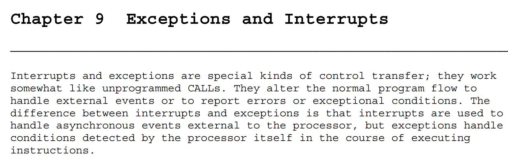

            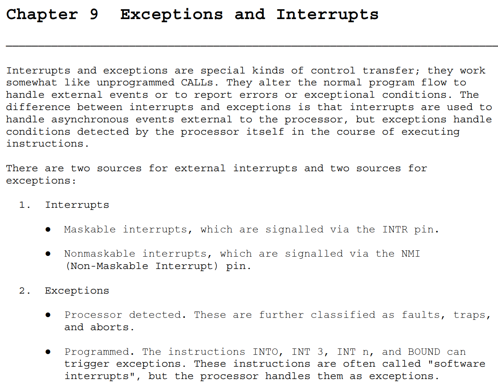

            - 中断

                intel 规定的是中断用于处理处理器外部的事件

            - 异常

                异常 处理的是处理器在执行指令时检测自身状态的条件（比如除零、无效操作码、浮点异常）

            

            这里看上面那篇文章即可。

            关键：异常是同步的，中断是异步的。

        2. **ARM**

            ARM官方规定，异常包括中断，更具体一点：异常包括下面的内容：

            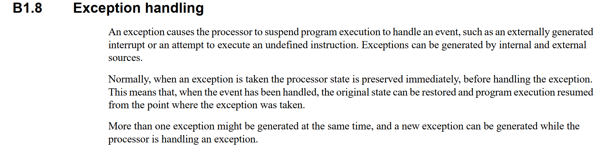

            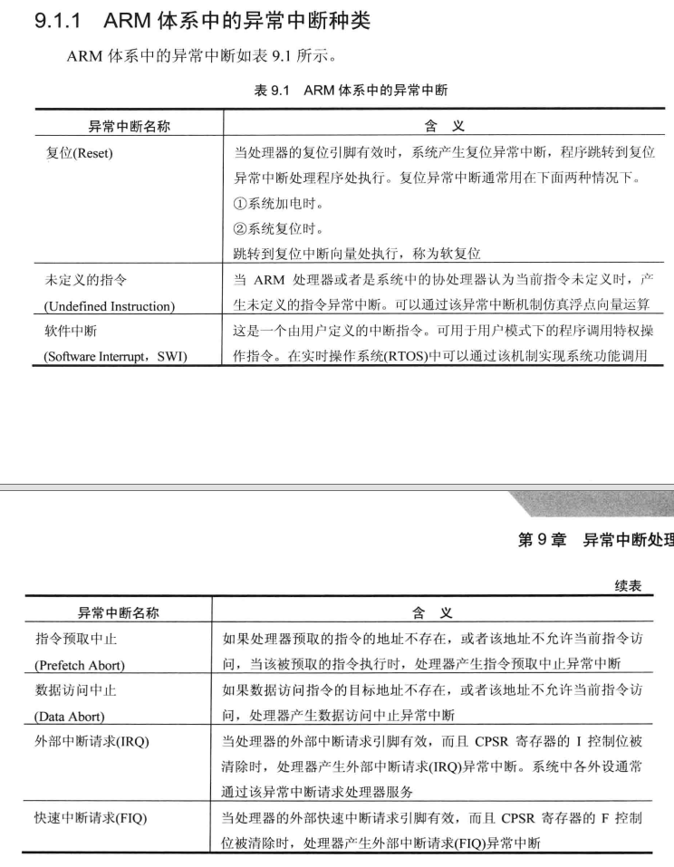

            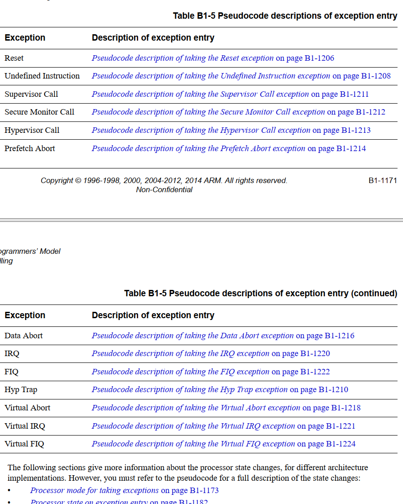

            [ARM异常处理（异常源的分类、异常的响应流程）-CSDN博客](https://blog.csdn.net/challenglistic/article/details/128315233)

            [ARM的异常响应过程_arm异常响应过程-CSDN博客](https://blog.csdn.net/xiangxistu/article/details/82501506?spm=1001.2101.3001.6650.4&utm_medium=distribute.pc_relevant.none-task-blog-2~default~BlogCommendFromBaidu~Rate-4-82501506-blog-128315233.235^v43^pc_blog_bottom_relevance_base4&depth_1-utm_source=distribute.pc_relevant.none-task-blog-2~default~BlogCommendFromBaidu~Rate-4-82501506-blog-128315233.235^v43^pc_blog_bottom_relevance_base4&utm_relevant_index=7)

            个人觉得这两篇博客可以概括，如有更详细，可以查阅ARM指令集的手册（不同架构的均可），就不再赘述。

            

        3. RISC-V

            RISC-V spec 规定，异常处理和中断处理都属于异常。

            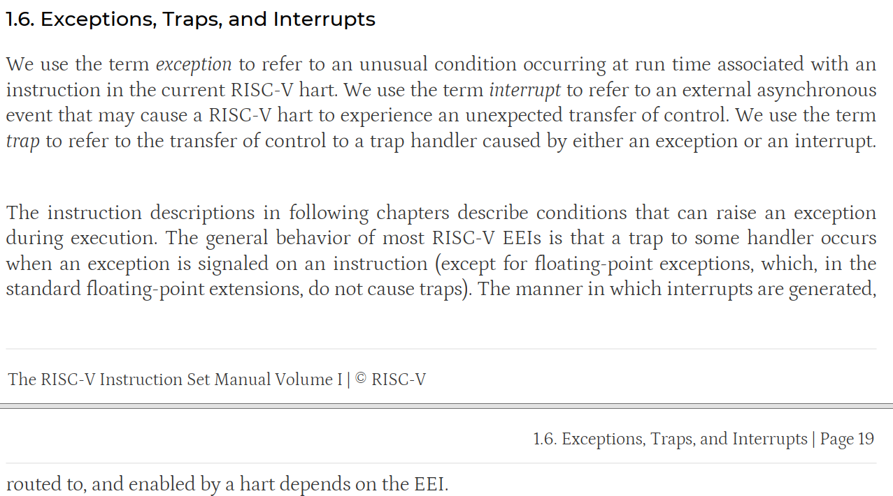

            异常包括：

            1. 中断

                主要来自外部设备的中断引脚，连接到中断控制器，由中断控制器负责中断优先级调度，然后在发送中断信号给RISC-V处理器，改变处理器的执行流。

                中断属于**异步异常的一种**

            2. 异常

                异常主要包括：指令访问异常和数据访问异常。

                数据访问异常包括：加载访问异常和存储访问异常。

                比如：处理器打开MMU后，访问内存地址发现了错误（缺页等），处理器内部的MMU捕获这些错误并报告给处理器，从而触发缺页异常。

            3. 系统调用

                系统调用允许软件主动通过特殊指令来请求更高特权模式的程序所提供的服务。类似于最开始trap的功能。

        4. 对于我当时提出的这个问题，内核态和用户态之间由异常、中断中的哪个来切换？（最后都是通过一条硬件指令trap来切换的，但是往上层一点，是中断还是异常引起的？）

            **实际上我问的就有问题**

            **==异常和中断本身并不直接负责内核态和用户态之间的切换，而是导致这种切换的触发事件。==**

            **所以，不同架构下提供的 trap 指令来主动切换。**

            

            这里 **==留坑==**，在完成了PA3.1后再来回答，顺便以 RISC-V 的视角回答这个问题。**因为处理器和 `os` 需要配合做一些事情。**

            进一步总结发生异常之后的：
            
            > 1. **触发事件**：无论是由于异常、中断还是系统调用，当一个事件需要操作系统介入处理时，它会触发一个处理器的中断向量或异常向量。
            > 2. **保存状态**：处理器在响应异常或中断时，会自动保存当前的上下文，包括程序计数器和其他寄存器的状态，以便之后可以恢复执行。
            > 3. **特权级别变更**：大多数现代处理器具有改变特权级别的机制，通常与异常和中断处理相关。当中断或异常发生时，处理器会自动从当前的执行级别（用户态或内核态）切换到一个更高的特权级别（通常是内核态）。
            > 4. **执行处理程序**：处理器会跳转到对应的中断服务例程（ISR）或异常处理程序。这些处理程序运行在内核态，拥有对系统资源的完全访问权限。
            > 5. **系统调用约定**：对于系统调用，不同架构可能有不同的约定。例如：
            >     - 在**x86**架构中，`int 0x80`或`syscall`指令用于触发系统调用。处理器响应这个指令，保存当前状态，并跳转到操作系统定义的系统调用处理程序。
            >     - 在**MIPS**架构中，`syscall`指令用于发起系统调用，同样会触发处理器切换到内核态并执行系统调用处理程序。
            >     - 在**RISC-V**架构中，`ecall`（Environment Call）指令用于从用户态切换到内核态，以执行系统调用。
            > 6. **上下文切换**：如果需要，操作系统可以在处理程序中执行上下文切换，比如在多任务环境中切换到另一个进程。
            > 7. **返回用户态**：一旦异常或中断被处理，操作系统会负责将控制权安全地返回给用户态的程序。这通常涉及到恢复之前保存的上下文，并可能改变处理器的特权级别。
            >
            > GPT

    

    

    

    > 正在尝试为您在互联网搜索相关资料...
    >
    > 开始获取资料...
    >
    > 找到了第 1 篇资料：[什么是系统调用?为什么要用系统调用?-CSDN博客](https://blog.csdn.net/haigand/article/details/90284303)
    >
    > 找到了第 2 篇资料：[操作系统原理与源码实例讲解：系统调用的实现 - 知乎](https://zhuanlan.zhihu.com/p/671045266)
    >
    > 找到了第 3 篇资料：[深入XV6：陷阱与系统调用的探索之旅 - 百度智能云](https://cloud.baidu.com/article/3247378)
    >
    > 找到了第 4 篇资料：[深入理解系统调用 - lwis - 博客园](https://www.cnblogs.com/lwis/p/12953704.html)
    >
    > 找到了第 5 篇资料：[Linux系统调用概述与实例分析_系统调用接口举例-CSDN博客](https://blog.csdn.net/weixin_44277699/article/details/105527722)
    >
    > 找到了第 6 篇资料：[复习补充一点系统调用实例_举个例子系统调用-CSDN博客](https://blog.csdn.net/KingOfMyHeart/article/details/116171867)
    >
    > 找到了第 7 篇资料：[操作系统原理与源码实例讲解：043 系统调用的原理和源码实例](https://zhuanlan.zhihu.com/p/671045447)
    >
    > 找到了第 8 篇资料：[系统调用 - Linux 内核如何处理系统调用 - 《Linux 内核揭秘 ...](https://www.bookstack.cn/read/linux-insides-zh/SysCall-linux-syscall-2.md)
    >
    > 找到了第 9 篇资料：[Chapter 4 陷阱和系统调用 （Traps and system calls）](https://passerbyjia.github.io/cs-basics/os/6.S081/book/chapter-4.html)
    >
    > 找到了第 10 篇资料：[XV6学习之旅：深入陷阱与系统调用 - 百度智能云](https://cloud.baidu.com/article/3259207)
    >
    > 找到了第 11 篇资料：[深入XV6：陷阱与系统调用的探索之旅-百度开发者中心](https://developer.baidu.com/article/detail.html?id=3247378)
    >
    > 找到了第 12 篇资料：[第4章 陷阱和系统调用 - 简书](https://www.jianshu.com/p/e3416ff6ccf0)
    >
    > 
    >
    > - 系统调用（System Call）
    >
    >     系统调用是用户程序向操作系统内核请求服务的一种方式。用户程序通过系统调用可以请求操作系统执行特定的功能，比如文件操作、进程控制、通信等。系统调用的实现通常涉及以下几个步骤：
    >
    >     1. 用户程序通过特定的系统调用接口发起请求。
    >    2. CPU从用户态切换到内核态。
    >     3. 操作系统内核接收请求，并根据系统调用号找到对应的内核函数执行。
    >     4. 内核函数执行完毕后，将结果返回给用户程序，CPU再从内核态切换回用户态。
    > 
    > - 陷阱（trap）
    >
    >     **陷阱是一种由软件触发的中断，用于实现系统调用**。在用户程序中，当需要执行系统调用时，会执行一条特殊的指令（如`int`或`syscall`），这条指令会触发一个软件中断，即陷阱。处理器捕获到陷阱后，会将控制权转交给内核的陷阱处理程序。

    总结，系统调用的背后是 trap 指令

    

    **==留坑==** 这里在完成了PA4之后有了一点实际的硬件体会再回来写写。

    

    

- **==思考题==**

    > 接上，那对于现在来说，系统调用和库函数这种过程调用还有什么区别？
    > 比如 `glibc` 和系统调用背后实现trap的指令有什么关系和区别

    `glibc` 到最后都本质是不是还是系统调用？还是要进行内核态和用户态切换？

    我捋一下，假如说我写一个代码，写了一行 `printf`，其对应到内部的系统调用是 `write`，最终输出到终端上（内部还有很多细节），其对应上的内部指令就还是需要用到trap这个指令来切换用户态和内核态来对硬件进行操控。

    > 是的，您理解的基本正确。glibc（GNU C Library）中的许多函数，包括`printf`，最终可能会通过系统调用来实现它们的功能。以下是详细解释：
    >
    > 1. **库函数与系统调用的关系**：glibc 提供了丰富的库函数，这些函数为程序员提供了方便的接口来执行各种操作，包括 I/O、内存管理、进程控制等。这些库函数的实现通常会在必要时调用系统调用。
    >
    > 2. **系统调用的必要性**：当库函数需要执行一些只能由操作系统内核完成的操作时（比如写入文件、改变文件状态、进行网络通信等），它们会通过系统调用请求内核服务。系统调用是用户空间程序与内核空间交互的唯一安全方式。
    >
    > 3. **内核态和用户态的切换**：系统调用确实涉及到从用户态到内核态的切换。这是通过特定的硬件指令实现的，比如在 x86 架构中，可以使用 `int` 或 `syscall` 指令来触发陷阱（trap），从而实现状态切换。
    >
    > 4. **`printf` 和 `write` 的关系**：`printf` 是 glibc 中的一个格式化输出函数，它在内部可能会调用 `write` 系统调用来将格式化后的字符串输出到标准输出（通常是终端）。`write` 系统调用负责将数据从用户空间的缓冲区传输到指定的文件描述符。
    >
    > 5. **使用 trap 指令**：当 glibc 中的 `write` 函数被调用时，如果需要进行系统调用，它会使用 trap 指令（如 `int 0x80` 或 `syscall`）来请求内核服务。这个指令会导致 CPU 从用户态切换到内核态，然后操作系统内核会处理这个调用。
    >
    > 6. **输出到终端**：当 `write` 系统调用被用于标准输出时，内核会将数据发送到控制台驱动程序，该驱动程序会与硬件交互，最终将数据显示在用户的终端上。

    关于标准IO和低级IO和系统调用，write、read、open等等：之前看到的一张图：
    
    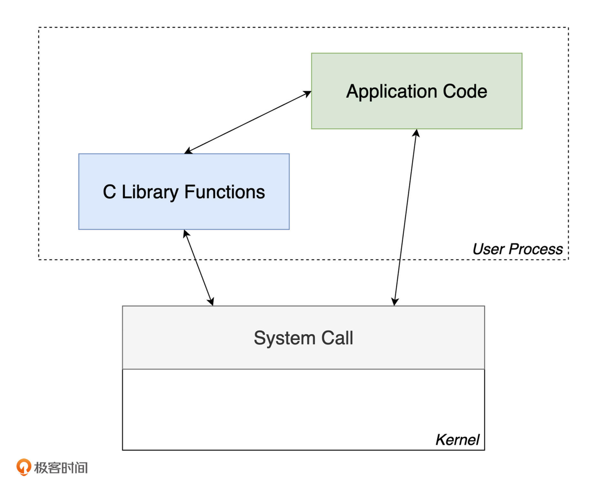
    
    标准 IO 接口在实现时，会直接使用所在平台提供的低级 IO 接口。
    
    而低级 IO 接口在每次调用时，都会通过系统调用来完成相应的 IO 操作。
    
    系统调用的过程涉及到进程在用户模式与内核模式之间的转换，其成本较高。


## PA3.1穿越时空的旅程

### riscv32


- **==思考题==**

    > 特殊的原因? (建议二周目思考)
    >
    > 这些程序状态(x86的eflags, cs, eip; mips32的epc, status, cause; riscv32的mepc, mstatus, mcause)必须由硬件来保存吗? 能否通过软件来保存? 为什么?
    
    


### 状态机视角下的异常响应机制


### 将上下文管理抽象成CTE

> 课外阅读
>
> 用软件模拟指令
>
> 在一些嵌入式场景中, 处理器对低功耗的要求非常严格, 很多时候都会去掉浮点处理单元FPU来节省功耗. 这时候如果软件要执行一条浮点指令, 处理器就会抛出一个非法指令的异常. 有了异常响应机制, 我们就可以在异常处理的过程中模拟这条非法指令的执行了, 原理和PA2中的指令执行过程非常类似. 在不带FPU的各种处理器中, 都可以通过这种方式来执行浮点指令.
>
> 在AM中执行浮点指令是UB
>
> 换句话说, AM的运行时环境不支持浮点数. 这听上去太暴力了. 之所以这样决定, 是因为IEEE 754是个工业级标准, 为了形式化逻辑上的soundness和completeness, 标准里面可能会有各种奇怪的设定, 例如不同的舍入方式, inf和nan的引入等等, 作为教学其实没有必要去理解它们的所有细节; 但如果要去实现一个正确的FPU, 你就没法摆脱这些细节了.
>
> 和PA2中的定点指令不同, 浮点指令在PA中用到的场合比较少, 而且我们有别的方式可以绕开, 所以就怎么简单怎么来了, 于是就UB吧. 当然, 如果你感兴趣, 你也可以考虑实现一个简化版的FPU. 毕竟是UB, 如果你的FPU行为正确, 也不算违反规定.


- **==思考题==**

    > 另一个UB
    >
    > 另一种你可能会碰到的UB是栈溢出, 对, 就是stackoverflow的那个. 检测栈溢出需要一个更强大的运行时环境, AM肯定是无能为力了, 于是就UB吧.
    >
    > 不过, AM究竟给程序提供了多大的栈空间呢? 事实上, 如果你在PA2的时候尝试努力了解每一处细节, 你已经知道这个问题的答案了; 如果你没有, 你需要反思一下自己了, 还是认真RTFSC吧.

    栈的大小

    ```bash
    ENTRY(_start)
    PHDRS { text PT_LOAD; data PT_LOAD; }
    
    SECTIONS {
      /* _pmem_start and _entry_offset are defined in LDFLAGS */
      . = _pmem_start + _entry_offset;
      .text : {
        *(entry)
        *(.text*)
      } : text
      etext = .;
      _etext = .;
      .rodata : {
        *(.rodata*)
      }
      .data : {
        *(.data)
      } : data
      edata = .;
      _data = .;
      .bss : {
    	_bss_start = .;
        *(.bss*)
        *(.sbss*)
        *(.scommon)
      }
      _stack_top = ALIGN(0x1000);
      . = _stack_top + 0x8000;
      _stack_pointer = .;
      end = .;
      _end = .;
      _heap_start = ALIGN(0x1000);
    }
    
    ```

    栈的大小：0x8000 并对齐到最接近的 4KB

    这里，`_stack_top` 是栈的顶部地址，而 `_stack_pointer` 是栈指针的初始值，它设置在 `_stack_top` 地址上加上 `0x8000` 的位置。这意味着栈的大小是从 `_stack_top` 地址开始向下增长的，直到 `_stack_pointer` 所指向的地址。因此，栈的大小是 `0x8000` 字节，或者说是 32768 字节。这相当于 32KB 的栈空间。

    

#### 设置异常入口地址

````bash
abstract-machine/am/include/am.h
// 架构无关，专注于AM（eg. context 的 event）

/home/jai/ysyx-workbench/abstract-machine/am/include/arch
// 架构相关
    
````


#### 实现异常响应机制

- **==PA不涉及特权级的切换, RTFM的时候你不需要关心和特权级切换相关的内容.==**

- **==做==**

    > 实现异常响应机制
    >
    > 你需要实现上文提到的新指令, 并实现`isa_raise_intr()`函数. 然后阅读`cte_init()`的代码, 找出相应的异常入口地址.
    >
    > 如果你选择mips32和riscv32, 你会发现status/mstatus寄存器中有非常多状态位, 不过目前完全不实现这些状态位的功能也不影响程序的执行, 因此目前只需要将status/mstatus寄存器看成一个只用于存放32位数据的寄存器即可.
    >
    > 实现后, 重新运行`yield test`, 如果你发现NEMU确实跳转到你找到的异常入口地址, 说明你的实现正确(NEMU也可能因为触发了未实现指令而终止运行).


#### 保存上下文

成功跳转到异常入口地址之后, 我们就要在软件上开始真正的异常处理过程了. 但是, 进行异常处理的时候不可避免地需要用到通用寄存器, 然而看看现在的通用寄存器, 里面存放的都是执行流切换之前的内容. 这些内容也是上下文的一部分, 如果不保存就覆盖它们, 将来就无法恢复这一上下文了. 但通常硬件并不负责保存它们, 因此需要通过软件代码来保存它们的值. x86提供了`pusha`指令, 用于把通用寄存器的值压栈; 而mips32和riscv32则通过`sw`指令将各个通用寄存器依次压栈.

除了通用寄存器之外, 上下文还包括:

- 触发异常时的PC和处理器状态. 对于x86来说就是eflags, cs和eip, x86的异常响应机制已经将它们保存在堆栈上了; 对于mips32和riscv32来说, 就是epc/mepc和status/mstatus寄存器, 异常响应机制把它们保存在相应的系统寄存器中, 我们还需要将它们从系统寄存器中读出, 然后保存在堆栈上.
- 异常号. 对于x86, 异常号由软件保存; 而对于mips32和riscv32, 异常号已经由硬件保存在cause/mcause寄存器中, 我们还需要将其保存在堆栈上.
- 地址空间. 这是为PA4准备的, 在x86中对应的是`CR3`寄存器, 代码通过一条`pushl $0`指令在堆栈上占位, mips32和riscv32则是将地址空间信息与0号寄存器共用存储空间, 反正0号寄存器的值总是0, 也不需要保存和恢复. 不过目前我们暂时不使用地址空间信息, 你目前可以忽略它们的含义.


- **==思考题==**

    >  对比异常处理与函数调用
    >
    >  我们知道进行函数调用的时候也需要保存调用者的状态: 返回地址, 以及calling convention中需要调用者保存的寄存器. 而CTE在保存上下文的时候却要保存更多的信息. 尝试对比它们, 并思考两者保存信息不同是什么原因造成的.


- **==思考题==**

    > 诡异的x86代码
    >
    > x86的`trap.S`中有一行`pushl %esp`的代码, 乍看之下其行为十分诡异. 你能结合前后的代码理解它的行为吗? Hint: 程序是个状态机.


> 重新组织Context结构体
>
> 你的任务如下:
>
> - **实现这一过程中的新指令, 详情请RTFM.**
>- 理解上下文形成的过程并RTFSC, 然**后重新组织`abstract-machine/am/include/arch/$ISA-nemu.h` 中定义的 `Context`结构体的成员, 使得这些成员的定义顺序和 `abstract-machine/am/src/$ISA/nemu/trap.S`中构造的上下文保持一致.**
> 
> 需要注意的是, 虽然我们目前暂时不使用上文提到的地址空间信息, 但你在重新组织`Context`结构体时仍然需要正确地处理地址空间信息的位置, 否则你可能会在PA4中遇到难以理解的错误.
>
> 实现之后, 你可以在`__am_irq_handle()`中通过`printf`输出上下文`c`的内容, 然后通过简易调试器观察触发自陷时的寄存器状态, 从而检查你的`Context`实现是否正确.

>  给一些提示吧
>
>  "实现新指令"没什么好说的, 你已经在PA2中实现了很多指令了. "重新组织结构体"是一个非常有趣的题目, 如果你不知道要做什么, 不妨从读懂题目开始. 题目大概的意思就是, 根据`trap.S`里面的内容, 来定义`$ISA-nemu.h`里面的一个结构体. `trap.S`明显是汇编代码, 而`$ISA-nemu.h`里面则是一个用C语言定义的结构体. 汇编代码和C语言... 等等, 你好像想起了ICS课本的某些内容...

配合 `trap.S` 中定义的宏顺序：

```C
#define CONTEXT_SIZE  ((NR_REGS + 3 + 1) * XLEN)
#define OFFSET_SP     ( 2 * XLEN)
#define OFFSET_CAUSE  ((NR_REGS + 0) * XLEN)
#define OFFSET_STATUS ((NR_REGS + 1) * XLEN)
#define OFFSET_EPC    ((NR_REGS + 2) * XLEN)
```

画出如下图：

```C
|         | <-- sp
| pdir    | 
| mepc    |
| mstatus |   
| mcause  |
| x31     |   
| x30     |
...
| x3      |
|         |
| x1      |
|         | <-- sp (addi sp, sp, -CONTEXT_SIZE)
```

又因为结构体成员在内存中的排布顺序：

> Structure members are stored sequentially in the order in which they are declared: **the first member has the lowest memory address and the last member the highest.**
>
> 其实也很好理解，访问第一个结构体成员(offset = 0)，想访问下面的成员依次加 offset。

**如果再考虑结构体成员和入栈顺序，也就是第一个成员在相对栈底，最后一个成员在相对栈顶。**由此调整：

```C
struct Context {
  uintptr_t gpr[NR_REGS];
  uintptr_t mcause;
  uintptr_t mstatus;
  uintptr_t mepc;
  void *pdir;
};
```


第一个成员。

```asm
__am_asm_trap:
  addi sp, sp, -CONTEXT_SIZE

  MAP(REGS, PUSH)

  csrr t0, mcause
  csrr t1, mstatus
  csrr t2, mepc

  STORE t0, OFFSET_CAUSE(sp)
  STORE t1, OFFSET_STATUS(sp)
  STORE t2, OFFSET_EPC(sp)

  # set mstatus.MPRV to pass difftest
  li a0, (1 << 17)
  or t1, t1, a0
  csrw mstatus, t1

  mv a0, sp
  jal __am_irq_handle

  LOAD t1, OFFSET_STATUS(sp)
  LOAD t2, OFFSET_EPC(sp)
  csrw mstatus, t1
  csrw mepc, t2
                                                                                                                            
  MAP(REGS, POP)

  addi sp, sp, CONTEXT_SIZE
  mret

```

主要研究一下汇编和函数调用。可以看出，前面将 `gpr` 、`csr` 入栈之后，这里的异常处理代码直接将 `sp` 赋值给 `a0` 。

关于 `riscv` 整型 `gpr` 在函数调用规范中的使用情况，具体看看 spec 

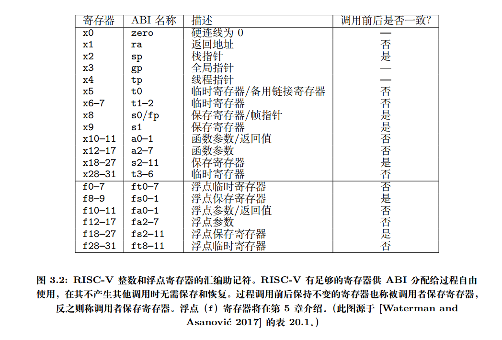

所以 `sp` 作为参数传给 `__am_irq_handle`，也就是题目所说的 `Context *c`，不过呢是传进去的栈指针，所以具体怎么使用栈上面的内容进一步看汇编代码。这里又引出一些问题，直接传入栈指针给函数，那这个指针指向的是结构体的哪一个成员呢？第一个还是最后一个？

第一个成员。

> 必答题(需要在实验报告中回答) - 理解上下文结构体的前世今生
>
> 你会在`__am_irq_handle()`中看到有一个上下文结构指针`c`, 
>
> `c` 指向的上下文结构究竟在哪里? 
> 这个上下文结构又是怎么来的? 
> 具体地, 这个上下文结构有很多成员, 每一个成员究竟在哪里赋值的? 
> `$ISA-nemu.h`, `trap.S`, 上述讲义文字, 以及你刚刚在NEMU中实现的新指令, 这四部分内容又有什么联系?
>
> 如果你不是脑袋足够灵光, 还是不要眼睁睁地盯着代码看了, 理解程序的细节行为还是要从状态机视角入手.
>


#### 事件分发

#### 恢复上下文

- **==思考题==**

    >  从加4操作看CISC和RISC
    >
    > 事实上, 自陷只是其中一种异常类型. 有一种故障类异常, 它们返回的PC和触发异常的PC是同一个, 例如缺页异常, 在系统将故障排除后, 将会重新执行相同的指令进行重试, 因此异常返回的PC无需加4. 所以根据异常类型的不同, 有时候需要加4, 有时候则不需要加.
    >
    > 这时候, 我们就可以考虑这样的一个问题了: 决定要不要加4的, 是硬件还是软件呢? CISC和RISC的做法正好相反, CISC都交给硬件来做, 而RISC则交给软件来做. 思考一下, 这两种方案各有什么取舍? 你认为哪种更合理呢? 为什么? 	


在做上面的一堆东西的时候，看的还是《RISC-V体系结构编程与实现》和手册，两者混起来，就对中断、异常、系统调用晕了。

但是冷静之后，发现其实就一个系统调用（异常的一种），就这么简单。整体流程还是挺清晰。多读几遍讲义。

> ```C
>  //asm volatile("li a7, -1; ecall");
>  asm volatile("li a7, 11; ecall");
> 
> ```
>
> 只是赋个值，和mcause 有什么关系？


#### 异常处理的踪迹 - etrace

> 处理器抛出异常也可以反映程序执行的行为, 因此我们也可以记录异常处理的踪迹(exception trace). 你也许认为在CTE中通过`printf()`输出信息也可以达到类似的效果, 但这一方案和在NEMU中实现的etrace还是有如下区别:
>
> - 打开etrace不改变程序的行为(对程序来说是非侵入式的): 你将来可能会遇到一些bug, 当你尝试插入一些`printf()`之后, bug的行为就会发生变化. 对于这样的bug, etrace还是可以帮助你进行诊断, 因为它是在NEMU中输出的, 不会改变程序的行为.
> - etrace也不受程序行为的影响: 如果程序包含一些致命的bug导致无法进入异常处理函数, 那就无法在CTE中调用`printf()`来输出; 在这种情况下, etrace仍然可以正常工作
>
> 事实上, QEMU和Spike也实现了类似etrace的功能, 如果在上面运行的系统软件发生错误, 开发者也可以通过这些功能快速地进行bug的定位和诊断.

实现的trace 不应该用printf？

printf会改变程序的行为？刷新缓冲区？

多看看一些blog有讲过这个问题。


- **==必答题==**

    >  必答题(需要在实验报告中回答) - 理解穿越时空的旅程
    >
    > 从`yield test`调用`yield()`开始, 到从`yield()`返回的期间, 这一趟旅程具体经历了什么? 软(AM, `yield test`)硬(NEMU)件是如何相互协助来完成这趟旅程的? 你需要解释这一过程中的每一处细节, 包括涉及的每一行汇编代码/C代码的行为, 尤其是一些比较关键的指令/变量. 事实上, 上文的必答题"理解上下文结构体的前世今生"已经涵盖了这趟旅程中的一部分, 你可以把它的回答包含进来.
    >
    > 别被"每一行代码"吓到了, 这个过程也就大约50行代码, 要完全理解透彻并不是不可能的. 我们之所以设置这道必答题, 是为了强迫你理解清楚这个过程中的每一处细节. 这一理解是如此重要, 以至于如果你缺少它, 接下来你面对bug几乎是束手无策.

    ```C
    Context *simple_trap(Event ev, Context *ctx) {                   
      switch(ev.event) {                                             
        case EVENT_IRQ_TIMER:                                        
          putch('t'); break;
        case EVENT_IRQ_IODEV:                                        
          putch('d'); break;                                         
        case EVENT_YIELD:                                            
          putch('y'); break;                                         
        default:                                                     
          panic("Unhandled event"); break;
      }
      return ctx;
    }
    
    void hello_intr() {
      printf("Hello, AM World @ " __ISA__ "\n");
      printf("  t = timer, d = device, y = yield\n");
      io_read(AM_INPUT_CONFIG);
      iset(1);
      while (1) {
        //for (volatile int i = 0; i < 10000000; i++) ;
        for (volatile int i = 0; i < 1000; i++) ;
        yield();
      }
    }
    // abstarct-machine/tests/am-tests/src/tests/intr.c
    
    CASE('i', hello_intr, IOE, CTE(simple_trap));
    // am-kernels/tests/am-tests/src/main.c
    
    #define IOE ({ ioe_init();  })
    #define CTE(h) ({ Context *h(Event, Context *); cte_init(h); })
    #define VME(f1, f2) ({ void *f1(int); void f2(void *); vme_init(f1, f2); })
    #define MPE ({ mpe_init(entry); })
    
    extern void (*entry)();
    
    #define CASE(id, entry_, ...) \                                                                                           
      case id: { \
        void entry_(); \
        entry = entry_; \
        __VA_ARGS__; \
        entry_(); \
        break; \
      }
    
    // am-kernels/tests/am-tests/include/amtest.h
    ```

    其实很好理解的，从 main 函数调用 `ioe_init()` 和 `cte_init()` 开始，一步步到底层，配合着本讲的各节题目就能很好的理解。

    1. `cte_init()` 相关初始化

        将 `simple_trap` 作为传入作为 `handle` 也就是之后 `__am_irq_handle` 要使用的。

        ```C
        static Context* (*user_handler)(Event, Context*) = NULL;
        
        Context* __am_irq_handle(Context *c) {
          if (user_handler) {                      
            Event ev = {0};
            switch (c->mcause) {
              // always in machine mode
              case 0xb:
                    if(c->GPR1 == -1) {
                         ev.event = EVENT_YIELD; break;
                    } 
              default: ev.event = EVENT_ERROR; break;
            }
        
            c = user_handler(ev, c);
            assert(c != NULL);
          }
        
          return c;
        }
        
        extern void __am_asm_trap(void);
        
        bool cte_init(Context*(*handler)(Event, Context*)) {
          // initialize exception entry
          asm volatile("csrw mtvec, %0" : : "r"(__am_asm_trap));
        
          // register event handler
          user_handler = handler;
        
          return true;
        }
        
        Context *kcontext(Area kstack, void (*entry)(void *), void *arg) {
          return NULL;
        }
        
        void yield() {
         #ifdef __riscv_e
           asm volatile("li a5, -1; ecall");
         #else
           //asm volatile("li a7, -1; ecall");
           // pass the difftest
           asm volatile("li a7, 11; ecall");
         #endif
         }
        
        ```
    
    2. 查看 `ftrace` 和 `abstract-machine/am/src/riscv/nemu/trap.S` 清楚流程 （仅关注主要控制流）
    
        ```txt
         16 0x8000000c:  call [_trm_init@0x80001030]
         17 0x80001040:    call [main@0x80000e48]                                  
         19 0x80000f54:        call [ioe_init@0x800010e4]
         ...
         26 0x8000113c:         ret [ioe_init]
         27 0x80000f60:        call [cte_init@0x80001400]
         28 0x8000141c:         ret [cte_init]
         29 0x80000f64:        call [hello_intr@0x8000076c]
        ...
        163 0x800007a0:            call [iset@0x8000142c]
        164 0x8000142c:            ret [iset]
        165 0x800007c8:            call [yield@0x80001420]
        166 0x800014d4:              call [__am_irq_handle@0x80001370]
        167 0x800013c8:                call [simple_trap@0x80000690]
        168 0x8000071c:                  call [putch@0x80001018]
        169 0x80001020:                  ret [putch]
        170 0x80000730:                ret [simple_trap]
        171 0x800013d8:              ret [__am_irq_handle]
        172 0x800014d4:            call [__am_irq_handle@0x80001370]
        173 0x800013c8:              call [simple_trap@0x80000690]
        174 0x8000071c:                call [putch@0x80001018]
        175 0x80001020:                   ret [putch]
        176 0x80000730:                 ret [simple_trap]
        177 0x800013d8:               ret [__am_irq_handle]
        ```
    
        主要是关注 `iset(1)` 之后的不断循环（163 - 177）
    
        首先软件 主动调用 `yield` 进入自陷，`riscv`中 ：`asm volatile("li a7, -1; ecall");`
    
        ```c
         
        #define ECALL(dnpc) {\
             bool success; \
             dnpc = (isa_raise_intr(isa_reg_str2val("a7", &success), s->pc)); \
         }
        
          INSTPAT("0000000 00000 00000 000 00000 11100 11", ecall  , I, ECALL(s->dnpc);
                   IFDEF(CONFIG_ETRACE,etrace_log();));
        
        //inst.c
        
        // ECALL
        word_t isa_raise_intr(word_t NO, vaddr_t epc) {
            cpu.csr.mepc = epc;       
            cpu.csr.mcause = NO;
            
            cpu.csr.mstatus &= ~(1 << 7);
            
            // 把异常发生前的 MIE 字段 保存到 MPIE 字段 
            cpu.csr.mstatus |= ((cpu.csr.mstatus & (1 << 3)) << 4);
            // 保存处理器模式 MPP bit[9:8] 0b11 M mode
            cpu.csr.mstatus |= ((1 << 11) + (1 << 12));
            // 关闭本地中断 MIE = 0
            cpu.csr.mstatus &= ~(1 << 3);
            
            return cpu.csr.mtvec;
        }   
        ```
    
        异常相应流程：
    
        ```TXT
        SR[mepc] <- PC
        SR[mcause] <- 一个描述失败原因的号码
        PC <- SR[mtvec]
        ```
    
        ```C
        // Arch-dependent processor context
         typedef struct Context Context;
         
         // An event of type @event, caused by @cause of pointer @ref
         typedef struct {
           enum {
             EVENT_NULL = 0,
             EVENT_YIELD, EVENT_SYSCALL, EVENT_PAGEFAULT, EVENT_ERROR,
             EVENT_IRQ_TIMER, EVENT_IRQ_IODEV,
           } event;
           uintptr_t cause, ref;
           const char *msg;
         } Event;
        // abstract-machine/am/include/am.h
        
        struct Context {
           // TODO: fix the order of these members to match trap.S
           uintptr_t gpr[NR_REGS];
           uintptr_t mcause, mstatus, mepc;                                                                                        
           void *pdir;
         };
        // abstract-machine/am/include/arch/riscv.h
        
        Context* (*user_handler)(Event, Context*)
        ```
    
        保存/配置相关寄存器后，保存好当前的上下文（事件 + 寄存器）。
    
        找到异常入口地址：`__am_asm_trap`。下一步的转移流程如下：
    
        ```assembly
        __am_asm_trap:
        	...
          jal __am_irq_handle 
        	...
          mret
        ```
    
        `__am_asm_trap` 将 `csr` 和 `gpr` 作为上下文传给 `__am_irq_handle` ，
    
        `__am_irq_handle` 通过判断程序上下文（`mcause`），判断出哪一事件（EVENT_YIELD） 
    
        之后交给 `user_handler` (`simple_trap`)（软件层）根据具体事件进行实际的异常处理。
    
        ```C
        Context *simple_trap(Event ev, Context *ctx) {
          switch(ev.event) {
            case EVENT_IRQ_TIMER:
              putch('t'); break;
            case EVENT_IRQ_IODEV:
              putch('d'); break;
            case EVENT_YIELD:
              putch('y'); break;
            default:
              panic("Unhandled event"); break;
          }
          return ctx;
        }   
        ```
    
        > 做到PA3.2刚开始遇到死循环，回来写：
        >
        > 这里我一直没想明白系统调用返回的是系统调用的下一条指令，在哪里写那个 epc+4;
        >
        > 捋了一下调用逻辑：
        >
        > `yield` -> `cte_init` -> `yield` -> `ecall` -> `__am_asm_trap` -> `__am_irq_handle` -> `user_handler` ->`simple_trap` -> `mret`
        >
        > 其实很简单，要么你在返回之前加，要么你在返回的时候加，自己能控制即可。
        >
        > 现在我为了能过 `difftest`，所以我加在了`__am_irq_handler` 处
        
        处理完成后，再将新的 `csr` 和 `gpr` 存回去。
        
        完成之后，恢复上下文：`mret` 
        
        ```C
        #define MRET { \
            cpu.csr.mstatus &= ~(1<<3); \
            cpu.csr.mstatus |= ((cpu.csr.mstatus & (1 << 7)) >> 4); \
            cpu.csr.mstatus &= ~((1<<11)+(1<<12)); \
            cpu.csr.mstatus |= (1<<7); \
            s->dnpc = cpu.csr.mepc; \
        }
        ```
        
        这样一次异常响应就完成了。之后while(1) 循环重复上面过程。
        
        
        
        
        
        这个过程可谓是体现了什么叫抽象。
        
        （OS？）软件(main.c/hello_str) <--> AM (cte) 封装的 `gpr` 、`csr`  <--> 硬件CPU NEMU 
        
        ​					                             架构无关			                              架构相关			
        
        对于异常，关键在于 AM 的 `__am_irq_handle` 如何做好中间人将上下文 `event` 、`gpr`、`csr` 如何传给两方，而不是让软件直接控制 CPU。一方实际响应（AM 之上的软件），一方 CPU 指令执行。（AM 之下的硬件	）


## PA3.2 用户程序和系统调用

### 最简单的操作系统

bug：实现的 `printf` 有问题，给的 `buf` 太小了，导致 `StackOverflow`，影响了 PC 异常。

这里重新给为 `buf[2048]`


- **==阅读==**

    > 操作系统是个C程序
    >
    > 你也许有点不敢相信, 但框架代码的.c和.h文件无疑蕴含着这铁一般的事实, 甚至连编译方式也看不出什么特殊的地方. GNU/Linux也是这样: 如果你阅读它的源代码, 就会发现GNU/Linux只不过是个巨大的C程序而已.
    >
    > 那么和一般的C程序相比, 操作系统究竟有何特殊之处呢? 完成PA3之后, 相信你就会略知一二了.

    确实！一样的配置了链接文件，`stext` 段、`start_kernel` 。只是没有标准的 `main` 函数入口。
    
    只不过它的权限更高，抽象了硬件资源，向上提供了 接口。


### 加载第一个用户程序

实现loader的任务：

- 可执行文件在哪里?

    位于`ramdisk.img`中，`navy-apps` 被放在地址 `0x83000000` 处。

- 代码和数据在可执行文件的哪个位置?

    `.data .text .bss` `section`作为链接视角的代码和数据

    程序装载的视角，在这几个 `segment` 中，要装载的具体更要看 `PT_LOAD`

     ```bash
      Section to Segment mapping:
       Segment Sections...
        00     .riscv.attributes 
        01     .text .rodata 
        02     .data .sdata .sbss .bss 
        03  
     ```

- 代码和数据有多少?

    各个 `segment` 的 `FileSize`

    ```bash
    Program Headers:
      Type           Offset   VirtAddr   PhysAddr   FileSiz MemSiz  Flg Align
      RISCV_ATTRIBUT 0x0068c7 0x00000000 0x00000000 0x0002e 0x00000 R   0x1
      LOAD           0x000000 0x83000000 0x83000000 0x05a47 0x05a47 R E 0x1000
      LOAD           0x006000 0x83006000 0x83006000 0x0089c 0x008d8 RW  0x1000
      GNU_STACK      0x000000 0x00000000 0x00000000 0x00000 0x00000 RW  0x10
    ```

- "正确的内存位置"在哪里?

    `[VirtAddr, VirtAddr + MemSiz)`


Q1:

我们先说明一下用户程序是从哪里来的. 用户程序运行在操作系统之上, 由于运行时环境的差异, 我们不能把编译到AM上的程序放到操作系统上运行. 为此, 我们准备了一个新的子项目Navy-apps, 专门用于编译出操作系统的用户程序. 

讲义...

**==可执行文件位于 `ramdisk` 偏移为0处, 访问它就可以得到用户程序的第一个字节.==**

为了回答剩下的问题, 我们首先需要了解可执行文件是如何组织的. 你应该已经在课堂上学习过ELF文件格式了, 它除了包含程序本身的代码和静态数据之外, 还包括一些用来描述它们的信息, 否则我们连代码和数据之间的分界线在哪里都不知道. 

这些信息描述了可执行文件的组织形式, 不同组织形式形成了不同格式的可执行文件, 例如Windows主流的可执行文件是[PE(Portable Executable)](http://en.wikipedia.org/wiki/Portable_Executable)格式, 而GNU/Linux主要使用[ELF(Executable and Linkable Format)](http://en.wikipedia.org/wiki/Executable_and_Linkable_Format)格式. 因此一般情况下, 你不能在Windows下把一个可执行文件拷贝到GNU/Linux下执行, 反之亦然. ELF是GNU/Linux可执行文件的标准格式, 这是因为GNU/Linux遵循System V ABI([Application Binary Interface](http://stackoverflow.com/questions/2171177/what-is-application-binary-interface-abi)).


- **==思考题==**

    > 我们提到了代码和数据都在可执行文件里面, 但却没有提到堆(heap)和栈(stack). 为什么堆和栈的内容没有放入可执行文件里面? 那程序运行时刻用到的堆和栈又是怎么来的? AM的代码是否能给你带来一些启发?

    堆和栈实际是在内存中划分出来的。而这个大小也是 OS 可以调控的，就像 `FreeRTOS` 中划分出多少的最多栈空间和堆空间：

    

    看 AM 的代码，由起始的链接文件来指定。栈在内存中占了 0x8000, 也就是 32KB，通过栈指针使用。

    而堆它指定了开始，实际分配需要通过 `malloc` 和 `free`，在AM 中，对就是一个heap结构体变量，也是指定开头结尾。

    `_start` -> 程序运行时的堆栈 初始化 -> `main` 函数

    ```assembly
    _stack_top = ALIGN(0x1000);
    . = _stack_top + 0x8000;
    _stack_pointer = .;
    end = .;
    _end = .;
    _heap_start = ALIGN(0x1000);
    // linker.ld
    
    _start: 
      mv s0, zero
      la sp, _stack_pointer
      jal _trm_init
    
    // riscv/nemu/start.S
    
    ./abstract-machine/am/src/platform/nemu/trm.c:Area heap = RANGE(&_heap_start, PMEM_END);
    ```

    对比 AM 和 操作系统，实际上就是 裸机 和操作系统的区别。

    其中一个很重要的区别就是，我用户程序能否直接操作内存等硬件资源，这里对于玩嵌入式的来说，还是比较好理解的。

    所以操作系统就相当于在 AM 上加了一层抽象，由AM 作为 OS 的运行时环境支持（计算机是个抽象层），用户程序要使用硬件资源：堆和栈，就得使用 OS 提供的各个接口。一般来说用户不能改，但是嵌入式的 RTOS 贴近硬件就可以。

    > GPT:
    >
    > 程序运行时刻用到的堆和栈是怎么来的？
    >
    > - **栈**：当程序开始运行时，操作系统会为每个线程分配栈空间。这个栈空间的大小通常在创建线程时确定，但也可以由操作系统动态调整。
    > - **堆**：堆空间是由操作系统在程序运行时管理的。当程序请求分配内存时，操作系统会从堆中分配一块内存给程序。当程序释放内存时，操作系统会将内存归还到堆中，供以后使用。

    扯远了，至于说为什么不将堆栈放入可执行文件中，

    首先，栈的大小通常在编译时确定，但实际使用时根据程序运行时的需要动态变化。而且，栈是线程私有的，每个线程都有自己的栈空间，因此无法在可执行文件中预先定义。

    关于堆，堆是程序运行时动态分配的，其大小和使用情况完全取决于程序的运行逻辑，也就是程序员的自己写的（AM 就定义了各开始，具体怎么使用看运行在其上的应用程序）。所以，由于堆的使用是不确定的，要是很大怎么办，因此无法在编译时就确定其大小和内容放入可执行文件中

    


- **==思考题==**

    > 如何识别不同格式的可执行文件?
    >
    > 如果你在GNU/Linux下执行一个从Windows拷过来的可执行文件, 将会报告"格式错误". 思考一下, GNU/Linux是如何知道"格式错误"的?

    ELF的文件头：ELF魔数、文件机器字节长度、数据存储方式、版本、运行平台、ABI版本、硬件平台等等

    


> ELF文件提供了两个视角来组织一个可执行文件,
>
> - 一个是面向链接过程的section视角, 这个视角提供了用于链接与重定位的信息(例如符号表);
> -  另一个是面向执行的segment视角, 这个视角提供了用于加载可执行文件的信息. 
>
> 通过`readelf`命令, 我们还可以看到section和segment之间的映射关系: 一个segment可能由0个或多个section组成, 但一个section可能不被包含于任何segment中.

以前一直认为section 和 segment 都是一个东西...

所以常说的代码段、数据段是 section

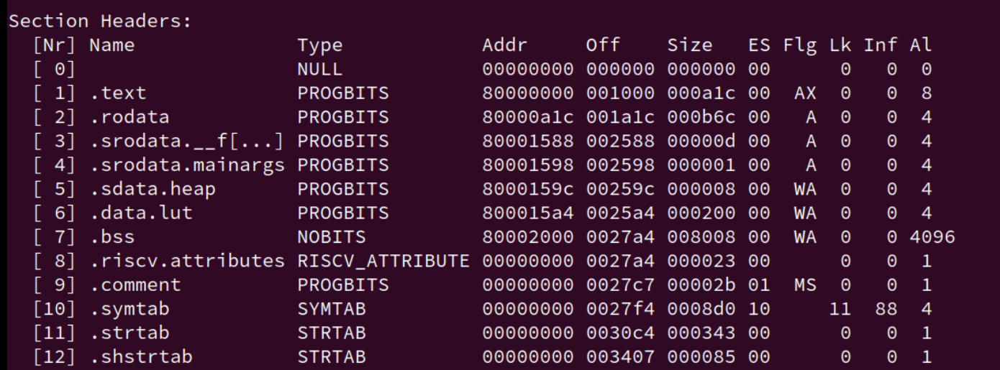

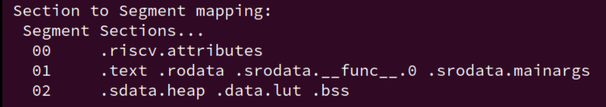


- **==思考题==**

    > 使用`readelf`查看一个ELF文件的信息, 你会看到一个segment包含两个大小的属性, 分别是`FileSiz`和`MemSiz`, 这是为什么? 再仔细观察一下, 你会发现`FileSiz`通常不会大于相应的`MemSiz`, 这又是为什么?

    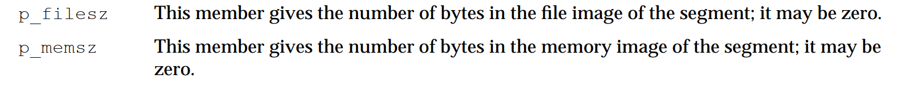

    - `p_filesz`：表示不同的 `segment ` 在 ELF 文件中的大小，即实际从文件中加载到内存的字节数。
    - `p_memsz`：表示不同的 `segment` 在内存中的大小，即在内存中为该段分配的总字节数。

    至于说为什么 `FileSiz` 不大于 `MemSiz` ，我觉得是为了内存对齐。操作系统可能会要求内存段的大小和地址按照特定的对齐边界来分配，即使文件中的实际数据不需要这么多空间。因此，`p_memsz` 可能比 `p_filesz` 大，以满足内存对齐的要求。

    更多阅读：

    1. [The compiler, assembler, linker, loader and process address space tutorial - hacking the process of building programs using C language: notes and illustrations (tenouk.com)](https://www.tenouk.com/ModuleW.html)
    2. ELF specification
    3. `man 5 elf`


- **==思考题==**

    > 为什么要清零?
    >
    > 为什么需要将 `[VirtAddr + FileSiz, VirtAddr + MemSiz)` 对应的物理区间清零?

    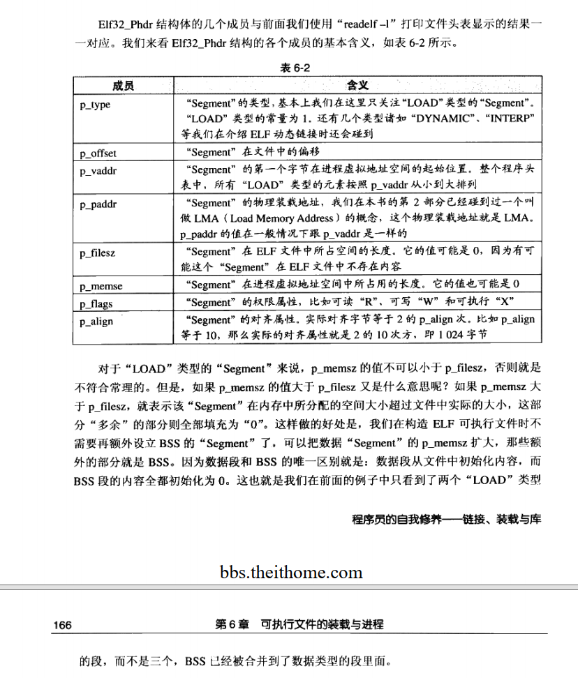

    也体现了为什么 `.bss section` 没有内容。


loader的工作向我们展现出了程序的最为原始的状态: 比特串! **==加载程序其实就是把这一毫不起眼的比特串放置在正确的位置==**, 

但这其中又折射出"存储程序"的划时代思想: 当操作系统将控制权交给它的时候, 计算机把它解释成指令并逐条执行. loader让计算机的生命周期突破程序的边界: 一个程序结束并不意味着计算机停止工作, 计算机将终其一生履行执行程序的使命.


> - 实现SYS_yield系统调用
>
>     你需要:
>
>     1. 在`abstract-machine/am/include/arch/`目录下的相应头文件中实现正确的`GPR?`宏, 让它们从上下文`c`中获得正确的系统调用参数寄存器.
>     2. 添加`SYS_yield`系统调用.
>     3. 设置系统调用的返回值.
>
>     重新运行dummy程序, 如果你的实现正确, 你会看到dummy程序又触发了一个号码为`0`的系统调用. 查看`nanos-lite/src/syscall.h`, 你会发现它是一个`SYS_exit`系统调用. 这说明之前的`SYS_yield`已经成功返回, 触发`SYS_exit`是因为dummy已经执行完毕, 准备退出了.
>
> - 实现SYS_exit系统调用
>
>     你需要实现`SYS_exit`系统调用, 它会接收一个退出状态的参数. 为了方便测试, 我们目前先直接使用这个参数调用`halt()`. 实现成功后, 再次运行dummy程序, 你会看到`HIT GOOD TRAP`的信息.

完成这两个后，了解硬件和软件的对于一个相对完整的事件的处理流程，也对软件和硬件如何协同工作有了一点了解。

进一步体现到内容上就是 系统调用和异常，再进一步就是OS 和 处理器。

1. 关于OS内核态和用户态，什么 U 模式和 M 模式

    初看讲义提到这几个内容感觉很容易混淆，实际上这也是过于纠结名词概念、没有理清软件硬件如何协同的表现。

    对于一个特殊的程序控制硬件的安全性问题，前辈们希望这个控制硬件的程序不那么随便被入侵，也就是希望将操作系统保护起来，

    所以前辈们处于安全的考虑，进而提出了 **==等级森严的制度==**，也就是在硬件处理器上，出现了强大的保护机制。也就是我们现在看到的如：`riscv32` 的机器模式(M-mode)、 监控者模式(S-mode)、用户模式(U-mode)；i386和MIPS也是类似的概念。

    所以，这是为了将不同地位的程序（软件）区分开来，处理器（硬件）来帮忙了。

    也就是说，只有高特权级的程序才能去执行一些特别的操作了（硬件系统级别的操作）

    还是想想，程序怎么控制硬件？指令！对！

    进一步，从一个特权级低的程序切换到另一个特权级高的程序中，软件和硬件怎么交互是怎么知道的？计算机能看懂的只有指令。

    所以，我们需要一条指令，从低级别的程序进入高级别程序，那就是自陷指令。软件进入了，硬件也不能落下，也就是处理器模式得发生变化了。（User mode -> machine mode）（软件、硬件进入没有先后。软件的地位本来就是硬件保护机制给的。）

    所以再回头看看这几个概念，也就很好理解了。

    用户程序调用 `ecall`，离开本程序，进入比用户程序高级的程序：OS（这样子说可能不太好，应用程序也运行在 OS 上，但是为了理解），也就是常说的 kernel 层、user层；

    处理器模式也切换到更高级的模式，也就是 U ->M。

2. 那系统调用和异常也是类似的

    这二者作为事件，肯定是需要硬件和软件来进行协同操作的，所以，也就不要非想着将硬件和软件划分这么开。

    关于二者定义，以 `risc-v spec` 为准，因为它划分的比较具体。

    系统调用作为异常的一种，系统调用允许软件主动通过特殊指令请求更高特权模式的程序所提供的服务，也就是OS 提供的服务。

    那这个系统调用是不是要用那个自陷指令 `ecall` 了？yes。

    但是为什么叫 `exception call` 呢？不直接叫 `syscall` 系统调用作为 `ecall` 最为广泛的应用，但也不能只给它干活。

    > `ecall` 指令之前叫 `scall`，包括现在 Linux 源码里都用的是 `scall`，后来改为了 `ecall`。原因是该指令不仅可以用来进行系统调用，还可以提供更通用化的功能。

    这也就是我们在PA 里写的这两种事件了。

    ```C
    static Context* do_event(Event e, Context* c) {
      switch (e.event) {
        case EVENT_YIELD: printf("event: yield.\n"); break;
        case EVENT_SYSCALL: do_syscall(c); break;
        default: panic("Unhandled event ID = %d", e.event);
      }
      return c;
    }
    ```

    尽管 系统调用 和 自陷`YIELD` 都是通过自陷指令来实现的，但是 系统调用 和 自陷`YIELD` 触发的是不同的事件

    虽然内部的实现一样，但是，我们还是得区分开来的。怎么区分？那就得区分出系统调用号和之前的异常号这两个东西了。

    `mcause` 寄存器存放的是异常原因（异常号），`a7` 存放的是系统调用号，这两个是不一样的东西。

    对应的函数功能，也就是`__am_irq_handle`负责识别哪个异常号，`do_event` 负责识别哪个系统调用。

    这里和实际的 `mcause` 寄存器相比是不一样的，PA 这里为了简化，所以一直都是`mcause` 存 M-mode ，也就是 csr 的bit[9:8]，一直都是11(0xb)。

    实际 spec 并不会将 YIELD 作为一个异常类型，但作为作为事件我们还是得区分。

    riscv spec 规定异常三种：同步异常（指令和数据异常）、异步异常（中断）、系统调用。

    只是我们目前还没有实现中断，还未进一步区分，PA4再说。

    > - `YIELD`事件
    >     - 直接进入处理器的M模式，`YIELD` 事件通常是一种中断或信号，用于触发操作系统的调度器，让当前进程放弃 CPU。
    >     - 在 PA 中，我们规定 当处理器一直处于 M mode，并且 `GPR1/a7` 寄存器的值为 `-1` 时，触发 `YIELD` 事件。
    >     - 这种事件通常是由硬件或操作系统的其他部分触发的，而不是由用户程序直接发起的。
    >
    > - 系统调用事件，
    >     - 系统调用是一种机制，作为 自陷指令 最为广泛的应用，由用户程序发起，显式调用，允许用户空间的程序请求操作系统内核提供的服务。
    >     - 系统调用根据 `GPR1/a7` 系统调用号执行各种操作，如文件操作。
    > - 二者对比 （GPT总结）
    >     - **不同的触发机制**：
    >         - `SYS_yield` 系统调用是由**用户程序显式调用**的，是一种协作式调度的方式。
    >         - `YIELD` 事件可能是由硬件中断、操作系统的其他部分或用户程序的某些操作隐式触发的。
    >     - **不同的使用场景**：
    >         - `SYS_yield` 系统调用通常用于程序需要等待某些资源（如 I/O 操作）完成时，主动让出 CPU。
    >         - `YIELD` 事件可能用于处理时钟中断、硬件事件或其他需要立即调度的场景。
    >     - **灵活性和控制**：
    >         - 系统调用提供了一种更灵活和可控的方式来请求操作系统服务，包括进程调度。
    >         - 事件驱动的 `YIELD` 机制则提供了一种快速响应系统状态变化的方式。

    

而对于一个异常发生的时候，默认情况下，RISC-V 处理器所有的异常都要在 M 模式下处理。

而对于触发异常，我们是通过指令 `ecall` 来进行的。最主要的目的就是从用户态切换到内核态，不过PA没有这样做，我们一直都是运行 M 模式下的。


实际上我下面写的刚好就有问题，就是没有理解 PA 一直运行 M 模式；mcause 和 存储系统调用号的寄存器 二者之间的关系的最好例子：

> dummy 调用流程：
>
> 1. 用户程序dummy调用 `_syscall_` 触发 syscall（系统调用号为1）
>
>     `ecall`  进行异常响应。进入 `__am_asm_trap` 将 `csr` 和 `gpr` 作为上下文传给 `__am_irq_handle` ，
>
>     `__am_irq_handle` 通过判断程序上下文（`mcause`），判断出哪一事件（EVENT_YIELD） 
>
>     之后交给 `user_handler`（软件层）根据具体事件进行实际的异常处理。
>
>     ```C
>     // 有问题：
>     Context* __am_irq_handle(Context *c) {
>       if (user_handler) {
>         Event ev = {0};
>         printf("aaaaaa%d\n", c->mcause);
>         switch (c->mcause) {
>           case 0: case 1: case 2: case 3: case 4: case 5: case 6: case 7: case 8: case 9: 
>               ev.event = EVENT_SYSCALL; c->mepc += 4; break;
>           case 11:               
>               ev.event = EVENT_YIELD; c->mepc += 4; break;
>           default: ev.event = EVENT_ERROR; break;
>         }                 
>         c = user_handler(ev, c);        
>         assert(c != NULL);    
>       }    
>       return c;
>     }
>                                     
>     // 改动后：
>     Context* __am_irq_handle(Context *c) {
>         if (user_handler) {
>             Event ev = {0};
>             switch (c->mcause) {
>               	case 0xb:
>                 	if (c->GPR1 == -1) { // YIELD
>                         ev.event = EVENT_YIELD; c->mepc += 4;
>                     } else if (c->GPR1 >= 0 && c->GPR1 <= 19){ // system call (include sys_yield)
>                     	ev.event = EVENT_SYSCALL; c->mepc += 4;   
>                 	} else {
>                     	printf("unknown type ");
>                 	}
>                 break;
>             default: ev.event = EVENT_ERROR; break;
>         }
>                                     
>         c = user_handler(ev, c);
>         assert(c != NULL);
>       }
>                                     
>       return c;
>     }
>     
>     
>     //abstract-machine/am/src/riscv/nemu/cte.c
>     // 抽象层
>     ```
>                                
>     `__am_irq_handle` 判断机器所在的模式，`NEMU` 一直处于M-mode
>                                
>     触发 系统调用号1：sys_yield。
>                                
>     现在有 OS 了，进而调用 ` do_event()` 划分出事件 ：`EVENT_SYSCALL` 
>                                
>     ```C
>     static Context* do_event(Event e, Context* c) {
>       switch (e.event) {
>         case EVENT_YIELD: printf("event: yield.\n"); break;                 
>         case EVENT_SYSCALL: do_syscall(c); break;
>         default: panic("Unhandled event ID = %d", e.event);
>       }
>       return c;
>     }
>     // nanos-lite/src/irq.c
>     // 
>     ```
>                                
>     ```C
>     ...
>     int sys_yield() {
>         yield(); // CTE的 yield
>         return 0;
>     }
>     void sys_exit(int code) {
>          halt(code);
>     }
>     void do_syscall(Context *c) {
>       uintptr_t a[4];
>       a[0] = c->GPR1; // a7
>       a[1] = c->GPR2; // a0
>       a[2] = c->GPR3; // a1
>       a[3] = c->GPR4; // a2
>                                     
>       switch (a[0]) {
>         case SYS_exit: sys_exit(a[0]); break;
>         case SYS_yield: c->GPRx = sys_yield(); break;
>         default: panic("Unhandled syscall ID = %d", a[0]);
>       }
>     }   
>     ...
>     //nanos-lite/src/syscall.c
>                                     
>     #ifndef __SYSCALL_H__
>     #define __SYSCALL_H__
>                                     
>     enum {
>       SYS_exit,     
>     ...
>     };  
>                                     
>     #endif
>     // nanos-lite/src/syscall.h
>     ```
>                                
>     内部实际是在调用自陷指令。
>
> 2. 调用自陷指令
>
>     保存 上下文，继续调用 `__am_irq_handle`，触发 `cte` 的 case 11 -> EVENT_YIELD
>
>     调用 `do_event` ，触发 EVENT_YIELD ，打印 `printf("event: yield.\n");`
>
> 3. 下一步返回退出
>
>     dummy 就调用了一条指令，下一步该调用库的退出：exit了
>
>     ```C
>     #define SYS_yield 1
>     extern int _syscall_(int, uintptr_t, uintptr_t, uintptr_t);      
>     int main() { 
>       return _syscall_(SYS_yield, 0, 0, 0);
>     }
>                                     
>     // navy-apps/tests/dummy/dummy.c
>     ```
>
>     ```C
>     void halt(int code) {
>       nemu_trap(code);   
>                                         
>       // should not reach here
>       while (1);
>     }
>     //abstract-machine/am/src/platform/nemu/trm.c
>                                     
>     #if defined(__ISA_X86__)
>     # define EXPECT_TYPE EM_386
>     # define nemu_trap(code) asm volatile ("int3" : :"a"(code))
>     #elif defined(__ISA_MIPS32__)
>     # define EXPECT_TYPE 
>     # define nemu_trap(code) asm volatile ("move $v0, %0; sdbbp" : :"r"(code))
>     #elif defined(__riscv)
>     # define EXPECT_TYPE EM_RISCV
>     # define nemu_trap(code) asm volatile("mv a0, %0; ebreak" : :"r"(code))
>     #elif defined(__ISA_LOONGARCH32R__)
>     # define EXPECT_TYPE 
>     # define nemu_trap(code) asm volatile("move $a0, %0; break 0" : :"r"(code))
>     #elif
>     # error unsupported ISA __ISA__
>     #endif
>                                     
>     //abstract-machine/am/src/platform/nemu/include/nemu.h
>     ```
>
>     实际上触发的是 0 号系统调用：SYS_exit。
>
>     总结：自陷指令为 `ecall` ，系统调用需要通过自陷指令  `ecall` 来实现 从 用户区 到 操作系统内核区
>
>     - `EVENT_SYSCALL` -> 通过  实现


### 操作系统的运行时环境

这部分讲义感觉写的挺好的：可以多读几遍

### 系统调用


- **==思考题==**

    >  RISC-V系统调用号的传递
    >
    > 如果你选择的是RISC-V, 你会发现它并不是通过`a0`来传递系统调用号. 
    >
    > 事实上, 我们参考了RISC-V Linux的系统调用参数传递的约定: 即在RISC-V Linux上也是通过这个寄存器来传递系统调用号的. 你觉得RISC-V Linux为什么没有使用`a0`来传递系统调用号呢?

    通过 `a7`  /  `a5` 来传递

    ```C
    #ifdef __riscv_e
    #define GPR1 gpr[15] // a5
    #else
    #define GPR1 gpr[17] // a7
    #endif   
    #define GPR2 gpr[10] // a0
    #define GPR3 gpr[11] // a1
    #define GPR4 gpr[12] // a2
    #define GPRx gpr[10] // a0
    
    ```

    猜测是和函数传参？RISC-V 的整型 GPR调用规范写到：函数的前8个参数用寄存器：**a0~a7传递。多的用栈；函数返回参数保存到a0和a1寄存器：**

    因为是操作系统，所以是在对上层提供资源抽象 API。所以用函数。

    使用 `a7` 而不是 `a0` 来传递系统调用号是出于对现有函数调用规范的兼容性考虑。

    如果使用 `a0` 作为系统调用号的传递，可能会与普通函数调用的参数传递冲突，还有系统调用接口函数返回的时候，也是将返回值记录在 `a0` 寄存器里？感觉不是很清楚


### 操作系统之上的 TRM

#### 标准输出

这里刚做到系统调用的时候是懵逼，exit、yield 半猜半懵地实现，到write这里就懵了。

哪里有write？自己写？再写一边哪个putch？看着那个nanos-lite的syscall.c 傻楞。

实际上还是对层次不清：

在GNU/Linux中，应用程序想要输出是通过 `SYS_write` 系统调用来实现的，用户程序想要输出的时候，使用一些系统硬件级别的资源的时候，需要通过系统调用来实现，也就是说在通过 `ecall` 进行访问特权资源（硬件）的时候，需要通过这个手段来跨越程序的级别，也就是从用户代码到操作系统代码（当然还有处理器模式的更改，不过 PA 一直都是 M，所以不讨论）。所以现在user到操作系统层了（怎么来的，libos的接口），要操作硬件资源了，而我们的操作系统是建立在 `am` 上的，我们抽象一层方便理解，操作硬件现在就是要操作 `am` 了，所以，`am` 会有 相关 API 提供给更上层的 `nanos-lite`。

再回过头来看这个要我们实现的内容：

所以输出的系统调用又要是要依靠硬件：

`nemu/uart memory` <-> `amputch`  <-> `IOE` <-> `nanos-lite: write` <-> `syscall libos `  <-> `navy-apps`

现在，轮到我们来衔接 `hal`层（`am`）、系统调用（`nanos-lite`）、系统调用接口（`libos`）了，因此，对于实现系统调用，这几个都是要用到的，用 `am` 的 API 完善 系统调用，完善系统调用接口。

> 总结出实现系统调用的流程：
>
> `navy` 要改
>
> `nanos-lite` `do_syscall` 要进一步添加具体的行为
>
> 实现具体的系统调用函数。


- **==思考题==**

    > 写完上面的内容之后，我在想，那Linux驱动是在做哪一层呢？平时的嵌入式工作，可以类比到哪一层呢？

    结合文件系统思考。比如：

    - 静止的，具有位置概念，支持 `lseek` 操作，存储这些文件的设备称为**块设备**
    - 流动的，只有顺序关系，不支持 `lseek` 操作，相应的设备称为**字符设备**


#### 堆区管理

在Navy的Newlib中, `sbrk()`最终会调用`_sbrk()`, 它在`navy-apps/libs/libos/src/syscall.c`中定义. 框架代码让`_sbrk()`总是返回`-1`, 表示堆区调整失败, 事实上, 用户程序在第一次调用`printf()`的时候会尝试通过`malloc()`申请一片缓冲区, 来存放格式化的内容. 若申请失败, 就会逐个字符进行输出. 

**如果你在Nanos-lite中打开strace, 你会发现用户程序通过`printf()`输出的时候, 确实是逐个字符地调用`write()`来输出的.**

一开始还真没看出来，说明前面就是write实现的就有问题，就放了个putch，都没有考虑过哈哈哈。


- **==额外阅读1==**

    > 缓冲区与系统调用开销
    > 你已经了解系统调用的过程了. 事实上, 如果通过系统调用千辛万苦地陷入操作系统只是为了输出区区一个字符, 那就太不划算了. 于是有了批处理(batching)的技术: 将一些简单的任务累积起来, 然后再一次性进行处理. **==缓冲区是批处理技术的核心==**, 
    >
    > `libc`中的`fread`()和`fwrite`()正是通过缓冲区来将数据累积起来, 然后再通过一次系统调用进行处理. 
    >
    > 例如通过一个1024字节的缓冲区, 就可以通过一次系统调用直接输出1024个字符, 而不需要通过1024次系统调用来逐个字符地输出. 显然, 后者的开销比前者大得多.
    >
    > 有兴趣的同学可以在GNU/Linux上编写相应的程序, 来粗略测试一下一次write()系统调用的开销, 然后和这篇文章对比一下.[Measurements of system call performance and overhead - Arkanis Development](http://arkanis.de/weblog/2017-01-05-measurements-of-system-call-performance-and-overhead)

    还有一个可移植性的问题，这也就对应了一个面试题目：关于系统调用和libc库的联系和区别。最后总结。


- **==额外阅读2==**

    >  printf和换行
    >
    >  我们在PA1的时候提示过大家, 使用`printf()`调试时需要添加`\n`, 现在终于可以解释为什么了: `fwrite()`的实现中有缓冲区, `printf()`打印的字符不一定会马上通过`write()`系统调用输出, 但遇到`\n`时可以强行将缓冲区中的内容进行输出. 有兴趣的同学可以阅读`navy-apps/libs/libc/src/stdio/wbuf.c`, 这个文件实现了缓冲区的功能.


- **==选做题==**

    >  支持多个ELF的ftrace
    >
    > 如果我们想了解C库中`printf()`到`write()`的过程, ftrace将是一个很好的工具. 但我们知道, Nanos-lite和它加载的用户程序是两个独立的ELF文件, 这意味着, 如果我们给NEMU的ftrace指定其中一方的ELF文件, 那么ftrace就无法正确将另一方的地址翻译成正确的函数名. 事实上, 我们可以让NEMU的ftrace支持多个ELF: 如果一个地址不属于某个ELF中的任何一个函数, 那就尝试下一个ELF. 通过这种方式, ftrace就可以同时追踪Nanos-lite和用户程序的函数调用了.


- **==思考题1==**

    > 再次回顾系统调用和异常的关系，翻看前面的内容。
    >
    > 在RISC-V处理器中，异常发生后 CPU 做了哪些事情？软件OS 又做了哪些事情？

    


- **==思考题/必答题2==**

    > 必答题(需要在实验报告中回答) - hello程序是什么, 它从而何来, 要到哪里去
    >
    > 到此为止, PA中的所有组件已经全部亮相, 整个计算机系统也开始趋于完整. 你也已经在这个自己创造的计算机系统上跑起了hello这个第一个还说得过去的用户程序 (dummy是给大家热身用的, 不算), 好消息是, 我们已经距离运行仙剑奇侠传不远了(下一个阶段就是啦).
    >
    > 不过按照PA的传统, 光是跑起来还是不够的, 你还要明白它究竟怎么跑起来才行. 于是来回答这道必答题吧:
    >
    > > 我们知道`navy-apps/tests/hello/hello.c`只是一个C源文件, 它会被编译链接成一个ELF文件. 
    > >
    > > 1. 那么, hello程序一开始在哪里? 
    > > 2. 它是怎么出现内存中的? 
    > > 3. 为什么会出现在目前的内存位置? 
    > > 4. 它的第一条指令在哪里? 
    > > 5. 究竟是怎么执行到它的第一条指令的? 
    > > 6. hello程序在不断地打印字符串, 每一个字符又是经历了什么才会最终出现在终端上?
    >
    > 上面一口气问了很多问题, 我们想说的是, 这其中蕴含着非常多需要你理解的细节. 我们希望你能够认真整理其中涉及的每一行代码, 然后用自己的语言融会贯通地把这个过程的理解描述清楚, 而不是机械地分点回答这几个问题.
    >
    > 同样地, 上一阶段的必答题"理解穿越时空的旅程"也已经涵盖了一部分内容, 你可以把它的回答包含进来, 但需要描述清楚有差异的地方. 另外, C库中`printf()`到`write()`的过程比较繁琐, 而且也不属于PA的主线内容, 这一部分不必展开回答. 而且你也已经在PA2中实现了自己的`printf()`了, 相信你也不难理解字符串格式化的过程. 如果你对Newlib的实现感兴趣, 你也可以RTFSC.
    >
    > 总之, 扣除C库中`printf()`到`write()`转换的部分, 剩下的代码就是你应该理解透彻的了. 于是, 努力去理解每一行代码吧!
    
    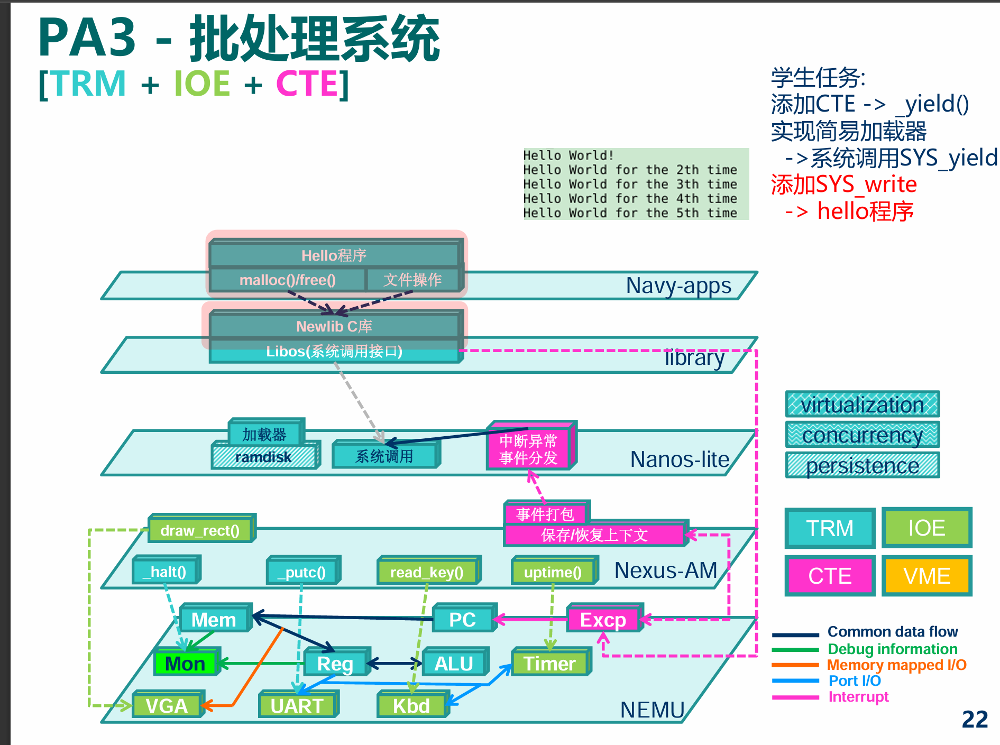
    
    首先，`hello.c` 在 `navy-apps` 层，并被编译成一个 `elf` 可执行文件，位于相关应用程序的 `build` 中
    
    >  一般来说, 程序应该存放在永久存储的介质中(比如磁盘). 但要在NEMU中对磁盘进行模拟是一个略显复杂工作, 因此先让Nanos-lite把其中的一段内存作为磁盘来使用. 这样的磁盘有一个专门的名字, 叫 `ramdisk`.
    
    之后该可执行文件重命名为 `ramdisk.img` 放入 `nanos-lite` 的指定文件夹，
    
    之后编译 `nanos-lite` ，编译期间会把 `ramdisk` 包含进 `nanos-lite`
    
    至于 `hello` 怎么出现在内存中的，简易装载器 `loader` 会将其装载到内存的 `[ramdisk_start, ramdisk_end]` 处。
    
    ```assembly
    .section .data
    .global ramdisk_start, ramdisk_end
    ramdisk_start:
    .incbin "build/ramdisk.img"
    ramdisk_end:      
    
    // nanos-lite/src/resources.S
    ```
    
    可执行文件位于 `ramdisk` 偏移为0处, 访问它就可以得到用户程序的第一个字节.
    
    ```C
    ramdisk_read(&eh, 0, sizeof(Elf_Ehdr));
    //...
    // nanos-lite/src/loader.c
    ```
    
    至于说为什么出现在目前的内存位置：
    
    > 框架约定好：
    >
    > 为了避免和Nanos-lite的内容产生冲突, 我们约定目前用户程序需要被链接到内存位置 `0x83000000`(riscv32)附近，
    >
    > Navy已经设置好了相应的选项(见`navy-apps/scripts/$ISA.mk`中的`LDFLAGS`变量). 
    
    之后，`nanos-lite` 会被和 `am` 一起被编译成 `elf` 可执行文件并将其发送被`nemu`，然后执行 `nemu`。
    
    我们具体来分析这部分过程和第四个问题之后的几个问题。
    
    对于第一条指令，有了PA1的经验和讲义的明示， 还是很清晰的。
    
    `_start -> call_main -> main `
    
    > 用户程序的入口位于 `navy-apps/libs/libos/src/crt0/start.S` 中的 `_start()` 函数。`_start()`函数会调用 `navy-apps/libs/libos/src/crt0/crt0.c` 中的 `call_main()` 函数, 然后调用用户程序的`main()`函数, 从`main()`函数返回后会调用`exit()`结束运行.
    
    ```asm
    .globl  _start          
    _start:
    //... 不同 ISA 下的操作
      mv s0, zero
      jal call_main
      
    // navy-apps/libs/libos/src/crt0/start.S
    
    int main(int argc, char *argv[], char *envp[]);
    extern char **environ;
    void call_main(uintptr_t *args) {
      char *empty[] =  {NULL };
      environ = empty;
      exit(main(0, empty, empty));
      assert(0);
    }
    // navy-apps/libs/libos/src/crt0/crt0.c
    这里比较有意思，环境变量为 NULL，模拟一个非常简单的环境。
    ```
    
    我们再通过反汇编工具生成：
    
    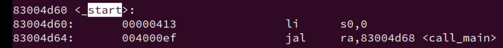
    
    但是有个问题，我们怎么执行到这条指令的？回想一下整个计算机系统的层次，我们的 `navy-apps` 是运行在 `nanos-lite` 上的，而 `nanos-lite` 又是运行在 `AM` 之上的，`AM` 又是在 `NEMU` 硬件上的。所以，记得回去看 NEMU 和 AM。
    
    首先前面的 `nanos-lite` 和 `am` 已经打包好初始化完成，为上层库函数和应用程序做好了运行时环境。当 `loader` 将 `hello` 装载到内存中时，我们就该从 `ramdisk`  的 `offset` 为 0 处开始执行 `_start` ，具体怎么执行一条指令，在 PA2 中已经说的很明白了，不再赘述。
    
    
    
    
    
    最后一个问题：hello程序在不断地打印字符串, 每一个字符又是经历了什么才会最终出现在终端上?
    
    这个问题挺好的。打印调用的 `printf`，首先 
    
    还是先看看 write
    
    应用程序主动调用 `write -> _write_r -> _write` 进而通过自陷指令来实现系统调用。
    
    所以这个时候可以参考前文进入 `__am_asm_trap` 的过程，进入到 `__am_irq_handle` 分发事件。
    
    进而调用 `use_handle ` 也就是 `do_event()` ，在 `nanos-lite` 这一层，一直时 `do_event` 来进一步对事件分发后进行处理，可以直接记住，以后应该也会用。
    
    ```c
    static Context* do_event(Event e, Context* c) {
       switch (e.event) {
         case EVENT_YIELD: printf("event: yield.\n"); break;
         case EVENT_SYSCALL: do_syscall(c); break;
         default: panic("Unhandled event ID = %d", e.event);
       }      
       return c;
     }
     void init_irq(void) {
       //Log("Initializing interrupt/exception handler...");
       cte_init(do_event);
     }
    // nanos-lite/src/irq.c
    ```
    
    触发SYSCALL，进入再判断是哪个系统调用：
    
    ```C
    int sys_yield() {
    }
    void sys_exit(int code) {
    }
    int sys_write(int fd, const void *buf, int count) {
    }   
    
    switch (a[0]) {
      case SYS_exit: strace(); sys_exit(a[0]); break;
      case SYS_yield: c->GPRx = sys_yield(); break;
      case SYS_write: c->GPRx = sys_write(a[1], (char *)a[2], a[3]); break;
      case SYS_brk: c->GPRx = 0; break;
      default: panic("Unhandled syscall ID = %d", a[0]);
    }
    
    ```
    
    进而使用由 `am` 层提供给 `nanos-lite` 的相关操纵硬件资源的一些封装接口， `sys_xxx`。完成之后，`do_syscall` -> `do_event` ->
    
    `__am_irq_handle` -> `_write` 返回到应用程序的位置。继续执行。
    
    对于`printf`，我通过 终端上的 `ftrace`  和 `hello-riscv32` 的反汇编一一对比得出具体流程。
    
    ```assembly
    // 手动对比补全 （
    0x83000118:              call [printf@0x83000188]  // 注意这里是 应用程序的
    0x830001cc:                call [_vfprintf_r@0x83000244]
    0x83000310:                  call [__sfputs_r@0x83000c3c]
    0x83000c88:                    call [_fputc_r@0x830017f0]
    0x83003464:                    ret [_fputc_r]
    ... 重复_fputc_r
    0x83000c88:                    call [_fputc_r@0x830017f0]
    0x83003464:                    ret [_fputc_r]
    0x83000cd4:                    ret [<__sfputs_r>]
    0x83000380:                  call [<_vfprintf_r+0x994>@0x830005fc]
    0x83000960:                    call [<__sfputs_r>@0x83000c3c]
    0x83000c88:                      call [_fputc_r@0x830017f0]
    0x83003464:                      ret [_fputc_r]
    0x83000c88:                      call [_fputc_r@0x830017f0]
    0x83003464:                      ret [_fputc_r]
    0x83000cd4:                    ret [<__sfputs_r>]
    0x83000310:                    call [<_vfprintf_r+0x994>@0x83000c3c]
    0x83000c88:                      call [_fputc_r@0x830017f0]
    0x83003464:                      ret [_fputc_r]
    ... 重复_fputc_r
    0x83000c88:                      call [<_fputc_r>@0x830017f0] 
    0x83003464:                      ret [<_fputc_r>			 
    0x83000c88:                      call [<_fputc_r>@0x830017f0]
    0x83004364:                        call [<_fflush_r>@0x830045d0]
    0x83004500:                          call [<__swrite>@0x830035bc]
    0x83000208:                            call [<_write>@0x83004a44]
    0x800008dc:                              call [__am_irq_handle@0x80000740]
    0x800007b0:                                call [do_event@0x80000210]
    0x80000238:                                  call [do_syscall@0x80000014]
    0x80000104:                                    call [putch@0x80000494]
    0x8000049c:                                    ret [putch]
    ... 重复putch 很多
    0x80000104:                                    call [putch@0x80000494]
    0x8000049c:                                    ret [putch]
    0x800000ac:                                    call [printf@0x80000a18] // klib的
    0x80000ab8:                                      call [vsprintf@0x80000bec]
    0x80000cec:                                        call [itoa@0x80000af4]
    0x80000ba0:                                          call [strcpy@0x80000974]
    0x8000098c:                                          ret [strcpy]
    0x80000bb4:                                        ret [itoa]
    0x80000cec:                                        call [itoa@0x80000af4]
    0x80000ba0:                                          call [strcpy@0x80000974]
    0x8000098c:                                          ret [strcpy]
    0x80000bb4:                                        ret [itoa]
    0x80000cec:                                        call [itoa@0x80000af4]
    0x80000ba0:                                          call [strcpy@0x80000974]
    0x8000098c:                                          ret [strcpy]
    0x80000bb4:                                        ret [itoa]
    0x80000cec:                                        call [itoa@0x80000af4]
    0x80000ba0:                                          call [strcpy@0x80000974]
    0x8000098c:                                          ret [strcpy]
    0x80000bb4:                                        ret [itoa]
    0x80000cec:                                        call [itoa@0x80000af4]
    0x80000ba0:                                          call [strcpy@0x80000974]
    0x8000098c:                                          ret [strcpy]
    0x80000bb4:                                        ret [itoa]
    0x80000cec:                                        call [itoa@0x80000af4]
    0x80000ba0:                                          call [strcpy@0x80000974]
    0x8000098c:                                          ret [strcpy]
    0x80000bb4:                                        ret [itoa]
    0x80000cb0:                                      ret [vsprintf]
    ... putch
    0x80000ad0:                                      call [putch@0x80000494]
    0x8000049c:                                      ret [putch]
    0x80000af0:                                    ret [printf]
    0x800000c8:                                  ret [do_syscall]
    0x8000024c:                                ret [do_event]
    0x800007c0:                              ret [__am_irq_handle]
    0x83004a4c:                            ret [_write]
    0x83000220:                          ret __swrite
    0x830044b0:                        ret [_fflush_r]
    0x830042e8:                      ret [_fputc_r]
    0x83000cd4:                    ret [_vfprintf_r]
    0x8300049c:                  ret [_vfprintf_r+0x994]
    0x83000380:                ret [_vfprintf_r]
    0x830001d8:              ret [printf]  // 应用程序的
    ```
    
    看完流程，大概清楚了 `hello` 字符串怎么一步步从应用程序到下层硬件，再从下次一步步返回到上层的了！
    
    `write(FD_STDOUT, buf, len)`
    
    这里还有有个问题就是：`printf` 到底是谁的？都有？但是怎么区分，上面是因为我手动补充，而同名的。
    
    肯定的是，上层的 `printf` 是会调用我的 `klib` 的，这是为什么呢？（经过验证，在 `klib` 的 `printf` 里加了验证）
    
    错了！这个 `0x800000ac:    call [printf@0x80000a18] // klib的` 是 关于strace的，上面的分析是没有printf那部分的！
    
    正确的：
    
    ```assembly
    // 手动对比补全 （
    0x83000118:              call [printf@0x83000188]  // 注意这里是 应用程序的
    0x830001cc:                call [_vfprintf_r@0x83000244]
    0x83000310:                  call [__sfputs_r@0x83000c3c]
    0x83000c88:                    call [_fputc_r@0x830017f0]
    0x83003464:                    ret [_fputc_r]
    ... 重复_fputc_r
    0x83000c88:                    call [_fputc_r@0x830017f0]
    0x83003464:                    ret [_fputc_r]
    0x83000cd4:                    ret [<__sfputs_r>]
    0x83000380:                  call [<_vfprintf_r+0x994>@0x830005fc]
    0x83000960:                    call [<__sfputs_r>@0x83000c3c]
    0x83000c88:                      call [_fputc_r@0x830017f0]
    0x83003464:                      ret [_fputc_r]
    0x83000c88:                      call [_fputc_r@0x830017f0]
    0x83003464:                      ret [_fputc_r]
    0x83000cd4:                    ret [<__sfputs_r>]
    0x83000310:                    call [<_vfprintf_r+0x994>@0x83000c3c]
    0x83000c88:                      call [_fputc_r@0x830017f0]
    0x83003464:                      ret [_fputc_r]
    ... 重复_fputc_r
    0x83000c88:                      call [<_fputc_r>@0x830017f0] 
    0x83003464:                      ret [<_fputc_r>			 
    0x83000c88:                      call [<_fputc_r>@0x830017f0]
    0x83004364:                        call [<_fflush_r>@0x830045d0]
    0x83004500:                          call [<__swrite>@0x830035bc]
    0x83000208:                            call [<_write>@0x83004a44]
    0x800008dc:                              call [__am_irq_handle@0x80000740]
    0x800007b0:                                call [do_event@0x80000210]
    0x80000238:                                  call [do_syscall@0x80000014]
    0x80000104:                                    call [putch@0x80000494]
    0x8000049c:                                    ret [putch]
    ... 重复putch 很多
    0x80000104:                                    call [putch@0x80000494]
    0x8000049c:                                    ret [putch]
    0x80000104:                                    call [putch@0x80000494]
    0x8000049c:                                    ret [putch]
    0x800000c8:                                  ret [do_syscall]
    0x8000024c:                                ret [do_event]
    0x800007c0:                              ret [__am_irq_handle]
    0x83004a4c:                            ret [_write]
    0x83000220:                          ret __swrite
    0x830044b0:                        ret [_fflush_r]
    0x830042e8:                      ret [_fputc_r]
    0x83000cd4:                    ret [_vfprintf_r]
    0x8300049c:                  ret [_vfprintf_r+0x994]
    0x83000380:                ret [_vfprintf_r]
    0x830001d8:              ret [printf]  // 应用程序的
    ```
    
    现在更清晰了！上层printf就是一步步下来通过系统调用打印出字符的。
    
    
    
    另外：
    
    `build/nanos-lite-riscv32-nemu.txt` :
    
    ```assembly
    80000000 <_start>:
    80000000:   00000413            li  s0,0
    80000004:   0001c117            auipc   sp,0x1c
    80000008:   ffc10113            addi    sp,sp,-4 # 8001c000 <_end>
    8000000c:   5fc000ef            jal ra,80000608 <_trm_init>      
    80000608 <_trm_init>:
    80000618:   c29ff0ef            jal ra,80000240 <main>
    8000061c:   00050513            mv  a0,a0
    80000620:   00100073            ebreak
    80000624:   0000006f            j   80000624 <_trm_init+0x1c>
    80000240 <main>:
    80000240:   ff010113            addi    sp,sp,-16
    80000244:   00001597            auipc   a1,0x1
    ...
    8000025c:   11d000ef            jal ra,80000b78 <printf>
    80000260:   00002417            auipc   s0,0x2
    ...
    80000280:   0f9000ef            jal ra,80000b78 <printf>
    ...
    800002ac:   0cd000ef            jal ra,80000b78 <printf>
    800002b0:   f55ff0ef            jal ra,80000204 <init_mm>
    800002b4:   d5dff0ef            jal ra,80000010 <init_device>
    800002b8:   304000ef            jal ra,800005bc <init_ramdisk>
    800002bc:   0d8000ef            jal ra,80000394 <init_irq>
    800002c0:   110000ef            jal ra,800003d0 <init_fs>
    800002c4:   ef5ff0ef            jal ra,800001b8 <init_proc>
    ...
    800002e0:   099000ef            jal ra,80000b78 <printf>
    800002e4:   6a4000ef            jal ra,80000988 <yield>
    ...
    80000300:   079000ef            jal ra,80000b78 <printf>
    80000304:   00100513            li  a0,1
    80000308:   2f4000ef            jal ra,800005fc <halt>
    800005fc <halt>:
    800005fc:   00050513            mv  a0,a0
    80000600:   00100073            ebreak
    80000604:   0000006f            j   80000604 <halt+0x8>
    ```
    
    `hello-riscv32.txt`
    
    ```assembly
    83004d60 <_start>:
    83004d60:   00000413            li  s0,0
    83004d64:   004000ef            jal ra,83004d68 <call_main>
    
    83004d68 <call_main>:
    ...
    83004d90:   328080e7            jalr    808(ra) # 830000b4 <main>
    ...
    83004d98:   080080e7            jalr    128(ra) # 83004e14 <exit>
    
    830000b4 <main>:                   
    830000e0:   04c080e7            jalr    76(ra) # 83000128 <write>
    ...
    830000f8:   00c12783            lw  a5,12(sp)
    ...
    83000118:   074080e7            jalr    116(ra) # 83000188 <printf>
    ...
    83000124:   fd5ff06f            j   830000f8 <main+0x44>
    
    // 应用层系统调用: write -> _write_r -> _write
    83004a44 <_write>:
    83004a44:   00400893            li  a7,4
    83004a48:   00000073            ecall
    83004a4c:   00008067            ret
    
    // printf -> _vfprintf_r -> __sfputs_r -> _fputc_r -> _putc_r -> __sinit -> __swbuf_r ....找不到了...
    _sbrk_r -> _sbrk
    83004a50 <_sbrk>:
    83004a50:   00050793            mv  a5,a0
    83004a54:   00900893            li  a7,9
    83004a58:   00000593            li  a1,0
    83004a5c:   00000613            li  a2,0
    83004a60:   00000073            ecall
    ..
    83004a74:   e2470713            addi    a4,a4,-476 # 83006894 <program_break.12>
    ...
    83004a88:   00008067            ret
    
    ```
    


- **==思考题3==**

    > 回答libc库 和 系统调用的区别？


PA3.3 和 PA3.2 3.1的关注重点，区别还是比较大的（不是不用前面的，用的还是挺多的）。故分开，层次更好一一点（好像也没。

-----

## PA3.3 简易文件系统

- **==思考题==**

    >  文件偏移量和用户程序
    >
    > 事实上在真正的操作系统中, 把偏移量放在文件记录表中维护会导致用户程序无法实现某些功能. 但解释这个问题需要理解一些超出课程范围的知识, 我们在此就不展开叙述了. 你可以在学习操作系统课程的时候再来思考这个问题.
    >
    > 由于Nanos-lite是一个精简版的操作系统, 上述问题暂时不会出现, 为了简化实现, 我们还是把偏移量放在文件记录表中进行维护.

    


- 一次特别的bug经验：直接改ELF

    ```C
    int fs_open(const char *pathname, int flags, int mode) {
        int len = sizeof(file_table) / sizeof(Finfo);
        for (int i = 3; i < len ; i++) {
            if (strcmp(file_table[i].name, pathname) == 0) {
                file_table[i].open_offset = 0;
               //file_table[i].disk_offset = 0;
               //printf("fs_open:%s file_table[%d]\n",file_table[i].name, i);
               return i;
            }
        }
        panic("No such file: %s\n", pathname);
        return 0;
    }
    
    ```

                file_table[i].open_offset = 0;
               //file_table[i].disk_offset = 0;

    因为走神了，`open_offset` 敲成了 `disk_offset` 就导致我的ELF检测一直过不去。

    开头的 ident 一直是 OggS。一度怀疑是编译链接的顺序问题

    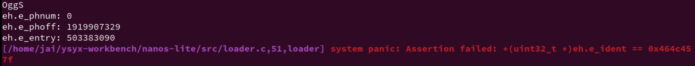

    离谱的是，我甚至手动调整了 `ramdisk.img` 里面的顺序，先把 ELF 放到了开头，但是之后各种问题出现。想到测试程序应该不会有问题，那就是自己的loader部分有点问题，要么是偏移错了，要么实现错了，发现确实。


### 一切皆文件

文件的本质就是字节序列。例子：

- 内存是以字节编址的, 天然就是一个字节序列, 因而我们之前使用的ramdisk作为字节序列也更加显而易见了
- 管道(shell命令中的`|`)是一种先进先出的字节序列, 本质上它是内存中的一个队列缓冲区
- 磁盘也可以看成一个字节序列: 我们可以为磁盘上的每一个字节进行编号, 例如第x柱面第y磁头第z扇区中的第n字节, 把磁盘上的所有字节按照编号的大小进行排列, 便得到了一个字节序列
- socket(网络套接字)也是一种字节序列, 它有一个缓冲区, 负责存放接收到的网络数据包, 上层应用将socket中的内容看做是字节序列, 并通过一些特殊的文件操作来处理它们. 我们在PA2中介绍了DiffTest, 如果你RTFSC, 就会发现其中的`qemu-diff`就是通过socket与QEMU进行通信的, 而操作socket的方式就是`fgetc()`和`fputc()`
- 操作系统的一些信息可以以字节序列的方式暴露给用户, 例如CPU的配置信息
- 操作系统提供的一些特殊的功能, 如随机数生成器, 也可以看成一个无穷长的字节序列
- 甚至一些非存储类型的硬件也可以看成是字节序列: 我们在键盘上按顺序敲入按键的编码形成了一个字节序列, 显示器上每一个像素的内容按照其顺序也可以看做是字节序列...

既然文件就是字节序列, 那很自然地, 上面这些五花八门的字节序列应该都可以看成文件. Unix就是这样做的, 因此有"一切皆文件"(Everything is a file)的说法. 

真是太厉害了！


更进一步的例子：

> 这种做法最直观的好处就是为不同的事物提供了统一的接口: 我们可以使用文件的接口来操作计算机上的一切, 而不必对它们进行详细的区分: 例如 `navy-apps/Makefile`的`ramdisk`规则通过管道把各个shell工具的输入输出连起来, 生成文件记录表
>
> ```bash
> wc -c $(FSIMG_FILES) | grep -v 'total$$' | sed -e 's+ ./fsimg+ +' |
>   awk -v sum=0 '{print "\x7b\x22" $$2 "\x22\x2c " $$1 "\x2c " sum "\x7d\x2c";sum += $$1}' >> $(RAMDISK_H)
> ```
>
> 至我们在PA2中提供的"小星星"示例音频, 也是通过简单的文件操作暴力拼接而成的
>
> ```bash
> cat Do.ogg Do.ogg So.ogg So.ogg La.ogg La.ogg So.ogg > little-star.ogg
> ```
>
> more...


### 虚拟文件系统

实现 VFS 的关键

```C
typedef struct {
  char *name;         // 文件名
  size_t size;        // 文件大小
  size_t disk_offset;  // 文件在ramdisk中的偏移
  ReadFn read;        // 读函数指针
  WriteFn write;      // 写函数指针
} Finfo;
```

其中`ReadFn`和`WriteFn`分别是两种函数指针, 它们用于指向真正进行读写的函数, 并返回成功读写的字节数. 有了这两个函数指针, 我们只需要在文件记录表中对不同的文件设置不同的读写函数, 就可以通过`f->read()`和`f->write()`的方式来调用具体的读写函数了.


- **==阅读==**

    用C语言模拟面向对象编程

    VFS的实现展示了如何用C语言来模拟面向对象编程的一些基本概念: 例如通过结构体来实现类的定义, 结构体中的普通变量可以看作类的成员, 函数指针就可以看作类的方法, 给函数指针设置不同的函数可以实现方法的重载...

    **这说明, OOP中那些看似虚无缥缈的概念也没比C语言高级到哪里去, 只不过是OOP的编译器帮我们做了更多的事情, 编译成机器代码之后, OOP也就不存在了.** 

    [Object-Oriented Programming With ANSI-C](https://www.cs.rit.edu/~ats/books/ooc.pdf) 这本书专门介绍了如何用ANSI-C来模拟OOP的各种概念和功能. 在GNU/Linux的内核代码中, 很多地方也有OOP的影子.


### 操作系统之上的 IOE 

基于 VFS 将 IOE 抽象成文件。


- 实现gettimeofday

    这里再提醒一句：上层的库函数，由Newlibc提供，但是它依赖的系统系统调用是由其所在 OS 提供的。（这里的是libos）


使用 ioe_read 还是 io_read ？提供给 `nanos-lite` 的究竟是 哪个？

看看 am-test就知道了。

io_read

```C
#define io_read(reg) \
  ({ reg##_T __io_param; \
    ioe_read(reg, &__io_param); \
    __io_param; })

#define io_write(reg, ...) \
  ({ reg##_T __io_param = (reg##_T) { __VA_ARGS__ }; \
    ioe_write(reg, &__io_param); })

```


- **==思考题==**

    > 我们把文件看成字节序列, 大部分字节序列都是"静止"的, 例如对于ramdisk和磁盘上的文件, 如果我们不对它们进行修改, 它们就会一直位于同一个地方, 这样的字节序列具有"位置"的概念; 但有一些特殊的字节序列并不是这样, 例如键入按键的字节序列是"流动"的, 被读出之后就不存在了, 这样的字节序列中的字节之间只有顺序关系, 但无法编号, 因此它们没有"位置"的概念. 
    >
    > 属于前者的文件支持`lseek`操作, 存储这些文件的设备称为"块设备"; 而属于后者的文件则不支持`lseek`操作, 相应的设备称为"字符设备". 真实的操作系统还会对`lseek`操作进行抽象, 我们在Nanos-lite中进行了简化, 就不实现这一抽象了.

    > 用fopen()还是open()?
    >
    > 这是个非常值得思考的问题. 你需要思考这两组API具体行为的区别, 然后分析`/dev/events`这个特殊文件应该用哪种函数来操作. 我们已经在某一个蓝色信息框中给出一些提示了.

    标准 IO 和 系统调用/低级 IO 的重要区别就在于有没有缓冲。对于这个字符设备 `/dev/events` 。我能理解为写入速度非常慢，并不需要缓冲，所以用 open 即可。
    
    另外还有一个区别就是可移植性，但是在PA中没有进一步展现，先不讨论。
    
    这里的 open 为什么有两个声明？C语言不是不支持函数重载吗？应该使用的什么手段实现的？变参？


完成PA3.3的第一部分后，好好理解这个VFS，感觉牛逼的


- 在NDL中获取屏幕大小

    关于画布和屏幕大小怎么理解？

    > 其中"画布"是一个面向程序的概念, 程序绘图时的坐标都是针对画布来设定的, 这样程序就无需关心系统屏幕的大小, 以及需要将图像绘制到系统屏幕的哪一个位置. 
    >
    > NDL可以根据系统屏幕大小以及画布大小, 来决定将画布"贴"到哪里, 例如贴到屏幕左上角或者居中, 从而将画布的内容写入到frame buffer中正确的位置.

另外，这里需要将屏幕大小从 `buf` 中读出来，用 `sscanf` ？但是我好像没有实现这个库函数？回想一下自己的实现

> 为了方便用户程序进行标准输入输出, 操作系统准备了三个默认的文件描述符:
>
> ```c
> #define FD_STDIN 0
> #define FD_STDOUT 1
> #define FD_STDERR 2
> ```
>
> 它们分别对应标准输入`stdin`, 标准输出`stdout`和标准错误`stderr`. 
>
> 我们常使用的printf, 最终会调用`write(FD_STDOUT, buf, len)`进行输出; 而scanf将会通过调用`read(FD_STDIN, buf, len)`进行读入.

而 `write`/`read` 系统调用进一步调用 `fs_write`/`fs_read`，进而在里面判断是不是有自己的那套读/写函数


所以懂了，本质上还是调用的 `ram_disk_read`。


- 把VGA显存抽象成文件

    1. write：

        这里在实现的时候遇到了个问题，发现我的 lseek 的偏移量有点问题，写入是对的，但到wrtie读取的时一直读为0，有点奇怪。

        这实际上和我在实现串口时实现的 `fs_write` 和 `fs_read` 有关。

        对于特定设备，指定了读写函数的的时候，我是使用直接传入 `offset` 为 0，因为直接带入了串口的 `offset`，没有考虑过后面的：（这里或许之后改一些，改为特定的fd，将所有的VFS接口的读写函数都初始化为 `ramdisk_read/ramdisk_write` 好了）

        ```C
            if (file_table[fd].read !=  NULL)
                return file_table[fd].read(buf, 0, len);
        
            if (file_table[fd].write != NULL)
                return file_table[fd].write(buf, 0, len);
        ```

        这样子，如果需要配合 `lseek` 使用 `read/write` 那就会出现问题。

        > 日志文件、多进程多文件的操作、`metadata` 的处理 

        还是没有对 VFS 理解。

    2. 关于像素

        ```C
        void NDL_DrawRect(uint32_t *pixels, int x, int y, int w, int h) {
            assert(w > 0 && w <= screen_w);
            assert(h > 0 && h <= screen_h);
            if (w == 0 && h == 0) {
                w = screen_w;
                h = screen_h;
            }
            x += (screen_w - canvas_w) / 2;
            y += (screen_h - canvas_h) / 2;
            for (int row = 0; row < h; row++) {
                int offset = (y + row) * screen_w + x;
                lseek(fbdev, offset * 4, SEEK_SET);
                write(fbdev, pixels + (row * w), w * 4);
                //fseek(fbdev, (long)offset, SEEK_SET); // 乘以 sizeof(uint32_t) 来得到字节偏移量
                //fwrite(pixels + (row * w), 4, w, fbdev); 
            }
        }
        
        ```

        ```C
        size_t fb_write(const void *buf, size_t offset, size_t len) {    
            offset /= 4;
            ctl.pixels = (uint32_t *)buf;    
            ctl.x = offset % screen_w;
            ctl.y = offset / screen_w;
            // line precedence
            ctl.w = len / 4;
            ctl.h = 1;
            ctl.sync = true; // refresh now
            io_write(AM_GPU_FBDRAW, ctl.x, ctl.y, ctl.pixels, ctl.w, ctl.h, ctl.sync);
            return len;
        }
        ```

        这里究竟要不要乘以4byte来对齐像素的单位。

        要么你都对上，要么都不对（nanos-lite和ndl）

        实际上也就是一次写多少个byte，有点像 memcpy 一次拷贝多个byte的优化。

        

    

-  实现居中的画布

    相关几何计算即可。

- 关于系统屏幕(即 `frame buffer` ), `NDL_OpenCanvas()`打开的画布, 以及`NDL_DrawRect()`指示的绘制区域之间的位置关系.

    1. **屏幕大小**定义了物理显示设备的显示能力。
    2. **画布**是程序用来绘制图像的虚拟空间，其大小和位置可以独立于屏幕大小。
    3. **显存**是实际存储图像数据的地方，其内容最终映射到屏幕上。

    `NDL_OpenCanvas` 函数用于设置画布大小， `NDL_DrawRect` 用于将画布上的图像绘制到显存的指定位置。

    `dispinfo_read` 函数用于读取屏幕大小信息，以便正确地将画布内容映射到屏幕上。


- **==重要==**

    > 梳理 VFS 怎么实现各个设备都抽象的。关于字符设备和块设备。

    **==留坑==** 完成 PA3后做


## PA3.3精彩纷呈的应用程序

又一次提醒你该梳理一下层次环境了。

硬件层NEMU --> HAL AM --> OS `nanos-lite` --> 系统调用接口 + `libc`  --> `navy-apps` 

在前一节主要实现了在 `Nanos-lite` 对硬件文件的读写。以 `NDL` 为例，简单对底层进行了一些封装。

现在要做的应该是在移植别的库（SDL、fixedpt、），允许更多的 `navy-apps` 


### 更丰富的运行时环境

#### 多媒体库


#### 定点算术

- **==思考题==**

    >  比较fixedpt和float
    >
    >  `fixedpt`和`float`类型的数据都是32位, 它们都可以表示2^32个不同的数. 但由于表示方法不一样, `fixedpt`和`float`能表示的数集是不一样的. 思考一下, 我们用`fixedpt`来模拟表示`float`, 这其中隐含着哪些取舍?
    
    float 留坑。
    
    `fixedpt` ：24.8：表示整数部分占24位, 小数部分占8位, 实数的小数点总是固定位于第8位二进制数的左边. 本质是`int32_t`类型.
    
    将小数乘 2^8^ 左移 8位，超过 8位的为 整数
    
    eg. `float 7.5` --> `fixedpt 7.5 = `  7.5 * 2^8^  
    
    
    
     


- **==思考题==**

    >  神奇的fixedpt_rconst
    >
    > 阅读`fixedpt_rconst()`的代码, 从表面上看, 它带有非常明显的浮点操作, 但从编译结果来看却没有任何浮点指令. 你知道其中的原因吗?

    ```C
    #if FIXEDPT_BITS == 32
    typedef int32_t fixedpt;
    typedef int64_t fixedptd;
    typedef uint32_t fixedptu;
    typedef uint64_t fixedptud;
    #elif FIXEDPT_BITS == 64
    typedef int64_t fixedpt;
    typedef __int128_t fixedptd;
    typedef uint64_t fixedptu;
    typedef __uint128_t fixedptud;
    #else
    #error "FIXEDPT_BITS must be equal to 32 or 64"
    #endif
    
    #ifndef FIXEDPT_WBITS
    #define FIXEDPT_WBITS   24
    #endif
    
    ...
    #define FIXEDPT_FBITS   (FIXEDPT_BITS - FIXEDPT_WBITS)
    ...
    #define fixedpt_rconst(R) ((fixedpt)((R) * FIXEDPT_ONE + ((R) >= 0 ? 0.5 : -0.5)))
    #define fixedpt_fromint(I) ((fixedptd)(I) << FIXEDPT_FBITS)
    #define fixedpt_toint(F) ((F) >> FIXEDPT_FBITS)
    #define fixedpt_add(A,B) ((A) + (B))
    #define fixedpt_sub(A,B) ((A) - (B))
    #define fixedpt_fracpart(A) ((fixedpt)(A) & FIXEDPT_FMASK)
    
    #define FIXEDPT_ONE ((fixedpt)((fixedpt)1 << FIXEDPT_FBITS))
    
    ```

    类型转换。更重要的靠编译器转换出结果。
    
    偏移量：`+0.5`，`-0.5`：常见的 `round`操作：**四舍五入**。
    
    加上这个偏移量，可以得到一个较接近的浮点数。
    
    要注意的是，正如这个宏的名字中的const，这种转换只适合编译期的转换。如果是运行时转换，就要靠我们实现的几个 API 了。


- **==思考题==**

    > 如何将浮点变量转换成fixedpt类型?
    >
    > 假设有一个`void *p`的指针变量, 它指向了一个32位变量, 这个变量的本质是`float`类型, 它的真值落在`fixedpt`类型可表示的范围中. 如果我们定义一个新的函数`fixedpt fixedpt_fromfloat(void *p)`, 如何在不引入浮点指令的情况下实现它?

    在不使用浮点指令的情况下，将浮点数转换为固定点数（fixedpt）需要一些位操作和数学计算。这里是一个基本的转换方法，它将一个以 `void*` 指针形式给出的 `float` 值转换为 `fixedpt` 类型：

    1. **读取浮点数的位表示**：首先，将 `float` 值的内存表示复制到一个 `int` 类型的变量中，这样可以访问其位模式。
    2. **解释为整数**：将这个 `int` 值解释为一个 `float` 的位模式，然后根据 IEEE 754 标准解释其符号、指数和尾数。
    3. **缩放和舍入**：将浮点数的尾数部分乘以一个缩放因子（例如，如果 `fixedpt` 是 24 位整数，缩放因子可以是 \(2^{8}\)），然后舍入到最近的整数。
    4. **组合结果**：将缩放和舍入后的整数部分与原始符号组合，形成最终的 `fixedpt` 值。

    以下是一个简单的实现示例：

    ```c
    #include <stdio.h>
    #include <stdint.h>
    #include <assert.h>
    
    typedef int fixedpt; // 假设fixedpt是32位整数
    
    // 将void*指针转换为float*指针
    static inline float *float_ptr(void *p) {
        return (float*)p;
    }
    
    // 将float转换为fixedpt
    fixedpt fixedpt_fromfloat(void *p) {
        float *f = float_ptr(p);
        uint32_t f_bits = *(uint32_t*)f; // 读取float的位表示
        int sign = (f_bits >> 31) ? -1 : 1; // 符号位
        int exponent = ((f_bits >> 23) & 0xFF) - 127; // 指数
        uint32_t mantissa = (f_bits & 0x7FFFFF) | 0x800000; // 尾数
    
        if (exponent == -127) { // 检测是否为非规格化数或特殊值
            return 0; // 特殊值或非规格化数，返回0
        }
    
        // 计算实际的浮点数值
        fixedpt result = sign * (mantissa << 8) * (1 << (exponent - 23));
        return result;
    }
    
    int main() {
        float f = 3.14159265f; // 测试浮点数
        fixedpt fx;
    
        fx = fixedpt_fromfloat(&f);
        printf("Fixed point value: %d\n", fx);
    
        assert(fx == 31457); // 假设fixedpt是24位整数，小数点固定在最后8位之前
    
        printf("All tests passed successfully!\n");
        return 0;
    }
    ```

    在这个示例中：
    - `fixedpt_fromfloat` 函数首先将 `void*` 指针转换为 `float*` 指针。
    - 然后读取 `float` 值的位表示，并将其解释为符号、指数和尾数。
    - 最后，计算实际的浮点数值，并将其转换为 `fixedpt` 类型。

    请注意，这个方法假设 `fixedpt` 是一个 32 位整数，且浮点数的值在 `fixedpt` 类型可表示的范围内。如果浮点数的值超出了 `fixedpt` 类型的范围，可能需要额外的错误处理逻辑。此外，这种方法不使用浮点指令，因此避免了浮点数的舍入误差。


#### Navy 作为基础设施

> 个人觉得讲义的这部分挺好的，写下来

在 `am` 中我们常会用 `ARCH=native` 来对比测试 `ARCH=riscv32-nemu` 实现的 `am` 的 API 是否正确：

```c
|------|
| NEMU |
|------| <--- Linux native for am、riscv32 for am 
|  AM  |
|------|
```

我们也可以用 `Linux native` 的功能来实现 `Navy` 应用程序所需的运行时环境，即操作系统相关的运行时环境：

- `libos`
- `libc (Newlib)`
- 一些特殊的文件

类似在 `am` 中用 `Linux native` 的功能实现AM的API，我们也可以用 `Linux native` 的功能来实现上述运行时环境，从而支撑相同的Navy应用程序的运行，来单独对它们进行测试。这样我们就实现了操作系统相关的运行时环境与Navy应用程序的解耦.

我们在 Navy 中提供了一个特殊的 ISA 叫 `native` 来实现上述的解耦，它和其它 ISA 的不同之处在于：

- 链接时绕开 `libos` 和 `Newlib`，让应用程序直接链接 `Linux` 的 `glibc`
- 通过一些 `Linux native` 的机制实现 `/dev/events`, `/dev/fb` 等特殊文件的功能，见 `navy-apps/libs/libos/src/native.cpp`
- 编译到 `Navy native` 的应用程序可以直接运行，也可以用 `gdb` 来调试，见 `navy-apps/scripts/native.mk`，而编译到其它 ISA 的应用程序只能在 `Nanos-lite` 的支撑下运行

可以在测试程序所在的目录下运行 `make ISA=native run`，来把测试程序编译到 Navy native 上并直接运行。

虽然Navy的 `native` 和AM中的 `native` 同名，但它们的机制是不同的:

- 在AM native上运行的系统, 需要AM, Nanos-lite, libos, libc这些抽象层来支撑上述的运行时环境, 在AM中的 `ARCH=native`, 在Navy中对应的是`ISA=am_native`; （也就是对于我个人对电脑，我的硬件平台的指令集是 X86 的，每个人的电脑的ISA不一定一样。也就是在 NEMU、AM这一层的）
- 而**在Navy native中, 上述运行时环境是直接由Linux native实现的.**（也就是在 Navy 这一层，用 `Linux` 原生平台的内容：）

你可以在`bmp-test`所在的目录下运行`make ISA=native run`, 来把`bmp-test`编译到Navy native上并直接运行, 还可以通过`make ISA=native gdb`对它进行调试. 

**==这样你就可以在Linux native的环境下单独测试Navy中除了libos和Newlib之外的所有代码了(例如NDL和miniSDL).==** 

就是控制变量


改：`bmp-test` 反映出一些 VGA 的一些问题。之前 `NDL_DrawRect` 的实现中没有考虑到 `lseek` 和 `write` 是以字节寻址的，而 `pixels` 的单位为 `4` 字节，所以正确的实现如下：

```C
// 向画布`(x, y)`坐标处绘制`w*h`的矩形图像, 并将该绘制区域同步到屏幕上
// 图像像素按行优先方式存储在`pixels`中, 每个像素用32位整数以`00RRGGBB`的方式描述颜色
void NDL_DrawRect(uint32_t *pixels, int x, int y, int w, int h) {
    if (w == 0 && h == 0) {
        w = screen_w;
        h = screen_h;
    }
    assert(w > 0 && w <= screen_w);
    assert(h > 0 && y <= screen_h);
    
    //x += (screen_w - canvas_w) / 2;
    //y += (screen_h - canvas_h) / 2;
    // Directly modify the canvas offset coordinates on x, y
    // Or define a reference variable
    // int ref_x, ref_y; Adjust here, then add to x,y
    for (int row = 0; row < h; row++) {
        int offset = (y + row) * screen_w + x;
        lseek(fbdev, offset * 4, SEEK_SET);
        write(fbdev, pixels + (row * w), w * 4);
    }
}

// maybe also can write AM_GPU_FBDRAW directly
size_t fb_write(const void *buf, size_t offset, size_t len) {
    AM_GPU_CONFIG_T ev = io_read(AM_GPU_CONFIG);
    int width = ev.width;

    offset /= 4;
    len /= 4;
    int y = offset / width;
    int x = offset - y * width;
    
    io_write(AM_GPU_FBDRAW, x, y, (void *)buf, len, 1, true);
    return len;
}

```


- **==思考题==**

    > 神奇的LD_PRELOAD
    >
    > `bmp-test`需要打开一个路径为`/share/pictures/projectn.bmp`的文件, 但在Linux native中, 这个路径对应的文件并不存在. 但我们还是把`bmp-test`成功运行起来了, 你知道这是如何实现的吗? 如果你感兴趣, 可以在互联网上搜索`LD_PRELOAD`相关的内容.
    
    > LD_PRELOAD是Linux系统的一个环境变量，它可以影响程序的运行时的链接（Runtime linker），它允许你定义在程序运行前优先加载的动态链接库。
    >
    > 这个功能主要就是用来有选择性的载入不同动态链接库中的相同函数。通过这个环境变量，我们可以在主程序和其动态链接库的中间加载别的动态链接库，甚至覆盖正常的函数库。一方面，我们可以以此功能来使用自己的或是更好的函数（无需别人的源码），而另一方面，我们也可以以向别人的程序注入程序，从而达到特定的目的。
    
    > `LD_PRELOAD`是个环境变量，只作用于动态链接的库，用于指示加载器在装在C语言运行库之前载入`LD_PRELOAD`指定的共享链接库，达到 **inject** 同名函数的目的。
    >
    > 在`navy-apps/scripts/native.mk`可以看到,
    >
    > ```makefile
    > run: app env
    > 	@LD_PRELOAD=$(NAVY_HOME)/libs/libos/build/native.so $(APP) $(mainargs)
    > ```
    >
    > 通过劫持`fopen`、`open`等项目用到的库函数，我们可以把`path`重定向到真正的磁盘位置，再用原始的`glibc`函数去调用。
    
    参考 [ICS PA 3 (vgalaxy.work)](https://vgalaxy.work/posts/icspa3/) 跟着路径自己 RTFSC 了一遍，也是很有用，还是没学点 C++，感觉还行。
    
    查看编译信息：
    
    ```bash
    Redirecting file open: /share/pictures/projectn.bmp -> /home/jai/ysyx-workbench/navy-apps/fsimg/share/pictures/projectn.bmp
    ```
    
    ```C
    static inline void get_fsimg_path(char *newpath, const char *path) {
      sprintf(newpath, "%s%s", fsimg_path, path);
    }
    
    static const char* redirect_path(char *newpath, const char *path) {
      get_fsimg_path(newpath, path);
      if (0 == access(newpath, 0)) {
        fprintf(stderr, "Redirecting file open: %s -> %s\n", path, newpath);
        return newpath;
      }
      return path;
    }
    
    
    ```
    
    程序执行 `Init` 类的构造函数。
    
    ```C
    struct Init {
      Init() {
        glibc_fopen = (FILE*(*)(const char*, const char*))dlsym(RTLD_NEXT, "fopen");
        assert(glibc_fopen != NULL);
        glibc_open = (int(*)(const char*, int, ...))dlsym(RTLD_NEXT, "open");
        assert(glibc_open != NULL);
        glibc_read = (ssize_t (*)(int fd, void *buf, size_t count))dlsym(RTLD_NEXT, "read");
        assert(glibc_read != NULL);
        glibc_write = (ssize_t (*)(int fd, const void *buf, size_t count))dlsym(RTLD_NEXT, "write");
        assert(glibc_write != NULL);
        glibc_execve = (int(*)(const char*, char *const [], char *const []))dlsym(RTLD_NEXT, "execve");
        assert(glibc_execve != NULL);
    
        dummy_fd = memfd_create("dummy", 0);
        assert(dummy_fd != -1);
        dispinfo_fd = dummy_fd;
    
        char *navyhome = getenv("NAVY_HOME");
        assert(navyhome);
        sprintf(fsimg_path, "%s/fsimg", navyhome);
    
        char newpath[512];
        get_fsimg_path(newpath, "/bin");
        setenv("PATH", newpath, 1); // overwrite the current PATH
    
        SDL_Init(0);
        if (!getenv("NWM_APP")) {
          open_display();
          open_event();
        }
        open_audio();
      }
      ~Init() {
      }
    };
    
    Init init;
    //~/ysyx-workbench/navy-apps/libs/libos/src/native.cpp
    ```
    
    `dlsym` 函数从一个动态链接库或者可执行文件中获取到符号地址……
    
    `fsimg_path` 即为 `navy-apps/fsimg`。
    
    ```C
    FILE *fopen(const char *path, const char *mode) {
      char newpath[512];
      return glibc_fopen(redirect_path(newpath, path), mode);
    }
    
    int open(const char *path, int flags, ...) {
      if (strcmp(path, "/proc/dispinfo") == 0) {
        return dispinfo_fd;
      } else if (strcmp(path, "/dev/events") == 0) {
        return evt_fd;
      } else if (strcmp(path, "/dev/fb") == 0) {
        return fb_memfd;
      } else if (strcmp(path, "/dev/sb") == 0) {
        return sb_fifo[1];
      } else if (strcmp(path, "/dev/sbctl") == 0) {
        return sbctl_fd;
      } else {
        char newpath[512];
        return glibc_open(redirect_path(newpath, path), flags);
      }
    }
    ```
    
    结合上面的 `LD_PRELOAD`，推测这里的 `fopen` 成功 override 掉了库函数，而原来的库函数通过重命名的方式变成了 `glibc_fopen`。
    
    这里的 `fopen` 将原来的文件路径如 `/share/pictures/projectn.bmp` 替换成了
    
     `/home/jai/ysyx-workbench/navy-apps/fsimg/share/pictures/projectn.bmp`！
    
    调用轨迹：
    
    ```
    fopen -> redirect_path -> get_fsimg_path -> glibc_fopen
    ```
    
    但是如何对特殊文件进行模拟？...
    
    
    
    


- **==思考题==**

    > Wine, WSL和运行时环境兼容
    >
    > 我们可以通过Linux native来实现Navy的运行时环境, 从而可以让Navy中的应用程序在Linux native上运行. 那么我们能不能实现其它操作系统的运行时环境, 比如在Linux中提供一套兼容Windows的运行时环境, 从而支持Windows应用程序在Linux上的运行呢?
    >
    > [Wine在新窗口中打开](https://www.winehq.org/)就是这样的一个项目, 它通过Linux的运行时环境实现Windows相关的API. 另一个方向相反的项目是[WSL在新窗口中打开](https://docs.microsoft.com/en-us/windows/wsl/about), 它是通过Windows的运行时环境来实现Linux的API, 从而支撑Linux程序在Windows上的运行, 不过WSL还修改了Windows内核, 让它对Linux程序提供专门的支持. 但完整的Linux和Windows运行时环境太复杂了, 因此一些对运行时环境依赖程度比较复杂的程序至今也很难在Wine或WSL上完美运行, 以至于WSL2抛弃了"运行时环境兼容"的技术路线, 转而采用虚拟机的方式来完美运行Linux系统. 
    >
    > 反观Navy的运行时环境却是非常简单, 我们通过不到300行的`native.cpp`就可以实现它了, 不过如果你理解了其中的概念, 你也就明白类似WSL这些身边的技术是如何工作的了.
    
    值得阅读的一个 C++项目 **==留坑==**


### Navy 的应用程序

#### NSlider (NJU Slider)

- **==做==**

    >  运行NSlider1,2
    >
    > 我们提供了一个脚本来把PDF版本的, 比例为4:3的幻灯片转换成BMP图像, 并拷贝到`navy-apps/fsimg/`中. 你需要提供一个满足条件的PDF文件, 然后参考相应的README文件进行操作. 但你可能会在转换时遇到一些问题, 具体请自行解决.
    >
    > 然后在miniSDL中实现`SDL_UpdateRect()`, 如果你的实现正确, 运行NSlider时将会显示第一张幻灯片. 你很可能是第一次接触SDL的API, 为此你还需要RTFM, 并通过RTFSC来理解已有代码的行为.

    了解一下 `SDL_Surface` 

    ```C
    typedef struct {
        int16_t x, y;
        uint16_t w, h;
    } SDL_Rect;
    
    typedef union {
      struct {
        uint8_t r, g, b, a;
      };
      uint32_t val;
    } SDL_Color;
    
    typedef struct {
        int ncolors;
        SDL_Color *colors;
    } SDL_Palette;
    typedef struct {
        SDL_Palette *palette;
        uint8_t BitsPerPixel;
        uint8_t BytesPerPixel;
        uint8_t Rloss, Gloss, Bloss, Aloss;
        uint8_t Rshift, Gshift, Bshift, Ashift;
        uint32_t Rmask, Gmask, Bmask, Amask;
    } SDL_PixelFormat;
    typedef struct {
        uint32_t flags;
        SDL_PixelFormat *format;
        int w, h;
        uint16_t pitch;
        uint8_t *pixels;
    } SDL_Surface;
    
    // libs/libminiSDL/include/sdl-video.h
    ```

    根据像素的格式

    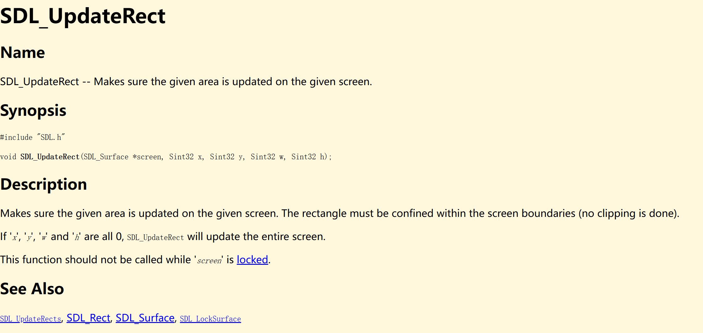

    好像还得看格式多少位颜色。。。崩溃了，不知道为啥看到这些颜色相关的我都不想看....（好像不喜欢弄这个计算机图形学的东西。。。（做完之后回来发现，有网上的资料引导就好。。。但是还是很不想弄。。。。）

    - 像素格式为32位

        主要是将像素数据从 `Surface` 内部数据转为用32位 `αRGB` 格式表示，其中每个通道（红色、绿色、蓝色、透明度）占用 8 位。

        画图理解：

        

        ```C
        // each_pixel_offset = offset * 4
        // n: 0->b 1->g 2->b 3->a
        buf[i++] = (uint32_t)(s->pixels[start_pos + 4 * offset + 3] << 24 |
                    s->pixels[start_pos + 4 * offset + 2] << 16 |
                    s->pixels[start_pos + 4 * offset + 1] << 8 |
                    s->pixels[start_pos + 4 * offset]); 
        ```

        具体应该比较好懂。

        转成 `αRGB` 格式

    - 像素格式为8位

        这里看网上的，没想过。

        在这种情况下，每个像素使用一个字节来存储颜色索引，而不是直接存储颜色值。颜色索引对应于调色板（palette）中的一个颜色，调色板是一个颜色数组，定义了索引与实际颜色值之间的映射。

        ````C
        SDL_Color rgba_color = s->format->palette->colors[s->pixels[start_pos + offset]];
        buf[i++] = rgba_color.a << 24 | rgba_color.r << 16 | rgba_color.g << 8 | rgba_color.b;
        ````

        - 通过 `s->pixels[start_pos + offset]` 获取当前像素的索引值。

        - 使用这个索引值从 `s->format->palette` 中获取对应的颜色值。`s->format->palette` 是一个指向调色板的指针，调色板是一个 `SDL_Color` 数组，每个 `SDL_Color` 结构包含 RGBA 四个通道的值。

        - 好像这就是之前说的调色板。

            总结：

            - **8 位颜色深度**：每个像素用一个字节表示，存储的是调色板索引。
            - **调色板**：一个颜色数组，定义了索引与实际颜色值之间的映射。
            - **转换过程**：通过索引从调色板中获取颜色值，然后将这个颜色值转换为 RGBA 格式，存储到缓冲区中。

    

    > 额外装了个这个：
    >
    > ````bash
    > sudo apt install imagemagick
    > ````
    >
    > 改了个 `xml` 的配置权限：
    >
    > ```xml
    > <policymap>
    >    ...
    >   <policy domain="coder" rights="read | write" pattern="PDF" />
    > 	...
    > </policymap>
    > ```

    

    还是 RTFM: [SDL_KeyboardEvent (libsdl.org)](https://www.libsdl.org/release/SDL-1.2.15/docs/html/sdlkeyboardevent.html)

    这里和实现 `event_read` 有点像，只不过那里是写入，这里刚好读出。

    因为 `NSlider` 只用到了`key` `event` ，所以只实现功能即可。

    一开始想着读出来 `key_code`，但是实际上，对于 `nanos-lite` 中按键事件的抽象成的文件并没有写入 `key_code`，那就轮询好了。 

    ```C
    int SDL_WaitEvent(SDL_Event *event) {
        char buf[64];
        char key_type[8], key_name[8];
        memset(buf, '\0', sizeof(buf));
    
        while(NDL_PollEvent(buf, sizeof(buf)) == 0);
    
        sscanf(buf, "%s %s\n", key_type, key_name);
        event->key.type = buf[1] == 'd' ? SDL_KEYDOWN : SDL_KEYUP;
    
        for(size_t i = 0; i < NR_KEYS; ++i){
            if (strcmp(key_name, keyname[i]) == 0) {
                event->key.keysym.sym = i;
                break;
            }   
        }   
      return 1;
    } 
    
    ```

    另外可以看看这个功能是怎么实现，怎么做到按键下一页的（包云岗老师好像有个研究生面试问题就是这个类似的好像，不过看重系统）

    数字键+上下，跨页跳转还挺好玩哈哈。


调用流程：

- for nanos-lite: fs_open / fs_read (events_read) / fs_close
- for native: (overrided) open / read / close


**注意ramdisk镜像的大小**

我们让ramdisk镜像的内容链接到Nanos-lite的数据段, 而又把用户程序加载到内存位置 `0x3000000`(x86)或`0x83000000`(mips32或riscv32)附近, 这隐含了一个假设: ramdisk镜像的大小不能超过48MB. 如果这个假设不满足, ramdisk中的内容就可能被覆盖, 造成难以理解的错误. 因此你需要注意ramdisk镜像的大小, 不要放入过多过大的文件.

说不定会遇到坑...

```makefile
CROSS_COMPILE = riscv64-linux-gnu-
LNK_ADDR = $(if $(VME), 0x40000000, 0x83000000)                       
CFLAGS  += -fno-pic -march=rv64g -mcmodel=medany
LDFLAGS += --no-relax -Ttext-segment $(LNK_ADDR)
```


#### MENU (开机菜单)

主要实现：

- `SDL_FillRect()`: 往画布的指定矩形区域中填充指定的颜色
- `SDL_BlitSurface()`: 将一张画布中的指定矩形区域复制到另一张画布的指定位置

> 开机菜单还会显示一些英文字体, 这些字体的信息以BDF格式存储, Navy中提供了一个libbdf库来解析BDF格式, 生成相应字符的像素信息, 并封装成SDL的`Surface`. 实现了`SDL_BlitSurface()`之后, 我们就可以很方便地在屏幕上输出字符串的像素信息了.
>
> 记得链接库

实现这两个的时候 API 遇到：

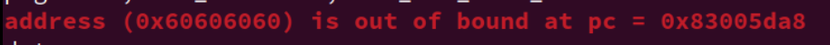

自己遇到的问题的，总结自己实现的原因：

1. 前面的 `NDL_OpenCanvas` 实现的有坑：

    ```C
    /*
    if (*w == 0 && *h == 0) {
    	canvas_h = screen_h;
      	canvas_w = screen_w;
    } else {
      	canvas_h = *h;
      	canvas_w = *w;
    }
    */
    
    ```

    // 打开一张(*w) X (*h)的画布
    // 如果*w和*h均为0, 则将系统全屏幕作为画布, 并将*w和*h分别设为系统屏幕的大小

    **else 部分写反了..**

2. 自己解析的像素数据有坑

    ```C
    // 往画布的指定矩形区域中填充指定的颜色
    void SDL_FillRect(SDL_Surface *dst, SDL_Rect *dstrect, uint32_t color) {
        assert(dst != NULL);
        int x, y, w, h;
        uint32_t start_pos = 0;
        if (dstrect) {
            start_pos = (dstrect->y * dst->w) + dstrect->x;
            x = dstrect->x; y = dstrect->y;
            w = dstrect->w; h = dstrect->h;
        } else {
            x = y = 0;
            w = dst->w; h = dst->h;
        }
    
        uint8_t bits_per_pixel = dst->format->BitsPerPixel;
        uint32_t *pixels = (uint32_t *)(dst->pixels);
        if (bits_per_pixel == 32) {
            for (int row = 0; row < h; row++) {
                uint32_t dstrect_offset = row * dst->w;
                memset(pixels[start_pos + dstrect_offset],
                       color, (dst->w) * sizeof(uint32_t) );
            }
        } else if (bits_per_pixel == 8) {
    
        } else {
            printf("now unsupported pixel bites %u.\n", bits_per_pixel);
        }
    }
    
    ```

做到这里的感觉，真的好烦啊这种天天写库的....

另外暴露了一个问题，又是不不好看讲义对于API规定的行为的，还有自己写着写着就写飞了，听着歌写很爽，给自己埋坑查bug更tm爽


#### NTerm (NJU Terminal)

比较简单，注意RTFM的要求。


- **==选做题==**

    >  实现内建的echo命令
    >
    > 在內建Shell中解析命令和你在PA1中实现简易调试器的命令解析非常类似, 而且Navy中的Newlib已经提供了标准库函数了, 有兴趣的同学可以实现一个內建的`echo`命令.

    这里留着到学点C++做，刚好作为一个练手的项目。直接看于仕琪老师的课程[快速学习C和C++，基础语法和优化策略，学了不再怕指针(南科大计算机系原版)_i](https://www.bilibili.com/video/BV1Vf4y1P7pq/?spm_id_from=333.337.search-card.all.click&vd_source=ecc99d78ae961113010161a48a475a35)

    


#### Flappy Bird

实现 IMG_LOAD:

上述API接受一个图片文件的路径, 然后把图片的像素信息封装成SDL的`Surface`结构并返回. 这个API的一种实现方式如下:

1. 用libc中的文件操作打开文件, 并获取文件大小size
2. 申请一段大小为size的内存区间buf
3. 将整个文件读取到buf中
4. 将buf和size作为参数, 调用`STBIMG_LoadFromMemory()`, 它会返回一个`SDL_Surface`结构的指针
5. 关闭文件, 释放申请的内存
6. 返回`SDL_Surface`结构指针


- **==选做题==**

    > 此外, Flappy Bird也是一个适合大家阅读的项目: 阅读它不需要了解过多的知识背景, 而且大家很容易熟悉游戏的规则, 然后就可以去了解游戏的效果是如何用代码实现出来的.

    也是学了C++再看


**==又爆了一次雷==**

基于下面代码的：应该是 `SDL_BlitSurface` 有问题，导致需要在 `NDL_Init()` 加一行无缘无故的printf代码，估计是哪里野指针跑飞了，或者前面说的数据格式解析有问题。

```C
void SDL_BlitSurface(SDL_Surface *src, SDL_Rect *srcrect, SDL_Surface *dst, SDL_Rect *dstrect) {
    //printf("dst->format->BitsPerPixe is %d\n",dst->format->BitsPerPixel);
    assert(dst && src);
    assert(dst->format->BitsPerPixel == src->format->BitsPerPixel);

    int w = 0, h = 0;
    uint32_t s_start_pos = 0;
    uint32_t d_start_pos = 0;
    // srcrect and dstrecr == NULL RTFM
    if (srcrect) {
        s_start_pos = (srcrect->y * src->w) + srcrect->x;
        w = srcrect->w; h = srcrect->h;
    } else {
        w = src->w; h = src->h;
    }

    if (dstrect) {
        d_start_pos = (dstrect->y * dst->w) + dstrect->x;
    }

    uint8_t bits_per_pixel = dst->format->BitsPerPixel;
    if (bits_per_pixel == 32) {
        for (int row = 0; row < h; row++) {
            uint32_t srcrect_offset = row * src->w;
            uint32_t dstrect_offset = row * dst->w;
            // Note: need to change the pointer type
            //      before you can manipulate the pointer movement. 
            memcpy((uint32_t *)dst->pixels + d_start_pos + dstrect_offset,
                   (uint32_t *)src->pixels + s_start_pos + srcrect_offset,
                   (src->w) * sizeof(uint32_t));
        }
    } else if (bits_per_pixel == 8) {
        for (int row = 0; row < h; ++row) {
            uint32_t srcrect_offset = row * src->w;
            uint32_t dstrect_offset = row * dst->w;
            memcpy((uint8_t *)dst->pixels + d_start_pos + srcrect_offset,
                  (uint8_t *)src->pixels + s_start_pos + dstrect_offset,
                  (src->w) * sizeof(uint8_t));  
        }
    } else {
        printf("now unsupported pixel bites %u.\n", bits_per_pixel);
    }
}


void SDL_FillRect(SDL_Surface *dst, SDL_Rect *dstrect, uint32_t color) {
    int32_t start_pos = 0;
    uint32_t sf_row_num = dst->h;
    uint32_t sf_col_num = dst->w;
    uint32_t rec_row_num = dst->h;
    uint32_t rec_col_num = dst->w;
    if (dstrect) {
        start_pos = dstrect->x + dstrect->y * dst->w;
        rec_row_num = dstrect->h;
        rec_col_num = dstrect->w;
    }

    uint8_t bits_per_pixel = dst->format->BitsPerPixel;
    if (bits_per_pixel == 32) {
        for (int row = 0; row < rec_row_num; ++row)
            memset((uint32_t *)dst->pixels + start_pos + row * sf_col_num,
                   color, rec_col_num * sizeof(uint32_t));
    } else if (bits_per_pixel == 8) {
        for (int row = 0; row < rec_row_num; ++row)
            memset((uint8_t *)dst->pixels + start_pos + row * sf_col_num,
                    color, rec_col_num * sizeof(uint8_t));
    } else {
        printf("unsupported pixel bites %d!\n", dst->format->BitsPerPixel);
    }
}

// 将画布中的指定矩形区域同步到屏幕上.
// 在 (x,y) 处画 w * h 大小的矩形
// 同NDL
// SDL_Surface -> RGBA format(32bit)
void SDL_UpdateRect(SDL_Surface *s, int x, int y, int w, int h) {
    assert(s != NULL);
    // improtant: only w == 0 && h == 0, then set the s size.
    if (w == 0 && h == 0) {
        w = s->w;
        h = s->h;
    }

    uint8_t bits_per_pixel = s->format->BitsPerPixel;
    uint32_t len = w * h;
    uint32_t *buf = malloc(sizeof(uint32_t) * len);
    uint32_t start_pos = (y * s->w) + x;
    size_t i = 0;
    for (size_t row = 0; row < h; ++row) {
        for (size_t col = 0; col < w; ++col) {
            uint32_t offset = (row * s->w) + col;
            // follow SDL_CreateRGBSurface...
            if (bits_per_pixel == 32) {
                buf[i++] = (uint32_t)(s->pixels[start_pos + 4 * offset + 3] << 24 |
                            s->pixels[start_pos + 4 * offset + 2] << 16 |
                            s->pixels[start_pos + 4 * offset + 1] << 8 |
                            s->pixels[start_pos + 4 * offset]);
            } else if (bits_per_pixel == 8) {
                SDL_Color rgba_color =
                    s->format->palette->colors[s->pixels[start_pos + offset]];
                buf[i++] = rgba_color.a << 24 | rgba_color.r << 16 |
                            rgba_color.g << 8 | rgba_color.b;
            } else {
                printf("now unsupported pixel bites %u.\n",
                        bits_per_pixel);
            }
        }
    }
    NDL_DrawRect(buf, x, y, w, h);
    free(buf);
}

```

bug：

```assembly
// 带 printf的
17820 83011288 <NDL_Init>:
17821 83011288:   fa010113            addi    sp,sp,-96
17822 8301128c:   0000e517            auipc   a0,0xe
17823 83011290:   35850513            addi    a0,a0,856 # 8301f5e4 <keyname+0x204>
17824 83011294:   04112e23            sw  ra,92(sp)
17825 83011298:   04812c23            sw  s0,88(sp)
17826 8301129c:   00003097            auipc   ra,0x3
17827 830112a0:   c64080e7            jalr    -924(ra) # 83013f00 <printf>

17828 830112a4:   0000e517            auipc   a0,0xe
17829 830112a8:   64850513            addi    a0,a0,1608 # 8301f8ec <__func__.0+0x54>

17830 830112ac:   00000097            auipc   ra,0x0
17831 830112b0:   1b0080e7            jalr    432(ra) # 8301145c <getenv>
17832 830112b4:   00010417            auipc   s0,0x10
17833 830112b8:   78840413            addi    s0,s0,1928 # 83021a3c <evtdev>
17834 830112bc:   00050663            beqz    a0,830112c8 <NDL_Init+0x40>
17835 830112c0:   00300793            li  a5,3
17836 830112c4:   00f42023            sw  a5,0(s0)
17837 830112c8:   00000593            li  a1,0
17838 830112cc:   0000e517            auipc   a0,0xe
17839 830112d0:   68c50513            addi    a0,a0,1676 # 8301f958 <__func__.0+0xc0>
17840 830112d4:   00001097            auipc   ra,0x1


// 不带printf的：
17820 83011288 <NDL_Init>:
17821 83011288:   fa010113            addi    sp,sp,-96

17822 8301128c:   0000e517            auipc   a0,0xe
17823 83011290:   65050513            addi    a0,a0,1616 # 8301f8dc <__func__.0+0x54>
17824 83011294:   04812c23            sw  s0,88(sp)
17825 83011298:   04112e23            sw  ra,92(sp)

17826 8301129c:   00000097            auipc   ra,0x0
17827 830112a0:   1b0080e7            jalr    432(ra) # 8301144c <getenv>
17828 830112a4:   00010417            auipc   s0,0x10
17829 830112a8:   79840413            addi    s0,s0,1944 # 83021a3c <evtdev>
17830 830112ac:   00050663            beqz    a0,830112b8 <NDL_Init+0x30>
17831 830112b0:   00300793            li  a5,3
17832 830112b4:   00f42023            sw  a5,0(s0)
17833 830112b8:   00000593            li  a1,0
17834 830112bc:   0000e517            auipc   a0,0xe
17835 830112c0:   68c50513            addi    a0,a0,1676 # 8301f948 <__func__.0+0xc0>
17836 830112c4:   00001097            auipc   ra,0x1

```


一个好的版本：

```C
void SDL_BlitSurface(SDL_Surface *src, SDL_Rect *srcrect, SDL_Surface *dst, SDL_Rect *dstrect) {
	assert(dst && src);
	assert(dst->format->BitsPerPixel == src->format->BitsPerPixel);

	if(src->format->BitsPerPixel == 32){
	    uint32_t* src_pixels = (uint32_t*)src->pixels;
		uint32_t* dst_pixels = (uint32_t*)dst->pixels;

		int rect_w, rect_h, src_x, src_y, dst_x, dst_y;
		//RTFM. If srcrect == NULL, the entire surface is copied.
		//If dstrect == NULL, then the destination position (upper left corner) is (0, 0).
		if (srcrect){
		  rect_w = srcrect->w; rect_h = srcrect->h;
		  src_x = srcrect->x; src_y = srcrect->y;
		}else {
		  rect_w = src->w; rect_h = src->h;
		  src_x = 0; src_y = 0;
		}
		if (dstrect){
		  dst_x = dstrect->x, dst_y = dstrect->y;
		}else {
		  dst_x = 0; dst_y = 0;
		}

		for (int i = 0; i < rect_h; ++i){
		  int offset1 = (dst_y + i) * dst->w + dst_x;
		  int offset2 = (src_y + i) * src->w + src_x;
		  for (int j = 0; j < rect_w; ++j){
		    dst_pixels[offset1 + j] = src_pixels[offset2 + j];
		  }
		}
	}else if(src->format->BitsPerPixel == 8){
		//printf("hello \n");
	    uint8_t* src_pixels = (uint8_t*)src->pixels;
		uint8_t* dst_pixels = (uint8_t*)dst->pixels;

		int rect_w, rect_h, src_x, src_y, dst_x, dst_y;
		if (srcrect){
		  rect_w = srcrect->w; rect_h = srcrect->h;
		  src_x = srcrect->x; src_y = srcrect->y;
		}else {
		  rect_w = src->w; rect_h = src->h;
		  src_x = 0; src_y = 0;
		}
		if (dstrect){
		  dst_x = dstrect->x, dst_y = dstrect->y;
		}else {
		  dst_x = 0; dst_y = 0;
		}

		for (int i = 0; i < rect_h; ++i){
		  int offset1 = (dst_y + i) * dst->w + dst_x;
		  int offset2 = (src_y + i) * src->w + src_x;
 		  for (int j = 0; j < rect_w; ++j){
			dst_pixels[offset1 + j] = src_pixels[offset2 + j];
		  }
		}
	}else{
		printf("In [video.c][SDL_BlitSurface] : Invalid BitsPerPixel\n");
		assert(0);
	}
}

void SDL_FillRect(SDL_Surface *dst, SDL_Rect *dstrect, uint32_t color) {
  uint32_t *pixels = (uint32_t *)dst->pixels;
  int rect_h, rect_w, rect_x, rect_y;

  if (dstrect == NULL){
    rect_w = dst->w;
    rect_h = dst->h;
    rect_x = 0;
    rect_y = 0;
  }else {
    rect_w = dstrect->w;
    rect_h = dstrect->h;
    rect_x = dstrect->x;
    rect_y = dstrect->y;
  }
  //printf("%d %d %d %d\n",rect_h,rect_w,rect_x,rect_y);
  for (int i = 0; i < rect_h; ++i){
  	int offset = (rect_y + i) * dst->w + rect_x;
    for (int j = 0; j < rect_w; ++j){
      pixels[offset + j] = color; //pixels[(rect_y + i) * dst_w + rect_x + j] = color;
    }
  }
}

/*
static inline uint32_t translate_color(SDL_Color *color){
  return (color->a << 24) | (color->r << 16) | (color->g << 8) | color->b;
  //return color;
}

void SDL_UpdateRect(SDL_Surface *s, int x, int y, int w, int h) {
	//If all the args are 0, then we update the whole screen.

	//printf("here is SDL_UpdateRect! bits is %d\n",s->format->BitsPerPixel);
	//printf("x,y,w,h: %d %d %d %d\n",x,y,w,h);
	if(s->format->BitsPerPixel == 32){
		if (w == 0 && h == 0 && x ==0 && y == 0){
		  //printf("%d %d\n", s->w, s->h);
		  NDL_DrawRect((uint32_t *)s->pixels, 0, 0, s->w, s->h);
		  return ;
		}

		//To update part of the screen.
		uint32_t *pixels = malloc(w * h * sizeof(uint32_t));
		assert(pixels);
		uint32_t *src = (uint32_t *)s->pixels;
		//for (int i = 0; i < h; ++i){
		  //memcpy(&pixels[i * w], &src[(y + i) * s->w + x], sizeof(uint32_t) * w);
		//} //This is an alternative version.
		for (int i=0;i<h;i++){
			int offset1 = i*w;
			int offset2 = (y+i)*s->w + x;
			for(int j=0;j<w;j++)
				pixels[offset1 + j] = src[offset2 + j];
		}

		NDL_DrawRect(pixels, x, y, w, h);

		free(pixels);
	}else if(s->format->BitsPerPixel == 8){
	   if (w == 0 && h == 0 && x ==0 && y == 0){
		  w = s->w; h = s->h; x = 0;  y = 0;
		}
		uint32_t *pixels = malloc(w * h * sizeof(uint32_t));
		assert(pixels);
		uint8_t *src = (uint8_t *)s->pixels;

		for (int i = 0; i < h; i++){
		  int offset1 = i*w;
		  int offset2 = (y + i) * s->w + x;
		  for (int j = 0; j < w; j++){
			pixels[offset1 + j] = translate_color(&s->format->palette->colors[src[offset2 + j]]);
		  }
		}
		NDL_DrawRect(pixels, x, y, w, h);

		free(pixels);

		//printf("finish update\n");
	}else{
		printf("In [video.c][SDL_UpdateRect] : Invalid BitsPerPixel\n");
		assert(0);
	}

}
*/

```


- **==思考题==**

    > 计算机是个抽象层"的应用: 移植和测试
    >
    > 我们在移植游戏的时候, 会按顺序在四种环境中运行游戏:
    >
    > - 纯粹的Linux native: 和Project-N的组件没有任何关系, 用于保证游戏本身确实可以正确运行. 在更换库的版本或者修改游戏代码之后, 都会先在Linux native上进行测试.
    > - Navy中的native: 用Navy中的库替代Linux native的库, 测试游戏是否能在Navy库的支撑下正确运行.
    > - AM中的native: 用Nanos-lite, libos和Newlib替代Linux的系统调用和glibc, 测试游戏是否能在Nanos-lite及其运行时环境的支撑下正确运行.
    > - NEMU: 用NEMU替代真机硬件, 测试游戏是否能在NEMU的支撑下正确运行.
    >
    > 通过这种方法, 我们就可以很快定位到bug所在的抽象层次. 我们之所以能这样做, 都是得益于"计算机是个抽象层"这个结论: 我们可以把某个抽象层之下的部分替换成一个可靠的实现, 先独立测试一个抽象层的不可靠实现, 然后再把其它抽象层的不可靠实现逐个替换进来并测试. 不过这要求你编写的代码都是可移植的, 否则将无法支持抽象层的替换.

    尽管功能实现的磕磕绊绊，但是最主要是理解概念！理清层次。

    这里还是推荐看看这个博主的：[ICS PA 3 (vgalaxy.work)](https://vgalaxy.work/posts/icspa3/)

    基本贴出了自己的实现过程。

    


#### PAL (仙剑奇侠传)

最期待的一个哈哈，其实已经在不知不觉中完成了哈哈，前面自己傻傻地看到MENU 运行不了，还把 8位 像素的写了哈哈哈。

但是运行不了，又是之前那个out of bound 的 bug，

八成自己自己写的 8位 pixels 有点问题。稍微折腾一下，再补充一下 WaitEvent和PollEvent，实现个 `SDL_GetKeyState` 有了~~


感觉还不错~按键稍微卡了点，其他都还好。

玩了一会发现自己还是挺喜欢玩这种游戏的哈哈。网上找找看能不能配合着攻略继续玩玩

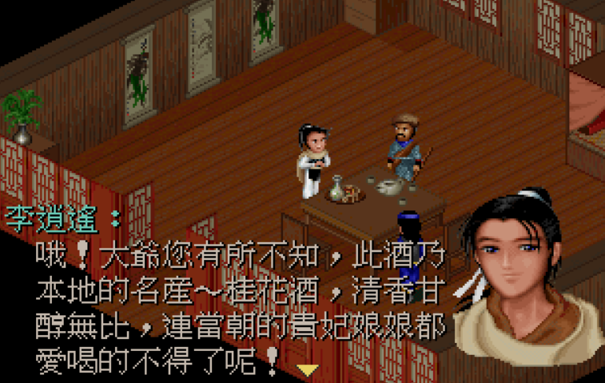


- **==思考题==**

    > 原版的仙剑奇侠传是针对Windows平台开发的, 因此它并不能在GNU/Linux中运行(你知道为什么吗?), 也不能在Navy-apps中运行.

    可执行文件的格式不一样。


- **==思考题==**

    > 仙剑奇侠传的框架是如何工作的?
    >
    > 我们在PA2中讨论过一个游戏的基本框架, 尝试阅读仙剑奇侠传的代码, 找出基本框架是通过哪些函数实现的. 找到之后, 可能会对你调试仙剑奇侠传带来一定的帮助. 虽然仙剑奇侠传的代码很多, 但为了回答这个问题, 你并不需要阅读大量的代码.
    
    ```c
    while (1) {
      等待新的一帧();  // AM_TIMER_UPTIME
      处理用户按键();  // AM_INPUT_KEYBRD
      更新游戏逻辑();  // TRM
      绘制新的屏幕();  // AM_GPU_FBDRAW
    }
    ```


- **==思考题==**

    >  仙剑奇侠传的脚本引擎
    >
    > 在`navy-apps/apps/pal/repo/src/game/script.c`中有一个`PAL_InterpretInstruction()`的函数, 尝试大致了解这个函数的作用和行为. 然后大胆猜测一下, 仙剑奇侠传的开发者是如何开发这款游戏的? 你对"游戏引擎"是否有新的认识?


- **==思考题==**

    >  不再神秘的秘技
    >
    > 网上流传着一些关于仙剑奇侠传的秘技, 其中的若干条秘技如下:
    >
    > 1. 很多人到了云姨那里都会去拿三次钱, 其实拿一次就会让钱箱爆满! 你拿了一次钱就去买剑把钱用到只剩一千多, 然后去道士那里, 先不要上楼, 去掌柜那里买酒, 多买几次你就会发现钱用不完了.
    > 2. 不断使用乾坤一掷(钱必须多于五千文)用到财产低于五千文, 钱会暴增到上限, 如此一来就有用不完的钱了
    > 3. 当李逍遥等级到达99级时, 用5~10只金蚕王, 经验点又跑出来了, 而且升级所需经验会变回初期5~10级内的经验值, 然后去打敌人或用金蚕王升级, 可以学到灵儿的法术(从五气朝元开始); 升到199级后再用5~10只金蚕王, 经验点再跑出来, 所需升级经验也是很低, 可以学到月如的法术(从一阳指开始); 到299级后再用10~30只金蚕王, 经验点出来后继续升级, 可学到阿奴的法术(从万蚁蚀象开始).
    >
    > 假设这些上述这些秘技并非游戏制作人员的本意, 请尝试解释这些秘技为什么能生效.


#### am-kernels

做到这里的时候，需要理清调用流程，不然有相同的东西会很懵逼：

1. `am-kernels` 作为一个应用程序，运行在 `navy-apps` ，其使用的是 `libam` 中实现的 API
2. API 通过 **==Navy 的运行时环境==** 实现，
3. 进一步，**==Navy 的运行时环境==** 又会依赖于 **==系统调用==**，也就是 `libos` 向上提供的 系统调用接口 和 各种标准库函数接口。
4. `libos` 向下实际上封装了 `nanos-lite` 的各种系统调用。
5. 系统调用的实现有些会使用 位于hal层 的 `am` 的 API
6. `am` 的 API 又会使用 硬件 `NEMU`  

具体对于而对于 `am-kernels`，以一个实际的系统调用为例：

```c
(Navy) __am_timer_uptime -> gettimeofday -> sys_gettimeofday -> io_read -> ioe_read -> (AM) _am_timer_uptime
```

> 同名了？并不，编译器会区分。

实现 `libam` 相关API 之后，

`navy-apps/apps/am-kernels/Makefile` 会把 `libam` 加入链接的列表。

在 `navy-apps/apps/am-kernels` 目录下键入：

```C
make ISA=riscv32 ALL=typing-game install
make ISA=riscv32 ALL=coremark install
make ISA=riscv32 ALL=dhrystone install
```

生成对应的 二进制文件。

或者直接在 `nanos-lite` 下，像之前一样 `update`，`run` 即可。


- **==思考题==**

    >  在Navy中运行microbench
    >
    > 尝试把microbench编译到Navy并运行, 你应该会发现运行错误, 请尝试分析原因.

    这里之后再尝试把别的应用加进来，但是：

    1. 修改 `navy-apps/apps/am-kernels/Makefile`
    2. 似乎无法指定 mainargs
    3. 大部分测试都因为内存不足而跳过了……

    手动更改


#### FCEUX

稍微改一下路径：`FCEUX_PATH = $(AM_HOME)/../fceux-am`

还有点问题：`fceux-am/src/drivers/sdl/sdl.cpp`

```C
#undef __NO_FILE_SYSTEM__

#ifdef __NO_FILE_SYSTEM__
int main(const char *romname)
#else
int main(int argc, char *argv[])
#endif
{
  ioe_init();
    .....
  printf("ROM is %s\n", romname);
 ....   
}
//
```

运行在 OS 上的应用程序的参数怎么指定？也就是romname参数，没法指定就一直一直解引用 `NULL`。在哪里传参我没找到

那就能不能用 argv的？自己 undef 个`__NO_FILE_SYSTEM__` 吧 或者通用一点，直接在 `Makefile` 里定义

不过为啥我在各个地方都设置了但是都不行，所以我直接在 函数中的定义了，有用记得取消。

另一个是在native上跑了跑，加了点东西，同样还要手动取消，或许搞搞 `Makefile` 也可以的。

```C
#define __riscv__

#if defined(__X86__)
# define nemu_trap(code) asm volatile ("int3" : :"a"(code))
#elif defined(__MIPS32__)     
# define nemu_trap(code) asm volatile ("move $v0, %0; sdbbp" : :"r"(code))
#elif defined(__riscv__)
# define nemu_trap(code) asm volatile("mv a0, %0; ebreak" : :"r"(code))
#elif defined(__LOONGARCH32R__)
# define nemu_trap(code) asm volatile("move $a0, %0; break 0" : :"r"(code))
#elif
# error unsupported ISA __ISA__
#endif

void putch(char ch) {
    putchar(ch);
}

void halt(int code) {
    nemu_trap(code);
    
    // should not reach here          
    while (1);
}

```


- **==思考题==**

    >  如何在Navy上运行Nanos-lite?
    >
    >  既然能在Navy上运行基于AM的FCEUX, 那么为了炫耀, 在Navy上运行Nanos-lite也并不是不可能的. 思考一下, 如果想在Navy上实现CTE, 我们还需要些什么呢?

    实际上，应该是可以继续在 `navy-apps` 上继续运行 `nanos-lite` 的，继续无限套娃。

    想想，CTE 抽象了什么？抽象 `gpr`、`csr` 给上层。回看讲义：

    > 我们刚才提到了程序的状态, 在操作系统中有一个等价的术语, 叫"上下文". 因此, 硬件提供的上述在操作系统和用户程序之间切换执行流的功能, 在操作系统看来, 都可以划入上下文管理的一部分.
    >
    > 与IOE一样, 上下文管理的具体实现也是架构相关的: 例如上文提到, x86/mips32/riscv32中分别通过`int`/`syscall`/`ecall`指令来进行自陷, `native`中甚至可以通过一些神奇的库函数来模拟相应的功能; 而上下文的具体内容, 在不同的架构上也显然不一样(比如寄存器就已经不一样了). 于是, 我们可以将上下文管理的功能划入到AM的一类新的API中, 名字叫CTE(ConText Extension).
    >
    > 接下来的问题是, 如何将不同架构的上下文管理功能抽象成统一的API呢? 换句话说, 我们需要思考, 操作系统的处理过程其实需要哪些信息?
    >
    > - 首先当然是引发这次执行流切换的原因, 是程序除0, 非法指令, 还是触发断点, 又或者是程序自愿陷入操作系统? 根据不同的原因, 操作系统都会进行不同的处理.  
    > - 然后就是程序的上下文了, 在处理过程中, 操作系统可能会读出上下文中的一些寄存器, 根据它们的信息来进行进一步的处理. 例如操作系统读出PC所指向的非法指令, 看看其是否能被模拟执行. 事实上, 通过这些上下文, 操作系统还能实现一些神奇的功能, 你将会在PA4中了解更详细的信息.
    >
    > ...
    >
    > 对于上下文, 我们只能将描述上下文的结构体类型名统一成`Context`, 至于其中的具体内容, 就无法进一步进行抽象了. 这主要是因为不同架构之间上下文信息的差异过大, 比如mips32有32个通用寄存器, 就从这一点来看, mips32和x86的`Context`注定是无法抽象成完全统一的结构的. 所以在AM中, `Context`的具体成员也是由不同的架构自己定义的, 比如`x86-nemu`的`Context`结构体在`abstract-machine/am/include/arch/x86-nemu.h`中定义. 因此, 在操作系统中对`Context`成员的直接引用, 都属于架构相关的行为, 会损坏操作系统的可移植性. 不过大多数情况下, 操作系统并不需要单独访问`Context`结构中的成员. CTE也提供了一些的接口, 来让操作系统在必要的时候访问它们, 从而保证操作系统的相关代码与架构无关.

    `navy` 提供操作 `gpr`、`csr` 的 API给上层操作。


> 


#### oslab0

- **==思考题==**

    > 机智的你也许会想: 哇塞, 下学期的oslab0我不就有优秀代码可以参考了吗? 不过我们已经对发布的代码进行了某种特殊的处理. 在沮丧之余, 不妨思考一下, 如果要你来实现这一特殊的处理, 你会如何实现? 这和PA1中的表达式求值有什么相似之处吗?


#### NPlayer (NJU Player) （选做：需完成PA2声卡）

#### PAL (带音乐和音效)

#### Flappy Bird (带音效）

这三个里面很多 C++ 的东西，可以好好玩。


### 基础设施(3)

#### 自由开关DiffTest模式

#### 快照

程序是个 `S = <R, M>` 的状态机

寄存器可以表示为 `R = {GPR, PC, SR}`，其中 `SR` 为系统寄存器

还是感觉没啥用，因为 NEMU 一直都是 `batch mode`


### 展示你的批处理系统

你之前已经在Navy上执行了开机菜单和NTerm, 但它们都不支持执行其它程序. 这是因为"执行其它程序"需要一个新的系统调用来支持, 这个系统调用就是`SYS_execve`, 它的作用是结束当前程序的运行, 并启动一个指定的程序. 这个系统调用比较特殊, 如果它执行成功, 就不会返回到当前程序中, 具体信息可以参考`man execve`. 

为了实现这个系统调用, 你只需要在相应的系统调用处理函数中调用`naive_uload()`就可以了. 目前我们只需要关心`filename`即可, `argv`和`envp`这两个参数可以暂时忽略.

- **==做1==**

    > 可以运行其它程序的开机菜单
    >
    > 你需要实现`SYS_execve`系统调用, 然后通过开机菜单来运行其它程序. 你已经实现过很多系统调用了, 需要注意哪些细节, 这里就不啰嗦了.
    >
    > 展示你的批处理系统
    >
    > 有了开机菜单程序之后, 就可以很容易地实现一个有点样子的批处理系统了. 你只需要修改`SYS_exit`的实现, 让它调用`SYS_execve`来再次运行`/bin/menu`, 而不是直接调用`halt()`来结束整个系统的运行. 这样以后, 在一个用户程序结束的时候, 操作系统就会自动再次运行开机菜单程序, 让用户选择一个新的程序来运行.

    这个比较简单
    
    使用 `exit` 结束的 Navy / AM 程序不多，还是用几个跑分的吧。


随着应用程序数量的增加, 使用开机菜单来运行程序就不是那么方便了: 你需要不断地往开机菜单中添加新的应用程序. 一种比较方便的做法是通过NTerm来运行这些程序, 你只要键入程序的路径, 例如`/bin/pal`.

- **==做==**

    >  展示你的批处理系统(2)
    >
    > 在NTerm的內建Shell中实现命令解析, 把键入的命令作为参数调用`execve()`. 然后把NTerm作为Nanos-lite第一个启动的程序, 并修改`SYS_exit`的实现, 让它再次运行`/bin/nterm`. 目前我们暂不支持参数的传递, 你可以先忽略命令的参数.

    键入命令的完整路径是一件相对繁琐的事情. 回想我们使用`ls`的时候, 并不需要键入`/bin/ls`. 这是因为系统中定义了`PATH`这个环境变量, 你可以通过`man execvp`来阅读相关的行为. 

    我们也可以让NTerm中的內建Shell支持这一功能, 你只需要通过`setenv()`函数来设置`PATH=/bin`, 然后调用`execvp()`来执行新程序即可. 调用`setenv()`时需要将`overwrite`参数设置为`0`, 这是为了可以在Navy native上实现同样的效果.
    
    > 为NTerm中的內建Shell添加环境变量的支持
    >
    > 这是一个非常简单的任务, 你只需要RTFM了解`setenv()`和`execvp()`的行为, 并对內建Shell的代码进行少量修改, 就可以得到一个和你平时的使用体验非常相似的Shell了.
    
    ````C
    static void sh_handle_cmd(const char *cmd) {
        char tmp_cmd[64];
        strcpy(tmp_cmd, cmd);
        tmp_cmd[strlen(cmd) - 1] = '\0';
        setenv("PATH", "/bin", 0);
        execvp(tmp_cmd, NULL);
    }
    // navy-apps/apps/nterm/src/builtin-sh.cpp
    ````
    
    


展示~！：

还是要注意 `ramdisk` 的大小的，我直接改了相关的应用程序的链接位置：

```C
...
LNK_ADDR = $(if $(VME), 0x40000000, 0x87000000)
...
```

直接展示视频！


- **==思考题！！！==**

    > 终极拷问
    >
    > 自古以来, 计算机系统方向的课程就有一个终极拷问:
    >
    > > 当你在终端键入`./hello`运行Hello World程序的时候, 计算机究竟做了些什么?
    > >
    > 
    >你已经实现了批处理系统, 并且成功通过NTerm来运行其它程序. 尽管我们的批处理系统经过了诸多简化, 但还是保留了计算机发展史的精髓. 实现了批处理系统之后, 你对上述的终极拷问有什么新的认识?
    
    > 知乎的有一个回答说的：`int a = 2;` 计算机发生了什么？好像是CMU的内容。
    
    在 PA3.2 的结尾我们已经回答过这个问题了，但那是在没有批处理系统和文件系统的时候的，那时的计算机也能正常运行相关的内容，但对于现代的我们来说，那些内容就太古老了，所以，在 PA3.3 我们构建了文件系统（`sfs`、`ramdisk`）和批处理系统（程序执行完一个程序后，自动至执行下一个）。
    
    对于这些稍微现代、内容更多、更复杂的内容，我们有必要重新回答一遍这个问题，之前 PA3.2 的回答也只是简单的从系统调用层面开始往下讲起。在这里也可以意识到我们PA3完成了这个问题答案的1.0，等到 PA4 之后，完成了分时多任务、与更多 OS 相关的内容之后，应该还会再简单补充一些。再之后，可以尝试分析实际的 Linux上的键盘相关的内容（X11、Socket 通信...）
    
    回答这个问题我主要配合着程序在计算机上运行的两个视角以及一个物理计算机：
    
    - 微观视角：程序是个状态机
    - 宏观视角：计算机是个抽象层
    - 二进制的计算机物理本体：模拟电路->数字电路-----执行各种功能的电路设备
    
    首先上来的问题就给了很多明显和不那么明显的内容：终端、键入、hello world字符串、显示器、程序...
    
    我们先别搞这么多的内容，一点点回忆起之前做过的内容。
    
    先从程序开始：“**程序是个状态机**”，即我们写的程序就是在无数个不同的状态之间不断切换，再具象一点的体现就是，程序就是不同的指令序列，我们的计算机就是在执行这些序列（程序）：
    
    ```C
    while (1) {
      从PC指示的存储器位置取出指令;
      执行指令;
      更新PC;
    }
    // PA1：最简单的计算机
    ```
    
    也就是说我们不需要别的东西，只要计算机能执行我们给出的指令（程序），那就应该能实现题目所说的显示 `Hello World`  ：
    
    等等？显示？那不就是说计算机得告诉我们它执行过后的内容？需要有东西来显示它的内容？用电灯泡作为显示行不行、用开关的掰上掰下行不行？行，只要是能传递二进制信息的（我们的计算机基于二进制的）（香农真nb），实际上一两百年前的人们还真是就这么做的。这样子我们将上面的概念叫做计算机的设备输出，这个时候你就能联想到之前写过的玩意了，串行通信接口？VGA？显示器？现在人们就是用这种的输出设备，显示设备；既然输出的有了，那很自然也就联想到怎么我要怎么给计算机要执行的指令了，这就是输入了，想想之前实现的键盘设备。
    
    好了现在我们只是简单的回顾一下物理设备，我们之后应该更多关注的是程序（指令）了。
    
    回想PA3.2最后的必答题，我们正好回答的就是 `hello` 程序的来源。这里可以直接照搬那部分。
    
    `hello` 程序位于 `apps` 层，也就是应用层，它并被编译成一个 `elf` 可执行文件（编译器方面的内容，这里不深入讨论，不是 PA讨论的重点，我们关注的是整个计算机系统的层次），位于相关应用程序的 `build` 中。
    
    这里又要想想程序在计算机上运行的另一个视角了：“**计算机是个抽象层”**。
    
    想必做到这里的你一定对各种层已经了然于胸了，但我还是直接贴图：
    
    > 这是几年前的图了，有些地方不是很对，但是层次基本一样。
    
    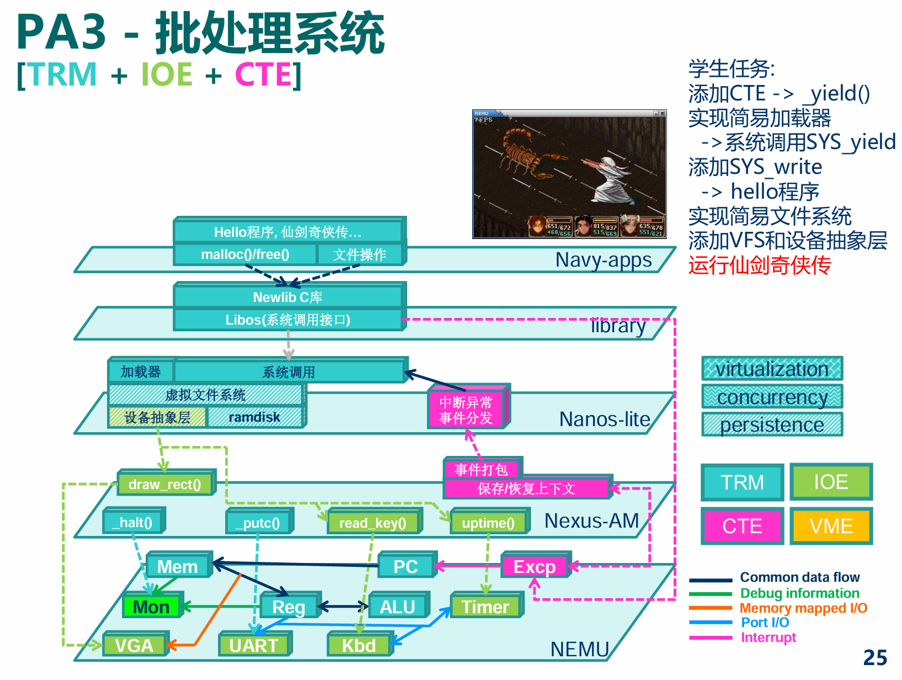
    
    现代的 或者说我们在上面写的 `hello` 程序位于的是 应用层（`navy-apps`），他想要的效果是将 `Hello World`  输出到显示设备中，也就是想要通过应用层的代码控制硬件。
    
    如果我们是直接操作硬件，那直接AM层就够了，也就是我们在实现的 IOE 的各种 API，这里如果你还在 os 之上的 navy-apps 跑了实现 IOE API ，想必你会有一些体会了。
    
    但是现在的软件复杂度上去了，我们要编写的是一个现代完整的计算机系统，我们需要 os、硬件保护机制、文件系统了。就不能再像之前一样那么简单的理解了。
    
    > 这里再插一句：
    >
    > 实际上如果我们是编写 MCU 相关的代码，主要的活动层在于裸机，也就是硬件或者再加个 `am (HAL)`，这个时候我们的应用层就是裸机硬件（NEMU）这一层了，也就不存在什么抽象的东西了。
    >
    > 实际上在过去的几十年里，从事嵌入式领域的相关人员大多都是电子专业出身，既然要干硬件又要干软件，肯定是学不深的，基本没有进行过软件层面相关深入的学习，如基本不会考虑像互联网领域谈论的比较多的设计模式、软件架构等等的内容。
    >
    > 其实也情有可原，那个时候基本都是用 MCU 的 controller 功能，简单的代码就能完成很多的任务了，但是如今时代早就变了，中小型公司（大公司不评价），希望你啥都能干，要求你干一些比较中大型大型的项目了（比如说一些车辆仪表要求酷炫、智能家电用户体验、手机、ARM + MCP 等等，代码量基本都是上万行起步，跟重要的是需要你有阅读大型源码的能力），而且，一些嵌入式设备已经变得很复杂了，软件硬件的复杂性上升挺多，如果还是没有相关软件的基础学习，你未来十几年的学习会很吃力。
    >
    > 这里之前看到过一个韦东山老师的视频，感觉挺不错的：[时代变了，嵌入式工程师的核心能力](https://www.bilibili.com/video/BV15N4y1Y7PW/?spm_id_from=333.337.search-card.all.click&vd_source=ecc99d78ae961113010161a48a475a35)
    
    所以我们一步步往下。
    
    `hello` 主要核心功能就是 `printf(const char *, ...)`，这是一个 `library` 提供的相关功能，主要是连接可的是 应用层 和操作系统系层，其中主要相关的是操作系统层提供的系统调用功能。
    
    对于printf的内部调用流程，前面已经有了一些总结，我们直接跳跃到系统调用 `write` 那一部分。
    
    ````assembly
    0x83000118:              call [printf@0x83000188]  // 注意这里是 应用程序的
    0x830001cc:                call [_vfprintf_r@0x83000244]
    0x83000310:                  call [__sfputs_r@0x83000c3c]
    0x83000c88:                    call [_fputc_r@0x830017f0]
    0x83003464:                    ret [_fputc_r]
    ... 重复_fputc_r
    0x83000c88:                    call [_fputc_r@0x830017f0]
    0x83003464:                    ret [_fputc_r]
    0x83000cd4:                    ret [<__sfputs_r>]
    0x83000380:                  call [<_vfprintf_r+0x994>@0x830005fc]
    0x83000960:                    call [<__sfputs_r>@0x83000c3c]
    0x83000c88:                      call [_fputc_r@0x830017f0]
    0x83003464:                      ret [_fputc_r]
    0x83000c88:                      call [_fputc_r@0x830017f0]
    0x83003464:                      ret [_fputc_r]
    0x83000cd4:                    ret [<__sfputs_r>]
    0x83000310:                    call [<_vfprintf_r+0x994>@0x83000c3c]
    0x83000c88:                      call [_fputc_r@0x830017f0]
    0x83003464:                      ret [_fputc_r]
    ... 重复_fputc_r
    0x83000c88:                      call [<_fputc_r>@0x830017f0] 
    0x83003464:                      ret [<_fputc_r>			 
    0x83000c88:                      call [<_fputc_r>@0x830017f0]
    0x83004364:                        call [<_fflush_r>@0x830045d0]
    0x83004500:                          call [<__swrite>@0x830035bc]
    0x83000208:                            call [<_write>@0x83004a44]
    0x800008dc:                              call [__am_irq_handle@0x80000740]
    0x800007b0:                                call [do_event@0x80000210]
    0x80000238:                                  call [do_syscall@0x80000014]
    0x80000104:                                    call [putch@0x80000494]
    0x8000049c:                                    ret [putch]
    ... 重复putch 很多
    0x80000104:                                    call [putch@0x80000494]
    0x8000049c:                                    ret [putch]
    0x80000104:                                    call [putch@0x80000494]
    0x8000049c:                                    ret [putch]
    0x800000c8:                                  ret [do_syscall]
    0x8000024c:                                ret [do_event]
    0x800007c0:                              ret [__am_irq_handle]
    0x83004a4c:                            ret [_write]
    0x83000220:                          ret __swrite
    0x830044b0:                        ret [_fflush_r]
    0x830042e8:                      ret [_fputc_r]
    0x83000cd4:                    ret [_vfprintf_r]
    0x8300049c:                  ret [_vfprintf_r+0x994]
    0x83000380:                ret [_vfprintf_r]
    0x830001d8:              ret [printf]  // 应用程序的
    ````
    
    实际上这里又要回来谈谈系统调用概念的问题了，这里还是和操作系统和硬件保护机制有关系，（回去翻看前面系统调用和异常处理的内容）
    
    用户程序想要输出的时候，也就是想要使用一些系统硬件级别的资源（显示器）的时候，需要通过系统调用这一机制来实现。
    
    也就是说，这里的特权级低的用户程序代码需要进入到特权级高的操作系统了，硬件处理器也要进入到更高级级别的模式了。
    
    具体过程：
    
    1. 用户程序想要使用硬件资源，被os看作是一种异常，具体来说就是系统调用。RISC-V 具体通过 `ecall` 指令来处理异常
    
    2. 调用 `_syscall_` （`libos`：系统调用接口：应用层和操作系统系统） 触发 `syscall` ，使用 `ecall`  进行异常响应。
    
        ```C
        _syscall_((intptr_t)SYS_write, (intptr_t)fd, (intptr_t)buf, (intptr_t)count);   -->
        asm volatile ("ecall" : "=r" (ret) : "r"(_gpr1), "r"(_gpr2), "r"(_gpr3), "r"(_gpr4));
        ```
    
        这里的调用指令，是硬件（NEMU）执行的喔，执行完后，程序和处理器的级别都切换。
    
        之后再去往哪一层呢？
    
    3. 异常处理机制：事件分发和执行
    
        1. 进入异常处理地址入口，将上下文保存在栈上： `csr`、`gpr`，
    
        2. 将 `csr` 和 `gpr` 作为上下文传给 `__am_irq_handle` ，
    
        3. `__am_irq_handle` 通过判断程序上下文（`mcause`）的异常号，判断出哪一事件（EVENT_YIELD），也就是哪一种异常：
    
            1. 异步异常：中断
            2. 同步异常：指令和数据异常：内存访问不对齐、缺页异常...
    
            ```C
            switch (c->mcause) {
                case 0xb:
                    if (c->GPR1 == -1) { // YIELD
                        ev.event = EVENT_YIELD; c->mepc += 4;
                    } else if (c->GPR1 >= 0 && c->GPR1 <= 19){ // system call (include sys_yield)
                        ev.event = EVENT_SYSCALL; c->mepc += 4;   
                    } else {
                        rintf("unknown type ");
                    }
                    break;
                default: ev.event = EVENT_ERROR; break;
                    
            // AM (HAL)
            ```
    
            进行事件判断完后，之后交给 `user_handler` 。
    
            这里，操作系统层做的就是进一步的事件分发和实际的异常处理，也就是 `do_event` （未来肯定还会添加中断的内容。
    
            ```C
            static Context* do_event(Event e, Context* c) {
              switch (e.event) {
                case EVENT_YIELD: printf("event: yield.\n"); break;
                case EVENT_SYSCALL: do_syscall(c); break;
                default: panic("Unhandled event ID = %d", e.event);
              }
              return c;
            }
            // nanos-lite
            ```
    
            系统调用实际处理： `do_syscall()`
    
            ```C
             void do_syscall(Context *c) {
                 ...
               switch (a[0]) {
                 case SYS_exit: strace(); sys_exit(a[0]); break;
                 case SYS_yield: c->GPRx = sys_yield(); break;
                 case SYS_open: c->GPRx = fs_open((const char *)a[1], a[2], a[3]); break;
                 case SYS_read: c->GPRx = fs_read(a[1], (void *)a[2],a[3]); break;
                 case SYS_write: c->GPRx = fs_write(a[1], (const void *)a[2], a[3]); break;
                 case SYS_close: c->GPRx = fs_close(a[1]); break;
                 case SYS_lseek: c->GPRx = fs_lseek(a[1], a[2], a[3]); break;
                 case SYS_brk: c->GPRx = 0; break;
                 case SYS_gettimeofday: c->GPRx = sys_gettimeofday((struct timeval *)a[1], (struct timezone *)a[2]); break;
                 case SYS_execve: sys_execve(c); break;   
                 default: panic("Unhandled syscall ID = %d", a[0]);
               }
                 ...
             }
            // nanos-lite
            ```
    
            进行 `fs_write`
    
    4. 一切皆文件 --> VFS
    
        > 开始的时候，我们将程序以文件的形式存放在 `ramdisk` 之中，个人把它称为程序文件。（ramdisk 的读写）
        >
        > ```C
        > 0
        > +-------------+---------+----------+-----------+--
        > |    file0    |  file1  |  ......  |   filen   |
        > +-------------+---------+----------+-----------+--
        >  \           / \       /            \         /
        >   +  size0  +   +size1+              + sizen +
        > ```
        >
        > 但是对于用户程序来说，它们也要处理数据和修改程序文件，但是用户程序不知道程序文件位于 `ramdisk` 的哪一个位置，更何况程序文件会动态地增删，用户程序并不知情。因此操作系统还需要在存储介质的驱动程序之上，为用户程序提供一种更高级的抽象，那就是文件。（这里的文件和前面程序文件有一点差异，但是从这之后区分的意义也不大了）
        >
        > 记住文件的本质：字节序列。
    
        我们系统调用的实际处理函数目的也就是要操作各种硬件资源。由于一切皆文件的思想，我们能够以文件的相关操作，来控制普通文件和各种设备的特殊文件（socket、磁盘、按键的编码、显示器上的一个像素的内容...）。但是由于特殊文件过多过于混乱，加了一层 VFS 进行管理。
    
        即：
    
        ````c
        -------------------------
        |         VFS           |
        -------------------------
        |设备抽象层  +  ramdisk   |
        -------------------------
        ````
    
        VFS 的核心在于 下面的两个函数指针，
    
        **我们能通过 `f->read()` 和 `f->write()` 的方式来调用不同文件的具体读写函数了.**
    
        ```C
        typedef struct {
          ...
          ReadFn read;        // 读函数指针
          WriteFn write;      // 写函数指针
          ...
        } Finfo;
        //nanos-lite
        ```
    
        ```C
        [FD_STDIN]    = {"stdin", 0, 0, invalid_read, invalid_write, 0}, // 0
        [FD_STDOUT]   = {"stdout", 0, 0, invalid_read, serial_write, 0},
        [FD_STDERR]   = {"stderr", 0, 0, invalid_read, serial_write, 0},
        [FD_EVENT]    = {"/dev/events", 0, 0, events_read, invalid_write, 0},
        [FD_DISPINFO] = {"/proc/dispinfo",0 ,0, dispinfo_read, invalid_write, 0},
        [FD_FB]       = {"/dev/fb", 0, 0, invalid_read, fb_write, 0},
        
        size_t fs_write(int fd, const void *buf, size_t len) {
            assert(fd >= 0 && fd < NR_FILE);
            if (file_table[fd].write)
                return file_table[fd].write(buf, file_table[fd].open_offset, len);
        
            size_t open_offset = file_table[fd].open_offset;
            size_t size = file_table[fd].size;
            size_t real_len = len;
            if (open_offset + len > size)
                real_len = size - open_offset;
        
            size_t ret = ramdisk_write(buf, file_table[fd].disk_offset + open_offset, real_len);
            file_table[fd].open_offset += real_len;
            return ret;
        }
        
        //nanos-lite
        ```
    
        从 os 这一层我们发现，想要操控这一个硬件设备还真是麻烦呢。
    
        不过我们继续向下探索。
    
    5. 文件操作的之下的硬件操作
    
        要将字符输出到屏幕的文件操作函数如下：
    
        ```C
        size_t serial_write(const void *buf, size_t offset, size_t len) {
            for (int i = 0; i < len; i++) { 
                putch(*((const char *)buf+ i));
            }
            return len;
        }
        //nanos-lite
        ```
    
        这也就是连接 `am`（HAL） 层的函数了
    
        这一层我们使用 `am` 提供给 `os` 的接口来进一步操作硬件。
    
        ```C
        // ----------------------- TRM: Turing Machine -----------------------
        extern   Area        heap;
        void     putch       (char ch);
        void     halt        (int code) __attribute__((__noreturn__));
        
        // -------------------- IOE: Input/Output Devices --------------------
        bool     ioe_init    (void);
        void     ioe_read    (int reg, void *buf);
        void     ioe_write   (int reg, void *buf);
        #include "amdev.h"
        
        // ---------- CTE: Interrupt Handling and Context Switching ----------
        bool     cte_init    (Context *(*handler)(Event ev, Context *ctx));
        void     yield       (void);
        bool     ienabled    (void);
        void     iset        (bool enable);
        Context *kcontext    (Area kstack, void (*entry)(void *), void *arg);
        
        // ----------------------- VME: Virtual Memory -----------------------
        bool     vme_init    (void *(*pgalloc)(int), void (*pgfree)(void *));
        void     protect     (AddrSpace *as);
        void     unprotect   (AddrSpace *as);
        void     map         (AddrSpace *as, void *vaddr, void *paddr, int prot);
        Context *ucontext    (AddrSpace *as, Area kstack, void *entry);
        
        // ---------------------- MPE: Multi-Processing ----------------------
        bool     mpe_init    (void (*entry)());
        int      cpu_count   (void);
        int      cpu_current (void);
        int      atomic_xchg (int *addr, int newval);
        
        //am向上
        ```
    
    6. 具体到硬件
    
        对于 nemu 硬件来说：
    
        ```C
        void putch(char ch) {
          outb(SERIAL_PORT, ch);
        }
        // 硬件-AM
        ```
    
        或许上面的内容和实际的串口不太一样，我们再看看native的，就大概能知道实际中的串口收发，打印流程是什么样了。
    
        ```C
        void __am_uart_init() {
          int ret = fcntl(STDIN_FILENO, F_GETFL);
          assert(ret != -1);
          int flag = ret | O_NONBLOCK;
          ret = fcntl(STDIN_FILENO, F_SETFL, flag);
          assert(ret != -1);
        }
        
        void __am_uart_config(AM_UART_CONFIG_T *cfg) {
          cfg->present = true;
        }
        
        void __am_uart_tx(AM_UART_TX_T *uart) {
          putchar(uart->data);
        }
        
        void __am_uart_rx(AM_UART_RX_T *uart) {
          int ret = fgetc(stdin);
          if (ret == EOF) ret = -1;
          uart->data = ret;
        }
        
        void putch(char ch) {
          putchar(ch);
        }
        // 硬件--am: native
        
        ```
    
    至此大约的 `hello` 的流程也就清楚了。
    
    但是怎么我们怎么通过键盘的输入给计算机呢？最终又是怎么输出到终端上呢？计算机内部流程也是和上面串口类似，
    
    实际上，屏幕上显示内容/读取键盘各个码值的本质，也就是往某个正确内存地址读/写一些正确的内容，然后屏幕内部/键盘内部的电子器件进行一系列的工作，计算机输出相关内容/输入给计算机相关内容，然后根据国际的 ASIC 码表，会输出/读取一个我们能看到字符到屏幕上。
    
    但是，这样子好像还没有get到批处理系统的精髓：程序执行完一个程序后，自动执行下一个。
    
    也就是说在计算机执行完这个 `hello` 程序后，会执行ramdisk中的下一个程序。（对于这一点我深有体会，当时实现sfs时候，因为 `open_offset` 的问题，我直接手动调整了 ELF 文件的顺序，没想到确实能正确执行一部分！）
    
    等等？那是哪个程序来执行最开始的那个 `hello` 的呢？再次回想批处理系统的关键：有一个后台程序，当一个前台程序执行结束的时候，后台程序就会自动加载一个新的前台程序来执行。这个后台程序不就是操作系统吗？！
    
    我们搞出来的那个操作系统除了为了管理更加复杂的程序，他最初的目的就是为了实现批处理的呀（会想起最早投入使用的 OS[GM-NAA I/O - Wikipedia](https://en.wikipedia.org/wiki/GM-NAA_I/O) ，它的主要任务就是自动加载新的程序啊）：
    
    - 用户程序执行结束之后, 可以跳转到操作系统的代码继续执行
    - 操作系统可以加载一个新的用户程序来执行
    
    所以我们再回到 `os` 的装载 `hello` 程序之后，
    
    ```C
    void init_proc() {
      switch_boot_pcb();
    
      Log("Initializing processes...");
    
      // load program here
      naive_uload(NULL, "/bin/hello");
      //naive_uload(NULL, "/bin/menu");
    }
    //nanos-lite
    ```
    
    继续程序加载 `naive_uload(NULL, "/bin/menu");` 之后：执行之后的内容！（可能无法执行，但是帮助理解）
    
    我们再切换到 `menu` 的内容，在前面分析的键盘、显示器外设等内容的基础上，我们进一步进入到 `NTerm`，我们转变成通过 与终端交互来控制程序了。也就是，运行在 os 之上的 NTerm 程序，我们能够通过键入 `pal`、`nslider`等内容来接着执行下一个程序了。
    
    这样子，我们再回过头来看看 `hello` 程序的内容，`hello` 运行在 `os` 之上，在 `hello` 可执行文件生成之前，我们的 `NEMU`、`am`、`nanos-lite` 已经编译生成好了一个超级大的后台程序了，可以理解为就是 `os`。在这个 `os` 之上，我们加载 `hello` 程序，是不是就回到上面的内容了？完成之后， 我们的 `os` 自动加载 `menu`、`NTerm` 不就实现了批处理了吗？
    
    至此，截止 PA3的内容，关于 `当你在终端键入./hello运行Hello World程序的时候, 计算机究竟做了些什么?` 这个问题，也算是有了一点回答了。
    
    之后的PA4 做的分时多任务，应该会更加的精彩呢~


## 必答题

- 理解上下文结构体的前世今生 (见PA3.1阶段)

- 理解穿越时空的旅程 (见PA3.1阶段)

- hello程序是什么, 它从而何来, 要到哪里去 (见PA3.2阶段)

- 仙剑奇侠传究竟如何运行 运行仙剑奇侠传时会播放启动动画, 动画里仙鹤在群山中飞过. 

    这一动画是通过`navy-apps/apps/pal/repo/src/main.c`中的`PAL_SplashScreen()`函数播放的. 阅读这一函数, 可以得知仙鹤的像素信息存放在数据文件`mgo.mkf`中. 请回答以下问题: 库函数, libos, Nanos-lite, AM, NEMU是如何相互协助, 来帮助仙剑奇侠传的代码从`mgo.mkf`文件中读出仙鹤的像素信息, 并且更新到屏幕上? 换一种PA的经典问法: 这个过程究竟经历了些什么? (Hint: 合理使用各种trace工具, 可以帮助你更容易地理解仙剑奇侠传的行为)


## 相关面试题

- syscall和glibc有什么区别


    所以要问的是这个！stdio基于write.实现？
    字符设备和块设备？
    
    stdio带缓冲区 格式化
    
    一个底层 一个应用层
    
    还可以再看看关于Linux系统高级编程的内容。
    
    > 找到了第 1 篇资料：[3分钟了解syscall系统调用|详细易懂的流程-CSDN博客](https://blog.csdn.net/weixin_43356770/article/details/135387868)
    >
    > 找到了第 2 篇资料：[掌握Linux syscall函数，深入解析内核机制 | 《Linux …](https://www.linuxprobe.com/zwlhssrjxnhj.html)
    >
    > 找到了第 3 篇资料：[Linux 下系统调用的三种方法 - hazir - 博客园](https://www.cnblogs.com/hazir/p/three_methods_of_syscall.html)
    >
    > 找到了第 4 篇资料：[glibc分析一 系统调用_glibc和系统调用-CSDN博客](https://blog.csdn.net/pyf09/article/details/82468340)
    >
    > 找到了第 5 篇资料：[Linux syscall过程分析（万字长文）-腾讯云开发者社区-腾讯云](https://cloud.tencent.com/developer/article/1492374)
    >
    > 找到了第 6 篇资料：[系统调用 - Linux 内核如何处理系统调用 - 《Linux 内核揭秘 ...](https://www.bookstack.cn/read/linux-insides-zh/SysCall-linux-syscall-2.md)
    >
    > 找到了第 7 篇资料：[Linux系统调用(syscall)原理 - Gityuan博客 | 袁辉辉的技术博客](http://gityuan.com/2016/05/21/syscall/)
    >
    > 找到了第 8 篇资料：[eglibc-syscall | rww's Blog](https://rmheng.github.io/2021/05/21/2021-05-21-eglibc-syscall/)
    >
    > 找到了 8 篇资料作为参考：
    >
    > 关于 `syscall` 和 `glibc` 的区别，我找到了一些资料，以下是一些关键点的总结：
    >
    > 1. **系统调用（syscall）** 是操作系统提供给程序以请求内核服务的一种机制，它是用户空间和内核空间之间的桥梁。系统调用确保资源使用的安全性和有效性，允许应用程序执行文件操作、进程控制、通信等操作1。
    > 2. `syscall` 指令是 Linux 内核中用于触发系统调用的指令，它减少了上下文切换的开销，提供了从用户模式到内核模式的更直接的过渡，性能更高，但可能在旧机器上不如 `int 0x80` 指令兼容1。
    > 3. **glibc**（GNU C Library）是 Linux 系统中使用的开源的标准 C 库，它封装了大量的系统调用接口，并提供了更高层次、更易用的 API。glibc 库使得程序员可以不必直接与底层系统调用打交道，而是通过库提供的函数来实现对系统资源的操作23。
    > 4. glibc 提供的系统调用 API 与内核特定的系统调用之间的关系是，通常每个特定的系统调用都对应至少一个 glibc 封装的库函数。例如，系统提供的打开文件系统调用 `sys_open` 对应的是 glibc 中的 `open` 函数3。
    > 5. 如果内核提供了一个系统调用，而 glibc 没有封装这个调用，程序员可以使用 glibc 提供的 `syscall` 函数直接调用该系统调用。这个 `syscall` 函数允许程序员指定系统调用号和参数，直接与内核交互3。
    > 6. glibc 库的另一个优势是它提供了错误处理机制，当系统调用失败时，会返回一个负数，并将 `errno` 变量设置为相应的错误码，方便程序员进行错误处理2。
    > 7. 在实际开发中，掌握 syscall 函数对于进行 Linux 系统编程是非常重要的，无论是直接使用 syscall 还是通过 glibc 库提供的封装函数2。
    >
    > 通过这些资料，我们可以看出 `syscall` 是操作系统层面上用于实现用户程序和内核交互的机制，而 `glibc` 是在用户空间提供的一个库，用于简化对这些系统调用的使用。两者在 Linux 系统中都扮演着重要的角色，但它们服务于不同的层面和目的。


​    


## 学到的东西

1. 多使用 assert 和 防御性编程，尽快找到报错误的位置

2. 代码优先级的问题（写道fixedpt-test），用括号！

3. const

    > 我是建议尽量使用const，尽量的把不期望修改的对象都加上const，这样如果你不小心修改了这个不期望被修改的对象，编译器一定会告诉你
    > 请不要相信自己，因为你在写代码的过程中，一不小心就修改了某个/某些不期望修改的对象，const是个好东西，尝试修改const对象，编译器一定会告诉你，这就省下了你坐在电脑面前几个小时的debug，很是值得

    这里可能和之前的bug有，有野指针

2. 文件系统面向对象操作，怎么实现 C with class 这就是一个很好的例子


