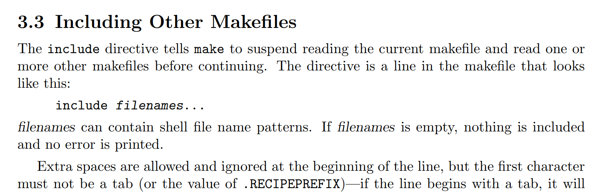
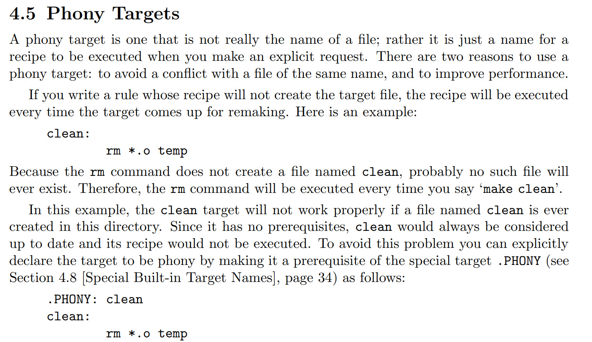
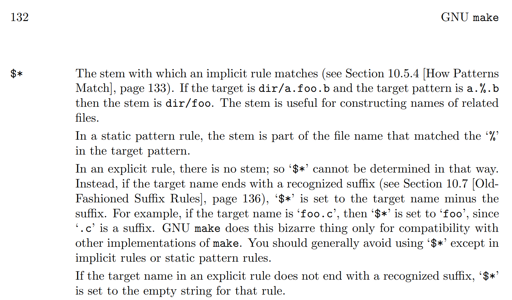
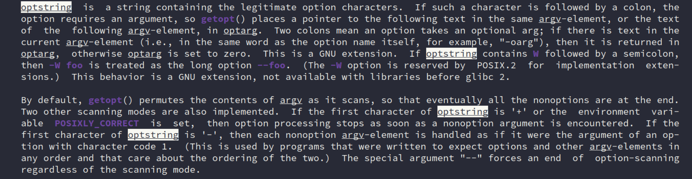

## Goal

- 一定的计算机系统基础

- 编码能力

- 对每个问题有自己的思考和实践

    

- （*）对软硬件协同、嵌入式感兴趣

- （*）对系统软件（os、compiler等）感兴趣

- （*）对处理器设计感兴趣


### 相关问题

1. 如写下一句 `int x = 10;` 能明白计算机背后发生了什么

    

2. 回答

    

3. 从按下键盘到显示器上ppt换到下一页的过程。


【2024 jyy OS 课 总结30】

- 计算机系统线课程的根本问题：字节序列如何真正运行起来？这是如何和逻辑门连接起来的？

    编程语言如何和逻辑门连接起来的？应用和硬件视角之间是什么？

- 如何实现一个调试器？

    NEMU 中 sdb 这个东西，说清楚原理？

    调试器的原理？

- syscall

    为了方便我们编程而造出来的东西？

    


## Learn 1: `NEMU <-> AM <-> os <-> app` 的 `Makefile` 构建

在做 PA 和以前学习计算机的时候，被提及到最多的思想之一就是分层，这也让我在想，理论上是这么说，但是具体是如何构建的呢？

AM 程序是怎么跑在 NEMU 上的？再往上的 OS、APP，简单过流程。

### NEMU 

...

### AM

关键在于：`abstract machine/Makefile` 的这句话：

```makefile
 96 ### Paste in arch-specific configurations (e.g., from `scripts/x86_64-qemu.mk`)
 97 -include $(AM_HOME)/scripts/$(ARCH).mk    
 
 # $(AM_HOME)/Makefile
```

-include 和 C/C++ 的预处理器的 #include 指令类似，虽然原理上不太一样，但都有一种复制粘贴的能力。

> **From `kimi`:**
>
> Makefile 中的 `-include` 指令和 C 预处理器的 `#include` 指令在功能上有一些相似之处，但它们的作用和使用场景是不同的。
>
> 1. **C预处理器的 `#include` 指令**：
>    - `#include` 是 C/C++ 预处理器的指令，用于在编译前将指定的头文件内容包含到源代码文件中。
>    - 它的作用是复制粘贴，即将头文件的内容直接插入到源代码文件中相应的位置。
>    - 预处理器处理 `#include` 指令后，编译器才开始编译处理源代码。
>
> 2. **Makefile 的 `-include` 指令**：
>    - `-include` 是 Makefile 的一个指令，用于告诉 make 工具在构建目标之前先包含（读取）指定的 Makefile 文件。
>    - 它并不是复制粘贴文件内容，而是将指定的 Makefile 文件中的规则和变量等合并到当前 Makefile 中。
>    - `-include` 指令通常用于包含通用的 Makefile 片段，以实现代码的复用和模块化。
>
> 具体来说，`-include` 指令在 Makefile 中的作用如下：
>
> - **合并规则**：将指定 Makefile 中定义的规则和变量合并到当前 Makefile 中。
> - **条件包含**：`-include` 指令会检查文件是否存在，**如果文件不存在，make 工具会忽略该指令并继续执行后续的指令**。
> - **多次包含**：如果同一个文件被多次包含，make 工具会忽略后续的包含，以避免重复包含。
>
> 示例：
> ```makefile
> -include config.mk
> -include common.mk
> ```
>
> 在这个示例中，make 工具会首先尝试包含 `config.mk` 文件，然后是 `common.mk` 文件。如果这些文件存在，它们的内容会被合并到当前 Makefile 中。
>
> 总结来说，虽然 `-include` 和 `#include` 在名称上相似，但它们的作用和使用场景是不同的。`#include` 是 C/C++ 预处理器的指令，用于在编译前包含头文件；而 `-include` 是 Makefile 的指令，用于在构建过程中包含其他 Makefile 文件。
>
> 更多介绍参考 GNU make 手册:
>
> 

之后便是：

```makefile
  1 include $(AM_HOME)/scripts/isa/riscv.mk                                                                                     
  2 include $(AM_HOME)/scripts/platform/nemu.mk
  3 CFLAGS  += -DISA_H=\"riscv/riscv.h\"
  4 COMMON_CFLAGS += -march=rv32im_zicsr -mabi=ilp32   # overwrite
  5 LDFLAGS       += -melf32lriscv                     # overwrite
  6 
  7 AM_SRCS += riscv/nemu/start.S \
  8            riscv/nemu/cte.c \
  9            riscv/nemu/trap.S \
 10            riscv/nemu/vme.c
 
 // abstract-machine/scripts/riscv32-nemu.mk
```

对于架构相关的配置和平台相关的配置，这里关注整个流程的话就看 `abstract-machine/scripts/platform/nemu.mk`

```makefile
AM_SRCS := platform/nemu/trm.c \
           platform/nemu/ioe/ioe.c \
           platform/nemu/ioe/timer.c \
           platform/nemu/ioe/input.c \
           platform/nemu/ioe/gpu.c \
           platform/nemu/ioe/audio.c \
           platform/nemu/ioe/disk.c \
           platform/nemu/mpe.c

CFLAGS    += -fdata-sections -ffunction-sections
LDFLAGS   += -T $(AM_HOME)/scripts/linker.ld \
             --defsym=_pmem_start=0x80000000 --defsym=_entry_offset=0x0
LDFLAGS   += --gc-sections -e _start
NEMUFLAGS += -l $(shell dirname $(IMAGE).elf)/nemu-log.txt
NEMUFLAGS += -b
NEMUFLAGS += -e $(IMAGE).elf

CFLAGS += -DMAINARGS=\"$(mainargs)\"
CFLAGS += -I$(AM_HOME)/am/src/platform/nemu/include
.PHONY: $(AM_HOME)/am/src/platform/nemu/trm.c

image: $(IMAGE).elf
	@$(OBJDUMP) -d $(IMAGE).elf > $(IMAGE).txt
	@echo + OBJCOPY "->" $(IMAGE_REL).bin
	@$(OBJCOPY) -S --set-section-flags .bss=alloc,contents -O binary $(IMAGE).elf $(IMAGE).bin

run: image
	$(MAKE) -C $(NEMU_HOME) ISA=$(ISA) run ARGS="$(NEMUFLAGS)" IMG=$(IMAGE).bin

gdb: image
	$(MAKE) -C $(NEMU_HOME) ISA=$(ISA) gdb ARGS="$(NEMUFLAGS)" IMG=$(IMAGE).bin

```

最上面 `AM_SRCS` 的就是要构建的 AM 程序的源文件（一部分）。

下面就是具体 AM 怎么和 NEMU 相互配合构建。配合 GPT 解释，如果较好地完成了 PA，应该都是配合一些文档资料都能比较熟悉下面的内容。

- **CFLAGS**

    - `-fdata-sections` 和 `-ffunction-sections`：
        - 这两个标志告诉编译器将每个函数和数据分别放入不同的段（section）中。这样做的好处是链接器可以通过 `--gc-sections` 标志来删除未引用的段，从而减小最终生成的二进制文件的大小。
    - `-DMAINARGS=\"$(mainargs)\"`：
        - 这个标志定义了一个宏 `MAINARGS`，并将其值设置为 `$(mainargs)` 变量的值。这通常用于传递命令行参数给程序。
    - `-I$(AM_HOME)/am/src/platform/nemu/include`：
        - 这个标志指定了一个头文件搜索路径。编译器会在指定的路径中搜索包含的头文件。

- **LDFLAGS**

    - `-T $(AM_HOME)/scripts/linker.ld`：

        - 这个标志指定了链接脚本的路径。链接脚本（`linker.ld`）定义了程序的内存布局，包括各个段（如代码段、数据段、BSS段等）在内存中的放置位置。

    - `--defsym=_pmem_start=0x80000000` 和 `--defsym=_entry_offset=0x0`：

        - 这两个标志**定义了两个符号**的值。`--defsym` 用于在链接时定义一个符号的值。
        - `_pmem_start` 被定义为 `0x80000000`，这通常表示程序的物理内存开始地址。在嵌入式系统中，这可能对应于一个特定的内存区域的起始地址。
        - `_entry_offset` 被定义为 `0x0`，这表示程序的入口点（通常是 `_start` 符号）相对于某个基地址的偏移量。在这里，`_entry_offset` 被设置为 `0x0`，意味着入口点就是基地址本身。

        这里看起来有两个 `--defsym` 标志，但实际上它们定义了两个不同的符号。这并不是错误，而是两个独立的指令，每个指令定义了一个不同的符号。

    - `--gc-sections`：

        - 这个标志告诉链接器在生成最终的二进制文件时，删除未引用的段。这有助于减小二进制文件的大小，特别是在使用 `-fdata-sections` 和 `-ffunction-sections` 时，因为这些标志会生成许多小的段。

    - `-e _start`：

        - 这个标志指定了程序的入口点。`_start` 是一个符号，通常在启动文件（如 `crt0.S` 或类似的文件）中定义，表示程序的起始执行点。

- **NEMUFLAGS**

    - `-l $(shell dirname $(IMAGE).elf)/nemu-log.txt`：

        - 这个标志指定了 NEMU 模拟器的日志文件路径。`$(shell dirname $(IMAGE).elf)` 会展开为 `$(IMAGE).elf` 文件所在的目录路径。

    - `-b`：

        - 这个标志可能是 NEMU 模拟器的一个选项，用于指定二进制模式或其他特定的行为。

    - `-e $(IMAGE).elf`：

        - 这个标志指定了要执行的 ELF 文件的路径。

        **通过这里，也能理解一部分了分层的构建流程了，AM 程序编译好生成 `$(IMAGE).elf` 后，将这个文件传给 NEMU 程序。（回想自己做 ftrace 的时候看看）。**

> 这里的那个伪目标有点不知道怎么理解：
>
> > ```
> > .PHONY: $(AM_HOME)/am/src/platform/nemu/trm.c
> > ```
> >
> > 这个指令告诉 make，`$(AM_HOME)/am/src/platform/nemu/trm.c` 不是一个文件，而是一个伪目标。这通常用于防止 make 错误地认为这个目标是一个文件，并尝试找到它。这在包含多个源文件和目录的 Makefile 中很常见，以确保所有目标都被正确地视为需要构建的目标。
>
> 
>
> 总结，使用伪目标可以确保 `make` 工具按照我的意图执行构建过程，而不是简单地依赖于文件的存在与否。

剩下的就是构建相关的目标了，应该都是挺好理解的。


**另外补充：am、klib 中的内容是怎么构建的？**

```makefile
60 LIBS     := $(sort $(LIBS) am klib) # lazy evaluation ("=") causes infinite recursions

126 
127 ### Rule (recursive make): build a dependent library (am, klib, ...)
128 $(LIBS): %:
129     @$(MAKE) -s -C $(AM_HOME)/$* archive

//abstract-machine/Makefile
```




### OS

之后再到 OS 怎么连接到 am 的，猜测应该也是 `$(IMAGE).elf` ，还是看 `Makefile`

```makefile
HAS_NAVY = 1
RAMDISK_FILE = build/ramdisk.img

NAME = nanos-lite
SRCS = $(shell find -L ./src/ -name "*.c" -o -name "*.cpp" -o -name "*.S")
include $(AM_HOME)/Makefile

ifeq ($(ARCH),native)
ISA = am_native
else
INC_PATH += include $(NAVY_HOME)/libs/libc/include
endif

./src/resources.S: $(RAMDISK_FILE)
	@touch $@

ifeq ($(HAS_NAVY),)
files = $(RAMDISK_FILE) src/files.h src/syscall.h
# create an empty file if it does not exist
$(foreach f,$(files),$(if $(wildcard $f),, $(shell touch $f)))
else

ifeq ($(wildcard $(NAVY_HOME)/libs/libos/src/syscall.h),)
  $(error $$NAVY_HOME must be a Navy-apps repo)
endif

update:
	$(MAKE) -s -C $(NAVY_HOME) ISA=$(ISA) ramdisk
	@ln -sf $(NAVY_HOME)/build/ramdisk.img $(RAMDISK_FILE)
	@ln -sf $(NAVY_HOME)/build/ramdisk.h src/files.h
	@ln -sf $(NAVY_HOME)/libs/libos/src/syscall.h src/syscall.h

.PHONY: update
endif

```

上面的内容不难，我自己需要注意的是获取当前 `./src/` 目录下文件的方式。我已经看到很多种获取要编译的源文件的方式，这里做个简单的总结。

```makefile
SRCS = $(shell find -L ./src/ -name "*.c" -o -name "*.cpp" -o -name "*.S")

AM_SRCS := platform/nemu/trm.c \
           platform/nemu/ioe/ioe.c \
           platform/nemu/ioe/timer.c \
           platform/nemu/ioe/input.c \
           platform/nemu/ioe/gpu.c \
           platform/nemu/ioe/audio.c \
           platform/nemu/ioe/disk.c \
           platform/nemu/mpe.c 

# -------- 变量 --------
SOURCES=$(wildcard $(SRC_DIR)/**/*.c $(SRC_DIR)/*.c)
# 修改OBJECTS变量，将生成的.o文件放到src/lcthw/build目录中
OBJECTS=$(patsubst %.c,%.o,$(SOURCES))

TEST_SRC=$(wildcard $(TEST_DIR)/*_tests.c)
TESTS=$(patsubst %.c,%,$(TEST_SRC))
```

> 方法 1: 使用 `shell` 命令
> ```makefile
> SRCS = $(shell find -L ./src/ -name "*.c" -o -name "*.cpp" -o -name "*.S")
> ```
> - **优点**：
>   - 能够递归地查找所有匹配的文件，包括子目录。
>   - 可以直接通过 `find` 命令的参数来匹配多种类型的文件。
> - **缺点**：
>   - 每次 `make` 运行时都会执行 `find` 命令，这可能会增加构建时间，尤其是在有大量文件或深层目录结构时。
>   - `find` 命令可能会受到当前 shell 环境的影响，比如路径别名等。
>

>  方法 2: 使用 `wildcard` 函数 或者结合 `wildcard` 和 `patsubst`
> ```makefile
> SOURCES=$(wildcard $(SRC_DIR)/**/*.c $(SRC_DIR)/*.c)
> ```
> ```makefile
> SOURCES=$(wildcard $(SRC_DIR)/**/*.c $(SRC_DIR)/*.c)
> OBJECTS=$(patsubst %.c,%.o,$(SOURCES))
> ```
>
> - **优点**：
>
>   - `wildcard` 函数可以匹配当前目录和子目录中的文件。
>   - `patsubst` 函数可以方便地将源文件名转换为目标文件名。
>   - 语法简单，易于理解和使用。
>
> - **缺点**：
>
>   - 不能直接递归地匹配所有子目录，需要手动为每个子目录添加模式匹配。
>
>   - **对于深层目录结构，需要为每个目录单独添加模式匹配，这可能会变得繁琐。**
>
>       > **有一次移植 `FreeRTOS` 的时候就遇到这部分的问题，编译的时候一直对于 `FreeRTOS` 内部的东西符号未定义。**
>

>  方法 3: 手动添加
>
> ```makefile
> AM_SRCS := platform/nemu/trm.c \
>            platform/nemu/ioe/ioe.c \
>            platform/nemu/ioe/timer.c \
>            platform/nemu/ioe/input.c \
>            platform/nemu/ioe/gpu.c \
>            platform/nemu/ioe/audio.c \
>            platform/nemu/ioe/disk.c \
>            platform/nemu/mpe.c 
> ```
>
> 这种就适用文件不多的时候吧。

> 哪种方法比较好？
> 选择哪种方法取决于具体的项目需求和个人偏好。以下是一些考虑因素：
>
> - **性能**：如果项目文件数量非常多，或者目录结构非常深，使用 `shell` 命令可能会更高效，因为它可以递归地查找所有文件，而不需要为每个子目录单独添加模式匹配。
> - **可读性**：`wildcard` 和 `patsubst` 的组合通常更易于理解和维护，特别是对于 Makefile 的新手来说。
> - **灵活性**：`shell` 命令提供了更多的灵活性，可以通过调整 `find` 命令的参数来匹配不同的文件模式或执行更复杂的文件查找逻辑。
> - **环境依赖**：`shell` 命令可能会受到当前 shell 环境的影响，而 `wildcard` 和 `patsubst` 函数则更加稳定和可靠。
>
> 如果项目文件数量不多，目录结构也不复杂，使用 `wildcard` 和 `patsubst` 的组合可能是一个简单且易于维护的选择。
>
> 如果要处理大量的文件或深层的目录结构，使用 `shell` 命令可能会更合适，因为它可以递归地查找所有文件，减少手动添加模式匹配的工作量。

另外，这里使用但是 `include $(AM_HOME)/Makefile `：

> 在 Makefile 中，`include` 指令用于包含另一个 Makefile 文件，将其内容合并到当前 Makefile 中。`include` 指令的行为取决于它前面是否有 `-`。
>

> 无 `-` 的 `include`：
> ```makefile
> include $(AM_HOME)/Makefile
> ```
> - 当使用没有 `-` 的 `include` 指令时，如果指定的文件不存在，**`make` 将会报错并停止执行。**这意味着，`include` 指令是强制性的，必须包含指定的文件。
>

> 有 `-` 的 `include`：
> ```makefile
> -include $(AM_HOME)/Makefile
> ```
> - 当使用有 `-` 的 `include` 指令时，如果指定的文件不存在，`make` 会忽略这个指令，继续执行后续的指令，不会报错。`-` 使得 `include` 指令变得“可选”，即使文件不存在，也不会影响 make 的执行。
>
> 在你提供的代码 `include $(AM_HOME)/Makefile` 中，没有使用 `-`，这通常意味着这个包含是必须的。如果 `$(AM_HOME)/Makefile` 文件不存在，`make` 将会报错并停止构建过程。这通常用于确保一些关键的构建规则或变量定义被包含进来。
>
> 选择是否使用 `-` 取决于你的构建逻辑和需求：
> - 如果你希望确保某些 Makefile 片段被包含，无论它们是否存在，可以使用 `-include`。
> - 如果你希望确保必须包含某些 Makefile 片段，否则构建失败，那么使用 `include`。
>
> 在你的上下文中，没有使用 `-` 可能是因为 `$(AM_HOME)/Makefile` 是构建过程中的关键文件，需要确保其存在。


再回到整个构建流程，获取了 SRCS 变量后，确实又是要用到：`include $(AM_HOME)/Makefile`

```makefile
### Collect the files to be linked: object files (`.o`) and libraries (`.a`)
OBJS      = $(addprefix $(DST_DIR)/, $(addsuffix .o, $(basename $(SRCS))))
LIBS     := $(sort $(LIBS) am klib) # lazy evaluation ("=") causes infinite recursions
LINKAGE   = $(OBJS) \
  $(addsuffix -$(ARCH).a, $(join \
    $(addsuffix /build/, $(addprefix $(AM_HOME)/, $(LIBS))), \
    $(LIBS) ))
```

```makefile
  1 NAME     := am                                                                                                              
  2 SRCS      = $(addprefix src/, $(AM_SRCS))
  3 INC_PATH += $(AM_HOME)/am/src
  4 
  5 include $(AM_HOME)/Makefile

// 以这个的SRCS abstract-machine/am/Makefile 为例
```

再配合前面的 `nemu.mk` 中的 `AM_SRCS`

```
 1 include $(AM_HOME)/scripts/isa/riscv.mk
  2 include $(AM_HOME)/scripts/platform/nemu.mk
  3 CFLAGS  += -DISA_H=\"riscv/riscv.h\"
  4 COMMON_CFLAGS += -march=rv32im_zicsr -mabi=ilp32   # overwrite
  5 LDFLAGS       += -melf32lriscv                     # overwrite
  6 
  7 AM_SRCS += riscv/nemu/start.S \
  8            riscv/nemu/cte.c \
  9            riscv/nemu/trap.S \
 10            riscv/nemu/vme.c   

// abstract-machine/scripts/platform/nemu.mk
```


### Basic Summary

#### OS

到这里，可以直接 `make -nB` 看看前面的 NEMU AM OS 的 make 过程：

```bash
# Building nanos-lite-run [riscv32-nemu]
touch src/resources.S
riscv64-linux-gnu-gcc -MMD -I./include -IAM/am/include/ -IAM/klib/include/ -Iinclude -I/home/jai/ysyx-workbench/navy-apps/libs/libc/include -fno-pic -march=rv64g -mcmodel=medany -mstrict-align -march=rv32im_zicsr -mabi=ilp32    -O0 -c -o ./build/riscv32-nemu/./src/resources.o ./src/resources.S
riscv64-linux-gnu-gcc -I./include -IAM/am/include/ -IAM/klib/include/ -Iinclude -I/home/jai/ysyx-workbench/navy-apps/libs/libc/include -c -o ./build/riscv32-nemu/./src/device.o ./src/device.c
riscv64-linux-gnu-gcc -I./include -IAM/am/include/ -IAM/klib/include/ -Iinclude -I/home/jai/ysyx-workbench/navy-apps/libs/libc/include -c -o ./build/riscv32-nemu/./src/syscall.o ./src/syscall.c
riscv64-linux-gnu-gcc -I./include -IAM/am/include/ -IAM/klib/include/ -Iinclude -I/home/jai/ysyx-workbench/navy-apps/libs/libc/include -c -o ./build/riscv32-nemu/./src/proc.o ./src/proc.c
riscv64-linux-gnu-gcc -I./include -IAM/am/include/ -IAM/klib/include/ -Iinclude -I/home/jai/ysyx-workbench/navy-apps/libs/libc/include -c -o ./build/riscv32-nemu/./src/mm.o ./src/mm.c
riscv64-linux-gnu-gcc -I./include -IAM/am/include/ -IAM/klib/include/ -Iinclude -I/home/jai/ysyx-workbench/navy-apps/libs/libc/include -c -o ./build/riscv32-nemu/./src/main.o ./src/main.c
riscv64-linux-gnu-gcc -I./include -IAM/am/include/ -IAM/klib/include/ -Iinclude -I/home/jai/ysyx-workbench/navy-apps/libs/libc/include -c -o ./build/riscv32-nemu/./src/irq.o ./src/irq.c
riscv64-linux-gnu-gcc -I./include -IAM/am/include/ -IAM/klib/include/ -Iinclude -I/home/jai/ysyx-workbench/navy-apps/libs/libc/include -c -o ./build/riscv32-nemu/./src/fs.o ./src/fs.c
riscv64-linux-gnu-gcc -I./include -IAM/am/include/ -IAM/klib/include/ -Iinclude -I/home/jai/ysyx-workbench/navy-apps/libs/libc/include -c -o ./build/riscv32-nemu/./src/loader.o ./src/loader.c
riscv64-linux-gnu-gcc -I./include -IAM/am/include/ -IAM/klib/include/ -Iinclude -I/home/jai/ysyx-workbench/navy-apps/libs/libc/include -c -o ./build/riscv32-nemu/./src/ramdisk.o ./src/ramdisk.c
```

这部分获取的是 OS 的代码进行编译，自己再配合 Makefile 基本就能懂。

#### AM（am + kilb） 

```bash
make -s -C /home/jai/ysyx-workbench/abstract-machine/am archive

# Building am-archive [riscv32-nemu]
riscv64-linux-gnu-gcc  -c -o AM/am/build/riscv32-nemu/src/platform/nemu/trm.o AM/am/src/platform/nemu/trm.c
riscv64-linux-gnu-gcc  -c -o AM/am/build/riscv32-nemu/src/platform/nemu/ioe/ioe.o AM/am/src/platform/nemu/ioe/ioe.c
riscv64-linux-gnu-gcc  -c -o AM/am/build/riscv32-nemu/src/platform/nemu/ioe/timer.o AM/am/src/platform/nemu/ioe/timer.c
riscv64-linux-gnu-gcc  -c -o AM/am/build/riscv32-nemu/src/platform/nemu/ioe/input.o AM/am/src/platform/nemu/ioe/input.c
riscv64-linux-gnu-gcc  -c -o AM/am/build/riscv32-nemu/src/platform/nemu/ioe/gpu.o AM/am/src/platform/nemu/ioe/gpu.c
riscv64-linux-gnu-gcc  -c -o AM/am/build/riscv32-nemu/src/platform/nemu/ioe/audio.o AM/am/src/platform/nemu/ioe/audio.c
riscv64-linux-gnu-gcc  -c -o AM/am/build/riscv32-nemu/src/platform/nemu/ioe/disk.o AM/am/src/platform/nemu/ioe/disk.c
riscv64-linux-gnu-gcc  -c -o AM/am/build/riscv32-nemu/src/platform/nemu/mpe.o AM/am/src/platform/nemu/mpe.c
riscv64-linux-gnu-gcc -c -o AM/am/build/riscv32-nemu/src/riscv/nemu/start.o AM/am/src/riscv/nemu/start.S
riscv64-linux-gnu-gcc -c -o AM/am/build/riscv32-nemu/src/riscv/nemu/cte.o AM/am/src/riscv/nemu/cte.c
riscv64-linux-gnu-gcc -O0 -c -o AM/am/build/riscv32-nemu/src/riscv/nemu/trap.o AM/am/src/riscv/nemu/trap.S
riscv64-linux-gnu-gcc -c -o AM/am/build/riscv32-nemu/src/riscv/nemu/vme.o AM/am/src/riscv/nemu/vme.c

riscv64-linux-gnu-ar rcs AM/am/build/am-riscv32-nemu.a \
	AM/am/build/riscv32-nemu/src/platform/nemu/trm.o \
	AM/am/build/riscv32-nemu/src/platform/nemu/ioe/ioe.o \
	AM/am/build/riscv32-nemu/src/platform/nemu/ioe/timer.o \
	AM/am/build/riscv32-nemu/src/platform/nemu/ioe/input.o \
	AM/am/build/riscv32-nemu/src/platform/nemu/ioe/gpu.o \
	AM/am/build/riscv32-nemu/src/platform/nemu/ioe/audio.o \
	AM/am/build/riscv32-nemu/src/platform/nemu/ioe/disk.o \
	AM/am/build/riscv32-nemu/src/platform/nemu/mpe.o \
	AM/am/build/riscv32-nemu/src/riscv/nemu/start.o \
	AM/am/build/riscv32-nemu/src/riscv/nemu/cte.o \
	AM/am/build/riscv32-nemu/src/riscv/nemu/trap.o \
	AM/am/build/riscv32-nemu/src/riscv/nemu/vme.o

```

```bash
# Building klib-archive [riscv32-nemu]
riscv64-linux-gnu-gcc -c -o AM/klib/build/riscv32-nemu/src/int64.o AM/klib/src/int64.c
riscv64-linux-gnu-gcc -c -o AM/klib/build/riscv32-nemu/src/stdlib.o AM/klib/src/stdlib.c
riscv64-linux-gnu-gcc -c -o AM/klib/build/riscv32-nemu/src/cpp.o AM/klib/src/cpp.c
riscv64-linux-gnu-gcc -c -o AM/klib/build/riscv32-nemu/src/string.o AM/klib/src/string.c
riscv64-linux-gnu-gcc -c -o AM/klib/build/riscv32-nemu/src/stdio.o AM/klib/src/stdio.c
riscv64-linux-gnu-ar rcs AM/klib/build/klib-riscv32-nemu.a \
	AM/klib/build/riscv32-nemu/src/int64.o \
	AM/klib/build/riscv32-nemu/src/stdlib.o \
	AM/klib/build/riscv32-nemu/src/cpp.o \
	AM/klib/build/riscv32-nemu/src/string.o \
	AM/klib/build/riscv32-nemu/src/stdio.o
	
riscv64-linux-gnu-ld -z noexecstack -melf64lriscv \
	-T AM/scripts/linker.ld --defsym=_pmem_start=0x80000000 \
	--defsym=_entry_offset=0x0 --gc-sections -e _start -melf32lriscv \
    -o ./build/nanos-lite-riscv32-nemu.elf \
    --start-group resources.o device.o syscall.o proc.o mm.o main.o irq.o \
    fs.o loader.o ramdisk.o am-riscv32-nemu.a klib-riscv32-nemu.a --end-group


```

**gcc 将这部分编译成目标文件后，使用 ar 将程序依赖库编译打包成归档文件。**

**再通过链接脚本对整个可执行文件进行布局，生成可执行文件。**


```bash
echo \# Creating image [riscv32-nemu]
riscv64-linux-gnu-objdump -d 
	nanos-lite-riscv32-nemu.elf > \
	nanos-lite-riscv32-nemu.txt
echo + OBJCOPY "->" build/nanos-lite-riscv32-nemu.bin
riscv64-linux-gnu-objcopy -S 
	--set-section-flags .bss=alloc,contents \
    -O binary nanos-lite-riscv32-nemu.elf nanos-lite-riscv32-nemu.bin
```

> `.elf` 文件（Executable and Linkable Format）是一种标准文件格式，用于存储编译后的目标代码、可执行代码或可重定位代码。它包含了程序的文本（代码）、数据、符号表、重定位信息等，是链接器用于生成最终可执行文件的中间产物。
>
> 而 `.bin` 文件（Binary File）是一种二进制文件，它直接包含了可以在硬件上运行的机器代码。`.bin` 文件通常不包含任何额外的元数据或重定位信息，它是一个纯净的、可直接被硬件执行的文件。
>
> 在嵌入式系统或裸机编程中，通常需要将 `.elf` 文件转换为 `.bin` 文件，原因包括：
>
> 1. **简化文件内容**：`.elf` 文件包含了许多对嵌入式系统不必要的信息，如调试信息、符号表等。`.bin` 文件只包含实际的机器代码和数据，没有这些额外信息，因此文件更小，适合存储和传输。
>
> 2. **直接执行**：在某些情况下，嵌入式系统的启动加载器（bootloader）可能只能理解和执行 `.bin` 文件。`.bin` 文件的格式更简单，更容易被硬件直接加载和执行。
>
> 3. **内存布局**：`.elf` 文件中的数据和代码可能需要在内存中重新布局以适应特定的硬件架构。使用 `objcopy` 工具可以调整内存布局，确保代码和数据被放置在正确的内存地址。
>
> 4. **去除不必要的段**：`.elf` 文件可能包含一些在最终产品中不需要的段，如 `.bss` 段（未初始化的数据）。使用 `objcopy` 可以去除这些段，减少最终二进制文件的大小。
>
> 5. **兼容性**：不同的目标系统可能需要不同格式的二进制文件。`objcopy` 工具提供了灵活性，可以生成适合特定系统或处理器架构的二进制文件。
>
> 在你提供的命令中，`riscv64-linux-gnu-objcopy` 工具被用来从 `.elf` 文件生成 `.bin` 文件，并且指定了一些特定的选项：
>
> - `-S`：去除所有符号信息。
> - `--set-section-flags .bss=alloc,contents`：设置 `.bss` 段的属性，`alloc` 表示为该段分配空间，`contents` 表示包含该段的内容。
> - `-O binary`：指定输出格式为二进制。
>
> 这些步骤确保了生成的 `.bin` 文件是适合目标系统使用的，并且去除了不必要的信息，优化了文件大小和性能。


#### NEMU

```bash
make -C /home/jai/ysyx-workbench/nemu ISA=riscv32 run \
	ARGS="-l /home/jai/ysyx-workbench/nanos-lite/build/nemu-log.txt \
	-b -e /home/jai/ysyx-workbench/nanos-lite/build/nanos-lite-riscv32-nemu.elf" \
	IMG=/home/jai/ysyx-workbench/nanos-lite/build/nanos-lite-riscv32-nemu.bin

make[1]: Entering directory '/home/jai/ysyx-workbench/nemu'
gcc -c -o build/obj-riscv32-nemu-interpreter/src/device/device.o src/device/device.c
gcc -c -o build/obj-riscv32-nemu-interpreter/src/device/alarm.o src/device/alarm.c
	......(很多.c文件编译成.o文件)
gcc -c -o build/obj-riscv32-nemu-interpreter/src/memory/vaddr.o src/memory/vaddr.c
gcc -c -o build/obj-riscv32-nemu-interpreter/src/memory/paddr.o src/memory/paddr.c
g++ -o /home/jai/ysyx-workbench/nemu/build/riscv32-nemu-interpreter \
	/home/jai/ysyx-workbench/nemu/build/obj-riscv32-nemu-interpreter/src/device/device.o \
	/home/jai/ysyx-workbench/nemu/build/obj-riscv32-nemu-interpreter/src/device/alarm.o \
	...(上面的.o文件)
	NEMU/build/obj-riscv32-nemu-interpreter/src/memory/vaddr.o \
	NEMU/build/obj-riscv32-nemu-interpreter/src/memory/paddr.o \
	-O2 -O2  -Og -ggdb3   -lSDL2 -lreadline -ldl -pie
    
//执行：
/home/jai/ysyx-workbench/nemu/build/riscv32-nemu-interpreter \
	-l /home/jai/ysyx-workbench/nanos-lite/build/nemu-log.txt \
	-b -e /home/jai/ysyx-workbench/nanos-lite/build/nanos-lite-riscv32-nemu.elf \
	/home/jai/ysyx-workbench/nanos-lite/build/nanos-lite-riscv32-nemu.bin
```

编译好 NEMU 的源代码，然后打包成 `riscv32-nemu-interpreter`，其作为一个C程序，接受命令行传进来的参数，使用各种参数（`-b -l -e`）接收镜像文件。


### APP

在前面构建好流程后，在这上的应用程序就是以另一种方式装载进 OS 了：`nanos-lite/src/proc.c` 、`nanos-lite/src/loader.c`

```C
static uintptr_t loader(PCB *pcb, const char *filename) 
void naive_uload(PCB *pcb, const char *filename)
void context_uload(PCB *pcb, const char *filename, char *const argv[], char *const envp[])
```

使用不同的进程 loader 装载不同的应用。


这里就不展开分析 `navy-apps/Makefile` ，其内容和 AM 的很像。

```makefile
118 ### Rule (recursive make): build dependent libraries (libc, libos, ...)
119 libs:
120     @for t in $(LIBS); do $(MAKE) -s -C $(NAVY_HOME)/libs/$$t archive; done
121 
122 ### Rule (link): objects (`*.o`) and libraries (`*.a`) -> `$(APP)`, the final ELF binary to be packed into application (ld)
123 $(APP): $(OBJS) libs
124     @echo + LD "->" $(shell realpath $@ --relative-to .)
125     @$(LD) $(LDFLAGS) -o $@ $(WL)--start-group $(LINKAGE) $(WL)--end-group

```

从这里开始再一步步向下分析编译的内容即可。


### 讲义答案

> 在让NEMU运行客户程序之前, 我们需要将客户程序的代码编译成可执行文件. 需要说明的是, 我们不能使用gcc的默认选项直接编译, 因为默认选项会根据GNU/Linux的运行时环境将代码编译成运行在GNU/Linux下的可执行文件. 但此时的NEMU并不能为客户程序提供GNU/Linux的运行时环境, 在NEMU中无法正确运行上述可执行文件, 因此我们不能使用gcc的默认选项来编译用户程序.
>
> 解决这个问题的方法是[交叉编译](http://en.wikipedia.org/wiki/Cross_compiler). 我们需要在GNU/Linux下根据AM的运行时环境编译出能够在`$ISA-nemu`这个新环境中运行的可执行文件. 为了不让链接器ld使用默认的方式链接, 我们还需要提供描述`$ISA-nemu`的运行时环境的链接脚本. AM的框架代码已经把相应的配置准备好了, 上述编译和链接选项主要位于`abstract-machine/Makefile` 以及`abstract-machine/scripts/`目录下的相关`.mk`文件中. 编译生成一个可以在NEMU的运行时环境上运行的程序的过程大致如下:
>
> - gcc将`$ISA-nemu`的AM实现源文件编译成目标文件, 然后通过ar将这些目标文件作为一个库, 打包成一个归档文件`abstract-machine/am/build/am-$ISA-nemu.a`
> - gcc把应用程序源文件(如`am-kernels/tests/cpu-tests/tests/dummy.c`)编译成目标文件
> - 通过gcc和ar把程序依赖的运行库(如`abstract-machine/klib/`)也编译并打包成归档文件
> - 根据Makefile文件`abstract-machine/scripts/$ISA-nemu.mk`中的指示, 让ld根据链接脚本`abstract-machine/scripts/linker.ld`, 将上述目标文件和归档文件链接成可执行文件
>
> **根据上述链接脚本的指示, 可执行程序重定位后的节从`0x100000`或`0x80000000`开始 (取决于`_pmem_start`和`_entry_offset`的值), 首先是`.text`节, 其中又以`abstract-machine/am/src/$ISA/nemu/start.S`中自定义的`entry`节开始, 然后接下来是其它目标文件的`.text`节. 这样, 可执行程序起始处总是放置`start.S`的代码, 而不是其它代码, 保证客户程序总能从`start.S`开始正确执行. 链接脚本也定义了其它节(包括`.rodata`, `.data`, `.bss`)的链接顺序, 还定义了一些关于位置信息的符号, 包括每个节的末尾, 栈顶位置, 堆区的起始和末尾.**
>
> 我们对编译得到的可执行文件的行为进行简单的梳理:
>
> 1. 第一条指令从`abstract-machine/am/src/$ISA/nemu/start.S`开始, 设置好栈顶之后就跳转到`abstract-machine/am/src/platform/nemu/trm.c`的`_trm_init()`函数处执行.
> 2. 在`_trm_init()`中调用`main()`函数执行程序的主体功能, `main()`函数还带一个参数, 目前我们暂时不会用到, 后面我们再介绍它.
> 3. 从`main()`函数返回后, 调用`halt()`结束运行.
>
> 有了TRM这个简单的运行时环境, 我们就可以很容易地在上面运行各种"简单"的程序了. 当然, 我们也可以运行"不简单"的程序: 我们可以实现任意复杂的算法, 甚至是各种理论上可计算的问题, 都可以在TRM上解决.

[程序, 运行时环境与AM  RTFSC(3)](https://ysyx.oscc.cc/docs/ics-pa/2.3.html#rtfsc-3)


## 遇到的一些Makefile

### Q1

对于这部分的makefile，我常常看到OBJS      = $(addprefix $(DST_DIR)/, $(addsuffix .o, $(basename $(SRCS)))) 这种直接将.c文件转为.o文件不用经过编译的吗？不用调用gcc编译的吗？ 我有点迷糊

1. **关于 `%` 的问题：**

    在 Makefile 中，`%` 是一个特殊的自动变量，它代表规则中的目标文件（`$@`）的名称部分。当你在规则中使用 `%` 时，Make 会自动将其替换为匹配模式中的目标文件名。例如，如果你有一个规则：

    ```makefile
    $(DST_DIR)/%.o: %.c
    ```

    这个规则可以匹配任何以 `.c` 结尾的文件，并生成一个同名但以 `.o` 结尾的目标文件。如果目标文件是 `obj/main.o`，那么 `%` 将被替换为 `main`，`%.c` 将被替换为 `main.c`。

    这里的 `%` 相当于一个通配符，可以匹配任何字符串。在规则中，`%` 用于表示目标文件和依赖文件之间的对应关系。

2. **如果没有写具体的编译动作，会出错吗？**

    如果你定义了 `OBJS` 或其他类似的变量，但没有提供相应的编译规则来生成这些文件，那么当你运行 `make` 命令时，Make 会尝试找到生成这些目标文件的规则。如果没有找到合适的规则，Make 会报错，提示无法生成这些文件。

    例如，如果你有：

    ```makefile
    OBJS = foo.o bar.o
    ```

    但没有提供如何从 `.c` 文件生成 `foo.o` 和 `bar.o` 的规则，当你运行 `make` 时，Make 会尝试编译 `foo.o` 和 `bar.o`，但由于没有规则告诉它如何从 `.c` 文件生成 `.o` 文件，它将无法找到生成这些文件的方法，并报错。

    为了避免这种错误，你需要为每个目标文件提供相应的编译规则，告诉 Make 如何从源文件生成目标文件。这些规则通常包括如何调用编译器（如 `gcc` 或 `g++`），以及需要哪些编译选项。

    总结来说，仅仅定义目标文件列表（如 `OBJS`）是不够的，你还需要提供生成这些文件的具体规则。这些规则定义了如何从源文件（如 `.c`、`.cpp` 等）编译生成目标文件（`.o` 文件）。如果没有这些规则，Make 将不知道如何构建目标文件，从而导致构建失败。


### $(MAKE)

[MAKE Variable (GNU make)](https://www.gnu.org/software/make/manual/html_node/MAKE-Variable.html#MAKE-Variable)

[build - What is the variable $(MAKE) in a makefile? - Stack Overflow](https://stackoverflow.com/questions/38978627/what-is-the-variable-make-in-a-makefile)


## 关于交叉编译工具链

由于是在自己虚拟机（x64）上模拟riscv的程序，自然就会想到去了解交叉编译的内容 [Cross compiler](https://en.wikipedia.org/wiki/Cross_compiler)。


### 遇到的一些问题

有问题，在做 os lab的同时好像不能同事去做 pa的内容？
不然编译工具会有问题？


```bash
The following additional packages will be installed:
  g++-11-riscv64-linux-gnu
The following NEW packages will be installed:
  g++-11-riscv64-linux-gnu g++-riscv64-linux-gnu
0 upgraded, 2 newly installed, 0 to remove and 74 not upgraded.
Need to get 9,142 kB of archives.
After this operation, 24.8 MB of additional disk space will be used.
```

这个是属于包管理的问题吗？

我明明是已经自己用编译安装的了，我应该是没有添加进环境变量。


## `getopt_long`

```C
while ( (o = getopt_long(argc, argv, "-bhl:d:p:e:", table, NULL)) != -1) {
  switch (o) {
    case 'b': sdb_set_batch_mode();                   break;
    case 'p': sscanf(optarg, "%d", &difftest_port);   break;
    case 'l': log_file = optarg;                      break;
    case 'd': diff_so_file = optarg;                  break;
    case  1 : img_file = optarg;                      return 0;
    case 'e': elf_file = optarg;                      break;
    default:
      printf("Usage: %s [OPTION...] IMAGE [args]\n\n", argv[0]);
      printf("\t-b,--batch              run with batch mode\n");
      printf("\t-l,--log=FILE           output log to FILE\n");
      printf("\t-d,--diff=REF_SO        run DiffTest with reference REF_SO\n");
      printf("\t-p,--port=PORT          run DiffTest with port PORT\n");
      printf("\t-e,--elf=elf_file       parse elf_file");
      printf("\n");
      exit(0);
  }                                                                                                                       
}

```

这里的 `img_file` 为什么和 `case 1` 匹配上了？

关键是 ` "-bhl:d:p:e:"` 开头是 `-` 。



如果`optstring`参数的第一个字符是`-`，那么非选项参数会被当作选项字符`1`的参数处理。这意味着，如果`getopt_long()`在处理完所有选项后，遇到非选项参数，它会将该参数视为选项`1`的参数，并返回`1`。这就是`case 1`被触发的情况。


还可以再看看 `mini-rv32ima` 的实现。

> 这段代码是一个命令行参数解析的循环，它处理了一系列以 `-` 开头的参数（通常称为选项或开关），并根据参数的不同执行不同的操作。以下是每个参数的功能总结：
>
> 1. `-m`：后面跟随一个参数，用于设置内存量（`ram_amt`）。如果用户没有提供具体的值，`SimpleReadNumberInt` 函数会使用 `ram_amt` 的当前值作为默认值。
>
> 2. `-c`：后面跟随一个参数，用于设置指令计数（`instct`）。如果用户没有提供具体的值，`SimpleReadNumberInt` 函数会使用 `-1` 作为默认值。
>
> 3. `-k`：后面跟随一个参数，用于设置内核命令行（`kernel_command_line`）。
>
> 4. `-f`：后面跟随一个参数，用于设置映像文件名（`image_file_name`）。
>
> 5. `-b`：后面跟随一个参数，用于设置设备树二进制文件名（`dtb_file_name`）。
>
> 6. `-l`：这个参数不需要跟随参数，用于设置 `fixed_update` 标志为 1，并使 `param_continue` 为 1，表示后续的参数应该继续处理。
>
> 7. `-p`：这个参数不需要跟随参数，用于设置 `do_sleep` 标志为 0，并使 `param_continue` 为 1。
>
> 8. `-s`：这个参数不需要跟随参数，用于设置 `single_step` 标志为 1，并使 `param_continue` 为 1。
>
> 9. `-d`：这个参数不需要跟随参数，用于设置 `fail_on_all_faults` 标志为 1，并使 `param_continue` 为 1。
>
> 10. `-t`：后面跟随一个参数，用于设置时间除数（`time_divisor`）。如果用户没有提供具体的值，`SimpleReadNumberInt` 函数会使用 `1` 作为默认值。
>
> 如果参数不是以 `-` 开头的（即不是选项），或者在处理参数时遇到不识别的选项，`show_help` 会被设置为 1，这通常会触发程序显示帮助信息。
>
> `param_continue` 变量用于指示当前参数是否需要继续处理后续的参数。例如，如果一个参数后面需要跟随一个值，那么 `param_continue` 会被设置为 1，直到处理完这个值。
>
> `SimpleReadNumberInt` 函数可能是一个自定义函数，用于将字符串转换为整数，并可能提供默认值。如果 `argv[i]` 是一个有效的参数，那么 `SimpleReadNumberInt` 会读取 `argv[i]` 的值；否则，它会使用提供的默认值。


## C 库的实现


## ELF loader

以下是对该ELF加载器代码的解析流程的详细分析，结合理论实现与实际代码：

---

### 一、代码结构与ELF标准流程对照

该Loader实现了ELF静态可执行文件的核心装载逻辑，流程严格遵循ELF规范，但省略动态链接处理（假设为静态链接环境）。

#### 关键步骤分解：

1. **文件打开与ELF头验证**

    ```c
    int fd = fs_open(filename, 0, 0);       // 打开ELF文件
    fs_read(fd, &eh, sizeof(Elf_Ehdr));     // 读取ELF头
    assert(magic检查 && e_machine检查);      // 验证魔数及架构
    ```

    - **理论对应**：验证ELF魔数（`e_ident`）、文件类型（`e_type`）、目标架构（`e_machine`）的合法性。
    - **代码实现**：通过`assert`确保ELF头关键字段正确，防止加载错误格式文件。

2. **程序头表加载**

    ```c
    Elf_Phdr ph[eh.e_phnum];                // 根据ELF头声明程序头数组
    fs_lseek(fd, eh.e_phoff, SEEK_SET);     // 定位到程序头表
    fs_read(fd, ph, sizeof(Elf_Phdr)*eh.e_phnum); // 读取所有程序头项
    ```

    - **理论对应**：解析ELF头的`e_phoff`和`e_phnum`字段，获取程序头表位置及条目数。
    - **代码实现**：直接读取整个程序头表到内存数组，为后续遍历做准备。

3. **PT_LOAD段处理**

    ```c
    for (遍历所有程序头项) {
        if (ph[i].p_type == PT_LOAD) {      // 仅处理可装载段
            // 计算虚拟地址对齐与所需页数
            const uintptr_t start_addr = calc_aligned_page(...);
            size_t nr_page = ...;
            void *p_page = new_page(nr_page); // 分配物理页
            
            // 将段内容读入内存
            fs_lseek(fd, ph[i].p_offset, SEEK_SET);
            fs_read(fd, pages_start, ph[i].p_filesz);
            memset(pages_start + p_filesz, 0, p_memsz - p_filesz); // 清零.bss
            
            // 建立页表映射
            for (每页) {
                map(虚拟地址, 物理页, 权限);
            }
        }
    }
    ```

    - **理论对应**：对每个PT_LOAD段执行内存映射，包括文件内容加载和.bss段初始化。
    - **代码实现**：
        - **地址对齐**：通过`calc_aligned_page`计算段起始地址的页对齐（如`ph[i].p_vaddr & ~(PAGE_SIZE-1)`），确保虚拟地址按页对齐。
        - **物理内存分配**：`new_page(nr_page)`分配连续的物理页帧。
        - **文件内容加载**：精确读取段在文件中的内容（`p_offset`到`p_filesz`）到虚拟地址对应的物理页。
        - **.bss处理**：`memset`填充内存中超出文件大小的部分（`p_memsz - p_filesz`）为零。
        - **页表映射**：通过`map`函数逐页建立虚拟地址到物理页的映射，设置权限（当前代码中权限为RWX，需优化）。

4. **入口地址与堆初始化**

    ```c
    pcb->max_brk = ...;            // 计算堆顶地址
    return (uintptr_t)eh.e_entry;  // 返回程序入口点
    ```

    - **理论对应**：设置用户态堆的初始顶（`brk`），并返回ELF头中的入口地址`e_entry`供CPU跳转执行。

---

### 二、关键实现细节分析

#### 1. 虚拟地址到物理页的精确映射

- **代码逻辑**：
    - **`calc_aligned_page`**：计算段起始地址的页对齐起始（如`ph[i].p_vaddr`向下对齐到页边界）。
    - **`nr_page`**：根据段的总大小（`p_memsz`）计算所需页数（考虑跨页情况）。
    - **`pages_start`**：确定段内容在物理页中的起始位置（`p_vaddr - start_addr`为段在页内的偏移）。

- **示例**：
    - 假设`p_vaddr = 0x8048123`, `p_memsz = 0x2000`，页大小`0x1000`：
        - `start_addr = 0x8048000`（对齐到页边界）。
        - `nr_page = 3`（覆盖0x8048000~0x804b000）。
        - 段内容从物理页的`0x123`偏移处开始存放。

#### 2. 权限控制问题

- **当前代码**：所有PT_LOAD段映射为`PTE_R | PTE_W | PTE_X`（RWX），存在安全风险。

- **改进建议**：

    ```c
    // 根据程序头标志p_flags设置权限
    int perm = 0;
    if (ph[i].p_flags & PF_R) perm |= PTE_R;
    if (ph[i].p_flags & PF_W) perm |= PTE_W;
    if (ph[i].p_flags & PF_X) perm |= PTE_X;
    map(..., perm);
    ```

    - 需从程序头的`p_flags`提取实际权限（如代码段设为R-X，数据段设为RW-）。

#### 3. 动态链接缺失

- **现状**：代码未处理`PT_INTERP`（解释器路径）和`PT_DYNAMIC`（动态链接信息）。
- **影响**：仅支持静态链接可执行文件，无法加载依赖共享库的程序。
- **扩展思路**：若需支持动态链接，需加载指定的动态链接器（如`ld-linux.so`），并由其处理符号重定位。

---

### 三、流程图示与代码对应

```plaintext
        +---------------------+
        | 打开ELF文件 (fs_open) |
        +---------------------+
                   |
                   v
        +---------------------+
        | 读取ELF头 (fs_read)  |
        +---------------------+
                   | 检查e_ident/e_machine
                   v
        +---------------------+
        | 读取程序头表         |
        | (fs_lseek + fs_read)|
        +---------------------+
                   |
                   v
        +---------------------+
        | 遍历程序头项         |
        +---------------------+
                   |
                   +---> PT_LOAD? —No—> 跳过
                   | Yes
                   v
        +---------------------+
        | 计算对齐页与页数     |
        | (calc_aligned_page) |
        +---------------------+
                   |
                   v
        +---------------------+
        | 分配物理页 (new_page)|
        +---------------------+
                   |
                   v
        +---------------------+
        | 读取段内容到物理页   |
        | (fs_lseek + fs_read)|
        +---------------------+
                   |
                   v
        +---------------------+
        | 清零.bss区域 (memset)|
        +---------------------+
                   |
                   v
        +---------------------+
        | 建立页表映射 (map)   |
        +---------------------+
                   |
                   v
        +---------------------+
        | 设置max_brk与返回入口|
        +---------------------+
```

---

### 四、潜在改进点

1. **权限精细化**：根据程序头`p_flags`设置页表权限，避免RWX同时存在。
2. **段合并优化**：合并相邻且权限相同的PT_LOAD段，减少页表项数量。
3. **支持动态链接**：增加对`PT_INTERP`和`PT_DYNAMIC`的处理，实现动态库加载。
4. **错误处理增强**：替换`assert`为更健壮的错误返回机制（如返回错误码而非直接终止）。
5. **ASLR支持**：为PIE（Position-Independent Executable）实现随机化基址加载。

---

该Loader完整实现了ELF静态可执行文件的装载核心逻辑，涵盖文件解析、内存映射、入口跳转等关键步骤，可作为教学或轻量级系统的加载器原型。进一步扩展需结合实际应用场景补充动态链接、权限控制等高级功能。


## Reference

[从mov指令到仙剑：通过NEMU 构建简单完整的计算机系统](https://s4plus.ustc.edu.cn/_upload/article/files/05/ff/cce7c4694b97a01489dea9daa1a9/bbff49ab-19fe-4bc5-b105-8ac63232a75d.pdf)

[【余子濠】NEMU：一个效率接近QEMU的高性能解释器 - 第一届 RISC-V 中国峰会](https://www.bilibili.com/video/BV1Zb4y1k7RJ/)


